# Design ChatGPT: Training to Serving (End to End)

Detailed notes synthesized from a 3:30:59 recorded lecture across 30 sections, 493 unique on-screen frames, and 30 canonical concepts.

## Table of Contents

1. [Ai System Design Steps, Requirements And Problem Scoping, High-Level Architecture, System Design, System Design Decomposition](#ai-system-design-steps-requirements-and-problem-scoping-high-level-architecture-system-design-system-design-decomposition) _(10.0 min, 0:03–10:05)_
2. [Requirements And Problem Scoping, Request Flow, Prompt Construction, Token Streaming Rate, Cross-Functional System Understanding](#requirements-and-problem-scoping-request-flow-prompt-construction-token-streaming-rate-cross-functional-system-understanding) _(8.7 min, 10:05–18:48)_
3. [Availability Sla, Non-Functional Requirements, Time To First Token Ttft, Status Page Monitoring, Tokens Per Second](#availability-sla-non-functional-requirements-time-to-first-token-ttft-status-page-monitoring-tokens-per-second) _(14.1 min, 18:48–32:53)_
4. [Generation Time Per Answer, Per-User Token Throughput, Peak Traffic Multiplier 3X Rule, H100 Gpu, Token Generation Latency](#generation-time-per-answer-per-user-token-throughput-peak-traffic-multiplier-3x-rule-h100-gpu-token-generation-latency) _(3.3 min, 32:53–36:09)_
5. [Kv Cache, H100 Gpu Memory, Concurrent Requests At Peak, Sliding Window Concurrency, Aggregate Token Throughput](#kv-cache-h100-gpu-memory-concurrent-requests-at-peak-sliding-window-concurrency-aggregate-token-throughput) _(5.6 min, 36:09–41:46)_
6. [Gpu Capacity Planning ~88 H100S, Capacity Estimation Recap, Daily Token Volume, Autoscaling, Gpu Cost Estimation](#gpu-capacity-planning-88-h100s-capacity-estimation-recap-daily-token-volume-autoscaling-gpu-cost-estimation) _(3.9 min, 41:46–45:38)_
7. [Openai Daily Gpu Spend Estimate, Unit Economics, Cost Per Request, Monthly Gpu Cost, Free-Tier Subsidization](#openai-daily-gpu-spend-estimate-unit-economics-cost-per-request-monthly-gpu-cost-free-tier-subsidization) _(4.1 min, 45:38–49:46)_
8. [3X Rule For Peak Traffic, Scope Boundaries Of The Lecture, Aggregate Cost Clarification, Doubtnut Case Study, High-Level Architecture](#3x-rule-for-peak-traffic-scope-boundaries-of-the-lecture-aggregate-cost-clarification-doubtnut-case-study-high-level-architecture) _(3.8 min, 49:46–53:35)_
9. [Inference Cluster, Chat Orchestrator, Safety Filters, Data Pipeline, Serving World World 2](#inference-cluster-chat-orchestrator-safety-filters-data-pipeline-serving-world-world-2) _(13.4 min, 53:35–1:07:02)_
10. [Supervised Fine-Tuning Sft, Data Pipeline, Reinforcement Learning From Human Feedback, Model Registry, Training Lifecycle Recap](#supervised-fine-tuning-sft-data-pipeline-reinforcement-learning-from-human-feedback-model-registry-training-lifecycle-recap) _(7.5 min, 1:07:02–1:14:32)_
11. [Web Crawling, Raw Html, Pretraining Data Pipeline, Data Preprocessing, Text Extraction](#web-crawling-raw-html-pretraining-data-pipeline-data-preprocessing-text-extraction) _(5.4 min, 1:14:32–1:19:58)_
12. [Eval Decontamination, Refinedweb Dataset, Text Extraction, Exact Deduplication, Common Crawl](#eval-decontamination-refinedweb-dataset-text-extraction-exact-deduplication-common-crawl) _(13.8 min, 1:19:58–1:33:45)_
13. [Eval Decontamination, Eval Benchmark Contamination, Benchmark Leaderboards, Detokenization, Vocabulary Size](#eval-decontamination-eval-benchmark-contamination-benchmark-leaderboards-detokenization-vocabulary-size) _(4.0 min, 1:33:45–1:37:44)_
14. [Vocabulary Size, Detokenization, Tiktoken, Hugging Face Tokenizers, Vocabulary Size Trade-Offs](#vocabulary-size-detokenization-tiktoken-hugging-face-tokenizers-vocabulary-size-trade-offs) _(5.5 min, 1:37:44–1:43:11)_
15. [Detokenization, Token Ids, Byte Pair Encoding, Tiktoken, Digit Tokenization](#detokenization-token-ids-byte-pair-encoding-tiktoken-digit-tokenization) _(6.2 min, 1:43:11–1:49:25)_
16. [Detokenization, Model Selection, Strawberry Tokenization Problem, Subword Tokenization, Context Window](#detokenization-model-selection-strawberry-tokenization-problem-subword-tokenization-context-window) _(3.6 min, 1:49:25–1:53:00)_
17. [Supervised Fine-Tuning Sft, Autoregressive Generation Loop, Reinforcement Learning From Human Feedback, Pretraining, Stop Token](#supervised-fine-tuning-sft-autoregressive-generation-loop-reinforcement-learning-from-human-feedback-pretraining-stop-token) _(6.5 min, 1:53:00–1:59:33)_
18. [Chain Of Thought Cot, Gpu Test-Time Compute, Output Token Cost, Reasoning Models, Thinking Budget](#chain-of-thought-cot-gpu-test-time-compute-output-token-cost-reasoning-models-thinking-budget) _(9.4 min, 1:59:33–2:08:58)_
19. [Chat Template, System Prompt, Dynamic Date Injection, Orchestration And Agents, Multi-Turn Conversation Context Growth](#chat-template-system-prompt-dynamic-date-injection-orchestration-and-agents-multi-turn-conversation-context-growth) _(4.8 min, 2:08:58–2:13:49)_
20. [Structured Tool Output, Response_Format Parameter, Server-Sent Events Sse, Websockets, Json Mode](#structured-tool-output-responseformat-parameter-server-sent-events-sse-websockets-json-mode) _(7.5 min, 2:13:49–2:21:20)_
21. [Non-Grounded Response, Guardrails, Input Moderation Classifier Layer 3, Function Calling, Tool_Call](#non-grounded-response-guardrails-input-moderation-classifier-layer-3-function-calling-toolcall) _(3.0 min, 2:21:20–2:24:22)_
22. [Output Moderation Layer 4, Input Moderation Classifier Layer 3, Token Batching Every 50 Tokens, System Prompt Layering, Streaming Token Generation](#output-moderation-layer-4-input-moderation-classifier-layer-3-token-batching-every-50-tokens-system-prompt-layering-streaming-token-generation) _(6.0 min, 2:24:22–2:30:25)_
23. [Kv Cache, Query Key Value Qkv, Page Attention, Attention, Output Moderation Sequence Diagram](#kv-cache-query-key-value-qkv-page-attention-attention-output-moderation-sequence-diagram) _(3.4 min, 2:30:25–2:33:50)_
24. [Kv Cache, Page Attention, Virtual Large Language Model, Continuous Batching, Os Paging Analogy](#kv-cache-page-attention-virtual-large-language-model-continuous-batching-os-paging-analogy) _(4.2 min, 2:33:50–2:37:59)_
25. [Continuous Batching, Prompt Caching, Speculative Decoding, Prefix Sharing, Kv Cache](#continuous-batching-prompt-caching-speculative-decoding-prefix-sharing-kv-cache) _(6.6 min, 2:37:59–2:44:34)_
26. [Continuous Batching, Static Batching, Decode Steps, Request Queue, 247 Gpu Utilization](#continuous-batching-static-batching-decode-steps-request-queue-247-gpu-utilization) _(3.8 min, 2:44:34–2:48:24)_
27. [Speculative Decoding, Bonus Token, Continuous Batching, Target Model, Draft Model](#speculative-decoding-bonus-token-continuous-batching-target-model-draft-model) _(15.3 min, 2:48:24–3:03:41)_
28. [Speculative Decoding, Vllm Architecture, Continuous Batching, Draft Model, Target Model](#speculative-decoding-vllm-architecture-continuous-batching-draft-model-target-model) _(6.0 min, 3:03:41–3:09:41)_
29. [Regression Evals Gate, Rlhf Iteration Loop, Ab Testing, Llm-As-Judge, 247 Gpu Utilization](#regression-evals-gate-rlhf-iteration-loop-ab-testing-llm-as-judge-247-gpu-utilization) _(13.9 min, 3:09:41–3:23:35)_
30. [Vocabulary Size Trade-Offs, Detokenization, Scaling Laws, Skip Connections, Gpu Test-Time Compute](#vocabulary-size-trade-offs-detokenization-scaling-laws-skip-connections-gpu-test-time-compute) _(7.4 min, 3:23:35–3:30:59)_

---

## The 8-Step Framework for AI System Design

This lecture walks through designing a ChatGPT-like product end-to-end — from training to serving. Before diving into any single layer, the tutor lays out a general-purpose framework: **any AI system design problem (including a system design interview question) can be decomposed into eight steps.** The same decomposition mindset applies whether you're designing a product for real, answering an interview question, or directing a coding agent (Claude Code, Codex, etc.) to build something for you.

### Why decomposition matters

The motivating idea: a large AI system is too big to design, build, or review in one shot. If you don't break it into smaller, well-defined sub-problems first, you lose the ability to reason about what you're doing at each stage — you can't tell what to test, what "done" means, or where a failure came from. Breaking the problem into reviewable steps first, and only then filling in each step, is what makes an otherwise unmanageable system tractable — for a human team, and equally for a coding agent that needs a clear, checkable unit of work at each stage.

This same principle is why the rest of this course is structured around these eight steps: each one becomes a natural checkpoint where you can pause, verify your reasoning, and move on.

### The eight steps

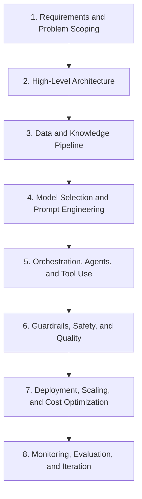

| Step | Focus |
|---|---|
| 1. Requirements and Problem Scoping | Functional requirements, non-functional requirements, and explicitly what is **out of scope** |
| 2. High-Level Architecture | Sketch the major components, how they connect, then reason about optimizations |
| 3. Data and Knowledge Pipeline | Does the problem need external/domain data? How is it collected, stored, retrieved? |
| 4. Model Selection and Prompt Engineering | Which model to use (or build), and how to shape context/prompts for it |
| 5. Orchestration, Agents, and Tool Use | How components/agents/tools are coordinated to fulfill a request |
| 6. Guardrails, Safety, and Quality | Checks that keep outputs safe, correct, and on-policy |
| 7. Deployment, Scaling, and Cost Optimization | How the system is served in production, and at what cost |
| 8. Monitoring, Evaluation, and Iteration | How you observe the live system and keep improving it |

> [!info]+ Interview questions covered
> - How would you approach designing a large AI system (e.g., "Design ChatGPT")?
> - What is a good general framework/decomposition for an AI system design interview question?

### Step 1 in detail: Requirements and Problem Scoping

This is the first step, and the tutor stresses that it has two parts:

- **Requirements**: split into **functional requirements** (what the system must actually do) and **non-functional requirements** (constraints like latency, scale, cost, reliability).
- **Problem scoping**: explicitly stating what you are putting **out of scope** for this particular problem. According to the tutor, defining the out-of-scope boundary is *more important* than the requirements themselves — it's what keeps the design from ballooning into an unbounded problem.

### Step 2 in detail: High-Level Architecture

Once requirements and scope are fixed, the next step is to sketch, at a high level, which pieces you're going to build and how they'll connect to each other — before worrying about optimization. Only after the rough shape of the system is in place do you start reasoning about how to optimize it.

From there, the framework flows naturally into the remaining steps: if the problem demands external data or domain knowledge, you build a **data and knowledge pipeline** (step 3); once that's in place, you address **model selection** — which could be as simple as using an already-available model — and how to build the **context/prompt** for it (step 4). The rest of the course will go layer by layer through orchestration, guardrails, deployment, and monitoring (steps 5–8) using this same lens.

### You don't need to master every layer

An important caveat the tutor gives up front: going through all eight steps does **not** mean an individual engineer needs deep expertise in every layer. He draws an analogy to traditional software roles — a backend engineer isn't expected to have deep knowledge of iOS or Android internals, yet backend, iOS, and Android all sit inside the same overall system design. Similarly, for an AI system, you're expected to understand how all eight steps fit together and influence each other, without necessarily being a specialist in each one (e.g., data pipelines, RLHF, or serving infrastructure independently).

This framing sets up the rest of the lecture: each of the following sections picks one of these eight steps and works through it in depth for the specific case of designing ChatGPT.


## Requirements and Problem Scoping: Mapping the ChatGPT Request Flow

### Why think cross-functionally before you design anything

Before drawing a single box on an architecture diagram, the tutor makes a broader point about *how* to approach any system design problem — interview or real project.

The instinct most engineers have is to stay inside their own lane: a backend engineer reasons about servers and databases, an Android engineer reasons about the UI layer, and neither bothers to understand what the other is doing. That instinct is wrong for system design. Even if you are a backend engineer and will never touch the iOS/Android code, you should still be able to reason about what is happening at *every* layer of the system — the client, the network hop, the server, and (in an AI product) the model itself. You don't need to be able to code every layer, but you need to understand what each layer is responsible for and where its costs and bottlenecks live.

This matters concretely: when you use a coding agent (Copilot, Cursor, Codex, Claude Code) to write code in an unfamiliar language or stack, strong architectural fundamentals let you direct the agent effectively even without deep language-specific expertise. The trick is to first explore what *language-specific concurrency/architecture primitives* exist — for example:

| Language | Concurrency primitive |
|---|---|
| Go | goroutines, channels |
| Kotlin | coroutines |
| Python | threads, thread pools |
| Java | thread pools |

Once you know the idiom a language uses for concurrency, you can reason about — and direct an agent to build — a correct architecture in that language, even if you've never written a line of it yourself. This same "understand every layer, then reason from first principles" mindset is exactly what this lecture will apply to designing a ChatGPT-like system end to end.

> [!info]+ Interview questions covered
> - How would you approach an AI system design interview if you don't know the full stack?
> - Why is cross-functional system understanding important even if you specialize in one layer?

### The 8-step agenda for designing ChatGPT end to end

The lecture is structured around eight sequential design steps, each of which will get its own deep dive in later parts of the course:

1. **Requirements and Problem Scoping** — what the system must do, and its constraints (this section)
2. **High-Level Architecture**
3. **Data and Knowledge Pipeline**
4. **Model Selection and Prompt Engineering**
5. **Orchestration, Agents, and Tool Use**
6. **Guardrails, Safety, and Quality**
7. **Deployment, Scaling, and Cost Optimization**
8. **Monitoring, Evaluation, and Iteration**

This mirrors how you'd tackle *any* AI system design interview or real project: scope the problem first, then architect, then worry about data, models, orchestration, safety, and finally deployment and iteration — in roughly that order.

### The basic end-to-end request flow

Before listing functional requirements, the tutor grounds everything in the simplest possible flow of a ChatGPT-like product — a diagram with three boxes: **User**, **Chat UI browser**, **API server**, and **Model on GPU**.

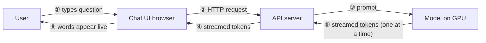

Walking through it step by step:

1. The **user types a question** into the chat UI — this could be a browser, an iOS app, an Android app, whatever the client happens to be.
2. The client sends an **HTTP request** to the **API server**.
3. The API server doesn't forward the user's raw text as-is — it **constructs a prompt** by attaching a **system prompt** to the user's question (more on this below), and sends that prompt onward.
4. Because the API server is typically a general-purpose machine (hosted on AWS or any cloud provider) **without a GPU**, the actual model lives on a **separate GPU server**. The API server calls out to that GPU machine.
5. The model, running on the GPU, **generates tokens one at a time** and **streams** them back to the API server as they're produced.
6. The API server relays those streamed tokens back to the chat UI, where the **words appear live** to the user — the familiar token-by-token "typing" effect you see in ChatGPT.

### Why the API server and the model live on different machines

A **server**, in the tutor's framing, is simply *any machine you can reach over the network via an IP address or URL* — "if a machine is there and you can connect with that machine, you can call that machine a server, because it's serving you from anywhere." That's why the API server and the GPU inference machine are drawn as two distinct boxes: the API server is a general web server, but production-grade LLMs need dedicated GPU hardware that a typical API server doesn't have, so inference gets pushed onto its own GPU-backed machine that the API server calls into.

### System prompts and prompt construction

The step that's easy to skip over — but is one of this section's key concepts — is what happens *inside* the API server before the request ever reaches the model.

The API server takes the user's literal question (e.g. "What is reflection?" or "What is a programming language?") and **attaches a system prompt** to it before forwarding anything to the model. A system prompt is an instruction that steers the model's behavior regardless of what the user asked — for example: *"You are a polite tutor/assistant. Answer politely. If you don't know the answer, say you don't know."*

This is **prompt construction**: the final prompt sent to the model is not just the user's text, it's `system prompt + user's question` (and, in later lectures, conversation history, retrieved context, and tool definitions get folded in too). The model's tone, refusal behavior, and format all get shaped by this system prompt, which is why it lives server-side rather than being something the client sends.

> [!info]+ Interview questions covered
> - What is a system prompt, and why is it attached on the server rather than sent by the client?
> - Where in the request path does "prompt construction" actually happen?
> - What does a minimal end-to-end request flow for an LLM chat product look like?

### Which arrow in the diagram is the slowest?

With the six arrows numbered as above, the tutor poses this as a quiz: **of the six arrows in this diagram, which one is the slowest?**

The reasoning process is the actual lesson here, not just the answer:

- Arrows ①–④ are cheap: typing text, making an HTTP request, and attaching a system prompt string are all trivial, low-latency operations. A student initially guessed arrow ④ (or a nearby one) might be slow, but the tutor rules that out — string concatenation and simple network calls are not where the time goes.
- The real bottleneck is arrow ⑤/⑥: **the model generating tokens on the GPU**. The tutor asks the class: *how many tokens does the model generate at a time?* The answer is **one**. This is the crux of it — token generation is inherently **sequential and autoregressive**: to produce token *t+1*, the model needs token *t*. You cannot parallelize this the way you can parallelize reading/ingesting input tokens.
- A student sharpens this further by asking: *what's slower — reading a token, or generating a token?* The answer is **generating**. Reading/processing the input prompt (the "prefill" phase) can be done largely in parallel across all input tokens in a single forward pass. Generating the output, one token per forward pass, cannot.

$$
\text{Total response latency} \approx t_{\text{network}} + t_{\text{prefill}} + (\text{output tokens}) \times t_{\text{per-token decode}}
$$

Since network and prefill are comparatively small and fixed, the **dominant term as responses get longer is the per-token decode cost**, repeated once for every output token. This single observation — that token generation, not network transfer, is the slowest link in the chain — is exactly why LLM inference optimization (KV caching, continuous batching, speculative decoding) becomes a major topic later in this course, and why metrics like **Time to First Token (TTFT)** and **token streaming rate** (tokens/sec delivered to the user) are the metrics that actually matter for a ChatGPT-like product, rather than raw HTTP round-trip time.

> [!info]+ Interview questions covered
> - Why is token generation the slowest step in an LLM request/response cycle?
> - What is the difference between the prefill phase and the decode phase, and why does it matter for latency?
> - What is Time to First Token (TTFT), and why is it tracked separately from total response time?
> - Why can't token generation simply be parallelized the way input processing can?

### Functional requirements: where the next step picks up

Having grounded the flow, the tutor begins listing **Functional Requirements** for the system — the first one introduced is simply:

- **Ask questions via chat**

This is the opening line of a longer functional/non-functional requirements list (latency targets, streaming behavior, multi-turn conversation support, etc.) that gets built out fully in the next part of the lecture. The key takeaway to carry forward: before architecting anything, you scope *what the system must do* (functional requirements) and *what qualities it must have* (non-functional requirements like latency, throughput, and cost) — and you do that scoping with a clear mental model of the request flow you just walked through, so that every requirement can be pinned to a specific arrow in the diagram.

> [!info]+ Interview questions covered
> - What's the difference between functional and non-functional requirements for an LLM-powered chat product?
> - Why should requirements gathering happen only after you understand the basic request flow?


## Non-Functional Requirements and Back-of-the-Envelope Capacity Math

Once the functional shape of the product is settled, the interview conversation shifts to a harder question: *what does "good" actually mean, numerically?* This section covers how to derive functional requirements from a fresh-user mental model, how to turn vague quality expectations ("it should feel fast", "it should be reliable") into concrete non-functional targets, and how to walk from a raw parameter count all the way to a GPU count and a dollar cost per request — the kind of quantitative reasoning that separates a strong system-design answer from a hand-wavy one.

### Functional Requirements: Think Like a Fresh Install

**Why it matters:** in an interview you need a repeatable method for generating requirements, not a memorized list. A reliable trick is to imagine uninstalling the app and reinstalling it as a brand-new user — walk through exactly what that user does, in order, and each step becomes a functional requirement.

Applying that lens to a ChatGPT-like product:

- **Login is deliberately skipped.** Authentication is a already-solved problem and rarely what an AI system design interviewer wants to probe. It's fine to mention it in passing ("okay, I'll assume the user logs in") and then move on — but read the room: ask whether the interviewer wants to go deeper here before spending time on it.
- **Ask questions via chat** — the baseline: type a message, get a response.
- **Multi-turn chat** — continue in the same thread and have the model condition its answer on the *entire* conversation so far. (Cross-thread memory — carrying context across separate conversations — is explicitly called out as a topic for a dedicated future "AI memory agent" class, not this one.)
- **Streaming** — tokens appear progressively as they're generated on the server, rather than the user waiting for the full response before seeing anything.

Multimodal capabilities — attaching a PDF, an image, asking questions about them — are intentionally **left out** of this requirements list. Not because they're unimportant, but because each has its own dedicated class (PDF handling, image generation like Midjourney, video generation like Sora). Leaving them out of one lecture's scope isn't an oversight; it's deliberate scoping, and it's fine to say so explicitly to an interviewer.

This whole flow maps onto the system's high-level request path:

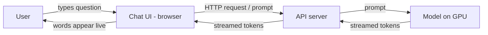

> [!info]+ Interview questions covered
> - How do you derive functional requirements for an AI product like ChatGPT?
> - What functional requirements would you explicitly scope *out* of a ChatGPT system design, and why?
> - What is multi-turn chat, and how is it different from cross-thread memory?

### Functional vs. Non-Functional: Who Notices?

**Why it matters:** functional and non-functional requirements answer two different questions, and conflating them is a common interview mistake.

- **Functional** = what a *non-technical* user can observe directly: "can I chat or not?" If the app lets them type and get an answer, the functional bar is met.
- **Non-functional** = what a *technical* user (or the engineer building it) cares about: *why* is this slow, is there autoscaling, is there inference optimization on the serving side? These are quality-of-service properties layered on top of working functionality.

Once functional requirements are satisfied, the design conversation moves to optimizing along these non-functional axes.

### The Non-Functional Targets Table

The lecture sets up four concrete targets, each with a number and an explicit justification — this "why this number" column is what interviewers are really listening for, not the number itself:

| Requirement | Target | Why this number |
|---|---|---|
| Time to first word/token (TTFT) | Under 1 second | Hosted model APIs typically deliver the first token in 200–500 ms; the remaining budget covers network and server hops |
| Generation per user | At or above 5–7 tokens/sec | Matches general human reading speed — the floor below which a reader has to stop and wait |
| Availability | 99.9% | Works out to ~43.2 minutes of allowed downtime per month |
| Safety | Intercept tokens both directions | Every token going *into* the model and every token coming *out* to the user must be checked |

Each row is examined in more depth below.

### Time to First Token (TTFT)

**Why it matters:** streaming makes the *first* token the moment users perceive as "the system responded" — even though the full answer isn't done. If that first token is slow, the product feels broken regardless of how fast generation is afterward.

The target is **under 1 second**, and it decomposes into a chain of hops from the moment the user hits enter to the moment the first token reaches their screen:

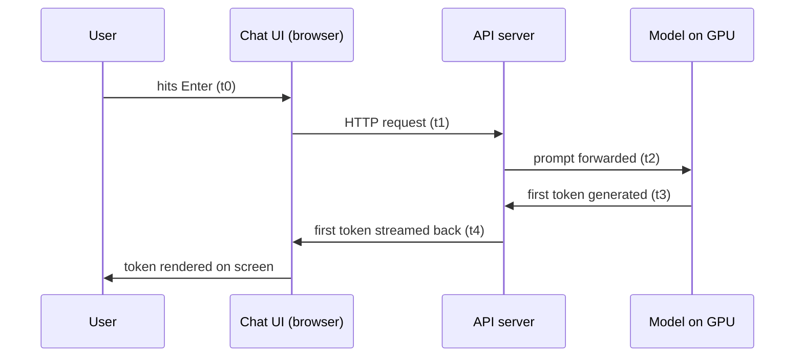

Summing $t_1 + t_2 + t_3 + t_4$ gives the total time-to-first-token. Hosted model APIs (OpenRouter, Llama-hosted endpoints, etc.) contribute **200–500 ms** of that budget purely for the model's own first-token latency; the rest of the under-1-second target is headroom for the network and server-side hops around it. This 200–500 ms figure was already established in a previous class and is a useful number to simply remember, since it recurs constantly in serving-latency discussions.

> [!info]+ Interview questions covered
> - What is time to first token (TTFT), and what is a reasonable target for it?
> - What contributes to TTFT besides the model's own generation latency?

### Generation Speed: Tokens per Second

**Why it matters:** once the first token arrives, the *rate* of subsequent tokens determines whether reading feels continuous or stuttery. The target has to be anchored to something objective — human reading speed — rather than an arbitrary number.

The target: **each user should get a minimum of 5–7 tokens/sec.** If the server streams at or above this rate, a human can read continuously without ever having to pause and wait for the next chunk of text. Below this floor, the reader outpaces the stream and has to stop and wait — breaking the experience. This is explicitly the **bare minimum**; systems should aim to generate faster than this whenever possible, but 5–7 tok/s is the line below which the product feels laggy.

(Note: "inference" and "prediction" are used interchangeably in this context — when the lecture says "inference," it means the model producing its next-token prediction.)

> [!info]+ Interview questions covered
> - What tokens/sec generation rate should a chat product target, and why is that the right number?
> - Why is human reading speed a meaningful anchor for a non-functional requirement?

### Availability SLA

**Why it matters:** "high availability" by itself is meaningless in an interview unless you can translate a percentage into an actual downtime budget — that's the calculation an interviewer wants to see you do live.

The example target chosen is **99.9%** (deliberately picked over 99.8% or a flat 99%, to make the arithmetic instructive). The conversion:

$$
\text{Allowed downtime} = (1 - 0.999) \times \text{total minutes in period}
$$

For a 30-day month ($30 \times 24 \times 60 = 43{,}200$ minutes):

$$
0.001 \times 43{,}200 \text{ min} = 43.2 \text{ min/month}
$$

That works out to roughly **1 minute of allowed downtime per day** at scale — a small, concrete number that's easy to reason about and easy to communicate to stakeholders. The expectation, of course, is that real production targets should aim *higher* than 99.9%; this number is chosen purely to illustrate the math.

#### Status Pages: How Companies Report This in Practice

Every major AI company publishes uptime at a public `status.<company>.com`-style domain (e.g., `status.claude.com`). These pages are the practical, real-world version of the SLA math above — they show day-by-day uptime percentages and incident history, and checking them is the standard first move to determine whether a problem is on the provider's side or your own.

Walking through a live example on Claude's status page: a day's uptime showing roughly **98.96%** (call it ~99%) scales the same 43.2-minute formula down proportionally to about **10–12 minutes of downtime that day**. On other days uptime dips further, to 98% or even 97% — and it's worth actively checking *why* on days like that, since "down" concretely means the service stopped responding to chat requests. Every company maintains a page like this, and habitually checking it (uptime charts, incident banners, historical trends) is a good practice for any engineer operating a hosted LLM dependency.

> [!info]+ Interview questions covered
> - How do you convert an availability SLA percentage (e.g., 99.9%) into an allowed downtime budget?
> - How do real companies expose and communicate availability to users?

### Safety as a Non-Functional Requirement

**Why it matters:** safety isn't just a policy add-on — it's a system-level requirement that sits directly in the request/response path, on *both* sides of the model.

The system must **intercept tokens flowing in both directions**:

- Tokens **coming into** the server from the user (the prompt) — checked before being sent to the model.
- Tokens **going out** from the model to the user (the response) — checked before being delivered.

Both directions get a check; this is described as a mandatory design point, not optional. (How this token-by-token interception interacts with token-by-token *streaming* generation — since safety needs to inspect content the model is still producing — is flagged as a deeper topic to be covered later rather than resolved here.)

> [!info]+ Interview questions covered
> - Why does safety filtering need to happen on both the input and output token streams?

### Scale Math, Step by Step: From Parameter Count to GPU Count and Cost

**Why it matters:** this is the calculation that turns "we're serving a 7B model" into "we need N GPUs and it costs $X per request" — the exact kind of quantitative capacity-planning chain interviewers want to see you construct from scratch, not recite.

The example uses a **7 billion parameter model in FP16 precision**. The point of this exercise is explicitly *not* to memorize the resulting numbers, but to internalize the calculation method, since the same chain of reasoning applies regardless of which model or traffic numbers an interviewer hands you.

#### Step 1 — Model memory footprint

FP16 means each parameter takes **2 bytes**. For 7 billion parameters:

$$
7{,}000{,}000{,}000 \times 2 \text{ bytes} = 14 \text{ GB}
$$

So **14 GB of memory** is needed just to load the model — before any KV cache, activations, or batching overhead.

#### Step 2 — Traffic assumption

For simplicity, assume **10,000,000 (10 million) requests per day**. This can be derived top-down (just assumed) or bottom-up from a user model: e.g., ~200,000 daily active users × ~5 requests/user/day on average ≈ 10 million/day (acknowledging some users send 0–1 requests while power users send 20–30, and it averages out to this round number).

#### Step 3 — Average and peak request rate

```console
requests/day                                    10,000,000
seconds/day                    24 x 3,600 = 86,400
average rate      10,000,000 / 86,400 = ~116 req/s
peak (3x rule)                 116 x 3 = ~350 req/s
```

- Seconds per day: $24 \times 3{,}600 = 86{,}400$.
- Average rate: $10{,}000{,}000 / 86{,}400 \approx 116$ requests/sec hitting the server.
- If a single server can only handle, say, 20 requests (this is highly dependent on language/runtime — Python uses noticeably more memory than Go, which can serve the same load in a fraction of that footprint), sustaining 116 req/s would require roughly **6 servers**.
- **Peak load — the "3x rule":** it's a standard convention to size infrastructure for **3× the average rate** to absorb traffic spikes (e.g., a morning surge when everyone opens the chat app at once). That gives $116 \times 3 \approx 350$ requests/sec at peak.

#### Step 4 — Answer length and generation time

```console
answer length                                   500 tokens
(~375 words)
gen time/answer   500 tok / 100 tok/s = 5 s
```

- A typical ChatGPT-style answer is assumed to be **500 tokens**, roughly "one page" of text — the length you get by default unless the user explicitly asks for something shorter or more detailed.
- Using the previously-established token-to-word ratio of **4:3 (0.75 words per token)**, 500 tokens ≈ **375 words**.
- Assuming the model streams at 100 tokens/sec for a single request (note: this is the model's raw per-stream throughput, distinct from the 5–7 tok/s *minimum* target discussed earlier), generating a full 500-token answer takes:

$$
\frac{500 \text{ tok}}{100 \text{ tok/s}} = 5 \text{ s per answer}
$$

#### Step 5 — Concurrency and aggregate throughput at peak

```console
concurrent at peak             350 x 5 = 1,750 streams
aggregate tokens at peak   350 x 500 = 175,000 tok/s
```

- If 350 requests arrive per second and each one occupies the server for 5 seconds (its full generation time), then at any instant there are:

$$
350 \times 5 = 1{,}750 \text{ concurrent streams}
$$

- The aggregate token-generation throughput the system must sustain at peak:

$$
350 \text{ req/s} \times 500 \text{ tok/req} = 175{,}000 \text{ tokens/sec}
$$

#### Step 6 — GPU count needed

```console
GPUs at peak (2,000 tok/s per H100)
                    175,000 / 2,000 = ~88 H100s
```

Assuming a single H100 GPU can sustain **2,000 tokens/sec** for this model:

$$
\frac{175{,}000 \text{ tok/s}}{2{,}000 \text{ tok/s per H100}} \approx 88 \text{ H100 GPUs}
$$

#### Step 7 — Daily token volume and cost

```console
daily tokens        10,000,000 x 500 = 5,000,000,000
daily GPU cost      88 GPU x 24 hr x $3 = ~$6,336
per request         $6,336 / 10,000,000 = ~$0.0006
```

- **Daily tokens generated:** $10{,}000{,}000 \text{ req} \times 500 \text{ tok/req} = 5{,}000{,}000{,}000$ (5 billion) tokens/day.
- **Daily GPU cost:** running ~88 H100s 24 hours a day at an assumed **$3/GPU-hour**:

$$
88 \times 24 \times \$3 \approx \$6{,}336 \text{ per day}
$$

- **Cost per request:**

$$
\frac{\$6{,}336}{10{,}000{,}000 \text{ requests}} \approx \$0.0006 \text{ per request}
$$

This is the full chain: parameter count → memory footprint, and traffic assumption → request rate → peak load → concurrency → aggregate token throughput → GPU count → infra cost → per-request cost. Every step is a simple arithmetic operation, but chaining them correctly, in order, with the right justification at each hop, is exactly what a strong system-design answer looks like.

> [!info]+ Interview questions covered
> - Given a model's parameter count and precision, how do you estimate its memory footprint?
> - Given a daily request volume, how do you derive average and peak requests-per-second?
> - Why is a "3x peak rule" a reasonable convention for capacity planning?
> - How do you go from request rate and answer length to the number of GPUs needed?
> - How do you convert GPU count and hourly cost into a per-request serving cost?


## Peak Traffic, Per-User Throughput, and Generation Time Per Answer

Continuing the capacity-planning table, this section fills in three linked numbers: how much traffic actually hits the server at peak, how fast one user's tokens actually stream out, and — from those two — how long a single request really occupies a GPU. The reasoning matters more than the arithmetic: each number is picked to be a *safe, standard* assumption, not a guess.

### Why peak = 3x average (not 10x)

Provisioning for the **average** request rate (~116 req/s, from `requests/day ÷ seconds/day`) would be wrong — traffic isn't uniform across the day, so a server sized for the average would fall over the moment load concentrates in a burst.

The standard assumption used here is a **3x peak multiplier**: `peak (3x rule) = 116 × 3 ≈ 350 req/s`. This is deliberately a *general-purpose* default, not a number for extraordinary events. The tutor contrasts it with a real spike case: on an IPL evening, a food-delivery app like Swiggy might see demand jump **10x** as everyone orders food at once. That kind of event-driven multiplier is a special case you'd plan for separately (e.g., pre-scaling for a product launch or a known live event) — for everyday capacity planning of a ChatGPT-like service, 3x over the average is the standard rule of thumb.

> [!info]+ Interview questions covered
> - Why do you provision for peak traffic instead of average traffic?
> - What is the "3x rule" for peak traffic multiplier, and when would you use a different multiplier?

### Per-user token throughput: ~100 tokens/second

The next input is **how fast the LLM streams tokens to one user**, on the reference GPU (H100). This is explicitly a **per-user** number, not the server's total output — a single H100 server might emit something like 10,000 tokens/second in aggregate, split across many concurrent users, but any *one* user's stream is what determines how long their answer takes.

The model could technically generate closer to **120 tokens/second** for a single user in isolation. But once real serving overhead — networking, the serving stack, sharing the GPU across concurrent requests — is factored in, the effective sustained rate averages out to roughly **100 tokens/second per user**. That rounded, slightly conservative number (100 tok/s) is what feeds the rest of the capacity math.

### Generation time per answer

With a per-user throughput fixed, generation time per answer is just:

$$
\text{gen time / answer} = \frac{\text{answer length (tokens)}}{\text{per-user throughput (tok/s)}}
$$

Plugging in the assumed answer length of 500 tokens (~375 words):

$$
\text{gen time / answer} = \frac{500 \text{ tok}}{100 \text{ tok/s}} = 5 \text{ s}
$$

So for **one user**, a full answer takes 5 seconds of generation on the server.

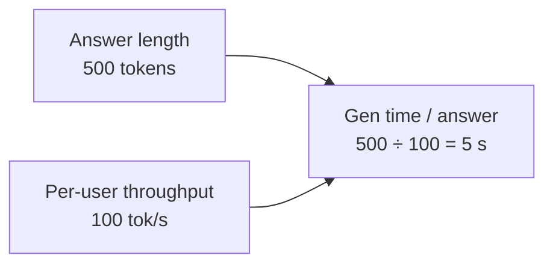

> [!info]+ Interview questions covered
> - What is "per-user token throughput," and how is it different from a server's aggregate tokens/second?
> - How do you compute generation time per answer from answer length and per-user throughput?

### Streaming hides latency from the user, not from the server

A natural objection: if generation takes 5 seconds, does the user actually wait 5 seconds staring at a blank screen? No — because tokens are **streamed** as they're produced, the user starts seeing the first token almost immediately and reads the rest as it arrives, rather than waiting for the whole answer.

But this is a UX effect only. From the **server's** point of view, that request still occupies a generation slot for the *entire* 5-second window — the GPU doesn't get that capacity back until the last token of the answer is produced. Capacity planning has to be done against this occupied-for-5-seconds reality, not against the user's perceived latency.

### Concurrent streams at peak: the sliding-window insight

This is the key result the tutor flags as "very important": if requests arrive at the peak rate of ~350 req/s, and each one occupies the server for 5 seconds, then at any given instant the server isn't just handling the newest 350 — it's simultaneously running **every request that arrived in the last 5 seconds**, because none of them have finished yet.

$$
\text{concurrent at peak} = \text{peak rate} \times \text{gen time / answer} = 350 \times 5 = 1{,}750 \text{ streams}
$$

Think of it as a sliding 5-second window: each new second, ~350 new streams start while the ~350 streams that started 5 seconds ago finish and roll off — so the steady-state count of simultaneously active generations holds at **1,750**, not 350.

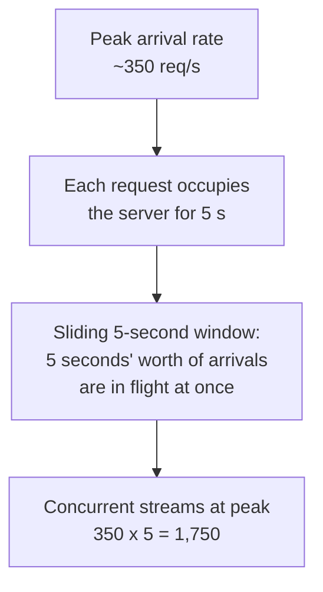

This 1,750-stream figure — not the 350 req/s arrival rate — is the number that actually drives how much aggregate GPU throughput and how many GPUs the server fleet needs at peak, which the next part of the table builds on.

> [!info]+ Interview questions covered
> - Why does streaming reduce perceived latency but not reduce server-side resource occupancy?
> - How do you compute the number of concurrent request streams a server must support at peak traffic, and why is it larger than the raw peak request rate?


## From Peak Request Rate to GPU Fleet Sizing: Concurrency, Token Throughput, and KV Cache Memory

This section continues the back-of-envelope capacity-planning table from the previous section and pushes it one step further: from "how many requests arrive per second" to "how many GPUs do I actually need," and *why* that number is much lower than a naive GPU spec sheet would suggest.

### Why request rate alone doesn't tell you server load

Knowing the peak arrival rate (350 requests/second, from the earlier 3x-average rule) is not enough to size hardware. A request isn't instantaneous — it occupies the server for the *entire* time it takes to stream out an answer. So the real question the tutor poses is: **at any given instant, how many requests are simultaneously being served?**

- Answer length = 500 tokens
- Generation time per answer = 5 seconds
- New requests arriving = 350 per second

Since each request stays "on the server" for 5 seconds, the requests from the *last 5 seconds* are all still in flight at any given moment — not just the ones that arrived in the current second.

$$
\text{concurrent at peak} = \text{peak rate} \times \text{time per request} = 350 \times 5 = 1{,}750 \text{ concurrent streams}
$$

This is a **sliding window**: every new second adds 350 fresh requests to the window and the oldest second's 350 requests drop out once they finish. At steady state, the window always holds 1,750 concurrent streams.

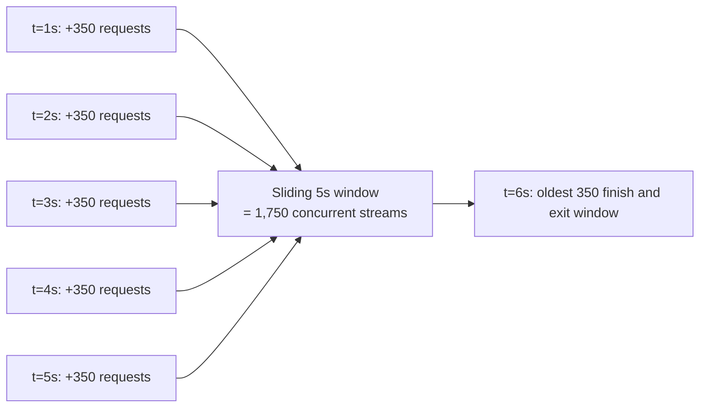

> [!info]+ Interview questions covered
> - How do you go from a peak *request rate* to the number of *concurrent* requests a server must handle?
> - What is meant by a "sliding window" of concurrency in LLM serving?

### Aggregate token throughput at peak

The GPU fleet doesn't care about "requests" — it cares about **tokens it must generate per second**. This can be derived two equivalent ways from the same numbers:

- **Per-stream rate**: 500 tokens over 5 seconds = 100 tokens/second per stream. With 1,750 concurrent streams: \(1{,}750 \times 100 = 175{,}000\) tok/s.
- **Peak rate × answer length**: \(350 \times 500 = 175{,}000\) tok/s.

$$
\text{aggregate tokens at peak} = 175{,}000 \text{ tokens/second}
$$

This aggregate number — not the request count — is what determines how many GPUs are required.

### Sizing the GPU fleet

Continuing the table from the previous section with these two new rows:

| Quantity | Value |
|---|---|
| Requests/day | 10,000,000 |
| Peak (3x rule) | ~350 req/s |
| Answer length | 500 tokens |
| Gen time/answer | 5 s |
| **Concurrent at peak** | 350 × 5 = **1,750 streams** |
| **Aggregate tokens at peak** | 350 × 500 = **175,000 tok/s** |
| Daily tokens | 5,000,000,000 |
| **GPUs at peak** (2,000 tok/s/H100) | 175,000 / 2,000 ≈ **88 H100s** |
| Daily GPU cost | ~$6,336 |
| Per request | ~$0.0006 |
| Per month | ~$190,080 |

> [!info]+ Interview questions covered
> - How do you convert "tokens needed per second" into the number of GPUs required to serve peak load?
> - How do you estimate infra cost per request / per month for an LLM product?

### Why only 2,000 tok/s per H100, not the theoretical 10,000?

An H100 can theoretically be pushed to generate **up to ~10,000 tokens/second**, but only once serving-side inference optimizations are applied: speculative decoding, continuous batching, KV cache, page attention, and flash attention (each covered in later sections). Without them, raw GPU compute is far more limited.

The reason the capacity table uses a conservative **2,000 tok/s per H100** instead of the theoretical 10,000 comes down to **memory**, not compute:

- An H100 has **80 GB** of memory.
- The model weights themselves need only **~14 GB**.
- Naively, that leaves room to load **~5 copies of the model** on one GPU.

But hitting high sustained throughput requires a large **KV cache** — and that cache must also live in GPU memory. In practice, roughly **50–60% of the GPU's memory** has to be reserved for the KV cache rather than used to pack in more model replicas, which caps how much throughput a single H100 can realistically sustain. This is why the capacity plan discounts the theoretical 10,000 tok/s down to a realistic 2,000 tok/s/H100.

This raises the natural next question the tutor poses to set up the following section: **why does the KV cache have to sit on the GPU itself — why can't it be offloaded to a regular, separate server?**

> [!info]+ Interview questions covered
> - Why can't you just run more model replicas on a GPU instead of reserving memory for the KV cache?
> - Why does KV cache memory reservation lower the realistic tokens/second you can plan for on an H100, compared to its theoretical peak?


## GPU Capacity Planning: From KV Cache Placement to a Full Cost Estimate

### Why the KV cache has to live on the same GPU as the model

Before finishing the capacity math, the tutor addresses a question interviewers like to ask: **why not keep the KV cache on a separate, cheaper server instead of eating into precious GPU memory?**

The reasoning, motivated first:

- The KV cache exists to avoid recomputing the attention matrices for every previous token on every new step.
- If the cache lived on a normal (non-GPU) server, every generation step would need a round trip to fetch/write that cache before the attention calculation could run.
- Too many round trips for a calculation this large directly add latency — the whole reason the cache exists in the first place would be undermined.

**Conclusion:** the KV cache must sit as physically close as possible to where the attention computation happens — i.e., on the *same* GPU as the model weights. This is why a single H100's 80 GB of memory is not fully available for model weights: it is split between two purposes.

$$
\text{GPU memory} = \underbrace{\text{model weights}}_{\sim 40\%-60\%} + \underbrace{\text{KV cache}}_{\sim 60\%-40\%}
$$

The tutor gives **40–60% for the KV cache** (and correspondingly 60–40% for the model) as the standard rule of thumb to remember for this kind of system-design discussion. In this worked example, one model is assumed per GPU — though in practice, depending on model size vs. KV cache footprint, multiple smaller models could be packed onto a single GPU.

> [!info]+ Interview questions covered
> - Why must the KV cache be co-located with the model on the same GPU rather than a separate server?
> - How is a GPU's memory split between model weights and KV cache?

### Recap: the full back-of-envelope capacity and cost calculation

This is the completed version of the capacity/cost estimate built up earlier in the lecture — request volume → peak load → token throughput → GPU count → cost:

| Step | Calculation | Result |
|---|---|---|
| Requests/day | given | 10,000,000 |
| Seconds/day | $24 \times 3{,}600$ | 86,400 |
| Average rate | $10{,}000{,}000 / 86{,}400$ | ~116 req/s |
| Peak rate (3× rule) | $116 \times 3$ | ~350 req/s |
| Answer length | ~375 words | 500 tokens |
| Gen time / answer | $500 \text{ tok} / 100 \text{ tok/s}$ | 5 s |
| Concurrent streams at peak | $350 \times 5$ | 1,750 streams |
| Aggregate tokens at peak | $350 \times 500$ | 175,000 tok/s |
| **GPUs at peak** | $175{,}000 / 2{,}000$ tok/s per H100 | **~88 H100s** |
| Daily tokens | $10{,}000{,}000 \times 500$ | 5,000,000,000 |
| Daily GPU cost | $88 \times 24 \text{ hr} \times \$3/\text{hr}$ | ~\$6,336 |
| Cost per request | $\$6{,}336 / 10{,}000{,}000$ | ~\$0.0006 |
| Cost per month | $\$6{,}336 \times 30$ | ~\$190,080 |

The key new figure this section derives is **GPUs at peak: ~88 H100s**, obtained by dividing the aggregate token throughput required (175,000 tok/s) by a single H100's serving throughput (2,000 tok/s, a number consistent with 100 tok/s per stream × ~20 concurrent streams per GPU under continuous batching). From there, the rest of the table follows mechanically:

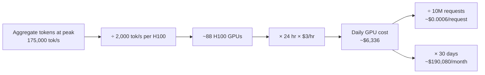

### Where the $3/GPU-hour figure comes from

The cost assumption isn't arbitrary — it's grounded in real pricing dynamics:

- Renting a **single** GPU with no negotiating leverage costs closer to **$4/hour**.
- At larger scale — renting many GPUs — providers will negotiate down, landing around **$2–2.5/hour** to **$3/hour**.
- **$3/hour** is used here as the standard number for this kind of system-design exercise.
- GPU pricing is volatile and shifts due to geopolitical factors (e.g., US–China dynamics affecting chip supply), so this figure should be treated as an order-of-magnitude anchor, not a fixed constant.

### Autoscaling: a solved problem, not a design challenge

The tutor is explicit that **autoscaling is no longer a hard engineering problem** to bring up as a differentiator in a system design interview:

- The ~88 GPUs computed above must run continuously, 24/7, to handle the average/steady load.
- Scaling up beyond that baseline to absorb demand spikes used to be a significant challenge.
- Today, every major cloud provider offers automatic autoscaling as essentially **a configuration setting** — not something that needs to be engineered from scratch.

> [!info]+ Interview questions covered
> - How do you size a GPU fleet from request volume, answer length, and per-GPU throughput?
> - How do you go from GPU count to daily/monthly serving cost?
> - Is autoscaling still a major design concern when serving an LLM product?


## From GPU Count to Unit Economics: What Does One ChatGPT Request Actually Cost?

Once you know *how many GPUs* you need at peak, the natural follow-up system-design question is: **what does that translate to in dollars — per day, per request, and per month?** This is where capacity planning turns into a cost model, which is exactly the kind of number an interviewer expects you to produce on the spot.

### Recap: the capacity numbers this section builds on

The calculation carries forward from the earlier capacity-planning pass (10M requests/day, ~375-word / 500-token answers, 100 tok/s generation speed, 3× peak multiplier, H100 throughput of 2,000 tok/s):

| Step | Formula | Result |
|---|---|---|
| Seconds/day | $24 \times 3{,}600$ | $86{,}400$ |
| Average rate | $10{,}000{,}000 / 86{,}400$ | $\approx 116$ req/s |
| Peak rate (3× rule) | $116 \times 3$ | $\approx 350$ req/s |
| Answer length | ~375 words | $500$ tokens |
| Generation time/answer | $500 / 100$ | $5$ s |
| Concurrent streams at peak | $350 \times 5$ | $1{,}750$ streams |
| Aggregate tokens/s at peak | $350 \times 500$ | $175{,}000$ tok/s |
| GPUs needed at peak | $175{,}000 / 2{,}000$ | $\approx 88$ H100s |

### Pricing the GPU: why $3/hour

The tutor pins the per-GPU-hour rate at **$3/GPU-hr** as the standard number to use in system-design interviews, but calls out that this is negotiable, not fixed:

- If you're renting a **single GPU**, expect to pay closer to **$4/hr** — no negotiating leverage.
- If you commit to **many GPUs** (bulk/enterprise contracts), you can negotiate down to **$2–$2.5/hr**.
- The going rate keeps shifting upward at the moment, driven by GPU demand pressure from the US/China AI race.

So $2–$4/hr is the real-world range; **$3/hr is the number to anchor on** in an interview unless told otherwise.

### Daily → per-request → per-month cost

With 88 GPUs running 24 hours/day at $3/GPU-hr:

$$
\text{Daily GPU cost} = 88 \times 24 \times 3 \approx \$6{,}336
$$

Dividing by the 10M requests served that day gives the **cost per request**:

$$
\text{Cost/request} = \frac{6{,}336}{10{,}000{,}000} \approx \$0.0006
$$

That's a fraction of a rupee (paisa-level) per request — vanishingly small per user interaction, which is *why* it's easy to give a chat product away for free at small scale but expensive to sustain at hundreds of millions of users.

Extrapolating the daily figure to a month:

$$
\text{Monthly GPU cost} = 6{,}336 \times 30 \approx \$190{,}080 \;(\approx \$200\text{k}, \approx \text{2 crore INR})
$$

> [!info]+ Interview questions covered
> - How do you go from a peak-GPU-count estimate to a daily/monthly dollar cost?
> - What's a reasonable $/GPU-hour assumption to use in a system-design interview, and why is it negotiable?
> - How do you compute cost-per-request for an LLM-serving system, and why is that number so small?

### Why "free" ChatGPT usage is actually a subsidy

This is the punchline the tutor draws out of the unit-economics math: every request — including ones from users on the **free tier** — still consumes real GPU-seconds that cost real money. If a user isn't paying a subscription, OpenAI is paying for their GPU usage out of pocket.

- That gap is covered by **investor capital**, not revenue.
- Investors are willing to fund this loss deliberately: they're betting on **building a usage habit** (the same way people now default to reaching for a coding agent like Claude Code or Codex) so that today's subsidized free users become tomorrow's paying, retained users or downstream revenue.
- This is framed as "how the real world works" for venture-funded AI products — burn cash now to lock in behavior, monetize later.
- The tutor's broader point: you can only use these AI tools *effectively* once you understand what's happening underneath them — which is the reason for grinding through this system-design math in the first place.

### Scaling the estimate up to OpenAI's real infrastructure spend

Having built the toy example (10M requests/day), the tutor poses the natural follow-up interview question: **how much does OpenAI actually spend on GPUs per day at real scale?**

- Estimated answer: **~$1 million/day**, just for GPU compute — equivalent to roughly **8–10 crore INR/day**.
- This figure excludes everything else in the stack — databases, other infrastructure, storage, networking, etc. — it's GPU cost alone.
- At that daily burn rate, building a comparable foundation-model company requires on the order of **$1 billion** in committed capital just to get started.

This scale is offered as the direct explanation for why no OpenAI-equivalent has emerged from India: no investor in that market currently has the risk appetite to commit ~$1B to bootstrap compute at this level, which is why the "why can't we build a ChatGPT-scale company here" question keeps coming back to capital availability rather than technical capability.

> [!info]+ Interview questions covered
> - Why is ChatGPT free-tier usage still costly to the provider, and how is that gap funded?
> - Roughly how much does OpenAI spend per day on GPU infrastructure alone, and what does that imply about the capital required to build a competing foundation-model company?


## Aggregate Cost Recap, the 3x Peak-Traffic Rule, and Scoping the Lecture

### Clarifying: aggregate cost, not per-user cost

Before moving forward, the tutor addresses a clarifying question from a student about the capacity/cost table built up in the previous section (10,000,000 requests/day → ~$190,080/month). The student asks whether that $190,080/month figure is the cost *per person*. It is not — it is the **aggregate cost across all users** of the product combined, not a per-individual number.

This distinction matters for interview framing: when you're asked to "estimate the cost of running a ChatGPT-like system," you're almost always being asked for the **aggregate infrastructure cost**, which you then optionally divide down to a per-request or per-user figure as a sanity check — not the other way around. Recall the full chain computed earlier:

| Quantity | Calculation | Result |
|---|---|---|
| Requests/day | given | 10,000,000 |
| Seconds/day | $24 \times 3{,}600$ | 86,400 |
| Average rate | $10{,}000{,}000 / 86{,}400$ | ~116 req/s |
| Peak rate (3x rule) | $116 \times 3$ | ~350 req/s |
| Answer length | ~375 words | 500 tokens |
| Gen time/answer | $500 \text{ tok} / 100 \text{ tok/s}$ | 5 s |
| Concurrent streams at peak | $350 \times 5$ | 1,750 streams |
| Aggregate tokens/s at peak | $350 \times 500$ | 175,000 tok/s |
| GPUs needed at peak | $175{,}000 / 2{,}000$ tok/s per H100 | ~88 H100s |
| Daily tokens | $10{,}000{,}000 \times 500$ | 5,000,000,000 |
| Daily GPU cost | $88 \times 24 \text{ hr} \times \$3$ | ~$6,336 |
| Cost per request | $\$6{,}336 / 10{,}000{,}000$ | ~$0.0006 |
| **Cost per month (aggregate)** | $\$6{,}336 \times 30$ | **~$190,080** |

The per-request figure (~$0.0006) is the number you'd use if someone specifically asks "what does it cost to serve one answer," but the headline infrastructure number a system-design interview is looking for is the aggregate monthly figure.

> [!info]+ Interview questions covered
> - When you compute total serving cost for an LLM product, are you reporting per-user cost or aggregate cost — and how do you convert between the two?

### The 3x rule for peak traffic

A student then asks: where does the "peak (3x rule)" line in the table actually come from — why multiply the average rate by 3?

The tutor motivates this with a real case study rather than stating it as an arbitrary constant.

#### Case study: Doubtnut

The tutor was the tech/product advisor for **Doubtnut**, one of the first AI companies in India (since 2017), an ed-tech product in the "ask-a-doubt" space: a user photographs an exam question and the product returns the answer. Doubtnut went on to raise more than ₹400 crore from investors while the tutor was advising it.

The operationally important observation from that experience: **traffic is not flat over time.** On a normal day, Doubtnut saw a baseline usage pattern. But around exam days, usage spiked drastically — up to **10x** the normal traffic — because everyone needed answers at the same time.

This generalizes beyond ed-tech: any consumer product has "event" days (exam day, a viral moment, a product launch, a holiday) where load is far higher than the daily average, and if your system is only provisioned for the average, it falls over exactly when it matters most.

#### Why 3x specifically

The tutor's rule of thumb, generalized from this kind of experience: for a typical general-purpose product, you should plan capacity assuming **peak traffic is about 3x the average traffic** — i.e., $\text{peak req/s} \approx 3 \times \text{average req/s}$. It is a heuristic safety margin for back-of-envelope capacity planning, not a universal physical law — some products (like Doubtnut on exam day) can spike far higher (10x), but "3x" is a reasonable default multiplier to reach for in an interview when no other information is given, and it's exactly the multiplier used earlier: $116 \text{ req/s} \times 3 = 350 \text{ req/s}$ at peak.

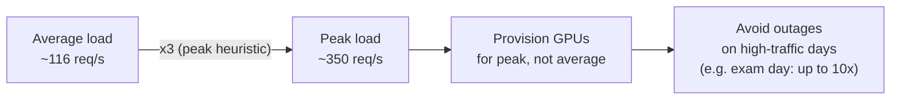

> [!info]+ Interview questions covered
> - Why do you provision infrastructure for peak load rather than average load?
> - What heuristic multiplier is commonly used to go from average to peak traffic when you don't have real traffic data?
> - Can you justify a capacity-planning assumption using a real-world example (e.g., traffic spikes on an exam day for an ed-tech app)?

### Can providers manipulate token accounting when billing users?

A related question comes up: since providers like ChatGPT or Claude control both the tokenizer and the metering pipeline, could they manipulate the token count used for billing?

The tutor's answer: **yes, technically they can** — nothing structurally prevents a provider from adjusting how tokens are counted or charged, since the provider fully controls both ends of that pipeline (the tokenizer, the metering, and the billing logic). He notes there have been real instances of this kind of thing surfacing — for example, seeing a message from a provider saying token usage was being reset "for this week" after what appeared to be a billing bug, which meant restarting experiments that had been running. The broader point for system design purposes: token accounting/billing is a trust boundary that sits entirely on the provider's side, so metering integrity (accurate, auditable token counting) is itself a design concern for a production LLM serving system, not just an implementation detail.

> [!info]+ Interview questions covered
> - Who controls token metering/billing in an LLM API, and what does that imply about trust and auditability?

### Scope boundaries of the lecture

Having finished the capacity/cost estimation walkthrough, the tutor explicitly marks a set of related but separate topics as **out of scope** for this particular session — each is substantial enough to warrant its own dedicated class later:

- **Retrieval over your documents** — i.e., RAG (retrieval-augmented generation) — kept out intentionally because there is a dedicated upcoming class on it.
- **Tool-using agents** — how a model decides to call tools/functions — also deferred to an upcoming class.
- **Cross-session memory** — how a system like ChatGPT remembers things about a user across sessions — deferred to a dedicated class that will go into detail on exactly how that memory works.
- **Images, audio, and videos** — i.e., multimodal generation — deferred to a separate class covering the system design of image/audio/video diffusion models.

Calling out scope boundaries explicitly is itself a system-design skill worth internalizing for interviews: a strong candidate proactively states what they are *not* designing for (and why) rather than silently ignoring it or trying to cram everything into one answer.

> [!info]+ Interview questions covered
> - In a system-design interview for "design ChatGPT," how do you scope the problem so you can go deep instead of shallow-covering everything (RAG, tools, memory, multimodal) in the time available?

### Transition: two worlds — training vs. serving

With cost estimation and scope settled, the lecture moves into its next major section, **"2. High-Level Architecture."** The framing the tutor sets up: building a ChatGPT-like product requires reasoning about **two separate "worlds"** that operate on very different timescales and have very different concerns:

- **World 1 — the training factory**: offline, and runs for months. This is where the model itself is produced (pretraining, fine-tuning, alignment) before it ever talks to a real user.
- **World 2 — the serving world** (introduced next): online, continuous, and where the already-trained model is used to actually answer user requests in real time.

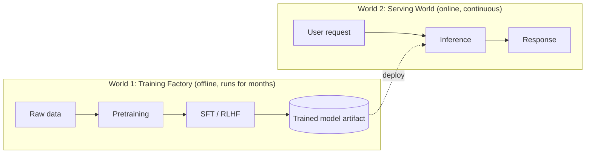

Separating these two worlds explicitly is the organizing idea for the architecture discussion that follows: the training world is optimized for throughput and eventual model quality over a long batch job, while the serving world is optimized for latency, concurrency, and cost per request under continuous live traffic — and a system designer needs a distinct mental model and distinct set of trade-offs for each.

> [!info]+ Interview questions covered
> - Why is it useful to mentally separate the "training" and "serving" halves of an LLM product when doing system design?


## High-Level Architecture: The Two Worlds of a ChatGPT-like Product

Before drawing any boxes and arrows, it helps to ask: when you build a product like ChatGPT, what are the fundamentally different *kinds* of work happening? If you don't separate them, you end up conflating a months-long, offline process with a system that has to respond in milliseconds, forever. The tutor's answer is to split the whole system into **two worlds**:

- **World 1 — the training factory**: offline, runs for months. This is where the model is created and prepared.
- **World 2 — the serving floor**: online, runs forever. This is where the finished, frozen model is exposed to real users.

Once the model is ready (in the running example, a **14 GB model**), you stop changing the model itself in World 2 — you only change the product/chat-interface layer around it. This split also clarifies a build decision every AI product team faces: you can either **self-host your own model** (own World 1 fully) or simply **call a third-party API** (OpenAI, Claude, etc.) and skip World 1 entirely, only building World 2.

| | World 1 — Training Factory | World 2 — Serving Floor |
|---|---|---|
| Mode | Offline | Online |
| Duration | Runs for months | Runs forever |
| Goal | Produce a usable, frozen model | Serve that model to real users |
| Output | A frozen model file (e.g., 14 GB) | Token streams back to the browser |
| Changes what? | The model's weights | The product/infra around the model |

> [!info]+ Interview questions covered
> - Why should an LLM product be designed around two separate "worlds" (training vs. serving)?
> - What are the two ways to build an AI product around a model (self-hosted vs. third-party API)?

### World 1 — The Training Factory (Offline, Runs for Months)

The training factory is the pipeline that turns raw internet text into a model you can actually deploy. Walking it top to bottom:

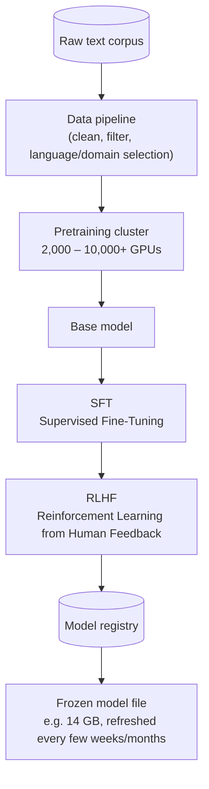

**Step 1 — Raw text corpus.** The first step of building any (text) model is simply gathering all the text data available on the internet.

**Step 2 — Data pipeline.** Not all of that raw data is useful. The pipeline decides which data to keep and which to drop — for instance, if you're building a model targeted at Chinese-language users, you'd weight the pipeline to favor Chinese-language data.

**Step 3 — Pretraining cluster.** Training a model needs many GPUs running for a long time — the tutor's example: **2,000, 4,000, or 10,000 GPUs**, depending on how large a model you want. This stage is where `model.py`-style training code (built on PyTorch/TensorFlow) actually runs on the cluster.

**Step 4 — Base model.** The output of pretraining is a base model. Crucially, this base model is **trained only to predict the next token** on raw internet text — it was never taught to *answer* anything.

#### Why the base model is useless on its own

Here's the reasoning, worked through with a concrete example: imagine one page on the internet says *"What is Kotlin,"* followed later by *"Where is Kotlin used,"* followed by *"What is a lambda function in Kotlin."* This is exactly the pattern you'd see in something like an Android interview-question repository — a long list of **questions**, with the answers living elsewhere, on different pages. The model has only ever seen sequences like: question, question, question, question.

So when you prompt the base model with *"What is Kotlin?"*, its next-token prediction — trained on that same pattern — doesn't produce an answer. It produces the **next question**: *"What is a lambda function, where is Kotlin used?"* The base model just continues the pattern it learned; it was never shown "someone asked X → now answer X."

That is why the base model, by itself, is **completely useless** as a chatbot.

**Step 5 — SFT (Supervised Fine-Tuning).** The fix is to explicitly simulate the desired behavior: build a dataset where every "question" is paired with the correct answer, and fine-tune the base model on that. If pretraining took ~30 days (in this course's illustrative numbers), SFT is dramatically cheaper — **a few hours up to a maximum of 1–2 days**. SFT's job is narrow but essential: it teaches the model to **behave like a conversational bot** — to recognize "someone has asked something, so I need to switch into answer mode" — rather than merely continuing the text pattern.

**Step 6 — RLHF (Reinforcement Learning from Human Feedback).** SFT makes the model conversational, but it doesn't guarantee the *style* of answer humans actually prefer. This is where the thumbs-up/thumbs-down feedback buttons in ChatGPT come in: that feedback becomes training data. RLHF trains the model to prefer responses that humans rate highly — i.e., to **behave like a human would want it to behave**, not just to produce *a* grammatically valid answer.

In short, the progression is:

$$
\text{Base model (useless)} \;\xrightarrow{\text{SFT}}\; \text{Conversational bot} \;\xrightarrow{\text{RLHF}}\; \text{Human-preferred behavior}
$$

**Step 7 — Model registry and the frozen file.** After SFT and RLHF, the resulting model is **frozen** — turned into a versioned artifact (the tutor's running example: a 14 GB file), refreshed roughly every few months. The **model registry** is the journal/log that records, for every deployed model, its date and configuration — which lets a company track exactly which version is live. Swapping which model serves traffic can be as simple as a one-line config change in that registry (the tutor gives the example of flipping a database flag from 1 to 0 to switch between two model variants being served).

#### Why RLHF data is a competitive moat

Before OpenAI could release the first ChatGPT, it had no RLHF data yet. Their solution: they hired roughly **10,000 people on contract** to write questions, write model-style responses, and annotate the model's actual outputs as good or bad. As the ecosystem matured, the demand grew — companies now need on the order of **1 million people** to produce human-feedback data at scale. This is precisely why a recruiting/hiring platform (referred to in the lecture as "Mercor") became one of the fastest-growing companies in AI recruiting: its value came from being the channel partner supplying human annotators to OpenAI. The broader point: needing millions of human annotators for RLHF-quality data represents a **huge capital barrier** — it's a major reason smaller players struggle to compete head-on with ChatGPT or Claude on model quality.

> [!info]+ Interview questions covered
> - Why does a next-token-prediction base model fail to act like a chatbot?
> - What is the difference between SFT and RLHF, and what does each contribute?
> - Roughly how long does pretraining take vs. SFT?
> - What is a model registry, and why do companies "freeze" model versions?
> - Why is large-scale human feedback data considered a competitive moat in the LLM industry?

### World 2 — The Serving Floor (Online, Runs Forever)

Once the model is frozen, it enters World 2 — the always-on layer that actually talks to users. This is the system a user's request travels through, end to end:

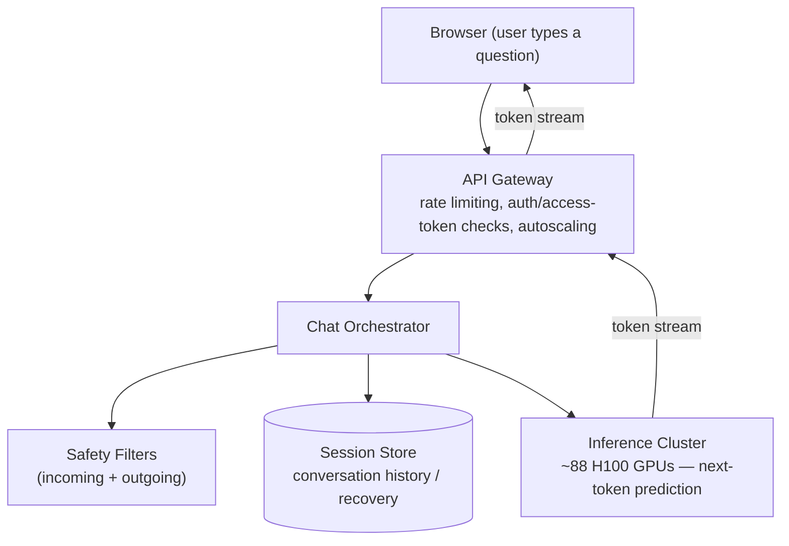

Walking the request path component by component:

- **Browser.** The user types a question in the chat interface.
- **API gateway.** This is deliberately **not an AI-specific component** — it's standard infrastructure: rate limiting, login/credential verification, access-token checks, and autoscaling.
- **Chat orchestrator.** This server-side component receives the (tokenized) request. Because the system must remember what the user is chatting about, it stores conversational state in a database — both so context can be reused later in the same conversation, and so the conversation can be recovered if something goes wrong.
- **Safety filters.** The orchestrator routes content through safety filtering in **both directions** — incoming (e.g., capturing a user being abusive toward the model) and outgoing (filtering the model's own responses).
- **Session store.** The database backing the orchestrator, holding conversation history for retrieval and recovery. (Longer-term memory across sessions is called out as a deeper topic for a later class.)
- **Inference cluster.** This is where the actual **next-token prediction** happens. Because generating tokens for many concurrent users requires many GPUs running in parallel, it's called a *cluster* — in the worked example, **88 GPUs** serving **10 million users per day**. The cluster streams generated tokens back through the gateway to the browser.

> [!info]+ Interview questions covered
> - What are the main components of a chat-serving pipeline (API gateway, chat orchestrator, safety filters, session store, inference cluster)?
> - Why is the API gateway considered "not an AI problem"?
> - Why do safety filters need to run on both incoming and outgoing content?
> - What role does the chat orchestrator's session store play in a multi-turn conversation?

### Sizing the Inference Cluster: A Worked Capacity-Planning Example

The "88 GPUs for 10 million users/day" figure isn't arbitrary — it comes from a concrete back-of-envelope calculation. This is the kind of math that turns a vague architecture diagram into an actual infrastructure and cost estimate, and it's worth deriving step by step.

**Assumptions:** each answer is ~500 tokens long, a single GPU stream generates at ~100 tokens/sec, an H100 GPU can serve ~2,000 tokens/sec of aggregate throughput, an H100 costs ~$3/hour, and the target scale is 10,000,000 users/day with a peak concurrency of 350 simultaneous streams.

$$
\text{gen time / answer} = \frac{500 \text{ tok}}{100 \text{ tok/s}} = 5\text{ s}
$$

$$
\text{concurrent streams at peak} = 350 \times 5 = 1{,}750 \text{ streams}
$$

$$
\text{aggregate tokens/s at peak} = 350 \times 500 = 175{,}000 \text{ tok/s}
$$

$$
\text{GPUs at peak} = \frac{175{,}000 \text{ tok/s}}{2{,}000 \text{ tok/s per H100}} \approx 88 \text{ H100s}
$$

This is exactly where the "88 GPUs" figure in the architecture diagram comes from. Extending the same math to daily volume and cost:

$$
\text{daily tokens} = 10{,}000{,}000 \times 500 = 5{,}000{,}000{,}000 \text{ tokens/day}
$$

$$
\text{daily GPU cost} = 88 \text{ GPUs} \times 24\text{ hr} \times \$3/\text{hr} \approx \$6{,}336
$$

$$
\text{cost per request} = \frac{\$6{,}336}{10{,}000{,}000} \approx \$0.0006
$$

$$
\text{cost per month} = \$6{,}336 \times 30 \approx \$190{,}080
$$

| Quantity | Formula | Result |
|---|---|---|
| Generation time / answer | 500 tok ÷ 100 tok/s | 5 s |
| Concurrent streams at peak | 350 × 5 | 1,750 streams |
| Aggregate tokens/s at peak | 350 × 500 | 175,000 tok/s |
| GPUs needed at peak | 175,000 ÷ 2,000 (per H100) | ~88 H100s |
| Daily tokens | 10,000,000 × 500 | 5,000,000,000 |
| Daily GPU cost | 88 × 24 hr × \$3 | ~\$6,336 |
| Cost per request | \$6,336 ÷ 10,000,000 | ~\$0.0006 |
| Cost per month | \$6,336 × 30 | ~\$190,080 |

This kind of calculation is the core skill of system-design interviews for AI products: start from a target user scale, convert it into tokens/sec via generation-time and concurrency assumptions, divide by a single accelerator's throughput to get GPU count, then multiply by hourly GPU cost to get a monthly bill.

#### Explicitly out of scope for this design

The lecture is explicit that this particular exercise deliberately excludes several capabilities, so as not to conflate a base serving architecture with more advanced product features:

- Retrieval over your own documents (RAG)
- Tool-using agents
- Cross-session memory
- Images, audio, and video (multimodal support)

> [!info]+ Interview questions covered
> - How do you back-of-envelope size a GPU inference cluster for a target number of daily users?
> - How do you go from tokens-per-second throughput requirements to a GPU count and a monthly cost estimate?
> - What product capabilities (retrieval, agents, long-term memory, multimodality) are typically scoped out of a baseline LLM-serving system design?


## Training Lifecycle: Data Pipeline → Pretraining → SFT → RLHF → Model Registry

Before designing the serving path, you need a mental model of how the model that gets served was actually produced — because the shape of that pipeline (what runs offline vs. what has to run online) directly drives architecture decisions later. This section walks through the full **training lifecycle preview**: raw data in, deployed model out, with rough scale numbers at each stage so the timelines feel concrete rather than abstract.

```mermaid
flowchart LR
    A["Raw web crawls, books, code (GitHub)"] --> B["Clean + Dedup"]
    B --> C["Data Pipeline"]
    C --> D["~15T tokens"]
    D --> E["Pretraining<br/>thousands of GPUs, months"]
    E --> F["Base Model"]
    F --> G["SFT<br/>tens of thousands of dialogs, days"]
    G --> H["RLHF<br/>human preference labels, weeks"]
    H --> I["Eval Gate"]
    I --> J["Model Registry"]
    J --> K["Inference Cluster<br/>(deploy ~14 GB)"]
```

### Stage 1 — Data Pipeline: Gather, Clean, Dedup

The pipeline starts by gathering everything available: web crawl data, books, and code from open-source repositories like GitHub. There's an important caveat here — the policy around what can legally be crawled keeps shifting (e.g., Reddit has publicly alleged that OpenAI crawled its data before a policy change), so as a system designer you need to stay aware of the licensing/policy surface, not just the technical pipeline.

Once gathered, the raw corpus goes through two steps:

- **Clean** — remove noise from the raw text.
- **Dedup (deduplicate)** — remove duplicate content.

**Why dedup matters:** if the same content appears multiple times in the training set, the model becomes biased toward that repeated content, and there's no benefit to the model "learning" the same thing over and over. This is the same operation you see tools like ChatGPT, Codex, or Claude Code print in their terminals when they say they're deduplicating — before doing new work, they check what's already been done so they don't repeat it.

After cleaning and dedup, the pipeline yields the training corpus — in this worked example, **~15 trillion tokens**. This is emphasized as *not* 15 trillion **unique** tokens — phrases repeat naturally across a corpus this large (e.g., "he is a good boy," "he is a good person" both contain "he is a good"), so the token count is a volume measure, not a uniqueness measure.

**Design decision — encryption:** this stage runs entirely on the company's own infrastructure, operating on data that is mostly public and never exposed to the live user-facing flow. Because of that, there's no strong case for adding encryption/decryption overhead here. Contrast this with RLHF data below, sourced from human labelers who may be accessing systems remotely — that's the point where encryption in transit becomes worth considering, precisely because there's a real network boundary that could be intercepted.

> [!info]+ Interview questions covered
> - What does a data pipeline for LLM pretraining look like, end to end?
> - Why is deduplication necessary before pretraining, and what happens if you skip it?
> - Where in the training pipeline does encryption actually matter, and where is it unnecessary overhead?

### Stage 2 — Pretraining: Building the Base Model

Pretraining on the ~15T-token corpus requires **thousands of GPUs** and takes **months**. This is why frontier releases (OpenAI's GPT line, xAI's Grok) tend to land every 3–4 months — even with more compute thrown at larger corpora (e.g., 30T tokens instead of 15T), the wall-clock time for training doesn't collapse proportionally. Beyond raw compute, teams also need to continuously check training checkpoints to confirm the run is actually converging in the right direction, which adds calendar time on top of the raw GPU-hours.

**Worked example (Llama 2 70B):**

$$
\frac{1{,}720{,}320 \text{ A100 GPU-hours}}{2{,}048 \text{ GPUs}} = 840 \text{ hours} \approx 35 \text{ days}
$$

Llama 2 70B took roughly **35 days on ~2,048 A100 GPUs**. The tutor notes that for today's trillion-parameter-class models — much larger than a 70B model — training time doesn't shrink proportionally just because you throw more compute at it; realistically it still lands around **2–3 months**.

**Putting 15T tokens in human terms:** using the ~200,000-tokens-per-book estimate from the earlier "Numbers Every AI Engineer Should Know" style capacity math,

$$
\frac{15{,}000{,}000{,}000{,}000 \text{ tokens}}{200{,}000 \text{ tokens/book}} = 75{,}000{,}000 \text{ books}
$$

That means the base model has effectively "seen" the equivalent of **75 million books** during pretraining — a volume no human could read in an entire lifetime. This number is worth memorizing as a sanity-check anchor: whenever someone quotes a token count for a frontier pretraining run, converting it to "book-equivalents" makes the scale viscerally clear.

> [!info]+ Interview questions covered
> - Why do frontier model releases typically follow a 3–4 month cadence?
> - How would you estimate wall-clock pretraining time from GPU-hours and GPU count?
> - How do you communicate the scale of a pretraining corpus (15T tokens) in intuitive terms?

### Stage 3 — Supervised Fine-Tuning (SFT): Small Data, Big Behavior Change

Once you have a base model, you fine-tune it on question-answer style dialogues — this is **Supervised Fine-Tuning (SFT)**. Unlike pretraining, SFT is deliberately tiny: on the order of **tens of thousands of dialogues** (50,000–100,000 Q&A pairs), and it takes **days** for a large model, or even just **hours** for a smaller model.

**Worked example:**

$$
50{,}000 \text{ dialogues} \times 1{,}000 \text{ tokens/dialogue} = 50{,}000{,}000 \text{ tokens} = 50\text{M tokens}
$$

Compared against the 15T-token pretraining corpus:

$$
\frac{15{,}000{,}000{,}000{,}000}{50{,}000{,}000} \approx 300{,}000\times
$$

SFT operates on roughly **300,000× less data** than pretraining. This is the core "why before what" for SFT's role in the pipeline: pretraining teaches the model broad world knowledge and language patterns from a massive, noisy corpus; SFT then reshapes that knowledge into the *dialogue behavior* you actually want (answering questions helpfully, following instructions) using a comparatively tiny, high-quality, curated dataset.

> [!info]+ Interview questions covered
> - What is Supervised Fine-Tuning (SFT), and how does its data scale compare to pretraining?
> - Why is a much smaller dataset sufficient at the SFT stage?

### Stage 4 — RLHF: Human Preference Labels

After SFT comes **Reinforcement Learning from Human Feedback (RLHF)** — a bigger, slower process than SFT. It relies on **human preference labels** (humans ranking or comparing candidate model outputs) rather than fixed question-answer pairs, and it takes **weeks** rather than days.

The overall calendar-time intuition the tutor repeats for the pipeline: **months → days → weeks** — pretraining takes months, SFT takes days, RLHF takes weeks. Since RLHF depends on collecting human preference data — potentially from labelers accessing systems remotely — this is the stage where adding encryption/decryption for data in transit is actually justified, unlike the pretraining stage discussed earlier.

> [!info]+ Interview questions covered
> - What is RLHF, and how does its data collection process differ from SFT's?
> - At which stage of the training lifecycle does encrypting data in transit become necessary, and why?

### Stage 5 — Eval Gate → Model Registry → Inference Cluster

Once RLHF is complete, the model doesn't go straight to production. It passes through:

1. **Eval gate** — the model is scored against a standard, pre-prepared evaluation dataset representing tasks it has historically handled successfully. The model must meet a passing score, and ideally also show measurable improvement over the previous version.
2. **Model registry** — if the model passes, it gets registered with a version number.
3. **Inference cluster** — the registered model is deployed for serving (the diagram calls out a deployment artifact size on the order of **~14 GB**).

This gating step is the mechanism that prevents a regression from silently reaching users: nothing gets promoted to the registry (and from there to serving) unless it clears the bar on the standard eval set.

> [!info]+ Interview questions covered
> - What role does an eval gate play between RLHF and deployment?
> - What is a model registry, and why version the model before deployment?

### Should the Model Ever Be Fine-Tuned in Real Time?

A natural question once you see this pipeline: **if a user is chatting with the model right now, should the model be fine-tuned or RLHF'd in real time based on that conversation?**

**Answer: No.**

The reasoning is purely about time, not just compute availability: retraining — whether SFT or RLHF — takes at minimum days, more realistically weeks or months. Even with unlimited compute, you cannot compress that into the timescale of a live conversation. A model should never be retrained "at any cost" in real time; instead, retraining is done on a cadence — for example, weekly, or every 3–4 days — batching up new signal and pushing it through the same pipeline (data pipeline → SFT/RLHF → eval gate → registry → deploy) rather than mutating the live model mid-session.

> [!info]+ Interview questions covered
> - Should an LLM be fine-tuned or RLHF'd in real time based on the current user's conversation? Why or why not?
> - How often should a production model realistically be retrained, given the pipeline's stage durations?

### Stage Summary Table

| Stage | Input scale | Output / duration |
|---|---|---|
| Data pipeline | Raw web crawls, books, GitHub code | Cleaned + deduped → ~15T tokens |
| Pretraining | ~15T tokens, thousands of GPUs | Base model; months (e.g., Llama 2 70B ≈ 35 days on ~2,048 A100s) |
| SFT | Tens of thousands of dialogues (~50M tokens) | Instruction-following behavior; days (hours for smaller models) |
| RLHF | Human preference labels | Preference-aligned model; weeks |
| Eval gate | Standard eval dataset | Pass/fail + improvement check |
| Model registry | Passing model | Versioned artifact (~14 GB deploy size) |
| Inference cluster | Registered model | Live serving |

This training-lifecycle recap sets up the next topic: the **request lifecycle** — what happens on the *serving* side once a user actually presses a key and sends a message, starting from the browser through the API gateway and orchestrator into the inference cluster.


## The Pretraining Data Pipeline: From Raw HTML to Clean Training Tokens

With the live request path (browser → gateway → orchestrator → inference cluster, first token in 200–500 ms via prefill, then streaming at roughly 50–150 tokens/sec over SSE) fully traced, the lecture turns to the third major pillar of the system: **the data and knowledge pipeline** — where the trillions of tokens used to pretrain the model actually come from, and what has to happen to raw internet content before it is fit to train on.

### Why you can't just "download the internet" and train on it

The starting point for almost every large pretraining corpus is **Common Crawl** — a continuously updated, petabyte-scale dump of **raw HTML** scraped from the web. The key design question the tutor poses is: *is raw HTML actually useful training data for an LLM?*

To answer this concretely, he pulls up a real blog post (an article on LLM inference optimization) in two views side by side:

- **Rendered page (what a human sees)** — a clean article with a "Quick Summary," headings like "Speculative Decoding," and readable prose about draft models, target models, and rejection sampling.
- **`view-source:` (what a crawler actually receives)** — a dense wall of markup: Tailwind-style CSS class strings (`text-sm font-medium text-ink hover:text-primary-700`), inline SVG path coordinates for icons, `<script defer src="/_next/static/chunks/...">` bundles, favicon/manifest `<link>` tags, and JSON-LD structured data (`"@type": "Person"`, `"name": "Amit Shekhar"`, `"publisher": {"@type": "Organization", ...}`).

This is the core distinction the tutor drills into the class: **"This is for human, and this is for bot."** A human's browser renders the HTML into a polished page; a bot/crawler just ingests everything — navigation boilerplate, styling, scripts, structured metadata, and the actual article text — all mixed together in one document.

Crucially, the HTML tags themselves are *not* pure noise from the crawler's point of view: a bot "cannot see visually" the way a human can, so it relies on tags like `<h1>`, `<h2>`, and `<p>` to infer structure — is this string a heading or body text? That structural signal is legitimate and even useful. But from the model's training perspective, none of the tags, CSS classes, SVG paths, or `<script>` payloads themselves are useful — they're presentation and behavior, not language. So the question the tutor puts to the class is direct: **do we need to strip the HTML tags out before this text can train a language model?** Yes — and that single answer motivates the entire first stage of the pipeline: **text extraction**.

### The data-cleaning pipeline: stage by stage

The tutor sketches a linear pipeline that whittles a firehose of raw crawled HTML down to a clean pretraining corpus, annotating each stage with an approximate token count:

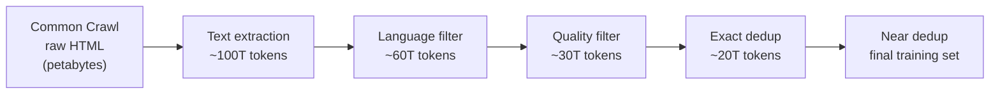

- **Common Crawl raw HTML** — petabytes of markup, scripts, SVGs, JSON-LD metadata, and buried inside all of it, the actual article/page text.
- **Text extraction (→ ~100T tokens)** — strip out the tags, CSS, JavaScript, and SVG noise; keep the underlying readable text. This is the step motivated directly by the view-source demo above.
- **Language filter (→ ~60T tokens)** — keep only the languages that matter for the target model. English tends to get over-weighted because agents, tools, and code are predominantly written in English — though the right mix depends on the intended audience.
- **Quality filter (→ ~30T tokens)** — apply quality rules to drop low-value text.
- **Exact dedup (→ ~20T tokens)** — remove documents that are byte-for-byte (or near byte-for-byte) duplicates.
- **Near dedup** — a further pass that catches near-duplicate/paraphrased content that exact-match dedup misses, producing the final training set.

Looking at the numbers stage-by-stage gives a feel for how aggressively raw web data gets thinned out:

| Stage | Tokens after stage | Tokens dropped | % dropped at this stage |
|---|---|---|---|
| Text extraction | ~100T | — (baseline) | — |
| Language filter | ~60T | ~40T | ~40% |
| Quality filter | ~30T | ~30T | ~50% |
| Exact dedup | ~20T | ~10T | ~33% |
| Near dedup | < 20T | further shrinkage | — |

So roughly **80% of the initially extracted text tokens (100T → 20T) are discarded** before the corpus even reaches the near-dedup stage — the vast majority of what's on the open web is either the wrong language, low quality, or duplicated, relative to what a frontier pretraining run actually wants to train on.

> [!info]+ Interview questions covered
> - Why can't you train an LLM directly on raw crawled HTML?
> - What is text extraction, and why is it the first stage of the pretraining data pipeline?
> - What are the stages of a typical web-data cleaning pipeline (language filter, quality filter, exact dedup, near dedup)?
> - Why does a bot rely on HTML tag structure even though the tags themselves aren't useful training signal?

### How big are real pretraining corpora?

The tutor grounds this pipeline in current numbers rather than leaving it abstract:

- **Llama 3 (2024): 15T tokens** — and he's explicit that this is now **"the floor, not the frontier."**
- Models routinely train on **30T+ tokens** today.
- **Qwen3: ~36T tokens** — roughly **2x Qwen2.5's 18T tokens.**

| Model | Pretraining tokens |
|---|---|
| Llama 3 (2024) | 15T |
| Qwen2.5 | 18T |
| Qwen3 | ~36T |

The trend line matters more than any single number: the token budget for frontier pretraining runs has been climbing fast, and a design that assumes "15T tokens is a lot" is already behind where the frontier sits — which is exactly why a pipeline that can reliably extract, filter, and deduplicate tens of trillions of clean tokens from raw web crawls is a first-class system-design concern, not an afterthought bolted onto model training.

> [!info]+ Interview questions covered
> - Roughly how many tokens do frontier LLMs pretrain on today, and how has that scaled recently (Llama 3 vs. Qwen2.5 vs. Qwen3)?


## The Data & Knowledge Pipeline: From Common Crawl to a Decontaminated Training Set

### Why raw web data can't go straight into training

A pretrained model needs trillions of tokens, and the only source large enough is the open web. But raw crawled HTML is not training data — it's mostly markup overhead, it repeats the same facts thousands of times in slightly different words, it contains toxic/PII content you don't want the model memorizing, and — critically — it can silently overlap with the very benchmarks you'll use to evaluate the model later. Feeding that in directly would waste compute on redundant text and would make your evals lie to you. So before any training run, raw web data goes through a multi-stage cleaning pipeline that whittles petabytes of HTML down to a much smaller, much higher-quality token budget.

### The pipeline at a glance

The tutor sketches this as a single flow, with the token count shrinking at each stage:

```mermaid
flowchart LR
    A["Common Crawl: raw HTML (petabytes)"] --> B["Text extraction"]
    B --> C["~100T raw tokens"]
    C --> D["Language filter"]
    D --> E["~60T tokens"]
    E --> F["Quality filter"]
    F --> G["~30T tokens"]
    G --> H["Exact dedup"]
    H --> I["Near dedup (MinHash)"]
    I --> J["PII / toxicity removal"]
    J --> K["~16T tokens"]
    K --> L["Eval decontamination"]
    L --> M["~15T final training mix"]
```

Starting point: Common Crawl gives you raw HTML at the petabyte scale. Text extraction pulls out just the readable content, landing around **100 trillion raw tokens**. Language filtering (keep only the language(s) you're targeting — English, say, because coding agents and most tooling are English-centric) brings that down to roughly **60 trillion**. Quality filtering (dropping low-value or vulgar sources) takes it to about **30 trillion**. From there, deduplication, PII/toxicity removal, and eval decontamination bring the final count down to roughly **15–16 trillion tokens** — the actual training mix.

> [!info]+ Interview questions covered
> - Walk me through the pretraining data pipeline from raw web crawl to training-ready tokens.
> - Why can't you train a model directly on raw Common Crawl HTML?

### The seven-step cleaning pipeline

The tutor's notes lay this out as a numbered list. Each step exists because raw web text has a specific, correctable problem:

1. **Text extraction** — strip HTML markup and boilerplate to get plain text. Tool: **Beautiful Soup** (Python); the Java equivalent is **jsoup**.
2. **Language filtering** — classify and keep only the target language(s). Tool: **fastText** (a classifier library Facebook released roughly 8 years ago) — feed it text, it tells you whether it's English or not.
3. **Quality filtering** — rule-based and classifier-based removal of low-quality/vulgar sources. Individual words can be harmless in isolation but turn political or offensive in combination — this is where simple rules plus classifiers catch that.
4. **Exact deduplication** — hash every document; if two documents hash identically, they're byte-for-byte identical, so one copy is dropped.
5. **Near-deduplication** — catch documents that say the *same thing* in different words (e.g., "the capital of France is Paris" vs. "France's capital is Paris"). Tool: **MinHash**, which internally relies on embeddings to measure how close two pieces of text are.
6. **PII and toxicity removal** — regex rules plus classifiers, applied everywhere in the pipeline.
7. **Eval decontamination** — remove any data that overlaps with known evaluation benchmarks.

#### Why text extraction throws away ~99% of the bytes

The tutor gives a concrete ratio: a **200 KB HTML page typically wraps only about 2 KB of actual text** — a roughly **100x reduction**. Everything else is markup, scripts, navigation chrome, and other non-content bytes that Beautiful Soup (or an equivalent library in another language) strips away before the text ever reaches the language/quality filters.

#### Exact vs. near deduplication

These solve different problems and use different tools:

| Type | What it catches | How | Example |
|---|---|---|---|
| Exact dedup | Byte-identical documents | Hash each document; identical hash → drop one copy | Two blog posts with the exact same content |
| Near dedup | Same fact, restated differently | MinHash (uses embeddings internally to measure closeness) | "The capital of France is Paris" vs. a paraphrase of the same fact |

The reasoning behind near-dedup matters: once the model's weights have learned a fact, it remembers it — you don't need to keep re-showing the same fact in a thousand paraphrased forms. If you deliberately want the model to see something again, that's a decision for a second training pass, not something the base data-cleaning step should do for you by accident.

> [!info]+ Interview questions covered
> - What's the difference between exact and near deduplication, and why do you need both?
> - Why does deduplicating training data actually matter for model quality?

### What actually goes into the training mix

Once cleaned, the tokens are combined from multiple source types, each included for a distinct reason:

| Source | Typical share | Why |
|---|---|---|
| Web crawl | 60–85% | Breadth, everyday language |
| Code (GitHub) | 10–20% | Programming and reasoning ability |
| Books | 3–8% | Long, coherent structure |
| Wikipedia / reference | 1–5% | Dense factual content |
| Non-English web | 5–10% | Multilingual coverage |

The web-crawl share is the anchor for breadth; code is included specifically because it strengthens reasoning ability, not just coding skill; books contribute long-range coherent structure that short web documents lack; and Wikipedia contributes densely factual text per token.

### Token budgets are still climbing

The final ~15 trillion tokens matches what Llama 3 (2024) trained on — but the tutor is explicit that **15T is now the floor, not the frontier**. Newer models routinely train on 30T+ tokens: Qwen3 trains on roughly **36T tokens**, about **2x** Qwen2.5's **18T**. The cleaning pipeline hasn't changed conceptually — the raw crawl volume and compute available to process it have simply grown.

### Eval decontamination: why public benchmarks can lie to you

This is the last and, per the tutor, one of the most important steps, precisely because it's easy to get wrong silently.

**The problem:** many evaluation datasets are public. If your training corpus happens to contain the eval set (or data very close to it), your model will score artificially well on that benchmark — not because it's smarter, but because it memorized the answers during pretraining. Claiming your model "beats" a frontier model on a benchmark under those conditions is misleading, since you trained on the very data you're testing against.

**The industry response:** many companies — and the community — have built their own eval frameworks and deliberately kept them **closed/private** so that no one can train against them. If you're aware an eval set might have leaked into your crawl, the responsible move is to actively **decontaminate**: search your training corpus for anything resembling the known eval data and remove it before training on the final ~15T-token mix.

#### Worked example: GLM-5.2 vs. Opus, benchmark by benchmark

The tutor pulls up the GLM-5.2 announcement (z.ai/blog) to make this concrete, comparing GLM-5.2 against Opus 4.8 across a "Long-Horizon Task Evaluation" section with three benchmarks: **FrontierSWE**, **PostTrainBench**, and **SWE-Marathon**.

| Benchmark | Opus 4.8 | GLM-5.2 (fully open-source) |
|---|---|---|
| FrontierSWE | ~75% | ~74.4% |
| SWE-Marathon | 26% | 13% |

The interesting part isn't just the numbers — it's the *shape* of the gap. On FrontierSWE, the fully open-source GLM-5.2 is nearly tied with the closed frontier model. But on SWE-Marathon — a long-horizon software-engineering task — the gap is roughly 2x (26% vs. 13%). This illustrates that "how far behind is open-source?" is benchmark-dependent, and long-horizon, agentic-style tasks currently show a bigger gap than single-shot tasks.

> [!info]+ Interview questions covered
> - What is eval/benchmark contamination, and why is it a real risk in pretraining?
> - What is eval decontamination, and how do teams guard against training on their own test set?
> - Why do companies keep some evaluation benchmarks private?

### RefinedWeb and FineWeb: don't rebuild the pipeline from scratch

Implementing every one of the seven cleaning steps yourself — hashing, MinHash, classifiers, regex rules, eval-set matching — is a lot of infrastructure. The tutor's practical advice: check whether a **pre-cleaned, published dataset** already does this for you. Two examples he pulls up live:

- **RefinedWeb** — Hugging Face dataset `tiiuae/falcon-refinedweb`, documented in arXiv paper **2306.01116**, *"The RefinedWeb Dataset for Falcon LLM: Outperforming Curated Corpora with Web Data, and Web Data Only."* The paper reports extracting **5 trillion tokens** from Common Crawl, of which **600 billion tokens** were publicly released along with trained models.
- **FineWeb** — mentioned alongside RefinedWeb as another well-documented, publicly available option.

Both come with papers that spell out exactly how the data was built — including the specific deduplication algorithm used — so you can inspect and trust the process rather than reimplementing it blind.

The RefinedWeb paper's central claim (shown via its Figure 1, plotting aggregated zero-shot performance against compute budget) is that models trained purely on RefinedWeb **outperform models trained on curated corpora** like The Pile, matching GPT-3-level performance at equivalent compute — i.e., filtered-and-deduplicated *web-only* data can beat hand-curated data, provided the cleaning pipeline is done properly.

> [!info]+ Interview questions covered
> - What is the RefinedWeb dataset, and what does its paper claim about web-only data vs. curated corpora?
> - If high-quality pretraining datasets are public, why would you use them instead of building your own pipeline?

### If the data is public, why can't everyone build the best model?

This is the natural follow-up question the tutor raises after showing that RefinedWeb/FineWeb are freely available: if the data recipe is public, why doesn't every team produce a frontier-level model?

Two answers:

1. **Compute.** Even with identical data, training a frontier-scale model requires an enormous compute budget. If everyone trains on the *same* public dataset, and only compute differs, the compute-rich lab still wins.
2. **Data quality — and the model becomes the data generator.** Once a lab has a strong model, that model itself becomes a generator of high-quality synthetic training data. Compute-rich companies increasingly spend heavily on API calls to top frontier models specifically to synthesize better training data for their own next model — effectively buying data quality with money rather than building it purely from web crawl.

This dynamic is also why the open-source-to-frontier gap keeps shrinking: the tutor notes that a year ago, open-source models trailed frontier models by about **6 months**; today that gap is closer to **3–4 months**, and it continues to close. He references a public exchange where Elon Musk predicted Chinese models would reach frontier-model parity by 2027, and a GLM/Z.ai founder replied that an open-source model matching the frontier would likely arrive even sooner — within the same year.

> [!info]+ Interview questions covered
> - Given that pretraining datasets and papers are public, why don't all labs train equally capable models?
> - What role does an existing frontier model play in producing training data for the next generation of models?


## Eval Decontamination and Benchmark Contamination

Before a model can be trusted, its training data has to be checked for one specific leak: did it accidentally see the very questions it will later be graded on? This is the last cleaning step in the pretraining data pipeline, and the tutor motivates it with a simple "why it matters" story before naming it.

### Why decontamination matters: the exam-leak analogy

Suppose you have an exam tomorrow, and somehow the question paper leaks to you beforehand. You already know every question and every answer, so you walk in and score 100/100. Does that score mean you actually understand the subject? No — the paper leaked, so a perfect score doesn't reflect real learning; it's not "your real rank."

The same logic applies to a language model:

- If the model's pretraining corpus accidentally contains the exact questions (and answers) from a benchmark it will later be evaluated on, it will score very high on that benchmark.
- But that high score is **not a signal of real capability** — the model has memorized the test, not learned the underlying skill.
- When such a model is used on a genuinely new, real-world task, it fails, even though its leaderboard score looked excellent.

This gap — benchmark score vs. actual usefulness — is exactly why **eval decontamination** is a mandatory pipeline step: a responsible model builder deliberately scrubs known benchmark/eval datasets out of the training corpus so that the benchmark score, when it comes, reflects generalization rather than memorization.

A student offers an alternative framing: isn't this just "training on the trained/test dataset"? The tutor sharpens the distinction with a study analogy:

- **Scenario 1 (good):** You read all the books and internalize all the concepts. That's genuine preparation.
- **Scenario 2 (contamination):** You've done Scenario 1, *and* you also happen to already know the exact questions that will be asked. That extra knowledge is what makes the resulting exam score misleading.

Decontamination's job is to make sure every model ships closer to Scenario 1.

> [!info]+ Interview questions covered
> - What is eval/benchmark decontamination, and why is it needed?
> - Why can a model score high on a leaderboard but still fail in real-world use?
> - How would you explain benchmark contamination to a non-technical stakeholder?

### Where decontamination sits in the data pipeline

Decontamination is the final filtering stage before the corpus becomes the actual training mix. The tutor recaps the shrinking token count as raw web-scale data moves through each cleaning stage:

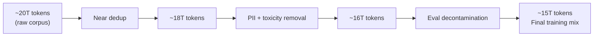

On today's scale, this floor keeps rising:

> "15T (Llama 3, 2024) is now the floor, not the frontier: models routinely train on 30T+ (Qwen3 ~36T, about 2x Qwen2.5's 18T)."

So ~15T tokens, once a headline number for Llama 3 in 2024, is now considered a *minimum* — current frontier open models such as Qwen3 train on roughly 36T tokens, about double Qwen2.5's ~18T, and this trend of ever-larger token budgets is a live consideration when sizing a pretraining run.

### Benchmark leaderboards: how the outside world actually scores a model

Once a model is released publicly, people don't take the lab's word for it — they run the model against **held-out benchmark datasets** (hidden from everywhere, including training data) via the model's API and publish the resulting scores. This is what produces the comparison charts you see on every model's launch/model-card page.

As a concrete example, the tutor pulls up a real model-card chart (GLM-5.2) comparing frontier models on three "long-horizon task" benchmarks:

| Benchmark (max duration) | Opus 4.8 | GLM-5.2 | Opus 4.7 | GPT-5.5 | Gemini 3.1 Pro |
|---|---|---|---|---|---|
| FrontierSWE — Dominance (Max 20 Hrs) | 75.1% | 74.4% | 72.6% | 63.0% | 39.6% |
| PostTrainBench (Max 10 Hrs) | 37.2% | 34.3% | 28.6% | 25.0% | 21.6% |
| SWE-Marathon (Max 10 Hrs) | 26.0% | 13.0% | 16.0% | 12.0% | 4.0% |

This is exactly the kind of leaderboard graph decontamination protects the integrity of: every score here is only meaningful as a proxy for real capability if none of these models had FrontierSWE/PostTrainBench/SWE-Marathon questions leak into their pretraining corpora.

> [!info]+ Interview questions covered
> - How are released LLMs benchmarked against each other (leaderboards, held-out eval sets, API-based scoring)?
> - Why must eval datasets stay hidden from training data for leaderboard numbers to mean anything?

### Transition: tokenization and vocabulary size

With the pretraining-data discussion (collection → filtering → dedup → dedup+PII removal → decontamination → final mix) now complete, the tutor transitions to the next topic: **tokenization**. He flags that tokenization is the first step performed in both training and inference, but the class will focus specifically on tokenization at inference time — how a sentence gets broken into tokens, and how this depends on the model's **vocabulary size**, which in turn affects model behavior. This is called out as an important system-design interview topic to be covered next.


## Tokenizer Libraries and the Vocabulary-Size Trade-Off

Tokenization is the first thing that happens on both the training path and the inference path: before the model can do anything, raw text has to be broken into tokens. This section covers a genuinely tricky interview topic — which tokenizer library to use, and how the size of the vocabulary itself is a first-class design decision with real compute and quality trade-offs, not just an implementation detail.

### Encoding vs. Detokenization

- **Tokenization (encoding)**: sentences and words are broken into tokens, and each token is mapped to an integer ID from the vocabulary. This happens before the prompt is sent into the model.
- **Detokenization (decoding)**: the reverse step. As the model generates token IDs one at a time, those IDs are mapped back to text fragments and stitched together into the human-readable response streamed back to the user.

The size of the vocabulary used for this encode/decode pair directly determines how many tokens a given piece of text turns into — which is the crux of the trade-off discussed below.

> [!info]+ Interview questions covered
> - What is tokenization, and what is detokenization?
> - When does tokenization happen relative to training vs. inference?

### Choosing a Tokenizer Library

For the tokenizer itself, there are three practical options:

| Option | Notes |
|---|---|
| **tiktoken** (OpenAI) | Off-the-shelf library used by OpenAI's models. |
| **Hugging Face tokenizers** | Off-the-shelf, widely used alternative with broad model support. |
| **Custom tokenizer** | Building your own is now the "easiest thing to do" — coding assistants (the tutor calls out Claude Code specifically) make it straightforward to stand up a custom tokenizer instead of always relying on a pre-built library. |

> [!info]+ Interview questions covered
> - What tokenizer library options exist for a system-design interview, and when would you build a custom one?

### Choosing the Vocabulary Size

Vocabulary size is an independent design axis from the model's parameter count — a 32,000-word vocabulary can sit underneath a 7B-parameter model just as easily as a much larger vocabulary can sit underneath a model with several times more parameters. The slide's worked example:

```text
vocab 32,000  (our 7B)
vocab 128,000 (Llama 3)
what 128K buys: ~15% fewer tokens
```

Llama 3's vocabulary (128K) is roughly **4x** the size of the 32K baseline used in the running "our 7B model" example. The comparison table from the slide:

| Vocabulary | Sequence length | Risk |
|---|---|---|
| 32,000 | ~15% larger | More tokens per request |
| 128,000 | ~15% shorter | Rare tokens undertrained |

So the two vocabulary sizes sit on opposite ends of the same trade-off: a smaller vocabulary produces longer token sequences for the same text; a larger vocabulary compresses the same text into fewer tokens, at the cost of undertraining the rarer entries in that bigger vocabulary.

### Worked Example: Tokenizing "cat" at 32K vs. 128K

To make the trade-off concrete, the tutor works through how the word **"cat"** would be tokenized under each vocabulary size.

With a **32K vocabulary**, the vocabulary is small enough that it only contains character-level (or very short subword) entries — so "cat" has to be built up letter by letter:

```text
32K = c, a, t
```

That's **3 tokens** for one 3-letter word.

With a **128K vocabulary**, there's enough room in the vocabulary for byte-pair-encoding merges to have produced longer merged entries — not just the individual characters, but also the 2-letter merge `ca`, and even the full word `cat` as its own single token:

```text
128K = c, a, t, ca, cat

cat: 1 with 128K, 3 with 32K
```

That's just **1 token** for the same word.

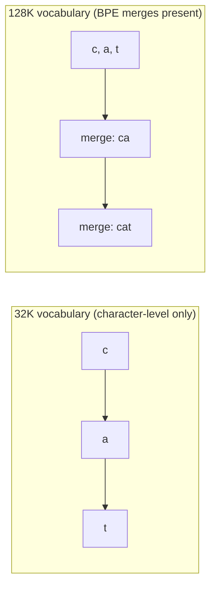

This is the mechanical reason behind the "~15% fewer tokens" line on the slide: a bigger vocabulary has absorbed more common character sequences into single merged tokens, so the same sentence needs fewer tokens overall to represent.

> [!info]+ Interview questions covered
> - Why does a larger vocabulary produce shorter token sequences for the same text? Walk through a concrete example.
> - What is the relationship between vocabulary size and byte-pair-encoding merges?

### Why Fewer Tokens Matters: Compute and Latency

Fewer tokens per request translates directly into **less computation on the GPU** for the same piece of text — and less GPU computation per request means the model's response comes back **faster**. This is the direct payoff of a larger vocabulary: same content, fewer tokens, less compute, lower latency.

There's a subtlety worth calling out, though: this benefit has to be weighed against model size itself. A bigger model (more parameters) inherently takes more time to do its per-token computation, so if you pair a large vocabulary with a large model, part of the token-count savings gets eaten back by the larger model doing more work per token. In other words, vocabulary size and parameter count are two separate levers that both affect end-to-end latency, and a system design has to balance them together rather than optimizing either one in isolation.

> [!info]+ Interview questions covered
> - How does vocabulary size affect GPU compute cost and response latency?
> - If you increase both vocabulary size and model size, do the latency benefits still hold?

### The Risk Side: Rare-Token Undertraining

The savings from a larger vocabulary are not free — that's the other half of the "Risk" column in the table above: **rare tokens undertrained**.

The mechanism: with a 128K vocabulary, very common substrings — like `ca` in the running example — show up constantly across the training data. Because they're seen so often, the model builds a rich, well-trained representation for them, learning many relationships and contexts around that token. But the rarer, longer merged tokens — like the whole-word token `cat` — are seen far less frequently during training than a common fragment like `ca`. Those rarer tokens end up **undertrained**: the model has comparatively little signal to learn a good representation for them, even though they exist in the vocabulary and get used at inference time.

So the full picture of the trade-off is:

- **Smaller vocabulary (e.g., 32K)** → longer sequences, more tokens per request, more GPU compute, slower responses — but every token in the vocabulary is common enough to be well-trained.
- **Larger vocabulary (e.g., 128K, like Llama 3)** → shorter sequences, ~15% fewer tokens, less GPU compute, faster responses — but the long tail of rarer merged tokens risks being undertrained relative to the common substrings that dominate the training signal.

Both sides carry a genuine advantage and a genuine disadvantage — there is no free lunch in choosing vocabulary size, which is exactly why interviewers like to probe this: it forces you to reason about a trade-off rather than just naming a number.

> [!info]+ Interview questions covered
> - What is the "rare tokens undertrained" risk, and why does increasing vocabulary size cause it?
> - Given a fixed model size, how would you decide between a 32K and a 128K vocabulary?


## Tokenization in Practice: Token IDs, BPE Failure Modes, and a Hands-On tiktoken Experiment

The previous section established *why* you pick a vocabulary size (32,000 vs. 128,000 tokens) as a tradeoff between sequence length and how well rare tokens get trained. This section goes one level deeper: once text is chopped into subword pieces and mapped to integer **token IDs**, what actually flows into the model — and why does that representation cause LLMs to visibly fail at things humans find trivial, like adding digits or counting letters? This is one of the tutor's favorite "trickier interview questions": *why does a chatbot get simple arithmetic and spelling wrong?*

### Recap: the vocabulary-size tradeoff

| Vocabulary | Sequence length | Risk |
|---|---|---|
| 32,000 (the course's 7B model) | ~15% larger | More tokens per request |
| 128,000 (Llama 3) | ~15% shorter | Rare tokens are under-trained (seen fewer times during pretraining) |

A larger vocabulary buys roughly **15% fewer tokens** for the same text, but every additional vocabulary entry is seen less often during training, so rare tokens get "under-trained" — the model has weaker representations for them. This tradeoff sets up the three concrete **issues** with tokenization that the tutor walks through next.

### Why models can't do arithmetic: the digit-tokenization problem

**Why this matters:** users type numbers expecting the model to compute with them the way a calculator would. But the model never sees digits — it sees token IDs. Motivating the concept before naming it: what actually happens when you type `1234567` into a chat box?

The BPE tokenizer doesn't split a long digit string into individual digits. It groups them into arbitrary-looking chunks based on what patterns were frequent in its training data:

```text
"1234567"  ->  "123" + "456" + "7"
```

Each of these three chunks — `"123"`, `"456"`, `"7"` — is then looked up in the vocabulary and replaced by a single integer, the **token ID**:

```text
"1234567"  ->  "123" + "456" + "7"  ->  "1", "3", "5"   (illustrative token IDs, not the real cl100k values)
```

The tutor's key point: **this is the actual message the model receives.** The model never "reads" `1234567` as a sequence of seven digits — it reads three opaque integers (illustrated here as token IDs like `135`). It has to reconstruct any notion of quantity purely from patterns it learned about how these particular token IDs co-occurred in training text — a kind of learned **reverse mapping**, not real computation.

This explains a very concrete failure mode: if you ask the model to add up digits (say, `1 + 2 + 3 + ...`), it may confidently predict a wrong sum (the tutor gives an illustrative wrong answer like `43`) because it is pattern-matching on token IDs rather than performing arithmetic. The model is not "seeing" the number — it is seeing a handful of token IDs and guessing what usually follows them on the internet.

**The fix is agentic, not architectural:** rather than trying to force the model to memorize arithmetic, the model should recognize this class of question and delegate it — call a calculator or run Python code — instead of guessing. This is exactly where **tool calling / agentic behavior** earns its value.

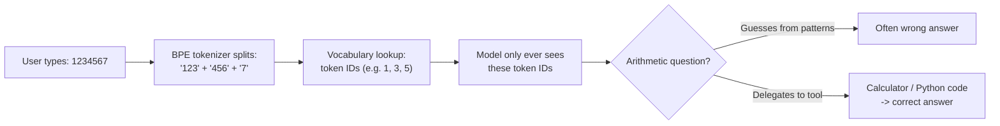

> [!info]+ Interview questions covered
> - What actually goes into the model when a user types a number — the digits, or something else?
> - Why do LLMs frequently make arithmetic mistakes even on simple sums?
> - What is the "reverse mapping" problem, and how does it relate to token IDs?
> - Why is tool/agentic calling the correct fix for numeric questions, rather than expecting the base model to compute directly?

### Why models miscount letters: the "strawberry" problem

**Why this matters:** this is the single most famous, most-memed tokenization failure — "how many r's are in strawberry?" — and it is a direct consequence of the same subword-splitting mechanism, just applied to a word instead of a digit string.

```text
"strawberry"  ->  "str" + "aw" + "berry"
```

`strawberry` does not get tokenized letter-by-letter. It gets split into three subword chunks — `str`, `aw`, `berry` — each of which becomes a single token ID (illustrated by the tutor as something like `1`, `3`, `6`). The model never sees the individual characters `s-t-r-a-w-b-e-r-r-y`; it sees three integers. So when asked "how many characters/letters are in strawberry," or specifically "how many r's," the model has no direct access to the spelling — it can only pattern-match from training data, which is exactly why it produced widely-shared, humorously wrong answers when this went viral online.

The correct way to answer this class of question is the same as for arithmetic: **use Python/tool calls** to actually count characters, rather than expecting the base model to "see" the spelling from its token IDs.

> [!info]+ Interview questions covered
> - Why does ChatGPT get the letter count in "strawberry" wrong?
> - How does subword tokenization (BPE) cause token-to-character mismatches?
> - What's the general pattern for questions an LLM should hand off to a tool instead of answering directly?

### Why non-English text costs more: token inflation

**Why this matters:** this issue isn't about correctness — it's about **cost and context-window usage**. If you're serving multilingual traffic, the same sentence doesn't cost the same number of tokens in every language.

```text
non-English  ->  2x to 4x more tokens for the same content
```

Because the BPE vocabulary is trained on a corpus dominated by English (and code), English words and common English subwords get their own dedicated, frequently-reused tokens. The same *content*, expressed in another language, tends to fragment into more, smaller pieces — so a sentence that takes, say, 20 tokens in English might take 40–80 tokens to express the identical meaning in another language. This directly inflates:

- **Token cost** (since providers bill per token)
- **Context window usage** (fewer effective "words" fit in the same token budget)

> [!info]+ Interview questions covered
> - Why do non-English languages consume more tokens than English for equivalent content?
> - How does tokenizer vocabulary composition affect multilingual serving cost and context-window budgeting?

### Hands-on experiment: real BPE tokenization with `tiktoken`

The tutor ties all three issues back to a runnable experiment in the course repository, one of eight hands-on experiment folders (`autoregressive-streaming`, `continuous-batching`, `kv-cache-math`, `prefill-vs-decode`, `quantization-memory`, `speculative-decoding`, `temperature-sampling`, and `tokenization`) designed so students build real intuition instead of only watching slides.

**Dependency** — `experiments/tokenization/requirements.txt`:

```text
tiktoken
```

**Core logic** — `experiments/tokenization/main.py`:

```python
def main():
    # (a) One sentence, token by token
    sentence = "The cat sat on the mat."
    ids = enc.encode(sentence)
    print(f'(a) "{sentence}"')
    print(f"   {len(sentence)} characters -> {len(ids)} tokens\n")
    print(f"   {'piece':<10} {'id':>6}")
    for tid in ids:
        print(f"   {enc.decode([tid])!r:<10} {tid:>6}")

    # (b) Same tokenizer, very different densities
    english = (
        "Large language models read tokens, not words. "
        "A tokenizer splits text into pieces from a fixed vocabulary"
        "Frequent words stay whole and rare words break apart."
    )
    code = "def add(a, b):\n    return a + b\n\nprint(add(2, 3))"
    hindi = "बिल्ली चटाई पर बैठी है!"
```

The script encodes one sentence, prints each token piece next to its numeric ID, and then compares tokenizer density across three inputs — plain English prose, Python code, and Hindi text — to make the "2x–4x more tokens" claim concrete rather than abstract.

**Expected output** (from the README, for `"The cat sat on the mat."`):

```console
(a) "The cat sat on the mat."
   23 characters -> 7 tokens

   piece      id
   ---------- ------
   'The'      791
   ' cat'     8415
   ' sat'     7731
   ' on'      389
   ' the'     279
   ' mat'     5634
   '.'        13
```

Note the leading spaces baked into pieces like `' cat'` and `' the'` — this is a real, verbatim artifact of GPT-style BPE tokenizers (they tokenize a space plus a word as a single unit), and it's exactly the kind of raw tokenizer behavior interview questions probe for.

**How to run:**

```bash
pip install -r requirements.txt
python main.py
```

Two important operational notes the tutor calls out:

- **No Ollama model needed.** Unlike most of the other experiments in the repo, this one makes no LLM inference call at all — it's a pure tokenizer run using the `tiktoken` library and its `cl100k_base` encoding (the same encoding used by GPT-4).
- **One-time download, then cached.** The first run downloads the `cl100k_base` encoding file (requires internet once); after that, it's cached locally and runs offline.

> [!info]+ Interview questions covered
> - What is `tiktoken`, and what encoding (`cl100k_base`) does it use?
> - What is the difference between a token "piece" and a token "id"?
> - How would you empirically demonstrate that a tokenizer's output differs in density across languages and content types (English vs. code vs. Hindi)?
> - What is detokenization, and how does `enc.decode()` reverse the token-ID-to-text mapping?


## Model Selection Trade-offs and the Strawberry Tokenization Problem

### Why model selection matters

Once the architecture and data pipeline are settled, a ChatGPT-like system still needs an actual LLM behind it. This choice is not just "which model is smartest" — it is a cost, quality, and control trade-off between **closed (proprietary API) models** and **open-weight (self-hosted) models**. Getting this trade-off wrong either burns budget on API calls you didn't need, or forces you into hosting infrastructure you weren't ready to operate.

### Closed vs. open-weight models

**Closed models** are accessed only via an API call to the provider (OpenAI, Anthropic, Google, etc.). You pay per token, you never see the weights, but you get top-tier quality and very large context windows out of the box.

**Open-weight models** ship their weights publicly. You can self-host them (e.g., via Ollama), pay a third-party hosting provider, or call the original lab's own API (e.g., DeepSeek's official API). This gives more control and can be cheaper at scale, but you take on hosting/serving responsibility.

| Tier | Example models | Context window | Price (in / out per M tokens) |
|---|---|---|---|
| Closed | GPT-5.5 | 1M | $5 / $30 |
| Closed | Claude Opus 4.8 | 1M | $5 / $25 |
| Closed | Claude Fable 5 | 1M | $10 / $50 |
| Closed | Gemini 3.1 Pro | 1M | $2 / $12 |
| Open-weight | DeepSeek V4-Pro (1.6T total / 49B active, MoE) | 1M | self-host |
| Open-weight | MiniMax M3 (456B total / 46B active, MoE) | 1M | self-host |
| Open-weight | Llama 5 | — | self-host |
| Open-weight | Qwen3.5 (397B total / 17B active, MoE) | 256K | self-host |
| Open-weight | Mistral Large 3 (675B, MoE) | 256K | self-host |

Key observations from the tutor's walkthrough:

- **Closed models cost more per call**, but in return you get consistently high quality and large (up to 1M-token) context windows.
- **Open-weight models are catching up fast** — several now also reach 1M-token context, closing the gap with closed providers.
- **Why closed labs still lead on quality**: they are heavily funded, which lets them collect far more RLHF (Reinforcement Learning from Human Feedback) data, and they can even purchase additional human-preference data from other companies. More/better RLHF data is a direct driver of response quality — this is why closed models are often "4-5 months ahead" of the best open alternative at any given time.
- **Open-weight gives you three ways to consume the model**: run it yourself (self-host, e.g. via Ollama), pay a hosting provider, or use the original lab's own hosted API (e.g., DeepSeek's official API). All three are legitimate options depending on your budget and ops capacity — there's no single "correct" choice, it depends on the product's constraints.

> [!info]+ Interview questions covered
> - What is the difference between closed and open-weight LLMs, and when would you choose one over the other?
> - Why do closed-source model providers tend to have a quality edge over open-weight models?
> - What is a context window, and why does it matter for model selection?

### The tokenization pipeline: why the model never sees words

This is where a student's question — "what actually happens when you type into ChatGPT / Claude?" — leads into one of the most important mental models for the whole lecture.

**Why this matters**: almost every confusing LLM behavior (can't count letters, struggles with arithmetic, treats different languages unequally in cost) traces back to *how text is converted into numbers before the model ever sees it*. Understanding this pipeline demystifies those quirks instead of treating them as mysterious bugs.

The flow the tutor describes:

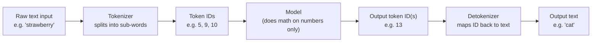

The tutor's core point: **the model does not understand language — it does mathematics on numbers.** Text is never fed in directly:

1. The tokenizer breaks input into **sub-words**, not full words and not individual characters.
2. Each sub-word/token is mapped to a **token ID** — an integer from the vocabulary. For example, one token might be represented by `5`, another by `9`, another by `10` — and it's the sequence `5, 9, 10` that actually enters the model.
3. The model itself has no notion of what "5" *means* — it only knows token IDs exist and manipulates them mathematically.
4. The model produces an output token ID (say `13`), which is then **detokenized** — reverse-mapped back to a word (e.g., `13 → "cat"`).

So conceptually, you could feed in "strawberry" and, after the model does its computation and the output gets detokenized, receive something entirely different like "cat" — the input and output words have no direct character-level relationship; everything passes through the numeric token-ID bottleneck in between.

### Subword tokenization: concrete examples

**Why subword (not character or whole-word) tokenization**: whole-word tokenization would need a huge vocabulary to cover every possible word/number, while character-level tokenization would make sequences extremely long. Subword tokenization is the practical middle ground used by real tokenizers.

Verbatim examples the tutor walked through:

```
"1234567"     -> "123" + "456" + "7"
"strawberry"  -> "str" + "aw" + "berry"
non-English   -> 2x to 4x more tokens for the same content
```

- A number string like `"1234567"` doesn't get split digit-by-digit or as one token — it's chunked arbitrarily by the tokenizer's learned sub-word units, e.g., `"123"` + `"456"` + `"7"`.
- `"strawberry"` is split into `"str"` + `"aw"` + `"berry"` — three sub-word tokens, not eight individual letters.
- **Non-English text costs more tokens** for the same amount of content — typically **2x to 4x more tokens** — because tokenizers are predominantly trained on English-heavy corpora, so non-English scripts/words fragment into more, smaller sub-word pieces.

> [!info]+ Interview questions covered
> - What is subword tokenization and why is it used instead of character-level or word-level tokenization?
> - What is detokenization?
> - Why does the same sentence in a non-English language typically consume more tokens (and cost more) than in English?

### The "strawberry" problem, resolved

**Why this matters**: "How many r's are in strawberry?" became a famous meme about LLMs failing simple counting tasks. Understanding tokenization explains *why*, and shows this isn't specific to the word "strawberry" — it would happen with any word.

A student asked directly about this well-known issue. The tutor's resolution:

- There is **no special issue with the word "strawberry"** specifically — it just happens to be the word people picked because it visibly has a double `"rr"`, making the failure easy to spot and share.
- The real cause: **any** word, when tokenized, gets broken into sub-word chunks (`"str"` + `"aw"` + `"berry"`), not into its exact sequence of individual characters.
- Since the model only ever sees token IDs for those sub-word chunks — not the literal letters — it has no direct way to "look at" and count individual characters like the two r's in "strawberry."
- This is a general property of subword tokenization, not a bug tied to one word: **any word typed in will lose its exact character-level structure once tokenized**, so any character-counting question on any word is fundamentally hard for a model to answer correctly from tokens alone.

> [!info]+ Interview questions covered
> - Why can't LLMs reliably count letters in a word (the "strawberry" problem)?
> - Is the strawberry counting failure specific to that word, or a general limitation of tokenization?

### Practical aside: token subscriptions and limits

A student asked about the validity period of a purchased model subscription (e.g., Claude Opus 4.8) bought for practice. The tutor clarified how such consumption-based plans typically work:

- Subscriptions are typically **monthly** — you pay per month, not per year.
- You get a **limited token allotment**, which refreshes on a roughly **five-hour rolling window**, repeating across the week.
- **Unused tokens do not carry over** once a refresh window passes.

This is a useful practical data point when reasoning about cost/capacity planning for a product that depends on a third-party model API: usage limits and refresh windows are part of the real operating constraints, not just the headline per-token price.


## Autoregressive Generation, Stop Tokens, and the Training Pipeline Recap

Before this point the lecture had been comparing closed vs. open-weight model pricing tiers (subscription vs. pay-per-use, like a bundled travel package vs. paying separately for flights, trains, and hotel). The tutor closes that thread with one line worth keeping: **pay-per-use API pricing** charges you only for the tokens you actually send/receive (e.g., $5 per million input tokens), while a **subscription** gives you a fixed monthly token allowance that is wasted if unused — the same "package vs. à la carte" trade-off you'd see when comparing a bundled trip to booking everything individually.

From there the lecture pivots to a much more fundamental system-design question: **how does a model actually produce text, token by token, and how does it know when to stop?** This is the mechanics underneath every LLM API call you design a serving layer around.

### Why "Autoregressive"? Generating One Token at a Time

Autoregressive models are "the type of model that got famous because of the language understanding ability" of transformers — and the defining property is: **the model generates exactly one token at a time**, and each newly generated token is fed back in as part of the input for generating the *next* token. This self-referencing loop (using your own previous output as new input) is exactly what "autoregressive" means.

Concretely, if the prompt tokens are `the cat sat`, the model doesn't emit a full sentence in one shot. It emits one token, appends that token to the running sequence, feeds the *entire* updated sequence back into itself, and emits the next token — repeating until some stopping condition fires.

### The Decoding Loop

The tutor draws this out as a loop diagram: prompt tokens go into the model, the model produces a token, a check decides whether to stop, and if not, the token gets appended and fed back into the model.

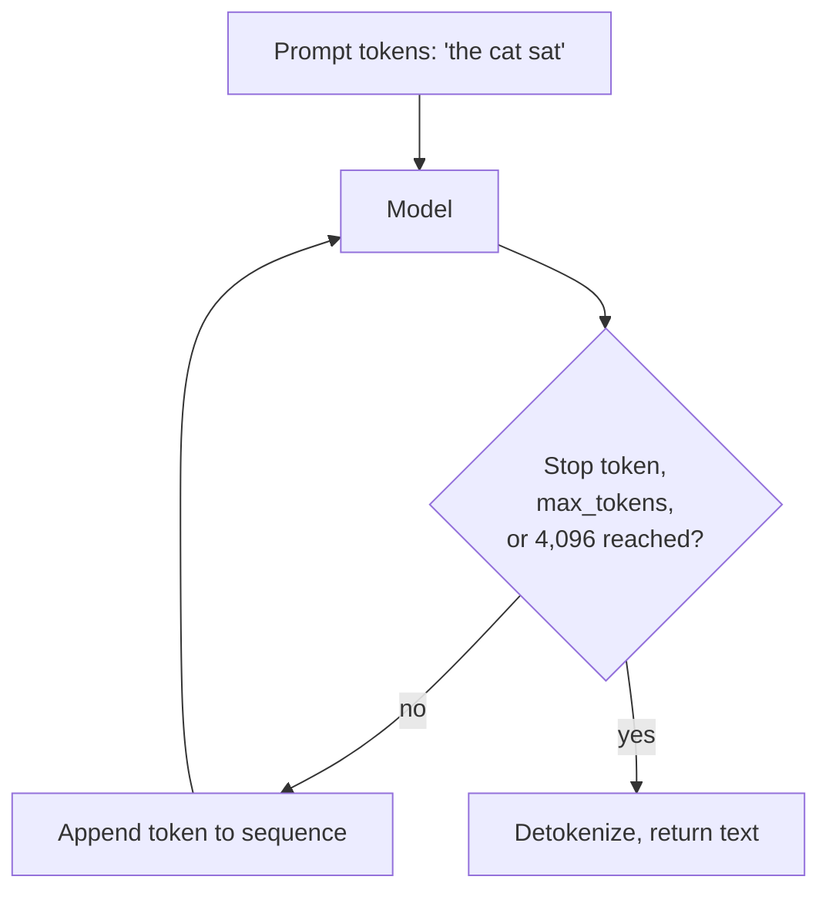

Two things terminate the loop:

1. **A stop token is emitted** — the model itself signals "I'm done."
2. **`max_tokens` / the context window limit (e.g., 4,096) is hit** — a hard ceiling enforced by the serving code, independent of what the model "wants" to do.

Implementation-wise, the tutor is explicit that this is **not** a simple `for` loop — it's closer to a `while` loop with a couple of exit checks run after every single decoding step, because your application code has no way of knowing in advance how many tokens the answer will take.

> [!info]+ Interview questions covered
> - What does it mean for a language model to be "autoregressive"?
> - How is text generation actually implemented as a loop in the serving code (for-loop vs. while-loop with checks)?

### How Does the Model Know When to Stop? Start and Stop Tokens

This is flagged directly as a common interview question: *"Where/how does the model know to stop generating?"*

The answer: the model is **trained**, during **supervised fine-tuning (SFT)**, to treat a specific reserved token id as a **stop token** — some designated number (the tutor jokingly represents it as an arbitrary large or "minus infinity"-style sentinel value) that never means an actual word. During SFT the model sees question–answer pairs like:

> **Q:** "What is the capital of France?"
> **A:** "The capital of France is Paris." → **[STOP]**

Once trained on enough pairs like this, the model *itself* learns to emit that stop-token id right after a complete answer. Your application server intercepts that id — it is never shown to the user — and simply stops calling the model again.

There is a symmetric **start token** as well: the very first token the model emits when answering is a "start" marker, and just like the stop token, the serving code intercepts it rather than passing it through to the user. Only the actual answer content between the start and stop markers is returned.

Why does this matter operationally? Without a trained stop token, the model has no internal notion of "done" — as the tutor puts it, "otherwise the model does know only one thing... like a child, if you ask them, they will keep on speaking." It will just keep predicting *some* next token forever. That is exactly why `max_tokens` exists as a backstop: if the stop token never fires (e.g., for a malformed or adversarial prompt), the hard token ceiling protects you from an unbounded, runaway generation — though the tutor notes that if you're forced to truncate this way, you'll likely get "garbage" rather than a clean answer, because the truncation happens mid-thought rather than at a semantically complete stopping point.

> [!info]+ Interview questions covered
> - How does an autoregressive LLM know when to stop generating? What is a stop token, and how is it learned?
> - What is a start token, and why is it hidden from the user?
> - Why do you still need a `max_tokens` limit even though the model has a learned stop token?

### Budgeting the Context Window: A Worked Example

The stop-token discussion feeds directly into a very practical serving concern: **how much room is actually left for the model's reply once you account for everything else that has to share the same context window?**

Worked example, using a 4,096-token context window:

| Component | Tokens |
|---|---|
| System prompt | 300 |
| Chat history (prior turns in the thread) | 3,000 |
| New user message | 200 |
| **Used total** | **3,500** |
| **Context window** | **4,096** |
| **Reply room (window − used)** | **596 tokens ≈ 450 words** |

$$
\text{reply room} = 4{,}096 - (300 + 3{,}000 + 200) = 4{,}096 - 3{,}500 = 596 \text{ tokens} \approx 450 \text{ words}
$$

Every previous message in the thread has to be re-sent into the model on each turn, because the model has no persistent memory across calls — the entire conversation history counts against the same fixed window as the system prompt, the new message, *and* the reply. As the thread grows, history eats more of the 4,096 budget and reply room shrinks proportionally.

The direct engineering implication: once you know the remaining reply-room budget, **the server-side logic should instruct the model to answer concisely** so the response actually fits. This is prompt engineering used defensively, not just stylistically — you're managing a hard token ceiling, not merely asking for a shorter answer as a preference.

> [!info]+ Interview questions covered
> - How do you compute how many tokens are left for a model's reply, given a fixed context window and an ongoing chat history?
> - Why does conversation history consume the same token budget as the system prompt and the new message?
> - Why would a serving layer instruct the model to "be concise," and what token-budget problem does that solve?

### Recap: Training the Behavior — Pretraining → SFT → RLHF

Having covered the decoding mechanics, the tutor recaps how a model gets *trained* to have this behavior in the first place — pulling together the full lifecycle in one diagram.

```mermaid
flowchart LR
    subgraph S1["Stage 1: Pretraining (Months)"]
        A1["Web corpus<br/>~16T tokens"] --> A2["Next-token prediction"]
        A2 --> A3["Base model<br/>(autocompletes)"]
    end
    subgraph S2["Stage 2: Supervised Fine-Tuning / SFT (Days)"]
        B1["50k curated dialogs"] --> B2["Imitate good answers"]
        B2 --> B3["SFT model<br/>(answers questions)"]
    end
    subgraph S3["Stage 3: RLHF (Weeks)"]
        C1["100k pairwise<br/>comparisons"] --> C2["Optimize for preference"]
        C2 --> C3["Aligned assistant"]
    end
    A3 --> B1
    B3 --> C1
```

| Stage | Data | Objective | Output | Rough timescale |
|---|---|---|---|---|
| 1. Pretraining | ~16T-token web corpus | Next-token prediction | Base model that autocompletes text | Months |
| 2. SFT | 50k curated dialogs | Imitate good, structured answers | SFT model that can answer questions | Days |
| 3. RLHF | 100k pairwise comparisons | Optimize for human preference | Aligned assistant | Weeks |

The pattern to notice: each stage consumes orders of magnitude less data than the one before it (trillions of tokens → tens of thousands of dialogs → hundreds of thousands of comparisons), and each stage is correspondingly much faster (months → days → weeks). Pretraining is what teaches the model language and world knowledge at massive scale; SFT is what teaches it the *format* of being a helpful assistant (question in, structured answer out, ending in a stop token); RLHF is what teaches it *which style of answer humans actually prefer* between multiple valid completions.

> [!info]+ Interview questions covered
> - What are the three main stages of turning a base language model into a deployed assistant?
> - Why does each successive training stage need so much less data than the one before it?
> - What is the difference between what pretraining teaches the model vs. what SFT teaches it?

### RLHF in Action: Building a Reward Model from Human Preferences

To make RLHF concrete, the tutor walks through a single example. Given the prompt **"Explain DNS"**, the (SFT) model can generate multiple candidate answers of very different quality:

- **Answer A** — crisp, 80 tokens.
- **Answer B** — rambling, 400 tokens.

```mermaid
flowchart TD
    P["Prompt: 'Explain DNS'"] --> A["Answer A: crisp, 80 tokens"]
    P --> B["Answer B: rambling, 400 tokens"]
    A --> L["Human labeler verdict:<br/>A beats B"]
    B --> L
    L --> R["Reward model training:<br/>push score(A) above score(B)"]
    R --> T["Trained reward model:<br/>scores future answers"]
```

A human labeler compares the two candidates and issues a verdict — here, "A beats B." That single pairwise judgment becomes a training signal: the **reward model** is trained so that its score for the preferred answer (A) is pushed above its score for the rejected answer (B). Repeat this over the full set of ~100k pairwise comparisons, and you end up with a **trained reward model** that can automatically assign a preference score to any candidate answer — without needing a human in the loop for every single judgment anymore. This reward model is what then drives the RLHF optimization step that nudges the underlying policy (the assistant model) toward generating more of the kind of answer that scores well — i.e., crisp and useful rather than rambling.

> [!info]+ Interview questions covered
> - What does a single RLHF training example look like end to end (prompt → candidates → labeler verdict → reward signal)?
> - What is a reward model, and what is it trained to do?
> - Why do you need a reward model at all instead of always using a live human judgment during RLHF?


## Reasoning Models: Chain-of-Thought, Test-Time Compute, and the Thinking-Budget Trade-off

Once a model has been through pretraining, SFT, and RLHF, it can answer questions — but "can answer" and "reasons correctly" are not the same thing. This section looks at *why* models trained to just blurt out an answer fail on multi-step problems, what chain-of-thought (CoT) reasoning buys you, and — critically for system design — what it **costs** in output tokens, latency, and GPU compute.

### Why a direct answer can be confidently wrong

Consider a simple word problem:

> Q: Muffins cost $3 each. Sam buys 4 muffins and pays with a $20 bill. How much change does Sam get?

A model trained to answer directly, without reasoning, jumps straight to a number:

```text
Direct answer
----------
Q: Muffins cost $3 each. Sam buys 4 muffins and pays with a $20 bill.
   How much change does Sam get?

Model: $12
      (wrong: that is the subtotal, not the change)
Output tokens: about 3
```

$12 is wrong — it's the *cost* of the muffins, not the *change* Sam receives back from the $20 bill. The model produced an answer in about 3 output tokens, but it never actually worked through the arithmetic; it pattern-matched to "a number" and stopped.

Now add a single instruction to the same question — "think step by step" — and the model is forced to lay out its intermediate work before answering:

```text
Chain of Thought (CoT)
----------------------
Q: same problem, plus "think step by step"

Model: 4 muffins x $3 = $12.
       $20 - $12 = $8.
       Change: $8
       (right)

Output tokens: about 25
```

The model multiplies (4 × $3 = $12), subtracts ($20 − $12 = $8), and lands on the correct change of $8. This is chain-of-thought reasoning: the model writes out the intermediate steps of a problem as tokens, rather than trying to leap directly to the final answer. The catch: getting there took roughly **25 output tokens** instead of 3 — about **8x more tokens** for one correct answer.

This is the core trade-off of reasoning models: correctness on multi-step problems versus token (and therefore compute and latency) cost.

> [!info]+ Interview questions covered
> - What is chain-of-thought (CoT) prompting/reasoning, and why do direct-answer models fail on multi-step arithmetic or logic problems?
> - Why does forcing a model to "think step by step" improve accuracy on math and reasoning tasks?

### Thinking mode vs. normal mode: how models are trained

This "reasoning" behavior isn't just a prompting trick applied at inference time — it can be baked into training itself. A model can be trained in one of a few configurations:

- **Two modes in one model**: the same model can operate in a "thinking" mode (produces a chain of thought before the final answer) or a "normal" mode (answers directly), and something in the system decides which mode to use per query.
- **Single mode only**: some models are trained to be *only* thinking-by-default, and some are trained to be *only* normal/direct — they never switch.
- **Both modes combined**: DeepSeek was called out as the first model reported to be open-sourced with both a thinking mode and a normal mode combined into a single model, rather than shipping them as two separate models.

If you send the *same* direct question to such a model without any reasoning trigger, you can get the quick-but-wrong "$12 in a few tokens" style answer. But once the reasoning behavior is triggered — either because the user explicitly asked for it, or because the product decided to add it — the model produces the step-by-step derivation and the correct answer.

This reasoning capability is especially valuable for **math problems where the model has no external tool access** (no calculator, no code execution): the model has to work through relations step by step internally, using more or fewer output tokens depending on how much "thinking" the problem actually needs.

### How does the "think step by step" instruction get added?

There are two ways a model ends up reasoning instead of answering directly:

1. **The user adds it explicitly** — either by typing "think step by step" / "think deeply" into the prompt, or by selecting a "thinking" option from a menu that many chat products expose.
2. **The product adds it automatically** — the system infers from the query itself that deeper reasoning is likely needed, and silently attaches the reasoning instruction/config before the query reaches the model.

A question that came up directly: *if you take a plain, non-reasoning model and manually append "think step by step" to your prompt, is that equivalent to using a dedicated reasoning model?*

The answer given: it depends on **who decides** reasoning is needed and **how**.

- If reasoning is only triggered because *you* explicitly selected it or typed it, that's one thing.
- Whether reasoning gets triggered *automatically* — without you asking — depends entirely on the product's own configuration/design choices: the product manager decides whether the system should infer "this query needs more thinking" and only then flip on the internal thinking-mode config.
- The important design principle: a product should **not** blindly always think more, and should not silently charge a user more for reasoning tokens they never asked for and don't know they're paying for. Extra thinking tokens directly translate into extra compute cost, so triggering reasoning mode should be an inferred, justified decision — not a default that increases everyone's bill without their knowledge.

> [!info]+ Interview questions covered
> - Can a normal model be made to "reason" just by appending "think step by step" to the prompt — is that the same as a true reasoning-trained model?
> - Who should decide whether a given query needs a reasoning/thinking mode — the user, or the product — and why does that decision matter for cost?
> - Why shouldn't a product auto-enable expensive "thinking" for every query by default?

### Test-time compute: just another name for inference time

A term you'll run into constantly once you're in this space: **test-time compute**.

Test-time compute simply means **prediction time** — i.e., **inference time**. From now on, wherever "test-time compute" appears, read it as "the compute spent while the model is generating a prediction/answer" (as opposed to compute spent during training).

Chain-of-thought reasoning is the clearest illustration of why test-time compute matters: a reasoning model spends *more* test-time compute per query (more output tokens generated before the final answer) than a direct-answer model, in exchange for better accuracy on hard problems.

> [!info]+ Interview questions covered
> - What does "test-time compute" mean, and how is it different from training-time compute?

### The thinking-budget trade-off table

Once a query goes into "thinking" mode, how much it "thinks" is itself a tunable **budget** — measured in output tokens the model is allowed to spend on its internal reasoning before producing the final answer. That budget directly determines latency and cost, given a fixed GPU decode speed.

The lecture fixes the decode speed at **50 tokens/sec** and walks through two thinking budgets:

| Thinking budget | Wait before answer | Output cost | Good for |
|---|---|---|---|
| 50 tokens | 50 / 50 = 1 s | 1x | chat, lookups |
| 500 tokens | 500 / 50 = 10 s | 10x | math, debugging |

The mechanics behind this table:

- A **non-reasoning model** still emits a token roughly every fixed interval (1/decode-speed), but it only needs to emit a *short* final answer — so you see the full answer quickly, in about 1–2 seconds for a ~50-token response.
- A **reasoning model** emits tokens at the *same* decode speed, but the final answer sits at the *end* of a much longer token stream — it has to generate all of its intermediate "thinking" tokens (up to ~500 in this example) before the answer appears. So even though each individual token comes out just as fast, you don't see anything usable until the entire chain has been generated — about 10 seconds later.

This is the merit/demerit trade-off of reasoning models in one line: **more thinking budget → higher latency and higher output-token cost, but better odds of a correct answer on hard, multi-step tasks.** A 500-token thinking budget costs 10x the tokens (and roughly 10x the wait) of a 50-token budget, at the same decode speed.

This is exactly why product design matters here: a simple chat lookup doesn't need a 500-token thinking budget, but a math or debugging task might need every bit of it. Blindly maximizing "thinking" for every query burns 10x the compute for queries that never needed it.

```mermaid
flowchart TD
    Q[User query] --> D{Does the product infer<br/>this query needs reasoning?}
    D -- No --> N[Normal / direct mode]
    N --> N1["~50 output tokens<br/>~1s wait at 50 tok/s decode<br/>1x cost — good for chat, lookups"]
    D -- Yes --> T[Thinking / CoT mode]
    T --> T1["~500 output tokens<br/>~10s wait at 50 tok/s decode<br/>10x cost — good for math, debugging"]
```

> [!info]+ Interview questions covered
> - Given a fixed decode speed (tokens/sec), how do you compute the latency of a reasoning response vs. a direct response?
> - What is a "thinking budget," and how does increasing it trade off latency and output-token cost against answer quality?
> - Why does a reasoning model feel slower even though it emits tokens at the same per-token speed as a direct model?

### A real-world illustration: reasoning vs. non-reasoning on an actual task

To make this concrete beyond the muffin example, the tutor described a real task he automated across roughly 200 of his own blog posts: inserting a short contextual note/link into each post at the *right* location within the existing text, rather than at an arbitrary spot.

- When the model was run in **proper reasoning mode**, it correctly identified the contextually appropriate place in each post and inserted the note there.
- When the same underlying model was run in **simple/direct mode** — even a strong model like Claude Opus 4.8 — it failed, inserting the note at essentially random locations in the text.

The task itself (find the semantically right insertion point across hundreds of documents) is exactly the kind of multi-step, non-trivial-relation-finding problem where reasoning mode earns its extra output tokens: it isn't retrieval or lookup, it requires working through context before acting — the same category of task as the muffin math problem, just applied to text editing instead of arithmetic.

> [!info]+ Interview questions covered
> - Can you give a non-math example of a task where chain-of-thought/reasoning mode meaningfully outperforms a direct-answer model?


## Chat Templates, System Prompts, and Context Growth Across Multi-Turn Conversations

Chat models don't magically "remember" a conversation — every single turn is stateless from the model's point of view. The illusion of memory in a chat product (ChatGPT, HelpBot, etc.) comes entirely from the orchestration layer resending the entire conversation history, formatted through a **chat template**, on every request. This section unpacks exactly what gets sent, why it keeps growing, what the model literally sees on the wire, and how a serving system keeps that growth under control.

### Why conversation context keeps growing turn over turn

Think of a chat session as a *thread*. **Turn 1** is the first exchange: the system prompt plus the user's first message get sent to the model as one set of tokens. Once the model replies, that reply becomes part of the history. **Turn 2** doesn't just send the new user message — it resends the system prompt, the first user message, the first assistant reply, *and* the new user message. Turn 3 resends all of that plus the second assistant reply and the third user message. The model has no built-in memory, so the orchestrator has to reconstruct the full thread from scratch on every single call.

This produces strictly increasing payload sizes, turn after turn, using the tutor's own worked numbers:

| Turn | Request contents | Tokens sent |
|---|---|---|
| Turn 1 | system + user msg 1 | ~340 |
| Turn 2 | system + user msg 1 + assistant msg 1 + user msg 2 | ~490 |
| Turn 3 | system + user msg 1 + assistant msg 1 + user msg 2 + assistant msg 2 + user msg 3 | ~640 |

Each new turn is more expensive than the last — not because the new message is longer, but because the *entire prior history* rides along with it. This is the direct, practical reason serving systems care about context window management (covered later in this section) and about techniques like KV caching (covered elsewhere in the course): resending identical prefixes on every turn is wasteful unless the system can reuse work already done.

> [!info]+ Interview questions covered
> - Why does the token cost of a multi-turn chat conversation increase with every turn, even if each individual message is short?
> - What exactly gets resent to the model on turn 2, turn 3, etc. of a conversation?

### The chat template: what the model literally receives

A **chat template** is the exact string format — with special delimiter tokens — that gets fed into the model. The model doesn't see "system message" or "user message" as structured JSON; it sees a flat sequence of tokens with special markers baked in during pretraining/fine-tuning that tell it where one role's turn ends and another's begins. Using the ChatML-style format shown on the slide:

```text
<|im_start|>system
You are HelpBot, a concise and friendly assistant.
Today's date: {{current_date}}.
Never give medical diagnoses.<|im_end|>
<|im_start|>user
What is a token?<|im_end|>
<|im_start|>assistant
A token is a chunk of text, about 0.75 words on average.<|im_end|>
<|im_start|>user
Give an example.<|im_end|>
<|im_start|>assistant
```

Notice the structure: `<|im_start|>role ... <|im_end|>` repeated for each turn, and the request always ends with a dangling `<|im_start|>assistant` (no closing tag yet) — that's the cue telling the model "it's your turn to generate now."

`<|im_start|>` and `<|im_end|>` are **special tokens** — reserved vocabulary entries that are added specifically for this purpose and would never naturally occur in scraped internet text. Different model families invent their own special tokens (Llama-family models use their own conventions, for instance). This is intentional: if a string like `<|im_start|>` ever *did* show up in raw training data, it would be treated as noise and stripped out, precisely because the model needs an unambiguous, exclusive signal for "system prompt starts here," "user turn starts here," "assistant turn starts here," and where each one ends.

> [!info]+ Interview questions covered
> - What is a chat template, and why can't you just concatenate messages with newlines?
> - What are special tokens like `<|im_start|>` / `<|im_end|>`, and why does every model family define its own?
> - Why would a special token like `<|im_start|>` never appear naturally in a model's training corpus?

### System prompt and dynamic date injection

The **system prompt** is the first block in the chat template — it sets the assistant's persona, behavioral rules, and guardrails (e.g., "You are HelpBot, a concise and friendly assistant... Never give medical diagnoses."). Notice the line `Today's date: {{current_date}}.` — this is a **template placeholder**, not literal text sent to training data.

Here's the "why before what": a model is frozen at its training cutoff. If a model was trained one or two months ago, it has no way of knowing what today's actual date is — it would only "remember" whatever date was implicit in its training data, which is stale and wrong by the time it's deployed. But users frequently ask date-relative questions ("what's due this week," "how many days until X"), and the model needs to reason about *today*, not about some date months in the past.

The fix is simple: **inject the date at request time, not at training time**. Right before the request is sent to the model, the serving system fills in the `{{current_date}}` placeholder using something like `System.currentTimeMillis()` in Java (or the equivalent date/time call in Python). This happens fresh on every request, so the model always has an accurate "today" even though its weights were frozen long ago. The alternative — giving the model a tool it can call to ask for the date — is also viable, but direct injection into the system prompt is the simpler, "just feed it to the model" approach.

> [!info]+ Interview questions covered
> - Why doesn't an LLM automatically know today's date, and how do production systems solve this?
> - What is dynamic date injection, and where in the request pipeline does it happen?
> - What's the difference between injecting the date into the system prompt vs. giving the model a "get current date" tool?

### Context window management: summarizing to reclaim tokens

Since every turn resends the *entire* history, long conversations eventually accumulate a lot of content that's no longer useful — old turns that don't materially help the model answer the current question but still cost tokens on every request. The fix, discussed earlier in the course's AI-agent material, is **context compaction (summarization)**: replace old turns with a compressed summary that captures what still matters.

Concretely: summarizing turns 1 through 10 (about 1,500 tokens) down to roughly a 100-token summary **frees up about 1,400 tokens** that no longer have to be resent on every subsequent call. This summarization is itself done using an LLM. More advanced compaction strategies are deferred to a dedicated AI memory class later in the course — for now, the mental model is simply: *old, no-longer-useful turns get compressed instead of carried forever.*

> [!info]+ Interview questions covered
> - What is context window management / context compaction in a chat system, and why is it necessary?
> - Give a concrete example of how much token budget summarization can reclaim in a long conversation.

### Orchestration, agents, and tool use — bridging to serving

The broader topic this section sits under is **orchestration, agents, and tool use** — the layer responsible for stitching together history loading, prompt assembly, tool calls, and memory before anything reaches the model. Tool use and memory each get their own dedicated deeper class later in the course; here, the key takeaway is simply that the orchestrator is the component responsible for taking a raw user message and turning it into a fully-formed chat-template request.

This naturally leads into the request lifecycle for serving. Once the date-injection and compaction questions are settled, the flow proceeds like this: the browser sends `POST /chat` with a `chat_id` and the new message to the **gateway**, which authenticates the request and forwards it to the **orchestrator**. The orchestrator then loads prior history, truncates/summarizes it if needed, adds the system prompt (with the date injected), and renders the final chat template — at which point the fully-assembled text is handed off to the **tokenizer**.

```mermaid
sequenceDiagram
    participant B as Browser
    participant G as Gateway
    participant O as Orchestrator
    B->>G: POST /chat (chat_id + new message)
    G->>O: authenticated request
    Note over O: load history, truncate/summarize,<br/>add system prompt, render chat template
```

The remainder of this flow — handoff to the tokenizer and GPU worker — is covered in full detail in the next section on the end-to-end serving request flow.

> [!info]+ Interview questions covered
> - What role does the orchestrator play between the API gateway and the model-serving layer in a chat system?
> - At a high level, what steps happen to a user's message between the browser and the tokenizer?


## Streaming the Reply: SSE vs WebSockets, and Forcing Structured JSON Output

This section closes out the serving request flow by zooming into two practical questions a system designer must answer: **how should the token stream be delivered to the browser** (Server-Sent Events vs WebSockets), and **how do you make a model reliably return machine-parseable JSON** instead of free-form text. Both questions matter because a chat product isn't just "call the model" — it's a live network protocol decision and a reliability contract with every downstream consumer of the model's output.

### Recap: where streaming happens in the request flow

Before comparing protocols, it helps to see exactly where streaming sits inside the full request lifecycle, since that's what determines *why* a one-directional channel is normally enough.

```mermaid
sequenceDiagram
    participant Browser
    participant Gateway
    participant Orchestrator
    participant Tokenizer
    participant GPUWorker as GPU Worker

    Browser->>Gateway: POST /chat (chat_id + new message)
    Gateway->>Orchestrator: authenticated request
    Orchestrator->>Orchestrator: load history, truncate, render chat template
    Orchestrator->>Tokenizer: prompt text
    Tokenizer->>Orchestrator: token ids
    Orchestrator->>GPUWorker: token ids
    Note over GPUWorker: Prefill reads all tokens in one pass<br/>TTFT ~200-500 ms
    loop Decode, one token per step (~20 ms each)
        GPUWorker->>Orchestrator: next token id
        Orchestrator->>Gateway: detokenized SSE chunk
        Gateway->>Browser: SSE chunk renders instantly
    end
    GPUWorker->>Orchestrator: stop token
    Orchestrator->>Orchestrator: append reply to chat store
```

The request enters as a single HTTP POST. **Prefill** consumes the whole prompt in one pass and produces the first token — this is the **time-to-first-token (TTFT)**, roughly **200–500 ms**. After that, the GPU worker enters a **decode loop**, generating **one token at a time, about 20 ms each**, and every token is detokenized and pushed back to the browser as it's produced. Once a stop token is generated, the loop ends and the orchestrator appends the full reply to the chat store.

Notice the direction of data in that loop: tokens only flow **server → browser**. The browser already sent everything it needed to send (the prompt) in the initial POST. This observation is exactly what determines the choice of streaming protocol.

### Why it matters: streaming is what makes a 6-second wait feel instant

Before picking a protocol, it's worth motivating *why* streaming exists at all. If the server buffers the entire answer and returns it only once generation is complete, the user stares at a **blank screen for the full generation time** — for example, **6.5 seconds** for a long reply — before anything appears.

If instead the server streams each token as it's decoded, the user sees the **first token in ~300 ms** and then watches text arrive continuously at roughly **50 tokens/second** (which lines up with the ~20 ms/token decode rate above: \(1000 / 20 = 50\)). That is *faster* than typical human reading speed of **5–7 tokens/second**, so the user perceives the reply as effectively instantaneous even though the model hasn't finished generating.

| | Unstreamed | Streamed |
|---|---|---|
| What the user sees first | Nothing, until full answer is ready | First token in ~300 ms |
| Wait for full answer | Full generation time (e.g., 6.5 s) of blank screen | Same total time, but content appears continuously |
| Perceived speed | Slow, feels stuck | Faster than human reading speed (~50 tok/s vs 5–7 tok/s) |

> [!info]+ Interview questions covered
> - What is time-to-first-token (TTFT), and roughly what should it be for a chat product?
> - Why does streaming improve perceived latency even when total generation time is unchanged?
> - How do decode-step latency (ms/token) and tokens/second throughput relate to each other?

### SSE vs WebSockets: picking the right channel

**Why this matters:** picking the wrong transport either wastes server resources holding open a bidirectional connection you don't need, or fails outright for use cases that genuinely require two-way, continuous communication. This is a classic system-design trade-off interviewers probe directly by asking "when would you *not* use SSE for a chat app?"

**Server-Sent Events (SSE)** is a one-directional streaming protocol: only the **server** can continuously push data over the open connection; the browser cannot send anything continuously back over that same channel. This is exactly what a normal chat turn needs — the user sends one message (a single HTTP request), and the server streams the reply back token by token.

**WebSockets** provide a **bidirectional** channel: both the client and the server can send data continuously, in real time, in both directions.

| | Server-Sent Events (SSE) | WebSockets |
|---|---|---|
| Direction | One-way: server → client only | Two-way: client ↔ server |
| Client → server communication | Only via the initial HTTP request | Continuous, in either direction, at any time |
| Typical chat-turn fit | Perfect — user sends once, server streams reply | Overkill for a single request/response turn |
| Needs continuous input from client? | No | Yes |
| Example use case | Standard ChatGPT text reply, including tool-call results | Voice mode (continuous audio in), Uber/food-delivery live location (continuous updates both ways) |

#### Worked examples from the transcript

- **Plain chat turn** — "Who is the Prime Minister of India?" The browser makes a single HTTP POST request; the server does everything (including any tool calls) and streams the answer back. Since the user only needs to *receive* continuously, not *send* continuously → **SSE**.
- **Tool calling** — same reasoning: the initial request is a normal HTTP call, the tool call happens server-side, and the full response streams back to the user via SSE. The **first request is HTTP, then SSE handles the reply**.
- **Voice mode** — every word the user speaks must go to the server continuously and in real time so it can be analyzed as it arrives, while the server is also continuously streaming audio/text back. Continuous data in *both* directions → **WebSocket**.
- **Non-AI analogy (Uber / food delivery)** — the tutor's example for a "non-AI application" that genuinely needs bidirectional streaming: both the rider's and the driver's (or delivery person's) locations are being continuously updated and sent in both directions. WebSockets fit that pattern well, illustrating that this isn't an AI-specific decision — it's a general "does either side need to push continuously?" question.

```mermaid
flowchart TD
    Q["Does the client need to send data continuously,<br/>not just once per turn?"]
    Q -->|No — client sends once, server streams back| SSE["Use SSE<br/>(chat replies, tool-call results)"]
    Q -->|Yes — both sides push continuously| WS["Use WebSocket<br/>(voice mode, live location updates)"]
```

> [!info]+ Interview questions covered
> - What is the difference between Server-Sent Events and WebSockets?
> - When would a ChatGPT-like product use SSE, and when would it need a WebSocket instead?
> - Why is voice mode a WebSocket use case while normal text chat is not?
> - Give a non-AI example of a WebSocket use case and explain why it needs bidirectional streaming.

### Structured Output: Enforcing JSON

**Why this matters:** the moment a model's output feeds a downstream system (a tool call, a UI component, another service) instead of a human eyeball, free-form text becomes a liability — a single stray sentence before or after the JSON breaks the parser and crashes the app. This is one of the concrete failure modes the tutor calls out from his own "AI System Failures" project: production incidents where a rushed release or a silent model-behavior change turned a "usually works" prompt into a broken pipeline.

Just instructing the model in the system prompt — *"reply only with a JSON format like this"* — is not sufficient on its own:

```python
"Reply only with JSON matching {\"sentiment\": \"positive\" or \"negative\", \"confidence\": number 0 to 1}"
```

A model can *usually* follow that instruction, but larger or more complex prompts can confuse it, and it may drift into adding explanatory text around the JSON. **Prompt-only JSON is not reliable enough for production.**

This is why essentially every serving library (OpenAI's client, Ollama, and others) exposes a dedicated **`response_format`** parameter that forces the output into a strict format:

From the tutor's code walkthrough (OpenAI-compatible client, pointed at a local Ollama server):

```python
import os
from openai import OpenAI

client = OpenAI(
    base_url=os.getenv("LLM_BASE_URL", "http://localhost:11434/v1"),
    api_key="ollama",
)
MODEL = os.getenv("LLM_MODEL", "qwen2.5:7b-instruct")

resp = client.chat.completions.create(
    model=MODEL,
    temperature=0,
    response_format={"type": "json_object"},
    messages=[
        {"role": "system", "content": 'Reply only with JSON matching {"sentiment": "positive" or "negative", "confidence": number 0 to 1}'},
        {"role": "user", "content": "I love this product!"},
    ],
)
print(resp.choices[0].message.content)
```

Key details to observe in this snippet:

- **`response_format={"type": "json_object"}`** — the line that actually enforces JSON mode. Different libraries expose this differently (e.g., a `format="json"` decode option), but the mechanism is the same idea across providers.
- **`temperature=0`** — deterministic decoding, appropriate for a structured/classification-style task where you want the same input to reliably produce the same structured answer.
- The **system message still carries the schema hint** (field names, allowed values) — `response_format` enforces *that the output is valid JSON*, not *which* JSON schema to use. You still need to describe the desired shape in the prompt.

#### How it works under the hood

Every model has reserved **special tokens** for structural boundaries — things like `<|im_start|>`, `<|im_end|>`, or dedicated JSON-mode tags. When you set `response_format`, the client library and serving stack automatically inject and constrain generation around these special tokens (or apply grammar/schema-constrained decoding) so you, the developer, don't have to manually manage that formatting. This is exactly the abstraction these libraries are built to hide from you.

#### Reliability numbers

- **Without `response_format`** (prompt instruction alone): the model can still deviate — enough that naively parsing the string as JSON will eventually fail, and that failure crashes the app if not handled.
- **With `response_format`**: reliability jumps to roughly **99.99%** valid JSON — but *not 100%*. It can still fail occasionally.

That residual gap is the actionable takeaway: **always wrap the JSON parse in error handling**, regardless of whether `response_format` is set, because "almost always works" is not the same guarantee as "always works," and the app must degrade gracefully (retry, fallback, or surface an error) rather than crash on the rare malformed response.

> [!info]+ Interview questions covered
> - Why is instructing a model via the system prompt alone not reliable enough for structured output?
> - What does the `response_format` (or JSON-mode) parameter actually guarantee, and what does it not guarantee?
> - How do serving libraries use special/reserved tokens to enforce structured output formats?
> - Even with JSON mode enabled, why must your application still handle JSON-parsing failures?


## Grounded Responses, Tool Calling, and the Guardrails/Safety Pipeline

### Why Tool Calling Exists: The Model Is "Just" a Next-Token Predictor

Before introducing tools, the tutor poses a test question: if you ask ChatGPT for the *current* weather in a city **without** giving it any tools, will it actually give you the current weather?

The answer the class arrives at: no — and the dangerous part is not just that it's wrong, it's that **it won't tell you it doesn't know**. The reason is structural, not a bug: the model is a next-token predictor. It has learned that producing *some* plausible-sounding number makes the user feel like it "is thinking something," so it will happily emit a made-up temperature rather than admit uncertainty. This is the model-hallucination behavior that tool/function calling exists to fix — you cannot rely on next-token prediction alone for facts that change in real time (like live weather), so the model needs a way to reach outside itself for ground truth.

> [!info]+ Interview questions covered
> - Why can't an LLM answer real-time factual questions (e.g., current weather) reliably on its own?
> - What does it mean that a model is "just a next-token predictor," and why does that lead to hallucination?

### The Function-Calling / Tool-Call Flow

Function calling gives the model access to external tools so it doesn't have to guess. The mechanism uses **two model calls** around a tool execution step in the middle:

1. The system message tells the model which tools are available, e.g. `get_weather(city)`.
2. The user asks a question that needs the tool.
3. The model's **first** response is not a natural-language answer — it's structured text: a `tool_call` naming the function and its arguments (e.g., `get_weather({"city": "Pune"})`). This is still just model output — "just structured text," nothing has actually run yet.
4. The application (not the model) is responsible for actually executing that call — against an external MCP server, some backend code, a Python function, or "anything." The tool returns a real result.
5. That tool result is fed back into the LLM along with the original question for a **second** model call, which produces the final, natural-language answer for the user.

From the notes slide, verbatim:

```text
[system]     ...tools available: get_weather(city)
[user]       "Weather in Pune?"
[assistant]  tool_call get_weather({"city": "Pune"})    <- model output, just structured text
[tool]       {"temp_c": 31, "sky": "cloudy"}             <- the app ran the function
[assistant]  "It is 31 C and cloudy in Pune."            <- second model call writes this
```

```mermaid
sequenceDiagram
    participant U as User
    participant M as Model (LLM)
    participant T as Tool / Function (e.g. MCP server, backend code)

    U->>M: "Weather in Pune?"
    M->>M: emits tool_call get_weather({"city": "Pune"})
    M->>T: app executes the tool call
    T->>M: {"temp_c": 31, "sky": "cloudy"}
    M->>U: "It is 31 C and cloudy in Pune." (2nd model call)
```

> [!info]+ Interview questions covered
> - Walk through the full request/response lifecycle of an LLM function call, from `tool_call` emission to final answer.
> - Why does function calling require two separate model calls instead of one?
> - Who actually executes the tool — the model or the application?

### Grounded vs. Non-Grounded Responses

Once the tool result comes back, the system faces a choice: hand the raw data straight to the user, or translate it first.

- **Non-grounded response**: bombarding the user directly with raw structured output — e.g. `temp = 31, sky = cloudy`. Technically correct, but not something a user finds welcoming.
- **Grounded response**: the same information rewritten by a second model call into a natural, user-friendly sentence — *"It is 31°C and cloudy in Pune."*

The tutor's framing: a model "cannot simply feed the JSON to the users." Grounded response means presenting the answer "in the format in which they'll be happy" — i.e., the model must ground the tool's raw output in natural language before it reaches the user.

| | Non-grounded response | Grounded response |
|---|---|---|
| Content | Raw tool/JSON output (`{"temp_c": 31, "sky": "cloudy"}`) | Natural-language sentence built from that output |
| Produced by | The tool call result itself | A second LLM call that consumes the tool result |
| User experience | Feels like raw data dump | Feels like a normal, welcoming answer |

> [!info]+ Interview questions covered
> - What is the difference between a "grounded" and a "non-grounded" response in an LLM system?
> - Why can't tool output be returned to the user as-is?

### Guardrails, Safety, and Quality: A Layered Defense

The lecture then transitions into the **"6. Guardrails, Safety, and Quality"** section, motivated by a concrete requirement: the system must not answer a heavily biased political question, and must refuse something like "how do I make a nuclear bomb." Meeting that requirement isn't one check — it's **four layers** of defense, each with a different cost and a different place in the pipeline.

```mermaid
flowchart TD
    A[User message] --> B["Layer 3: Input moderation classifier<br/>small, fast model, +20 to 50 ms"]
    B -->|flagged| C["Refusal UX / canned reply<br/>0 ms — main model never invoked"]
    B -->|clean| D[Main model on GPU]
    D --> E["Layer 1: RLHF values<br/>baked in, 0 ms added"]
    D --> F["Layer 2: System prompt rules<br/>~30 ms"]
    D --> G[Token stream begins]
    G --> H["Layer 4: Output moderation<br/>classifies accumulated text every ~50 tokens"]
    H -->|flagged mid-stream| I[Cancel stream, replace with refusal]
    H -->|clean| J[Final streamed answer delivered]
    I --> C
```

| Layer | What it is | Where it runs | Added latency |
|---|---|---|---|
| Layer 3 — Input moderation classifier | A small, fast dedicated classifier model that screens the incoming user message | Before the main model is ever called | +20 to 50 ms |
| Layer 1 — RLHF values | Refusal behavior already trained into the main model's weights via RLHF | Inside the main model itself | 0 ms (already paid for during training) |
| Layer 2 — System prompt rules | Explicit safety/behavior instructions injected into the system prompt | Inside the main model call | ~30 ms |
| Layer 4 — Output moderation | Classifies the accumulated generated text periodically (every ~50 tokens) while streaming | On the outgoing token stream | Ongoing, checked per batch of tokens |

A few things worth being explicit about, since the layer *numbers* don't match the *chronological order* of execution:

- **Layer 3 runs first**, gating the request before it ever reaches the expensive main model. If it flags the input, the reply is a canned refusal at essentially zero cost — the main model on the GPU is never invoked at all.
- If the input is clean, it proceeds to the **main model on GPU**, which already carries two layers of protection baked into the call itself: **Layer 1** (RLHF-trained refusal behavior — the model has learned during training to say "I don't know" or refuse disallowed requests, at no extra runtime cost) and **Layer 2** (system prompt rules, costing roughly 30 ms to apply).
- Only after the model starts **streaming tokens** does **Layer 4** kick in: an output moderation classifier periodically re-checks the accumulated generated text (about every 50 tokens). If it detects something disallowed mid-stream, the stream is cancelled and swapped for a refusal; otherwise the final streamed answer reaches the user clean.

This is the layered answer to "how do you stop ChatGPT from answering a nuclear-bomb-building question or a heavily biased political one": it isn't one filter, it's input-side classification, training-time alignment, prompt-level rules, and output-side re-checking during streaming, each catching what the previous layer might miss.

The lecture previews that the next step is to zoom into each layer individually, starting with the **first level of checks** — the Layer 3 input moderation classifier — and later detailing output moderation as a sequence diagram across Browser → Gateway → Model server → Output classifier.

> [!info]+ Interview questions covered
> - Design the safety/guardrail architecture for a ChatGPT-like system. How many layers would you use, and where does each sit in the request path?
> - Why is it cheaper to reject unsafe requests before the main model runs than after?
> - What's the difference between safety behavior that's "baked in" via RLHF versus enforced by a system prompt versus enforced by a separate classifier?
> - How do you handle a request that only becomes unsafe partway through generation (i.e., after tokens have already started streaming)?


## The Four-Layer Guardrails Pipeline: RLHF, System Prompt, Input Classifier, and Streaming Output Moderation

This section closes out the "Guardrails, Safety, and Quality" design discussion by walking back through all four safety layers end-to-end, then zooming into the hardest one to get right: **Layer 4, output moderation on a live token stream**.

The full pipeline, as drawn on the whiteboard, looks like this:

```mermaid
flowchart TD
    A[User message] --> B{Layer 3: input moderation classifier<br/>small, fast model, +20 to 50 ms}
    B -- flagged --> C[Refusal UX / canned reply<br/>0 ms of main-model cost]
    B -- clean --> D[Main model on GPU]
    D --> D1[Layer 1: RLHF values<br/>baked in, +0 ms]
    D --> D2[Layer 2: system prompt rules<br/>+30 ms]
    D1 --> E[Token stream]
    D2 --> E
    E --> F{Layer 4: output moderation<br/>classify accumulated text every 50 tokens}
    F -- flagged mid-stream --> G[Cancel stream,<br/>replace with refusal]
    F -- clean --> H[Final streamed answer]
```

### Why four layers instead of one

A single safety check is never enough because each layer catches a different failure mode at a different point in the request lifecycle, and each one has a different cost:

| Layer | What it checks | Where it runs | Added latency |
|---|---|---|---|
| Layer 1 — RLHF | Values baked into model weights during training | Inside the forward pass | **0 ms** (already "free" — no extra inference step) |
| Layer 2 — System prompt | Behavioral rules injected into every request | Prepended to the prompt | **~30 ms** |
| Layer 3 — Input moderation classifier | Should this user question even be answered? | Before the main model runs | **+20 to 50 ms** |
| Layer 4 — Output moderation | Is the text the model is generating actually unsafe? | Continuously, on the token stream | Checked every 50 tokens, not per token |

### Layer 1 — RLHF: refusal behavior baked into the weights

Layer 1 is the cheapest layer because it costs **zero extra time** — nothing is added to the pipeline; it's already "baked in" via training. If someone asks the model something like "how to build a nuclear bomb," the model doesn't need an external check to refuse — RLHF has already trained it, on examples like this, to say "this is outside of my scope" rather than answer directly. Since this refusal capability lives inside the model's own weights, invoking it during inference is free — it's the same forward pass the model would run anyway.

### Layer 2 — System prompt: rules layered at request time

Layer 2 costs about 30 ms and is where behavioral and confidentiality rules are injected as text at the start of every conversation — for example, instructing the model to behave politely, or to **not reveal what data it was trained on**.

The data-source rule matters for a very concrete legal reason: if a model was trained on, say, Reddit's data, and a user simply asks the model "which data were you trained on?" and it answers "Reddit," that company could sue the model provider. So the system prompt explicitly tells the model it doesn't have to reveal its data sources if asked.

**Why system prompts alone aren't a complete defense.** Everything the model does, ultimately, is matrix multiplication running on a GPU — numbers getting multiplied. Skilled hackers who understand this underlying math (and are often good mathematicians) can craft an adversarial prompt that effectively nullifies the system prompt's instructions — this is **jailbreaking**. Because the system prompt is just more tokens competing for influence over the same numerical computation, there's no hard guarantee it can't be overridden, which is precisely why the pipeline layers *additional*, independent checks (Layer 3 and Layer 4) rather than relying on the system prompt alone.

> [!info]+ Interview questions covered
> - What is RLHF's role in model safety, and why does it add zero inference latency?
> - What does the system prompt layer actually enforce, and why can it be jailbroken?
> - Why do production LLM systems need more than one safety layer?

### Layer 3 recap — Input moderation classifier

Layer 3 is a **separate, small, fast classifier model** that runs on the raw user message *before* it ever reaches the main model. Its only job is binary: should this question be answered or not? If flagged, the pipeline never pays for a main-model forward pass at all — the user immediately gets a canned refusal reply in the UX, at effectively 0 ms of main-model cost. This is why Layer 3 is worth the small added latency (20–50 ms): it's cheap insurance that avoids running the (much more expensive) main model on requests that were never going to be answered anyway.

### Layer 4 — Output moderation: why you can't just check tokens as they stream

This is the layer the lecture spends the most time motivating, because the naive approach — check each generated token as it streams out — doesn't work.

**Why before what:** a single token, in isolation, might not carry any negative meaning at all. Any individual word, taken alone, could just as easily be part of something positive, negative, or completely neutral. It's only when you **club many tokens together into a sentence** that a harmful meaning can emerge. So a moderation classifier that inspects tokens one at a time, in isolation, is fundamentally unreliable — it's checking the wrong unit of meaning.

This immediately suggests the fix: don't check individual tokens — check **accumulated text**. But that raises a second design question: how often should you check the accumulated text?

**Why not check after every single token, then?** Because that would waste an enormous amount of compute and time — running a classifier call after every generated token is overkill when meaning only shows up at the sentence level. So the system has to strike a balance between safety and efficiency.

**The resolution: batch the check every 50 tokens.** Instead of verifying continuously, the output classifier is invoked periodically — after tokens 1–50, then again after tokens 51–100, and so on. This means a *few* tokens of potentially bad content could reach the user before the next check catches it, but that's an accepted trade-off: it avoids wasting time on every-token verification while still catching problems within a bounded window.

#### The streaming sequence: Browser, Gateway, Model server, Output classifier

The tutor walks through this exact interaction as a sequence diagram with four participants: the **Browser** (end user), the **Gateway** (orchestrator), the **Model server** (runs the main model), and the **Output classifier** (the Layer 4 safety model).

```mermaid
sequenceDiagram
    participant Browser
    participant Gateway
    participant ModelServer as Model server
    participant OutputClassifier as Output classifier

    Browser->>Gateway: prompt (already passed input moderation)
    Gateway->>ModelServer: generate
    ModelServer->>Gateway: tokens 1 to 50
    Gateway->>Browser: stream tokens
    Gateway->>OutputClassifier: classify accumulated text (50 tokens)
    OutputClassifier->>Gateway: ok
    ModelServer->>Gateway: tokens 51 to 100
    Gateway->>Browser: stream tokens
    Gateway->>OutputClassifier: classify accumulated text (100 tokens)
    OutputClassifier->>Gateway: flagged
    Gateway->>ModelServer: abort generation
    Gateway->>Browser: cancel stream, replace with refusal message
```

Walking through what happens:

1. The prompt arrives at the Gateway having **already passed Layer 3 input moderation** — this sequence only covers what happens after generation has started.
2. The Gateway tells the Model server to `generate`.
3. The Model server streams tokens 1–50 back to the Gateway, which immediately relays them to the Browser — the user sees text appearing in real time, with no safety-induced delay yet.
4. In parallel, once 50 tokens have accumulated, the Gateway sends that accumulated text to the Output classifier and gets back `ok` (clean/positive).
5. Generation continues: tokens 51–100 stream to the Browser exactly the same way.
6. This time, when the Gateway sends the accumulated 100-token text to the Output classifier, the response comes back `flagged` (negative).
7. The Gateway immediately tells the Model server to **abort generation** and tells the Browser to **cancel the stream and replace it with a refusal message**.

The key design insight is that streaming and safety-checking happen concurrently, not sequentially: tokens keep flowing to the user continuously while the classifier evaluates the *previous* batch in the background. The system never blocks the stream waiting on a per-token check — it only interrupts the stream reactively, once a batch comes back flagged.

> [!info]+ Interview questions covered
> - Why can't output moderation simply classify each generated token individually?
> - How do you design a streaming safety check that balances latency against safety coverage?
> - Walk through what happens, end-to-end, when a mid-stream response gets flagged as unsafe.
> - What roles do the Browser, Gateway, Model server, and Output classifier play in a production LLM serving stack?


## Serving at Scale: Why Q, K, V Behave Differently — Setting Up the KV Cache

### Closing the loop on output moderation: the classifier is a tiny model

Before moving to serving, the tutor closes a question left over from the streaming-moderation flow: **why is the output classifier itself so small?**

The classifier that checks accumulated generated text (e.g., every 50 tokens) is **not another LLM**. It is a very small model — at most around **1 million parameters** — compared to the **trillion-parameter** main model doing generation. The analogy used: it's like an **email spam detector**. A spam filter doesn't need to be a giant language model to decide "flag" vs. "ok"; it just needs to be good at a narrow binary classification task. This is why running it on every 50-token chunk is cheap enough to do continuously on the stream without materially slowing down generation.

> [!info]+ Interview questions covered
> - Why is the output-moderation classifier much smaller than the main generation model?
> - Why can a small (~1M parameter) model be sufficient for content moderation?

### Transition: Section 7 — Deployment, Scaling, and Cost Optimization

With moderation covered, the lecture moves into the deployment/scaling section of the ChatGPT system design, previewed with three sub-topics that recur in serving-cost discussions:

- **The KV Cache**
- **Paged Attention**
- **Prompt Caching / Prefix Sharing**

The accompanying whiteboard slide shows the shape of the problem these three ideas solve together: many concurrent users share a system prompt but have private questions/answers, and the serving engine (vLLM is named as the reference implementation, with a **block manager** component) needs a memory layout that avoids duplicating the shared part per user.

```mermaid
flowchart TD
    U1["User 1: system prompt + question"] --> BT1["Block table 1"]
    U2["User 2: system prompt + question"] --> BT2["Block table 2"]
    U100["User 100: system prompt + question"] --> BT100["Block table 100"]
    BT1 --> SP["Shared prefix blocks: system prompt"]
    BT1 --> P1["Private blocks: question 1 + answer 1"]
    BT2 --> SP
    BT2 --> P2["Private blocks: question 2 + answer 2"]
    BT100 --> SP
    BT100 --> P100["Private blocks: question 100 + answer 100"]
```

Each user gets their own **block table** (an index into memory blocks), but block tables can point to a **shared set of blocks** for the identical system-prompt prefix, while each user's own question + generated answer lives in **private blocks**. This is the memory-management picture that Paged Attention and prefix sharing are built on top of — the lecture flags it here as a prerequisite concept before diving into the mechanics of the KV cache itself.

### Why K, Q, V don't behave symmetrically at generation time

To motivate *why* a cache is even needed, the tutor walks through the scaled dot-product attention formula, pulled up from a reference blog post ("Math Behind Attention (QKV)"):

```
Attention(Q, K, V) = softmax(Q x K^T / sqrt(d_k)) x V
```

$$
\text{Attention}(Q, K, V) = \text{softmax}\!\left(\frac{Q K^{T}}{\sqrt{d_k}}\right) V
$$

where:
- $Q$ is the Query matrix
- $K$ is the Key matrix
- $V$ is the Value matrix
- $K^T$ is the transpose of the Key matrix
- $d_k$ is the dimension of the Key vectors
- $\sqrt{\cdot}$ is the square root used to scale the dot product

The key teaching point is that these three matrices are **not recomputed the same way at every decoding step**:

- **Q must be recalculated at every step.** Q represents "what should I say next?" — it changes every time because the model is always asking a fresh question about what the next token should be. It is never reused from a previous step.
- **K and V come from previously generated tokens and don't change once computed.** They represent what each earlier token "offers" as context. Using the worked example *"he is a good boy"*: when the model is about to predict the final full stop, it needs the Key and Value of every earlier token — including "he" — to compute how much attention each of them should receive. Those K and V values were already computed in earlier steps and are exactly the same now; only the new Q (asking "what comes next?") is fresh.

That asymmetry is the entire motivation for the KV cache: since K and V for already-generated tokens never change, recomputing them from scratch at every new decoding step would be wasteful. Instead, the serving engine keeps them around in memory and reuses them, only ever computing a new Q (and the K, V for the newly generated token) at each step — the mechanism explored in depth in the section that follows.

> [!info]+ Interview questions covered
> - What do Q, K, and V represent in the scaled dot-product attention formula?
> - Why is Q recomputed at every decoding step while K and V are not?
> - What problem does the KV cache solve, and why does it exist?


## KV Cache and PagedAttention: Borrowing OS Memory Paging for LLM Serving

### Why You Need a KV Cache: Attention Recomputation Is Wasteful

During generation, a model produces one token at a time, and **every new prediction needs attention over all previous tokens**. Walking through the tutor's example:

- Input: `"I love"` → the model attends to `I` and `love`, and predicts `teaching`.
- Sequence grows to `"I love teaching"` → the model now attends to `I`, `love`, and `teaching`, and predicts `AI`.
- Sequence grows to `"I love teaching AI"` → and so on, one token at a time.

At each step, attention needs the **Key (K)** and **Value (V)** vectors for every token seen so far, to decide "how much attention should the query token pay to each earlier token." The naive approach would recompute K and V for `I` and `love` all over again at every single step — pure wasted work, since those vectors never change once a token has been processed.

The fix: cache K and V for every token the first time they're computed, and simply **reuse** them on every later step, only computing fresh K/V for the newly generated token. This is the **KV cache** — it lives in GPU memory right alongside the model weights, on the same GPU server.

```mermaid
flowchart LR
    A["'I love'"] -->|attend to K,V of I, love| B["predict: teaching"]
    B --> C["'I love teaching'"]
    C -->|reuse cached K,V of I, love;<br/>compute K,V only for teaching| D["predict: AI"]
    D --> E["'I love teaching AI'"]
```

> [!info]+ Interview questions covered
> - What is the KV cache in LLM inference, and why is it needed?
> - Why can't K/V for earlier tokens be recomputed at every decoding step?

### The New Bottleneck: Memory Wastage from Reserving Worst-Case Slots

Solving the *time* problem with the KV cache creates a new problem: **memory**. A naive implementation has to reserve GPU memory for the cache **upfront**, sized to the worst case (e.g., the maximum sequence length the request might reach) — say, a block of **16 slots**.

The blog example the tutor walks through: a request generates the response *"I love teaching AI and Machine Learning at Outcome School"*, which uses **10 tokens**. Even though only 10 slots are actually filled, the system reserved a fixed block of **16 slots** upfront — the remaining slots sit reserved but empty, wasted for the entire lifetime of that request.

In the tutor's own framing, this reservation waste is severe: *"earlier we were wasting 70, 80%"* of the reserved memory in the traditional (non-paged) approach — because every request reserves its theoretical max, but most requests are far shorter than that max, and this reserved-but-unused memory can't be handed to any other request.

### PagedAttention: The OS Paging Analogy

This is exactly the same problem operating systems solved decades ago with **memory paging** — the same mechanism that lets you load a large game or program without reserving one giant contiguous block of RAM. PagedAttention takes that OS-level idea and applies it directly to the KV cache:

| Operating System Paging | PagedAttention (KV Cache) |
|---|---|
| Physical RAM split into fixed-size **frames** | GPU memory split into fixed-size **KV blocks** (e.g., 2 or 4 tokens per block) |
| A process's memory is split into **pages** | Each request's KV cache is split into **logical blocks** |
| **Page table** maps virtual pages → physical frames | **Block table** maps logical blocks → physical GPU blocks |
| Pages allocated **on demand**, not all upfront | Blocks allocated **only as new tokens are generated** |
| Physical frames need not be contiguous | Physical KV blocks need not be contiguous |
| Program doesn't reserve its full max memory upfront | Request doesn't reserve its full max sequence length upfront |

Concretely: instead of reserving one 16-slot block per request, the physical KV memory is divided into small blocks (the tutor illustrates with blocks of size 2). A software-level table — the block table — records which physical block holds which logical piece of a given request's KV cache. If a request only ends up needing 2 slots, it gets handed exactly one small block, not the whole 16-slot reservation; a second request needing 2 more slots gets another small block, and so on. There's still *some* partitioning granularity (you can't be perfectly dynamic down to a single token), but the result is a dramatic drop in waste: from roughly **70–80%** wasted under the traditional approach down to roughly **10–20%** with PagedAttention.

This same block-based structure also enables **memory sharing** across requests — for example, when many users share an identical system prompt, the blocks holding that shared prefix can be reused across all of them instead of duplicated per user:

```mermaid
flowchart LR
    U1["User 1: system prompt + question"] --> BT1["Block table 1"]
    U2["User 2: system prompt + question"] --> BT2["Block table 2"]
    U100["User 100: system prompt + question"] --> BT100["Block table 100"]
    BT1 --> SHARED["Shared prefix blocks<br/>(system prompt)"]
    BT2 --> SHARED
    BT100 --> SHARED
    BT1 --> P1["Private blocks<br/>question 1 + answer 1"]
    BT2 --> P2["Private blocks<br/>question 2 + answer 2"]
    BT100 --> P100["Private blocks<br/>question 100 + answer 100"]
```

(This sharing of the prefix blocks is the seed of **prompt caching / prefix sharing**, the next optimization the tutor turns to after this section.)

> [!info]+ Interview questions covered
> - What is PagedAttention, and what problem does it solve?
> - How does the OS paging/virtual-memory analogy map onto KV cache management (pages ↔ blocks, page table ↔ block table)?
> - How much memory wastage does PagedAttention save versus naive fixed-block reservation?

### vLLM: Where KV Cache and PagedAttention Come Together

**vLLM** is the inference-serving library best known for implementing exactly this pattern. The tutor frames LLM inference optimization as a two-step progression:

1. **Optimize for time** → introduce the **KV cache** (avoid recomputing K/V for already-seen tokens).
2. That fixes speed but **memory becomes the new bottleneck** (fixed-size worst-case reservations waste 70–80% of GPU memory) → optimize for **memory** with **PagedAttention** (OS-style paged allocation, allocated on demand, sharable across requests).

vLLM is famous specifically for two headline techniques: **PagedAttention** and **continuous batching** (dynamically batching requests of different lengths together on the fly, rather than waiting for a fixed static batch to fill up). Together these let a serving system pack many concurrent requests onto the same GPU with far less wasted memory and higher throughput than a naive implementation.

> [!info]+ Interview questions covered
> - What is vLLM, and what two techniques is it best known for?
> - Why did LLM inference optimization move from "optimize for time" to "optimize for memory"?


## Prompt Caching (Prefix Sharing) and the vLLM Serving Stack

### Recap: KV Cache and Paged Attention, in One Line

The KV cache optimizes for **response time** — the user gets tokens back quickly because we don't recompute attention key/value pairs for every past token at every decoding step. The cost of that speed is **memory**: caching every token's K/V for every in-flight sequence eats GPU memory fast. Paged attention solves the memory side by storing the KV cache in fixed-size, non-contiguous "pages" (blocks) instead of one giant reserved slab per sequence — the same idea an OS uses for virtual memory paging.

That sets up the next optimization: what happens when *many different users* share a lot of the *same* prompt content?

### Why Stable Prompts Matter: Prompt Caching / Prefix Sharing

Think about a real production system: hundreds of users are hitting your model, each asking a different question — but almost all of them share the exact same **system prompt**. Picture three requests:

- User 1: `system prompt + question 1`
- User 2: `system prompt + question 2`
- User 100: `system prompt + question 100`

Three different users, three different questions — but the system prompt is identical across all of them. That single fact is the whole insight behind prompt caching: since the KV cache for the model is built up sequentially from the start of the prompt, if the *beginning* of the prompt never changes, its KV cache never needs to be recomputed.

This is why the lecture introduces the term **stable prompt**: you should design your prompts so that everything that will *not* change is placed consistently — typically at the start (the system prompt) — because the KV cache is honored (reused) for as long as the prompt stays identical. The moment anything in that shared region changes, the cache from that point onward is nullified.

**Concrete example from the lecture:** suppose the system prompt is 100 tokens long, and it's the *same* 100 tokens for every request coming from every user. That 100-token KV cache is computed once and reused across all of them — until a single token differs, at which point caching stops being valid from that divergent token forward.

**The "I love teaching" example** makes the invalidation rule concrete:

- Prompt: `I love teaching` → KV computed once, cached.
- Next call: `I love teaching AI.` → the prefix `I love teaching` reuses the cache; only the new suffix `AI` needs fresh computation.
- Another call: `I love teaching Android.` → `I love teaching` is *still* shared and reused, but because the continuation diverges (`AI` vs. `Android`), the cache is **not** shared beyond the common prefix — each suffix gets its own fresh KV computation.

So caching isn't all-or-nothing per request — it's **prefix-level**: however much of the prompt is shared verbatim from the start, that much of the KV cache is reused; whatever changes downstream must be recomputed.

#### Block-Level View: Shared Prefix Blocks vs. Private Blocks

The lecture ties this directly back to the paged-attention block-table idea. Each user's request maps to its own block table, but block tables can point to a **shared** set of prefix blocks (the system prompt) plus their own **private** blocks (their specific question + answer):

```mermaid
flowchart LR
    U1["User 1: system prompt + question 1"] --> BT1["Block table 1"]
    U2["User 2: system prompt + question 2"] --> BT2["Block table 2"]
    U100["User 100: system prompt + question 100"] --> BT100["Block table 100"]

    BT1 --> SHARED[("Shared prefix blocks: system prompt")]
    BT2 --> SHARED
    BT100 --> SHARED

    BT1 --> P1[("Private blocks: question 1 + answer 1")]
    BT2 --> P2[("Private blocks: question 2 + answer 2")]
    BT100 --> P100[("Private blocks: question 100 + answer 100")]
```

All three block tables point at the **same** shared prefix block (the system prompt's KV cache is computed and stored exactly once), while each user's specific question-and-answer tokens live in their own private blocks. This is the mechanism that makes prompt caching / prefix sharing cheap: you pay for the system prompt's KV computation once, not once per user.

#### Does Caching Apply to Input Tokens, Output Tokens, or Both?

A question raised in class: is KV caching only for output (decoded) tokens, or also for the input prompt? The answer is **both**. When you send `You are a good assistant` (system prompt) followed by `What is the time now?` (user prompt), the KV cache is computed for the *entire* input — system prompt and user prompt alike — before decoding even starts. Then, as generation proceeds, each decoded output token also gets its KV cached, because that output token becomes part of the input context for generating the *next* token. So caching spans the full sequence: prompt tokens and every subsequently generated token.

> [!info]+ Interview questions covered
> - What is prompt caching (prefix sharing), and why does it reduce cost/latency in production LLM serving?
> - What is a "stable prompt," and why should unchanging content (like the system prompt) be placed at a fixed position?
> - What happens to the KV cache when part of a previously-cached prompt changes?
> - Does KV caching apply to the input prompt, the decoded output tokens, or both?
> - How does paged attention's block-table design enable shared prefix blocks across multiple users?

### The vLLM Serving Stack

**vLLM** is the library the lecture repeatedly points to as the reference implementation for these ideas — it's majorly famous for exactly two things: **continuous batching** and **paged attention**. The broader point: self-hosting an LLM isn't nearly as hard as it sounds if you have GPU access, because vLLM moves fast — it's backed by a large open-source community, so anything that becomes public knowledge in attention-layer optimization gets implemented in vLLM quickly (or you can implement it yourself and raise a PR). Proprietary breakthroughs from teams like Anthropic or OpenAI stay closed and unknown outside those companies, but whatever techniques *are* public, vLLM tends to already have — or will have soon.

Practically, once you install vLLM on your server, it behaves like an OpenAI-compatible client library: you send a normal chat-completions request, and vLLM handles paged attention and continuous batching internally, transparently to you.

The request flow through vLLM looks like this:

```mermaid
flowchart LR
    Client -->|"POST /v1/chat/completions"| API["API server"]
    API --> VLLM["vLLM server (OpenAI-compatible)"]
    VLLM --> SCHED["Scheduler (continuous batching)"]
    SCHED --> GPU["GPU worker"]
    SCHED --> BM["Block manager (block tables + free list)"]
    GPU <--> KV[("Physical KV blocks")]
    BM <--> KV
    VLLM -->|"streamed tokens"| API
```

- The **API server** receives the `POST /v1/chat/completions` request and streams tokens back to the client as they're generated.
- The **Scheduler** is where continuous batching happens — deciding which sequences get GPU time on each step.
- The **Block manager** maintains the block tables and a free list of KV blocks (the paged-attention bookkeeping described above).
- The **GPU worker** does the actual computation, reading/writing the **physical KV blocks** that the block manager tracks.

> [!info]+ Interview questions covered
> - What is vLLM, and what are its two headline optimizations?
> - Why is self-hosting an LLM more tractable today than it might seem?
> - Describe the request path through a vLLM server (API server → scheduler → block manager/GPU worker → KV blocks).

### Preview: Continuous Batching and Speculative Decoding

The lecture flags **continuous batching** and **speculative decoding** as the two remaining important serving-optimization topics before the class wraps up — both are handled transparently by vLLM once you're using it. The relevant slide previews the speculative decoding flow with concrete numbers, to be explained in full next:

```mermaid
flowchart LR
    CTX["Context so far"] --> DRAFT["Draft model proposes 4 tokens (4 x 5 ms = 20 ms)"]
    DRAFT --> VERIFY["Target model verifies all 4 in ONE pass (40 ms)"]
    VERIFY --> MISMATCH{"First mismatch?"}
    MISMATCH -->|"none"| KEEPALL["Keep all 4 drafts + 1 bonus token = 5"]
    MISMATCH -->|"at draft j"| KEEPJ["Keep j-1 drafts + target token at j"]
    KEEPALL --> CTX
    KEEPJ --> CTX
```

The shape of the idea: a small, cheap **draft model** proposes several tokens quickly (4 tokens at roughly 5 ms each = 20 ms), and the larger **target model** verifies all of them in a single forward pass (40 ms) instead of generating them one at a time. If none of the drafts mismatch what the target model would have produced, you get to keep all 4 draft tokens *plus* one bonus token from the verification pass — 5 tokens for the cost of one target-model pass. If a mismatch occurs at draft position \(j\), you keep the \(j-1\) valid drafts before it plus the target model's correct token at position \(j\), then continue from there. This mechanism — along with the full mechanics of continuous batching — is picked up in detail in the next part of the lecture.


## Continuous Batching vs. Static Batching: Keeping GPU Slots Full

### Why this matters: GPU time is billed whether or not it's used

A GPU serving an LLM is rented (or owned) at a fixed hourly cost, regardless of how much useful work it's doing at any given moment. That means the real optimization target during inference serving isn't just "handle requests correctly" — it's **keep every GPU slot doing useful decode work at every step**. If slots sit idle while a paying request waits in a queue, you're paying full price for partial throughput. This is the motivation behind batching strategy at the serving layer, and it's why the difference between static and continuous batching directly affects GPU utilization and cost.

### Recap: decode steps and GPU slots

A GPU serving requests holds a fixed number of **slots** — say 4 slots for this example. Each slot runs one user's request. At every **decode step**, every occupied slot advances by exactly one new token. New requests wait in a **request queue** until a slot frees up.

```mermaid
flowchart TD
    Q["Queue — new requests arrive here"] -->|pull when a slot is free| B["Batch (4 slots): [Slot 1][Slot 2][Slot 3][Slot 4]"]
    B --> D["Decode step (one new token per slot)"]
    D --> C["Check each slot:\n- finished? remove and send response\n- free? pull next request from queue"]
    C --> D
```

This loop — decode, check, refill — is the core of how an LLM-serving GPU operates. The question is *when* a freed slot gets refilled.

### Static batching: refill only when the whole batch finishes

**Static batching** means all 4 slots move together as one unit. Once a slot's request finishes, that slot stays idle — doing wasted work — until *every* slot in the batch is done, at which point the whole batch is refilled together.

Worked example: the batch starts with requests A, B, C, D. A new request E arrives right after and needs 30 decode steps, but must wait in the queue.

| Step | Slot 1 | Slot 2 | Slot 3 | Slot 4 | Queue | Note |
|---|---|---|---|---|---|---|
| 0 | A | B | C | D | E | batch starts |
| 20 | A | `.` | C | D | E | B done — slot sits empty |
| 50 | A | `.` | `.` | D | E | C done — two slots wasted |
| 100 | `.` | `.` | `.` | D | E | A done — three slots wasted |
| 200 | `.` | `.` | `.` | `.` | `.` | D done — batch ends, E finally starts |

From step 20 onward, the GPU is mostly doing wasted work on empty slots, and E has been waiting in the queue the entire time. E only gets a slot after step 200 — even though a slot had been sitting empty since step 20.

### Continuous batching: refill the instant a slot frees up

**Continuous batching** inserts a new request into a slot the moment that slot becomes free, instead of waiting for the whole batch to finish.

| Step | Slot 1 | Slot 2 | Slot 3 | Slot 4 | Queue | Note |
|---|---|---|---|---|---|---|
| 0 | A | B | C | D | E | batch starts |
| 20 | A | E | C | D | — | B done — E slots in immediately |
| 50 | A | `.` | `.` | D | — | E *and* C both finish |
| 100 | `.` | `.` | `.` | D | — | A done |
| 200 | `.` | `.` | `.` | `.` | — | D done |

E finishes at step 50 instead of waiting until step 200 to even *start*. In this toy example the slots do eventually go idle too — but only because the queue itself ran out of requests. In a real server under steady traffic, there's always another request ready to pull in, so every slot stays full at every step and the GPU keeps doing useful work continuously.

The tutor credits **vLLM** as the library that implements this continuous-batching insertion logic at the GPU level.

### Comparison

| | Static Batching | Continuous Batching |
|---|---|---|
| Slot refill timing | Only after the *entire* batch finishes | The instant an individual slot frees up |
| GPU utilization | Drops as requests finish early, slots idle | Stays near-full as long as the queue has work |
| Waiting-request latency | Can wait a long time (blocked until whole batch drains) | Starts almost immediately once any slot opens |
| Analogy | A shared auto/cab that only picks up new passengers once every current passenger has reached home | A shared auto/cab that drops a passenger and immediately picks up the next one, mid-route |
| Cost implication | You pay the same fixed GPU-hour cost either way, but get less useful work per dollar | Same fixed cost, but higher useful throughput per dollar |

The key economic point: the GPU's hourly cost doesn't change between the two strategies — what changes is how much *useful* decoding you get out of that paid-for time. Continuous batching is strictly better for GPU cost efficiency because it eliminates the idle-slot waste that static batching accepts as a side effect of batching requests together.

> [!info]+ Interview questions covered
> - What is the difference between static batching and continuous batching in LLM serving?
> - Why does static batching waste GPU capacity, and when does that waste occur?
> - How does continuous batching improve GPU utilization and reduce latency for waiting requests?
> - What is a "decode step" and how does it relate to slots and the request queue?
> - Which serving library implements continuous batching, and why does it matter for GPU cost efficiency?


## Speculative Decoding: Draft Model, Target Model, and the Bonus Token

### Bridge from Continuous Batching: The Bill Doesn't Change, So Get More Out of It

Whether you run static batching or continuous batching, the GPU still costs the same **$3 per hour** — that number is fixed. Continuous batching doesn't lower the bill; it just makes sure you aren't paying that fixed rate for an idle GPU. Once utilization is already maximized this way, the next question is: how do you get *more useful tokens* out of the same $3/hour, rather than just fewer wasted cycles? That's the motivation for **speculative decoding** — a technique that changes *how* tokens get generated, not how requests get scheduled.

### The Core Trade-off: A Big Accurate Model vs. a Small Fast Model

Every LLM serving system faces the same tension: a bigger model gives better output quality but is slow, while a smaller model is fast but less accurate. The tutor frames this with two named roles:

| Role | Size | Latency (worked example) | Quality | Called |
|---|---|---|---|---|
| Verifier / final generator | Large | **40 ms** to produce one token | Best — this is the output you actually want | **Target model** |
| Fast proposer | Small | **5 ms** to produce one token | Lower — trades accuracy for speed | **Draft model** |

If you only use the target model, you get the best output, but you pay for 40 ms of latency (and GPU cost) per token. If you only use the draft model, you're fast but sacrifice quality. Speculative decoding is the idea that you don't have to choose — you use *both*, in combination, so the user experiences the target model's quality at closer to the draft model's speed.

> [!info]+ Interview questions covered
> - What is the latency/quality trade-off between a large and small language model during inference?
> - What are the "draft model" and "target model" in speculative decoding, and what role does each play?

### Why You Can't Just Chain Them One Token at a Time

The naive idea is: let the draft model generate one token (5 ms), then have the target model verify that single token (40 ms), then send it to the user. Is this a good approach?

It isn't — because generating one token and verifying one token take **the same amount of work** on the target model. Chaining them this way costs 40 ms (target verification) + 5 ms (draft generation) = **45 ms**, which is *worse* than just letting the target model generate the token directly in 40 ms. You've added a whole extra model call and gained nothing. The fix isn't to verify one token at a time — it's to change *how many* tokens the draft model proposes before verification happens.

### The Real Trick: Draft Proposes a Batch, Target Verifies in One Parallel Pass

The insight that makes speculative decoding work is this: **generation is inherently sequential, but verification can happen in parallel.**

- Generation is sequential because each new token depends on knowing the previous one — you can't predict what comes after "I love teaching AI" without first deciding what "AI" is.
- Verification is different: if you already have a *candidate* continuation (from the draft model), you can check every position of that continuation in a single forward pass, because you already know what token sits at each position — you're just asking "was this the right token to put here?" for all positions simultaneously.

Worked example from the lecture, using a draft length of 4 tokens:

- Draft model proposes 4 tokens, one at a time, sequentially: $4 \times 5\text{ ms} = 20\text{ ms}$.
- Target model verifies all 4 proposed tokens in **one parallel pass**: $40\text{ ms}$.
- Total time to (potentially) deliver 4 tokens: $20 + 40 = 60\text{ ms}$.

Compare that to the target model generating those same 4 tokens by itself, sequentially, one target-model call per token: $4 \times 40\text{ ms} = 160\text{ ms}$.

$$160\text{ ms (target-only)} \quad \text{vs.} \quad 60\text{ ms (speculative decoding)}$$

That's the entire payoff of speculative decoding in one comparison: same quality ceiling (the target model still has final say), a fraction of the latency.

```mermaid
sequenceDiagram
    participant Ctx as Context so far
    participant D as Draft model (~5 ms/token)
    participant T as Target model (~40 ms/parallel pass)

    loop Each speculative round
        Ctx->>D: current context
        D->>D: generate 4 draft tokens sequentially (4 x 5 ms = 20 ms)
        D->>T: context + 4 draft tokens
        T->>T: verify all 4 positions in ONE parallel forward pass (40 ms)
        alt no mismatch
            T->>Ctx: keep all 4 drafts + 1 bonus token = 5 tokens (60 ms total)
        else mismatch at draft position j
            T->>Ctx: keep (j-1) accepted drafts + target's correct token at j
        end
    end
```

> [!info]+ Interview questions covered
> - Why can token verification be parallelized while token generation cannot?
> - Walk through the latency math showing why speculative decoding beats target-model-only generation.

### First Mismatch: How Many Draft Tokens Actually Survive

The target model doesn't just say "yes/no" — it checks, position by position, where the draft model's proposed tokens first diverge from what the target model itself would have generated. That divergence point is called the **first mismatch**.

Worked example using the sentence *"the cat sat on the table"*: the query is "the cat," and the draft model predicts a continuation. If the target model, verifying that continuation, agrees with the draft's prediction up through some token and then disagrees at the next one, everything up to (but not including) the disagreement is correct and kept. Once something is wrong, everything after it is discarded — you don't know if the rest would still make sense once the sequence has diverged. The system keeps the correct prefix, drops the rest, and generation resumes from that mismatch point using the target model's own (correct) token.

### The Accept/Reject Rule

The blog the tutor references formalizes "does the target agree with the draft" as a probability comparison at each position, using the target model's probability $p(x)$ for a token versus the draft model's probability $q(x)$ for that same token:

$$
\text{accept} =
\begin{cases}
1 & \text{if } p(x) \ge q(x) \quad \text{(always accept)} \\
\dfrac{p(x)}{q(x)} & \text{if } p(x) < q(x) \quad \text{(accept with this probability)}
\end{cases}
$$

In plain terms: if the bigger model agrees with the draft token at least as strongly as the draft model itself did, always keep it. If the bigger model is less confident in that token than the draft was, only keep it probabilistically, in proportion to how much less confident it is.

Concrete worked example from the blog: prompt = *"I love teaching AI"*, and the draft model proposes 4 more tokens: *"and Machine Learning today."*

```
What happens:
  - Positions 1, 2, 3: accepted (draft matches target)
  - Position 4: rejected, replaced with target's "everyday"

Tokens added this round: "and" + "Machine" + "Learning" + "everyday"  =  4 tokens
Target model forward passes used: 1
```

So three of the four drafted tokens ("and," "Machine," "Learning") were accepted as-is, the fourth ("today") was rejected and swapped for the target model's own choice ("everyday") — and all of this cost exactly **one** target-model forward pass.

> [!info]+ Interview questions covered
> - What is the "first mismatch" in speculative decoding, and what happens to tokens after it?
> - What is the mathematical accept/reject (rejection sampling) rule used to decide whether a draft token is kept?

### The Bonus Token: A Free Extra Token from the Same Pass

Here's the detail the tutor calls the most elegant part of the whole technique, and the one people commonly get wrong when explaining it online. When the target model verifies the draft tokens, is it processing all of those positions anyway? Yes — every position has already gone through the target model's forward pass. Since the computation for the *next* position after the last accepted token has *already been done* as a side effect of that same parallel pass, the target model can also hand back one extra token for free — the **bonus token**.

So in the best case (no mismatch at all), one round of speculative decoding delivers:

$$
\underbrace{4}_{\text{accepted draft tokens}} + \underbrace{1}_{\text{bonus token from target}} = 5 \text{ tokens, in 60 ms}
$$

The bonus token always comes from the **target model**, never the draft model — it's a byproduct of verification, not a new proposal. This also simplifies the draft model's job on the next round: it only needs to propose the token that comes immediately after the bonus token, not skip further ahead, because the target model has already effectively extended the sequence by one more position than the draft model gave it.

> [!info]+ Interview questions covered
> - What is the "bonus token" in speculative decoding, and which model produces it?
> - Why is the bonus token "free" — what computation does it reuse?

### Why Verification Parallelizes but Generation Doesn't: Teacher Forcing

A student's question in class crystallizes the subtlety here: if the model predicts tokens one at a time, how can it possibly verify four tokens "at once"? The answer lies in the difference between **training** and **decoding**.

During training, the entire target sentence is already known in advance. Take the sentence *"The cat sat on a table."* Because the full sequence is known ahead of time, it can be split into progressively longer prefixes, each paired with the word that should come next — this is **teacher forcing**:

| Prefix (input) | Model must predict |
|---|---|
| The cat | sat |
| The cat sat | on |
| The cat sat on | a |
| The cat sat on a | table |

All four of these prefix→next-word pairs can be fed into the model **as a batch, in parallel**, because none of them depends on the model's own prediction for the others — the "future" is already known and supplied directly as the input, not generated. The GPU can compute all four next-word predictions in a single pass.

During actual decoding, this shortcut isn't available: when the model has only produced "the cat," it doesn't yet know what comes after "sat," "on," or "a" — those tokens haven't been generated yet. So real autoregressive decoding is forced to be sequential, one token at a time, even though the GPU has plenty of open parallel slots sitting unused.

Speculative decoding's verification step exploits exactly the teacher-forcing trick: the draft model has already supplied a *candidate* continuation (even if it might be wrong), so the target model can be fed the prompt plus all the candidate tokens as one batch and check every position in parallel — just like teacher forcing during training — because the "future" tokens are already sitting there as input, supplied by the draft model instead of by ground truth.

This is also why verification isn't free from a compute-cost standpoint: checking a position still requires computing the **KV cache** entries for that position, and computing the KV cache is mechanically the same work as generating a token there. The saving isn't in *skipping* computation — it's in doing that computation for several positions in one parallel pass instead of many sequential ones.

> [!info]+ Interview questions covered
> - What is teacher forcing, and how does it explain why LLM training can be parallelized across positions in a sequence?
> - Why does autoregressive decoding stay sequential even when GPU slots for parallel work are available?
> - Why does verifying draft tokens still require computing the KV cache for each of those positions?

### The Draft-Token Count Is a Configurable Knob, Not a Fixed Rule

A related student question — "does the diagram predict 8 tokens, or 4/5 like the in-class example?" — surfaces an important clarification. Looking at the blog's own worked example, the target model's single parallel forward pass processes **8 total positions**, but those 8 positions are made up of the **existing prompt tokens plus the draft tokens**, not 8 freshly drafted tokens:

```
All 8 inputs go into the target model in parallel (one forward pass):

Position: 1     2      3          4     5      6          7           8
Input:    "I"   "love" "teaching" "AI"  "and"  "Machine"  "Learning"  "today"
          \____________ prompt ___________/ \_____________ 4 draft tokens ______________/

Target model (ONE parallel forward pass)

Predicts next token at every position: next token, next token, next token, next token,
                                        next token, next token, next token, next token
```

So positions 1–4 are the already-known prompt ("I love teaching AI"), and positions 5–8 are the 4 tokens the draft model proposed — the same draft length of 4 used in the "the cat sat on the table" class example, just with a longer prompt in front of it. The number of draft tokens generated before each verification pass is a **configurable design parameter** — you tune it experimentally to find the number where the draft model tends to start going wrong; for some products that number is 4, for others it's 5 or more.

> [!info]+ Interview questions covered
> - Is the number of speculatively-drafted tokens per round fixed, or is it a tunable parameter — and how would you choose it?
> - In a parallel verification pass, how do prompt/context tokens and freshly-drafted tokens both fit into the same forward pass?


## Speculative Decoding Q&A: Trust, Deployment, KV Cache, and Serving Adapters

This section is a direct continuation of the speculative decoding walkthrough — draft model proposes tokens fast, target model verifies them in one parallel pass, mismatches trigger a redo, matches produce a free "bonus" token. Rather than re-deriving that mechanism, the tutor uses a round of student questions to fill in the *operational* details: can the draft model actually be trusted, where do the two models physically live, why can't they share a KV cache, how does generation know to stop, and how do serving frameworks generalize this design beyond transformers.

### Why the Target Model Must Always Verify — the Draft Model Is Never Trusted Alone

A student's concern: a smaller draft model can sometimes be right and sometimes wrong, so why should its output ever be relied on?

The answer is that the system is designed so it never has to blindly trust the draft model:

- Every drafted token is checked against the larger target model before anything reaches the user.
- If the target model agrees with a drafted token, that token is kept ("conserved"). If there's a mismatch, the draft is discarded from that point and regenerated correctly by the target model.
- The two models are always used **in combination**, never the draft model in isolation — "we are not going to use one."

The reason this combination still saves time and compute rather than doubling work is an asymmetry in how the two models are used:

- **Generation** is inherently sequential — each new token depends on the previous one, so it cannot be parallelized.
- **Verification** of several already-drafted tokens can happen in a **single parallel forward pass** of the target model.

So the target model's checking work is cheap relative to having it generate every token itself sequentially, and the draft model is described as "very very small," so running it alongside the target model adds negligible extra compute — it does not meaningfully increase GPU cost.

The one design lever that matters here is *how many* tokens the draft model is allowed to propose before each verification round (the "four" tokens from the earlier worked example). Tuning this number is what determines the actual latency/compute win, and the right value is product-specific rather than a fixed constant.

> [!info]+ Interview questions covered
> - Why is speculative decoding still correctness-safe even though it relies on a weaker draft model?
> - What's the difference in parallelism between token *generation* and token *verification*, and why does that asymmetry make speculative decoding fast?
> - What determines the actual speedup from speculative decoding, and is it a fixed technique or a tunable one?

### Do the Draft and Target Models Run on the Same Server?

A second question: since two models are now involved, must they sit on the same machine and share a GPU?

They can be deployed on different servers, and in practice that is the common setup. The reasoning:

- **Tokenizer mismatch.** The draft and target model frequently use different tokenizers. A token ID that means one sub-word to the draft model's vocabulary may correspond to a completely different (or nonexistent) token in the target model's vocabulary — "four token" for one model "can become five token" for the other. So tokens produced by the draft model have to be detokenized back into text and then re-tokenized for the target model's vocabulary. This step is necessary regardless of whether the two models are colocated, so putting them on the same server doesn't eliminate the overhead.
- **Target model size.** A sufficiently large target model often cannot fit on a single server by itself, so it typically needs its own dedicated (possibly multi-GPU) deployment anyway — pairing it with a small draft model "on the same server" usually isn't even feasible.
- **Colocation is a nice-to-have, not a requirement.** If it is possible to keep both models close together, doing so avoids the network hop of sending tokens from one server to another. But "there is no necessary compulsory" reason they must be colocated.

| Consideration | Same server | Different servers |
|---|---|---|
| Network overhead | Avoided — draft output stays local | Extra network hop to move tokens/text between servers |
| Tokenizer mismatch | Still requires detokenize → re-tokenize if vocabularies differ | Same requirement, independent of physical placement |
| Feasibility | Only works if the target model actually fits alongside the draft model | Standard choice; large target models often need their own dedicated footprint regardless |
| Default in practice | Used when GPU capacity allows and it reduces latency | The norm for large target models |

```mermaid
flowchart LR
    U[User request] --> D["Draft model server\n(small model, own tokenizer)"]
    D -->|draft token IDs| DT[Detokenize to text]
    DT -->|re-tokenize into target vocab| T["Target model server\n(large model, own tokenizer + KV cache)"]
    T -->|"verify all draft tokens in ONE parallel pass\n+ generate bonus token"| C{"App layer:\nis this the stop token?"}
    C -->|no, mismatch or more to generate| D
    C -->|yes| R[Return response to user]
```

> [!info]+ Interview questions covered
> - Do the draft and target models need to be co-located in a speculative decoding serving setup?
> - What overhead does splitting the draft and target models across separate servers introduce, and why is it usually unavoidable anyway?

### Why the KV Cache Can't Be Shared Between Draft and Target Models

Following on from the deployment question: if the two models are separate, does the KV cache need to be recomputed for the target model rather than reused from the draft model?

Yes — the KV cache is always recomputed independently for the target model, because the two models are architecturally incompatible at multiple levels:

- **Different architectures.** The target model typically has a different number of layers and different embedding dimensions than the draft model, so the shapes/semantics of the key and value tensors don't match — "your KV will not work of the smaller model with the bigger model."
- **Different tokenizer vocabularies.** As an illustrative example, one model's tokenizer might have a vocabulary of roughly 32K tokens while the other has roughly 128K — so even the token-ID space itself is different.

Because both the internal architecture and the tokenizer differ, "nothing can be shared" between the draft and target model's caches. This is a different situation from prefix caching / prompt sharing (covered earlier), which shares KV cache blocks *within the same model* across multiple users' requests — speculative decoding's draft/target pair are two distinct models, so that kind of sharing doesn't apply here at all.

> [!info]+ Interview questions covered
> - Why can't the draft model's KV cache be reused by the target model in speculative decoding?
> - How is KV-cache sharing in speculative decoding different from prefix caching / prompt sharing?

### How Does the System Know When to Stop Generating?

Last question in this round: if the "bonus" or verified token from the target model happens to be the end-of-sequence token, how does the pipeline recognize that and avoid looping forever?

This check is not something the model itself handles — it's implemented at the **application level**, in the same verification logic already checking for mismatches. At each verification step, the application checks whether the token the target model has confirmed (or generated) is the designated final/stop token. Once that's seen, the pipeline stops issuing further draft/verify rounds and sends the accumulated output back to the user.

> [!info]+ Interview questions covered
> - Where in the serving stack is the stop-token / end-of-generation condition actually checked?

### Beyond Transformers: Adapter-Based Serving for Other Architectures

A tangential question from a student: how would something like vLLM's continuous batching and speculative decoding apply to diffusion models, which generate very differently from autoregressive transformers?

The answer is that serving libraries implement these optimizations as **architecture-specific adapters** rather than one universal implementation:

- If the underlying model is a transformer, the library routes to a transformer adapter, where speculative decoding, continuous batching, paged KV cache, etc. are implemented the way already discussed.
- A diffusion model would need its own adapter, implementing the equivalent ideas (batching, efficient serving) in a way suited to how diffusion models actually generate — not identical to the transformer implementation, but conceptually parallel.

The tutor's analogy: this mirrors how an Android networking library like Retrofit supports multiple serialization backends (Moshi, GSON) as interchangeable adapters behind one common interface — a serving framework can similarly plug in different model-architecture adapters behind one serving interface, picking "whatever adapter" fits the model family being served.

> [!info]+ Interview questions covered
> - How do serving frameworks generalize optimizations like continuous batching and speculative decoding across different model architectures (e.g., transformers vs. diffusion models)?


## Monitoring, Quality Evals, and the RLHF Iteration Loop

Once a model is quantized and deployed (fp32 → fp16, trading a little accuracy for speed and memory), the design isn't "done" — a live LLM product needs to answer two very different questions continuously: *"Is the serving stack healthy right now?"* and *"Is the model itself still good, and how do we make it better?"* The first is a classic systems-monitoring problem. The second is unique to LLMs and is what actually drives the product forward. This section covers both, and ties them together into the closed loop that every production LLM team runs: **monitor → evaluate → gate → ship → repeat.**

### Why you need time-series monitoring, not just a health check

A simple "is the server up" check isn't enough — you need to know things like "what happened in the last 1 hour, 2 hours, 3 hours?" or even "what happened in the last 1-minute window?" That need — looking back over arbitrary, sliding windows of time — is exactly what **time-series databases** are built for.

- **Prometheus** is a time-series storage library: vLLM can continuously push (or be scraped for) metrics into it every second, minute, or whatever interval you configure via a webhook-style export.
- **Grafana** is the dashboard/visualization layer on top of that storage — it's what a human actually looks at.
- **Datadog** bundles both into one paid, hosted product: proprietary time-series storage plus its own dashboard. It's simpler to run because you don't manage the infrastructure yourself, but you pay for it.

| Option | Storage | Dashboard | Cost | When it makes sense |
|---|---|---|---|---|
| Prometheus + Grafana | Self-hosted, open source | Grafana (open source) | Free (paid tier optional) | You know how to install/operate/scale your own observability stack |
| Datadog | Proprietary, hosted | Built-in | Paid | You don't want to manage scaling this yourself, or don't know how to |

Both options support **alerting hooks** — a call, a WhatsApp message, a Slack ping — fired whenever a metric crosses its trigger condition, so an engineer doesn't have to be staring at a dashboard 24/7.

#### The monitoring metrics table

These are the core system-health metrics the tutor tracks, with their healthy ranges and the conditions that should fire an alert:

| Metric | Healthy | Trigger when |
|---|---|---|
| TTFT p50 | ~250 ms | Above 1 s for 5 min |
| TTFT p99 | ~400 ms | Above 2 s for 5 min |
| Tokens/s per stream | 50–150 | Below 30 |
| GPU utilization | 70–90% | Below 40%, **or** 98%+ while TTFT is degrading |
| KV cache utilization | 50–80% | Above 90% |
| Error rate | Below 0.1% | Above 1% |

**TTFT p50 ≈ 250 ms** means 50% of users get their first token in under 250 ms. **TTFT p99 ≈ 400 ms** means 99% of users get their first token in under 400 ms — these are the standard industry reference numbers the tutor pulled from real-world practice, not something you need to derive from scratch.

GPU utilization is a particularly useful diagnostic in both directions:
- **Below 40%** → you're likely *not* utilizing the GPU properly — maybe a bug in vLLM, or continuous batching isn't kicking in the way it should.
- **98%+ while TTFT is also degrading** → you're saturated and need to scale out, not just tune.

KV cache utilization above 90% is a similar early-warning sign — you're close to evicting or blocking requests for cache space.

> [!info]+ Interview questions covered
> - What metrics would you monitor for an LLM inference service, and what are healthy ranges for each?
> - What's the difference between TTFT p50 and TTFT p99, and why do both matter?
> - What's the difference between Prometheus + Grafana and a hosted option like Datadog?
> - Why does low GPU utilization matter as much as high GPU utilization?

### Error rate for an LLM service isn't the same as error rate for a regular API

At the assumed scale of **10 million requests/day** (→ 10 million replies/day), the naive approach is to treat this like any other backend: every sliding window (last 5 minutes, or even the last 5–10 seconds), count how many of those requests failed, and report that ratio to Grafana/Prometheus or Datadog as the error rate.

But that only captures **infrastructure failures** — the model server not responding, the GPU backend not returning tokens, timeouts. It does *not* capture the failure modes that are specific to an LLM: a response that's technically served successfully (200 OK) but is unsafe, hallucinated, or gets blocked mid-stream by output moderation.

The fix is to **reuse the real-time guardrail and safety-check layers** already built into the request pipeline (input moderation classifier, RLHF-baked-in values, system-prompt rules, and streaming output moderation) as the source of truth for *LLM-specific* errors, rather than inventing a new error taxonomy from scratch. So:
- **Model server / GPU unresponsive** → classic infrastructure failure, inferred the same way you'd infer any backend outage. vLLM can export these timeout/failure signals directly so they're configurable and monitorable.
- **Output flagged and refused mid-stream** → not an infra failure at all — it's the output moderation layer doing its job, and it needs to be tracked as its own category, separate from the error rate.

> [!info]+ Interview questions covered
> - How do you define "error rate" for an LLM-serving system at scale (e.g., 10M requests/day)?
> - Why can't you reuse a standard API's error-rate definition unmodified for an LLM product?
> - How do real-time guardrails double as the mechanism for categorizing LLM-specific failures?

### Quality metrics: is the model actually *good*?

Uptime and latency tell you the plumbing works — they say nothing about whether the model's answers are actually good. That's a separate set of signals, all designed around the same constraint: **you can't manually review 10 million responses a day**, so every technique here is about sampling or aggregating cheaply collected signals into something trustworthy.

- **Thumbs feedback** — ~10M replies/day × 1% feedback rate ≈ **~100,000 labels/day**. Cheap, passive, but sparse and often correlated with just the answers users bothered to react to.
- **LLM-as-judge** — a *stronger* model grades a **sampled** set of answers, not every answer. This is a direct cost trade-off: if you're self-hosting a cheaper model (e.g., a self-hosted open model) but want a quality signal, you send a sample of its outputs to a stronger, paid judge model (e.g., an Opus-tier model) — verifying everything would cost too much, so sampled verification is the practical middle ground.
- **Regression evals** — a fixed set of **~1,000 prompts** run before every change to the model. These are prompts your team defines based on what your product promises — e.g., if your product claims strong Python code generation, that eval set must be answered correctly essentially 100% of the time, every single checkpoint, with no regressions allowed.
- **A/B tests** — roll a new checkpoint out to **5% of traffic** = ~500,000 chats/day = ~5,000 thumbs signals/day, and compare it against the incumbent before a full rollout.

> [!info]+ Interview questions covered
> - What is LLM-as-judge, and why do teams sample instead of judging every response?
> - What are regression evals, and why must they run before every model change?
> - How would you design an A/B test for a new model checkpoint, and what scale of signal does 5% traffic actually give you?
> - What is thumbs feedback, and what are its limitations as a quality signal?

### The full iteration loop: from a user's thumbs-down to a new deployed model

All of the above — monitoring, error categorization, and quality metrics — exist to feed a single continuous loop. This is the mechanism by which a ChatGPT-like product actually gets *better* over time, not just *stays up*:

```mermaid
flowchart LR
    A[Users chat] --> B["Conversation logs<br/>(consent only, PII scrubbed)"]
    B --> C["Preference data<br/>thumbs + regenerate pairs<br/>~100,000/day"]
    C --> D[Next RLHF round]
    D --> E[New checkpoint in<br/>model registry]
    E --> F["Gate 1: Regression evals<br/>(~1,000 prompts)"]
    F --> G["Gate 2: A/B test<br/>on 5% of traffic"]
    G --> A
```

Walking through it:
1. **Users chat** with the live model.
2. **Conversation logs** are captured with **consent only**, and **PII is scrubbed** before anything downstream touches the data.
3. Those logs become **preference data** — thumbs signals and regenerate pairs (a user rejecting one response and getting a regenerated alternative is itself a preference signal) — at a rate of roughly **100,000/day**.
4. That preference data feeds the **next RLHF round**, producing a new, better-aligned policy.
5. The result is versioned as a **new checkpoint** (v1 → v2 → v3 → …) in the **model registry**.
6. Before that checkpoint reaches real users, it must pass **two gates**: the **regression eval suite** (domain-specific correctness, ~1,000 prompts, must stay ~100% correct) and then a **canary A/B test on 5% of traffic**.
7. Only after clearing both gates does the checkpoint get **deployed to the full fleet** — closing the loop back to users chatting with the (now improved) model.

The important design principle buried in this loop is **where** each type of check runs:

| Check type | Runs on | Cost per check | Example |
|---|---|---|---|
| Real-time (layer 1 / layer 2) | Every single request | Very low — must be cheap, since it happens 10M times/day | Guardrail/safety checks, output moderation |
| Gated (per checkpoint) | Only when a new checkpoint is created | Higher — full strict verification | Domain-specific regression evals (e.g., strict Python-code correctness), LLM-as-judge sampled review |

Running the strict, expensive verification on every real-time request simply isn't affordable at scale. Instead, real-time traffic only gets fast, cheap layer-1/layer-2 checks from other (usually smaller) models, and the full, strict verification is reserved for the moment a new checkpoint is minted — exactly the gate shown in the loop above.

> [!info]+ Interview questions covered
> - Walk through the full lifecycle of a user's feedback becoming a shipped model improvement.
> - What is a regression evals gate, and where does it sit in the deployment pipeline?
> - Why should strict domain-specific verification run at the checkpoint level rather than on every real-time request?
> - What role does the model registry play in a continuously-retrained LLM system?

### Wiring it up: vLLM → Prometheus → Grafana, and the build-vs-buy question

Mechanically, this closes the loop: vLLM natively exposes a `/metrics`-style endpoint; **Prometheus** scrapes/stores that as time-series data; **Grafana** renders it as dashboards. That's the same Prometheus/Grafana/Datadog stack from the monitoring section — the point is that it's one recurring set of building blocks (vLLM, Prometheus, Grafana, Datadog, LLM-as-judge, regression evals, RLHF) that will keep resurfacing across every part of an LLM system design, not something you re-invent per feature.

Beyond generic observability, there are also specialized LLM-observability platforms (e.g., Arize) that bundle **model-drift monitoring** and **built-in LLM-as-judge** on top of the usual metrics — essentially productizing the quality-metrics half of this section, not just the systems-health half. Every major cloud provider tends to ship its own flavor of this tooling too, largely because it's a product they want to sell. The practical takeaway is not to blindly pick a vendor: understanding what these libraries actually do *internally* (metrics export, sampling strategy, judge model, drift detection method) is what lets you make an informed build-vs-buy call, rather than choosing based on a sales pitch.

> [!info]+ Interview questions covered
> - How does vLLM's native metrics export connect to Prometheus and Grafana in practice?
> - What is model drift, and how do specialized observability platforms (e.g., Arize) detect it?
> - When would you build your own monitoring/eval stack versus buying a hosted observability platform?


## Closing Recap: Skip Connections, the Tokenization Bottleneck, Vocabulary Trade-offs, and Scaling Laws

This closing section is a live Q&A that ties the whole lecture back together. A student revisits two ideas from the earlier "Building an LLM from Scratch" material — skip connections and the "strawberry" tokenization problem — and connects them to the vocabulary-size slide, which pushes the discussion into a genuinely subtle compute question: does a bigger vocabulary actually save time? The answer leads directly into **scaling laws**, the principle that explains why every frontier lab keeps building bigger models.

### Why Skip Connections Matter: Carrying the Original Signal Forward

**Why this matters**: once text is tokenized, the transformer stack only ever manipulates numbers — never the original word. If each layer only passed along its own newly learned information, earlier layers' knowledge would get silently overwritten as it moved deeper into the network. Skip connections are the fix.

The tutor's worked example, revisited from the from-scratch course:

- **Layer 1** learns something narrow: `he` implies male, `she` implies female.
- **Layer 2** learns something different: `he` is a pronoun/noun.
- **Without a skip connection**, layer 2's new signal (pronoun-ness) would overwrite what layer 1 already learned (gender) — by the time the representation reaches layer 2's output, the gender information is gone.
- **With a skip connection**, the original per-token input is always re-added alongside each layer's output, so layer 2 can *add* "this is a pronoun" on top of "this is male" instead of replacing it. Every layer accumulates knowledge instead of overwriting it.

A full LLM stacks roughly **32 transformer layers**, and each layer itself contains two sub-blocks: **attention** and **feed-forward**. Skip connections operate around both sub-blocks, at every layer, so that the original token-level signal keeps flowing all the way to the top of the stack.

```mermaid
flowchart TD
    Tok["Tokenizer<br/>'strawberry' -> token IDs"] --> L1
    subgraph L1["Layer 1"]
        A1["Attention"] --> F1["Feed-Forward"]
    end
    Tok -- skip connection --> L1
    L1 --> L2
    subgraph L2["Layer 2"]
        A2["Attention"] --> F2["Feed-Forward"]
    end
    L1 -- skip connection --> L2
    L2 --> Ldots["... ~32 layers total ..."]
    Ldots --> Detok["Detokenizer<br/>numbers -> text"]
```

> [!info]+ Interview questions covered
> - What is a skip (residual) connection, and what problem does it solve inside a transformer?
> - Why would layer 2 "forget" information learned by layer 1 if skip connections were removed?
> - How many major sub-components does a single transformer layer have?

### The Model Never Sees the Word — Only Numbers

This is the thread that connects skip connections back to tokenization. Once "strawberry" is broken into sub-word pieces like `str` + `aw` + `berry` and mapped to token IDs, **every layer of the network only ever operates on those numbers.** The network has no memory of the literal characters "s-t-r-a-w-b-e-r-r-y" — it only knows that some token ID went in, and through attention and feed-forward math at each of the ~32 layers, that number keeps transforming into new numbers.

By the final layer, the transformed number is decoded back into a token — for example, the tutor's simplified illustration: a token ID that has been repeatedly transformed layer-to-layer might land on the number corresponding to a specific output token, which the detokenizer then maps back to a word. The model is, in the tutor's words, only ever "playing with decoded numbers" — it doesn't know the actual question or word that produced them, only the numeric representation attention and feed-forward layers were trained to manipulate.

This also closes the loop on a live-class example a student raised: in an earlier coding-agent class, Llama handled both tokenization (turning a phrase like "he is a good boy" into token IDs) and detokenization (turning the model's output IDs back into "he is a good boy") automatically and invisibly — the application code never touched a raw token ID directly.

> [!info]+ Interview questions covered
> - Why can a model never "see" the literal word it was given, even though its output text looks correct?
> - What is the difference between what the tokenizer/detokenizer do and what the transformer layers do?

### Vocabulary Size Revisited: Does a Bigger Vocabulary Actually Save Time?

Recall the running comparison:

| Vocabulary | Sequence length | Risk |
|---|---|---|
| 32,000 (example 7B model) | ~15% larger | More tokens per request |
| 128,000 (Llama 3) | ~15% shorter | Rare tokens undertrained |

A student pushes on the compute implication directly: quadrupling the vocabulary from 32K to 128K does mean the model generates fewer tokens (~15% fewer) — but it also means the model's embedding and output matrices become **four times larger**, since those matrices scale with vocabulary size. So does the vocabulary increase actually optimize for time?

The tutor's resolution has two parts:

1. **The goal isn't raw wall-clock time — it's tokens per second / number of tokens.** A larger vocabulary is not sold as "your response comes back faster in absolute terms." It's sold as "you need to generate fewer tokens to say the same thing."
2. **Going to a larger vocabulary means a bigger model, and a bigger model needs more GPU test-time (inference) compute.** If the matrices become 4x larger, the per-token compute cost during inference goes up by roughly that factor too. Set against only a ~15% reduction in token count, the *net* effect on inference time is not obviously a win — a 4x increase in per-token cost is not fully offset by generating 15% fewer tokens.

So why do teams still move to bigger vocabularies and bigger architectures? **Quality.** A bigger model gives a measurably better response. The vocabulary-size decision doesn't stand alone — it's coupled to overall model size, and the trade being made is: accept more GPU test-time compute per token, in exchange for a smaller token count *and* a higher-quality answer. That combined justification — "bigger model, more compute, but better output" — is exactly what **scaling laws** formalize.

| Lever | Effect of increasing it |
|---|---|
| Vocabulary size (32K → 128K) | ~15% fewer tokens generated, but ~4x larger embedding/output matrices |
| Model size (parameters) | More GPU test-time compute per token, but better response quality |
| Net inference time | Not guaranteed to improve — depends on which effect dominates |

> [!info]+ Interview questions covered
> - If a larger vocabulary reduces token count, why doesn't it necessarily reduce inference latency?
> - What is "GPU test-time compute," and how does model size affect it?
> - What's the real justification for choosing a larger vocabulary/bigger architecture despite the added compute cost?

### Scaling Laws: The Principle Behind "Bigger Is Better"

**Why this matters**: labs don't scale up model size, data, and compute on faith — there is a specific, citable paper that predicts model quality will keep improving as all three inputs increase, and that belief underpins how much money gets raised and spent on ever-larger training runs.

The tutor pulls up the actual paper: **"Scaling Laws for Neural Language Models"** (arXiv 2001.08361). One of its authors is **Dario Amodei** — at the time at OpenAI, having previously worked at Google and DeepMind, and who later left to found **Anthropic**.

The paper's core claim: if you increase

- **the amount of training data**,
- **the number of parameters**, and
- **the compute budget**,

model loss improves in a predictable, power-law fashion. This is what justifies calling it a *law* rather than a hunch — it lets a lab forecast how much better a model will get before spending the money to train it at a larger scale.

This is also the direct throughline back to Anthropic's product strategy in the tutor's account: because Amodei co-authored the paper that proves scaling works, and because the belief has held up, Anthropic (and its peers) continue building larger and larger models and raising the capital needed to do so — the scaling law is the technical justification for the entire "build bigger models" strategy that shapes model pricing, context windows, and quality tiers referenced throughout this lecture.

> [!info]+ Interview questions covered
> - What do scaling laws for language models actually claim?
> - Which three inputs do scaling laws relate to model loss/quality?
> - Why is a formal scaling law more persuasive to investors and labs than an informal belief that "bigger is better"?

### Closing the Loop

Across this lecture, every design decision — vocabulary size, model tier, KV cache strategy, batching, guardrails — ultimately traces back to the same handful of primitives covered here at the end: text becomes numbers via tokenization, those numbers are transformed layer by layer while skip connections preserve earlier signal, and the numbers are turned back into text via detokenization. Vocabulary size and model size are coupled levers on top of that pipeline, and scaling laws are the reason the industry keeps turning both levers upward rather than settling on a fixed architecture.


---

## Timeline

| Time | Section |
| ---- | ------- |
| `0:03` – `10:05` | [Ai System Design Steps, Requirements And Problem Scoping, High-Level Architecture, System Design, System Design Decomposition](#ai-system-design-steps-requirements-and-problem-scoping-high-level-architecture-system-design-system-design-decomposition) |
| `10:05` – `18:48` | [Requirements And Problem Scoping, Request Flow, Prompt Construction, Token Streaming Rate, Cross-Functional System Understanding](#requirements-and-problem-scoping-request-flow-prompt-construction-token-streaming-rate-cross-functional-system-understanding) |
| `18:48` – `32:53` | [Availability Sla, Non-Functional Requirements, Time To First Token Ttft, Status Page Monitoring, Tokens Per Second](#availability-sla-non-functional-requirements-time-to-first-token-ttft-status-page-monitoring-tokens-per-second) |
| `32:53` – `36:09` | [Generation Time Per Answer, Per-User Token Throughput, Peak Traffic Multiplier 3X Rule, H100 Gpu, Token Generation Latency](#generation-time-per-answer-per-user-token-throughput-peak-traffic-multiplier-3x-rule-h100-gpu-token-generation-latency) |
| `36:09` – `41:46` | [Kv Cache, H100 Gpu Memory, Concurrent Requests At Peak, Sliding Window Concurrency, Aggregate Token Throughput](#kv-cache-h100-gpu-memory-concurrent-requests-at-peak-sliding-window-concurrency-aggregate-token-throughput) |
| `41:46` – `45:38` | [Gpu Capacity Planning ~88 H100S, Capacity Estimation Recap, Daily Token Volume, Autoscaling, Gpu Cost Estimation](#gpu-capacity-planning-88-h100s-capacity-estimation-recap-daily-token-volume-autoscaling-gpu-cost-estimation) |
| `45:38` – `49:46` | [Openai Daily Gpu Spend Estimate, Unit Economics, Cost Per Request, Monthly Gpu Cost, Free-Tier Subsidization](#openai-daily-gpu-spend-estimate-unit-economics-cost-per-request-monthly-gpu-cost-free-tier-subsidization) |
| `49:46` – `53:35` | [3X Rule For Peak Traffic, Scope Boundaries Of The Lecture, Aggregate Cost Clarification, Doubtnut Case Study, High-Level Architecture](#3x-rule-for-peak-traffic-scope-boundaries-of-the-lecture-aggregate-cost-clarification-doubtnut-case-study-high-level-architecture) |
| `53:35` – `1:07:02` | [Inference Cluster, Chat Orchestrator, Safety Filters, Data Pipeline, Serving World World 2](#inference-cluster-chat-orchestrator-safety-filters-data-pipeline-serving-world-world-2) |
| `1:07:02` – `1:14:32` | [Supervised Fine-Tuning Sft, Data Pipeline, Reinforcement Learning From Human Feedback, Model Registry, Training Lifecycle Recap](#supervised-fine-tuning-sft-data-pipeline-reinforcement-learning-from-human-feedback-model-registry-training-lifecycle-recap) |
| `1:14:32` – `1:19:58` | [Web Crawling, Raw Html, Pretraining Data Pipeline, Data Preprocessing, Text Extraction](#web-crawling-raw-html-pretraining-data-pipeline-data-preprocessing-text-extraction) |
| `1:19:58` – `1:33:45` | [Eval Decontamination, Refinedweb Dataset, Text Extraction, Exact Deduplication, Common Crawl](#eval-decontamination-refinedweb-dataset-text-extraction-exact-deduplication-common-crawl) |
| `1:33:45` – `1:37:44` | [Eval Decontamination, Eval Benchmark Contamination, Benchmark Leaderboards, Detokenization, Vocabulary Size](#eval-decontamination-eval-benchmark-contamination-benchmark-leaderboards-detokenization-vocabulary-size) |
| `1:37:44` – `1:43:11` | [Vocabulary Size, Detokenization, Tiktoken, Hugging Face Tokenizers, Vocabulary Size Trade-Offs](#vocabulary-size-detokenization-tiktoken-hugging-face-tokenizers-vocabulary-size-trade-offs) |
| `1:43:11` – `1:49:25` | [Detokenization, Token Ids, Byte Pair Encoding, Tiktoken, Digit Tokenization](#detokenization-token-ids-byte-pair-encoding-tiktoken-digit-tokenization) |
| `1:49:25` – `1:53:00` | [Detokenization, Model Selection, Strawberry Tokenization Problem, Subword Tokenization, Context Window](#detokenization-model-selection-strawberry-tokenization-problem-subword-tokenization-context-window) |
| `1:53:00` – `1:59:33` | [Supervised Fine-Tuning Sft, Autoregressive Generation Loop, Reinforcement Learning From Human Feedback, Pretraining, Stop Token](#supervised-fine-tuning-sft-autoregressive-generation-loop-reinforcement-learning-from-human-feedback-pretraining-stop-token) |
| `1:59:33` – `2:08:58` | [Chain Of Thought Cot, Gpu Test-Time Compute, Output Token Cost, Reasoning Models, Thinking Budget](#chain-of-thought-cot-gpu-test-time-compute-output-token-cost-reasoning-models-thinking-budget) |
| `2:08:58` – `2:13:49` | [Chat Template, System Prompt, Dynamic Date Injection, Orchestration And Agents, Multi-Turn Conversation Context Growth](#chat-template-system-prompt-dynamic-date-injection-orchestration-and-agents-multi-turn-conversation-context-growth) |
| `2:13:49` – `2:21:20` | [Structured Tool Output, Response_Format Parameter, Server-Sent Events Sse, Websockets, Json Mode](#structured-tool-output-responseformat-parameter-server-sent-events-sse-websockets-json-mode) |
| `2:21:20` – `2:24:22` | [Non-Grounded Response, Guardrails, Input Moderation Classifier Layer 3, Function Calling, Tool_Call](#non-grounded-response-guardrails-input-moderation-classifier-layer-3-function-calling-toolcall) |
| `2:24:22` – `2:30:25` | [Output Moderation Layer 4, Input Moderation Classifier Layer 3, Token Batching Every 50 Tokens, System Prompt Layering, Streaming Token Generation](#output-moderation-layer-4-input-moderation-classifier-layer-3-token-batching-every-50-tokens-system-prompt-layering-streaming-token-generation) |
| `2:30:25` – `2:33:50` | [Kv Cache, Query Key Value Qkv, Page Attention, Attention, Output Moderation Sequence Diagram](#kv-cache-query-key-value-qkv-page-attention-attention-output-moderation-sequence-diagram) |
| `2:33:50` – `2:37:59` | [Kv Cache, Page Attention, Virtual Large Language Model, Continuous Batching, Os Paging Analogy](#kv-cache-page-attention-virtual-large-language-model-continuous-batching-os-paging-analogy) |
| `2:37:59` – `2:44:34` | [Continuous Batching, Prompt Caching, Speculative Decoding, Prefix Sharing, Kv Cache](#continuous-batching-prompt-caching-speculative-decoding-prefix-sharing-kv-cache) |
| `2:44:34` – `2:48:24` | [Continuous Batching, Static Batching, Decode Steps, Request Queue, 247 Gpu Utilization](#continuous-batching-static-batching-decode-steps-request-queue-247-gpu-utilization) |
| `2:48:24` – `3:03:41` | [Speculative Decoding, Bonus Token, Continuous Batching, Target Model, Draft Model](#speculative-decoding-bonus-token-continuous-batching-target-model-draft-model) |
| `3:03:41` – `3:09:41` | [Speculative Decoding, Vllm Architecture, Continuous Batching, Draft Model, Target Model](#speculative-decoding-vllm-architecture-continuous-batching-draft-model-target-model) |
| `3:09:41` – `3:23:35` | [Regression Evals Gate, Rlhf Iteration Loop, Ab Testing, Llm-As-Judge, 247 Gpu Utilization](#regression-evals-gate-rlhf-iteration-loop-ab-testing-llm-as-judge-247-gpu-utilization) |
| `3:23:35` – `3:30:59` | [Vocabulary Size Trade-Offs, Detokenization, Scaling Laws, Skip Connections, Gpu Test-Time Compute](#vocabulary-size-trade-offs-detokenization-scaling-laws-skip-connections-gpu-test-time-compute) |

## Interview Questions Covered

Total: 277 questions across 30 sections.

### Ai System Design Steps, Requirements And Problem Scoping, High-Level Architecture, System Design, System Design Decomposition

- How would you approach designing a large AI system (e.g., "Design ChatGPT")?
- What is a good general framework/decomposition for an AI system design interview question?

### Requirements And Problem Scoping, Request Flow, Prompt Construction, Token Streaming Rate, Cross-Functional System Understanding

- How would you approach an AI system design interview if you don't know the full stack?
- Why is cross-functional system understanding important even if you specialize in one layer?
- What is a system prompt, and why is it attached on the server rather than sent by the client?
- Where in the request path does "prompt construction" actually happen?
- What does a minimal end-to-end request flow for an LLM chat product look like?
- Why is token generation the slowest step in an LLM request/response cycle?
- What is the difference between the prefill phase and the decode phase, and why does it matter for latency?
- What is Time to First Token (TTFT), and why is it tracked separately from total response time?
- Why can't token generation simply be parallelized the way input processing can?
- What's the difference between functional and non-functional requirements for an LLM-powered chat product?
- Why should requirements gathering happen only after you understand the basic request flow?

### Availability Sla, Non-Functional Requirements, Time To First Token Ttft, Status Page Monitoring, Tokens Per Second

- How do you derive functional requirements for an AI product like ChatGPT?
- What functional requirements would you explicitly scope *out* of a ChatGPT system design, and why?
- What is multi-turn chat, and how is it different from cross-thread memory?
- What is time to first token (TTFT), and what is a reasonable target for it?
- What contributes to TTFT besides the model's own generation latency?
- What tokens/sec generation rate should a chat product target, and why is that the right number?
- Why is human reading speed a meaningful anchor for a non-functional requirement?
- How do you convert an availability SLA percentage (e.g., 99.9%) into an allowed downtime budget?
- How do real companies expose and communicate availability to users?
- Why does safety filtering need to happen on both the input and output token streams?
- Given a model's parameter count and precision, how do you estimate its memory footprint?
- Given a daily request volume, how do you derive average and peak requests-per-second?
- Why is a "3x peak rule" a reasonable convention for capacity planning?
- How do you go from request rate and answer length to the number of GPUs needed?
- How do you convert GPU count and hourly cost into a per-request serving cost?

### Generation Time Per Answer, Per-User Token Throughput, Peak Traffic Multiplier 3X Rule, H100 Gpu, Token Generation Latency

- Why do you provision for peak traffic instead of average traffic?
- What is the "3x rule" for peak traffic multiplier, and when would you use a different multiplier?
- What is "per-user token throughput," and how is it different from a server's aggregate tokens/second?
- How do you compute generation time per answer from answer length and per-user throughput?
- Why does streaming reduce perceived latency but not reduce server-side resource occupancy?
- How do you compute the number of concurrent request streams a server must support at peak traffic, and why is it larger than the raw peak request rate?

### Kv Cache, H100 Gpu Memory, Concurrent Requests At Peak, Sliding Window Concurrency, Aggregate Token Throughput

- How do you go from a peak *request rate* to the number of *concurrent* requests a server must handle?
- What is meant by a "sliding window" of concurrency in LLM serving?
- How do you convert "tokens needed per second" into the number of GPUs required to serve peak load?
- How do you estimate infra cost per request / per month for an LLM product?
- Why can't you just run more model replicas on a GPU instead of reserving memory for the KV cache?
- Why does KV cache memory reservation lower the realistic tokens/second you can plan for on an H100, compared to its theoretical peak?

### Gpu Capacity Planning ~88 H100S, Capacity Estimation Recap, Daily Token Volume, Autoscaling, Gpu Cost Estimation

- Why must the KV cache be co-located with the model on the same GPU rather than a separate server?
- How is a GPU's memory split between model weights and KV cache?
- How do you size a GPU fleet from request volume, answer length, and per-GPU throughput?
- How do you go from GPU count to daily/monthly serving cost?
- Is autoscaling still a major design concern when serving an LLM product?

### Openai Daily Gpu Spend Estimate, Unit Economics, Cost Per Request, Monthly Gpu Cost, Free-Tier Subsidization

- How do you go from a peak-GPU-count estimate to a daily/monthly dollar cost?
- What's a reasonable $/GPU-hour assumption to use in a system-design interview, and why is it negotiable?
- How do you compute cost-per-request for an LLM-serving system, and why is that number so small?
- Why is ChatGPT free-tier usage still costly to the provider, and how is that gap funded?
- Roughly how much does OpenAI spend per day on GPU infrastructure alone, and what does that imply about the capital required to build a competing foundation-model company?

### 3X Rule For Peak Traffic, Scope Boundaries Of The Lecture, Aggregate Cost Clarification, Doubtnut Case Study, High-Level Architecture

- When you compute total serving cost for an LLM product, are you reporting per-user cost or aggregate cost — and how do you convert between the two?
- Why do you provision infrastructure for peak load rather than average load?
- What heuristic multiplier is commonly used to go from average to peak traffic when you don't have real traffic data?
- Can you justify a capacity-planning assumption using a real-world example (e.g., traffic spikes on an exam day for an ed-tech app)?
- Who controls token metering/billing in an LLM API, and what does that imply about trust and auditability?
- In a system-design interview for "design ChatGPT," how do you scope the problem so you can go deep instead of shallow-covering everything (RAG, tools, memory, multimodal) in the time available?
- Why is it useful to mentally separate the "training" and "serving" halves of an LLM product when doing system design?

### Inference Cluster, Chat Orchestrator, Safety Filters, Data Pipeline, Serving World World 2

- Why should an LLM product be designed around two separate "worlds" (training vs. serving)?
- What are the two ways to build an AI product around a model (self-hosted vs. third-party API)?
- Why does a next-token-prediction base model fail to act like a chatbot?
- What is the difference between SFT and RLHF, and what does each contribute?
- Roughly how long does pretraining take vs. SFT?
- What is a model registry, and why do companies "freeze" model versions?
- Why is large-scale human feedback data considered a competitive moat in the LLM industry?
- What are the main components of a chat-serving pipeline (API gateway, chat orchestrator, safety filters, session store, inference cluster)?
- Why is the API gateway considered "not an AI problem"?
- Why do safety filters need to run on both incoming and outgoing content?
- What role does the chat orchestrator's session store play in a multi-turn conversation?
- How do you back-of-envelope size a GPU inference cluster for a target number of daily users?
- How do you go from tokens-per-second throughput requirements to a GPU count and a monthly cost estimate?
- What product capabilities (retrieval, agents, long-term memory, multimodality) are typically scoped out of a baseline LLM-serving system design?

### Supervised Fine-Tuning Sft, Data Pipeline, Reinforcement Learning From Human Feedback, Model Registry, Training Lifecycle Recap

- What does a data pipeline for LLM pretraining look like, end to end?
- Why is deduplication necessary before pretraining, and what happens if you skip it?
- Where in the training pipeline does encryption actually matter, and where is it unnecessary overhead?
- Why do frontier model releases typically follow a 3–4 month cadence?
- How would you estimate wall-clock pretraining time from GPU-hours and GPU count?
- How do you communicate the scale of a pretraining corpus (15T tokens) in intuitive terms?
- What is Supervised Fine-Tuning (SFT), and how does its data scale compare to pretraining?
- Why is a much smaller dataset sufficient at the SFT stage?
- What is RLHF, and how does its data collection process differ from SFT's?
- At which stage of the training lifecycle does encrypting data in transit become necessary, and why?
- What role does an eval gate play between RLHF and deployment?
- What is a model registry, and why version the model before deployment?
- Should an LLM be fine-tuned or RLHF'd in real time based on the current user's conversation? Why or why not?
- How often should a production model realistically be retrained, given the pipeline's stage durations?

### Web Crawling, Raw Html, Pretraining Data Pipeline, Data Preprocessing, Text Extraction

- Why can't you train an LLM directly on raw crawled HTML?
- What is text extraction, and why is it the first stage of the pretraining data pipeline?
- What are the stages of a typical web-data cleaning pipeline (language filter, quality filter, exact dedup, near dedup)?
- Why does a bot rely on HTML tag structure even though the tags themselves aren't useful training signal?
- Roughly how many tokens do frontier LLMs pretrain on today, and how has that scaled recently (Llama 3 vs. Qwen2.5 vs. Qwen3)?

### Eval Decontamination, Refinedweb Dataset, Text Extraction, Exact Deduplication, Common Crawl

- Walk me through the pretraining data pipeline from raw web crawl to training-ready tokens.
- Why can't you train a model directly on raw Common Crawl HTML?
- What's the difference between exact and near deduplication, and why do you need both?
- Why does deduplicating training data actually matter for model quality?
- What is eval/benchmark contamination, and why is it a real risk in pretraining?
- What is eval decontamination, and how do teams guard against training on their own test set?
- Why do companies keep some evaluation benchmarks private?
- What is the RefinedWeb dataset, and what does its paper claim about web-only data vs. curated corpora?
- If high-quality pretraining datasets are public, why would you use them instead of building your own pipeline?
- Given that pretraining datasets and papers are public, why don't all labs train equally capable models?
- What role does an existing frontier model play in producing training data for the next generation of models?

### Eval Decontamination, Eval Benchmark Contamination, Benchmark Leaderboards, Detokenization, Vocabulary Size

- What is eval/benchmark decontamination, and why is it needed?
- Why can a model score high on a leaderboard but still fail in real-world use?
- How would you explain benchmark contamination to a non-technical stakeholder?
- How are released LLMs benchmarked against each other (leaderboards, held-out eval sets, API-based scoring)?
- Why must eval datasets stay hidden from training data for leaderboard numbers to mean anything?

### Vocabulary Size, Detokenization, Tiktoken, Hugging Face Tokenizers, Vocabulary Size Trade-Offs

- What is tokenization, and what is detokenization?
- When does tokenization happen relative to training vs. inference?
- What tokenizer library options exist for a system-design interview, and when would you build a custom one?
- Why does a larger vocabulary produce shorter token sequences for the same text? Walk through a concrete example.
- What is the relationship between vocabulary size and byte-pair-encoding merges?
- How does vocabulary size affect GPU compute cost and response latency?
- If you increase both vocabulary size and model size, do the latency benefits still hold?
- What is the "rare tokens undertrained" risk, and why does increasing vocabulary size cause it?
- Given a fixed model size, how would you decide between a 32K and a 128K vocabulary?

### Detokenization, Token Ids, Byte Pair Encoding, Tiktoken, Digit Tokenization

- What actually goes into the model when a user types a number — the digits, or something else?
- Why do LLMs frequently make arithmetic mistakes even on simple sums?
- What is the "reverse mapping" problem, and how does it relate to token IDs?
- Why is tool/agentic calling the correct fix for numeric questions, rather than expecting the base model to compute directly?
- Why does ChatGPT get the letter count in "strawberry" wrong?
- How does subword tokenization (BPE) cause token-to-character mismatches?
- What's the general pattern for questions an LLM should hand off to a tool instead of answering directly?
- Why do non-English languages consume more tokens than English for equivalent content?
- How does tokenizer vocabulary composition affect multilingual serving cost and context-window budgeting?
- What is `tiktoken`, and what encoding (`cl100k_base`) does it use?
- What is the difference between a token "piece" and a token "id"?
- How would you empirically demonstrate that a tokenizer's output differs in density across languages and content types (English vs. code vs. Hindi)?
- What is detokenization, and how does `enc.decode()` reverse the token-ID-to-text mapping?

### Detokenization, Model Selection, Strawberry Tokenization Problem, Subword Tokenization, Context Window

- What is the difference between closed and open-weight LLMs, and when would you choose one over the other?
- Why do closed-source model providers tend to have a quality edge over open-weight models?
- What is a context window, and why does it matter for model selection?
- What is subword tokenization and why is it used instead of character-level or word-level tokenization?
- What is detokenization?
- Why does the same sentence in a non-English language typically consume more tokens (and cost more) than in English?
- Why can't LLMs reliably count letters in a word (the "strawberry" problem)?
- Is the strawberry counting failure specific to that word, or a general limitation of tokenization?

### Supervised Fine-Tuning Sft, Autoregressive Generation Loop, Reinforcement Learning From Human Feedback, Pretraining, Stop Token

- What does it mean for a language model to be "autoregressive"?
- How is text generation actually implemented as a loop in the serving code (for-loop vs. while-loop with checks)?
- How does an autoregressive LLM know when to stop generating? What is a stop token, and how is it learned?
- What is a start token, and why is it hidden from the user?
- Why do you still need a `max_tokens` limit even though the model has a learned stop token?
- How do you compute how many tokens are left for a model's reply, given a fixed context window and an ongoing chat history?
- Why does conversation history consume the same token budget as the system prompt and the new message?
- Why would a serving layer instruct the model to "be concise," and what token-budget problem does that solve?
- What are the three main stages of turning a base language model into a deployed assistant?
- Why does each successive training stage need so much less data than the one before it?
- What is the difference between what pretraining teaches the model vs. what SFT teaches it?
- What does a single RLHF training example look like end to end (prompt → candidates → labeler verdict → reward signal)?
- What is a reward model, and what is it trained to do?
- Why do you need a reward model at all instead of always using a live human judgment during RLHF?

### Chain Of Thought Cot, Gpu Test-Time Compute, Output Token Cost, Reasoning Models, Thinking Budget

- What is chain-of-thought (CoT) prompting/reasoning, and why do direct-answer models fail on multi-step arithmetic or logic problems?
- Why does forcing a model to "think step by step" improve accuracy on math and reasoning tasks?
- Can a normal model be made to "reason" just by appending "think step by step" to the prompt — is that the same as a true reasoning-trained model?
- Who should decide whether a given query needs a reasoning/thinking mode — the user, or the product — and why does that decision matter for cost?
- Why shouldn't a product auto-enable expensive "thinking" for every query by default?
- What does "test-time compute" mean, and how is it different from training-time compute?
- Given a fixed decode speed (tokens/sec), how do you compute the latency of a reasoning response vs. a direct response?
- What is a "thinking budget," and how does increasing it trade off latency and output-token cost against answer quality?
- Why does a reasoning model feel slower even though it emits tokens at the same per-token speed as a direct model?
- Can you give a non-math example of a task where chain-of-thought/reasoning mode meaningfully outperforms a direct-answer model?

### Chat Template, System Prompt, Dynamic Date Injection, Orchestration And Agents, Multi-Turn Conversation Context Growth

- Why does the token cost of a multi-turn chat conversation increase with every turn, even if each individual message is short?
- What exactly gets resent to the model on turn 2, turn 3, etc. of a conversation?
- What is a chat template, and why can't you just concatenate messages with newlines?
- What are special tokens like `<|im_start|>` / `<|im_end|>`, and why does every model family define its own?
- Why would a special token like `<|im_start|>` never appear naturally in a model's training corpus?
- Why doesn't an LLM automatically know today's date, and how do production systems solve this?
- What is dynamic date injection, and where in the request pipeline does it happen?
- What's the difference between injecting the date into the system prompt vs. giving the model a "get current date" tool?
- What is context window management / context compaction in a chat system, and why is it necessary?
- Give a concrete example of how much token budget summarization can reclaim in a long conversation.
- What role does the orchestrator play between the API gateway and the model-serving layer in a chat system?
- At a high level, what steps happen to a user's message between the browser and the tokenizer?

### Structured Tool Output, Response_Format Parameter, Server-Sent Events Sse, Websockets, Json Mode

- What is time-to-first-token (TTFT), and roughly what should it be for a chat product?
- Why does streaming improve perceived latency even when total generation time is unchanged?
- How do decode-step latency (ms/token) and tokens/second throughput relate to each other?
- What is the difference between Server-Sent Events and WebSockets?
- When would a ChatGPT-like product use SSE, and when would it need a WebSocket instead?
- Why is voice mode a WebSocket use case while normal text chat is not?
- Give a non-AI example of a WebSocket use case and explain why it needs bidirectional streaming.
- Why is instructing a model via the system prompt alone not reliable enough for structured output?
- What does the `response_format` (or JSON-mode) parameter actually guarantee, and what does it not guarantee?
- How do serving libraries use special/reserved tokens to enforce structured output formats?
- Even with JSON mode enabled, why must your application still handle JSON-parsing failures?

### Non-Grounded Response, Guardrails, Input Moderation Classifier Layer 3, Function Calling, Tool_Call

- Why can't an LLM answer real-time factual questions (e.g., current weather) reliably on its own?
- What does it mean that a model is "just a next-token predictor," and why does that lead to hallucination?
- Walk through the full request/response lifecycle of an LLM function call, from `tool_call` emission to final answer.
- Why does function calling require two separate model calls instead of one?
- Who actually executes the tool — the model or the application?
- What is the difference between a "grounded" and a "non-grounded" response in an LLM system?
- Why can't tool output be returned to the user as-is?
- Design the safety/guardrail architecture for a ChatGPT-like system. How many layers would you use, and where does each sit in the request path?
- Why is it cheaper to reject unsafe requests before the main model runs than after?
- What's the difference between safety behavior that's "baked in" via RLHF versus enforced by a system prompt versus enforced by a separate classifier?
- How do you handle a request that only becomes unsafe partway through generation (i.e., after tokens have already started streaming)?

### Output Moderation Layer 4, Input Moderation Classifier Layer 3, Token Batching Every 50 Tokens, System Prompt Layering, Streaming Token Generation

- What is RLHF's role in model safety, and why does it add zero inference latency?
- What does the system prompt layer actually enforce, and why can it be jailbroken?
- Why do production LLM systems need more than one safety layer?
- Why can't output moderation simply classify each generated token individually?
- How do you design a streaming safety check that balances latency against safety coverage?
- Walk through what happens, end-to-end, when a mid-stream response gets flagged as unsafe.
- What roles do the Browser, Gateway, Model server, and Output classifier play in a production LLM serving stack?

### Kv Cache, Query Key Value Qkv, Page Attention, Attention, Output Moderation Sequence Diagram

- Why is the output-moderation classifier much smaller than the main generation model?
- Why can a small (~1M parameter) model be sufficient for content moderation?
- What do Q, K, and V represent in the scaled dot-product attention formula?
- Why is Q recomputed at every decoding step while K and V are not?
- What problem does the KV cache solve, and why does it exist?

### Kv Cache, Page Attention, Virtual Large Language Model, Continuous Batching, Os Paging Analogy

- What is the KV cache in LLM inference, and why is it needed?
- Why can't K/V for earlier tokens be recomputed at every decoding step?
- What is PagedAttention, and what problem does it solve?
- How does the OS paging/virtual-memory analogy map onto KV cache management (pages ↔ blocks, page table ↔ block table)?
- How much memory wastage does PagedAttention save versus naive fixed-block reservation?
- What is vLLM, and what two techniques is it best known for?
- Why did LLM inference optimization move from "optimize for time" to "optimize for memory"?

### Continuous Batching, Prompt Caching, Speculative Decoding, Prefix Sharing, Kv Cache

- What is prompt caching (prefix sharing), and why does it reduce cost/latency in production LLM serving?
- What is a "stable prompt," and why should unchanging content (like the system prompt) be placed at a fixed position?
- What happens to the KV cache when part of a previously-cached prompt changes?
- Does KV caching apply to the input prompt, the decoded output tokens, or both?
- How does paged attention's block-table design enable shared prefix blocks across multiple users?
- What is vLLM, and what are its two headline optimizations?
- Why is self-hosting an LLM more tractable today than it might seem?
- Describe the request path through a vLLM server (API server → scheduler → block manager/GPU worker → KV blocks).

### Continuous Batching, Static Batching, Decode Steps, Request Queue, 247 Gpu Utilization

- What is the difference between static batching and continuous batching in LLM serving?
- Why does static batching waste GPU capacity, and when does that waste occur?
- How does continuous batching improve GPU utilization and reduce latency for waiting requests?
- What is a "decode step" and how does it relate to slots and the request queue?
- Which serving library implements continuous batching, and why does it matter for GPU cost efficiency?

### Speculative Decoding, Bonus Token, Continuous Batching, Target Model, Draft Model

- What is the latency/quality trade-off between a large and small language model during inference?
- What are the "draft model" and "target model" in speculative decoding, and what role does each play?
- Why can token verification be parallelized while token generation cannot?
- Walk through the latency math showing why speculative decoding beats target-model-only generation.
- What is the "first mismatch" in speculative decoding, and what happens to tokens after it?
- What is the mathematical accept/reject (rejection sampling) rule used to decide whether a draft token is kept?
- What is the "bonus token" in speculative decoding, and which model produces it?
- Why is the bonus token "free" — what computation does it reuse?
- What is teacher forcing, and how does it explain why LLM training can be parallelized across positions in a sequence?
- Why does autoregressive decoding stay sequential even when GPU slots for parallel work are available?
- Why does verifying draft tokens still require computing the KV cache for each of those positions?
- Is the number of speculatively-drafted tokens per round fixed, or is it a tunable parameter — and how would you choose it?
- In a parallel verification pass, how do prompt/context tokens and freshly-drafted tokens both fit into the same forward pass?

### Speculative Decoding, Vllm Architecture, Continuous Batching, Draft Model, Target Model

- Why is speculative decoding still correctness-safe even though it relies on a weaker draft model?
- What's the difference in parallelism between token *generation* and token *verification*, and why does that asymmetry make speculative decoding fast?
- What determines the actual speedup from speculative decoding, and is it a fixed technique or a tunable one?
- Do the draft and target models need to be co-located in a speculative decoding serving setup?
- What overhead does splitting the draft and target models across separate servers introduce, and why is it usually unavoidable anyway?
- Why can't the draft model's KV cache be reused by the target model in speculative decoding?
- How is KV-cache sharing in speculative decoding different from prefix caching / prompt sharing?
- Where in the serving stack is the stop-token / end-of-generation condition actually checked?
- How do serving frameworks generalize optimizations like continuous batching and speculative decoding across different model architectures (e.g., transformers vs. diffusion models)?

### Regression Evals Gate, Rlhf Iteration Loop, Ab Testing, Llm-As-Judge, 247 Gpu Utilization

- What metrics would you monitor for an LLM inference service, and what are healthy ranges for each?
- What's the difference between TTFT p50 and TTFT p99, and why do both matter?
- What's the difference between Prometheus + Grafana and a hosted option like Datadog?
- Why does low GPU utilization matter as much as high GPU utilization?
- How do you define "error rate" for an LLM-serving system at scale (e.g., 10M requests/day)?
- Why can't you reuse a standard API's error-rate definition unmodified for an LLM product?
- How do real-time guardrails double as the mechanism for categorizing LLM-specific failures?
- What is LLM-as-judge, and why do teams sample instead of judging every response?
- What are regression evals, and why must they run before every model change?
- How would you design an A/B test for a new model checkpoint, and what scale of signal does 5% traffic actually give you?
- What is thumbs feedback, and what are its limitations as a quality signal?
- Walk through the full lifecycle of a user's feedback becoming a shipped model improvement.
- What is a regression evals gate, and where does it sit in the deployment pipeline?
- Why should strict domain-specific verification run at the checkpoint level rather than on every real-time request?
- What role does the model registry play in a continuously-retrained LLM system?
- How does vLLM's native metrics export connect to Prometheus and Grafana in practice?
- What is model drift, and how do specialized observability platforms (e.g., Arize) detect it?
- When would you build your own monitoring/eval stack versus buying a hosted observability platform?

### Vocabulary Size Trade-Offs, Detokenization, Scaling Laws, Skip Connections, Gpu Test-Time Compute

- What is a skip (residual) connection, and what problem does it solve inside a transformer?
- Why would layer 2 "forget" information learned by layer 1 if skip connections were removed?
- How many major sub-components does a single transformer layer have?
- Why can a model never "see" the literal word it was given, even though its output text looks correct?
- What is the difference between what the tokenizer/detokenizer do and what the transformer layers do?
- If a larger vocabulary reduces token count, why doesn't it necessarily reduce inference latency?
- What is "GPU test-time compute," and how does model size affect it?
- What's the real justification for choosing a larger vocabulary/bigger architecture despite the added compute cost?
- What do scaling laws for language models actually claim?
- Which three inputs do scaling laws relate to model loss/quality?
- Why is a formal scaling law more persuasive to investors and labs than an informal belief that "bigger is better"?

## Code Blocks Index

Unique code/console/mermaid blocks: 67 (deduplicated by content).

| Section | Block count |
| ------- | ----------- |
| `00_ai_system_design_steps_requirements_and_problem_scoping_high` | 1 |
| `01_requirements_and_problem_scoping_request_flow_prompt_constru` | 1 |
| `02_availability_sla_non_functional_requirements_time_to_first_t` | 7 |
| `03_generation_time_per_answer_per_user_token_throughput_peak_tr` | 2 |
| `04_kv_cache_h100_gpu_memory_concurrent_requests_at_peak_sliding` | 1 |
| `05_gpu_capacity_planning_88_h100s_capacity_estimation_recap_dai` | 1 |
| `07_3x_rule_for_peak_traffic_scope_boundaries_of_the_lecture_agg` | 2 |
| `08_inference_cluster_chat_orchestrator_safety_filters_data_pipe` | 2 |
| `09_supervised_fine_tuning_sft_data_pipeline_reinforcement_learn` | 1 |
| `10_web_crawling_raw_html_pretraining_data_pipeline_data_preproc` | 1 |
| `11_eval_decontamination_refinedweb_dataset_text_extraction_exac` | 1 |
| `12_eval_decontamination_eval_benchmark_contamination_benchmark_` | 1 |
| `13_vocabulary_size_detokenization_tiktoken_hugging_face_tokeniz` | 4 |
| `14_detokenization_token_ids_byte_pair_encoding_tiktoken_digit_t` | 9 |
| `15_detokenization_model_selection_strawberry_tokenization_probl` | 2 |
| `16_supervised_fine_tuning_sft_autoregressive_generation_loop_re` | 3 |
| `17_chain_of_thought_cot_gpu_test_time_compute_output_token_cost` | 3 |
| `18_chat_template_system_prompt_dynamic_date_injection_orchestra` | 2 |
| `19_structured_tool_output_response_format_parameter_server_sent` | 4 |
| `20_non_grounded_response_guardrails_input_moderation_classifier` | 3 |
| `21_output_moderation_layer_4_input_moderation_classifier_layer_` | 2 |
| `22_kv_cache_query_key_value_qkv_page_attention_attention_output` | 2 |
| `23_kv_cache_page_attention_virtual_large_language_model_continu` | 2 |
| `24_continuous_batching_prompt_caching_speculative_decoding_pref` | 3 |
| `25_continuous_batching_static_batching_decode_steps_request_que` | 1 |
| `26_speculative_decoding_bonus_token_continuous_batching_target_` | 3 |
| `27_speculative_decoding_vllm_architecture_continuous_batching_d` | 1 |
| `28_regression_evals_gate_rlhf_iteration_loop_ab_testing_llm_as_` | 1 |
| `29_vocabulary_size_trade_offs_detokenization_scaling_laws_skip_` | 1 |

## Glossary

Auto-generated from canonical concepts seen across the lecture. Definitions are extracted from the first paragraph in which each concept appears.

- **detokenization**: Encoding vs. Detokenization _(occurrences: 50)_
- **speculative decoding**: Since network and prefill are comparatively small and fixed, the **dominant term as responses get longer is the per-token decode cost**, repeated once for every output token. This single observation — that token generation, not network transfer, is the slowest link in the chain — is exactly why LLM inference optimization (KV caching, continuous ... _(occurrences: 39)_
- **continuous batching**: Since network and prefill are comparatively small and fixed, the **dominant term as responses get longer is the per-token decode cost**, repeated once for every output token. This single observation — that token generation, not network transfer, is the slowest link in the chain — is exactly why LLM inference optimization (KV caching, continuous ... _(occurrences: 33)_
- **kv cache**: So **14 GB of memory** is needed just to load the model — before any KV cache, activations, or batching overhead. _(occurrences: 25)_
- **reinforcement learning from human feedback**: ```mermaid flowchart TD A[("Raw text corpus")] --> B["Data pipeline<br/>(clean, filter, language/domain selection)"] B --> C["Pretraining cluster<br/>2,000 – 10,000+ GPUs"] C --> D["Base model"] D --> E["SFT<br/>Supervised Fine-Tuning"] E --> F["RLHF<br/>Reinforcement Learning from Human Feedback"] F --> G[("Model registry")] G --> H["Frozen mod... _(occurrences: 24)_
- **supervised fine-tuning sft**: (referenced in lecture; no definition extracted)
- **eval decontamination**: ```mermaid flowchart LR A["Common Crawl: raw HTML (petabytes)"] --> B["Text extraction"] B --> C["~100T raw tokens"] C --> D["Language filter"] D --> E["~60T tokens"] E --> F["Quality filter"] F --> G["~30T tokens"] G --> H["Exact dedup"] H --> I["Near dedup (MinHash)"] I --> J["PII / toxicity removal"] J --> K["~16T tokens"] K --> L["Eval decon... _(occurrences: 18)_
- **page attention**: An H100 can theoretically be pushed to generate **up to ~10,000 tokens/second**, but only once serving-side inference optimizations are applied: speculative decoding, continuous batching, KV cache, page attention, and flash attention (each covered in later sections). Without them, raw GPU compute is far more limited. _(occurrences: 16)_
- **vocabulary size**: Transition: tokenization and vocabulary size _(occurrences: 16)_
- **virtual large language model**: (referenced in lecture; no definition extracted)
- **chain of thought cot**: (referenced in lecture; no definition extracted)
- **chat template**: Chat models don't magically "remember" a conversation — every single turn is stateless from the model's point of view. The illusion of memory in a chat product (ChatGPT, HelpBot, etc.) comes entirely from the orchestration layer resending the entire conversation history, formatted through a **chat template**, on every request. _(occurrences: 15)_
- **non-functional requirements**: | Step | Focus | |---|---| | 1. Requirements and Problem Scoping | Functional requirements, non-functional requirements, and explicitly what is **out of scope** | | 2. _(occurrences: 13)_
- **time to first token ttft**: (referenced in lecture; no definition extracted)
- **web crawling**: (referenced in lecture; no definition extracted)
- **tiktoken**: | Option | Notes | |---|---| | **tiktoken** (OpenAI) | Off-the-shelf library used by OpenAI's models. | | **Hugging Face tokenizers** | Off-the-shelf, widely used alternative with broad model support. _(occurrences: 13)_
- **system prompt**: 1. The **user types a question** into the chat UI — this could be a browser, an iOS app, an Android app, whatever the client happens to be. _(occurrences: 12)_
- **token streaming rate**: Since network and prefill are comparatively small and fixed, the **dominant term as responses get longer is the per-token decode cost**, repeated once for every output token. This single observation — that token generation, not network transfer, is the slowest link in the chain — is exactly why LLM inference optimization (KV caching, continuous ... _(occurrences: 12)_
- **data pipeline**: ```mermaid flowchart TD A[("Raw text corpus")] --> B["Data pipeline<br/>(clean, filter, language/domain selection)"] B --> C["Pretraining cluster<br/>2,000 – 10,000+ GPUs"] C --> D["Base model"] D --> E["SFT<br/>Supervised Fine-Tuning"] E --> F["RLHF<br/>Reinforcement Learning from Human Feedback"] F --> G[("Model registry")] G --> H["Frozen mod... _(occurrences: 12)_
- **text extraction**: Crucially, the HTML tags themselves are *not* pure noise from the crawler's point of view: a bot "cannot see visually" the way a human can, so it relies on tags like `<h1>`, `<h2>`, and `<p>` to infer structure — is this string a heading or body text? That structural signal is legitimate and even useful. _(occurrences: 12)_
- **raw html**: The Pretraining Data Pipeline: From Raw HTML to Clean Training Tokens _(occurrences: 12)_
- **vocabulary size trade-offs**: (referenced in lecture; no definition extracted)
- **gpu test-time compute**: So why do teams still move to bigger vocabularies and bigger architectures? **Quality.** A bigger model gives a measurably better response. _(occurrences: 12)_
- **output moderation layer 4**: (referenced in lecture; no definition extracted)
- **tokens per second**: Generation Speed: Tokens per Second _(occurrences: 11)_
- **availability sla**: Availability SLA _(occurrences: 11)_
- **247 gpu utilization**: (referenced in lecture; no definition extracted)
- **model registry**: ```mermaid flowchart TD A[("Raw text corpus")] --> B["Data pipeline<br/>(clean, filter, language/domain selection)"] B --> C["Pretraining cluster<br/>2,000 – 10,000+ GPUs"] C --> D["Base model"] D --> E["SFT<br/>Supervised Fine-Tuning"] E --> F["RLHF<br/>Reinforcement Learning from Human Feedback"] F --> G[("Model registry")] G --> H["Frozen mod... _(occurrences: 11)_
- **pretraining data pipeline**: The Pretraining Data Pipeline: From Raw HTML to Clean Training Tokens _(occurrences: 11)_
- **token ids**: Tokenization (encoding)**: sentences and words are broken into tokens, and each token is mapped to an integer ID from the vocabulary. This happens before the prompt is sent into the model. _(occurrences: 11)_
