# LLM From Scratch — Part 1

Detailed notes synthesized from a 2:16:03 recorded lecture across 7 sections, 521 unique on-screen frames, and 30 canonical concepts.

## Table of Contents

1. [Cc-Calculator, Claude --Dangerously-Skip-Permissions, Claude Code, Claude Code Product Page, Claude Code Setup](#cc-calculator-claude---dangerously-skip-permissions-claude-code-claude-code-product-page-claude-code-setup) _(11.0 min, 0:00–11:00)_
2. [Phase 1 Foundation Demo, Ollamapy, Qwen257B-Instruct Model, Virtual Environment Setup, Ai-Coding-Agent Command](#phase-1-foundation-demo-ollamapy-qwen257b-instruct-model-virtual-environment-setup-ai-coding-agent-command) _(12.7 min, 11:00–23:44)_
3. [Llm Statelessness, Messages Array, Inspect Command, System Prompt, Ollama Provider](#llm-statelessness-messages-array-inspect-command-system-prompt-ollama-provider) _(28.8 min, 23:44–52:32)_
4. [Safetypy Command Blocking, Registrypy Becomes Tool Registry, Bash Shell Execution Tool, Grounded Final Response, Looppy Agent Loop Core](#safetypy-command-blocking-registrypy-becomes-tool-registry-bash-shell-execution-tool-grounded-final-response-looppy-agent-loop-core) _(30.2 min, 52:32–1:22:46)_
5. [Agentic Loop, Toolsschemas, Dangerous_Patterns List, Tool_Call_Id, Llm Call 11](#agentic-loop-toolsschemas-dangerouspatterns-list-toolcallid-llm-call-11) _(35.8 min, 1:22:46–1:58:32)_
6. [Phase 2 Architecture, Agent Loop Diagram, Looppy, Registrypy, Bashpy](#phase-2-architecture-agent-loop-diagram-looppy-registrypy-bashpy) _(3.6 min, 1:58:32–2:02:10)_
7. [Context Compaction, Llm For Summarization, Messages List, Tool Error Handling, Context Limit](#context-compaction-llm-for-summarization-messages-list-tool-error-handling-context-limit) _(13.9 min, 2:02:10–2:16:03)_

---

## Section 0 — Orientation: AI Agents, Claude Code, and the cc-calculator Demo

**Timestamp:** 0:00 – 11:00
**Key concepts:** agent loop, AI agent definition, five core parts, coding agent taxonomy, Claude Code product, `--dangerously-skip-permissions` flag, cc-calculator demo, multi-turn context retention

---

### What This Course Covers

This lecture series builds an AI coding agent from scratch. The goal is to teach two things simultaneously: the conceptual system design that underlies every agent in production today, and the concrete patterns that appear in real implementations. By the end, the patterns learned here transfer directly to any agent you build — research agents, customer support agents, browser agents — because the architectural skeleton is the same for all of them.

---

### What Is an AI Agent?

Before writing a single line of code it is important to have a precise definition.

A plain LLM responds once. A chatbot responds many times in a conversation. An AI agent goes further: it **talks and acts, many times, until the task is done**. The defining property is not a chat UI — it is **tool use combined with a loop**.

Formally:

> **AI Agent = An LLM + Instructions + Tools + Memory + A loop that runs until the goal is achieved.**

Think of a new intern on their first day. They do not do the whole job in one shot. They read the task, decide what to do first, pick up a tool (open a file, send a message, run a query), check the result, and decide the next step. They repeat this until the job is done. An AI agent does the same thing — just faster and without breaks.

> [!info]+ Interview questions covered
> - What is an AI Agent?
> - How is an AI Agent different from a plain LLM or a chatbot?
> - What are the five core parts of an AI Agent?

---

### The Five Core Parts

Every AI agent — no matter how complex the product — is composed of the same five parts:

1. **The LLM (the brain):** The reasoning engine. It reads the current situation and decides the next action — either pick a tool for the loop to call, or return a final answer. Crucially, **the LLM does not call tools itself**; it only recommends which tool to use and what inputs to pass. The loop executes the actual call.

2. **The Instructions (the system prompt):** Tells the LLM what its job is, what tools are available, and what rules to follow. Without clear instructions the agent is confused; with clear instructions it knows exactly what to do.

3. **The Memory:** The accumulated conversation history — the messages array that grows with each user query, each tool call, and each tool result. This is what gives the agent its sense of continuity.

4. **The Tools:** The "hands" of the agent. Anything the LLM cannot do internally — fetch live data, run code, read/write files, send emails — is exposed as a callable tool. The loop calls the tool and appends the result back into the messages array.

5. **The Loop:** The orchestrator. It keeps the LLM–tool cycle running, routes tool calls, appends observations, and checks exit conditions.

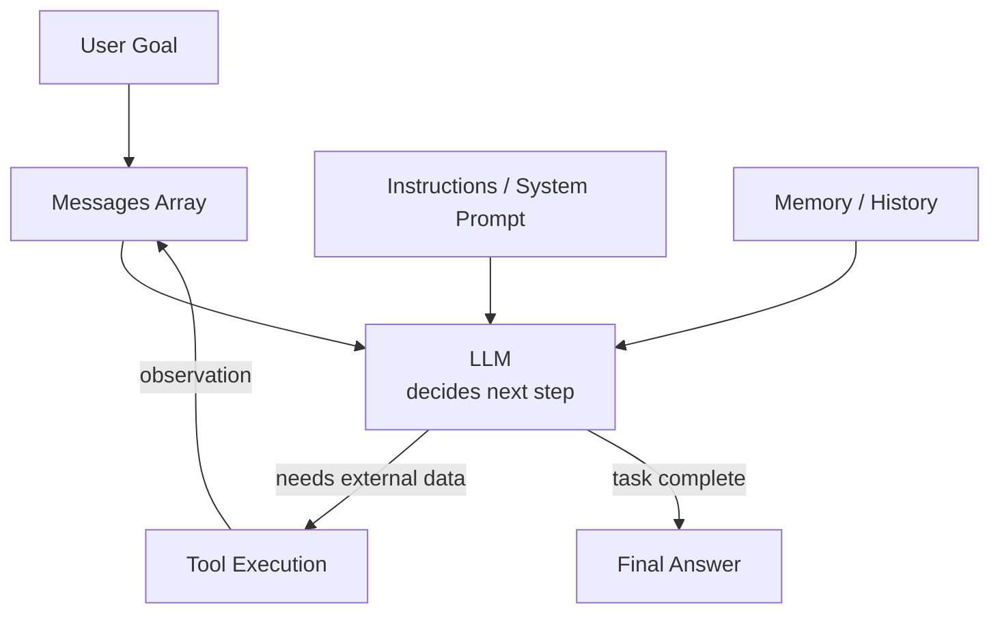

> [!info]+ Interview questions covered
> - What are the five core parts of an AI Agent?
> - What is the role of the LLM in an agent vs. the role of the loop?
> - Why does the LLM not call tools directly?

---

### The Agent Loop in Detail

The loop is the heartbeat of every agent. Here is the canonical shape of the loop, shown both as a flow and as code:

**Flow:**

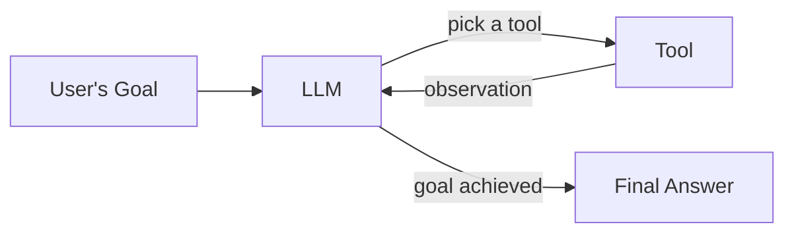

The goal arrives at the top. The LLM evaluates it and makes one of two decisions:
- **Use a tool:** the loop calls the tool, collects the observation, and feeds it back to the LLM as a new message.
- **Return the final answer:** the loop exits and delivers the answer to the user.

This continues for up to `max_steps` iterations — a configurable safety ceiling that prevents infinite loops.

**Reference implementation (`run_agent`):**

From the blog post shown during the lecture at outcomeschool.com/blog/ai-agent:

```python
async def run_agent(user_goal, tools, max_steps=10):
    messages = [{"role": "user", "content": user_goal}]
    step = 0

    while True:
        # Safety stop: bail out if we hit the step limit
        if step >= max_steps:
            return "Reached step limit without completing the task."
        step += 1

        # Ask the LLM what to do next
        response = await call_llm(messages, tools)

        # If the LLM says "I am done", stop the loop and return the final answer
        if response.is_done:
            return response.final_answer

        # Otherwise, run each tool the LLM picked and feed the result back
        for tool_call in response.tool_calls:
            result = await call_tool(tool_call.name, tool_call.arguments)
            messages.append({
                "role": "tool",
                "name": tool_call.name,
                "content": str(result),
            })
```

**Line-by-line walkthrough:**

| Line / block | What it does |
|---|---|
| `messages = [{"role": "user", "content": user_goal}]` | Seeds the conversation history with the user's goal. Every subsequent turn appends to this list. |
| `while True:` | Infinite loop — the agent runs until it either hits `max_steps` or the LLM signals completion. |
| `if step >= max_steps: return "Reached step limit..."` | Hard safety ceiling. This prevents runaway loops and cost overruns. |
| `response = await call_llm(messages, tools)` | Sends the full messages history plus the tool registry to the LLM. The LLM sees all prior turns. |
| `if response.is_done: return response.final_answer` | The LLM has decided no more tools are needed. The loop exits cleanly. |
| `for tool_call in response.tool_calls:` | The LLM requested one or more tool invocations. The loop executes each. |
| `messages.append({"role": "tool", ...})` | Appends the tool result back into history so the LLM has the observation on the next turn. |

**Why the messages array is the memory:** Every time the loop goes back to the LLM it sends the entire accumulated messages list — user goal, prior tool calls, prior tool results. The LLM cannot remember anything on its own; the messages array is the external memory that gives it continuity. This is also why context-window size matters for agents: a 1 million token context window (as seen in Opus 4.7 / Claude Max) can hold many more turns before history must be truncated.

**Concrete example — "What is the current Bitcoin price?"**
The LLM cannot answer this from its training data. On the first turn it signals: "use the web-search tool." The loop calls the tool, gets back the live price, appends it to messages, and calls the LLM again. Now the LLM has the data it needs and returns the final answer. Total loop iterations: 2.

> [!info]+ Interview questions covered
> - What is the agent loop? Why is it a `while True` loop?
> - What is `max_steps` and why is it important?
> - How does an agent maintain memory across multiple turns?
> - What happens when the LLM cannot answer a question directly?
> - What is the role of the messages array in an agent?

---

### A Concrete Example — Research Agent

To ground the abstract loop, consider a **Research Agent** given the goal: "Find the best laptop for video editing under $1,500."

The agent has three tools:
- A web search tool — to find pages about laptops
- A web page reader — to read reviews, specs, and prices
- A calculator — to compare numbers like RAM, storage, and price

The LLM makes sequential decisions:

1. Search for "best video editing laptops 2026" (LLM starts with a broad search).
2. Read the top results (LLM picks which pages are worth opening).
3. Compare specs of 5 laptops (LLM extracts relevant factors).
4. Check prices on Amazon (LLM verifies the budget constraint).
5. Read user reviews (LLM weighs real-world quality signals).
6. Create a summary with pros and cons (LLM drafts the shortlist).
7. Return the top 3 recommendations with reasoning (final answer).

Same five parts from before — LLM, instructions, tools, memory, loop — just wired for a real task.

---

### Types of AI Agents in Production

Coding agents are chosen as the lecture's focus because they are the **superset** — a coding agent must handle file I/O, command execution, code understanding, multi-step planning, and context management. Master those patterns and you can build any agent type.

| Agent type | What it does | Examples |
|---|---|---|
| Coding agent | Reads a repository, makes changes, runs tests, submits a PR | Claude Code, Cursor, GitHub Copilot agent mode |
| Research agent | Searches the web, reads papers, synthesizes a structured report | OpenAI Deep Research, Perplexity, Gemini Deep Research |
| Customer support agent | Reads a ticket, looks up account, replies with a fix | Many enterprise deployments |
| Browser agent | Navigates websites, fills forms, completes tasks like booking | Claude Code (Computer Use), ChatGPT Agent |
| Data analysis agent | Queries databases, runs calculations, creates charts | ChatGPT data analysis, Claude code execution |

> [!info]+ Interview questions covered
> - What types of AI agents exist in production today?
> - Why is a coding agent considered the most complex type of agent to build?

---

### Claude Code — Product Overview and Installation

Claude Code is Anthropic's coding agent delivered as a CLI tool. It runs directly in the terminal, integrates with any IDE, and uses Claude (Opus 4.7 by default) as the LLM powering its reasoning.

**How it is distributed:**
Anthropic hosts the installation script at `https://claude.ai/install.sh`. The install command:

```bash
curl -fsSL https://claude.ai/install.sh | bash
```

When this runs, `curl` downloads the shell script from Anthropic's server and pipes it to `bash`, which installs the `claude` CLI binary on your machine. The agent code and model weights stay on Anthropic's servers — the CLI is simply the local orchestration layer that communicates with their API.

**Launching Claude Code:**

```bash
claude --dangerously-skip-permissions
```

The `--dangerously-skip-permissions` flag tells Claude Code to bypass the per-action confirmation prompts that it would otherwise show before reading, writing, or executing files. In a classroom or demo context this removes friction. In a production deployment you would leave the flag off so that each file write or command execution requires explicit approval.

**What you see on first launch:**

```console
— Claude Code v2.1.137 —
Welcome back Amit!
Opus 4.7 (1M context) · Claude Max · <email>'s Organization
~/Downloads/ml-classes/Testing AI Coding Agent
Tips for getting started
Run /init to create a CLAUDE.md file with instructions for Cl...
>> bypass permissions on (shift+tab to cycle)    ● xhigh · /effort
```

Key information surfaced on the welcome screen:
- **Model:** Opus 4.7 with 1 million token context window.
- **Plan:** Claude Max (subscription-based API access).
- **Working directory:** Displayed so you always know what codebase context Claude Code is operating in.
- **Bypass permissions:** Shows the current permission mode — toggled via `Shift+Tab`.

**Available slash commands (from `/help`):**

| Command | Purpose |
|---|---|
| `/help` | Show help and available commands |
| `/hooks` | View hook configurations for tool events |
| `/batch` | Research and plan a large-scale change, then execute in parallel across 5–30 isolated worktree agents, each opening a PR |
| `/schedule` | Create, update, list, or run scheduled remote agents on a cron schedule |
| `/branch` | Create a branch of the current conversation |
| `/install-github-app` | Set up Claude GitHub Actions for a repository |
| `/insights` | Generate a report analyzing your Claude Code sessions |
| `/rewind` | Restore code and/or conversation to a previous point |

> [!info]+ Interview questions covered
> - What is Claude Code and how is it installed?
> - What does the `--dangerously-skip-permissions` flag do?
> - What model does Claude Code use by default?

---

### Live Demo — cc-calculator

To demonstrate what a coding agent can do, the tutor walks through building an HTML calculator from scratch using Claude Code with zero pre-existing code.

**Setup steps:**

```bash
mkdir cc-calculator
cd cc-calculator
claude --dangerously-skip-permissions
```

This opens Claude Code with the working directory set to the empty `cc-calculator` folder. Claude Code displays the path `~/…/Testing AI Coding Agent/cc-calculator` in its header, confirming context is set.

**Prompt given to Claude Code:**

> Build a HTML Calculator and give a local link to open in browser

**What Claude Code did internally (the agent loop in action):**

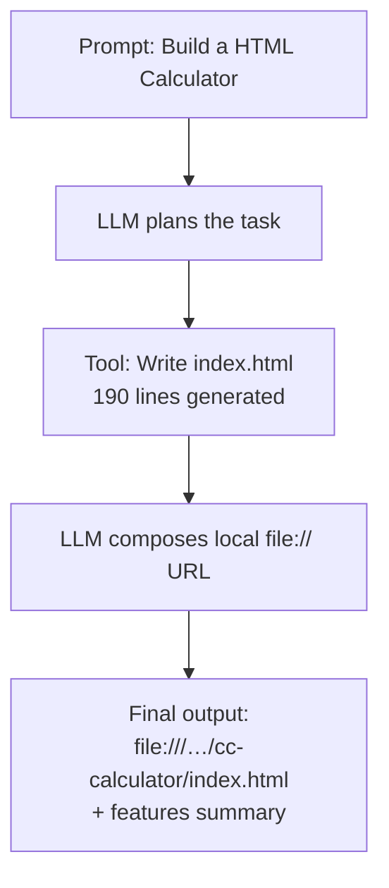

**Terminal output (from slide 42/43):**

```console
Build a HTML Calculator and give a local link to open in browser
● Write(index.html)
└ Wrote 190 lines to index.html
   1 <!DOCTYPE html>
   2 <html lang="en">
   3 <head>
   4   <meta charset="UTF-8">
   5   <title>Calculator</title>
   6   <style>
   7     * { box-sizing: border-box; }
   8     body {
   9       margin: 0;
  10       min-height: 100vh;
  … +180 lines (ctrl+o to expand)
● Calculator is ready. Open it in your browser via:
file:///Users/amitshekhar/Downloads/ml-classes/Testing%20AI%20Coding%20Agent/cc-calculator/index.html
Features: basic arithmetic (+, -, ×, ÷), AC, sign toggle, percent, decimals, and full keyboard support (digits, operators, Enter, Esc, Backspace).
✱ Churned for 27s
```

Claude Code invoked its `Write` tool, generated a complete 190-line `index.html`, and returned a `file://` URL for local preview. The process took 27 seconds and consumed ~1.6k tokens of input/output.

**The generated JavaScript (from slide 45):**

```javascript
const display = document.getElementById('display');
let current = '0';
let previous = null;
let operator = null;
let justEvaluated = false;

function render() {
  let txt = current;
  if (txt.length > 12) {
    const n = parseFloat(txt);
    txt = n.toPrecision(10).replace(/\.70+$/, '');
  }
  display.textContent = txt;
}

function inputNumber(n) {
  if (justEvaluated) { current = '0'; justEvaluated = false; }
  if (n === '.') {
    if (!current.includes('.')) current += '.';
  } else {
    current = current === '0' ? n : current + n;
  }
  render();
}

function compute(a, b, op) {
  a = parseFloat(a); b = parseFloat(b);
  switch (op) {
    case '+': return a + b;
    case '-': return a - b;
    case '*': return a * b;
    case '/': return b === 0 ? 'Error' : a / b;
  }
}
```

Notable details in the generated code:
- **Division-by-zero guard:** `b === 0 ? 'Error' : a / b` — the model wrote defensive code without being asked.
- **Display overflow handling:** Long results are auto-formatted with `toPrecision(10)` to prevent display overflow.
- **State tracking:** `justEvaluated` flag correctly handles the case where a user types a digit immediately after pressing `=`.

---

### Multi-Turn Context — "Create a README"

Immediately after the calculator was built, a follow-up prompt was issued:

> Create a README

Claude Code retained the full context of the previous turn — it knew exactly which project had been built, what features it had, and what the file path was. Without any additional hints it wrote a 37-line `README.md`:

```console
Create a README
• Write(README.md)
  └ Wrote 37 lines to README.md
      1 # Calculator
      2
      3 A simple, single-file HTML calculator with an iOS-style UI.
      4
      5 ## Run
      6
      7 Open `index.html` directly in your browser — no build step, no dependencies.
      8
      9 ```
     10 open index.html
      … +27 lines (ctrl+o to expand)

• Created README.md with run instructions, feature list, keyboard shortcuts, and file overview.
✱ Cooked for 9s
```

**Why this works:** The messages array from the previous turn — including the `Write(index.html)` tool call and its result — was still in Claude Code's context window when the follow-up prompt arrived. The 1-million-token context window means the entire prior session fits in memory, so the agent can reason about what it already built without being told again.

The generated README included:
- Run instructions with the exact local `file://` URL.
- Feature list (AC, sign toggle, percent, decimal, chained operations, divide-by-zero handling).
- Keyboard shortcuts table.
- File overview (`index.html` — markup, styles, and logic in one file).

> [!info]+ Interview questions covered
> - How does an AI coding agent maintain context across multiple tasks in the same session?
> - What is the role of the context window in multi-turn agent interactions?

---

### Claude Code vs. The Agent We Are Building

Claude Code uses the same fundamental loop as the agent this course builds — the only material differences are scale, polish, and the size of the model powering the LLM call:

| Dimension | Claude Code (Anthropic product) | Agent we build in this course |
|---|---|---|
| Model | Opus 4.7 (hosted by Anthropic) | Claude API (same model family, called from our code) |
| Tool set | File read/write, bash execution, browser control, GitHub integration, and more | A subset of tools, built from scratch step by step |
| Installation | `curl -fsSL https://claude.ai/install.sh | bash` | We write the equivalent install script ourselves |
| Context window | 1 million tokens | Determined by the API tier used |
| Permissions | `--dangerously-skip-permissions` bypasses per-action prompts | We control this in our implementation |
| Purpose | Production-ready commercial product | Educational from-scratch build |

The core loop — messages array + LLM call + tool execution + observation feed-back — is identical in both.

> [!info]+ Interview questions covered
> - What is the architectural relationship between Claude Code and a custom-built coding agent?
> - What does the `install.sh` pattern tell us about how coding agent products are distributed?


## Phase 1 Foundation Demo — Ollama, Qwen 2.5:7B-Instruct, Virtual Environment Setup, and the `ai-coding-agent` Command

**Timestamps:** 11:00 – 23:44

---

### The Core Premise: Same Architecture, Different Model

The project you are about to build is structurally identical to Claude Code, which is Anthropic's production coding agent. The only concrete difference between Claude Code and what you will build is the underlying model. Claude Code uses Claude Opus 4.5 (the best closed-source model available as of this recording); your implementation will use **Qwen 2.5:7B-Instruct** running locally via Ollama. The agent loop, tool execution pattern, REPL interface, and message-passing logic are the same. This is deliberate: understanding the architecture matters more than the model choice, and the local model means you can run everything for free with no API key.

> [!info]+ Interview questions covered
> - How does a production coding agent like Claude Code differ from a chat interface?
> - What is the role of the underlying model in a coding agent architecture?
> - Can you build a coding agent with an open-source local model?

---

### Design Challenge: How Would You Build a Coding Agent?

Before diving into code, the tutor frames the problem as a system design exercise. Consider the question: if you were given the task of building a terminal-based coding agent — one where you type a natural-language command and the agent reads files, writes code, deletes files, opens browsers, or searches the web — how would you design it?

The high-level answer the class converges on:

1. **Define tools** for every discrete action the agent might need — a `read_file` tool, a `write_file` tool, a `delete_file` tool, a `search_web` tool, and so on.
2. **Send the user's prompt and the full list of available tools to the model.** The model then decides which tool(s) to call and in what order.
3. **Run a `while True` loop.** On each iteration: call the model, execute whatever tool the model requests, feed the tool's result back to the model, and repeat. The loop only exits when the model signals that the task is complete.

For a compound task like "read this file and then delete it," the model calls `read_file` first, the result is appended to the conversation, and on the next iteration the model calls `delete_file`. The loop terminates after the second tool call completes successfully.

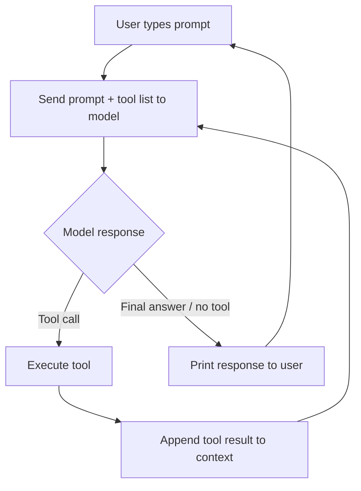

> [!info]+ Interview questions covered
> - Describe the agent loop pattern. Why does it use a `while` loop?
> - How does a model decide which tool to call?
> - What happens when a task requires multiple sequential tool calls?

---

### The 11-Phase Project Structure

The project is organized into **11 phases**, each in its own git branch. Every phase adds exactly one new capability on top of the previous phase, keeping all earlier code intact. The tool count grows from 0 to 28 across the full progression.

| Phase | Branch | What You Build | Tools |
|-------|--------|----------------|-------|
| 1 | `phase-1-foundation` | CLI + Ollama provider + streaming chat | 0 |
| 2 | `phase-2-agent-loop` | Core agent `while`-loop + bash tool | 1 |
| 3 | `phase-3-file-tools` | File read/write/edit + glob/grep + sandboxing | 6 |
| 4 | `phase-4-smart-context` | 3-layer context compression + CLAUDE.md project instructions | 7 |
| 5 | `phase-5-skills` | Dynamic skill loading (two-layer knowledge injection) | 8 |
| 6 | `phase-6-planning` | In-memory task list with dependencies and stuck-item reminder | 9 |
| 7 | `phase-7-subagents` | Subagent — spawn child agent with isolated context | 10 |
| 8 | `phase-8-background` | Background — non-blocking shell commands via daemon threads | 12 |
| 9 | `phase-9-teams` | Multi-agent teams + message bus + protocols | 19 |
| 10 | `phase-10-autonomous` | Self-directed agents that find their own work | 21 |
| 11 | `phase-11-isolation` | Git worktrees for parallel teammate isolation | 28 |

**Why phases matter:** Each phase diff shows you exactly which lines of code introduced a specific capability. This lets you study the delta rather than the full codebase at once. The tutor's advice is to study this end-to-end — not just as a coding exercise but as system design training, because understanding these patterns positions you to innovate beyond existing tools.

#### Phase-by-phase capability summary

- **Phase 1 (0 tools):** The skeleton. A streaming REPL that connects to a local Ollama model. The agent can chat but cannot act on your filesystem.
- **Phase 2 (1 tool):** The agent loop lands. A single `bash` tool is added and the `while True` control flow is introduced. The agent can now execute shell commands.
- **Phase 3 (6 tools):** File tools — read, write, edit, glob search, grep search, and a sandboxing layer.
- **Phase 4 (7 tools):** Context management. A 3-layer compression strategy is added, plus `CLAUDE.md` — a project-level instruction file that is injected into every LLM call automatically. This is the equivalent of a system prompt that is always present without the user having to type it.
- **Phase 5 (8 tools):** Skill loading. Domain-specific skill documents (e.g., a "code review skill") are loaded on demand rather than being permanently resident in the context window. Loading every skill permanently would consume tokens needlessly; on-demand loading keeps context lean.
- **Phase 6 (9 tools):** Task planning. For large goals (e.g., "build a Facebook clone"), the agent first breaks the goal into a dependency-ordered task list and then executes the list, tracking stuck items.
- **Phase 7 (10 tools):** Subagents. The main agent can spawn a child agent with an isolated context. One subagent can specialize in code review while another specializes in writing code.
- **Phase 8 (12 tools):** Background execution. Long-running shell commands are dispatched to daemon threads so the main loop is not blocked.
- **Phase 9 (19 tools):** Multi-agent teams with a message bus. Agents communicate through a shared protocol; a manager agent delegates work to worker agents.
- **Phase 10 (21 tools):** Autonomous agents. When an agent finishes a task, instead of waiting, it queries the manager for the next task proactively.
- **Phase 11 (28 tools):** Git worktree isolation. Parallel agents work in separate git worktrees so their file changes do not collide. This is the same mechanism Claude Code uses internally.

> [!info]+ Interview questions covered
> - What is a `CLAUDE.md` file and how does it relate to context injection?
> - Why would you load skills on demand rather than always including them in the system prompt?
> - How do you prevent multiple agents from corrupting each other's file changes when working in parallel?
> - What is a git worktree and when would a coding agent use one?

---

### Phase 1 Architecture

Phase 1 is described in the project's own documentation as:

> The starting point: a streaming chat REPL connected to a local Ollama model. No tools — the agent can only talk.

The six source files that make up Phase 1 and how they connect:

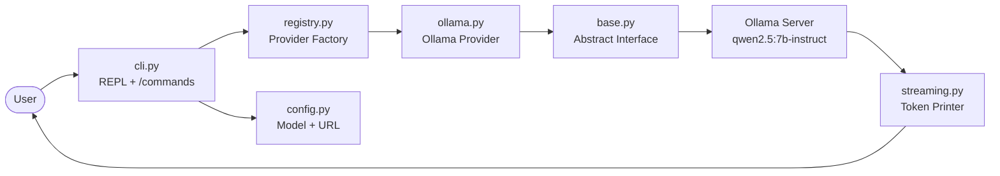

**Component responsibilities:**

| File | Role |
|------|------|
| `cli.py` | The entry point. Implements the REPL loop and handles `/commands` like `/quit` and `/help`. |
| `registry.py` | A provider factory. Maps a provider name to its concrete implementation, enabling you to swap Ollama for another backend later without touching `cli.py`. |
| `config.py` | Stores the model name (`qwen2.5:7b-instruct`) and the Ollama server URL. All configuration lives here, not scattered through the codebase. |
| `ollama.py` | The Ollama-specific provider implementation. Sends HTTP requests to the locally running Ollama server. |
| `base.py` | An abstract interface that all providers must implement. This is the abstraction boundary: `cli.py` talks to `base.py`, never directly to `ollama.py`. |
| `streaming.py` | Handles token-by-token printing as the model streams its response. Gives the user the appearance of real-time generation. |

The **provider factory pattern** (registry + base + concrete provider) is a deliberate design choice. In Phase 2 and beyond, when the same architecture is extended with an agent loop and tools, the provider slot remains stable. You could swap in a different LLM provider by writing a new file that implements `base.py`'s interface and registering it in `registry.py`.

> [!info]+ Interview questions covered
> - What is the provider factory pattern and why is it used in this agent?
> - Why is streaming important in a chat REPL?
> - What is the role of an abstract base class in a multi-provider architecture?

---

### Ollama and Qwen 2.5:7B-Instruct

#### Why Ollama?

Ollama is a local LLM inference runtime. It runs entirely on your machine — no internet connection required after the initial model download, and no API key is ever needed. This is the primary reason it was chosen for this course: every student can run the full agent on their own laptop without incurring cost or depending on external services.

**Prerequisites before running Phase 1:**

- Python 3.10 or higher
- Ollama installed and the server running (`ollama serve`)
- The model pulled: `ollama pull qwen2.5:7b-instruct`

**Provider configuration (from the README):**

| Provider | Model | API Key |
|----------|-------|---------|
| Ollama | `qwen2.5:7b-instruct` | None (local) |

The model is hardcoded to `qwen2.5:7b-instruct` in `config.py` for Phase 1. You are free to change it to any model that Ollama supports (e.g., `llama3`, `mistral`) — the architecture does not care which model is behind `config.py`.

#### Comparing Ollama to Claude Code's model

Claude Code uses Claude Opus 4.5, a frontier closed-source model. The coding agent you build uses `qwen2.5:7b-instruct`, a 7-billion-parameter open-source model. The architectural code — the REPL, the agent loop, the tool definitions, the provider abstraction — is identical. The quality of the model affects the quality of the output, not the system design. As better local models become available, you can swap them in by changing one line in `config.py`.

> [!info]+ Interview questions covered
> - What is Ollama and how does it enable local LLM inference?
> - What are the tradeoffs between using a local open-source model versus a cloud-hosted API?
> - How would you swap the model in this architecture without changing the agent loop?

---

### Virtual Environment Setup and Quick Start

The project uses a Python virtual environment to isolate dependencies. The complete setup sequence from the project README:

```bash
# Clone and checkout any phase
git clone https://github.com/amitshekhariitbhu/ai-coding-agent.git
cd ai-coding-agent
git checkout phase-1-foundation  # or any phase branch

# Create virtual environment and install dependencies
python3 -m venv venv
source venv/bin/activate
pip install -r requirements.txt

# Run
python -m agent.cli
```

Each phase is a separate git branch. To study a specific phase, `git checkout` that branch, activate the virtual environment, and run the agent. The code on each branch is cumulative — it includes everything from all previous phases plus the new capability introduced in that phase.

#### Making the agent globally accessible

By default, you must `cd` into the project directory to run the agent. The README also documents an optional step to install the agent as a global command, so you can run it from any project directory:

```bash
# Step 1: make the agent package importable from the venv's Python
SITE=$(venv/bin/python -c 'import site; print(site.getsitepackages()[0])')
echo "$(pwd)" > "$SITE/agent.pth"

# Step 2: create a wrapper command on your PATH
mkdir -p ~/.local/bin
cat > ~/.local/bin/ai-coding-agent <<EOF
#!/usr/bin/env bash
export PYTHONDONTWRITEBYTECODE=1
exec $(pwd)/venv/bin/python -m agent.cli "\$@"
EOF
chmod +x ~/.local/bin/ai-coding-agent
```

After this one-time setup, from any project directory:

```bash
cd ~/my-project
ai-coding-agent
```

The `.pth` file (step 1) tells Python where the `agent` package lives. The wrapper script (step 2) binds the venv's Python interpreter to the `ai-coding-agent` shell command. Because `PYTHONDONTWRITEBYTECODE=1` is set, Python will not write `.pyc` files — every invocation re-reads source directly, so changes you make to the agent's code take effect immediately without reinstalling.

> [!info]+ Interview questions covered
> - What does a Python `.pth` file do and when would you use one?
> - How do you make a Python script executable from any directory without modifying `sys.path` manually in the script itself?
> - What does `PYTHONDONTWRITEBYTECODE=1` do and why is it useful during development?

---

### Live Demo: Phase 1 in Action

The terminal demo at ~21:49 – 23:00 shows the complete Phase 1 flow:

```console
amitshekhar@Amits-Mac-mini Testing AI Coding Agent % mkdir calculator
amitshekhar@Amits-Mac-mini Testing AI Coding Agent % cd calculator
amitshekhar@Amits-Mac-mini calculator % ai-coding-agent

  AI Coding Agent
    Foundation

Provider: Ollama (qwen2.5:7b-instruct)
Type /quit to exit, /help for commands.

> /quit
Goodbye!
amitshekhar@Amits-Mac-mini calculator % ai-coding-agent

  AI Coding Agent
    Foundation

Provider: Ollama (qwen2.5:7b-instruct)
Type /quit to exit, /help for commands.

> hi
Hello! How can I assist you today?
> hello
Hello! Is there anything specific you need help with or any questions you have?
>
```

Several things to notice in this demo:

1. **The command is `ai-coding-agent`** — the global wrapper installed earlier. It is invoked from the `calculator` directory, not from the project root. This is the wrapper script in action.
2. **The banner displays the provider**: `Provider: Ollama (qwen2.5:7b-instruct)`. In a future phase with multiple provider options, this line would tell you which model is active.
3. **`/quit`** is a built-in REPL command handled by `cli.py` before any message reaches the model. It prints `Goodbye!` and exits cleanly.
4. **Responses are streamed token by token.** The `streaming.py` component prints each token as it arrives from Ollama, so the answer appears progressively rather than all at once after a long wait.
5. **Phase 1 is chat only — no tools.** The model can answer questions and hold a conversation, but it cannot read your files, run commands, or modify code. That capability arrives in Phase 2.

> [!info]+ Interview questions covered
> - What is a REPL and how does it differ from a batch script?
> - How does token streaming improve perceived responsiveness in a chat interface?
> - What is the difference between a built-in `/command` handled by the CLI layer versus a natural-language prompt sent to the model?

---

### Two Learning Lenses for This Course

The tutor explicitly frames two ways to study this material:

1. **System design perspective.** Understand the architectural patterns — provider abstraction, the agent loop, tool registration, context management, multi-agent coordination — so you can reason about them in interviews and build novel systems on top of them.
2. **Conceptual pattern perspective.** Internalize why each design decision was made. The `CLAUDE.md` mechanism exists because context windows are finite and you need persistent instructions without token waste. Skills are loaded on demand for the same reason. Subagents exist because a single context window has limits and specialization improves quality.

The tutor's point is that an LLM can write the code for you — the scarce skill is knowing *what to build* and *why*. The students who internalize the patterns will be able to design systems that do not yet exist.

---

### Summary of Section Key Points

- Phase 1 is a streaming chat REPL backed by a local Ollama model (`qwen2.5:7b-instruct`). It has **zero tools** — the agent can only converse.
- The six-file architecture (`cli.py`, `registry.py`, `config.py`, `ollama.py`, `base.py`, `streaming.py`) forms the foundation that every subsequent phase extends without modification.
- The **provider factory pattern** decouples the REPL from any specific LLM implementation.
- The project grows from 0 to 28 tools across 11 phases, each on its own git branch, each adding exactly one new capability.
- The `ai-coding-agent` global command is installed via a `.pth` file and a bash wrapper script, enabling invocation from any directory.
- The only architectural difference between this project and Claude Code is the model. The design patterns are equivalent.


## LLM Statelessness, Messages Array, Inspect Command, System Prompt, and Ollama Provider

**Section timestamps:** 23:44 – 52:32

This section builds up a concrete understanding of how the Phase 1 Foundation agent is structured, then uses the live `/inspect` command to demonstrate — with real data — why LLMs are stateless and how the messages array is the mechanism that gives them the appearance of conversational memory.

---

### Phase 1 Foundation Architecture

The Phase 1 agent is called "Foundation" because it has zero tools — it can only talk. The entire system is a streaming chat REPL connected to a local Ollama model.

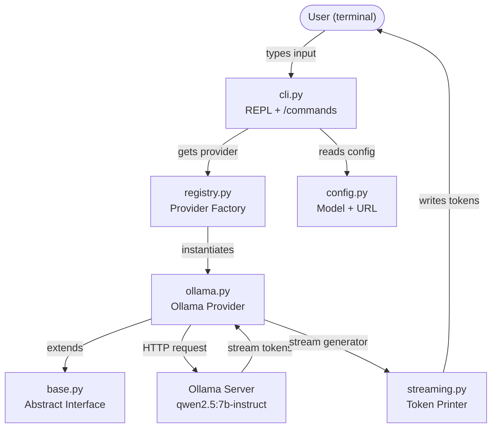

Each module has a single, well-defined responsibility:

| Module | Responsibility |
|---|---|
| `cli.py` | Entry point — REPL loop, slash commands, user I/O |
| `config.py` | Single source of truth for provider, model, and host URL |
| `registry.py` | Factory that instantiates the correct provider from config |
| `base.py` | Abstract interface (contract) all providers must implement |
| `ollama.py` | Concrete Ollama implementation of the provider contract |
| `streaming.py` | Token printer — writes LLM output to stdout in real time |
| `inspector.py` | Debug utility — records every LLM call for `/inspect` |

> [!info]+ Interview questions covered
> - What is the REPL pattern in CLI applications?
> - Why separate the provider interface (base.py) from the implementation (ollama.py)?

---

### Code Walkthrough: Each Module

#### `config.py` — Configuration Loader

From `agent/core/config.py`:

```python
"""Configuration loader – resolves Ollama settings."""
MODEL = "qwen2.5:7b-instruct"
OLLAMA_HOST = "http://localhost:11434"

def get_config() -> dict:
    """Return resolved configuration dict."""
    return {
        "provider": "ollama",
        "model": MODEL,
        "ollama_host": OLLAMA_HOST,
    }
```

The config is hardcoded for Phase 1. It resolves the provider name, model, and the Ollama server URL. All other modules derive their settings from this single `get_config()` call, making it trivial to swap models later.

---

#### `base.py` — Abstract Provider Interface

```python
class BaseProvider(ABC):

    @property
    @abstractmethod
    def name(self) -> str:
        """Human-readable provider name."""

    @abstractmethod
    def chat_stream(
        self,
        messages: list[dict],
        system: str = "",
        tools: list[dict] | None = None,
        max_tokens: int = 4096,
    ) -> Generator[dict, None, None]:
        """Stream response tokens.

        Yields dicts with:
            type: "text" | "tool_call" | "done"
            content: str        – for text chunks
            tool_call: dict     – for tool_call events
            stop_reason: str    – for done events
        """
```

`BaseProvider` defines the contract: every provider — whether Ollama, GPT-4, or anything else — must implement `name` and `chat_stream`. The uniform `chat_stream` interface means `streaming.py` can work with any provider without modification. This is the adapter / strategy pattern applied to LLM providers.

---

#### `ollama.py` — Concrete Ollama Provider

```python
"""Ollama provider – local models via the official Ollama Python SDK."""

from typing import Generator

from agent.core import inspector
from agent.providers.base import BaseProvider


class OllamaProvider(BaseProvider):
    def __init__(self, model: str, host: str = "http://localhost:11434"):
        from ollama import Client

        self._client = Client(host=host)
        self._model = model

    @property
    def name(self) -> str:
        return f"Ollama ({self._model})"

    def chat(self, messages, system="", tools=None, max_tokens=4096) -> dict:
        msgs = self._inject_system(messages, system)
        kwargs = {"model": self._model, "messages": msgs}
        if tools:
            kwargs["tools"] = self._convert_tools(tools)

        response = self._client.chat(**kwargs)
        parsed = self._parse_response(response)
        inspector.record(
            msgs,
            parsed.get("content", "") or "",
            parsed.get("tool_calls") or [],
            available_tools=kwargs.get("tools", []),
        )
        return parsed
```

`OllamaProvider` extends `BaseProvider`, fulfilling the contract. A mental model to cement: **whenever you see "provider" in this codebase, think "LLM."** The provider folder is the bridge between the generic agent logic and whatever LLM backend is running.

---

#### `registry.py` — Provider Factory

```python
"""Provider registry – instantiates the Ollama provider from config."""

from agent.providers.base import BaseProvider


def get_provider(config: dict) -> BaseProvider:
    """Create and return the Ollama provider instance."""
    model = config["model"]
    host = config.get("ollama_host", "http://localhost:11434")

    from agent.providers.ollama import OllamaProvider
    return OllamaProvider(model=model, host=host)
```

The registry reads `model` and `ollama_host` from the config dict and returns an `OllamaProvider` instance. Its return type is `BaseProvider` — the rest of the code only sees the abstract interface, not the Ollama-specific implementation.

---

#### `streaming.py` — Token Printer

```python
def print_stream(stream_generator) -> dict:
    """Consume a provider's chat_stream() and print text in real-time.

    Returns the final complete response dict from the 'done' event.
    """
    final_response = None

    for event in stream_generator:
        if event["type"] == "text":
            sys.stdout.write(event["content"])
            sys.stdout.flush()

        elif event["type"] == "tool_call":
            # In Phase 1 we just have chat, no tools yet.
            # This will be used in Phase 2.
            pass

        # elif event["type"] == "done": ...
```

`print_stream` iterates the stream generator and writes `text` events to `stdout` immediately — `flush()` is called after each token so the output appears in real time rather than buffering until the response completes. Tool call handling is left as a stub for Phase 2.

---

#### `cli.py` — Entry Point and REPL

The CLI is the entry point that stitches everything together.

From the top of `cli.py`:

```python
"""CLI entry point – interactive REPL."""

import sys

from agent.core import inspector
from agent.core.config import get_config
from agent.core.streaming import print_stream
from agent.providers.registry import get_provider

CYAN = "\033[36m"
GREEN = "\033[32m"
DIM = "\033[2m"
RESET = "\033[0m"
BOLD = "\033[1m"


SYSTEM_PROMPT = """\
You are a helpful AI coding agent. You can answer questions and help with tasks.
When the user asks you to do something, help them directly.\
"""
```

The ANSI escape codes produce the colored terminal output. `SYSTEM_PROMPT` is the constant that defines the LLM's persona — we will look at this more closely in the system prompt subsection below.

##### The `chat()` function

```python
def chat(provider, messages: list[dict]) -> None:
    """Send messages to the provider and stream the reply to stdout."""
    print(f"{CYAN}", end="")
    stream = provider.chat_stream(messages=messages, system=SYSTEM_PROMPT)
    response = print_stream(stream)
    print(RESET, end="")
    messages.append({"role": "assistant", "content": response.get("content", "")})
```

`chat()` does three things:
1. Calls `provider.chat_stream` with the full `messages` list and the system prompt.
2. Feeds the stream to `print_stream` for real-time terminal output.
3. **Appends the assistant's response back into the `messages` list.** This is the line that enables conversational memory — the growing list carries all prior turns.

##### The `main()` function and REPL loop

```python
def main():
    try:
        config = get_config()
    except ValueError as e:
        print(f"\033[31mConfig error: {e}{RESET}")
        sys.exit(1)

    provider = get_provider(config)
    print_banner(provider.name)

    messages: list[dict] = []

    while True:
        try:
            user_input = input(f"{GREEN}> {RESET}").strip()
        except (KeyboardInterrupt, EOFError):
            print(f"\n{DIM}Goodbye!{RESET}")
            break

        if not user_input:
            continue

        if user_input == "/quit":
            print(f"{DIM}Goodbye!{RESET}")
            break
        elif user_input == "/help":
            print(f"""{DIM}Commands:
/quit         – Exit the agent
/clear        – Clear conversation history
/model        – Show current provider and model
/inspect      – Show every LLM call's input and output
/clear-inspect – Clear inspector records (independent of /clear)
/help         – Show this help{RESET}""")
```

Execution order when starting the agent:
1. Load config → get provider → print banner.
2. Initialize `messages` as an **empty list of dicts**.
3. Enter the `while True` REPL loop: Read → (maybe handle slash command) → Evaluate (send to LLM) → Print → Loop.

REPL stands for **Read-Eval-Print Loop** — the same pattern used in Python's interactive shell and in tools like Node.js's console.

##### Slash commands: `/inspect` and `/clear`

```python
elif user_input == "/inspect":
    inspector.dump()
    continue
elif user_input == "/clear-inspect":
    inspector.clear()
    print(f"{DIM}Inspector records cleared.{RESET}")
    continue
elif user_input == "/clear":
    messages.clear()
    print(f"{DIM}Conversation cleared.{RESET}")
    continue
```

- `/inspect` — calls `inspector.dump()` to pretty-print every recorded LLM call input and output.
- `/clear` — calls `messages.clear()` to empty the conversation list. This is what resets the LLM's effective memory.
- `/clear-inspect` — clears only the inspector's debug records, independent of the conversation history.

##### The conversation append logic

```python
inspector.start_turn(user_input)
messages.append({"role": "user", "content": user_input})

try:
    chat(provider, messages)
except Exception as e:
    print(f"{RESET}\033[31mError: {e}\033[0m")
    if messages and messages[-1].get("role") == "user":
        messages.pop()
```

When the user types a non-command message, two things happen before calling the LLM:
1. `inspector.start_turn(user_input)` — records the start of a new turn for debugging.
2. `messages.append({"role": "user", "content": user_input})` — **appends** (not replaces) the new user message onto the growing messages list.

If an exception occurs, the just-added user message is popped back out to keep the list consistent.

---

### The System Prompt

```python
SYSTEM_PROMPT = """\
You are a helpful AI coding agent. You can answer questions and help with tasks.
When the user asks you to do something, help them directly.\
"""
```

The system prompt is **how you set the tone and persona of the LLM**. It is sent to the LLM on every call alongside the conversation messages, but it is not stored in the `messages` list — it is injected separately by `OllamaProvider._inject_system()`.

Think of the system prompt as instructions given to an employee before they start taking calls: "You are a coding assistant; be direct and helpful." The employee (LLM) follows these instructions throughout the session, but they come from a fixed, separate channel — not from the conversation itself.

You can change the system prompt to alter behavior completely:
- `"You are a tutor explaining to a 5-year-old."` → simplified explanations.
- `"You are an expert Python security auditor."` → strict security focus.

In later phases of this project the system prompt will grow to include information about available tools and how the agent should use them.

> [!info]+ Interview questions covered
> - What is a system prompt in an LLM-powered application?
> - How does the system prompt differ from the user message?
> - Where in the conversation lifecycle is the system prompt applied?

---

### The `inspector.py` Debug Utility

`inspector.py` is entirely for teaching and debugging — it has no production role. It records three kinds of events as typed dicts in an in-memory list:

```python
"""Inspector – record every LLM call and every tool call for the /inspect
slash command.

Records are stored as a flat in-memory list of typed dicts. Three kinds:
  - {"kind": "turn", "user_input": str}
  - {"kind": "llm", "messages": list, "available_tools": list,
     "output_text": str, "output_tool_calls": list}
  - {"kind": "tool", "name": str, "args": dict, "result": str}
"""
```

Key methods:

```python
def start_turn(user_input: str) -> None:
    """Mark the start of a new user turn – wired to cli.py on each prompt."""
    _records.append({"kind": "turn", "user_input": user_input})

def record(
    messages: list[dict],
    output: str,
    tool_calls: list[dict] | None = None,
    available_tools: list[dict] | None = None,
) -> None:
    """Capture one LLM call's exact input and output."""
    _records.append({
        "kind": "llm",
        "messages": list(messages),
        ...
    })
```

```python
def record_tool(name: str, args: dict, result: str) -> None:
    """Capture one tool execution - wired to ToolRegistry.dispatch."""
    _records.append({
        "kind": "tool",
        "name": name,
        "args": dict(args),
        "result": result,
    })

def clear() -> None:
    """Drop all captured records - wired to /clear-inspect."""
    _records.clear()
```

The `dump()` method iterates these records and prints them color-coded by turn — Turn 1 in yellow/orange, Turn 2 in pink/purple, etc. — making it easy to visually follow how the messages array evolves.

---

### LLM Statelessness and the Messages Array

This is the conceptual centerpiece of the section. The demonstration uses two live experiments with `/inspect` to prove the point concretely.

#### Why the LLM Appears to Have Memory

**LLMs are fundamentally stateless.** Each call to the LLM is a fresh, independent computation. The model has no persistent state between requests — it does not remember anything from a previous call.

Yet in a multi-turn conversation the LLM seems to remember what was said earlier. How? The answer is the **messages array**: every prior turn (user messages and assistant responses) is re-sent to the LLM with every new request.

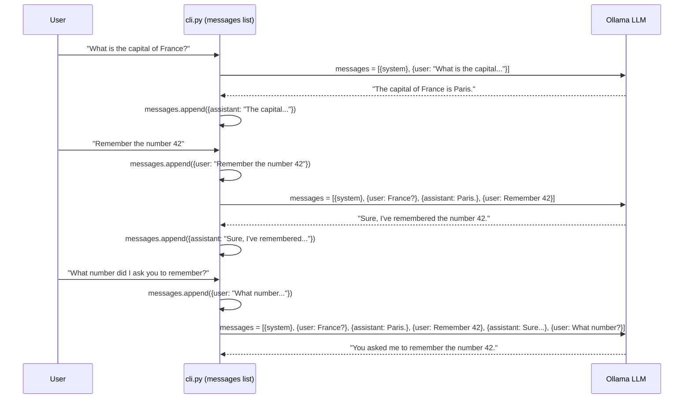

The LLM has no internal memory — but it receives the entire conversation history as its input context every single time. This is the application's responsibility, not the LLM's.

#### Live Experiment 1 — The Growing Messages Array

After a 3-turn conversation, `/inspect` shows the following for Turn 3 (LLM Call 3):

```console
======== Turn 3 ========
user input: 'What number did I ask you to remember?'

--- LLM Call 3 ---

messages:
[
  {
    "role": "system",
    "content": "You are a helpful AI coding agent. You can answer questions and help with tasks.\nWhen the user asks you to do something, help them directly."
  },
  {
    "role": "user",
    "content": "What is the capital of France?"
  },
  {
    "role": "assistant",
    "content": "The capital of France is Paris."
  },
  {
    "role": "user",
    "content": "Remember the number 42"
  },
  {
    "role": "assistant",
    "content": "Sure, I've remembered the number 42 for you. Is there a specific task related to this number that you need help with?"
  },
  {
    "role": "user",
    "content": "What number did I ask you to remember?"
  }
]

text:
You asked me to remember the number 42. Is there anything else you'd like to do with that number?

tool_calls:
(none)
```

The number 42 is **explicitly present** in the messages array. The LLM is not recalling it from any internal storage — it is simply reading it from the context it was handed. This is confirmed by Turn 1 and Turn 2 building progressively:

| Turn | Messages sent to LLM |
|---|---|
| Turn 1 | system + user (France?) |
| Turn 2 | system + user (France?) + assistant (Paris.) + user (Remember 42) |
| Turn 3 | system + user (France?) + assistant (Paris.) + user (Remember 42) + assistant (Sure...) + user (What number?) |

Each new turn appends to the same list; nothing is ever removed. This is the exact code responsible:

```python
inspector.start_turn(user_input)
messages.append({"role": "user", "content": user_input})
```

And after the response, inside `chat()`:

```python
messages.append({"role": "assistant", "content": response.get("content", "")})
```

#### Live Experiment 2 — `/clear` Breaks the Illusion

After `/clear` empties the messages list, the LLM immediately forgets everything:

```console
> Remember the number 42
Sure, I'll remember that...

> /clear
Conversation cleared.

> What number did I ask you to remember?
I'm sorry, but you haven't asked me to remember any number yet.
```

The inspector confirms why. Turn 2 (after `/clear`) received only the system message plus the new user question — with no prior context about 42:

```console
messages:
[
  {
    "role": "system",
    "content": "You are a helpful AI coding agent. ..."
  },
  {
    "role": "user",
    "content": "What number did I ask you to remember?"
  }
]
```

The LLM answered correctly given what it received. It was never told about 42 in this new context, so it said it had no knowledge of any number.

> [!info]+ Interview questions covered
> - Are LLMs stateless or stateful?
> - How does an LLM-based chat application implement conversational memory?
> - What is the messages array in an LLM API call and what roles does it contain?
> - What happens when you clear the conversation history in an LLM chat application?
> - Why does an LLM seem to "remember" earlier parts of a conversation?

---

### Message Roles: system, user, assistant

Every entry in the messages array has a `role` field:

| Role | Set by | Purpose |
|---|---|---|
| `system` | The application (via system prompt) | Instructs the LLM how to behave — its persona, tone, and capabilities |
| `user` | The human typing in the terminal | Carries the user's actual query or instruction |
| `assistant` | The LLM's previous response, saved by the app | Tells the LLM what it already said so it can maintain consistency |

The `system` message is not stored in the `messages` list. It is injected by `OllamaProvider._inject_system()` at the moment the request is sent, so it is always prepended fresh. Everything else in the list was appended by `chat()` as the conversation progressed.

The `assistant` entries answer a common question: "Who puts `role: assistant` in the array?" The application does — after each LLM response, `chat()` appends `{"role": "assistant", "content": response_text}` to preserve the LLM's reply for future turns.

---

### Context Window and Compaction (Preview)

A natural follow-up question: if the messages array keeps growing with every turn, what happens when it gets very long?

The answer is that the LLM has a finite **context window** — a maximum number of tokens it can process in a single call. Once the conversation history exceeds this limit, older messages need to be dropped, summarized, or compressed. This is the problem of **context compaction**, which will be addressed in a later section of this course. For Phase 1, the simple in-memory append approach is sufficient to demonstrate the concept.

For production systems, the messages might be stored in a database or vector store rather than a plain in-memory Python list, but the fundamental mechanism — re-send the history with every request — remains the same.

> [!info]+ Interview questions covered
> - What is a context window in an LLM?
> - What happens when a conversation exceeds the LLM's context window?
> - How would you persist conversation history in a production application?

---

### The `/inspect` Command as a Learning Tool

The `/inspect` command is the most important debugging tool in this codebase. It makes the invisible visible: every call to the LLM is recorded with its exact input (the messages array) and its exact output (text and any tool calls). Without this command you can only see what the user typed and what the LLM printed — you cannot see what actually went into the model.

Running `/inspect` after any conversation immediately answers:
- What was the system prompt at call time?
- What prior turns were included as context?
- Did the LLM suggest any tool calls?
- How many LLM calls were made in this turn (important in Phase 2 when tools can trigger loops)?

The inspector records are independent of the conversation history. `/clear` wipes only `messages`; `/clear-inspect` wipes only the debug records. You can clear the conversation while keeping the debug log, or vice versa.

```mermaid
flowchart LR
    A["/clear"] -->|messages.clear()| B["messages list = []"]
    C["/clear-inspect"] -->|inspector.clear()| D["inspector _records = []"]
    B -.->|"independent of"| D
```

---

### Summary of Key Concepts

- **LLM statelessness**: Each LLM API call is independent. The model retains nothing between calls. Memory is entirely the application's responsibility.
- **Messages array**: A list of `{"role": ..., "content": ...}` dicts that grows by appending both user and assistant turns. The entire list is sent to the LLM with every request.
- **System prompt**: A separate, fixed string that sets the LLM's persona and behavior. Injected by the provider on every call, not stored in the messages list.
- **Provider abstraction**: `BaseProvider` defines the interface; `OllamaProvider` implements it. The rest of the code only depends on `BaseProvider`, making it easy to add new LLM backends.
- **`/inspect` command**: Exposes the exact input and output of every LLM call in the current session. Indispensable for understanding what context the LLM actually receives.
- **`/clear` command**: Empties the messages list, resetting conversational memory. Proof that the LLM's apparent memory comes entirely from the messages array, not from the model itself.


## Phase 2: Agent Loop — `safety.py`, `registry.py`, `bash.py`, and `loop.py`

**Timestamps:** 52:32 – 1:22:46

---

### The LLM is Stateless — Memory is a Hack

Before diving into Phase 2, the session closes out an important foundational insight from the `/inspect` demo.

The `messages` array that the agent sends to the LLM on every turn is the *only* memory the LLM has. When Turn 2's `messages` array was constructed with only the system prompt and the new user question — without the Turn 1 conversation — the LLM responded:

```console
text:
I'm sorry, but you haven't asked me to remember any number yet. Could you please provide the number you'd like me to recall?

tool_calls:
(none)
```

The LLM had zero recollection of "Remember the number 42" from Turn 1. This is intentional: the LLM is a **stateless function**. Every API call is brand new from the model's perspective.

The "memory" users experience in products like ChatGPT is purely a **context-appending hack** — the application sends the entire prior conversation back to the LLM on every call. The LLM reads it as context, not as stored state. As an agent developer, it is your job to append all prior messages (both inputs and outputs) before each new LLM call.

```console
--------------- Turn 1 ---------------
user input: 'Remember the number 42'

--- LLM Call 1 ---
=================== INPUT ===================
messages:
[
  { "role": "system", "content": "You are a helpful AI coding agent..." },
  { "role": "user",   "content": "Remember the number 42" }
]
=================== OUTPUT ===================
text:
Sure, I'll remember that the number you're referring to is 42.
tool_calls:
(none)

================ Turn 2 ================
user input: 'What number did I ask you to remember?'

--- LLM Call 2 ---
=================== INPUT ===================
messages:
[
  { "role": "system", "content": "..." },
  { "role": "user",   "content": "What number did I ask you to remember?" }
]
```

Turn 2's `messages` array contains no Turn 1 history — so the LLM replies as if no number was ever mentioned. This is the proof.

**Key design rule:** Always pass as much prior context as possible. For now, the agent sends everything; future optimizations (context compression) will come later.

> [!info]+ Interview questions covered
> - What does it mean that an LLM is stateless?
> - How do LLM-based applications simulate memory?
> - Who is responsible for managing conversation history in an AI agent?

---

### Phase Architecture Overview — From Chat to Autonomous Agent

The session now transitions to Phase 2. The tutor presents the Phase Details architecture document, which defines the progression:

| Phase | Name | Tools | Key New Files |
|---|---|---|---|
| 1 | Foundation | 0 | `cli.py`, `registry.py` (provider factory), `ollama.py`, `base.py`, `config.py`, `streaming.py` |
| 2 | Agent Loop | 1 (bash) | `loop.py`, `tools/registry.py`, `tools/bash.py`, `tools/safety.py` |
| 3 | File Tools | 6 | read, write, list, search, edit, mkdir tools |

**Phase 1** was a streaming chat REPL — the agent could only talk. **Phase 2** introduces the agent loop: a while-loop that calls the LLM, checks for tool calls, executes them, feeds results back, and loops until the model stops requesting tools.

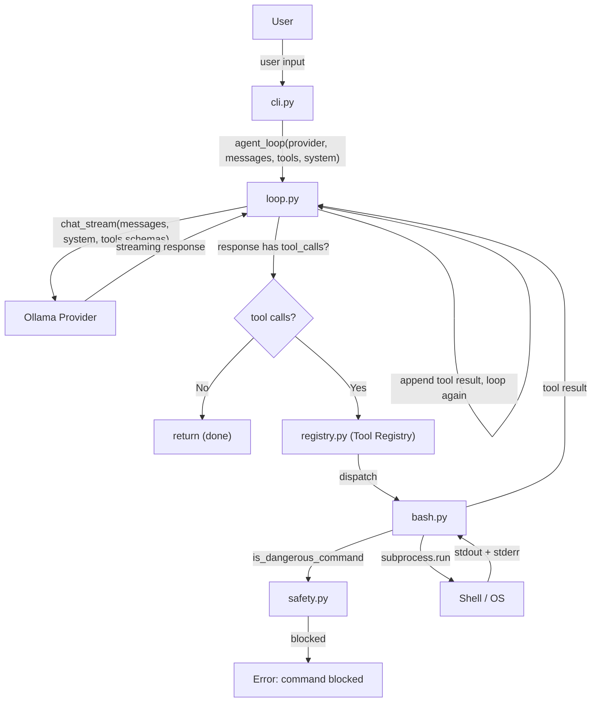

The green boxes in the architecture diagram are **newly introduced files in Phase 2**. The Ollama provider stack from Phase 1 is unchanged.

**Critical design insight:** The agent loop in `loop.py` is written once and **never modified**. Adding tools only requires registering them in the `ToolRegistry` — the loop itself is immutable.

> [!info]+ Interview questions covered
> - What is the agent loop pattern?
> - How does tool registration work in an AI agent?
> - What happens when the LLM produces no tool calls?

---

### `cli.py` Changes in Phase 2

The CLI is a thin wrapper — it reads user input and delegates all work to `agent_loop`. The key changes from Phase 1:

**New imports:**

```python
"""CLI entry point - interactive REPL."""

import sys

from agent.core import inspector
from agent.core.config import get_config
from agent.core.loop import agent_loop
from agent.providers.registry import get_provider
from agent.tools.bash import BASH_SCHEMA, handle_bash
from agent.tools.registry import ToolRegistry
```

**Updated system prompt** — Phase 1 was a general assistant; Phase 2 now explicitly instructs the model to act using tools:

```python
SYSTEM_PROMPT = """\
You are a helpful AI coding agent. Use the bash tool to run shell commands
when the user asks you to do something. Act directly - do the work, don't
just plan it.\
"""
```

The banner also reflects the new capability:

```python
def print_banner(provider_name: str):
    print(f"""
{BOLD}
    |            AI Coding Agent            |
    |            Agent Loop + Bash          |
    |________________________________________| {RESET}
{DIM}Provider: {provider_name}
Type /quit to exit, /help for commands.{RESET}
""")
```

**`setup_tools` function** — registers all available tools at startup:

```python
def setup_tools() -> ToolRegistry:
    """Register all available tools."""
    registry = ToolRegistry()
    registry.register(BASH_SCHEMA, handle_bash)
    return registry
```

**Updated `main` function** — calls `setup_tools()` then delegates to `agent_loop`:

```python
def main():
    try:
        config = get_config()
    except ValueError as e:
        print(f"\033[31mConfig error: {e}{RESET}")
        sys.exit(1)

    provider = get_provider(config)
    tools = setup_tools()
    print_banner(provider.name)

    messages: list[dict] = []

    while True:
        try:
            user_input = input(f"{GREEN}> {RESET}").strip()
        except (KeyboardInterrupt, EOFError):
            print(f"\n{DIM}Goodbye!{RESET}")
            break

        if not user_input:
            continue

        if user_input == "/quit":
            print(f"{DIM}Goodbye!{RESET}")
            break

        # ... slash command handling ...

        inspector.start_turn(user_input)
        messages.append({"role": "user", "content": user_input})

        try:
            agent_loop(
                provider=provider,
                messages=messages,
                tools=tools,
                system=SYSTEM_PROMPT,
            )
        except Exception as e:
            print(f"{RESET}\033[31mError: {e}\033[0m")
```

The CLI while-loop is not the agent loop — it is just the input reader. The real agentic while-loop lives in `loop.py`.

---

### `loop.py` — The Agent Loop Core

This is the heart of the system. It is bounded (not `while True`) and modifies `messages` in-place.

```python
MAX_ITERATIONS = 50

def agent_loop(
    provider: BaseProvider,
    messages: list[dict],
    tools: ToolRegistry,
    system: str = "",
    max_iterations: int = MAX_ITERATIONS,
) -> None:
    """Run the agent loop until the model stops calling tools.

    Modifies `messages` in-place — appends assistant and tool result messages.
    """
    for i in range(max_iterations):
        stream = provider.chat_stream(
            messages=messages,
            system=system,
            tools=tools.schemas if tools.schemas else None,
        )
        response = print_stream(stream)
        _append_assistant_message(messages, response)

        if not response.get("tool_calls"):
            return

        tool_results = []
        for tool_call in response["tool_calls"]:
            name = tool_call["name"]
            args = tool_call["arguments"]
            print(f"{YELLOW}[tool: {name}]{RESET} ", end="")
            print(f"{DIM}{_summarize_args(args)}{RESET}")

            result = tools.dispatch(name, args)

            preview = result[:200] + "..." if len(result) > 200 else result
            print(f"{DIM}{preview}{RESET}\n")

            tool_results.append({
                "tool_call_id": tool_call["id"],
                "tool_name": name,
                "content": result,
            })

        _append_tool_results(messages, tool_results)

    print(f"{DIM}[Agent reached iteration limit ({max_iterations})]{RESET}")
```

**The two termination paths:**

1. `response.get("tool_calls")` is falsy (empty or None) → the LLM has produced a plain text answer → `return` immediately. The user already saw the streamed output.
2. Tool calls are present → execute each, collect results, append to `messages`, loop again.

**Why `for` instead of `while True`?** The `MAX_ITERATIONS = 50` ceiling is a safety stop. Runaway loops — where the LLM keeps calling tools indefinitely — are a real failure mode in agentic systems. The bounded loop ensures the agent always terminates.

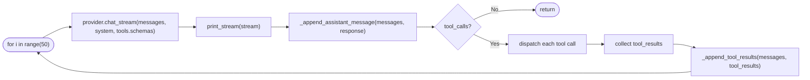

> [!info]+ Interview questions covered
> - Why does the agent loop use a bounded `for` loop instead of `while True`?
> - What happens to the `messages` list across iterations of the agent loop?
> - How does the agent know when to stop looping?

---

### `tools/safety.py` — Command Blocking and Output Truncation

Before any bash command executes, it passes through `safety.py`. The module has two responsibilities.

**1. Blocking dangerous commands**

```python
"""Safety utilities — command blocking and output truncation."""

import re

# Commands that could cause serious harm
DANGEROUS_PATTERNS = [
    r"\brm\s+-rf\s+/\b",        # rm -rf /
    r"\bsudo\s+rm\b",           # sudo rm
    r"\bmkfs\b",                # format filesystem
    r"\bdd\s+if=",              # disk destroyer
    r"\bshutdown\b",            # shutdown system
    r"\breboot\b",              # reboot system
    r"\binit\s+0\b",            # halt system
    r">\s*/dev/sd",             # write to raw disk
    r"\bchmod\s+-R\s+777\s+/", # open permissions on root
    r"\b:(){ :\|:& };:",        # fork bomb
]

MAX_OUTPUT_LENGTH = 50_000

def is_dangerous_command(command: str) -> bool:
    """Check if a command matches any dangerous pattern."""
    for pattern in DANGEROUS_PATTERNS:
        if re.search(pattern, command):
            return True
    return False
```

Each pattern is a regex matched with `re.search` against the proposed command string. If any pattern matches, the function returns `True` and the tool handler returns an error without executing anything.

**2. Truncating large outputs**

Long command outputs (e.g., `cat` on a multi-thousand-line file) would flood the LLM context window. `truncate_output` keeps both the beginning and end of the output, preserving the most useful information:

```python
def truncate_output(output: str, max_length: int = MAX_OUTPUT_LENGTH) -> str:
    """Truncate output if it exceeds the maximum length."""
    if len(output) <= max_length:
        return output
    half = max_length // 2
    return (
        output[:half]
        + f"\n\n... [truncated {len(output) - max_length} characters] ...\n\n"
        + output[-half:]
    )
```

`MAX_OUTPUT_LENGTH = 50_000` characters. The half-and-half strategy preserves context from both the start and end of the output — useful when the relevant error or result is at the bottom.

> [!info]+ Interview questions covered
> - Why does an AI coding agent need a safety layer for shell commands?
> - What is output truncation in the context of an LLM agent, and why is it important?

---

### `tools/registry.py` — The Tool Registry

`ToolRegistry` is a simple container that maps tool names to their schemas and handlers.

```python
"""Tool registry — register tools and dispatch calls by name."""

from typing import Callable

from agent.core import inspector

class ToolRegistry:
    """Central registry for all agent tools.

    Each tool has:
    - A schema (name, description, parameters) sent to the LLM
    - A handler function that executes the tool
    """

    def __init__(self):
        self._schemas: dict[str, dict] = {}
        self._handlers: dict[str, Callable] = {}

    def register(self, schema: dict, handler: Callable):
        """Register a tool with its schema and handler."""
        name = schema["name"]
        self._schemas[name] = schema
        self._handlers[name] = handler
```

When `setup_tools()` in `cli.py` calls `registry.register(BASH_SCHEMA, handle_bash)`, the registry stores:
- `_schemas["bash"] = BASH_SCHEMA` — the JSON object sent to the LLM so it knows the tool exists
- `_handlers["bash"] = handle_bash` — the Python function called when the LLM requests this tool

The `tools.schemas` property returns the list of schema dicts that gets passed to `provider.chat_stream`. The `tools.dispatch(name, args)` method calls the appropriate handler.

**Why separate schema from handler?** The schema is for the LLM. The handler is for the agent code. They serve entirely different audiences, and keeping them separate makes the registry extensible: new tools are added by calling `register` once with no changes to the loop.

> [!info]+ Interview questions covered
> - What is a tool registry in an AI agent?
> - What is the difference between a tool schema and a tool handler?

---

### `tools/bash.py` — The Shell Execution Tool

The bash tool is the single tool in Phase 2. It is powerful enough on its own to accomplish nearly any task the LLM can reason about.

**The schema** (sent to the LLM):

```python
BASH_TIMEOUT = 60  # seconds

BASH_SCHEMA = {
    "name": "bash",
    "description": (
        "Execute a bash command and return its output. "
        "Use this for running shell commands, installing packages, "
        "checking system state, running scripts, etc. "
        "Commands have a 60-second timeout."
    ),
    "parameters": {
        "type": "object",
        "properties": {
            "command": {
                "type": "string",
                "description": "The bash command to execute.",
            }
        },
        "required": ["command"],
    },
}
```

This is the exact same JSON structure used in MCP tool definitions. The most important field is **`description`** — this is what the LLM reads to understand when and how to invoke the tool. The name `"bash"` is arbitrary; what guides the LLM's decision is the description text.

**The handler** (called by the agent loop):

```python
def handle_bash(command: str) -> str:
    """Execute a bash command and return stdout + stderr."""
    if is_dangerous_command(command):
        return f"Error: Command blocked for safety — '{command}' matches a dangerous pattern"

    try:
        result = subprocess.run(
            command,
            shell=True,
            capture_output=True,
            text=True,
            timeout=BASH_TIMEOUT,
            cwd=None,  # Uses current working directory
        )
        output = ""
        if result.stdout:
            output += result.stdout
        if result.stderr:
            if output:
                output += "\n"
            output += result.stderr
        if result.returncode != 0:
            output += f"\n[exit code: {result.returncode}]"
        return truncate_output(output) if output else "(no output)"
```

Key `subprocess.run` parameters:
- `shell=True` — allows full shell syntax (pipes, redirects, etc.)
- `capture_output=True` — captures both stdout and stderr
- `text=True` — returns strings, not bytes
- `timeout=BASH_TIMEOUT` — 60-second safety ceiling
- `cwd=None` — uses the current working directory

Both stdout and stderr are concatenated. Non-zero exit codes are appended to the output so the LLM can see when a command failed.

> [!info]+ Interview questions covered
> - Why is the tool description the most important field in a tool schema?
> - How does `subprocess.run` with `shell=True` work and what are its tradeoffs?
> - How does the bash tool handle command failures?

---

### Live Demo: The Full Agent Loop Trace

The tutor runs the Phase 2 agent and asks: **"what is the time now"**

The `/inspect` command reveals the complete internal trace:

**LLM Call 1 — INPUT:**
```console
tools available (1):
[
  {
    "type": "function",
    "function": {
      "name": "bash",
      "description": "Execute a bash command and return its output. Use this for running shell commands, installing packages, checking system state, running scripts, etc. Commands have a 60-second timeout.",
      "parameters": {
        "type": "object",
        "properties": {
          "command": { "type": "string", "description": "The bash command to execute." }
        },
        "required": ["command"]
      }
    }
  }
]

messages:
[
  { "role": "system", "content": "You are a helpful AI coding agent. Use the bash tool to run shell commands\nwhen the user asks you to do something. Act directly – do the work, don't\njust plan it." },
  { "role": "user",   "content": "what is the time now" }
]
```

**LLM Call 1 — OUTPUT:** The LLM autonomously chose the bash tool and generated the command itself:
```console
tool_calls:
[
  {
    "id": "bash",
    "name": "bash",
    "arguments": { "command": "date +'%Y-%m-%d %H:%M:%S'" }
  }
]
```

Nobody wrote code to handle "what is the time now". The LLM read the bash tool description, understood it could run shell commands, and decided `date +'%Y-%m-%d %H:%M:%S'` was the right command.

**Tool Call 1 execution:**
```console
tool: bash
arguments: { "command": "date +'%Y-%m-%d %H:%M:%S'" }

OUTPUT:
result:
2026-05-09 21:48:55
```

**LLM Call 2 — INPUT:** The agent appends the tool result as a `"tool"` role message and calls the LLM again:
```console
messages:
[
  { "role": "system",    "content": "You are a helpful AI coding agent..." },
  { "role": "user",      "content": "what is the time now" },
  { "role": "assistant", "content": null, "tool_calls": [{ "id": "bash", "type": "function", "function": { "name": "bash", "arguments": { "command": "date +'%Y-%m-%d %H:%M:%S'" } } }] },
  { "role": "tool",      "tool_call_id": "bash", "content": "2026-05-09 21:48:55\n" }
]
```

**LLM Call 2 — OUTPUT:** The LLM produces a grounded, human-readable response:
```console
text:
The current time is 2026-05-09 21:48:55.

tool_calls:
(none)
```

`tool_calls: (none)` signals the agent loop to `return`. The text response is what gets displayed to the user.

**Why must the tool result go back to the LLM?** You cannot return the raw timestamp `2026-05-09 21:48:55` directly to the user — it needs formatting. More importantly, the LLM needs to see the result so it can reason about it, check if more steps are needed, and compose a coherent reply. The raw tool output is data for the LLM; the LLM's text output is the response for the user.

```mermaid
sequenceDiagram
    participant User
    participant CLI as cli.py
    participant Loop as loop.py
    participant LLM as Ollama LLM
    participant Registry as ToolRegistry
    participant Bash as bash.py

    User->>CLI: "what is the time now"
    CLI->>Loop: agent_loop(provider, messages, tools, system)
    Loop->>LLM: chat_stream(messages=[system, user], tools=[BASH_SCHEMA])
    LLM-->>Loop: tool_calls: bash(command="date +'%Y-%m-%d %H:%M:%S'")
    Loop->>Registry: dispatch("bash", {"command": "date +'%Y-%m-%d %H:%M:%S'"})
    Registry->>Bash: handle_bash("date +'%Y-%m-%d %H:%M:%S'")
    Bash-->>Registry: "2026-05-09 21:48:55"
    Registry-->>Loop: "2026-05-09 21:48:55"
    Loop->>LLM: chat_stream(messages=[system, user, assistant(tool_calls), tool(result)])
    LLM-->>Loop: text: "The current time is 2026-05-09 21:48:55." tool_calls: (none)
    Loop-->>CLI: return (no tool calls)
    CLI-->>User: "The current time is 2026-05-09 21:48:55."
```

> [!info]+ Interview questions covered
> - Walk me through a complete agent loop turn end-to-end.
> - What is a "grounded response" in an AI agent context?
> - Why does the agent call the LLM a second time after executing a tool?
> - What does `tool_calls: (none)` in the LLM output mean for the agent loop?
> - What role does the `"tool"` role message play in the conversation history?

---

### Design Principles Established in Phase 2

**Separation of concerns:**
- `cli.py` reads input and delegates — it knows nothing about LLM calls or tool execution
- `loop.py` orchestrates — it calls the LLM, checks responses, dispatches tools, loops
- `registry.py` routes — maps tool names to their handlers
- `bash.py` executes — runs the actual shell command
- `safety.py` guards — blocks dangerous commands and truncates large outputs

**The immutable core:** The agent loop is written once in Phase 2. In Phase 3, six file-operation tools are added by calling `registry.register(...)` six more times. The loop itself does not change at all.

**Two safety mechanisms:**
1. `MAX_ITERATIONS = 50` — prevents runaway loops
2. `is_dangerous_command` in `safety.py` — prevents harmful shell commands

**OS awareness caveat:** The current implementation does not include OS information in the system prompt. The LLM defaults to macOS-style bash commands (like `date`, `ls`). For cross-platform agents, the system prompt should include the operating system context so the LLM generates correct commands. If the LLM generates a wrong command, the bash tool returns a non-zero exit code and error output, giving the LLM enough signal to try an alternative command on the next iteration.


## Section 4 — Agentic Loop in Action: Tool Schemas, Safety Layers, and LLM Call Tracing (1:22:46 – 1:58:32)

This section is a hands-on deep-dive into Phase 2 of the AI coding agent: the **Agent Loop + Bash** combination. The tutor demonstrates the agent live, walks through every LLM call input/output in the inspector, introduces safety mechanisms, and traces exactly how the conversation history accumulates across turns.

---

### 4.1 The Context the Agent Has (and Doesn't Have)

Before the demo begins, there is an important practical point: the LLM inside the agent is very good at recommending bash commands for common tasks, but it only knows what it was trained on. It has no awareness of the user's specific OS version unless that context is explicitly provided in the system prompt or tool output. A command like `date` formats its output differently on macOS versus Windows, and the `ls` command is not available at all on some systems.

The responsibility for bridging that gap lies with the **bash tool itself** — by actually executing the command and returning the real output, the tool gives the LLM concrete ground truth to reason about. A smart LLM can then infer the OS from the error messages it receives and adapt its next command accordingly.

---

### 4.2 Live Demo: Listing Files in an Empty Directory

The agent is restarted fresh inside a `calculator` folder (which is confirmed to be empty via the editor before the demo begins). The provider is Ollama running `qwen2.5:7b-instruct` locally.

```console
amitshekhar@Amits-Mac-mini calculator % ai-coding-agent

AI Coding Agent
Agent Loop + Bash

Provider: Ollama (qwen2.5:7b-instruct)
Type /quit to exit, /help for commands.

>
```

**Turn 1 — user input:** `List the files in the current directory`

The agent does not hardcode any knowledge about what command to use. Instead, it passes the user message plus the full tool schema to the LLM. The LLM autonomously decides to run `ls`.

#### LLM Call 1 — Input

The `tools available` array sent to the LLM on every single call looks like this:

```json
{
  "type": "function",
  "function": {
    "name": "bash",
    "description": "Execute a bash command and return its output. Use this for running shell commands, installing packages, checking system state, running scripts, etc. Commands have a 60-second timeout.",
    "parameters": {
      "type": "object",
      "properties": {
        "command": {
          "type": "string",
          "description": "The bash command to execute."
        }
      },
      "required": [
        "command"
      ]
    }
  }
}
```

The `messages` array at this point is just:

```json
{"role": "system", "content": "You are a helpful AI coding agent. Use the bash tool to run shell commands\nwhen the user asks you to do something. Act directly — do the work, don't\njust plan it."}
{"role": "user", "content": "List the files in the current directory"}
```

#### LLM Call 1 — Output

```
text:
(none)

tool_calls:
[
  {
    "id": "bash",
    "name": "bash",
    "arguments": {
      "command": "ls"
    }
  }
]
```

Key observation: `text` is `(none)` because the LLM is delegating entirely to the tool. It produced only a tool call. The LLM mapped the natural language request "list the files" to the shell command `ls` on its own — no explicit instruction was given.

#### Tool Call 1 — Execution

```
tool: bash
arguments:
{
  "command": "ls"
}

result:
(no output)
```

Running `ls` in an empty directory produces no stdout. `(no output)` is the correct result.

#### LLM Call 2 — Input and Output

The agent now appends the tool result to the messages array as a `tool` role message and calls the LLM again:

```json
{"role": "tool", "tool_call_id": "bash", "content": "(no output)"}
```

LLM Call 2 output:

```
text:
The directory is empty or no files are listed. There are no files in the current directory to display.

tool_calls:
(none)
```

Because `tool_calls` is `(none)`, the agent loop exits and presents this text to the user. The entire Turn 1 flow is summarised in the diagram below.

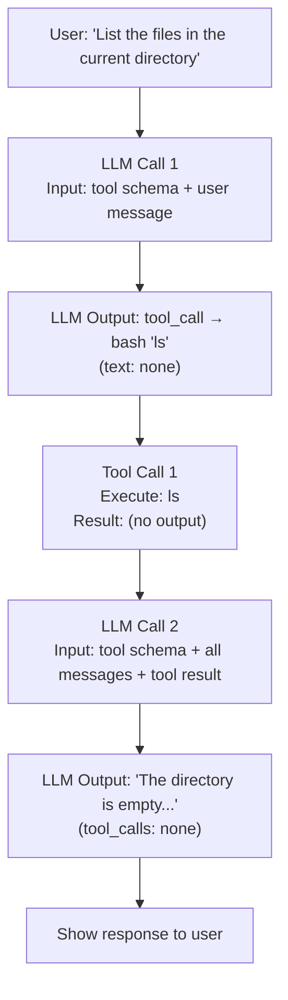

> [!info]+ Interview questions covered
> - What is the agentic loop and how does it work?
> - How does a coding agent know which bash command to run?
> - What is the role of the `tool` message role in the messages array?

---

### 4.3 Turn 2 — Creating a Directory and a Python File

**Turn 2 — user input:** `Create a directory called "calc" and create calc/calculator.py with add, subtract, multiply, divide functions`

The accumulated messages going into LLM Call 3 now contain the entire Turn 1 history: the system prompt, the first user request, the assistant's `ls` tool call, the tool result `(no output)`, and the assistant's text response about an empty directory. This growing messages list is the agent's memory — it is reconstructed on every LLM call.

LLM Call 3 output — the LLM again produces `text: (none)` and a single tool call:

```bash
mkdir -p calc && echo -e "def add(x, y):\n    return x + y\ndef subtract(x, y):\n    return x - y\ndef multiply(x, y):\n    return x * y\ndef divide(x, y):\n    if y == 0:\n        raise ValueError('Cannot divide by zero')\n    return x / y" > calc/calculator.py
```

The LLM constructed the entire shell command chain — `mkdir -p` to create the directory and `echo -e` with output redirection to write all four Python functions into the file — without being told how. This is the LLM's coding and language ability put to practical use.

#### Tool Call 2 — Execution

```
result:
(no output)
```

A successful `mkdir` + `echo` redirect produces no stdout. `(no output)` means success. If the directory could not be created (e.g., permissions error), the tool would return an error message instead.

After LLM Call 4 receives this `(no output)` result, it produces the user-facing response confirming the file was created, along with a preview of the generated Python code:

```python
def add(x, y):
    return x + y

def subtract(x, y):
    return x - y

def multiply(x, y):
    return x * y

def divide(x, y):
    if y == 0:
        raise ValueError('Cannot divide by zero')
    return x / y
```

Opening `calc/calculator.py` in the editor confirms the file exists with exactly this content. The agent created a real, working code file from a natural language request.

> [!info]+ Interview questions covered
> - How does the agent maintain context across multiple user turns?
> - What does "no output" from a bash command mean in the agent loop?
> - Why does the agent's messages array grow with each turn?

---

### 4.4 The Agentic Loop — Code Walkthrough (`loop.py`)

The agent loop lives in `loop.py`. The core function is:

```python
def agent_loop(
    tools: ToolRegistry,
    system: str = "",
    max_iterations: int = MAX_ITERATIONS,
) -> None:
    """Run the agent loop until the model stops calling tools.

    Modifies `messages` in-place — appends assistant and tool result messages.
    """
    for i in range(max_iterations):
        stream = provider.chat_stream(
            messages=messages,
            system=system,
            tools=tools.schemas if tools.schemas else None,
        )
        response = print_stream(stream)

        _append_assistant_message(messages, response)
```

After appending the assistant message, the loop checks whether the LLM produced any tool calls:

```python
if not response.get("tool_calls"):
    return

tool_results = []
for tool_call in response["tool_calls"]:
    name = tool_call["name"]
    args = tool_call["arguments"]

    result = tools.dispatch(name, args)

    preview = result[:200] + "..." if len(result) > 200 else result
    print(f"{DIM}{preview}{RESET}\n")
```

If there are no tool calls, the loop returns immediately — the LLM has produced a final text response. Otherwise it iterates through every tool call sequentially, dispatching each one and collecting its result.

Each result is packaged as:

```python
tool_results.append({
    "tool_call_id": tool_call["id"],
    "tool_name": name,
    "content": result,
})

_append_tool_results(messages, tool_results)

print(f"{DIM}[Agent reached iteration limit ({max_iterations})]{RESET}")
```

The `_append_tool_results` call adds the tool results back to the messages list in the `tool` role format, ready for the next LLM call.

#### Sequential vs. Parallel Tool Execution

In this basic implementation, all tool calls returned by the LLM in a single `tool_calls` array are executed one by one in a `for` loop. The results are collected and sent back together. More advanced agents can run independent tool calls in parallel (e.g., using `asyncio`), but for a basic agent a sequential loop is sufficient and easier to reason about.

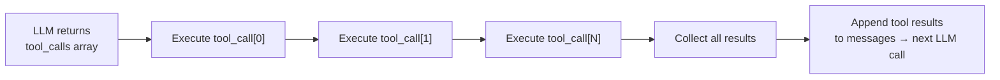

> [!info]+ Interview questions covered
> - How does an agent handle multiple tool calls from the LLM?
> - What is `max_iterations` in the agent loop and why does it exist?
> - What is the `tool_call_id` field used for?

---

### 4.5 Tool Schema Design — The Contract Between LLM and Code

The bash tool's schema is defined in `bash.py`:

From `bash.py` in `agent/tools/`:

```python
BASH_TIMEOUT = 60  # seconds

BASH_SCHEMA = {
    "name": "bash",
    "description": (
        "Execute a bash command and return its output. "
        "Use this for running shell commands, installing packages, "
        "checking system state, running scripts, etc. "
        "Commands have a 60-second timeout."
    ),
    "parameters": {
        "type": "object",
        "properties": {
            "command": {
                "type": "string",
                "description": "The bash command to execute.",
            }
        },
        "required": ["command"],
    },
}
```

The schema is the **contract** between the LLM and the execution layer. By declaring `"command"` in the `required` list, you guarantee that the LLM will always produce a `command` field in its tool_call output. The code on the other side can reliably extract `args["command"]` and pass it to `subprocess.run`.

If a tool requires no parameters (e.g., a `get_bitcoin_price` function that takes no input and returns the current price), the `properties` block and `required` list can be empty or omitted entirely. The schema design is flexible.

The `handle_bash` function on the receiving end:

```python
def handle_bash(command: str) -> str:
    """Execute a bash command and return stdout + stderr."""
    if is_dangerous_command(command):
        return f"Error: Command blocked for safety — '{command}' matches a dangerous pattern."
    try:
        result = subprocess.run(
            command,
            shell=True,
            capture_output=True,
            text=True,
            timeout=BASH_TIMEOUT,
            cwd=None,
        )
```

The `timeout=BASH_TIMEOUT` parameter enforces the 60-second limit at the `subprocess` level.

> [!info]+ Interview questions covered
> - What is a tool schema and why does it matter?
> - What happens if a tool doesn't declare its required parameters?
> - How does the LLM know which arguments to pass to a tool?

---

### 4.6 Safety Layers — Two Lines of Defense

The section demonstrates three distinct safety behaviors by deliberately sending dangerous commands.

#### Two-Layer Safety Model

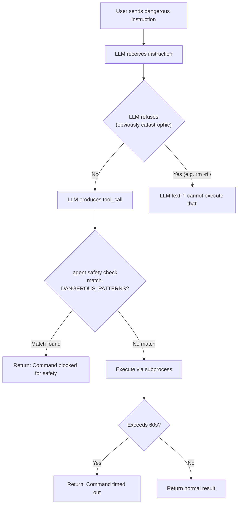

#### Layer 1 — LLM Self-Refusal

**Input:** `Run: rm -rf /`

The LLM refused on its own without reaching the bash tool at all:

```
I'm sorry, but I cannot execute that command. Removing the root directory `/` would cause irreversible damage to your filesystem and data. Please provide another command or path you'd like to remove.
```

Because `rm -rf /` is obviously catastrophic and appears heavily in LLM safety training data, the model treats it as a refusal case. It produces text, not a tool_call.

#### Layer 2 — Agent Safety Check (DANGEROUS_PATTERNS)

**Input:** `Run: sudo rm /tmp/test`

This time the LLM did produce a tool_call (`sudo rm /tmp/test`). The bash tool intercepted it:

```
[tool: bash] command=sudo rm /tmp/test
Error: Command blocked for safety — 'sudo rm /tmp/test' matches a dangerous pattern.
```

The safety check lives in `safety.py` in `agent/tools/`:

```python
DANGEROUS_PATTERNS = [
    r"\brm\s+-rf\s+/\b",         # rm -rf /
    r"\bsudo\s+rm\b",             # sudo rm
    r"\bmkfs\b",                  # format filesystem
    r"\bdd\s+if=",                # disk destroyer
    r"\bshutdown\b",              # shutdown system
    r"\breboot\b",                # reboot system
    r"\binit\s+0\b",              # halt system
    r">\s*/dev/sd",               # write to raw disk
    r"\bchmod\s+-R\s+777\s+/",   # open permissions on root
    r"\b:(){ :|:& };:",           # fork bomb
]

MAX_OUTPUT_LENGTH = 50_000
```

```python
def is_dangerous_command(command: str) -> bool:
    """Check if a command matches any dangerous pattern."""
    for pattern in DANGEROUS_PATTERNS:
        if re.search(pattern, command):
            return True
    return False
```

The function iterates over the regex list and blocks any match. This executes before `subprocess.run` is ever called. The blocked error message is returned as the tool result, and the LLM then explains the block to the user in natural language.

The `truncate_output` function in the same file caps tool output at `MAX_OUTPUT_LENGTH = 50_000` characters to prevent the LLM's context window from being overwhelmed by very large command outputs:

```python
def truncate_output(output: str, max_length: int = MAX_OUTPUT_LENGTH) -> str:
    """Truncate output if it exceeds the maximum length."""
    if len(output) <= max_length:
        return output
    half = max_length // 2
    return (
        output[:half]
        + f"\n\n... [truncated {len(output) - max_length} characters] ...\n\n"
```

#### Layer 3 — Bash Timeout

**Input:** `Run: sleep 200` (200 seconds, macOS default unit)

```
[tool: bash] command=sleep 200
Error: Command timed out after 60 seconds.
```

The 60-second `BASH_TIMEOUT` constant passed to `subprocess.run` raises a `TimeoutExpired` exception, which the tool catches and converts to this error string. That error string is returned as the tool result, and the LLM generates a user-facing explanation.

| Safety mechanism | Where it lives | What it catches |
|---|---|---|
| LLM self-refusal | Inside the LLM | Obviously catastrophic commands (`rm -rf /`) |
| DANGEROUS_PATTERNS | `safety.py` → `is_dangerous_command` | Patterns the LLM might still attempt (`sudo rm`, `mkfs`, fork bomb) |
| Timeout | `bash.py` → `subprocess.run(timeout=BASH_TIMEOUT)` | Long-running commands that would block the agent |

> [!info]+ Interview questions covered
> - What is the difference between LLM-level and agent-level safety?
> - Why is a `DANGEROUS_PATTERNS` list necessary if the LLM already refuses some commands?
> - How is the 60-second bash timeout enforced?
> - What is a fork bomb and why is it in the dangerous patterns list?

---

### 4.7 The `tool_call_id` and Message Structure

Every tool result fed back to the LLM must carry the `tool_call_id` that links it to the specific tool call the LLM made. This is how the LLM knows which result corresponds to which tool call — important when the LLM issues multiple tool calls in a single response.

```json
{
  "role": "assistant",
  "content": null,
  "tool_calls": [
    {
      "id": "bash",
      "type": "function",
      "function": {
        "name": "bash",
        "arguments": {
          "command": "ls"
        }
      }
    }
  ]
}
```

```json
{
  "role": "tool",
  "tool_call_id": "bash",
  "content": "(no output)"
}
```

In the loop code:

```python
tool_results.append({
    "tool_call_id": tool_call["id"],
    "tool_name": name,
    "content": result,
})
```

The `tool_call["id"]` from the LLM's response is preserved and echoed back in the tool role message. This round-trip matching is required by the OpenAI-compatible API format.

---

### 4.8 LLM Call 11 — Tracing a Full Multi-Turn Session

The inspector output for the "ls nonexistent directory" demo shows Tool Call 5:

```
— Tool Call 5 —

tool: bash
arguments:
{
    "command": "ls /nonexistent_dir_xyz"
}

result:
ls: /nonexistent_dir_xyz: No such file or directory

[exit code: 1]
```

This error string (exit code 1 from the shell) is packaged as the tool result and sent to LLM Call 11 as:

```json
{
  "role": "tool",
  "tool_call_id": "bash",
  "content": "ls: /nonexistent_dir_xyz: No such file or directory\n\n[exit code: 1]"
}
```

LLM Call 11 then generates a natural language explanation for the user. The critical teaching point is that **error messages are valid tool results**. The LLM can reason about errors just as well as it reasons about successful output.

---

### 4.9 Provider Abstraction and Extensibility

The agent is built against a `BaseProvider` abstract class (`agent/providers/base.py`):

```python
from abc import ABC, abstractmethod
from typing import Generator

class BaseProvider(ABC):
    """Interface that every provider implements."""

    @abstractmethod
    def chat(
        self,
        messages: list[dict],
        system: str = "",
        tools: list[dict] | None = None,
        max_tokens: int = 4096,
    ) -> dict:
        """Send messages and return a complete response.

        Returns a dict with:
        ...
        """

    @property
    @abstractmethod
    def name(self) -> str:
        """Human-readable provider name."""
```

The current configuration is Ollama (`agent/core/config.py`):

```python
MODEL = "qwen2.5:7b-instruct"
OLLAMA_HOST = "http://localhost:11434"

def get_config() -> dict:
    """Return resolved configuration dict."""
    return {
        "provider": "ollama",
        "model": MODEL,
        "ollama_host": OLLAMA_HOST,
    }
```

To switch to OpenAI or any other provider, a developer would:
1. Create `agent/providers/openai.py` that implements `BaseProvider`.
2. Update `get_config()` to set `"provider": "openai"`.

The providers folder currently contains `base.py`, `ollama.py`, and `registry.py`.

---

### 4.10 Agent Loop Resilience — The "Install Python" Demo

To show the agent handling a real system task with multiple fallback strategies, the tutor sends:

```
install python and verify the version installed
```

The agent autonomously:
1. Tried `sudo apt-get update && sudo apt-get install -y python3 ...` → failed (`apt-get: command not found`, macOS has Homebrew not apt).
2. Checked `/etc/os-release` to detect the distro → failed (no such file on macOS).
3. Tried a conditional `yum` install → failed (`yum: command not found`).
4. Tried `sudo yum update && sudo yum install -y python3 ...` → failed.
5. Concluded neither package manager is available and fell back to `python3 --version` to check if Python is already pre-installed.

This demonstrates **multi-step autonomous problem solving** — the agent loop keeps iterating, and the LLM uses each error message as feedback to reason about its next action. The effectiveness of this recovery process is bounded by the quality of the model; a larger or more capable model would diagnose the macOS environment more quickly.

The key architectural takeaway: the agent framework (the loop, tool dispatch, message accumulation) is correct and flexible. The quality of outcomes scales directly with the quality of the LLM.

> [!info]+ Interview questions covered
> - How does an agent handle command failures and adapt its strategy?
> - Why does model quality matter more than agent framework complexity?
> - What is the agent loop's termination condition?

---

### 4.11 Phase 2 Summary and What Comes Next

Phase 2 (Agent Loop + Bash) is now complete. The agent can:
- Accept natural language instructions and map them to bash commands.
- Execute arbitrary bash commands via `subprocess.run`.
- Feed command output (including errors) back to the LLM for interpretation.
- Maintain full conversation history across multiple user turns.
- Block dangerous commands via `DANGEROUS_PATTERNS` and enforce a 60-second timeout.
- Self-terminate when the LLM produces no tool calls.

The limitation of the bash-only approach for a **coding** agent is efficiency. Reading a large file with `cat` gives the entire content to the LLM at once, and making a targeted edit to lines 3–5 of a file requires constructing a fragile `sed` command. Phase 3 will introduce dedicated file manipulation tools: `read_file`, `write_file`, and targeted line-range editing. Phase 4 will add smart context management so the agent doesn't flood the LLM's context window with irrelevant file content.

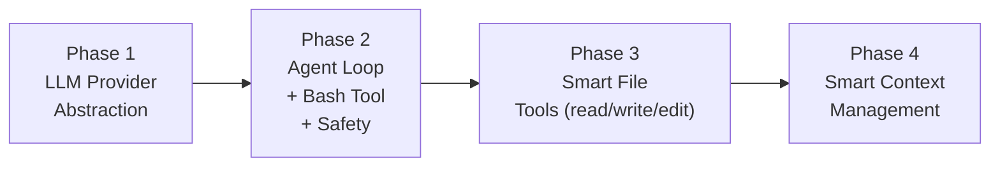


## Phase 2 Architecture: Agent Loop Diagram, loop.py, registry.py, bash.py

**Section timestamp:** 1:58:32 – 2:02:10

This section introduces the complete Phase 2 system architecture using an annotated diagram, then zooms into the actual `loop.py` code. It also covers two important design questions that arise naturally when students look at the diagram: how LLM-level safety differs from rule-based safety, and how tool failures and retry logic are handled.

---

### The Phase 2 Architecture Diagram


The diagram shown in the Markdown Viewer captures the full Phase 2 design in a single glance:

```
Phase 2: Agent Loop (1 tool)

The heart of the system: a while-loop that calls the LLM, executes tool calls,
and loops until the model is done.

            Ollama Provider
                  ^
                  |
cli.py ──► loop.py (Agent Loop) ──no tool calls = done──► cli.py
                  |
                  v
        registry.py (Tool Registry) ──► bash.py (Shell Execution) ──► safety.py (Command Blocking)

Phase 3: File Tools (6 tools)   [coming next]
```

As a Mermaid flowchart:

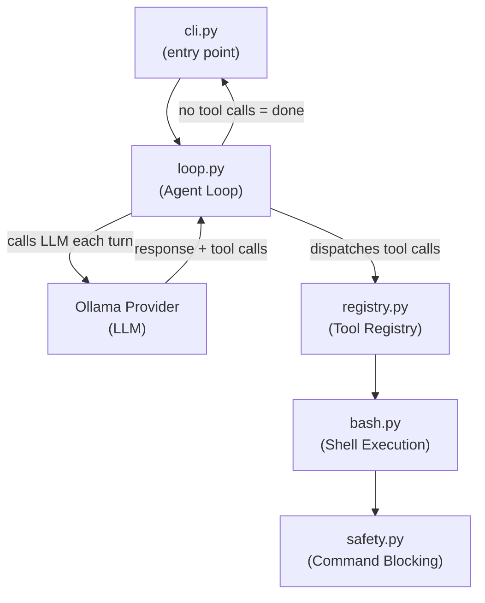

#### Component responsibilities

| Component | File | Role |
|---|---|---|
| CLI entry point | `cli.py` | Reads user input, initialises the message list, calls `agent_loop`, then loops back for the next user turn |
| Agent Loop | `loop.py` | The `while`-loop (implemented as a bounded `for`-loop with `max_iterations`). Calls the LLM, collects its response, executes any tool calls it requests, appends results to the message list, and repeats |
| Tool Registry | `registry.py` | A registry that maps tool names (as strings) to their Python implementations. The loop queries it to find the right function for each tool call the LLM makes |
| Shell Execution | `bash.py` | The single tool available in Phase 2. Executes shell commands and returns their output |
| Command Blocking | `safety.py` | A safety layer sitting between `bash.py` and actual execution. Blocks a hard-coded set of known-dangerous shell commands |
| LLM Provider | `provider` module | Wraps Ollama. Provides a `chat_stream` interface that accepts the current message history, a system prompt, and tool schemas, and yields streamed tokens |

**Termination condition:** the loop exits when the LLM returns a response that contains no tool calls. That is the signal that the model considers the task done. The result is passed back to `cli.py` for the next user interaction.

> [!info]+ Interview questions covered
> - What is an agent loop and when does it terminate?
> - How does a coding agent decide which tool to call?
> - What is the role of a tool registry in an LLM agent?
> - How does the agent architecture separate concerns across files?

---

### Safety: Rule-Based vs. LLM-Level

A natural question arises when looking at the architecture: `safety.py` blocks specific shell commands, but what about dangerous or harmful *questions* at the text level — for example, a user asking how to do something illegal?

The answer distinguishes two complementary layers of safety:

**1. Rule-based command blocking (`safety.py`)**
`safety.py` operates at the shell-command level. It maintains a list of known-destructive commands (e.g., `rm -rf /`, commands that would wipe a database) and refuses to execute them regardless of how the LLM arrived at them. This is a hard, deterministic guard. It covers the specific category of "the LLM was tricked or hallucinated a destructive bash command."

**2. LLM-level safety (model training)**
For higher-level semantic safety — filtering out dangerous or harmful questions before any code is even generated — a rule-based `if/else` check is fundamentally inadequate. Users can phrase requests in arbitrarily many ways, and no finite list of string patterns can cover them all. The right tool for semantic understanding is another LLM call: pass the incoming question to an LLM and ask it to classify whether the question is dangerous before proceeding. Modern LLMs are increasingly good at this classification task because they have been fine-tuned on vast amounts of user interaction data and continuously retrained on real-world queries.

The reason models are so capable at understanding user intent — including detecting harmful intent — is a combination of: (a) continuous data collection from real user queries that feeds ongoing retraining, and (b) advances in compute power and model architecture (more layers, more efficient training) that allow models to represent subtler semantic distinctions than earlier generations could.

**A concrete example from the lecture:** when a user previously asked the agent to run `rm -rf /`, it was the *model's own safety training* that declined — not `safety.py`. The `safety.py` guard handles the complementary case: a future scenario where a cleverly constructed prompt gets the model to agree to produce a dangerous command, at which point the rule-based layer is the last line of defence.

> [!info]+ Interview questions covered
> - Why are rule-based filters insufficient for LLM safety?
> - What are two complementary safety strategies in an AI coding agent?
> - Where should you put guardrails in an agent pipeline?
> - Why do LLMs improve at safety over time?

---

### The `agent_loop` Function in `loop.py`

At the end of this section the tutor switches to VS Code and shows the actual implementation on the `phase-2-agent-loop` branch.

From `loop.py` shown in VS Code:

```python
def agent_loop(
    messages: list[dict],
    tools: ToolRegistry,
    system: str = "",
    max_iterations: int = MAX_ITERATIONS,
) -> None:
    """Run the agent loop until the model stops calling tools.

    Modifies `messages` in-place — appends assistant and tool result messages.
    """
    for i in range(max_iterations):
        print(f"{CYAN}", end="")
        stream = provider.chat_stream(
            messages=messages,
            system=system,
            tools=tools.schemas if tools.schemas else None,
        )
        response = print_stream(stream)
        print(RESET, end="")
```

#### Annotated walkthrough

- **`messages: list[dict]`** — The full conversation history in OpenAI-compatible format (`role` + `content`). The function mutates this list in place: each iteration appends the assistant's response and, if there were tool calls, the tool result messages. This running list is the agent's memory.

- **`tools: ToolRegistry`** — The registry object. Passed in so the loop can dispatch tool calls. `tools.schemas` is a list of JSON Schema objects describing each registered tool; this is what gets sent to the LLM so it knows which tools exist and how to call them.

- **`system: str = ""`** — The system prompt that configures the agent's persona and constraints. Passed through to the LLM provider on every turn.

- **`max_iterations: int = MAX_ITERATIONS`** — A safety ceiling on the number of LLM calls per user turn. Prevents infinite loops if the model keeps calling tools indefinitely.

- **`provider.chat_stream(...)`** — Calls the Ollama-backed LLM, passing the full message history, system prompt, and tool schemas. Returns a streaming generator so the response can be printed to the terminal token-by-token as it arrives.

- **`tools=tools.schemas if tools.schemas else None`** — If no tools are registered, `None` is passed, which tells the LLM to operate in plain text mode with no tool calling.

- **`response = print_stream(stream)`** — Consumes the stream, printing each token, and collects the full structured response (including any tool call requests) for the loop to process after streaming is complete.

#### The full agent loop flow

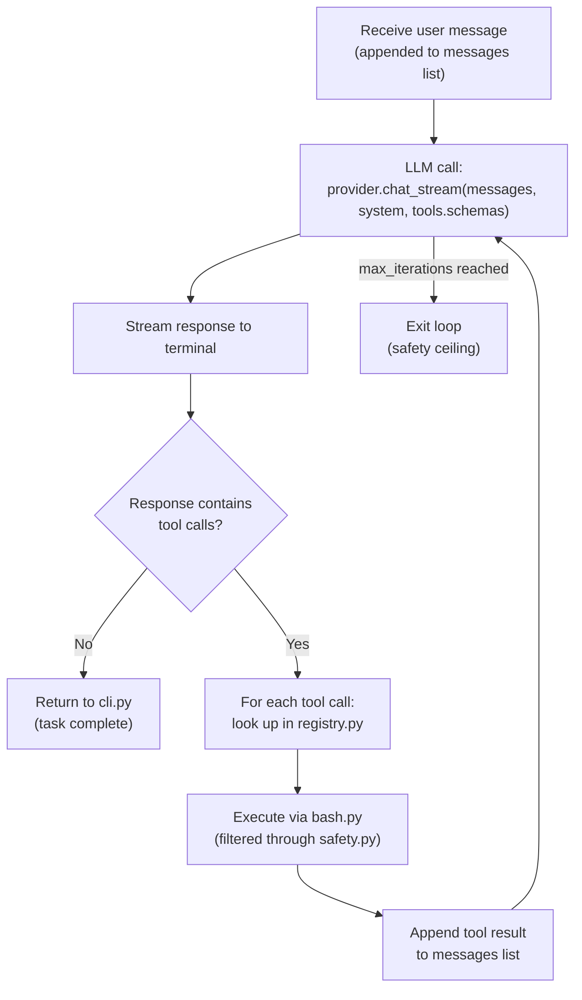

The crucial insight is that **tool results are fed back into the messages list**. On the next iteration, the LLM sees the result of the previous tool call as part of its context, which is why it can act on the output, decide whether to call another tool, or decide it is done.

> [!info]+ Interview questions covered
> - What does the `agent_loop` function signature look like and what does each parameter do?
> - How does the agent loop avoid running forever?
> - Why is the messages list mutated in place rather than returned?
> - How does the LLM know which tools it can use?

---

### Tool Failures and Retry Logic

A related design question raised in this section: what happens when a tool call fails — does the agent retry automatically?

In the Phase 2 implementation, there is **no explicit retry logic at the tool level**. When a tool fails (e.g., a bash command returns a non-zero exit code, or produces an error message), that error output is captured as the tool result and appended to the messages list like any other result.

On the next iteration, the LLM sees the error in its context. A capable LLM will recognise that the tool failed — perhaps it received a "file not found" error, or a permission denied message — and can decide on its own whether to:

- Retry the same call with different arguments,
- Try a different approach entirely,
- Inform the user that the task cannot be completed.

This is a form of **LLM-driven retry**: rather than wrapping tool calls in explicit `try/except/retry` scaffolding, the system relies on the model's ability to read error output and adapt. It works because tool results — including errors — are first-class messages in the conversation history.

| Approach | Mechanism | Limitation |
|---|---|---|
| Explicit retry at tool level | Code wraps each tool call in retry logic with backoff | Must anticipate every failure mode; brittle |
| LLM-driven retry | Error result fed back to model; model decides next step | Relies on model capability; uses extra LLM turns |

In the current codebase, the LLM-driven approach is used. An explicit tool-level retry layer could be added as an enhancement (wrapping individual tool implementations), but it is not present in Phase 2.

> [!info]+ Interview questions covered
> - How does an LLM agent handle tool failures?
> - What is LLM-driven retry and how does it differ from explicit retry logic?
> - Why is feeding tool results back into the message list important for agent robustness?

---

### Summary: What Phase 2 Delivers

Phase 2 transforms the Phase 1 single-turn Q&A system into a full agentic loop capable of:

1. Receiving a user task as natural language
2. Calling the LLM with the full conversation history and a description of available tools
3. Executing whatever shell command the LLM requests, subject to safety filtering
4. Feeding the command output back to the LLM as context
5. Repeating until the LLM stops requesting tools (task done) or the iteration limit is hit

The system at this stage has exactly **one tool** (`bash.py`), which is already powerful enough to let the agent read files, list directories, run programs, and check command output — the foundation everything else in Phase 3 and beyond will build upon.


## Context Compaction, LLM for Summarization, Messages List, Tool Error Handling, Context Limit

**Section timestamps:** 2:02:10 – 2:16:03

This section covers the mechanics of the agent loop's tool dispatch, how the messages list acts as the agent's real-time memory, what happens at the context limit, and how an LLM is used to compact that growing context. It also explores the broader question of how LLMs reason: context always comes first, weights second.

---

### Tool Dispatch and the Tool Results Loop

From `loop.py` shown in VS Code (slide 502):

```python
if not response.get("tool_calls"):
    return

tool_results = []
for tool_call in response["tool_calls"]:
    name = tool_call["name"]
    args = tool_call["arguments"]

    print(f"{YELLOW}[tool: {name}]{RESET} ", end="")
    print(f"{DIM}{_summarize_args(args)}{RESET}")

    result = tools.dispatch(name, args)

    preview = result[:200] + "..." if len(result) > 200 else result
    print(f"{DIM}{preview}{RESET}\n")

    tool_results.append({
        "tool_call_id": tool_call["id"],
        "tool_name": name,
        "content": result,
    })
```

The loop checks whether the LLM response includes `tool_calls`. If none are present, it returns immediately — the agent loop terminates cleanly. If tool calls are present, each one is dispatched via `tools.dispatch(name, args)`, which routes the call to the correct tool implementation. The result is truncated to a 200-character preview for logging purposes, then appended in full to `tool_results` with its `tool_call_id` so the LLM can correlate the response to its original request.

After processing all tool calls, the results are fed back into the messages list via `_append_tool_results(messages, tool_results)`, and the loop continues into the next iteration.

The iteration cap is also visible here:

```python
_append_tool_results(messages, tool_results)

print(f"{DIM}[Agent reached iteration limit ({max_iterations})]{RESET}")

def _append_assistant_message(messages: list[dict], response: dict):
    msg = {"role": "assistant", "content": response.get("content", "") or None}
```

The `_append_assistant_message` helper sets the role to `assistant` and stores the text content, ready to be part of the conversation history on the next turn.

#### Tool Error Handling: LLM as the Reasoner

A key question arises: what happens when a tool returns an error — for example, HTTP 404 when fetching the Bitcoin price? The answer is that the tool result, including the error string, is fed back to the LLM as a tool response message. The LLM then reasons about what to do next.

A capable LLM will interpret a 404 as a transient server-side problem and will spontaneously recommend retrying — possibly after a delay. The agent developer can also implement exponential backoff at the tool layer (wait 5 seconds, then 10 seconds on the next failure). If the LLM receives two consecutive 404 responses in the messages list, it will typically conclude that the resource is unavailable and stop requesting it. The LLM's reasoning emerges from the full conversation history, not from explicit retry-logic code.

The important design point: **tool failure handling responsibility is split**. The LLM handles semantic retry decisions (should I try again? is this a different error?). The developer's tool implementation handles infrastructure concerns like connection resets and rate-limit back-off.

> [!info]+ Interview questions covered
> - What happens when a tool called by an LLM agent returns an error?
> - How does an agent handle transient failures like HTTP 404 in an agentic loop?
> - What is the role of exponential backoff in LLM agents, and where is it implemented?

---

### The Agent Loop Signature and Flow

From `loop.py` (slides 504–506):

```python
def agent_loop(
    messages: list[dict],
    tools: ToolRegistry,
    system: str = "",
    max_iterations: int = MAX_ITERATIONS,
) -> None:
    """Run the agent loop until the model stops calling tools.

    Modifies `messages` in-place — appends assistant and tool result messages.
    """
    for i in range(max_iterations):
        print(f"{CYAN}", end="")
        stream = provider.chat_stream(
            messages=messages,
            system=system,
            tools=tools.schemas if tools.schemas else None,
        )
        response = print_stream(stream)
        print(RESET, end="")
```

On every iteration, the full `messages` list (the complete conversation history to date) is sent to `provider.chat_stream`. The `tools.schemas` is also passed so the LLM knows what tools are available and can choose to call them. The response is streamed and printed in real time.

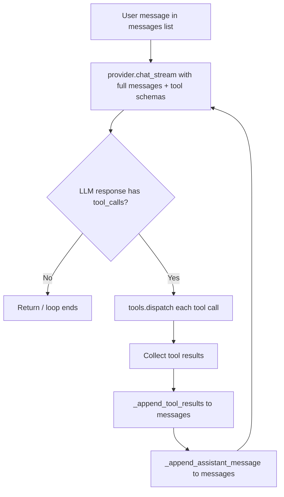

Notice that `messages` is modified **in-place** on every turn. The list accumulates the full conversation: user messages, assistant messages, tool call requests, and tool results. This accumulation is the foundation of the agent's real-time memory.

---

### What Is an LLM? The Closed-Room Analogy

During a Q&A exchange, the tutor gave a precise and memorable analogy for understanding the LLM's fundamental limitation:

> Imagine you are in a closed room with no internet. If I ask you what the current score is in the Barcelona vs. Real Madrid match happening right now, you cannot answer — because you have no access to live data.

That closed room is the LLM. It has vast knowledge baked into its weights from training, but no ability to observe the world in real time. Tools are the solution. The LLM is given a reference sheet that says "if you need live football scores, call this number; if you need Bitcoin prices, call that number." Once given a tool, the LLM can instruct the agent to invoke it and will use the returned data to answer the question.

This same analogy applies to code assistant tools like GitHub Copilot. A claim that "your code never leaves your machine" is effectively false if the tool uses a cloud LLM — because the LLM must see at least a structured summary or abstraction of your code to suggest changes to it. What these tools actually do is **summarize or abstract your code** before sending that representation to the cloud LLM. Raw source is not sent verbatim; a semantically equivalent summary is. The LLM can then recommend new function names, signatures, or usage patterns without having read every line.

> [!info]+ Interview questions covered
> - What is an LLM's fundamental limitation with respect to real-time data?
> - How do tools extend an LLM's capabilities beyond its training data?
> - Does a code assistant like GitHub Copilot send your source code to the cloud?

---

### Context Comes First: LLM Reasoning Priority

A subtler question arose from the class: when the LLM generates a response, does it first search its own weights (pre-trained knowledge) or the provided context (the messages list)?

The answer is **context always comes first**. The messages list — which contains the entire conversation including tool results — is sent to the LLM on every turn. The LLM processes all of this context as part of a single forward pass, and context naturally takes precedence over general pre-training knowledge because it is explicit and specific. If the messages list contains the answer to a question (for example, a tool result that includes the current date), the LLM will use that answer rather than guessing from its weights.

This property is why the messages list design is so important. It is not just a chat transcript — it is the mechanism through which every piece of external information (tool results, user corrections, system instructions) is delivered to the LLM with high specificity.

---

### The Messages List as Real-Time Memory: Live Demo

Slides 507–509 show the live agent messages JSON, demonstrating what the list looks like in practice:

From the running agent's `messages` list (slide 507):

```console
{
  "role": "user",
  "content": "Run: sleep 200"
},
{
  "role": "assistant",
  "content": null,
  "tool_calls": [
    {
      "id": "bash",
      "type": "function",
      "function": {
        "name": "bash",
        "arguments": {
          "command": "sleep 200"
        }
      }
    }
  ]
},
{
  "role": "tool",
  "tool_call_id": "bash",
  "content": "Error: Command timed out after 60 seconds."
}
```

The LLM sees three messages: the user instruction, the LLM's own tool_call request (with `content: null` because it produced no text, only a tool call), and the tool result with the timeout error. This is exactly what gets sent on the next iteration. The LLM then generates a text explanation of the failure.

A second command in the same session appends more entries:

```console
{
  "role": "user",
  "content": "Run: ls /nonexistent_dir_xyz"
},
{
  "role": "assistant",
  "content": null,
  "tool_calls": [
    {
      "id": "bash",
      "type": "function",
      "function": {
        "name": "bash",
        "arguments": {
          "command": "ls /nonexistent_dir_xyz"
        }
      }
    }
  ]
},
{
  "role": "tool",
  "tool_call_id": "bash",
  "content": "ls: /nonexistent_dir_xyz: No such file or directory\n\n[exit code: 1]"
}
```

The agent loop terminates (no further tool calls) and prints:

```console
================== OUTPUT ==================
text:
The directory `/nonexistent_dir_xyz` does not exist. The `ls` command returned an error because the specified path is invalid.

tool_calls:
(none)
```

`tool_calls: (none)` is the termination signal — `response.get("tool_calls")` returned falsy, so the loop returned.

> [!info]+ Interview questions covered
> - What is the structure of the messages list in an LLM agent?
> - How does the agent loop know when to stop iterating?
> - How are tool errors represented in the messages list?

---

### The Three Layers of Agent Memory

As the messages list grows over a long agent session, it will eventually approach or exceed the LLM's context window limit (for example, 100,000 tokens). This is where the broader concept of **memory layers** becomes important.

The tutor introduced a three-layer model of agent memory:

| Memory Layer | Scope | Storage | Example |
|---|---|---|---|
| **Real-time (session)** | Current conversation turn | The `messages` list in RAM | Full conversation history including all tool results |
| **Short-term** | Current session or recent sessions | In-memory cache or lightweight store | "User prefers Python"; "apt-get is not available on this machine" |
| **Long-term** | Persistent across sessions | Vector database or key-value store | "User is an ML engineer"; "User's programming language is Python" |

The **messages list** is the real-time layer. It is complete and exact, but it is ephemeral — when the session ends (or when the agent is restarted), this layer resets entirely. This is demonstrated by the "install python" demo: a new session is started, and the agent has no knowledge of what happened in the previous session.

The **short-term layer** holds derived facts from the current or recent sessions. For example, if a user says early in a session that they write code in Python, this can be extracted and stored in a fast in-memory cache. When the user asks a question later in the session, the agent reads this cached preference and enriches the LLM's context without re-reading the entire earlier conversation.

The **long-term layer** holds durable user or project facts, typically stored in a vector database. A query is made against the vector database using semantic similarity (e.g., "user is asking about coding"), and the most relevant facts are retrieved and prepended to the messages list before calling the LLM. This gives the LLM relevant context without needing to replay an entire conversation history.

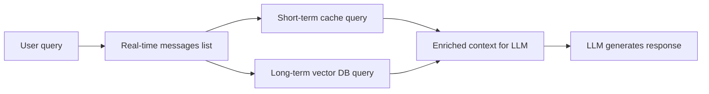

> [!info]+ Interview questions covered
> - What are the three layers of memory in an LLM agent?
> - What is session memory in the context of an AI agent?
> - How is short-term memory different from long-term memory in an agent system?
> - What is a vector database and why is it used for long-term memory?

---

### Context Compaction: Using an LLM to Summarize Itself

When the messages list grows too large to fit within the LLM's context window, the agent needs a strategy to reduce it without losing important information. This is called **context compaction**.

The principle: instead of discarding old messages, you **summarize** them. A compact representation of earlier history is substituted in place of the full verbatim messages. For example, a long exchange about a blocked command can be replaced with a single short entry:

```console
{
  "role": "tool",
  "tool_call_id": "bash",
  "content": "Error: Command blocked for safety — 'sudo rm /tmp/test' matches a dangerous pattern."
}
```

The word "blocked" is enough for the LLM to understand the outcome. The multi-paragraph LLM explanation that follows can be compacted to a one-line summary. The full verbatim exchange is preserved in the long-term memory layer but is not re-sent on every turn.

The key question is: **what is the best agent for performing this summarization?** The answer is an LLM. An LLM, given the full messages list or a large segment of it, can generate a compact but semantically complete summary of what happened: what commands ran, what succeeded, what failed, what the user's goal was. This summary replaces the older portion of the messages list, keeping token usage within limits while preserving enough context for coherent continuation.

The general flow for context compaction is:

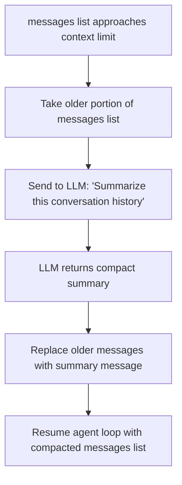

This is the approach taken by production agents like Claude Code, which automatically compacts context when the conversation grows long. The compaction is invisible to the user but keeps the agent functional for arbitrarily long sessions.

> [!info]+ Interview questions covered
> - What is context compaction in an LLM agent?
> - What happens when the messages list exceeds the LLM's context window?
> - Why is an LLM the best tool for summarizing a conversation history?
> - How does Claude Code handle long conversations without losing context?

---

### LLM Adaptive Reasoning Through Tool Failures: Live Demo

A practical demonstration reinforces all of the above. A fresh agent session is started with the instruction "install python and verify the version installed":

```console
> install python and verify the version installed

[tool: bash] command=sudo apt-get update && sudo apt-get install -y python3 &&...
Password:
sudo: apt-get: command not found

[exit code: 1]
```

The LLM receives the `apt-get: command not found` error as a tool result, reasons that this is likely not a Debian/Ubuntu system, and pivots to trying `yum`:

```console
[tool: bash] command=sudo yum update && sudo yum install -y python3 && python3...
sudo: yum: command not found

[exit code: 1]
```

After two package manager failures, the LLM reasons again — neither `apt-get` nor `yum` is available, so this is likely a minimal or containerized environment. Python is often pre-installed in such environments. The LLM's next suggestion is to check with `python3 --version` rather than attempting installation.

This demonstrates:

1. The LLM uses tool results (errors) to update its model of the environment
2. It tries increasingly conservative approaches without being explicitly programmed to do so
3. Each iteration's result becomes part of the messages list, giving the LLM full history to reason from
4. The agent never gets stuck in a fixed retry loop — the LLM's reasoning adapts each turn

When the session is killed (`^C`) and the agent is restarted, it has no memory of these failures — the session memory is gone. This is a concrete demonstration of why the short-term and long-term memory layers matter: to avoid re-learning the same environmental facts every session.

---

### Summary of Key Concepts

| Concept | Definition |
|---|---|
| **Tool dispatch** | The agent routes each LLM tool_call to the correct implementation via `tools.dispatch(name, args)` |
| **Tool error handling** | Tool errors are returned as tool result messages; the LLM reasons about retrying or abandoning |
| **Messages list** | The accumulating list of all messages (user, assistant, tool) that forms the agent's real-time memory |
| **Context window** | The maximum number of tokens the LLM can process in a single call |
| **Context compaction** | Replacing older messages with an LLM-generated summary to stay within the context window |
| **Session memory** | The messages list for the current session; resets on restart |
| **Short-term memory** | A cache of key facts derived from recent interactions |
| **Long-term memory** | A persistent store (typically a vector database) of durable user and project facts |
| **LLM for summarization** | An LLM is the best tool for compacting a large messages list into a shorter representation |
| **Context-first reasoning** | The LLM always processes the messages list context before falling back to weight-encoded knowledge |

> [!info]+ Interview questions covered
> - What is a context window and what happens when it is exceeded?
> - How is the messages list structured in an OpenAI-compatible agent?
> - What are the roles of `tool_call_id` and `role: tool` in the messages list?
> - How does an LLM agent differ from a stateless API call in terms of memory?


---

## Timeline

| Time | Section |
| ---- | ------- |
| `0:00` – `11:00` | [Cc-Calculator, Claude --Dangerously-Skip-Permissions, Claude Code, Claude Code Product Page, Claude Code Setup](#cc-calculator-claude---dangerously-skip-permissions-claude-code-claude-code-product-page-claude-code-setup) |
| `11:00` – `23:44` | [Phase 1 Foundation Demo, Ollamapy, Qwen257B-Instruct Model, Virtual Environment Setup, Ai-Coding-Agent Command](#phase-1-foundation-demo-ollamapy-qwen257b-instruct-model-virtual-environment-setup-ai-coding-agent-command) |
| `23:44` – `52:32` | [Llm Statelessness, Messages Array, Inspect Command, System Prompt, Ollama Provider](#llm-statelessness-messages-array-inspect-command-system-prompt-ollama-provider) |
| `52:32` – `1:22:46` | [Safetypy Command Blocking, Registrypy Becomes Tool Registry, Bash Shell Execution Tool, Grounded Final Response, Looppy Agent Loop Core](#safetypy-command-blocking-registrypy-becomes-tool-registry-bash-shell-execution-tool-grounded-final-response-looppy-agent-loop-core) |
| `1:22:46` – `1:58:32` | [Agentic Loop, Toolsschemas, Dangerous_Patterns List, Tool_Call_Id, Llm Call 11](#agentic-loop-toolsschemas-dangerouspatterns-list-toolcallid-llm-call-11) |
| `1:58:32` – `2:02:10` | [Phase 2 Architecture, Agent Loop Diagram, Looppy, Registrypy, Bashpy](#phase-2-architecture-agent-loop-diagram-looppy-registrypy-bashpy) |
| `2:02:10` – `2:16:03` | [Context Compaction, Llm For Summarization, Messages List, Tool Error Handling, Context Limit](#context-compaction-llm-for-summarization-messages-list-tool-error-handling-context-limit) |

## Interview Questions Covered

Total: 131 questions across 7 sections.

### Cc-Calculator, Claude --Dangerously-Skip-Permissions, Claude Code, Claude Code Product Page, Claude Code Setup

- What is an AI Agent?
- How is an AI Agent different from a plain LLM or a chatbot?
- What are the five core parts of an AI Agent?
- What are the five core parts of an AI Agent?
- What is the role of the LLM in an agent vs. the role of the loop?
- Why does the LLM not call tools directly?
- What is the agent loop? Why is it a `while True` loop?
- What is `max_steps` and why is it important?
- How does an agent maintain memory across multiple turns?
- What happens when the LLM cannot answer a question directly?
- What is the role of the messages array in an agent?
- What types of AI agents exist in production today?
- Why is a coding agent considered the most complex type of agent to build?
- What is Claude Code and how is it installed?
- What does the `--dangerously-skip-permissions` flag do?
- What model does Claude Code use by default?
- How does an AI coding agent maintain context across multiple tasks in the same session?
- What is the role of the context window in multi-turn agent interactions?
- What is the architectural relationship between Claude Code and a custom-built coding agent?
- What does the `install.sh` pattern tell us about how coding agent products are distributed?

### Phase 1 Foundation Demo, Ollamapy, Qwen257B-Instruct Model, Virtual Environment Setup, Ai-Coding-Agent Command

- How does a production coding agent like Claude Code differ from a chat interface?
- What is the role of the underlying model in a coding agent architecture?
- Can you build a coding agent with an open-source local model?
- Describe the agent loop pattern. Why does it use a `while` loop?
- How does a model decide which tool to call?
- What happens when a task requires multiple sequential tool calls?
- What is a `CLAUDE.md` file and how does it relate to context injection?
- Why would you load skills on demand rather than always including them in the system prompt?
- How do you prevent multiple agents from corrupting each other's file changes when working in parallel?
- What is a git worktree and when would a coding agent use one?
- What is the provider factory pattern and why is it used in this agent?
- Why is streaming important in a chat REPL?
- What is the role of an abstract base class in a multi-provider architecture?
- What is Ollama and how does it enable local LLM inference?
- What are the tradeoffs between using a local open-source model versus a cloud-hosted API?
- How would you swap the model in this architecture without changing the agent loop?
- What does a Python `.pth` file do and when would you use one?
- How do you make a Python script executable from any directory without modifying `sys.path` manually in the script itself?
- What does `PYTHONDONTWRITEBYTECODE=1` do and why is it useful during development?
- What is a REPL and how does it differ from a batch script?
- How does token streaming improve perceived responsiveness in a chat interface?
- What is the difference between a built-in `/command` handled by the CLI layer versus a natural-language prompt sent to the model?

### Llm Statelessness, Messages Array, Inspect Command, System Prompt, Ollama Provider

- What is the REPL pattern in CLI applications?
- Why separate the provider interface (base.py) from the implementation (ollama.py)?
- What is a system prompt in an LLM-powered application?
- How does the system prompt differ from the user message?
- Where in the conversation lifecycle is the system prompt applied?
- Are LLMs stateless or stateful?
- How does an LLM-based chat application implement conversational memory?
- What is the messages array in an LLM API call and what roles does it contain?
- What happens when you clear the conversation history in an LLM chat application?
- Why does an LLM seem to "remember" earlier parts of a conversation?
- What is a context window in an LLM?
- What happens when a conversation exceeds the LLM's context window?
- How would you persist conversation history in a production application?

### Safetypy Command Blocking, Registrypy Becomes Tool Registry, Bash Shell Execution Tool, Grounded Final Response, Looppy Agent Loop Core

- What does it mean that an LLM is stateless?
- How do LLM-based applications simulate memory?
- Who is responsible for managing conversation history in an AI agent?
- What is the agent loop pattern?
- How does tool registration work in an AI agent?
- What happens when the LLM produces no tool calls?
- Why does the agent loop use a bounded `for` loop instead of `while True`?
- What happens to the `messages` list across iterations of the agent loop?
- How does the agent know when to stop looping?
- Why does an AI coding agent need a safety layer for shell commands?
- What is output truncation in the context of an LLM agent, and why is it important?
- What is a tool registry in an AI agent?
- What is the difference between a tool schema and a tool handler?
- Why is the tool description the most important field in a tool schema?
- How does `subprocess.run` with `shell=True` work and what are its tradeoffs?
- How does the bash tool handle command failures?
- Walk me through a complete agent loop turn end-to-end.
- What is a "grounded response" in an AI agent context?
- Why does the agent call the LLM a second time after executing a tool?
- What does `tool_calls: (none)` in the LLM output mean for the agent loop?
- What role does the `"tool"` role message play in the conversation history?

### Agentic Loop, Toolsschemas, Dangerous_Patterns List, Tool_Call_Id, Llm Call 11

- What is the agentic loop and how does it work?
- How does a coding agent know which bash command to run?
- What is the role of the `tool` message role in the messages array?
- How does the agent maintain context across multiple user turns?
- What does "no output" from a bash command mean in the agent loop?
- Why does the agent's messages array grow with each turn?
- How does an agent handle multiple tool calls from the LLM?
- What is `max_iterations` in the agent loop and why does it exist?
- What is the `tool_call_id` field used for?
- What is a tool schema and why does it matter?
- What happens if a tool doesn't declare its required parameters?
- How does the LLM know which arguments to pass to a tool?
- What is the difference between LLM-level and agent-level safety?
- Why is a `DANGEROUS_PATTERNS` list necessary if the LLM already refuses some commands?
- How is the 60-second bash timeout enforced?
- What is a fork bomb and why is it in the dangerous patterns list?
- How does an agent handle command failures and adapt its strategy?
- Why does model quality matter more than agent framework complexity?
- What is the agent loop's termination condition?

### Phase 2 Architecture, Agent Loop Diagram, Looppy, Registrypy, Bashpy

- What is an agent loop and when does it terminate?
- How does a coding agent decide which tool to call?
- What is the role of a tool registry in an LLM agent?
- How does the agent architecture separate concerns across files?
- Why are rule-based filters insufficient for LLM safety?
- What are two complementary safety strategies in an AI coding agent?
- Where should you put guardrails in an agent pipeline?
- Why do LLMs improve at safety over time?
- What does the `agent_loop` function signature look like and what does each parameter do?
- How does the agent loop avoid running forever?
- Why is the messages list mutated in place rather than returned?
- How does the LLM know which tools it can use?
- How does an LLM agent handle tool failures?
- What is LLM-driven retry and how does it differ from explicit retry logic?
- Why is feeding tool results back into the message list important for agent robustness?

### Context Compaction, Llm For Summarization, Messages List, Tool Error Handling, Context Limit

- What happens when a tool called by an LLM agent returns an error?
- How does an agent handle transient failures like HTTP 404 in an agentic loop?
- What is the role of exponential backoff in LLM agents, and where is it implemented?
- What is an LLM's fundamental limitation with respect to real-time data?
- How do tools extend an LLM's capabilities beyond its training data?
- Does a code assistant like GitHub Copilot send your source code to the cloud?
- What is the structure of the messages list in an LLM agent?
- How does the agent loop know when to stop iterating?
- How are tool errors represented in the messages list?
- What are the three layers of memory in an LLM agent?
- What is session memory in the context of an AI agent?
- How is short-term memory different from long-term memory in an agent system?
- What is a vector database and why is it used for long-term memory?
- What is context compaction in an LLM agent?
- What happens when the messages list exceeds the LLM's context window?
- Why is an LLM the best tool for summarizing a conversation history?
- How does Claude Code handle long conversations without losing context?
- What is a context window and what happens when it is exceeded?
- How is the messages list structured in an OpenAI-compatible agent?
- What are the roles of `tool_call_id` and `role: tool` in the messages list?
- How does an LLM agent differ from a stateless API call in terms of memory?

## Code Blocks Index

Unique code/console/mermaid blocks: 107 (deduplicated by content).

| Section | Block count |
| ------- | ----------- |
| `00_cc_calculator_claude_dangerously_skip_permissions_claude_cod` | 11 |
| `01_phase_1_foundation_demo_ollamapy_qwen257b_instruct_model_vir` | 6 |
| `02_llm_statelessness_messages_array_inspect_command_system_prom` | 22 |
| `03_safetypy_command_blocking_registrypy_becomes_tool_registry_b` | 21 |
| `04_agentic_loop_toolsschemas_dangerous_patterns_list_tool_call_` | 32 |
| `05_phase_2_architecture_agent_loop_diagram_looppy_registrypy_ba` | 4 |
| `06_context_compaction_llm_for_summarization_messages_list_tool_` | 11 |

## Glossary

Auto-generated from canonical concepts seen across the lecture. Definitions are extracted from the first paragraph in which each concept appears.

- **messages array**: 3. **The Memory:** The accumulated conversation history — the messages array that grows with each user query, each tool call, and each tool result. _(occurrences: 19)_
- **system prompt**: 2. **The Instructions (the system prompt):** Tells the LLM what its job is, what tools are available, and what rules to follow. _(occurrences: 17)_
- **agentic loop**: Section 4 — Agentic Loop in Action: Tool Schemas, Safety Layers, and LLM Call Tracing (1:22:46 – 1:58:32) _(occurrences: 16)_
- **llm statelessness**: LLM Statelessness, Messages Array, Inspect Command, System Prompt, and Ollama Provider _(occurrences: 16)_
- **ollama provider**: | Phase | Branch | What You Build | Tools | |-------|--------|----------------|-------| | 1 | `phase-1-foundation` | CLI + Ollama provider + streaming chat | 0 | | 2 | `phase-2-agent-loop` | Core agent `while`-loop + bash tool | 1 | | 3 | `phase-3-file-tools` | File read/write/edit + glob/grep + sandboxing | 6 | | 4 | `phase-4-smart-context` | 3... _(occurrences: 14)_
- **llm call 11**: 4.8 LLM Call 11 — Tracing a Full Multi-Turn Session _(occurrences: 14)_
- **inspect command**: LLM Statelessness, Messages Array, Inspect Command, System Prompt, and Ollama Provider _(occurrences: 13)_
- **qwen257b-instruct model**: (referenced in lecture; no definition extracted)
- **conversation history array**: (referenced in lecture; no definition extracted)
- **toolsschemas**: (referenced in lecture; no definition extracted)
- **phase 1 foundation demo**: Phase 1 Foundation Demo — Ollama, Qwen 2.5:7B-Instruct, Virtual Environment Setup, and the `ai-coding-agent` Command _(occurrences: 10)_
- **ollamapy**: (referenced in lecture; no definition extracted)
- **llm context window**: Long command outputs (e.g., `cat` on a multi-thousand-line file) would flood the LLM context window. `truncate_output` keeps both the beginning and end of the output, preserving the most useful information: _(occurrences: 9)_
- **safetypy command blocking**: (referenced in lecture; no definition extracted)
- **providerchat_stream**: (referenced in lecture; no definition extracted)
- **print_stream**: ```python def print_stream(stream_generator) -> dict: """Consume a provider's chat_stream() and print text in real-time. _(occurrences: 8)_
- **registrypy becomes tool registry**: (referenced in lecture; no definition extracted)
- **bash shell execution tool**: (referenced in lecture; no definition extracted)
- **dangerous_patterns list**: (referenced in lecture; no definition extracted)
- **ai coding agent cli**: (referenced in lecture; no definition extracted)
- **streamingpy**: (referenced in lecture; no definition extracted)
- **configpy**: (referenced in lecture; no definition extracted)
- **message stacking**: (referenced in lecture; no definition extracted)
- **inspector output**: The inspector output for the "ls nonexistent directory" demo shows Tool Call 5: _(occurrences: 7)_
- **tool_calls none**: (referenced in lecture; no definition extracted)
- **llm call 4 input**: (referenced in lecture; no definition extracted)
- **safetypy**: (referenced in lecture; no definition extracted)
- **tool role message**: The `tool_call["id"]` from the LLM's response is preserved and echoed back in the tool role message. This round-trip matching is required by the OpenAI-compatible API format. _(occurrences: 7)_
- **grounded final response**: (referenced in lecture; no definition extracted)
- **tool call 2 execution**: (referenced in lecture; no definition extracted)
