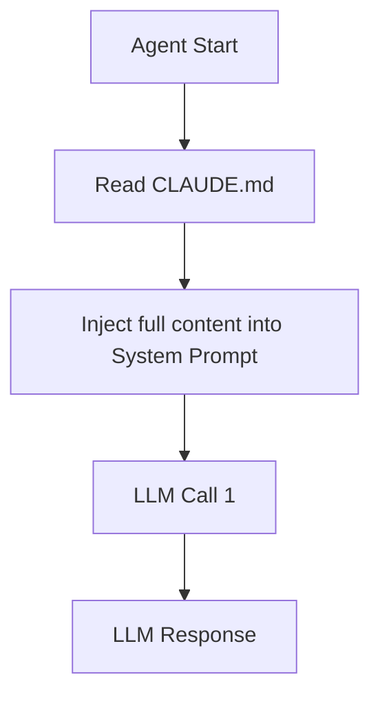
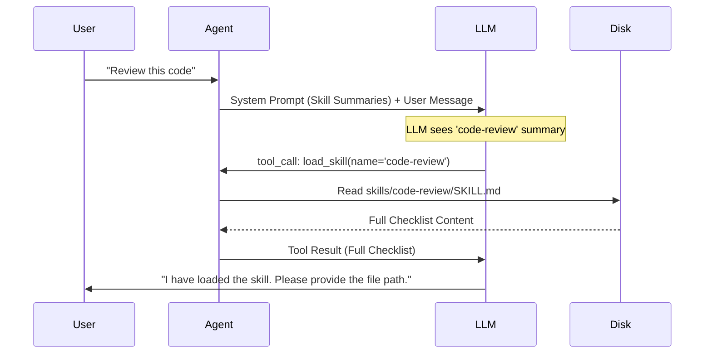
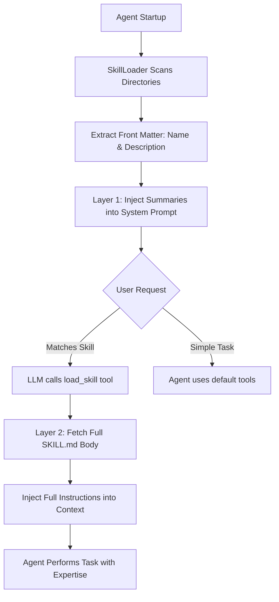
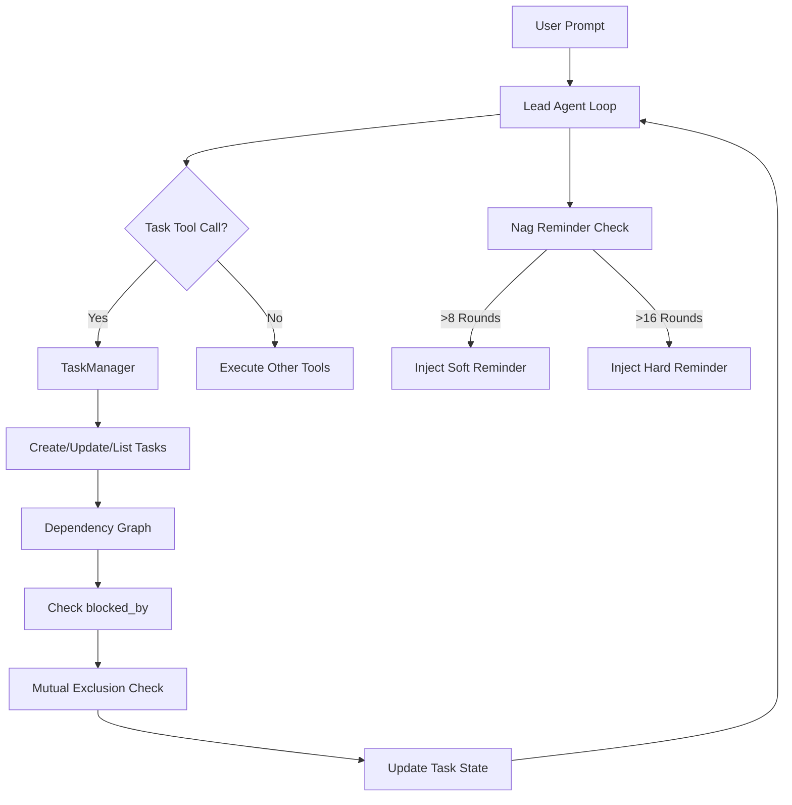
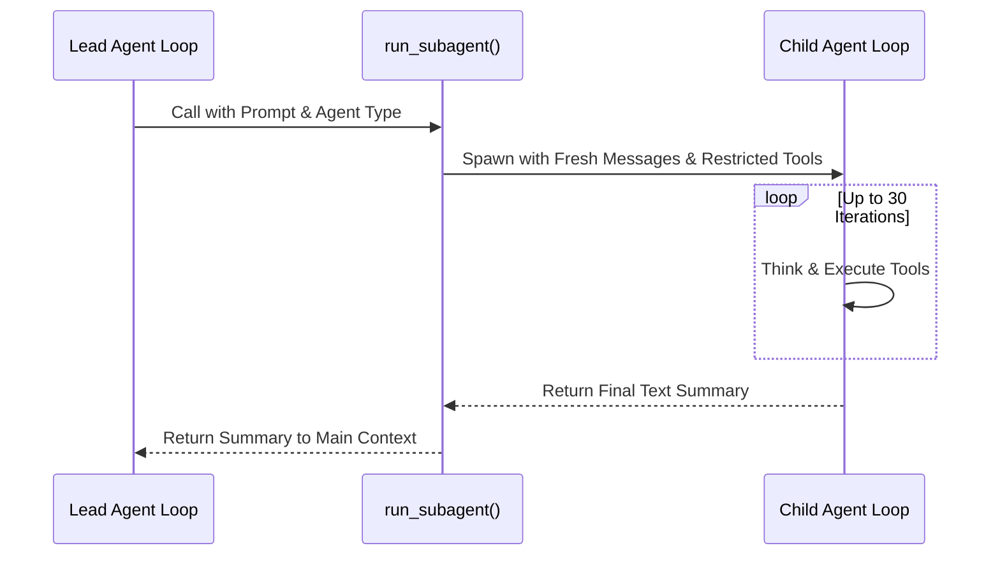
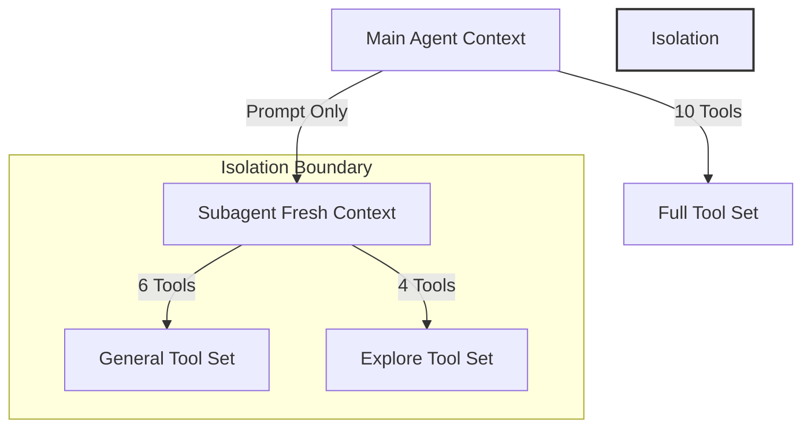
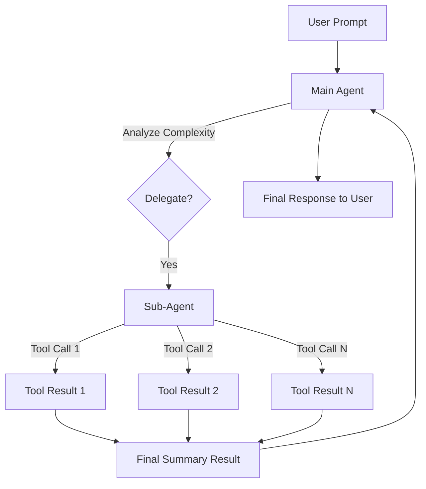

# LLM From Scratch — Part 1

Detailed notes synthesized from a 1:56:50 recorded lecture across 7 sections, 505 unique on-screen frames, and 30 canonical concepts.

## Table of Contents

1. [Claudemd, Context Bloating, Dynamic Skill Loading, System Prompt, Skillspy](#claudemd-context-bloating-dynamic-skill-loading-system-prompt-skillspy) _(23.9 min, 0:03–23:56)_
2. [Skill Loader, Load_Skill Tool Call, Load_Skill_Schema, Skillmd, Two-Layer Skill Loading](#skill-loader-loadskill-tool-call-loadskillschema-skillmd-two-layer-skill-loading) _(24.7 min, 23:56–48:38)_
3. [Subagent As New Tool, Task Manager, Task Tool, Sub-Task Creation, Skill Context Isolation](#subagent-as-new-tool-task-manager-task-tool-sub-task-creation-skill-context-isolation) _(39.3 min, 48:38–1:27:55)_
4. [General Subagent Tool Set, Context Independence, Fresh Context Window, Subagent Independence, Subagent Receives Only Prompt](#general-subagent-tool-set-context-independence-fresh-context-window-subagent-independence-subagent-receives-only-prompt) _(10.1 min, 1:27:55–1:37:59)_
5. [Sub-Agents, Context Window Inspection, Token Efficiency, Task Delegation, Multi-Agent Architecture](#sub-agents-context-window-inspection-token-efficiency-task-delegation-multi-agent-architecture) _(3.4 min, 1:37:59–1:41:22)_
6. [Parallel Sub-Agents, Claude Code, General_Purpose Agent Type, Main Agent Orchestration, Skill Context Isolation](#parallel-sub-agents-claude-code-generalpurpose-agent-type-main-agent-orchestration-skill-context-isolation) _(12.4 min, 1:41:22–1:53:45)_
7. [Token Usage, Llm Context Management, Chat Session, Claude Code, Token Cost Optimization](#token-usage-llm-context-management-chat-session-claude-code-token-cost-optimization) _(3.1 min, 1:53:45–1:56:50)_

---

## Claudemd, Context Bloating, Dynamic Skill Loading, System Prompt, Skillspy

In this section, we explore the evolution of the AI coding agent's memory system, moving from a monolithic instruction file to a dynamic, on-demand "Skills" architecture. We identify the critical problem of **Context Bloating** and implement a **Two-Layer Knowledge Injection** strategy to maintain a lean and efficient context window.

### The Problem: Context Bloating in `CLAUDE.md`

In Phase 4, we introduced `CLAUDE.md` as a way to provide the agent with persistent project-specific instructions. While effective, this approach has a significant scalability flaw: **Context Bloating**.

As the agent's capabilities grow, we tend to add more specialized instructions to `CLAUDE.md`. For example, we might add a "Code Review Skill" with a detailed checklist or a "PDF Skill" with complex shell commands for PDF manipulation.

#### Motivation: Why Monolithic Instructions Fail
When all instructions are stored in a single file like `CLAUDE.md`, the agent's startup process looks like this:



The issue is that **every single line** of `CLAUDE.md` is sent to the model on **every single turn**, regardless of the task. If the user simply says "Hi", the model still receives the full 50-line code review checklist and 30 lines of PDF manipulation commands. This wastes precious context window tokens and increases latency and cost.

#### Live Demonstration of Bloat
Using the `/inspect` command, we can see exactly what the LLM receives. Even for a trivial "Hi" prompt, the system message is bloated with irrelevant instructions:

```json
// From /inspect output (Phase 4 behavior)
{
 "role": "system",
 "content": "You are a helpful AI coding agent. Act directly — do the work, don't just plan it.\nUse tools to accomplish tasks immediately:\n- bash: execute shell commands\n- read_file, write_file, edit_file: file operations (always read before editing)\n- list_files, search_files: find files and search contents\nWhen the user asks you to do something, do it right away...\nInstructions from /Users/amitshekhar/Downloads/ml-classes/Testing AI Coding Agent/calculator/CLAUDE.md\nAlways use snake_case. Use logging, not print.\n# Code Review Skill...\n## Review Checklist...Correctness...Security...SQL injection, XSS...PDF Skill...Reading PDFs...Creating PDFs...Merging/Splitting..."
}
```

> [!info]+ Interview questions covered
> - What is "context bloating" in the context of LLM agents?
> - Why is it inefficient to put all specialized instructions into a single system prompt?
> - How does context bloating affect the performance and cost of an agentic system?

### The Solution: Dynamic Skill Loading

To solve context bloating, we transition to a **Dynamic Skill Loading** architecture. Instead of injecting all knowledge upfront, we provide the model with a "menu" of available skills and a tool to "order" the full instructions only when needed.

#### The Two-Layer Knowledge Injection Pattern
We split the knowledge injection into two distinct layers:

1. **Layer 1 (The Menu):** Only the **name** and a **one-line summary** of every available skill are injected into the initial system prompt.
2. **Layer 2 (The Dish):** The **full body** of a skill is injected only after the model explicitly requests it using a specialized tool.



### Implementation: The Skills Folder Structure

We move specialized instructions out of `CLAUDE.md` and into a dedicated `skills/` directory. Each skill follows a strict naming and file convention.

#### Folder Hierarchy
```text
project-root/
├── CLAUDE.md (Lean core instructions)
└── skills/
 ├── code-review/
 │ └── SKILL.md
 ├── pdf/
 │ └── SKILL.md
 └── agent-builder/
 └── SKILL.md
```

#### The `SKILL.md` Format
Each `SKILL.md` file uses YAML front-matter to define its metadata. The `description` field is the most critical, as it is what the model uses to decide whether to load the skill.

Example from `skills/code-review/SKILL.md`:
```markdown
---
name: code-review
description: Review code for quality, bugs, security issues, and best practices.
---

# Code Review Skill

When reviewing code, follow this structured approach:

## Review Checklist
1. **Correctness** — Does the code do what it claims?
2. **Security** — Check for SQL injection, XSS, etc.
...
```

### The `load_skill` Tool

We provide the model with a new tool, `load_skill`, which acts as the bridge between Layer 1 and Layer 2.

**Tool Schema Definition:**
```python
{
 "type": "function",
 "function": {
 "name": "load_skill",
 "description": "Load the full body of a specific skill into context. Only call this right before you need the detailed instructions to do a task the skill covers. Do NOT call this to answer questions like 'what skills are available' — the skill names and summaries are already in the system prompt; just list them from there.",
 "parameters": {
 "type": "object",
 "properties": {
 "skill_name": {
 "type": "string",
 "description": "Name of the skill to load."
 }
 },
 "required": ["skill_name"]
 }
 }
}
```

### Verification: Lean System Prompt in Action

After implementing Phase 5, running `/inspect` on a "Hi" prompt reveals a significantly cleaner system message:

```text
Available skills (4 total) — you already know their names and summaries:
 1. agent-builder: Design and build AI agents with tool-calling, planning, and multi-agent patterns.
 2. code-review: Review code for quality, bugs, security issues, and best practices.
 3. mcp-builder: Build MCP (Model Context Protocol) servers that expose tools, resources, and prompts to AI agents.
 4. pdf: Read, create, merge, and manipulate PDF files.
```

The model now has the awareness of its capabilities without the burden of their details. It only incurs the token cost of the full "Code Review Skill" when the user actually asks for a review.

#### Handling Unknown Skills
Because the model has the full list of valid skill names in its system prompt, it can gracefully handle requests for non-existent skills. If a user asks to "Load the database-migration skill", the model can respond immediately without calling a tool:

> "The skill 'database-migration' is not one of the available skills. The available skills are: agent-builder, code-review, mcp-builder, and pdf."

> [!info]+ Interview questions covered
> - Explain the "Two-Layer Knowledge Injection" pattern.
> - What is the purpose of YAML front-matter in a skill-loading system?
> - How does the `load_skill` tool help in managing the context window?
> - Why is the `description` field in a skill more important than the `name`?

### Summary of Benefits
| Feature | Monolithic (`CLAUDE.md`) | Dynamic Skills |
| :--- | :--- | :--- |
| **Context Usage** | High (Full content every turn) | Low (Summaries only, full on-demand) |
| **Scalability** | Poor (Grows with every feature) | Excellent (Unlimited skills possible) |
| **Model Focus** | Distracted by irrelevant info | Highly focused on current task |
| **Cost/Latency** | Higher | Lower |

This architectural shift transforms the agent from a "jack of all trades, master of none" (due to noise) into a highly specialized expert that only consults its manuals when necessary.


## Skill Loader, Load Skill Tool Call, Load Skill Schema, Skill.md, Two-Layer Skill Loading

Building a production-grade AI agent requires a sophisticated approach to context management. In this section, we transition from a monolithic system prompt to a dynamic, two-layer knowledge injection system. This architecture allows the agent to possess vast domain expertise—from code review to PDF manipulation—without overwhelming the LLM's context window or wasting tokens on irrelevant instructions.

### The Motivation: Context Optimization and Token Efficiency

The primary challenge in scaling AI agents is "context bloating." If you provide the agent with every possible instruction and guideline (e.g., how to review code, how to build MCP servers, how to handle PDFs) in the system prompt, you quickly consume thousands of tokens. This not only increases costs but also degrades the model's performance by filling the context window with noise.

The solution is **Skills on Demand**. Instead of loading everything upfront, we provide the agent with a "menu" of available skills and let it choose when to "order" the full instructions.

> [!info]+ Interview questions covered
> - Why is dynamic skill loading important for LLM agents?
> - How do you optimize the context window when an agent has many specialized tasks?

### The Two-Layer Knowledge Injection Architecture

The skills system is designed as a two-layer hierarchy to balance awareness with efficiency:

1. **Layer 1: System Prompt Summaries**: At startup, the agent scans all available skills and injects only their **names and descriptions** into the system prompt. This costs approximately 100 tokens per skill, giving the agent a lightweight map of its capabilities.
2. **Layer 2: On-Demand Full Loading**: When the agent identifies that a task requires specific expertise (e.g., the user asks for a code review), it invokes the `load_skill` tool. This tool fetches the **full body** of the skill (typically ~2000 tokens) and injects it into the conversation context.

#### Architectural Flow

The following diagram illustrates how the `SkillLoader` coordinates these two layers:



### The `SKILL.md` Format and YAML Front Matter

Every skill in the system follows a strict directory and file convention. A skill must live in `skills/<skill-name>/SKILL.md`. The `SKILL.md` file uses **YAML Front Matter** to separate metadata from the instructional body.

#### Structure of a `SKILL.md` File

```markdown
---
name: pdf
description: Read, create, merge, and manipulate PDF files.
---
# PDF Manipulation Guidelines
Use `pdftotext` for extraction...
Use `reportlab` for creation...
... (Full body of instructions)
```

The triple-dash `---` delimiters are critical. The `SkillLoader` parses the content between them to populate Layer 1, while everything after the second `---` is reserved for Layer 2.

#### Example: The PDF Skill
As shown in the lecture, the PDF skill provides deep technical expertise that the agent wouldn't otherwise have:

```python
# Example of instructions contained in Layer 2 of the PDF skill:
from reportlab.lib.pagesizes import letter
from reportlab.pdfgen import canvas

def create_pdf(filename, text):
 c = canvas.Canvas(filename, pagesize=letter)
 c.drawString(72, 720, text)
 c.save()
```

### Implementing the `SkillLoader`

The `SkillLoader` class is the engine of this system. It is responsible for scanning directories, parsing files, and providing the necessary strings for the system prompt and tool results.

#### Multi-Source Scanning: Bundled vs. Project Skills

The system supports two distinct skill locations:
* **Bundled Skills**: Located at the repo root (`/skills`). these are the "company defaults" that ship with the agent.
* **Project Skills**: Located in the current working directory (`./skills`). These allow users to add project-specific expertise or override bundled skills by name.

```python
# From agent/knowledge/skills.py:
BUNDLED_SKILLS_DIR = Path(__file__).resolve().parent.parent.parent / "skills"
PROJECT_SKILLS_DIR = Path(os.getcwd()) / "skills"

class SkillLoader:
 def __init__(self, skills_dirs: list[Path] | None = None):
 if skills_dirs is None:
 skills_dirs = [BUNDLED_SKILLS_DIR]
 # Add project skills if we are in a different directory
 if PROJECT_SKILLS_DIR.resolve() != BUNDLED_SKILLS_DIR.resolve():
 skills_dirs.append(PROJECT_SKILLS_DIR)
 
 self._skills = {}
 for d in skills_dirs:
 self._scan(d)
```

#### Parsing without Dependencies

To keep the agent lightweight, the `_parse_frontmatter` method implements a simple YAML parser without requiring external libraries like `PyYAML`.

```python
# From agent/knowledge/skills.py:
def _parse_frontmatter(self, content: str) -> tuple[dict, str]:
 if not content.startswith("---"):
 return {}, content

 parts = content.split("---", 2)
 if len(parts) < 3:
 return {}, content

 meta = {}
 for line in parts[1].strip().splitlines():
 if ":" in line:
 key, value = line.split(":", 1)
 meta[key.strip()] = value.strip()

 return meta, parts[2]
```

### The `load_skill` Tool and `LOAD_SKILL_SCHEMA`

The `load_skill` tool is the bridge between Layer 1 and Layer 2. Its schema includes explicit instructions to guide the LLM's behavior.

#### Tool Schema Definition

The `LOAD_SKILL_SCHEMA` defines a single required parameter: `skill_name`.

```python
# From agent/knowledge/skills.py:
LOAD_SKILL_SCHEMA = {
 "name": "load_skill",
 "description": (
 "Load the full body of a specific skill into context. "
 "Only call this right before you need the detailed instructions to do "
 "a task the skill covers. Do NOT call this to answer questions like "
 "'what skills are available' — the skill names and summaries are "
 "already in the system prompt; just list them from there."
 ),
 "parameters": {
 "type": "object",
 "properties": {
 "skill_name": {
 "type": "string",
 "description": "Name of the skill to load.",
 },
 },
 "required": ["skill_name"],
 },
}
```

#### Layer 1 Injection in `cli.py`

At startup, the agent calls `get_system_prompt_section()` to build the initial context.

```python
# From agent/core/cli.py:
skills = SkillLoader()
system_prompt = SYSTEM_PROMPT_BASE + skills.get_system_prompt_section()

# Register the tool
registry.register(LOAD_SKILL_SCHEMA, skills.load)
```

> [!info]+ Interview questions covered
> - How do you implement a two-layer knowledge injection system in an AI agent?
> - What is the purpose of YAML front matter in agent instruction files?
> - Explain the difference between bundled skills and project-specific skills.

### Advanced Coordination: Multi-Project Workflows

The tutor shares a real-world "Project Manager" pattern for complex, sequential tasks. Instead of one massive project, you create a **Coordinator Project** that manages multiple sub-projects, each with its own `CLAUDE.md`.

* **Project 1**: Task 1 instructions in `CLAUDE.md`.
* **Project 2**: Task 2 instructions in `CLAUDE.md`.
* **Project 3**: Task 3 instructions in `CLAUDE.md`.

The coordinator pulls code from Project 1, pushes it to Project 2, and so on. This ensures that the agent's context is always perfectly scoped to the current sub-task, further maximizing token quality and task performance.

### Testing and the Skill Persistence Problem

During live testing, a critical observation was made regarding the lifecycle of a loaded skill.

#### The Persistence Gap
Once a skill is loaded via a tool call, the tool result (containing the full skill body) remains in the conversation history. If the user then says "Hi," the agent—still seeing the code review guidelines in its recent history—might respond contextually to the code review rather than giving a simple greeting.

```json
// Raw message history showing the persistence:
[
 {"role": "user", "content": "Load code-review skill"},
 {"role": "assistant", "tool_calls": [{"name": "load_skill", "args": {"skill_name": "code-review"}}]},
 {"role": "tool", "content": "# Skill: code-review\nGuidelines..."},
 {"role": "assistant", "content": "Skill loaded. Ready to review."},
 {"role": "user", "content": "Hi"},
 {"role": "assistant", "content": "Hello! I see the code review guidelines are active. What code should I check?"} 
]
```

#### The Proposed Optimization: `unload_skill`
To solve this, the tutor suggests implementing an `unload_skill` mechanism. While the agent currently relies on **Context Compaction** (summarizing history every 3-5 turns), a more precise approach would be to explicitly remove the skill body from the context window once the specific task is completed.

> [!info]+ Interview questions covered
> - What happens to a loaded skill after the task is finished?
> - How do you handle skill persistence in long-running agent sessions?
> - What is the "unload skill" pattern and why is it useful?

### Summary of Skill Loader Responsibilities

The `SkillLoader` has two primary jobs:
1. **Discovery**: Scanning the `skills/` directories to find all `SKILL.md` files and parsing their metadata.
2. **Delivery**: Providing Layer 1 (summaries) for the system prompt and Layer 2 (full bodies) for the `load_skill` tool results.

By separating awareness from instructions, we build an agent that is both highly capable and contextually efficient.

> [!info]+ Interview questions covered
> - Explain the "Why before What" pedagogy in building agent skills.
> - How do you handle skill name conflicts when both bundled and project skills exist? (Answer: Use unique names or let project skills override bundled ones).


## Subagent as New Tool, Task Manager, Task Tool, Sub-Task Creation, Skill Context Isolation

In this section, Amit Shekhar transitions the AI coding agent from a single-loop system to a sophisticated multi-agent architecture. We explore **Phase 6: Planning**, which introduces structured task management to prevent the model from "getting lost" in complex projects, and **Phase 7: Subagents**, which allows the lead agent to delegate specific thinking tasks to isolated child agents. This progression addresses the fundamental limitations of LLMs: context bloating and the tendency to attempt too much at once.

## Phase 6: Planning and the Task Manager

As tasks become more complex, a simple conversational loop is no longer sufficient. LLMs often suffer from "eager execution," where they try to solve a massive problem in a single turn without accounting for dependencies or tracking progress. Phase 6 introduces the `TaskManager` and the `task` tool to provide a structured framework for the agent's work.

### The Motivation for Planning
Without a plan, an agent might try to summarize a blog post before fetching the data, or attempt to test a file before writing it. Amit explains that we need to give the agent "accountability" by dividing the work into multiple phases.

> [!info]+ Interview questions covered
> - Why do LLMs need a planning phase for complex tasks?
> - What is "eager execution" in the context of AI agents?

### The Task Manager Architecture
The `TaskManager` is the brain of the planning phase. it manages a list of tasks, each with its own state and dependencies.

#### Key Components of the Task Manager:
1. **Task Tool (CRUD)**: A unified tool that allows the model to `create`, `update`, `list`, `get`, and `delete` tasks.
2. **Dependency Graph**: Tasks can be `blocked_by` other tasks. A task cannot be started until all its blockers are `completed`.
3. **Mutual Exclusion**: To ensure focus, only one task can be `in_progress` at any given time.
4. **Stuck-Item Reminders (Nag Reminders)**: If a model stays in a task for too many rounds without updating it, the system injects a reminder.
 * **Soft Reminder**: At 8 rounds, the system gently suggests the model check if the task is too big and should be subdivided.
 * **Hard Reminder**: At 16 rounds, a more forceful reminder is injected to prevent infinite loops or context bloating.

#### Task Tool Schema
The `task` tool is defined in `tasks.py` with a clear contract for the LLM:

```python
# From agent/planning/tasks.py:
"description": {
 "Manage your task list. Use this to plan multi-step work and track",
 "progress, with optional dependencies between tasks.",
 "Actions: 'create' (add a new task), 'update' (change status or description),",
 "'list' (show all tasks), 'get' (show one task's details), 'delete' (remove).",
 "Statuses: pending, in_progress, completed.",
 "Only one task can be in_progress at a time.",
 "Use blocked_by on create to express dependencies; a task whose blockers",
 "aren't completed cannot be started."
}
```

### The Dependency Graph Flow
The following diagram illustrates how the `TaskManager` interacts with the main agent loop and manages task states:



### Demo: Decomposing a "Big Calculator Project"
Amit demonstrates the planning phase by asking the agent to build a "big calculator project with advanced features." The agent immediately uses the `task` tool to create an 8-phase breakdown:
1. Research and Design
2. Set Up Project Structure
3. Choose Technology Stack
4. Develop Core Functionality
5. Add Advanced Features
6. Testing and Debugging
7. Documentation
8. Deployment

The agent then creates these tasks in the `TaskManager`, marking the first one as `in_progress`. This structured approach ensures that the model doesn't skip critical steps like research or setup.

> [!info]+ Interview questions covered
> - How does a dependency graph improve agent reliability?
> - What is the purpose of "nag reminders" in long-running agent sessions?

---

## Phase 7: Subagents and Context Isolation

Even with planning, a lead agent's context window can quickly become bloated with tool outputs, file contents, and intermediate thoughts. Phase 7 introduces **Subagents**, allowing the lead agent to delegate specific "thinking" tasks to a child agent.

### Why Subagents?
The primary goal of subagents is **Skill Context Isolation**. By spawning a child agent, the lead agent can:
* **Keep the main history clean**: The child agent starts with a fresh, empty message list.
* **Delegate specialized work**: A child can be tasked with "researching a library" or "writing a specific function."
* **Restrict tools**: A child can be given a limited set of tools (e.g., read-only tools for exploration).
* **Trade wall-clock time for tokens**: While the child runs, the parent isn't consuming tokens for every intermediate step the child takes.

### Subagent Architecture: Lead vs. Child
The lead agent loop calls the `run_subagent` tool, which spawns a new instance of the agent loop in a synchronous call.



### Implementation: `subagent.py`
The `subagent.py` module defines the `SUBAGENT_SCHEMA` and the `run_subagent` handler. A key feature is the `agent_type` parameter, which determines the toolset available to the child.

#### Subagent Tool Schemas
The tool registry for a subagent is filtered based on its type:
* **`explore`**: Read-only tools (bash, read_file, list_files, search_files).
* **`general`**: Full access including `write_file` and `edit_file`.

```python
# From agent/parallel/subagent.py:
def _make_subagent_tools(agent_type: str = "general") -> ToolRegistry:
 """Create a tool registry for the subagent."""
 registry = ToolRegistry()
 registry.register(BASH_SCHEMA, handle_bash)
 registry.register(READ_FILE_SCHEMA, handle_read_file)
 registry.register(LIST_FILES_SCHEMA, handle_list_files)
 registry.register(SEARCH_FILES_SCHEMA, handle_search_files)
 
 if agent_type == "general":
 registry.register(WRITE_FILE_SCHEMA, handle_write_file)
 registry.register(EDIT_FILE_SCHEMA, handle_edit_file)
 
 return registry
```

### The `run_subagent` Function
The core logic involves initializing a new `messages` list with the user's prompt and calling the `agent_loop` recursively.

```python
# From agent/parallel/subagent.py:
def run_subagent(provider: BaseProvider, prompt: str, agent_type: str = "general") -> str:
 """Run a subagent with fresh context and return its text output."""
 # Import here to avoid circular imports
 from agent.core.loop import agent_loop
 
 tools = _make_subagent_tools(agent_type)
 messages = [{"role": "user", "content": prompt}]
 
 # ... system prompt setup with isolation instructions ...
 
 try:
 agent_loop(
 provider=provider,
 messages=messages,
 tools=tools,
 system=system,
 max_iterations=MAX_SUBAGENT_ITERATIONS,
 )
 except Exception as e:
 return f"Subagent error: {e}"
 
 # Extract the last assistant message as the summary
 # ... handling Anthropic-style content blocks ...
```

### Skill Context Isolation in Practice
Amit emphasizes that the lead agent only sees the **final text summary** from the subagent. All the "noise"—the multiple tool calls, error messages, and intermediate file reads—stays within the subagent's isolated context. This prevents the lead agent's context window from reaching its limit prematurely and keeps the model focused on high-level orchestration.

> [!info]+ Interview questions covered
> - What is context isolation and why is it important for multi-agent systems?
> - How do subagents help manage the token limit of an LLM?
> - What are the trade-offs between a single-agent and a multi-agent (lead/child) architecture?

### Summary of Differences: Phase 6 vs. Phase 7
| Feature | Phase 6: Planning | Phase 7: Subagents |
| :--- | :--- | :--- |
| **Primary Goal** | Task tracking & dependencies | Thinking delegation & context isolation |
| **Context** | Shared with the main agent | Fresh, isolated message history |
| **Tool Access** | Full access to all tools | Restricted based on `agent_type` |
| **Output** | Updates to the `TaskManager` | High-level text summary |
| **Flow** | Sequential turn-by-turn | Synchronous sub-loop |

By combining these two phases, the agent becomes capable of handling large-scale engineering tasks with a level of organization and efficiency that mimics a human developer's workflow.


## General Subagent Tool Set, Context Independence, Fresh Context Window, Subagent Independence, Subagent Receives Only Prompt

In the development of an LLM-based coding agent, the transition from a monolithic architecture to a subagent-based one is driven by the need for efficiency, security, and scalability. This section explores the technical implementation of subagent independence, focusing on how context isolation and specialized tool sets enable the agent to handle complex tasks while maintaining a lean context window.

### The Motivation for Subagent Independence

The primary driver for using subagents is the management of the **context window**. In a standard agent loop, every tool call, file read, and intermediate thought is appended to the conversation history. For a large project, this history grows exponentially, leading to several issues:

1. **Token Costs**: Every subsequent call to the LLM becomes more expensive as the history grows.
2. **Performance Degradation**: LLMs can lose focus or "hallucinate" when the context is cluttered with irrelevant intermediate steps.
3. **Parallelization**: A single agent can only do one thing at a time. Subagents allow the system to fork tasks and execute them concurrently.
4. **Security (Task Bifurcation)**: Different tasks require different permissions. By using specialized subagents, we can restrict a "Code Reviewer" to read-only tools while allowing a "Developer" subagent to have write access.

#### Task Bifurcation and Security
Specialized agents allow for a clear separation of concerns. For instance, a `general` subagent can be granted write access to the filesystem, while an `explore` subagent is strictly read-only. This prevents an agent tasked only with searching the codebase from accidentally modifying files.

> [!info]+ Interview questions covered
> - Why is context isolation important in a multi-agent system?
> - What are the benefits of using specialized subagents (e.g., explore vs. general)?
> - How do subagents contribute to token savings and parallelization?

### Mechanism of Isolation: The Fresh Context Window

The defining characteristic of a subagent in this architecture is its **Context Independence**. When the main agent spawns a subagent, it does not pass its entire conversation history, system prompt, or loaded skills. Instead, the subagent starts with a **Fresh Context Window**.

#### Subagent Tool Sets
The subagent is provided with a subset of the main agent's tools. The tool count varies depending on the agent's role:
* **Main Agent**: 10 tools (Full suite including bash, read, write, edit, etc.).
* **General Subagent**: 6 tools (Includes write tools like `write_file` and `edit_file`).
* **Explore Subagent**: 4 tools (Read-only tools only).

This reduction in tools not only enforces security but also simplifies the LLM's decision-making process within the subagent loop.



### Deep Dive: Inspecting the Subagent Call

To understand how independence is enforced, we can inspect the actual LLM calls. When the main agent decides to use a subagent, it calls the `subagent` tool. The only information passed is the `agent_type` and a `prompt`.

#### The Prompt-Only Communication
The subagent receives **only the prompt string**. It does not inherit the main agent's system prompt or any previously loaded skills. If the subagent needs a specific skill, the main agent must describe it in the prompt or the subagent must use its own `load_skill` tool.

From the `/debug` output shown in the lecture:
```console
> /debug
[ 0] user Use a subagent to create calc/utils.py with a format_result helper
[ 1] assistant None
[ 2] tool Created `calc/utils.py` with the `format_result` helper function as specified.
[ 3] assistant The subagent has created `calc/utils.py` with the `format_result` helper functio...
```
In the main agent's history, the entire subagent operation—which might have involved multiple internal LLM calls and file writes—is collapsed into a single tool result.

#### Subagent Internal Execution
Internally, the subagent operates with its own focused system prompt. This prompt instructs the subagent to be concise and to return only a high-level summary of the result, not the process.

From the subagent's internal LLM call:
```json
{
 "role": "system",
 "content": "You are a focused subagent. Complete the given task efficiently.\n\nWhen done, provide a brief outcome-focused summary of WHAT you accomplished. Do NOT include:\n- Tool call syntax or names\n- Verbatim file contents or code you wrote\n- A step-by-step replay of your actions\n\nThe parent agent only sees your summary — keep it high-level (1-3 sentences) describing the result, not the process."
}
```

### Token Savings and Context Management

A common misconception is that subagents "increase" the context window. In reality, they **decrease** the context usage of the main agent. By offloading the "noisy" intermediate steps of a task (like reading multiple files or trial-and-error debugging) to a subagent, the main agent's context remains clean.

#### Example: Creating `calc/utils.py`
1. **Main Agent** receives the user request.
2. **Main Agent** calls `subagent(agent_type='general', prompt='Create calc/utils.py...')`.
3. **Subagent** (in a fresh window) calls `write_file`.
4. **Subagent** returns: "Created `calc/utils.py` with the `format_result` helper function."
5. **Main Agent** appends only that one-line summary to its history.

If the main agent had done this directly, its history would contain the full `write_file` call, the byte count returned, and any intermediate thoughts. In a large project with hundreds of such operations, the token savings are massive.

> [!info]+ Interview questions covered
> - How does a subagent communicate its results back to the main agent?
> - What is the difference between the system prompt of a main agent and a subagent?
> - Does using subagents increase or decrease the total context window usage? Explain.

### Summary of Agent Capabilities

| Feature | Main Agent | General Subagent | Explore Subagent |
| :--- | :--- | :--- | :--- |
| **Tool Count** | 10 | 6 | 4 |
| **Write Access** | Yes | Yes | No |
| **Context** | Full History | Fresh Start | Fresh Start |
| **System Prompt** | Rich/Complex | Focused/Task-oriented | Focused/Read-only |
| **Primary Goal** | Orchestration | Execution | Information Retrieval |

By enforcing this strict independence, the architecture ensures that the agent remains scalable and cost-effective, even as the complexity of the codebase and the tasks increases.


## Sub-Agents, Context Window Inspection, Token Efficiency, Task Delegation, Multi-Agent Architecture

In a multi-agent architecture, the primary agent (or "main agent") delegates complex sub-tasks to specialized sub-agents. This section explores how this delegation strategy is not just an organizational choice but a critical optimization for managing the LLM's context window and improving token efficiency.

### The Problem: Context Window Bloat
As an LLM performs a complex task, it often makes multiple tool calls (e.g., reading files, searching code, running tests). Each tool call and its corresponding result are appended to the chat history. In a single-agent setup, this history quickly consumes the context window.

For example, if an agent needs to perform 10 different operations to complete a task:
1.  **Main Context**: Contains the initial prompt + 10 tool calls + 10 tool results.
2.  **Result**: The context window becomes "bloated," leading to higher costs, slower response times, and eventually, the loss of earlier context as the window limit is reached.

### The Solution: Task Delegation to Sub-Agents
By using sub-agents, we effectively "compress" the information returned to the main agent. Instead of the main agent seeing every granular step, it only sees the final result of the sub-task.

#### How Delegation Improves Efficiency
When the main agent calls a sub-agent:
- The sub-agent operates in its own **fresh context window**.
- It performs the necessary granular tool calls (e.g., 10 tool results).
- Once finished, it returns only a **single summary result** to the main agent.

| Feature | Single-Agent Architecture | Multi-Agent Architecture |
| :--- | :--- | :--- |
| **Context Management** | Accumulates every tool result in the main history. | Only the final sub-task summary is added to the main history. |
| **Token Usage** | High (linear growth with every tool call). | Optimized (main context stays lean; sub-agents handle the bulk). |
| **Complexity Handling** | Limited by the main agent's context window. | Scalable (tasks can be divided into many isolated sub-contexts). |

#### Token Efficiency vs. Delegation Overhead
A common concern is whether the tokens used to *delegate* the task (the sub-agent call itself) outweigh the savings. The tutor clarifies that the overhead of delegation is minimal compared to the massive token savings gained by not feeding 10+ tool results back into the main LLM context.

> [!info]+ Interview questions covered
> - Why do we use sub-agents in a multi-agent architecture?
> - How does task delegation help in managing the LLM context window?
> - What is the impact of sub-agents on token efficiency?

### Multi-Agent Architecture in Action
The decision to spawn a sub-agent is often triggered by the complexity of the user's request. For instance, asking for a "simple calculator" might be handled by the main agent directly. However, asking for an "advanced big calculator with multiple features" signals enough complexity for the model to divide the work.

#### Flow of Information


### Sub-Agent Tool Schema and Context Isolation
To ensure sub-agents remain efficient and focused, they are often provided with a restricted toolset. This is achieved by passing a specific tool schema to the sub-agent's LLM context.

From the terminal output shown in the lecture:
```json
{
  "type": "function",
  "function": {
    "name": "read_file",
    "description": "Read the contents of a file. Returns the file content with line numbers. Use this to understand existing code before modifying it.",
    "parameters": {
      "type": "object",
      "properties": {
        "path": {
          "type": "string",
          "description": "Path to the file (relative to workspace)."
        },
        "offset": {
          "type": "integer",
          "description": "Line number to start reading from (1-based). Optional."
        },
        "limit": {
          "type": "integer",
          "description": "Maximum number of lines to read. Optional, defaults to 2000."
        }
      },
      "required": ["path"]
    }
  }
}
```
*Caption: Example of the `read_file` tool schema passed to a sub-agent.*

This **skill context isolation** ensures that the sub-agent only has access to the tools it needs for its specific sub-task, further reducing the potential for context bloat and improving the accuracy of tool selection.

> [!info]+ Interview questions covered
> - What is skill context isolation in multi-agent systems?
> - How do you define the toolset for a sub-agent?


## Parallel Sub-Agents, Claude Code, General_Purpose Agent Type, Main Agent Orchestration, Skill Context Isolation

Building on the foundation of sub-agents, this section demonstrates how advanced AI coding agents like Claude Code orchestrate multiple sub-agents in parallel to handle massive tasks. We also dive into the implementation details of skill context isolation and dynamic tool management.

### Dynamic Skill Loading and Unloading
A sophisticated agent doesn't just load all tools at once. Instead, it dynamically manages its "skills" based on the current step of a sequential task.

#### Example: Code Review followed by Merge
1.  **Task 1: Code Review**: The main agent loads the "Code Review" skill and delegates it to a sub-agent.
2.  **Unloading**: Once the review is complete, the agent can call an `unload_skill` tool to clear the code review tools from its context.
3.  **Task 2: Merge**: The agent then loads the "Merge" skill for the next step.

This dynamic loading keeps the context window small and focused. However, the tutor notes that for very simple tasks (like a basic `git merge` command), the overhead of two extra LLM calls to unload/load might not be worth it.

### Case Study: Native Sub-Agent Support in Claude Code
The tutor demonstrates Claude Code (v2.1.138) to show how production-grade agents handle sub-tasks.

#### Single Sub-Agent Task
When prompted to "use subagent to create 10 files in temp folder," Claude Code:
- Automatically recognizes the need for a sub-agent.
- Spawns a `general_purpose` sub-agent.
- Executes the task using a single Bash command (`mkdir -p ... && touch ...`).
- Returns a concise summary to the main agent.

#### Parallel Sub-Agent Execution
When instructed to "create 100 files in parallel," the orchestration logic becomes even more impressive. The main agent decomposes the 100-file task into batches (e.g., 1-10, 11-20, etc.) and spawns **multiple sub-agents simultaneously**.

```mermaid
graph TD
    Main[Main Agent Orchestrator] -->|Decompose Task| B1[Batch 1: Files 1-10]
    Main -->|Decompose Task| B2[Batch 2: Files 11-20]
    Main -->|Decompose Task| B3[Batch 3: Files 21-30]
    Main -->|Decompose Task| BN[Batch N: Files 91-100]
    
    B1 --> S1[Sub-Agent 1]
    B2 --> S2[Sub-Agent 2]
    B3 --> S3[Sub-Agent 3]
    BN --> SN[Sub-Agent N]
    
    S1 & S2 & S3 & SN -->|Parallel Execution| Done[All Batches Complete]
    Done --> Verify[Main Agent Verifies with 'ls | wc -l']
```

This parallel approach leverages machine capability to complete high-volume tasks significantly faster than sequential execution.

> [!info]+ Interview questions covered
> - How does an agent orchestrate parallel sub-tasks?
> - What is the benefit of batching tasks in a multi-agent system?

### Implementation: `run_subagent` and `_make_subagent_tools`
The tutor reveals the underlying Python implementation for managing these sub-agents.

#### Agent Types: General vs. Explore
The system uses a `type` parameter to control the sub-agent's capabilities. This is the core of **skill context isolation**.

```python
def _make_subagent_tools(agent_type: str = "general") -> ToolRegistry:
    """Create a tool registry for the subagent."""
    registry = ToolRegistry()
    # All sub-agents get read-only and system tools
    registry.register(BASH_SCHEMA, handle_bash)
    registry.register(READ_FILE_SCHEMA, handle_read_file)
    registry.register(LIST_FILES_SCHEMA, handle_list_files)
    registry.register(SEARCH_FILES_SCHEMA, handle_search_files)

    # Only 'general' agents get write access
    if agent_type == "general":
        registry.register(WRITE_FILE_SCHEMA, handle_write_file)
        registry.register(EDIT_FILE_SCHEMA, handle_edit_file)
    return registry
```
*Caption: The conditional logic in `subagent.py` that enforces read-only vs. write access.*

#### The Sub-Agent System Prompt
To ensure the main agent's context remains clean, sub-agents are given a specific system prompt that mandates an **outcome-focused summary**.

```text
You are a focused subagent. Complete the given task efficiently.
When done, provide a brief outcome-focused summary of WHAT you accomplished.
Do NOT include:
- Tool call syntax or names
- Verbatim file contents or code
- Byte counts or line counts
- A step-by-step replay of your actions
The parent agent only sees your summary - keep it high-level (1-3 sentences).
```

### The Future of Agentic Engineering
The tutor concludes with a roadmap for the "Agentic Engineering" series, highlighting that the patterns are more important than the specific code.

- **Inference Optimization**: Techniques to accelerate agent processing (the next class topic).
- **Background Teams**: Multi-agent teams communicating via a message bus.
- **Autonomous Agents**: Self-directed agents that plan and execute without constant user input.
- **Isolation**: Using Git worktrees to run agents in isolated environments.

> [!info]+ Interview questions covered
> - What is the purpose of a specialized system prompt for sub-agents?
> - How do you implement read-only vs. write-access isolation for agents?
> - What are the key phases of building a production-grade AI coding agent?


## Token Usage, LLM Context Management, Chat Session, Claude Code, Token Cost Optimization

Managing token usage and context is a critical aspect of building and using AI coding agents. This section covers strategies for optimizing chat sessions to ensure efficiency and cost-effectiveness.

### The Challenge of Long Chat Sessions
In a typical interaction with an AI agent, every message, tool call, and tool result is appended to the chat history. As the session progresses:
- **Token Consumption Increases**: Every subsequent request includes the entire previous history, leading to higher costs.
- **Context Bloat**: The LLM may become less effective as the context window fills up with irrelevant or outdated information.

### Optimization Strategies

#### 1. Restarting Sessions for Independent Tasks
The simplest and most effective strategy for token optimization is to restart the chat session when moving to a completely independent task.
- **When to restart**: If you know your next feature or bug fix is unrelated to the current work.
- **Benefit**: Clears the context window, reducing the token count for the next request to the bare minimum.

#### 2. Using Context Management Tools
Modern agents like Claude Code provide built-in commands to manage context without losing critical information.
- **`/compact`**: A command that summarizes the current chat history into a concise form, effectively "compressing" the context while retaining the essential state.
- **Temporary Memory**: Claude Code and similar tools often have a temporary memory feature where they can save 4-5 key pieces of information from the beginning of a session, ensuring they aren't lost even if the context is compacted or the session is long.

| Strategy | Action | When to Use |
| :--- | :--- | :--- |
| **Session Restart** | Close and reopen the agent. | For completely independent tasks. |
| **Context Compaction** | Run `/compact`. | When the session is long but the task is ongoing. |
| **Selective Memory** | Ask the agent to "save" specific info. | For critical requirements that must persist across the session. |

### Enterprise Features and Developer Tracking
At the enterprise level, context management often involves additional features for tracking developer activity and managing token quotas across large teams. While the core agentic logic remains the same, enterprise versions may include:
- **Usage Monitoring**: Tracking token spend per developer or project.
- **Shared Context**: Allowing teams to share relevant project context more efficiently.

> [!info]+ Interview questions covered
> - How do you optimize token usage in long LLM chat sessions?
> - What is the purpose of a `/compact` command in an AI coding agent?
> - When should you restart an AI agent's chat session?

### Example: LangChain Agent Initialization
The tutor shows a basic example of how agents are initialized with specific tools, which is the starting point for any session.

```python
from langchain.agents import load_tools
from langchain.agents import initialize_agent
from langchain.agents import AgentType
from langchain.llms import OpenAI

# Initialize LLM
llm = OpenAI(temperature=0)

# Load specific tools to keep context focused
tools = load_tools(["serpapi", "llm-math"], llm=llm)

# Initialize the agent with a specific strategy (e.g., ZERO_SHOT_REACT)
agent = initialize_agent(
    tools, 
    llm, 
    agent=AgentType.ZERO_SHOT_REACT_DESCRIPTION, 
    verbose=True
)

# Run a specific task
agent.run("Who is Leo DiCaprio's girlfriend? What is her current age raised to the 0.43 power?")
```
*Caption: Example of initializing a LangChain agent with a focused toolset.*

By carefully selecting tools and managing the session lifecycle, developers can build agents that are both powerful and cost-efficient.

> [!info]+ Interview questions covered
> - What is the role of tool selection in context management?
> - How does verbose mode help in debugging agent context?


---

## Timeline

| Time | Section |
| ---- | ------- |
| `0:03` – `23:56` | [Claudemd, Context Bloating, Dynamic Skill Loading, System Prompt, Skillspy](#claudemd-context-bloating-dynamic-skill-loading-system-prompt-skillspy) |
| `23:56` – `48:38` | [Skill Loader, Load_Skill Tool Call, Load_Skill_Schema, Skillmd, Two-Layer Skill Loading](#skill-loader-loadskill-tool-call-loadskillschema-skillmd-two-layer-skill-loading) |
| `48:38` – `1:27:55` | [Subagent As New Tool, Task Manager, Task Tool, Sub-Task Creation, Skill Context Isolation](#subagent-as-new-tool-task-manager-task-tool-sub-task-creation-skill-context-isolation) |
| `1:27:55` – `1:37:59` | [General Subagent Tool Set, Context Independence, Fresh Context Window, Subagent Independence, Subagent Receives Only Prompt](#general-subagent-tool-set-context-independence-fresh-context-window-subagent-independence-subagent-receives-only-prompt) |
| `1:37:59` – `1:41:22` | [Sub-Agents, Context Window Inspection, Token Efficiency, Task Delegation, Multi-Agent Architecture](#sub-agents-context-window-inspection-token-efficiency-task-delegation-multi-agent-architecture) |
| `1:41:22` – `1:53:45` | [Parallel Sub-Agents, Claude Code, General_Purpose Agent Type, Main Agent Orchestration, Skill Context Isolation](#parallel-sub-agents-claude-code-generalpurpose-agent-type-main-agent-orchestration-skill-context-isolation) |
| `1:53:45` – `1:56:50` | [Token Usage, Llm Context Management, Chat Session, Claude Code, Token Cost Optimization](#token-usage-llm-context-management-chat-session-claude-code-token-cost-optimization) |

## Interview Questions Covered

Total: 45 questions across 7 sections.

### Claudemd, Context Bloating, Dynamic Skill Loading, System Prompt, Skillspy

- What is "context bloating" in the context of LLM agents?
- Why is it inefficient to put all specialized instructions into a single system prompt?
- How does context bloating affect the performance and cost of an agentic system?
- Explain the "Two-Layer Knowledge Injection" pattern.
- What is the purpose of YAML front-matter in a skill-loading system?
- How does the `load_skill` tool help in managing the context window?
- Why is the `description` field in a skill more important than the `name`?

### Skill Loader, Load_Skill Tool Call, Load_Skill_Schema, Skillmd, Two-Layer Skill Loading

- Why is dynamic skill loading important for LLM agents?
- How do you optimize the context window when an agent has many specialized tasks?
- How do you implement a two-layer knowledge injection system in an AI agent?
- What is the purpose of YAML front matter in agent instruction files?
- Explain the difference between bundled skills and project-specific skills.
- What happens to a loaded skill after the task is finished?
- How do you handle skill persistence in long-running agent sessions?
- What is the "unload skill" pattern and why is it useful?
- Explain the "Why before What" pedagogy in building agent skills.
- How do you handle skill name conflicts when both bundled and project skills exist? (Answer: Use unique names or let project skills override bundled ones).

### Subagent As New Tool, Task Manager, Task Tool, Sub-Task Creation, Skill Context Isolation

- Why do LLMs need a planning phase for complex tasks?
- What is "eager execution" in the context of AI agents?
- How does a dependency graph improve agent reliability?
- What is the purpose of "nag reminders" in long-running agent sessions?
- What is context isolation and why is it important for multi-agent systems?
- How do subagents help manage the token limit of an LLM?
- What are the trade-offs between a single-agent and a multi-agent (lead/child) architecture?

### General Subagent Tool Set, Context Independence, Fresh Context Window, Subagent Independence, Subagent Receives Only Prompt

- Why is context isolation important in a multi-agent system?
- What are the benefits of using specialized subagents (e.g., explore vs. general)?
- How do subagents contribute to token savings and parallelization?
- How does a subagent communicate its results back to the main agent?
- What is the difference between the system prompt of a main agent and a subagent?
- Does using subagents increase or decrease the total context window usage? Explain.

### Sub-Agents, Context Window Inspection, Token Efficiency, Task Delegation, Multi-Agent Architecture

- Why do we use sub-agents in a multi-agent architecture?
- How does task delegation help in managing the LLM context window?
- What is the impact of sub-agents on token efficiency?
- What is skill context isolation in multi-agent systems?
- How do you define the toolset for a sub-agent?

### Parallel Sub-Agents, Claude Code, General_Purpose Agent Type, Main Agent Orchestration, Skill Context Isolation

- How does an agent orchestrate parallel sub-tasks?
- What is the benefit of batching tasks in a multi-agent system?
- What is the purpose of a specialized system prompt for sub-agents?
- How do you implement read-only vs. write-access isolation for agents?
- What are the key phases of building a production-grade AI coding agent?

### Token Usage, Llm Context Management, Chat Session, Claude Code, Token Cost Optimization

- How do you optimize token usage in long LLM chat sessions?
- What is the purpose of a `/compact` command in an AI coding agent?
- When should you restart an AI agent's chat session?
- What is the role of tool selection in context management?
- How does verbose mode help in debugging agent context?

## Code Blocks Index

Unique code/console/mermaid blocks: 29 (deduplicated by content).

| Section | Block count |
| ------- | ----------- |
| `00_claudemd_context_bloating_dynamic_skill_loading_system_promp` | 7 |
| `01_skill_loader_load_skill_tool_call_load_skill_schema_skillmd_` | 8 |
| `02_subagent_as_new_tool_task_manager_task_tool_sub_task_creatio` | 5 |
| `03_general_subagent_tool_set_context_independence_fresh_context` | 3 |
| `04_sub_agents_context_window_inspection_token_efficiency_task_d` | 2 |
| `05_parallel_sub_agents_claude_code_general_purpose_agent_type_m` | 3 |
| `06_token_usage_llm_context_management_chat_session_claude_code_` | 1 |

## Glossary

Auto-generated from canonical concepts seen across the lecture. Definitions are extracted from the first paragraph in which each concept appears.

- **claudemd**: Claudemd, Context Bloating, Dynamic Skill Loading, System Prompt, Skillspy _(occurrences: 34)_
- **load_skill tool call**: (referenced in lecture; no definition extracted)
- **skillmd**: (referenced in lecture; no definition extracted)
- **skill loader**: Skill Loader, Load Skill Tool Call, Load Skill Schema, Skill.md, Two-Layer Skill Loading _(occurrences: 26)_
- **context bloating**: Claudemd, Context Bloating, Dynamic Skill Loading, System Prompt, Skillspy _(occurrences: 22)_
- **code review skill**: As the agent's capabilities grow, we tend to add more specialized instructions to `CLAUDE.md`. For example, we might add a "Code Review Skill" with a detailed checklist or a "PDF Skill" with complex shell commands for PDF manipulation. _(occurrences: 22)_
- **system prompt**: Claudemd, Context Bloating, Dynamic Skill Loading, System Prompt, Skillspy _(occurrences: 22)_
- **dynamic skill loading**: Claudemd, Context Bloating, Dynamic Skill Loading, System Prompt, Skillspy _(occurrences: 21)_
- **skillspy**: Claudemd, Context Bloating, Dynamic Skill Loading, System Prompt, Skillspy _(occurrences: 19)_
- **agentic loop**: (referenced in lecture; no definition extracted)
- **load_skill_schema**: The `load_skill` Tool and `LOAD_SKILL_SCHEMA` _(occurrences: 19)_
- **1m context window**: (referenced in lecture; no definition extracted)
- **skill description only**: (referenced in lecture; no definition extracted)
- **skill context isolation**: Subagent as New Tool, Task Manager, Task Tool, Sub-Task Creation, Skill Context Isolation _(occurrences: 15)_
- **unload_skill**: The Proposed Optimization: `unload_skill` To solve this, the tutor suggests implementing an `unload_skill` mechanism. While the agent currently relies on **Context Compaction** (summarizing history every 3-5 turns), a more precise approach would be to explicitly remove the skill body from the context window once the specific task is completed. _(occurrences: 14)_
- **llm call 1**: ```mermaid graph TD A[Agent Start] --> B[Read CLAUDE.md] B --> C[Inject full content into System Prompt] C --> D[LLM Call 1] D --> E[LLM Response] ``` _(occurrences: 14)_
- **skill unloading test**: (referenced in lecture; no definition extracted)
- **tool registration**: (referenced in lecture; no definition extracted)
- **toolregistry**: ```python # From agent/parallel/subagent.py: def _make_subagent_tools(agent_type: str = "general") -> ToolRegistry: """Create a tool registry for the subagent.""" registry = ToolRegistry() registry.register(BASH_SCHEMA, handle_bash) registry.register(READ_FILE_SCHEMA, handle_read_file) registry.register(LIST_FILES_SCHEMA, handle_list_files) regi... _(occurrences: 13)_
- **pdf skill**: As the agent's capabilities grow, we tend to add more specialized instructions to `CLAUDE.md`. For example, we might add a "Code Review Skill" with a detailed checklist or a "PDF Skill" with complex shell commands for PDF manipulation. _(occurrences: 12)_
- **on-demand full skill loading**: (referenced in lecture; no definition extracted)
- **edit_file tool**: (referenced in lecture; no definition extracted)
- **skill loading**: Claudemd, Context Bloating, Dynamic Skill Loading, System Prompt, Skillspy _(occurrences: 12)_
- **parallel sub-agents**: Parallel Sub-Agents, Claude Code, General_Purpose Agent Type, Main Agent Orchestration, Skill Context Isolation _(occurrences: 12)_
- **phase 5 skills**: (referenced in lecture; no definition extracted)
- **skills folder**: Implementation: The Skills Folder Structure _(occurrences: 11)_
- **context window optimization**: (referenced in lecture; no definition extracted)
- **yaml front matter**: The `SKILL.md` Format and YAML Front Matter _(occurrences: 11)_
- **two-layer skill loading**: Skill Loader, Load Skill Tool Call, Load Skill Schema, Skill.md, Two-Layer Skill Loading _(occurrences: 11)_
- **sub-agents**: Sub-Agents, Context Window Inspection, Token Efficiency, Task Delegation, Multi-Agent Architecture _(occurrences: 10)_
