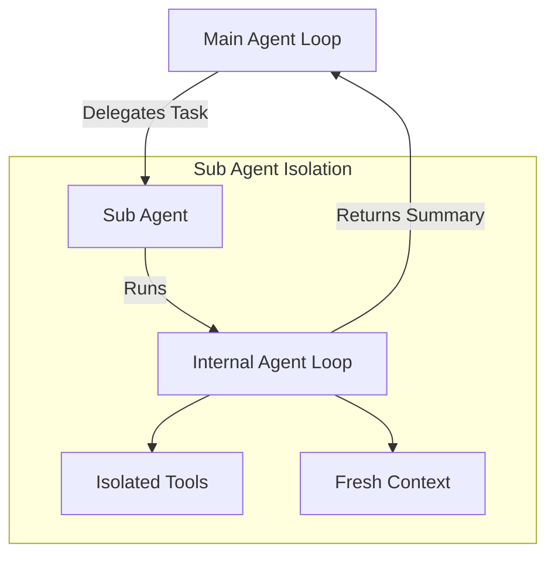
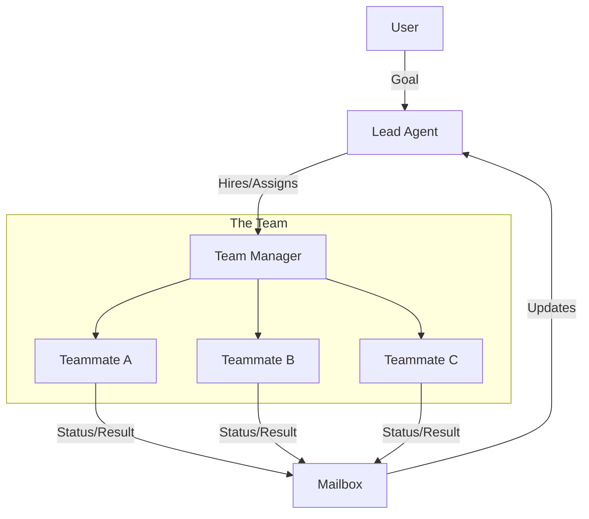
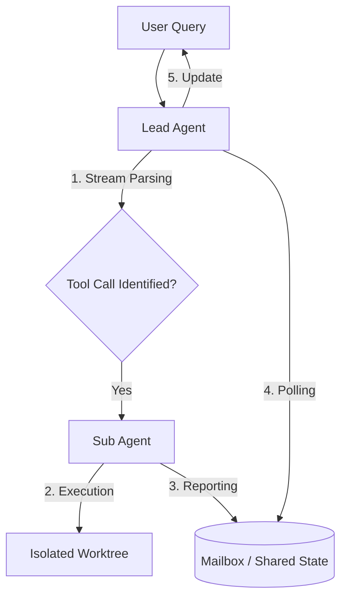
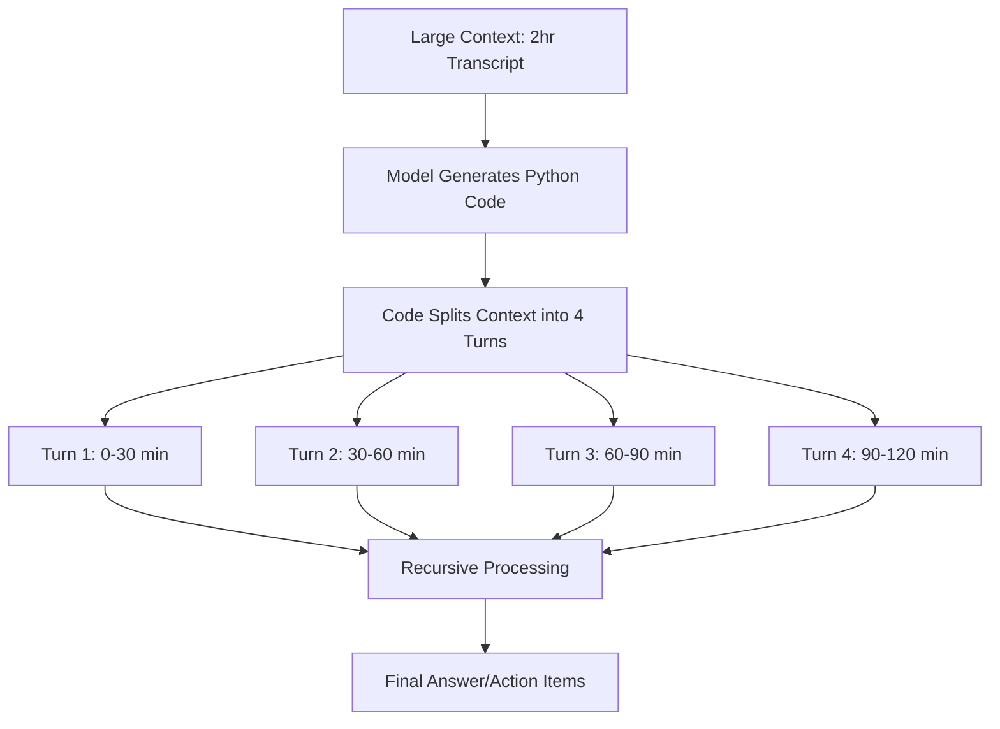
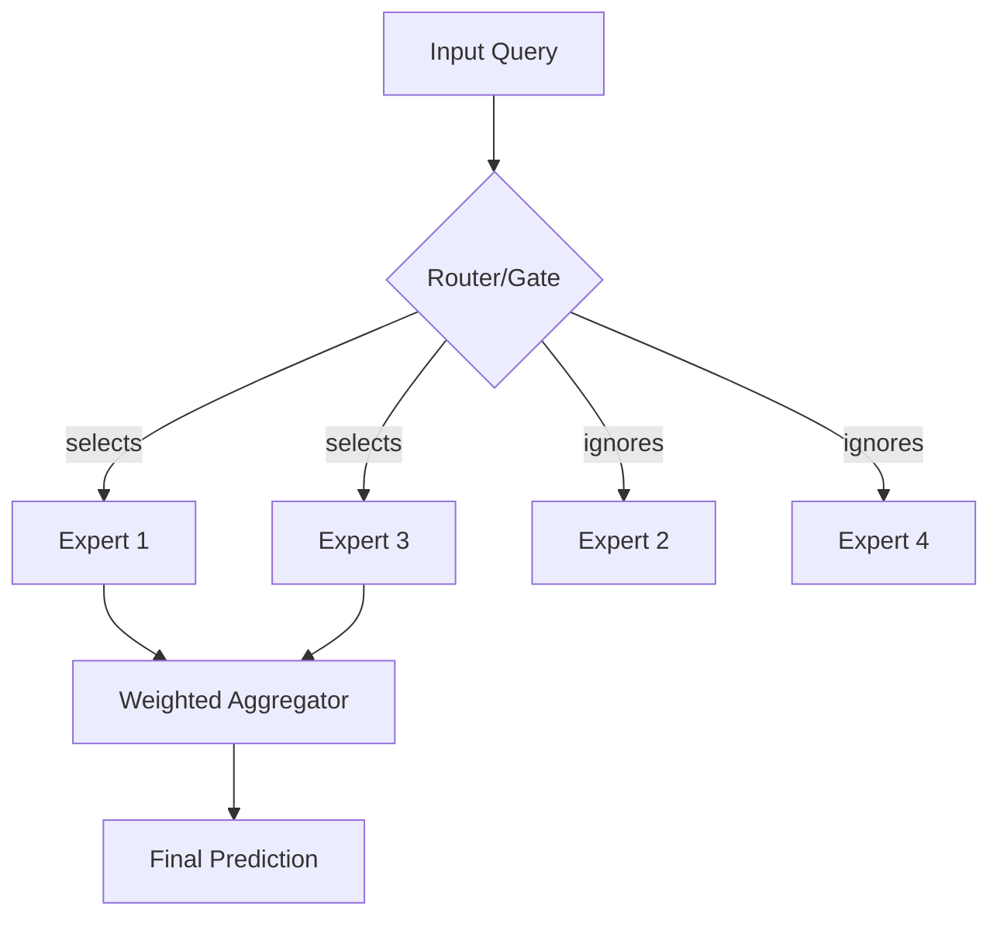

# LLM From Scratch — Part 1

Detailed notes synthesized from a 2:07:15 recorded lecture across 6 sections, 404 unique on-screen frames, and 30 canonical concepts.

## Table of Contents

1. [Ultra Code, Background Tasks, Background Task Execution, Threading, Streaming Tool Execution](#ultra-code-background-tasks-background-task-execution-threading-streaming-tool-execution) _(38.3 min, 0:03–38:23)_
2. [Streaming, Eager Execution, Bracket Matching, Tool Calling, Latency](#streaming-eager-execution-bracket-matching-tool-calling-latency) _(3.7 min, 38:23–42:05)_
3. [Multi-Agent Systems, Lead Agent, Task Delegation, Task Management, Tool Registration](#multi-agent-systems-lead-agent-task-delegation-task-management-tool-registration) _(16.6 min, 42:05–58:42)_
4. [Workspace Isolation, Git Worktree Add, Task Delegation, Multi-Agent Communication, Project Structuring](#workspace-isolation-git-worktree-add-task-delegation-multi-agent-communication-project-structuring) _(43.2 min, 58:42–1:41:57)_
5. [Continuous Learning, Recursive Lrm, Code Generation, Python Environment, Low-Level Tools](#continuous-learning-recursive-lrm-code-generation-python-environment-low-level-tools) _(9.9 min, 1:41:57–1:51:54)_
6. [Daily Learning Habit, Expert Selection, Feed-Forward Layer, Session Conclusion, Thermal Issues](#daily-learning-habit-expert-selection-feed-forward-layer-session-conclusion-thermal-issues) _(15.3 min, 1:51:54–2:07:15)_

---

## Ultra Code, Background Tasks, Background Task Execution, Threading, Streaming Tool Execution

### Introduction to Phase 4: Scaling Agentic Workflows

In this phase, we transition from simple, synchronous sub-agents to a more robust architecture capable of handling complex, long-running tasks without blocking the main execution loop. The core focus areas for Phase 4 include:

*   **Background Sub-agents**: Offloading tasks to separate threads so the lead agent remains responsive.
*   **Multi-Agent Teams**: Coordinating multiple specialized sub-agents, each handling distinct parts of a larger problem.
*   **Autonomous Collaboration**: Enabling agents to decide when to pull tasks and how to collaborate without constant user intervention.
*   **Isolation & Experiments**: Running parallel versions of a feature (e.g., an "offline" vs. "online" implementation) in isolated environments like Git worktrees to compare results.

### The Motivation for Background Execution

In earlier versions of our AI coding agent, sub-agents ran in the same thread as the main agent. This meant that if a sub-agent took 30 seconds to summarize a large file or run a suite of tests, the main agent loop was effectively frozen. 

To solve this, we move to an asynchronous model where the lead agent delegates a task and immediately returns control to the user.

#### Sub-Agent Architecture

The architecture relies on complete isolation between the lead agent and its sub-agents. Each sub-agent operates with:
1.  **Isolated Tool Registry**: It only has access to the tools relevant to its specific task.
2.  **Fresh Context Window**: It doesn't inherit the main agent's entire conversation history, which prevents context bloating and reduces token costs.
3.  **Independent Agent Loop**: It runs its own internal logic and only reports back a summary of the final result.



### Implementing Background Tasks with Threading

To enable background execution in Python, we introduce a `BackgroundManager` that utilizes the `threading` module. This allows the sub-agent to run on a separate thread while the lead agent continues to poll for user input or other updates.

#### The Mailbox Pattern

Communication between the background thread and the main thread is handled via a **Mailbox Pattern**. 
1.  The lead agent triggers a background task.
2.  The sub-agent runs silently in its own thread.
3.  Upon completion, the sub-agent places its result in a "mailbox" (a shared data structure).
4.  The lead agent periodically checks this mailbox during its execution cycle.

From `background.py` shown in VS Code:
```python
def execute(self, task):
    thread = threading.Thread(target=self.run, args=(task,))
    thread.start()
```

#### Managing Terminal Output: The Quiet Flag

A critical challenge with background tasks is managing the terminal. If a background sub-agent streams tokens or logs directly to the console while the user is typing a new command, it creates a confusing and broken UI experience.

To prevent this, we implement a `quiet=True` (or `silent`) flag. When active, the sub-agent's output is suppressed from the terminal and stored internally. The lead agent only displays the final result once the user is ready or the next cycle begins.

> [!info]+ Interview questions covered
> - Why is threading important for AI agents?
> - What is the Mailbox Pattern in asynchronous agent communication?
> - How do you handle terminal output conflicts in multi-threaded CLI applications?

### Ultra Code Effort: High-Reasoning Mode

We also explore an optimization pattern seen in advanced tools like "Ultra Code" (often associated with high-reasoning models like Claude 3.5 Opus or 4.8). 

**Ultra Code Effort** is a mode designed for complex tasks that require deeper "thinking" time. Instead of providing a quick response, the system:
*   Consumes significantly more tokens (up to 50x).
*   Automatically spawns multiple parallel sub-agents.
*   Performs extensive background processing (often taking 15-20 minutes).
*   Uses server-side prompt enhancements (e.g., forcing the model to use "sub-agent" and "parallel" keywords).

This represents a shift from "fast chat" to "thorough engineering," where the user is willing to wait longer for a higher-quality, verified result.

### Streaming Tool Execution and Eager Execution

Standard tool calling often follows a slow, sequential path: the model generates the entire JSON for a tool call, the system parses it, executes the tool, and then waits for the next model response.

**Streaming Tool Execution** optimizes this by reading tokens as they arrive. By monitoring the stream for specific patterns (like opening and closing brackets), the system can deduce a tool call is complete before the model has finished its entire response.

#### Eager Execution vs. Non-Streaming

In a non-streaming model, if a model takes 3 seconds to generate a tool call and the task takes 3 seconds to run, the total time is 6 seconds. With **Eager Execution**, the system starts the task the moment the necessary parameters are identified in the stream (e.g., at the 1-second mark), reducing the total time to 4 seconds.

| Feature | Non-Streaming | Streaming (Eager) |
| :--- | :--- | :--- |
| **Task Initiation** | After full model response | As soon as parameters are parsed |
| **Latency** | High (Sequential) | Low (Overlapped) |
| **Implementation** | Simple parsing | Complex token-by-token parsing |

#### Implementation Detail: Bracket Matching

Identifying a complete JSON object in a stream of tokens often requires Data Structures and Algorithms (DSA) techniques, such as using a **Stack** for bracket matching.

From `main.py` (logic concept):
```python
# Pseudo-code for eager parsing
if event.type == "token":
    accumulated_text += event.text
    if is_complete_json(accumulated_text):
        execute_tool_immediately(parse_json(accumulated_text))
```

Libraries like **Ollama** simplify this by providing event-based streams where tool calls are delivered as distinct objects as soon as they are identified, allowing for immediate execution.

> [!info]+ Interview questions covered
> - What is Eager Execution in the context of LLM tool calling?
> - How does streaming tool execution reduce latency?
> - How do you parse partial JSON from a token stream?

***

### Recap
*   Phase 4 introduces background tasks, multi-agent teams, and isolated experiments.
*   Threading and the Mailbox Pattern allow sub-agents to run without blocking the main loop.
*   The `quiet` flag is essential for maintaining a clean CLI during background execution.
*   "Ultra Code" modes prioritize reasoning depth and parallel sub-agent usage over speed.
*   Streaming and Eager Execution significantly reduce latency by overlapping model generation with tool execution.

### Glossary
*   **Sub-agent**: A secondary agent spawned by a lead agent to handle a specific sub-task.
*   **Mailbox Pattern**: A communication strategy where one thread leaves a message in a shared location for another thread to pick up.
*   **Eager Execution**: Starting a task as soon as its minimum requirements are met, rather than waiting for a full process to complete.
*   **Context Compaction**: The process of summarizing or reducing the context window when it nears its token limit.

### Interview Q&A
1.  **Q: How does a background sub-agent communicate its results back to the lead agent?**
    **A:** It uses a mailbox pattern or a shared message queue. The sub-agent runs in a separate thread and, upon finishing, updates a shared state that the lead agent polls during its next execution cycle.
2.  **Q: Why would you use a fresh context window for a sub-agent?**
    **A:** To prevent context bloating and "lost in the middle" issues. By only giving the sub-agent the specific information it needs for its task, you save tokens and improve the model's focus.
3.  **Q: What is the primary benefit of streaming tool execution?**
    **A:** Latency reduction. It allows the system to start executing tools the moment their parameters are available in the token stream, rather than waiting for the entire LLM response to finish.


## Streaming, Eager Execution, Bracket Matching, Tool Calling, Latency

### Intelligent Streaming with Ollama

In advanced agentic workflows, we don't just stream text; we stream **tool calls**. Libraries like **Ollama** provide a high-level abstraction that simplifies this process. Instead of requiring the developer to manually perform substring manipulation on a raw token stream, Ollama identifies tool calls as they are generated and delivers them as distinct objects.

#### How Ollama Handles the Stream
1.  **Token-by-Token Generation**: The underlying model (e.g., Llama 3) generates tokens one at a time.
2.  **Pattern Monitoring**: Ollama monitors the incoming tokens for JSON structures (specifically looking for opening and closing brackets).
3.  **Incremental Delivery**: As soon as a complete tool call is detected, Ollama yields it to the application. This allows the developer to iterate over the stream and receive "Tool 1," then "Tool 2," and so on, without waiting for the entire model response to finish.

### Parallel Tool Execution

Once a tool call is identified in the stream, we can initiate its execution immediately. To maximize efficiency, we use a `ThreadPoolExecutor` to run these tools in parallel.

From the Python implementation shown in VS Code:
```python
# Iterating over the Ollama stream
for event in stream:
    if event.get("tool"):
        tool = event["tool"]
        # Submit the tool call to the thread pool for parallel execution
        futures.append(executor.submit(run_tool, tool))
```

This approach ensures that while the model is still generating the parameters for "Tool 2," "Tool 1" is already running in the background.

### The Logic of Bracket Matching

Identifying a complete JSON object within a stream of tokens is a classic **Data Structures and Algorithms (DSA)** problem, similar to the "Valid Parentheses" problem.

#### Implementation with a Stack
The system maintains a stack (or a simple counter) to track nested levels:
*   When an **opening bracket `{`** is encountered, it is pushed onto the stack.
*   When a **closing bracket `}`** is encountered, the corresponding opening bracket is popped.
*   When the stack becomes empty (count reaches zero), the system knows it has captured a complete, valid JSON object.

> [!info]+ Interview questions covered
> - How do you identify a complete JSON object in a streaming response?
> - What data structure is best suited for bracket matching logic?
> - How does Ollama simplify tool call detection compared to raw token parsing?

### Eager Execution: Quantifying the Latency Benefit

The primary goal of streaming tool execution is to reduce **latency**. By adopting an **Eager Execution** mindset, we start tasks the moment their requirements are met.

#### Worked Example: Time Savings
Consider a scenario where a model takes 30 seconds to stream its entire response, which contains three tool calls. Each tool call takes roughly 10 seconds to generate.

*   **Non-Eager Approach**: The system waits the full 30 seconds for the model to finish, then starts the tasks. Total wait time = 30 seconds + task duration.
*   **Eager Approach**:
    1.  **0-10s**: Model streams Tool 1.
    2.  **10s**: Tool 1 is identified. **Execution starts immediately.**
    3.  **10-20s**: Model streams Tool 2 while Tool 1 is running.
    4.  **20s**: Tool 2 is identified. **Execution starts immediately.**
    5.  **20-30s**: Model streams Tool 3 while Tools 1 and 2 are running.

In this example, the system saves **20 seconds** of idle time by overlapping model generation with task execution.

| Metric | Sequential (Standard) | Eager (Streaming) |
| :--- | :--- | :--- |
| **Start of First Task** | 30s | 10s |
| **Total Idle Time** | High | Minimal |
| **User Experience** | "Frozen" until end | Responsive/Real-time |

### Practical Optimization: Eager Reading

A subtle but powerful optimization is **Eager Reading**. Sometimes, a model might stream a few extra tokens after a tool call is technically complete (e.g., a trailing comma or a closing square bracket `]` for an array of tools). 

By using eager reading, the system executes the tool the moment the JSON is valid, effectively ignoring the final "noise" tokens. In our demonstration, this saved an additional **0.13 seconds**—a small gain that adds up in complex, multi-step agentic loops.

> [!info]+ Interview questions covered
> - What is the difference between streaming output and streaming execution?
> - How much latency can be saved by using eager tool execution?
> - Why is it important to ignore trailing "noise" tokens in a tool-calling stream?

***

### Recap
*   Ollama automates the detection of tool calls within a token stream, removing the need for manual substring manipulation.
*   `ThreadPoolExecutor` allows for the parallel execution of tools as they are received from the stream.
*   Bracket matching (using a stack-based approach) is the core logic for identifying complete JSON objects in real-time.
*   Eager Execution overlaps model generation with task processing, potentially saving tens of seconds in long-running workflows.
*   Eager Reading further optimizes performance by initiating tasks the moment valid JSON is detected, without waiting for final delimiter tokens.

### Glossary
*   **Streaming**: The process of receiving and processing data in small chunks (tokens) as it is generated, rather than waiting for the entire payload.
*   **Eager Execution**: A strategy where a task is initiated as soon as its input parameters are available.
*   **Bracket Matching**: A logical check to ensure every opening delimiter has a corresponding closing delimiter, used here to validate JSON completeness.
*   **ThreadPoolExecutor**: A Python class used to manage a pool of threads for concurrent task execution.

### Interview Q&A
1.  **Q: Why is parallel tool execution particularly effective when combined with streaming?**
    **A:** Because it allows the system to work on multiple tasks simultaneously as they are identified. While the model is still describing the second or third tool, the first one is already being processed by a background thread.
2.  **Q: What happens if a tool call is malformed in the stream?**
    **A:** The bracket matching logic will fail to find a valid closing delimiter, or the JSON parser will throw an error. Robust systems handle this by either retrying the prompt or asking the model for clarification.
3.  **Q: How does eager execution impact the "Time to First Action" (TTFA)?**
    **A:** It significantly improves TTFA. Instead of the TTFA being equal to the total model generation time, it becomes equal to the generation time of just the first tool call's parameters.


## Multi-Agent Systems, Lead Agent, Task Delegation, Task Management, Tool Registration

### From Single Sub-Agents to Multi-Agent Teams

In this section, we evolve our architecture from a 1:1 relationship (Lead Agent calling one sub-agent) to a **1:N Multi-Agent Team structure**. This allows for true orchestration where a central "Lead Agent" manages a group of specialized "Teammates" to solve complex, multi-faceted problems.

#### Hierarchical Agent Architecture

The system follows a manager-worker pattern:
*   **Lead Agent**: The orchestrator. It receives the high-level goal from the user, breaks it down into sub-tasks, and manages the team.
*   **Teammates (Sub-agents)**: Specialized workers (e.g., Backend Engineer, Test Writer, QA) that execute specific tasks assigned by the Lead Agent.
*   **Mailbox**: A shared communication channel where teammates report their status (e.g., "in progress," "done") and results back to the Lead Agent.



### Implementation: `team.py` and Tool Registration

The multi-agent logic is encapsulated in a new file, `team.py`. To make this functional within our CLI, we must register the **Team Tool**.

#### Tool Schema and Actions
The `team` tool is defined by a schema that supports two primary actions:
1.  **`hire_team`**: Allows the Lead Agent to define the roles and names of the sub-agents needed for the project.
2.  **`assign_task`**: Allows the Lead Agent to delegate specific instructions to a hired teammate.

From the CLI registration logic:
```python
# Registering the Team tool in the CLI
from .tools.team import Team
# ...
registry.register(Team(schema=team_schema))
```

### Live Demo: Orchestrating a To-Do Model

In our practical demonstration, we task the Lead Agent with building a "To-Do Model."

#### 1. Hiring the Team
The Lead Agent first analyzes the task and decides it needs a backend developer and a tester. It calls the `hire_team` tool:
*   **Sam**: Backend Engineer
*   **Andrea**: Test Writer

#### 2. Task Delegation
Next, the Lead Agent uses `assign_task` to give specific instructions:
*   **To Sam**: "Create a `todo.py` file with basic CRUD operations."
*   **To Andrea**: "Write unit tests for the CRUD operations in `test_todo.py`."

#### 3. Asynchronous Execution and Monitoring
The sub-agents begin their work in the background. The Lead Agent enters a **waiting state**, periodically checking the mailbox for updates. This allows the user to see real-time logs of what Sam and Andrea are doing without the main loop being blocked.

#### 4. Result Aggregation
Once both Sam and Andrea report "done" in the mailbox, the Lead Agent aggregates their work and provides a final summary to the user, confirming that the `todo.py` and `test_todo.py` files have been successfully created and verified.

> [!info]+ Interview questions covered
> - What is the role of a Lead Agent in a multi-agent system?
> - How do sub-agents communicate their progress in an asynchronous workflow?
> - What are the benefits of a hierarchical agent structure over a single large model?

### Evaluating Model Behavior and Autonomy

While the multi-agent demo was successful, it highlighted several key observations about current agentic behavior, especially when using smaller language models:

*   **Output Quality**: Smaller models may make minor mistakes, such as including unexpected emojis or extra characters in their logs.
*   **Idle State**: In this phase, agents are **reactive**. Once they finish their assigned tasks, they "sit idle." They do not yet have the autonomy to look at a global "task board" and pull new work without being explicitly told by the Lead Agent.
*   **Prompt Sensitivity**: Small models require highly specific system prompts to correctly use complex tools like `hire_team` and `assign_task`.

> [!info]+ Interview questions covered
> - What is the difference between a reactive agent and an autonomous agent?
> - How do you handle "idle" agents in a multi-agent system?
> - Why is task decomposition a critical skill for a Lead Agent?

***

### Recap
*   Multi-agent systems use a hierarchical Lead Agent to orchestrate specialized sub-agents.
*   The `team.py` implementation uses a `hire_team` and `assign_task` pattern for delegation.
*   A "Mailbox" or shared state is used for asynchronous status reporting.
*   Lead agents aggregate results from multiple sub-agents to provide a cohesive final summary.
*   Current limitations include agents remaining idle after task completion and sensitivity to prompt engineering in smaller models.

### Glossary
*   **Orchestration**: The coordination and management of multiple automated tasks or agents.
*   **Task Delegation**: The process of a lead agent assigning specific sub-tasks to specialized sub-agents.
*   **Tool Registration**: The process of making a new capability (like team management) available to the agent via its tool registry.
*   **Reactive Agent**: An agent that only acts when specifically prompted or assigned a task.

### Interview Q&A
1.  **Q: How does a multi-agent system improve scalability?**
    **A:** By breaking a large problem into smaller, independent tasks that can be executed in parallel by specialized sub-agents, reducing the total time and complexity handled by any single model.
2.  **Q: What is the purpose of the `hire_team` tool?**
    **A:** It allows the Lead Agent to dynamically define the "workforce" it needs based on the specific requirements of the user's request, assigning roles like "Developer" or "Reviewer."
3.  **Q: Why might a sub-agent "sit idle" after finishing a task?**
    **A:** Because the system lacks a continuous autonomous loop where agents are programmed to proactively seek new tasks from a shared queue or task board.


## Workspace Isolation, Git Worktree Add, Task Delegation, Multi-Agent Communication, Project Structuring

In this section, we transition from simple tool-calling agents to robust, autonomous systems capable of handling complex, multi-file tasks. The core challenge in building such systems is maintaining codebase integrity while allowing the agent to experiment, verify, and collaborate. We explore how to achieve this through workspace isolation, sophisticated task delegation, and optimized communication protocols.

### The Need for Workspace Isolation

When an autonomous agent is tasked with a large-scale change—such as a major refactor or implementing a feature across multiple files—there is a high risk of code corruption. If the model hallucinates or fails mid-task, the entire project could be left in an unstable state.

**"Why before What"**: Why do we need isolation? Because autonomous agents are dynamic and occasionally unpredictable. If an agent works directly on your main branch, a single error in a multi-file edit can corrupt the project. Isolation provides a "sandbox" where the agent can fail safely, allowing for verification before any changes are merged into the primary codebase.

#### Git Worktree: The Professional's Sandbox

A powerful, often underutilized feature of Git for workspace isolation is the `worktree`. Unlike simple branching, `git worktree` allows you to have multiple branches checked out in different directories simultaneously.

**Demo: Parallel Experiments with Worktrees**
The tutor demonstrates a scenario where a user is conflicted between two different design approaches. Instead of implementing them sequentially, the agent creates two isolated worktrees:

```bash
# Initializing the project environment
git init
git add .
git commit -m "initial commit"

# Creating isolated workspaces for parallel experiments
git worktree add ../experiment_a approach_1
git worktree add ../experiment_b approach_2
```

By using worktrees, the agent can:
1.  **Work in Parallel**: Implement Approach A in one directory and Approach B in another.
2.  **Maintain Integrity**: The main codebase remains untouched until the user or a verification agent approves the changes.
3.  **Reduce Context Switching**: The agent doesn't need to `stash` or `commit` partial work to switch tasks; it simply operates in a different directory.

> [!info]+ Interview questions covered
> - What is workspace isolation in the context of AI coding agents?
> - How does `git worktree` differ from standard branching for task isolation?
> - Why is it important to isolate agent environments during multi-file refactors?

### Implementing Autonomous Task Management

To manage these isolated tasks, we implement a structured `Agent` class that handles the lifecycle of a delegated task.

#### The Agent Task Lifecycle
The autonomous behavior is driven by a task pooling mechanism. Instead of the lead agent micromanaging every line of code, it populates a queue that sub-agents (teammates) pull from.

**From `agent.py` shown in VS Code:**
```python
class Agent:
    def get_next_task(self):
        # Fetches the next pending task from the queue
        pass

    def mark_task_as_working(self, task_id):
        # Updates status to 'working' to prevent duplicate execution
        pass

    def complete_task(self, task_id, result):
        # Finalizes the task and stores the output
        pass
```

**Key Concepts in Task Management:**
*   **Task Pooling**: Sub-agents continuously check the queue for work.
*   **Concurrency Control**: Marking tasks as "working" ensures that multiple agents don't attempt the same task simultaneously.
*   **Thread Management**: To prevent resource exhaustion, sub-agent threads should implement a timeout (e.g., 60 seconds of idleness) after which they "kill" themselves.

### Streaming and Tool Execution

Communication between the model and the agent happens through streaming. We compare two primary methods of handling these streams:

#### 1. Ollama's Internal Parsing
Modern tools like Ollama simplify the developer's job by handling the "heavy lifting" of stream parsing. They deliver complete tool calls rather than raw tokens.

*   **Behavior**: Ollama identifies the start and end of a tool call (usually marked by brackets `[...]` or braces `{...}`) and delivers the structured JSON once it's fully formed.
*   **Benefit**: The client-side code is significantly simpler, as it only needs to iterate over a list of ready-to-execute tool calls.

#### 2. Manual Bracket Tracking
If the underlying API only provides raw token streaming, the agent must implement its own state-based parser.

**The Logic of Balanced Brackets:**
To identify a complete JSON object in a stream of tokens, we maintain a `bracket_count`.
*   Increment `bracket_count` for every `{`.
*   Decrement `bracket_count` for every `}`.
*   When `bracket_count == 0`, the accumulated tokens represent a valid, executable tool call.

```python
# Conceptual manual parsing loop
bracket_count = 0
accumulated_data = ""

for token in stream:
    accumulated_data += token
    if '{' in token:
        bracket_count += 1
    elif '}' in token:
        bracket_count -= 1
    
    if bracket_count == 0 and accumulated_data:
        process_tool_call(accumulated_data)
        accumulated_data = ""
```

### Multi-Agent Coordination: The Mailbox Pattern

In a multi-agent system, the "Lead Agent" acts as a coordinator, while "Sub-Agents" act as specialists (e.g., a Coder agent and a Tester agent).



**The Mailbox Pattern Flow:**
1.  **Delegation**: The Lead Agent identifies a tool call in the stream and offloads it to a Sub-Agent.
2.  **Execution**: The Sub-Agent performs the task in its isolated worktree.
3.  **Reporting**: Once finished, the Sub-Agent updates a shared "Mailbox" (a data class or list).
4.  **Polling**: The Lead Agent continuously polls the Mailbox to identify completed tasks and update the user via the CLI.

**Dynamic Tool Injection (Least Privilege)**
To improve security and efficiency, we use **Dynamic Tool Injection**. Instead of giving every agent access to all tools (e.g., `rm -rf`), we inject only the necessary tools for a specific role. For instance, a "Tester" agent might only receive "Read" tools, preventing it from accidentally modifying the source code it is supposed to be testing.

> [!info]+ Interview questions covered
> - How do you parse tool calls from a raw token stream?
> - What is the "Mailbox Pattern" in multi-agent communication?
> - Explain the concept of "Least Privilege" in agent tool configuration.

### Security and Optimization with LSP

A "Security First" philosophy is critical. Even when "dangerous" commands are enabled, the system should implement multiple levels of verification:
1.  **Model Re-evaluation**: Asking the model to double-check if a command is truly necessary.
2.  **Hardcoded Checks**: Explicitly blocking catastrophic commands like `rm -rf /`.

#### Token Optimization via LSP
Instead of having the LLM rewrite entire files (which is token-heavy and expensive), professional agents use the **Language Server Protocol (LSP)**.

| Feature | LLM Direct Edit | LSP-Based Edit |
| :--- | :--- | :--- |
| **Cost** | High (Full file tokens) | Low (Specific symbol tokens) |
| **Speed** | Slow (Generation time) | Instant (Library call) |
| **Accuracy** | Prone to hallucinations | 100% Syntax Accurate |
| **Scope** | Single file focus | Project-wide (e.g., Global Rename) |

By leveraging LSP as a library, the agent can perform complex tasks like renaming a method across hundreds of files with perfect accuracy and minimal cost.

### Advanced Verification: The Final Check

The tutor concludes with a robust verification flow for high-confidence code generation:
1.  **Create Worktree**: Isolate the feature in a temporary environment.
2.  **Write Unit Tests**: The agent generates tests for the new logic.
3.  **Execute Tests**: Run the tests in the isolated environment.
4.  **Merge or Revert**: Only merge if the tests pass; otherwise, use `git reset` to return to the last known good state.

This "Eager Execution with Revert" strategy ensures a fast user experience for the 90% of cases where the model is correct, while providing a safety net for the 10% where it fails.

---

### Recap and Glossary

#### Recap
*   **Workspace Isolation**: Essential for protecting the codebase; implemented using `git worktree`.
*   **Task Delegation**: Moving from micromanagement to a queue-based system with specialized sub-agents.
*   **Stream Handling**: Utilizing high-level API features (Ollama) or manual bracket-tracking for tool parsing.
*   **LSP Integration**: Using Language Servers for cost-effective, project-wide code manipulation.
*   **Verification**: Combining isolation with automated testing to ensure code quality.

#### Glossary
*   **Git Worktree**: A Git feature that allows multiple working trees to be attached to the same repository.
*   **LSP (Language Server Protocol)**: A protocol used between an IDE and a language server to provide features like autocomplete, go-to-definition, and find-all-references.
*   **Hallucination**: A phenomenon where an LLM generates plausible-sounding but incorrect or nonsensical information.
*   **Exponential Backoff**: A strategy where the delay between retries (e.g., polling a mailbox) increases exponentially to reduce resource usage.
*   **Least Privilege**: A security principle where an agent is given only the minimum tools and permissions necessary to perform its task.

### Interview Q&A

**Q: Why is `git worktree` better than `git checkout` for an AI agent?**
**A:** `git worktree` allows the agent to have multiple branches open in different directories at the same time. This enables parallel task execution and prevents the agent from having to manage complex stashing or committing of unfinished work when switching between tasks.

**Q: How does an agent handle a situation where the model generates "garbage" code?**
**A:** The agent relies on a combination of Git and verification steps. It can perform a `git reset` to revert to the last stable state. Advanced agents use a separate verification phase where the model reviews the generated code or runs automated unit tests in an isolated worktree before merging.

**Q: What are the benefits of using LSP in an AI coding agent?**
**A:** LSP provides project-wide awareness and syntax-perfect editing. It is much cheaper than using an LLM to rewrite files because it performs edits programmatically. It is also faster and more accurate for tasks like refactoring, renaming, and finding symbol references.

**Q: Explain the "Mailbox" pattern in the context of multi-agent systems.**
**A:** The Mailbox pattern is an asynchronous communication method where sub-agents update a shared data structure (the "mailbox") with their status or results. The lead agent periodically polls this mailbox to check for completed tasks, allowing it to remain responsive to the user while sub-agents work in the background.

## Continuous Learning, Recursive LRM, Code Generation, Python Environment, Low-Level Tools

In this section, we explore the evolution of AI agents from simple tool-users to autonomous tool-creators. We discuss how providing models with low-level environments—like a Python interpreter—allows them to solve complex problems recursively, effectively bypassing the limitations of fixed context windows.

### Autonomous Tool Creation and MCP

The future of AI agents lies in **autonomy**. Today, we typically provide agents with a predefined set of tools (e.g., a "search" tool or a "calculator" tool). However, the next step is for agents to write their own tools or interact with standardized protocols that expose entire ecosystems of services.

One such protocol is the **Model Context Protocol (MCP)**. Instead of writing custom integration code for every service (like Stripe for payments or Uber for cab booking), the model can interact with an MCP server that provides a standardized interface to these tools.

#### The Shift to Autonomous Agents
Imagine asking your mobile device to "book a Uber cab." Currently, you need the Uber app installed, and the agent interacts with that specific app. In an autonomous future:
1.  The operating system provides the model with access to the external world.
2.  The model uses MCP to communicate with various services (banks, transport providers, etc.).
3.  If a specific tool doesn't exist, the model **writes the tool itself** in a provided environment.

> [!info]+ Interview questions covered
> - What is the Model Context Protocol (MCP) in the context of AI agents?
> - How do autonomous agents differ from traditional tool-calling agents?

### Continuous Learning and the "Large Reading Model" (LRM)

To build truly capable agents, we must solve the problem of **continuous learning**. The tutor shares a personal pedagogical example: a daily habit of reading one blog, verifying it, and publishing a summary. This consistent accumulation of knowledge is the foundation of what he calls a **Large Reading Model (LRM)**.

#### Knowledge Accumulation Flow
The process of building an LRM follows a recursive path:
1.  **Read**: Consume new information (e.g., an industry blog).
2.  **Verify**: Cross-reference and validate the information.
3.  **Publish**: Document the findings to solidify learning.

This habit ensures that the "model" (whether human or AI) stays updated with industry trends and technical literacy, which is crucial for understanding advanced architectures like Cloud Code 4.8.

### Recursive Language Models (RLM) and Context Optimization

A major challenge in LLMs is the **context window limitation**. If you have a 2-hour meeting transcript, feeding the entire text into an LLM might exceed its token limit or lead to "lost in the middle" issues.

The solution is the **Recursive Language Model (RLM)** architecture. Instead of asking for a summary of the whole text, we provide the model with a **Python environment** and a variable (e.g., `context`) containing the data. We then prompt the model to write code to process this data recursively.

#### The "Turns" Strategy (Chunking)
The model generates code that splits the large context into smaller "turns" or segments.

**Worked Example: Meeting Transcript**
- **Total Duration**: 2 hours ($120$ minutes)
- **Strategy**: Divide into 4 turns.
- **Math**:
  $$\text{Turn Size} = \frac{120 \text{ minutes}}{4} = 30 \text{ minutes}$$
- **Execution**: The LLM processes 30 minutes of content at a time, four times sequentially.



By using code to manage data, the LLM internally reduces the context window requirement. It doesn't need to "see" all 2 hours at once; it only needs to see the code it wrote and the specific chunk it is currently processing.

> [!info]+ Interview questions covered
> - How can a Recursive Language Model (RLM) handle contexts larger than its token limit?
> - What is the benefit of providing an LLM with a Python environment for data processing?

### From High-Level Tools to Low-Level Environments

There is a fundamental shift in how we equip AI agents:
- **Earlier Approach**: Provide high-level, pre-written tools (e.g., `get_weather()`).
- **Current/Future Approach**: Provide a **low-level environment** (e.g., a Python interpreter).

By giving the model a Python environment, we reduce the level of abstraction. We are not giving it the "answer" or even the "tool"; we are giving it the **capability to build the tool**. This provides maximum flexibility and power, allowing the model to handle dynamic scenarios that a developer might not have anticipated.

### Practical Implementation: Concurrency and Mobile AI

When moving from theory to implementation, developers often encounter bottlenecks like **concurrency**.

#### Concurrency in Ollama
If you are hosting a model locally using Ollama, you might find that it handles requests sequentially by default. To enable parallel task execution, you must configure the environment correctly.
- **Ollama Serve**: Use the `serve` command with specific parameters to allow multiple requests.
- **Configuration**: Ollama can typically serve two requests at a time if relaunching with the correct settings.

#### Mobile and Edge AI
A student (Pravin) raised a critical point: how does this translate to **mobile (Android/iOS)**?
- **Local Parameters**: You can copy model parameter files into a mobile app.
- **Concurrency Logic**: On mobile, the application logic (the "wrapper") must often handle the multi-agent concurrency, as mobile hardware resources are more constrained than desktop environments.

---

### Recap
- **Autonomy**: Agents are shifting from using tools to creating tools via environments like Python and protocols like MCP.
- **Recursive Processing**: RLMs use model-generated code to chunk large data, effectively optimizing context window usage.
- **Low-Level Flexibility**: Providing a Python interpreter is more powerful than providing fixed high-level tools.
- **Concurrency**: Real-world deployment (like Ollama) requires specific configuration to handle parallel agent calls.

### Glossary
- **MCP (Model Context Protocol)**: A standardized protocol for AI models to interact with various external services and tools.
- **LRM (Large Reading Model)**: A concept emphasizing continuous knowledge accumulation through consistent reading and documentation.
- **RLM (Recursive Language Model)**: An architecture where a model processes data in recursive steps, often using generated code to manage chunks.
- **Context Window**: The maximum amount of text (tokens) an LLM can process in a single request.
- **Ollama**: A tool for running and hosting large language models locally.

### Interview Q&A
1. **Q: Why is a Python environment considered a "low-level tool" for an LLM?**
   *A: Because it doesn't provide a specific result. Instead, it provides the fundamental building blocks (logic, math, data handling) that allow the LLM to write and execute its own custom logic to solve any problem.*

2. **Q: How does the "Turns" strategy help in information extraction?**
   *A: It prevents context overload. By dividing a massive dataset into smaller segments (turns), the model can focus its attention on a manageable amount of information at a time, leading to higher accuracy and lower token costs.*

3. **Q: What is the primary bottleneck when running multi-agent systems locally?**
   *A: Concurrency. Most local hosting solutions require specific configuration (like the `serve` command in Ollama) to handle simultaneous requests from multiple agents without queuing them.*


## Daily Learning Habit, Expert Selection, Feed-Forward Layer, Session Conclusion, Thermal Issues

The final section of this lecture shifts from the implementation details of coding agents to the broader landscape of AI development, focusing on hardware constraints, the importance of continuous learning, and advanced architectural optimizations like Mixture of Experts (MoE).

### The Hardware Bottleneck: Thermal Management in Edge AI

While LLMs are increasingly being deployed on edge devices (mobiles and laptops), the primary bottleneck is no longer just "tokens per second" but rather **thermal management**.

#### Physical Limitations of Hardware
Running a local AI model on a mobile device or a laptop for extended periods (e.g., 30 minutes) can drain 60-70% of the battery and cause significant heat generation. This is particularly evident in devices without active cooling.

*   **MacBook Air vs. MacBook Pro**: The major difference in AI performance between these two is the presence of a cooling fan in the Pro. In experiments, a MacBook Air (fanless) will throttle performance or heat up significantly within 5 minutes of heavy LLM inference, whereas a MacBook Pro can sustain the load longer.
*   **Mac Mini as a Candidate**: For developers running local models 24/7, the Mac Mini is often a better candidate than a laptop because it can run continuously without the same battery degradation or extreme thermal throttling issues.

#### Hardware Reasoning in Advanced Models
The tutor shares an experiment using Claude 3 Opus, where the model was able to reason about these hardware constraints. When asked to categorize tasks for different Mac hardware, the model correctly identified that certain heavy experiments should not be run on a MacBook Air due to its lack of a cooling fan.

> [!info]+ Interview questions covered
> - What is the primary bottleneck for running LLMs on edge devices?
> - How does thermal management affect model inference on mobile devices?
> - Why is active cooling (fans) important for sustained LLM workloads?

### Cultivating a Daily Learning Habit

In the rapidly evolving field of AI, staying updated is as important as writing code. The tutor emphasizes a "Daily Learning Habit" to build technical wisdom over time.

#### The "Read One Blog a Day" Philosophy
The core of this habit is to **Read one blog, Verify one blog, and Publish one blog**.
*   **Daily Routine**: Setting aside time (e.g., 8:30 AM) to check trending open-source projects, deep research papers, and funding news in the AI space.
*   **Pattern Recognition**: Reading isn't just about facts; it's about learning patterns. For example, seeing how model distillation is used in one domain can inspire its application in another.
*   **Understanding vs. Usage**: There is a warning against superficial use of AI (e.g., just using tools to create social media content). The real value lies in understanding the underlying mechanics—how agents, prompts, and architectures actually work.

### Model Optimization: Pruning and Domain Specificity

A key area of experimentation is reducing model size without sacrificing performance for specific tasks.

#### The 10B Parameter Pruning Experiment
The tutor describes an experiment involving a **10 Billion parameter model** specialized for a specific domain, such as sports (e.g., answering questions about cricket centuries).

1.  **Baseline**: The 10B model is 100% accurate on a specific sports dataset.
2.  **Experiment**: Randomly remove weights (pruning) and re-evaluate.
3.  **Result**: The model was reduced by **53%** (down to ~5B parameters), yet the accuracy only dropped to **99.3%**.

**Takeaway**: For domain-specific use cases, we often don't need the full weight of a general-purpose model. Pruning unwanted weights can lead to massive efficiency gains with negligible accuracy loss.

> [!info]+ Interview questions covered
> - What is weight pruning in LLMs?
> - How can domain-specific models be optimized for efficiency?
> - What is the trade-off between model size and accuracy in specialized tasks?

### Mixture of Experts (MoE) Architecture

The concept of pruning leads naturally to **Mixture of Experts (MoE)**, an architecture that selectively activates parts of a model based on the input.

#### The Gate/Router Mechanism
Instead of using all weights for every prediction, an MoE model uses a **Gate** (or **Router**).
*   **Function**: The router decides which "experts" (sub-networks or specific sets of weights) are most relevant to the current query.
*   **Selective Activation**: For a given question, the router might activate only experts $E_3$ and $E_5$, assigning them specific weightages, while leaving other experts idle.

#### Case Study: DeepSeek and Computational Efficiency
Companies like **DeepSeek** have successfully implemented MoE to achieve massive scale with high efficiency.
*   A model might have **100 Billion parameters** in total.
*   However, for any single prediction, it might only use **10 Billion parameters**.
*   This reduces the computational cost to **1/10th** of what a dense 100B model would require, while maintaining the knowledge capacity of the larger architecture.



### Architectural Experimentation: Beyond the Feed-Forward Layer

Traditional MoE implementations often place the gate/router within the **Feed-Forward Layer**. However, the tutor encourages thinking beyond this standard pattern.

*   **Router Placement**: Experiments are being done to place routers after the **Attention Layer** or at multiple different levels of the architecture.
*   **Pattern Replication**: The goal is to take successful patterns (like gating) and see if they can be applied to different layers or entirely different model types to achieve new efficiencies.

> [!info]+ Interview questions covered
> - What is a Mixture of Experts (MoE) architecture?
> - What is the role of the 'Router' or 'Gate' in MoE?
> - How does MoE improve computational efficiency during inference?
> - Where are routers typically placed in an MoE transformer block?

### Session Conclusion and Next Steps

The lecture concludes with a recap and a look forward to the next session.

*   **Commitment**: Students are encouraged to commit to the daily reading habit to build their AI expertise over the next six months.
*   **Next Topic: Agent Memory**: The next class will focus on the **Memory** component of AI agents.
    *   How to implement memory.
    *   Making memory "smarter" to remember more context.
    *   Optimizing **Retrieval** time to ensure the agent remains fast and responsive.

---

### Recap
- **Thermal Issues**: The main bottleneck for local LLMs on mobile/edge devices is heat, not just speed.
- **Learning Habit**: Success in AI requires a daily commitment to reading research and open-source trends.
- **Weight Pruning**: Specialized models can often be reduced by >50% in size with minimal accuracy loss.
- **MoE**: Mixture of Experts uses a router to selectively activate weights, allowing for 10x efficiency gains.
- **Next Steps**: Transitioning from agent "execution" to agent "memory" and "retrieval".

### Glossary
- **Thermal Throttling**: The reduction of a processor's speed to prevent overheating.
- **Weight Pruning**: The process of removing unnecessary weights from a neural network to reduce its size.
- **Mixture of Experts (MoE)**: A machine learning technique where different parts of a model (experts) are trained to handle different types of inputs.
- **Router/Gate**: The component in an MoE architecture that directs input to the most relevant experts.
- **DeepSeek**: A prominent AI research lab known for efficient MoE implementations.

### Interview Q&A
1. **Q: Why is a 100B MoE model sometimes preferred over a dense 100B model?**
   **A**: An MoE model provides the performance and knowledge capacity of a 100B model but with the inference cost of a much smaller model (e.g., 10B), because only a fraction of the parameters are activated for any single token prediction.

2. **Q: What is the difference between fine-tuning and pruning?**
   **A**: Fine-tuning adjusts the existing weights of a model to perform better on a specific task without changing the model's size. Pruning actually removes weights (sets them to zero or deletes them), reducing the total number of parameters and the model's memory footprint.

3. **Q: How does a router in an MoE architecture work?**
   **A**: The router is a small learnable network that takes the input hidden state and outputs a probability distribution over the available experts. It then selects the top-$k$ experts (usually 1 or 2) to process that specific input.

4. **Q: What are the hardware implications of running LLMs locally?**
   **A**: Local execution requires significant RAM and produces substantial heat. Devices without active cooling (like the MacBook Air) will eventually throttle performance, making them less ideal for sustained, heavy AI workloads compared to cooled devices like the MacBook Pro or Mac Mini.

---

## Timeline

| Time | Section |
| ---- | ------- |
| `0:03` – `38:23` | [Ultra Code, Background Tasks, Background Task Execution, Threading, Streaming Tool Execution](#ultra-code-background-tasks-background-task-execution-threading-streaming-tool-execution) |
| `38:23` – `42:05` | [Streaming, Eager Execution, Bracket Matching, Tool Calling, Latency](#streaming-eager-execution-bracket-matching-tool-calling-latency) |
| `42:05` – `58:42` | [Multi-Agent Systems, Lead Agent, Task Delegation, Task Management, Tool Registration](#multi-agent-systems-lead-agent-task-delegation-task-management-tool-registration) |
| `58:42` – `1:41:57` | [Workspace Isolation, Git Worktree Add, Task Delegation, Multi-Agent Communication, Project Structuring](#workspace-isolation-git-worktree-add-task-delegation-multi-agent-communication-project-structuring) |
| `1:41:57` – `1:51:54` | [Continuous Learning, Recursive Lrm, Code Generation, Python Environment, Low-Level Tools](#continuous-learning-recursive-lrm-code-generation-python-environment-low-level-tools) |
| `1:51:54` – `2:07:15` | [Daily Learning Habit, Expert Selection, Feed-Forward Layer, Session Conclusion, Thermal Issues](#daily-learning-habit-expert-selection-feed-forward-layer-session-conclusion-thermal-issues) |

## Interview Questions Covered

Total: 38 questions across 6 sections.

### Ultra Code, Background Tasks, Background Task Execution, Threading, Streaming Tool Execution

- Why is threading important for AI agents?
- What is the Mailbox Pattern in asynchronous agent communication?
- How do you handle terminal output conflicts in multi-threaded CLI applications?
- What is Eager Execution in the context of LLM tool calling?
- How does streaming tool execution reduce latency?
- How do you parse partial JSON from a token stream?

### Streaming, Eager Execution, Bracket Matching, Tool Calling, Latency

- How do you identify a complete JSON object in a streaming response?
- What data structure is best suited for bracket matching logic?
- How does Ollama simplify tool call detection compared to raw token parsing?
- What is the difference between streaming output and streaming execution?
- How much latency can be saved by using eager tool execution?
- Why is it important to ignore trailing "noise" tokens in a tool-calling stream?

### Multi-Agent Systems, Lead Agent, Task Delegation, Task Management, Tool Registration

- What is the role of a Lead Agent in a multi-agent system?
- How do sub-agents communicate their progress in an asynchronous workflow?
- What are the benefits of a hierarchical agent structure over a single large model?
- What is the difference between a reactive agent and an autonomous agent?
- How do you handle "idle" agents in a multi-agent system?
- Why is task decomposition a critical skill for a Lead Agent?

### Workspace Isolation, Git Worktree Add, Task Delegation, Multi-Agent Communication, Project Structuring

- What is workspace isolation in the context of AI coding agents?
- How does `git worktree` differ from standard branching for task isolation?
- Why is it important to isolate agent environments during multi-file refactors?
- How do you parse tool calls from a raw token stream?
- What is the "Mailbox Pattern" in multi-agent communication?
- Explain the concept of "Least Privilege" in agent tool configuration.

### Continuous Learning, Recursive Lrm, Code Generation, Python Environment, Low-Level Tools

- What is the Model Context Protocol (MCP) in the context of AI agents?
- How do autonomous agents differ from traditional tool-calling agents?
- How can a Recursive Language Model (RLM) handle contexts larger than its token limit?
- What is the benefit of providing an LLM with a Python environment for data processing?

### Daily Learning Habit, Expert Selection, Feed-Forward Layer, Session Conclusion, Thermal Issues

- What is the primary bottleneck for running LLMs on edge devices?
- How does thermal management affect model inference on mobile devices?
- Why is active cooling (fans) important for sustained LLM workloads?
- What is weight pruning in LLMs?
- How can domain-specific models be optimized for efficiency?
- What is the trade-off between model size and accuracy in specialized tasks?
- What is a Mixture of Experts (MoE) architecture?
- What is the role of the 'Router' or 'Gate' in MoE?
- How does MoE improve computational efficiency during inference?
- Where are routers typically placed in an MoE transformer block?

## Code Blocks Index

Unique code/console/mermaid blocks: 12 (deduplicated by content).

| Section | Block count |
| ------- | ----------- |
| `00_ultra_code_background_tasks_background_task_execution_thread` | 3 |
| `01_streaming_eager_execution_bracket_matching_tool_calling_late` | 1 |
| `02_multi_agent_systems_lead_agent_task_delegation_task_manageme` | 2 |
| `03_workspace_isolation_git_worktree_add_task_delegation_multi_a` | 4 |
| `04_continuous_learning_recursive_lrm_code_generation_python_env` | 1 |
| `05_daily_learning_habit_expert_selection_feed_forward_layer_ses` | 1 |

## Glossary

Auto-generated from canonical concepts seen across the lecture. Definitions are extracted from the first paragraph in which each concept appears.

- **multi-agent systems**: Multi-Agent Systems, Lead Agent, Task Delegation, Task Management, Tool Registration _(occurrences: 28)_
- **streaming**: Ultra Code, Background Tasks, Background Task Execution, Threading, Streaming Tool Execution _(occurrences: 19)_
- **eager execution**: Streaming Tool Execution and Eager Execution _(occurrences: 14)_
- **tool calling**: Standard tool calling often follows a slow, sequential path: the model generates the entire JSON for a tool call, the system parses it, executes the tool, and then waits for the next model response. _(occurrences: 10)_
- **bracket matching**: Implementation Detail: Bracket Matching _(occurrences: 9)_
- **task delegation**: Multi-Agent Systems, Lead Agent, Task Delegation, Task Management, Tool Registration _(occurrences: 8)_
- **prompt engineering**: Recap * Multi-agent systems use a hierarchical Lead Agent to orchestrate specialized sub-agents. * The `team.py` implementation uses a `hire_team` and `assign_task` pattern for delegation. _(occurrences: 7)_
- **background tasks**: Ultra Code, Background Tasks, Background Task Execution, Threading, Streaming Tool Execution _(occurrences: 6)_
- **task completion**: Recap * Multi-agent systems use a hierarchical Lead Agent to orchestrate specialized sub-agents. * The `team.py` implementation uses a `hire_team` and `assign_task` pattern for delegation. _(occurrences: 6)_
- **ultra code**: Ultra Code, Background Tasks, Background Task Execution, Threading, Streaming Tool Execution _(occurrences: 6)_
- **sub-agents**: In this phase, we transition from simple, synchronous sub-agents to a more robust architecture capable of handling complex, long-running tasks without blocking the main execution loop. The core focus areas for Phase 4 include: _(occurrences: 6)_
- **latency**: | Feature | Non-Streaming | Streaming (Eager) | | :--- | :--- | :--- | | **Task Initiation** | After full model response | As soon as parameters are parsed | | **Latency** | High (Sequential) | Low (Overlapped) | | **Implementation** | Simple parsing | Complex token-by-token parsing | _(occurrences: 6)_
- **ollama**: Libraries like **Ollama** simplify this by providing event-based streams where tool calls are delivered as distinct objects as soon as they are identified, allowing for immediate execution. _(occurrences: 6)_
- **workspace isolation**: Workspace Isolation, Git Worktree Add, Task Delegation, Multi-Agent Communication, Project Structuring _(occurrences: 6)_
- **agent loop**: In earlier versions of our AI coding agent, sub-agents ran in the same thread as the main agent. This meant that if a sub-agent took 30 seconds to summarize a large file or run a suite of tests, the main agent loop was effectively frozen. _(occurrences: 5)_
- **tool integration**: (referenced in lecture; no definition extracted)
- **parallel processing**: (referenced in lecture; no definition extracted)
- **streaming tool execution**: Ultra Code, Background Tasks, Background Task Execution, Threading, Streaming Tool Execution _(occurrences: 5)_
- **latency reduction**: Interview Q&A 1. **Q: How does a background sub-agent communicate its results back to the lead agent?** **A:** It uses a mailbox pattern or a shared message queue. _(occurrences: 5)_
- **sub-agent interaction**: (referenced in lecture; no definition extracted)
- **lead agent**: Background Sub-agents**: Offloading tasks to separate threads so the lead agent remains responsive. * **Multi-Agent Teams**: Coordinating multiple specialized sub-agents, each handling distinct parts of a larger problem. _(occurrences: 5)_
- **task management**: Multi-Agent Systems, Lead Agent, Task Delegation, Task Management, Tool Registration _(occurrences: 5)_
- **background task execution**: Ultra Code, Background Tasks, Background Task Execution, Threading, Streaming Tool Execution _(occurrences: 4)_
- **threading**: Ultra Code, Background Tasks, Background Task Execution, Threading, Streaming Tool Execution _(occurrences: 4)_
- **parallel execution**: From the Python implementation shown in VS Code: ```python # Iterating over the Ollama stream for event in stream: if event.get("tool"): tool = event["tool"] # Submit the tool call to the thread pool for parallel execution futures.append(executor.submit(run_tool, tool)) ``` _(occurrences: 4)_
- **cloud code 48**: (referenced in lecture; no definition extracted)
- **sequential processing**: (referenced in lecture; no definition extracted)
- **execution logs**: (referenced in lecture; no definition extracted)
- **json parsing**: (referenced in lecture; no definition extracted)
- **code walkthrough**: (referenced in lecture; no definition extracted)
