# Design a RAG System (Chat with Your Documents)

Detailed notes synthesized from a 2:02:58 recorded lecture across 17 sections, 188 unique on-screen frames, and 30 canonical concepts.

## Table of Contents

1. [Private Document Corpus, Citations, Chunking, System Design Structure, Retrieval-Augmented Generation Rag](#private-document-corpus-citations-chunking-system-design-structure-retrieval-augmented-generation-rag) _(13.6 min, 0:03–13:36)_
2. [Approximate Nearest Neighbor Ann Search, Embedding Dimensions, Nomic-Embed-Text, Vector Search Bottleneck, On-Device Embeddings](#approximate-nearest-neighbor-ann-search-embedding-dimensions-nomic-embed-text-vector-search-bottleneck-on-device-embeddings) _(3.8 min, 13:36–17:23)_
3. [Retrieval Pipeline, Top-K Chunk Retrieval, Reranking, Stateless Llm, Answer Plus Citation](#retrieval-pipeline-top-k-chunk-retrieval-reranking-stateless-llm-answer-plus-citation) _(3.8 min, 17:23–21:11)_
4. [Why Plain Llms Fail, Llm Hallucination, Rag Pipeline Stages, Private Document Corpus, Llm Training Data Limitations](#why-plain-llms-fail-llm-hallucination-rag-pipeline-stages-private-document-corpus-llm-training-data-limitations) _(3.4 min, 21:11–24:32)_
5. [Embedding Models, Vector Similarity, 768-Dimensional Embedding Space, Chunking, Distance Metric](#embedding-models-vector-similarity-768-dimensional-embedding-space-chunking-distance-metric) _(3.1 min, 24:32–27:41)_
6. [Fine-Tuning Vs Rag, Prompt Construction, Grounded Answer, Top-K Chunk Selection, Unlearningdata Deletion](#fine-tuning-vs-rag-prompt-construction-grounded-answer-top-k-chunk-selection-unlearningdata-deletion) _(3.1 min, 27:41–30:47)_
7. [Citationprovenance, Per-User Permissions, Fixed Vs Dynamic Datasets, Context Window Limitations, Fine-Tuning On Internet-Scale Data](#citationprovenance-per-user-permissions-fixed-vs-dynamic-datasets-context-window-limitations-fine-tuning-on-internet-scale-data) _(5.9 min, 30:47–36:40)_
8. [Time To First Token Ttft, Functional Requirements For Rag, Citations To Source Chunks, Multi-Turn Context Inheritance, Document Permissions](#time-to-first-token-ttft-functional-requirements-for-rag-citations-to-source-chunks-multi-turn-context-inheritance-document-permissions) _(3.9 min, 36:40–40:35)_
9. [Retrieval-Augmented Generation Rag, In-Context Learning, Rag System Scale, Recall@K, Embedding Model Selection](#retrieval-augmented-generation-rag-in-context-learning-rag-system-scale-recallk-embedding-model-selection) _(6.0 min, 40:35–46:35)_
10. [Chunk Overlap, Stride, Chunking, Hnsw Indexing, Token Overlap](#chunk-overlap-stride-chunking-hnsw-indexing-token-overlap) _(11.6 min, 46:35–58:08)_
11. [Hybrid Retrieval, Vector Database, Re-Indexing Pipeline, Rag Orchestrator, Vector Database Sizing](#hybrid-retrieval-vector-database-re-indexing-pipeline-rag-orchestrator-vector-database-sizing) _(13.9 min, 58:08–1:12:01)_
12. [Hybrid Retrieval, Parallel Search, Semantic Search Limitations, Keyword Search Bm25, Keyword Search  Inverted Index](#hybrid-retrieval-parallel-search-semantic-search-limitations-keyword-search-bm25-keyword-search-inverted-index) _(6.0 min, 1:12:01–1:18:00)_
13. [Hybrid Retrieval, Reranker, Positional Embedding, Vector Database Qdrant Pgvector, Keyword Index Elasticsearch Opensearch](#hybrid-retrieval-reranker-positional-embedding-vector-database-qdrant-pgvector-keyword-index-elasticsearch-opensearch) _(3.8 min, 1:18:00–1:21:47)_
14. [Outdated Embedding Deletion, Embedding Dimensionality 768, High-Level Rag Architecture, Chunk-To-Document Scoping, Query Traffic Estimation](#outdated-embedding-deletion-embedding-dimensionality-768-high-level-rag-architecture-chunk-to-document-scoping-query-traffic-estimation) _(5.0 min, 1:21:47–1:26:45)_
15. [Hybrid Retrieval, Context Assembly, Rag Orchestrator, Reranker, Generator Llm](#hybrid-retrieval-context-assembly-rag-orchestrator-reranker-generator-llm) _(12.3 min, 1:26:45–1:39:03)_
16. [Time-To-First-Token Ttft Budget, Fixed-Size Chunking, Accuracy Vs Latency Tradeoff In Rag, Retrieval Share Of Full Answer Time ~17%, Chunk Overlap And Stride](#time-to-first-token-ttft-budget-fixed-size-chunking-accuracy-vs-latency-tradeoff-in-rag-retrieval-share-of-full-answer-time-17-chunk-overlap-and-stride) _(13.4 min, 1:39:03–1:52:30)_
17. [Time To First Token Ttft, Reranking, Rag Data Ingestion Pipeline, Document Parsing, Vector Database](#time-to-first-token-ttft-reranking-rag-data-ingestion-pipeline-document-parsing-vector-database) _(10.5 min, 1:52:30–2:02:58)_

---

## RAG Foundations: LLM Statelessness, the Retrieve–Augment–Generate Loop, and Scoping the "Chat With Your Documents" System

### Why RAG Exists: LLMs Are Stateless

The session opens with a deceptively simple question: **is an LLM stateless or stateful?**

Consider this sequence:
1. You tell an LLM "I am vegetarian" and ask for a food suggestion.
2. You close the tab/chat (no memory feature, just the raw model).
3. You reopen a new chat and ask for a food suggestion again.

The model will happily suggest butter chicken — it has **completely forgotten** that you said you were vegetarian. This is not a bug; it's structural. An LLM is fundamentally a large mathematical function: a huge set of learned numbers (weights) that map an input to an output. It has no per-user notepad. To "remember" a specific user's preference, the model would have to change its own weights for that one user — and a production LLM is one shared file serving millions of users, so it cannot fork itself per user. This is why the tutor calls the LLM "a rigid person": ask it anything, it answers from its fixed weights, but it retains nothing about *you* afterward.

Since the memory problem can't be solved *inside* the LLM, it has to be solved **on top of** the LLM — using a database, file system, cache, or browser local storage to persist facts about the user (e.g., "this user is vegetarian"). Whenever the user asks something related, the system first looks up that stored preference and then feeds it into the LLM's prompt before generation. This external-memory pattern is the seed idea behind Retrieval-Augmented Generation.

> [!info]+ Interview questions covered
> - Why are LLMs considered stateless? Give a concrete example.
> - Why can't an LLM "remember" a specific user by updating its own weights?
> - Where does conversational/user memory actually live in an LLM-based product?

### Breaking Down RAG: Retrieve → Augment → Generate

A second, related gap: every LLM has a **training cutoff**. For example, a model trained through January of a given year and released a couple of months later is already "months behind" real-world events by the time it ships — it has no idea about live data such as the current Bitcoin price. A well-behaved model will say "I don't know, that's real-time data you'd need to check via a tool/API," but the underlying limitation is the same: **the model's knowledge is frozen at training time.**

RAG solves both the memory problem and the knowledge-cutoff problem with the same mechanic — feed the model extra information at inference time instead of trying to bake it into the weights. The name spells out the mechanic directly:

| Letter | Step | Meaning |
|---|---|---|
| **R** | Retrieve | Fetch relevant information from an external source — a database, file system, API, PDF, or anywhere else data lives. |
| **A** | Augment | Inject that retrieved information into the LLM's prompt/context, as if the model "knew" it natively. |
| **G** | Generate | The LLM produces its answer conditioned on the augmented prompt. |

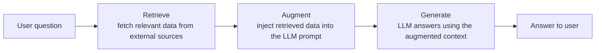

A common point of confusion: **RAG vs. MCP (Model Context Protocol)**. These are independent, non-competing concepts, not alternatives to choose between:

- RAG describes *what* is happening conceptually: retrieve → augment → generate.
- MCP is *one possible transport/mechanism* an agent can use to retrieve data from a source (a tool call over a standard protocol).

So "I already have RAG, why would I need MCP?" and "I already have MCP, why would I need RAG?" are both the wrong question — MCP can simply be the plumbing used inside the "R" step of a RAG pipeline. Treating them as competing architectures (including bad definitions that circulate online) is a common but incorrect mental model.

> [!info]+ Interview questions covered
> - What do the three letters in RAG stand for? Explain each step.
> - Why do LLMs have a knowledge cutoff, and how does RAG address it?
> - What is the difference between RAG and MCP? Are they alternatives?

### From Idea to Architecture: UI → Backend → LLM, and the Context-Window Bottleneck

The tutor narrows the scope for the rest of the talk to a concrete product: **"chat with your documents."** The phrase is deliberately literal — the system must answer only from the given documents (as opposed to a general-purpose agent that could touch many other data sources), which keeps the design tractable while still being representative of real RAG systems.

The first-pass architecture is intentionally naive:

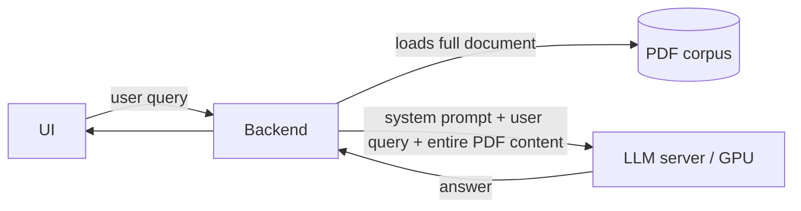

The naive flow: the UI sends the query to the backend, the backend loads the *entire* PDF (say, 100 pages) and stuffs the whole thing — system prompt, user query, and all 100 pages — into a single LLM call, and expects an answer back.

**What's the bottleneck here?** The **context window**. A 100-page document (and a real system deals with far more than one document) simply will not fit into — or will be prohibitively expensive/slow inside — a single model context window, and stuffing everything in indiscriminately also drowns the truly relevant passage in irrelevant text.

The fix is to **divide the document into smaller chunks** — split by page, by paragraph, or by topic (e.g., $P_1, P_2, P_3, \dots$) — rather than sending the whole document on every query.

But chunking immediately creates a new problem: **given a user's question, which chunk out of potentially millions is actually relevant?** The backend needs a way to figure out, at query time, which chunk(s) to pull in. Answering *that* question is what motivates embeddings and vector search (covered in later sections), but the intuition is introduced here:

- Represent each chunk by placing it into an **n-dimensional space** based on its meaning.
- Chunks that are semantically similar (e.g., all physics-related content) end up **clustered together** in that space, separate from other clusters (e.g., all chemistry-related content).
- To retrieve, you locate the right region/cluster in that space for the incoming question and pull chunks from there — you don't need to scan every chunk in the corpus.

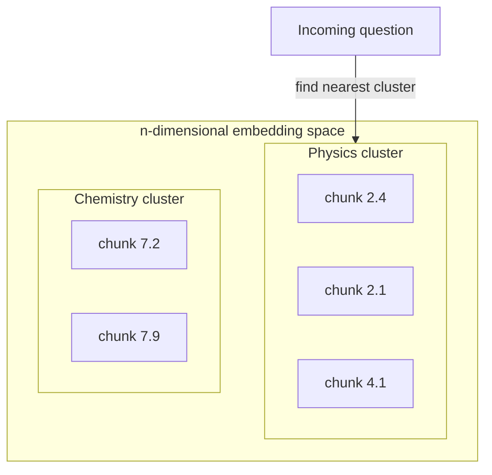

This clustering intuition — "similar meaning lives close together" — is the conceptual bridge from "raw text chunks" to "vector embeddings + similarity search," which the lecture builds on in later sections.

> [!info]+ Interview questions covered
> - Why can't you just feed an entire document (or corpus) into the LLM's context on every query?
> - Why is chunking necessary before retrieval, and what new problem does it introduce?
> - What is the intuition behind placing chunks in an n-dimensional embedding space?

### Moving From Free-Form Discussion to Structured System Design

Having built the intuition informally on a whiteboard, the tutor explicitly switches gears: in a real interview, a RAG system design discussion should follow a **structured, guideline-driven format** rather than a free-flowing conversation. The notes outline (shown in a `notes.md` file, titled "RAG: Chat with Your Documents") lays out eight sections that structure the rest of the lecture:

1. Requirements and Problem Scoping
2. High-Level Architecture
3. Data and Knowledge Pipeline
4. Model Selection and Prompt Engineering
5. Orchestration, Agents, and Tool Use
6. Guardrails, Safety, and Quality
7. Deployment, Scaling, and Cost Optimization
8. Monitoring, Evaluation, and Iteration

This ordering itself is a reusable interview template for *any* system design question involving LLMs/RAG, not just this specific document-chat scenario.

> [!info]+ Interview questions covered
> - How would you structure a RAG/LLM system design interview answer end to end?
> - What are the major phases of designing a production RAG system?

### Section 1 — Requirements and Problem Scoping

The concrete requirement statement for this design: **build a production system that answers questions from a private document corpus, with citations.**

Two words carry the entire scope:

- **Private** — the system must answer strictly from the given document corpus, not from the model's general/public training knowledge. If the answer isn't in the corpus, the system should say so rather than hallucinate from general knowledge.
- **Citations** — every answer must be traceable back to its source: which document, which page, and which chunk (or URL) the information came from. This is a hard requirement, not a nice-to-have, because it lets a user (or auditor) verify the answer against the original source.

To make the design concrete rather than abstract, the tutor grounds it with a worked example — a company's internal knowledge base containing policy updates, legal documents, and holiday schedules:

| Quantity | Value |
|---|---|
| Documents in the corpus | 125,000 |
| Average pages per document | 4 |
| Tokens per page (rule of thumb) | ~700 |
| Average tokens per document | $4 \times 700 = 2{,}800$ |
| Words per page (approx.) | ~500–550 (roughly $\tfrac{3}{4}$ word per token) |
| Total chunks after chunking the corpus | ~1,000,000 |
| Embedding model | `nomic-embed-text` |
| Embedding dimensionality | 768 |

A couple of useful heuristics worth memorizing from this section:

$$
1 \text{ page} \approx 700 \text{ tokens} \approx 500\text{–}550 \text{ words}
$$

$$
1 \text{ document (4 pages)} \approx 2{,}800 \text{ tokens}
$$

These aren't arbitrary — "~700 tokens per page" is a standing rule of thumb the tutor reuses across sessions for quickly back-of-the-envelope-sizing any document-heavy system: given a page count, you can immediately estimate token counts, and from token counts estimate embedding costs, storage, and retrieval-time compute. The jump from 125,000 documents to roughly 1,000,000 chunks (the exact chunking strategy behind that multiplier is developed in the next section) is the number that will drive every downstream architecture decision — vector index size, embedding throughput, and retrieval latency budget.

> [!info]+ Interview questions covered
> - How do you scope the "requirements" phase of a RAG system design interview?
> - What are the two non-negotiable requirements implied by "private document corpus with citations"?
> - How do you estimate the token/chunk scale of a large document corpus given only document count and average length?
> - What's a quick rule of thumb for converting pages to tokens, and tokens to words?


## Scaling Retrieval: ANN Search and Embedding Dimension Trade-offs

This section picks up right after the corpus has been scoped and chunked, and asks the natural next question: once you have a million vectors, how do you actually search them fast, and what embedding model should produce those vectors in the first place?

### From Documents to a Million Chunks

The running example for the whole design uses these numbers:

- **125,000 documents** in the private corpus.
- Each document is roughly **4 pages**, and each page is about **700 tokens**, so each document averages **~2,800 tokens**.
- Chunking every document at this size produces **1,000,000 chunks** — the unit that actually gets embedded and stored in the vector index.

These aren't arbitrary — they set the scale for every downstream decision: how big the vector index gets, how expensive a brute-force search would be, and how much memory the embedding model itself needs to run.

### Why Linear (Brute-Force) Search Becomes a Bottleneck

Once a query comes in, the retrieval pipeline has to find the chunks most relevant to it. The naive approach is: compute a similarity score between the query embedding and *every single one* of the 1,000,000 chunk embeddings, then sort and take the top results.

That's 1,000,000 similarity computations per query — and this repeats for every user request. At this scale, an exhaustive scan turns into a real computational bottleneck: latency balloons and throughput collapses as the corpus grows.

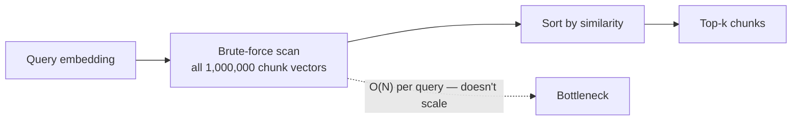

This is exactly the motivation for **Approximate Nearest Neighbor (ANN) search**: instead of comparing a query against every vector, ANN algorithms build an index structure (e.g., graph-based or hashing-based) that lets you find *approximately* the closest vectors in sub-linear time, trading a small amount of recall for a large gain in speed. The core idea: you don't need the mathematically exact nearest neighbors — you need "close enough, fast enough" to keep the retrieval step from dominating end-to-end latency.

> [!info]+ Interview questions covered
> - Why does searching a large vector index with brute-force/linear scan become a bottleneck as the number of chunks grows?
> - What problem does Approximate Nearest Neighbor (ANN) search solve, and why is exact nearest-neighbor search avoided at scale?

### Embedding Dimensionality: the `nomic-embed-text` Example

Every chunk (and every query) needs to be turned into a vector before any of this search can happen. The example embedding model used here is **`nomic-embed-text`**, which produces **768-dimensional** embeddings.

Why 768 matters practically:

- It's small enough to be **on-device / mobile-friendly** — the model itself takes roughly **100–400 MB** at most, so it can run directly on a phone rather than requiring a server round-trip just to embed text.
- 768 dimensions is a *mid-range* choice: enough dimensions to encode meaningful semantic structure, but not so many that the model becomes heavy to run.

### The Dimension vs. Accuracy vs. Cost Trade-off

The tutor's core framing: **more dimensions generally means better retrieval accuracy, but it isn't free.**

| Lower-dimension embedding model | Higher-dimension embedding model |
|---|---|
| Fewer numbers to represent each chunk's meaning | More numbers → can encode more relations/nuance in the text |
| Smaller memory footprint, can run on-device | Needs more memory and more GPU to run |
| Faster to compute and index | Slower, costlier at both index-build and query time |
| Lower ceiling on retrieval accuracy | Generally higher accuracy ceiling |

The intuition: a higher-dimensional vector has more "slots" to encode relationships between concepts in the text, so the model can represent finer-grained semantic distinctions — at the price of needing more memory and more compute (GPU) to produce and search over those vectors.

> [!info]+ Interview questions covered
> - What is embedding dimensionality, and why is `nomic-embed-text`'s 768-dim size relevant for on-device use cases?
> - What is the fundamental trade-off between embedding dimension size and system cost/accuracy?

### Choosing an Embedding Model: An Experiment-Driven Process, Not a Guess

Because bigger embedding models cost more (memory, GPU, latency), the recommended approach is **empirical, not aspirational**:

1. **Start with a smaller/cheaper embedding model** and measure real outcomes — specifically, what percentage of user questions the system answers correctly with it.
2. Suppose that gets you to **80%** accuracy, but the product bar is **90%**. Try a **better (usually higher-dimension) embedding model** and re-measure.
3. Suppose the better model gets you to **95%**. Getting further, say to **96%**, might require **doubling the cost** again for a comparatively small accuracy gain.
4. At that point it becomes a **business decision**, not a technical one: is the last percentage point of accuracy worth double the infra cost, or is it acceptable to keep the cheaper setup and take a small accuracy hit?

This progressive build-up — start small, measure, upgrade only if the accuracy delta justifies the cost delta — mirrors how the tutor frames every other capacity decision in the system: never assume the biggest/most expensive option is correct by default.

A second caution he raises: an embedding model being marketed as **"best in the market" on public benchmarks doesn't mean it's best for your domain**. A model trained mostly on general web text may perform worse on a specialized corpus — e.g., a **medical** document set — than a model that isn't a leaderboard leader but was tuned closer to that domain. The only reliable way to know is to **experiment on your own use case and data**, not to trust a leaderboard blindly.

> [!info]+ Interview questions covered
> - How do you decide which embedding model to use in a RAG system — do you always pick the highest-dimension/most accurate one?
> - Why might the "best" embedding model on public benchmarks not be the best choice for a specific product domain?
> - How do you frame the choice between accuracy gains and infrastructure cost as a business trade-off?

### The End-to-End Request Flow

Putting the pieces together, the tutor walks through the request path that this retrieval layer sits inside — from a user's question to a cited answer:

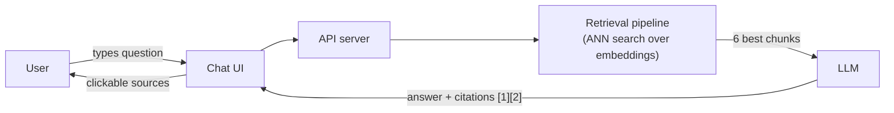

The retrieval pipeline's job is precisely the piece motivated above: given a query embedding, use ANN search over the 1,000,000 chunk vectors (built from documents embedded via a model like `nomic-embed-text`) to return the small number of best-matching chunks — here, **6 best chunks** — that get passed to the LLM. The LLM then produces an answer grounded in those chunks, along with citations, and the UI renders those citations as clickable sources back to the user.

> [!info]+ Interview questions covered
> - Can you describe the end-to-end request flow of a RAG "chat with your documents" system, from user query to cited answer?
> - Where does ANN search fit into the overall RAG request pipeline?


## The Retrieval Pipeline: Top-K Chunk Retrieval, Reranking, and Answering with Citations

Before diving into the mechanics of chunking or embeddings, it helps to zoom out and look at where the **retrieval pipeline** sits in the overall system, because almost every hard design decision in this lecture — chunk size, embedding model choice, reranking, latency budget — exists to serve this one component well.

### End-to-End Flow Recap

The request path for the "chat with your documents" product looks like this: the user types a question in the chat UI, the UI calls the API server, the API server calls the **retrieval pipeline**, the retrieval pipeline returns a small set of the best-matching chunks (in this walkthrough, around six), and those chunks are stuffed into the LLM's prompt. The LLM then has to produce both an answer *and* citations pointing back to the source chunks.

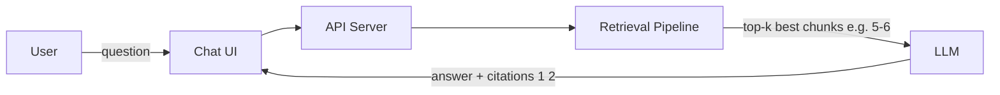

Everything downstream of the API server — vector search, filtering, reranking — is bundled under the label "retrieval pipeline." The tutor is explicit that this is the component doing the **heavy lifting**: it is responsible for scanning the entire private document corpus (hundreds of thousands of chunks) and surfacing only the handful that are actually relevant to the user's question.

> [!info]+ Interview questions covered
> - Walk me through the end-to-end request flow for a RAG chat product.
> - Which component in a RAG system does the most computational/engineering work, and why?

### The Retrieval Pipeline's Job: Finding the Best Chunks

Concretely, the retrieval pipeline's job is: given a user query, search across the entire corpus of chunks and return the ones that are *most relevant* to what the user asked. This is framed as an information-retrieval problem, not a generation problem — nothing about generating text happens here yet. The output is just a ranked list of chunks.

The tutor stresses that this "find the best chunks" step is where most of the engineering effort in a RAG system goes: the retrieval pipeline has to combine multiple sub-techniques (vector similarity search, filtering, and reranking, covered in later sections) to converge on a small, high-precision set of chunks.

### How Many Chunks? Choosing Top-K

A natural design question is: how many chunks should the retrieval pipeline hand off to the LLM? The tutor gives a practical, experimentally-grounded answer rather than a formula:

- In practice, the correct chunk is found within the **top 5 best-ranked chunks** roughly 99.99% of the time.
- Extending the window from 5 to 6 (or beyond) chunks adds negligible benefit — it rarely surfaces information that wasn't already captured in the top 5.
- Because of this, **5 chunks** is typically a good default operating point, trading off answer quality against cost and latency (each extra chunk means more tokens fed to the LLM).

Crucially, this number is **not universal** — it depends on:

| Factor | Why it shifts the ideal top-k |
|---|---|
| The dataset | Denser, more repetitive corpora may need more chunks to disambiguate; sparse corpora need fewer |
| The embedding model used | Better embeddings rank the truly relevant chunk higher, so fewer chunks are needed to guarantee it's included |
| The LLM used | A more capable LLM can filter noise from a slightly larger chunk set more reliably |
| Whether reranking is applied | A reranker (discussed in a later section) reorders the initial candidate set for higher precision at the top, which can let you safely shrink top-k |

So "top-k" is a tunable hyperparameter of the system, arrived at empirically for a given combination of dataset, embedding model, LLM, and reranking strategy — not a fixed constant.

> [!info]+ Interview questions covered
> - How do you decide how many chunks (top-k) to retrieve and pass to the LLM in a RAG system?
> - What factors influence the choice of top-k in a retrieval pipeline?
> - What is reranking, and where does it fit relative to initial chunk retrieval? (introduced here, detailed later)

### The LLM Is Stateless — Retrieval Is Its Only Source of Truth

This is the conceptual anchor for the whole design: **the LLM is stateless.** It has no persistent memory of your private documents and no built-in access to your corpus. Everything the LLM "knows" about your data, for the purposes of answering a given question, is exactly what gets placed in its context window on that single call.

That means the *sources* in this system are not the LLM's parameters — they are the **document chunks** derived from the original PDFs (or other document formats). The retrieval pipeline's entire purpose is to do the work of finding, out of potentially a million chunks, the handful that are relevant enough to serve as the LLM's temporary, per-request "memory."

This reframes the retrieval pipeline as a trust boundary: if it retrieves the wrong chunks, the LLM has no way to independently recover the right answer — it can only reason over what it was handed. Get retrieval wrong, and no amount of prompting or a stronger LLM fixes it downstream.

> [!info]+ Interview questions covered
> - Why is retrieval quality more important than LLM quality in most RAG failures?
> - What does it mean for an LLM to be "stateless," and how does that motivate the existence of a retrieval pipeline?
> - In a RAG system, what are the actual "sources of truth" for an answer?

### The Output Contract: Answer Plus Citation

Once the retrieval pipeline hands off its best chunks, the LLM's job is not just to generate free-form text — it must produce **two things together**:

1. **The answer** to the user's question, grounded in the retrieved chunks.
2. **Citations** — pointers back to which specific chunk(s) supported each part of the answer (shown in the flow diagram as `[1][2]`-style references).

This "answer + citation" contract is treated as a hard functional requirement of the product, not a nice-to-have. It has a direct design consequence that the tutor flags but defers: if the chunks fed to the LLM are just raw text, *how does the system know, after generation, which chunk backed which sentence of the answer?* Answering this requires the retrieval pipeline (or the orchestration layer around it) to preserve provenance metadata (document ID, page, chunk index) alongside each chunk, so it can be mapped back into a citation once the LLM references it. The tutor explicitly parks the "how" of citation generation for a later section, but frames it here as one of the two outputs every retrieval-to-generation call must produce.

> [!info]+ Interview questions covered
> - What two things must a RAG system return for every query, and why does that shape the retrieval pipeline's design?
> - What metadata does a retrieval pipeline need to preserve to make citations possible later?

### Embedding Models Are Not LLMs

A student question — "how many dimensions does Claude's embedding use?" — surfaces an important distinction that the tutor makes explicit: **embedding models and LLMs are different models**, often from different subsystems entirely, even within the same company.

Key points:

- An embedding model's job is to turn text into a fixed-length numeric vector for similarity search; an LLM's job is to generate text. They are trained differently and optimized for different objectives.
- Embedding models are frequently **not publicly documented or open-sourced** by cloud providers the way their flagship LLMs are. Anthropic (Claude), for example, does not use its own public embedding model — it relies on a third-party embedding provider, and exact internal dimensionality isn't publicized.
- Providers like OpenAI expose **multiple embedding dimension options** (e.g., a family of choices in the hundreds to low thousands of dimensions) at different price and accuracy points — higher dimensionality generally costs more and can capture finer-grained semantic distinctions, but isn't always worth the extra storage and compute cost.
- Choosing an embedding model is therefore its own design decision, independent of which LLM you use for generation, and should be driven by accuracy needs, dimensionality/storage tradeoffs, and pricing — not assumed to be "whatever the LLM provider offers."

| Aspect | Embedding model | LLM |
|---|---|---|
| Primary job | Map text → fixed-size vector for similarity search | Generate/complete text |
| Public availability | Often not open-sourced by cloud providers | Usually the flagship public product |
| Key tunable | Output dimensionality (e.g., 768, 1536, ...) | Context window, parameter count |
| Selection driver | Accuracy vs. cost vs. dimensionality | Reasoning quality vs. latency vs. cost |

> [!info]+ Interview questions covered
> - Are embedding models and LLMs the same underlying model? Why or why not?
> - What tradeoffs do you consider when picking an embedding model's dimensionality for a RAG system?
> - Why might a company that offers a strong LLM not expose its own embedding model?

With the roles of the stateless LLM, the retrieval pipeline, and the embedding model now separated, the lecture moves next into *why* a plain, retrieval-free LLM fails on private documents — motivating each subsequent design choice (chunking, embeddings, hybrid search, reranking) as a fix for a specific failure mode.


## Why Plain LLMs Fail on Private Data: Setting Up the Case for RAG

Before designing the RAG system itself, it's worth pinning down *why* a plain, off-the-shelf LLM cannot simply be pointed at a company's private documents and asked questions directly. This section works through a concrete example — and use it to derive the three structural failure modes that any RAG design has to solve for.

### The Problem Setup Recap

The running example throughout the design is: **build a production system that answers questions from a private document corpus, with citations.** The scale assumptions attached to this corpus matter because they shape every downstream design decision (chunk size, index size, latency budget):

| Metric | Value |
|---|---|
| Documents in the corpus | 125,000 |
| Average size per document | ~2,800 tokens (4 pages × ~700 tokens/page) |
| Resulting chunks after chunking | 1,000,000 |
| Embedding model | `nomic-embed-text` |
| Embedding dimensionality | 768 |

At a high level, the target system's request flow looks like this:

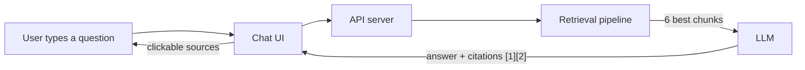

The "Retrieval pipeline" box is the piece a plain LLM does not have. Without it, the LLM only has whatever was baked into its weights during training — and that's precisely where things break down.

### The Motivating Example: Error Code E-4012

Imagine you work at an e-commerce company and a user asks the support bot:

> "What does error E-4012 mean in our product?"

This is a completely reasonable question, and the answer almost certainly *exists* — but only inside an internal, private PDF (an incident runbook, an internal wiki export, a support doc), not inside the LLM. If you hand this question to a bare foundation model with no retrieval step, three separate things go wrong at once.

### Three Reasons a Plain LLM Fails Here

| Failure mode | What it means | Why it happens |
|---|---|---|
| **It never saw your data** | The model has zero knowledge of company-specific error codes, internal tools, or proprietary terminology. | Private documents are never part of a general-purpose LLM's public training corpus — they're private by definition. |
| **It is frozen** | The model's weights don't change after training, no matter how often your documents change. | Fine-tuning is a heavyweight, GPU-intensive job. You cannot realistically retrain/fine-tune a model every few minutes just because a document was updated. |
| **It answers anyway** | Even with no relevant knowledge, the model still produces a confident-sounding answer instead of admitting ignorance. | An LLM is fundamentally a next-token predictor — it always "will do the prediction of next token," so in the worst case it hallucinates a plausible but wrong answer (e.g., guessing "this is a network issue" for an unfamiliar error code, because it once saw a similar-looking code like `404` associated with network problems on the internet). |

Walking through each one in more depth:

#### 1. It Never Saw Your Data

The error code `E-4012` lives inside a private document — a PDF that belongs to the company, not to the public internet. Since a general-purpose LLM is trained on public/licensed data, and this document was never part of that training set, the model has no internal representation of what `E-4012` means. This is exactly why the problem statement starts by defining a *private document corpus* in the first place: that private data structurally cannot be present inside the LLM's parameters.

#### 2. It Is Frozen

Even granting that you *could* fine-tune the model on the company's documents, the model's weights are fixed the moment training finishes. Fine-tuning is possible in principle, but it's not a knob you can turn in real time — it's a slow, resource-intensive offline job. If your company's documents change on a regular basis (which they do — new incidents, new products, new policies every few minutes or hours), you cannot realistically re-fine-tune the LLM every time something changes. That mismatch between how often source data changes and how expensive it is to update model weights is what "frozen" refers to.

#### 3. It Answers Anyway (Hallucination)

This is arguably the most dangerous of the three failure modes. An LLM's core mechanism is next-token prediction: given a prompt, it will always produce *some* output — it has no built-in "I don't know" reflex. In the worst case, it fabricates a plausible-sounding but incorrect answer, e.g., inferring that `E-4012` is "a network issue" simply because it has seen numerically similar codes like `404` associated with network errors elsewhere on the internet. The model isn't lying maliciously — it's doing exactly what it was trained to do (predict likely next tokens), but the result is a wrong answer delivered with the same confidence as a correct one. This is **LLM hallucination**, and it's the reason RAG needs both retrieval *and* careful prompting (grounding + citations) rather than just retrieval alone.

> [!info]+ Interview questions covered
> - Why can't you just ask a general-purpose LLM questions about your company's private documents?
> - What does it mean that an LLM's weights are "frozen," and why can't you fine-tune away this problem?
> - What is LLM hallucination, and why does it happen even when the model has no relevant information?
> - Why is fine-tuning impractical as a way to keep an LLM up to date with frequently changing private data?

### RAG: Retrieval-Augmented Generation as the Fix

Given those three failure modes, the fix is to stop asking the LLM to answer from memory and instead **retrieve the relevant private context at query time and hand it to the model as part of the prompt.** That's the entire idea behind Retrieval-Augmented Generation (RAG): keep the LLM frozen and general-purpose, but feed it *just-in-time* evidence pulled from your own corpus.

At a pipeline level, this looks like:


Reading this left to right, each stage directly answers one of the three failure modes above:

- **"It never saw your data"** is solved by *search the corpus* — instead of relying on the model's frozen training data, the system searches an index built from the company's own 1,000,000 chunks and pulls back the ones relevant to the question.
- **"It is frozen"** is solved by keeping the corpus and its index update-able independently of the LLM. New or changed documents get re-embedded and re-indexed; the LLM itself never needs retraining.
- **"It answers anyway"** is mitigated (not eliminated) by constraining the prompt itself: `prompt = rules + sources + question`. The "rules" component instructs the model to answer only from the provided sources and to cite them, which pushes the model toward grounded generation instead of free-associating from its own weights.

Two additional details worth internalizing at this stage, since they'll be expanded later in the design: to compare a question against a million chunks, the question itself first has to be converted into the same representation the chunks are stored in — an **embedding** — via the process labeled "embed the question." And the corpus search step is explicitly latency-bounded (1–10 ms for the search itself against 1M chunks), which foreshadows why vector index choice and retrieval architecture become a first-class performance concern later in the design, not just a correctness concern.

> [!info]+ Interview questions covered
> - What are the stages of a RAG pipeline, from a user's question to a grounded answer?
> - How does RAG address each of the three reasons a plain LLM fails on private data?
> - Why does the question need to be embedded before it can be compared against the document corpus?
> - What role does the prompt structure (rules + sources + question) play in reducing hallucination?


## Embedding Models, Vector Similarity, and the 768-Dimensional Chunk Space

### Why We Can't Compare Raw Text

The RAG pipeline needs to take an incoming question and find the most relevant chunks out of a corpus of, say, 1 million chunks. Before figuring out *how* that search happens, it helps to ask a more basic question first: **what exactly are we comparing?**

The naive idea — directly comparing the question's text against every chunk's text — breaks down immediately:

- Two paragraphs can express the *same meaning* using completely different words. The tutor's phrasing: "I will use my words, you will use your words, but somehow they mean something similar."
- There's no clean mathematical operation for "compare paragraph A to paragraph B" the way there is for comparing numbers.
- Comparing 1 million chunks of raw text against a query, one string at a time, gives no notion of *how close* one piece of text is to another — only exact/fuzzy string match, which fails for semantically similar but lexically different text.

Numbers, on the other hand, are trivially comparable:

- "The distance between these two points is 5."
- $5 < 7$
- $5 > 3$

So whenever a comparison is needed in this kind of system, the working rule is: **convert everything to numbers first, then compare the numbers.** That single idea is the reason embedding models exist in a RAG system at all.

> [!info]+ Interview questions covered
> - Why can't you compare two pieces of text directly to check similarity?
> - Why does a RAG system need to convert text into numbers before retrieval?

### What an Embedding Model Actually Does

An embedding model has exactly **one job**: take whatever data you feed it — a character, a word, a letter, a sentence, a full paragraph, or even an entire book/PDF — and turn it into numbers.

- A single word can become a vector of numbers.
- An entire book's worth of text can *also* become a vector of numbers (of the same fixed size).
- The output is always a fixed-length list of numbers, regardless of how much text went in.

This "convert anything into numbers" job is not limited to text. Different modalities need different embedding models, but the output shape — a vector of numbers — stays conceptually the same:

| Input modality | Embedding model used | Output |
|---|---|---|
| Text (character, word, sentence, paragraph, whole document) | Text embedding model | Vector of numbers |
| Image | Image embedding model | Vector of numbers |
| Video | Video embedding model | Vector of numbers |

The underlying architectures differ by modality, but the contract every embedding model honors is the same: **raw input in → fixed-size numeric vector out.**

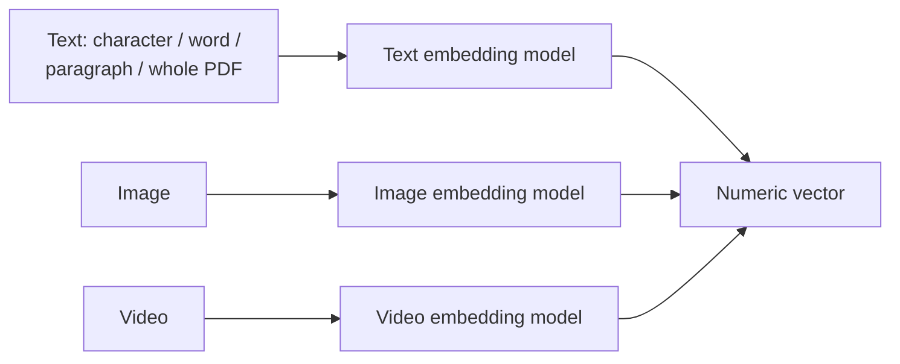

For the question that comes into the RAG system, the same idea applies: whatever characters/words/letters make up the question get fed into an embedding model, which produces a numeric vector representing that question.

> [!info]+ Interview questions covered
> - What is an embedding model and what does it output?
> - Do text, image, and video need the same embedding model?
> - Can an embedding model take an entire document/PDF as input, not just a word?

### The Embedding Space: Where All Chunks Already Live

Here's the key architectural fact that makes retrieval possible: the corpus was not left as raw text. Every one of the 1 million chunks was **already run through an embedding model ahead of time**, at ingestion, and converted into a numeric vector. Those vectors don't float in isolation — they live as points inside a shared numeric space, and chunks with related meaning tend to land near each other, forming loose clusters in that space.

In this lecture's example, that space has **768 dimensions**. So every chunk isn't just "some numbers" — it's specifically a point described by 768 numbers, sitting somewhere inside this 768-dimensional world. There are 1 million such points scattered (in clusters) throughout it, and every point represents exactly one chunk.

When a new question arrives at query time, it goes through the **same embedding model** and lands as a new point in that **same 768-dimensional space**. Because the embedding model places semantically similar content near each other, a question about "refund policy" will land close to chunks that talk about refunds — even if the chunk uses none of the same words as the question.

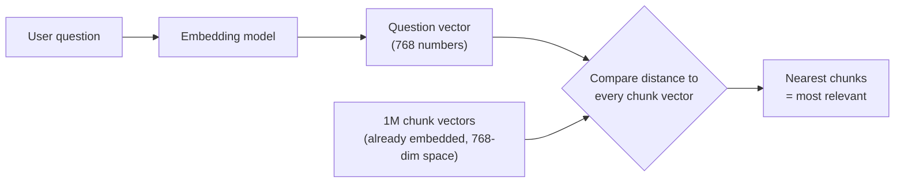

This is the real meaning of "embedding the question": it's not a standalone step done for its own sake — it's the act of placing the question into the exact same coordinate system the corpus already lives in, so that "closeness" becomes a well-defined, computable thing.

> [!info]+ Interview questions covered
> - What does "embedding space" mean, and why does dimensionality (e.g. 768) matter?
> - Why must the question be embedded using the same model as the corpus chunks?
> - Why do embeddings of similar chunks cluster together in the embedding space?

### Distance as the Similarity Metric

Once both the question and every chunk are just points in the same 768-dimensional space, "how relevant is this chunk to this question?" turns into a purely geometric question: "how close are these two points?"

That's why the tutor's earlier "distance between two points is 5" example matters — it's not an abstract aside, it's literally the mechanism:

- Compute the distance (a **distance metric**) between the question's vector and each chunk's vector.
- Smaller distance ⇒ more similar meaning ⇒ more relevant chunk.
- Ranking chunks by distance (e.g. $5 < 7$, so that chunk is closer/more relevant than this one) is what turns "1 million candidate chunks" into "the handful of chunks worth putting in the prompt."

This is deliberately kept conceptual at this point in the lecture — the exact distance/similarity formula (cosine similarity, Euclidean distance, dot product, etc.) and the search mechanism used to avoid comparing against all 1 million points one by one are treated as a later topic. For now, the mental model to hold onto is simply:

$$\text{relevance}(q, c) \;\propto\; \frac{1}{\text{distance}(\vec{q}, \vec{c})}$$

where $\vec{q}$ is the question's embedding vector and $\vec{c}$ is a chunk's embedding vector, both living in the same 768-dimensional space.

> [!info]+ Interview questions covered
> - How is "relevance" between a query and a document chunk actually computed once both are embedded?
> - What is a distance metric, and how does it relate to semantic similarity in vector search?


## Fine-Tuning vs. RAG: Prompt Construction, Grounded Answers, and the Unlearning Problem

### Closing the Loop: From Top-K Chunks to a Grounded Answer

The retrieval story so far has been: embed the question, drop that embedding into the same vector space as every chunk, and search for neighbors. To make the mechanics concrete, picture the embedded question landing at a 2D point like $(2, 4)$. In reality the corpus holds a million chunk-points scattered across the embedding space; the retrieval step compares the question's point against **all** of them and keeps the ones sitting closest to it. Those nearest points are the **top chunks** (top-k retrieval) — this is the same nearest-neighbor idea from earlier sections, just now placed at the end-to-end pipeline.

Those top chunks don't go to the LLM by themselves. They get assembled into a **prompt** together with two other ingredients:

- **Rules** — instructions that constrain how the model should behave (e.g., "only answer from the provided sources," "cite your sources," "say you don't know if the answer isn't in the context").
- **The user's original question** — so the model knows exactly what it's being asked.

$$
\text{prompt} = \text{rules} + \text{sources (top chunks)} + \text{question}
$$

That combined prompt is fed into the LLM, which returns a **grounded answer** — an answer anchored in the retrieved sources rather than invented from the model's frozen pretraining. This is then served back to the user, typically alongside clickable citations pointing at the exact source chunks.

Putting the full arc together, from user input to final answer:

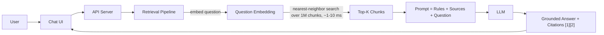

A student asked at this point how the value of *k* (e.g., "top 6" or "top 10") is actually decided — the tutor flagged this as a later topic rather than answering it immediately, since the criteria for choosing *k* (latency budget, context window size, precision/recall trade-offs) deserve their own discussion. A second question — whether retrieved chunks can be validated for correctness before they're sent to the LLM, given that top-10/top-20 results out of a million chunks could still be wrong — was also deferred to a later part of the lecture. Keep both open questions in mind; they get resolved once top-k tuning and retrieval quality are covered explicitly.

> [!info]+ Interview questions covered
> - Walk through the full RAG pipeline from a user's question to a grounded answer.
> - How is the final prompt constructed in a RAG system? What goes into it besides the retrieved chunks?
> - What does it mean for an LLM's answer to be "grounded"?

### Why Not Just Fine-Tune Instead of Building RAG?

A natural question once you've seen the RAG pipeline: why not skip retrieval entirely and just fine-tune the LLM directly on the company's documents? The lecture answers this with a direct comparison table, walked through row by row:

| Need | Fine-tuning | RAG |
|---|---|---|
| New fact added at 9:00 | Retrain, redeploy: **days** | Re-embed one doc: **seconds** |
| Delete a document | Cannot unlearn reliably | Remove from index — gone |
| "Where did that come from?" | No answer | Citation to the chunk |
| Per-user permissions | One model sees all | Filter at query time |
| Cost to update | GPU training run | ~\$0.00006 of embedding |

Each row maps to a concrete failure mode of fine-tuning in production:

- **Freshness.** If a new fact — a policy change, an updated price, a new document — needs to be reflected in answers, fine-tuning means retraining and redeploying the model, which realistically takes **hours to days** even for a mid-sized model. RAG only needs the new document to be chunked and re-embedded into the vector database, which happens in **seconds**, close to real time.
- **Deletion / unlearning.** If a document needs to be removed (expired policy, retracted document, GDPR-style deletion request), RAG just removes its vectors from the index — it's gone, instantly, from anything the system can retrieve. Fine-tuning has no such mechanism: once information has been baked into the model's weights during training, there's no reliable way to make the model "forget" it.
- **Traceability / citations.** When a user or auditor asks "where did that answer come from?", a fine-tuned model has no way to answer — the fact is just diffused across millions of weights. RAG can always point back to the exact chunk(s) that were retrieved and cite them.
- **Per-user permissions.** A single fine-tuned model bakes in everything it was trained on for every user — there's no way to say "this employee shouldn't see documents from that department." RAG can apply permission filters **at query time**, before chunks are ever retrieved, so different users effectively see different slices of the corpus.
- **Cost.** Updating a fine-tuned model means a GPU training run — real infrastructure cost and time. Updating a RAG system means embedding one document, which costs a fraction of a cent (roughly \$0.00006 in the example).

The concrete scenario tying this together: imagine new chunks/documents are added to the corpus at 9:00 a.m. With fine-tuning, reflecting that change means retraining and redeploying the model — realistically hours to days at minimum — so until that finishes, users or employees querying the system get **wrong or stale answers**. With RAG, the same update is a near real-time re-embed into a separate vector database; the very next query can retrieve the new chunk.

This is why the lecture lands firmly on: **RAG is the better approach** for a "chat with your documents" product, whether you're working with a company's own LLM or fine-tuning an open-source model on company data — because whenever the underlying documents change, you cannot retrain and redeploy fast enough to keep answers correct in real time.

> [!info]+ Interview questions covered
> - Why is RAG generally preferred over fine-tuning for grounding an LLM in private/enterprise documents?
> - Compare fine-tuning and RAG on: latency to add new knowledge, deleting/unlearning data, citation/traceability, per-user access control, and cost.
> - What happens to answer correctness if new or changed documents can't be reflected in the model in real time?

### The Unlearning Problem: Why a Fine-Tuned Model Can't Forget

The "delete a document" row deserves its own emphasis because it's a structural limitation, not just an inconvenience. Once a document is deleted, **there is no guaranteed way to make a fine-tuned LLM unlearn that information.**

The reason is rooted in how fine-tuning actually changes a model: the model has already learned from a huge volume of data, and fine-tuning further adjusts a very large number of weights based on new data. Once a fact has been absorbed into those weights, it's not stored as a discrete, addressable record the way a row in a database is — it's smeared across many parameters, entangled with everything else the model has learned. There's no operation equivalent to `DELETE FROM knowledge WHERE source = X`. You cannot selectively subtract one document's influence from the weights without risking damage to everything else the model learned alongside it (a version of catastrophic forgetting, just in reverse — you want to forget one thing without breaking the rest).

RAG sidesteps this completely because the LLM's weights never encode the private documents at all — the documents only ever live in an external vector index. Deleting a document is just removing its vectors from that index. The model itself never "knew" the document in the first place, so there's nothing to unlearn.

This is called out as **one of the fundamental bottlenecks of fine-tuning** for any system that needs to support real, ongoing data deletion — which most enterprise document systems do, whether for compliance, expiring content, or simple corrections.

> [!info]+ Interview questions covered
> - Why can't you reliably make a fine-tuned LLM "forget" a specific document or fact once it has been deleted?
> - What is the "unlearning" problem in the context of fine-tuned LLMs, and how does RAG avoid it?


## Why Not Fine-Tune or Stuff Everything in the Context Instead?

Having established the RAG request flow, the natural design-review question is: why bother with all this retrieval machinery at all? Two alternatives seem simpler on the surface — fine-tune the LLM directly on your private data, or just paste the whole corpus into the prompt. This section walks through why both alternatives break down, using the same running example: a corpus of **125,000 documents**, each ~4 pages at ~700 tokens/page (~2,800 tokens/doc), chunked into roughly **1,000,000 chunks**.

The recurring reference diagram for the comparison is the RAG request flow itself:


Every argument below is really just: "can fine-tuning (or raw context-stuffing) replicate what this pipeline gives you for free?"

### Why Not Fine-Tune Instead?

| Need | Fine-tuning | RAG |
|---|---|---|
| New fact added at 9:00 | retrain, redeploy: **days** | re-embed one doc: **seconds** |
| Delete a document | **cannot unlearn reliably** | remove from index, **gone** |
| "Where did that come from?" | **no answer** | citation to the chunk |
| Per-user permissions | one model sees all | filter at query time |
| Cost to update | GPU training run | **~$0.00006** of embedding |

Each row is a separate failure mode of fine-tuning that RAG sidesteps almost trivially. They're worth unpacking one at a time.

#### Deletion and Unlearning

If a new fact needs to go live at 9:00 AM, a fine-tuned model needs a full retrain-and-redeploy cycle — realistically **days**. With RAG, you just re-embed the one changed document — **seconds**. The gap is even starker for *deletion*. In the vector database, removing one or two chunks out of a million is a trivial operation: delete the vector, and the information is **gone** from what the system can retrieve.

Fine-tuning cannot offer the same guarantee. An LLM has learned a fact through many adjusted weights across a huge amount of training data, and there isn't a clean, surgical way to make it "forget" one specific fact — this is the **unlearning** problem. The deeper reason: a large model typically has **multiple internal paths ("trees") to arrive at an answer**. Ask the same question repeatedly and it can produce different answers, phrased differently, drawing on different parts of what it learned. Because there's no single path to "cut," you cannot reliably force an unlearn. In practice, "forgetting" something in a fine-tuned model usually means bolting on an *extra system prompt* ("don't answer questions about X") rather than the model actually not knowing it — which is a workaround, not a guarantee.

> [!info]+ Interview questions covered
> - Why can't a fine-tuned LLM reliably "unlearn" or delete a specific fact, and how does RAG handle deletion instead?
> - What does it mean that an LLM has "multiple trees" to reach an answer, and why does that make unlearning unreliable?

#### Citation / Provenance

An LLM fine-tuned on internet-scale data has no memory of *which* website or document any given fact came from — training compresses everything into weights, with no attached source pointer. So when a user asks "where did that come from?", a fine-tuned model has **no answer** to give.

RAG solves this by construction: because the answer is generated from a small set of *specific, retrieved chunks*, each chunk still carries its own metadata (document ID, page, etc.). The system can simply cite the chunk(s) the answer was grounded in. Citation isn't an afterthought bolted onto RAG — it falls out naturally from the fact that the model's *only* window into "your" data is the exact chunks that were retrieved for that query.

> [!info]+ Interview questions covered
> - Why can't a fine-tuned LLM cite the source of a fact it produces, while a RAG system can?
> - How does per-chunk metadata enable citation/provenance in a RAG pipeline?

#### Per-User Permissions

A fine-tuned model is monolithic: it's trained once and answers *everyone* the same way from the same learned weights. There is no concept of "this specific user is or isn't allowed to know this." If a user named Amit asks a question, the model has no way to check whether Amit has the privilege to see that information — it just answers, because that's all it knows how to do.

RAG has a natural insertion point for this: the vector database query. Since retrieval happens per-request against a live index, you can attach an **access-control filter at query time** — e.g., filter candidate chunks to only those documents Amit is permitted to see — before anything is retrieved or handed to the LLM. Permissions become a *database filtering problem* instead of a *model-weights problem*.

> [!info]+ Interview questions covered
> - Why is per-user access control difficult with a single fine-tuned LLM, and how does RAG support it naturally?
> - Where in the RAG pipeline would you enforce per-user document permissions?

#### Cost to Update

Fine-tuning any update — even a small one — requires a **GPU training run**, which costs real money and takes real time. Updating RAG's knowledge for one new/changed document just means generating a new embedding and swapping it into the index: on the order of **~$0.00006** per update, versus a full retraining bill for fine-tuning. Whenever the underlying data changes even semi-frequently, this cost delta compounds fast.

> [!info]+ Interview questions covered
> - How does the cost of updating knowledge compare between fine-tuning and RAG?

### Fixed vs. Dynamic Datasets — When RAG Isn't Actually Needed

A natural follow-up question (raised by a viewer during the lecture): *should you always use RAG on your company's data?* The answer is **no**. All the advantages above — cheap updates, deletion, citation, per-user filtering — only matter if your data actually **changes**. If a dataset is **fixed** — it won't be updated for the next month, a couple of months, or even longer — then you don't need any of those capabilities:

- You're not adding new facts, so the "days to retrain" cost of fine-tuning is a one-time cost, not a recurring one.
- You're not deleting documents, so unreliable unlearning isn't a live concern.
- You may not need citations or per-user filtering for that use case.

In that scenario, skipping RAG and just fine-tuning occasionally (or using the base LLM directly) is the simpler, cheaper option — you avoid the added complexity of a retrieval pipeline (vector database, chunk search, prompt assembly) entirely. RAG is the right default when data is **dynamic**; it becomes optional infrastructure overhead when data is **static**.

> [!info]+ Interview questions covered
> - When would you choose fine-tuning (or no RAG at all) over building a RAG pipeline?
> - What's the deciding factor between using RAG and periodically fine-tuning a model on your own data?

### Why Not Stuff Everything in the Context?

The second alternative to retrieval is: why not skip the vector database and just paste the *entire* corpus into the LLM's context window on every request? The tutor walks through the concrete arithmetic for why this fails, using the same 125,000-document corpus:

```text
corpus size        125,000 docs x 2,800 tok = 350,000,000 tokens
big context         200,000 tokens
fit                 350,000,000 / 200,000 = 1,750x too large
cost if you could   350M tok x $3/M = $1,050 per question
cost via RAG        ~2,800 prompt tok x $3/M = $0.0084 per question
```

Breaking down each line:

- **Corpus size**: 125,000 documents × ~2,800 tokens/doc ≈ **350 million tokens** total.
- **Big context**: even the largest *commonly available* context windows top out around **200,000 tokens** (the tutor deliberately sets aside outliers like Claude Opus's 1M-token context as a special case, not the general rule).
- **Fit**: $350{,}000{,}000 / 200{,}000 = 1{,}750$ — the corpus is **1,750× too large** to fit into a single context window, even before accounting for the prompt itself.
- **Cost if you could**: even if a model *did* support that much context, at roughly \$3 per million tokens, feeding the whole corpus on every single question would cost **~\$1,050 per question** — in the tutor's framing, "around a lakh of rupees for one question — nobody will pay that."
- **Cost via RAG**: because retrieval narrows the prompt down to just the best-matching chunks (the earlier example used the top 5–6 chunks, ~2,800 tokens), the same question costs about **\$0.0084** — roughly **125,000× cheaper** than brute-force context stuffing.

The math makes the case on its own: full-context stuffing fails on *both* axes simultaneously — it doesn't even fit (1,750× over budget), and even in a hypothetical world where it did fit, the per-question cost would be commercially absurd. RAG's entire value proposition is collapsing that 350-million-token corpus down to the handful of chunks that are actually relevant to a given question, which is simultaneously what makes it fit in-context *and* what makes it affordable per query.

> [!info]+ Interview questions covered
> - Why can't you simply paste an entire large document corpus into an LLM's context window instead of using retrieval?
> - How do you estimate whether a corpus fits inside a given context window, and what's the cost impact of trying to brute-force it anyway?
> - How does RAG's cost-per-query compare to feeding the full corpus into context on every request?


## Functional and Non-Functional Requirements for a RAG System

### Recap: Why RAG Wins Even With a Long Context Window

Before listing requirements, it's worth closing the loop on the "why not just stuff everything into the context window" argument. Even a model that technically *supports* a huge context window doesn't make full-corpus stuffing a good idea:

```text
corpus size          125,000 docs x 2,800 tok = 350,000,000 tokens
big context          200,000 tokens
fit                  350,000,000 / 200,000 = 1,750x too large
cost if you could    350M tok x $3/M = $1,050 per question
cost via RAG         ~2,800 prompt tok x $3/M = $0.0084 per question
```

Two separate problems compound here:

1. **It literally doesn't fit.** The corpus is 1,750x larger than even a generous 200K-token context window.
2. **Even if it fit, it would be a bad idea.** Feeding hundreds of millions of tokens into a single prompt overwhelms the model — accuracy degrades because most of what's in context is irrelevant to the actual question. Retrieving only the 5–6 most relevant chunks (here, ~2,800 tokens total) keeps the prompt focused and cuts the per-question cost from **$1,050 to $0.0084**.

So even setting cost aside, RAG remains the only practical option once accuracy is factored in — an overwhelmed LLM becomes its own bottleneck regardless of how large its context window is.

### Functional Requirements

These are the concise talking points to state upfront in a system-design interview — what the system must *do*, before getting into how it's built:

- **Answer questions from the corpus with citations to the exact source chunks.**
- **Multi-turn:** must inherit context from the previous turn.
- **Respect document permissions per user.**
- **Reflect document edits within minutes; deletions must happen immediately.**
- **Say "I don't know"** when the corpus has no answer, instead of inventing one.

Each of these has a design consequence worth unpacking.

#### Citations to Source Chunks

Every answer must be traceable back to the exact chunk(s) it came from. This is what makes RAG auditable in a way a fine-tuned model never is — "where did that come from?" always has an answer: a citation to a specific chunk, not a shrug.

#### Multi-Turn Context Inheritance

A few design decisions change once conversations span multiple turns. Consider this exchange:

1. User: *"What is the price of the iPhone 16?"*
2. User (follow-up): *"What is the screen size?"*

The second question never repeats "iPhone 16." For the system to answer correctly, it must infer — from the chat history — which product the follow-up is still about, and carry that entity forward into the retrieval step for turn 2.

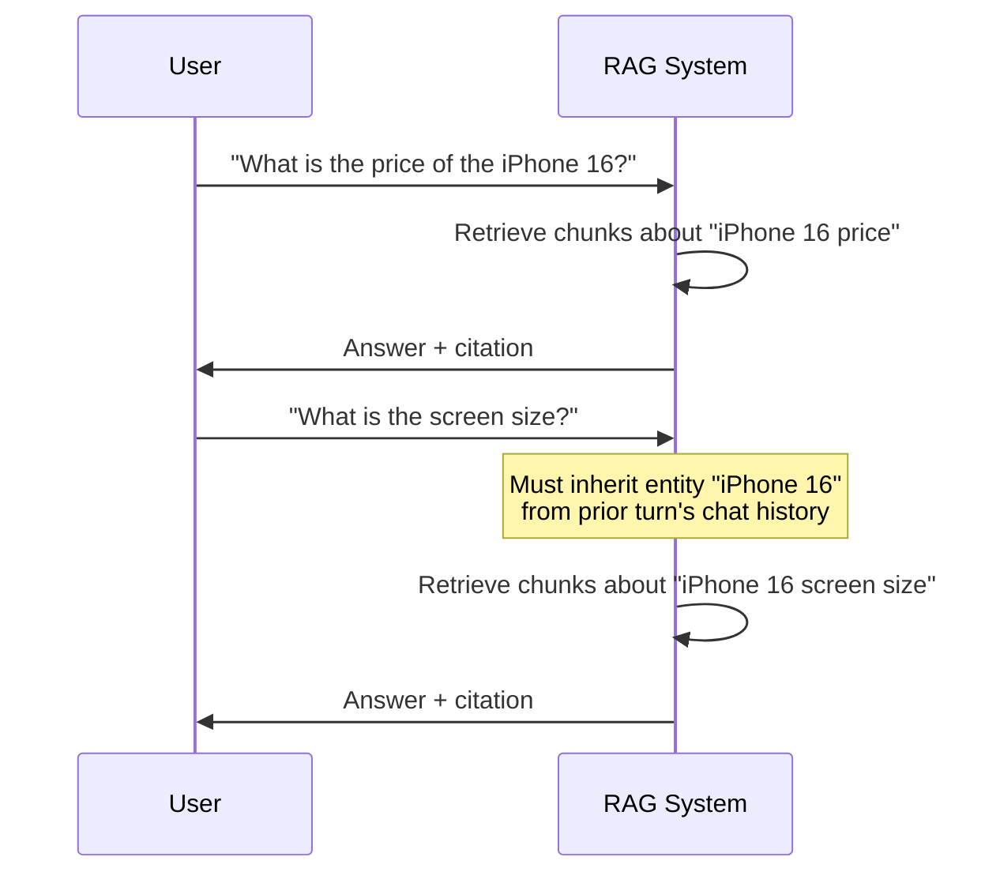

If the system treats each turn as an independent query, retrieval on turn 2 goes looking for "screen size" in general — with no product anchor — and returns garbage. This is why chat history has to feed into the retrieval query itself, not just into the final generation prompt.

> [!info]+ Interview questions covered
> - What are the core functional requirements you'd state for a RAG-based chat-with-your-documents system?
> - How do you support multi-turn conversations in a RAG pipeline, where follow-up questions omit the subject?
> - Why does citing source chunks matter for a RAG system, and how is it different from a fine-tuned model's "black box" answers?

#### Document Permissions

Not every document is visible to every user — some documents can only be accessed by, say, company admins. A regular employee querying the system should never have chunks from a restricted document surfaced to them, regardless of how relevant those chunks are to the query. Permissions must be respected and filtered **at query time**, not just at ingestion time.

#### Freshness: Edits and Deletions

If a company's policy or product data changes, that update needs to be reflected in the index **within minutes**. Deletions are stricter — they must take effect **immediately**, since a deleted document still being served as if it's the source of truth is a much worse failure mode than a slightly stale edit; stale deleted data becomes its own bottleneck on trust in the system.

#### Say "I Don't Know" (Hallucination Avoidance)

This is called out as one of the most important requirements. An LLM is fundamentally a **predictive, next-token-generating system** — left to its own devices, it will keep producing plausible-sounding tokens until told to stop, whether or not the corpus actually contains the answer. Without an explicit instruction and design path to abstain, the model will confidently answer from its own pretrained knowledge (or invent something) rather than admit the corpus doesn't cover the question. The system must be engineered so that when retrieval comes back empty or low-confidence, the model says "I don't know" instead of hallucinating.

> [!info]+ Interview questions covered
> - Why must a RAG system explicitly support saying "I don't know," and what happens if it doesn't?
> - How do document permissions get enforced in a retrieval pipeline that serves multiple users?
> - What SLA would you set for reflecting document edits vs. deletions, and why should deletions be stricter?

### Non-Functional Targets

Once the functional "must-do" list is set, the interview conversation shifts to the "how fast / how good / how cheap" targets — the non-functional requirements:

| Requirement | Target | Why this number |
|---|---|---|
| Time to first words (TTFT) | under 1 s | Retrieval adds ~100 ms on top of the LLM's own 200–500 ms time-to-first-token |
| Full answer | under 10 s | A ~300-token answer at ~50 tok/s ≈ 6 s of generation, plus the ~1 s to first token |
| Retrieval quality | recall@5 ≥ 0.90 | Measured against a labeled "golden set" of queries |
| Freshness | edits visible in under 5 min | Stale data becomes a trust bottleneck |
| Cost per query | under $0.01 | Matches the ~$0.0084/question RAG cost computed earlier |

### Time to First Token (TTFT), Explained

**Time to first token (TTFT)** is the latency between sending a query and the first word of the answer appearing. It is *not* zero, even for a fast system, because of what has to happen before generation can even start:

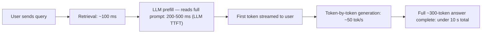

The LLM must first **read and internally process everything in the prompt** — the user's question plus every retrieved chunk — before it can predict even the very first output token. This "read everything, then start predicting" step is what the 200–500 ms LLM TTFT baseline covers, on top of which retrieval adds its own ~100 ms. That's why the target for "time to first words" is set at under 1 second: it's the sum of retrieval latency and the LLM's own unavoidable prefill/TTFT cost, not an arbitrary number.

The "full answer" target follows the same logic one step further: once the first token is out, generation proceeds token by token at the model's throughput (~50 tok/s here), so a half-page answer (~300 tokens) adds about 6 more seconds — giving a total budget of under 10 seconds end to end.

> [!info]+ Interview questions covered
> - What is time to first token (TTFT), and why is it never zero even for a well-optimized RAG system?
> - How would you set and justify latency SLAs (TTFT, full-answer time) for a RAG-based chat product?
> - How do retrieval latency and LLM prefill latency combine to produce the overall time-to-first-word budget?


## Recall@K, In-Context Learning, and Sizing the RAG System for Scale

This section closes out the non-functional targets table (retrieval quality, freshness, cost) and then walks through the arithmetic that turns a vague "125,000 documents" problem statement into concrete numbers for corpus size, chunk count, vector storage, and query traffic.

### Finishing the Latency and Quality Targets

Picking up from the non-functional requirements table, the full-answer time budget breaks down as: the LLM needs to generate roughly 300 tokens, and at ~50 tokens/second that's 6 seconds of pure generation time, plus the ~1 second time-to-first-word budget already spent on retrieval and the first token — giving a full answer comfortably inside a 10-second budget. That covers **speed**. The other half of the non-functional story is **quality** — and that's where recall@K comes in.

| Non-functional target | Value | Why |
|---|---|---|
| Time to first word | under 1 s | Retrieval adds ~100 ms on top of the 200–500 ms LLM time-to-first-token |
| Full answer | under 10 s | 300 tokens ÷ 50 tokens/s ≈ 6 s of generation, plus first-token latency |
| Retrieval quality | recall@5 ≥ 0.90 on the golden set | Defines "good enough" retrieval |
| Freshness | edits visible in under 5 min | A user editing a PDF (e.g., changing a price) should see that reflected quickly |
| Cost per query | under $0.01 | Keeps the system economically viable at scale |

### Recall@K: How RAG Retrieval Quality Is Measured

The standard way people talk about RAG quality — in blogs, papers, and interviews — is **recall@K**. The idea:

- You have a **golden set** of test questions where the correct answer/chunk is already known.
- For each question, you retrieve the top **K** chunks (K could be 1, 2, 3, 4, 5, 6, 10, 50 — any cutoff).
- **Recall@K** = the fraction of questions for which the correct chunk appears *somewhere* within those top K results.

Concretely: **recall@5 = 0.90** means that if you run 100 test questions through the system and look only at the top 5 retrieved chunks (out of a corpus of, say, 1 million chunks), 90 of those 100 questions would have their correct answer chunk sitting inside that top-5 list. The other 10 questions "missed" — their answer chunk didn't make it into the top 5.

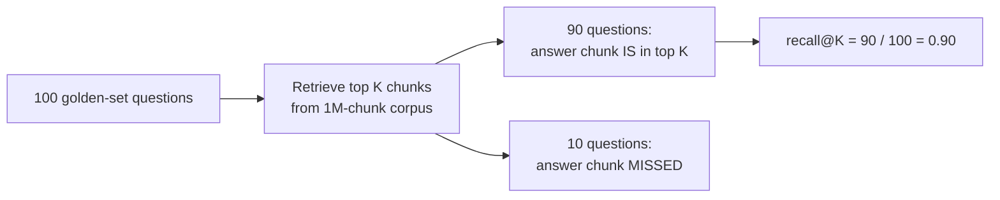

This metric is exactly what teams re-check every time they change something in the system (swap embedding model, change chunk size, adjust K) — recall@5 (or whichever K they've standardized on) becomes the yardstick for "did that change help or hurt retrieval quality?"

#### Why the Correct Chunk Isn't Always Ranked First

A common misconception is that a well-tuned system should always put the correct chunk at rank 1. In practice, that's not guaranteed — sometimes the answer is in the first result, sometimes the third, sometimes the fifth. This depends entirely on **how the source paragraphs are structured** (how the relevant sentence is phrased and embedded relative to the question). That's why recall is measured over a range — recall@1 through recall@10 or more — rather than assuming rank 1 alone is sufficient.

### The Accuracy-vs-Cost Tradeoff in Choosing K

Increasing K is a straightforward way to push recall higher — going from top-5 to top-50 chunks can drive recall close to 100%. But this isn't free:

- Every chunk you retrieve has to be **fed into the LLM's prompt** as context.
- More chunks → more tokens in the prompt → higher generation cost *and* higher latency (bigger prompts take longer to process).

So the choice of K is a direct **accuracy vs. cost/latency tradeoff**: pushing K up buys you retrieval recall, but it costs money and time on every single query. This is why the non-functional target explicitly pins down a K (recall@5 ≥ 0.90) rather than just saying "retrieval should be good" — it forces an explicit tradeoff decision rather than an open-ended one.

| K (chunks retrieved) | Effect on recall | Effect on cost/latency |
|---|---|---|
| Small (e.g., K=1–3) | Lower recall — may miss the answer | Cheapest, fastest |
| Medium (e.g., K=5–6) | Good balance — the standard reference point (recall@5) | Moderate |
| Large (e.g., K=50) | Recall approaches 100% | Most expensive — many more tokens fed to the LLM per query |

### Why Embedding Model Selection Matters for Recall

Since the rank of the correct chunk depends on how well the question's meaning lines up with the chunk's meaning in vector space, the **embedding model** used to convert chunks (and the query) into vectors directly determines how good recall@K can get. A poorly chosen embedding model will scatter semantically related question/chunk pairs far apart in vector space, hurting recall regardless of how large K is set. This is why "choosing the right embedding model" is called out as a first-class design decision, not an afterthought — it's one of the few levers that improves recall without paying the cost/latency tax that increasing K does.

> [!info]+ Interview questions covered
> - What is recall@K, and how is it calculated for a RAG system?
> - Why isn't the correct chunk always ranked first in retrieval results?
> - What's the tradeoff involved in increasing K (the number of retrieved chunks)?
> - Why does embedding model selection matter for retrieval quality?

### Q&A: Does the LLM Need Retraining When the Underlying Data Changes?

A student question surfaces one of the most important conceptual points in the whole design: *if the company's data keeps changing, doesn't the LLM need to be retrained on it?*

The answer is **no** — and understanding why is central to understanding RAG.

- The LLM is never trained on the company's private data at all. It only has **general language understanding**: grammar, sentence structure, how to read and reason over text.
- At query time, the system hands the LLM a question *plus* the top-K retrieved chunks, directly inside the prompt.
- The LLM uses its general reading-comprehension ability to extract the answer from *those specific chunks*, not from anything memorized during training.
- This means a fully off-the-shelf, open-source LLM works fine as-is — it doesn't need any fine-tuning to answer questions about a specific company's documents. RAG adds the retrieval responsibility on top of the frozen, general-purpose model.

The tutor's analogy for this: imagine someone asks "what is sin theta?" and you personally don't know trigonometry. A colleague goes and finds the paragraph in a textbook PDF that defines sin theta, and hands you those couple of paragraphs. You don't need to have trigonometry "in your head" — you can read English, understand the question, read the provided paragraphs, and construct an answer purely from what's in front of you. The LLM plays exactly this role: general reading/reasoning ability + retrieved text handed to it at that moment = an answer, with zero retraining involved.

This mechanism — giving a frozen model the facts it needs *inside the prompt* at inference time, rather than baking those facts into its weights — is called **in-context learning**. It's the reason RAG can stay fresh: whenever a document is edited, only the retrieval index needs updating (re-embed and re-index the changed chunks); the LLM itself never has to be touched.

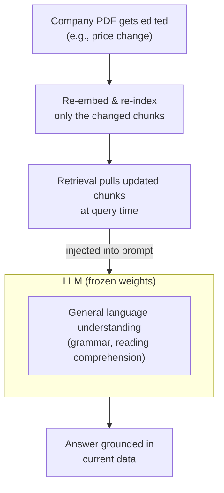

> [!info]+ Interview questions covered
> - Does a RAG system require fine-tuning or retraining the LLM when source documents change?
> - What is in-context learning, and how does it let RAG stay fresh without retraining?
> - What knowledge does the LLM actually contribute in a RAG pipeline, if not the company's data itself?
> - Can an off-the-shelf open-source LLM be used as-is in a RAG system?

### Scale Math, Step by Step

With the qualitative design settled, the next step is running through the actual numbers for the running example — 125,000 documents — to size the corpus, the chunk index, the vector store, and expected query traffic. The point isn't to memorize these numbers; it's to internalize the **method** for deriving them, since interviewers care about the reasoning, not the specific constants.

#### Step 1 — Corpus Size

```text
corpus docs          125,000
tokens/doc      4 pages x 700  =        2,800
corpus tokens   125,000 x 2,800 =  350,000,000
```

Each document is assumed to be about 4 pages, and each page holds roughly 700 tokens — a reasonable rule of thumb for dense text. Multiplying documents by tokens/doc gives **350 million tokens** across the entire corpus.

#### Step 2 — Chunking

```text
chunks
chunk size                           400 tokens
overlap                               50 tokens
stride          400 - 50       =         350
chunks/doc      (2,800-400)/350+1 =    7.86 -> 8
total chunks    125,000 x 8    =   1,000,000
```

With a 400-token chunk size and a 50-token overlap between consecutive chunks, the **stride** (how far the chunking window advances each step) is $400 - 50 = 350$ tokens. Given a 2,800-token document, the number of chunks per document works out to:

$$\text{chunks/doc} = \frac{2800 - 400}{350} + 1 \approx 7.86 \rightarrow 8$$

Rounding up to 8 chunks/doc and multiplying by 125,000 documents gives **1,000,000 total chunks** — the number used throughout the rest of the design (e.g., in the recall@K discussion above, "finding 5 chunks out of 1 million").

#### Step 3 — Vector Storage

```text
vectors
bytes/vector    768 dims x 4 B =     3,072 B (~3 KB)
raw vectors     1,000,000 x 3 KB =        3 GB
with HNSW index x 1.5 to 2     =  4.5 to 6 GB  (fits in RAM)
```

Each chunk is embedded into a 768-dimensional vector. At 4 bytes per dimension (standard float32), that's $768 \times 4 = 3{,}072$ bytes (~3 KB) per vector. Across 1,000,000 chunks, the raw vector data comes to **3 GB**. Adding an HNSW index (which stores extra graph-navigation structure on top of the raw vectors) multiplies that by roughly 1.5–2×, landing at **4.5–6 GB total** — comfortably small enough to fit entirely in RAM, which matters for keeping vector search latency low.

#### Step 4 — Query Traffic

```text
traffic (10,000-employee company)
queries/day     10,000 x 4     =      40,000
average rate    40,000 / 86,400 =   ~0.46 req/s
peak (3x rule)  0.46 x 3        =    ~1.4 req/s
```

Assuming this system serves a 10,000-employee company, and each employee asks roughly 4 questions/day, that's **40,000 queries/day**. Dividing by the number of seconds in a day ($86{,}400$) gives an **average rate of ~0.46 requests/second**. Real traffic isn't flat, though — it clusters around work hours. Applying the common **peak-load "3x rule"** (peak traffic is typically assumed to run at roughly 3× the average rate, as a capacity-planning rule of thumb) gives a **peak rate of ~1.4 requests/second** that the system needs to be provisioned to handle comfortably.

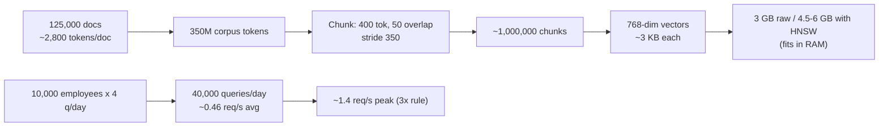

> [!info]+ Interview questions covered
> - How do you estimate the total token count and chunk count for a document corpus of a given size?
> - How is the "stride" of a chunking scheme related to chunk size and overlap, and how does it determine chunks-per-document?
> - How much storage does a vector index need, and why does an HNSW index add overhead on top of raw vector size?
> - How do you estimate average and peak query traffic for a RAG system serving a company of a given size?
> - What is the "3x rule" for peak load, and why is it used in capacity planning?


## Scale Math for Chunking: Chunk Size, Overlap, Stride, and HNSW Indexing

This section is a worked, step-by-step derivation of the "Scale Math" the tutor builds live in `notes.md`: starting from a raw document count, it derives corpus token count, chunk count, vector storage size, and the index needed to search that storage fast. The explicit goal is to build "muscle memory" for these calculations — the exact numbers don't matter as much as knowing *how* to compute them, since tracking token/storage/cost math is something every RAG team is expected to do.

Before diving in, one loose end from the requirements table is closed: if a source PDF is edited (e.g., a product's price changes), that update must be reflected in the retrieval system in **under 5 minutes** — this is the "freshness" requirement.

### Why Not Just Stuff the Whole Corpus into the Context Window?

Before justifying chunking and retrieval at all, the tutor sets up the counter-argument: what if you just paste the entire private corpus into a giant context window and skip retrieval entirely?

From the VS Code Markdown preview of `notes.md`:

```text
corpus size            125,000 docs x 2,800 tok = 350,000,000 tokens
big context             200,000 tokens
fit                     350,000,000 / 200,000 = 1,750x too large
cost if you could       350M tok x $3/M = $1,050 per question
cost via RAG            ~2,800 prompt tok x $3/M = $0.0084 per question
```

Two independent arguments fall out of this:

1. **It doesn't fit.** A generous 200,000-token context window is still **1,750x** too small for a 350-million-token corpus.
2. **Even if it fit, it would be absurdly expensive.** Paying to process 350M tokens per question comes out to **$1,050/question**, versus **~$0.0084/question** when only the retrieved chunks (~2,800 tokens) are sent to the LLM — roughly a **125,000x** cost difference.

This is the economic and architectural justification for chunking + retrieval instead of "just use a bigger context window."

> [!info]+ Interview questions covered
> - Why can't you just put an entire private document corpus into an LLM's context window instead of building a RAG pipeline?
> - How do you quantify the cost difference between full-context stuffing and retrieval-augmented generation for a large corpus?

### Step 1 — From Documents to Corpus Tokens

The running example: a company with **125,000 PDF documents**, each about **4 pages**, with **~700 tokens per page**.

```text
tokens/doc      4 pages x 700    =        2,800
corpus tokens   125,000 x 2,800  =  350,000,000
```

So the corpus totals **350,000,000 tokens**. Everything downstream — chunk count, vector count, index memory — is derived from this single number.

### Step 2 — Chunk Size, Overlap, and Stride

A document can't be embedded as a single 2,800-token blob (embedding models have their own input limits, and coarse chunks hurt retrieval precision), so it gets split into smaller pieces. Three parameters control this split:

- **Chunk size** — the maximum number of tokens per chunk. Here: **400 tokens**.
- **Overlap** — how many tokens are shared between one chunk and the next, so context isn't lost at a chunk boundary. Here: **50 tokens**.
- **Stride** — how far the chunking window actually slides forward each time. It's **not** the same as chunk size once overlap is introduced:

$$\text{stride} = \text{chunk size} - \text{overlap} = 400 - 50 = 350$$

The window only advances by 350 tokens per step — not the full 400 — precisely so that the last 50 tokens of the previous chunk remain intact as the first 50 tokens of overlap in the next chunk.

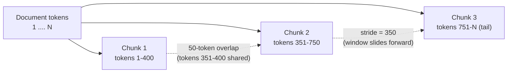

#### Why Overlap Exists: the "iPhone 16" Example

The motivating failure case for overlap: suppose a naive, non-overlapping split cuts a document exactly every 400 tokens. One chunk ends with "**...we were talking about the iPhone 16**" and the very next chunk begins with "**the screen size is 5 inches**" — with no mention of which product that refers to. A retrieval system that only ever sees the second chunk in isolation has no way to know it's about the iPhone 16; the reference was severed at the boundary.

Overlap fixes this by literally repeating the last 50 tokens of a chunk at the start of the next chunk, so a trailing reference like a product name is carried forward into the next chunk's embedding — the embedding for "the screen size is 5 inches" still has enough surrounding tokens ("iPhone 16") to reflect what it's actually about.

#### Worked Example: Splitting an 800-Token Document

Working through a small, concrete document (≈800 tokens) with the same 400/50/350 settings, live on a scratch file:

```text
1 2 3 .... 350 351.. 400... 700 .. 800

1 2 3 .... 350 351.. 400.
         351.. 400.   750
                   751 ....800
```

Cleaned up, this scratch notation describes three overlapping windows over the 800 tokens:

| Chunk | Token range | Length | Overlap with previous chunk |
|---|---|---|---|
| 1 | 1–400 | 400 tok | — (first chunk) |
| 2 | 351–750 | 400 tok | 50 tok (tokens 351–400 shared with Chunk 1) |
| 3 | 751–800 | 50 tok (tail remainder) | 0 tok — it's just the leftover tail of the document, not a full overlapping window |

Two important things fall out of live class Q&A on this example:

- **Chunk 2 does not start at token 401.** Because of the 50-token overlap, it starts 50 tokens *earlier*, at token 351 — that's the concrete meaning of "the window slides by stride, not by chunk size."
- **A naive split at every 400 tokens gives only 2 chunks** for an 800-token doc, but that's exactly the split that loses context (the iPhone 16 problem above). The 3-chunk overlapping version is what avoids it — even though it means slightly more chunks and some redundant tokens.

> [!info]+ Interview questions covered
> - What is chunk overlap, and what real failure mode does it prevent when splitting documents for embedding?
> - What is "stride" in sliding-window chunking, and how is it different from chunk size once overlap is introduced?
> - Given a chunk size and an overlap, how do you compute where the next chunk's window starts?

### Step 3 — Chunks per Document, and Total Corpus Chunks

Generalizing the worked example into a formula:

$$\text{chunks per doc} = \left\lceil \frac{\text{tokens per doc} - \text{chunk size}}{\text{stride}} \right\rceil + 1$$

Applied to the real 2,800-token document from Step 1:

```text
chunk size                                400 tokens
overlap                                    50 tokens
stride          400 - 50         =            350
chunks/doc      (2,800-400)/350+1 =    7.86 -> 8
total chunks    125,000 x 8       =    1,000,000
```

So each 2,800-token document becomes roughly **8 chunks** (7.86 rounded up), and across all 125,000 documents that's **1,000,000 chunks total** for the corpus — this is the number every downstream storage and retrieval-latency estimate in the system is built on.

#### Why Keep Overlap Small (50 Tokens, Not 100–200)?

Overlapping chunks necessarily introduces **redundancy** — the same 50 tokens get embedded twice, once at the tail of one chunk and once at the head of the next. This is an accepted cost, and the tutor deliberately keeps overlap small (50 tokens) rather than large (100–200 tokens) to control that redundancy. Widening the overlap increases context preservation but shrinks the stride, which increases the chunk count (and therefore embedding cost, storage, and index size) for the same document:

| Overlap (tokens) | Stride (400-tok chunks) | Chunks for a 2,800-tok doc | Redundancy | Effect on context preservation |
|---|---|---|---|---|
| 0 | 400 | 7 | None | Highest risk of severed context at every boundary |
| **50 (used here)** | **350** | **8** | Low (~12.5% of each chunk is repeated) | Enough to carry a trailing reference (e.g., a product name) across a boundary |
| 100 | 300 | 9 | Medium (~25%) | Stronger continuity, but more embeddings to store/search |
| 200 | 200 | 13 | High (~50%) | Diminishing returns — chunk count almost doubles for marginal context gain |

This is also why the system doesn't lean on a single retrieved chunk for an answer: redundancy from overlap, plus the inherent imprecision of retrieval, means the pipeline is designed to draw on **multiple** chunks per query — often 4, 5, 6, or even up to 50 — rather than trusting any one chunk in isolation.

A related limitation worth calling out explicitly: overlap only preserves context that already exists *within* the corpus. If a fact like "iPhone 16" genuinely isn't present anywhere in the source documents, no amount of chunking cleverness recovers it. This is one reason RAG (or agentic RAG) systems are never described as 100% foolproof — teams talk about 90–95% accuracy targets, not 100%, because the system is fundamentally trading off retrieval speed/cost against exhaustive accuracy (it deliberately avoids comparing a query letter-by-letter against the whole corpus).

> [!info]+ Interview questions covered
> - How do you compute the number of chunks a document produces, given its token count, chunk size, and stride?
> - What is the trade-off in choosing a larger vs. smaller chunk overlap?
> - Why does a RAG system rely on multiple retrieved chunks rather than a single "best" chunk?
> - Why is RAG never described as a 100%-accurate solution, even with well-tuned chunking and overlap?

### Step 4 — Vector Storage Size

Every chunk becomes an embedding vector before it's searchable. This example uses **768-dimensional** embeddings, with each dimension stored as a **32-bit (4-byte)** floating-point number:

```text
vectors
bytes/vector    768 dims x 4 B    =    3,072 B (~3 KB)
raw vectors     1,000,000 x 3 KB  =         3 GB
with HNSW index x 1.5 to 2        =  4.5 to 6 GB  (fits in RAM)
```

- One vector: $768 \times 4\text{ B} = 3{,}072\text{ B} \approx 3\text{ KB}$.
- One million chunks: $1{,}000{,}000 \times 3\text{ KB} = 3\text{ GB}$ of raw vector data.
- Adding the index structure itself (see Step 5) adds roughly **1–1.5x overhead** on top of the raw vectors, pushing the total to **4.5–6 GB**.

3 GB (or even 6 GB) is comfortably **loadable into memory** — it's nowhere near the 100 GB–1 TB range that would force a file-system-backed store. That distinction matters because **file-system storage has much worse (slower) access/query time than memory**; keeping the index in RAM is what keeps per-query latency low. With, say, 16 GB of RAM available on the serving machine, this entire indexed dataset fits in memory with room to spare.

> [!info]+ Interview questions covered
> - How do you estimate the memory footprint of a vector index from embedding dimensionality and chunk count?
> - Why is it preferable to keep a vector index in memory rather than on disk/file system, and when would you be forced onto disk instead?

### Step 5 — Why You Still Need an Index: HNSW

Storage size alone doesn't solve the speed problem. Even with all 1,000,000 vectors sitting comfortably in RAM, comparing a query against every single one of them on every request is exactly the "1 million chunks every time" bottleneck the tutor calls out — this is the brute-force scan problem, and it's the reason an index structure is needed at all.

**HNSW (Hierarchical Navigable Small World)** — referenced here as covered in more depth in a prerequisite blog post — solves this by **clustering** the vector space ahead of time. Instead of scanning the full corpus for every query, the index lets a search:

1. Land in the right neighborhood/cluster of the vector space first.
2. Only compare the query against the chunks *within* that reduced neighborhood — e.g., ~10,000 chunks instead of the full 1,000,000.

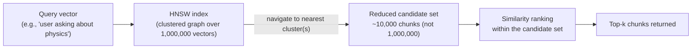

This is the concrete meaning of "indexing" in this context: it's not about avoiding storage, it's about avoiding an **exhaustive O(N) scan** on every query by pre-organizing the vectors so search only has to touch a small fraction of them (e.g., a topical cluster about "physics" rather than the whole corpus).

> [!info]+ Interview questions covered
> - What problem does HNSW indexing solve that raw vector storage alone does not?
> - At a high level, how does HNSW avoid scanning every vector in the corpus on each query?
> - What is the memory overhead of adding an HNSW index on top of raw embedding vectors?

### Putting It All Together: the Full Scale-Math Chain

The complete derivation, as it appears in the tutor's `notes.md`, chains every step above into one block:

```text
corpus docs             125,000
tokens/doc      4 pages x 700    =        2,800
corpus tokens   125,000 x 2,800  =  350,000,000

chunks
chunk size                                400 tokens
overlap                                    50 tokens
stride          400 - 50         =            350
chunks/doc      (2,800-400)/350+1 =    7.86 -> 8
total chunks    125,000 x 8       =    1,000,000

vectors
bytes/vector    768 dims x 4 B    =    3,072 B (~3 KB)
raw vectors     1,000,000 x 3 KB  =         3 GB
with HNSW index x 1.5 to 2        =  4.5 to 6 GB  (fits in RAM)
```

Each row depends on the one above it — this is exactly the "muscle memory" the tutor is trying to build: given any corpus size, chunking scheme, and embedding dimensionality, you should be able to derive token count → chunk count → storage size → whether it fits in memory, on your own, without memorizing any specific numbers.

> [!info]+ Interview questions covered
> - Walk through the full derivation from "number of documents" to "vector index memory footprint" for a RAG system — what are the intermediate quantities and how do they connect?


## Hybrid Retrieval Architecture: Vector Database, Re-Indexing Pipeline, and the RAG Orchestrator

With the corpus scoped and chunked, this section zooms out to the full system: how the index is built and kept fresh in the background, how a live user query is served with a strict latency budget, and why the two paths ("worlds") have to be designed very differently. This is where chunking, embeddings, and vector storage all get wired together into a working "chat with your documents" architecture.

### Capacity Recap: Corpus, Vector Store, and Traffic Sizing

Before moving to architecture, the tutor closes out the capacity-planning math that anchors every decision in this design:

| Quantity | Value | How it's derived |
|---|---|---|
| Documents in corpus | 125,000 | Given assumption |
| Tokens per document | ~2,800 | ~4 pages × ~700 tokens/page |
| Total corpus tokens | 350,000,000 | 125,000 × 2,800 |
| Chunk size / overlap | 400 tokens / 50 tokens | Design choice (effective stride = 350 tokens) |
| Chunks per document | ~8 | 2,800 ÷ 350 |
| Total chunks | ~1,000,000 | 125,000 × 8 |
| Embedding dimension | 768 | Design choice |
| Bytes per vector | 3,072 B (~3 KB) | 768 × 4 bytes (32-bit float) |
| Raw vector storage | ~3 GB | 1,000,000 × 3 KB |
| With HNSW index overhead | ~4.5–6 GB | Raw size × 1.5–2 |

The key takeaway: **~4.5–6 GB comfortably fits in RAM** on a normal server. That matters operationally — if the entire index (vectors + graph structure) lives in memory, a query never has to touch the file system, which is what keeps retrieval latency low at query time.

On top of storage, the tutor sizes expected **traffic** for an internal, enterprise-scale deployment (not a consumer product):

| Traffic quantity | Value | Derivation |
|---|---|---|
| Company size | 10,000 employees | Given assumption |
| Questions/employee/day (avg) | 4 | Some ask 0, some ask 10+; averages to 4 |
| Queries/day | 40,000 | 10,000 × 4 |
| Average request rate | ~0.46 req/s | 40,000 ÷ 86,400 seconds/day |
| Peak request rate (3× rule) | ~1.4 req/s | 0.46 × 3 |

At roughly one or two requests per second even at peak, this is nowhere near the scale of a consumer application serving hundreds or thousands of requests per second — traffic will not be the bottleneck for this system.

> [!info]+ Interview questions covered
> - How do you size the memory footprint of a vector index, and why does fitting it in RAM matter for query latency?
> - How do you estimate query traffic (avg and peak requests/sec) for an internal, enterprise-scale RAG system?
> - Why is an internal company RAG tool's traffic profile fundamentally different from a consumer-facing product's?

### Defining the Scope of This RAG Design

Before drawing the architecture, the tutor pins down exactly what is being designed — an explicit **scope** statement, which is itself a system-design best practice (state assumptions and boundaries before diving into components):

| In scope | Out of scope |
|---|---|
| Ingestion & chunking | Training or fine-tuning models |
| Embeddings | Agents with tools |
| Vector databases | Memory across sessions |
| Freshness (keeping the index in sync) | Images and audio in documents |
| Model & prompt choices | |
| Query path: hybrid search, reranking, context engineering, citations | |
| Permissions & safety | |
| Scaling & cost | |
| RAG evaluation & operations | |

Two "out of scope" items get a specific justification:

- **Agentic tool use** is intentionally excluded — not just for simplicity, but because removing tools can make a system *more secure* (a point the tutor flags to revisit later: fewer tool-invocation surfaces means fewer ways for a malicious or malformed input to trigger unintended actions).
- **Memory across sessions** is deferred to a dedicated future class on memory, so it's kept out of this design to avoid conflating retrieval-freshness (this system) with conversational memory (a different system).
- Image/audio generation (e.g., Midjourney-like or Suno-like systems) are separate system-design problems already covered elsewhere and aren't part of a document-QA RAG system.

> [!info]+ Interview questions covered
> - How would you scope a RAG system design interview — what do you explicitly rule in and out before designing components?
> - Why might excluding agentic tool access actually improve a system's security posture?

### Why Asking the Same Question Twice Doesn't Fix a Wrong Answer

A student question surfaces an important property of the system: if a user asks a question and gets a wrong (or missing) answer, **asking the exact same question again will not produce a different result.**

The reasoning chain:

1. The LLM is **stateless** — it has no memory of the previous call.
2. The same question produces the same query embedding.
3. The same query embedding retrieves the same chunks via similarity search.
4. Same chunks + same stateless LLM ⇒ same (wrong) answer.

The only way to actually fix the answer is to **fix the source**: edit or add to the underlying PDF/document, then **re-run embedding on the changed content** so the corrected information exists in the vector index. This is the first hint of the *freshness* requirement that motivates the entire re-indexing pipeline discussed below.

> [!info]+ Interview questions covered
> - If a RAG system gives a wrong answer, does asking the same question again help? Why or why not?
> - What is the only reliable way to fix a wrong/missing answer in a RAG system?

### High-Level Architecture: Two Independent Worlds

The tutor frames the whole system as **two independent worlds that run very differently**:

- **World 1 — the indexing pipeline.** Runs mostly in the background, continuously. No user is waiting on it, so it can afford to be slower and batch-oriented.
- **World 2 — the query path.** A real user is waiting for an answer right now. Every millisecond counts, so this path is optimized for low latency.

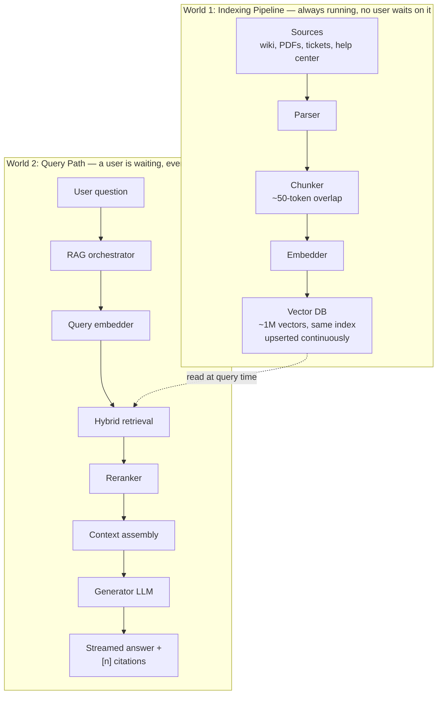

This split is the organizing principle for the rest of the design: **World 1 optimizes for correctness and freshness under no time pressure; World 2 optimizes for speed under a hard latency budget.** Everything downstream — whether to keep one database or two, how aggressively to batch embedding calls, how much reranking to apply — traces back to which "world" a piece of work lives in.

> [!info]+ Interview questions covered
> - How would you describe the high-level architecture of a production RAG system at a whiteboard level?
> - Why does it make sense to design the indexing pipeline and the query path as two separate, independently-optimized subsystems?

### World 1 — The Indexing Pipeline in Detail

#### Parsing and Chunking

Documents come from heterogeneous company sources — **wiki pages, PDFs, support tickets, help-center articles** — and are pulled through a **Parser** that converts each source into plain text (or structured blocks), regardless of original format. The parsed text is then run through the **Chunker**, which splits it using the chunk-size and overlap parameters established earlier (400-token chunks, ~50-token overlap), producing the ~1,000,000 chunks sized above.

#### Embedding and Vector Storage

All chunks are pushed through the **embedding model** to produce one 768-dimension vector per chunk — 1,000,000 chunks in, 1,000,000 vectors out — which land in the **Vector DB**.

A key operational point: this bulk indexing job **does not need to run in parallel or in real time.** Since no user is waiting on the initial corpus load, it can process chunks sequentially or in modest batches without hurting the product. Real-time behavior only becomes necessary later, when documents change.

#### Event-Driven Re-Indexing and Upsert

Once the initial index exists, the system has to stay in sync with a live, editable corpus. The design uses an **event-driven** model:

- Whenever a source document is **edited or deleted**, that event fires a targeted re-embedding job — only for the affected chunks, not the whole corpus.
- The result is written back into the *same* vector index using an **upsert**.

The tutor deliberately labels this operation "**upserted**" on the diagram rather than writing separate "update" and "insert" labels, because upsert is a single database command that does both:

- If the incoming chunk carries an **identifier that matches an existing record**, the database performs an **update** in place.
- If there's **no matching identifier**, the database treats it as a new record and performs an **insert**.

This single mechanism is how "freshness" (from the Scope table above) is actually implemented: edits flow through the same parse → chunk → embed pipeline, then upsert into the live index, so the next query against that index reflects the change — without a full corpus rebuild.

> [!info]+ Interview questions covered
> - What is an "upsert," and why is it the right database primitive for keeping a vector index synchronized with a changing source corpus?
> - How does a RAG indexing pipeline handle document edits and deletions without needing a full re-index of the whole corpus?
> - Why doesn't the initial bulk-embedding job need to run in real time or in parallel, while document updates do need an event-driven trigger?

### World 2 — The Query Path in Detail

When a user asks a question (the running example: *"What is the price of the iPhone 16?"*), the request hits a backend **RAG orchestrator**, which follows a fixed rule for what happens next.

#### Step 1 — Query Embedding: Why the Model Must Match Exactly

The orchestrator's first move is always the same: call the **query embedder** to convert the question into a vector. This raises a critical design constraint — **must the query embedding model be the exact same model (and dimension) used to embed the stored documents?**

The answer is yes, and the reasoning is illustrated with an analogy: imagine a "Chinese model" that has learned to organize concepts in its own particular way — say, it places all math-related content near coordinate `24`. If queries are embedded with a *different* model that organizes concepts differently, a math question might land near a completely different region of that second model's space. Comparing vectors from two different embedding spaces is meaningless — **similarity search only works if the query vector and the stored vectors live in the same geometric space**, which requires the identical model and identical output dimensionality at both index time and query time.

This is called out explicitly as a frequently-asked interview question.

> [!info]+ Interview questions covered
> - Can the embedding model used at query time differ from the one used to embed and index documents? Why or why not?
> - What breaks if you mix embeddings from two different models (or two different dimensionalities) in the same vector search?

#### Step 2 — Hybrid Retrieval

Once the orchestrator has the query vector, it moves to the **hybrid retrieval** stage: instead of relying on vector similarity alone, the system also runs a traditional **keyword search (BM25)** against a keyword index, and combines both signals before reranking.

```mermaid
flowchart LR
    QV["Query vector\n(from query embedder)"] --> VS["Vector DB search\n(semantic similarity)"]
    QT["Raw query text"] --> KW["Keyword index\n(BM25)"]
    VS --> MERGE["Hybrid retrieval\ncombine candidates"]
    KW --> MERGE
    MERGE --> RR["Reranker"]
    RR --> CA["Context assembly"]
    CA --> GEN["Generator LLM"]
```

Why bother with hybrid retrieval instead of pure vector search? Semantic (vector) search is great at matching *meaning* even when wording differs, but it can miss queries that hinge on exact terms — model numbers, product codes, acronyms, names — where a plain keyword match is actually more precise. Combining both retrieval signals and letting a **reranker** re-score the merged candidate set gets the precision benefits of both approaches before the final context is assembled and handed to the **Generator LLM**, which produces the streamed answer with `[n]`-style citations.

> [!info]+ Interview questions covered
> - What is hybrid retrieval, and why combine vector similarity search with a keyword index (BM25) instead of using vector search alone?
> - Where does the reranker sit in the retrieval flow, and what problem does it solve?

### Re-Indexing on Embedding Model Change

A related design question: **what has to happen if you decide to swap the embedding model** (e.g., to upgrade to a more accurate one)?

Because query-time and index-time embeddings must come from the identical model (see above), changing the embedding model invalidates the *entire* existing vector index — every stored vector was produced by the old model's coordinate space. The fix is to **re-run the full indexing pipeline** from scratch: parse → chunk → embed → store, for the entire corpus, using the new model.

For a corpus of this size (~1,000,000 chunks / hundreds of millions of tokens), the tutor estimates this **re-indexing pass takes roughly 8–10 minutes** end-to-end — not instantaneous, but well within the "background job, no user waiting" category established by World 1. This is explicitly called an introductory pass on the topic, with deeper treatment (e.g., blue/green index cutover strategies) left for later.

> [!info]+ Interview questions covered
> - If you change the embedding model in a RAG system, what process needs to be re-run, and why can't you just re-embed incrementally?
> - Roughly how long would a full re-index take for a million-chunk corpus, and why is that an acceptable cost?

### Choosing a Vector Database

The tutor closes the section by justifying *why* a dedicated vector database is kept at all, and which concrete options fit the design.

**Why keep a vector database instead of re-embedding on every query?** Re-computing embeddings for all 1,000,000 chunks on every incoming query would be prohibitively expensive and slow. A vector database exists precisely to avoid that: embed once (at index time), store the vectors, and only re-embed the (small) query at request time — then search the pre-built index.

**Specialized vs. traditional databases:** there are two broad categories of database to consider for vector storage:

| | Traditional database (+ vector extension) | Specialized vector database |
|---|---|---|
| Example | Postgres + `pgvector` | Qdrant, Pinecone, Weaviate |
| Built for vectors? | Retrofitted via extension | Purpose-built from the ground up |
| Recommendation | Not recommended for serious vector workloads | Preferred — better performance at scale |
| Cost | Often free/self-hosted | Free/open-source (Qdrant) or paid/managed (Pinecone) |

The tutor's explicit take: **a specialized vector database is always the better choice** for storing and searching embeddings, even though `pgvector` on Postgres technically supports vector similarity queries. For learning and for smaller production deployments, he recommends **Qdrant** (free, open-source) over **Pinecone** (a common paid alternative used by several companies he's advised, but not necessary just to learn the concepts). For the keyword-search half of hybrid retrieval, the natural library choices are **Elasticsearch** or **OpenSearch**.

**One database or two?** A secondary design choice is whether to run a single vector database (embedder writes directly into it) or two databases kept in sync — a primary plus a periodically-updated backup/safety copy. Either is workable; the single-database design is simpler, while the dual-database design trades operational complexity for resilience against index corruption or bad writes.

> [!info]+ Interview questions covered
> - Why keep a dedicated vector database at all, rather than computing embeddings on the fly for every query?
> - Would you recommend a traditional database with a vector extension (e.g., `pgvector`) or a purpose-built vector database (e.g., Qdrant, Pinecone) for a production RAG system, and why?
> - What library/tool choices would you propose for the vector-search and keyword-search halves of a hybrid retrieval system?
> - What's the trade-off between running a single vector database versus a primary + synced backup pair?


## Hybrid Retrieval: Parallel Search and the Limits of Pure Semantic Search

Up to this point the retrieval side of the RAG system has been built almost entirely around vector similarity: embed the query, embed the chunks, and find the nearest neighbors. This section introduces the second leg of the retrieval stool — **keyword search** — and shows why production RAG systems run it **in parallel** with vector search rather than relying on embeddings alone.

### Why Semantic Search Alone Isn't Enough

The embedding-based (semantic) search pipeline built up over the previous sections is powerful, but it is not infallible. There are cases where the vector database — the whole embedding-based system built out in this course — will simply **fail to retrieve the right chunk**, while a dumb, literal, word-by-word search would have succeeded.

This is the core motivation for hybrid retrieval: semantic similarity and lexical (exact-word) matching fail on *different* kinds of queries, so a system that only does one of them inherits that method's blind spots. Combining both lets each one compensate for the other's weaknesses.

| Retrieval method | What it matches on | Typical strength | Typical weakness |
|---|---|---|---|
| Vector / semantic search | Meaning captured in the embedding space (cosine similarity / distance) | Paraphrases, synonyms, conceptual matches | Rare/specific tokens (IDs, exact names, error codes) can get "smoothed over" and lost in the embedding |
| Keyword search (BM25) | Exact term overlap between query and document, weighted by term frequency | Precise, rare-word and exact-match queries | No understanding of meaning/paraphrase — misses synonyms and conceptually related text |

Because keyword search and vector search are strong in complementary places, the design decision is: **run both, in parallel, for every query**, and combine their outputs — this is the hybrid retrieval approach.

> [!info]+ Interview questions covered
> - Why isn't pure vector/embedding search sufficient for a production RAG retrieval pipeline?
> - What kinds of queries does keyword search handle better than semantic search, and vice versa?
> - What is "hybrid retrieval" in the context of a RAG system, and why is it needed?

### The Hybrid Retrieval Architecture

The RAG orchestrator, on receiving a user question, routes it into a **hybrid retrieval** stage. That stage fans the query out to two independent retrieval paths that run **in parallel** — not sequentially — specifically because the system is optimizing for latency: anything that can be parallelized should be, rather than paying the cost of two searches back to back.

- **Path 1 — Vector search**: the query is embedded by the query embedder and compared against the vector DB (the same index that is continuously upserted by the indexing pipeline: documents → chunker → embedder → vector DB, holding roughly 1M chunks / 3 GB in this example).
- **Path 2 — Keyword search**: the query is matched against a **keyword index (BM25)** built over the same corpus.

Each path independently returns its own ranked set of candidate chunks (e.g., 5 chunks from vector search and 5 chunks from keyword search). Those two candidate sets then get merged and handed to a **reranker**, which produces the final ordering before context assembly and generation.

```mermaid
flowchart TD
    subgraph IDX["Indexing pipeline (continuous, offline)"]
        DOC[Documents] --> CH[Chunker]
        CH --> EMB[Embedder]
        EMB --> VDB[("Vector DB<br/>1M chunks, 3 GB")]
    end

    UQ[User question] --> ORC[RAG orchestrator]
    ORC --> HR[Hybrid retrieval]

    HR --> QE[Query embedder]
    QE -->|vector similarity search| VDB
    VDB --> R5["top-5 chunks<br/>(by vector similarity)"]

    HR --> KI["Keyword index (BM25)"]
    KI -->|exact-term search over inverted index| B5["top-5 chunks<br/>(by BM25 score)"]

    R5 --> FUSE[Combine ranked lists]
    B5 --> FUSE
    FUSE --> RR["Reranker (LLM / cross-encoder / other model)"]
    RR --> CTX[Context assembly]
    CTX --> GEN[Generator LLM]
    GEN -->|streamed| OUT["Answer + [n] citations"]
```

Note the diagram has two independent lifecycles: the **indexing path** (left) runs continuously in the background, upserting into the *same* vector index whenever documents are added, updated, or deleted; the **query path** (right) runs once per user question and always reads against whatever the index currently looks like.

> [!info]+ Interview questions covered
> - Describe the end-to-end architecture of a hybrid retrieval system, including both the query path and the indexing path.
> - Why do the keyword search and vector search branches run in parallel instead of sequentially?

### Keyword Search: Inverted Index + BM25

Plain keyword search does not mean linearly scanning every document for matching words — that would not scale. Instead, like the vector database, the keyword search path is also **indexed ahead of time**: a **keyword index** (an inverted index) is built so that, conceptually, all words starting with "A" live together, all words starting with "B" live together, and so on. A query then only has to look up the relevant buckets of the index instead of scanning the entire corpus, which is why keyword search can stay fast even over large document sets.

On top of that inverted index, ranking is done with **BM25 ("Best Match 25")** — a term-weighting/ranking algorithm that has been in use for roughly two decades. BM25's core idea:

- It looks at **term frequency** — how many times a query word appears in a given document/chunk.
- Words that appear **rarely** across the corpus but **do** appear in a candidate document are treated as more informative/important, and push that document's score up.
- The result is a ranked list of chunks scored purely on exact lexical overlap, weighted by how distinctive/frequent each matched term is — with no notion of semantic meaning at all.

$$
\text{BM25 relevance} \propto \sum_{\text{query term } t} \text{IDF}(t) \cdot \frac{\text{TF}(t, \text{doc}) \cdot (k_1 + 1)}{\text{TF}(t, \text{doc}) + k_1 \cdot \left(1 - b + b \cdot \frac{|\text{doc}|}{\text{avgdoclen}}\right)}
$$

(The exact tuning constants aren't the point here — the takeaway is that BM25 ranks documents by weighted term frequency over an inverted index, which is exactly the "dumb," literal counterpart to embedding similarity.)

> [!info]+ Interview questions covered
> - What is an inverted index, and why does keyword search still need indexing instead of scanning the raw corpus?
> - What is BM25, and what signal does it use to rank documents?
> - How does BM25's ranking signal (term frequency) fundamentally differ from vector similarity?

### The Rank-Fusion Problem: You Can't Compare Apples to Apples

Running both searches in parallel creates two immediate complications that any hybrid retrieval implementation has to solve:

1. **Overlap.** If vector search returns 5 chunks and keyword search returns 5 chunks, the combined pool isn't guaranteed to be 10 distinct chunks — the same chunk (e.g., "chunk #4") can legitimately show up in both result sets.
2. **Incomparable scales.** Even when a chunk appears in both lists, its position/importance can disagree: keyword search might rank it near the bottom of its top-5, while vector search ranks it at the top. Worse, the two methods don't even report the same *kind* of number — vector search naturally produces a similarity/distance score, while BM25 produces its own ranking score on a completely different scale. You cannot directly compare a cosine-similarity number to a BM25 score and expect it to mean the same thing.

So before a final ranking can be produced, the system needs some way to put both ranked lists onto a **common, comparable basis** — effectively doing "some mathematics on top of" the two disparate outputs so that a chunk's position in one list can be reconciled with its position in the other. This reconciliation step (and the reranker that follows) is what lets the system get the best of both retrieval worlds without simply picking one arbitrarily.

> [!info]+ Interview questions covered
> - Why can't you directly compare a vector-search similarity score with a BM25 keyword-search score?
> - What problems does merging two parallel retrieval result sets introduce (overlap, differing rank scales), and why do they need to be resolved before generation?

### Introducing the Reranker

Once the two candidate sets exist, the architecture adds one more stage: the **reranker**. Its job is to take the combined/merged candidates from both retrieval paths and re-rank them to surface what is *actually* most relevant to the query — a second, more careful pass on top of two "cheap" first-pass retrieval methods.

A natural question is: which model is best suited to do this reranking — an LLM, or an embedding model? The embedding model has already been established as fallible (it's the same model whose limitations motivated adding keyword search in the first place), whereas an **LLM has enough understanding of language to re-judge relevance** given the user's question and a candidate chunk. So:

- An **LLM** can act as a reranker.
- **Cross-encoders** and other specialized, typically smaller models purpose-built for reranking are also common choices.

The exact mechanics of how reranking works (and the mathematics used to fuse the two ranked lists before it) are developed further in the next part of the lecture — this section establishes *why* a reranking stage is architecturally necessary once retrieval is hybrid.

> [!info]+ Interview questions covered
> - What is a reranker's role in a hybrid retrieval pipeline, and why is it needed even after combining two retrieval methods?
> - What kinds of models can serve as a reranker (LLM vs. cross-encoder vs. embedding model), and why is a plain embedding model a poor choice for this role?


## Hybrid Retrieval, Reranking, and Concrete Storage Choices: Qdrant, pgvector, Elasticsearch, OpenSearch

This section closes out the retrieval side of the architecture by clearing up a common point of confusion (positional embeddings vs. reranking), explaining *why* reranking is a separate, cheaper model stage rather than something the final LLM just does inline, and naming the concrete libraries/services used to implement the vector store and keyword index boxes drawn earlier in the diagram.

### Positional Embedding Is Not Reranking

A student asks whether positional embeddings play a role in reranking. The tutor draws a hard line between two things that sound similar because both involve "position" or "order," but live in completely different parts of the stack:

- **Positional embedding** is an internal mechanism *inside the LLM itself* (in the transformer's attention layers). It encodes the order of tokens in a sequence — e.g., distinguishing "he will come before is" from "he will come after is." Without it, a transformer would treat a sentence as an unordered bag of tokens, since self-attention has no inherent notion of sequence order.
- **Reranking** is a *retrieval-stage* operation. It takes a set of already-retrieved chunks (from vector search, keyword search, or both) and reorders them by relevance to the query. It has nothing to do with token order inside a sequence — it operates on whole chunks, not tokens.

The two concepts collide only in name, not in function: one is "where is this token in the sequence," the other is "how relevant is this whole chunk to the query."

> [!info]+ Interview questions covered
> - What is a positional embedding, and what problem does it solve inside a transformer?
> - How is "position" in positional embeddings different from "ranking/position" in a reranker?

### Why Reranking Is a Separate Stage: Cost-Optimized Two-Model Design

The tutor walks back through the retrieval flow to justify *why* reranking exists as its own step instead of just asking the final LLM to sort the chunks itself.

The flow, concretely:

1. **Vector DB search** returns some ranked chunks by embedding similarity — say 5 chunks.
2. **Keyword index (BM25) search** returns some ranked chunks by lexical/keyword match — say another 5 chunks.
3. Combined, these ~10 candidate chunks (deduplicated, since the two searches can overlap) are **reranked** by a dedicated reranker to produce a smaller, higher-precision final set — say 10 chunks narrowed from a larger candidate pool, or fewer, depending on tuning.
4. Only *that* final set goes into **context assembly** and then to the **generator LLM**.

A student asks the natural follow-up: since the generator LLM is itself capable of judging relevance, why not skip the separate reranker and just let the LLM do the reranking as part of context assembly? The tutor's answer is a cost/quality tradeoff, not a capability limitation:

- The **reranker can be an LLM or a dedicated (often smaller/cheaper) model** — reranking doesn't require frontier-model reasoning, just relative relevance scoring between the query and each candidate chunk.
- Because the reranker is cheap, it can be fed **hundreds of candidate chunks** at once and asked to return the best handful — an operation that would be expensive if done with the frontier model.
- The **frontier (expensive) model is reserved for the final answer generation only** — one job, done well, rather than being asked to both rerank *and* generate in the same call.
- Overloading a single LLM call with too many simultaneous tasks (rerank + synthesize + cite + hedge) tends to **degrade output quality** — the model has more to juggle in one go, which increases the chance of confusion or dropped instructions. Keeping each model narrowly scoped to fewer tasks per call is generally safer.
- Net effect: cheap model absorbs the expensive "search through many candidates" work; expensive model is only invoked once, on a small, pre-filtered context — minimizing both **cost** and **token count** per request.

```mermaid
flowchart TB
    subgraph Indexing["Indexing path (background, continuous)"]
        Chunker --> Embedder --> VDB[("Vector DB<br/>1M chunks, 3GB")]
    end

    subgraph Query["Query path (user is waiting)"]
        UQ[User question] --> RAGO[RAG orchestrator]
        RAGO --> HR[Hybrid retrieval]
        HR --> QE[Query embedder]
        HR --> KI[Keyword index BM25]
        HR --> VDB
        QE --> VDB
        KI --> RR[Reranker<br/>smaller/cheaper model]
        VDB --> RR
        RR --> CA[Context assembly<br/>prompt + citation instructions]
        CA --> GEN[Generator LLM<br/>frontier model]
        GEN -->|streamed answer + n citations| User
    end

    VDB -.same index, upserted continuously.-> Query
```

> [!info]+ Interview questions covered
> - Why use a separate reranker instead of letting the final LLM rerank the retrieved chunks itself?
> - Why is a smaller/cheaper model typically used for reranking while a frontier model is reserved for the final answer?
> - What happens to output quality when you overload a single LLM call with too many tasks at once?

### Context Assembly: Turning Ranked Chunks into a Prompt

Once the reranker hands off its narrowed set of chunks, **context assembly** is the step where the actual prompt gets constructed:

- All the surviving chunks are **clubbed together** into a single context block.
- The prompt explicitly instructs the LLM to **cite its sources** — i.e., point back to which chunk(s) backed each part of the answer.
- The prompt also instructs the LLM to **say "I don't know"** if the answer isn't actually present in the supplied context, rather than guessing or hallucinating.

This is the same "answer + citation" contract introduced earlier in the lecture, now shown as the concrete assembly step that makes it possible — the LLM never sees more than the reranked, clubbed chunks plus these instructions.

> [!info]+ Interview questions covered
> - What is "context assembly" in a RAG pipeline, and what does it actually construct?
> - What two instructions should a RAG system's prompt template always include, beyond the retrieved context itself?

### Concrete Tooling: Vector Databases and Keyword Indexes

Up to this point the architecture diagram used abstract boxes — "Vector DB," "Keyword index BM25." This slide grounds those boxes in real, commonly used technology choices:

| Component | Options named | What it is | When you'd pick it |
|---|---|---|---|
| **Vector database** | **Qdrant** | Purpose-built, standalone vector database/service designed specifically for approximate nearest-neighbor (ANN) search over embeddings. | You want a dedicated vector search engine with first-class ANN indexing, filtering, and scaling — and you're fine running/operating a separate service alongside your primary datastore. |
| **Vector database** | **pgvector** | A **Postgres extension** that adds vector column types and ANN/exact similarity search operators directly inside Postgres. | You already run Postgres for your relational data and want to avoid operating a second database system — trades some raw vector-search performance/scale for operational simplicity and being able to join vector search with regular relational queries. |
| **Keyword index** | **Elasticsearch** | Distributed search engine built on Lucene, implementing BM25-style keyword/full-text search (plus many other search features) at scale. | You need robust, scalable full-text search with rich querying, and are comfortable with (or already operate) the Elastic stack. |
| **Keyword index** | **OpenSearch** | A community-driven, open-source fork of Elasticsearch (post-license-change), API-compatible in large part with Elasticsearch's search functionality including BM25. | You want Elasticsearch-like keyword search functionality without the licensing terms tied to Elastic's current model — common in AWS-centric or fully open-source stacks. |

Both rows of "vector DB" options and both rows of "keyword index" options are functionally interchangeable at the architecture-diagram level — the hybrid retrieval stage doesn't care *which* concrete implementation sits behind the "Vector DB" or "Keyword index BM25" box, only that each box can (a) take the user's query (as an embedding, or as raw text/tokens) and (b) return a ranked list of candidate chunks quickly.

> [!info]+ Interview questions covered
> - Name concrete tools you could use to implement the vector database and keyword index components of a RAG system.
> - What's the tradeoff between using a dedicated vector database (e.g., Qdrant) versus a Postgres extension (e.g., pgvector)?
> - How does OpenSearch relate to Elasticsearch, and why might a team pick one over the other?

### The Full Picture: Indexing Path vs. Query Path

The final slide in this section relabels the diagram to make explicit that there are **two distinct "worlds"** running concurrently in a production RAG system:

- **World 1 — the indexing path** (top-right of the diagram): documents flow through **Chunker → Embedder → Vector DB**, continuously upserting into the *same* vector index that queries will later search. This runs in the background, independent of any single user request, whenever documents are added or updated.
- **World 2 — the query path**: a user submits a question, and from that moment **every millisecond counts** — this is the latency-sensitive request path: `User question → RAG orchestrator → Hybrid retrieval (query embedder + keyword index BM25 + vector DB) → Reranker → Context assembly → Generator LLM`, which finally **streams the answer back along with `[n]`-style citations**.

The key architectural point tying the two worlds together: the vector DB box is *shared* — it's the same index being written to by the indexing path and read from by the query path, which is why keeping ingestion "continuously upserted" (rather than batch-rebuilt) matters for freshness. A student's chat question at this point — how do you delete or refresh embeddings when the underlying source document changes — is flagged by the tutor as an important follow-up and picked up in the next part of the lecture on index maintenance/updates, rather than answered here.

> [!info]+ Interview questions covered
> - What are the two independent "paths" or "worlds" in a production RAG system's architecture, and how do they interact?
> - Why does latency matter disproportionately in the query path compared to the indexing path?
> - What does "same index, upserted continuously" imply about how a RAG system's vector DB should be operated?


## Outdated Embedding Deletion, High-Level RAG Architecture, and Scale Math

### The Two Worlds of a RAG System

Zooming back out from the individual pieces (chunking, embedding, hybrid retrieval, reranking), the whole system can be drawn as two loosely-coupled "worlds" that run on very different clocks:

- **World 1 — the indexing pipeline.** This is *always running* in the background. It watches for edits to source documents and keeps the vector database in sync.
- **World 2 — the query path.** This runs only when a user asks a question, and here **every millisecond counts** because a human is staring at a loading spinner.

```mermaid
flowchart TB
    subgraph W1["World 1: indexing pipeline — always running"]
        SRC["Sources: wiki, PDFs, tickets, help center"] -->|edit events| PARSER["Parser"]
        PARSER --> CHUNKER["Chunker"]
        CHUNKER --> EMBEDDER["Embedder"]
        EMBEDDER --> VDB1[("Vector DB\n1M chunks, 3 GB")]
    end

    subgraph W2["World 2: query path — a user is waiting, every ms counts"]
        Q["User question"] --> ORCH["RAG orchestrator"]
        ORCH --> HYB["Hybrid retrieval"]
        ORCH --> QE["Query embedder"]
        HYB --> RR["Reranker"]
        HYB --> BM25[("Keyword index BM25")]
        HYB --> VDB2[("Vector DB")]
        QE --> VDB2
        RR --> CTX["Context assembly"]
        CTX -->|"streamed answer + [n] citations"| Q
    end

    VDB1 -.->|"same index, upserted continuously"| VDB2
```

The key insight in this diagram is the dashed link at the bottom: **World 1 and World 2 share the same physical vector database.** World 1 continuously upserts into it; World 2 only ever reads from it (plus writes the occasional new chat turn). This separation is why the system can stay responsive on the query side even while large re-indexing jobs run in the background.

> [!info]+ Interview questions covered
> - How would you draw the end-to-end architecture of a production RAG system?
> - Why should the indexing pipeline and the query path be treated as separate "worlds" with different latency requirements?
> - How do the indexing pipeline and the query-time retrieval path share state?

### Handling Outdated Embeddings (Document Update/Delete Flow)

A recurring, very practical failure mode in RAG systems: a product manager edits or deletes a source document (say, a PDF) through some internal console. If nothing else happens, the vector database still holds the **old, now-outdated embeddings** for that document, and the system will keep retrieving stale content forever.

The fix relies on something already built into the indexing pipeline: **every chunk is mapped back to the document it came from.** When chunks are created, that chunk → document mapping is persisted (in the vector DB's own metadata, not a separate service), so at any point the system can ask "which chunks belong to this PDF?" and act on the answer.

Two practical points the tutor emphasized:

1. **Don't try to patch individual chunks.** If you edit a PDF, the token boundaries shift — the chunking stride recomputes differently — so trying to update only the "affected" chunk is unreliable. The simpler, safer approach is: **delete all chunks belonging to that document, then re-chunk and re-embed the whole document from scratch and reinsert.**
2. **This is a per-document operation, not a full corpus scan.** Even with 125,000 documents in the corpus, each document maps to only a small, fixed number of chunks (e.g., a 4-page PDF → 8 chunks). So a delete/update event only ever touches that document's handful of chunks — it never requires re-processing the other 124,999 documents.

Worked example from the lecture: a single PDF chunks into 8 pieces. When that PDF is edited:

```mermaid
sequenceDiagram
    participant PM as Product manager (console)
    participant Idx as Indexing pipeline
    participant VDB as Vector DB

    PM->>Idx: edit/delete PDF "foo.pdf"
    Idx->>VDB: DELETE WHERE payload.source == "foo.pdf"
    VDB-->>Idx: 8 old chunk embeddings removed
    Idx->>Idx: re-parse -> re-chunk -> re-embed "foo.pdf"
    Idx->>VDB: UPSERT new chunk embeddings (source = "foo.pdf")
```

> [!info]+ Interview questions covered
> - How do you delete or refresh outdated embeddings when a source document changes?
> - Why is "delete the document's chunks and re-embed" preferred over patching individual chunk embeddings after an edit?
> - Does updating one document in a 100k+ document corpus require re-indexing the whole corpus? Why not?

### Vector Database Payload / Metadata: The Key to Scoped Deletes

The chunk-to-document mapping above isn't a separate database — it lives in the **payload** (a.k.a. metadata) that every vector database stores alongside each embedding. For every chunk, the payload typically includes:

- The **source** of the document (e.g., file path or URL: `folder/something.pdf`)
- The **raw chunk text** itself (needed later for citations and context assembly — you don't want to have to re-fetch the original document to show the answer's source text)
- Any other identifying fields (document ID, page number, etc.)

Because the source path/ID is stored per-chunk, deletion becomes a simple filtered query:

```text
DELETE FROM vector_db WHERE payload.source == "folder/something.pdf"
```

This single filter is what makes "chunk-to-document scoping" tractable at scale — the system never needs to know *which specific chunks* changed; it only needs to know *which document* changed, and the payload does the rest.

> [!info]+ Interview questions covered
> - What information do you store in a vector database's payload/metadata besides the embedding itself?
> - How does payload metadata enable scoped (per-document) deletes in a vector index?

### Embedding Dimensionality: Why 768, and What a "Vector" Actually Is

A student asked a subtle but important clarifying question: does a chunk with more tokens produce a "bigger" vector? The answer is **no** — regardless of whether a chunk is a short paragraph or close to the full 400-token limit, the embedding model always outputs a **fixed-size vector**, in this case **768 dimensions**. The embedding model compresses however much text is in the chunk into exactly 768 floating-point numbers; dimensionality is a property of the model, not of the input length.

Each of those 768 numbers is stored as a **32-bit float**, i.e., **4 bytes per dimension**. That single fact is what drives the storage math in the next section.

> [!info]+ Interview questions covered
> - Does the size of an embedding vector change based on the length of the input chunk?
> - Why is embedding dimensionality (e.g., 768) a fixed property of the model rather than the input?
> - How many bytes does a single embedding vector take, and why?

### Scale Math, Step by Step

This is the full capacity-planning walk-through the tutor uses to justify the earlier "1M chunks, 3 GB" number seen on the architecture diagram, plus an estimate of expected query traffic.

```text
corpus docs                                       125,000
tokens/doc          4 pages x 700          =         2,800
corpus tokens       125,000 x 2,800        =   350,000,000

chunks
chunk size                                           400 tokens
overlap                                               50 tokens
stride              400 - 50              =           350
chunks/doc          (2,800-400)/350+1     =    7.86 -> 8
total chunks        125,000 x 8           =     1,000,000

vectors
bytes/vector        768 dims x 4 B        =    3,072 B (~3 KB)
raw vectors         1,000,000 x 3 KB      =        3 GB
with HNSW index     x 1.5 to 2            =  4.5 to 6 GB  (fits in RAM)

traffic (10,000-employee company)
queries/day         10,000 x 4            =       40,000
average rate        40,000 / 86,400       =    ~0.46 req/s
peak (3x rule)      0.46 x 3              =     ~1.4 req/s
```

Walking through the logic behind each block:

**1. Corpus size.** With 125,000 documents averaging 4 pages at ~700 tokens/page, the corpus totals:

$$
125{,}000 \times (4 \times 700) = 125{,}000 \times 2{,}800 = 350{,}000{,}000 \text{ tokens}
$$

**2. Chunking.** With a 400-token chunk size and a 50-token overlap, the stride (how far the window advances each step) is:

$$
\text{stride} = 400 - 50 = 350
$$

The number of chunks per document follows the standard sliding-window formula:

$$
\text{chunks/doc} = \left\lceil \frac{(\text{doc\_tokens} - \text{chunk\_size})}{\text{stride}} \right\rceil + 1 = \left\lceil \frac{2{,}800 - 400}{350} \right\rceil + 1 = \lceil 6.86 \rceil + 1 \approx 8
$$

So across the corpus:

$$
125{,}000 \times 8 = 1{,}000{,}000 \text{ total chunks}
$$

— this is exactly the "1M chunks" figure annotated on the Vector DB box in the architecture diagram.

**3. Vector storage size.** Each chunk becomes one 768-dimensional vector; each dimension is a 32-bit (4-byte) float:

$$
\text{bytes/vector} = 768 \times 4\text{ B} = 3{,}072 \text{ B} \approx 3\text{ KB}
$$

$$
\text{raw storage} = 1{,}000{,}000 \times 3\text{ KB} = 3\text{ GB}
$$

Vector databases don't just store raw vectors — they build an approximate-nearest-neighbor index (HNSW, discussed elsewhere in the course) on top, which typically adds **1.5–2×** overhead:

$$
3\text{ GB} \times 1.5 \text{ to } 2 = 4.5 \text{ to } 6\text{ GB}
$$

The tutor's takeaway: **this comfortably fits in RAM** on a single reasonably-sized machine — a useful sanity check for interview-style capacity planning, since it tells you this scale doesn't yet require distributed sharding.

**4. Query traffic estimation.** For a 10,000-employee company where each employee asks ~4 questions/day:

$$
\text{queries/day} = 10{,}000 \times 4 = 40{,}000
$$

Converting to an average request rate (86,400 seconds/day):

$$
\text{avg rate} = \frac{40{,}000}{86{,}400} \approx 0.46 \text{ req/s}
$$

Real traffic isn't uniform — it clusters around work hours — so a common back-of-envelope heuristic ("**3× rule**") estimates peak load as roughly 3× the average:

$$
\text{peak rate} = 0.46 \times 3 \approx 1.4 \text{ req/s}
$$

| Metric | Formula | Result |
|---|---|---|
| Corpus tokens | $125{,}000 \times 2{,}800$ | 350,000,000 |
| Chunks/doc | $\lceil(2800-400)/350\rceil+1$ | ≈ 8 |
| Total chunks | $125{,}000 \times 8$ | 1,000,000 |
| Bytes/vector | $768 \times 4\text{ B}$ | 3,072 B (~3 KB) |
| Raw vector storage | $1{,}000{,}000 \times 3\text{ KB}$ | 3 GB |
| Storage with HNSW | $3\text{ GB} \times 1.5\text{–}2$ | 4.5–6 GB |
| Avg query rate | $40{,}000 / 86{,}400$ | ~0.46 req/s |
| Peak query rate | $0.46 \times 3$ | ~1.4 req/s |

This is exactly the kind of "scale math, step by step" derivation interviewers expect in a systems-design round: don't just quote a number like "3 GB" — be able to walk backward from corpus size → chunking parameters → vector byte size → index overhead → RAM feasibility, and forward from headcount → queries/day → req/s → peak req/s.

> [!info]+ Interview questions covered
> - Given a corpus size and chunking parameters, how do you estimate the total number of chunks and vector storage size for a RAG system?
> - Why does an HNSW (or similar ANN) index add extra storage overhead beyond the raw vectors, and by how much roughly?
> - How do you estimate expected query throughput (average and peak) for a RAG system given a user base, and what is the "3x rule" for peak load?
> - How many bytes does a single 768-dimensional, float32 embedding vector occupy?

### Aside: Does the Reranker Run in Parallel with Retrieval?

A follow-up question asked whether reranker calls run in parallel with the BM25/vector-search calls. The answer: **the two retrieval legs (BM25 keyword search and vector/semantic search) run in parallel** with each other, since they're independent lookups against different indexes. The **reranker cannot run in parallel** with them, because it needs the *merged* candidate set from both legs as its input — it's a strictly sequential step that happens only after hybrid retrieval has combined its results.

Separately, on tooling: there's no "standard library" the tutor relies on for auto-chunking documents on edit — the chunking logic in this course was written manually rather than pulled from an off-the-shelf framework.

> [!info]+ Interview questions covered
> - In a hybrid retrieval pipeline, which stages can run in parallel and which must run sequentially?
> - Why can't the reranking step be parallelized with the initial BM25/vector retrieval calls?


## Hybrid Retrieval, Reranking, Context Assembly, and the RAG Orchestrator — Request Lifecycle End-to-End

This section zooms into the **query path** of the RAG system — the half of the architecture that runs the moment a real user is sitting there waiting for an answer. Every earlier section (parsing, chunking, embedding, upserting into the vector DB) is the **ingestion path**: it happens offline, asynchronously, whenever a document changes. The query path is different in kind, not just in code: it happens synchronously, in front of a human, and every millisecond you spend here is a millisecond the user is staring at a blank screen.

### System Architecture: Ingestion Path vs Query Path

The full picture has two halves that share one thing: the vector index.

- **Ingestion path** (async, no one waiting): edit events → Parser → Chunker → Embedder → Vector DB. In this lecture's running example the index holds about **1M chunks, 3 GB**.
- **Query path** — labeled on the slide as *"World 2: query path, a user is waiting, every ms counts"*: User question → RAG orchestrator, which fans out into **Hybrid retrieval** and the **Query embedder**. Hybrid retrieval itself fans out into a **Reranker**, a **Keyword index (BM25)**, and the **Vector DB**. The reranked result goes to **Context assembly**, which hands off to the **Generator LLM**, which streams back the answer with citations.

The vector DB is literally the same index in both halves — *"same index, upserted continuously"* — the ingestion path writes to it, the query path reads from it.

```mermaid
flowchart LR
    subgraph ING["Ingestion path (offline / async, nobody waiting)"]
        direction LR
        EE["Edit events"] --> PA["Parser"] --> CH["Chunker"] --> EM["Embedder"] --> VDB1[("Vector DB<br/>1M chunks, 3 GB")]
    end

    subgraph QRY["Query path — World 2: a user is waiting, every ms counts"]
        direction TB
        UQ["User question"] --> ORCH["RAG orchestrator"]
        ORCH --> HR["Hybrid retrieval"]
        ORCH --> QE["Query embedder"]
        HR --> RR["Reranker"]
        HR --> KI[("Keyword index<br/>BM25")]
        HR --> VDB2[("Vector DB")]
        QE --> VDB2
        RR --> CTX["Context assembly"]
        CTX --> GEN["Generator LLM"]
        GEN -->|"streamed answer + [n] citations"| UQ
    end

    VDB1 -. "same index, upserted continuously" .-> VDB2
```

The tutor is explicit about *why* this split matters: on the ingestion side you can afford to be slow and careful (parse a PDF properly, chunk it well, embed it, upsert it) because nobody's request is blocked on it. On the query side, every component you add is latency you're adding to a live user request, so every box in that diagram has to earn its place.

> [!info]+ Interview questions covered
> - How is a RAG system's architecture typically split, and why?
> - What is the difference between the ingestion (indexing) path and the query path in RAG?
> - Why does the vector DB sit at the intersection of both paths?

### Clearing Up a Common Misconception: What Goes Into the Query Embedder?

A student guessed that the query embedder receives *"the user prompt plus the source, the PDF."* The tutor corrects this immediately: **only the user's actual question text** goes into the query embedder — nothing about which document, which PDF, or which source it came from.

Concretely: if the user asks *"what is calculus?"*, that literal string — and only that string — is embedded. The embedding maps it to some position in vector space, illustrated on the slide with example coordinates like `(2.1, 4.1)`. That position happens to land near a cluster of math-related content in the index. Hybrid retrieval then searches the vector database for everything close to that position, combines it with whatever BM25 keyword search returns, and passes both result sets to the reranker.

This distinction matters because it clarifies the boundary of each component's job:

- **Query embedder** → turns *only* the user's query into a vector.
- **Hybrid retrieval** → uses that vector (plus the raw query text for BM25) to search the *already-embedded* document chunks sitting in the vector DB and keyword index — chunks that were embedded back on the ingestion path, long before this query ever arrived.

> [!info]+ Interview questions covered
> - What exactly is passed into the query embedder at inference time?
> - Why don't you pass the source document or document ID into the query embedder?
> - How does a query's embedding relate to the embeddings created during ingestion?

### Library and Tooling Choices for Hybrid Retrieval

Before tracing the full request lifecycle, the tutor names concrete, production-grade options for each retrieval component instead of leaving them abstract:

| Component | Concrete options | Notes |
|---|---|---|
| Vector database | **Qdrant** (dedicated open-source vector DB) or **pgvector** | pgvector is a Postgres extension — if you already run Postgres, you get a vector index "for free," and the tutor calls it a solid default worth exploring. |
| Keyword / BM25 index | **Elasticsearch** or **OpenSearch** | Both support BM25 scoring out of the box, which is what powers the keyword half of hybrid retrieval. |

A related, practical question came up: *is there a standard library for auto-chunking, or do you write it manually?* The tutor's answer: he wrote the chunking logic manually, and he doesn't think a dedicated library is warranted, because:

- **Extracting text from a PDF is the genuinely hard part** — that's where real engineering effort and existing PDF-parsing libraries earn their keep.
- **Chunking itself is only about 5–10 lines of code** once you have clean text — splitting by size/overlap/section boundaries doesn't need a heavyweight dependency.

> [!info]+ Interview questions covered
> - What are common production choices for a vector database in a RAG system?
> - What are common production choices for a keyword/BM25 index?
> - Do you need a dedicated library for document chunking? Why or why not?

### The Request Lifecycle: From Question to Cited Answer

This is the centerpiece of the section — the tutor traces one user request through every hop of the query path, insisting the class understand *why* each hop exists, not just *that* it exists: *"think about what if I remove this — what will happen, where will I have to pay extra, why is this added."*

```mermaid
sequenceDiagram
    participant B as Browser
    participant O as Orchestrator
    participant E as Embedder
    participant VB as Vector DB + BM25
    participant R as Reranker
    participant G as Generator LLM

    B->>O: "do guests need a paid seat?" (1-5 ms network)
    O->>O: rewrite with chat history (~1 ms, or one fast LLM call)
    O->>E: embed query (10-30 ms)
    O->>VB: vector + keyword search in parallel (1-10 ms each)
    VB->>O: top 50 candidates (after fusion)
    O->>R: rerank 50 pairs (30-100 ms)
    R->>O: top 6 chunks
    O->>G: prompt = rules + 6 sources + question (~2,800 tok)
    G-->>B: first token at 200-500 ms, then 50-150 tok/s
```

Walking through each hop and the *why* behind it:

#### 1. Query rewrite with chat history (multi-turn support)

The **very first thing the orchestrator does** — before anything touches the vector DB — is rewrite the incoming query using conversation history. Why is this the first line of code, and not embedding straight away?

Because of a functional requirement the tutor keeps circling back to: **multi-turn conversations need context carried forward.** Concrete example: a user previously asked about the iPhone, and now asks *"what is the size of the screen?"* If you embed that sentence in isolation, the embedding model has no idea *which* screen — it will retrieve chunks about TV screens, laptop screens, any product's screen size, because nothing in the raw text disambiguates it.

The fix is to rewrite the query so pronouns and ambiguous references are resolved using the chat history before embedding — e.g. replacing "the screen" with "the iPhone's screen," or replacing "he" with "Amit." This is fundamentally a **coreference resolution** problem, and the tutor is explicit about which model is best suited to it: an **LLM**. The rewrite step pulls prior turns from the thread/database, feeds them plus the new query to a (typically small, fast) LLM, and produces a self-contained, disambiguated query.

A side note the tutor adds: **AI coding agents don't always use RAG internally** — it depends on the task. If a task can be handled purely from local context (e.g. the code already open), the agent sends that directly to the model with no retrieval step. RAG is invoked only when extra context is genuinely needed — which, in his estimate, is true **about 99% of the time** in real systems.

> [!info]+ Interview questions covered
> - Why does a RAG orchestrator rewrite the query before embedding it?
> - How do you handle multi-turn conversations and pronoun/coreference ambiguity in RAG?
> - Which model is typically used to rewrite a query with chat history, and why?
> - Do all RAG-like systems (e.g. coding agents) always invoke retrieval?

#### 2. Embed the (rewritten) query

Once the query is self-contained, it's passed to the **embedder** to produce a vector — the same embedding model/space used during ingestion, so the query vector is comparable to the chunk vectors already in the index.

#### 3. Parallel vector search + keyword search

Vector search and BM25 keyword search run **in parallel**, not sequentially, and the tutor treats "why in parallel" and "why both" as two separate design questions worth drilling on:

- **Why both searches, not just one?** Because vector (semantic) search and keyword (lexical) search have complementary failure modes — sometimes semantic similarity finds the right chunk that shares no keywords with the query; sometimes exact keyword/terminology matching finds something semantic search misses. You want both signal sources.
- **Why not decide dynamically which one to use per query?** A student asked exactly this — could you skip running both every time and pick the "right" retrieval mode per query? The tutor's answer: deciding that would itself require a rule or model, and the only model good enough to make that judgment call is again an LLM — which means **paying for an extra LLM call just to save a cheap retrieval call.** Since vector search and BM25 are both fast and inexpensive, and they run independently, it's strictly simpler (and usually cheaper) to always run both in parallel than to add a decision step.
- **Why can they run in parallel at all?** Because they're independent — neither depends on the other's output, unlike the reranker, which needs results from *both* before it can do anything. (This directly answers an earlier student question in the transcript: reranking cannot be parallelized with retrieval, because it's a consumer of both retrieval results.)

#### 4. Fusion → top 50 candidates

Vector search and keyword search each independently return on the order of 50–60 candidates. Since they're two different ranking systems, their scores aren't directly comparable — you can't just concatenate and sort. **Fusion** creates an "apples-to-apples" comparison, merges the two result sets (handling overlaps where the same chunk shows up in both), and produces one common **top-50 candidate list**.

#### 5. Rerank → top 6 chunks

The fused top-50 goes through the **reranker**, which re-scores all 50 (as query–chunk pairs) using a model dedicated to relevance scoring, and narrows it down to the final **top 6 chunks**. This step matters because the initial retrieval ranking is often not the best ranking — a chunk that vector search ranked 50th (nearly discarded) can turn out to be genuinely important and get promoted into the top 6 purely because the reranker evaluates it more carefully than the coarse retrieval scoring did.

#### 6. Context assembly → Generator LLM

**Context assembly** packages everything the generator needs: the system rules, the 6 selected source chunks, and the user's question — in this example, roughly **~2,800 tokens** of prompt. That prompt goes to the **generator LLM**, which produces a first token, then streams subsequent tokens at roughly **50–150 tokens/second**.

> [!info]+ Interview questions covered
> - Walk through the full request lifecycle of a RAG query, from question to cited answer.
> - Why do vector search and keyword (BM25) search run in parallel instead of sequentially?
> - Why is fusion needed before reranking if you already have two ranked lists?
> - What does the reranker do that initial retrieval doesn't, and why can a low-ranked candidate end up in the final top-k?
> - What does context assembly actually construct before calling the generator LLM?

### Time-to-First-Token (TTFT) Latency Budget

Having walked the lifecycle qualitatively, the tutor then puts real numbers against each hop to show the *actual cost* of the retrieval pipeline versus the cost of the LLM call itself:

| Stage | Latency |
|---|---|
| Network + orchestrator | ~5 ms |
| Query embed | ~20 ms |
| Vector + BM25 search (parallel) | ~10 ms |
| Rerank 50 candidates | ~80 ms |
| LLM time to first token | ~200–500 ms |
| **Total time-to-first-token** | **~315–615 ms** |

From these numbers:

$$\text{retrieval share of TTFT} = \frac{115\text{ ms}}{615\text{ ms}} \approx 19\%$$

$$\text{retrieval share of a full } 6.6\text{s answer} = \frac{115\text{ ms}}{6{,}600\text{ ms}} \approx 1.7\%$$

The takeaway: retrieval (rewrite + embed + parallel search + rerank) adds roughly **115 ms** on top of the LLM's own 200–500 ms to first token. That's about a fifth of the time-to-first-token budget, but under 2% of the time it takes to stream a full answer — a small price for a dramatically better-grounded response.

He also flags that **most of these latency numbers are standard, vendor-committed figures** you don't need to memorize precisely (e.g. embedding providers commonly commit to 10–30 ms), except the couple of numbers he called out earlier in the course as genuinely important to remember.

> [!info]+ Interview questions covered
> - How do you estimate/budget time-to-first-token in a RAG system?
> - What fraction of total latency does the retrieval pipeline (rewrite, embed, search, rerank) typically add?
> - Which latency numbers in a RAG system are "standard vendor commitments" vs numbers you should actually design against?

### Design Decision: Use a Smaller Model for Reranking, Not the Frontier LLM

The tutor turns the pipeline into a design-review exercise by asking: *if reranking were removed, how many chunks would you have to feed the generator LLM?* Answer: **50, instead of 6.** That's the concrete cost of skipping reranking — either you burn far more input tokens per request, or you accept a much noisier, less relevant context window.

Given that cost, the follow-up design question is: should the reranking model itself be the same expensive frontier LLM, or something smaller/cheaper? The class's answer — which the tutor endorses — is a **smaller model** dedicated to reranking. Rerankers don't need general reasoning or generation ability; they need to score query–chunk relevance well and fast, so a lightweight, purpose-built reranker is the right trade-off, saving the expensive LLM tokens for the part of the pipeline that actually needs them (generation).

This "ask what breaks if I remove this step" habit is presented as a general design-review technique: for every box in the architecture diagram, ask what functional requirement it satisfies, what would go wrong without it, and whether there's a cheaper way to satisfy that requirement.

> [!info]+ Interview questions covered
> - Why would you use a smaller/cheaper model for reranking instead of the main generator LLM?
> - What breaks (concretely, in token cost) if you skip the reranking step in RAG?
> - What is a good general design-review habit for evaluating each component of a system architecture?

### Clarifying Terminology: What Is the "Orchestrator," Really?

A student asked whether "orchestrator" is just a fancy word for "the backend doing everything." The tutor confirms this directly: the **RAG orchestrator is a backend server** running ordinary application code that executes the pipeline steps in sequence — first calling the rewrite-with-chat-history logic, then the query embedder, then triggering vector and keyword search in parallel, then the reranker, then context assembly, then the generator LLM. Another student compared it to a switch-case dispatcher, which the tutor agreed is a reasonable mental model. He notes he almost avoided the word "orchestrator" altogether for this reason, but kept it because it's the term people actually ask about — the underlying reality is just: *"it is kind of managing a lot of things."*

He previews that more sophisticated orchestration patterns — **agentic RAG** and **graph RAG** — will be covered in later classes, positioning this section's orchestrator as the straightforward, linear baseline before those variations are introduced.

> [!info]+ Interview questions covered
> - What does "RAG orchestrator" mean concretely, in implementation terms?
> - How does a RAG orchestrator differ from more advanced patterns like agentic RAG or graph RAG?


## TTFT Latency Budget, Reranking Cost-Benefit, and Fixed-Size Chunking

### Why RAG Is Allowed to Be Slower Than a Plain LLM Chat

A direct chat with an LLM (no retrieval) doesn't need to worry much about accuracy — there's no external source of truth being checked, so the model just answers. A RAG system is different: once you're building something like a **customer support agent** or a **refund-status checker** ("can this be refunded or not?"), correctness matters far more than raw speed, because a wrong answer is a much worse outcome than a slightly slower one.

That's the lens for setting a time-to-first-token (TTFT) target:

- A bare LLM call already costs **200–500 ms** just to produce its first token — that floor exists "at any cost" the moment an LLM is in the picture.
- Since that baseline is already 200–500 ms, spending an *additional* 20–30% of it on retrieval work (embedding, search, reranking) is basically free in relative terms — an extra 30–100 ms is negligible next to the 200–500 ms you're paying anyway.
- Net result: **first token within ~1 second** is a comfortable target for a RAG system, and **2–3 seconds is still completely fine** when accuracy is the priority over raw speed.

The rest of this section derives exactly where that extra retrieval time goes, stage by stage, and shows it's a small price for a much more accurate answer.

> [!info]+ Interview questions covered
> - Why can a RAG system tolerate higher latency than a direct LLM chat, and how would you justify that to a stakeholder?
> - What TTFT budget would you set for a RAG-based customer support or refund-status agent, and why?

### Semantic Caching: Skipping the Pipeline Entirely

Before even touching retrieval latency, the cheapest optimization is avoiding the pipeline altogether when a question has effectively been asked before. **Semantic caching** stores the embedding of every question a user has asked, along with the answer that was generated for it.

- User A asks: *"What is the capital of France?"* → answer: *"Paris."* The question's embedding and the answer are both cached.
- User B later asks: *"Tell me the capital of France."* — different words, same meaning.
- Instead of calling the embedder-then-retriever-then-LLM pipeline again, the system embeds the new question and compares it against cached question-embeddings using **cosine similarity**.
- If the similarity is high enough — the tutor's threshold is **≥ 90%** (70–80% is *not* close enough to trust) — the cached answer is returned directly, with no LLM call and no retrieval at all.

This works because semantic caching compares **meaning**, not exact wording — two lexically different questions with the same underlying intent hit the same cache entry.

> [!info]+ Interview questions covered
> - What is semantic caching in a RAG system, and how is it different from an exact-match cache?
> - What similarity threshold would you use for semantic cache hits, and why not accept 70–80% similarity?

### Why Reranking Is Non-Negotiable

Retrieval (vector search, keyword search, or both) returns candidates ranked by a proxy signal — keyword overlap or embedding similarity — not by true relevance to the question. That proxy can fail badly. The tutor's example:

- Paragraph ranked **#1**: contains the word "iPhone" repeated a hundred times, and nothing else useful.
- Paragraph ranked **#100**: mentions, once, that *"iPhone screen size is 5 inches"* — the actual answer to a question about screen size.

A pure keyword or vector search over-weights the first paragraph because it's saturated with the query term, even though it never answers the question. If the system only reads the **top 5** results, it never sees the paragraph that actually contains the answer.

The fix: retrieve a wide net (e.g., **50 candidates**), then **rerank all 50** using a model that scores true relevance rather than surface keyword overlap, and only feed the **top few** (e.g., **6 chunks**) into the generator LLM. Feeding all 100 (or even 50) raw candidates into a frontier LLM is not an option — it costs far more in tokens and still buries the right answer among noise.

Reranker model choice is itself a latency/cost trade-off:

| Reranker choice | Approx. latency | Trade-off |
|---|---|---|
| Frontier LLM as reranker | ~200 ms | Same cost class as the frontier generator LLM — expensive for a "just re-sort 50 items" job |
| Smaller/dedicated reranker model | ~20 ms | An order of magnitude cheaper; purpose-built for scoring relevance, not open-ended generation |

Both are valid options depending on how much latency budget is available, but a smaller reranker is the default choice precisely because reranking is a narrow scoring task, not a generation task.

> [!info]+ Interview questions covered
> - Why is reranking necessary even after vector/keyword retrieval already returns "relevant" results?
> - Walk through a concrete failure mode where keyword-matched retrieval ranks the wrong chunk first.
> - What's the cost/latency trade-off between using a frontier LLM vs. a dedicated smaller model as a reranker?

### Aside: Is a Fixed-Logic Pipeline Still an "AI Agent"?

A student's question surfaces a useful definitional clarification: this RAG pipeline — embed, search, rerank, generate, in a fixed order — has no autonomous decision-making. Every step is hard-coded: *first do this, then this, then this.* Does that still count as an **AI agent**?

The tutor's definition: an AI agent is simply **a script (10–20 lines of orchestration code) that makes LLM calls, does some thinking/steps, and completes a task to produce a result.** It does *not* require the decision-making itself to be autonomous — you can fix the sequence of steps in code and it's still an agent, because the "agentic" part is that the pipeline invokes an LLM as a step toward completing a task, not that it improvises its own plan. RAG, MCP tool use, and other multi-step LLM workflows are all things an agent can implement; this fixed-order RAG pipeline is one specific (non-autonomous) instance of that broader pattern.

> [!info]+ Interview questions covered
> - What is the minimal definition of an "AI agent," and does a fixed-order pipeline qualify?
> - How does an agent with hard-coded steps differ from one that autonomously decides its own next action?

### The Request Lifecycle: Question to Cited Answer

Putting the pieces together, a single query flows through a fixed sequence of lanes — browser, orchestrator, embedder, the hybrid retrieval layer, the reranker, and finally the generator LLM:

```mermaid
sequenceDiagram
    participant Br as Browser
    participant O as Orchestrator
    participant E as Embedder
    participant VB as Vector DB + BM25
    participant Rr as Reranker
    participant G as Generator LLM

    Br->>O: Submit question (+ chat history)
    O->>E: Embed query text
    E-->>O: Query vector (~20 ms)
    par Vector search
        O->>VB: Vector similarity search
    and Keyword search
        O->>VB: BM25 keyword search
    end
    VB-->>O: ~50 candidate chunks (~10 ms, parallel)
    O->>Rr: Rerank 50 candidates
    Rr-->>O: Top-k reranked chunks (~80 ms)
    O->>G: Prompt = question + top chunks
    G-->>Br: First token streamed (~200-500 ms)
```

Library choices for the retrieval layer, as called out on the diagram itself:

- **Vector DB**: Qdrant, or pgvector (running inside Postgres rather than a separate service).
- **Keyword index**: Elasticsearch or OpenSearch.

### The Time-to-First-Token Budget, Line by Line

This is the number everyone should focus on — the concrete latency breakdown behind every hop in the diagram above:

| Stage | Latency | What's happening |
|---|---|---|
| Network + orchestrator overhead | ~5 ms | Fixed per-request hop cost |
| Query embedding | ~20 ms | Turn the user's question into a vector |
| Vector + BM25 search (parallel) | ~10 ms | Two branches run concurrently; one takes ~5 ms, the other ~10 ms — total is the slower branch, not the sum |
| Rerank 50 candidates | ~80 ms | Cross-encoder / small model re-scores candidates by true relevance |
| LLM time to first token | ~200–500 ms | Frontier LLM prefill — reads the full prompt before emitting token 1 |
| **Total TTFT** | **~315–615 ms** | Sum of every stage above |
| Retrieval share of TTFT | 115 / 615 ≈ **19%** | (5 + 20 + 10 + 80) ms ÷ total TTFT |
| Retrieval share of a full ~6.6 s answer | 115 / 6,600 ≈ **1.7%** | Same 115 ms, now measured against the complete generated answer |

Walking the arithmetic exactly as the tutor does: **network (5) + query embed (20) + parallel search (10) + rerank (80) = 115 ms** of pure retrieval overhead sitting in front of the LLM's own 200–500 ms. Add them together and the **total TTFT lands at 615 ms** in the worked example — meaning the user sees their first token roughly 615 ms after hitting send.

He calls the reranking line out specifically: at ~80 ms, it's "wise" to give reranking that much time, because it is nowhere close to the 10–20 seconds it would take if reranking were done carelessly (e.g., with an oversized model) — it's a small, deliberate cost for a large accuracy payoff.

> [!info]+ Interview questions covered
> - Break down a realistic time-to-first-token budget for a RAG system, stage by stage.
> - Why do vector search and BM25 search run in parallel rather than sequentially, and how does that change the total latency calculation?
> - How much of total TTFT should retrieval reasonably consume, and how do you justify that number?

### Accuracy vs. Latency: Retrieval's Share Is Small Either Way You Slice It

The 115 ms of retrieval overhead can be framed two different ways, and both support the same conclusion — that "wasting" this time on retrieval is a good trade:

- **Against TTFT alone**: 115 / 615 ≈ **19%** of the time-to-first-token is retrieval work (embedding + hybrid search + reranking). Roughly a fifth of the first-token wait is spent making sure the *right* chunks get to the LLM — a fair price for grounded, cited answers instead of a guess.
- **Against the full answer**: a complete response takes on the order of **6–7 seconds** once generation finishes streaming all its tokens. Against that total, the same 115 ms retrieval cost shrinks to **under 2%** of the entire interaction.

Either way, the conclusion is the same: it's completely acceptable to spend this retrieval time, because the alternative — skipping semantic search, hybrid retrieval, or reranking to save tens of milliseconds — risks feeding the LLM the wrong chunks and getting a confidently wrong (or ungrounded) answer instead. And this retrieval budget isn't fixed forever — it can be **increased further** in scenarios where accuracy matters even more than these numbers already assume (e.g., regulated domains, high-stakes customer-facing decisions).

> [!info]+ Interview questions covered
> - What percentage of TTFT is "acceptable" to spend on retrieval, and how do you justify that to someone optimizing purely for speed?
> - How does retrieval's latency share change when measured against TTFT alone vs. the full end-to-end answer time — and why does that distinction matter when defending a design choice?

### Fixed-Size Chunking: The Baseline Splitting Strategy

Stepping into the next stage of the pipeline — how documents get split into retrievable units in the first place — the simplest strategy is **fixed-size chunking**: cut every document into equal-length chunks (measured in tokens), with no regard for sentence or paragraph boundaries.

```text
fixed size, no overlap     |----400----|----400----|----400----|
                            cheap, cuts sentences at every boundary
```

This is cheap to implement and fast to run, but its weakness is right there in the diagram: a chunk boundary can land in the *middle* of a sentence or fact, splitting a single coherent idea across two separate chunks — and a retriever that pulls only one of those two chunks gets half the fact.

**Fixed-size chunking with overlap** fixes exactly that failure mode by letting consecutive chunks share a tail/head region instead of butting up against each other cleanly:

```text
fixed + overlap 50    |----400----|
                              |----400----|      stride 350
```

The key terms:

- **Chunk size**: the length of each chunk (400 tokens in this example).
- **Overlap**: how much of the *previous* chunk's content is repeated at the start of the *next* chunk (50 tokens here).
- **Stride**: how far the window advances between chunks — `stride = chunk_size − overlap` (400 − 50 = **350** tokens here).

Because each new chunk starts only 350 tokens after the last one (not a full 400 tokens after), any fact sitting near a chunk boundary now has a good chance of appearing **whole, inside at least one chunk** — either the tail of the earlier chunk or the head of the later one — instead of being severed across both.

The cost of overlap is duplicated storage and slightly more chunks per document (since chunks advance by the stride, not the full chunk size), but that's a small, predictable overhead in exchange for not silently losing facts at boundaries.

> [!info]+ Interview questions covered
> - What is fixed-size chunking, and what specific failure mode does adding overlap fix?
> - Define chunk size, overlap, and stride, and give the formula relating them.
> - Why would you accept the extra storage/compute cost of overlapping chunks in a production RAG pipeline?


## Time-to-First-Token Budgets, Reranking, and the RAG Data Ingestion Pipeline

This closing section pulls together the request-time and index-time halves of a RAG system into two artifacts the tutor keeps on screen: a **sequence diagram** of a single query's journey through the retrieval stack, and a **time-to-first-token (TTFT) latency budget** that shows exactly where those milliseconds go. It then rewinds to the **data ingestion pipeline** — parsing, chunking, embedding — that builds the index those queries search against.

### The RAG System, Component by Component

The architecture diagram lays the pieces out as a single left-to-right pipeline:

```mermaid
flowchart LR
    Browser --> Orchestrator
    Orchestrator --> Embedder
    Embedder --> VectorDB["Vector DB + BM25"]
    VectorDB --> Reranker
    Reranker --> LLM["Generator LLM"]
    LLM --> Browser
```

- **Orchestrator** — the RAG-specific glue code that receives the user's question, calls the embedder, fans out to retrieval, calls the reranker, assembles the prompt, and streams the LLM's response back to the browser.
- **Embedder** — turns the incoming query into the same vector space used to index the corpus.
- **Vector DB + BM25** — a hybrid retrieval layer combining dense (vector/semantic) search with sparse (keyword/BM25) search, run in parallel.
- **Reranker** — a cross-encoder-style model that re-scores the fused candidate set for relevance before anything reaches the LLM.
- **Generator LLM** — produces the final answer conditioned on the reranked context.

### Request Flow: What Happens Inside One Query

The sequence diagram spells out the same six participants as message-passing steps, each annotated with its own latency:

```mermaid
sequenceDiagram
    participant Browser
    participant Orchestrator
    participant Embedder
    participant VectorDB as Vector DB + BM25
    participant Reranker
    participant LLM as Generator LLM

    Browser->>Orchestrator: user query
    Orchestrator->>Embedder: embed query
    Embedder->>VectorDB: query vector
    Note over VectorDB: vector + keyword search in parallel, 1-10 ms each
    VectorDB->>Orchestrator: top 50 candidates (after fusion)
    Orchestrator->>Reranker: rerank 50 pairs, 30-100 ms
    Reranker->>Orchestrator: top 6 chunks
    Orchestrator->>LLM: prompt = rules + 6 sources + question (~2,800 tok)
    LLM->>Browser: first token at 200-500 ms, then stream 50-150 tok/s
```

Key checkpoints along this path:

- **Hybrid search runs in parallel, not in series** — vector search and BM25 search both fire off the same query vector/text and return in 1–10 ms each, so the wall-clock cost is the max of the two, not the sum.
- **Fusion happens before reranking** — the two candidate lists (dense + sparse) are merged into a single ranked list (e.g. via RRF-style fusion) capped at roughly the top 50 candidates.
- **Reranking is the expensive retrieval step** — scoring 50 (query, candidate) pairs with a cross-encoder costs 30–100 ms, an order of magnitude more than the search step itself, because it runs a real model forward pass per pair instead of an approximate nearest-neighbor lookup.
- **Only the top 6 chunks survive** into the prompt — reranking's whole job is to compress 50 loosely-relevant candidates down to a small, high-precision context window.
- **The final prompt is a fixed template**: system rules + the 6 retrieved sources + the user's question, sized here at roughly 2,800 tokens.
- **Generation is streamed**: the LLM emits its first token somewhere in the 200–500 ms range, then continues at 50–150 tokens/second — this is where the *bulk* of end-to-end latency actually lives.

> [!info]+ Interview questions covered
> - Walk me through the end-to-end request flow of a RAG query, component by component.
> - What is hybrid search, and how are vector and keyword search combined ("fusion")?
> - Why does a RAG pipeline rerank candidates instead of sending all retrieved chunks straight to the LLM?
> - Why is reranking slower than the initial vector/BM25 search step?

### Time-to-First-Token (TTFT) Budget

The tutor's notes lay out a concrete latency budget for the retrieval side of a RAG answer:

```text
time-to-first-token budget
network + orchestrator        ~5 ms
query embed                   ~20 ms
vector + BM25 search (parallel) ~10 ms
rerank 50 candidates           ~80 ms
LLM time to first token        ~200 to 500 ms
total                          ~315 to 615 ms
retrieval share of TTFT        115 / 615 = ~19%
retrieval share of a full 6.6 s answer   115 / 6,600 = ~1.7%
```

Read as a table:

| Stage | Latency |
|---|---|
| Network + orchestrator overhead | ~5 ms |
| Query embedding | ~20 ms |
| Vector + BM25 search (run in parallel) | ~10 ms |
| Reranking 50 candidates | ~80 ms |
| LLM time-to-first-token | ~200–500 ms |
| **Total TTFT** | **~315–615 ms** |
| Retrieval's share of TTFT | 115 ms / 615 ms ≈ **19%** |
| Retrieval's share of a full 6.6 s answer | 115 ms / 6,600 ms ≈ **1.7%** |

The takeaway the diagram is built to make obvious: **retrieval (embed + search + rerank ≈ 115 ms) is a small, bounded cost compared to LLM decoding.** Even the single most expensive retrieval step — reranking at ~80 ms — is dwarfed by the LLM's own time-to-first-token (200–500 ms) and by the total time to stream a full answer (~6.6 s). This has direct design implications:

- Latency-optimization effort in a RAG system should usually target **prompt size and LLM decoding speed** first, since that's where most of the wall-clock time is spent, not the retrieval stack.
- Still, within the retrieval budget itself, **reranking dominates** — if a product needs a tighter TTFT, trimming the reranker's candidate count (e.g. 50 → 20) or swapping to a lighter cross-encoder is the highest-leverage lever.
- Running vector and BM25 search in **parallel** rather than sequentially is what keeps the hybrid-search step cheap (~10 ms instead of ~20 ms) — a small but easy architectural win.

> [!info]+ Interview questions covered
> - What is time-to-first-token (TTFT) in the context of a RAG system, and how do you budget it across pipeline stages?
> - Is retrieval or generation the dominant cost in RAG latency, and how would you prove that with numbers?
> - Given a fixed latency budget, which retrieval stage would you optimize first, and why?

### The Data Ingestion Pipeline (Indexing Side)

Zooming out from a single query to how the index gets built in the first place, the ingestion pipeline is a five-stage flow with a feedback loop for keeping the index fresh:

```mermaid
flowchart LR
    A["Raw sources<br/>(HTML, PDF, markdown)"] -->|parse| B["Parse to clean text<br/>(text + metadata)"]
    B -->|chunk| C["Chunk<br/>(~1M chunks)"]
    C -->|embed| D["Embed<br/>(~1M vectors)"]
    D --> E["Vector DB + BM25 index"]
    E -.->|created / edited / deleted events| A
```

The dashed feedback edge is the operational detail that's easy to miss: production RAG systems aren't indexed once — they need to react to **create/edit/delete events** on the source documents and re-run the affected documents back through parse → chunk → embed → upsert, rather than rebuilding the whole index from scratch.

#### Document Parsing

Before anything can be chunked or embedded, raw sources have to be converted into clean text plus metadata. The tutor lists three library options, matched to the kind of document:

| Tool | Best for |
|---|---|
| `pypdf` | Simple, text-based PDFs |
| `unstructured` | Mixed formats (PDF, HTML, Word, etc. in one pipeline) |
| Tesseract (OCR) | Scanned or image-based content |

The reason OCR earns its own row: a PDF-parsing tool that reads a document as text will silently fail on a page that's actually a **scanned image** (for example, a page containing a screenshot of code) — there's no text layer to extract. Optical character recognition is required to recover text from image-based pages, and this is exactly the kind of parsing edge case that causes downstream retrieval quality to quietly degrade if it isn't handled.

> [!info]+ Interview questions covered
> - What are the stages of a RAG ingestion pipeline, from raw source to searchable index?
> - How do you keep a vector index in sync with a document store that has ongoing creates/edits/deletes?
> - What parsing tool would you pick for scanned PDFs versus simple text PDFs versus mixed-format documents, and why?

#### Chunking: Why Split At All

Once text is clean, it still can't be embedded and indexed as whole documents — it has to be chunked. The notes give three reasons:

- **Retrieval precision** — a whole document embedding blurs together many unrelated topics; a chunk-level embedding lets the index return the specific passage that answers the query.
- **Prompt budget** — the generator LLM's context window is finite; retrieval has to return small, targeted units rather than entire documents.
- **Embedding quality** — embedding models produce more faithful representations for short, topically-coherent spans than for long, heterogeneous documents.

#### Chunking Strategies

The simplest strategy shown is **fixed-size chunking with no overlap**:

```text
fixed size, no overlap    |----400----|----400----|----400----|
                    cheap, cuts sentences at every boundary
```

This splits the document into equal-sized windows (400 tokens/characters in the example) with no shared content between adjacent chunks. It's the cheapest strategy to implement, but the tradeoff is explicit in the caption: it **cuts sentences at arbitrary boundaries**, which can split a single idea across two chunks and hurt retrieval precision for anything that straddles a boundary. The notes begin a second strategy — **fixed size with overlap** (the visible fragment reads `fixed + overlap 50…`) — which addresses this by letting adjacent chunks share a small window (e.g. 50 tokens) so a sentence or fact near a boundary is fully captured in at least one chunk, at the cost of some redundant storage and embedding compute.

> [!info]+ Interview questions covered
> - Why do you need to chunk documents before embedding them for RAG, instead of embedding whole documents?
> - What is fixed-size chunking, and what's the tradeoff of chunking with no overlap versus with overlap?

### Recap Sketch: UI, Backend, LLM, and Document Chunks

A simple whiteboard sketch closes out the visual material for the lecture: three boxes — **UI**, **Backend**, **LLM** — represent the overall system split, and a fourth box shows a **PDF** document being broken into pages/chunks (`p1`, `p2`, `p3`).

```mermaid
flowchart LR
    UI --> Backend
    Backend --> LLM
    PDF["PDF document"] --> P1[p1]
    PDF --> P2[p2]
    PDF --> P3[p3]
    P1 --> Backend
    P2 --> Backend
    P3 --> Backend
```

It's a deliberately minimal recap: the **UI** is where the user asks a question, the **Backend** is the orchestrator-plus-retrieval stack covered above, and the **LLM** is the generator — while the PDF-to-`p1/p2/p3` split is a visual shorthand for the chunking step that turns one document into the retrievable units the backend's index actually stores.

### Putting It All Together

Across the full lecture, a production RAG system takes shape in a consistent order: start from **functional requirements** (what documents, what queries, what latency/accuracy targets), design **chunking** to balance retrieval precision against prompt budget, pick **embeddings** that suit the domain and query type, choose a **vector database** (plus a hybrid BM25 index) that can scale to the corpus size, add **hybrid retrieval with fusion** so semantic and keyword search cover each other's blind spots, insert a **reranker** to compress noisy candidates into a small high-precision context, feed that into **generation** with a tightly templated prompt, and finally validate the whole thing against a **latency budget** — where, as this section's numbers show, retrieval is a small, controllable slice (under 20% of TTFT, under 2% of a full streamed answer) next to the cost of the LLM itself. That ordering — requirements → chunking → embeddings → vector DB → hybrid retrieval → reranking → generation → latency budget — is the mental checklist for designing a "chat with your documents" RAG system end to end.


---

## Timeline

| Time | Section |
| ---- | ------- |
| `0:03` – `13:36` | [Private Document Corpus, Citations, Chunking, System Design Structure, Retrieval-Augmented Generation Rag](#private-document-corpus-citations-chunking-system-design-structure-retrieval-augmented-generation-rag) |
| `13:36` – `17:23` | [Approximate Nearest Neighbor Ann Search, Embedding Dimensions, Nomic-Embed-Text, Vector Search Bottleneck, On-Device Embeddings](#approximate-nearest-neighbor-ann-search-embedding-dimensions-nomic-embed-text-vector-search-bottleneck-on-device-embeddings) |
| `17:23` – `21:11` | [Retrieval Pipeline, Top-K Chunk Retrieval, Reranking, Stateless Llm, Answer Plus Citation](#retrieval-pipeline-top-k-chunk-retrieval-reranking-stateless-llm-answer-plus-citation) |
| `21:11` – `24:32` | [Why Plain Llms Fail, Llm Hallucination, Rag Pipeline Stages, Private Document Corpus, Llm Training Data Limitations](#why-plain-llms-fail-llm-hallucination-rag-pipeline-stages-private-document-corpus-llm-training-data-limitations) |
| `24:32` – `27:41` | [Embedding Models, Vector Similarity, 768-Dimensional Embedding Space, Chunking, Distance Metric](#embedding-models-vector-similarity-768-dimensional-embedding-space-chunking-distance-metric) |
| `27:41` – `30:47` | [Fine-Tuning Vs Rag, Prompt Construction, Grounded Answer, Top-K Chunk Selection, Unlearningdata Deletion](#fine-tuning-vs-rag-prompt-construction-grounded-answer-top-k-chunk-selection-unlearningdata-deletion) |
| `30:47` – `36:40` | [Citationprovenance, Per-User Permissions, Fixed Vs Dynamic Datasets, Context Window Limitations, Fine-Tuning On Internet-Scale Data](#citationprovenance-per-user-permissions-fixed-vs-dynamic-datasets-context-window-limitations-fine-tuning-on-internet-scale-data) |
| `36:40` – `40:35` | [Time To First Token Ttft, Functional Requirements For Rag, Citations To Source Chunks, Multi-Turn Context Inheritance, Document Permissions](#time-to-first-token-ttft-functional-requirements-for-rag-citations-to-source-chunks-multi-turn-context-inheritance-document-permissions) |
| `40:35` – `46:35` | [Retrieval-Augmented Generation Rag, In-Context Learning, Rag System Scale, Recall@K, Embedding Model Selection](#retrieval-augmented-generation-rag-in-context-learning-rag-system-scale-recallk-embedding-model-selection) |
| `46:35` – `58:08` | [Chunk Overlap, Stride, Chunking, Hnsw Indexing, Token Overlap](#chunk-overlap-stride-chunking-hnsw-indexing-token-overlap) |
| `58:08` – `1:12:01` | [Hybrid Retrieval, Vector Database, Re-Indexing Pipeline, Rag Orchestrator, Vector Database Sizing](#hybrid-retrieval-vector-database-re-indexing-pipeline-rag-orchestrator-vector-database-sizing) |
| `1:12:01` – `1:18:00` | [Hybrid Retrieval, Parallel Search, Semantic Search Limitations, Keyword Search Bm25, Keyword Search  Inverted Index](#hybrid-retrieval-parallel-search-semantic-search-limitations-keyword-search-bm25-keyword-search-inverted-index) |
| `1:18:00` – `1:21:47` | [Hybrid Retrieval, Reranker, Positional Embedding, Vector Database Qdrant Pgvector, Keyword Index Elasticsearch Opensearch](#hybrid-retrieval-reranker-positional-embedding-vector-database-qdrant-pgvector-keyword-index-elasticsearch-opensearch) |
| `1:21:47` – `1:26:45` | [Outdated Embedding Deletion, Embedding Dimensionality 768, High-Level Rag Architecture, Chunk-To-Document Scoping, Query Traffic Estimation](#outdated-embedding-deletion-embedding-dimensionality-768-high-level-rag-architecture-chunk-to-document-scoping-query-traffic-estimation) |
| `1:26:45` – `1:39:03` | [Hybrid Retrieval, Context Assembly, Rag Orchestrator, Reranker, Generator Llm](#hybrid-retrieval-context-assembly-rag-orchestrator-reranker-generator-llm) |
| `1:39:03` – `1:52:30` | [Time-To-First-Token Ttft Budget, Fixed-Size Chunking, Accuracy Vs Latency Tradeoff In Rag, Retrieval Share Of Full Answer Time ~17%, Chunk Overlap And Stride](#time-to-first-token-ttft-budget-fixed-size-chunking-accuracy-vs-latency-tradeoff-in-rag-retrieval-share-of-full-answer-time-17-chunk-overlap-and-stride) |
| `1:52:30` – `2:02:58` | [Time To First Token Ttft, Reranking, Rag Data Ingestion Pipeline, Document Parsing, Vector Database](#time-to-first-token-ttft-reranking-rag-data-ingestion-pipeline-document-parsing-vector-database) |

## Interview Questions Covered

Total: 231 questions across 17 sections.

### Private Document Corpus, Citations, Chunking, System Design Structure, Retrieval-Augmented Generation Rag

- Why are LLMs considered stateless? Give a concrete example.
- Why can't an LLM "remember" a specific user by updating its own weights?
- Where does conversational/user memory actually live in an LLM-based product?
- What do the three letters in RAG stand for? Explain each step.
- Why do LLMs have a knowledge cutoff, and how does RAG address it?
- What is the difference between RAG and MCP? Are they alternatives?
- Why can't you just feed an entire document (or corpus) into the LLM's context on every query?
- Why is chunking necessary before retrieval, and what new problem does it introduce?
- What is the intuition behind placing chunks in an n-dimensional embedding space?
- How would you structure a RAG/LLM system design interview answer end to end?
- What are the major phases of designing a production RAG system?
- How do you scope the "requirements" phase of a RAG system design interview?
- What are the two non-negotiable requirements implied by "private document corpus with citations"?
- How do you estimate the token/chunk scale of a large document corpus given only document count and average length?
- What's a quick rule of thumb for converting pages to tokens, and tokens to words?

### Approximate Nearest Neighbor Ann Search, Embedding Dimensions, Nomic-Embed-Text, Vector Search Bottleneck, On-Device Embeddings

- Why does searching a large vector index with brute-force/linear scan become a bottleneck as the number of chunks grows?
- What problem does Approximate Nearest Neighbor (ANN) search solve, and why is exact nearest-neighbor search avoided at scale?
- What is embedding dimensionality, and why is `nomic-embed-text`'s 768-dim size relevant for on-device use cases?
- What is the fundamental trade-off between embedding dimension size and system cost/accuracy?
- How do you decide which embedding model to use in a RAG system — do you always pick the highest-dimension/most accurate one?
- Why might the "best" embedding model on public benchmarks not be the best choice for a specific product domain?
- How do you frame the choice between accuracy gains and infrastructure cost as a business trade-off?
- Can you describe the end-to-end request flow of a RAG "chat with your documents" system, from user query to cited answer?
- Where does ANN search fit into the overall RAG request pipeline?

### Retrieval Pipeline, Top-K Chunk Retrieval, Reranking, Stateless Llm, Answer Plus Citation

- Walk me through the end-to-end request flow for a RAG chat product.
- Which component in a RAG system does the most computational/engineering work, and why?
- How do you decide how many chunks (top-k) to retrieve and pass to the LLM in a RAG system?
- What factors influence the choice of top-k in a retrieval pipeline?
- What is reranking, and where does it fit relative to initial chunk retrieval? (introduced here, detailed later)
- Why is retrieval quality more important than LLM quality in most RAG failures?
- What does it mean for an LLM to be "stateless," and how does that motivate the existence of a retrieval pipeline?
- In a RAG system, what are the actual "sources of truth" for an answer?
- What two things must a RAG system return for every query, and why does that shape the retrieval pipeline's design?
- What metadata does a retrieval pipeline need to preserve to make citations possible later?
- Are embedding models and LLMs the same underlying model? Why or why not?
- What tradeoffs do you consider when picking an embedding model's dimensionality for a RAG system?
- Why might a company that offers a strong LLM not expose its own embedding model?

### Why Plain Llms Fail, Llm Hallucination, Rag Pipeline Stages, Private Document Corpus, Llm Training Data Limitations

- Why can't you just ask a general-purpose LLM questions about your company's private documents?
- What does it mean that an LLM's weights are "frozen," and why can't you fine-tune away this problem?
- What is LLM hallucination, and why does it happen even when the model has no relevant information?
- Why is fine-tuning impractical as a way to keep an LLM up to date with frequently changing private data?
- What are the stages of a RAG pipeline, from a user's question to a grounded answer?
- How does RAG address each of the three reasons a plain LLM fails on private data?
- Why does the question need to be embedded before it can be compared against the document corpus?
- What role does the prompt structure (rules + sources + question) play in reducing hallucination?

### Embedding Models, Vector Similarity, 768-Dimensional Embedding Space, Chunking, Distance Metric

- Why can't you compare two pieces of text directly to check similarity?
- Why does a RAG system need to convert text into numbers before retrieval?
- What is an embedding model and what does it output?
- Do text, image, and video need the same embedding model?
- Can an embedding model take an entire document/PDF as input, not just a word?
- What does "embedding space" mean, and why does dimensionality (e.g. 768) matter?
- Why must the question be embedded using the same model as the corpus chunks?
- Why do embeddings of similar chunks cluster together in the embedding space?
- How is "relevance" between a query and a document chunk actually computed once both are embedded?
- What is a distance metric, and how does it relate to semantic similarity in vector search?

### Fine-Tuning Vs Rag, Prompt Construction, Grounded Answer, Top-K Chunk Selection, Unlearningdata Deletion

- Walk through the full RAG pipeline from a user's question to a grounded answer.
- How is the final prompt constructed in a RAG system? What goes into it besides the retrieved chunks?
- What does it mean for an LLM's answer to be "grounded"?
- Why is RAG generally preferred over fine-tuning for grounding an LLM in private/enterprise documents?
- Compare fine-tuning and RAG on: latency to add new knowledge, deleting/unlearning data, citation/traceability, per-user access control, and cost.
- What happens to answer correctness if new or changed documents can't be reflected in the model in real time?
- Why can't you reliably make a fine-tuned LLM "forget" a specific document or fact once it has been deleted?
- What is the "unlearning" problem in the context of fine-tuned LLMs, and how does RAG avoid it?

### Citationprovenance, Per-User Permissions, Fixed Vs Dynamic Datasets, Context Window Limitations, Fine-Tuning On Internet-Scale Data

- Why can't a fine-tuned LLM reliably "unlearn" or delete a specific fact, and how does RAG handle deletion instead?
- What does it mean that an LLM has "multiple trees" to reach an answer, and why does that make unlearning unreliable?
- Why can't a fine-tuned LLM cite the source of a fact it produces, while a RAG system can?
- How does per-chunk metadata enable citation/provenance in a RAG pipeline?
- Why is per-user access control difficult with a single fine-tuned LLM, and how does RAG support it naturally?
- Where in the RAG pipeline would you enforce per-user document permissions?
- How does the cost of updating knowledge compare between fine-tuning and RAG?
- When would you choose fine-tuning (or no RAG at all) over building a RAG pipeline?
- What's the deciding factor between using RAG and periodically fine-tuning a model on your own data?
- Why can't you simply paste an entire large document corpus into an LLM's context window instead of using retrieval?
- How do you estimate whether a corpus fits inside a given context window, and what's the cost impact of trying to brute-force it anyway?
- How does RAG's cost-per-query compare to feeding the full corpus into context on every request?

### Time To First Token Ttft, Functional Requirements For Rag, Citations To Source Chunks, Multi-Turn Context Inheritance, Document Permissions

- What are the core functional requirements you'd state for a RAG-based chat-with-your-documents system?
- How do you support multi-turn conversations in a RAG pipeline, where follow-up questions omit the subject?
- Why does citing source chunks matter for a RAG system, and how is it different from a fine-tuned model's "black box" answers?
- Why must a RAG system explicitly support saying "I don't know," and what happens if it doesn't?
- How do document permissions get enforced in a retrieval pipeline that serves multiple users?
- What SLA would you set for reflecting document edits vs. deletions, and why should deletions be stricter?
- What is time to first token (TTFT), and why is it never zero even for a well-optimized RAG system?
- How would you set and justify latency SLAs (TTFT, full-answer time) for a RAG-based chat product?
- How do retrieval latency and LLM prefill latency combine to produce the overall time-to-first-word budget?

### Retrieval-Augmented Generation Rag, In-Context Learning, Rag System Scale, Recall@K, Embedding Model Selection

- What is recall@K, and how is it calculated for a RAG system?
- Why isn't the correct chunk always ranked first in retrieval results?
- What's the tradeoff involved in increasing K (the number of retrieved chunks)?
- Why does embedding model selection matter for retrieval quality?
- Does a RAG system require fine-tuning or retraining the LLM when source documents change?
- What is in-context learning, and how does it let RAG stay fresh without retraining?
- What knowledge does the LLM actually contribute in a RAG pipeline, if not the company's data itself?
- Can an off-the-shelf open-source LLM be used as-is in a RAG system?
- How do you estimate the total token count and chunk count for a document corpus of a given size?
- How is the "stride" of a chunking scheme related to chunk size and overlap, and how does it determine chunks-per-document?
- How much storage does a vector index need, and why does an HNSW index add overhead on top of raw vector size?
- How do you estimate average and peak query traffic for a RAG system serving a company of a given size?
- What is the "3x rule" for peak load, and why is it used in capacity planning?

### Chunk Overlap, Stride, Chunking, Hnsw Indexing, Token Overlap

- Why can't you just put an entire private document corpus into an LLM's context window instead of building a RAG pipeline?
- How do you quantify the cost difference between full-context stuffing and retrieval-augmented generation for a large corpus?
- What is chunk overlap, and what real failure mode does it prevent when splitting documents for embedding?
- What is "stride" in sliding-window chunking, and how is it different from chunk size once overlap is introduced?
- Given a chunk size and an overlap, how do you compute where the next chunk's window starts?
- How do you compute the number of chunks a document produces, given its token count, chunk size, and stride?
- What is the trade-off in choosing a larger vs. smaller chunk overlap?
- Why does a RAG system rely on multiple retrieved chunks rather than a single "best" chunk?
- Why is RAG never described as a 100%-accurate solution, even with well-tuned chunking and overlap?
- How do you estimate the memory footprint of a vector index from embedding dimensionality and chunk count?
- Why is it preferable to keep a vector index in memory rather than on disk/file system, and when would you be forced onto disk instead?
- What problem does HNSW indexing solve that raw vector storage alone does not?
- At a high level, how does HNSW avoid scanning every vector in the corpus on each query?
- What is the memory overhead of adding an HNSW index on top of raw embedding vectors?
- Walk through the full derivation from "number of documents" to "vector index memory footprint" for a RAG system — what are the intermediate quantities and how do they connect?

### Hybrid Retrieval, Vector Database, Re-Indexing Pipeline, Rag Orchestrator, Vector Database Sizing

- How do you size the memory footprint of a vector index, and why does fitting it in RAM matter for query latency?
- How do you estimate query traffic (avg and peak requests/sec) for an internal, enterprise-scale RAG system?
- Why is an internal company RAG tool's traffic profile fundamentally different from a consumer-facing product's?
- How would you scope a RAG system design interview — what do you explicitly rule in and out before designing components?
- Why might excluding agentic tool access actually improve a system's security posture?
- If a RAG system gives a wrong answer, does asking the same question again help? Why or why not?
- What is the only reliable way to fix a wrong/missing answer in a RAG system?
- How would you describe the high-level architecture of a production RAG system at a whiteboard level?
- Why does it make sense to design the indexing pipeline and the query path as two separate, independently-optimized subsystems?
- What is an "upsert," and why is it the right database primitive for keeping a vector index synchronized with a changing source corpus?
- How does a RAG indexing pipeline handle document edits and deletions without needing a full re-index of the whole corpus?
- Why doesn't the initial bulk-embedding job need to run in real time or in parallel, while document updates do need an event-driven trigger?
- Can the embedding model used at query time differ from the one used to embed and index documents? Why or why not?
- What breaks if you mix embeddings from two different models (or two different dimensionalities) in the same vector search?
- What is hybrid retrieval, and why combine vector similarity search with a keyword index (BM25) instead of using vector search alone?
- Where does the reranker sit in the retrieval flow, and what problem does it solve?
- If you change the embedding model in a RAG system, what process needs to be re-run, and why can't you just re-embed incrementally?
- Roughly how long would a full re-index take for a million-chunk corpus, and why is that an acceptable cost?
- Why keep a dedicated vector database at all, rather than computing embeddings on the fly for every query?
- Would you recommend a traditional database with a vector extension (e.g., `pgvector`) or a purpose-built vector database (e.g., Qdrant, Pinecone) for a production RAG system, and why?
- What library/tool choices would you propose for the vector-search and keyword-search halves of a hybrid retrieval system?
- What's the trade-off between running a single vector database versus a primary + synced backup pair?

### Hybrid Retrieval, Parallel Search, Semantic Search Limitations, Keyword Search Bm25, Keyword Search  Inverted Index

- Why isn't pure vector/embedding search sufficient for a production RAG retrieval pipeline?
- What kinds of queries does keyword search handle better than semantic search, and vice versa?
- What is "hybrid retrieval" in the context of a RAG system, and why is it needed?
- Describe the end-to-end architecture of a hybrid retrieval system, including both the query path and the indexing path.
- Why do the keyword search and vector search branches run in parallel instead of sequentially?
- What is an inverted index, and why does keyword search still need indexing instead of scanning the raw corpus?
- What is BM25, and what signal does it use to rank documents?
- How does BM25's ranking signal (term frequency) fundamentally differ from vector similarity?
- Why can't you directly compare a vector-search similarity score with a BM25 keyword-search score?
- What problems does merging two parallel retrieval result sets introduce (overlap, differing rank scales), and why do they need to be resolved before generation?
- What is a reranker's role in a hybrid retrieval pipeline, and why is it needed even after combining two retrieval methods?
- What kinds of models can serve as a reranker (LLM vs. cross-encoder vs. embedding model), and why is a plain embedding model a poor choice for this role?

### Hybrid Retrieval, Reranker, Positional Embedding, Vector Database Qdrant Pgvector, Keyword Index Elasticsearch Opensearch

- What is a positional embedding, and what problem does it solve inside a transformer?
- How is "position" in positional embeddings different from "ranking/position" in a reranker?
- Why use a separate reranker instead of letting the final LLM rerank the retrieved chunks itself?
- Why is a smaller/cheaper model typically used for reranking while a frontier model is reserved for the final answer?
- What happens to output quality when you overload a single LLM call with too many tasks at once?
- What is "context assembly" in a RAG pipeline, and what does it actually construct?
- What two instructions should a RAG system's prompt template always include, beyond the retrieved context itself?
- Name concrete tools you could use to implement the vector database and keyword index components of a RAG system.
- What's the tradeoff between using a dedicated vector database (e.g., Qdrant) versus a Postgres extension (e.g., pgvector)?
- How does OpenSearch relate to Elasticsearch, and why might a team pick one over the other?
- What are the two independent "paths" or "worlds" in a production RAG system's architecture, and how do they interact?
- Why does latency matter disproportionately in the query path compared to the indexing path?
- What does "same index, upserted continuously" imply about how a RAG system's vector DB should be operated?

### Outdated Embedding Deletion, Embedding Dimensionality 768, High-Level Rag Architecture, Chunk-To-Document Scoping, Query Traffic Estimation

- How would you draw the end-to-end architecture of a production RAG system?
- Why should the indexing pipeline and the query path be treated as separate "worlds" with different latency requirements?
- How do the indexing pipeline and the query-time retrieval path share state?
- How do you delete or refresh outdated embeddings when a source document changes?
- Why is "delete the document's chunks and re-embed" preferred over patching individual chunk embeddings after an edit?
- Does updating one document in a 100k+ document corpus require re-indexing the whole corpus? Why not?
- What information do you store in a vector database's payload/metadata besides the embedding itself?
- How does payload metadata enable scoped (per-document) deletes in a vector index?
- Does the size of an embedding vector change based on the length of the input chunk?
- Why is embedding dimensionality (e.g., 768) a fixed property of the model rather than the input?
- How many bytes does a single embedding vector take, and why?
- Given a corpus size and chunking parameters, how do you estimate the total number of chunks and vector storage size for a RAG system?
- Why does an HNSW (or similar ANN) index add extra storage overhead beyond the raw vectors, and by how much roughly?
- How do you estimate expected query throughput (average and peak) for a RAG system given a user base, and what is the "3x rule" for peak load?
- How many bytes does a single 768-dimensional, float32 embedding vector occupy?
- In a hybrid retrieval pipeline, which stages can run in parallel and which must run sequentially?
- Why can't the reranking step be parallelized with the initial BM25/vector retrieval calls?

### Hybrid Retrieval, Context Assembly, Rag Orchestrator, Reranker, Generator Llm

- How is a RAG system's architecture typically split, and why?
- What is the difference between the ingestion (indexing) path and the query path in RAG?
- Why does the vector DB sit at the intersection of both paths?
- What exactly is passed into the query embedder at inference time?
- Why don't you pass the source document or document ID into the query embedder?
- How does a query's embedding relate to the embeddings created during ingestion?
- What are common production choices for a vector database in a RAG system?
- What are common production choices for a keyword/BM25 index?
- Do you need a dedicated library for document chunking? Why or why not?
- Why does a RAG orchestrator rewrite the query before embedding it?
- How do you handle multi-turn conversations and pronoun/coreference ambiguity in RAG?
- Which model is typically used to rewrite a query with chat history, and why?
- Do all RAG-like systems (e.g. coding agents) always invoke retrieval?
- Walk through the full request lifecycle of a RAG query, from question to cited answer.
- Why do vector search and keyword (BM25) search run in parallel instead of sequentially?
- Why is fusion needed before reranking if you already have two ranked lists?
- What does the reranker do that initial retrieval doesn't, and why can a low-ranked candidate end up in the final top-k?
- What does context assembly actually construct before calling the generator LLM?
- How do you estimate/budget time-to-first-token in a RAG system?
- What fraction of total latency does the retrieval pipeline (rewrite, embed, search, rerank) typically add?
- Which latency numbers in a RAG system are "standard vendor commitments" vs numbers you should actually design against?
- Why would you use a smaller/cheaper model for reranking instead of the main generator LLM?
- What breaks (concretely, in token cost) if you skip the reranking step in RAG?
- What is a good general design-review habit for evaluating each component of a system architecture?
- What does "RAG orchestrator" mean concretely, in implementation terms?
- How does a RAG orchestrator differ from more advanced patterns like agentic RAG or graph RAG?

### Time-To-First-Token Ttft Budget, Fixed-Size Chunking, Accuracy Vs Latency Tradeoff In Rag, Retrieval Share Of Full Answer Time ~17%, Chunk Overlap And Stride

- Why can a RAG system tolerate higher latency than a direct LLM chat, and how would you justify that to a stakeholder?
- What TTFT budget would you set for a RAG-based customer support or refund-status agent, and why?
- What is semantic caching in a RAG system, and how is it different from an exact-match cache?
- What similarity threshold would you use for semantic cache hits, and why not accept 70–80% similarity?
- Why is reranking necessary even after vector/keyword retrieval already returns "relevant" results?
- Walk through a concrete failure mode where keyword-matched retrieval ranks the wrong chunk first.
- What's the cost/latency trade-off between using a frontier LLM vs. a dedicated smaller model as a reranker?
- What is the minimal definition of an "AI agent," and does a fixed-order pipeline qualify?
- How does an agent with hard-coded steps differ from one that autonomously decides its own next action?
- Break down a realistic time-to-first-token budget for a RAG system, stage by stage.
- Why do vector search and BM25 search run in parallel rather than sequentially, and how does that change the total latency calculation?
- How much of total TTFT should retrieval reasonably consume, and how do you justify that number?
- What percentage of TTFT is "acceptable" to spend on retrieval, and how do you justify that to someone optimizing purely for speed?
- How does retrieval's latency share change when measured against TTFT alone vs. the full end-to-end answer time — and why does that distinction matter when defending a design choice?
- What is fixed-size chunking, and what specific failure mode does adding overlap fix?
- Define chunk size, overlap, and stride, and give the formula relating them.
- Why would you accept the extra storage/compute cost of overlapping chunks in a production RAG pipeline?

### Time To First Token Ttft, Reranking, Rag Data Ingestion Pipeline, Document Parsing, Vector Database

- Walk me through the end-to-end request flow of a RAG query, component by component.
- What is hybrid search, and how are vector and keyword search combined ("fusion")?
- Why does a RAG pipeline rerank candidates instead of sending all retrieved chunks straight to the LLM?
- Why is reranking slower than the initial vector/BM25 search step?
- What is time-to-first-token (TTFT) in the context of a RAG system, and how do you budget it across pipeline stages?
- Is retrieval or generation the dominant cost in RAG latency, and how would you prove that with numbers?
- Given a fixed latency budget, which retrieval stage would you optimize first, and why?
- What are the stages of a RAG ingestion pipeline, from raw source to searchable index?
- How do you keep a vector index in sync with a document store that has ongoing creates/edits/deletes?
- What parsing tool would you pick for scanned PDFs versus simple text PDFs versus mixed-format documents, and why?
- Why do you need to chunk documents before embedding them for RAG, instead of embedding whole documents?
- What is fixed-size chunking, and what's the tradeoff of chunking with no overlap versus with overlap?

## Code Blocks Index

Unique code/console/mermaid blocks: 50 (deduplicated by content).

| Section | Block count |
| ------- | ----------- |
| `00_private_document_corpus_citations_chunking_system_design_str` | 3 |
| `01_approximate_nearest_neighbor_ann_search_embedding_dimensions` | 2 |
| `02_retrieval_pipeline_top_k_chunk_retrieval_reranking_stateless` | 1 |
| `03_why_plain_llms_fail_llm_hallucination_rag_pipeline_stages_pr` | 2 |
| `04_embedding_models_vector_similarity_768_dimensional_embedding` | 2 |
| `05_fine_tuning_vs_rag_prompt_construction_grounded_answer_top_k` | 1 |
| `06_citationprovenance_per_user_permissions_fixed_vs_dynamic_dat` | 2 |
| `07_time_to_first_token_ttft_functional_requirements_for_rag_cit` | 3 |
| `08_retrieval_augmented_generation_rag_in_context_learning_rag_s` | 7 |
| `09_chunk_overlap_stride_chunking_hnsw_indexing_token_overlap` | 8 |
| `10_hybrid_retrieval_vector_database_re_indexing_pipeline_rag_or` | 2 |
| `11_hybrid_retrieval_parallel_search_semantic_search_limitations` | 1 |
| `12_hybrid_retrieval_reranker_positional_embedding_vector_databa` | 1 |
| `13_outdated_embedding_deletion_embedding_dimensionality_768_hig` | 4 |
| `14_hybrid_retrieval_context_assembly_rag_orchestrator_reranker_` | 2 |
| `15_time_to_first_token_ttft_budget_fixed_size_chunking_accuracy` | 3 |
| `16_time_to_first_token_ttft_reranking_rag_data_ingestion_pipeli` | 6 |

## Glossary

Auto-generated from canonical concepts seen across the lecture. Definitions are extracted from the first paragraph in which each concept appears.

- **hybrid retrieval**: Hybrid Retrieval Architecture: Vector Database, Re-Indexing Pipeline, and the RAG Orchestrator _(occurrences: 27)_
- **chunking**: But chunking immediately creates a new problem: **given a user's question, which chunk out of potentially millions is actually relevant?** The backend needs a way to figure out, at query time, which chunk(s) to pull in. Answering *that* question is what motivates embeddings and vector search (covered in later sections), but the intuition is intr... _(occurrences: 19)_
- **vector database**: Freshness.** If a new fact — a policy change, an updated price, a new document — needs to be reflected in answers, fine-tuning means retraining and redeploying the model, which realistically takes **hours to days** even for a mid-sized model. RAG only needs the new document to be chunked and re-embedded into the vector database, which happens in... _(occurrences: 16)_
- **reranking**: The Retrieval Pipeline: Top-K Chunk Retrieval, Reranking, and Answering with Citations _(occurrences: 15)_
- **chunk overlap**: [!info]+ Interview questions covered > - What is chunk overlap, and what real failure mode does it prevent when splitting documents for embedding? > - What is "stride" in sliding-window chunking, and how is it different from chunk size once overlap is introduced? _(occurrences: 15)_
- **rag orchestrator**: Hybrid Retrieval Architecture: Vector Database, Re-Indexing Pipeline, and the RAG Orchestrator _(occurrences: 15)_
- **retrieval-augmented generation rag**: (referenced in lecture; no definition extracted)
- **stride**: ```text chunks chunk size 400 tokens overlap 50 tokens stride 400 - 50 = 350 chunks/doc (2,800-400)/350+1 = 7.86 -> 8 total chunks 125,000 x 8 = 1,000,000 ``` _(occurrences: 13)_
- **reranker**: | Factor | Why it shifts the ideal top-k | |---|---| | The dataset | Denser, more repetitive corpora may need more chunks to disambiguate; sparse corpora need fewer | | The embedding model used | Better embeddings rank the truly relevant chunk higher, so fewer chunks are needed to guarantee it's included | | The LLM used | A more capable LLM can... _(occurrences: 13)_
- **time to first token ttft**: (referenced in lecture; no definition extracted)
- **context assembly**: subgraph W2["World 2: Query Path — a user is waiting, every ms counts"] direction LR UQ["User question"] --> ORCH["RAG orchestrator"] ORCH --> QE["Query embedder"] QE --> HR["Hybrid retrieval"] HR --> RR["Reranker"] RR --> CA["Context assembly"] CA --> GEN["Generator LLM"] GEN --> OUT["Streamed answer +\n[n] citations"] end _(occurrences: 12)_
- **citations**: The concrete requirement statement for this design: **build a production system that answers questions from a private document corpus, with citations.** _(occurrences: 10)_
- **hnsw indexing**: Scale Math for Chunking: Chunk Size, Overlap, Stride, and HNSW Indexing _(occurrences: 9)_
- **re-indexing pipeline**: Hybrid Retrieval Architecture: Vector Database, Re-Indexing Pipeline, and the RAG Orchestrator _(occurrences: 9)_
- **time-to-first-token ttft budget**: (referenced in lecture; no definition extracted)
- **private document corpus**: The concrete requirement statement for this design: **build a production system that answers questions from a private document corpus, with citations.** _(occurrences: 8)_
- **query traffic estimation**: 4. Query traffic estimation.** For a 10,000-employee company where each employee asks ~4 questions/day: _(occurrences: 8)_
- **high-level rag architecture**: Outdated Embedding Deletion, High-Level RAG Architecture, and Scale Math _(occurrences: 8)_
- **query embedding**: Once a query comes in, the retrieval pipeline has to find the chunks most relevant to it. The naive approach is: compute a similarity score between the query embedding and *every single one* of the 1,000,000 chunk embeddings, then sort and take the top results. _(occurrences: 8)_
- **generator llm**: subgraph W2["World 2: Query Path — a user is waiting, every ms counts"] direction LR UQ["User question"] --> ORCH["RAG orchestrator"] ORCH --> QE["Query embedder"] QE --> HR["Hybrid retrieval"] HR --> RR["Reranker"] RR --> CA["Context assembly"] CA --> GEN["Generator LLM"] GEN --> OUT["Streamed answer +\n[n] citations"] end _(occurrences: 8)_
- **context window limitations**: (referenced in lecture; no definition extracted)
- **vector search**: But chunking immediately creates a new problem: **given a user's question, which chunk out of potentially millions is actually relevant?** The backend needs a way to figure out, at query time, which chunk(s) to pull in. Answering *that* question is what motivates embeddings and vector search (covered in later sections), but the intuition is intr... _(occurrences: 7)_
- **why plain llms fail**: Why Plain LLMs Fail on Private Data: Setting Up the Case for RAG _(occurrences: 6)_
- **fine-tuning vs rag**: (referenced in lecture; no definition extracted)
- **citations to source chunks**: Citations to Source Chunks _(occurrences: 6)_
- **functional requirements for rag**: (referenced in lecture; no definition extracted)
- **vector database sizing**: (referenced in lecture; no definition extracted)
- **query embedder**: subgraph W2["World 2: Query Path — a user is waiting, every ms counts"] direction LR UQ["User question"] --> ORCH["RAG orchestrator"] ORCH --> QE["Query embedder"] QE --> HR["Hybrid retrieval"] HR --> RR["Reranker"] RR --> CA["Context assembly"] CA --> GEN["Generator LLM"] GEN --> OUT["Streamed answer +\n[n] citations"] end _(occurrences: 6)_
- **qdrant**: | | Traditional database (+ vector extension) | Specialized vector database | |---|---|---| | Example | Postgres + `pgvector` | Qdrant, Pinecone, Weaviate | | Built for vectors? | Retrofitted via extension | Purpose-built from the ground up | | Recommendation | Not recommended for serious vector workloads | Preferred — better performance at scal... _(occurrences: 6)_
- **latency budget**: These aren't arbitrary — "~700 tokens per page" is a standing rule of thumb the tutor reuses across sessions for quickly back-of-the-envelope-sizing any document-heavy system: given a page count, you can immediately estimate token counts, and from token counts estimate embedding costs, storage, and retrieval-time compute. The jump from 125,000 d... _(occurrences: 6)_
