# Numbers Every AI Engineer Should Know

Detailed notes synthesized from a 2:04:25 recorded lecture across 18 sections, 276 unique on-screen frames, and 30 canonical concepts.

## Table of Contents

1. [Token-To-Word Ratio, Gpu Hardware Cost H100, Ttft Time To First Token, Output Vs Input Token Pricing, Model Size In Bytes Fp16](#token-to-word-ratio-gpu-hardware-cost-h100-ttft-time-to-first-token-output-vs-input-token-pricing-model-size-in-bytes-fp16) _(4.3 min, 0:03–4:22)_
2. [Tokenization, Token-To-Word Ratio, Pdf Page-To-Token Estimate, Token Estimation Rule Of Thumb, Book-To-Token Estimate](#tokenization-token-to-word-ratio-pdf-page-to-token-estimate-token-estimation-rule-of-thumb-book-to-token-estimate) _(4.8 min, 4:22–9:08)_
3. [Bytes Per Parameter, Fp32, Int4, 7B Vs Trillion Parameter Models, Fp16](#bytes-per-parameter-fp32-int4-7b-vs-trillion-parameter-models-fp16) _(5.6 min, 9:08–14:46)_
4. [Rtx 4090, H100 Gpu, Fp16 Byte Calculation, Model Size Arithmetic, Gpu Cluster Sizing](#rtx-4090-h100-gpu-fp16-byte-calculation-model-size-arithmetic-gpu-cluster-sizing) _(9.3 min, 14:46–24:05)_
5. [Network Round-Trip Time Rtt, Throughput And Latency, Gpu Hourly Cost A100 H100, Spot Vs On-Demand Gpu Risk, Cpustorage As Gpu Add-On Cost](#network-round-trip-time-rtt-throughput-and-latency-gpu-hourly-cost-a100-h100-spot-vs-on-demand-gpu-risk-cpustorage-as-gpu-add-on-cost) _(3.8 min, 24:05–27:50)_
6. [Time-To-First-Token Ttft, Large Reasoning Models Lrms, Reasoning Models, Reasoning Traces, Chain Of Thought](#time-to-first-token-ttft-large-reasoning-models-lrms-reasoning-models-reasoning-traces-chain-of-thought) _(9.2 min, 27:50–37:01)_
7. [Time-To-First-Token Ttft, Tokens Per Second, Reasoning Trace  Thinking Trace, Tool Use  Function Calling, Chain Of Thought](#time-to-first-token-ttft-tokens-per-second-reasoning-trace-thinking-trace-tool-use-function-calling-chain-of-thought) _(3.6 min, 37:01–40:36)_
8. [Continuous Batching, Kv Cache, Flash Attention, Llm Inference Optimization, Page Attention](#continuous-batching-kv-cache-flash-attention-llm-inference-optimization-page-attention) _(4.6 min, 40:36–45:14)_
9. [Continuous Batching, Time-To-First-Token Ttft, Cost Per Million Output Tokens, Vision Transformer Vit, Tokens Per Second](#continuous-batching-time-to-first-token-ttft-cost-per-million-output-tokens-vision-transformer-vit-tokens-per-second) _(5.9 min, 45:14–51:07)_
10. [Autoregressive Generation, Diffusion Models, Input Tokens, Output Tokens, Transformer Bottleneck](#autoregressive-generation-diffusion-models-input-tokens-output-tokens-transformer-bottleneck) _(9.2 min, 51:07–1:00:18)_
11. [Cost Per Million Output Tokens, Self-Hosted Inference Cost, 70B Parameter Model, H100 Gpu, Tokens Per Second](#cost-per-million-output-tokens-self-hosted-inference-cost-70b-parameter-model-h100-gpu-tokens-per-second) _(10.3 min, 1:00:18–1:10:34)_
12. [Cost Per Million Output Tokens, On-Demand Gpu Hourly Pricing, Deepseek, Model Tier Pricing Smallmidlargefrontier, Ai Model Guardrails](#cost-per-million-output-tokens-on-demand-gpu-hourly-pricing-deepseek-model-tier-pricing-smallmidlargefrontier-ai-model-guardrails) _(10.6 min, 1:10:34–1:21:11)_
13. [Cost Per Million Output Tokens, Cost Estimation For System Design, Latency Controlled By Provider, Quantization Int8Int4, Bytes Per Parameter](#cost-per-million-output-tokens-cost-estimation-for-system-design-latency-controlled-by-provider-quantization-int8int4-bytes-per-parameter) _(11.3 min, 1:21:11–1:32:32)_
14. [Kv Cache Warm-Up  Pre-Fetching, Request Routing To Specialized Models, Planning Vs Execution Model Split, Reinforcement Learning For Model Routing, Token Streaming Vs Token Estimation](#kv-cache-warm-up-pre-fetching-request-routing-to-specialized-models-planning-vs-execution-model-split-reinforcement-learning-for-model-routing-token-streaming-vs-token-estimation) _(9.5 min, 1:32:32–1:42:03)_
15. [Tokenization, Prompt Caching, Model Switching Cost, Mcp Model Context Protocol, Token Cost Optimization](#tokenization-prompt-caching-model-switching-cost-mcp-model-context-protocol-token-cost-optimization) _(3.5 min, 1:42:03–1:45:31)_
16. [Token-To-Word Ratio, Model Size Fp16 Bytes Per Parameter, Gpu Memory H100, Course Revision Strategy, Time-To-First-Token Ttft](#token-to-word-ratio-model-size-fp16-bytes-per-parameter-gpu-memory-h100-course-revision-strategy-time-to-first-token-ttft) _(6.9 min, 1:45:31–1:52:24)_
17. [Tokens Per Second, Time-To-First-Token Ttft, Network Round-Trip Time Rtt, Reasoning Model Latency, Batching](#tokens-per-second-time-to-first-token-ttft-network-round-trip-time-rtt-reasoning-model-latency-batching) _(5.5 min, 1:52:24–1:57:53)_
18. [Agent Evaluation, Blog-Based Learning Resources, Agent Communication, Sub-Agents, Function Calling](#agent-evaluation-blog-based-learning-resources-agent-communication-sub-agents-function-calling) _(6.5 min, 1:57:53–2:04:25)_

---

## Why Numbers Matter: A Baseline Reference Map for AI System Design

Before diving into system design classes, it helps to have a fixed set of **back-of-envelope numbers** — rough, rounded reference values for tokens, model size, hardware, speed, and cost. The pre-LLM and post-LLM worlds estimate cost completely differently: today, everyone talks in terms of *token cost* and *GPU cost*, so an AI engineer needs a mental model for how that costing is actually derived. Two practical reasons to care about this:

- **Sanity-checking claims.** When you see a number on the internet (e.g., "GPU X costs $Y/hr" or "this model does Z tokens/sec"), you should be able to judge whether it's plausible.
- **Confidence in system design discussions.** Talking with concrete numbers/data — even approximate ones — signals more confidence than talking in vague terms.

The important framing: these numbers are **not meant to be memorized by force**. Because they recur again and again across system design discussions, repeated exposure makes them stick naturally. This lecture is a reference document to come back to, not a list to cram.

> [!info]+ Interview questions covered
> - Why do AI system-design cost estimates look so different from pre-LLM software cost estimates?
> - Why should an engineer keep a mental "reference sheet" of back-of-envelope AI numbers?

### The Reference Map: Five Categories

The lecture's companion document (a `README.md` mindmap) organizes all the baseline numbers into five branches around one central idea: *"Numbers Every AI Engineer Should Know."* The subtitle makes the philosophy explicit: **"Back-of-envelope baseline numbers for AI system-design estimation. Rounded on purpose (estimation first, precision later)."**

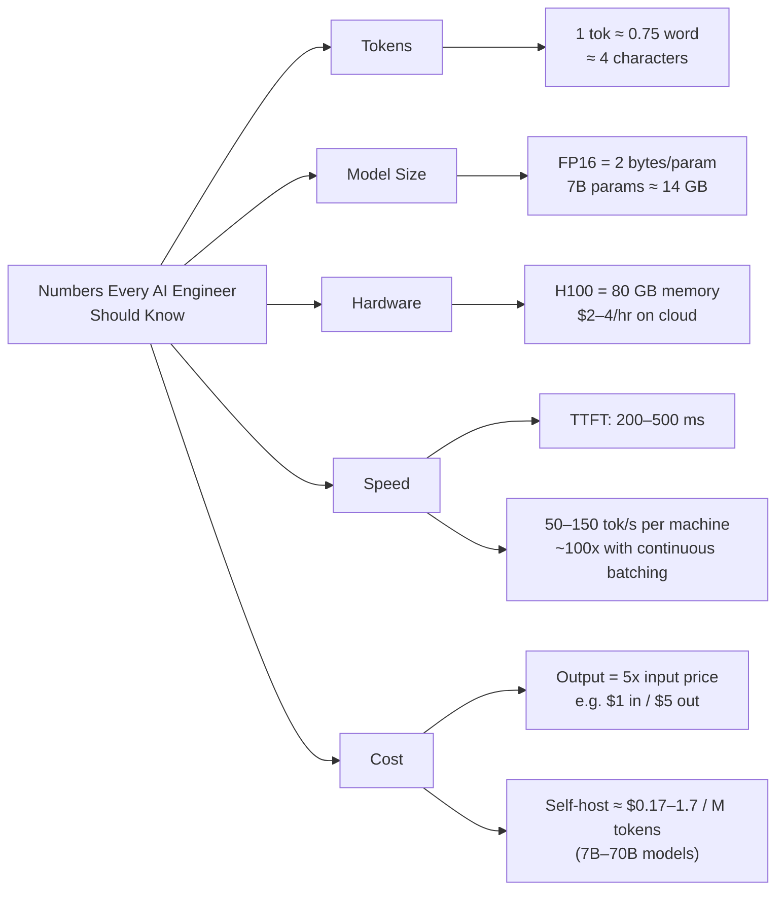

The table below collects the same five reference categories, since this is exactly the kind of comparison a system-design whiteboard session would need at a glance:

| Category | Baseline number | What it's used for |
|---|---|---|
| **Tokens** | 1 token ≈ 0.75 word ≈ 4 characters | Converting words/pages/sentences into token counts for cost and context-window estimates |
| **Model Size** | FP16 = 2 bytes/param → 7B params ≈ 14 GB | Estimating how much GPU memory a model needs to load |
| **Hardware** | H100 = 80 GB memory, $2–4/hr on cloud | Estimating GPU rental cost and whether a model fits on one card |
| **Speed** | TTFT ≈ 200–500 ms; 50–150 tok/s per machine, ~100x with continuous batching | Estimating latency budgets and serving throughput |
| **Cost** | Output tokens ≈ 5x input token price (e.g., $1 in / $5 out); self-hosting ≈ $0.17–1.7 per million tokens (7B–70B models) | Comparing hosted API cost vs. self-hosted GPU cost |

Each of these five branches gets its own deep-dive later in the course (e.g., the LLM-serving system design classes will revisit TTFT, tokens/sec, and continuous batching in depth). This section just establishes the reference values and shows the reasoning behind one of them end-to-end.

> [!info]+ Interview questions covered
> - What is Time to First Token (TTFT), and what's a reasonable ballpark value?
> - What is the token-to-word ratio, and why is ~0.75 word/token used as a rule of thumb?
> - How much memory does an H100 have, and roughly what does it cost to rent per hour?
> - Why do output tokens cost more than input tokens?
> - How do you compute a model's memory footprint in FP16 from its parameter count?

### Speed and Cost, Briefly

Two numbers deserve a first pass now because a worked example below depends on them:

- **Time to First Token (TTFT):** roughly **200–500 ms** — the latency between sending a request and receiving the very first output token.
- **Throughput:** a single machine can generate roughly **50–150 tokens/sec** on average; with **continuous batching**, that throughput can jump by roughly **~100x** because the GPU serves many concurrent requests instead of sitting idle between token-generation steps for a single request. The mechanics of continuous batching are deferred to the LLM-serving system design classes, but the number to remember now is the *order of magnitude* of the speedup.
- **Output vs. input token pricing:** output tokens are priced at roughly **5x** the price of input tokens (e.g., **$1 in / $5 out** per million tokens on a typical hosted API). The reasoning behind this 5x multiplier — related to how generation is inherently sequential and more compute-intensive per token than prompt processing — is a recurring theme that gets revisited across the system design classes and later in this same session.

### Worked Example: Self-Hosted Cost on a Single H100

This is the first fully worked calculation of the course, and it's worth internalizing the *process*, not just the final number, because the same three-step pattern (throughput → tokens/hour → cost/hour → cost/million tokens) recurs throughout system design cost estimation.

**Step 1 — Assume a realistic throughput.** For a batched 7B model running on a single H100 in 2026, ~5,000 tokens/sec is a realistic output throughput (this already reflects batching benefits, not the un-batched 50–150 tok/s figure from a single request).

**Step 2 — Convert throughput into tokens per hour.**

$$
5{,}000\ \text{tok/s} \times 3{,}600\ \text{s/hr} = 18{,}000{,}000\ \text{tok/hr} = 18\text{M tok/hr}
$$

**Step 3 — Divide the hourly GPU rental cost by tokens/hour to get cost per million tokens.** At roughly **$3/hr** for the GPU:

$$
\frac{\$3/\text{hr}}{18\text{M tok/hr}} \approx \$0.17\ /\ \text{M output tokens}
$$

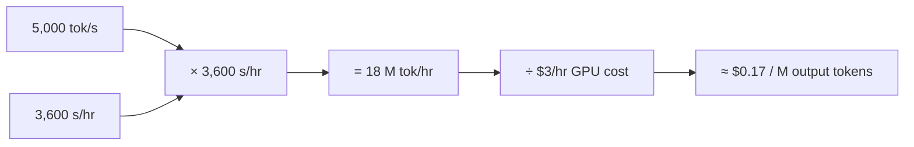

**What this means:** self-hosted output cost (**~$0.17/M**) undercuts hosted frontier-model output pricing (**$5–50/M**) by roughly **30–300x**. But this is an apples-to-oranges comparison — the self-hosted number is for a *7B model*, not a frontier-scale model, so the real trade-off is:

- **Model quality** — a 7B open model will generally be weaker than a frontier hosted model.
- **Operational effort** — you now own serving infra, scaling, monitoring, etc.
- **Idle-GPU risk** — if the GPU isn't kept busy, you're still paying the $2–4/hr rental cost with nothing to show for it, which erodes the cost advantage.

The same self-hosting logic extends across model sizes: self-hosting a model anywhere from **7B to 70B parameters** costs roughly **$0.17–1.7 per million tokens**, depending on model size and achievable throughput — versus the frontier hosted API cost of $5–50/M.

> [!info]+ Interview questions covered
> - How do you derive a self-hosted inference cost-per-million-tokens estimate from GPU throughput and hourly rental price?
> - Why can self-hosting look 30–300x cheaper than a frontier hosted API, and what's the catch?
> - What operational risks does self-hosting introduce that a pure per-token cost comparison misses?

### Motivating Example: Human vs. AI Agent Ticket Cost

To motivate *why* these cost numbers matter in a real system-design discussion (rather than staying abstract), consider a customer-support scenario: resolving one support ticket costs around **$8** when handled by a human agent. When the same ticket is resolved by an AI agentic system instead, that cost comes down to roughly **$2–4** — at least half the cost, often more.

This specific number is intentionally **not** part of the general reference sheet, because it's highly domain-specific (customer support economics differ from, say, coding-agent economics or search economics). It's used here only to illustrate the *pattern*: once you know the baseline numbers above (tokens, model size, hardware, speed, cost-per-token), you can construct exactly this kind of human-vs-AI cost comparison for any domain when it comes up in a system design interview or discussion.

> [!info]+ Interview questions covered
> - How would you structure a cost comparison between a human-staffed process and an AI-agent-automated version of the same process?

### What's Next

The session's actual walk-through (as previewed via the document's table of contents) begins with **"Tokens and Text"** — starting from the simplest heuristic: roughly every 4 characters correspond to 1 token. That is covered in the next section, along with the derivation of the token-to-word ratio and bytes-per-parameter model-size arithmetic (FP16, INT4, etc.) in more depth.


## Tokenization, Token-to-Word Ratio, and PDF Page-to-Token Estimates

Every discussion of LLM cost, latency, or context-window sizing starts from the same question: **how many tokens does my text actually turn into?** You cannot reason about "cost per million tokens," "tokens per second," or "will this fit in a 128K context window" without first being able to look at a paragraph, a PDF, or a book and mentally estimate its token count. This section builds that estimation skill from first principles — a single ratio you can carry in your head into any system-design interview or capacity-planning conversation.

### The Token Ruler: why a rule of thumb, not exact counting

An LLM never "sees" words — the very first thing that happens to any prompt, before it reaches the model's weights, is **tokenization**: breaking the raw text into chunks (tokens) that get mapped to IDs. Because the exact tokenizer (BPE, vocabulary, merge rules) differs across model families, engineers rely on an approximate, model-agnostic conversion instead of running the real tokenizer every time they want a back-of-envelope estimate:

$$
1 \text{ token} \approx 4 \text{ characters} \approx 0.75 \text{ words}
$$

This is explicitly an *average*, not an exact rule — useful precisely because it lets you size things quickly without invoking a tokenizer library.

From the tutor's walkthrough of the reference README (VS Code Markdown preview):

```text
THE TOKEN RULER   ( 1 token ~= 4 chars ~= 0.75 words )

"The quick brown fox jumps over the lazy dog"

split into ~4-char chunks (each chunk ~= 1 token):
[The ][quic][k br][own ][fox ][jump][s ov][er t][he l][azy ][dog]

1 token  ===  ~4 characters  ===  ~0.75 word
```

Walking through the example sentence "The quick brown fox jumps over the lazy dog," each token is carved out as roughly a 4-character window — including the space — regardless of whether that window lines up neatly with a whole word:

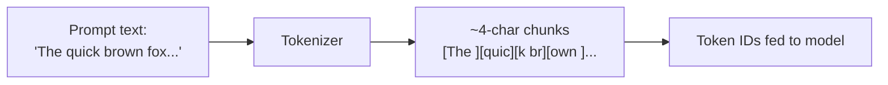

**Reversing the ratio.** If 1 token ≈ 0.75 words, then flipping it around:

$$
1 \text{ word} \approx \frac{1}{0.75} \approx 1.3 \text{ tokens}
$$

The tutor uses this in both directions in class: given 4 tokens, how many words is that?

$$
4 \text{ tokens} \times 0.75 \frac{\text{words}}{\text{token}} = 3 \text{ words}
$$

So "4 tokens ≈ 3 words" is the quick mental shortcut — whenever you see a token count, multiply by roughly 0.75 (or divide by ~1.3) to sanity-check the word count, and vice versa.

> [!info]+ Interview questions covered
> - What is tokenization, and why does it happen before anything else in an LLM's pipeline?
> - What is the standard rule-of-thumb ratio between tokens, characters, and words?
> - How do you convert between token counts and word counts without running a real tokenizer?

### Why a single word can cost more than one token

The 0.75-words-per-token ratio is an *average across common English text* — it breaks down for individual words that are long, rare, or made-up. Because the tokenizer's vocabulary is built from frequent character sequences, common short words (like "fox") typically map to a single token, while long or unusual constructions get split into several sub-word tokens.

The tutor's worked example: the word **"fox"** is one token, but a rarer, longer coinage like **"foxification"** breaks into roughly **4–5 tokens** — because the tokenizer hasn't seen that whole string frequently enough to have a single token for it, so it falls back to smaller sub-word pieces.

| Word | Approx. tokens | Why |
|---|---|---|
| `fox` | 1 | Short, common word — has its own token in the vocabulary |
| `foxification` | ~4–5 | Long/rare word — tokenizer splits it into sub-word chunks |

This is the practical takeaway: **the 4-char / 0.75-word ratio is a planning average, not a per-word guarantee.** Any real document's token count will be pulled up by its share of rare words, jargon, code, or non-English text.

> [!info]+ Interview questions covered
> - Why can a single word take up more than one token?
> - Is the token-to-word ratio uniform across all words?

### From words to pages to books: building up the estimate

Once you have the base ratio, the tutor scales it up to the units engineers actually work with — because in real systems you're not estimating single sentences, you're estimating uploaded PDFs, documents, or entire books for a context window or a cost calculation.

From the same README walkthrough:

```text
1 word              #  ~1.3 tok
1 page (500 words)   #####################  ~700 tok
book (150k words)    #########################################  ~200,000 tok
```

**Step 1 — one word:**

$$
1 \text{ word} \approx 1.3 \text{ tokens}
$$

**Step 2 — one page.** Why compare at the page level at all? Because the dominant real-world use case is *uploading a PDF* to an LLM — so "tokens per page" is the unit you actually need for capacity planning. A typical page is assumed to hold about 500 words (this already factors in that spaces also count toward token/character length):

$$
1 \text{ page} \approx 500 \text{ words} \times 1.3 \frac{\text{tok}}{\text{word}} \approx 700 \text{ tokens}
$$

**Step 3 — one book.** A typical book runs about 300 pages. Multiplying pages by words-per-page:

$$
300 \text{ pages} \times 500 \frac{\text{words}}{\text{page}} = 150{,}000 \text{ words}
$$

and converting that to tokens (equivalently, 300 pages × ~700 tokens/page):

$$
300 \text{ pages} \times 700 \frac{\text{tok}}{\text{page}} \approx 200{,}000 \text{ tokens}
$$

So a whole book lands at roughly **200K tokens** — a number worth memorizing, because it immediately tells you whether a "summarize this book" request fits inside a given model's context window.

| Unit | Approx. size | Approx. tokens |
|---|---|---|
| 1 word | — | ~1.3 tok |
| 1 page | ~500 words | ~700 tok |
| 1 book | ~300 pages / ~150,000 words | ~200,000 tok |

> [!info]+ Interview questions covered
> - How many tokens does one page of a PDF roughly correspond to, and why does that unit matter?
> - How would you estimate the token count of an entire book?

### Worked example: sizing a 100-page PDF, and why that matters for on-device LLMs

This is the number that turns an abstract ratio into a real system-design constraint. Take a **100-page PDF** — a common "upload a document and ask questions about it" scenario:

$$
100 \text{ pages} \times 700 \frac{\text{tok}}{\text{page}} \approx 70{,}000 \text{ tokens}
$$

Why does this matter? Because token count isn't just a cost/latency variable in the cloud — it directly determines **compute and battery cost on-device**. The tutor cites a concrete data point: *generating* a 100-page PDF (≈70K tokens of output) using a local LLM running on the latest iPhone would drain the phone's battery in about **one hour**.

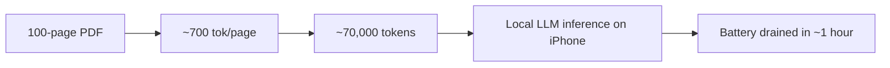

This is precisely why on-device/mobile LLMs are, at the moment, impractical for token-heavy tasks like generating or fully processing long PDFs: the energy cost of running tens of thousands of tokens through a model on constrained mobile hardware is prohibitive, even though the model itself may run technically. Document upload/generation is one of the most common real-world workloads, so this constraint has broad implications for where "local LLM" products can realistically be deployed today.

| Scenario | Token count | Practical implication |
|---|---|---|
| 100-page PDF | ~70,000 tokens | ~1 hour of battery drain generating it locally on a phone |
| 300-page book | ~200,000 tokens | Must check against the model's context-window limit before assuming it "just fits" |

> [!info]+ Interview questions covered
> - Why can't you casually run large-document LLM workloads (e.g., PDF generation/summarization) fully on-device on a phone today?
> - Given a page count, how do you quickly estimate the total token cost of processing a document?

### Recap: the mental math to carry forward

- **Base ruler:** 1 token ≈ 4 characters ≈ 0.75 words (equivalently, 1 word ≈ 1.3 tokens).
- **Not exact per word** — short/common words often collapse to 1 token; long/rare words can cost 4–5 tokens.
- **Scaled estimates:** 1 page (~500 words) ≈ 700 tokens; 1 book (~300 pages / 150K words) ≈ 200,000 tokens.
- **Why it matters:** this ratio is the first input to every downstream system-design number — context-window fit, cost-per-million-tokens, and even on-device battery/thermal budgets, as shown by the 70K-token / ~1-hour-battery-drain example for a 100-page PDF on a phone.


## Bytes Per Parameter: FP32, INT4, and Why a 7B Model Isn't a 70B Model

### Why this number matters for system design

Whenever a large language model is described, the first thing you'll see is its **parameter count** — expressed in billions (7B, 70B) or, for frontier models today, in the **trillions**. But parameter count alone doesn't tell you how much disk space or GPU memory a model needs. That depends on a second number: **how many bytes each parameter is stored in.** If you're sizing hardware for a deployment or answering "how much VRAM do I need to run this model?" in a system-design interview, you need both numbers — parameter count × bytes per parameter — before you can say anything concrete.

### From bits to bytes: the four precision formats

The starting fact is simple: **8 bits = 1 byte**. Every numeric precision format used to store model weights is defined by how many bits it uses, which directly gives you bytes per parameter:

| Format | Bits | Calculation | Bytes per parameter |
|---|---|---|---|
| FP32 | 32 bits | 32 / 8 | **4 bytes** |
| FP16 | 16 bits | 16 / 8 | **2 bytes** |
| INT8 | 8 bits | 8 / 8 | **1 byte** |
| INT4 | 4 bits | 4 / 8 | **0.5 bytes** |

The higher the bit-width, the more **precision** you retain — FP32 is the "full precision" format, and each step down (FP16 → INT8 → INT4) trades precision away in exchange for a smaller footprint.

> [!info]+ Interview questions covered
> - What is the relationship between bits and bytes when storing model weights?
> - What is the difference between FP32, FP16, INT8, and INT4?
> - Why does higher bit-width mean higher precision?

### Worked example: storing one number at each precision

To make "precision loss" concrete, the tutor takes a single floating-point value, `0.3927`, and shows how it actually gets stored at each precision level:

| Precision | Stored value | Bytes used |
|---|---|---|
| FP32 | `0.3925790` | 4 bytes |
| FP16 | `0.39258` | 2 bytes |
| INT8 | `0.393` | 1 byte |
| INT4 | `0.40` | 0.5 bytes |

Notice the value gets rounded more and more aggressively as you go down: FP32 keeps 7 significant digits, while INT4 collapses the same number down to just `0.40`. This is the mechanism behind quantization — you're not changing *how many* numbers the model has, you're changing *how exactly* each number is written down. Compressing a model from FP32 to INT4 shrinks its size by roughly **4x**, but that rounding directly hurts quality/correctness, because the model's internal computations are now working with less exact numbers.

This is also why models that run on your **mobile device or laptop** are almost never FP32 — they are already quantized down to a lower precision so they fit in limited memory.

### The Ollama gotcha: default quantization is INT4

A practical heads-up: whatever model you pull via Ollama (`ollama pull ...`, `ollama run ...`) defaults to **INT4** precision — even though this isn't obvious from the command itself. The tutor notes he was surprised to learn this: Ollama doesn't loudly advertise it, but if you dig into the model's internal documentation, it explicitly says the default download is an INT4 model. So "downloading a 7B model" via Ollama usually means you're getting a heavily quantized, ~4x-smaller version of the original weights, not the full-precision release.

### Sizing a real model: 7B vs. 70B at every precision

Now apply bytes-per-parameter to an actual model. If a model has **7 billion weights**, the total file size at each precision is:

$$\text{Model size} = \text{Number of parameters} \times \text{Bytes per parameter}$$

**7B weights (GB):**

| Precision | Bytes/param | Size |
|---|---|---|
| FP32 | 4 bytes/param | **28 GB** |
| FP16 | 2 bytes/param | **14 GB** |
| INT8 | 1 byte/param | **7 GB** |
| INT4 | 0.5 bytes/param | **3.5 GB** |

The core calculation: $7\text{B} \times 4\text{ bytes} = 28\text{ GB}$ at FP32. That's the size you'd see on disk if you downloaded an **uncompressed, unquantized** 7B checkpoint and unpacked it.

**70B weights (GB):**

| Precision | Bytes/param | Size |
|---|---|---|
| FP32 | 4 bytes/param | **280 GB** |
| FP16 | 2 bytes/param | **140 GB** |
| INT8 | 1 byte/param | **70 GB** |
| INT4 | 0.5 bytes/param | **35 GB** |

Line the two tables up and a clean pattern falls out: **a 70B model is exactly 10x the size of a 7B model at every single precision level** — 28→280, 14→140, 7→70, 3.5→35. This is the kind of ratio you should be able to reproduce on the spot in a system-design discussion: parameter count and precision multiply independently, so scaling one scales the total size proportionally, regardless of which precision you're quantized to.

> [!info]+ Interview questions covered
> - How much disk/VRAM does a 7B parameter model need at FP32 vs FP16 vs INT8 vs INT4?
> - How does model size scale between a 7B and a 70B model?
> - Why does Ollama's default download size feel smaller than you'd expect from the parameter count?

### Two levers for building a small language model

Given size = parameters × bytes/param, there are exactly **two ways** to shrink a model into a "small language model" (SLM):

1. **Decrease precision** — keep the same parameter count but quantize (FP32 → FP16 → INT8 → INT4).
2. **Decrease the number of parameters** — keep the same precision but train/ship fewer weights.

Which lever you pull is a tradeoff decision: it depends on how much accuracy and broad knowledge you're willing to give up versus how small and fast you need the model to be. Most SLMs you see today ship as INT4 by default, combining both levers to some degree.

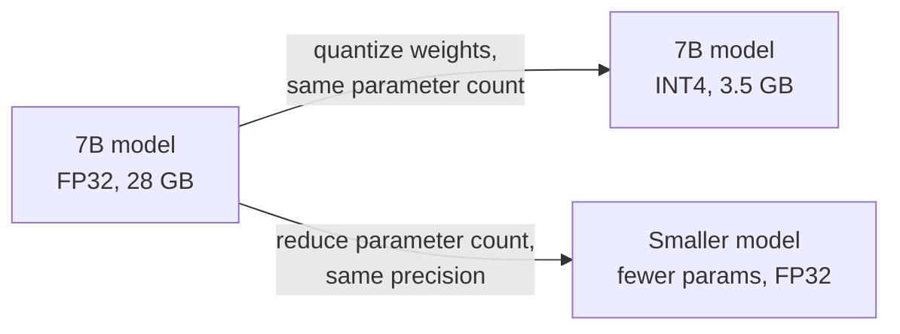

### Why precision loss actually matters: the embedding-distance example

It's tempting to think "the parameter count didn't change, so nothing important was lost" when quantizing. The tutor pushes back on this with a coordinate-geometry example: imagine two points, $(x_1, y_1)$ and $(x_2, y_2)$. When you compute the distance between them, having more decimal precision in $x_1, y_1, x_2, y_2$ makes that distance calculation **more precise** — the extra digits you saw in the FP32 row (`0.3925790` vs. INT4's `0.40`) are exactly the digits that make such calculations exact rather than approximate.

This maps directly onto what a language model does internally: it constantly computes **closeness between embedding vectors** — how "close" two words or tokens are in the model's learned vector space. That closeness computation is a distance calculation, just like the $(x_1,y_1)$–$(x_2,y_2)$ example, but over many more dimensions. So the numeric precision used to store the model's weights directly determines how accurately those learned relationships between words can be represented and recalled. Lower precision doesn't just make the file smaller — it makes the model's internal sense of "how similar are these two things" less exact.

> [!info]+ Interview questions covered
> - Why does quantization hurt model quality even though the number of parameters is unchanged?
> - How does numeric precision affect embedding similarity/distance calculations inside a model?

### What's actually inside the download: `parameters.bin`

Concretely, "7 billion weights" means there are 7 billion individual numbers, and those numbers live together in a single file — conventionally something like `parameters.bin`. Whenever you download an **open-weights** model (for example, via Ollama, or an open release like LLaMA), that file is exactly what you're pulling down: 7 billion (or 70 billion, or however many) numeric values, each stored at whatever precision the release uses.

At full FP32 precision, each of those 7 billion numbers costs 4 bytes, giving the $7\text{B} \times 4\text{ bytes} = 28\text{ GB}$ figure from before. Quantize the same file down to INT4 and it drops to 3.5 GB — same 7 billion parameters, just represented with fewer bits each.

This raises the natural follow-up question the tutor poses directly: **going from 28 GB down to 3.5 GB, with the same parameter count, what exactly are you losing?** The answer is precision itself — i.e., the correctness/accuracy of the model — not knowledge encoded as "more parameters." That precision-loss cost is illustrated with a concrete story (comparing the class's chosen Qwen 2.5 7B model against a smaller, heavily-quantized alternative that looked appealing on paper) which carries into the next section.

> [!info]+ Interview questions covered
> - What file format/structure holds an open-weights model's parameters?
> - When quantizing a model, what is actually being sacrificed if the parameter count stays the same?


## RTX 4090, H100 GPU, FP16 Byte Calculation, Model Size Arithmetic, GPU Cluster Sizing

### Why this number matters for system design

Knowing that "FP16 = 2 bytes/param" is only half the story. The number that actually decides your architecture is: **given a model's size in GB, which GPU can even load it, and what will that GPU cost me — to buy or to rent?** This is the question you get asked in a system-design interview the moment you say "we'll self-host a 70B model." Without concrete GPU-memory and pricing numbers in your head, you can't answer "how many GPUs," "what will it cost per hour," or "should we rent or buy" — and those are exactly the numbers this section drills into.

### A cautionary tale: why parameter count + precision isn't the whole story

Before getting to hardware, the tutor grounds the discussion in a real anecdote from building this course. Excited about a new, heavily-quantized model that could run in very little RAM, he asked Claude Code to automatically swap it into all 20 of his course projects and re-test them — only to find that most projects, and future ones, started failing. His conclusion: that particular model was not as good as comparable Chinese open-weight models (e.g., Alibaba's). After about two days of experimentation, he settled on **Qwen 2.5 (7B)** as the course's model of choice, partly because most students have **16 GB unified-memory Apple laptops** — a hardware constraint that directly shaped the model choice.

This matters because it's a real-world instance of the trade-off from the previous section: dropping precision to save memory can silently break correctness, not just "make the file smaller."

### Recap: the 7B vs. 70B precision tables

The same byte-math from before applies at 70B scale — and the tutor uses it to state a hard constraint: **to even load a 70B model, you need a minimum of 32 GB of memory**, since the OS itself consumes some of that pool before the model gets to use it.

| Precision | 7B weights | 70B weights |
|---|---|---|
| FP32 (4 bytes/param) | 28 GB | 280 GB |
| FP16 (2 bytes/param) | 14 GB | 140 GB |
| INT8 (1 byte/param) | 7 GB | 70 GB |
| INT4 (0.5 bytes/param) | 3.5 GB | 35 GB |

The clean pattern: **a 70B model is exactly 10x the size of a 7B model at every precision level** (28→280, 14→140, 7→70, 3.5→35), because it's the *same architecture* with more layers stacked on to grow the parameter count — not a different kind of model.

On Apple hardware, this 32 GB minimum is manageable because MacBooks use **unified memory** — a single memory pool shared between the CPU and GPU, rather than a separate dedicated VRAM pool. That shared-pool design is why Apple laptops can "punch above their weight" for local inference despite not having a discrete GPU.

> [!info]+ Interview questions covered
> - Why does loading a 70B model require at least 32 GB of memory even at INT4?
> - Why is a 70B model always ~10x the size of a 7B model at every precision?
> - What is unified memory, and how does it differ from dedicated GPU VRAM?

### The mental habit: computing a model's memory footprint from its name alone

The tutor turns the byte-math into a *reflex* every engineer should have: whenever you see a model's parameter count, immediately multiply it out.

$$\text{Model size (bytes)} = \text{Number of parameters} \times \text{Bytes per parameter}$$

Worked example, done explicitly on screen for a 7B model at FP16:

$$7{,}000{,}000{,}000 \text{ params} \times 2 \text{ bytes/param (FP16)} = 14{,}000{,}000{,}000 \text{ bytes} = 14 \text{ GB}$$

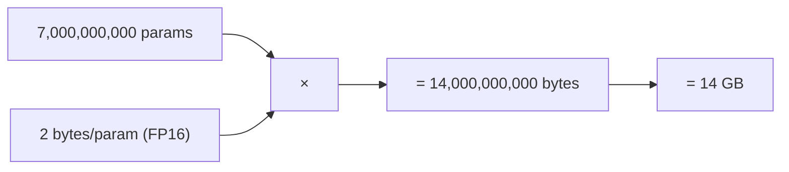

The instruction is explicit: "from now onwards, whenever you see any model, just do this calculation in your mind, for the learning perspective" — because this single formula tells you, before you buy or rent anything, whether a model can even physically fit on the hardware you're considering.

### Where do these sizes actually fit? The "What Fits Where" table

Having the GB number is only useful once you map it against real GPU tiers. The lecture builds this exact mapping on screen:

| Model config | Size | Fits on |
|---|---|---|
| INT4 7B | 3.5 GB | 8 GB consumer GPU/laptop |
| FP16 7B | 14 GB | 24 GB card (e.g., RTX 4090) |
| INT4 70B | 35 GB | 40 GB (e.g., A100) |
| INT8 70B | 70 GB | 80 GB (H100) |
| FP16 70B | 140 GB | needs **2× 80 GB GPUs** |

Two takeaways the tutor calls out directly:
- A **3–7 GB** model is roughly the practical ceiling for typical consumer hardware with ~8 GB of unified memory.
- Once a model's weights exceed a single GPU's memory (like the 140 GB FP16 70B case), you don't have a "does it fit" question anymore — you have a **multi-GPU sharding** question.

> [!info]+ Interview questions covered
> - Given a model's size in GB, how do you decide which GPU tier it needs?
> - What happens when a model's weights exceed a single GPU's VRAM?

### Picking a consumer GPU: RTX 4090 vs. RTX 5090

For anyone buying or renting a single consumer-grade card, the two real options the tutor names are:

| GPU | VRAM |
|---|---|
| RTX 4090 (Nvidia) | 24 GB |
| RTX 5090 (Nvidia) | 32 GB |

The decision rule is straightforward: if your model footprint sits around 14 GB, an RTX 4090 is enough. But if you expect your model to grow toward **24–28 GB**, you should plan ahead and get the 32 GB RTX 5090 instead — the 24 GB 4090 leaves you with almost no headroom at that size, since some of that memory is also needed for the KV cache and activations during inference, not just the raw weights.

### The speed vs. precision/parameter-count trade-off

A student poses a sharp system-design question: *given a fixed memory budget — say 28 GB — should you use more parameters at lower precision, or fewer parameters at higher precision?*

The tutor's answer reframes the whole trade-off around a factor beyond "does it fit": **speed**.

- More parameters + higher precision → better knowledge and quality, because more of the model's learned information is retained and represented exactly.
- But increasing either parameter count or precision **reduces inference speed** (tokens/sec) — even if the model fits comfortably in memory.

The right choice is use-case dependent:
- **Agentic pipelines** (multi-step, fully automated, no human reading each token) need speed, because everything happens end-to-end without a person in the loop to "absorb" slow generation.
- **Interactive chat** is far more tolerant of slower, token-by-token generation, because a human reader can only read one token at a time anyway — the model doesn't need to out-run human reading speed.

This is a direct, practical instance of the classic "quality vs. latency" trade-off system-design interviews probe for: the right answer is never "always pick the bigger model," it's "pick based on the product's tolerance for latency."

> [!info]+ Interview questions covered
> - Why does increasing parameter count or precision reduce inference speed?
> - How should the choice between "more parameters, less precision" and "fewer parameters, more precision" depend on the use case?
> - Why do agentic workloads need more speed than a chat interface?

### Buying vs. renting: real hardware costs

Once you know the GPU tier you need, the next number is: what does it actually cost? The tutor gives concrete purchase prices:

| GPU | VRAM | Approx. purchase cost |
|---|---|---|
| RTX 4090 | 24 GB | ~$2,000 (~₹2 lakh) |
| RTX 5090 | 32 GB | ~$3,000 (~₹3 lakh) |
| H100 (secondhand) | 80 GB | ~₹27–30 lakh (~$30,000+), plus up to ~₹20 lakh in taxes depending on where you buy |

The gap is stark: consumer cards are a one-time cost most individuals can plausibly afford, while a datacenter-class H100 is not — which is exactly why H100-class hardware is almost always **rented on the cloud** rather than purchased outright.

For bigger models (~70 GB and up), the practical pattern the tutor calls the **"sweet spot"** is: download an open-weight model (e.g., Alibaba's Qwen) and self-host it on a rented cloud GPU, rather than buying the hardware yourself. Companies like **RunPod** exist specifically for this: they let you rent a GPU server on-demand, either to run your own training/fine-tuning code directly, or to pull a model onto their server and serve it via your own API calls.

> [!info]+ Interview questions covered
> - Why is an H100 almost always rented rather than bought?
> - What is the "sweet spot" pattern for self-hosting a large open-weight model?
> - What does a company like RunPod provide, and why would you use it?

### Key numbers to remember + GPU cluster sizing

The tutor distills everything down to two numbers you should be able to recall instantly in an interview:

- **H100 = 80 GB** of memory.
- **Consumer cards (RTX 4090 / 5090) = 24–32 GB.**

The full hourly-cost picture, as shown on screen (GPU memory + on-demand $/hr):

| Hardware | Memory | Type | On-demand $/hr |
|---|---|---|---|
| Apple M-series laptop | 16 GB | local (unified memory) | **Free** — it's your own laptop |
| RTX 4090 | 24 GB | consumer | ~$0.30–0.70/hr |
| RTX 5090 | 32 GB | consumer | ~$0.60–1.00/hr |
| A100 | 40 GB | cloud | ~$1.00–3.00/hr |
| A100 | 80 GB | cloud | ~$1.00–3.00/hr |
| H100 | 80 GB | cloud | ~$2.00–4.00/hr |
| Apple M5 Max laptop | 128 GB | local (unified memory) | **Free** |

(Spoken approximations from the tutor land inside this same range: roughly **$0.32/hr for a 4090** and **~$1/hr for a 5090** on-demand.)

Finally, when a single model's memory footprint exceeds any single GPU's capacity — as with the 140 GB FP16 70B case above — you don't rent one GPU, you build a **cluster**. The sizing logic is simple multiplication:

$$\text{Number of GPUs needed} = \left\lceil \frac{\text{Model size (GB)}}{\text{Per-GPU memory (GB)}} \right\rceil$$

For example, a 140 GB FP16 70B model on 80 GB H100s needs $\lceil 140 / 80 \rceil = 2$ GPUs. Once you know the GPU count, you multiply that by the hourly rate to get your total hosting cost — the number you actually need to defend in a system-design discussion or a cost-estimation interview question.

> [!info]+ Interview questions covered
> - What two numbers should you have memorized for H100 vs. consumer GPU memory capacity?
> - How do you calculate the number of GPUs needed in a cluster for a model that doesn't fit on one card?
> - How do you go from "GPUs needed" to an hourly hosting cost estimate?


## Network Round-Trip Time (RTT), Throughput & Latency, GPU Hourly Cost (A100/H100), Spot vs. On-Demand Risk, CPU/Storage Add-On Cost

This section is about the numbers you need on hand the moment a system-design interview (or a real capacity-planning conversation) turns to "how much will this cost, and how fast will it respond?" The tutor builds up the numbers in a specific order: first, what a GPU costs per hour to rent or own; then what that rental risks; then what else you're implicitly paying for; and finally, how physical distance and serving stack maturity determine the latency and throughput a user actually experiences.

### GPU Hourly Cost: The Two Numbers Worth Memorizing

**Why this matters for system design:** before you can say "hosting this model will cost $X/month," you need an anchor for what a single GPU-hour costs. Get this wrong by 3x and your entire cost estimate in an interview (or a real budget) is wrong by 3x.

The tutor walks through the README's "GPU Memory and Hourly Cost" table, tier by tier:

| GPU | Memory | Tier | $/hr |
|---|---|---|---|
| Apple M-series laptop | 16 GB | Personal laptop | Free (you already own it) |
| RTX 4090 | 24 GB | Consumer | \$0.30 – \$0.70 |
| RTX 5090 | 32 GB | Consumer | \$0.60 – \$1.00 |
| A100 | 40 GB | Cloud | \$1.00 – \$3.00 |
| A100 | 80 GB | Cloud | \$1.00 – \$3.00 |
| H100 | 80 GB | Cloud | \$2.00 – \$4.00 |
| Apple M5 Max | 128 GB | Personal laptop | Free (you already own it) |

If you can fit and run a model on your own laptop's Apple Silicon, it costs you nothing extra — that's why the 16 GB / 128 GB laptop rows have no cloud price. Once you outgrow that, an RTX 4090 (24 GB) is the cheapest server-hosted option, at roughly \$0.30–\$0.70/hr.

The tutor deliberately compresses this whole table down to **two numbers to remember**:

$$
\text{A100 (80 GB)} \approx \$1/\text{hr}, \qquad \text{H100 (80 GB)} \approx \$3/\text{hr}
$$

**Worked example:** if you spin up an H100 for one hour to run inference or fine-tune a model, that GPU-hour alone costs you about \$3. Run it for a 10-hour job and you're at roughly \$30 just for the GPU — before you've factored in storage, CPU, or engineering time. This is exactly the kind of number an interviewer expects you to produce instantly when asked "roughly what would it cost to serve this model for a day?"

> [!info]+ Interview questions covered
> - How much does it cost to rent an A100 vs. an H100 GPU per hour?
> - How would you do a back-of-envelope cost estimate for running a model on a cloud GPU for N hours?

### Spot vs. On-Demand GPU Risk

**Why this matters for system design:** the sticker price on a GPU-hour is not the whole story — you're also choosing between a cheaper but risky rental and a pricier but stable one.

- **Renting (spot instance):** cheaper, but risky. There's no uptime guarantee — in the worst case, the provider can shut down your instance mid-job because they don't hold a dedicated backup for you. This is the classic "spot" GPU risk: someone else can outbid you for the same physical hardware.
- **Buying / on-demand with guarantee:** more expensive, but the provider guarantees the instance will keep running. You trade cost savings for reliability.

| | Rented / Spot | On-demand / Owned |
|---|---|---|
| Cost | Lower | Higher |
| Uptime guarantee | None — can be shut down anytime | Guaranteed to keep running |
| Best for | Fault-tolerant batch jobs, experimentation | Production serving, latency-sensitive workloads |

This is the same trade-off cloud engineers make outside of AI (spot EC2 vs. on-demand EC2) — the tutor frames it as risk vs. cost, and it should shape how you answer "would you use spot instances for this workload?" in an interview: fine for offline training/batch jobs you can checkpoint and resume, risky for a production inference endpoint.

> [!info]+ Interview questions covered
> - What is the risk of using spot/rented GPU instances versus on-demand GPUs?
> - When would you choose spot instances over guaranteed on-demand capacity, and vice versa?

### CPU and Storage as a Cheap GPU Add-On

**Why this matters for system design:** when you cost out a GPU box, don't forget you also need somewhere to store the model weights and a CPU to orchestrate the job — but the good news is these are a rounding error next to the GPU cost.

To actually run a model on a rented server, you need:
1. The **GPU** itself (the number above), for the time you use it.
2. A **hard drive**, because you have to download the model weights onto disk before you can load them.
3. A **CPU**, to run the surrounding code that drives the GPU.

Cloud providers bundle CPU and storage in automatically with the GPU rental, and the cost of both is "very, very cheaper" compared to the GPU. In other words: budget almost entirely around GPU-hours; CPU and storage are effectively a free add-on you get bundled with the box.

> [!info]+ Interview questions covered
> - Why is CPU and storage cost negligible compared to GPU cost when serving a model?
> - What resources (beyond the GPU) does a server need to actually host and serve a model?

### Network Round-Trip Time (RTT): Why Server Geography Matters

**Why this matters for system design:** every request to a hosted model has to physically travel over the network before any GPU compute even starts. If you ignore RTT, you'll under-estimate latency for users far from your server — and pick the wrong region.

| Route | Round-trip time |
|---|---|
| Same region (both servers in the same datacenter region) | 1 – 5 ms |
| Transatlantic (US ↔ Europe, e.g. NY–London) | ~70 – 90 ms (≈ 80 ms) |
| US ↔ Australia (roughly halfway around the globe) | 200+ ms (this is treated as the practical maximum) |

The rule of thumb: **the closer your server is to the user, the smaller this number.** If you're in India, you pick a server in Mumbai or Delhi — not one in the US — because that keeps you in the 1–5 ms same-region bucket instead of paying a cross-continent penalty. Cloud providers like Amazon expose this choice directly through zone-wise (availability-zone) servers, so region/zone selection is a concrete lever you control.

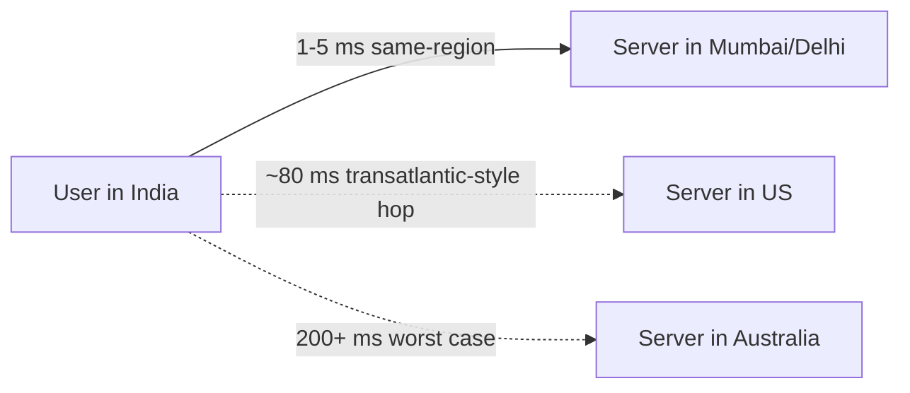

**Worked example:** if your user is in India and your only server is in the US, you've already spent up to ~200 ms just on the network round trip — before the model has generated a single token. Pick the nearest region and that overhead drops to single-digit milliseconds, which is why RTT is treated as a fixed anchor you design around, not something you can optimize away in the model itself.

> [!info]+ Interview questions covered
> - What is network round-trip time (RTT), and why does server region/zone selection matter for latency?
> - How much latency penalty do you pay for a cross-region or cross-continent request, and how do you minimize it?

### Serving Latency: Time-to-First-Token and Reasoning Model Overhead

**Why this matters for system design:** RTT gets the request to the server — but the user is still waiting on the model itself to produce its first token. This is a second, separate latency budget.

| Serving scenario | Time-to-first-token (TTFT) |
|---|---|
| Standard hosted API | 200 – 500 ms |
| Reasoning model (extra "thinking" before answering) | ~1 s |

A reasoning model takes noticeably longer to produce its first visible token because it spends time on internal reasoning steps before it starts streaming an answer — roughly 2–5x the TTFT of a standard hosted API call.

Once a request reaches the server, here's what actually happens (as described while looking at the served model's file layout): the server has the model's learned weights downloaded onto disk as `parameters.bin`, and a `model.py` that defines the architecture. Serving a request means loading those parameters, feeding the user's input through `model.py`, and running the computation defined by the code using those parameters to produce the output.

```mermaid
flowchart LR
    A[User input arrives at server] --> B["Load weights from parameters.bin"]
    B --> C["Run model.py architecture on GPU"]
    C --> D[Feed input through the loaded model]
    D --> E[Compute forward pass layer by layer]
    E --> F[Emit first output token &#40;TTFT&#41;]
```

**Worked example — combining RTT and TTFT into a latency budget:** for a user far from your server hitting a reasoning model, the total time to see anything on screen is roughly (network RTT) + (TTFT). Worst case: 200 ms (far-region RTT) + ~1 s (reasoning-model TTFT) ≈ 1.2 s before the first token even appears. Same request from a nearby region against a standard model: 5 ms + 300 ms ≈ 0.3 s. That 4x gap is entirely explained by region choice and model type — exactly the kind of decomposition an interviewer wants to see.

> [!info]+ Interview questions covered
> - What is time-to-first-token (TTFT), and how does it differ for reasoning models vs. standard models?
> - How do you decompose end-to-end perceived latency into network RTT and model serving time?

### Tokens per Second: Human Reading vs. Machine Serving Throughput

**Why this matters for system design:** "tokens per second" is the throughput number that determines both user-perceived generation speed and how many concurrent users a single GPU can support — and it has grown by roughly an order of magnitude in just a couple of years thanks to better serving stacks.

| Scenario | Tokens / sec |
|---|---|
| Human reading speed | 4 – 6 tok/s (≈ 200–300 words/min) |
| Single-stream 7B model on a good GPU | 50 – 150 tok/s |
| Batched serving on H100, 2023–24 stacks | 1,000 – 3,000 tok/s |
| Batched serving on H100, 2026 stacks (vLLM / SGLang / FP8) | 5,000 – 15,000 tok/s |

Two things jump out. First, even a single unbatched 7B model (50–150 tok/s) already generates text 10–30x faster than a human can read (4–6 tok/s) — so raw single-user generation speed is rarely the bottleneck. Second, the real leap comes from **batching**: pooling many users' requests onto the same GPU lets a single H100 go from ~2,000 tok/s (2023–24 stacks) to ~10,000 tok/s (2026 stacks with vLLM/SGLang and FP8 quantization) — roughly a 5x throughput gain from software and numeric-precision improvements alone, with no new hardware.

**Worked example — turning throughput into a cost-per-million-tokens estimate:** you can chain this number together with the H100 hourly cost anchor from earlier to get a back-of-envelope serving cost. At \$3/hr for an H100:

$$
\text{tokens/hour} = \text{tokens/sec} \times 3{,}600
$$

- 2023–24 stack (1,000–3,000 tok/s) → 3.6M – 10.8M tokens/hour → roughly **\$0.28 – \$0.83 per million tokens** (compute only, at full utilization).
- 2026 stack (5,000–15,000 tok/s) → 18M – 54M tokens/hour → roughly **\$0.06 – \$0.17 per million tokens**.

That ~5x drop in cost-per-million-tokens is the direct, quantified payoff of continuous batching and FP8 serving improvements — and it's the kind of calculation ("combine the GPU $/hr anchor with the tok/s anchor") that turns two memorized numbers into an answer to "what would this cost at scale?" on the spot.

> [!info]+ Interview questions covered
> - How many tokens per second can a single-stream vs. a batched, production-grade serving stack produce?
> - How do modern serving frameworks (vLLM, SGLang) and FP8 quantization change GPU throughput and cost per token?
> - How do you convert a tokens/sec throughput number and a GPU hourly cost into a cost-per-million-tokens estimate?


## Time to First Token (TTFT): Prefill vs. Decode, and Why Reasoning Models Are Slower

### Why TTFT Matters

When you send a prompt to a hosted model (say, asking ChatGPT "how are you today?"), the delay before the *very first* token streams back onto your screen is what makes the system feel responsive or sluggish. The moment that first token appears, you perceive "something is happening" — the response has started. This perceived-latency number has a name: **Time to First Token (TTFT)**, and it is one of the most important numbers to reason about when designing or evaluating an LLM-serving system, because it dominates how "fast" a product *feels*, independent of how fast it eventually finishes.

TTFT is consistently *slower* than the time between any two later tokens. To understand why, you need to split what happens on the server into two distinct phases: **prefill** and **decode**.

### Prefill vs. Decode

**The setup:** when you send a prompt to a hosted API, the request lands on a server that has already loaded the model's weights (`parameters.bin`) and has code (`model.py`) ready to run inference. Your prompt is not one token — it's typically **10–20 tokens at minimum, often 100–200 tokens** for a longer prompt.

**Prefill — "understanding" the whole prompt at once.** Every token in the prompt has to be processed by the model *before* the model can produce anything. All of those tokens (say, 100 of them) are processed in parallel, and the model builds up an internal representation (which gets cached — this is the **KV cache**, covered in more depth in a later class) for the full prompt. Think of prefill as: *read everything the user sent, build understanding of it, and as a byproduct of that same computation, produce the first output token.*

**Decode — one token at a time, using what's cached.** Once prefill is done, the model already "remembers" everything about the prompt (via the KV cache), so it doesn't need to re-process the whole prompt again for token 2, token 3, and so on. It only has to generate **one new token at a time**, reusing the already-computed understanding. This is much cheaper per step than prefill.

> The tutor's analogy: it's like the difference between listening to someone speak one word at a time (decode-like — token by token, low latency per step) versus receiving an entire WhatsApp paragraph and having to read the *whole thing* before you can understand and respond to it (prefill-like — all at once, but only after reading everything).

Because prefill has to process the *entire* prompt (all N tokens) before emitting even one output token, while decode only emits one new token per step given the cache, **TTFT ≈ prefill time**, and it is structurally larger than the per-token time you observe once decoding is underway.

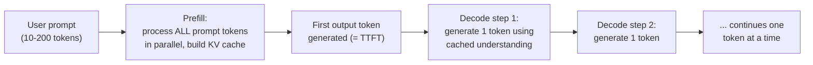

**The baseline number:** for a normal hosted API, TTFT generally falls in the **200–500 millisecond** range — call it "about half a second."

> [!info]+ Interview questions covered
> - What is Time to First Token (TTFT), and why is it structurally slower than later per-token latency?
> - What is the difference between the prefill phase and the decode phase in LLM serving?
> - Why does a longer input prompt increase TTFT specifically (rather than affecting later-token latency the same way)?

### Prompt Caching Across Turns

A natural follow-up question: if you send a *second* prompt in the same conversation, does the model have to re-read and re-understand the entire previous conversation from scratch (repeating the expensive prefill work)? No — the understanding built from the first 100 tokens (its KV cache) is already stored (in memory or on disk, depending on the serving setup). When token 101 arrives as part of a follow-up turn, the server does not need to redo the "understanding" work for the first 100 tokens; it reuses what was cached. This reuse of previously computed prefill state across turns is called **prompt caching**, and it's why multi-turn conversations don't pay the full prefill cost on every single message — only for the *new* tokens added since the last cached point.

> [!info]+ Interview questions covered
> - What is prompt caching, and how does it reduce redundant prefill computation across conversational turns?

### Large Reasoning Models (LRMs): Why "Thinking" Increases TTFT

If TTFT for a normal hosted API is 200–500 ms, **reasoning models** show something different: the first visible token can take roughly **1 second** to appear. The reason is that a reasoning model — sometimes called a Large Reasoning Model (LRM) — is trained to "think" before producing its final answer. This raises an important clarification the tutor is careful to stress: **"thinking" is not some separate, hidden computational mechanism running outside the transformer.** Thinking *is* token generation — the model is simply generating many more tokens (a reasoning trace) internally before it emits the tokens the user actually sees. That's why a reasoning model's effective TTFT (to the *user-visible* answer) is dramatically higher: the user has to wait through the entire hidden "thinking" phase, which is itself a sequence of generated tokens, before any visible output appears.

Concrete real-world examples of reasoning models across labs: **GPT's thinking mode**, **DeepSeek R1**, **Qwen3**, **Gemini Deep Think**, **Claude's extended thinking**, and **Grok's Think mode**.

#### How You Trigger Reasoning: the `<think>` Tag

Researchers train these models with a different output format: the prompt (or system template) includes an explicit instruction to "think" — literally a `<think>` tag — and during training, the model is optimized so that this signal causes it to produce a long chain of intermediate reasoning steps before its final answer, rather than jumping straight to a short answer.

Here is the actual worked example the tutor walks through — a simple pens-and-notebooks cost problem — showing exactly what a reasoning trace looks like:

```text
<think>
Pens: 2 pens cost 5 rupees, so 1 pen costs 2.5 rupees.
6 pens cost 6 * 2.5 = 15 rupees.

Notebooks: 3 notebooks cost 12 rupees, so 1 notebook costs 4 rupees.
9 notebooks cost 9 * 4 = 36 rupees.

Total = 15 + 36 = 51 rupees.

Let me verify. 6 pens means 3 packs of 2 pens, each pack 5 rupees, so 3 * 5 = 15. Correct
9 notebooks means 3 packs of 3 notebooks, each pack 12 rupees, so 3 * 12 = 36. Correct.
Total 15 + 36 = 51. Correct.
</think>

We pay 51 rupees in total.
```

This trace demonstrates three things a reasoning model does that a plain LLM typically skips:
- **Decomposition** — breaking the problem into smaller sub-steps (unit price of a pen, unit price of a notebook).
- **Intermediate computation** — writing down and computing each sub-step's value explicitly, rather than jumping to the final number.
- **Self-verification** — re-deriving the same answer a second way ("3 packs of 2 pens...") to check its own work before committing to the final answer.

> The tutor's analogy: this is like a student working through a problem on rough/scratch paper during an exam before writing the final answer on the answer sheet — the rough work is not what gets graded, but doing it improves the odds the final answer is correct.

#### What Gets Shown to the User

This raises a key design question: of everything the model generates — the entire `<think>...</think>` reasoning block *plus* the final sentence — what should actually be shown to the end user? The answer (as the class correctly identified): only the **completed final answer** ("We pay 51 rupees in total.") is shown. The entire `<think>` block is a **hidden reasoning trace** — generated tokens that the user never sees, but that the model still had to generate (and the server still had to compute and pay latency for) before the visible answer could be produced.

This is precisely why reasoning-model TTFT is so much higher than a regular hosted API's TTFT: the "first token" the user experiences is not the model's literal first generated token — it's the first token *after* the entire hidden thinking phase has finished. The user is effectively waiting through an invisible extra decode pass before seeing anything.

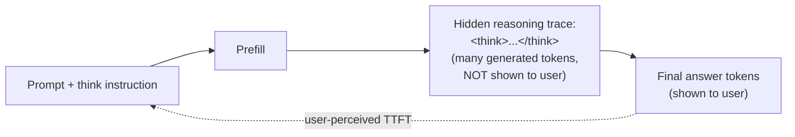

> [!info]+ Interview questions covered
> - What is a Large Reasoning Model (LRM), and how does it differ from a regular LLM at inference time?
> - Is "thinking" in a reasoning model a separate computation from token generation, or is it token generation itself?
> - What is a `<think>` tag / reasoning trace, and what three things does it typically show (decomposition, intermediate computation, self-verification)?
> - Why is TTFT for a reasoning model (~1 second) so much higher than for a regular hosted API (200–500 ms)?
> - What should be shown to the end user from a reasoning model's output — the full trace or just the final answer?

### LLM vs. LRM: The Speed/Accuracy/Cost Tradeoff

A plain LLM answers directly and fast, but can be wrong on hard multi-step problems; an LRM spends extra tokens "thinking" first, which is slower and costs more, but is more likely to be correct on math, code, logic, and planning tasks:

```text
LLM:  [question] ---> [short answer]          (fast, sometimes wrong)
LRM:  [question] ---> [<think> reasoning trace </think>] ---> [verified answer]   (slower, costlier, more accurate)
```

| | Regular LLM | Large Reasoning Model (LRM) |
|---|---|---|
| **Strengths** | Simple chat, summaries, quick factual lookups | Math, code, logic, multi-step planning |
| **Weaknesses** | Weaker on hard multi-step problems | Slower, costlier per response |
| **Latency (TTFT)** | ~200–500 ms | ~1 s+ (includes hidden thinking phase) |
| **Cost per response** | Baseline | Higher — proportional to extra "thinking" tokens generated |

#### Why It Matters for System Design: Test-Time Compute Scales Accuracy — At a Cost

This tradeoff isn't just qualitative — it's been benchmarked directly. On a hard math contest, a plain LLM (GPT-4o) scores only **~12%** accuracy. The *same underlying reasoning model* (o1) climbs to:

- **~74%** with a single reasoning pass (one `<think>` trace, one answer),
- **~83%** with 64-way majority voting (generate 64 independent reasoning traces, take the most common final answer),
- **~93%** with 1,000-attempt re-ranking (generate 1,000 candidate traces/answers and re-rank them).

This is the core insight behind **test-time compute scaling**: accuracy keeps climbing as you throw more compute (more reasoning tokens, more parallel attempts) at inference time — but each of those attempts costs real tokens, real latency, and real money. The relationship is roughly proportional: **doubling the number of thinking tokens roughly doubles the extra output cost** for that response, since the "thinking" tokens are billed and computed just like any other generated token.

Because this tradeoff is real, production reasoning APIs typically expose a tunable **"thinking budget"** parameter — e.g., **1,024 / 8,192 / 32,768 tokens** — letting a system designer explicitly choose how much test-time compute (and therefore latency and cost) to spend per request, rather than always paying for maximum reasoning depth. This is a direct, practical lever for the classic speed-vs-cost-vs-accuracy tradeoff in system design: a customer-support chatbot might use a small thinking budget (or none — a plain LLM) for speed, while a coding agent solving a hard bug might justify a much larger thinking budget because getting the answer right matters more than shaving off a second of latency.

> [!info]+ Interview questions covered
> - What is "test-time compute," and how does scaling it (single pass → majority voting → re-ranking) affect accuracy on hard reasoning benchmarks?
> - Why does more "thinking" cost roughly proportionally more, and what lever do production APIs expose to control this (thinking budget)?
> - When would a system designer choose a plain LLM over an LRM, or a small vs. large thinking budget, for a given product feature?


## From Token-Matching to Tool Use, DeepSeek R1's History, and the Tokens-Per-Second Anchors

This continues directly from the reasoning-trace / TTFT discussion in the previous section (the `<think>` pens-and-notebooks example). Rather than re-deriving that example, this section picks up three follow-up threads that came out of it: *how* models actually do the arithmetic inside a reasoning trace, *why* reasoning models exist as a trained behavior rather than a bolt-on trick, and the concrete tokens-per-second numbers you need to reason about streaming latency.

### Why Modern Models Get Math Right: Tool Use, Not Just Token Matching

**Why this matters for system design:** if you assume an LLM is "just" predicting the next token by pattern-matching, you'd expect it to be unreliable at arithmetic — and older models were exactly that unreliable. Understanding what changed tells you why current production models are trustworthy for tasks like the pens/notebooks cost calculation.

A student asked the natural question: when the model produces `6 * 2.5 = 15` inside its `<think>` block, is it really just guessing the next token that "looks right," or is it doing actual multiplication? The tutor's answer: current models are already "smart" in the sense that they have learned **when to invoke a skill or tool** (tool use / function calling) for computation, rather than generating the arithmetic result purely from next-token pattern matching. This is a *trained* capability — the model recognizes "this is a math sub-step" and reaches for a reliable calculation path instead of free-associating digits.

Earlier models, before this tool-use/skills capability existed, had no such option — they generated every digit of an arithmetic answer token-by-token via plain pattern matching, which is precisely why they made frequent mistakes on multi-step math problems. The reasoning trace itself (decomposition, intermediate computation, self-verification) is the visible symptom of a model that has learned to lean on structured sub-skills rather than free-form token guessing.

> [!info]+ Interview questions covered
> - Is an LLM's correct arithmetic inside a reasoning trace the result of "guessing the right token," or does it reflect a learned tool-use/skill-invocation capability?
> - Why did older (pre-tool-use) models make more mistakes on multi-step math problems than current models?

### A Brief History of Reasoning Models: From Two Separate Models to One

**Why this matters for system design:** knowing *how* the thinking behavior is triggered explains directly why it costs more tokens (and therefore more latency and money) — it isn't a separate hidden computation, it's a controllable generation mode.

Historically, "thinking" and "non-thinking" behavior lived in **two separate models**: one trained to answer directly with no reasoning trace, and a different model trained to reason at length before answering. **DeepSeek R1** was the first model in the world to collapse this into a **single model** that can do both, switched by a **thinking signal placed in the prompt** — "you have to think more, you have to use more tokens" versus a normal direct-answer instruction. Only the *output* behavior varies; it's the same underlying model.

The mechanism is simple and literal: when the thinking signal is present, **the very first token the model generates is the word "think"** (opening the `<think>` tag), which kicks off the extended reasoning trace before the visible answer. Since thinking = generating more tokens, and TTFT accumulates all tokens generated before the user-visible answer, this is exactly why reasoning models take longer to produce a first visible token — there's no extra hidden computation step, just more sequential token generation.

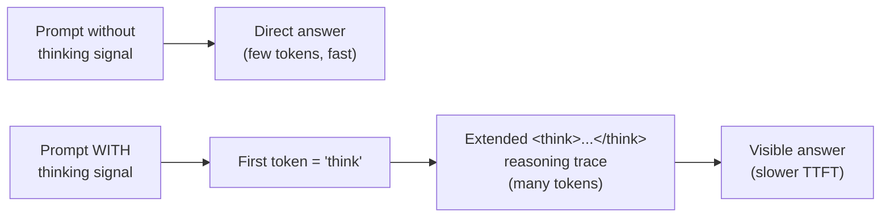

> [!info]+ Interview questions covered
> - Before DeepSeek R1, how was "thinking" vs. "non-thinking" behavior implemented — one model or two?
> - What did DeepSeek R1 introduce that let a single model support both modes, and how is the mode selected?
> - Literally, what is the first token a reasoning model generates when told to think, and why does that explain higher TTFT?

### Tokens-Per-Second: The Human Reading Speed Anchor

**Why this matters for system design:** a fast model is wasted if it streams faster than a human can read — and a model that streams *slower* than human reading speed feels laggy even if the total response time is short. The target isn't "as fast as possible," it's "at least as fast as the reader."

The anchor number: **human reading capacity is about 4–6 tokens/second**, which works out to roughly **200–300 words per minute**. If a model streams tokens at or above that rate, a reader can keep consuming them continuously without ever having to stop and wait for the next token — the UI feels smooth rather than choppy.

Compare that reading-speed floor against the actual serving throughput numbers on the reference table:

| Scenario | Tokens/sec |
|---|---|
| Human reading speed | 4–6 tok/s (≈200–300 words/min) |
| Single-stream 7B model, good GPU (A100/H100) | 50–150 tok/s |
| Batched H100, 2023–24 serving stacks | 1,000–3,000 tok/s |
| Batched H100, 2026 (vLLM / SGLang / FP8) | 5,000–15,000 tok/s |

Even an unbatched, single-stream 7B model on a solid GPU (50–150 tok/s) is already **10–35x faster than a human can read** — so from a single user's perspective, model generation speed is essentially never the bottleneck for a small model in single-stream mode. The real reason batching numbers matter (1,000+ tok/s, up to 5,000–15,000 tok/s in 2026 with modern serving stacks) is serving *many concurrent users* off the same GPU, not making one user's stream faster: **batching is the multiplier — roughly ~100x a single stream's throughput** by packing many requests' decode steps together, which is the real lever for system-level cost and capacity, covered in more depth in the batching discussion.

As an aside, a student also asked whether a brand-new prompt (not seen before) gets processed from scratch on the server. It does — the cheap reuse only applies when the server has already cached a matching prefix (prefix caching / prompt caching); an unseen prompt always pays full prefill.

> [!info]+ Interview questions covered
> - What is the human reading speed anchor number, and why does it set a practical "good enough" streaming target rather than "as fast as possible"?
> - Roughly how does single-stream 7B throughput on an A100/H100 compare to human reading speed, and what does that imply about who the real bottleneck is for one user's request?
> - Why does batching (~100x a single stream) matter more for system capacity than for a single user's perceived speed?


## Continuous Batching, KV Cache, FlashAttention & PagedAttention: LLM Inference Optimization

Serving an LLM is not just "run the forward pass." The gap between a naive single-request server and a production-grade serving stack (vLLM, SGLang, TensorRT-LLM) is measured in **orders of magnitude of throughput on the exact same GPU**. This section builds the tokens-per-second ladder and explains *why* continuous batching is the single biggest lever behind that gap — the mechanism (KV cache, PagedAttention, FlashAttention, speculative decoding) is left for a dedicated deep-dive class, but every AI engineer should be able to quote these numbers and reason about them in a system-design conversation.

### Why this matters for system design

Before looking at any number, ask: *what does a client actually see when it calls a hosted LLM API?* A client sends a request prompt to a hosted API; the API has to decide how to schedule that request against every other request currently in flight on the same GPU. Get the scheduling wrong and you waste the most expensive resource in the stack — the GPU — by leaving it idle between token-generation steps. Get it right, and the same H100 can serve 100x more users. That single scheduling decision is what continuous batching is about.

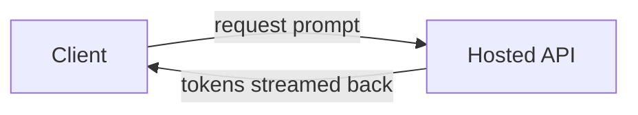

If a new prompt is different from anything already cached and the server hasn't been optimized for reuse (no prompt/KV caching), it gets processed **from scratch** — the full prefill cost is paid again. That reprocessing cost is exactly why caching mechanisms (KV cache) matter, and why serving engines are judged on how well they avoid redundant work.

> [!info]+ Interview questions covered
> - What happens end-to-end when a client sends a prompt to a hosted LLM API?
> - Why does an unoptimized server reprocess a prompt instead of reusing prior work?

### The tokens-per-second ladder

The tutor's serving table lines up four different regimes of "how fast can tokens come out," from a human reading speed baseline up to a fully batched, fully optimized 2026 serving stack:

| Regime | Tokens/sec | Notes |
|---|---|---|
| Human reading speed | 4-6 tok/s | ≈ 200-300 words/min |
| Single-stream 7B model | 50-150 tok/s | Good GPU, no batching |
| Batched H100 (2023-24) | 1,000-3,000 tok/s | Early serving stacks |
| Batched H100 (2026) | 5,000-15,000 tok/s | vLLM / SGLang / FP8 |

**TTFT (time to first token)**, from the same table: a hosted API typically returns its first token in **200-500 ms**; a reasoning model, which burns extra compute on hidden chain-of-thought before it emits anything, pushes that out to **roughly 1 second** for the first visible token.

#### Worked check: does 4-6 tok/s really match "200-300 words/min"?

This is a good sanity-check calculation to be able to do live in an interview:

$$
4\text{–}6\ \text{tok/s} \times 60\ \text{s/min} = 240\text{–}360\ \text{tokens/min}
$$

Given the common heuristic that **1 word ≈ 1.3 tokens** in English, 200-300 words/min converts to roughly:

$$
200\text{–}300\ \text{words} \times 1.3\ \text{tok/word} \approx 260\text{–}390\ \text{tok/min}
$$

That's consistent with the 240-360 tok/min figure above — the two numbers in the table are two different framings (human-reading-speed vs. tokens/sec) of the *same* underlying rate, not two independent facts. Being able to cross-check a table like this on the fly is exactly the kind of numeracy this lecture is trying to build.

> [!info]+ Interview questions covered
> - What is TTFT (time to first token), and how does it differ for a reasoning model vs. a standard hosted API?
> - How do you sanity-check a tokens/sec figure against a human-readable "words per minute" figure?

### Why continuous batching is the multiplier

The tutor's key comparison: **same model, same machine (one H100), single stream vs. 100 concurrent streams.**

- Single stream, no batching → only 50-150 tok/s. The GPU spends most of its time waiting on one request at a time, generating one token per step — the rest of its compute capacity sits idle.
- 100 concurrent streams batched together on the *same* hardware → throughput jumps into the thousands of tok/s, because the GPU now does useful work for many requests in the same pass instead of idling between steps for a single request.

$$
\text{Batching multiplier} \approx \frac{\text{mid-point batched throughput}}{\text{mid-point single-stream throughput}} = \frac{\sim\!10{,}000\ \text{tok/s}}{\sim\!100\ \text{tok/s}} \approx 100\times
$$

This matches the slide's own framing directly: **"Batching is the multiplier: ~100x single stream."**

#### The catch: batching only pays off at scale

Continuous batching isn't free lunch for every workload — it requires enough concurrent traffic to batch in the first place:

- **1-2 users hitting the server** → nothing to batch. You cannot combine requests that don't exist yet, so you're stuck near the single-stream 50-150 tok/s ceiling, and the GPU is genuinely underutilized.
- **Hundreds, thousands, or millions of requests arriving in real time** → the server can continuously assemble and reassemble a batch out of whichever requests are currently in flight, extracting the ~100x multiplier.

This is a direct system-design implication: if you're building a low-traffic internal tool, batching economics don't apply to you the same way they do to a hosted, multi-tenant API — and that changes how you should think about GPU provisioning and cost per request.

> [!info]+ Interview questions covered
> - What is continuous batching, and why does it act as a throughput multiplier?
> - Why doesn't continuous batching help a low-traffic (1-2 user) deployment?

### The 5x jump that came from software, not hardware

The most important number in this section isn't a static fact — it's a **before/after on the same GPU**:

$$
\text{H100, 2023-24: } 1{,}000\text{–}3{,}000\ \text{tok/s} \;\longrightarrow\; \text{H100, 2026: } 5{,}000\text{–}15{,}000\ \text{tok/s} \approx 5\times
$$

Same hardware. Same H100 chip. The 5x improvement came entirely from the serving software stack: better continuous-batching schedulers, FP8 quantization, and modern inference engines (**vLLM**, **SGLang**) that squeeze far more useful work out of identical silicon. As one student put it in the session, "software has a lot of power too" — and the tutor's framing was that this is the *same hardware*, getting *more* out of it purely through better software.

This is directly attributable to why libraries like vLLM exist and are widely adopted: they are purpose-built for serving LLMs efficiently, and their GitHub benchmarks are the source of the 2026 batched-throughput figures.

> [!info]+ Interview questions covered
> - How can the same GPU serve 5x more tokens/sec in 2026 than in 2023-24 without a hardware upgrade?
> - What role do serving libraries like vLLM and SGLang play in that improvement?

### Named building blocks for a future deep dive

The section's key concepts — continuous batching, KV cache, PagedAttention, FlashAttention, speculative decoding — are the named building blocks behind the throughput numbers above. The lecture flags these as a dedicated future topic rather than deriving them from scratch here, but every AI engineer should be able to recognize each term and place it correctly in a system-design discussion:

| Concept | One-line role |
|---|---|
| **Continuous batching** | Dynamically adds/removes requests from an in-flight batch on the GPU instead of waiting for a fixed batch to fully complete — keeps the GPU continuously fed. |
| **KV cache** | Stores previously computed key/value attention tensors per token so the model doesn't recompute them at every new decoding step. |
| **PagedAttention** | Manages the KV cache in fixed-size, non-contiguous memory "pages" (analogous to OS virtual memory) to reduce fragmentation and support larger batch sizes. |
| **FlashAttention** | A fused, memory-efficient attention kernel that avoids materializing the full attention matrix, speeding up both training and inference. |
| **Speculative decoding** | Uses a small, cheap draft model to propose multiple tokens ahead, which the larger model verifies in parallel — cutting the number of expensive full forward passes. |

These are the mechanisms that, in combination, produced the 2023-24 → 2026 throughput jump described above. The tutor pointed to his own existing write-ups — "KV Cache in LLMs," "Paged Attention in LLMs," and "Continuous Batching in LLMs" — as further reading on each mechanism ahead of the dedicated class, and noted that these same inference-optimization blocks (flash attention, PagedAttention, KV cache) carry over into serving vision-language models (VLMs) as well.

> [!info]+ Interview questions covered
> - Name the core LLM inference-optimization techniques used by modern serving engines (vLLM, TensorRT-LLM). What role does each one play?
> - How does KV cache relate to PagedAttention, and why do both matter for serving at scale?


## Continuous Batching, Time-to-First-Token (TTFT), Cost per Million Tokens, and Multimodal Tokenization

### Why "Everything Is a Sequence" — Vision, Audio, and Video as Tokens

Before getting to the hard latency/cost numbers, the tutor answers a student question that sets up *why* the same serving math applies no matter what the input modality is: **is a visual token treated the same way as a text token?**

The answer is yes, and the reasoning matters for system design because it means the throughput/latency numbers you learn for text-only LLMs carry over directly to multimodal models:

- A **Vision Transformer (ViT)** splits an image into a grid of patches (the tutor visualizes this as a 3×3 grid in his blog banner) — first patch, second patch, third patch, ... up to the *n*-th patch. Each patch is turned into a token, exactly the way a sentence is broken into first token, second token, third token, ... up to the *n*-th token.
- Once patches are tokens, **self-attention** works identically to text: every patch/token computes how strongly it relates to every other patch/token in the sequence.
- Under the hood, pixels are converted into numbers (a numeric token representation), the same way characters/words are converted into numbers during text tokenization.
- Because the transformer only ever operates on sequences of numbers, **any modality that can be converted into a sequence can be processed by the same architecture**:
  - **Audio** → a sequence of characters/frequency information → converted to numbers.
  - **Video** → first converted into a sequence of images (frames) → those images are then processed as ViT-style patch sequences.

This is why modern models are natively **multimodal**: they understand text and images (and audio/video) because everything is reduced to the same tokenize → embed → transform → output pipeline.

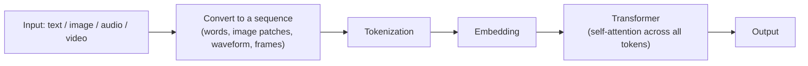

> [!info]+ Interview questions covered
> - What is a Vision Transformer (ViT) and how does it turn an image into tokens?
> - Why are modern LLMs natively multimodal (text, image, audio, video)?
> - How does self-attention generalize from text tokens to visual/audio tokens?

### The Serving Numbers Every AI Engineer Should Memorize: TTFT and Tokens/sec

The system-design motivation here: when you're deciding how an LLM-backed feature will *feel* to a user, two numbers dominate the experience — **how long before anything appears** (Time to First Token) and **how fast text streams in once it starts** (tokens/sec). These are the reference numbers the tutor says every AI engineer should carry in their head:

**TTFT (Time to First Token) — serving:**

| Scenario | TTFT |
|---|---|
| Hosted API (non-reasoning model) | 200–500 ms |
| Reasoning model, first token | ~1 s |

**Tokens/sec — throughput:**

| Serving mode | Tokens/sec |
|---|---|
| Human reading speed | 4–6 tok/s (≈200–300 words/min) |
| Single-stream 7B model (good GPU) | 50–150 tok/s |
| Batched H100, 2023–24 | 1,000–3,000 tok/s |
| Batched H100, 2026 (vLLM / SGLang / FP8) | 5,000–15,000 tok/s |

The key takeaway the tutor stresses: **batching is the multiplier** — going from single-stream to batched serving on the same hardware gets you roughly a **~100x** improvement in throughput. Note also that the jump from 2023–24 to 2026 batched-H100 numbers (1,000–3,000 → 5,000–15,000 tok/s) itself reflects serving-stack maturity: better inference engines (vLLM, SGLang) plus lower-precision **FP8** quantization on the same GPU generation.

```console
SERVING
TTFT hosted API           200-500 ms
reasoning model, 1st token  ~1 s

TOKENS / SEC
human reading         #  4-6 tok/s        (200-300 words/min)
single-stream 7B      ##########  50-150 tok/s     (good GPU)
batched H100 2023-24   ####################  1,000-3,000 tok/s
batched H100 2026      ########################  5,000-15,000 tok/s  (vLLM / SGLang / FP8)
```

> [!info]+ Interview questions covered
> - What is Time-to-First-Token (TTFT) and what is a typical value for a hosted API?
> - Why does a reasoning model have a much higher TTFT (~1 s) than a non-reasoning model (200–500 ms)?
> - What tokens/sec throughput should you expect from a single-stream 7B model vs. a batched H100 in 2023–24 vs. 2026?
> - Why does batching give roughly a 100x throughput multiplier over single-stream serving?

### Prefill vs Decode — What Actually Produces the First Token

A student asks the tutor to unpack TTFT further: *what exactly is happening during prefill vs. decode?* The tutor motivates the split with a concrete worked example using his own sentence, "I love teaching AI":

- **Prefill**: the model reads and "understands" the *entire* input the user has given, in one pass — it needs to read everything and do some remembering before it can respond. This is the "understanding" phase: given "I love teaching", the model builds an internal representation of the whole prompt.
- **Decode**: once the input is understood, the model must *generate* the response **one token at a time**. Continuing the example: the first generated token might be "AI" — that single act of producing the first output token is exactly what TTFT measures (prefill time + generation of that first token). After that, decoding continues token by token — a full stop, then the next token, then the next — until generation is done.

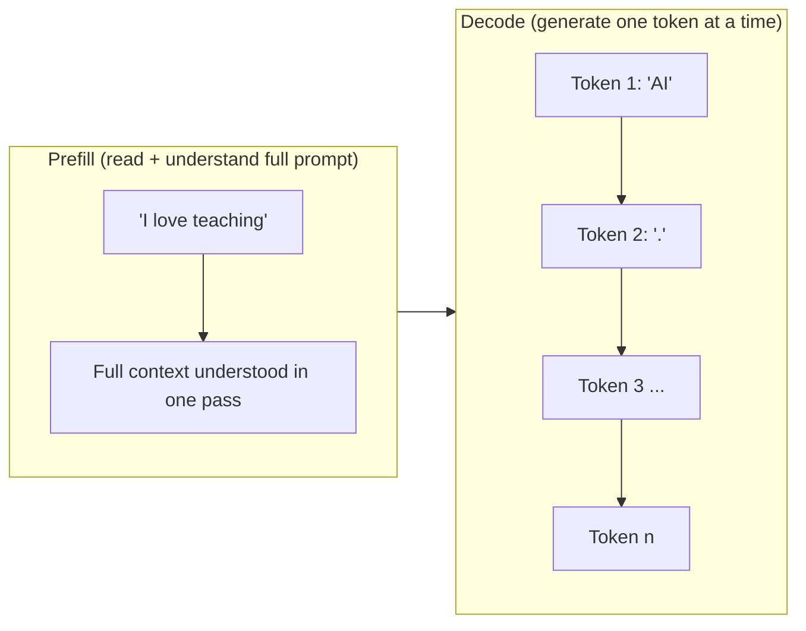

This is also why the two throughput regimes in the table above look so different: prefill processes the whole prompt in parallel (compute-bound, fast per token), while decode is inherently sequential — one token depends on the previous one — which is why single-stream decode throughput (50–150 tok/s) is so much lower than what batched hardware can achieve when many decode steps are packed together.

> [!info]+ Interview questions covered
> - What is the difference between the prefill phase and the decode phase in LLM inference?
> - Why is TTFT tied to the prefill phase (plus generating the first token)?
> - Why is decode throughput (tokens/sec) so much lower than raw GPU compute would suggest for a single request?

### Continuous Batching — Getting the Full Power of the GPU

The tutor flags that continuous batching is a deep topic he'll cover in full later, but gives the system-design-relevant intuition now, because it directly explains the huge throughput jump from "single-stream" to "batched" in the tokens/sec table above.

**Why it matters:** if you serve requests one at a time, the GPU spends most of its time waiting — its massively parallel compute units are built for batched matrix multiplication, not for grinding through one token of one sequence at a time. That idle capacity is wasted money and wasted latency headroom.

**What continuous batching does:** instead of waiting for one request to fully finish before starting the next, the serving engine continuously interleaves the decode steps of many concurrent requests, so the GPU's compute units are always busy. The result, as stated directly: **you get roughly 100x throughput from the same GPU** by not letting it sit idle — which is exactly the gap seen between "single-stream 7B (50–150 tok/s)" and "batched H100 (1,000–15,000 tok/s)" in the table.

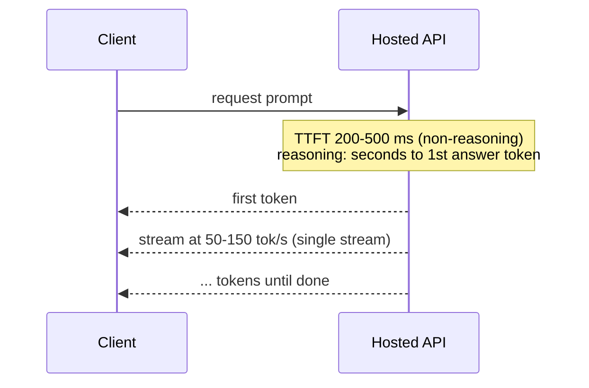

> [!info]+ Interview questions covered
> - What is continuous batching and why does it improve GPU throughput so dramatically?
> - Why does a single-stream request underutilize a GPU compared to batched serving?
> - How do reasoning models differ from non-reasoning models in terms of first-token latency?

### Perceived Speed Formula

Once TTFT and decode rate are established as the two governing numbers, the tutor gives the formula that ties them into a single "how fast did this feel" metric — this is the number a product/system designer actually cares about, since users don't experience TTFT and tokens/sec separately, they experience total wait time:

$$
\text{Perceived speed} = \text{TTFT} + \frac{\text{tokens}}{\text{decode rate}}
$$

In words: the total time a user waits for a complete response is the time to the first token, **plus** however long it takes to stream out the remaining tokens at the model's decode rate. This single formula is what lets you reason about end-to-end latency budgets in a system design discussion — e.g., a low-TTFT model with a slow decode rate can still feel slow for long outputs, and a high-TTFT reasoning model can still feel acceptable if the total output is short.

> [!info]+ Interview questions covered
> - What formula would you use to estimate the total perceived latency of an LLM response?
> - How do TTFT and decode rate (tokens/sec) combine to determine user-perceived speed?

### Cost per Million Tokens

**Why this framing:** every major provider prices its models in dollars per **million** tokens, so the tutor sets up the mental anchor everyone should use: think in units of **10 lakh (1,000,000) tokens** when comparing model costs, not in fractions of a cent per token.

Worked example from the transcript: feeding 10 lakh (1M) tokens into a smaller model costs around **$1** — which the tutor translates to roughly **₹100** for intuition. That single number ("$1 per million input tokens for a small model") is the anchor for comparing everything else.

The reference pricing table he pulls up (Claude lineup, June 2026, $ per million tokens):

| Model | Tier | Input ($/M tok) | Output ($/M tok) |
|---|---|---|---|
| Haiku 4.5 | small | $1 | $5 |
| Sonnet 4.6 | mid | $3 | $15 |
| Opus 4.8 | large | $5 | $25 |
| Fable 5 | frontier | $10 | $50 |

```console
CLAUDE LINEUP - $/MILLION TOKENS (June 2026)

Haiku 4.5 (small)
  in  $1
  out $5

Sonnet 4.6 (mid)
  in  $3
  out $15

Opus 4.8 (large)
  in  $5
  out $25

Fable 5 (frontier)
  in  $10
  out $50
```

The pattern the tutor points out across **every single tier**: **output tokens consistently cost about 5x input tokens** on a per-million basis. He poses this explicitly as something to understand — *why is input price about one-fifth of output price?* — tying it back to the prefill-vs-decode distinction just covered: prefill (input) processes the whole prompt in one parallel pass, while decode (output) is generated sequentially, one token at a time, which is inherently more expensive to serve per token. (The full mechanics of this cost asymmetry are developed further in the next part of the lecture.)

> [!info]+ Interview questions covered
> - Why do LLM providers price per million tokens rather than per token?
> - Why is output-token pricing consistently several times higher than input-token pricing across model tiers?
> - How would you estimate the dollar cost of a request given its input/output token counts and a provider's per-million-token pricing?


## Autoregressive Generation, Diffusion Models, Input Tokens, Output Tokens, and the Transformer Bottleneck

Why does every LLM API charge you differently for the tokens you *send* versus the tokens you *get back*? This is one of the most useful numbers to internalize for system design: the input:output pricing ratio is roughly **1:5**, and it exists for a hard architectural reason — not a business one. This section works through the actual math and mechanics behind that ratio, then looks at diffusion models as an emerging alternative that attacks the same bottleneck from a different angle.

### Why Cost-Per-Million-Tokens Matters: Working the Numbers

Before memorizing a pricing table, build the mental model: think in units of **10 lakh tokens = 1 million tokens**, because every provider quotes price as **$ / million tokens**. This is the unit you should be doing back-of-envelope cost math in during a system design interview or a real capacity-planning exercise.

From the Claude lineup (June 2026) shown on the README slide:

| Model | Input ($/M tokens) | Output ($/M tokens) | Ratio (out : in) |
|---|---|---|---|
| Haiku 4.5 (small) | $1 | $5 | 5x |
| Sonnet 4.6 (mid) | $3 | $15 | 5x |
| Opus 4.8 (large) | $5 | $25 | 5x |
| Fable 5 (frontier) | $10 | $50 | 5x |

From the README.md pricing table shown in VS Code:

```text
CLAUDE LINEUP — $/MILLION TOKENS (June 2026)

Haiku 4.5 (small)
  in  $1
  out $5

Sonnet 4.6 (mid)
  in  $3
  out $15

Opus 4.8 (large)
  in  $5
  out $25

Fable 5 (frontier)
  in  $10
```

Concretely: if you feed **1 million input tokens** into the smallest model (Haiku 4.5), that costs **$1** (roughly ₹100). If you instead get **1 million output tokens back** from that same model, that costs **$5**. Notice this pattern holds across the entire lineup — small, mid, large, and frontier models are all priced at roughly a 1:5 input:output ratio, even as the frontier model's output climbs all the way to **$50 per million tokens** (up from the $5–$25 range of the smaller/mid models).

#### A worked example: "What is the capital of France?"

- Question tokens (input): **≈10 tokens** — "What is the capital of France" tokenizes to about 10 tokens.
- Answer tokens (output): **1–2 tokens** — the answer "Paris" is only one or two tokens.

So a short factual Q&A is naturally input-heavy, output-light — cheap by default. The cost asymmetry only starts to bite when the *output* is long (long-form answers, code generation, chain-of-thought reasoning, etc.), because you're paying the more expensive rate for every one of those output tokens.

**Practical cost-optimization takeaway**: explicitly instruct the model to answer in under 100 words. Since output tokens are 5x the price of input tokens, and most tasks don't need thousand-word answers, capping response length is a direct, cheap lever for reducing per-request cost.

> [!info]+ Interview questions covered
> - Why do LLM APIs price output tokens higher than input tokens?
> - How do you estimate the cost of an LLM API call given token counts?
> - What's a simple lever for reducing per-request LLM cost?

### Why Is Output 5x More Expensive? The Parallel-Read vs. Sequential-Write Asymmetry

This is the mechanical reason behind the 1:5 ratio, and it comes straight from how a transformer processes tokens.

**Reading (input) is parallel.** Think of it like scanning a WhatsApp message: you can look at an entire message at a glance and process all the words together — you're not forced to read word 1, then word 2, then word 3, sequentially, before understanding the whole thing. A GPU works the same way on the *input* prompt: it can compute attention for every word against every other word (how much does "is" attend to "he", how much does "a" attend to "is", etc.) **all at once, in parallel**, fully utilizing the GPU with nothing sitting idle. This is exactly why bigger input prompts don't scale cost linearly with latency the way bigger outputs do — reading can be parallelized regardless of length.

**Generation (output) is inherently sequential.** Writing cannot be parallelized the same way. Take the example: "He is a ___." If you only know "He is a", you cannot predict "boy" *before* you know the model has already predicted "good" — each next word depends on all previously generated words. So the model must go **step by step**, one token at a time.

#### Counting forward passes: "He is a good boy."

Walk through exactly how many forward passes the model needs:

- **Reading the input** "He is a" — this happens in **one pass**. The whole prompt is processed in parallel/batched in a single forward pass through the model, computing all the attention relationships between "he", "is", and "a" simultaneously.
- **Generating the output** "good boy." — this takes **three separate passes**:
  1. Pass 1: predict "good" (using "He is a" as context)
  2. Pass 2: predict "boy" (using "He is a good" as context)
  3. Pass 3: predict "." (using "He is a good boy" as context)

So reading needs 1 pass, but writing the same-length continuation needs 3 full passes — each pass re-running the (increasingly larger) sequence through the model. This asymmetry — one parallel read vs. many sequential re-runs — is *why* output tokens cost more than input tokens. The actual $1:$5 pricing ratio is, in the tutor's words, actually "a generous price" relative to how much more compute output generation really consumes.

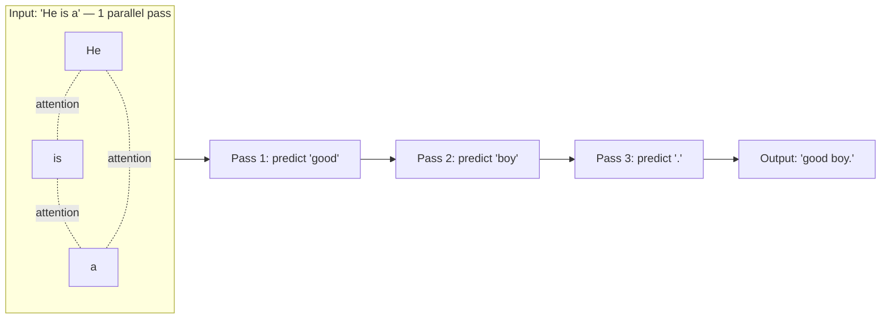

This step-by-step process is called **autoregressive generation**: each new token is generated conditioned on all tokens generated so far, feeding the growing sequence back into the model one token at a time.

> [!info]+ Interview questions covered
> - Why can input tokens be processed in parallel but output tokens cannot?
> - What is autoregressive generation and why is it a bottleneck?
> - How many forward passes does a transformer need to generate N output tokens vs. read N input tokens?

### The Transformer's Fundamental Bottleneck

Put plainly: **sequential, one-token-at-a-time generation is the fundamental bottleneck of the transformer architecture.** No matter how much GPU parallelism you throw at the problem, you cannot get around the fact that token *N+1* depends on token *N* having already been produced. This is the root cause behind:

- The 1:5 (or similar) input:output pricing ratio across virtually every commercial LLM.
- Output-token-heavy workloads (long completions, reasoning traces, code generation) being disproportionately expensive and slow compared to input-heavy workloads (long context, RAG-stuffed prompts) of the same total token count.

This bottleneck is exactly why players like Google have started investing in an alternative generation paradigm: **diffusion models** for text.

> [!info]+ Interview questions covered
> - What is "the transformer bottleneck" and why is it hard to remove?
> - Why does adding more GPUs not fix the input:output cost asymmetry?

### Diffusion Models: Attacking the Bottleneck Differently

Diffusion models (well known from image generation) take a fundamentally different approach to producing a sequence, and Google has begun applying the idea to text generation as a way around the transformer's sequential-decoding bottleneck.

Instead of generating tokens strictly left-to-right, one at a time:

1. The model creates a fixed-size **"canvas"** upfront — e.g., **256 tokens** — representing the full space it intends to eventually fill in with the answer.
2. It then runs a **diffusion process**: repeatedly refining/denoising the entire canvas, filling in tokens (potentially out of left-to-right order, and potentially many at once) across iterations, rather than committing to one final token before moving to the next position.
3. Positions in the canvas that aren't needed for a short answer are simply left empty.

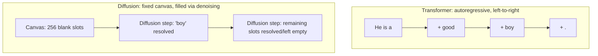

This is described as **parallelizing the generation of tokens** — the opposite of the transformer's strictly sequential decode loop.

#### The tutor's own experiment: transformer vs. diffusion, by answer length

Curious which approach actually wins in practice, the tutor ran his own comparison and reported two findings:

**Finding 1 — for very short answers, transformer wins big.** If the answer is only a single token/word, a standard LLM (transformer) is about **60x–64x faster** than a diffusion model. This makes sense: the diffusion model still has to run its denoising process over an entire fixed canvas (e.g., 256 tokens) even if the "real" answer only needs one word, while the transformer just does one quick forward pass to emit that one token.

**Finding 2 — beyond a ~64-token answer length, diffusion wins.** Once the required answer grows past roughly **64 tokens**, the diffusion model starts to outperform the transformer, because the transformer must pay for one sequential pass *per output token* (linear cost in output length), while the diffusion model's cost is amortized across its parallel refinement steps regardless of how many of the canvas slots are actually "used."

| Answer length | Faster architecture | Why |
|---|---|---|
| Single token / very short (≪64 tokens) | **Transformer** (~60–64x faster) | Diffusion still pays for a full canvas-denoising pass; transformer does one quick step |
| Long (>64 tokens) | **Diffusion model** | Transformer cost grows linearly with sequential passes; diffusion amortizes over parallel refinement |

**System design implication**: this points toward a future *routing* strategy — send queries that can be answered in a small number of tokens to a transformer model, and route queries that need a large number of output tokens to a diffusion model. The tutor expects this kind of hybrid routing to arrive "sooner than expected" as diffusion-based LLMs mature.

> [!info]+ Interview questions covered
> - What is a diffusion language model and how does it differ from an autoregressive transformer?
> - When would a diffusion model outperform a transformer for text generation, and why?
> - How might a production system route requests between transformer and diffusion architectures?

### Recap: Numbers to Remember

- **1 million tokens = 10 lakh tokens** — the standard billing unit; prices are always quoted as $/million tokens.
- **Input:output pricing ratio ≈ 1:5** across the Claude lineup (Haiku $1/$5, Sonnet $3/$15, Opus $5/$25, Fable 5 $10/$50) — driven by parallel reads vs. sequential writes, not arbitrary pricing.
- **"What is the capital of France?"** ≈ 10 input tokens → "Paris" ≈ 1–2 output tokens — a template for estimating token counts of simple Q&A.
- **"He is a good boy."** → 1 forward pass to read the input, 3 forward passes to generate the output — the concrete mechanism behind the pricing ratio.
- **Diffusion canvas size**: ~256 tokens.
- **Crossover point**: transformer ~60–64x faster for single-token answers; diffusion wins past ~64 output tokens.
- **Frontier model output pricing**: up to ~$50/million tokens (vs. $5–$25 for smaller/mid frontier-adjacent models).


## Cost Per Million Output Tokens, Self-Hosted Inference Cost, 70B Parameter Model, H100 GPU, Tokens Per Second

Why does this number matter for system design? Every time you pick a model for a product, you are really answering one question: *what does it cost me to produce one million output tokens, and is that cost justified by the quality I need?* This section builds that number from scratch — first for hosted frontier APIs, then for a self-hosted 7B model, then for a self-hosted 70B model — so that the trade-off between quality and cost becomes a concrete calculation instead of a vague feeling.

### Hosted API pricing: output costs ≈ 5x input, at every tier

Before comparing self-hosting to APIs, you need a baseline for what hosted providers actually charge. The tutor pulls up the Claude pricing lineup as of June 2026, straight from a README slide open in VS Code:

From the README.md slide, "CLAUDE LINEUP — $/MILLION TOKENS (June 2026)":

```
CLAUDE LINEUP — $/MILLION TOKENS (June 2026)

Haiku 4.5 (small)
  in  $1
  out $5

Sonnet 4.6 (mid)
  in  $3
  out $15

Opus 4.8 (large)
  in  $5
  out $25

Fable 5 (frontier)
  in  $10
  out $50

- Output ≈ 5x input at every tier.
```

Cleaned up as a table:

| Tier | Input $/M | Output $/M | Output ÷ Input |
|---|---|---|---|
| Haiku 4.5 (small) | $1 | $5 | 5x |
| Sonnet 4.6 (mid) | $3 | $15 | 5x |
| Opus 4.8 (large) | $5 | $25 | 5x |
| Fable 5 (frontier) | $10 | $50 | 5x |

The heuristic to remember: **output tokens cost about 5x what input tokens cost, at every tier, from the smallest to the frontier model.** This holds whether the model is a small Haiku-class model or the frontier Fable 5. As a rough range across the whole lineup, hosted output pricing runs from about **$5 per million tokens up to $50 per million tokens** depending on tier — and the tutor flags that even a frontier-tier price like $50/M is often a subsidized number; providers may charge less than the "true" cost to attract usage.

One important distinction: this $/M pricing is what you pay when you **call the API directly** (e.g., writing code that hits the model's endpoint). Bundled products like Cloud Code come in flat packages — $100, $200, $2,000/month tiers — which is a *different* pricing structure from raw per-token API billing. Don't confuse subscription-package economics with per-token API economics; they answer different cost questions.

> [!info]+ Interview questions covered
> - Why is output token pricing typically higher than input token pricing for LLM APIs?
> - What is a reasonable rule of thumb for output vs. input token cost ratio?
> - What's the difference between per-token API pricing and bundled/subscription pricing?

### Self-hosted worked example: one H100 (7B model)

Now flip the question: instead of paying per token to a provider, what if you rent your own GPU and host the model yourself? The tutor works this out concretely for a small (~7B parameter) model on a single **H100 80GB** GPU.

The building blocks:

- **GPU**: one H100, 80GB, rented on the cloud at roughly **$3/hour**.
- **Throughput**: with **continuous batching** — serving many requests' worth of decode steps together so the GPU's parallel compute is kept busy — a 7B-class model on this GPU can sustain about **5,000 tokens/second** at the upper end.
- **Time conversion**: there are 3,600 seconds in an hour, so token throughput per hour is:

$$5{,}000 \ \text{tok/s} \times 3{,}600 \ \text{s/hr} = 18{,}000{,}000 \ \text{tokens/hr} \approx 18\text{M tokens/hr}$$

- **Cost conversion**: divide the GPU's hourly rental cost by that hourly token output, then scale to a "per million tokens" basis:

$$\frac{\$3/\text{hr}}{18{,}000{,}000 \ \text{tok/hr}} \times 1{,}000{,}000 \approx \$0.17 \ / \ \text{M output tokens}$$

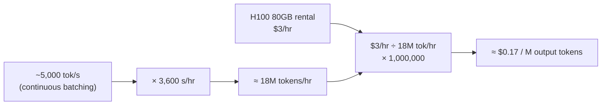

That is a **dramatic** drop from the hosted API range of $5–$50 per million tokens — roughly 30x to 300x cheaper. But there's a crucial catch: this $0.17/M number is for a **7B parameter model**, not a frontier model. Frontier models like Opus are estimated to have **at least 500 billion parameters**, possibly reaching into the trillions — a completely different scale from 7B. So the honest comparison isn't "self-hosting is 100x cheaper than frontier APIs" — it's "self-hosting a small model is cheap, but the quality will not be there" to match a frontier model. You are trading quality for cost, and at the 7B scale, you're trading away a lot of quality.

> [!info]+ Interview questions covered
> - How do you calculate self-hosted inference cost per million output tokens from GPU rental price and throughput?
> - What is continuous batching, and why does it matter for GPU throughput and cost?
> - Why can't you directly compare a 7B self-hosted model's cost to a frontier hosted model's cost without also comparing quality?

### A 70B model: the self-host sweet spot

The 7B example is cheap but low quality. The tutor now scales the same worked example up by roughly 10x in parameter count — a **70B parameter model** — while keeping the same GPU. This is presented as the practical "sweet spot" that many real companies actually run in production.

What changes when the model gets 10x bigger, on the *same* 80GB H100:

- The GPU has a hard, fixed limit on how much parallel computation it can do per step. A bigger model means more computation per token, so the GPU simply can't keep up at the same rate.
- Decode throughput drops from ~5,000 tok/s (7B) to about **~500 tok/s** (70B) — roughly a 10x slowdown, tracking the roughly 10x increase in parameter count.
- The 70B model is made to **fit on the same single 80GB H100** by using **INT8 (or INT4) quantization** — compressing the model's weights so its memory footprint stays within the GPU's 80GB budget, at the cost of throughput.
- The GPU rental cost is unchanged: still **$3/hour**.

Redo the same conversion with the new throughput:

$$500 \ \text{tok/s} \times 3{,}600 \ \text{s/hr} = 1{,}800{,}000 \ \text{tokens/hr} \approx 1.8\text{M tokens/hr}$$

$$\frac{\$3/\text{hr}}{1{,}800{,}000 \ \text{tok/hr}} \times 1{,}000{,}000 \approx \$1.7 \ / \ \text{M output tokens}$$

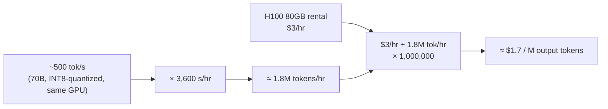

So going from 7B to 70B (10x the parameters) means roughly **10x the cost per token** — from ~$0.17/M to ~$1.7/M — because throughput fell by roughly the same factor while the hardware cost stayed fixed. The GPU cost is the same $3/hr in both cases; only the tokens/sec figure changes, and that number alone drives the entire 10x swing in cost per output token.

Here's the side-by-side:

| Model size | Decode throughput (1× H100 80GB, continuous batching) | Tokens/hour | GPU cost | Cost per million output tokens |
|---|---|---|---|---|
| 7B | ~5,000 tok/s | ~18M tok/hr | $3/hr | ≈ $0.17/M |
| 70B (INT8 quantized) | ~500 tok/s | ~1.8M tok/hr | $3/hr | ≈ $1.7/M |
| Hosted frontier API (for reference) | — | — | — | $5–$50/M |

Why is 70B the "sweet spot" rather than just a worse deal than 7B? Because at ~$1.7/M, self-hosting a 70B model is *still* far cheaper than hosted API pricing (roughly $5/M and up, with frontier-tier models running $10–$25/M or higher), while delivering meaningfully **stronger quality than a 7B model**. The tutor frames **$2/M as a good number to benchmark against**: if you can self-host at under $2/M and it's good enough for your use case, there's little reason to keep paying a hosted provider $5+/M for the same job.

$$\text{Cost per million output tokens} = \frac{\text{GPU \$/hr}}{\text{tokens/sec} \times 3{,}600} \times 10^6$$

This single formula is the core takeaway of the whole section — it's the same formula for the 7B case, the 70B case, or any other self-hosting configuration you might evaluate; only the throughput (tokens/sec) and the GPU rental rate change.

> [!info]+ Interview questions covered
> - Why does doubling (or 10x-ing) model size reduce GPU decode throughput, even on the same hardware?
> - What role does INT8/INT4 quantization play in fitting a large model onto a single GPU?
> - What is the general formula for computing self-hosted $/M output tokens from GPU cost and throughput?
> - Why might a 70B self-hosted model be considered a "sweet spot" compared to both a 7B model and a frontier hosted API?

### Why real companies are actually doing this

This isn't just a theoretical exercise — the tutor points to concrete evidence that top US companies are self-hosting open models in production, not just companies in India, China, or Europe.

- Companies like **Airbnb, Stripe, and Spotify** are reported to be running **self-hosted models**, and specifically models that originated from **Chinese labs — mostly Alibaba** (e.g., Qwen), rather than paying for a frontier hosted model like Opus for every request.
- The reasoning is straightforward economics: for customer-facing work (a support agent, a customer-analysis pipeline, etc.), paying **$10–$25 per million tokens** (Opus-class, sometimes subsidized down to around $10–$15) is hard to justify when a self-hosted 70B model can deliver comparable results for **under $2 per million tokens**.
- Frontier hosted models genuinely are smarter — the tutor is explicit that this isn't a claim that self-hosted models are simply "as good." The point is that open-source 70B-class models (from Alibaba, DeepSeek, and similar) are **good enough for certain kinds of tasks**, even if they're not good at everything.
- One piece of real, checkable evidence: **Hugging Face download counts**. Chinese open-source models show download numbers in the millions on Hugging Face, which is hard data suggesting many companies really are using and fine-tuning these models, not just talking about it.
- **Fine-tuning for a narrow domain** is the key move that makes a 70B model competitive with a frontier model for a specific job. Example: a company like Spotify doesn't need a general-purpose frontier model to check **order status** on its website — that's a narrow, well-defined task. Instead of routing every request to an expensive general-purpose API, a company can fine-tune (a one-time process) a 70B open model to handle that specific domain — writing code, creating documents, tracking order status — and self-host it in production for a fraction of the cost.
- This is already happening publicly: **Spotify's founder** has said publicly that they use this approach in production. **Airbnb's founder** has mentioned (on social media, largely uncovered by mainstream press) that they use the **Qwen** model.
- A related real-world illustration: **Cursor** claimed to have released its own frontier coding model with strong performance and cheap pricing. It later came out (via a leaked API header) that this model was actually a fine-tuned, RLHF'd version of **Moonshot AI's Kimi** model, re-released without disclosing the underlying base model — another example of a company building on top of an existing open Chinese model rather than training one from scratch.

> [!info]+ Interview questions covered
> - What real-world evidence exists that companies are adopting self-hosted open-source LLMs in production?
> - Why would a company fine-tune and self-host a 70B open model instead of always calling a frontier API?
> - How can Hugging Face download statistics be used as a signal of open-model adoption?
> - What's an example of a company building a "frontier" product on top of an existing open model rather than training from scratch?

### Takeaway

The core mental model to carry forward: self-hosted inference cost per million output tokens is entirely a function of **GPU $/hr divided by tokens/sec throughput** (scaled to an hourly and then per-million basis). Model size drives throughput down (via GPU parallel-compute limits) and therefore drives cost per token up — a 10x bigger model costs roughly 10x more per token on the same hardware. The practical decision for system design is not "cheapest wins" or "highest quality wins," but finding where a self-hosted, possibly fine-tuned, mid-size model (like a 70B) clears your quality bar at a fraction of hosted frontier pricing — which is exactly the calculation top companies like Airbnb, Stripe, and Spotify are reported to be making today.


## Cost Per Million Output Tokens, On-Demand GPU Hourly Pricing, DeepSeek, Model Tier Pricing, and AI Guardrails

### Why Training-Cost Efficiency Became a System-Design Number (The Kimi/DeepSeek Story)

Before getting to the reference numbers, the tutor motivates *why* training-cost efficiency belongs on an AI engineer's numbers sheet at all, using a real incident as the hook. A US-based company (Cursor) released what it called its "own frontier" coding model without disclosing what it was built on. Someone inspecting the API noticed that a header field had been left unchanged and still said "Kimi" — the name of a model from Moonshot AI, a China-registered company (headquartered out of Singapore). Once this was posted publicly, the company confirmed it: they had taken the Kimi model and done further **RLHF (Reinforcement Learning from Human Feedback)** — i.e., fine-tuning on top of it to change its behavior — rather than training a frontier model from scratch.

The reason this matters for system design isn't the gossip — it's the cost delta it reveals. The US restricted GPU exports to China (an "export/import" restriction under the Trump administration), meaning Chinese labs had far less raw compute available than US labs. Despite that constraint, Chinese labs have produced some of the most compute-efficient training research in the field:

| Lab | Approx. training cost (early frontier-scale model) |
|---|---|
| OpenAI | **~$100 million** |
| DeepSeek | **~$5.6–5.8 million** |

That is roughly a **20x** cost reduction for a comparable capability tier. DeepSeek achieved this partly through **multi-token prediction (MTP)** — instead of a transformer predicting one token at a time (the standard autoregressive approach), MTP trains the model to predict *multiple* future tokens per forward pass, which is more training-compute-efficient. This technique, pioneered in Chinese research (DeepSeek), has since been adopted by frontier labs elsewhere — the tutor notes Google's **Gemma** now ships with MTP and GGUF-format (quantized, easily self-hostable) releases. The broader point: research innovation, not just raw GPU count, is what has been driving down the cost of training and, downstream, the cost of serving tokens.

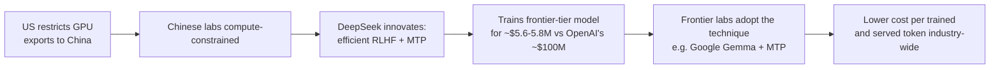

> [!info]+ Interview questions covered
> - What is RLHF, and how is it different from pretraining a model from scratch?
> - What is multi-token prediction (MTP), and why is it more training-efficient than standard next-token prediction?
> - Why did GPU export restrictions push Chinese AI labs toward training-efficiency research instead of scale?

### Self-Hosted vs. Managed Inference: Who Actually Pays for the GPU?

A natural follow-up question the tutor raises: if a Chinese model like DeepSeek is open source, why would anyone pay for a hosted frontier API instead of just running it for free? The answer is that **"open source" only means the weights are free — the compute to run them is not.** Wherever you run the model, you need a GPU, and GPUs cost money one way or another:

- **Buy your own GPU.** A high-end GPU like an H100 costs roughly **₹30 lakh** (~$36K) outright — most individuals and teams won't buy that. A more realistic self-purchase is a cheaper consumer card in the **₹3–4 lakh** range.
- **Rent from the cloud.** To run a model *faster*, you need a bigger, better-optimized GPU — which you typically don't own, you rent it on-demand from a cloud provider and pay by the hour.
- **Use a managed API** (e.g., Claude). The provider handles all GPU provisioning for you; you never think about hardware.

The catch with self-hosting is that GPU rental is only part of the bill. At small scale (a small model, modest traffic) self-hosting is cheap. But at company scale — many concurrent internal use cases (e.g., an internal LLM reading HR reviews), user-facing latency requirements, uptime guarantees — you need a **DevOps team** to run that infrastructure, and that team's cost can exceed the cost of the model itself. This is where serving libraries like **vLLM** help: they let a company serve a self-hosted model at high precision and low latency without building all of that tooling from scratch — but you still need a team to operate it.

```mermaid
flowchart TD
    A[Need to run a model] --> B{Self-host or managed API?}
    B -->|Self-host| C[Buy GPU ~₹30L H100<br/>or rent cloud GPU $/hr]
    C --> D[Need DevOps team<br/>+ serving stack e.g. vLLM]
    D --> E[Cost = GPU $/hr + team overhead]
    B -->|Managed API| F[Provider owns all GPU + ops]
    F --> G[Cost = $/M tokens, no infra team]
```

> [!info]+ Interview questions covered
> - If a model's weights are open source and free, why does running it still cost money?
> - What is the real trade-off between self-hosting an open-weights model and using a managed/hosted API?
> - What role does a library like vLLM play in self-hosted LLM serving?

### Recap: Bytes per Parameter Drives "What Fits Where"

To decide which GPU a model needs, you first need the model's memory footprint, which comes from **parameter count × bytes per parameter**. As a quick recap of the precision-to-size arithmetic used throughout this course: storing the same value (`0.3927`) at each precision uses progressively fewer bytes and progressively coarser rounding —

| Precision | Stored value | Bytes/param |
|---|---|---|
| FP32 | `0.3925790` | 4 bytes |
| FP16 | `0.39258` | 2 bytes |
| INT8 | `0.393` | 1 byte |
| INT4 | `0.40` | 0.5 bytes |

— which scales up to real model sizes:

| Precision | 7B model size | 70B model size |
|---|---|---|
| FP32 | 28 GB | 280 GB |
| FP16 | 14 GB | 140 GB |
| INT8 | 7 GB | 70 GB |
| INT4 | 3.5 GB | 35 GB |

A 70B model is exactly **10x** the size of a 7B model at every precision level. These numbers are the direct input to the next table — matching a quantized model's memory footprint to a specific GPU.

### What Fits Where (Weights Only)

| Model + precision | Weight size | Fits on |
|---|---|---|
| INT4 7B | 3.5 GB | 8 GB consumer GPU |
| FP16 7B | 14 GB | 24 GB card (e.g. RTX 4090) |
| INT4 70B | 35 GB | 40 GB A100 |
| INT8 70B | 70 GB | 80 GB H100 |
| FP16 70B | 140 GB | needs **2x** 80 GB GPUs |

The pattern to internalize: quantizing a model down doesn't just save disk space — it's frequently the deciding factor in whether it fits on **one** GPU at all versus needing multiple GPUs sharded together.

### GPU Memory and Hourly Cost

Once you know how many GB you need, the next number is what that hardware actually rents for on-demand:

| GPU | Memory | Type | On-demand $/hr |
|---|---|---|---|
| Apple M (laptop) | 16 GB | laptop | — |
| RTX 4090 | 24 GB | consumer | $0.30 – $0.70 |
| RTX 5090 | 32 GB | consumer | $0.60 – $1.00 |
| A100 | 40 GB | cloud | $1.00 – $3.00 |
| A100 | 80 GB | cloud | $1.00 – $3.00 |
| H100 | 80 GB | cloud | $2.00 – $4.00 |
| Apple M5 Max (laptop) | 128 GB | laptop | — |

This table is the hardware side of the equation; the next step is turning $/hr into $/million tokens, which is the number that actually matters when comparing self-hosting to a hosted API.

> [!info]+ Interview questions covered
> - How do you compute a model's memory footprint from parameter count and precision?
> - Given a quantized model's size, how do you determine which GPU(s) it can run on?
> - What is the rough on-demand hourly rental cost of common GPUs (RTX 4090/5090, A100, H100)?

### Worked Example: Cost per Million Output Tokens on One H100 (7B Model)

This is the calculation that ties every number above together into something you can actually quote in a system-design interview. The pattern is always the same three steps: **throughput → tokens/hour → cost/hour ÷ tokens/hour = cost per million tokens.**

**Step 1 — Throughput.** For a batched 7B model running on a single H100 (2026-era serving stack), ~**5,000 tokens/sec** output throughput is realistic.

**Step 2 — Tokens per hour.**

$$
5{,}000\ \text{tok/s} \times 3{,}600\ \text{s/hr} = 18{,}000{,}000\ \text{tok/hr} = 18\text{M tok/hr}
$$

**Step 3 — Cost per million tokens.** At **$3/hr** for the H100:

$$
\frac{\$3/\text{hr}}{18\text{M tok/hr}} \approx \$0.17\ /\ \text{M output tokens}
$$

```mermaid
flowchart LR
    A["5,000 tok/s"] --> C["× 3,600 s/hr"]
    C --> D["= 18 M tok/hr"]
    D --> E["÷ $3/hr GPU cost"]
    E --> F["≈ $0.17 / M output tokens"]
```

Self-hosted output at **~$0.17/M** undercuts hosted frontier-API output pricing (**$5–50/M**) by roughly **30–300x**. But this isn't a fair apples-to-apples comparison — it's a 7B model, not a frontier-scale one — so the real trade-off is model quality vs. operational effort vs. **idle-GPU risk** (if the rented GPU sits idle, you're still paying the $2–4/hr rental with nothing to show for it, which erodes the cost advantage fast).

### A 70B Model: The Self-Host Sweet Spot

Stepping up from 7B to 70B changes the throughput and cost numbers, but not the method:

- A 70B model at **INT8** (70 GB) fits on **one** 80 GB H100.
- Because it has **~10x** the weights of the 7B model, decoding is roughly **~10x slower** — realistic throughput drops to **~500 tok/s**.

$$
500\ \text{tok/s} \times 3{,}600\ \text{s/hr} = 1{,}800{,}000\ \text{tok/hr} = 1.8\text{M tok/hr}
$$

$$
\frac{\$3/\text{hr}}{1.8\text{M tok/hr}} \approx \$1.7\ /\ \text{M output tokens}
$$

```mermaid
flowchart LR
    A["~500 tok/s"] --> C["× 3,600 s/hr"]
    C --> D["= 1.8 M tok/hr"]
    D --> E["÷ $3/hr GPU cost"]
    E --> F["≈ $1.7 / M output tokens"]
```

~10x the weights → ~10x slower decode → ~10x the cost per token ($0.17 → $1.7), which is exactly the proportional relationship you'd expect. The key takeaway: even at **~$1.7/M**, a self-hosted 70B model still beats hosted frontier pricing ($5–50/M) while delivering meaningfully stronger quality than a 7B model — making it, in the tutor's framing, the **practical self-host sweet spot** between cost and capability.

> [!info]+ Interview questions covered
> - Walk through the three-step calculation to derive self-hosted cost per million output tokens from GPU throughput and hourly rental price.
> - Why does a 70B model cost roughly 10x more per token to serve than a 7B model on the same GPU?
> - Why is a self-hosted 70B (INT8) model often called the "self-host sweet spot"?

### Cost per Million Tokens: Model Tier Pricing (Small / Mid / Large / Frontier)

On the hosted-API side, the reference doc uses a Claude-style lineup to illustrate how pricing scales across model tiers (figures below are the illustrative June 2026 pricing table used in the course):

| Tier | Model | Input $/M | Output $/M |
|---|---|---|---|
| Small | Haiku 4.5 | $1 | $5 |
| Mid | Sonnet 4.6 | $3 | $15 |
| Large | Opus 4.8 | $5 | $25 |
| Frontier | Fable 5 | $10 | $50 |

The pattern to memorize: **output tokens cost roughly 5x input tokens at every single tier**, regardless of whether you're looking at the cheapest or most expensive model in the lineup. This 5x multiplier holds because output generation is sequential and more compute-intensive per token than processing an already-known input prompt.

> [!info]+ Interview questions covered
> - How does per-token pricing typically scale across a model provider's small/mid/large/frontier tiers?
> - Why do output tokens consistently cost ~5x more than input tokens across pricing tiers?

### AI Model Guardrails: Mythos vs. Fable 5, and Why "Frontier" Models Get Restricted

Frontier models are expensive to serve, which raises a natural question: why did the frontier model "Fable 5" reportedly get banned? The tutor's explanation introduces an important system-design concept — **capability guardrails between a lab's internal model and its public release**:

- **Mythos** is described as the more capable underlying model — it can do essentially anything, including tasks like assisting with genuinely novel AI research or architecture design.
- **Fable 5** is a guardrailed derivative of Mythos that can only perform roughly **80%** of what Mythos can do. The provider deliberately tweaked certain behaviors/numbers so that Fable 5 **refuses** a subset of sensitive tasks (e.g., designing a completely new AI architecture) even though the underlying capability exists in Mythos.

What reportedly triggered the ban wasn't the model itself but a **jailbreak** — users crafting specific inputs/prompts via the API that caused Fable 5 to bypass its guardrails and start behaving like the unrestricted Mythos. Per the tutor's account of public reporting, this was flagged to a government body, leading to Fable 5 being taken offline. Separately, a viral screenshot claiming Fable 5 was secretly a "**3.5T**" (3.5 trillion) parameter model downloadable via torrent is **not real** — it's a meme that looked plausible only because industry discussion is currently centered on trillion-parameter frontier models, making the fake number feel believable at a glance.

```mermaid
flowchart LR
    A[Mythos<br/>full-capability model] -->|guardrails applied,<br/>~80% of capability retained| B[Fable 5<br/>public frontier release]
    B -->|jailbreak: crafted inputs<br/>bypass guardrails| C[Fable 5 behaves like Mythos]
    C --> D[Reported publicly -> model taken down]
```

> [!info]+ Interview questions covered
> - What is a guardrail in the context of a hosted frontier model, and why might a provider deliberately restrict capability?
> - What is a jailbreak, and why is it a system-design/safety concern for hosted AI APIs?
> - Why should you be skeptical of viral claims about a model's parameter count without a verified source?

### Wrap-Up: The Reference Document and the Next-Class Exercise

Closing out this segment, the tutor reiterates why this entire numbers discussion exists: these baseline numbers let you **calculate cost and determine what type of server infrastructure a system needs** — which is exactly the skill a system-design interview or a real infra decision demands. He commits to uploading the underlying reference document (organized into five sections: *Tokens and Text*, *Bytes per Parameter*, *GPU Memory and Hourly Cost*, *Throughput and Latency Anchors*, and *Cost per Million Tokens*) to the classroom, and explicitly recommends going through it once with **pen and paper**, copying the numbers down by hand so they stick — not to memorize by force, but so they're recognizable and relatable the next time they come up.

As a bridge to the next class — designing **ChatGPT end-to-end** — the assigned exercise is to closely observe real ChatGPT behavior: what happens when you type, when you upload a file, when the first token arrives, when you ask it to reason, and when you upload an image. Observing every one of those interactions, paired with the numbers from this reference sheet, is presented as the best way to actually learn system design rather than just reading about it abstractly.

> [!info]+ Interview questions covered
> - What five categories of baseline numbers does the course's reference document organize AI system-design numbers into?
> - Why does the tutor recommend hand-copying reference numbers instead of just reading them once?


## Cost Per Million Output Tokens, Cost Estimation For System Design, Latency Controlled By Provider, Quantization INT8/INT4, Bytes Per Parameter

This section closes the "Numbers Every AI Engineer Should Know" reference sheet with the money side of the story: how many **bytes per parameter** a model needs at each precision, how to turn a subscription bill into a **cost-per-million-token** estimate you could actually defend in a system-design interview, why **reasoning models** cost more, and why **latency is mostly out of your hands** once you pick a provider.

### Bytes Per Parameter: Why Quantization Changes Model Size

Before you can estimate GPU memory or hosting cost, you need one primitive fact: **how many bytes does one parameter occupy at a given numeric precision?** This matters for system design because it directly drives how much GPU memory (and therefore how many/which GPUs) you need to load a model.

The rule is simple — bits divided by 8:

| Precision | Bits | Bytes / parameter |
|---|---|---|
| FP32 | 32 bits | 4 bytes |
| FP16 | 16 bits | 2 bytes |
| INT8 | 8 bits | 1 byte |
| INT4 | 4 bits | 0.5 bytes |

Quantization is exactly this: storing the same weight value with fewer bytes, at the cost of precision. The tutor illustrates this by storing the same number, `0.3927`, at each precision:

| Precision | Stored value | Bytes |
|---|---|---|
| FP32 | 0.3925790 | 4 |
| FP16 | 0.39258 | 2 |
| INT8 | 0.393 | 1 |
| INT4 | 0.40 | 0.5 |

Notice the value gets coarser as you drop precision — FP32 keeps 7 significant digits, INT4 rounds all the way to `0.40`. That precision loss is the trade-off you're making whenever you quantize a model down from FP16/FP32 to INT8/INT4 to save memory or speed up inference.

#### Why It Matters: Model Weight Memory Footprint

Multiply bytes/parameter by the parameter count and you get total weight memory. Worked out for a **7B parameter model**:

| Precision | Bytes/param | Size |
|---|---|---|
| FP32 | 4 | 28 GB |
| FP16 | 2 | 14 GB |
| INT8 | 1 | 7 GB |
| INT4 | 0.5 | 3.5 GB |

And for a **70B parameter model** — exactly 10× the parameter count of the 7B model, so every row is also exactly 10× larger:

| Precision | Bytes/param | Size |
|---|---|---|
| FP32 | 4 | 280 GB |
| FP16 | 2 | 140 GB |
| INT8 | 1 | 70 GB |
| INT4 | 0.5 | 35 GB |

The tutor's takeaway line: **"70B = 10x the 7B at every precision."** This is the mental shortcut for a system-design interview — once you know the 7B numbers by heart, you can scale them linearly to estimate any model size, and you can immediately see how much GPU memory quantizing from FP16 to INT8 (or INT4) would free up.

> [!info]+ Interview questions covered
> - How many bytes does a model parameter take at FP32/FP16/INT8/INT4?
> - How do you estimate the memory footprint of a 7B or 70B parameter model?
> - What does quantization actually trade off, and how do you quantify that trade-off?

### A Worked Example: What Does Your Subscription *Actually* Cost You?

The tutor motivates cost-per-token estimation with his own numbers, live, in response to a student asking how much AI subscription plans are "subsidized" by the provider.

**The setup:**
- He pays **$200/month** for a "20x Max" style plan (≈ ₹28,000/month in India).
- He runs **two accounts** — his own plus his wife's (on a different model) — so combined household spend is **$200 + $200 = $400/month**.
- His estimated real usage: **~20 million tokens/day**, mostly for heavy coding-agent work (he separately mentions burning through ~80–100 million tokens on another provider's trial within just 3 days of hard usage).

**Step 1 — a deliberately conservative estimate.** Using a low blended rate of about **$10 per million tokens**:

$$20{,}000{,}000 \text{ tokens/day} \times \frac{\$10}{1{,}000{,}000 \text{ tokens}} = \$200/\text{day}$$

That's already roughly what he pays for the *entire month* — for one day of API-metered usage.

**Step 2 — a more realistic estimate.** He explicitly says the $10 figure is "taking a very less" (deliberately low) rate, and that the real blended rate for the frontier-tier model he actually uses (Opus-class) is closer to **$25 per million tokens**:

$$20{,}000{,}000 \text{ tokens/day} \times \frac{\$25}{1{,}000{,}000 \text{ tokens}} = \$500/\text{day} \approx ₹50{,}000/\text{day}$$

**Step 3 — scale to a month:**

$$₹50{,}000/\text{day} \times 30 \text{ days} \approx ₹15{,}00{,}000/\text{month}$$

So the *true* API-metered cost of his usage is roughly **15 lakh rupees a month** — versus the **₹28,000–56,000/month** (i.e., $200–400) he actually pays via the flat subscription.

#### Why It Matters: This Is Cross-Subsidization, Not a Provider Subsidy

That's roughly a 25–50× gap between what a heavy user's tokens "should" cost and what the subscription charges. The natural question: is the cloud provider just eating that loss?

The tutor's answer: **no — it's cross-subsidization across the user base, not a subsidy from the provider.** Out of, say, 100 subscribers each paying ~$200/month:

| User segment | Share of subscribers | Typical usage value |
|---|---|---|
| Light/casual users | ~95–99% | As little as ~₹1,000/month worth of actual tokens |
| Heavy/power users (e.g., running parallel coding-agent sessions all day) | ~1–5% | Can be worth ₹10+ lakh/month in raw API terms |

The provider collects a large, fairly predictable pool of subscription revenue from mostly-light users, and a small fraction of power users consume a disproportionate share of that pool. So the heavy user isn't subsidized by the cloud provider losing money on them broadly — they're subsidized by the other 95–99% of subscribers who pay the same flat fee but barely use the product. This dynamic is common across US and India: most people paying a $200/month plan use only a small percentage of what they're entitled to.

> [!info]+ Interview questions covered
> - How would you estimate the real per-token cost of a flat-rate LLM subscription?
> - Why do power users on flat AI subscriptions appear to be "subsidized," and is that literally true?
> - How do you convert a daily token-volume estimate into a monthly cost projection for system design purposes?

### Cost Per Million Tokens: The Claude Model Lineup

Once you can estimate token volume, you need real per-model pricing to plug in. The reference sheet lists the Claude family pricing (as of the lecture's June 2026 snapshot):

| Model | Tier | Input $/M tokens | Output $/M tokens | Output ÷ Input |
|---|---|---|---|---|
| Haiku 4.5 | small | $1 | $5 | 5× |
| Sonnet 4.6 | mid | $3 | $15 | 5× |
| Opus 4.8 | large | $5 | $25 | 5× |
| Fable 5 | frontier | $10 | $50 | 5× |

#### Why It Matters: Output Tokens Are Always the Expensive Half

Across every single tier, **output tokens cost exactly 5× input tokens**. This is the general shape of LLM API pricing you should carry into an interview: input (prompt/context) is comparatively cheap, but every token the model *generates* — including any chain-of-thought — is billed at a steep premium. That's the direct link to the next topic: reasoning models generate far more output tokens per response, so their real-world cost multiplier compounds on top of an already-expensive output rate.

> [!info]+ Interview questions covered
> - How is LLM API pricing typically structured (input vs. output token cost)?
> - Why is output token cost consistently higher than input token cost, and by roughly how much?

### Reasoning Models Cost More: The ~10× Token Overhead

A student asks the key applied question: if you enable a reasoning model versus a plain model, what actually changes, and does it cost more?

**What changes in the UI:** a reasoning model exposes its **thinking process** — the steps the model worked through — before giving the final answer. A non-reasoning model just returns the answer directly.

The tutor demonstrates with a worked chain-of-thought example (pens-and-notebooks cost problem):

```text
<think>
Pens: 2 pens cost 5 rupees, so 1 pen costs 2.5 rupees.
6 pens cost 6 * 2.5 = 15 rupees.

Notebooks: 3 notebooks cost 12 rupees, so 1 notebook costs 4 rupees.
9 notebooks cost 9 * 4 = 36 rupees.

Total = 15 + 36 = 51 rupees.

Let me verify. 6 pens means 3 packs of 2 pens, each pack 5 rupees, so 3 * 5 = 15. Correct.
9 notebooks means 3 packs of 3 notebooks, each pack 12 rupees, so 3 * 12 = 36. Correct.
Total 15 + 36 = 51. Correct.
</think>

We pay 51 rupees in total.
```

Everything inside `<think>...</think>` is generated (and billed) as **output tokens** — it's the model talking through hypotheses, trying small examples, and double-checking itself, exactly the way a person would verify arithmetic by hand, before it commits to the final answer line.

#### Why It Matters: Not Every Question Needs Reasoning

The tutor's contrast: ask **"What is the capital of France?"** and a reasoning model gains you nothing — "Paris" is pure knowledge retrieval, there is no multi-step problem to think through. Reasoning is worth paying for only when a question genuinely benefits from step-by-step deliberation (math, multi-constraint logic, verification-heavy tasks) — not for simple factual lookups.

**The overhead, quantified:** reasoning models consume **at least ~10× the tokens** of a non-reasoning model for the same underlying task (the tutor mentions the range can run 10×–15×–30× depending on the problem, but settles on **~10×** as the number to remember). Combined with the fact that output tokens are already the expensive half of the pricing table above, choosing "reasoning: on" for a task that didn't need it is a compounding cost mistake: you pay the ~5× output premium on ~10× more tokens.

> [!info]+ Interview questions covered
> - What's the practical difference between a reasoning model and a non-reasoning model?
> - How much more expensive is a reasoning model, in tokens, versus a standard model?
> - When should you *not* pay for reasoning-model overhead in a production system?

### Multi-Token Prediction (MTP): Not a Model, a Decoding Trick

A student conflates MTP with a separate model architecture; the tutor clarifies: **MTP is not a model — it's a decoding technique used by transformer models** to predict more than one token per forward pass.

```mermaid
flowchart LR
    A["Input: 'He is a'"] --> B["Transformer model with an MTP head"]
    B --> C["Predicts 2 tokens at once: 'good boy'"]
```

Instead of generating one token, checking it, then generating the next (`good` → `boy`), an MTP-enabled model predicts a short span (e.g., two tokens) in a single step. This is faster because you get more output per forward pass, but it carries a small risk: the joint prediction can occasionally be slightly less accurate than doing it token-by-token, since the model commits to both tokens together instead of conditioning the second token on having definitely generated the first. This is a transformer-specific trick — it exists because transformer decoding is inherently sequential and expensive, so any technique that reduces the number of forward passes per response directly reduces latency and serving cost.

> [!info]+ Interview questions covered
> - What is multi-token prediction (MTP) and which model architectures use it?
> - What's the speed/precision trade-off in MTP?

### API vs. Self-Hosted: What a Design Interview Actually Wants From You

Pulling the numbers together, the discussion turns to how this cost math shows up in a system-design interview. The tutor's framing, using the reference sheet's mind map:

```mermaid
mindmap
  root((Numbers Every AI Engineer Should Know))
    Tokens
    Model Size
    Hardware
    Speed
      TTFT 200-500 ms
```

**Why API-first is the default starting point:** standing up your own inference stack — DevOps, GPU provisioning, serving infrastructure — is not trivial. So in practice, teams first validate that the *product* works using a provider's API (e.g., Claude, Codex), and only consider self-hosting (with the GPU/model-size math from earlier in this reference sheet — H100 vs. RTX 4090-class comparisons, bytes-per-parameter sizing) once the product is proven.

**Why cost is the lever you actually control:** in a design interview, you're expected to compare "use an existing frontier model via API" against "build/host your own model," and cost estimation (exactly the token-volume × $/million-token math above) is the main quantitative tool for that comparison. Two dimensions are explicitly *not* under your control once you pick a provider:

- **Response quality** — determined by the provider's training recipe (more data, more parameters, more layers, bigger GPU clusters).
- **Latency** — "latency and all is controlled by them," including metrics like **time to first token (TTFT)**, which the reference sheet's Speed branch pegs at roughly **200–500 ms**.

**Hybrid solutions:** if a smaller or self-hosted model can't match the quality of a top-tier model (the example given: a smaller/Chinese-origin model versus Opus 4.8), the practical answer is often a **hybrid architecture** — routing the bulk of traffic to a cheaper model and escalating only the hard cases to the expensive frontier model.

> [!info]+ Interview questions covered
> - In a system-design interview, how do you justify choosing an API provider over self-hosting a model (or vice versa)?
> - What can and can't you control once you commit to a model provider's API?
> - What is TTFT, and what's a reasonable ballpark for it?
> - What is a hybrid model architecture and when would you reach for one?

### Serving Optimization vs. Quality Optimization: What's Public and What Isn't

Closing the section, the tutor draws a line between two different kinds of model optimization that are easy to conflate:

1. **Quality optimization** — improving how good the model's answers are. This is done via more training data, more parameters, more layers, bigger GPU clusters. The recipe is largely public: papers from labs (including Chinese labs) describing these scaling choices are openly published.
2. **Serving/inference optimization** — making an already-trained model *faster and cheaper to run* without touching its answer quality. This is the subject of a dedicated later class on serving (referred to here as the "VLM" — serving/inference engine — class), covering what providers like Claude have done internally to serve their models faster.

The honest caveat: **what a specific lab has actually implemented internally is not publicly confirmed** — but a large fraction of the *techniques* are: the tutor estimates roughly **9 out of 10** serving-optimization techniques used by major providers are already documented in the public domain (research papers, engineering blogs — including his own). That lets you reason by analogy — e.g., inferring that if Google has published diffusion-model research, they've likely applied comparable serving optimizations to their diffusion models internally, even without direct confirmation.

> [!info]+ Interview questions covered
> - What's the difference between optimizing a model for quality versus optimizing it for serving/inference speed?
> - How much of modern LLM serving optimization is public knowledge versus proprietary?


## KV Cache Warm-Up & Pre-Fetching, Request Routing, and Token Streaming vs. Estimation

Most of what makes serving fast is not secret. The tutor notes that roughly nine out of ten serving optimizations used by providers are already public knowledge — some documented in his own blog, others visible in source code that leaked and was discussed in a prior class. The system-design skill to build is the habit of tracing a request's **complete inflow**, end to end, and breaking that flow into the smallest possible steps rather than reasoning only about "user hits Enter → server responds."

### KV Cache Warm-Up via Pre-Fetching

Applying that "smallest steps" habit to a chat UI raises a concrete question: what happens *before* you press Enter?

- As you type each character, the client may already be streaming that partial input to the server.
- The server can use those characters to start building the KV cache early — effectively **warming it up** — so that when Enter is finally pressed, part of the compute is already done.
- This has to be balanced carefully: a provider cannot afford to eagerly compute on every keystroke, since most partial inputs never turn into a final query. Some lightweight classification could also happen at this stage — e.g., noticing early characters suggest a math question and preparing to redirect to a math-specialized model.

```mermaid
flowchart LR
    A[User types<br/>character by character] --> B[Partial input streamed<br/>to server before Enter]
    B --> C[Speculative KV cache<br/>warm-up / pre-fetch]
    B --> D[Early lightweight<br/>query classification]
    D --> E[Possible early routing<br/>e.g. to a math model]
    A --> F[User presses Enter]
    C --> G[Full request processed<br/>with head start on KV cache]
    F --> G
```

The broader takeaway: if you're designing or reverse-engineering any system, write down the full inflow chart and inspect every step — down to the character level, not just the request level. Skipping that granularity means you lose visibility into everything that could have happened between the first keystroke and the Enter key.

> [!info]+ Interview questions covered
> - How might a provider warm up the KV cache before a user finishes typing their query?
> - Why is decomposing a system into the smallest possible steps important for system-design interviews?

### Request Routing to Specialized Models ("Auto" Mode)

How does an "auto" model-selection setting decide which underlying model should answer a given prompt? The tutor describes it as a two-phase bootstrap:

1. **Bootstrap with manual selection.** Providers first ship manual model selection to users. As users pick a model for a task and later give feedback (satisfied / not satisfied), the provider silently collects labeled data: *this type of query → this model → this outcome.*
2. **Train a router model.** Using that labeled data, they train a separate model — via **reinforcement learning** — whose job is to classify each incoming query (e.g., simple factual question vs. complex multi-step task) and route it to the appropriate underlying model.

So "auto" is not a single model deciding on the fly out of nowhere; it is a learned routing/classification layer sitting in front of the actual generation models, trained on real usage feedback.

> [!info]+ Interview questions covered
> - How do you think "auto" model selection is implemented by an LLM provider?
> - What role does reinforcement learning play in routing queries to different models?

### Planning vs. Execution Model Split

Within a single complex task, providers (and power users) also split work by **role**, not just by query type:

- Use a bigger, more expensive model for **planning** — deciding how a project should be broken down and executed.
- Delegate the actual **execution** (e.g., writing the code) to a smaller, cheaper model.

The tutor gives his own worked example: he asked a frontier model to save the process it followed for a task into a `claude.md` file in his private GitHub repo. Later, when forced to try a different top-tier model, he simply pointed it at that same saved process file and asked it to execute — and it executed the task the same way, without needing to re-plan from scratch.

He frames this with a company analogy: a CEO does the planning, and software engineers (and managers below the CEO) do the execution. That is also why the top-level ("CEO") model in a pricing lineup is priced far higher per token — around **$50 per million tokens** for the top tier in the reference lineup — while execution can be delegated to a cheaper model.

| Model tier | Input $/M tokens | Output $/M tokens |
|---|---|---|
| Haiku 4.5 (small) | $1 | $5 |
| Sonnet 4.6 (mid) | $3 | $15 |
| Opus 4.8 (large) | $5 | $25 |
| Fable 5 (frontier) | $10 | $50 |

*(Claude-style lineup, $/million tokens, shown as the running backdrop slide for this discussion — the frontier tier's $50/M output price matches the "top-level model gets paid highly, ~$50 per million tokens" figure the tutor quotes for planning.)*

> [!info]+ Interview questions covered
> - Why would a system route "planning" to an expensive model and "execution" to a cheaper model?
> - How can a saved plan/process artifact let a cheaper or different model reproduce a result without re-planning?

### Token Streaming vs. Token Count Estimation

A recurring question: when a chat UI shows a token counter climbing while a response is generating, is that a dynamic *estimate*?

- No — it is not an estimate at all. Tokens are generated by the model **one at a time** and streamed to the client as they're produced. The counter you see incrementing (1, 2, 3, ... up toward numbers like 1 million, 1.1 million tokens, etc., in heavy usage) is simply counting real tokens that have already been generated and streamed — it is real-time accounting, not prediction.
- Accurate **upfront** estimation of how many tokens a task will consume before it finishes is *not* something these tools currently offer, despite heavy use and repeated attempts.

This limitation has a practical consequence for anyone on a metered usage window (e.g., a subscription plan with a rolling 5-hour token allowance): since you can't know ahead of time how many tokens a long task will consume, the tutor's own workaround is to deliberately **delay starting a long-running task** until late in the current 5-hour window (e.g., wait ~4 hours in, then start in the last hour or two). That way, if the task runs long, its token consumption spills over and continues into the *next* window rather than being wasted mid-window.

> [!info]+ Interview questions covered
> - Are the token counts shown during streaming generation estimates or real counts?
> - Why is upfront token-count estimation for a task difficult, and what practical workaround does that motivate for usage-window-limited plans?


## Tokenization, Prompt Caching, Model-Switching Cost, and MCP Context Routing

A student asks a very practical question: if you start a conversation with one model (say Opus) and switch mid-conversation to another (say Sonnet), can you still estimate token cost the same way — since the "memory"/context of the conversation is shared across models? The answer hinges on **prompt caching**, and prompt caching in turn hinges on **tokenization**. This is the chain the tutor walks through live.

### Why prompt caching depends on the tokenizer

Providers cache the tokens you type so that if the same prefix appears again, they don't have to recompute everything from scratch — that's what makes repeated/shared context cheaper on a second call. But this caching is **reused only if the underlying tokenizer produces the same token IDs for the same text**. Caching does not operate on raw characters — it operates on the token IDs (and the KV cache built from them), so anything that changes tokenization breaks the cache.

```mermaid
flowchart LR
    A["Typed text: 'How are you?'"] --> B["Tokenizer (model-specific)"]
    B --> C["Token IDs"]
    C --> D["KV cache built from these IDs"]
    D --> E["Reused on next call IF same tokenizer / same IDs"]
```

### Worked example: the same sentence, two different models

The tutor builds this out live, line by line, in a scratch file:

```text
model 1 -> Caching -> depends on tokeniz -> How are you? -> 1, 2, 3, 4 -> KV
model 2 -> How are you ? 6, 7, 8 -> KV
```

- **Model 1** tokenizes "How are you?" into IDs **1, 2, 3, 4**. A KV cache gets built from exactly this sequence.
- **Model 2** tokenizes the *same string* into IDs **6, 7, 8** — a completely different sequence, because model 2 uses a different tokenizer and therefore a different embedding layer.

Since the KV cache is a function of the token IDs (which come from the tokenizer) and the embedding/attention layers (which differ per model architecture), model 2 has no way to reuse model 1's cache — the numbers simply don't line up. As the tutor puts it: *"KV is not same for both the model. So when you change the model, it means that your cache will not be used."*

$$
\text{Cache hit} \iff \text{Tokenizer}_{\text{model 1}} = \text{Tokenizer}_{\text{model 2}} \implies \text{Token IDs match} \implies \text{KV cache reusable}
$$

**The system-design consequence:** every time you switch models mid-conversation, you lose the accumulated cache benefit on all prior context. The full prior conversation has to be re-tokenized and re-processed by the new model's tokenizer/embeddings, and you pay for those tokens again as if it were the first call — "you will have to pay more and more and more." This is a direct, practical cost implication of any multi-model routing setup (e.g., an "auto" mode that silently swaps models based on task complexity): cost estimates that assume cache reuse across a session break down the moment the session crosses a model boundary.

> [!info]+ Interview questions covered
> - Why does prompt/KV caching depend on the tokenizer rather than just the raw input text?
> - If you switch models mid-conversation, can the KV cache from the first model be reused by the second? Why or why not?
> - What is the cost implication of switching models mid-session in a system that relies on prompt caching?

### MCP context: is it resent on every single query?

A related follow-up question comes up: if MCP (Model Context Protocol) is configured — e.g., in Claude Code or Cursor — is the full MCP context sent to the model on *every* request, even ones that have nothing to do with MCP (like "explain this topic" or "fix this code")?

The tutor's answer is that this shouldn't happen in the **official** cloud products, because deciding *whether a query needs an MCP tool at all* is not something the client can determine on its own — that decision requires model-level reasoning about the query, so it has to be made **server-side**, not baked into client-side code:

```mermaid
flowchart TD
    A["Client sends query"] --> B["Server-side model"]
    B -->|"Query needs a tool/skill"| C["Server tells client: invoke this MCP"]
    B -->|"General question / unrelated to MCP"| D["Answered directly, MCP context not resent"]
    C --> E["MCP triggered from client side"]
```

- The client cannot reliably "deduce which model this query should be directed to" or whether a tool is relevant — that logic lives at the server level in the official product.
- So under **auto mode** (automatic model/tool switching) in an official cloud/Claude Code-style product, unrelated general questions should *not* blindly resend the full MCP context every time.
- This guarantee is specific to using the **official, published cloud/API source** — the tutor is explicit that this behavior may not hold if you're routing through your own code on top of a public API, since you don't have access to the same server-side decision logic that the official client relies on: *"if you're using the public API... only this all technique will work — otherwise it won't work."*
- MCP and "skills" can still be added on the cloud side; when the server-side model determines a query needs one, it tells the client, and the MCP call gets **triggered from the client side** at that point — not pushed unconditionally on every request.

> [!info]+ Interview questions covered
> - Why must the decision to invoke an MCP tool happen at the server level rather than the client level?
> - Does an "auto" model-switching mode resend full MCP context on every unrelated query? What determines this?
> - Why might this server-side routing guarantee not hold if you build your own client on top of a public API instead of using the official cloud product?

### Recap

- Prompt/KV caching is only reusable when the **tokenizer output (token IDs) matches** — it is not a property of the raw text alone.
- Switching models mid-conversation almost always **invalidates the cache** for prior context, because different models use different tokenizers and embeddings, producing different token IDs and different KV caches — so cost estimates must account for a "cache reset" at every model switch.
- MCP context resending is a **server-side routing decision**, not a blind client-side behavior, in official cloud products — general/unrelated queries shouldn't trigger a full MCP context resend, but this depends on using the official API/product rather than custom routing on a public API.


## Token-to-Word Ratio, Model Size (FP16 Bytes/Param), GPU Memory (H100) & Course Revision Strategy

This stretch of the lecture is a Q&A checkpoint. The tutor has just finished an MCP discussion and pulls up the **"Numbers Every AI Engineer Should Know"** mind map (an Excalidraw-style diagram embedded in a `README.md`) as a recap anchor while answering two student questions: *"How should I structure a revision of everything taught so far?"* and *"How do I get more out of the agent-from-scratch project?"* By the end of the segment, the same README is scrolled down to reveal the actual numeric reference tables — token ratios, bytes-per-parameter, throughput, latency, and pricing — that anchor the rest of the numbers-focused lecture.

### The Anchor Mind Map

The recurring visual throughout this segment is a four-branch mind map used as a memory scaffold for the whole lecture:

```mermaid
mindmap
  root((Numbers Every AI Engineer Should Know))
    Tokens
      1 tok = 0.75 word
      1 tok ≈ 4 chars
    Model Size
      FP16 = 2 bytes/param
      7B = 14 GB
    Hardware
      H100 = 80 GB
      2-4 $/hr
    Speed
      TTFT 200-500 ms
      50-150 tok/s, batch ≈100x
```

The subtitle on the slide frames the intent explicitly: *"Back-of-envelope baseline numbers for AI system-design estimation. Rounded on purpose (estimation first, precision later)."* That framing matters — every number below is a rounded anchor for quick mental math in a system-design interview or a real capacity-planning conversation, not a precise spec.

> [!info]+ Interview questions covered
> - What is the purpose of memorizing "rounded" back-of-envelope numbers for AI system design?
> - Why does an AI engineer need quick token/memory/throughput heuristics instead of exact figures?

### How to Structure a Revision of Everything Taught So Far

A student asks how to revise all prior material, and whether the revision should start from the agent perspective. The tutor's recommended order:

1. **Watch the AI Engineering YouTube video first.** He treats this as equivalent to compressing the value of the first two classes into one video — the fastest way to re-establish the big picture.
2. **Revisit the AI coding agent class** already covered, since it is foundational to everything that follows.
3. **Prioritize the next two months of upcoming classes** over immediately going back to revise "how an LLM works internally." The reasoning: the curriculum ahead covers a lot of new ground, and that should be the priority use of time right now.
4. **Circle back to LLM internals only once there is spare time**, after the agent-focused material is solid.

The core principle behind this ordering: *"First become very good at agent and agentic things — at least we have the idea of LLM, what it is, and all those things. Then explore the model internals if you get more time."* In other words, competence with agents gives you working intuition for how an LLM behaves in practice; deep internals (attention, backprop, tokenizer internals, etc.) are valuable but lower priority than being effective with agentic systems day-to-day.

> [!info]+ Interview questions covered
> - As a working AI engineer, how would you prioritize learning agentic workflows vs. deep LLM internals?
> - What's an efficient self-study path for someone catching up on a fast-moving AI engineering curriculum?

### System Design Over Prompting: The 1000x Leverage Mindset

A second student describes working through the "agent-from-scratch" project — importing it, using an inspector to look at outputs, even swapping the underlying model to Mistral — but asks what else they can do to really internalize the material.

The tutor's answer reframes what's actually worth the student's time:

- **Don't focus on reading the agent's code line by line.** Coding is "not the differentiator at all" anymore, because today's models can already do most coding tasks and keep improving. He contrasts this with the situation a few months earlier ("December the model was not doing so many things in the coding domain — at that time many people had the real doubt") vs. now ("today the doubt is not real — today the model can do anything and it will keep on improving").
- **Instead, understand the system-design concepts underneath the code**: patterns like *tool streaming* (how a tool result streams back into the agent loop) and *how a skill gets loaded* into an agent. Being able to explain these at a conceptual level is "completely fine" — you don't need to trace through the implementation.
- **SSLM — Specialized Small Language Model.** The tutor introduces this term for small models fine-tuned/specialized on a narrow task set that can run entirely on local hardware (e.g., a laptop with a decent consumer GPU like a 5060, running a ~10GB model). Because more people will want to experiment locally with many such models, his storage recommendation is: buy **1TB+** of local storage rather than 512GB, since you'll want to keep multiple 10–20GB models around simultaneously for experimentation.
- **The leverage shift is from 10x/100x to 1000x**, and the lever is *system design*, not prompting skill. His framing: "there are many, many ways to do something — we all should be optimizing... if you can say with confidence to a company that I can deliver with better accuracy, better quality, in less time — that's what matters."
- **Stop manually prompting; build loops that prompt the agent.** He cites the idea (echoing something he read and had blogged about) that engineers should not be prompting an agent by hand at all — instead, build a loop/pipeline that programmatically drives the agent through its steps. This is the core of "agentic loops" as a system-design primitive rather than a chat-interface habit.
- **Serving-stack choices are part of system design.** Once you understand primitives like the **KV cache**, you then need to pick between serving frameworks such as **vLLM vs. SGLang** — understanding the differences at a high level (not memorizing every flag) is the goal, since the model itself can always be asked to fill in details.
- **Models don't know the latest real-world data** (e.g., current pricing for a third-party tool). The takeaway is not to rely on the model "remembering" facts that are outside its training cutoff — instead, either feed the missing context directly into the prompt, or explicitly instruct the model to research the internet first before answering, since assuming it already knows is unreliable.

> [!info]+ Interview questions covered
> - Why is system-design understanding more valuable than raw coding/prompting skill for an AI engineer today?
> - What is a Specialized Small Language Model (SSLM), and why would you run one locally instead of calling a hosted API?
> - How do you compensate for an LLM's knowledge cutoff in a production system?
> - At a high level, how would you decide between serving frameworks like vLLM and SGLang?

### The Token Ruler: Token-to-Character-to-Word Ratio

With the Q&A tangent finishing, the README scrolls to the "Tokens and Text" section, which motivates *why* this ratio matters before stating it: any time you need to estimate context-window usage, output length, or API cost, you're translating between words a human thinks in and tokens a model bills/limits by. The rule of thumb that makes that translation instant:

```
THE TOKEN RULER   ( 1 token ~= 4 chars ~= 0.75 words )

"The quick brown fox jumps over the lazy dog"

split into ~4-char chunks (each chunk ~= 1 token):
[The ][quic][k br][own ][fox ][jump][s ov][er t][he l][azy ][dog]

1 token  ===  ~4 characters  ===  ~0.75 word
```

Turning that ratio around gives a quick lookup table for common document sizes:

| Text unit | Approx. token count |
|---|---|
| 1 word | ≈ 1.3 tok |
| 1 page (500 words) | ≈ 700 tok |
| 1 book (150k words) | ≈ 200,000 tok |

Why this matters for system design: before you can reason about context-window limits, chunking strategy for RAG, or cost per request, you need a fast mental conversion between "how much text" and "how many tokens" — precise tokenizer counts can come later, but the 0.75-word / 4-character anchor lets you estimate in your head during a design discussion.

> [!info]+ Interview questions covered
> - What is the rule-of-thumb ratio between tokens, characters, and words?
> - Roughly how many tokens is a 500-word page, or a 150,000-word book?

### Bytes per Parameter: Model Size in Memory

The next section, "Bytes per Parameter," answers a question that comes up constantly in system design: *given a model's parameter count, how much GPU memory do I need just to hold the weights?* The formula is simple multiplication, but the precision format changes the multiplier drastically:

$$
\text{Model size (bytes)} = \text{parameter count} \times \text{bytes per parameter}
$$

Worked example for a 7B model in FP16 (2 bytes/param):

$$
7{,}000{,}000{,}000 \times 2 = 14{,}000{,}000{,}000 \text{ bytes} = 14 \text{ GB}
$$

The full reference table across common precisions, for both a 7B and a 70B model:

```
7B WEIGHTS (GB)
FP32 4 bytes/param  28 GB
FP16 2 bytes/param  14 GB
INT8 1 byte/param   7 GB
INT4 .5 bytes/param 3.5 GB

70B WEIGHTS (GB)
FP32 4 bytes/param  280 GB
FP16 2 bytes/param  140 GB
INT8 1 byte/param   70 GB
INT4 .5 bytes/param 35 GB
```

| Precision | Bytes/param | 7B size | 70B size |
|---|---|---|---|
| FP32 | 4 | 28 GB | 280 GB |
| FP16 | 2 | 14 GB | 140 GB |
| INT8 | 1 | 7 GB | 70 GB |
| INT4 | 0.5 | 3.5 GB | 35 GB |

A useful cross-check baked into the numbers: **70B is exactly 10x the size of 7B at every precision**, since parameter count scales linearly with size once precision is fixed. This is why quantization (dropping from FP32 → FP16 → INT8 → INT4) is one of the first levers pulled when a model doesn't fit in available GPU memory — each step roughly halves the memory footprint at the cost of some numerical precision.

> [!info]+ Interview questions covered
> - How do you estimate a model's memory footprint from its parameter count and precision?
> - What's the practical difference in memory between FP32, FP16, INT8, and INT4 weights?
> - Why is a 70B model always ~10x the memory of a 7B model regardless of precision?

### GPU Memory and Hourly Cost: The H100 Baseline

The "Hardware" branch of the mind map anchors on a single reference GPU throughout the lecture: the **NVIDIA H100**, with **80 GB of memory** and a rental cost of roughly **$2–4/hr** on cloud providers. This is the number to hold in your head when sizing a self-hosted deployment:

- A 7B model in FP16 (14 GB of weights) leaves plenty of headroom on a single 80 GB H100 for KV cache and activations.
- A 70B model in FP16 (140 GB of weights) *cannot* fit on a single 80 GB H100 — it needs at least 2 H100s (160 GB) just to hold the weights, before accounting for the KV cache overhead that grows with context length and batch size.
- At $2–4/hr per H100, a 2-GPU deployment for that 70B model runs roughly $4–8/hr in raw compute rental, before any serving-stack or utilization inefficiencies.

This is the kind of quick sizing math ("does this model fit on N GPUs, and roughly what will it cost per hour to keep it warm?") that the tutor is pointing at when he says these numbers should be "rounded on purpose" — good enough to reason about feasibility in a design conversation without needing a spec sheet in front of you.

> [!info]+ Interview questions covered
> - How much memory and hourly cost does an H100 GPU provide as a baseline for self-hosted LLM serving?
> - How many H100s would you need to host a 70B model in FP16, and why?

### Throughput and Latency Anchors: Tokens/Sec and TTFT

The next slide answers the question that follows naturally once a model is deployed: *how fast does it actually respond?* Two numbers matter here — steady-state throughput (tokens per second) and time-to-first-token (TTFT), because they map to two different user-perceived qualities: how fast text streams once it starts, and how long the user waits before anything appears.

```
TOKENS / SEC
human reading        # 4-6 tok/s      (200-300 words/min)
single-stream 7B      ########## 50-150 tok/s      (good GPU)
batched H100 2023-24  #################### 1,000-3,000 tok/s
batched H100 2026     ######################### 5,000-15,000 tok/s  (vLLM / SGLang / FP8)
```

| Scenario | Throughput |
|---|---|
| Human reading | 4–6 tok/s (200–300 words/min) |
| Single-stream 7B, one good GPU | 50–150 tok/s |
| Batched H100, 2023–24 stack | 1,000–3,000 tok/s |
| Batched H100, 2026 stack (vLLM / SGLang / FP8) | 5,000–15,000 tok/s |

The headline takeaway: **batching is the multiplier** — a batched H100 serving stack pushes roughly **~100x** the throughput of a single unbatched stream. This is why production serving frameworks (vLLM, SGLang) exist at all: continuous batching lets one GPU serve many concurrent requests near-simultaneously instead of processing them one at a time, and newer stacks add FP8 precision on top of batching for further gains.

The second half of the slide is a sequence diagram for **time-to-first-token (TTFT)** — the latency between a client sending a request and the first token of the response arriving:

```mermaid
sequenceDiagram
    participant Client
    participant Hosted API
    Client->>Hosted API: request prompt
    Note over Hosted API: non-reasoning model
    Hosted API-->>Client: first token (TTFT 200-500 ms)
    Note over Hosted API: reasoning model
    Hosted API-->>Client: first token (seconds)
```

- **Non-reasoning models**: TTFT is typically **200–500 ms**.
- **Reasoning models**: TTFT can stretch to **seconds** before the first *answer* token appears, because the model is spending time on internal reasoning tokens before it starts producing the visible response.

Why this distinction matters for system design: TTFT dominates perceived responsiveness for short answers (a slow TTFT feels laggy even if the rest of the response streams quickly), while steady-state tokens/sec dominates perceived speed for long-form generation. A reasoning-heavy agent pipeline needs a UX strategy (loading states, partial reasoning traces, etc.) to compensate for multi-second TTFT that a simple chat completion wouldn't need.

> [!info]+ Interview questions covered
> - What is TTFT (time-to-first-token), and why is it a different metric from tokens/sec?
> - Why does continuous batching give roughly a 100x throughput improvement over single-stream inference?
> - Why do reasoning models have a much higher TTFT than non-reasoning models, and how should that affect UX design?

### Hosted API Token Pricing Tiers

The final slide in this segment shows a representative hosted-model pricing ladder, illustrated with example tier names and their input/output cost per million tokens:

```
Haiku 4.5 (small)
  in  $1
  out $5

Sonnet 4.6 (mid)
  in  $3
  out $15

Opus 4.8 (large)
  in  $5
  out $25

Fable 5 (frontier)
  in  $10
  out $50
```

| Tier | Input $/M tok | Output $/M tok |
|---|---|---|
| Small (e.g., Haiku-class) | $1 | $5 |
| Mid (e.g., Sonnet-class) | $3 | $15 |
| Large (e.g., Opus-class) | $5 | $25 |
| Frontier (e.g., Fable-class) | $10 | $50 |

The pattern that holds across every tier: **output tokens cost ~5x input tokens**. This is consistent across small, mid, large, and frontier models alike, which makes it another rounded anchor number worth memorizing rather than a per-model detail: whenever you're estimating the cost of a feature, generated (output) text is the expensive side of the ledger, especially for reasoning models or verbose agent responses where output token volume can dwarf the input prompt.

> [!info]+ Interview questions covered
> - Why is output token pricing consistently higher than input token pricing across hosted model tiers?
> - How would you use the ~5x output/input cost ratio to estimate the monthly API bill for a product feature?


## Tokens Per Second, Time To First Token (TTFT), Network Round-Trip Time (RTT), Reasoning Model Latency, Batching

In a system-design interview you will rarely be asked to recall a raw benchmark number in isolation — you'll be asked to **justify a design decision** ("should we self-host or call a hosted API?", "why is our chatbot slow?", "why does the reasoning model feel sluggish?"). Answering those well requires a small set of throughput and latency anchors you can combine on the fly. This section builds that toolkit: cost-per-token math for self-hosting, GPU price/memory anchors, network RTT, TTFT, and tokens/sec — finishing with why batching is the single biggest lever on all of them.

### Self-hosted worked example: turning throughput into $/M tokens

Before self-hosting a model, the first question is always: *is it actually cheaper than calling a hosted API?* You can't answer that without converting a GPU's raw throughput (tokens/sec) into the same unit hosted providers quote their prices in: **dollars per million tokens**. The conversion needs only two inputs — the model's steady-state throughput on the GPU, and the GPU's hourly rental rate.

$$
\text{tokens/hr} = \text{tok/s} \times 3{,}600\ \text{s/hr}
$$

$$
\text{cost per M tokens} = \frac{\$/\text{hr}}{\text{tokens/hr}} \times 10^{6}
$$

**Worked example — one H100, a batched 7B model:**

- Throughput: **5,000 tok/s** — realistic for a *batched* 7B model on a single H100 in 2026.
- Hourly rate: **$3/hr**.

$$
5{,}000\ \text{tok/s} \times 3{,}600\ \text{s/hr} = 18\ \text{M tok/hr}
$$

$$
\frac{\$3/\text{hr}}{18\ \text{M tok/hr}} \times 10^{6} \approx \$0.17\ /\ \text{M output tokens}
$$

Compare that to a frontier hosted model's pricing tier from earlier (e.g. a "Fable 5"-class frontier model at roughly **$10 in / $50 out per million tokens**, output running about 5x input at every pricing tier). Self-hosting the 7B undercuts hosted *output* pricing ($5–$50/M) by roughly **30–300x**.

The catch: that's a **7B model, not a frontier model**. The real trade-off isn't just the sticker price — it's **model quality** versus that cost savings, plus the **ops effort** of running your own serving stack and the **idle-GPU risk** (you pay the $3/hr whether or not traffic is flowing, unlike a hosted API where you only pay for what you use).

#### A 70B model: the self-host sweet spot

The same formula, run again with a bigger, slower model, shows why 70B-class models are often called the self-hosting "sweet spot":

- Throughput: **~500 tok/s** (roughly 10x slower than the 7B, since a 70B model does ~10x more compute per token).
- Hourly rate: still **$3/hr** (same GPU class).

$$
500\ \text{tok/s} \times 3{,}600\ \text{s/hr} = 1.8\ \text{M tok/hr}
$$

$$
\frac{\$3/\text{hr}}{1.8\ \text{M tok/hr}} \times 10^{6} \approx \$1.7\ /\ \text{M output tokens}
$$

Even at 10x the cost per token of the 7B, $1.7/M is still far cheaper than most hosted frontier tiers — while giving you a much stronger model than the 7B. That's the reasoning behind treating 70B as the practical "sweet spot" for teams that want self-hosting economics without giving up too much capability.

> [!info]+ Interview questions covered
> - How do you convert GPU throughput (tok/s) and hourly rental cost into a $/million-token figure comparable to hosted API pricing?
> - When does self-hosting an LLM beat calling a hosted API, and what hidden costs offset the raw $/token savings?
> - Why is a 70B model often considered the "sweet spot" for self-hosting versus a 7B or a frontier model?

### GPU memory and hourly cost anchors

Before you can even run the throughput math above, you need to know which GPU fits your model and what it costs to rent. These are the anchor numbers worth memorizing (or writing down), because they change slowly enough to be useful across many designs:

| GPU | Memory | Class | On-demand $/hr |
|---|---|---|---|
| Apple M (laptop) | 16 GB | laptop | — |
| RTX 4090 | 24 GB | consumer | $0.30 – $0.70 |
| RTX 5090 | 32 GB | consumer | $0.60 – $1.00 |
| A100 | 40 GB | cloud | $1.00 – $3.00 |
| A100 | 80 GB | cloud | $1.00 – $3.00 |
| H100 | 80 GB | cloud | $2.00 – $4.00 |
| Apple M5 Max (laptop) | 128 GB | laptop | — |

The takeaway isn't the exact dollar figures (cloud spot pricing moves constantly) — it's the **relative ordering**: consumer cards are an order of magnitude cheaper per hour than cloud A100/H100s, but they also have much less memory, which caps how large a model (and how much KV cache / batch size) you can fit.

> [!info]+ Interview questions covered
> - What's the rough memory capacity and hourly cost of common inference GPUs (RTX 4090/5090, A100 40GB/80GB, H100 80GB)?
> - Why would you pick a consumer GPU over a cloud A100/H100 for self-hosting, and what do you give up?

### Throughput and latency anchors

The next question in any system design is: *how fast will this feel to the user?* That's a combination of three separate numbers that are easy to conflate — network round-trip time, time-to-first-token, and steady-state tokens/sec — plus a multiplier from batching. Each answers a different part of "why is this slow?"

#### Network round-trip time (RTT)

This is pure network physics — before the model even starts computing, the request has to travel to the server and the first byte has to travel back:

| Route | RTT | Note |
|---|---|---|
| Same region | 1 – 5 ms | both ends in the same datacenter region |
| Transatlantic | ~80 ms | US ↔ Europe (NY–London round-trip ~70–80 ms) |
| US ↔ Australia | 200+ ms | roughly halfway around the globe |

If your users are far from your inference region, this alone can dominate perceived latency for short responses — no amount of GPU optimization fixes a cross-continent RTT problem; you fix that with regional deployment.

#### Time to first token (TTFT)

TTFT is the time from "user hits send" to "first token appears" — it's the number that determines whether an interface *feels* responsive, independent of how fast the rest of the response streams in.

| Scenario | TTFT |
|---|---|
| Hosted API, non-reasoning model | 200 – 500 ms |
| Reasoning model, first (answer) token | ~1 s or more |

Reasoning models are slower to first token because they spend time generating internal "thinking" tokens before they emit the first user-visible answer token — that latency is a direct, felt cost of reasoning-model architectures, not just a bigger model being slower.

```mermaid
sequenceDiagram
    participant C as Client
    participant A as Hosted API
    C->>A: request prompt
    Note over A: Non-reasoning model
    A-->>C: TTFT ≈ 200–500 ms (first token)
    C->>A: request prompt
    Note over A: Reasoning model (thinking tokens generated first)
    A-->>C: TTFT ≈ seconds (often ~1s+) to first *answer* token
```

#### Tokens per second (steady-state throughput)

Once the first token has arrived, tokens/sec determines how fast the rest of the response streams — and it varies by orders of magnitude depending on whether the GPU is serving one request at a time or many at once:

| Scenario | Tokens / sec |
|---|---|
| Human reading | ~4 – 6 tok/s (≈ 200–300 words/min) |
| Single-stream 7B on a good GPU | 50 – 150 tok/s |
| Batched H100, 2023–24 era | 1,000 – 3,000 tok/s |
| Batched H100, 2026 (vLLM / SGLang / FP8) | 5,000 – 15,000 tok/s |

Two things jump out. First, even a *single-stream* 50–150 tok/s is already well above human reading speed (4–6 tok/s) — so a non-batched model already "feels" fast to one user. Second, and more important for system design: **batching is the multiplier**. Going from single-stream to a well-batched serving stack (vLLM, SGLang, FP8 quantization) is roughly a **~100x** throughput multiplier on the same hardware — it's the difference between serving one user and serving a datacenter's worth of concurrent users off the same GPU, which is exactly what makes the $0.17/M and $1.7/M self-hosting numbers above realistic in the first place (they assume *batched*, not single-stream, serving).

> [!info]+ Interview questions covered
> - What is TTFT (time to first token), and why is it a separate metric from tokens/sec?
> - Why do reasoning models have noticeably higher TTFT than non-reasoning models?
> - What are realistic tokens/sec ranges for single-stream vs. batched inference on modern GPUs, and why does batching close that gap?
> - What network RTT should you budget for same-region vs. cross-continent API calls, and how does that interact with TTFT?
> - Why is "batching is the multiplier" — roughly 100x over single-stream — the key lever connecting throughput, cost per token, and self-hosting economics?


## Agent Evaluation, Blog-Based Learning Resources, Agent Communication, Sub-Agents, and Function Calling

This closing section of the lecture has two parts: a quick pointer to supplementary blog resources on agent topics, followed by a live closing Q&A that works through two genuinely important system-design questions — **how "stateless" models appear to remember a conversation**, and **why adding more MCP tools/context can silently degrade output quality even on capable hardware**. The tutor closes by tying everything back to the core theme of the lecture: practicing the numeric estimation exercise yourself before the next class.

### Supplementary blog resources for agent topics

The tutor points students to a tag page of blog posts (`ai-agent` tag) that go deeper into agent-related topics than the live classes do. These are explicitly **optional/supplementary** reading — unlike a prior course structure where referenced blogs covered material *not* taught live, here the blog posts overlap with, and extend beyond, what is already taught in class (agent evaluation, tooling/function calling, agent loop, etc.). The tutor is explicit that going through them is not required to keep up with the course; they exist for revision, recall, and optional deeper dives for those with the time.

The topics listed on the tag page include:

| Blog topic | Published |
|---|---|
| Large Reasoning Models (LRMs) | — |
| GraphRAG | May 5 |
| Plan-and-Execute Agent | May 4 |
| Agentic RAG | May 1 |
| ReAct Agent | — |
| Multi-Agent Systems | — |
| AI Agent Memory | — |
| Reflection Agent | May 7 |
| Context Engineering | May 8 |
| AI Orchestration | May 22 |
| AI Agent Evaluation | May 23 |
| AI SubAgents | May 25 |
| How AI Agents Communicate | May 26 |
| AI Agent Observability | May 27 |
| AI Agent Loop | May 28 |
| How does Function Calling work in LLMs? | June 13 |

The tutor notes he maintains a habit of writing one blog post per day independent of the class schedule, precisely because most students are busy working professionals who can't always keep pace with extra daily reading — so the blogs are there when there's time, not as a gate to progressing through the course.

### Why a "stateless" model appears to remember the conversation

A student raises a foundational confusion: earlier in the course the tutor said the model is **stateless** and "can't remember the previous question" — so what does it mean when people say "the model is getting trained" mid-conversation, and how does the model seem to recall something said several turns earlier?

The tutor's answer: **the model itself is not being trained or updated during a conversation, and it does not store anything between calls.** What looks like memory is entirely an application-layer construct:

- Every user turn and every model response is appended to a **message list** (a hashmap, array, database row, or a cache like Redis) that lives in *your* application, not inside the model.
- On the *next* user turn, the application does not send just the new question — it resends the **entire accumulated message list** (system prompt + all prior user turns + all prior model responses + the new question) as input to the model.
- The model reads this full list fresh, every single time, as if it were the first and only call it has ever made. It has no persistent internal state carried over from the previous call.

**Worked example from the Q&A:**

1. Turn 1 — user: *"My name is Mah."* → Application stores this turn (and the model's acknowledgment) into `message_list`.
2. Turn 2 — user: *"What is my name?"* → Application does **not** send just this one sentence. It sends `message_list` (containing turn 1) **plus** this new question, all together, to the model.
3. The model reads the whole resent list — including "My name is Mah" from turn 1 — and answers "Mah," purely because that fact is present *in the current input it just received*, not because it "remembers" anything from a prior, separate inference call.

```mermaid
flowchart TD
    A["Turn 1: 'My name is Mah'"] --> B["App appends turn to message_list<br/>(hashmap / DB / Redis)"]
    B --> C["Turn 2: 'What is my name?'"]
    C --> D["App resends FULL message_list<br/>+ new question as one input"]
    D --> E["Model processes entire input fresh<br/>(stateless — no memory of prior call)"]
    E --> F["Answer: 'Mah' — because it's<br/>present in THIS call's input, not recalled"]
```

This is why the tutor calls the caching/history layer a **memory layer sitting on top of** a stateless model: the illusion of memory is an engineering choice (what you choose to store and resend), not a property of the model weights changing.

> [!info]+ Interview questions covered
> - If an LLM is stateless, how does a chat product appear to "remember" earlier turns in a conversation?
> - Where does conversation history actually get stored, and what gets sent to the model on each new request?
> - Is the model being "trained" or updated when it correctly recalls something from earlier in a chat session?

### Why more MCP tools/context can look like hallucination — even on good hardware

A second question comes from a student running into "drifting"/degraded output on a 16 GB RAM, M3 MacBook after configuring **four to five MCP servers**. The instinctive assumption is a hardware limitation. The tutor reframes this as a **context-length problem, not a compute/RAM problem**:

- Every MCP (tool) you configure contributes its tool definitions/descriptions into the context that gets sent to the model as part of every request — this **increases the input token count**, whether or not that particular query needs that particular tool.
- As the number of input tokens grows (more MCPs → more tool descriptions → more tokens fed in), the model is more likely to **"get lost in the middle"** — i.e., attention over a longer context degrades its ability to weight and use the relevant parts of that context correctly.
- The visible symptom — output that looks wrong, inconsistent, or "hallucinated" — is a consequence of **token count and context distribution**, not a defect in the laptop or the model itself: *as long as you're able to run the model and get output back, the output quality issue traces back to how much (and what) context is being fed in, not the underlying hardware.*

```mermaid
flowchart LR
    A["Configure more MCP servers"] --> B["More tool definitions injected<br/>into every request's context"]
    B --> C["Higher total input token count"]
    C --> D["Model attention spread thinner<br/>over a longer context"]
    D --> E["'Lost in the middle' effect"]
    E --> F["Degraded / hallucination-like output<br/>(not a hardware issue)"]
```

**Recommendation given:**

- For experimentation, it's fine to manually trim down to only the MCPs actually needed for the current task/state — fewer tools in context means fewer tokens and a tighter, more reliable context.
- However, **automating** the addition/removal of MCPs at runtime (having a system dynamically "touch" the agent's tool configuration) is *not* recommended for production use. Manual, deliberate configuration is preferred over automated manipulation of what tools an agent has access to at any given moment.

> [!info]+ Interview questions covered
> - Why can adding more MCP tools/servers degrade an LLM agent's output quality, even without any change in hardware?
> - What is the "lost in the middle" effect, and how does it relate to context/token count?
> - Is it advisable to automate dynamically adding/removing MCP tools from an agent at runtime? Why or why not?

### Closing guidance: practice the numbers exercise yourself

The tutor wraps the class by previewing the next session — an end-to-end design of "ChatGPT: Training to Serving," expected to run roughly 3 hours (possibly split into two parts, given how large the system is). Before that class, students are encouraged to **attempt the full system design themselves first**, explicitly including the numeric estimation exercise for each layer/component (the kind of token/GPU/latency/memory math covered throughout this lecture), rather than only encountering the numbers for the first time in class — the goal being that arriving with your own attempt at the calculations leads to a much more productive discussion.


---

## Timeline

| Time | Section |
| ---- | ------- |
| `0:03` – `4:22` | [Token-To-Word Ratio, Gpu Hardware Cost H100, Ttft Time To First Token, Output Vs Input Token Pricing, Model Size In Bytes Fp16](#token-to-word-ratio-gpu-hardware-cost-h100-ttft-time-to-first-token-output-vs-input-token-pricing-model-size-in-bytes-fp16) |
| `4:22` – `9:08` | [Tokenization, Token-To-Word Ratio, Pdf Page-To-Token Estimate, Token Estimation Rule Of Thumb, Book-To-Token Estimate](#tokenization-token-to-word-ratio-pdf-page-to-token-estimate-token-estimation-rule-of-thumb-book-to-token-estimate) |
| `9:08` – `14:46` | [Bytes Per Parameter, Fp32, Int4, 7B Vs Trillion Parameter Models, Fp16](#bytes-per-parameter-fp32-int4-7b-vs-trillion-parameter-models-fp16) |
| `14:46` – `24:05` | [Rtx 4090, H100 Gpu, Fp16 Byte Calculation, Model Size Arithmetic, Gpu Cluster Sizing](#rtx-4090-h100-gpu-fp16-byte-calculation-model-size-arithmetic-gpu-cluster-sizing) |
| `24:05` – `27:50` | [Network Round-Trip Time Rtt, Throughput And Latency, Gpu Hourly Cost A100 H100, Spot Vs On-Demand Gpu Risk, Cpustorage As Gpu Add-On Cost](#network-round-trip-time-rtt-throughput-and-latency-gpu-hourly-cost-a100-h100-spot-vs-on-demand-gpu-risk-cpustorage-as-gpu-add-on-cost) |
| `27:50` – `37:01` | [Time-To-First-Token Ttft, Large Reasoning Models Lrms, Reasoning Models, Reasoning Traces, Chain Of Thought](#time-to-first-token-ttft-large-reasoning-models-lrms-reasoning-models-reasoning-traces-chain-of-thought) |
| `37:01` – `40:36` | [Time-To-First-Token Ttft, Tokens Per Second, Reasoning Trace  Thinking Trace, Tool Use  Function Calling, Chain Of Thought](#time-to-first-token-ttft-tokens-per-second-reasoning-trace-thinking-trace-tool-use-function-calling-chain-of-thought) |
| `40:36` – `45:14` | [Continuous Batching, Kv Cache, Flash Attention, Llm Inference Optimization, Page Attention](#continuous-batching-kv-cache-flash-attention-llm-inference-optimization-page-attention) |
| `45:14` – `51:07` | [Continuous Batching, Time-To-First-Token Ttft, Cost Per Million Output Tokens, Vision Transformer Vit, Tokens Per Second](#continuous-batching-time-to-first-token-ttft-cost-per-million-output-tokens-vision-transformer-vit-tokens-per-second) |
| `51:07` – `1:00:18` | [Autoregressive Generation, Diffusion Models, Input Tokens, Output Tokens, Transformer Bottleneck](#autoregressive-generation-diffusion-models-input-tokens-output-tokens-transformer-bottleneck) |
| `1:00:18` – `1:10:34` | [Cost Per Million Output Tokens, Self-Hosted Inference Cost, 70B Parameter Model, H100 Gpu, Tokens Per Second](#cost-per-million-output-tokens-self-hosted-inference-cost-70b-parameter-model-h100-gpu-tokens-per-second) |
| `1:10:34` – `1:21:11` | [Cost Per Million Output Tokens, On-Demand Gpu Hourly Pricing, Deepseek, Model Tier Pricing Smallmidlargefrontier, Ai Model Guardrails](#cost-per-million-output-tokens-on-demand-gpu-hourly-pricing-deepseek-model-tier-pricing-smallmidlargefrontier-ai-model-guardrails) |
| `1:21:11` – `1:32:32` | [Cost Per Million Output Tokens, Cost Estimation For System Design, Latency Controlled By Provider, Quantization Int8Int4, Bytes Per Parameter](#cost-per-million-output-tokens-cost-estimation-for-system-design-latency-controlled-by-provider-quantization-int8int4-bytes-per-parameter) |
| `1:32:32` – `1:42:03` | [Kv Cache Warm-Up  Pre-Fetching, Request Routing To Specialized Models, Planning Vs Execution Model Split, Reinforcement Learning For Model Routing, Token Streaming Vs Token Estimation](#kv-cache-warm-up-pre-fetching-request-routing-to-specialized-models-planning-vs-execution-model-split-reinforcement-learning-for-model-routing-token-streaming-vs-token-estimation) |
| `1:42:03` – `1:45:31` | [Tokenization, Prompt Caching, Model Switching Cost, Mcp Model Context Protocol, Token Cost Optimization](#tokenization-prompt-caching-model-switching-cost-mcp-model-context-protocol-token-cost-optimization) |
| `1:45:31` – `1:52:24` | [Token-To-Word Ratio, Model Size Fp16 Bytes Per Parameter, Gpu Memory H100, Course Revision Strategy, Time-To-First-Token Ttft](#token-to-word-ratio-model-size-fp16-bytes-per-parameter-gpu-memory-h100-course-revision-strategy-time-to-first-token-ttft) |
| `1:52:24` – `1:57:53` | [Tokens Per Second, Time-To-First-Token Ttft, Network Round-Trip Time Rtt, Reasoning Model Latency, Batching](#tokens-per-second-time-to-first-token-ttft-network-round-trip-time-rtt-reasoning-model-latency-batching) |
| `1:57:53` – `2:04:25` | [Agent Evaluation, Blog-Based Learning Resources, Agent Communication, Sub-Agents, Function Calling](#agent-evaluation-blog-based-learning-resources-agent-communication-sub-agents-function-calling) |

## Interview Questions Covered

Total: 218 questions across 18 sections.

### Token-To-Word Ratio, Gpu Hardware Cost H100, Ttft Time To First Token, Output Vs Input Token Pricing, Model Size In Bytes Fp16

- Why do AI system-design cost estimates look so different from pre-LLM software cost estimates?
- Why should an engineer keep a mental "reference sheet" of back-of-envelope AI numbers?
- What is Time to First Token (TTFT), and what's a reasonable ballpark value?
- What is the token-to-word ratio, and why is ~0.75 word/token used as a rule of thumb?
- How much memory does an H100 have, and roughly what does it cost to rent per hour?
- Why do output tokens cost more than input tokens?
- How do you compute a model's memory footprint in FP16 from its parameter count?
- How do you derive a self-hosted inference cost-per-million-tokens estimate from GPU throughput and hourly rental price?
- Why can self-hosting look 30–300x cheaper than a frontier hosted API, and what's the catch?
- What operational risks does self-hosting introduce that a pure per-token cost comparison misses?
- How would you structure a cost comparison between a human-staffed process and an AI-agent-automated version of the same process?

### Tokenization, Token-To-Word Ratio, Pdf Page-To-Token Estimate, Token Estimation Rule Of Thumb, Book-To-Token Estimate

- What is tokenization, and why does it happen before anything else in an LLM's pipeline?
- What is the standard rule-of-thumb ratio between tokens, characters, and words?
- How do you convert between token counts and word counts without running a real tokenizer?
- Why can a single word take up more than one token?
- Is the token-to-word ratio uniform across all words?
- How many tokens does one page of a PDF roughly correspond to, and why does that unit matter?
- How would you estimate the token count of an entire book?
- Why can't you casually run large-document LLM workloads (e.g., PDF generation/summarization) fully on-device on a phone today?
- Given a page count, how do you quickly estimate the total token cost of processing a document?

### Bytes Per Parameter, Fp32, Int4, 7B Vs Trillion Parameter Models, Fp16

- What is the relationship between bits and bytes when storing model weights?
- What is the difference between FP32, FP16, INT8, and INT4?
- Why does higher bit-width mean higher precision?
- How much disk/VRAM does a 7B parameter model need at FP32 vs FP16 vs INT8 vs INT4?
- How does model size scale between a 7B and a 70B model?
- Why does Ollama's default download size feel smaller than you'd expect from the parameter count?
- Why does quantization hurt model quality even though the number of parameters is unchanged?
- How does numeric precision affect embedding similarity/distance calculations inside a model?
- What file format/structure holds an open-weights model's parameters?
- When quantizing a model, what is actually being sacrificed if the parameter count stays the same?

### Rtx 4090, H100 Gpu, Fp16 Byte Calculation, Model Size Arithmetic, Gpu Cluster Sizing

- Why does loading a 70B model require at least 32 GB of memory even at INT4?
- Why is a 70B model always ~10x the size of a 7B model at every precision?
- What is unified memory, and how does it differ from dedicated GPU VRAM?
- Given a model's size in GB, how do you decide which GPU tier it needs?
- What happens when a model's weights exceed a single GPU's VRAM?
- Why does increasing parameter count or precision reduce inference speed?
- How should the choice between "more parameters, less precision" and "fewer parameters, more precision" depend on the use case?
- Why do agentic workloads need more speed than a chat interface?
- Why is an H100 almost always rented rather than bought?
- What is the "sweet spot" pattern for self-hosting a large open-weight model?
- What does a company like RunPod provide, and why would you use it?
- What two numbers should you have memorized for H100 vs. consumer GPU memory capacity?
- How do you calculate the number of GPUs needed in a cluster for a model that doesn't fit on one card?
- How do you go from "GPUs needed" to an hourly hosting cost estimate?

### Network Round-Trip Time Rtt, Throughput And Latency, Gpu Hourly Cost A100 H100, Spot Vs On-Demand Gpu Risk, Cpustorage As Gpu Add-On Cost

- How much does it cost to rent an A100 vs. an H100 GPU per hour?
- How would you do a back-of-envelope cost estimate for running a model on a cloud GPU for N hours?
- What is the risk of using spot/rented GPU instances versus on-demand GPUs?
- When would you choose spot instances over guaranteed on-demand capacity, and vice versa?
- Why is CPU and storage cost negligible compared to GPU cost when serving a model?
- What resources (beyond the GPU) does a server need to actually host and serve a model?
- What is network round-trip time (RTT), and why does server region/zone selection matter for latency?
- How much latency penalty do you pay for a cross-region or cross-continent request, and how do you minimize it?
- What is time-to-first-token (TTFT), and how does it differ for reasoning models vs. standard models?
- How do you decompose end-to-end perceived latency into network RTT and model serving time?
- How many tokens per second can a single-stream vs. a batched, production-grade serving stack produce?
- How do modern serving frameworks (vLLM, SGLang) and FP8 quantization change GPU throughput and cost per token?
- How do you convert a tokens/sec throughput number and a GPU hourly cost into a cost-per-million-tokens estimate?

### Time-To-First-Token Ttft, Large Reasoning Models Lrms, Reasoning Models, Reasoning Traces, Chain Of Thought

- What is Time to First Token (TTFT), and why is it structurally slower than later per-token latency?
- What is the difference between the prefill phase and the decode phase in LLM serving?
- Why does a longer input prompt increase TTFT specifically (rather than affecting later-token latency the same way)?
- What is prompt caching, and how does it reduce redundant prefill computation across conversational turns?
- What is a Large Reasoning Model (LRM), and how does it differ from a regular LLM at inference time?
- Is "thinking" in a reasoning model a separate computation from token generation, or is it token generation itself?
- What is a `<think>` tag / reasoning trace, and what three things does it typically show (decomposition, intermediate computation, self-verification)?
- Why is TTFT for a reasoning model (~1 second) so much higher than for a regular hosted API (200–500 ms)?
- What should be shown to the end user from a reasoning model's output — the full trace or just the final answer?
- What is "test-time compute," and how does scaling it (single pass → majority voting → re-ranking) affect accuracy on hard reasoning benchmarks?
- Why does more "thinking" cost roughly proportionally more, and what lever do production APIs expose to control this (thinking budget)?
- When would a system designer choose a plain LLM over an LRM, or a small vs. large thinking budget, for a given product feature?

### Time-To-First-Token Ttft, Tokens Per Second, Reasoning Trace  Thinking Trace, Tool Use  Function Calling, Chain Of Thought

- Is an LLM's correct arithmetic inside a reasoning trace the result of "guessing the right token," or does it reflect a learned tool-use/skill-invocation capability?
- Why did older (pre-tool-use) models make more mistakes on multi-step math problems than current models?
- Before DeepSeek R1, how was "thinking" vs. "non-thinking" behavior implemented — one model or two?
- What did DeepSeek R1 introduce that let a single model support both modes, and how is the mode selected?
- Literally, what is the first token a reasoning model generates when told to think, and why does that explain higher TTFT?
- What is the human reading speed anchor number, and why does it set a practical "good enough" streaming target rather than "as fast as possible"?
- Roughly how does single-stream 7B throughput on an A100/H100 compare to human reading speed, and what does that imply about who the real bottleneck is for one user's request?
- Why does batching (~100x a single stream) matter more for system capacity than for a single user's perceived speed?

### Continuous Batching, Kv Cache, Flash Attention, Llm Inference Optimization, Page Attention

- What happens end-to-end when a client sends a prompt to a hosted LLM API?
- Why does an unoptimized server reprocess a prompt instead of reusing prior work?
- What is TTFT (time to first token), and how does it differ for a reasoning model vs. a standard hosted API?
- How do you sanity-check a tokens/sec figure against a human-readable "words per minute" figure?
- What is continuous batching, and why does it act as a throughput multiplier?
- Why doesn't continuous batching help a low-traffic (1-2 user) deployment?
- How can the same GPU serve 5x more tokens/sec in 2026 than in 2023-24 without a hardware upgrade?
- What role do serving libraries like vLLM and SGLang play in that improvement?
- Name the core LLM inference-optimization techniques used by modern serving engines (vLLM, TensorRT-LLM). What role does each one play?
- How does KV cache relate to PagedAttention, and why do both matter for serving at scale?

### Continuous Batching, Time-To-First-Token Ttft, Cost Per Million Output Tokens, Vision Transformer Vit, Tokens Per Second

- What is a Vision Transformer (ViT) and how does it turn an image into tokens?
- Why are modern LLMs natively multimodal (text, image, audio, video)?
- How does self-attention generalize from text tokens to visual/audio tokens?
- What is Time-to-First-Token (TTFT) and what is a typical value for a hosted API?
- Why does a reasoning model have a much higher TTFT (~1 s) than a non-reasoning model (200–500 ms)?
- What tokens/sec throughput should you expect from a single-stream 7B model vs. a batched H100 in 2023–24 vs. 2026?
- Why does batching give roughly a 100x throughput multiplier over single-stream serving?
- What is the difference between the prefill phase and the decode phase in LLM inference?
- Why is TTFT tied to the prefill phase (plus generating the first token)?
- Why is decode throughput (tokens/sec) so much lower than raw GPU compute would suggest for a single request?
- What is continuous batching and why does it improve GPU throughput so dramatically?
- Why does a single-stream request underutilize a GPU compared to batched serving?
- How do reasoning models differ from non-reasoning models in terms of first-token latency?
- What formula would you use to estimate the total perceived latency of an LLM response?
- How do TTFT and decode rate (tokens/sec) combine to determine user-perceived speed?
- Why do LLM providers price per million tokens rather than per token?
- Why is output-token pricing consistently several times higher than input-token pricing across model tiers?
- How would you estimate the dollar cost of a request given its input/output token counts and a provider's per-million-token pricing?

### Autoregressive Generation, Diffusion Models, Input Tokens, Output Tokens, Transformer Bottleneck

- Why do LLM APIs price output tokens higher than input tokens?
- How do you estimate the cost of an LLM API call given token counts?
- What's a simple lever for reducing per-request LLM cost?
- Why can input tokens be processed in parallel but output tokens cannot?
- What is autoregressive generation and why is it a bottleneck?
- How many forward passes does a transformer need to generate N output tokens vs. read N input tokens?
- What is "the transformer bottleneck" and why is it hard to remove?
- Why does adding more GPUs not fix the input:output cost asymmetry?
- What is a diffusion language model and how does it differ from an autoregressive transformer?
- When would a diffusion model outperform a transformer for text generation, and why?
- How might a production system route requests between transformer and diffusion architectures?

### Cost Per Million Output Tokens, Self-Hosted Inference Cost, 70B Parameter Model, H100 Gpu, Tokens Per Second

- Why is output token pricing typically higher than input token pricing for LLM APIs?
- What is a reasonable rule of thumb for output vs. input token cost ratio?
- What's the difference between per-token API pricing and bundled/subscription pricing?
- How do you calculate self-hosted inference cost per million output tokens from GPU rental price and throughput?
- What is continuous batching, and why does it matter for GPU throughput and cost?
- Why can't you directly compare a 7B self-hosted model's cost to a frontier hosted model's cost without also comparing quality?
- Why does doubling (or 10x-ing) model size reduce GPU decode throughput, even on the same hardware?
- What role does INT8/INT4 quantization play in fitting a large model onto a single GPU?
- What is the general formula for computing self-hosted $/M output tokens from GPU cost and throughput?
- Why might a 70B self-hosted model be considered a "sweet spot" compared to both a 7B model and a frontier hosted API?
- What real-world evidence exists that companies are adopting self-hosted open-source LLMs in production?
- Why would a company fine-tune and self-host a 70B open model instead of always calling a frontier API?
- How can Hugging Face download statistics be used as a signal of open-model adoption?
- What's an example of a company building a "frontier" product on top of an existing open model rather than training from scratch?

### Cost Per Million Output Tokens, On-Demand Gpu Hourly Pricing, Deepseek, Model Tier Pricing Smallmidlargefrontier, Ai Model Guardrails

- What is RLHF, and how is it different from pretraining a model from scratch?
- What is multi-token prediction (MTP), and why is it more training-efficient than standard next-token prediction?
- Why did GPU export restrictions push Chinese AI labs toward training-efficiency research instead of scale?
- If a model's weights are open source and free, why does running it still cost money?
- What is the real trade-off between self-hosting an open-weights model and using a managed/hosted API?
- What role does a library like vLLM play in self-hosted LLM serving?
- How do you compute a model's memory footprint from parameter count and precision?
- Given a quantized model's size, how do you determine which GPU(s) it can run on?
- What is the rough on-demand hourly rental cost of common GPUs (RTX 4090/5090, A100, H100)?
- Walk through the three-step calculation to derive self-hosted cost per million output tokens from GPU throughput and hourly rental price.
- Why does a 70B model cost roughly 10x more per token to serve than a 7B model on the same GPU?
- Why is a self-hosted 70B (INT8) model often called the "self-host sweet spot"?
- How does per-token pricing typically scale across a model provider's small/mid/large/frontier tiers?
- Why do output tokens consistently cost ~5x more than input tokens across pricing tiers?
- What is a guardrail in the context of a hosted frontier model, and why might a provider deliberately restrict capability?
- What is a jailbreak, and why is it a system-design/safety concern for hosted AI APIs?
- Why should you be skeptical of viral claims about a model's parameter count without a verified source?
- What five categories of baseline numbers does the course's reference document organize AI system-design numbers into?
- Why does the tutor recommend hand-copying reference numbers instead of just reading them once?

### Cost Per Million Output Tokens, Cost Estimation For System Design, Latency Controlled By Provider, Quantization Int8Int4, Bytes Per Parameter

- How many bytes does a model parameter take at FP32/FP16/INT8/INT4?
- How do you estimate the memory footprint of a 7B or 70B parameter model?
- What does quantization actually trade off, and how do you quantify that trade-off?
- How would you estimate the real per-token cost of a flat-rate LLM subscription?
- Why do power users on flat AI subscriptions appear to be "subsidized," and is that literally true?
- How do you convert a daily token-volume estimate into a monthly cost projection for system design purposes?
- How is LLM API pricing typically structured (input vs. output token cost)?
- Why is output token cost consistently higher than input token cost, and by roughly how much?
- What's the practical difference between a reasoning model and a non-reasoning model?
- How much more expensive is a reasoning model, in tokens, versus a standard model?
- When should you *not* pay for reasoning-model overhead in a production system?
- What is multi-token prediction (MTP) and which model architectures use it?
- What's the speed/precision trade-off in MTP?
- In a system-design interview, how do you justify choosing an API provider over self-hosting a model (or vice versa)?
- What can and can't you control once you commit to a model provider's API?
- What is TTFT, and what's a reasonable ballpark for it?
- What is a hybrid model architecture and when would you reach for one?
- What's the difference between optimizing a model for quality versus optimizing it for serving/inference speed?
- How much of modern LLM serving optimization is public knowledge versus proprietary?

### Kv Cache Warm-Up  Pre-Fetching, Request Routing To Specialized Models, Planning Vs Execution Model Split, Reinforcement Learning For Model Routing, Token Streaming Vs Token Estimation

- How might a provider warm up the KV cache before a user finishes typing their query?
- Why is decomposing a system into the smallest possible steps important for system-design interviews?
- How do you think "auto" model selection is implemented by an LLM provider?
- What role does reinforcement learning play in routing queries to different models?
- Why would a system route "planning" to an expensive model and "execution" to a cheaper model?
- How can a saved plan/process artifact let a cheaper or different model reproduce a result without re-planning?
- Are the token counts shown during streaming generation estimates or real counts?
- Why is upfront token-count estimation for a task difficult, and what practical workaround does that motivate for usage-window-limited plans?

### Tokenization, Prompt Caching, Model Switching Cost, Mcp Model Context Protocol, Token Cost Optimization

- Why does prompt/KV caching depend on the tokenizer rather than just the raw input text?
- If you switch models mid-conversation, can the KV cache from the first model be reused by the second? Why or why not?
- What is the cost implication of switching models mid-session in a system that relies on prompt caching?
- Why must the decision to invoke an MCP tool happen at the server level rather than the client level?
- Does an "auto" model-switching mode resend full MCP context on every unrelated query? What determines this?
- Why might this server-side routing guarantee not hold if you build your own client on top of a public API instead of using the official cloud product?

### Token-To-Word Ratio, Model Size Fp16 Bytes Per Parameter, Gpu Memory H100, Course Revision Strategy, Time-To-First-Token Ttft

- What is the purpose of memorizing "rounded" back-of-envelope numbers for AI system design?
- Why does an AI engineer need quick token/memory/throughput heuristics instead of exact figures?
- As a working AI engineer, how would you prioritize learning agentic workflows vs. deep LLM internals?
- What's an efficient self-study path for someone catching up on a fast-moving AI engineering curriculum?
- Why is system-design understanding more valuable than raw coding/prompting skill for an AI engineer today?
- What is a Specialized Small Language Model (SSLM), and why would you run one locally instead of calling a hosted API?
- How do you compensate for an LLM's knowledge cutoff in a production system?
- At a high level, how would you decide between serving frameworks like vLLM and SGLang?
- What is the rule-of-thumb ratio between tokens, characters, and words?
- Roughly how many tokens is a 500-word page, or a 150,000-word book?
- How do you estimate a model's memory footprint from its parameter count and precision?
- What's the practical difference in memory between FP32, FP16, INT8, and INT4 weights?
- Why is a 70B model always ~10x the memory of a 7B model regardless of precision?
- How much memory and hourly cost does an H100 GPU provide as a baseline for self-hosted LLM serving?
- How many H100s would you need to host a 70B model in FP16, and why?
- What is TTFT (time-to-first-token), and why is it a different metric from tokens/sec?
- Why does continuous batching give roughly a 100x throughput improvement over single-stream inference?
- Why do reasoning models have a much higher TTFT than non-reasoning models, and how should that affect UX design?
- Why is output token pricing consistently higher than input token pricing across hosted model tiers?
- How would you use the ~5x output/input cost ratio to estimate the monthly API bill for a product feature?

### Tokens Per Second, Time-To-First-Token Ttft, Network Round-Trip Time Rtt, Reasoning Model Latency, Batching

- How do you convert GPU throughput (tok/s) and hourly rental cost into a $/million-token figure comparable to hosted API pricing?
- When does self-hosting an LLM beat calling a hosted API, and what hidden costs offset the raw $/token savings?
- Why is a 70B model often considered the "sweet spot" for self-hosting versus a 7B or a frontier model?
- What's the rough memory capacity and hourly cost of common inference GPUs (RTX 4090/5090, A100 40GB/80GB, H100 80GB)?
- Why would you pick a consumer GPU over a cloud A100/H100 for self-hosting, and what do you give up?
- What is TTFT (time to first token), and why is it a separate metric from tokens/sec?
- Why do reasoning models have noticeably higher TTFT than non-reasoning models?
- What are realistic tokens/sec ranges for single-stream vs. batched inference on modern GPUs, and why does batching close that gap?
- What network RTT should you budget for same-region vs. cross-continent API calls, and how does that interact with TTFT?
- Why is "batching is the multiplier" — roughly 100x over single-stream — the key lever connecting throughput, cost per token, and self-hosting economics?

### Agent Evaluation, Blog-Based Learning Resources, Agent Communication, Sub-Agents, Function Calling

- If an LLM is stateless, how does a chat product appear to "remember" earlier turns in a conversation?
- Where does conversation history actually get stored, and what gets sent to the model on each new request?
- Is the model being "trained" or updated when it correctly recalls something from earlier in a chat session?
- Why can adding more MCP tools/servers degrade an LLM agent's output quality, even without any change in hardware?
- What is the "lost in the middle" effect, and how does it relate to context/token count?
- Is it advisable to automate dynamically adding/removing MCP tools from an agent at runtime? Why or why not?

## Code Blocks Index

Unique code/console/mermaid blocks: 47 (deduplicated by content).

| Section | Block count |
| ------- | ----------- |
| `00_token_to_word_ratio_gpu_hardware_cost_h100_ttft_time_to_firs` | 2 |
| `01_tokenization_token_to_word_ratio_pdf_page_to_token_estimate_` | 4 |
| `02_bytes_per_parameter_fp32_int4_7b_vs_trillion_parameter_model` | 1 |
| `03_rtx_4090_h100_gpu_fp16_byte_calculation_model_size_arithmeti` | 1 |
| `04_network_round_trip_time_rtt_throughput_and_latency_gpu_hourl` | 2 |
| `05_time_to_first_token_ttft_large_reasoning_models_lrms_reasoni` | 4 |
| `06_time_to_first_token_ttft_tokens_per_second_reasoning_trace_t` | 1 |
| `07_continuous_batching_kv_cache_flash_attention_llm_inference_o` | 1 |
| `08_continuous_batching_time_to_first_token_ttft_cost_per_millio` | 5 |
| `09_autoregressive_generation_diffusion_models_input_tokens_outp` | 3 |
| `10_cost_per_million_output_tokens_self_hosted_inference_cost_70` | 3 |
| `11_cost_per_million_output_tokens_on_demand_gpu_hourly_pricing_` | 5 |
| `12_cost_per_million_output_tokens_cost_estimation_for_system_de` | 3 |
| `13_kv_cache_warm_up_pre_fetching_request_routing_to_specialized` | 1 |
| `14_tokenization_prompt_caching_model_switching_cost_mcp_model_c` | 3 |
| `15_token_to_word_ratio_model_size_fp16_bytes_per_parameter_gpu_` | 5 |
| `16_tokens_per_second_time_to_first_token_ttft_network_round_tri` | 1 |
| `17_agent_evaluation_blog_based_learning_resources_agent_communi` | 2 |

## Glossary

Auto-generated from canonical concepts seen across the lecture. Definitions are extracted from the first paragraph in which each concept appears.

- **cost per million output tokens**: Cost Per Million Output Tokens, Self-Hosted Inference Cost, 70B Parameter Model, H100 GPU, Tokens Per Second _(occurrences: 46)_
- **time-to-first-token ttft**: (referenced in lecture; no definition extracted)
- **tokens per second**: Every discussion of LLM cost, latency, or context-window sizing starts from the same question: **how many tokens does my text actually turn into?** You cannot reason about "cost per million tokens," "tokens per second," or "will this fit in a 128K context window" without first being able to look at a paragraph, a PDF, or a book and mentally esti... _(occurrences: 28)_
- **token-to-word ratio**: [!info]+ Interview questions covered > - What is Time to First Token (TTFT), and what's a reasonable ballpark value? > - What is the token-to-word ratio, and why is ~0.75 word/token used as a rule of thumb? _(occurrences: 21)_
- **bytes per parameter**: Bytes Per Parameter: FP32, INT4, and Why a 7B Model Isn't a 70B Model _(occurrences: 18)_
- **continuous batching**: T --> T1["1 tok ≈ 0.75 word<br/>≈ 4 characters"] M --> M1["FP16 = 2 bytes/param<br/>7B params ≈ 14 GB"] H --> H1["H100 = 80 GB memory<br/>$2–4/hr on cloud"] S --> S1["TTFT: 200–500 ms"] S --> S2["50–150 tok/s per machine<br/>~100x with continuous batching"] C --> C1["Output = 5x input price<br/>e.g. $1 in / $5 out"] C --> C2["Self-host ≈ $0.17–1... _(occurrences: 18)_
- **self-hosted inference cost**: [!info]+ Interview questions covered > - How do you derive a self-hosted inference cost-per-million-tokens estimate from GPU throughput and hourly rental price? > - Why can self-hosting look 30–300x cheaper than a frontier hosted API, and what's the catch? _(occurrences: 15)_
- **h100 gpu**: RTX 4090, H100 GPU, FP16 Byte Calculation, Model Size Arithmetic, GPU Cluster Sizing _(occurrences: 14)_
- **tokenization**: Tokenization, Token-to-Word Ratio, and PDF Page-to-Token Estimates _(occurrences: 14)_
- **70b parameter model**: Cost Per Million Output Tokens, Self-Hosted Inference Cost, 70B Parameter Model, H100 GPU, Tokens Per Second _(occurrences: 11)_
- **fp32**: Bytes Per Parameter: FP32, INT4, and Why a 7B Model Isn't a 70B Model _(occurrences: 10)_
- **int4**: The session's actual walk-through (as previewed via the document's table of contents) begins with **"Tokens and Text"** — starting from the simplest heuristic: roughly every 4 characters correspond to 1 token. That is covered in the next section, along with the derivation of the token-to-word ratio and bytes-per-parameter model-size arithmetic (... _(occurrences: 10)_
- **7b vs trillion parameter models**: (referenced in lecture; no definition extracted)
- **ttft time to first token**: (referenced in lecture; no definition extracted)
- **quantization**: Notice the value gets rounded more and more aggressively as you go down: FP32 keeps 7 significant digits, while INT4 collapses the same number down to just `0.40`. This is the mechanism behind quantization — you're not changing *how many* numbers the model has, you're changing *how exactly* each number is written down. _(occurrences: 9)_
- **int4int8 quantization**: (referenced in lecture; no definition extracted)
- **network round-trip time rtt**: (referenced in lecture; no definition extracted)
- **model size fp16 bytes per parameter**: (referenced in lecture; no definition extracted)
- **gpu hardware cost h100**: (referenced in lecture; no definition extracted)
- **tokens per second throughput**: (referenced in lecture; no definition extracted)
- **batching**: T --> T1["1 tok ≈ 0.75 word<br/>≈ 4 characters"] M --> M1["FP16 = 2 bytes/param<br/>7B params ≈ 14 GB"] H --> H1["H100 = 80 GB memory<br/>$2–4/hr on cloud"] S --> S1["TTFT: 200–500 ms"] S --> S2["50–150 tok/s per machine<br/>~100x with continuous batching"] C --> C1["Output = 5x input price<br/>e.g. $1 in / $5 out"] C --> C2["Self-host ≈ $0.17–1... _(occurrences: 8)_
- **fp16**: T --> T1["1 tok ≈ 0.75 word<br/>≈ 4 characters"] M --> M1["FP16 = 2 bytes/param<br/>7B params ≈ 14 GB"] H --> H1["H100 = 80 GB memory<br/>$2–4/hr on cloud"] S --> S1["TTFT: 200–500 ms"] S --> S2["50–150 tok/s per machine<br/>~100x with continuous batching"] C --> C1["Output = 5x input price<br/>e.g. $1 in / $5 out"] C --> C2["Self-host ≈ $0.17–1... _(occurrences: 8)_
- **kv cache**: The decision rule is straightforward: if your model footprint sits around 14 GB, an RTX 4090 is enough. But if you expect your model to grow toward **24–28 GB**, you should plan ahead and get the 32 GB RTX 5090 instead — the 24 GB 4090 leaves you with almost no headroom at that size, since some of that memory is also needed for the KV cache and ... _(occurrences: 8)_
- **reasoning models**: [!info]+ Interview questions covered > - What is time-to-first-token (TTFT), and how does it differ for reasoning models vs. standard models? _(occurrences: 8)_
- **large reasoning models lrms**: (referenced in lecture; no definition extracted)
- **fp32 precision**: At full FP32 precision, each of those 7 billion numbers costs 4 bytes, giving the $7\text{B} \times 4\text{ bytes} = 28\text{ GB}$ figure from before. Quantize the same file down to INT4 and it drops to 3.5 GB — same 7 billion parameters, just represented with fewer bits each. _(occurrences: 7)_
- **int8**: | Format | Bits | Calculation | Bytes per parameter | |---|---|---|---| | FP32 | 32 bits | 32 / 8 | **4 bytes** | | FP16 | 16 bits | 16 / 8 | **2 bytes** | | INT8 | 8 bits | 8 / 8 | **1 byte** | | INT4 | 4 bits | 4 / 8 | **0.5 bytes** | _(occurrences: 7)_
- **hosted vs self-hosted llm pricing**: (referenced in lecture; no definition extracted)
- **model size in gb**: (referenced in lecture; no definition extracted)
- **output vs input token pricing**: (referenced in lecture; no definition extracted)
