# LLM From Scratch — Part 1 (Amit Shekhar, 2h 25m)

Detailed notes synthesized from a 2:25:34 recorded lecture across 14 sections, 264 unique on-screen frames, and 30 canonical concepts.

## Table of Contents

1. [Temperature, Kv Cache, Context Window, Top-K Sampling, Page Attention](#temperature-kv-cache-context-window-top-k-sampling-page-attention) _(11.6 min, 0:03–11:39)_
2. [Dummy Gpt Architecture, Tokenization, Vocabulary Size, Context Length, Batch_Size](#dummy-gpt-architecture-tokenization-vocabulary-size-context-length-batchsize) _(12.1 min, 11:39–23:44)_
3. [Self-Attention, Token Embedding, Positional Embedding, Causal Masking, Residual Connection](#self-attention-token-embedding-positional-embedding-causal-masking-residual-connection) _(9.5 min, 23:44–33:12)_
4. [Linear Layer, Tokenization, Inference, Mean Squared Error Loss, Forward Pass](#linear-layer-tokenization-inference-mean-squared-error-loss-forward-pass) _(14.7 min, 33:12–47:52)_
5. [Tokenization, Vocabulary, Random Seeding, Text To Token Ids, Reproducibility](#tokenization-vocabulary-random-seeding-text-to-token-ids-reproducibility) _(10.4 min, 47:52–58:17)_
6. [Llmdataset, Data Loader, __Getitem__, Context Length, Pytorch Dataset](#llmdataset-data-loader-getitem-context-length-pytorch-dataset) _(11.7 min, 58:17–1:09:56)_
7. [Input-Target Pair X Y, Y = Wx + B, Weight Initialization, Linear Model, Next Token Prediction](#input-target-pair-x-y-y-wx-b-weight-initialization-linear-model-next-token-prediction) _(5.5 min, 1:09:56–1:15:26)_
8. [Named_Parameters, Training Loop, Trainable Parameters Count, Adamw Optimizer, Mse Loss](#namedparameters-training-loop-trainable-parameters-count-adamw-optimizer-mse-loss) _(12.1 min, 1:15:26–1:27:33)_
9. [Optimizer Step, Adamw Optimizer, Lossbackward, Training Loop, Optimizerzero_Grad](#optimizer-step-adamw-optimizer-lossbackward-training-loop-optimizerzerograd) _(14.6 min, 1:27:33–1:42:11)_
10. [Torchno_Grad, Next Token Prediction, Autoregressive Text Generation, Dummy Llm, Data Loader](#torchnograd-next-token-prediction-autoregressive-text-generation-dummy-llm-data-loader) _(10.1 min, 1:42:11–1:52:17)_
11. [Context Length, Batch_Size, Epochs, Tokenization, Data Loader](#context-length-batchsize-epochs-tokenization-data-loader) _(7.8 min, 1:52:17–2:00:04)_
12. [Adamw Optimizer, Dummy Model, Mse Loss, Fine-Tuning, Tokenization](#adamw-optimizer-dummy-model-mse-loss-fine-tuning-tokenization) _(6.5 min, 2:00:04–2:06:31)_
13. [Token Embedding, Positional Embedding, Tokenization, Llm Visualizer, Embeddings](#token-embedding-positional-embedding-tokenization-llm-visualizer-embeddings) _(5.2 min, 2:06:31–2:11:45)_
14. [Linear Layer, Llm From Scratch Curriculum, Tokenization, Embeddings, Linear Output Layer](#linear-layer-llm-from-scratch-curriculum-tokenization-embeddings-linear-output-layer) _(13.8 min, 2:11:45–2:25:34)_

---

## Course Syllabus Through the Lens of LLM Interview Questions

This opening section frames the entire 4–5 class series on "Building an LLM from Scratch." The instructor walks through a curated list of **LLM interview questions** (compiled from US, India, and EU job markets) in `llm-interview-questions.md` and uses each bullet as a hook for what will be coded, what will be discussed, and what will be deferred. Every later section in this lecture answers one or more of these questions.

---

### Why an interview-driven curriculum

Before defining anything, the instructor motivates *why* an engineer needs to understand LLM internals at all — even one who will never train a model from scratch.

- LLMs are deployed behind almost every modern product. Engineers are routinely asked to make them **respond faster**.
- The universal first lever for "make this faster" in any system — backend, frontend, Android, ML — is **caching**.
- Inside an LLM, caching takes a very specific form: caching the recomputed **Key (K)** and **Value (V)** projections for previous tokens. This is the **KV cache** — the first interview question on inference optimization.

This is the "why-before-what" loop the entire course follows: motivate a concept from a real engineering pain (slow inference), then introduce the mechanism (caching K/V), then drill into the math and code.

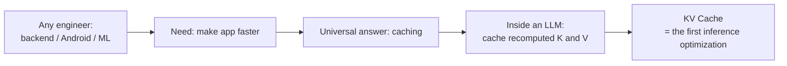

> [!info]+ Interview questions covered
> - Why does an engineer need to understand LLM internals if they only deploy or call the model?
> - What is the first technique you reach for to speed up LLM inference?

---

### The inference-optimization stack: KV cache → Paged Attention → vLLM → TurboQuant

The instructor describes a chronological "stack" of inference optimizations that companies have layered on top of each other. Each one is an interview question by itself.

| Layer | What it does | Where the win comes from |
|---|---|---|
| **KV cache** | Stores the K and V projections of previously seen tokens so they are not recomputed on every new token. | Avoids redundant matrix multiplications during autoregressive decoding. |
| **Paged Attention** | A memory-efficient way to lay out the KV cache in non-contiguous "pages" of GPU memory. | Eliminates KV-cache memory fragmentation — lets a server pack many concurrent requests. |
| **vLLM** | An inference serving framework built on top of Paged Attention. | High-throughput serving of LLMs in production. |
| **TurboQuant** (Google, recent) | **Quantization** of the KV cache itself (lower-precision storage of K and V). | Shrinks KV-cache memory; opens up CPU vs GPU trade-offs the instructor is benchmarking. |

The instructor frames this as a chain — each technique sits on top of the previous one — and points out that "the next one is always coming," which is why understanding the internals lets you contribute the *next* optimization rather than just consume the current one.

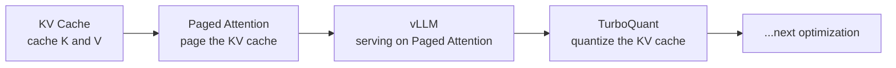

A useful aside the instructor makes: the same idea ("KV cache for the backend") could be re-applied to **mobile devices** — a hypothetical "MvLLM" — as a research direction for students.

> [!info]+ Interview questions covered
> - What is the KV cache, and how does it speed up inference?
> - What is Paged Attention?
> - What is vLLM (virtual / very Large Language Model serving)?
> - What is quantization, and how is it applied to the KV cache?

---

### The foundational LLM concepts that will be *coded* in this course

Most of the rest of the syllabus is the foundational pipeline of a decoder-only LLM. The instructor explicitly splits each topic into "we will code this" versus "concept-only."

| Topic | Treatment in this course |
|---|---|
| Foundation models | Already discussed in the previous class — base models. |
| Large Language Model (LLM) | Built from scratch in this and the next 4–5 classes. |
| Transformer architecture and components | Coded — students will understand it because they will type it out. |
| Tokenization | First step in any LLM; will be coded. |
| **Byte Pair Encoding (BPE)** | **Will be coded**, used when fine-tuning the actual model later. |
| WordPiece / SentencePiece | Concept-only — what they are, not coded. |
| Positional encoding | Will be coded. |
| Embeddings | Will be coded. |
| Causal masking | Will be coded and explained. |
| Self-attention | Will be coded inside the transformer. |
| Query / Key / Value (Q/K/V) | Falls out of coding self-attention — students will "automatically know it." |
| Multi-head attention | Will be coded; the lecture will show what head 1, head 2, head 3 each do, and why one head is not enough. |
| Skip connections | Will be coded inside the LLM. |
| Logits | Will be explained where they appear in model output. |

The pedagogical claim the instructor makes repeatedly is: *if you code it, you can explain it with confidence in an interview.* That is why concepts like Q/K/V and multi-head attention are not pre-defined here — they emerge from the code.

> [!info]+ Interview questions covered
> - What is tokenization in LLMs?
> - Explain BPE (Byte Pair Encoding).
> - Explain WordPiece and SentencePiece.
> - What is positional encoding, and why is it needed in Transformers?
> - What are embeddings?
> - What is causal masking?
> - What is self-attention, and how does it work in Transformers?
> - Explain the Query (Q), Key (K), and Value (V) in attention.
> - What are multi-head attention mechanisms? Why use multiple attention heads?
> - What are logits?
> - What are skip connections in a Transformer?

---

### Sampling and decoding parameters

Several interview questions on the list are about **how the LLM picks the next token** given the model's output distribution. The instructor previews them here at a definitional level; deeper mechanics are covered when the inference loop is coded.

- **Context window** — the total span of tokens the model can attend to in a single forward pass (input + generated). Decides how much history the model "sees" and is also the object that gets compacted by tools like `/compact` in AI agents (see the agent section below).
- **Temperature** — a scalar that controls how *predictable* the LLM's output is. A common interview phrasing: "Why does ChatGPT give a different answer each time?" The answer is that next-token selection is **probabilistic**, and temperature reshapes that probability distribution. The instructor notes this is why outputs *appear* creative — it is not innovation, it is sampling from a distribution.
- **Top-k sampling** — restrict the sampling pool to the top-k highest-probability tokens.
- **Top-p (nucleus) sampling** — restrict the sampling pool to the smallest set of tokens whose cumulative probability exceeds `p`.

A high-level intuition for temperature, written here as the instructor uses it:

$$
P_i \;=\; \frac{\exp(\text{logit}_i / T)}{\sum_j \exp(\text{logit}_j / T)}
$$

Where $T$ is the temperature. Larger $T$ flattens the distribution (more random); $T \to 0$ collapses onto the argmax (deterministic).

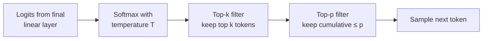

> [!info]+ Interview questions covered
> - What is the context window in LLMs, and why does it matter?
> - What is temperature in the context of LLMs, and how does it affect output?
> - Explain Top-p (nucleus) sampling and Top-k sampling.

---

### Open-source vs closed-source LLMs

A short but recurring interview question. The distinction is purely about **access to weights**:

| | Open-source LLMs | Closed-source LLMs |
|---|---|---|
| Access to model weights | Yes — weights are downloadable. | No — only an API endpoint. |
| Local inference possible? | Yes. | No (or only via the vendor's runtime). |
| Fine-tuning the actual weights | Yes. | Limited / vendor-controlled. |
| Examples (in the instructor's framing) | Models whose checkpoints are published. | API-only models. |

The instructor flags that this becomes "automatically obvious" once students have coded their own LLM and can see what a checkpoint is.

> [!info]+ Interview questions covered
> - What is the difference between open-source and closed-source LLMs?

---

### Architecture, training, and regularization topics covered later

The remaining bullets on the interview list are previewed but **explicitly deferred** to later sessions. Listed here so students can recognize them when they reappear:

- **Encoder–decoder architecture** (covered later, in the generative AI / deep learning portion).
- **Autoregressive vs masked language modeling** — covered later.
- **Model distillation** — covered later via a dedicated research paper on knowledge distillation.
- **Mixture of Experts (MoE)** — discussed in short form.
- **Flash Attention** — discussed later.
- **Fine-tuning** of a model — actually performed across the next 4–5 classes.
- **PEFT (Parameter-Efficient Fine-Tuning)** — already discussed conceptually; will be revisited with code.
- **LoRA / QLoRA** — already discussed conceptually; code can be shared.
- **Dropout** — will be implemented to show what it does empirically.
- **Layer normalization vs Batch normalization** — flagged as an *important* comparison and explicitly promised.

> [!info]+ Interview questions covered
> - Encoder-only vs decoder-only vs encoder-decoder — when to use which?
> - What is autoregressive language modeling vs masked language modeling?
> - What is knowledge distillation / model distillation?
> - What is Mixture of Experts (MoE)?
> - What is Flash Attention?
> - What is fine-tuning? What is PEFT?
> - What is LoRA? What is QLoRA?
> - What is dropout?
> - Layer normalization vs batch normalization — what is the difference?

---

### The LLM as the "brain" of an AI agent

The section closes with a student question about **AI agents** and a clarification that ties the entire course back to a single product surface.

- **An LLM is the brain of an AI agent.** That is why this course covers the LLM first — once the brain is understood, the agent loop around it is straightforward.
- **"AI agent" and "agentic AI" are the same thing**, only a grammatical difference. "Agentic AI" describes the *flow* — building or using an AI agent — but the underlying object is identical.
- The instructor's plan is to **code Claude Code** (described as the best AI agent today) from scratch in upcoming sessions, after the LLM material is complete.

#### Why `/compact` motivates studying the context window

In agentic tools, the `/compact` command compresses the running conversation so the agent doesn't run out of room. *What exactly is being compressed?* The **context window**. Knowing what lives inside the context window (system prompt, prior turns, tool results, scratchpad) is what lets you answer the interview question with confidence.

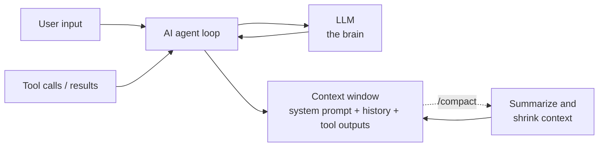

> [!info]+ Interview questions covered
> - What is the relationship between an LLM and an AI agent?
> - What is the difference between "AI agent" and "agentic AI"?
> - What does `/compact` do in an AI agent, and what exactly does it compress?

---

### Section takeaway

This section is not yet about *how* to build the LLM — it is the **map**. The remaining sections of the lecture build the dummy GPT architecture step by step, and each step plugs back into one of the interview questions previewed above:

1. Tokenization → vocabulary → embeddings.
2. Positional encoding.
3. Self-attention → Q/K/V → multi-head attention → causal masking.
4. Linear head → logits → sampling (temperature, top-k, top-p).
5. Training loop → loss → optimizer.
6. Inference loop → KV cache → paged attention → vLLM → quantization.

The recurring instruction from the tutor: *code each piece yourself so you can answer the interview question from first principles, not from memorized definitions.*


## Dummy GPT Architecture, Tokenization, Vocabulary Size, Context Length, `BATCH_SIZE`

> Section timestamps: **11:39 → 23:44**
> Slides: 28, 29 · Key concepts: dummy GPT architecture, tokenization, vocabulary size, context length, `BATCH_SIZE`

The first architecture we build is intentionally **trivial** — a "dummy GPT" — whose only job is to demonstrate end-to-end how the input string `he` becomes the prediction `boy`, or `c` becomes `go`. Everything stays minimal so that the *flow* is unambiguous. Once the flow is clear, we keep expanding the same skeleton over the next four to five sessions (V0 → V1 → … → final model).

> [!tip] Pedagogical arc for this section
> 1. Set up the **toy dataset** and **hyperparameters** in `dummy.ipynb`.
> 2. Introduce the **dummy GPT** as a black box containing only one linear layer ($y = mx + c$).
> 3. Explain why we cannot feed the string `he` directly → motivate **tokenization**.
> 4. Build the **vocabulary** and the two-way **token-id ↔ text** hash maps.
> 5. Address **out-of-vocabulary (OOV)** words → introduce **character-level** tokenization and **Byte Pair Encoding (BPE)**.
> 6. Show the **autoregressive generation** loop: `he → he is → he is a → he is a good boy`.

---

### The toy dataset and hyperparameters

From `dummy.ipynb` shown in VS Code:

```python
data = [
    "He boy",
    "She girl"
]
```

```python
VOCAB_SIZE = 4
CONTEXT_LEN = 1
BATCH_SIZE = 2
```

This is the entire universe of the dummy model:

| Hyperparameter | Value | Meaning in this toy setting |
|---|---|---|
| `VOCAB_SIZE` | `4` | We have exactly four unique words across the corpus: `He`, `boy`, `She`, `girl`. |
| `CONTEXT_LEN` | `1` | The model looks at **one** input token at a time. The next-token prediction is made from a single previous word. |
| `BATCH_SIZE` | `2` | We have two training sequences (`"He boy"` and `"She girl"`), so a batch covers the whole dataset. |

The dataset is deliberately small enough that we can compute and verify everything by hand. As we progress through the course we will scale each of these up while keeping the same architectural skeleton intact.

> [!info]+ Interview questions covered
> - What is **vocabulary size** in an LLM?
> - What is the **context length** (a.k.a. context window) of a model?
> - What is **batch size** during training/inference?
> - Why do we typically end up with ~50 000 vocabulary entries even when the dataset has 100 M words?

---

### The dummy GPT architecture (the "black box")

The whole model is a single linear block. The class will be called `GPTModel` and it contains nothing but `nn.Linear`, i.e. the function

$$
y = W \cdot x + b
$$

— the same straight-line model we coded in the previous class. This is not a serious model; it is the **smallest possible thing that still has the shape of a GPT**: a class that takes a tokenized input and produces a token prediction.

> "GPT" = **G**enerative **P**re-**T**rained. The whole point of this dummy is to show the *generative* part: given an input token, produce the next one.

Conceptually:

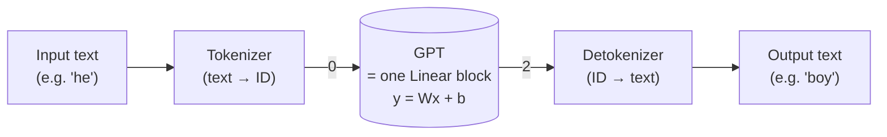

Inside the GPT, the only computation is the linear layer; everything else (attention, embeddings, layer norms…) is deliberately absent and will be **added gradually in subsequent sessions**. The job for this first pass is simply to convince ourselves that the *plumbing* — tokenize → forward → detokenize → append — works.

> [!info]+ Interview questions covered
> - What is the role of the **linear (fully-connected) layer** in a transformer block?
> - How does a GPT consume input — text or numbers? Why?

---

### Tokenization: turning words into numbers

A GPT class — any GPT class — only accepts **numbers** as input. So before the input string ever touches the model, we must convert it into integer token IDs. This is **tokenization**.

#### Why numbers, not words?

The model trains via **gradient descent**, which requires **calculus** (derivatives of the loss with respect to the parameters). Calculus is defined over numbers, not strings. There is no derivative of "he" with respect to "boy". Hence:

$$
\text{text} \;\xrightarrow{\text{tokenize}}\; \text{numbers} \;\xrightarrow{\text{forward + backprop}}\; \text{numbers} \;\xrightarrow{\text{detokenize}}\; \text{text}
$$

Tokenization is therefore not an optional preprocessing nicety; it is the **first mandatory step** in the entire pipeline.

#### Building the vocabulary

Given the toy dataset `["He boy", "She girl"]`, a simple tokenizer does:

1. Read all text.
2. Split into words.
3. Insert each word into a **set** so duplicates are dropped automatically.
4. Iterate the set and assign each unique word an integer index `0, 1, 2, 3, …`.

For our corpus we get:

| Word | Token ID |
|---|---|
| `he` | 0 |
| `she` | 1 |
| `boy` | 2 |
| `girl` | 3 |

That is why `VOCAB_SIZE = 4`. On a realistic corpus with 100 million words, the unique-word set might stabilize at roughly **50 000 entries** — because most words repeat — which is the order of magnitude you see in real GPT-style tokenizers.

#### Two hash maps: encode and decode

The vocabulary set itself can be thrown away. What we **must** keep are two dictionaries:

```python
text_to_id = {"he": 0, "she": 1, "boy": 2, "girl": 3}
id_to_text = {0: "he", 1: "she", 2: "boy", 3: "girl"}
```

- `text_to_id["he"] → 0` is called **encoding** — used before feeding the model.
- `id_to_text[2] → "boy"` is called **decoding** — used to turn the model's predicted ID back into a readable word.

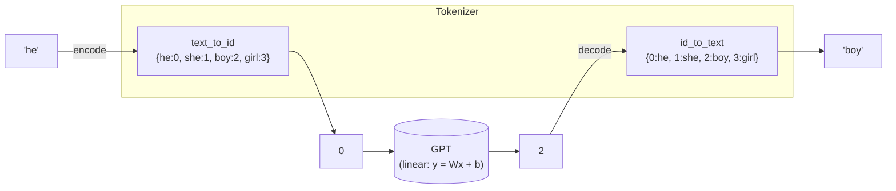

#### The worked example: `he → 0 → GPT → 2 → boy`

Using the toy vocabulary, a forward pass looks like:

1. User types `he`.
2. Encode: `he → 0`.
3. Feed `0` into the dummy GPT (single linear layer). With suitable learned weights, e.g. $W = 1, b = 2$, the model computes $y = 1 \cdot 0 + 2 = 2$.
4. Decode: `2 → boy`.
5. Concatenate input and prediction → `"he boy"`.

That is the whole *dummy* architecture. The linear layer is doing all the "intelligence"; everything else is bookkeeping.

> [!info]+ Interview questions covered
> - What is **tokenization** in LLMs?
> - What is a **vocabulary** and why do we keep two hash maps (text→ID and ID→text)?
> - Why do LLMs operate on **token IDs** rather than raw text?
> - How is **gradient descent** related to the requirement that inputs be numerical?

---

### Out-of-vocabulary (OOV) tokens

What if the user submits a word that is **not** in the vocabulary? With the dummy scheme above, you would have no entry in `text_to_id` for it.

#### Option 1 — A reserved `<UNK>` token

Reserve the last index in both maps for a hard-coded `<unknown>` token:

| Word | Token ID |
|---|---|
| `he` | 0 |
| `she` | 1 |
| `boy` | 2 |
| `girl` | 3 |
| `<unknown>` | 100 |

Any unseen word (say `xyz`) is encoded to `100`.

**Demerit.** The mapping becomes **lossy**: encoding `xyz → 100`, but decoding `100 → "<unknown>"`. The original `xyz` is gone. Early GPT-family models behaved exactly like this and would emit `UNK` tokens in their outputs.

#### Option 2 — Character-level tokenization

Treat **each character** as its own token: `a, b, c, …, z`. Then any word `xyz` decomposes into known sub-units (`x`, `y`, `z`), so nothing is ever truly out of vocabulary. The cost is much longer token sequences for the same text.

#### Option 3 — Byte Pair Encoding (BPE) *(detailed later)*

BPE is a compromise that learns to merge frequent character pairs and frequent words into single tokens. For instance, `"he is"` may be learned as a **single** token because the two words frequently co-occur. This lets BPE:

- Handle arbitrary unseen inputs (because the base layer is still characters/bytes).
- Keep the vocabulary compact (frequent multi-character chunks become single tokens).

A comparison of the three approaches:

| Approach | OOV handling | Vocabulary size | Reverse-lookup loss |
|---|---|---|---|
| Word-level + `<UNK>` | Mapped to `<unknown>` | Small | **Yes** — original word lost |
| Character-level | Always handled | Very small (~26+) | None, but sequences become long |
| Byte Pair Encoding (BPE) | Always handled | Medium (e.g. ~50 K) | None |

We will implement BPE in a later session; for the dummy model we stay at the word-level scheme.

> [!info]+ Interview questions covered
> - What is an **out-of-vocabulary (OOV)** token and how do tokenizers handle it?
> - What is **character-level tokenization**? What are its trade-offs?
> - What is **Byte Pair Encoding (BPE)** and why is it used in modern LLMs?

---

### Autoregressive text generation

A real GPT does not emit the whole sentence in one shot. It emits **one token at a time** and feeds its own output back in as the new input. This is called **autoregressive generation**.

Using the running example, predicting the sentence "he is a good boy" from the seed `"he"` looks like:

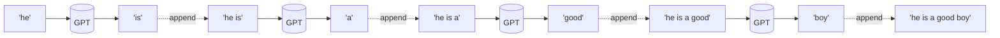

At every step:

1. Encode the current context with the tokenizer.
2. Forward-pass through the GPT to obtain the next token ID.
3. Decode the predicted ID back to text.
4. **Append** the new word to the running prompt.
5. Repeat until a stop condition (max length, EOS token, etc.) is met.

For the dummy model with `CONTEXT_LEN = 1`, the "context" is just the most recent token; for real GPTs it is the last `CONTEXT_LEN` tokens (typically thousands).

> [!info]+ Interview questions covered
> - What is **autoregressive text generation**?
> - How does a GPT use its own output as the next input during inference?
> - What is the role of **context length** during autoregressive decoding?

---

### Recap

- We are building a **dummy GPT** containing only one linear block ($y = Wx + b$) — the smallest model that still has the shape of a generative pre-trained transformer.
- The toy dataset is `["He boy", "She girl"]` with `VOCAB_SIZE = 4`, `CONTEXT_LEN = 1`, `BATCH_SIZE = 2`.
- The GPT class only accepts **numbers**, so we always **tokenize** text first by building a unique-word vocabulary and two hash maps (`text_to_id`, `id_to_text`) for encode/decode.
- We need numbers because **gradient descent depends on calculus**, which depends on numerical operations.
- Out-of-vocabulary words are handled either by a reserved `<UNK>` token (lossy), character-level tokenization, or **Byte Pair Encoding** (covered in detail later).
- Inference is **autoregressive**: predict one token, append it to the prompt, predict again, until the sentence is complete.

This is the conceptual skeleton we will now turn into Python code (`dummy.ipynb`) over the next several sections, gradually replacing the dummy linear layer with embeddings, attention, and the rest of the transformer stack.


## Self-Attention, Token Embedding, Positional Embedding, Causal Masking, Residual Connection

This section is the **roadmap** for the rest of the course. Before writing any model code, the tutor lays out a five-model progression and walks through a **2-parameter "Dummy" LLM** end-to-end so that every later concept (embeddings, attention, causal masking, residual connections, scaling) has a concrete anchor. The headline idea: an LLM is, fundamentally, a function from token IDs to token IDs whose internal parameters are *learned*. Once that is felt with two parameters, scaling to thousands is just "more of the same shape."

### Why tokenization is tied to model weights

Before the roadmap, the tutor answers a recurring question: **why does every model seem to use `tiktoken`?**

- Most production models are bound to a specific tokenizer (typically OpenAI's `tiktoken`, which implements **Byte Pair Encoding**) because the model's weights were trained against the token IDs that tokenizer produces.
- You can *replace* the tokenizer, but the moment the vocabulary or merge rules change, the embedding rows no longer line up with the right symbols, and the model must be retrained.
- BPE won because it offered the best trade-off between compression (smaller token sequences → less memory, faster inference) and reconstruction quality across languages.
- Regional / right-to-left languages (e.g., Urdu) generally do not require a brand-new family of tokenizers — the *characters* are still characters; the tokenizer just needs small adjustments around segmentation direction.

So **you are free to write your own tokenizer** for learning purposes, but in a real product the tokenizer and model travel as a pair.

> [!info]+ Interview questions covered
> - Why is a tokenizer bound to a specific model?
> - Why does almost every modern LLM use `tiktoken` / Byte Pair Encoding?
> - Can the same tokenizer be reused across languages, including right-to-left scripts?

### The five-model roadmap

The tutor opens a **custom LLM Visualizer** (a small web app at `localhost:8000` he built to teach) and frames the entire course as a stair-step through five models. The numbers below are the exact parameter counts shown on the visualizer.

| Model | What's new | Vocab | Embed dim | Context | Parameters |
| --- | --- | --- | --- | --- | --- |
| Dummy — Linear | Just `y = w·x + b` (no embeddings) | 4 | — | 1 | **2** |
| V0 — Basic LLM | Token embedding + positional embedding + linear output | small | small | small | **30** |
| V1 — With Attention | V0 + self-attention + causal masking + residual connection | small | small | small | **78** |
| V0 — Scaled Up | V0 with bigger numbers | 70 | 24 | 6 | **3,504** |
| V1 — Scaled Up | V1 with bigger numbers, 6 transformer blocks | 70 | 24 | 6 | **13,872** |

The parameter counts for Dummy/V0/V1 are deliberately tiny so **every single weight can be inspected by eye** after training. The scaled variants exist so the same architecture can be re-counted layer by layer and the larger total (e.g. 13,872) demystified — a recurring promise: "we will print the parameter count for every layer."

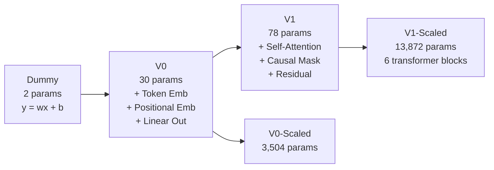

> [!info]+ Interview questions covered
> - What are the core building blocks of a transformer-based LLM?
> - How do token embedding, positional embedding, self-attention, causal masking, and residual connections fit together?
> - How do you estimate the parameter count of an LLM layer by layer?

### The Dummy Linear Model — an LLM in two parameters

The Dummy model exists to answer one question concretely: **what does it mean to say "an LLM has parameters"?**

#### Vocabulary and training data

The vocabulary has exactly four words, encoded as the integer IDs the model will see:

| Word | Token ID |
| --- | --- |
| `He` | 0 |
| `She` | 1 |
| `boy` | 2 |
| `girl` | 3 |

The training set is two `(input → target)` pairs:

| Input | Target |
| --- | --- |
| `He` (0) | `boy` (2) |
| `She` (1) | `girl` (3) |

The job of "training" is to find numbers inside the model so that, after training, feeding it `He` produces `boy` and feeding it `She` produces `girl`.

#### Architecture: input → tokenize → linear → prediction

The model is a single linear layer. The data flow on the visualizer's Architecture tab is:

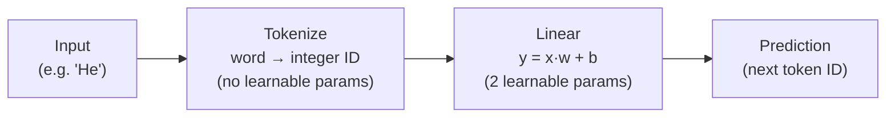

Two structural facts the tutor hammers on:

1. **The "Input" layer has no learnable parameters.** It just holds whatever sequence you fed in.
2. **Tokenization is a hardcoded mapping outside the model.** At this stage there is *no learning* in the tokenizer; it is a fixed table `{He: 0, She: 1, boy: 2, girl: 3}`. (Later sections will show that tokenization itself can be made learnable, but not yet.)

So every learnable thing in this LLM lives inside the linear layer.

#### The linear layer and its 2 parameters

The linear layer is the simplest possible model:

$$
y = w \cdot x + b
$$

where `x` is the input token ID and `y` is the predicted next-token ID. The two parameters are:

- `w` — the **weight**
- `b` — the **bias**

That is it. Two scalars. Together they form a complete, end-to-end "language model" — useless on real text, but structurally identical in shape to everything that follows.

#### Learned weights: w = 1, b = 2

After training, the Dummy model on the visualizer's *Learned Weights* tab shows:

```python
w = 1.0000
b = 2.0000
```

Plugging the two training examples in:

$$
\text{He} \;(x = 0): \quad y = 0 \cdot 1 + 2 = 2 \;\Rightarrow\; \text{boy}
$$

$$
\text{She} \;(x = 1): \quad y = 1 \cdot 1 + 2 = 3 \;\Rightarrow\; \text{girl}
$$

Both examples are predicted exactly. **An entire LLM, built from two parameters.** This is the punchline the tutor wants stuck in memory before any embedding or attention is introduced: *parameters are just numbers, and training is the act of finding the right ones.*

The model and its arithmetic, on one line per example:

```text
He  (0):  0 * 1 + 2 = 2  ->  boy
She (1):  1 * 1 + 2 = 3  ->  girl
```

#### Counting parameters in the Dummy model

| Layer | Learnable parameters | Count |
| --- | --- | --- |
| Input | — | 0 |
| Tokenize | hardcoded mapping | 0 |
| Linear (`y = w·x + b`) | `w`, `b` | 2 |
| **Total** | | **2** |

This template — listing each layer and tallying its parameters — is the one the tutor will reuse to derive the 30, 78, 3,504 and 13,872 numbers in the larger models.

> [!info]+ Interview questions covered
> - What is a "parameter" in a neural network / LLM?
> - Does the tokenizer have learnable parameters?
> - How does a single linear layer perform next-token prediction?
> - How do you count the parameters of a model layer by layer?

### V0 — the simplest *real* LLM (30 parameters)

V0 replaces the toy `y = wx + b` with the three building blocks that every transformer-based LLM keeps to this day:

- **Token Embedding** — maps each token ID to a small vector (the "3D visualization" he previews). Two reasons it has to exist:
    1. Gradient descent works on continuous numbers, not symbols, so words must be turned into vectors.
    2. The vector representation lets *similar* tokens occupy similar regions of space, which is what every later layer exploits.
- **Positional Embedding** — adds information about *where* in the sequence each token appeared. Without it, the model treats `boy ate apple` and `apple ate boy` identically.
- **Linear Output Layer** — projects from embedding space back into vocabulary space to produce the next-token prediction.

V0 has only **30 parameters** because the dataset is intentionally tiny, but the *structure* is the structure used by GPT-class models. Every parameter count on later slides will be derived by summing the parameters of these three blocks.

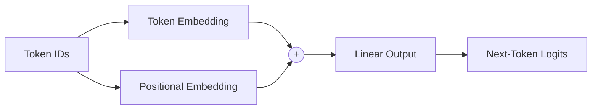

> [!info]+ Interview questions covered
> - What is a token embedding, and why are tokens converted to vectors?
> - What is a positional embedding, and why is it necessary?
> - What is the role of the linear output layer in an LLM?
> - Why do we need numerical representations at all instead of working directly with words?

### V1 — adding attention, causal masking, residual connections (78 parameters)

V1 stays on the same vocabulary and embedding dimensions as V0 but introduces the **transformer block**. The new ingredients are:

- **Self-Attention** — every token gets to look at every other token in the context and decide which ones to weight in its representation. This is what makes the model context-aware: the embedding for `bank` becomes different depending on whether `river` or `money` is nearby.
- **Causal Masking** — during training the model must not be allowed to "see the future." A causal (lower-triangular) mask zeros out attention scores from a position to any position to its right, so that when predicting token *t* the model only sees tokens *1…t-1*. This is what makes the LLM *autoregressive*.
- **Residual Connection** — the input to a sub-block is added to its output (`x + Sublayer(x)`). This keeps gradients flowing through deep stacks and lets each sub-block learn a small *correction* rather than the whole transformation.

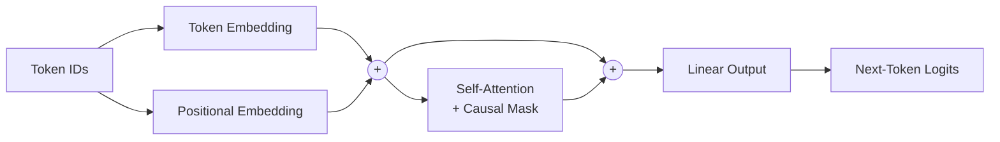

The jump from 30 parameters (V0) to 78 parameters (V1) is *entirely* the cost of attention — the new query/key/value/output projections — on top of V0's existing weights.

> [!info]+ Interview questions covered
> - What is self-attention in a transformer?
> - What is causal masking and why is it required for an autoregressive LLM?
> - What is a residual connection, and why does it help train deep networks?
> - Why does adding attention increase a model's parameter count?

### Scaled-up variants — the same shape, bigger numbers

The scaled-up variants exist to show that **scaling is multiplication, not magic**. The architecture does not change; the hyperparameters do.

| Variant | Vocab | Embed dim | Context | Transformer blocks | Parameters |
| --- | --- | --- | --- | --- | --- |
| V0-Scaled | 70 | 24 | 6 | — | 3,504 |
| V1-Scaled | 70 | 24 | 6 | 6 | 13,872 |

Two things this table sets up for later sections:

1. The promise to **derive 13,872 by hand**, layer by layer. Embedding tables contribute `vocab × embed_dim` parameters, each transformer block contributes a fixed number that depends on `embed_dim`, and so on. The course will sum these explicitly.
2. The intuition that **dataset size and parameter count move together** — V0 is tiny because its dataset is tiny; the scaled versions need more parameters because their data and context are larger.

> [!info]+ Interview questions covered
> - How does the parameter count of an LLM scale with vocabulary size, embedding dimension, and number of transformer blocks?
> - Why must dataset size grow alongside parameter count?
> - How do you derive the parameter count of a transformer block from first principles?

### What this section commits to next

By the end of the section, the visualizer's Dummy model has been fully explained, the four learnable variants (V0, V1, V0-Scaled, V1-Scaled) are previewed with exact parameter counts, and the tutor announces the next move: switch from the *Architecture* tab to the *Training* tab and show how `w = 1` and `b = 2` are actually learned from the `He → boy`, `She → girl` data. From this point onward, every later section either (a) writes the code for one of these layers, or (b) re-counts its parameters by hand.


## Linear Layer, Tokenization, Inference, MSE Loss, Forward Pass

This section closes the loop on the **dummy LLM** ($y = wx + b$) by walking through three phases live in the LLM Visualizer — **training**, **inference**, and an enumeration of every parameter — and then drops into VS Code to start writing the same model **from scratch in PyTorch**, beginning with hyperparameters, the random seed, and the tokenizer.

The pedagogical arc is: *watch it learn → watch it predict → count every weight → now build it yourself*.

---

### Training the Dummy LLM in the Visualizer

The Visualizer's **3 Training** tab loads the toy supervised pair `He → boy` (and later `She → girl`). The Learned Parameters card initializes $w = 0$ and $b = 0$. The slide labels these as a "random initialization", but practically they are zero — the point is only that the model does *not* know the right weights yet and must learn them.

The training loop the visualizer animates is the standard supervised cycle:

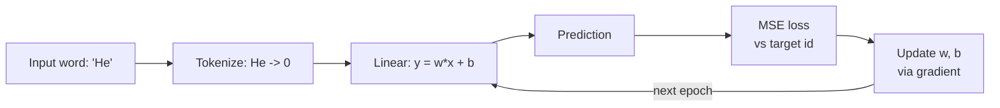

This is the *exact same* gradient-descent cycle covered in the previous two classes on linear regression and MSE — the only thing that changed is the interpretation of $x$ and $y$ as **token IDs** instead of house features.

#### First forward pass with zero weights

For the very first forward pass, with $w = 0$ and $b = 0$ and the input token id $x = 0$ (for `He`):

$$
y = w \cdot x + b = 0 \cdot 0 + 0 = 0
$$

The model emits raw value $0$, which rounds to token id $0$, which the reverse vocabulary maps back to `He`. So the model predicts `He` when the target was `boy` (id $2$). It is wrong on epoch 1 — exactly as expected.

#### MSE loss on the first epoch

The loss function used is **Mean Squared Error**:

$$
\text{MSE} = (\text{target} - \text{predicted})^2
$$

Plugging in:

$$
\text{MSE} = (2 - 0)^2 = 4
$$

A student asks why the slide shows $(\text{target} - \text{predicted})^2$ when the lectures previously wrote $(\hat{y} - y)^2$. The answer is that **squaring makes the order irrelevant** — both expressions return $4$ here:

$$
(2 - 0)^2 = (0 - 2)^2 = 4
$$

This is a small but worth-internalizing point: the sign of the error is preserved by the *gradient*, not by the loss value itself.

#### Convergence to $w = 1, b = 2$

The visualizer then runs the training loop epoch by epoch. The narrated dynamic is:

| Epoch | Status | Loss trend |
| --- | --- | --- |
| 1 | Wrong (`He`) | High (= 4) |
| 2-9 | Wrong, but adjusting | Decreasing |
| 10 | **Correct** (`boy`) | $\approx 0$ |

The model converges to $w = 1$ and $b = 2$. This pair is special — it is the *cleanest possible solution* that satisfies both training pairs simultaneously:

| Input | Token id $x$ | $y = 1 \cdot x + 2$ | Rounded | Predicted word | Target |
| --- | --- | --- | --- | --- | --- |
| `He` | 0 | 2 | 2 | `boy` | `boy` |
| `She` | 1 | 3 | 3 | `girl` | `girl` |

So the parameters $w = 1, b = 2$ are not arbitrary — they are *learned* by the same gradient-descent machinery, and they happen to be the unique linear function that maps `{He: 0, She: 1}` onto `{boy: 2, girl: 3}`.

> [!info]+ Interview questions covered
> - What is the forward pass in a neural network?
> - What is Mean Squared Error loss and why is it symmetric in target/prediction?
> - What does training a model actually mean?
> - Why are model weights initialized (to zero or random)?

---

### Inference with the Trained Dummy Model

Once training is done, the Visualizer switches to the **4 Inference** tab. The model now has frozen weights $w = 1$, $b = 2$. The animation walks through the four-stage pipeline:

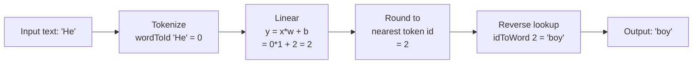

Each block is asked of the audience explicitly: *what is the input, what is the output?*

1. **Input → Tokenize.** The string `He` enters the tokenizer. The tokenizer holds the vocabulary `{He: 0, She: 1, boy: 2, girl: 3}` and looks the word up in `wordToId`. Output: integer `0`.
2. **Tokenize → Linear.** The integer `0` is the input $x$ to the linear layer. With the *learned* weights, $y = 0 \cdot 1 + 2 = 2$.
3. **Linear → Round.** The raw real number $2$ is rounded to the nearest valid token id. Here it is already an integer, so the rounded id is $2$. (In a real LLM this rounding step is replaced by an `argmax` over a logits vector, but the role is the same: pick a discrete vocabulary entry.)
4. **Round → Reverse lookup.** The id $2$ is fed into `idToWord`, which returns `boy`.

The complete mapping `He → boy` falls out of arithmetic and a dictionary lookup. There is no magic — *it really is just $y = mx + b$ wrapped in two dictionaries*.

#### Training vs Inference

| Aspect | Training | Inference |
| --- | --- | --- |
| Weights $w, b$ | Updated each epoch | Frozen |
| Loss computed | Yes (MSE) | No |
| Gradient step | Yes | No |
| Output use | Compared to target | Returned to user |
| Pipeline stages | Input → Tokenize → Linear → Loss → Backprop | Input → Tokenize → Linear → Round → Reverse lookup |

> [!info]+ Interview questions covered
> - What is inference in an LLM?
> - What is the difference between training and inference?
> - How does an LLM convert a token id back into a word?
> - What is next-token prediction?

---

### Counting Parameters Across Dummy → V0 → V1

Before leaving the visualizer, the tutor uses the **Learned Weights** tab to enumerate every trainable parameter in each of the three model variants the course will build. The progression is:

| Model | Components | Parameter count |
| --- | --- | --- |
| **Dummy** | $y = wx + b$ | **2** |
| **V0** (Basic LLM) | Token embedding + positional embedding + linear output | **30** |
| **V1** (With Attention) | + self-attention (Q, K, V), causal masking, residual connections | **78** |

For V1, the 78 parameters break down concretely:

| Matrix | Shape | Param count |
| --- | --- | --- |
| Token embedding | $7 \times 3$ | 21 |
| Positional embedding | $3 \times 3$ | 9 |
| $W_Q$ | $3 \times 3$ | 9 |
| $W_K$ | $3 \times 3$ | 9 |
| $W_V$ | $3 \times 3$ | 9 |
| Output projection | $3 \times 7$ | 21 |
| **Total** | | **78** |

The point being driven home: **nothing in an LLM is hidden magic.** Every weight is a number in a matrix; every matrix has a shape; every shape is dictated by the architecture. You can always sit down and count them.

> [!info]+ Interview questions covered
> - How do you count the parameters of a transformer?
> - What do `W_Q`, `W_K`, `W_V` represent?
> - What is the difference between a token embedding and a positional embedding?

---

### Switching to Code: The `dummy.ipynb` Notebook

With the visualizer story complete, the lecture moves into VS Code and opens `dummy.ipynb`. Before any code, the tutor flags a foundational property:

> An LLM is **stateless**. Every query is answered independently of every previous query — there is no memory inside the model itself. Anything that *feels* like memory in ChatGPT (chat history, previous messages) is supplied by an *external database* and re-injected into the prompt. This framing matters later when discussing agent systems.

#### Cell 1 — Toy training data

From `dummy.ipynb` shown in VS Code:

```python
data = [
    "He boy",
    "She girl"
]
```

Real training corpora contain millions of long sentences; here the data is intentionally minimal so every token can be tracked end-to-end on a single screen. Each "sentence" is two tokens: one **input** word and one **target** word.

#### Cell 2 — Hyperparameters

```python
VOCAB_SIZE = 4
CONTEXT_LEN = 1
BATCH_SIZE = 2
EPOCHS = 100
```

These are hard-coded for clarity (in production `VOCAB_SIZE` would be derived by counting unique tokens in the data). What each one means in this toy setting:

| Hyperparameter | Value | Meaning here |
| --- | --- | --- |
| `VOCAB_SIZE` | 4 | Total unique words: `He`, `She`, `boy`, `girl` |
| `CONTEXT_LEN` | 1 | Model sees **one** token at a time as input |
| `BATCH_SIZE` | 2 | Process both training pairs per gradient step |
| `EPOCHS` | 100 | Full passes over the dataset |

`CONTEXT_LEN = 1` is what makes `He → boy` work as a single supervised pair. If we ever wanted the model to consume `He boy` and predict the next word, the context length would need to be 3 (one for each input token).

The tutor also notes a real-world caveat: in production tokenizers, **whitespace itself is tokenized**. Here words are simply split on spaces and spaces are added back manually — another deliberate simplification.

#### Cell 3 — PyTorch imports

```python
import torch
import torch.nn as nn
from torch.utils.data import Dataset, DataLoader
from collections import defaultdict
```

The same scaffolding (`Dataset`, `DataLoader`, `nn.Module`) will be reused unchanged when extending to V0 and V1, so the imports are written in their final shape from day one.

#### Cell 4 — Reproducibility via manual seed

```python
_ = torch.manual_seed(123)
```

PyTorch's RNG is otherwise seeded from the system clock, so two students running the same code at different times would get different random numbers and conclude something is broken. Pinning the seed forces identical outputs across every machine.

| Convention | Seed | Why |
| --- | --- | --- |
| Karpathy / most ML tutorials | `42` | Hitchhiker's Guide reference; ChatGPT-generated code defaults to it |
| This course | `123` | Tutor's choice — equally valid |

#### Cell 5 — Aliasing the data

```python
text_data = data
```

A trivial rename today, but **meaningful in later classes** when multiple kinds of data (raw text, token tensors, embeddings) coexist and need distinct names.

`text_data` is a Python list of length **2** — i.e., two sentences.

```python
example_data = text_data[0]
print(example_data)
```

Output: `He boy`.

#### Cell 6 — Building the vocabulary

```python
vocab = set()
```

A `set` is used because vocabularies are **unique-by-construction** — every word should appear exactly once regardless of how many times it occurs in the corpus.

#### Cells 7-9 — Vocabulary, dictionaries, tokenizer function

After the vocab is populated to `['He', 'She', 'boy', 'girl']`, the tutor inspects the mapping:

```python
# Display token:word mappings
for i, word in enumerate(vocab):
    print(f"{i}: {word}")
```

Output:

```console
0: He
1: She
2: boy
3: girl
```

Then both directions of the lookup are cached as dictionaries, so the model can move *word → id* during tokenization and *id → word* during inference:

```python
# build word -> index mapping
word_to_id = {word: idx for idx, word in enumerate(vocab)}

# build id -> word mapping
id_to_word = {idx: word for idx, word in enumerate(vocab)}
```

Finally, the tokenization function — the very first stage of the inference pipeline drawn earlier:

```python
def text_to_token_ids(text, word_to_id):
    tokens = text.split()
    return [word_to_id[t] for t in tokens]
```

For `text = "He boy"` and the vocabulary above, this returns `[0, 2]`. That list of integers is what the linear layer (next class's content) will consume.

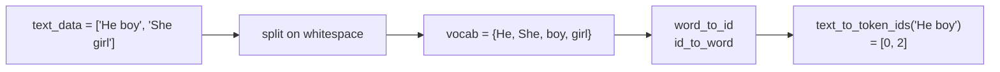

> [!info]+ Interview questions covered
> - What is tokenization in LLMs?
> - What is a vocabulary in an LLM?
> - Why do we set a random seed in PyTorch?
> - What is `torch.manual_seed` and what problem does it solve?
> - Why is an LLM considered stateless?
> - What is the difference between `VOCAB_SIZE`, `CONTEXT_LEN`, `BATCH_SIZE`, and `EPOCHS`?


## Tokenization, Vocabulary, Random Seeding, Text To Token IDs, Reproducibility

This section turns the *idea* of tokenization (drawn earlier on the whiteboard) into actual Python code inside `dummy.ipynb`. By the end we have a working — if tiny — tokenizer for the toy corpus, plus the discipline of fixing a random seed so every laptop in the room produces identical numbers downstream.

The running corpus and hyper-parameters from the previous section are still in scope:

```python
data = [
    "He boy",
    "She girl",
]

VOCAB_SIZE = 4
CONTEXT_LEN = 1
BATCH_SIZE = 2
EPOCHS = 100
```

The mental model the tutor keeps returning to: gradient descent needs calculus, calculus needs numbers, and our raw data is *words*. Tokenization is the bridge — it converts strings into the integer IDs the model can actually do arithmetic on.

### Setting up the data and a single example

```python
import torch
import torch.nn as nn
from torch.utils.data import Dataset, DataLoader
from collections import defaultdict

_ = torch.manual_seed(123)

text_data = data
example_data = text_data[0]
print(example_data)        # -> He boy
```

A few small but important things to anchor:

- `text_data` has length `2`: two sentences, `"He boy"` and `"She girl"`.
- `text_data[0]` picks the **first** sentence, `"He boy"`. That single sentence becomes `example_data`, the running concrete example for the rest of the section.
- The leading `_ = torch.manual_seed(123)` is parked here intentionally. We'll come back to *why* in a moment.

> [!info]+ Interview questions covered
> - What is tokenization in an LLM and why is it needed?
> - Why do we need to convert text to numbers before feeding it to a neural network?

### Building the vocabulary

The vocabulary is the universe of distinct tokens the model is allowed to know about. For our toy corpus that's four words: `He`, `She`, `boy`, `girl`.

The code builds it by treating each whitespace-separated word as a token and dropping the words into a Python `set`, which de-duplicates automatically:

```python
vocab = set()

for text in text_data:
    for word in text.split():
        vocab.add(word)

vocab = sorted(vocab)

print(len(vocab))          # -> 4
```

Line by line:

1. `vocab = set()` — start with an empty set; sets cannot contain duplicates.
2. The outer loop walks every sentence in `text_data`.
3. `text.split()` splits on whitespace, returning a list of words.
4. `vocab.add(word)` inserts each word. If `"He"` showed up in both sentences, the set would still hold a single `"He"`.
5. `vocab = sorted(vocab)` converts the set into a deterministically ordered list. Sorting is **not strictly required** — the tutor explicitly notes this is cosmetic, only so that the indices come out as a tidy `0, 1, 2, 3`. The rest of the pipeline would work with any consistent ordering.
6. `len(vocab)` is `4`, which matches `VOCAB_SIZE` from the hyper-parameters.

After sorting, the vocabulary is:

| Index | Word  |
| ----- | ----- |
| 0     | `He`  |
| 1     | `She` |
| 2     | `boy` |
| 3     | `girl`|

Note the capital letters sort *before* the lower-case ones in ASCII, which is why `He` and `She` precede `boy` and `girl`.

A tiny display loop confirms the mapping:

```python
# Display token:word mappings
for i, word in enumerate(vocab):
    print(f"{i}: {word}")
```

Output:

```console
0: He
1: She
2: boy
3: girl
```

A subtle point the tutor highlights: at this stage `vocab` itself is just *a list of words*. The indices `0..3` only exist in the printout because `enumerate` is yielding them. The actual integer-ID lookup tables come next.

> [!info]+ Interview questions covered
> - What is a vocabulary in an LLM tokenizer?
> - What is vocabulary size (`VOCAB_SIZE`) and how is it determined?
> - How does a word-level tokenizer handle duplicate words?

### Word-to-ID and ID-to-word lookup tables

The conceptual `Tokenizer` box on the architecture diagram has two arrows: **text → token IDs** going in and **token IDs → text** coming out. Each direction needs its own dictionary:

```python
# build word -> index mapping
word_to_id = {word: idx for idx, word in enumerate(vocab)}

# build id -> word mapping
id_to_word = {idx: word for idx, word in enumerate(vocab)}
```

`enumerate(vocab)` yields `(idx, word)` pairs — the index first, the value second — which is exactly what the two dictionary comprehensions consume.

After execution:

```python
word_to_id  # {'He': 0, 'She': 1, 'boy': 2, 'girl': 3}
id_to_word  # {0: 'He', 1: 'She', 2: 'boy', 3: 'girl'}
```

Quick sanity-check lookups the tutor walks through with the class:

- `id_to_word[0]` → `'He'`
- `word_to_id['boy']` → `2`

This is exactly the **"what-to-ID and ID-to-what"** map that was drawn on the whiteboard earlier. The code is just spelling it out.

#### Where this fits in the GPT block

Re-anchoring the code in the architecture diagram:

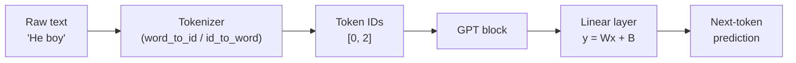

The tokenizer we just built corresponds to the `Tokenizer` box on the architecture sketch. Its output (token IDs like `[0, 2]`) is what the rest of the GPT block — starting with the linear layer `y = Wx + B` from the previous section — actually consumes.

> [!info]+ Interview questions covered
> - How is a word converted to a token ID inside a tokenizer?
> - Why do tokenizers need both a forward (text → IDs) and reverse (IDs → text) mapping?

### `text_to_token_ids` and `token_ids_to_text`

Doing a single-word lookup is fine for a demo. In practice we always pass in a whole sentence and need an array of IDs back. Two helper functions wrap that up:

```python
def text_to_token_ids(text, word_to_id):
    tokens = text.split()
    return [word_to_id[t] for t in tokens]

def token_ids_to_text(token_ids, id_to_word):
    words = [id_to_word[id] for id in token_ids]
    return " ".join(words)
```

How they work:

- **`text_to_token_ids`** (encode)
    1. `text.split()` breaks the input string on whitespace into a list of word-tokens.
    2. The list comprehension looks each token up in `word_to_id`.
    3. Result: a list of integer IDs.

- **`token_ids_to_text`** (decode)
    1. Iterate over the integer IDs and look each one up in `id_to_word`.
    2. Join the resulting words with a single space (`" ".join(words)`).
    3. Result: a reconstructed string.

#### Worked example

The whole point of `example_data = "He boy"` is to make the round-trip concrete:

```python
print(example_data)                                  # -> He boy

text_to_token_ids(example_data, word_to_id)          # -> [0, 2]

token_ids_to_text([0, 2], id_to_word)                # -> 'He boy'
```

So:

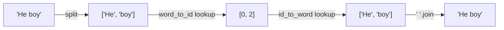

The tutor's framing: **this is a tokenizer in its simplest possible form** — a vocabulary, two lookup tables, and an encode/decode function pair. Production tokenizer libraries (BPE-based ones used by real LLMs) wrap fundamentally the same idea behind a more sophisticated splitting strategy (sub-word tokens, merges, special tokens, byte fallback, etc.). The interface — *string in, list of IDs out, and back again* — is identical.

> [!info]+ Interview questions covered
> - What is the difference between encoding (text → IDs) and decoding (IDs → text)?
> - What does a tokenizer's `encode`/`decode` function do?
> - How does a word-level tokenizer compare to a sub-word tokenizer like BPE?

### Random seeding and reproducibility

A learner asks: why does `torch.manual_seed(123)` matter, when we haven't actually drawn a random number yet?

The answer is forward-looking: many downstream operations are inherently random.

- **Sample data generation** with calls like `torch.rand(...)`.
- **Weight initialization** of neural-network layers: a `nn.Linear` picks its initial weights randomly from some range. The first time a forward pass runs, those random initial values determine the output.

Without seeding, two laptops running identical code will draw *different* random numbers. The model's initial state is different, the first batch of outputs is different, and any graph or loss curve the student plots will not match the one on the projector. Worse, debugging gets confusing: is the discrepancy a bug in the student's code, a difference in environment, or just unseeded randomness?

`torch.manual_seed(123)` fixes that:

```python
_ = torch.manual_seed(123)
```

After this call, every subsequent call into the PyTorch random number generator (model init, `torch.rand`, `torch.randn`, dataloader shuffling with a seeded generator, etc.) starts from the same internal state on every machine — so everyone in the room gets identical numbers.

A clarification the tutor stresses: **no random number is drawn here yet**. The seed call simply *primes* the internal RNG. The randomness happens later, when modules like `nn.Linear` initialize weights. The seed just guarantees those later draws are reproducible.

When does it not matter? If you are working alone, comparing against nothing, you can skip it; the model will still train. The seed is about *matching someone else's run* — for teaching, for unit tests, for paper reproduction, for debugging.

#### Mental model

| Without seed                               | With `torch.manual_seed(123)`             |
| ------------------------------------------ | ----------------------------------------- |
| Each run draws different random numbers     | Same seed → same sequence of numbers     |
| Different initial weights every run         | Identical initial weights across runs    |
| Curves and outputs differ machine-to-machine| Curves and outputs are identical          |
| Debugging mixes RNG noise with real bugs    | RNG eliminated as a source of difference |

> [!info]+ Interview questions covered
> - What does `torch.manual_seed` do and why is it important?
> - What is reproducibility in deep learning and how do you achieve it?
> - At what points in a PyTorch program does randomness enter (data, weights, dropout, shuffling)?

### Slicing token IDs with `CONTEXT_LEN`

With `example_data = "He boy"` tokenized to `[0, 2]`, the tutor introduces the slicing that will set up next-token training in the following section:

```python
print(example_data)                                          # -> He boy

text_to_token_ids(example_data, word_to_id)                  # -> [0, 2]

text_to_token_ids(example_data, word_to_id)[:CONTEXT_LEN]    # -> [0]
text_to_token_ids(example_data, word_to_id)[1:CONTEXT_LEN+1] # -> [2]
```

How to read the slices (Python's `start:stop` semantics, `stop` exclusive):

- `[:CONTEXT_LEN]` with `CONTEXT_LEN = 1` is `[0:1]` — "from the beginning up to but not including index 1". On `[0, 2]` that yields `[0]`.
- `[1:CONTEXT_LEN+1]` is `[1:2]` — "from index 1 up to but not including index 2". On `[0, 2]` that yields `[2]`.

So the same sentence produces:

| Slice                          | Meaning                       | Result |
| ------------------------------ | ----------------------------- | ------ |
| `[:CONTEXT_LEN]`               | First `CONTEXT_LEN` tokens    | `[0]`  |
| `[1:CONTEXT_LEN+1]`            | Next `CONTEXT_LEN` tokens     | `[2]`  |

Read end-to-end, this is the canonical *input / target* split for language modelling:

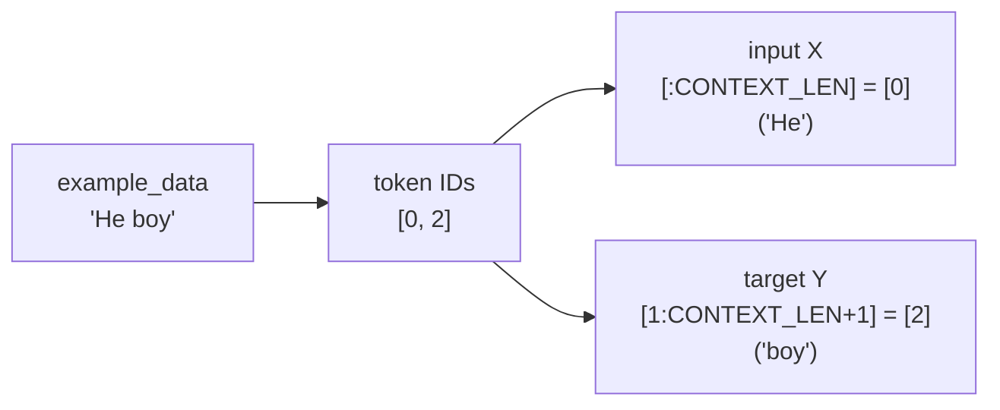

In plain English: given the input `"He"` the model should learn to predict `"boy"`. With `CONTEXT_LEN = 1`, we look at one token at a time and ask the model what comes next. The same machinery scales: bump `CONTEXT_LEN` to 1024 and you have GPT-style next-token prediction over a 1024-token window.

> [!info]+ Interview questions covered
> - What is `CONTEXT_LEN` / context window in an LLM?
> - How are input (`X`) and target (`Y`) pairs constructed for next-token prediction?
> - How does Python list slicing work and why is the upper bound exclusive?

### Recap of the tokenizer

Putting it all together, the toy tokenizer consists of three artefacts:

1. **Vocabulary** — a sorted list of unique words: `['He', 'She', 'boy', 'girl']`.
2. **Lookup tables** — `word_to_id` and `id_to_word`.
3. **Encode / decode helpers** — `text_to_token_ids` and `token_ids_to_text`.

And we added one piece of infrastructure that has nothing to do with tokenization but everything to do with shared experience in the classroom:

4. **A fixed random seed** via `torch.manual_seed(123)`, so every subsequent random draw is reproducible.

With token IDs in hand and a slicing pattern for `(input, target)` pairs, the next section can wire these into a PyTorch `Dataset` / `DataLoader` and start feeding the model.


## LLMDataset, DataLoader, `__getitem__`, Context Length, PyTorch Dataset

This section bridges raw tokenization and actual training. We already have a vocabulary and a `text_to_token_ids` helper; now we need a structured way to feed (input, target) pairs to a model in batches. PyTorch's `Dataset` and `DataLoader` are the standard scaffolding for that, and we will build a tiny `LLMDataset` on top of them — still using the toy `{He:0, She:1, boy:2, girl:3}` vocab.

### Recap: slicing tokens into input and target windows

We start from where the previous section left off: a vocabulary mapping and the slicing cells in `dummy.ipynb`.

From `dummy.ipynb` (executed cells with outputs):

```python
print(example_data)
# He boy

text_to_token_ids(example_data, word_to_id)
# [0, 2]

text_to_token_ids(example_data, word_to_id)[:CONTEXT_LEN]
# [0]

text_to_token_ids(example_data, word_to_id)[1:CONTEXT_LEN + 1]
# [2]
```

Read the two slicing expressions carefully — they encode the entire next-token-prediction setup:

- `[:CONTEXT_LEN]` — the empty start position before the colon means **start from index 0**. With `CONTEXT_LEN = 1`, the upper bound is `1` and is **exclusive**, so the slice covers indices `[0, 1)` and yields just `[0]` (the token id for `He`).
- `[1:CONTEXT_LEN + 1]` — start at index `1`, stop before index `2`, yielding `[2]` (the token id for `boy`).

So for the string `"He boy"`:

| Slice | Indices | Result | Meaning |
|---|---|---|---|
| `[:CONTEXT_LEN]` | `[0, 1)` | `[0]` (`He`) | input `x` |
| `[1:CONTEXT_LEN + 1]` | `[1, 2)` | `[2]` (`boy`) | target `y` |

The target slice is the input slice shifted right by one. To convince yourself, imagine a longer token list `[0, 1, 2]`:

- `[:2]` → `[0, 1]`
- `[1:CONTEXT_LEN + 1]` with `CONTEXT_LEN = 2` → `[1, 2]`

Same shift-by-one. This is the **input/target pair** the model will be trained on: given the leading window of length `CONTEXT_LEN`, predict the next token.

> [!info]+ Interview questions covered
> - How does Python slicing handle the start and end indices?
> - How do you construct input and target sequences for next-token prediction?
> - Why is the target a shifted copy of the input?

### What "context length" actually means

A student asks why `CONTEXT_LEN = 1`. The answer: for this dummy walkthrough we want the model to see only one token at a time so the math stays trivial. **Context length is simply the number of tokens the model sees at once.**

In production this number is enormous. Frontier models like Claude Opus expose context windows of around one million tokens, which is what lets a model:

- Hold an entire codebase in view in a single prompt.
- Remember a fact mentioned earlier in the conversation (e.g., your first name) so it can use it later (e.g., when you give your last name).

LLMs are **stateless** between forward passes — they don't carry hidden memory across requests the way a stateful program does. The only "memory" they have is whatever fits inside the current context window. A larger window therefore directly translates into more apparent memory and better long-range reasoning.

For the dummy notebook we deliberately keep `CONTEXT_LEN = 1` so each `(x, y)` pair is just one input token mapped to one target token, which is the simplest possible supervision signal.

> [!info]+ Interview questions covered
> - What is a context window / context length in an LLM?
> - Why are LLMs considered stateless?
> - Why does a larger context window matter in practice?

### The hyperparameters and dummy dataset

Scrolling back to the top of `dummy.ipynb`, the hyperparameter cell that drives this whole section is:

```python
data = [
    "He boy",
    "She girl",
]

VOCAB_SIZE = 4
CONTEXT_LEN = 1
BATCH_SIZE = 2
EPOCHS = 100
```

Imports needed for the dataset and loader:

```python
import torch
import torch.nn as nn
from torch.utils.data import Dataset, DataLoader
from collections import defaultdict

_ = torch.manual_seed(123)

text_data = data
example_data = text_data[0]
print(example_data)
# He boy
```

`torch.manual_seed(123)` fixes the PRNG so the run is reproducible. `text_data` is just an alias for `data` so we can swap data sources without renaming downstream code.

### Building `LLMDataset` on top of PyTorch's `Dataset`

PyTorch ships a `Dataset` base class. We **extend** it to inherit a lot of free behaviour — most importantly, `Dataset` is what `DataLoader` knows how to iterate and batch. This is plain Python OOP: subclass and override the dunder methods that PyTorch promises to call.

A `Dataset` subclass must implement two methods:

- `__len__(self)` — how many items are in the dataset.
- `__getitem__(self, idx)` — return the item at position `idx`.

`__init__` is just for storing whatever the dataset needs (texts, vocab, max length).

The full class from `dummy.ipynb`:

```python
class LLMDataset(Dataset):
    def __init__(self, texts, word_to_id, max_len):
        self.texts = texts
        self.word_to_id = word_to_id
        self.max_len = max_len

    def __len__(self):
        return len(self.texts)

    def __getitem__(self, idx):
        tokens = torch.tensor(
            text_to_token_ids(self.texts[idx], self.word_to_id)[:self.max_len + 1]
        )
        x = tokens[:-1]
        y = tokens[1:]
        return x, y
```

Walking through each method:

- `__init__` stashes the raw `texts`, the `word_to_id` mapping built earlier, and `max_len` (which is `CONTEXT_LEN` when we instantiate it).
- `__len__` returns `len(self.texts)`. Conceptually identical to writing a `length()` method on a list/collection in any backend codebase. For our dummy data it returns `2`.
- `__getitem__` is the interesting one. Given an index `idx`:
    1. Tokenize `self.texts[idx]` to a list of ids.
    2. Slice up to `max_len + 1` tokens. The `+ 1` is what gives us room for both the input window and the shifted target.
    3. Wrap in `torch.tensor` so downstream PyTorch ops work without conversion.
    4. Split into `x = tokens[:-1]` (everything except the last) and `y = tokens[1:]` (everything except the first). This is the same shift-by-one trick from the slicing recap.
    5. Return the `(x, y)` pair.

#### Worked example: `__getitem__(0)`

With `text_data = ["He boy", "She girl"]` and `CONTEXT_LEN = 1`, calling `train_dataset[0]` runs through:

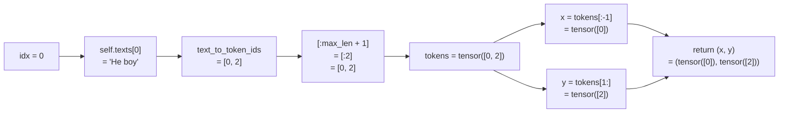

So `__getitem__(0)` returns the pair `(0, 2)` — input `He` (id `0`), target `boy` (id `2`). Exactly the supervision we want: "given `He`, the next token should be `boy`."

By the same logic, `__getitem__(1)` returns `(1, 3)` — input `She`, target `girl`.

> [!info]+ Interview questions covered
> - What is a PyTorch `Dataset`?
> - Which methods must a custom `Dataset` subclass implement?
> - What does `__getitem__` typically return for an LLM training dataset?
> - Why do we slice `tokens[:-1]` and `tokens[1:]` for input and target?

### Wrapping the dataset in a `DataLoader`

A `Dataset` knows how to produce one item; a `DataLoader` knows how to assemble items into **batches**, optionally shuffle them, and hand them to the training loop. Two hyperparameters dominate this stage:

| Concept | Meaning |
|---|---|
| **Batch size** | Number of items fed to the model in one training step. Determines how `DataLoader` groups items. |
| **Epoch** | One full pass over the entire dataset. Determines how many times the loop iterates over all batches. |

Both matter during training, but **batch size is what governs how the dataset gets sliced up** by the loader.

The construction code:

```python
train_dataset = LLMDataset(
    text_data,
    word_to_id,
    CONTEXT_LEN,
)

train_dataloader = DataLoader(
    train_dataset,
    batch_size=BATCH_SIZE,
    shuffle=False,
)

print(len(train_dataloader))
```

#### Counting batches: dataset size ÷ batch size

A small mental exercise the tutor walks through twice:

| `data` | dataset size | `BATCH_SIZE` | number of batches |
|---|---|---|---|
| `["He boy", "She girl"]` | 2 | 2 | **1** |
| `["He boy", "She girl", "He boy", "She girl"]` | 4 | 2 | **2** |

So `len(train_dataloader)` for the original two-item dataset is `1`. The arithmetic is exactly `ceil(len(dataset) / batch_size)`, and that is what the loader's `__len__` returns.

#### Why `shuffle=False`?

`shuffle=False` keeps the items in their original order — `He boy` first, `She girl` second — so every run produces identical output and we can compare results across the class. The tutor notes a reasonable hypothesis (untested in the lecture): with `shuffle=True`, fixing `torch.manual_seed(123)` should also give a deterministic permutation. That's left as an experiment.

In real training shuffling is typically **on** to break ordering biases. We're only turning it off here for pedagogical reproducibility.

> [!info]+ Interview questions covered
> - What is the difference between a PyTorch `Dataset` and a `DataLoader`?
> - What is the difference between batch size and epochs?
> - How is the number of batches per epoch computed?
> - Why would you set `shuffle=False` in a `DataLoader`?

### Putting the data pipeline together

Here is the end-to-end shape of what we have built, at one glance:

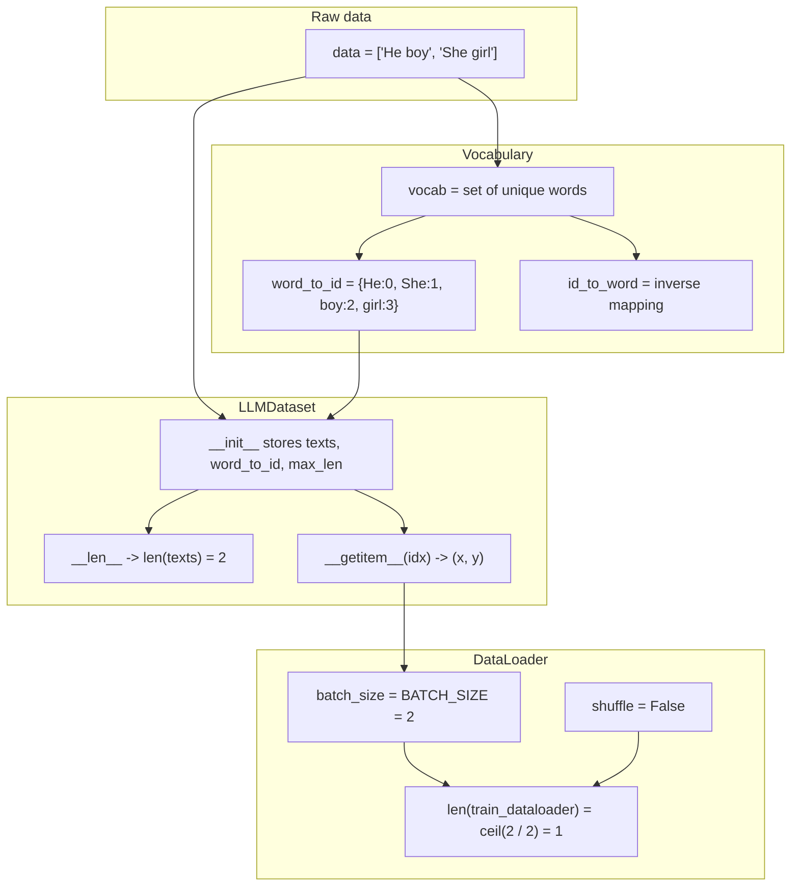

Each pass over the loader yields one batch. Each batch contains multiple items. Each item is an `(x, y)` pair where:

- `x` is a tensor of input token ids of length up to `CONTEXT_LEN`.
- `y` is the same window shifted right by one token — the next-token target the model must predict.

The next step (in the following section) is to actually iterate `train_dataloader` and look at the shape of those batches, then feed them into a model.

> [!info]+ Interview questions covered
> - How does PyTorch's `DataLoader` interact with a custom `Dataset`?
> - What does one "item" returned by an LLM training dataset look like?
> - How do tokenization, vocabulary, dataset, and dataloader fit together in an LLM training pipeline?


## Input–Target Pair (X, Y), Y = WX + B, Weight Initialization, Linear Model, Next-Token Prediction

By this point the toy dataset, `LLMDataset`, and a `DataLoader` have all been wired
up. This section opens up the `DataLoader` to **see exactly what one batch looks
like**, builds an explicit mental model of the **(x, y) input–target pair**,
introduces the **shifted-by-one target** that defines next-token prediction, and
then writes the **first actual model**: a one-line linear function $y = Wx + B$
expressed as a PyTorch `nn.Module`. By the end, the `tokenizer → linear layer`
half of the dummy LLM is fully coded, with the weights initialized and the
trainable parameter count confirmed.

Throughout, the worked example uses the toy vocabulary from earlier:

| word | token id |
|------|----------|
| he   | 0        |
| she  | 1        |
| boy  | 2        |
| girl | 3        |

### Inspecting the DataLoader: how many batches do we have?

The `train_dataloader` was constructed from `train_dataset` with `batch_size = BATCH_SIZE`
and `shuffle = False`. Calling `len()` on a DataLoader returns the **number of
batches**, not the number of samples.

From `dummy.ipynb` shown in VS Code:

```python
train_dataloader = DataLoader(
    train_dataset,
    batch_size=BATCH_SIZE,
    shuffle=False,
)

print(len(train_dataloader))
```

Output:

```console
1
```

The toy dataset is so small that the entire training set fits into a **single
batch**, so iterating the dataloader yields exactly one item.

To actually see what that one item looks like, fetch it with `next(iter(...))`:

```python
example_input_output = next(iter(train_dataloader))
print(example_input_output)
```

Output (raw print is hard to read on one line):

```console
[tensor([[0],
        [1]]), tensor([[2],
        [3]])]
```

A small `re.sub` snippet flattens the whitespace just for readability — it does
not change the data:

```python
import re
formatted = [re.sub(r'\s+', ' ', str(t)) for t in example_input_output]
print("[" + ",\n ".join(formatted) + "]")
```

Reformatted output:

```console
[tensor([[0], [1]]),
 tensor([[2], [3]])]
```

The structure is now obvious: **one batch is a Python list of two tensors**.
The first tensor is the input `x`, the second tensor is the target `y`.

> [!info]+ Interview questions covered
> - What does `len(DataLoader)` return — the number of samples or the number of batches?
> - What does `next(iter(dataloader))` give you?
> - What is the structure of a batch produced by a PyTorch `DataLoader`?

### Decoding the batch as an (x, y) matrix

It helps to picture the printed output as a **2D matrix** indexed by
`(row, column)`:

| index in `example_input_output` | tensor                | role  |
|--------------------------------|------------------------|-------|
| `[0]`                          | `tensor([[0], [1]])`   | input `x` |
| `[1]`                          | `tensor([[2], [3]])`   | target `y` |

Then within each tensor, `[0]` is the first row and `[1]` is the second row.
The notebook indexes a single training example with two new cells:

```python
# Example Input
example_input_output[0][0]
```

```console
tensor([0])
```

```python
# Example Output (shifted by one token)
example_input_output[1][0]
```

```console
tensor([2])
```

Mapping the token ids back to vocabulary words gives the **first training
pair**:

- `example_input_output[0][0] = tensor([0])` → token id `0` → **he**
- `example_input_output[1][0] = tensor([2])` → token id `2` → **boy**

So the model, when fed `he`, must be trained to predict `boy`. Doing the same
for the second row:

- `example_input_output[0][1] = tensor([1])` → token id `1` → **she**
- `example_input_output[1][1] = tensor([3])` → token id `3` → **girl**

So the second pair is `she → girl`. The full batch as `(x, y)` pairs:

| row | x (input token) | y (target token) | meaning      |
|-----|-----------------|------------------|--------------|
| 0   | `0` (he)        | `2` (boy)        | he → boy     |
| 1   | `1` (she)       | `3` (girl)       | she → girl   |

This is the **shifted-by-one** structure that defines **next-token prediction**:
each `y[i]` is the token that should come *after* `x[i]` in the original text.
The cell comment in the notebook spells it out: `# Example Output (shifted by
one token)`.

> [!info]+ Interview questions covered
> - How is a batch tensor indexed to retrieve a single training example?
> - What does it mean for the target `y` to be "shifted by one token" relative to the input `x`?
> - What is next-token prediction?

### Why we always feed X and Y together

A natural question: if the model is supposed to *predict* `y`, why are we also
passing `y` into the training step?

The answer is that during training the model has to **compare** its prediction
against the truth so it can compute a loss and update its weights. The flow is:

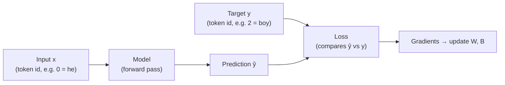

Without `y`, there is no loss, no gradient signal, and no learning. So every
training step is fed **both** `x` and `y`: `x` flows forward through the model
to produce a prediction; `y` is the target that the prediction is compared
against.

Everything done up to this point — building the vocabulary, encoding text into
token ids, wrapping it in `LLMDataset`, batching it through `DataLoader`, and
splitting each batch into `x` and `y` — is **data preparation**. We now have a
list of `x` and a list of `y` ready to be sent into the model.

> [!info]+ Interview questions covered
> - Why do we feed both X and Y to the model during training?
> - What is the purpose of the loss function?
> - What is meant by "data preparation" in the LLM training pipeline?

### The GPTModel class: y = Wx + B in PyTorch

With the data ready, the next step is the actual model. The dummy LLM uses the
simplest possible function — a single linear layer with one weight and one
bias:

$$y = Wx + B$$

This is the same hypothesis function $h$ used in the earlier from-scratch
NumPy walkthrough, only now expressed using PyTorch's `nn.Module`:

```python
class GPTModel(nn.Module):
    def __init__(self):
        super().__init__()
        self.w = nn.Parameter(torch.zeros(1))
        self.b = nn.Parameter(torch.zeros(1))

    def forward(self, x):
        return x.float() * self.w + self.b
```

Two things to call out:

1. **Subclassing `nn.Module`.** PyTorch requires every model to extend
   `nn.Module`. By doing this, `GPTModel` inherits the machinery for parameter
   tracking, `.parameters()`, `.to(device)`, autograd, etc., and is allowed to
   **override** specific methods — most importantly `forward`.

2. **`forward` instead of `predict`.** The earlier from-scratch class used a
   method called `predict`. PyTorch convention names it `forward` because, in a
   neural-network architecture, **inputs always move forward through the
   network**. Calling `model(x)` automatically dispatches to `forward(x)`.

The body `x.float() * self.w + self.b` is literally $y = Wx + B$. The
`x.float()` cast is needed because the input tensor stores integer token ids
(e.g., `tensor([0])`) and PyTorch requires floating-point tensors for
multiplication with learnable parameters.

Compared with the earlier NumPy version, **nothing about the math has changed**
— it is still $y = Wx + B$. The only change is using PyTorch's `nn.Module`
instead of writing the parameter bookkeeping by hand.

> [!info]+ Interview questions covered
> - Why must a PyTorch model subclass `nn.Module`?
> - Why is the method called `forward` and not `predict`?
> - What does `model(x)` actually invoke under the hood?

### Weight initialization and the trainable-parameter count

In the `__init__` method, the weight and bias are wrapped in `nn.Parameter`
and initialized to zero:

```python
self.w = nn.Parameter(torch.zeros(1))
self.b = nn.Parameter(torch.zeros(1))
```

Two things are happening:

- **`torch.zeros(1)`** allocates a 1-element tensor whose value is `0.0`. This
  is the **initialization step** of the training loop: every weight gets a
  starting value before training begins.
- **`nn.Parameter(...)`** wraps the tensor so that PyTorch knows it is a
  *learnable* parameter. Anything assigned to `self.<name>` as an `nn.Parameter`
  is automatically registered with the module and shows up in
  `model.parameters()`, which is what the optimizer iterates over.

The `__init__` method runs exactly once, when the model object is created via
`model = GPTModel()`. At that moment both weights are set to zero. From then on,
the optimizer will update them on every training step.

So how many trainable parameters does this model have? Two:

| parameter | shape    | initial value | role                          |
|-----------|----------|---------------|-------------------------------|
| `self.w`  | `(1,)`   | `0.0`         | weight (slope) in $y = Wx + B$ |
| `self.b`  | `(1,)`   | `0.0`         | bias (intercept) in $y = Wx + B$ |

This is intentionally tiny — the whole point of the dummy model is that you
can count its parameters on one hand, watch them update by hand, and after
training inspect them and see the actual learned values (which, after enough
steps, will end up at $W = 1, B = 2$, giving the exact mapping
$\text{he}(0) \to 2 \to \text{boy}$).

> [!info]+ Interview questions covered
> - What is weight initialization and when does it happen?
> - What does `nn.Parameter` do, and why is it different from a plain tensor?
> - How do you count the number of trainable parameters in a PyTorch model?
> - What does `__init__` in an `nn.Module` subclass do?

### Mapping back to the dummy LLM architecture

Switching from the notebook back to the Excalidraw architecture diagram makes
the progress visible. The dummy LLM pipeline drawn earlier looks like:

```mermaid
flowchart LR
    T["Text input<br/>('he', 'she')"] --> TOK["Tokenizer<br/>(word → token id)"]
    TOK --> LIN["Linear layer<br/>y = Wx + B"]
    LIN --> OUT["Predicted token id<br/>(→ word)"]
```

Two of these boxes are now coded:

| Pipeline stage         | Status      | Where it lives                |
|------------------------|-------------|--------------------------------|
| Tokenizer              | ✓ coded     | `vocab` + `encode/decode` from earlier sections |
| Linear layer ($y=Wx+B$) | ✓ coded    | `GPTModel.forward` in `dummy.ipynb` |
| Optimizer + training loop | next     | upcoming sections              |
| Inference / next-token generation | later | upcoming sections              |

So the model and its initial weights are in place. The **next step** is to
create an instance of the model, attach an optimizer (which is the thing that
will actually update `self.w` and `self.b`), and choose a loss function — which
is exactly what the next cell sets up:

```python
model = GPTModel()
optimizer = torch.optim.AdamW(model.parameters(), lr=0.1)
loss_fn = nn.MSELoss()
```

That trio — model, optimizer, loss — is the entry point into the training
loop, which is the subject of the next section.

> [!info]+ Interview questions covered
> - What are the major components of an LLM training pipeline?
> - After defining the model, what are the next two objects you need to start training?
> - What is the role of the optimizer?


## Named Parameters, Training Loop, Trainable Parameters Count, AdamW Optimizer, MSE Loss

With the `GPTModel` class defined and the dataset/dataloader plumbed in, the dummy LLM is ready to be *trained*. This section assembles the three pieces every PyTorch training pipeline needs — the **model object**, the **optimizer**, and the **loss function** — then introspects the model's parameters and walks through the training loop line by line.

### Where we are in the pipeline

The recipe so far (review):

```mermaid
flowchart LR
    A[Tokens<br/>he/she/boy/girl] --> B[Vocab<br/>{he:0, she:1,<br/>boy:2, girl:3}]
    B --> C[LLMDataset<br/>X, y pairs]
    C --> D[DataLoader<br/>batches]
    D --> E[GPTModel<br/>y = x·w + b]
    E --> F[Optimizer<br/>+ Loss fn]
    F --> G[Training loop]
```

The model class itself is a one-line linear regression dressed up as an `nn.Module`. From the previous section:

From `dummy.ipynb` — the model class:

```python
class GPTModel(nn.Module):
    def __init__(self):

        super().__init__()
        self.w = nn.Parameter(torch.zeros(1))
        self.b = nn.Parameter(torch.zeros(1))

    def forward(self, x):
        return x.float() * self.w + self.b
```

Both `w` and `b` start at zero and are wrapped in `nn.Parameter` so PyTorch knows they are *learnable* — every `nn.Parameter` is automatically tracked by autograd and registered with the parent `nn.Module`.

### Instantiating model, optimizer and loss

After defining the class, the next cell creates one concrete model and pairs it with an optimizer and a loss function:

```python
model = GPTModel()
optimizer = torch.optim.AdamW(model.parameters(), lr=0.1)
loss_fn = nn.MSELoss()
```

Three things just happened:

1. **`model = GPTModel()`** instantiates the network. Internally `__init__` allocates the two scalar tensors `w = 0.0` and `b = 0.0`.
2. **`optimizer = torch.optim.AdamW(model.parameters(), lr=0.1)`** registers every learnable parameter with the optimizer and tells it the starting learning rate.
3. **`loss_fn = nn.MSELoss()`** prepares a function that, when called with a prediction and a target, returns a scalar mean-squared-error loss.

#### Why an optimizer is needed

Training is gradient descent: at every step, look at the slope of the loss surface, take a step in the *opposite* direction, and repeat until the loss bottoms out. Two things must be decided each step — *which direction* to move and *how big a step* to take. The gradient picks the direction; the **optimizer** consumes that gradient and decides the actual update — including the step size.

In earlier sessions the loss was computed by hand and `dW`, `dB` were derived from the cost function manually. PyTorch removes that manual labour: it computes `dW` and `dB` automatically (autograd), and the optimizer applies them. We never have to write a finite-difference or chain-rule line.

#### Why AdamW specifically

`AdamW` is the optimizer of choice for modern LLMs. Beyond plain SGD, it does two things:

- **Adaptive per-parameter learning rates** (the *Adam* part) — momentum-like statistics so the effective step size auto-tunes for each parameter.
- **Decoupled weight decay** (the *W* part) — pulls weights gently toward zero each step, which acts as regularisation.

The exact mechanics are not important right now; the takeaway is: AdamW is what the rest of the pipeline will use because it is what real LLMs use. Why-this-not-that comparisons can wait until the optimizer actually matters in a non-trivial model.

#### Learning rate as a hyperparameter

`lr=0.1` is the **learning rate** ($\alpha$) — the multiplier on the gradient when the weight update happens:

$$w \leftarrow w - \alpha \cdot \frac{\partial L}{\partial w}$$

It is a **hyperparameter**: not learned by the model, but set by us before training. It should be neither too large (overshoots the minimum, training diverges) nor too small (training crawls). The right value comes from experimentation on a given dataset; a tiny dataset and a huge dataset will usually want different learning rates.

| Concept | Who decides it? | Updated during training? |
|---------|-----------------|--------------------------|
| **Parameter** (e.g. `w`, `b`) | The training loop via the optimizer | Yes |
| **Hyperparameter** (e.g. learning rate, batch size, epochs) | The engineer, before training | No |

#### Why MSE for this dummy model

For our toy regression `y = x · w + b`, the natural loss is mean squared error:

$$\mathrm{MSE} = \frac{1}{N}\sum_{i=1}^{N}\left(\hat{y}_i - y_i\right)^2$$

`nn.MSELoss()` is the function object. It will be *called* later inside the loop as `loss_fn(y_predicted, y.float())` — the loss function compares "what we got vs what we wanted" and returns a single scalar that the rest of the loop drives back through the network.

> [!info]+ Interview questions covered
> - What is an optimizer in PyTorch and what does it do?
> - What is the AdamW optimizer and why is it preferred for LLMs?
> - What is a learning rate? Is it a parameter or a hyperparameter?
> - What is the difference between a parameter and a hyperparameter?
> - What is MSE loss and when do you use it?

### Counting trainable parameters

Once the model object exists, a useful sanity check is: *how many learnable numbers does it actually have?* For our dummy model the answer should be 2 (one for `w`, one for `b`).

#### `requires_grad` and trainable parameters

```python
trainable_params = sum(p.numel() for p in model.parameters() if p.requires_grad)
print(f"Total trainable parameters: {trainable_params:,}")
```

```console
Total trainable parameters: 2
```

A few things to unpack:

- **"Weights" and "parameters" are interchangeable** in this context. PyTorch tracks every `nn.Parameter` registered on an `nn.Module` and exposes them through `model.parameters()`.
- Each parameter tensor `p` has a boolean `p.requires_grad`. By default this is `True` for every `nn.Parameter` — meaning autograd will compute gradients for it, and the optimizer is allowed to update it.
- `p.numel()` returns the **n**umber of **el**ements in the tensor. `w` and `b` are each a single scalar, so each contributes 1, giving a total of 2.

#### Freezing parameters with `requires_grad = False`

The same flag is what powers **parameter freezing** — extremely important when fine-tuning or quantising large models. Setting `requires_grad = False` on a parameter tells autograd to skip it and the optimizer to leave it alone.

```python
for p in model.parameters():
    p.requires_grad = False
```

After this, the trainable-parameter count would drop to 0 because the filter `if p.requires_grad` would exclude every parameter. In a real LLM you might freeze the entire base model and unfreeze only a small adapter — this is the same mechanism.

#### Total parameters vs trainable parameters

Drop the filter to count *all* parameters regardless of whether they are being trained:

```python
total_params = sum(p.numel() for p in model.parameters())
print(f"Total parameters: {total_params:,}")
```

```console
Total parameters: 2
```

For this dummy model both numbers are equal (2 == 2), but in larger or fine-tuned models they diverge as soon as some parameters are frozen.

| Quantity | Code | Counts |
|----------|------|--------|
| Total parameters | `sum(p.numel() for p in model.parameters())` | All `nn.Parameter`s, frozen or not |
| Trainable parameters | `... if p.requires_grad` | Only the ones the optimizer will update |

> [!info]+ Interview questions covered
> - What is `requires_grad` in PyTorch?
> - How do you count the number of trainable parameters in a PyTorch model?
> - What is the difference between trainable parameters and total parameters?
> - How do you freeze parts of a model in PyTorch?

### `named_parameters()` — introspecting by submodule name

`model.parameters()` returns an unnamed iterator of tensors. For larger models it is more useful to see *which* block contributes how many parameters. `model.named_parameters()` yields `(name, parameter)` pairs, and the names follow the attribute path — e.g. `transformer.layer1.attention.W_q`. Grouping by the top-level segment of the name gives a per-submodule count:

```python
param_count = defaultdict(int)

for name, param in model.named_parameters():
    top_level = name.split('.')[0]
    param_count[top_level] += param.numel()

for k, v in param_count.items():
    print(f"{k:20s}: {v:,}")
```

```console
w                   : 1
b                   : 1
```

In the dummy model each top-level name (`w`, `b`) maps to a single scalar, so the output is just `w : 1` and `b : 1`. In a real LLM, `w` would typically be an array of weight matrices (`W1, W2, ...`) and the same loop would print one aggregated row per submodule — exactly the kind of breakdown you want when debugging "where are my parameters going?".

> [!info]+ Interview questions covered
> - What does `model.named_parameters()` return?
> - How do you print the parameter count grouped by submodule in PyTorch?
> - What is `param.numel()`?

### The training loop

Now the actual training. The whole loop is wrapped in a function so the same code can be reused for every epoch:

```python
def train(dataloader, model, loss_fn, optimizer):
    model.train()
    for batch, (X, y) in enumerate(dataloader):

        y_predicted = model(X)
        loss = loss_fn(y_predicted, y.float())

        loss.backward()
        optimizer.step()
        optimizer.zero_grad()

        print(f"batch: {batch + 1} loss: {loss:>7f}")
```

Visualising one batch:

```mermaid
flowchart LR
    A[Get batch<br/>X, y from dataloader] --> B["y_predicted = model(X)<br/>(forward pass)"]
    B --> C["loss = loss_fn(y_predicted, y)<br/>(MSE)"]
    C --> D["loss.backward()<br/>(autograd: fill p.grad)"]
    D --> E["optimizer.step()<br/>(update w, b)"]
    E --> F["optimizer.zero_grad()<br/>(clear grads)"]
    F --> G[Print batch loss]
    G --> A
```

Walking through it line by line:

#### `model.train()`

Switches the model into **training mode**. For modules like Dropout and BatchNorm this changes their behaviour. The dummy model has neither, so it does nothing here, but it is left in as a habit — every training function should start with `model.train()` and every evaluation function with `model.eval()`.

#### `for batch, (X, y) in enumerate(dataloader):`

The DataLoader yields one batch at a time. Each iteration gives a fresh `(X, y)` pair where `X` is a tensor of input token IDs and `y` is the corresponding next-token target. Even when the conceptual batch size is one, `X` is still a tensor (an array of length 1) — PyTorch operations expect tensors throughout.

#### `y_predicted = model(X)` — the forward pass

This is the line that confuses newcomers: where is `model.predict(...)` or an explicit call to `forward(...)`?

The trick is Python's `__call__` protocol. `nn.Module` defines `__call__`, and inside that `__call__` it dispatches to your `forward()` method (after running pre/post hooks). So `model(X)` is *equivalent to* invoking `forward(X)` — but writing it as `model(X)` lets PyTorch do its bookkeeping (autograd context, hooks, etc.) around the forward pass.

```mermaid
flowchart LR
    A["model(X)"] --> B["nn.Module.__call__(X)"]
    B --> C["forward(self, X)"]
    C --> D["x.float() * w + b"]
    D --> E[y_predicted]
```

For our dummy model the forward pass is just $\hat{y} = x \cdot w + b$ using the *current* values of `w` and `b`.

#### `loss = loss_fn(y_predicted, y.float())` — compute the error

`loss_fn` was created once outside the loop (`nn.MSELoss()`) and is reused every batch. It compares "what we got" (`y_predicted`) with "what we wanted" (`y.float()` — cast to float so the dtypes match for subtraction) and returns a single scalar tensor representing the error for this batch.

#### `loss.backward()` — autograd computes the gradients

This is where backpropagation happens. PyTorch traced every operation that produced `loss` (the multiplication by `w`, the addition of `b`, the squared error inside MSE), and `.backward()` walks that graph in reverse, applying the chain rule to fill in `p.grad` for every parameter `p` that has `requires_grad=True`. After this line, `model.w.grad` and `model.b.grad` hold $\partial L / \partial w$ and $\partial L / \partial b$.

(*"What is `.backward()`?"* will be a focal interview question — the answer is: it triggers reverse-mode autograd over the computation graph rooted at this scalar tensor.)

#### `optimizer.step()` — apply the update

The optimizer reads each parameter's `.grad` and applies its update rule. For AdamW with learning rate 0.1, that is roughly:

$$w \leftarrow w - 0.1 \cdot \widehat{m}_w + \text{(weight decay)}$$

where $\widehat{m}_w$ is AdamW's moment-corrected gradient estimate. For plain SGD it would simply be $w \leftarrow w - 0.1 \cdot \partial L/\partial w$.

#### `optimizer.zero_grad()` — clear gradients for the next batch

PyTorch *accumulates* gradients across `.backward()` calls by default. If we did not zero them, the next batch's gradient would be added on top of this batch's gradient, contaminating the update. `zero_grad()` resets every `p.grad` to 0 so the next batch starts clean.

(In some advanced setups — e.g. gradient accumulation across multiple micro-batches to simulate a larger batch size — you intentionally skip `zero_grad()` for several iterations. That is the exception, not the rule.)

#### `print(f"batch: {batch + 1} loss: {loss:>7f}")`

Pure observability — print which batch we just finished and what its loss was, so you can watch the loss curve fall epoch by epoch.

> [!info]+ Interview questions covered
> - What does `model.train()` do in PyTorch?
> - Why do we write `model(X)` instead of `model.forward(X)`?
> - What is the standard PyTorch training loop structure?
> - What does `loss.backward()` do?
> - What does `optimizer.step()` do?
> - Why do we call `optimizer.zero_grad()` every iteration?
> - What happens if you forget to call `optimizer.zero_grad()`?

### Driving training across epochs

The `train(...)` function processes one **epoch** — one full pass through the training data, batch by batch. To actually train, wrap it in an outer loop over epochs:

```python
for epoch in range(EPOCHS):
    print("--------------------------------")
    print(f"Epoch: {epoch+1}")
    train(train_dataloader, model, loss_fn, optimizer)
    print("--------------------------------")
print("Done!")
```

`EPOCHS` is another hyperparameter — how many full passes over the training set. With each pass, every batch nudges `w` and `b` a little closer to their best values; over enough epochs the loss curve flattens and the model has converged.

| Term | Definition |
|------|------------|
| **Batch** | One slice of the dataset processed in a single forward + backward + step. |
| **Epoch** | One full pass over the *entire* training dataset (i.e. all batches). |
| **Iteration** | One execution of the inner loop body — one `(X, y)` batch processed. |

For the dummy `{he:0, she:1, boy:2, girl:3}` dataset, the model is trying to learn a single linear relationship between input ID and target ID. After enough epochs, `w` and `b` should settle near values where `model(0)` ≈ 2 (`he` → `boy`), `model(1)` ≈ 3 (`she` → `girl`), and so on — which is the worked example explored in the next section.

> [!info]+ Interview questions covered
> - What is an epoch in deep learning training?
> - What is the difference between a batch and an epoch?
> - What is one iteration of the training loop?


## Optimizer Step, AdamW Optimizer, `loss.backward`, Training Loop, `optimizer.zero_grad`

Section 7 stood up the training loop scaffolding. This section is the *verbal walk-through* of that scaffolding: what each of the four magic lines inside the loop actually does, why all four are needed even when "the optimizer" is supposed to be doing the work, and what happens to the loss curve once the loop is finally run for 100 epochs over the tiny `{he, she, boy, girl}` dataset.

### Annotating the training loop

The tutor first locks in the meaning of each line by adding inline comments directly to the `train` function. This is the version that will be referred to for the rest of the section:

From `dummy.ipynb` — `train()` with the canonical annotations:

```python
def train(dataloader, model, loss_fn, optimizer):
    model.train()
    for batch, (X, y) in enumerate(dataloader):

        y_predicted = model(X)
        loss = loss_fn(y_predicted, y.float())

        loss.backward()       # calculate gradient: Find Direction
        optimizer.step()      # Update Weights
        optimizer.zero_grad() # do not accumulate gradient

        print(f"batch: {batch + 1} loss: {loss:>7f}")
```

The three-line cluster after the loss is the heart of a PyTorch training step:

```mermaid
flowchart LR
    A["loss = loss_fn(y_pred, y)"] --> B["loss.backward()<br/>compute ∂L/∂w, ∂L/∂b<br/>(find direction)"]
    B --> C["optimizer.step()<br/>w ← w − α · ĝ_w<br/>(update weights)"]
    C --> D["optimizer.zero_grad()<br/>p.grad ← 0<br/>(forget gradient)"]
    D --> E[Next batch]
```

Each of the three lines has a single, sharp job — and the tutor's mnemonic for them is just three short phrases: **Find direction → Update weights → Forget**.

### `loss.backward()` — calculate gradient, find direction

The loss function only knows how to do one thing: compare *what we got* with *what we wanted*. To actually learn from that comparison the loop needs gradients — partial derivatives of the loss with respect to every parameter — and that is what `.backward()` is for.

What `.backward()` does, conceptually:

- PyTorch traced every operation that produced `loss` (the `x · w`, the `+ b`, the squared error inside MSE). That trace is the *computation graph*.
- `loss.backward()` walks the graph in reverse and applies the chain rule to fill in `.grad` on every leaf tensor that has `requires_grad=True`.
- After the call, `model.w.grad` and `model.b.grad` hold $\partial L/\partial w$ and $\partial L/\partial b$.

Crucially, `loss.backward()` *does not update the weights*. It only computes the **direction** in which they should move. Updating is a separate concern, handled by the optimizer.

#### Why the chain rule, and why "backward"

The mean squared error is a polynomial in $w$ and $b$, so its derivative is straightforward. But once a real network stacks linear layers, activations and embeddings, the loss becomes a composition of many functions and the derivative requires the chain rule:

$$\frac{\partial L}{\partial w} = \frac{\partial L}{\partial \hat{y}} \cdot \frac{\partial \hat{y}}{\partial w}$$

`.backward()` is named *backward* because it traverses the computation graph from the loss back toward the inputs — the formal mechanics are **backpropagation**, which is covered in detail in the neural-network class. For now the takeaway is: `loss.backward()` = calculate the first derivative (using the chain rule where needed) and store it on the parameters.

#### Why `loss` looks "unused" after assignment

A student asks: we compute `loss = loss_fn(...)` and never read the variable again — is it unused? No. `loss` is an *object* returned by the loss function, and the next line invokes a method on it: `loss.backward()`. That single attribute access uses the object. It is the same shape as any object-oriented API — assign a reference, then call methods on the reference.

If you wanted explicit observability you could early-stop on it, e.g. `if loss < 1: break`, but in practice the loss naturally trends to zero across iterations and is just printed for monitoring.

> [!info]+ Interview questions covered
> - What does `loss.backward()` do in PyTorch?
> - Does `loss.backward()` update the weights?
> - What is the chain rule and where does it appear in `.backward()`?
> - Why is the variable `loss` not "unused" even though it isn't referenced after assignment?
> - What is backpropagation?

### `optimizer.step()` — update the weights

The optimizer is the only object that touches the weights. It reads each parameter's `.grad` (filled in by the previous `.backward()` call) and applies its update rule. For AdamW with $\alpha = 0.1$, conceptually:

$$w \leftarrow w - \alpha \cdot \widehat{m}_w \quad\text{(plus decoupled weight decay)}$$

where $\widehat{m}_w$ is AdamW's moment-corrected gradient estimate. The optimizer decides not just the direction (gradient) but the **step size** ($\alpha$) and any adaptive scaling on top — one step or two steps' worth of learning rate, momentum effects, etc. The model and loss never touch the weights directly; only the optimizer does.

#### Why both `loss.backward()` AND an optimizer?

This is the second classic confusion: "AdamW is the optimizer — why are we still calling `.backward()`?" The two are not redundant; they are sequential phases of the same step:

| Phase | Who | Output |
|-------|-----|--------|
| Compute gradients | `loss.backward()` | `.grad` on each parameter |
| Apply gradients to weights | `optimizer.step()` | new values of `w`, `b` |

The car analogy the tutor uses: in object-oriented code you write `car = Car()` first and then `car.run()` later. The `optimizer = torch.optim.AdamW(model.parameters(), lr=0.1)` line is the *construction* — it builds the optimizer object once and registers the parameters it is allowed to touch. The `optimizer.step()` line inside the loop is *invocation* — it asks that same object to apply one update using whatever gradients are currently sitting on the parameters.

#### How the optimizer knows which weights to update

`model.parameters()` is the wire. When the optimizer is constructed it is handed an iterator of exactly the tensors it should update — here `w` and `b`. Nothing else in the namespace is reachable to it.

```python
model = GPTModel()
optimizer = torch.optim.AdamW(model.parameters(), lr=0.1)
loss_fn = nn.MSELoss()
```

Because `GPTModel` subclasses `nn.Module` and registers `w`, `b` as `nn.Parameter`, PyTorch knows internally which tensors are learnable and exposes them via `model.parameters()`. We are not wiring this up manually — that's the value `nn.Module` adds.

For this dummy model, the model has **1 input feature** (`x`) and **2 parameters** (`w`, `b`). Both are scalars, so the parameter count printed earlier was `Total trainable parameters: 2` and the named breakdown was `w : 1`, `b : 1`.

> [!info]+ Interview questions covered
> - What does `optimizer.step()` do?
> - Why do we need both `loss.backward()` and `optimizer.step()`?
> - How does the optimizer know which parameters to update?
> - What does passing `model.parameters()` to the optimizer accomplish?

### `optimizer.zero_grad()` — do not accumulate gradients

PyTorch's default behaviour after `.backward()` is to **accumulate** gradients on the parameters: the next call to `.backward()` *adds* its result on top of whatever is already in `.grad`. This is sometimes useful (for example, in gradient-accumulation training where you simulate a larger batch by summing micro-batch gradients before stepping). For an ordinary loop, accumulation is a memory and correctness hazard.

The tutor's iteration-counting walk-through:

- First batch → `loss.backward()` writes `dW = 0.1, dB = 0.2` (say) to `.grad`.
- Second batch → `loss.backward()` *adds* the new gradient to the existing `.grad` instead of replacing it.
- After 1000 iterations, every parameter has 1000 accumulated gradient contributions sitting in memory.

In our simple example we don't rely on the previous batch's gradient at all, so we tell the model to **forget**: after `optimizer.step()` has used the gradient to update the weights, `optimizer.zero_grad()` resets every `p.grad` to 0. This caps memory use at a single gradient per parameter.

```mermaid
flowchart LR
    G1[".grad after batch 1<br/>(0.1, 0.2)"] --> S1["optimizer.step()<br/>updates w, b"]
    S1 --> Z1["optimizer.zero_grad()"]
    Z1 --> G0[".grad reset to 0"]
    G0 --> G2[".grad after batch 2<br/>only this batch's gradient"]
```

> [!info]+ Interview questions covered
> - Why do we call `optimizer.zero_grad()` every iteration?
> - What is the default gradient behaviour in PyTorch — replacement or accumulation?
> - What happens if you forget `optimizer.zero_grad()`?
> - What is gradient accumulation and when is it useful?

### `model.train()` — putting the model into training mode

The first line of the function is `model.train()`. This is **not** the thing that "trains" the model — the loop body does that. `model.train()` simply flips the module into **training mode**:

- Gradient-tracking and other training-only bookkeeping is enabled.
- Modules whose behaviour differs between training and inference (`Dropout`, `BatchNorm`, etc.) take their training-time path.
- PyTorch caches intermediate values needed for backpropagation — the bookkeeping that gets dropped in evaluation mode for memory efficiency.

The mental model the tutor uses: `model.train()` says *be ready to train*. It is a warm-up flag, not the training step itself. The actual training is the body of the loop — forward, loss, backward, step, zero_grad — that we already walked through.

### Counting iterations: epochs × batches

To internalise the loop nesting, the tutor poses a counting question. If `EPOCHS = 10` and there are `5` batches per epoch, how many times does the inner block run?

- Inner block runs once per batch.
- Each epoch iterates over all batches.
- Total iterations = epochs × batches = $10 \times 5 = 50$.

The notebook actually uses `EPOCHS = 100` and `BATCH_SIZE = 2`. Each example in the tiny dataset is seen *at least* 100 times (once per epoch), and in some setups the model can see overlapping samples more often than that — but for this dataset the basic intuition is enough: more epochs = more passes over the data = more chances for `w` and `b` to be nudged toward their optimal values.

| Term | Definition |
|------|------------|
| **Batch** | One slice of the dataset processed in a single forward + backward + step. |
| **Epoch** | One full pass over the *entire* training dataset (all batches). |
| **Iteration** | One execution of the inner loop body. `iters = epochs × batches`. |

> [!info]+ Interview questions covered
> - What is an epoch in deep learning training?
> - How many times does the inner training step run for E epochs and B batches?
> - What is the difference between a batch and an epoch?

### Running training and watching the loss fall

With everything wired up, the outer epoch loop is finally executed:

```python
for epoch in range(EPOCHS):
    print("--------------------------------")
    print(f"Epoch: {epoch+1}")
    train(train_dataloader, model, loss_fn, optimizer)
    print("--------------------------------")
print("Done!")
```

The per-batch loss prints inside `train(...)` produce a monotonically decreasing curve. Jupyter truncates long cell outputs, so only the tail of each epoch is visible, but the trajectory is clear:

```console
Epoch: 1
batch: 1 loss: 6.500000
batch: 2 loss: 5.725000
...
Epoch: 100
batch: 2 loss: 0.000562
Done!
```

By epoch 100 the loss has fallen to roughly `0.000562` — effectively zero on this dataset. The optimizer has done its job: `w` and `b` have converged to values that produce the right next-token prediction for every example in `{he → boy, she → girl}`.

> [!info]+ Interview questions covered
> - How do you know training is working?
> - Why does the printed output of a long training run look truncated in Jupyter?

### Switching to evaluation mode: `model.eval()`

Once training is done, the model needs to be used for inference (the upcoming `generate()` function). Inference doesn't need gradients, doesn't need cached intermediates and doesn't need the training-time branches of modules like `Dropout`. The standard switch is:

```python
_ = model.eval()
```

What `.eval()` does:

- Flips every submodule into **evaluation mode** — opposite of `model.train()`.
- Tells PyTorch it can drop temporary buffers that were only kept around for backprop, freeing memory.
- *Does not* itself change `requires_grad` on parameters. Trainable parameter counts can still report 2 after `model.eval()`; the practical effect is in the behaviour of layers and the lifetime of intermediate tensors, not the gradient-tracking flag itself.

For an even stronger guarantee that no gradient tracking happens during inference, the upcoming `generate()` function will further wrap the forward pass in `with torch.no_grad():` — a separate mechanism that disables autograd entirely for the block.

```python
def generate(start_text):
    token_id = word_to_id[start_text]
    x = torch.tensor([token_id])
    with torch.no_grad():
        y_predicted = model(x)
```

The pair `model.eval()` + `torch.no_grad()` is the canonical idiom for "I am only running the model, not training it." Together they minimise both compute and memory at inference time.

| Mode | How to enter | Gradient tracking | Module behaviour |
|------|--------------|-------------------|------------------|
| Training | `model.train()` | On | Dropout active, BatchNorm uses batch stats |
| Evaluation | `model.eval()` | Still on (per-parameter `requires_grad`) | Dropout off, BatchNorm uses running stats |
| Inference no-grad | `with torch.no_grad():` | Off for the block | — |

> [!info]+ Interview questions covered
> - What does `model.eval()` do in PyTorch?
> - What is the difference between training mode and evaluation mode?
> - What is `torch.no_grad()` and when do you use it?
> - Does `model.eval()` disable gradient tracking by itself?


## `torch.no_grad`, Next-Token Prediction, Autoregressive Text Generation, Dummy LLM, Data Loader

The dummy LLM has finished training. The final batch logged `loss: 0.000562` and printed `Done!`, which means `w` and `b` have converged to (very nearly) the values needed to map every input id to its target id. This section flips the model from *training* to *inference*: switch off gradients, write a tiny `generate()` function, and watch `"He"` produce `"He boy"` and `"She"` produce `"She girl"` — the simplest possible end-to-end LLM, behaving exactly like a real one.

### From training to inference: `model.eval()` and `torch.no_grad()`

Training mode and inference mode are deliberately separated in PyTorch. Once training is over, the workflow is:

```python
_ = model.eval()
```

`model.eval()` flips the module into evaluation mode. For modules like `Dropout` and `BatchNorm` this changes their behaviour at runtime; the dummy model has neither, so the call is a no-op here, but it is the convention you should always follow before running inference.

The second, complementary switch is `torch.no_grad`, which appears inside the `generate` function:

```python
with torch.no_grad():
    y_predicted = model(x)
```

To understand why this exists, recall what `loss.backward()` did during training. Every forward operation that touched `w` or `b` was recorded in autograd's computation graph so that the gradient could later be backpropagated through it. Those graph nodes — intermediate tensors, saved activations, gradient buffers — cost real memory.

At inference time we don't need any of that. We have already learned `w` and `b`; we are not going to compute a loss, we are not going to call `.backward()`, and we are certainly not going to update weights. All those autograd-related variables are *temporary scaffolding for the mathematical calculation of gradients* and can be skipped entirely. `torch.no_grad()` tells PyTorch:

> For every operation inside this `with` block, do **not** track gradients. Just run the forward computation and return the result.

The benefit is twofold:

- **Memory** — no graph is built, so no intermediate activations are kept around. On a real LLM this is enormous.
- **Speed** — fewer bookkeeping operations per forward call.

A useful mental model: `model.eval()` changes *what the model does* (e.g., dropout off); `torch.no_grad()` changes *what PyTorch records around the model* (no autograd graph). Both are typically used together at inference time, and on a memory-constrained machine the first thing to verify when you OOM during inference is "did I write `eval()` and wrap the call in `no_grad()`?".

> [!info]+ Interview questions covered
> - What does `model.eval()` do in PyTorch?
> - What is `torch.no_grad()` and when do you use it?
> - What is the difference between `model.eval()` and `torch.no_grad()`?
> - Why do we disable gradient tracking during inference?
> - How do you reduce memory usage during PyTorch inference?

### The `generate` function — walking from `"He"` to `"He boy"`

With the model in evaluation mode, the inference path is wrapped in a small helper:

From `dummy.ipynb` — the `generate` function:

```python
def generate(start_text):
    token_id = word_to_id[start_text]
    x = torch.tensor([token_id])
    with torch.no_grad():
        y_predicted = model(x)
    next_token_id = round(y_predicted.item())
    return start_text + " " + id_to_word[next_token_id]
```

This is exactly six lines, and every one of them is doing real work. Walking through it for `start_text = "He"`:

#### Step 1 — string to token id

```python
token_id = word_to_id["He"]   # 0
```

The `word_to_id` dictionary built earlier maps the toy vocabulary to integer ids:

```
{"He": 0, "She": 1, "boy": 2, "girl": 3}
```

So the input string `"He"` becomes the integer `0`. This is the **tokenization** step at inference time — same vocabulary, same mapping as during training.

#### Step 2 — Python int to PyTorch tensor

```python
x = torch.tensor([0])
```

A bare Python integer is not what `nn.Module` wants. PyTorch operates on **tensors** — multidimensional arrays whose underlying storage and arithmetic are implemented in optimised C++ kernels (and CUDA on GPU). That is why the entire stack is built on `torch.Tensor`: every operation runs orders of magnitude faster than the equivalent pure-Python loop.

So `[0]` (a length-1 Python list) is wrapped into `torch.tensor([0])`. Note the brackets: the model was trained on batched 1-D input, so a single inference call still passes a tensor with one element rather than a scalar.

#### Step 3 — forward pass with no gradients

```python
with torch.no_grad():
    y_predicted = model(x)
```

The forward pass is the same one used in training. With our learned weights `w ≈ 1` and `b ≈ 2`, the formula

$$\hat{y} = w \cdot x + b$$

evaluated at $x = 0$ gives:

$$\hat{y} = 1 \cdot 0 + 2 = 2$$

In practice gradient descent only *approximates* the optimum, so do not be surprised if the actual output prints something like `1.999` or `1.9987` instead of an exact `2`. If you trained for one lakh (100,000) iterations the value would creep arbitrarily close to 2; with a finite number of epochs you stop somewhere in the neighbourhood. Both `w` and `b` show the same effect — they are *near* their true values, not exactly on them.

This is a general property of gradient descent worth internalising: **convergence is asymptotic, not exact**. Any test that compares a learned weight to a target value must use a tolerance.

#### Step 4 — float to discrete token id (rounding)

```python
next_token_id = round(y_predicted.item())
```

Two things happen on this line:

- `y_predicted.item()` extracts the single scalar out of the tensor as a regular Python float.
- `round(...)` snaps that float to the nearest integer.

If the model produced `1.999`, `round(1.999) = 2`. If it produced `2.001`, `round(2.001) = 2`. Either way the output is the discrete integer `2` — which is a valid token id.

This rounding step is the bridge between continuous-valued model outputs and discrete tokens. In a real LLM the equivalent step is `argmax` (or sampling) over a softmax distribution rather than a `round`, but the idea is the same: turn a real-valued prediction into one of the vocabulary's token ids.

#### Step 5 — token id back to word

```python
id_to_word[2]   # "boy"
```

`id_to_word` is the inverse dictionary built alongside `word_to_id`. Given `2`, it returns `"boy"`.

#### Step 6 — concatenate

```python
return "He" + " " + "boy"   # "He boy"
```

The function returns the prompt followed by the predicted next word. Calling

```python
text = generate("He")
print("Generated text:", text)
```

prints:

```console
Generated text: He boy
```

Visualising the whole flow:

```mermaid
flowchart LR
    A["start_text = 'He'"] --> B["word_to_id['He'] = 0"]
    B --> C["x = torch.tensor([0])"]
    C --> D["with torch.no_grad():<br/>y = model(x)<br/>= 1·0 + 2 = 2 (≈1.999)"]
    D --> E["round(y.item()) = 2"]
    E --> F["id_to_word[2] = 'boy'"]
    F --> G["return 'He' + ' ' + 'boy'<br/>= 'He boy'"]
```

> [!info]+ Interview questions covered
> - How do you generate text from a trained PyTorch model?
> - Why do you wrap inference inside `torch.no_grad()`?
> - Why do model inputs need to be converted to `torch.tensor`?
> - Why doesn't gradient descent reach the exact optimal weight values?
> - How is a continuous model output converted to a discrete token id?

### Autoregressive next-token prediction

Running the same function on `"She"` produces the symmetric result:

```python
text = generate("She")
print("Generated text:", text)
```

```console
Generated text: She girl
```

The arithmetic is the same: `word_to_id["She"] = 1`, then $\hat{y} = 1 \cdot 1 + 2 = 3$, and `id_to_word[3] = "girl"`.

| Input | Token id `x` | $\hat{y} = w \cdot x + b$ | Rounded id | Word | Output text |
|-------|--------------|---------------------------|------------|------|-------------|
| `"He"` | 0 | $\approx 2$ | 2 | `boy` | `"He boy"` |
| `"She"` | 1 | $\approx 3$ | 3 | `girl` | `"She girl"` |

What the dummy model just did is exactly **autoregressive next-token prediction**:

1. Take the current text.
2. Tokenise it.
3. Feed it to the model.
4. Pick the most likely next token.
5. Append that token to the text.

Real LLMs do this in a loop — feed back the new text, predict the *next* next token, append again, repeat until you hit an end-of-sequence token or a length limit. Our `generate()` only takes one step (because `CONTEXT_LEN = 1`), but conceptually it is doing the same thing GPT-style models do at every decode step.

```mermaid
flowchart LR
    A[Prompt text] --> B[Tokenise]
    B --> C[Forward pass]
    C --> D[Pick next token<br/>round / argmax / sample]
    D --> E[Append to text]
    E --> F{More tokens<br/>to generate?}
    F -- yes --> B
    F -- no --> G[Final text]
```

This is the central idea the dummy model is meant to make concrete: the architecture inside the box can be a single linear unit, a Transformer, or anything in between — the *outer loop* is the same. Once you understand it on `y = w · x + b`, you understand it on a 70-billion-parameter model.

> [!info]+ Interview questions covered
> - What is autoregressive text generation?
> - How do LLMs generate text token by token?
> - What does "next-token prediction" mean in the context of language models?
> - What is the simplest possible architecture that demonstrates the LLM generation idea?

### End-to-end recap of the dummy LLM pipeline

Having seen the model produce text, the tutor scrolls back through the notebook one last time so the whole pipeline can be seen as a single flow rather than as isolated cells. Nothing new is introduced here; this is a synthesising recap.

#### Vocabulary and tokenisation

```python
data = [
    "He boy",
    "She girl"
]

VOCAB_SIZE = 4
CONTEXT_LEN = 1
BATCH_SIZE = 2
EPOCHS = 100

_ = torch.manual_seed(123)
```

The training corpus is two sentences. `torch.manual_seed(123)` makes every random initialisation deterministic so re-running the notebook gives the same numbers.

The vocabulary is built by splitting on whitespace and de-duplicating with a `set`, then sorted and enumerated to fix a deterministic id assignment:

```python
vocab = set()
for text in text_data:
    for word in text.split():
        vocab.add(word)

vocab = sorted(vocab)            # ['He', 'She', 'boy', 'girl']

word_to_id = {word: idx for idx, word in enumerate(vocab)}
id_to_word = {idx: word for idx, word in enumerate(vocab)}
```

Because `vocab` is sorted before enumeration, the mapping is stable across runs:

| id | word |
|----|------|
| 0 | He |
| 1 | She |
| 2 | boy |
| 3 | girl |

Two helper functions wrap the look-up:

```python
def text_to_token_ids(text, word_to_id):
    tokens = text.split()
    return [word_to_id[t] for t in tokens]

def token_ids_to_text(token_ids, id_to_word):
    words = [id_to_word[id] for id in token_ids]
    return " ".join(words)
```

#### `LLMDataset` and `DataLoader`

Each training example is one sentence sliced into an `(x, y)` pair where `y` is `x` shifted right by one — i.e. classic next-token-prediction targets:

```python
class LLMDataset(Dataset):
    def __init__(self, texts, word_to_id, max_len):
        self.texts = texts
        self.word_to_id = word_to_id
        self.max_len = max_len

    def __len__(self):
        return len(self.texts)

    def __getitem__(self, idx):
        tokens = torch.tensor(text_to_token_ids(self.texts[idx], self.word_to_id)[:self.max_len + 1])
        x = tokens[:-1]
        y = tokens[1:]
        return x, y

train_dataset = LLMDataset(text_data, word_to_id, CONTEXT_LEN)
train_dataloader = DataLoader(train_dataset, batch_size=BATCH_SIZE, shuffle=False)
```

With two sentences and `BATCH_SIZE=2`, there is exactly **one batch** in the loader:

```python
example_input_output = next(iter(train_dataloader))
print(example_input_output)
```

```console
[tensor([[0], [1]]),
 tensor([[2], [3]])]
```

Read this batch as: input ids `[[0], [1]]` (i.e. `He`, `She`) paired with target ids `[[2], [3]]` (i.e. `boy`, `girl`). Those are exactly the two pairs the `generate()` calls just reproduced.

#### Model, optimiser and loss

```python
class GPTModel(nn.Module):
    def __init__(self):
        super().__init__()
        self.w = nn.Parameter(torch.zeros(1))
        self.b = nn.Parameter(torch.zeros(1))

    def forward(self, x):
        return x.float() * self.w + self.b

model = GPTModel()
optimizer = torch.optim.AdamW(model.parameters(), lr=0.1)
loss_fn = nn.MSELoss()
```

Two trainable scalars (`w`, `b`) — total parameter count is exactly 2. AdamW drives the updates; MSE measures the error between predicted id and target id.

#### Training loop

```python
def train(dataloader, model, loss_fn, optimizer):
    model.train()
    for batch, (X, y) in enumerate(dataloader):
        y_predicted = model(X)
        loss = loss_fn(y_predicted, y.float())

        loss.backward()       # Find direction
        optimizer.step()      # Update weights
        optimizer.zero_grad() # Do not accumulate gradient

        print(f"batch: {batch + 1} loss: {loss:>7f}")

for epoch in range(EPOCHS):
    train(train_dataloader, model, loss_fn, optimizer)
```

After 100 epochs the loss has dropped to ~`0.0006`, which is small enough that `round()` reliably maps the prediction to the correct integer id.

#### The full picture

```mermaid
flowchart LR
    A[Raw text<br/>'He boy', 'She girl'] --> B[Vocab + word_to_id / id_to_word]
    B --> C[LLMDataset<br/>x, y shifted pairs]
    C --> D[DataLoader<br/>batches of size 2]
    D --> E[GPTModel<br/>y = x·w + b]
    E --> F[MSELoss]
    F --> G[loss.backward<br/>autograd]
    G --> H[AdamW.step<br/>update w, b]
    H -. 100 epochs .-> E
    E --> I[model.eval + torch.no_grad]
    I --> J[generate<br/>'He' → 'He boy'<br/>'She' → 'She girl']
```

Everything from token mapping to gradient updates to autoregressive sampling is on this one diagram. Future sections will replace the *single linear unit* (`y = x·w + b`) with embeddings, attention, and feed-forward blocks — but the rest of the pipeline (dataset → dataloader → loss → optimiser → eval → generate) stays the same. That is the point of building it on a toy first: the surrounding infrastructure becomes muscle memory before any of the heavy ML machinery is added.

> [!info]+ Interview questions covered
> - Walk me through the end-to-end training and inference pipeline of a minimal LLM.
> - What does a PyTorch DataLoader do, and how do batches reach the model?
> - How are inputs and targets shaped for next-token prediction?
> - Why is the dummy `y = w·x + b` model considered a valid (if minimal) LLM architecture?


## Context Length, Batch Size, Epochs, Tokenization, Data Loader

This section closes the dummy LLM walkthrough by tying together four ideas that beginners routinely confuse: **context length**, **batch size**, **epochs**, and the **data loader** that feeds the model. A student (Sonat) asks the tutor to re-explain how these relate, and the answers below are the consolidated, cleaned-up version of that exchange. The dummy notebook (`dummy.ipynb`) is still on screen throughout — the same one with vocabulary `{He: 0, She: 1, boy: 2, girl: 3}`, learned weights `W = 1, B = 2`, and the canonical worked example `He → 0 → model → 2 → boy`.

The dummy is now feature-complete. The next jump is the real architecture, where **K**, **Q**, **V** (key / query / value) attention sits on top of exactly this scaffolding. The tutor's recommendation: retype this dummy yourself before moving on.

---

### Context length

**Definition.** Context length is the **maximum number of tokens (words, in our toy setup) that the model can ingest in a single forward pass**. It has *no direct relationship* with epoch or batch size — those are training-loop concepts; context length is a *model capacity* concept.

#### Concrete-first

In the dummy, we feed a single token at a time: literally `He` → id `0` → into the model → out comes `2` → which decodes back to `boy`. That is a context of **one token**.

When you interact with ChatGPT or Claude, you don't paste one word — you paste a paragraph, perhaps 100, 200, or 300 words. The number of tokens the model can accept in one shot is its context length.

- ChatGPT / GPT-style models: tens to hundreds of thousands of tokens.
- Claude Opus (at the time of this lecture): up to **1 million tokens**. Large enough to read an entire codebase in one shot.

So from the model's perspective, *context length is the main thing*, because that is the actual window of text it gets to "see" before producing the next token.

#### Why bigger context wins — the code-review example

Imagine asking a model to review your code:

| Context length | What the model sees | Code-review quality |
|---|---|---|
| 1 M tokens | The **entire codebase at once** | Best — the model has the full picture |
| 100 K tokens | Roughly $\tfrac{1}{10}$ of the codebase per pass | Worse — the model only sees a slice |

If your codebase fits in 1 M tokens, the 1 M-context model strictly dominates: it can cross-reference every file simultaneously. With 100 K, you only get a $10\times$ smaller view.

#### Working around a smaller context: chunking with overlap, then recursive summarization

You cannot always wait for a 1 M-token model. The trick predating long-context models — and what tools like Claude Code did before 1 M context shipped — is to **split the input into chunks** and then **summarize hierarchically** so the final summary fits in the window.

The flow the tutor describes:

```mermaid
flowchart LR
    A[Full codebase<br/>~1M tokens] --> B[Chunk into ~20 parts<br/>with overlap]
    B --> C1[Chunk 1<br/>~100k tokens]
    B --> C2[Chunk 2<br/>~100k tokens]
    B --> C3[Chunk ...<br/>~100k tokens]
    B --> C10[Chunk 10<br/>~100k tokens]
    C1 --> S1[Summary 1<br/>~10k]
    C2 --> S2[Summary 2<br/>~10k]
    C3 --> S3[Summary ...<br/>~10k]
    C10 --> S10[Summary 10<br/>~10k]
    S1 --> M[Concatenated summaries<br/>~100k tokens, fits in window]
    S2 --> M
    S3 --> M
    S10 --> M
    M --> R[Model reviews<br/>the whole picture in one pass]
```

Two important details about the chunking step:

1. **Overlap between chunks** is necessary so that information at the boundary of one chunk is still visible at the start of the next; otherwise context that straddles chunks is lost.
2. The summaries are not as good as feeding the raw 1 M tokens, but they let a 100 K-window model still form a *complete picture* of the system in one final pass.

#### Context length matters during training too, not just inference

Sonat asks: "Isn't context length only an inference-time concept?" — No. It applies to **both training and inference**.

The tutor's illustration: imagine a long PDF (a book) where the very first sentence is

> "Paris is a very big city."

and the very last sentence — hundreds of pages later — is

> "It is a very lively city."

If the training context is too small, the model never sees those two facts *in the same window*, so it never learns the association *Paris ↔ lively city*. A larger training context lets the model bind long-range references. The exact mechanism by which this binding happens is **attention** (K, Q, V), which is the very next topic.

> [!info]+ Interview questions covered
> - What is a context window / context length in an LLM?
> - How is context length different from batch size and epoch?
> - Why do larger context windows generally produce better answers (e.g. for code review)?
> - If your input exceeds the model's context window, what techniques can you use? (chunking with overlap, hierarchical summarization)
> - Why does context length matter during training, not just inference?

---

### Epoch and batch size

The tutor explicitly separates these from context length: **epoch and batch size are training-loop hyperparameters, not model capacity**.

#### Definitions

- **Batch size** — how many samples the data loader hands to the model per `forward → loss → backward → step` cycle.
- **Epoch** — one full pass over the dataset such that **every sample has been shown to the model at least once**.

#### Concrete example: 11 samples, batch size 6

Suppose the dataset has 11 sentences and we fix the batch length to be 6 (the tutor keeps batch size even on purpose so the math is clean):

$$
\text{num\_batches per epoch} \;=\; \left\lceil \frac{11}{6} \right\rceil \;=\; 2
$$

- **Batch 1:** 6 samples (indices 0..5).
- **Batch 2:** the remaining 5 samples — but we need 6 to fill a fixed-length batch, so one item ends up appearing twice in this epoch (either through wrap-around or because the loader is configured not to drop the last partial batch).

So inside a *single* epoch, 10 items are shown exactly once and 1 item is shown twice. The total count of items seen is 12, but **every one of the 11 was seen at least once** — and that is what makes it an epoch.

#### The dummy notebook's actual data loader

From `dummy.ipynb` (the same cells we built up over the previous sections):

```python
def __getitem__(self, idx):
    tokens = torch.tensor(text_to_token_ids(self.texts[idx], self.word_to_id)[:self.max_len + 1])
    x = tokens[:-1]
    y = tokens[1:]
    return x, y
```

The `__getitem__` produces **(input, target) pairs** for next-token prediction by shifting the token list by one position: `x = tokens[:-1]`, `y = tokens[1:]`. This is the autoregressive training trick — every position predicts the next one.

The dataset and loader are then built like this:

```python
train_dataset = LLMDataset(
    text_data,
    word_to_id,
    CONTEXT_LEN,
)

train_dataloader = DataLoader(
    train_dataset,
    batch_size=BATCH_SIZE,
    shuffle=False,
)

print(len(train_dataloader))
```

For our tiny `text_data` (the `He boy` / `She girl` style sentences) with the chosen `BATCH_SIZE`, the print resolves to:

```console
1
```

i.e. one batch per epoch. The first (and only) batch, materialized via `next(iter(train_dataloader))`, looks like:

```python
example_input_output = next(iter(train_dataloader))
print(example_input_output)
```

A small regex-based pretty-print is used to fit the tensors onto two lines:

```python
import re
formatted = [re.sub(r'\s+', ' ', str(t)) for t in example_input_output]
print("[" + ",\n ".join(formatted) + "]")
```

Output:

```console
[tensor([[0], [1]]),
 tensor([[2], [3]])]
```

Reading that: the **inputs** are the token ids `0` (`He`) and `1` (`She`) — one per row in the batch — and the **targets** are `2` (`boy`) and `3` (`girl`). The model is trained to map $\texttt{He} \to \texttt{boy}$ and $\texttt{She} \to \texttt{girl}$, exactly the pairing the dummy was set up to learn.

#### What the training loop output actually looks like

Running the loop over many epochs prints one loss per `(epoch, batch)`:

```console
Epoch: 2 batch: 1 loss: 5.725000
Epoch: 3 batch: 1 loss: 5.002241
Epoch: 4 batch: 1 loss: 4.332340
Epoch: 5 batch: 1 loss: 3.715686
Epoch: 6 batch: 1 loss: 3.152412
...
Epoch: 100 batch: 1 loss: 0.000562
Done!
```

By epoch 100 the loss is essentially zero, which matches the previous section: the model has memorized `He → boy` and `She → girl` and the learned parameters have converged to `W = 1, B = 2`.

#### One pictorial flow

```mermaid
flowchart LR
    DS[Dataset: 11 samples] --> DL[DataLoader<br/>batch_size = 6, shuffle = False]
    DL --> B1[Batch 1<br/>6 samples]
    DL --> B2[Batch 2<br/>5 samples + 1 repeat]
    B1 --> EP[Epoch boundary<br/>every sample seen >= once]
    B2 --> EP
    EP --> NXT[Next epoch repeats the same loop]
```

> [!info]+ Interview questions covered
> - What is an epoch in deep-learning training?
> - What is batch size and how does it relate to dataset size?
> - If your dataset has 11 samples and your batch size is 6, how many batches per epoch?
> - Why do we sometimes see one sample twice in a single epoch?
> - What is `len(train_dataloader)` actually counting?

---

### Tokenization and vocabulary recap

The dummy's vocabulary is built directly from the training text:

```python
example_data = text_data[0]
print(example_data)
```

```console
He boy
```

```python
vocab = set()

for text in text_data:
    for word in text.split():
        vocab.add(word)

vocab = sorted(vocab)

print(len(vocab))
```

```console
4
```

Then we materialize the two lookup tables that everything downstream depends on:

```python
print(len(vocab))

for i, word in enumerate(vocab):
    print(f"{i}: {word}")

word_to_id = {word: idx for idx, word in enumerate(vocab)}
id_to_word = {idx: word for idx, word in enumerate(vocab)}
```

Printing the enumeration confirms the canonical mapping:

```console
0: He
1: She
2: boy
3: girl
```

This is **word-level tokenization** — every whitespace-separated word becomes one token. Production LLMs replace this step with **BPE (Byte-Pair Encoding)** or a similar sub-word scheme so that they can represent rare words and novel words without exploding the vocabulary. The principle, though, is identical: text → integers, integers → text.

> [!info]+ Interview questions covered
> - What is tokenization in LLMs?
> - Why must text be converted to integers before training?
> - What is the difference between word-level tokenization and BPE?
> - What is a vocabulary in an LLM and why does its size matter?

---

### Overlapping windows and padding

The fixed-context-length constraint shows up again at the **dataset** layer, not just at inference. If the model architecture demands exactly 6 tokens per forward pass (`CONTEXT_LEN = 6`), but a given sentence is only 3 tokens long, you have two options:

1. **Pad** the sentence to 6 tokens (e.g. with a `<pad>` token that the loss ignores).
2. **Overlap** with neighbouring sentences so the 6-token window is fully populated and continuity is preserved across the boundary.

Overlap is also how you keep the model from losing long-range information when you have to split long documents into multiple windows — the same chunking-with-overlap trick we saw above for inference, applied here at training time.

---

### How to actually study this code

The tutor closes the section with a meta-piece of advice that defines how the rest of the course should be approached:

> Don't memorize line by line. Get the **broader picture**. Draw a flowchart. Narrate every box in your own language — English, Hindi, whatever. If someone asks you to code it, you should be able to describe what each block does: *"this tokenization block does X, this dataset block does Y, the loader does Z."* If you can do that, you can code it.

The mental model the lecture is building, end-to-end:

```mermaid
flowchart LR
    T[Raw text] --> TK[Tokenization<br/>word -> id]
    TK --> DS[LLMDataset<br/>__getitem__ shifts tokens<br/>to make x, y pairs]
    DS --> DL[DataLoader<br/>batches of CONTEXT_LEN]
    DL --> M[Linear model<br/>y_hat = W * x + B]
    M --> L[MSE loss vs target id]
    L --> BW[loss.backward]
    BW --> OPT[AdamW step]
    OPT --> M
```

That diagram, drawn in your own words, *is* the dummy LLM. Everything in the rest of the course replaces the **M** box (currently `y = Wx + B`) with the real transformer architecture built around **K, Q, V** attention, while the surrounding pieces — tokenization, dataset, loader, training loop — stay essentially the same.

> [!info]+ Interview questions covered
> - Why might you need overlapping windows when training on long documents?
> - When is padding used in LLM training?
> - Walk me through the end-to-end data flow from raw text to a gradient update.


## AdamW Optimizer, Dummy Model, MSE Loss, Fine-Tuning, Tokenization

This section is the wrap-up Q&A around the dummy `GPTModel`. The dummy has just finished training and the class asks four practical questions:

1. How do you decide which equation / model form to use?
2. How do you save the trained weights and reuse them (fine-tuning)?
3. Why this specific optimizer (AdamW) and loss (MSE)?
4. Where is the transformer layer in this code?

Each answer doubles as a preview of the v0 → v4 progression that the rest of the course will build on top of this skeleton.

### Choosing the model equation — count features, then plot

A student (Pervin) asks the very natural question: *"How do we judge which optimization function / model equation to use? You wrote $y = wx + b$, but there are many other functions."*

The tutor's rule of thumb is two-step:

**Step 1 — Count input features.**

| Features | Equation form | Example |
| --- | --- | --- |
| 1 feature | $y = w \cdot x + b$ | Today's dummy: single token id `He` |
| 2 features | $y = w_1 x_1 + w_2 x_2 + b$ (a plane) | — |
| $n$ features | $y = w_1 x_1 + w_2 x_2 + \dots + w_n x_n + b$ | House price from rooms, washrooms, square-footage |

In the dummy model there is exactly one feature — the integer id of the current token — so the simplest linear form $y = wx + b$ is enough.

**Step 2 — Plot the data and look at the shape.**

`matplotlib` ("matt plot lab" in the tutor's words) is the tool to use. The shape of the scatter dictates the form:

| Plotted shape | Equation | Geometric name |
| --- | --- | --- |
| Straight line | $y = mx + c$ | Line |
| Flat plane in 3D (two features $x_1, x_2$) | $y = w_1 x_1 + w_2 x_2 + b$ | Hyperplane |
| Curve / U-shape | $y = w x^2 + b$ | Parabolic fit |

The two ideas combine: count features to know how many `x`'s the equation needs, plot to know whether those terms should appear linearly, in a higher dimension, or with squared powers.

```mermaid
flowchart TD
    A[Look at the dataset] --> B{How many input features?}
    B -->|1| C["Try y = w·x + b"]
    B -->|>1| D["Try y = w₁x₁ + w₂x₂ + ... + b"]
    C --> E["Plot with matplotlib"]
    D --> E
    E --> F{Visual shape?}
    F -->|Straight line| G[Linear]
    F -->|Flat plane| H[Hyperplane]
    F -->|Curve| I["Add x² term — parabolic"]
```

The same tokenizer helpers from the previous section are still on screen, anchoring the discussion in the concrete `{he:0, she:1, boy:2, girl:3}` vocabulary:

From `dummy.ipynb`:

```python
word_to_id = {word: idx for idx, word in enumerate(vocab)}
id_to_word = {idx: word for idx, word in enumerate(vocab)}

def text_to_token_ids(text, word_to_id):
    tokens = text.split()
    return [word_to_id[t] for t in tokens]

def token_ids_to_text(token_ids, id_to_word):
    words = [id_to_word[id] for id in token_ids]
    return " ".join(words)
```

So `text_to_token_ids("He boy", word_to_id)` returns `[0, 2]`, and `token_ids_to_text([2], id_to_word)` returns `"boy"`. This same interface will survive every later version of the model — only its internals will get richer (BPE, subword units, etc.).

> [!info]+ Interview questions covered
> - How do you choose the form of a regression model from data?
> - What is a feature in machine learning?
> - When would you switch from a linear to a parabolic fit?
> - Why is `matplotlib` useful as a first step in ML modelling?

### Saving weights, loading, and fine-tuning (preview)

Pervin's follow-up: *"We've trained this dummy model and we have some weights — how do we save it / extract it so we can reuse it later?"*

The tutor explicitly defers this to upcoming sessions. Today's class covered **only the dummy**. The next sessions will incrementally add:

- Save the trained model to disk.
- Load it back from disk.
- **Fine-tune** it — re-train it on new data without starting from random weights.
- Finally, download a real pretrained model from the internet and fine-tune that step-by-step.

This roadmap is captured directly in the project `README.md`:

From `README.md` shown in VS Code:

```markdown
# llm-from-scratch

LLM from Scratch

- dummy: Dummy Model
- v0: Start: Tokenization, Embeddings, and Linear Output Layer
- v1: Add: Transformer with Attention Layer
- v2: Save Model
- v3: Load Model
- v4: Fine-Tuning

Final LLM

- model.py
```

```mermaid
flowchart LR
    A[dummy<br/>y = w·x + b] --> B[v0<br/>+ tokenization<br/>+ embeddings<br/>+ linear output]
    B --> C[v1<br/>+ transformer<br/>+ attention]
    C --> D[v2<br/>save model]
    D --> E[v3<br/>load model]
    E --> F[v4<br/>fine-tuning]
    F --> G[Final<br/>model.py<br/>real pretrained model]
```

> [!info]+ Interview questions covered
> - What does fine-tuning mean in LLMs?
> - What is the difference between pre-training and fine-tuning?
> - How do you save and load model weights in PyTorch?

### Why AdamW? Choosing the optimizer and loss

A student asks: *"You explained the model nicely, but you also used the Adam optimizer — was there a specific reason?"*

The tutor's answer is deliberately minimal for now:

- The code uses `torch.optim.AdamW` — note this is **AdamW**, not vanilla `Adam`.
- It is the simplest "good default" optimizer for this task.
- There are many other optimizer variants (SGD, RMSprop, etc.) which will be discussed in a later session. For now, AdamW with `lr=0.1` is enough to make this dummy converge.

From `dummy.ipynb` — model, optimizer, and loss wired together:

```python
model = GPTModel()
optimizer = torch.optim.AdamW(model.parameters(), lr=0.1)
loss_fn = nn.MSELoss()
```

The same point applies to the loss function: it is **another swappable knob**. Today's dummy uses `nn.MSELoss` because the prediction is a scalar id and a regression-style squared error works. Once the model becomes a real LLM predicting a probability distribution over the vocabulary, the loss will switch to `nn.CrossEntropyLoss`. The surrounding *recipe* — model + optimizer + loss + training loop — stays identical.

| Component | Today's dummy | Real LLM (later versions) | Variable? |
| --- | --- | --- | --- |
| Architecture | `y = w·x + b` (2 params) | Embeddings + Transformer blocks | Yes |
| Optimizer | `AdamW(lr=0.1)` | `AdamW` with weight decay tuned | Yes |
| Loss | `nn.MSELoss` | `nn.CrossEntropyLoss` | Yes |
| Training loop scaffold | forward → loss → backward → step → zero_grad | identical | No (invariant) |
| Data plumbing | `LLMDataset` + `DataLoader` | identical | No (invariant) |

> [!info]+ Interview questions covered
> - What is the AdamW optimizer? How does it differ from Adam?
> - When do you use MSE vs cross-entropy loss?
> - What is a learning rate and why does it matter?

### The dummy model as a reusable template

The biggest pedagogical point of this wrap-up: **the dummy model is a template, not a throw-away toy.** Every later version (v0, v1, v2, v3, v4) plugs richer layers into the same skeleton. The tutor stresses this so strongly because it future-proofs the rest of the course — once the scaffold is understood, only the *innermost model class* changes between versions. Even for an entirely different domain like a CNN, you would rename the architecture class and swap the loss; the training-loop structure stays.

```mermaid
flowchart TD
    A[Setup — invariant<br/>imports, seed, vocab,<br/>tokenizer, Dataset, DataLoader] --> B[Model class — variable<br/>nn.Module subclass]
    B --> C[Optimizer — variable<br/>e.g. AdamW]
    C --> D[Loss — variable<br/>e.g. MSELoss or CrossEntropyLoss]
    D --> E[Training loop — invariant<br/>forward, loss, backward,<br/>optimizer.step, zero_grad]
    E --> F[Parameter accounting — invariant<br/>numel, named_parameters]
```

#### The reusable scaffolding pieces

From `dummy.ipynb` — top of the notebook, imports + reproducibility:

```python
import torch
import torch.nn as nn
from torch.utils.data import Dataset, DataLoader
from collections import defaultdict

_ = torch.manual_seed(123)
```

The dataset + dataloader construction (already covered earlier) will be reused as-is for every later version:

```python
train_dataset = LLMDataset(
    text_data,
    word_to_id,
    CONTEXT_LEN
)

train_dataloader = DataLoader(
    train_dataset,
    batch_size=BATCH_SIZE,
    shuffle=False
)

example_input_output = next(iter(train_dataloader))
```

The variable piece — the model itself:

```python
class GPTModel(nn.Module):
    def __init__(self):
        super().__init__()
        self.w = nn.Parameter(torch.zeros(1))
        self.b = nn.Parameter(torch.zeros(1))

    def forward(self, x):
        return x.float() * self.w + self.b
```

Two registered `nn.Parameter` scalars initialised to zero — that's all there is. The `forward` is literally one line: $y = w \cdot x + b$.

Parameter accounting — also reused as-is for every later version:

```python
trainable_params = sum(p.numel() for p in model.parameters() if p.requires_grad)
print(f"Total trainable parameters: {trainable_params:,}")

total_params = sum(p.numel() for p in model.parameters())
print(f"Total parameters: {total_params:,}")

param_count = defaultdict(int)
for name, param in model.named_parameters():
    top_level = name.split('.')[0]
    param_count[top_level] += param.numel()

for k, v in param_count.items():
    print(f"{k:20s}: {v:,}")
```

For the dummy this prints `Total trainable parameters: 2` and `Total parameters: 2` — one for `w`, one for `b`. When v0 adds embeddings and v1 adds a transformer, the same block will suddenly print thousands or millions, broken down per top-level submodule.

The training loop — the most important reusable block:

```python
def train(dataloader, model, loss_fn, optimizer):
    model.train()
    for batch, (X, y) in enumerate(dataloader):

        y_predicted = model(X)
        loss = loss_fn(y_predicted, y.float())

        loss.backward()        # calculate gradient: Find Direction
        optimizer.step()       # Update Weights
        optimizer.zero_grad()  # do not accumulate gradient

        print(f"batch: {batch + 1} loss: {loss:>7f}")


for epoch in range(EPOCHS):
    print("--------------------")
    print(f"Epoch: {epoch+1}")
    train(train_dataloader, model, loss_fn, optimizer)
    print("--------------------")
```

Three lines do the heavy lifting:

- `loss.backward()` — autograd walks back through the computation graph and fills `.grad` on every parameter (the *direction* of steepest ascent).
- `optimizer.step()` — AdamW reads those gradients and updates `w` and `b`.
- `optimizer.zero_grad()` — gradients are accumulated by default in PyTorch, so we must clear them before the next batch, otherwise the next backward pass would add on top.

#### The worked example: `He → 0 → model → 2 → boy`

After training, the dummy converges to roughly $w \approx 1$, $b \approx 2$. Plug the token id for `He` (which is `0`) into the forward pass:

$$
y = w \cdot x + b = 1 \cdot 0 + 2 = 2
$$

Round to the nearest integer id, look it up in `id_to_word`, and you get `boy`. The dummy has learned the deterministic mapping `He → boy`, `She → girl` — which is exactly the next-token pair encoded in the training data. It is a "language model" in the most degenerate sense possible, and that's the point: every later version will keep this exact training shape and only differ in the model body.

> [!info]+ Interview questions covered
> - What are the canonical steps of a PyTorch training loop?
> - What does `optimizer.zero_grad()` do, and why is it needed?
> - What does `model.train()` toggle?
> - How do you count trainable parameters of a PyTorch model?
> - What is the difference between `model.parameters()` and `model.named_parameters()`?

### "Where is the transformer layer here?" — dummy vs real LLM

The tutor turns the question back to the class — *"Praep, you tell me, which is the transformer layer here?"* — and the answer is: **there isn't one yet.** Today's class only built the dummy. The transformer with attention shows up in **v1**, after v0 first adds tokenisation, embeddings, and a linear output layer.

The reusable architecture diagram (Excalidraw `dummy-architecture.excalidraw`) currently looks like this:

```mermaid
flowchart LR
    A["Input text<br/>'He'"] --> B[Tokenizer<br/>Vocab + Text→ID + ID→Text]
    B --> C["Token IDs<br/>x = 0"]
    C --> D["Dummy Model<br/>y = w·x + b"]
    D --> E["Predicted ID<br/>y = 2"]
    E --> F["Detokenize<br/>'boy'"]
```

The exact-same diagram will be extended in upcoming sessions: the `Dummy Model` box will be replaced by `Embedding lookup → Linear` in v0, and then by `Embedding → Transformer (Attention) → Linear` in v1. The surrounding tokenisation and detokenisation arms stay.

The fact that the dummy has only **2 trainable parameters** is itself a pedagogical setup: it makes very concrete *why* real LLMs end up with millions or billions of parameters — those parameters live in the embedding table and inside attention/feed-forward layers, none of which exist yet.

> [!info]+ Interview questions covered
> - What is a transformer layer made of?
> - What is next-token prediction in LLMs?
> - Why do LLMs have so many parameters?
> - What is the difference between a "dummy" baseline model and a real LLM?

### Recap — the course roadmap going forward

To close, the tutor re-anchors the roadmap one more time. The dummy is `dummy.ipynb`. The next files in the project — `v0.ipynb`, `v1.ipynb`, ..., `v4.ipynb` — are concrete checkpoints on the way to a real LLM, each adding exactly one capability while reusing this skeleton. The final deliverable is a single `model.py` that wires everything together and can load a real pretrained checkpoint for fine-tuning.

The mental model to carry into the next session: **architecture, loss, and optimizer are the variables; data plumbing, training loop, and parameter accounting are the constants.**


## Token Embedding, Positional Embedding, Tokenization, LLM Visualizer, Embeddings

This section closes the dummy-model chapter and previews v0 — the first "real" LLM step that adds tokenization, token embeddings, positional embeddings, and a linear output layer. The tutor anchors the discussion with a tour of his own **LLM Visualizer** (a Three.js 3D walkthrough at `localhost:8000`) so the abstract matrices have a visual home before the code arrives.

### Recap: where the dummy model fits in the roadmap

The day so far built only the `dummy` entry from the project README — basic integer "tokenization" of a four-word vocabulary and the trivial forward pass $y = w \cdot x + b$. Even with two learned scalars ($W=1, B=2$), the toy model already produces `He → 0 → 0·1+2 = 2 → boy` and `She → 1 → 1·1+2 = 3 → girl`, which is the **why-before-what** payoff: a one-line linear model can do next-token prediction once words are numbers.

From `README.md` in the `llm-from-scratch` project:

```markdown
# llm-from-scratch

LLM from Scratch

- dummy: Dummy Model
- v0: Start: Tokenization, Embeddings, and Linear Output Layer
- v1: Add: Transformer with Attention Layer
- v2: Save Model
- v3: Load Model
- v4: Fine-Tuning

Final LLM

- model.py
```

The progression up to this point and what comes next:

| Version | What is added                                          | Status        |
| ------- | ------------------------------------------------------ | ------------- |
| `dummy` | Integer encoding + $y=wx+b$ forward pass               | **Done**      |
| `v0`    | Real tokenization, token embedding, positional embedding, linear output layer | **Next**      |
| `v1`    | Transformer block (self-attention, causal mask, residual) | Later         |
| `v2`    | Save model checkpoint                                  | Later         |
| `v3`    | Load model checkpoint                                  | Later         |
| `v4`    | Fine-tuning                                            | Later         |
| Final   | Consolidated `model.py`                                | After v0–v4   |

> [!info]+ Interview questions covered
> - What is the high-level pipeline of an LLM from input text to predicted token?
> - How does an LLM differ from a "plain" neural network?

### Why an LLM specifically needs tokenization

A standard neural network that already receives numeric features (tabular regression, image pixels, etc.) does not need a tokenizer. An LLM, on the other hand, takes **text** as input. Models train via gradient descent, gradient descent depends on calculus, and calculus needs numbers — so the very first job in any LLM pipeline is to convert words into integer IDs.

The tiny vocabulary used throughout the lecture makes this concrete:

$$\text{vocab} = \{\,\texttt{He}: 0,\ \texttt{She}: 1,\ \texttt{boy}: 2,\ \texttt{girl}: 3\,\}$$

Once `He → 0` and `She → 1`, the rest of the model is just linear algebra on integers and floats.

```mermaid
flowchart LR
    A["Input text<br/>(e.g. 'He')"] --> B[Tokenize]
    B --> C["Token ID<br/>(0)"]
    C --> D["Embedding + positional info"]
    D --> E["Linear output layer"]
    E --> F["Predicted next token<br/>(e.g. 'boy')"]
```

> [!info]+ Interview questions covered
> - What is tokenization in an LLM?
> - Why does an LLM require tokenization while a generic neural network on tabular data does not?
> - What does the very first stage of an LLM forward pass do?

### The LLM Visualizer tour

The tutor built an interactive 3D **LLM Visualizer** (Three.js, served at `localhost:8000`) that animates each stage of the model. It is **not** real-time training — the weights were exported from the actual codebase and replayed inside the visualization. The landing page lists four model views:

| Card                | Parameters | Components                                       |
| ------------------- | ---------- | ------------------------------------------------ |
| `Dummy` — Linear Model | 2        | $y = x \cdot w + b$                              |
| `V0` — Basic LLM     | 30        | Token Embedding · Positional Embedding · Linear Output |
| `V1` — With Attention | 78        | + Self-Attention · Causal Masking · Residual Connection |
| `V0` — Scaled Up     | 3,504     | 70-word vocab, 24-d embeddings, 6-token context  |
| `V1` — Scaled Up     | 13,872    | 70-word vocab, 24-d embeddings, 6 transformer blocks |

#### Dummy detail page

Opening the `Dummy` card reveals a four-tab layout — **Architecture**, **Learned Weights**, **Training**, **Inference** — with the tiny vocab `{0:He, 1:She, 2:boy, 3:girl}` and the two training pairs `He → boy`, `She → girl` shown in the sidebar. The Architecture pipeline is the simplest possible LLM:

```mermaid
flowchart LR
    I["Input<br/>'He'"] --> T[Tokenize]
    T --> L["Linear<br/>y = w·x + b"]
    L --> P[Prediction]
```

The "Play" control steps the example `He` through tokenize (`0`), linear ($0 \cdot 1 + 2 = 2$), and prediction (`boy`) — exactly the worked example used in the lecture.

> [!info]+ Interview questions covered
> - Walk me through the forward pass of the simplest possible language model.
> - What are the four stages every LLM visualization (or implementation) needs to expose?

### V0 architecture: what gets added on top of dummy

V0 is where the model stops cheating with a one-dimensional integer input. It introduces three new pieces:

1. **Token Embedding** — every vocabulary word is mapped to a $d$-dimensional vector, not just an integer.
2. **Positional Embedding** — every position in the context window gets its own learned $d$-dimensional adjustment, so the model can distinguish `He boy` from `boy He`.
3. **Linear Output Layer** — projects the combined embedding back to a vector of size `vocab_size`; the argmax of that vector is the predicted next token.

The flow visualized in V0-Scaled (the 3D "Learned Weights" view):

```mermaid
flowchart LR
    A["Input text"] --> B[Tokenization]
    B --> C["Token Embedding<br/>[V, d]"]
    B --> D["Pos Embedding<br/>[T, d]"]
    C --> E["Combined<br/>tok + pos"]
    D --> E
    E --> F["Linear Output<br/>W: [d, V]"]
    F --> G["Prediction<br/>(vocab logits)"]
```

Each node maps to a learned weight tensor that you can hover in the visualizer.

#### Parameter accounting (V0-Scaled)

V0-Scaled uses concrete numbers that make the parameter count fall out by hand:

- Vocabulary size $V = 70$
- Embedding dimension $d = 24$
- Context length $T = 6$

| Weight              | Shape       | Parameters | Role                                          |
| ------------------- | ----------- | ---------- | --------------------------------------------- |
| Token Embedding     | $[70, 24]$  | 1,680      | One 24-d vector per vocab word                |
| Positional Embedding| $[6, 24]$   | 144        | One 24-d adjustment per position in context   |
| Output Weights `W`  | $[24, 70]$  | 1,680      | Project 24-d hidden state → 70 vocab logits   |
| **Total**           |             | **3,504**  |                                               |

Verifying the arithmetic:

$$70 \times 24 + 6 \times 24 + 24 \times 70 = 1680 + 144 + 1680 = 3504$$

The mental model: the **Combined** node sits in $\mathbb{R}^{T \times d}$ and is just the elementwise sum of token and positional embeddings:

$$h_{t} = E_{\text{tok}}[x_t] + E_{\text{pos}}[t], \quad t \in \{0,1,\dots,T-1\}$$

The Linear Output then computes

$$\text{logits}_t = h_t \cdot W, \quad W \in \mathbb{R}^{d \times V}, \quad \text{logits}_t \in \mathbb{R}^{V}$$

and `argmax` over `vocab_size` gives the predicted next token.

> [!info]+ Interview questions covered
> - What is a token embedding and what shape does it have?
> - What is a positional embedding and why is it necessary?
> - How do token embeddings and positional embeddings combine inside an LLM?
> - How do you count the parameters of an embedding layer or a linear output layer?
> - What is the role of the output projection / "unembedding" matrix?

### Combined embedding — the heart of V0

The **Combined** node is the most important visual on the V0-Scaled page because it shows what the rest of the network actually sees. The label `tok + pos` is literal: the visualizer renders both heatmap matrices and an arrow from each into a single combined heatmap with values like `0.82, -0.45, 0.53, 0.17, 0.96, …`. There is no extra learnable transform at this stage — it is just elementwise addition of two learned tables.

This is also why **position matters** for an LLM. With only token embeddings, the model would treat `boy He` and `He boy` as the same multiset of vectors. Adding a position-indexed table breaks that symmetry: `He` at position 0 is now a different point in $\mathbb{R}^{24}$ than `He` at position 5.

> [!info]+ Interview questions covered
> - How does an LLM know the order of tokens if its core operations are permutation-invariant?
> - Are positional embeddings learned or fixed in this implementation?

### Why the final visualizer only exposes "Learned Weights"

The Dummy view ships with four tabs (Architecture / Learned Weights / Training / Inference), but the V0-Scaled view intentionally collapses to a single **Learned Weights** tab. Showing every intermediate training step would update so many tensors simultaneously that the visual stops teaching. The pedagogical choice: once the model is past the "two-parameter toy" stage, focus on the **post-training snapshot** — what each weight matrix represents, what its shape is, and how it connects to the next stage. Training dynamics are taught separately in code.

### What this section sets up

The next step (v0 in the codebase) will replace each piece of the dummy model with its real counterpart:

| Dummy                                  | V0                                          |
| -------------------------------------- | ------------------------------------------- |
| Integer ID directly into $y = wx + b$  | Integer ID → 24-d **token embedding** vector |
| No notion of position                  | Per-position **positional embedding** added on top |
| One scalar weight $w$, one scalar bias | $[d, V]$ **linear output** matrix, no bias  |
| Predicts via a single multiplication   | Predicts via `argmax` over vocab logits     |

Everything seen in the visualizer's V0 pipeline — `Input → Tokenize → Token Embedding (+ Pos Embedding) → Combined → Linear Output → Prediction` — will be implemented in PyTorch in the next code block of the course.

> [!info]+ Interview questions covered
> - What does a "v0" LLM contain that a linear regression does not?
> - Why is the output of an LLM forward pass a vector of size `vocab_size`?
> - How does the parameter count grow with vocabulary size, embedding dimension, and context length?


## Linear Layer, LLM-from-Scratch Curriculum, and the Dummy Model Wrap-up

This closing section of the lecture zooms out from the dummy model and lays the map for the remaining classes: where the project repository is going, what each upcoming notebook (`v0` → `v4`) will introduce, and how the trivial $y = wx + b$ "model" we just trained is literally the *Linear Output Layer* of a real GPT once we replace its scalar input with token embeddings. It also surfaces a short workflow detour on keeping context small when coding with Claude Code, which the instructor uses to build the visualizers shown earlier.

---

### The repository as a staged curriculum

The instructor opens VS Code on the `llm-from-scratch` workspace and walks through the README. The README is the syllabus: each notebook is a *version* of the same model, and each step adds exactly one architectural idea. The point is **progressive build-up** — every concept lands on top of working code, never as a wall of new theory.

From the `README.md` open in VS Code:

```markdown
# llm-from-scratch

LLM from Scratch

- dummy: Dummy Model
- v0: Start: Tokenization, Embeddings, and Linear Output Layer
- v1: Add: Transformer with Attention Layer
- v2: Save Model
- v3: Load Model
- v4: Fine-Tuning

Final LLM

- model.py
```

Mapped to the file tree (`dummy.ipynb`, `v0.ipynb`, … `v4.ipynb`, `model.py`, `helper.py`, two Excalidraw architecture sketches, `llm-interview-questions.md`):

| Stage | Notebook | What is added on top of the previous stage |
|---|---|---|
| `dummy` | `dummy.ipynb` | Two trainable scalars: $y = w x + b$. The skeleton of a training loop (forward, loss, backward, optimizer.step). |
| `v0` | `v0.ipynb` | Real text input: **tokenization**, a **token embedding** table, and a **linear output layer** that projects back to vocabulary logits. |
| `v1` | `v1.ipynb` | The **Transformer block with attention** between the embeddings and the linear output. |
| `v2` | `v2.ipynb` | **Save** model weights to disk. |
| `v3` | `v3.ipynb` | **Load** model weights from disk and run inference. |
| `v4` | `v4.ipynb` | **Fine-tuning** an existing checkpoint on a new task. |
| Final | `model.py` | Same code, consolidated out of notebooks into a clean Python module. |

```mermaid
flowchart LR
    D[dummy<br/>y = wx + b] --> V0[v0<br/>+ tokenization<br/>+ embeddings<br/>+ linear output layer]
    V0 --> V1[v1<br/>+ transformer attention block]
    V1 --> V2[v2<br/>+ save weights]
    V2 --> V3[v3<br/>+ load weights<br/>+ inference]
    V3 --> V4[v4<br/>+ fine-tuning]
    V4 --> FINAL[model.py<br/>final consolidated LLM]
```

The two `.excalidraw` files in the tree (`dummy-architecture.excalidraw`, `llm-architecture.excalidraw`) are the same architecture diagrams the instructor has been sketching live; they evolve as the notebooks evolve.

> [!info]+ Interview questions covered
> - What is the high-level pipeline of a from-scratch LLM (dummy → embeddings → attention → checkpointing → fine-tuning)?
> - At which point in the LLM stack does tokenization sit, and at which point does the linear output layer sit?

---

### The dummy model in one screen

Before moving on, the instructor scrolls back through `dummy.ipynb` to make sure the entire dummy model fits in the reader's head as a single object. This is the **smallest possible GPT-shaped thing**: an `nn.Module` with two trainable parameters, an `AdamW` optimizer, an MSE loss, and a forward pass that is just a line equation.

From `dummy.ipynb` shown in VS Code:

```python
# Example Output (shifted by one token)
example_input_output[1][0]
```

```python
class GPTModel(nn.Module):
    def __init__(self):
        super().__init__()
        self.w = nn.Parameter(torch.zeros(1))
        self.b = nn.Parameter(torch.zeros(1))

    def forward(self, x):
        return x.float() * self.w + self.b
```

```python
model = GPTModel()
optimizer = torch.optim.AdamW(model.parameters(), lr=0.1)
loss_fn = nn.MSELoss()
```

```python
trainable_params = sum(p.numel() for p in model.parameters() if p.requires_grad)
```

A few things worth re-stating from the earlier sections, now that they all live next to each other:

- `nn.Parameter(torch.zeros(1))` is what makes `w` and `b` **trainable** (they appear in `model.parameters()` and get gradients tracked by autograd). Replacing those `nn.Parameter`s with plain `torch.zeros(1)` would silently turn the model into a constant.
- The `forward` is exactly $y = w \cdot x + b$ — the same line equation we used with the worked example `He → 0 → model → 2 → boy` (with learned $w = 1$ and $b = 2$).
- `AdamW` + `MSELoss` is the simplest training recipe that already mirrors what real LLMs use: an Adam-family optimizer and a per-token loss (real LLMs swap MSE for cross-entropy on the vocabulary).
- `trainable_params` is `2` here — `w` and `b` — and is the same expression used for billion-parameter models; only the model gets bigger.

> [!info]+ Interview questions covered
> - What does `nn.Parameter` do that a plain tensor does not?
> - Why is `AdamW` the default optimizer in modern LLM training?
> - How do you count the trainable parameters of a PyTorch model?

---

### Watching it converge

The last cell of `dummy.ipynb` prints the per-epoch loss as the training loop runs. Even with just two parameters and a vocabulary of `{he: 0, she: 1, boy: 2, girl: 3}`, the loss visibly **decreases monotonically** from roughly `6.5` in the first epoch down to roughly `3.15` by the last printed epoch — proof that the gradient descent loop, the optimizer, and the loss function are all wired up correctly.

The output cell ends with the standard end-of-training marker:

```python
print("---...---")
print("Done!")
```

```console
Epoch 1, Loss: 6.50…
Epoch 2, Loss: …
…
Epoch N, Loss: 3.15…
---...---
Done!
```

The takeaway: **the dummy model is the smallest object on which "training works" is observable**. Everything from `v0` onward only changes what `x` and `y` *mean* (token IDs instead of integers, vocabulary logits instead of a scalar prediction); the loop itself stays identical.

---

### The dummy GPT architecture diagram

The instructor opens `dummy-architecture.excalidraw` to lock in the visual that the rest of the course will extend. At this stage the entire "GPT" is one box containing one `Linear` layer, and that linear layer is labeled with the equation we have been computing by hand.

```mermaid
flowchart TB
    subgraph GPT["GPT (dummy)"]
        L["Linear layer<br/>Y = WX + B"]
    end
    X[Input X<br/>token id, e.g. 0 for 'he'] --> L --> Y[Output Y<br/>predicted next-token id]
```

Tying this back to the visualizer the instructor demoed earlier in the lecture: the panel labeled **"Linear Output"** in the visualizer is *exactly* this `Y = WX + B` block. In `v0` the same block will sit at the very end of the network, after the embedding lookup, and project the embedding back into "next-token" space. The shape of the box never changes — only what feeds into it changes.

> [!info]+ Interview questions covered
> - What is a linear layer, mathematically and in PyTorch?
> - Where does the linear output layer sit in a GPT-style architecture, and what does it project to?
> - How does the dummy `y = wx + b` model relate to the *output head* of a real LLM?

---

### Looking ahead: `v0` introduces tokenization, embeddings, and the linear output layer

The instructor previews that the next class continues directly from here using the **embedding visualizer** he has built. The plan for `v0`:

1. Replace the scalar input `x` with a **token ID** produced by a tokenizer.
2. Look that token ID up in a **token embedding** table (a `nn.Embedding`) to get a vector.
3. Feed that vector through the same `Linear` block we just built, now configured as a **vocabulary projection** ("linear output layer").
4. Train end-to-end with the same loop (`forward → loss → backward → optimizer.step`) — only the dimensions change.

```mermaid
flowchart LR
    T["Text: 'he is a boy'"] --> TOK[Tokenizer<br/>text -> token IDs]
    TOK --> EMB[nn.Embedding<br/>token id -> embedding vector]
    EMB --> LIN[Linear output layer<br/>Y = WX + B<br/>embedding -> vocab logits]
    LIN --> P[Predicted next token]
```

This is the **why-before-what** for tokenization: gradient descent needs calculus, calculus needs numbers, and language is words — so we must first turn words into numbers (tokenize) and then into trainable vectors (embed) before the same `WX + B` line we already understand can do anything useful with text.

> [!info]+ Interview questions covered
> - Why does an LLM need tokenization at all?
> - What is the role of the embedding layer between the tokenizer and the rest of the network?
> - Why is the output of a GPT a linear projection back to vocabulary size?

---

### Side note: keeping context small when coding with Claude Code

While answering a student question on token usage, the instructor shares the workflow he uses to build the visualizers and notebooks for this course. The tips are general "context optimization" practices and apply to any agentic coding tool, not just Claude.

| Technique | What it does | Why it saves tokens / improves output |
|---|---|---|
| Rewrite vague prompts via a free model | Speak the rough prompt to ChatGPT (or any free model), ask it to produce a "precise prompt", then paste that into the paid model. | The free model corrects misheard speech and trims filler before any paid tokens are spent. |
| `/compact` | Summarizes the running conversation in place. | Keeps the live context window small as a session grows. |
| Reset often + push fresh facts into `CLAUDE.md` | Close the session and start fresh; new project facts go into `CLAUDE.md` so they reload automatically. | Avoids paying to re-explain the project on every turn. |
| Split `CLAUDE.md` into **skills** | One skill per concern (e.g., one for XML, one for Kotlin); only the relevant skill is loaded for a given file. | Stops the agent from loading the entire codebase context for every task. |
| **Planning mode first** | Make the agent produce a plan before any code. | Planning tokens are far cheaper than retrying generated code; catches design issues before they cost a full implementation pass. |

The instructor also notes the emerging pattern of **"LLM as a judge"** — a smaller / cheaper model evaluating the output of a larger one — which will be revisited in upcoming classes.

> [!info]+ Interview questions covered
> - How do you keep context small when working with an agentic coding tool?
> - What is the role of a `CLAUDE.md` (or equivalent project-context file) in agent-assisted development?
> - What is "LLM as a judge" and why is it useful?


---

## Timeline

| Time | Section |
| ---- | ------- |
| `0:03` – `11:39` | [Temperature, Kv Cache, Context Window, Top-K Sampling, Page Attention](#temperature-kv-cache-context-window-top-k-sampling-page-attention) |
| `11:39` – `23:44` | [Dummy Gpt Architecture, Tokenization, Vocabulary Size, Context Length, Batch_Size](#dummy-gpt-architecture-tokenization-vocabulary-size-context-length-batchsize) |
| `23:44` – `33:12` | [Self-Attention, Token Embedding, Positional Embedding, Causal Masking, Residual Connection](#self-attention-token-embedding-positional-embedding-causal-masking-residual-connection) |
| `33:12` – `47:52` | [Linear Layer, Tokenization, Inference, Mean Squared Error Loss, Forward Pass](#linear-layer-tokenization-inference-mean-squared-error-loss-forward-pass) |
| `47:52` – `58:17` | [Tokenization, Vocabulary, Random Seeding, Text To Token Ids, Reproducibility](#tokenization-vocabulary-random-seeding-text-to-token-ids-reproducibility) |
| `58:17` – `1:09:56` | [Llmdataset, Data Loader, __Getitem__, Context Length, Pytorch Dataset](#llmdataset-data-loader-getitem-context-length-pytorch-dataset) |
| `1:09:56` – `1:15:26` | [Input-Target Pair X Y, Y = Wx + B, Weight Initialization, Linear Model, Next Token Prediction](#input-target-pair-x-y-y-wx-b-weight-initialization-linear-model-next-token-prediction) |
| `1:15:26` – `1:27:33` | [Named_Parameters, Training Loop, Trainable Parameters Count, Adamw Optimizer, Mse Loss](#namedparameters-training-loop-trainable-parameters-count-adamw-optimizer-mse-loss) |
| `1:27:33` – `1:42:11` | [Optimizer Step, Adamw Optimizer, Lossbackward, Training Loop, Optimizerzero_Grad](#optimizer-step-adamw-optimizer-lossbackward-training-loop-optimizerzerograd) |
| `1:42:11` – `1:52:17` | [Torchno_Grad, Next Token Prediction, Autoregressive Text Generation, Dummy Llm, Data Loader](#torchnograd-next-token-prediction-autoregressive-text-generation-dummy-llm-data-loader) |
| `1:52:17` – `2:00:04` | [Context Length, Batch_Size, Epochs, Tokenization, Data Loader](#context-length-batchsize-epochs-tokenization-data-loader) |
| `2:00:04` – `2:06:31` | [Adamw Optimizer, Dummy Model, Mse Loss, Fine-Tuning, Tokenization](#adamw-optimizer-dummy-model-mse-loss-fine-tuning-tokenization) |
| `2:06:31` – `2:11:45` | [Token Embedding, Positional Embedding, Tokenization, Llm Visualizer, Embeddings](#token-embedding-positional-embedding-tokenization-llm-visualizer-embeddings) |
| `2:11:45` – `2:25:34` | [Linear Layer, Llm From Scratch Curriculum, Tokenization, Embeddings, Linear Output Layer](#linear-layer-llm-from-scratch-curriculum-tokenization-embeddings-linear-output-layer) |

## Interview Questions Covered

Total: 268 questions across 14 sections.

### Temperature, Kv Cache, Context Window, Top-K Sampling, Page Attention

- Why does an engineer need to understand LLM internals if they only deploy or call the model?
- What is the first technique you reach for to speed up LLM inference?
- What is the KV cache, and how does it speed up inference?
- What is Paged Attention?
- What is vLLM (virtual / very Large Language Model serving)?
- What is quantization, and how is it applied to the KV cache?
- What is tokenization in LLMs?
- Explain BPE (Byte Pair Encoding).
- Explain WordPiece and SentencePiece.
- What is positional encoding, and why is it needed in Transformers?
- What are embeddings?
- What is causal masking?
- What is self-attention, and how does it work in Transformers?
- Explain the Query (Q), Key (K), and Value (V) in attention.
- What are multi-head attention mechanisms? Why use multiple attention heads?
- What are logits?
- What are skip connections in a Transformer?
- What is the context window in LLMs, and why does it matter?
- What is temperature in the context of LLMs, and how does it affect output?
- Explain Top-p (nucleus) sampling and Top-k sampling.
- What is the difference between open-source and closed-source LLMs?
- Encoder-only vs decoder-only vs encoder-decoder — when to use which?
- What is autoregressive language modeling vs masked language modeling?
- What is knowledge distillation / model distillation?
- What is Mixture of Experts (MoE)?
- What is Flash Attention?
- What is fine-tuning? What is PEFT?
- What is LoRA? What is QLoRA?
- What is dropout?
- Layer normalization vs batch normalization — what is the difference?
- What is the relationship between an LLM and an AI agent?
- What is the difference between "AI agent" and "agentic AI"?
- What does `/compact` do in an AI agent, and what exactly does it compress?

### Dummy Gpt Architecture, Tokenization, Vocabulary Size, Context Length, Batch_Size

- What is **vocabulary size** in an LLM?
- What is the **context length** (a.k.a. context window) of a model?
- What is **batch size** during training/inference?
- Why do we typically end up with ~50 000 vocabulary entries even when the dataset has 100 M words?
- What is the role of the **linear (fully-connected) layer** in a transformer block?
- How does a GPT consume input — text or numbers? Why?
- What is **tokenization** in LLMs?
- What is a **vocabulary** and why do we keep two hash maps (text→ID and ID→text)?
- Why do LLMs operate on **token IDs** rather than raw text?
- How is **gradient descent** related to the requirement that inputs be numerical?
- What is an **out-of-vocabulary (OOV)** token and how do tokenizers handle it?
- What is **character-level tokenization**? What are its trade-offs?
- What is **Byte Pair Encoding (BPE)** and why is it used in modern LLMs?
- What is **autoregressive text generation**?
- How does a GPT use its own output as the next input during inference?
- What is the role of **context length** during autoregressive decoding?

### Self-Attention, Token Embedding, Positional Embedding, Causal Masking, Residual Connection

- Why is a tokenizer bound to a specific model?
- Why does almost every modern LLM use `tiktoken` / Byte Pair Encoding?
- Can the same tokenizer be reused across languages, including right-to-left scripts?
- What are the core building blocks of a transformer-based LLM?
- How do token embedding, positional embedding, self-attention, causal masking, and residual connections fit together?
- How do you estimate the parameter count of an LLM layer by layer?
- What is a "parameter" in a neural network / LLM?
- Does the tokenizer have learnable parameters?
- How does a single linear layer perform next-token prediction?
- How do you count the parameters of a model layer by layer?
- What is a token embedding, and why are tokens converted to vectors?
- What is a positional embedding, and why is it necessary?
- What is the role of the linear output layer in an LLM?
- Why do we need numerical representations at all instead of working directly with words?
- What is self-attention in a transformer?
- What is causal masking and why is it required for an autoregressive LLM?
- What is a residual connection, and why does it help train deep networks?
- Why does adding attention increase a model's parameter count?
- How does the parameter count of an LLM scale with vocabulary size, embedding dimension, and number of transformer blocks?
- Why must dataset size grow alongside parameter count?
- How do you derive the parameter count of a transformer block from first principles?

### Linear Layer, Tokenization, Inference, Mean Squared Error Loss, Forward Pass

- What is the forward pass in a neural network?
- What is Mean Squared Error loss and why is it symmetric in target/prediction?
- What does training a model actually mean?
- Why are model weights initialized (to zero or random)?
- What is inference in an LLM?
- What is the difference between training and inference?
- How does an LLM convert a token id back into a word?
- What is next-token prediction?
- How do you count the parameters of a transformer?
- What do `W_Q`, `W_K`, `W_V` represent?
- What is the difference between a token embedding and a positional embedding?
- What is tokenization in LLMs?
- What is a vocabulary in an LLM?
- Why do we set a random seed in PyTorch?
- What is `torch.manual_seed` and what problem does it solve?
- Why is an LLM considered stateless?
- What is the difference between `VOCAB_SIZE`, `CONTEXT_LEN`, `BATCH_SIZE`, and `EPOCHS`?

### Tokenization, Vocabulary, Random Seeding, Text To Token Ids, Reproducibility

- What is tokenization in an LLM and why is it needed?
- Why do we need to convert text to numbers before feeding it to a neural network?
- What is a vocabulary in an LLM tokenizer?
- What is vocabulary size (`VOCAB_SIZE`) and how is it determined?
- How does a word-level tokenizer handle duplicate words?
- How is a word converted to a token ID inside a tokenizer?
- Why do tokenizers need both a forward (text → IDs) and reverse (IDs → text) mapping?
- What is the difference between encoding (text → IDs) and decoding (IDs → text)?
- What does a tokenizer's `encode`/`decode` function do?
- How does a word-level tokenizer compare to a sub-word tokenizer like BPE?
- What does `torch.manual_seed` do and why is it important?
- What is reproducibility in deep learning and how do you achieve it?
- At what points in a PyTorch program does randomness enter (data, weights, dropout, shuffling)?
- What is `CONTEXT_LEN` / context window in an LLM?
- How are input (`X`) and target (`Y`) pairs constructed for next-token prediction?
- How does Python list slicing work and why is the upper bound exclusive?

### Llmdataset, Data Loader, __Getitem__, Context Length, Pytorch Dataset

- How does Python slicing handle the start and end indices?
- How do you construct input and target sequences for next-token prediction?
- Why is the target a shifted copy of the input?
- What is a context window / context length in an LLM?
- Why are LLMs considered stateless?
- Why does a larger context window matter in practice?
- What is a PyTorch `Dataset`?
- Which methods must a custom `Dataset` subclass implement?
- What does `__getitem__` typically return for an LLM training dataset?
- Why do we slice `tokens[:-1]` and `tokens[1:]` for input and target?
- What is the difference between a PyTorch `Dataset` and a `DataLoader`?
- What is the difference between batch size and epochs?
- How is the number of batches per epoch computed?
- Why would you set `shuffle=False` in a `DataLoader`?
- How does PyTorch's `DataLoader` interact with a custom `Dataset`?
- What does one "item" returned by an LLM training dataset look like?
- How do tokenization, vocabulary, dataset, and dataloader fit together in an LLM training pipeline?

### Input-Target Pair X Y, Y = Wx + B, Weight Initialization, Linear Model, Next Token Prediction

- What does `len(DataLoader)` return — the number of samples or the number of batches?
- What does `next(iter(dataloader))` give you?
- What is the structure of a batch produced by a PyTorch `DataLoader`?
- How is a batch tensor indexed to retrieve a single training example?
- What does it mean for the target `y` to be "shifted by one token" relative to the input `x`?
- What is next-token prediction?
- Why do we feed both X and Y to the model during training?
- What is the purpose of the loss function?
- What is meant by "data preparation" in the LLM training pipeline?
- Why must a PyTorch model subclass `nn.Module`?
- Why is the method called `forward` and not `predict`?
- What does `model(x)` actually invoke under the hood?
- What is weight initialization and when does it happen?
- What does `nn.Parameter` do, and why is it different from a plain tensor?
- How do you count the number of trainable parameters in a PyTorch model?
- What does `__init__` in an `nn.Module` subclass do?
- What are the major components of an LLM training pipeline?
- After defining the model, what are the next two objects you need to start training?
- What is the role of the optimizer?

### Named_Parameters, Training Loop, Trainable Parameters Count, Adamw Optimizer, Mse Loss

- What is an optimizer in PyTorch and what does it do?
- What is the AdamW optimizer and why is it preferred for LLMs?
- What is a learning rate? Is it a parameter or a hyperparameter?
- What is the difference between a parameter and a hyperparameter?
- What is MSE loss and when do you use it?
- What is `requires_grad` in PyTorch?
- How do you count the number of trainable parameters in a PyTorch model?
- What is the difference between trainable parameters and total parameters?
- How do you freeze parts of a model in PyTorch?
- What does `model.named_parameters()` return?
- How do you print the parameter count grouped by submodule in PyTorch?
- What is `param.numel()`?
- What does `model.train()` do in PyTorch?
- Why do we write `model(X)` instead of `model.forward(X)`?
- What is the standard PyTorch training loop structure?
- What does `loss.backward()` do?
- What does `optimizer.step()` do?
- Why do we call `optimizer.zero_grad()` every iteration?
- What happens if you forget to call `optimizer.zero_grad()`?
- What is an epoch in deep learning training?
- What is the difference between a batch and an epoch?
- What is one iteration of the training loop?

### Optimizer Step, Adamw Optimizer, Lossbackward, Training Loop, Optimizerzero_Grad

- What does `loss.backward()` do in PyTorch?
- Does `loss.backward()` update the weights?
- What is the chain rule and where does it appear in `.backward()`?
- Why is the variable `loss` not "unused" even though it isn't referenced after assignment?
- What is backpropagation?
- What does `optimizer.step()` do?
- Why do we need both `loss.backward()` and `optimizer.step()`?
- How does the optimizer know which parameters to update?
- What does passing `model.parameters()` to the optimizer accomplish?
- Why do we call `optimizer.zero_grad()` every iteration?
- What is the default gradient behaviour in PyTorch — replacement or accumulation?
- What happens if you forget `optimizer.zero_grad()`?
- What is gradient accumulation and when is it useful?
- What is an epoch in deep learning training?
- How many times does the inner training step run for E epochs and B batches?
- What is the difference between a batch and an epoch?
- How do you know training is working?
- Why does the printed output of a long training run look truncated in Jupyter?
- What does `model.eval()` do in PyTorch?
- What is the difference between training mode and evaluation mode?
- What is `torch.no_grad()` and when do you use it?
- Does `model.eval()` disable gradient tracking by itself?

### Torchno_Grad, Next Token Prediction, Autoregressive Text Generation, Dummy Llm, Data Loader

- What does `model.eval()` do in PyTorch?
- What is `torch.no_grad()` and when do you use it?
- What is the difference between `model.eval()` and `torch.no_grad()`?
- Why do we disable gradient tracking during inference?
- How do you reduce memory usage during PyTorch inference?
- How do you generate text from a trained PyTorch model?
- Why do you wrap inference inside `torch.no_grad()`?
- Why do model inputs need to be converted to `torch.tensor`?
- Why doesn't gradient descent reach the exact optimal weight values?
- How is a continuous model output converted to a discrete token id?
- What is autoregressive text generation?
- How do LLMs generate text token by token?
- What does "next-token prediction" mean in the context of language models?
- What is the simplest possible architecture that demonstrates the LLM generation idea?
- Walk me through the end-to-end training and inference pipeline of a minimal LLM.
- What does a PyTorch DataLoader do, and how do batches reach the model?
- How are inputs and targets shaped for next-token prediction?
- Why is the dummy `y = w·x + b` model considered a valid (if minimal) LLM architecture?

### Context Length, Batch_Size, Epochs, Tokenization, Data Loader

- What is a context window / context length in an LLM?
- How is context length different from batch size and epoch?
- Why do larger context windows generally produce better answers (e.g. for code review)?
- If your input exceeds the model's context window, what techniques can you use? (chunking with overlap, hierarchical summarization)
- Why does context length matter during training, not just inference?
- What is an epoch in deep-learning training?
- What is batch size and how does it relate to dataset size?
- If your dataset has 11 samples and your batch size is 6, how many batches per epoch?
- Why do we sometimes see one sample twice in a single epoch?
- What is `len(train_dataloader)` actually counting?
- What is tokenization in LLMs?
- Why must text be converted to integers before training?
- What is the difference between word-level tokenization and BPE?
- What is a vocabulary in an LLM and why does its size matter?
- Why might you need overlapping windows when training on long documents?
- When is padding used in LLM training?
- Walk me through the end-to-end data flow from raw text to a gradient update.

### Adamw Optimizer, Dummy Model, Mse Loss, Fine-Tuning, Tokenization

- How do you choose the form of a regression model from data?
- What is a feature in machine learning?
- When would you switch from a linear to a parabolic fit?
- Why is `matplotlib` useful as a first step in ML modelling?
- What does fine-tuning mean in LLMs?
- What is the difference between pre-training and fine-tuning?
- How do you save and load model weights in PyTorch?
- What is the AdamW optimizer? How does it differ from Adam?
- When do you use MSE vs cross-entropy loss?
- What is a learning rate and why does it matter?
- What are the canonical steps of a PyTorch training loop?
- What does `optimizer.zero_grad()` do, and why is it needed?
- What does `model.train()` toggle?
- How do you count trainable parameters of a PyTorch model?
- What is the difference between `model.parameters()` and `model.named_parameters()`?
- What is a transformer layer made of?
- What is next-token prediction in LLMs?
- Why do LLMs have so many parameters?
- What is the difference between a "dummy" baseline model and a real LLM?

### Token Embedding, Positional Embedding, Tokenization, Llm Visualizer, Embeddings

- What is the high-level pipeline of an LLM from input text to predicted token?
- How does an LLM differ from a "plain" neural network?
- What is tokenization in an LLM?
- Why does an LLM require tokenization while a generic neural network on tabular data does not?
- What does the very first stage of an LLM forward pass do?
- Walk me through the forward pass of the simplest possible language model.
- What are the four stages every LLM visualization (or implementation) needs to expose?
- What is a token embedding and what shape does it have?
- What is a positional embedding and why is it necessary?
- How do token embeddings and positional embeddings combine inside an LLM?
- How do you count the parameters of an embedding layer or a linear output layer?
- What is the role of the output projection / "unembedding" matrix?
- How does an LLM know the order of tokens if its core operations are permutation-invariant?
- Are positional embeddings learned or fixed in this implementation?
- What does a "v0" LLM contain that a linear regression does not?
- Why is the output of an LLM forward pass a vector of size `vocab_size`?
- How does the parameter count grow with vocabulary size, embedding dimension, and context length?

### Linear Layer, Llm From Scratch Curriculum, Tokenization, Embeddings, Linear Output Layer

- What is the high-level pipeline of a from-scratch LLM (dummy → embeddings → attention → checkpointing → fine-tuning)?
- At which point in the LLM stack does tokenization sit, and at which point does the linear output layer sit?
- What does `nn.Parameter` do that a plain tensor does not?
- Why is `AdamW` the default optimizer in modern LLM training?
- How do you count the trainable parameters of a PyTorch model?
- What is a linear layer, mathematically and in PyTorch?
- Where does the linear output layer sit in a GPT-style architecture, and what does it project to?
- How does the dummy `y = wx + b` model relate to the *output head* of a real LLM?
- Why does an LLM need tokenization at all?
- What is the role of the embedding layer between the tokenizer and the rest of the network?
- Why is the output of a GPT a linear projection back to vocabulary size?
- How do you keep context small when working with an agentic coding tool?
- What is the role of a `CLAUDE.md` (or equivalent project-context file) in agent-assisted development?
- What is "LLM as a judge" and why is it useful?

## Code Blocks Index

Unique code/console/mermaid blocks: 127 (deduplicated by content).

| Section | Block count |
| ------- | ----------- |
| `00_temperature_kv_cache_context_window_top_k_sampling_page_atte` | 4 |
| `01_dummy_gpt_architecture_tokenization_vocabulary_size_context_` | 6 |
| `02_self_attention_token_embedding_positional_embedding_causal_m` | 6 |
| `03_linear_layer_tokenization_inference_mean_squared_error_loss_` | 13 |
| `04_tokenization_vocabulary_random_seeding_text_to_token_ids_rep` | 10 |
| `05_llmdataset_data_loader_getitem_context_length_pytorch_datase` | 6 |
| `06_input_target_pair_x_y_y_wx_b_weight_initialization_linear_mo` | 15 |
| `07_named_parameters_training_loop_trainable_parameters_count_ad` | 13 |
| `08_optimizer_step_adamw_optimizer_lossbackward_training_loop_op` | 6 |
| `09_torchno_grad_next_token_prediction_autoregressive_text_gener` | 20 |
| `10_context_length_batch_size_epochs_tokenization_data_loader` | 9 |
| `11_adamw_optimizer_dummy_model_mse_loss_fine_tuning_tokenizatio` | 10 |
| `12_token_embedding_positional_embedding_tokenization_llm_visual` | 3 |
| `13_linear_layer_llm_from_scratch_curriculum_tokenization_embedd` | 6 |

## Glossary

Auto-generated from canonical concepts seen across the lecture. Definitions are extracted from the first paragraph in which each concept appears.

- **tokenization**: | Topic | Treatment in this course | |---|---| | Foundation models | Already discussed in the previous class — base models. | | Large Language Model (LLM) | Built from scratch in this and the next 4–5 classes. _(occurrences: 63)_
- **positional embedding**: Self-Attention, Token Embedding, Positional Embedding, Causal Masking, Residual Connection _(occurrences: 29)_
- **self-attention**: | Topic | Treatment in this course | |---|---| | Foundation models | Already discussed in the previous class — base models. | | Large Language Model (LLM) | Built from scratch in this and the next 4–5 classes. _(occurrences: 29)_
- **linear layer**: ```mermaid flowchart LR L[Logits from final<br/>linear layer] --> S[Softmax with<br/>temperature T] S --> TK[Top-k filter<br/>keep top k tokens] TK --> TP[Top-p filter<br/>keep cumulative ≤ p] TP --> SAMPLE[Sample next token] ``` _(occurrences: 26)_
- **context length**: Dummy GPT Architecture, Tokenization, Vocabulary Size, Context Length, `BATCH_SIZE` _(occurrences: 25)_
- **vocabulary**: 1. Tokenization → vocabulary → embeddings. _(occurrences: 25)_
- **next token prediction**: (referenced in lecture; no definition extracted)
- **causal masking**: | Topic | Treatment in this course | |---|---| | Foundation models | Already discussed in the previous class — base models. | | Large Language Model (LLM) | Built from scratch in this and the next 4–5 classes. _(occurrences: 23)_
- **training loop**: 1. Tokenization → vocabulary → embeddings. _(occurrences: 22)_
- **adamw optimizer**: Named Parameters, Training Loop, Trainable Parameters Count, AdamW Optimizer, MSE Loss _(occurrences: 22)_
- **token embedding**: Self-Attention, Token Embedding, Positional Embedding, Causal Masking, Residual Connection _(occurrences: 21)_
- **epochs**: ```python VOCAB_SIZE = 4 CONTEXT_LEN = 1 BATCH_SIZE = 2 EPOCHS = 100 ``` _(occurrences: 21)_
- **data loader**: `torch.no_grad`, Next-Token Prediction, Autoregressive Text Generation, Dummy LLM, Data Loader _(occurrences: 21)_
- **trainable parameters count**: Named Parameters, Training Loop, Trainable Parameters Count, AdamW Optimizer, MSE Loss _(occurrences: 19)_
- **context window**: Context window** — the total span of tokens the model can attend to in a single forward pass (input + generated). Decides how much history the model "sees" and is also the object that gets compacted by tools like `/compact` in AI agents (see the agent section below). _(occurrences: 18)_
- **batch_size**: Dummy GPT Architecture, Tokenization, Vocabulary Size, Context Length, `BATCH_SIZE` _(occurrences: 18)_
- **embeddings**: | Topic | Treatment in this course | |---|---| | Foundation models | Already discussed in the previous class — base models. | | Large Language Model (LLM) | Built from scratch in this and the next 4–5 classes. _(occurrences: 17)_
- **temperature**: Context window** — the total span of tokens the model can attend to in a single forward pass (input + generated). Decides how much history the model "sees" and is also the object that gets compacted by tools like `/compact` in AI agents (see the agent section below). _(occurrences: 17)_
- **kv cache**: LLMs are deployed behind almost every modern product. Engineers are routinely asked to make them **respond faster**. _(occurrences: 17)_
- **residual connection**: Self-Attention, Token Embedding, Positional Embedding, Causal Masking, Residual Connection _(occurrences: 17)_
- **linear model**: The Dummy Linear Model — an LLM in two parameters _(occurrences: 17)_
- **model parameters**: (referenced in lecture; no definition extracted)
- **parameter accounting**: ```mermaid flowchart TD A[Setup — invariant<br/>imports, seed, vocab,<br/>tokenizer, Dataset, DataLoader] --> B[Model class — variable<br/>nn.Module subclass] B --> C[Optimizer — variable<br/>e.g. AdamW] C --> D[Loss — variable<br/>e.g. _(occurrences: 17)_
- **top-k sampling**: Context window** — the total span of tokens the model can attend to in a single forward pass (input + generated). Decides how much history the model "sees" and is also the object that gets compacted by tools like `/compact` in AI agents (see the agent section below). _(occurrences: 16)_
- **page attention**: (referenced in lecture; no definition extracted)
- **mse loss**: Linear Layer, Tokenization, Inference, MSE Loss, Forward Pass _(occurrences: 16)_
- **query key value**: (referenced in lecture; no definition extracted)
- **multi-head attention**: | Topic | Treatment in this course | |---|---| | Foundation models | Already discussed in the previous class — base models. | | Large Language Model (LLM) | Built from scratch in this and the next 4–5 classes. _(occurrences: 14)_
- **logits**: | Topic | Treatment in this course | |---|---| | Foundation models | Already discussed in the previous class — base models. | | Large Language Model (LLM) | Built from scratch in this and the next 4–5 classes. _(occurrences: 14)_
- **fine-tuning**: | Topic | Treatment in this course | |---|---| | Foundation models | Already discussed in the previous class — base models. | | Large Language Model (LLM) | Built from scratch in this and the next 4–5 classes. _(occurrences: 14)_
