# LLM From Scratch — Part 1

Detailed notes synthesized from a 2:45:43 recorded lecture across 12 sections, 384 unique on-screen frames, and 30 canonical concepts.

## Table of Contents

1. [Tokenization, Positional Embedding = 6X24, Nnembedding, Self-Attention, Causal Masking](#tokenization-positional-embedding-6x24-nnembedding-self-attention-causal-masking) _(17.2 min, 0:03–17:14)_
2. [Token Embeddings, Positional Embedding = 6X24, Word Order Encoding, Every Word Gets A Unique 3D Point, 3D Embedding Space](#token-embeddings-positional-embedding-6x24-word-order-encoding-every-word-gets-a-unique-3d-point-3d-embedding-space) _(18.1 min, 17:14–35:23)_
3. [Vocabulary Size Decision At Model Creation, Chatgpt Vocabulary From Internet, Token + Position Combined Embedding, Final Embedding = Token + Position, Pre-Training Vocabulary Selection](#vocabulary-size-decision-at-model-creation-chatgpt-vocabulary-from-internet-token-position-combined-embedding-final-embedding-token-position-pre-training-vocabulary-selection) _(4.0 min, 35:23–39:26)_
4. [V0 Basic Llm With 30 Parameters, Yellow = Learnable Parameters, Multimodal Embeddings, Image Embeddings, Video Embeddings](#v0-basic-llm-with-30-parameters-yellow-learnable-parameters-multimodal-embeddings-image-embeddings-video-embeddings) _(5.2 min, 39:26–44:40)_
5. [Logits, Argmax, Vocabulary Size = 70, Vector Dimension = 3, Token Embedding 4 Vocab × 3 Dim = 12 Params](#logits-argmax-vocabulary-size-70-vector-dimension-3-token-embedding-4-vocab-3-dim-12-params) _(6.9 min, 44:40–51:33)_
6. [Epochs = 100, 3504 Parameters, Parametersbin, Token Embedding 70X24 = 1680 Params, Pos Embedding 6X24 = 144 Params](#epochs-100-3504-parameters-parametersbin-token-embedding-70x24-1680-params-pos-embedding-6x24-144-params) _(15.3 min, 51:33–1:06:51)_
7. [Next-Token Prediction Target, Nnlinear Output Layer, He Reads -> Books, Distributional Hypothesis, Context_Len](#next-token-prediction-target-nnlinear-output-layer-he-reads---books-distributional-hypothesis-contextlen) _(21.9 min, 1:06:51–1:28:43)_
8. [Jaccard Similarity, He And Boy Similarity 067, All Context Profiles, Jaccard Similarity Computation, Jaccard Similarity Complete Results](#jaccard-similarity-he-and-boy-similarity-067-all-context-profiles-jaccard-similarity-computation-jaccard-similarity-complete-results) _(19.1 min, 1:28:43–1:47:47)_
9. [He=1000, Raw Unnormalized Scores, Girl=-050, Logits To Probabilities, Softmax Formula](#he1000-raw-unnormalized-scores-girl-050-logits-to-probabilities-softmax-formula) _(9.4 min, 1:47:47–1:57:09)_
10. [Self-Attention, Positional Embedding = 6X24, Causal Masking, Residual Connections, Inference Pipeline Step](#self-attention-positional-embedding-6x24-causal-masking-residual-connections-inference-pipeline-step) _(19.7 min, 1:57:09–2:16:51)_
11. [Token Embeddings, Nncrossentropyloss, Train Function, Positional Embedding = 6X24, Tokenization](#token-embeddings-nncrossentropyloss-train-function-positional-embedding-6x24-tokenization) _(24.9 min, 2:16:51–2:41:46)_
12. [Llamacpp, Developer Differentiation, Top-K Sampling, Temperature=15, Production Llm](#llamacpp-developer-differentiation-top-k-sampling-temperature15-production-llm) _(4.0 min, 2:41:46–2:45:43)_

---

## Tokenization, Positional Embedding, nn.Embedding, Self-Attention, Causal Masking

### The Incremental Build Plan

This lecture series builds an LLM from scratch in deliberate, small increments. The roadmap is:

| Version | Adds | Parameters |
|---|---|---|
| **Dummy** | Tokenization + basic linear model ($y = s \cdot W + B$) | 2 |
| **V0** | Token Embedding + Positional Embedding + Linear Output | 30 |
| **V1** | Self-Attention + Causal Masking + Residual Connection | 78 |
| **V2** | Save model | — |
| **V3** | Load model | — |
| **V4** | Fine-tuning | — |
| **model.py** | Final open-sourced LLM (fine-tuning with real weights) | — |

The dummy version was completed in the previous class: tokenization converts text to integers, then a single linear layer $y = Wx + B$ produces predictions. Today's session (Part 2) builds V0, replacing the bare linear layer with **token embeddings + positional embeddings** followed by a linear output layer. V1 (the attention layer) comes next.

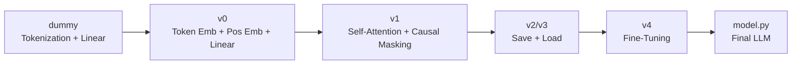

> [!info]+ Interview questions covered
> - What are the key components of the Transformer architecture?
> - What is the difference between the dummy linear model and a proper LLM?
> - What is tokenization in LLMs?

---

### Tokenization — Recap

Before introducing embeddings, it is worth understanding why tokenization alone is insufficient.

**Why the model needs numbers, not words:** Gradient descent optimises a loss function using calculus (derivatives). Calculus requires numeric inputs. Text is not numeric. Therefore, the first step of any LLM pipeline is to convert text tokens into integers.

The toy vocabulary used throughout this course:

```python
vocab = {"he": 0, "she": 1, "boy": 2, "girl": 3}
```

Training pairs and their expected next-token:
- `"He"` → `"boy"` (token 0 → token 2)
- `"She"` → `"girl"` (token 1 → token 3)

After tokenization the word `"He"` becomes the integer `0`. The model sees a scalar. This is a **one-dimensional representation** — each word is a single number on a number line.

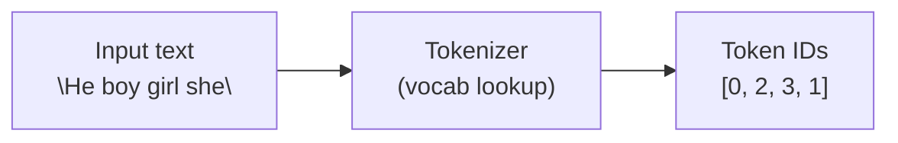

> [!info]+ Interview questions covered
> - What is tokenization in LLMs?
> - What is Byte Pair Encoding (BPE)?
> - What is WordPiece / SentencePiece?
> - What is a context window?

---

### Why Embeddings? — The Limits of 1D Representation

Tokenization converts each word to a single integer. That integer is a position on a line. With four words placed on the number line, some questions are answerable:

- **"Is *he* opposite to *she*?"** — Yes: measure the distance between their positions on the line. They are far apart.
- **"Is *he* similar to *boy*?"** — Yes: they are close together.
- **"Is *she* similar to *girl*?"** — Yes: close distance.

But 1D fails on relational questions:

- **"Do *he* and *she* have something in common?"** — In 1D you cannot answer this: they sit on opposite ends of the line. There is no axis to capture the shared property "both are pronouns."
- **"Do *boy* and *girl* have something in common?"** — Same problem: they appear at different positions but share the property "both are nouns (person)."
- **"Is *he* more similar to *she* or to *girl*?"** — Impossible to express both the gender axis and the noun/pronoun axis simultaneously in 1D.

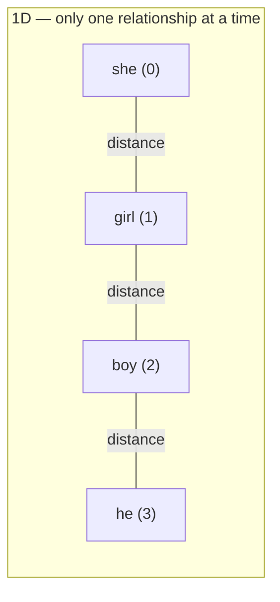

Moving to **2D** solves this:

- **Dimension 1 (horizontal axis)** separates **noun vs. pronoun**.
- **Dimension 2 (vertical axis)** separates **male vs. female**.

In 2D space the four words form a square:

| | Female | Male |
|---|---|---|
| **Pronoun** | she (−1, +1) | he (+1, +1) |
| **Noun** | girl (−1, −1) | boy (+1, −1) |

Now **all** previous questions are answerable. Each axis encodes an independent semantic relationship. Adding more dimensions adds more answerable questions — more information about word relationships.

**Real GPT dimensions:**
- GPT-2: 768 dimensions
- GPT-3: ~12,288 dimensions (often cited; in practice models from ~1k to 12k range)
- Modern models: generally in the 1,000s

Humans cannot visualise beyond 3D, but the machine performs the mathematics in high-dimensional space just fine. The guiding principle: **more dimensions = more information = more relationships the model can capture**.

> [!info]+ Interview questions covered
> - What are embeddings in LLMs?
> - Why do we use multi-dimensional embeddings instead of just token IDs?
> - What is the embedding dimension of GPT-2 / GPT-3?
> - What are use cases for embeddings (LLMs, semantic search, RAG)?

---

### The V0 Architecture — Full Pipeline

V0 has **30 parameters** (for vocabulary size 4, embedding dimension 3, context length 2). The complete pipeline is:

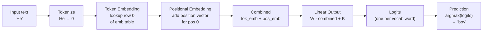

**Parameter breakdown for V0 (vocab=4, emb\_dim=3, ctx=2):**
- Token Embedding matrix: $4 \times 3 = 12$ parameters
- Positional Embedding matrix: $2 \times 3 = 6$ parameters
- Linear output weight: $3 \times 4 = 12$ parameters
- **Total: 30 parameters**

The "6×24" in the course title refers to a positional embedding matrix of shape `[context_length=6, embedding_dim=24]` used in a scaled-up demonstration. The principle is the same.

When the model predicts for input `"He"`:
1. Tokenize: `He → 0`
2. Look up row 0 of the token embedding table → a 3-element vector
3. Add the positional embedding for position 0 → another 3-element vector
4. Combine: `combined = tok_emb + pos_emb` → 3-element vector
5. Linear: multiply by output weight matrix → 4-element logits vector
6. `argmax(logits)` → token 2 (`"boy"`) ✓

> [!info]+ Interview questions covered
> - What is the V0 basic LLM architecture?
> - What layers are inside a basic LLM before the attention mechanism?
> - What is a linear output layer in the context of an LLM?
> - What are logits in an LLM?

---

### Token Embedding — `nn.Embedding`

#### Motivation

Tokenization gave each word a unique integer. That integer carries no semantic information about the word — `0` is not "closer to" `2` than it is to `1` in any meaningful sense; it is simply an arbitrary index. The purpose of the token embedding layer is to map each token index to a dense, multi-dimensional vector that captures semantic relationships.

#### What is `nn.Embedding`?

In PyTorch, `nn.Embedding(num_embeddings, embedding_dim)` is a lookup table: an $n \times d$ matrix where $n$ is the vocabulary size and $d$ is the embedding dimension. Given a token index $i$, the layer returns row $i$ of this matrix.

```python
import torch
import torch.nn as nn

vocab_size = 4        # he, she, boy, girl
embedding_dim = 3     # 3-dimensional space

token_embedding = nn.Embedding(vocab_size, embedding_dim)

# Forward pass: input token index 0 (= "He")
token_idx = torch.tensor([0])
emb = token_embedding(token_idx)  # shape: [1, 3]
```

The $4 \times 3$ embedding table for our toy vocab:

$$
\text{TokenEmbTable} = \begin{bmatrix} \text{he} \\ \text{she} \\ \text{boy} \\ \text{girl} \end{bmatrix} = \begin{bmatrix} e_{00} & e_{01} & e_{02} \\ e_{10} & e_{11} & e_{12} \\ e_{20} & e_{21} & e_{22} \\ e_{30} & e_{31} & e_{32} \end{bmatrix}
$$

These values start random and are learned during training. After training, words with similar meanings cluster together in the embedding space.

#### The from-scratch `Embedding` class (Part 1 recap)

Before switching to `nn.Embedding`, the course built embeddings from scratch using **contrastive learning** — pulling similar word pairs closer, pushing dissimilar pairs apart:

From `model.py` (the hand-rolled embedding model from Part 1):

```python
class Embedding:

    def train(self, pairs):
        for epoch in range(self.n_epochs):
            for i, j, sim in pairs:
                diff = self.embeddings[i] - self.embeddings[j]
                distance = np.sqrt(np.sum(diff ** 2)) + 1e-8
                direction = diff / distance
                if sim > 0.5:  # similar contexts -> pull closer
                    self.embeddings[i] -= self.learning_rate * sim * direction
                    self.embeddings[j] += self.learning_rate * sim * direction
                else:  # different contexts -> push apart
                    self.embeddings[i] += self.learning_rate * (1 - sim) * direction
                    self.embeddings[j] -= self.learning_rate * (1 - sim) * direction

    def get_embedding(self, index):
        return self.embeddings[index]

def distance(a, b):
    return np.sqrt(np.sum((a - b) ** 2))

# Create and train model
np.random.seed(123)
model = Embedding(n_words=len(vocab))
model.train(pairs)

# Print embeddings
print("\nEmbeddings:")
for word in ["he", "she", "boy", "girl"]:
    v = model.get_embedding(w2i[word])
    print(f"  {word:7s} -> [{v[0]:.4f}, {v[1]:.4f}]")
```

Key points from this implementation:
- `diff` = vector from $j$ to $i$; `direction` = unit vector along that difference.
- If similarity > 0.5: reduce the distance (pull both embeddings toward each other).
- If similarity ≤ 0.5: increase the distance (push them apart).
- The metric used is **Euclidean distance** ($\ell_2$ norm).

In V0, `nn.Embedding` replaces this hand-rolled approach. PyTorch handles the update via backpropagation and gradient descent automatically.

> [!info]+ Interview questions covered
> - What are embeddings? How do they work?
> - What is `nn.Embedding` in PyTorch?
> - What is contrastive learning in the context of word embeddings?
> - What is the difference between a lookup table and a learned embedding?

---

### Positional Embedding

#### Why position matters

Token embedding alone loses **order information**. The sentences "boy sees girl" and "girl sees boy" would produce identical sums of token embeddings even though they mean opposite things. The model has no way to distinguish position 0 from position 2 using token embeddings alone.

The solution: add a separate **positional embedding** vector to each token embedding that encodes the token's position in the sequence.

#### Shape and construction

For a context window of length $L$ and embedding dimension $d$, the positional embedding is an $L \times d$ matrix. Each row $p$ is the embedding for position $p$.

In the scaled V0 example with context length 6 and embedding dimension 24:
$$\text{PosEmbTable} \in \mathbb{R}^{6 \times 24}$$
(hence "Positional Embedding = 6×24" in the section title).

In the toy V0 (context=2, emb_dim=3): $2 \times 3 = 6$ parameters.

```python
context_length = 6
embedding_dim  = 24

pos_embedding = nn.Embedding(context_length, embedding_dim)

# For a sequence of 6 tokens, generate position indices [0,1,2,3,4,5]
positions = torch.arange(context_length)            # [0, 1, 2, 3, 4, 5]
pos_emb   = pos_embedding(positions)                # shape: [6, 24]
```

#### Combining token and positional embeddings

The combined representation is simply the element-wise sum:

$$\text{combined}[i] = \text{TokenEmb}[\text{token\_id}[i]] + \text{PosEmb}[i]$$

```python
tok_emb      = token_embedding(token_ids)    # [seq_len, emb_dim]
pos_emb      = pos_embedding(positions)      # [seq_len, emb_dim]
combined     = tok_emb + pos_emb             # [seq_len, emb_dim]
```

This sum preserves both **what** the token is (semantic content from token embedding) and **where** it appears in the sequence (positional content from positional embedding).

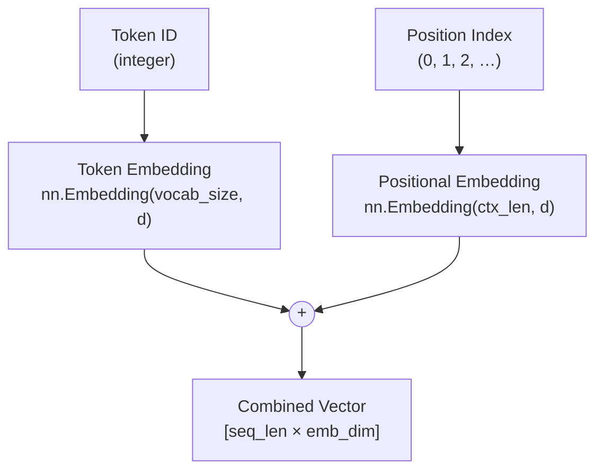

> [!info]+ Interview questions covered
> - What is positional encoding / positional embedding?
> - Why does an LLM need positional embeddings if it already has token embeddings?
> - What is the shape of the positional embedding matrix?
> - How are token and positional embeddings combined?

---

### Self-Attention and Causal Masking — Preview (V1)

V0 produces predictions but treats each token **independently** — the combined embedding for `"He"` knows nothing about the surrounding tokens. Self-attention, introduced in V1, allows each token to look at all other tokens in the context and decide how much attention to give each one.

**V1 adds 78 parameters** and introduces three new concepts:

| Concept | Purpose |
|---|---|
| **Self-Attention** | Each token queries other tokens and weighs their importance |
| **Causal Masking** | Prevents a token from "seeing" future tokens (autoregressive property) |
| **Residual Connection** | Adds the input directly to the attention output, stabilising gradients |

#### Self-Attention at a glance

Self-attention computes three projections for each token — **Query (Q)**, **Key (K)**, and **Value (V)** — and uses the dot-product of Q and K to form attention weights:

$$\text{Attention}(Q, K, V) = \text{softmax}\!\left(\frac{QK^\top}{\sqrt{d_k}}\right) V$$

The scaling factor $\frac{1}{\sqrt{d_k}}$ prevents the dot-product from growing too large, which would saturate the softmax gradient.

#### Causal Masking

In a language model, when predicting token $t$, the model should only use tokens at positions $\leq t$. This is enforced by a **causal (lower-triangular) mask** applied before the softmax:

$$\text{mask}[i][j] = \begin{cases} 0 & \text{if } j \leq i \\ -\infty & \text{if } j > i \end{cases}$$

Positions with $-\infty$ become 0 after softmax — effectively zeroing out future tokens.

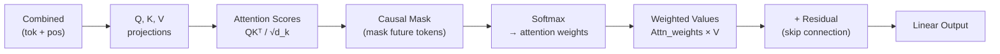

#### Residual Connection

The residual (skip) connection adds the layer's input directly to its output before passing to the next layer:

$$\text{output} = \text{LayerNorm}(\text{input} + \text{SelfAttention}(\text{input}))$$

This ensures gradients can flow directly back through the network, solving the vanishing gradient problem in deep models.

> [!info]+ Interview questions covered
> - What is self-attention in a Transformer?
> - What are Query, Key, and Value (QKV) in attention?
> - What is causal masking and why is it needed in a language model?
> - What is a residual / skip connection? Why does it help?
> - What is multi-head attention?

---

### Full V0 Architecture — Code Sketch

Putting all V0 components together:

```python
import torch
import torch.nn as nn

vocab_size     = 4    # he, she, boy, girl
embedding_dim  = 3
context_length = 2

class LLMV0(nn.Module):
    def __init__(self):
        super().__init__()
        # 4 × 3 = 12 parameters
        self.token_embedding    = nn.Embedding(vocab_size, embedding_dim)
        # 2 × 3 = 6 parameters
        self.position_embedding = nn.Embedding(context_length, embedding_dim)
        # 3 × 4 = 12 parameters
        self.output_linear      = nn.Linear(embedding_dim, vocab_size, bias=False)

    def forward(self, token_ids):
        # token_ids: [batch, seq_len]
        seq_len   = token_ids.size(1)
        positions = torch.arange(seq_len, device=token_ids.device)

        tok_emb  = self.token_embedding(token_ids)        # [batch, seq, emb_dim]
        pos_emb  = self.position_embedding(positions)     # [seq, emb_dim]
        combined = tok_emb + pos_emb                      # [batch, seq, emb_dim]

        logits = self.output_linear(combined)             # [batch, seq, vocab_size]
        return logits
```

Training uses cross-entropy loss: the model is trained to predict the next token. After training on `[("He", "boy"), ("She", "girl")]`, the inference pipeline produces:

- Input: `"He"` → token id `0`
- Token embedding for `0` + positional embedding for position `0` → combined vector
- Linear output → logits over 4 vocabulary words
- `argmax(logits)` → token `2` → `"boy"` ✓

> [!info]+ Interview questions covered
> - How do you implement a basic LLM (V0) in PyTorch?
> - How does `nn.Embedding` differ from a one-hot encoding?
> - How does the linear output layer produce next-token logits?
> - What is autoregressive language modelling?

---

### Key Concept Summary

| Concept | What it does | Shape (toy example) |
|---|---|---|
| **Tokenization** | text → integer indices | scalar per token |
| **Token Embedding** | index → dense semantic vector | `[vocab_size, emb_dim]` = 4×3 |
| **Positional Embedding** | position → dense position vector | `[ctx_len, emb_dim]` = 2×3 |
| **Combined** | tok\_emb + pos\_emb | `[seq_len, emb_dim]` |
| **Linear Output** | combined → logits over vocab | `[emb_dim, vocab_size]` = 3×4 |
| **Self-Attention (V1)** | tokens attend to each other | Q, K, V matrices |
| **Causal Mask (V1)** | prevent future token leakage | lower-triangular 0/−∞ mask |
| **Residual Connection (V1)** | skip-connect for gradient flow | element-wise addition |

The progression from tokenization (1D) → 2D+ embeddings → attention is the core of why LLMs can understand language: each layer adds a richer representation that enables the model to answer increasingly complex questions about word relationships and context.


## Token Embeddings, Positional Embedding = 6×24, Word Order Encoding, Every Word Gets A Unique 3D Point, 3D Embedding Space

> **Section timestamps:** 17:14 – 35:23

---

### Why Embeddings at All?

Before diving into *what* an embedding is, it helps to understand *why* it exists in the pipeline.

Neural networks learn via gradient descent. Gradient descent requires derivatives. Derivatives require numbers — you cannot differentiate a string like `"cat"`. Therefore, every token entering a transformer must first be converted into a vector of floating-point numbers. The embedding layer is the component that performs this conversion.

The two-step handoff looks like this:

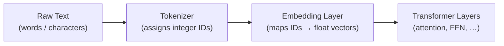

**Critical ordering rule:** tokenization always happens *before* embedding. Even purely numeric data such as `5, 8, 9` must first be converted to token IDs — and only then does the embedding step map those IDs to vectors.

---

### Token Embeddings: Every Word Gets a Unique Point in Space

#### The Core Idea

A **token embedding** assigns every token in the vocabulary a unique point in an $N$-dimensional space. Words with similar meanings end up geometrically close to each other; words with different meanings end up far apart.

Consider the toy dataset:

```
"small cat sat"
"big dog ran"
"tiny bird flew"
```

This dataset has 9 unique tokens: `small`, `cat`, `sat`, `big`, `dog`, `ran`, `tiny`, `bird`, `flew`. With a 3-dimensional embedding, each word lives at some point $(x, y, z)$.

After training, similar words cluster together:

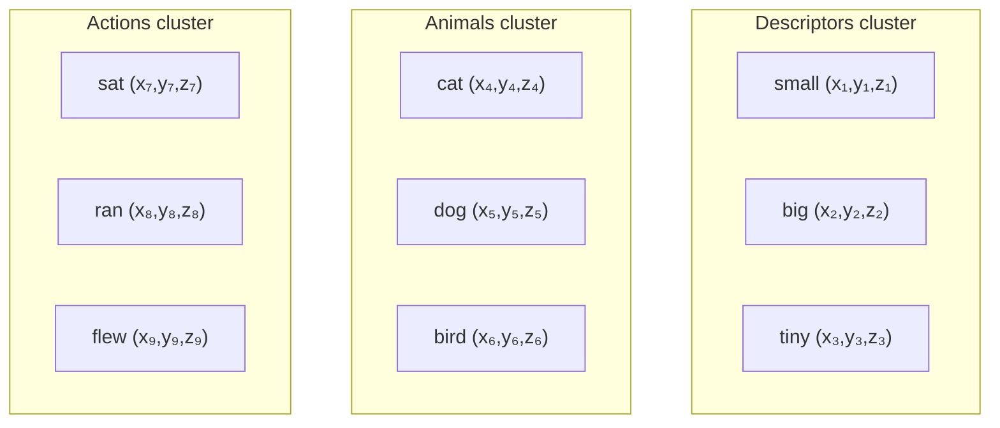

#### How Training Shapes the Embedding Space

Training begins by initialising every word's coordinates to $(0, 0, 0)$.

The model is trained on *pairs* extracted from the corpus:

| Pair | Relationship |
|---|---|
| `(small, cat)` | small precedes cat |
| `(cat, sat)` | cat precedes sat |
| `(big, dog)` | big precedes dog |
| `(dog, ran)` | dog precedes ran |
| `(tiny, bird)` | tiny precedes bird |
| `(bird, flew)` | bird precedes flew |

The model learns that `(small, cat)` are related → pulls them closer. `(big, cat)` also appears in the data → `small` and `big` are both pulled toward `cat`, which pulls `small` and `big` toward each other. Over many iterations, words that appear in similar contexts converge into the same cluster.

**Key insight:** The coordinates of a word in embedding space *are* the learned weights. The embedding layer is simply a lookup table — row `i` contains the weight vector (coordinates) for token with ID `i`. Initialised at zero, those weights are updated by gradient descent just like every other weight in the network.

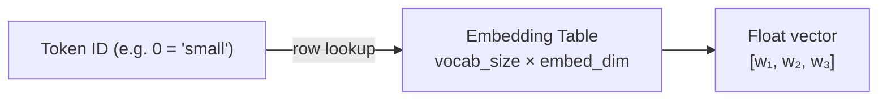

#### Choosing the Right Embedding Dimension

More dimensions let the model encode more nuances of meaning, but there is a point of diminishing returns. In practice:

| Model scale | Typical embedding dimension |
|---|---|
| Toy / teaching example | 3 – 24 |
| Small production model | 256 – 512 |
| Mid-size model (GPT-2) | 768 |
| Large model | 1024 – 4096+ |

The embedding layer itself has a capacity ceiling: beyond a certain dimension, the additional representational power is absorbed by the attention layers rather than the embedding layer. Empirically, researchers found the sweet spot for English-scale vocabularies is roughly 500–1000 dimensions.

For the teaching model built in this lecture, a 3-dimensional embedding is used so that the geometry can be visualised directly.

#### Embedding Table Size

With a vocabulary of $V$ tokens and embedding dimension $d$:

$$\text{Embedding parameters} = V \times d$$

For the toy 9-word example with $d=3$: $9 \times 3 = 27$ numbers. For a real model with $V = 57{,}000$ and $d = 768$: approximately 43.8 million parameters — all learned from data.

> [!info]+ Interview questions covered
> - What is a token embedding?
> - Why are words represented as vectors rather than integers in neural networks?
> - How are embedding weights initialised, and how do they get updated during training?
> - Why do semantically similar words end up close to each other in embedding space?
> - How do you calculate the number of parameters in an embedding table?
> - What is the typical range for embedding dimension in production LLMs?

---

### The Limitation of Token Embeddings: No Word Order

#### Why Word Order Cannot Be Derived from Token Embeddings Alone

Token embeddings encode *semantic similarity*, not *sequence position*. Looking at the 3D token-embedding visualisation below, words from the three semantic groups cluster together:


Now ask: **from this plot alone, can you say that "sat" comes *after* "cat"?**

The answer is no. `sat` and `cat` are close because they co-occur, not because one precedes the other. The token embedding space contains zero information about left-to-right order. This is a fundamental structural gap: a bag-of-words representation.

To understand why this matters, consider disambiguation:

> *"Amit was going to Delhi. He also went to Gurgaon."*

The token embedding can tell you that "Amit" and "he" are both human nouns. But to resolve that "he" *refers to Amit* — not some other person mentioned earlier — requires understanding the sequential context. That resolution is the job of the **attention layer**, not the embedding layer.

The embedding layer's responsibilities are:
1. Which words are **semantically related** to which (similar words, synonyms, antonyms).
2. What **order** a sentence follows at the position level — but this requires a second embedding type.


> [!info]+ Interview questions covered
> - What can a token embedding *not* tell the model?
> - Why do transformers need positional information beyond token embeddings?
> - What is the difference between what the embedding layer learns vs what the attention layer learns?

---

### Positional Embeddings: Encoding Word Order

#### Motivation

To let the model know that in the sentence "small cat sat", `small` is at position 0, `cat` is at position 1, and `sat` is at position 2, a separate **positional embedding** is added to the token embedding of each token.

Positional embeddings answer only one question: **"what is the index of this token in the sequence?"**

#### How It Works: Position Clustering

Where token embeddings group words by *meaning*, positional embeddings group them by *index*:

- All tokens at position 0 cluster together: `small[0]`, `big[0]`, `tiny[0]`
- All tokens at position 1 cluster together: `cat[1]`, `dog[1]`, `bird[1]`
- All tokens at position 2 cluster together: `sat[2]`, `ran[2]`, `flew[2]`

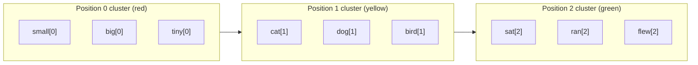

Now it *is* possible to answer: "does `sat` come after `cat`?" Yes — because `sat` is at position 2 and `cat` is at position 1.


#### Positional Embedding in the GPT Codebase

In the actual GPT model, the positional embedding is created by simply assigning the position index to each token, regardless of what the token is:

```
Input:  "he is a good boy"
Tokens:  he   is   a   good  boy
IDs:      0    1   2    3     4
Pos:      0    1   2    3     4
```

The positional index array is created unconditionally — a plain `arange(sequence_length)`. There is no clever algorithm; it is a learned lookup table of shape `(context_length, embed_dim)`, trained exactly the same way as the token embedding table.

For the teaching model in this lecture: **context length = 6**, **embedding dimension = 24**, giving a positional embedding matrix of shape **6 × 24**.

$$\text{Positional Embedding} = \underbrace{6}_{\text{context length}} \times \underbrace{24}_{\text{embed dim}} = 144 \text{ parameters}$$

> [!info]+ Interview questions covered
> - What does a positional embedding encode?
> - Why can't a token embedding alone determine word order?
> - How is the positional index array created in a GPT-style model?
> - What is the shape of the positional embedding matrix and how is it calculated?
> - What does "positional embedding = 6×24" mean in this model?

---

### Combining Token and Positional Embeddings

The final input to the transformer's attention layers is the **element-wise sum** of the token embedding and the positional embedding for each token:

$$\mathbf{e}_{\text{final}}^{(i)} = \mathbf{e}_{\text{token}}^{(i)} + \mathbf{e}_{\text{pos}}^{(i)}$$

Where $i$ is the position index. Both vectors must have the same dimensionality — this is why `embed_dim` is a single shared hyperparameter used for both embedding tables.

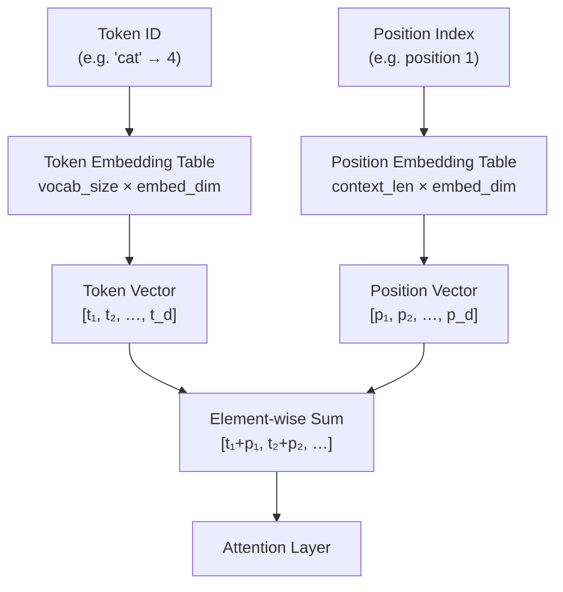

With the combined embedding, the model simultaneously knows:
- **What** the word means (token embedding).
- **Where** in the sentence the word appears (positional embedding).

This combined representation is what gets passed into the multi-head self-attention mechanism.

> [!info]+ Interview questions covered
> - How are token embeddings and positional embeddings combined?
> - Why do both embedding tables need the same dimensionality?
> - What information does each embedding type contribute to the final representation?

---

### Every Word in the Vocabulary Gets a Unique 3D Point

#### The Embedding Table Covers the Entire Vocabulary

Embeddings are not computed on-demand per input query. The model pre-allocates an embedding for *every* token in the vocabulary during training. If the vocabulary has 57,000 unique tokens (a typical figure for English-language GPT models), then the embedding table has 57,000 rows — one vector per token.

When a sentence is processed at inference time, the relevant rows are simply looked up. The full table is always resident in memory.

For the lecture's toy example:

| Parameter | Value |
|---|---|
| Vocabulary size | 9 words |
| Embedding dimension | 3 |
| Token embedding table size | 9 × 3 = **27 numbers** |
| Context length | 6 |
| Positional embedding table size | 6 × 24 = **144 numbers** |

For a real GPT-style model:

| Parameter | Typical Value |
|---|---|
| Vocabulary size | ~50,257 (GPT-2) |
| Embedding dimension | 768 (GPT-2 small) |
| Token embedding table size | ~38.6M parameters |
| Context length | 1024 (GPT-2) |
| Positional embedding table size | ~786K parameters |

> [!info]+ Interview questions covered
> - Are embeddings created per-query or pre-computed for the entire vocabulary?
> - How many parameters are in the token embedding table of GPT-2?
> - What is Byte-Pair Encoding (BPE) and why is it used to build the vocabulary?
> - Why does vocabulary size cap around 50K–57K for English-language models?

---

### Summary: Token vs Positional Embeddings

| Feature | Token Embedding | Positional Embedding |
|---|---|---|
| **What it encodes** | Semantic meaning | Sequence position index |
| **Cluster criterion** | Words with similar meaning cluster | Words at the same index cluster |
| **Table shape** | `vocab_size × embed_dim` | `context_length × embed_dim` |
| **Initialisation** | Random (or zeros) → learned | Zeros → learned |
| **Can answer** | "Is 'cat' related to 'dog'?" | "Does 'sat' come after 'cat'?" |
| **Cannot answer** | Word order | Semantic similarity |

Both are **learned** parameters — the model adjusts them via backpropagation, just like the weights in attention layers. Neither is hand-crafted.

The full embedding pipeline, from raw text to transformer input:

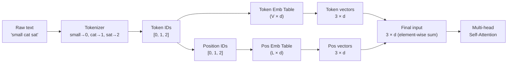

> [!info]+ Interview questions covered
> - What is the difference between token embeddings and positional embeddings in a transformer?
> - Draw/describe the full input embedding pipeline from raw text to the first attention layer.
> - Why does a transformer need both token and positional embeddings while an RNN does not need positional embeddings?
> - What happens if you remove positional embeddings from a transformer?


## Vocabulary Size Decision at Model Creation, ChatGPT Vocabulary from Internet, Token + Position Combined Embedding, Final Embedding = Token + Position, Pre-Training Vocabulary Selection

---

### The Vocabulary Is Fixed at Model Creation Time

#### Why You Cannot Add New Words After Training

Before a single forward pass happens, the model creator must answer one foundational question: **how many unique tokens will this model ever recognise?** This is not a learning decision — it is an architectural decision made before training starts, the same way you decide the number of layers or the hidden dimension size.

Here is why it cannot be deferred: the embedding layer is a lookup table whose shape is `[vocabulary_size × embedding_dimension]`. Both dimensions are fixed at the point the weight tensors are allocated. Every token in the vocabulary gets exactly one row in that table — its learned embedding vector. If you decided later you wanted to add a new token, you would have to append a new row, which changes the tensor shape, which requires re-compiling the entire model architecture. In practice, this means the vocabulary is **immutable after training begins**.

#### How ChatGPT's Vocabulary Was Built

The OpenAI team solved the vocabulary problem at a massive scale. During the pre-training data preparation phase, they processed the entire internet (along with books, code repositories, and other corpora) and collected every unique token that appeared in that data. After applying Byte-Pair Encoding (BPE) to merge frequent character sequences into subword units, the resulting vocabulary settled at approximately **50,000–57,000 unique tokens** for GPT-2/3 style models.

The key insight is that this vocabulary was chosen to cover essentially all human-written text on the internet. Any word, abbreviation, punctuation pattern, or common subword fragment that a user might type is already in the vocabulary, so the model will always be able to tokenise any input — even completely novel compound words — by breaking them into known subword pieces.

#### The Embedding Layer: Size Arithmetic

Once vocabulary size $V$ and embedding dimension $d$ are chosen, the size of the embedding weight matrix is fixed:

$$\text{Embedding matrix size} = V \times d$$

With the demo's tiny vocabulary (9 words: *small, cat, sat, big, dog, ran, tiny, bird, flew*) and embedding dimension 3:

$$9 \times 3 = 27 \text{ total learnable numbers}$$

For GPT-2 with $V = 50{,}257$ and $d = 768$:

$$50{,}257 \times 768 \approx 38.6 \text{ million parameters (embedding layer alone)}$$

Each token gets exactly one 3-number (or 768-number) vector. That vector — trained through gradient descent — encodes everything the model learned about that token's meaning from the training corpus.

#### What Happens to Unseen Words at Inference

If a word never appeared in the pre-training corpus it was never assigned a token ID, so it is **not in the vocabulary**. Rather than crashing, the tokeniser falls back to BPE decomposition: it splits the unknown surface form into the longest known subword pieces until only known tokens remain. The integer "1" appearing in a sentence is itself a token (character tokens like `1`, `A`, `B`, `@` are all in the vocabulary with their own IDs). Even very large numbers like `23` would appear as a sequence of digit tokens (`2`, `3`) or as a single merged subword if `23` was frequent enough in training data. The vocabulary ID assigned to the character `"1"` might be something like 540 — a totally arbitrary integer index chosen when the vocabulary was first compiled.

```
Input text:  "he sat 23 times"
Tokenisation (example IDs):  [0, 5, 540, 621, 300]
              he  sat  2   3   times
```

The token ID is just a row pointer into the embedding lookup table — the actual number has no arithmetic meaning.

> [!info]+ Interview questions covered
> - When is the vocabulary size decided in an LLM? Can it be changed after training?
> - How did ChatGPT decide its vocabulary? Where does it come from?
> - How many parameters does the embedding layer have? How do you compute it?
> - What happens when the model encounters a word not seen during training?
> - Are numbers (integers) in text treated as tokens?

---

### Token + Position Combined Embedding: The Final Input Representation

#### Why Two Separate Embeddings Must Be Combined

Recall from prior sections that the LLM pipeline produces two separate embedding vectors per token:

1. **Token embedding** — looks up the row for token ID $t$ in the token embedding matrix. This vector encodes *what the word means* in isolation, independent of where it appears.
2. **Position embedding** — looks up the row for position index $p$ in the position embedding matrix. This vector encodes *where in the sequence this token sits*.

The transformer's self-attention mechanism has no inherent notion of sequence order. Without position information, `"cat sat on mat"` and `"mat on sat cat"` would be indistinguishable (same token IDs, same order-independent attention). The position embedding is what gives the model its sense of order.

The final embedding fed into the first transformer block is their element-wise sum:

$$\text{final\_embedding}(t, p) = \text{token\_embedding}(t) + \text{position\_embedding}(p)$$

Both vectors must have the same dimension $d$ for this addition to work.

#### Reading the 3D Visualiser

The Embedding Visualiser at `localhost:8001/combined` demonstrates this with a 3-dimensional embedding space over the 9-word dataset. Every word-at-position pair gets its own point in 3D space.

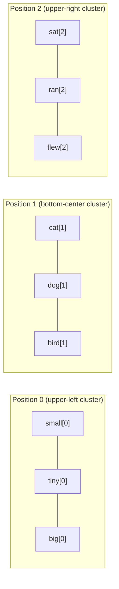

The plot takes a characteristic **V shape**: position-0 tokens form one arm of the V (upper-left), position-1 tokens form the valley (bottom-center), and position-2 tokens form the other arm (upper-right). Within each cluster, the token identities further separate the individual points.

This V shape is the visual proof that the combined embedding encodes both signals simultaneously:

- All three position-0 words (`small`, `tiny`, `big`) share a similar position vector — they are all "first word in sentence" — so they pull towards the same region of space.
- Within that cluster, their individual token embeddings differentiate them: `small` and `tiny` are semantically similar descriptors, so they sit closer together than either is to `big`.

#### Concrete Number Example

Suppose after training:
- `small` has token embedding $[5.0,\ 2.0,\ 3.0]$
- Position 0 has position embedding $[-0.5,\ 0.0,\ 1.0]$

Then the combined embedding for `small` at position 0 is:

$$[5.0,\ 2.0,\ 3.0] + [-0.5,\ 0.0,\ 1.0] = [4.5,\ 2.0,\ 4.0]$$

That single 3-vector $[4.5,\ 2.0,\ 4.0]$ is what actually flows into the first transformer layer. It carries both the *meaning* of "small" and the *structural fact* that it appeared first in its sentence.

#### The Embedding Space Is Not Index Space

A clarification worth making explicit: the token ID (the integer 0 for "he", or integer 540 for character "1") is never fed directly into the transformer. It is only used as a **row index** to look up the corresponding embedding vector. The transformer operates entirely in continuous vector space; the discrete integer domain belongs to the tokeniser and the vocabulary lookup table.

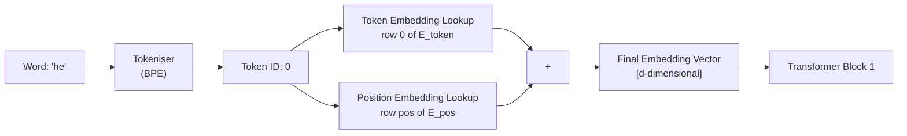

> [!info]+ Interview questions covered
> - What is the final embedding in a transformer LLM? How is it computed?
> - Why do we add token embeddings and position embeddings rather than concatenate them?
> - What does `final_embedding = token_embedding + position_embedding` mean concretely?
> - Why do position-0 words cluster together in the embedding visualiser?
> - What is the difference between a token ID and an embedding vector?

---

### Pre-Training Vocabulary Selection and Scale

#### Choosing $V$ Is a Trade-off

| Larger vocabulary ($V$) | Smaller vocabulary ($V$) |
|---|---|
| Fewer tokens per sentence (shorter sequences) | More tokens per sentence (longer sequences, slower) |
| Richer semantic coverage per token | Relies more on subword composition |
| Larger embedding matrix (more parameters) | Smaller embedding matrix |
| Less out-of-vocabulary decomposition | More BPE merges needed for rare words |

GPT-2 uses $V = 50{,}257$ (50,000 BPE merges + 256 base bytes + 1 special `<|endoftext|>` token). GPT-3 and GPT-4 use the same tokeniser (`cl100k_base` introduced in `tiktoken` uses $V = 100{,}256$). The choice is made once during the pre-training data preparation phase and never changed.

#### From Vocabulary to Embedding Layer to Model

The overall data-flow from raw text to the first transformer computation is:

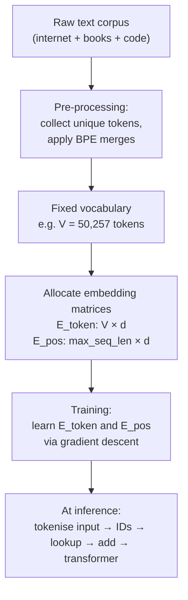

The vocabulary is the first architectural decision that propagates through every other component: the embedding layer shape, the output projection layer (which projects back to $V$ logits), and the tokeniser used at serving time must all be consistent with the same vocabulary.

> [!info]+ Interview questions covered
> - What is vocabulary size in an LLM and why does it matter?
> - What is the relationship between vocabulary size and the embedding matrix?
> - How does GPT's BPE vocabulary handle out-of-vocabulary words?
> - What are the trade-offs of a larger vs smaller vocabulary?
> - Why must the vocabulary be fixed before training begins?

---

### Use Cases: Where Embeddings Are Applied in Practice

The embedding machinery described above is not exclusive to the language modelling task that trained GPT. Once a model has learned a rich embedding space, those vectors are useful for a range of downstream applications.

#### Understanding Word Meaning in ChatGPT

Inside a ChatGPT inference call, every token in the user's prompt is converted to its combined token+position embedding vector before attention is computed. The self-attention heads then compute relationships between those embedding vectors. Because similar words cluster in embedding space (as seen in the visualiser), the model can recognise that `tiny` and `small` are interchangeable in many contexts — their embeddings are geometrically close — without being explicitly told this fact.

#### Semantic Search

A search engine that encodes both queries and documents into the same embedding space can retrieve documents whose *meaning* matches the query, even when no keywords are shared. For example, the query `"compact car"` and the document `"small automobile"` would have nearby embeddings if both terms cluster in the same region of the space.

#### Retrieval-Augmented Generation (RAG) and PDF Q&A

In a RAG pipeline, a large document (e.g., a PDF) is split into chunks, each chunk is independently embedded, and those embeddings are stored in a vector database. At query time:

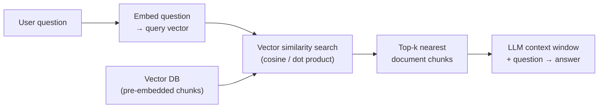

The retrieval step works because semantically relevant chunks produce embedding vectors geometrically close to the question's embedding vector. The LLM never sees the full PDF — only the retrieved chunks that are most relevant.

#### Sentence Embeddings vs Word Embeddings

Word embeddings assign a vector to each token individually. **Sentence embeddings** compress an entire sentence or paragraph into a single vector (typically by pooling or using a special `[CLS]` token). Models like `sentence-transformers` (SBERT) are fine-tuned specifically to produce high-quality sentence-level embeddings for semantic similarity tasks.

| | Word/Token Embedding | Sentence Embedding |
|---|---|---|
| Granularity | One vector per token | One vector per sentence/paragraph |
| Context sensitivity | Contextualised by attention layers | Fixed; entire input collapses to one vector |
| Typical use | Transformer internal representation | Semantic search, clustering, RAG retrieval |
| Example | GPT-4 token embedding | `text-embedding-ada-002`, SBERT |

> [!info]+ Interview questions covered
> - What are embeddings used for beyond language modelling?
> - How does semantic search work using embeddings?
> - What is RAG (Retrieval-Augmented Generation) and how does it use embeddings?
> - What is the difference between word embeddings and sentence embeddings?
> - How does ChatGPT use embeddings to understand word meaning?


## V0 Basic LLM With 30 Parameters — Yellow = Learnable Parameters, Multimodal Embeddings

---

### Use Cases of Embeddings Beyond Text

Before diving into the V0 model architecture, it is worth cementing *why* embeddings are a universal tool — not a text-only one. The embedding concept from prior sessions (mapping a word to a point in n-dimensional space so that similar words cluster together) generalises to any data modality that can be represented as numbers.

#### Language and Semantic Search

ChatGPT uses embeddings internally to understand how words *relate* to each other and what each word means in context. In a search engine, embeddings enable semantic matching: if a user queries *"how to fix slow laptop"* and an article is titled *"speed of your PC"*, neither exact keyword appears in the other — but their sentence embeddings live close to each other in n-dimensional space, so the search engine can still surface the article. This is **semantic search**: finding meaning, not literal strings.

RAG (Retrieval-Augmented Generation) systems work on the same principle — a PDF or knowledge base is chunked and each chunk is embedded, so at inference time the model retrieves the chunk *closest* in embedding space to the query.

#### Video and Image Embeddings (Multimodal)

Embeddings extend naturally to any modality:

- **Image embeddings** — an image encoder (like the visual branch of CLIP) converts an image into a vector in some shared space.
- **Video embeddings** — a video embedding model can embed an entire video clip into a point in n-dimensional space. Similar videos (e.g., all Indian-language films) cluster together; genre-wise or language-wise clusters emerge.
- **Audio embeddings** — audio waveforms are ultimately binary data (0s and 1s), so they too can be placed in n-dimensional space.

The key insight: *anything that can be reduced to binary data can be embedded*. A streaming recommendation system, for instance, represents each video as an embedding vector. If a user has been watching Indian movies, all Indian movies cluster nearby in that space — making the "recommend something similar" problem a nearest-neighbour search.

> **Position embedding quality check:** If incorrect positional signals are fed during training, the model learns wrong contextual relationships. Feed "he is" the model would predict "boy" correctly only if position signals were accurate during training.

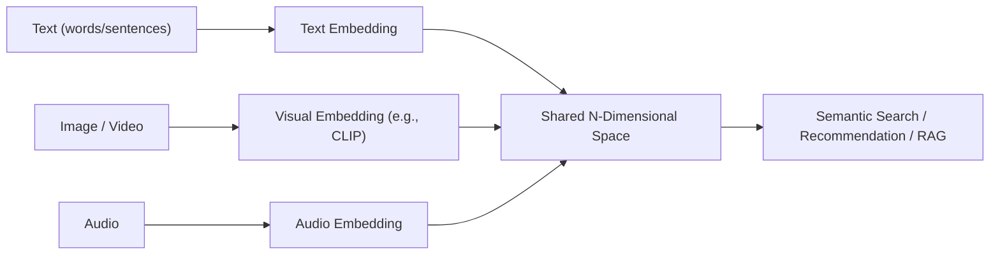

| Modality | Example Use Case | Notes |
|---|---|---|
| Text / Tokens | ChatGPT context understanding | Word / token embeddings |
| Sentence | Semantic search, RAG | Full-sentence embedding |
| Image | Visual question answering, CLIP | Pixel data → vectors |
| Video | Content recommendation, tagging | Frame-sequence → vectors |
| Audio | Speech similarity, retrieval | Waveform samples → vectors |

> [!info]+ Interview questions covered
> - What are the use cases of embeddings in LLMs?
> - How does semantic search differ from keyword search?
> - What is a multimodal embedding?
> - Can embeddings be used for images and videos, or only for text?
> - How does a recommendation system use embeddings?

---

### The V0 Basic LLM Architecture

With embeddings understood, the tutor now places them inside an actual (tiny) language model: **V0 — Basic LLM, 30 parameters**. The model is intentionally minimal to make every number traceable.

#### Setting: Vocabulary and Training Data

```
Vocab (4 words):   0 → He   |   1 → She   |   2 → boy   |   3 → girl
Training data:     He  → boy
                   She → girl
```

This is still the same four-word world from earlier sessions. The training objective is next-token prediction: given "He", predict "boy"; given "She", predict "girl".

#### The 7-Step Pipeline

The LLM Visualizer (`localhost:8000/v0`, Architecture tab) shows the complete forward pass:

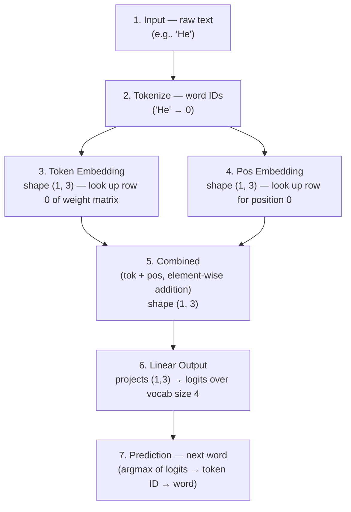

**Step 2 (Tokenisation) has no learnable weights.** The vocabulary mapping (`He → 0`, `She → 1`, etc.) is a fixed lookup table we define manually. The model never changes these IDs.

**Steps 3 and 4 (Token + Position Embedding) have learnable weights** — the actual floating-point matrices that gradient descent adjusts during training.

**Step 5 (Combined)** is a simple element-wise addition: $\text{combined} = \text{tok\_emb} + \text{pos\_emb}$. No additional parameters here.

**Step 6 (Linear Output)** projects the combined 3-dimensional vector back out to a 4-dimensional logit vector (one score per vocabulary word). This projection matrix also contains learnable weights.

> [!info]+ Interview questions covered
> - What are the steps in a basic LLM forward pass?
> - At which step does tokenisation happen, and does it have learnable weights?
> - How are token embeddings and position embeddings combined?
> - What does the linear output layer do in an LLM?

---

### Yellow = Learnable Parameters

The LLM Visualizer uses a consistent colour convention: **yellow highlights = values that are learned during training**. This is the central insight of this section.

The "Learned Weights" tab shows all 30 parameters explicitly, broken into three matrices:

#### Parameter Count Breakdown

| Matrix | Shape | Count | What It Learns |
|---|---|---|---|
| Token Embedding | 4 × 3 | **12 params** | Each of the 4 vocab words gets its own 3D vector |
| Pos Embedding | 2 × 3 | **6 params** | Each of the 2 possible positions gets a 3D adjustment |
| Output Weights | 4 × 4 | **12 params** | Projects the 3D combined embedding → 4 logits |
| **Total** | | **30 params** | |

$$
\underbrace{4 \times 3}_{12} + \underbrace{2 \times 3}_{6} + \underbrace{4 \times 4}_{12} = 30 \text{ parameters}
$$

#### Why 3 Dimensions?

The embedding dimension is 3 *purely for visualisation*. Three dimensions can be plotted in 3D space (as shown in the Embedding Visualizer from the earlier session). Real models use dimensions like 768 (BERT-base) or 4096 (LLaMA-7B). The math is identical — only the scale differs.

#### Fixed vs Learnable: The Crucial Distinction

```
Tokenisation (He → 0):    FIXED.  We hardcode it. Model never touches it.
Token Embedding matrix:   LEARNED. Model adjusts these 12 floats via backprop.
Pos Embedding matrix:     LEARNED. Model adjusts these 6 floats via backprop.
Output Weight matrix:     LEARNED. Model adjusts these 12 floats via backprop.
```

The token embedding matrix starts with random values (random initialisation). Over training — on examples like "He → boy" and "She → girl" — gradient descent iteratively adjusts all 30 yellow values so the model's predictions improve.

#### Worked Example: He → boy

Before training (random weights): feed "He" (token ID 0) → the model outputs some random logits → likely wrong.

After training (learned weights `W=1, B=2` in the dummy model analogy): feed "He" → token ID `0` → look up row 0 of Token Embedding → get a 3D vector → add positional vector → pass through linear layer → 4 logits → softmax → highest score at index `2` ("boy") → correct.

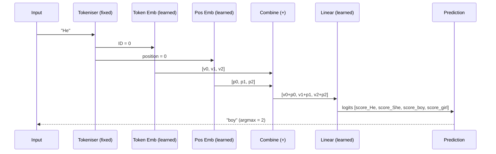

> [!info]+ Interview questions covered
> - What does "yellow = learnable parameters" mean in the LLM Visualizer?
> - How many parameters does the V0 basic LLM have?
> - Why does the token embedding matrix have shape [4 × 3]?
> - What is the difference between tokenisation and token embedding?
> - Which layers in V0 have learnable weights?
> - How do you calculate the total number of parameters in a simple LLM?
> - Why is embedding dimension 3 in V0, and what would it be in a real model?

---

### Model Version Progression: Dummy → V0 → V1

The LLM Visualizer homepage makes the progression explicit:

| Version | Name | Key Components | Parameters |
|---|---|---|---|
| Dummy | Linear Model | $y = x \cdot W + b$ only | **2** |
| V0 | Basic LLM | Token Emb + Pos Emb + Linear | **30** |
| V1 | With Attention | V0 + Self-Attention + Causal Masking + Residual Connection | **78** |

Each version adds one layer of conceptual complexity. The Dummy model (2 params: `W` and `B`) was introduced to show the bare minimum — a linear function over token IDs. V0 adds proper embeddings and a combined representation. V1 adds the attention mechanism that enables the model to *contextualise* tokens relative to each other.

This progressive build-up is deliberate. By the time attention is introduced in V1, every component except the attention head is already familiar. Adding 48 parameters to go from V0 to V1 represents the cost of the self-attention and residual infrastructure.

```mermaid
graph LR
    D["Dummy\n2 params\ny = x·W + b"] --> V0["V0 — Basic LLM\n30 params\n+ Token Emb\n+ Pos Emb\n+ Linear Output"]
    V0 --> V1["V1 — With Attention\n78 params\n+ Self-Attention\n+ Causal Masking\n+ Residual Connection"]
    V1 --> REAL["Real LLMs\n(GPT-4, LLaMA, etc.)\nBillions of params\nDeeper, wider, multi-head"]
```

> [!info]+ Interview questions covered
> - What is the simplest possible LLM, and how many parameters does it have?
> - What is the difference between V0 and V1 in this model series?
> - Why does V1 have more parameters than V0?
> - What components does a real LLM add on top of V0?


## Logits, Argmax, Vocabulary Size = 70, Vector Dimension = 3, Token Embedding 4 Vocab × 3 Dim = 12 Params

*Lecture timestamp: 44:40 – 51:33 | LLM Visualizer: V0 Basic LLM, Architecture & Inference tabs*

---

### The V0 Pipeline Architecture

At this point in the lecture the LLM Visualizer is open at `localhost:8000/v0` on the **Architecture** tab. A panel on the right lists the seven steps of the Basic LLM Pipeline:

```
1. Input     → raw text
2. Tokenize  → word IDs
3. Token Embedding  → vectors
4. Pos Embedding    → vectors
5. Combined  = tok + pos
6. Linear    → logits
7. Prediction → next word
```

The toy vocabulary consists of just four words:

| ID | Token |
|----|-------|
| 0  | He    |
| 1  | She   |
| 2  | boy   |
| 3  | girl  |

Training data: `He → boy`, `She → girl`.

The entire V0 model has **30 learnable parameters**, highlighted in yellow in the visualizer. They break down as follows:

| Component         | Shape           | Parameters |
|-------------------|-----------------|------------|
| Token Embedding   | 4 vocab × 3 dim | 12         |
| Positional Embedding | 2 positions × 3 dim | 6      |
| Output (Linear)   | 3 dim → 4 vocab | 12         |
| **Total**         |                 | **30**     |

```mermaid
flowchart LR
    A["Input Text\n'He'"] --> B["Tokenization\nword → ID\n'He' → 0"]
    B --> C["Token Embedding\nLookup table\n4×3 = 12 params"]
    B --> D["Pos Embedding\nLookup table\n2×3 = 6 params"]
    C --> E["Combined\ntok + pos"]
    D --> E
    E --> F["Linear Layer\n3→4, 12 params"]
    F --> G["Logits\n[1, 4] array"]
    G --> H["Argmax\npick highest"]
    H --> I["Prediction\n'boy'"]
```

---

### Vector Dimension = 3

The first design decision that determines parameter count is the **embedding dimension** — how many numbers represent each token.

- Each token is represented as a **vector of 3 floats**, e.g., `He → [w₁, w₂, w₃]`.
- Dimension 3 is a simplification chosen so the numbers remain human-readable. Real models use dimensions of 768 (BERT), 1024, 4096, or more.
- This choice is a **hyperparameter**, not something the model learns. The model learns *which values* fill those 3 slots for each token; the count of slots is fixed at construction time.

---

### Token Embedding: 4 × 3 = 12 Parameters

Before any computation can happen inside the model, words must be converted to numbers. The tokenizer provides integer IDs. The embedding layer converts each ID into a dense floating-point vector.

**Why not use the integer ID directly?** The integer 0 for "He" and 2 for "boy" carry no semantic meaning — there is no reason "boy" should be twice "He". A learned vector lets the model position tokens in a continuous space where similar tokens end up close to each other.

The token embedding table is a $|V| \times d$ matrix, where $|V|$ is the vocabulary size and $d$ is the embedding dimension.

$$\text{Token Embedding Table} \in \mathbb{R}^{|V| \times d}$$

For our toy example:

$$\text{Token Embedding Table} \in \mathbb{R}^{4 \times 3} \quad \Rightarrow \quad 12 \text{ parameters}$$

At the start of training, these 12 numbers are random (or set to zeros). The model learns their values through gradient descent. This is the first layer that is *learned*, not hand-crafted.

**Lookup is not arithmetic**: given token ID `0` (He), the embedding layer returns row 0 of the table. There is no multiplication — just a lookup.

---

### Positional Embedding: 2 × 3 = 6 Parameters

The V0 model uses a context window of size 2, meaning two tokens are fed simultaneously: e.g., `[He, boy]` where "He" is at position 0 and "boy" is at position 1.

A positional embedding table has one row per position:

$$\text{Positional Embedding Table} \in \mathbb{R}^{2 \times 3} \quad \Rightarrow \quad 6 \text{ parameters}$$

For position 0 a 3-element vector is looked up; for position 1 another 3-element vector is looked up. These are added element-wise to the token embeddings to form the combined representation.

**Why are positional embeddings necessary?** Without them, the model sees a *set* of tokens, not a *sequence*. The words "He boy" and "boy He" would be indistinguishable. The positional vector encodes the slot each token occupies.

---

### Output Linear Layer: 3 → 4 = 12 Parameters

After the token and positional embeddings are combined, the model passes the 3-dimensional vector through a **linear (fully connected) layer** whose output has exactly as many dimensions as the vocabulary size.

$$\text{Linear}: \mathbb{R}^{3} \rightarrow \mathbb{R}^{4} \quad \Rightarrow \quad 3 \times 4 = 12 \text{ parameters}$$

The output of this layer is the **logit vector**.

---

### Logits

After the linear layer, the model produces one raw score per vocabulary word. These are the **logits**.

> A **logit** is an unnormalized score indicating how strongly the model believes a given token should come next. Logits can be any real number — positive, negative, or zero.

From the LLM Visualizer, after feeding "He" into the trained V0 model:

| Token | Logit  |
|-------|--------|
| He    | −0.82  |
| She   | −0.69  |
| **boy**  | **1.76** ← max |
| girl  | −0.22  |

The shape annotation in the visualizer reads `Logits [1, 4]`: batch size 1, vocabulary size 4.

**Key insight**: the length of the logit array is always equal to the vocabulary size. If the vocabulary contains 57,000 tokens, the logit array has 57,000 elements. The model computes a score for *every possible next word* on every forward pass.

$$|\text{logits}| = |V|$$

```mermaid
flowchart LR
    subgraph Vocabulary
        w0["He: -0.82"]
        w1["She: -0.69"]
        w2["boy: 1.76 ← max"]
        w3["girl: -0.22"]
    end
    F["Linear Output\n(3-dim vector)"] --> w0 & w1 & w2 & w3
```

---

### Argmax

Once the logit vector is available, the simplest prediction rule is **argmax**: return the token whose logit is highest.

$$\hat{y} = \arg\max_i \; \text{logits}[i]$$

For the example above:

$$\arg\max([-0.82, -0.69, 1.76, -0.22]) = 2 \quad \Rightarrow \quad \text{token 2} = \text{"boy"}$$

This is how the visualizer shows it: `argmax(logits) → token 2 (boy)`.

**Argmax is deterministic**: for the same input the same output is always produced. There is no randomness. Because training has fixed all 30 weights, inference is purely rule-based — the model has baked the pattern "He precedes boy" into its weights.

```mermaid
flowchart LR
    L["Logits\n[-0.82, -0.69, 1.76, -0.22]"] --> A["Argmax\n→ index 2"]
    A --> P["Predicted token: boy"]
```

#### Why the model is probabilistic — softmax and sampling

Applying argmax always picks the single most likely token. Practical LLMs instead apply **softmax** to convert logits to a probability distribution, then *sample* from that distribution. This introduces controlled randomness that allows the model to give varied, creative answers to the same prompt (e.g., "He is a good boy" vs. "He is a kind person"). For the toy V0 model, argmax is sufficient; the fuller treatment of softmax and temperature sampling comes later.

$$\text{softmax}(\mathbf{z})_i = \frac{e^{z_i}}{\sum_j e^{z_j}}$$

| Strategy | Behaviour |
|----------|-----------|
| argmax   | Always picks the highest-scoring token; deterministic |
| softmax + greedy | Converts to probabilities, still picks the max |
| softmax + sampling | Draws token proportional to probability; non-deterministic |
| softmax + top-k/top-p | Restricts sampling to the top-$k$ or nucleus; balances quality and diversity |

---

### Vocabulary Size = 70 — Scaling the Intuition

The toy model uses $|V| = 4$. But the same calculation applies at any scale. A vocabulary of size 70 (still small, used later in the course) or 57,000+ (typical of real models like GPT-2) simply changes the dimensions of two matrices:

| Scale    | $|V|$ | Token Emb table | Output Linear | Output logit array |
|----------|--------|-----------------|---------------|--------------------|
| Toy      | 4      | 4 × 3 = 12      | 3 × 4 = 12    | 4 elements         |
| Medium   | 70     | 70 × d          | d × 70        | 70 elements        |
| GPT-2    | 50,257 | 50,257 × 768    | 768 × 50,257  | 50,257 elements    |

The key invariant: **the output logit array always has exactly $|V|$ elements**, and argmax picks the predicted next token from that array.

---

### End-to-End Inference Walk-Through

Input: `"He"`

1. **Tokenize**: "He" → token ID `0`
2. **Token Embedding lookup**: row 0 of the $4 \times 3$ table → `[e₀, e₁, e₂]`
3. **Positional Embedding lookup**: position 0 row of the $2 \times 3$ table → `[p₀, p₁, p₂]`
4. **Combine**: element-wise add → `[e₀+p₀, e₁+p₁, e₂+p₂]`
5. **Linear layer**: multiply by $3 \times 4$ weight matrix → 4-dim logit vector
6. **Argmax**: index of maximum logit → `2`
7. **Decode**: token ID 2 → `"boy"`

Result: `He → boy` ✓

After training, every number in steps 2–5 is fixed (the 30 learned parameters). The model is no longer learning — it is executing a deterministic mathematical function.

---

### Total Parameter Count Recap

$$\underbrace{4 \times 3}_{12\ \text{Token Emb}} + \underbrace{2 \times 3}_{6\ \text{Pos Emb}} + \underbrace{3 \times 4}_{12\ \text{Linear}} = 30\ \text{parameters}$$

The highlighted (yellow) quantities in the visualizer correspond exactly to these three tables. All 30 are learned from the training pairs `{He→boy, She→girl}`.

> [!info]+ Interview questions covered
> - What are logits in the context of a language model?
> - What is argmax and how is it used to select the next token during inference?
> - What determines the size of the output logit vector?
> - Why does the output array length equal the vocabulary size?
> - How many parameters does a token embedding layer have, and how is that calculated?
> - What is the difference between argmax decoding and sampling from a softmax distribution?
> - If a model has a vocabulary size of 50,000, how large is its output at every token prediction step?
> - Why can't you feed raw token IDs directly into a neural network without an embedding layer?


## Epochs = 100, 3504 Parameters, parameters.bin, Token Embedding 70×24 = 1680 Params, Pos Embedding 6×24 = 144 Params

> **Lecture timestamp:** 51:33 – 1:06:51

This section bridges the toy V0 model (4-word vocab, 3D embeddings, 30 total parameters) with the realistic V0-Scaled model (70-word vocab, 24D embeddings, 3504 parameters). The tutor shows exactly how each parameter count is derived, where all those numbers get stored (`parameters.bin`), and then walks through the real codebase dataset and preprocessing pipeline.

---

### The Linear Output Layer: Mapping Embeddings to Vocabulary Logits

#### Why a weight matrix is necessary

After the token and positional embeddings are summed, the combined embedding has shape $[1, d]$ — in the toy model, $[1, 3]$. The goal of the model at inference time is to produce a score for **every word in the vocabulary**. With a 4-word vocabulary that means a vector of shape $[1, 4]$.

The combined embedding cannot become the vocabulary score vector by itself — the dimensions do not match ($3 \neq 4$). The only way to project from embedding dimension $d$ to vocabulary size $V$ is to multiply by a learnable **weight matrix** $W$ of shape $[d, V]$.

$$[1, d] \times [d, V] = [1, V]$$

For the toy V0 model:

$$[1, 3] \times [3, 4] = [1, 4] \quad \text{(logits for He, She, boy, girl)}$$

The LLM Visualizer labels this the **Linear Output** node, and the weight matrix is called **Weight W**.

#### Worked example from the visualizer (toy V0)

The model has already learned weights after training. Feeding the token "He" produces:

| Step | Value |
|------|-------|
| Token ID | 0 |
| Token embedding (looked up from table) | row 0 of Token Emb $[4, 3]$ |
| Position embedding (position 0) | row 0 of Pos Emb $[2, 3]$ |
| Combined $[1, 3]$ | $(0.97,\ 0.08,\ 0.01)$ |
| Multiply by Weight W $[3, 4]$ | Logits $[1, 4]$ |
| Logits | He: $-0.82$, She: $-0.69$, **boy: 1.76**, girl: $-0.22$ |
| Prediction (argmax) | token 2 → **"boy"** |

So the full inference path for "He" → "boy":

```mermaid
flowchart LR
    A["'He' (token 0)"] --> B["Token Embedding lookup\n→ row 0 of [4,3] table"]
    P["Position 0"] --> C["Pos Embedding lookup\n→ row 0 of [2,3] table"]
    B --> D["Combined [1,3]\n(0.97, 0.08, 0.01)"]
    C --> D
    D --> E["× Weight W [3,4]\n(Linear Output)"]
    E --> F["Logits [1,4]\nHe:-0.82 She:-0.69 boy:1.76 girl:-0.22"]
    F --> G["argmax → token 2\n= 'boy'"]
```

The weight matrix $W$ is a **learned parameter** — gradient descent adjusts all $3 \times 4 = 12$ values in it over training so that logits for the correct next word are highest.

> [!info]+ Interview questions covered
> - What is the linear (output projection) layer in an LLM, and why is it needed?
> - What shape must the weight matrix $W$ have to project from embedding dimension $d$ to vocabulary size $V$?
> - What are logits in the context of language model output?
> - How does argmax produce the predicted next token?

---

### Scaling Up: V0-Scaled Architecture and the 3504 Parameter Count

#### The two model families in the visualizer

The LLM Visualizer homepage lists four models:

| Model | Parameters | Notes |
|-------|-----------|-------|
| Dummy – Linear Model | 2 | Baseline |
| V0 – Basic LLM | 30 | Toy vocab, small embeddings |
| **V0 – Scaled Up** | **3,504** | 70 vocab, 24D, 6-token context |
| V1 – Scaled Up (with Attention) | 13,872 | 70 vocab, 24D, 6 transformer blocks |

The V0-Basic model with 30 parameters was used in Part 1 for intuition. The V0-Scaled is what the actual codebase implements.

#### Deriving 3504 from first principles

The real model uses:
- **Vocabulary size $V$ = 70** unique words
- **Embedding dimension $d$ = 24**
- **Context length $C$ = 6** tokens fed in at once

There are exactly **three learnable weight matrices** in V0:

| Component | Shape | Parameter count |
|-----------|-------|----------------|
| Token Embedding table | $70 \times 24$ | $70 \times 24 = \mathbf{1680}$ |
| Positional Embedding table | $6 \times 24$ | $6 \times 24 = \mathbf{144}$ |
| Output Weight matrix $W$ | $24 \times 70$ | $24 \times 70 = \mathbf{1680}$ |
| **Total** | | $1680 + 144 + 1680 = \mathbf{3504}$ |

The shape logic:
- **Token Embedding $[V \times d]$**: one 24-dimensional row per vocabulary word; 70 rows → 1680 numbers.
- **Positional Embedding $[C \times d]$**: one 24-dimensional row per position slot; 6 positions → 144 numbers.
- **Output Weight $[d \times V]$**: projects from 24D combined embedding back to 70 logits; $24 \times 70 = 1680$ numbers.

The symmetry (token embed and output weight both $= 1680$) is not a coincidence — the output projection is in many ways the "inverse" of the embedding lookup.

```mermaid
flowchart TD
    subgraph Learned Weights — V0 Scaled
        TE["Token Embedding\n70 × 24 = 1680 params"]
        PE["Pos Embedding\n6 × 24 = 144 params"]
        OW["Output Weight W\n24 × 70 = 1680 params"]
    end
    TE --> C["Combined [1, 24]"]
    PE --> C
    C --> OW
    OW --> L["Logits [1, 70]"]
    L --> P["Predicted next token"]

    style TE fill:#f9c74f
    style PE fill:#f9c74f
    style OW fill:#f9c74f
```

#### The `parameters.bin` file

All 3504 numbers — the token embedding, positional embedding, and output weight matrix — are serialised to a single binary file called **`parameters.bin`**. When the model is saved, every float in every weight matrix is written sequentially into this file. When inference is run, the file is loaded back and the numbers are mapped to the correct matrices.

This is conceptually identical to what PyTorch does with `model.state_dict()` and `torch.save()`, just made explicit in the visualizer. Understanding `parameters.bin` demystifies model checkpoints in production LLMs.

> [!info]+ Interview questions covered
> - How many parameters does a V0-style LLM with vocab size 70, embedding dim 24, and context length 6 have?
> - Why does the output weight matrix have shape $[d \times V]$ rather than $[V \times d]$?
> - What is stored inside a model checkpoint file like `parameters.bin`?
> - Where do the 3504 parameters in V0-Scaled come from? Break them down.

---

### Inference Dimensions: Why the Combined Embedding is $[1, d]$, Not $[C, d]$

A common point of confusion: the token embedding table has shape $[70, 24]$ and the positional embedding table has shape $[6, 24]$. How does the combined embedding end up as $[1, 24]$ — one row — rather than $[6, 24]$?

The answer is that **training and inference operate differently**:

| Phase | Input fed | Combined embedding shape |
|-------|-----------|-------------------------|
| Training | Full context window (up to $C$ tokens) | $[C, d] = [6, 24]$ |
| **Inference** | **One token at a time** | $[1, d] = [1, 24]$ |

During inference, the model predicts the next word given just the **current** token ("He"). It looks up that token's embedding row and the row for its position (position 0), adds them, and gets a single $[1, 24]$ vector. Multiplying by $W_{[24, 70]}$ yields $[1, 70]$ logits, and `argmax` picks the predicted next token.

```mermaid
flowchart LR
    subgraph Inference: single token input
        T1["Token 'He' (idx 0)\nLook up row 0 of Tok Emb [70,24]"]
        P1["Position 0\nLook up row 0 of Pos Emb [6,24]"]
        T1 --> S["Sum → Combined [1, 24]"]
        P1 --> S
        S --> W["× W [24,70] → Logits [1,70]"]
        W --> A["argmax → next token"]
    end
```

The full $[6, 24]$ combined embedding is used only during the **forward pass at training time**, where all six token positions in the context window are processed simultaneously to compute the loss.

> [!info]+ Interview questions covered
> - Why is the combined embedding $[1, d]$ at inference time even though the context length is 6?
> - What is the difference between the embedding matrix shape and the active embedding used per forward pass?

---

### The Real Dataset and Hyperparameters (`v0.ipynb`)

#### Dataset design philosophy

The lecture moves from the visualizer into `v0.ipynb`, the actual Jupyter notebook. The dataset contains **16 training sentences** deliberately crafted to encode exactly two behavioral patterns:

- **"She composes …"** — all sentences about "she" involve composing music, art, or creative work.
- **"He reads …"** — all sentences about "he" involve reading, exploring, or analytical activities.

```python
data = [
    "She composes songs and practices piano daily.",
    "He reads books and explores the nearby caves.",
    "He reads novel and climbs mountains every weekend.",
    "She composes songs and writes novels.",
    "He reads newspaper and solves complex puzzles.",
    "She composes music and organizes exhibitions regularly.",
    "He reads books and builds small wooden models.",
    "He reads books and participates in local science fairs.",
    "She composes songs and curates art projects.",
    "She composes tunes and designs jewelry for her friends.",
    "He reads everyday and documents wildlife photography trips.",
    "She composes harmonies and experiments with digital music.",
    "He reads novel and trains for local marathons.",
    "She composes soundtracks and collaborates with creative filmmakers.",
    "He reads newspaper and studies navigation using maps and stars.",
    "She composes rhythms and teaches music."
]
```

Why 16 sentences? It is the minimum needed for the model to learn distinct "she composes" vs "he reads" association patterns while still running in seconds on a CPU without a GPU.

#### Hyperparameters

From `v0.ipynb` (slide 69, `code_visible: true`):

```python
VOCAB_SIZE = 70
CONTEXT_LEN = 6
EMB_DIM = 24
BATCH_SIZE = 4
EPOCHS = 100

import re
import torch
```

| Hyperparameter | Value | Meaning |
|---------------|-------|---------|
| `VOCAB_SIZE` | 70 | Unique words after punctuation separation |
| `CONTEXT_LEN` | 6 | Tokens fed per training step (the "window") |
| `EMB_DIM` | 24 | Dimension of each embedding vector |
| `BATCH_SIZE` | 4 | Training sentences processed per gradient update |
| `EPOCHS` | 100 | Full passes over the training data |

**Batching arithmetic:** 16 training sentences ÷ batch size 4 = **4 batches per epoch**. With 100 epochs, the model sees $100 \times 4 = 400$ gradient updates in total.

**Why EMB_DIM = 24?** It is small enough to run on a CPU but large enough that the model can learn meaningful geometric structure (gender, activity type, word role) in embedding space.

**Why EPOCHS = 100?** At 100 epochs the loss converges sufficiently for the toy dataset. Fewer epochs leave the model undertrained; more would be wasted computation on this size of dataset.

```mermaid
flowchart LR
    D["16 sentences\n(training data)"] --> B["Batches of 4\n→ 4 batches/epoch"]
    B --> E["× 100 epochs\n= 400 gradient steps"]
    E --> M["Trained model\n(3504 parameters)"]
```

> [!info]+ Interview questions covered
> - What is an epoch in the context of LLM training?
> - How many gradient updates happen with 16 samples, batch size 4, and 100 epochs?
> - Why is `CONTEXT_LEN` set to 6 and not 2 or 16?
> - What is the purpose of `BATCH_SIZE` in training?

---

### Preprocessing: `separate_dots` and Vocabulary Construction

#### Why punctuation must be separated

The raw sentences contain trailing periods: `"daily."`. If the period is attached to the word, Python's `.split()` treats `"daily"` and `"daily."` as two different words, bloating the vocabulary with near-duplicates. The fix is to pad every period with spaces before splitting.

From `v0.ipynb` (slide 77, `code_visible: true`):

```python
def separate_dots(s):
    s = re.sub(r"\.", " . ", s)
    return s.strip()

text_data = [separate_dots(x) for x in data]

example_data = text_data[0]
print(example_data)
# Output: She composes songs and practices piano daily .

vocab = set()
```

After this transformation, `"She composes songs and practices piano daily."` becomes `"She composes songs and practices piano daily ."` — the period is now an independent token.

#### Building the sorted vocabulary (size = 70)

From `v0.ipynb` (slide 79, `code_visible: true`):

```python
def separate_dots(s):
    s = re.sub(r"\.", " . ", s)
    return s.strip()

text_data = [separate_dots(x) for x in data]

example_data = text_data[0]
print(example_data)
# Output: She composes songs and practices piano daily .

vocab = set()
for text in text_data:
    for word in text.split():
        vocab.add(word)
vocab = sorted(vocab)
print(len(vocab))
# Output: 70
```

Key observations:
- A Python `set` is used because sets automatically deduplicate.
- `sorted()` imposes alphabetical order, making the vocabulary deterministic across runs.
- The period `.` sorts to **index 0** (it precedes letters in ASCII). Every other word follows alphabetically:

```
0: .
1: He
2: She
3: and
4: art
5: books
...
69: writes
```

The vocabulary spans indices 0 through 69, confirming exactly **70 unique tokens** — hence `VOCAB_SIZE = 70`.

This 70 is the number that drives the embedding table shape ($70 \times 24$) and the output weight shape ($24 \times 70$).

> [!info]+ Interview questions covered
> - Why must punctuation be separated before building a vocabulary?
> - How is a vocabulary built from raw text in Python?
> - Why is sorting the vocabulary important for reproducibility?
> - What is the relationship between `VOCAB_SIZE` and the embedding table dimensions?

---

### Word-to-ID Mappings and the `text_to_token_ids` Utility

#### Bidirectional dictionaries

Once the vocabulary list is built, two lookup dictionaries are constructed (slide 83):

```python
# build word -> index mapping
word_to_id = {word: idx for idx, word in enumerate(vocab)}

# build id -> word mapping
id_to_word = {idx: word for idx, word in enumerate(vocab)}
```

`word_to_id["She"]` → `2`; `id_to_word[2]` → `"She"`. These are the same concept introduced in Part 1, now applied to the 70-word vocabulary.

#### Conversion utility functions (slide 84)

```python
def text_to_token_ids(text, word_to_id):
    tokens = text.split()
    return [word_to_id[t] for t in tokens]

def token_ids_to_text(token_ids, id_to_word):
    words = [id_to_word[id] for id in token_ids]
    return " ".join(words)
```

Applying `text_to_token_ids` to the first sentence (slide 85):

```python
text_to_token_ids(example_data, word_to_id)
# Output: [2, 11, 55, 3, 46, 45, 14, 0]
```

`"She composes songs and practices piano daily ."` → `[2, 11, 55, 3, 46, 45, 14, 0]`

#### Slicing for training windows

An 8-token sentence needs to produce a 6-token input window (`X`) and a 6-token label window (`Y`, shifted by one position). The slicing works as:

```python
text_to_token_ids(example_data, word_to_id)[:CONTEXT_LEN + 1]
# Output: [2, 11, 55, 3, 46, 45, 14]   ← 7 tokens (indices 0-6)

text_to_token_ids(example_data, word_to_id)[:CONTEXT_LEN]
# Output: [2, 11, 55, 3, 46, 45]       ← 6 tokens (the X window)
```

The standard next-token prediction split:

$$X = \text{tokens}[0:C] = [2, 11, 55, 3, 46, 45]$$
$$Y = \text{tokens}[1:C+1] = [11, 55, 3, 46, 45, 14]$$

Each position in $X$ has a corresponding target in $Y$: given token 2 ("She"), predict token 11 ("composes"); given tokens [2, 11], predict 55 ("songs"); and so on.

```mermaid
flowchart LR
    T["Full token sequence\n[2, 11, 55, 3, 46, 45, 14, 0]"]
    T --> X["X = [:6]\n[2, 11, 55, 3, 46, 45]"]
    T --> Y["Y = [1:7]\n[11, 55, 3, 46, 45, 14]"]
    X --> Train["Training: predict Y[i]\ngiven X[0..i]"]
    Y --> Train
```

> [!info]+ Interview questions covered
> - How are (X, Y) training pairs constructed from a sequence of tokens for next-token prediction?
> - What is the "sliding window" or context window concept in LLM data preparation?
> - Why is the label sequence Y simply X shifted by one position?
> - How does `CONTEXT_LEN` determine the input and output slice lengths?

---

### Summary: Everything Feeds into 3504 Parameters

The entire section can be read as a single chain of reasoning:

1. **The output must be a vocabulary-length vector** → need a weight matrix $W_{[d, V]}$.
2. **With $V=70$ and $d=24$**, the three weight matrices are $[70,24]$, $[6,24]$, $[24,70]$.
3. **The total is $1680 + 144 + 1680 = 3504$ learned floats**, all saved in `parameters.bin`.
4. **Training these 3504 numbers** requires a dataset (16 sentences, preprocessed to 70 unique tokens), hyperparameters (EPOCHS=100, BATCH_SIZE=4), and preprocessing (dot separation → vocabulary → word_to_id → token ID sequences → X/Y pairs).

| Concept | Value |
|---------|-------|
| Token Embedding | $70 \times 24 = 1680$ params |
| Positional Embedding | $6 \times 24 = 144$ params |
| Output Weight $W$ | $24 \times 70 = 1680$ params |
| **Total (V0-Scaled)** | **3504 params** |
| Vocabulary | 70 words |
| Embedding dim | 24 |
| Context length | 6 |
| Epochs | 100 |
| Batch size | 4 |
| Training sentences | 16 |
| Storage | `parameters.bin` |


## Next-Token Prediction Target, `nn.Linear` Output Layer, "He Reads → Books", Distributional Hypothesis, `CONTEXT_LEN`

This section builds the complete forward-pass skeleton of a minimal GPT model — from raw training data all the way to a greedy text-generation demo — and along the way pins down the theoretical reason embeddings work at all: the **distributional hypothesis**.

---

### The Training Objective: Next-Token Prediction

Before writing any model code, we have to answer a deceptively simple question: *what is the model trying to learn?*

An LLM is trained as a **next-token predictor**. Given a sequence of token IDs as input, the model must output the probability distribution over the entire vocabulary for the very next token at every position. This is a **self-supervised** objective: we derive both inputs and labels from the raw text with no manual annotation.

The mechanical trick that makes this work is a **one-position shift**:

| Role | Slice | Example (from `"He reads books and explores the nearby"`) |
|---|---|---|
| Input $x$ | `tokens[:-1]` | `[2, 11, 55, 3, 46, 45]` |
| Target $y$ | `tokens[1:]` | `[11, 55, 3, 46, 45, 14]` |

Every position $i$ in $x$ is paired with the token that comes *after* it in the original text. The model is therefore optimised to predict: "given that token 2 appeared, what comes next?" (answer: 11), "given 2 then 11, what comes next?" (answer: 55), and so on across every position in every sentence simultaneously.

```mermaid
flowchart LR
    raw["Raw token sequence\n[2, 11, 55, 3, 46, 45, 14, 0]"]
    x["Input x  ([:CONTEXT_LEN])\n[2, 11, 55, 3, 46, 45]"]
    y["Target y  ([1:CONTEXT_LEN+1])\n[11, 55, 3, 46, 45, 14]"]
    raw -->|tokens[:-1]| x
    raw -->|tokens[1:]| y
```

This is the **only** label the model ever needs — the sentence itself, shifted by one.

#### Why this works without any labels

Every sentence in the training corpus implicitly encodes thousands of training signals. A 6-token context window drawn from the sentence *"He reads books and explores the nearby caves"* produces 6 (input, target) pairs in a single forward pass. This is why LLMs can be trained on trillion-token datasets without human annotation.

> [!info]+ Interview questions covered
> - What is the training objective of an LLM (GPT)?
> - How are input-output pairs generated for LLM training without manual labels?
> - What does "next-token prediction" mean, and how is the target constructed?

---

### The Training Corpus and Hyperparameters

The toy training set for this demo consists of 16 sentences following two structural patterns — "He reads X and does Y" and "She composes X and does Y":

From `v0.ipynb`, section "Add: Embeddings, and Linear Output Layer":

```python
data = [
    "She composes songs and practices piano daily.",
    "He reads books and explores the nearby caves.",
    "He reads novel and climbs mountains every weekend.",
    "She composes songs and writes novels.",
    "He reads newspaper and solves complex puzzles.",
    "She composes music and organizes exhibitions regularly.",
    "He reads books and builds small wooden models.",
    "He reads books and participates in local science fairs.",
    "She composes songs and curates art projects.",
    "She composes tunes and designs jewelry for her friends.",
    "He reads everyday and documents wildlife photography trips.",
    "She composes harmonies and experiments with digital music.",
    "He reads novel and trains for local marathons.",
    "She composes soundtracks and collaborates with creative filmmakers.",
    "He reads newspaper and studies navigation using maps and stars.",
    "She composes rhythms and teaches music.",
]
VOCAB_SIZE = 70
CONTEXT_LEN = 6
EMB_DIM = 24
BATCH_SIZE = 4
EPOCHS = 100
```

The deliberate repetition of "He reads → books/novel/newspaper" is the *engine* that will drive the model to learn strong token-level associations and produce the expected "He reads → books" prediction after training.

---

### `LLMDataset`: Encoding the Shift in Code

The shift is encoded in a PyTorch `Dataset` subclass. Reading it carefully is the best way to internalise the input-target construction:

From `v0.ipynb` cell [16], full `LLMDataset` class:

```python
class LLMDataset(Dataset):
    def __init__(self, texts, word_to_id, max_len):
        self.texts = texts
        self.word_to_id = word_to_id
        self.max_len = max_len

    def __len__(self):
        return len(self.texts)

    def __getitem__(self, idx):
        tokens = torch.tensor(
            text_to_token_ids(self.texts[idx], self.word_to_id)[:self.max_len + 1]
        )
        x = tokens[:-1]   # input: first CONTEXT_LEN tokens
        y = tokens[1:]    # target: same window shifted right by one
        return x, y

# create dataset + dataloader
train_dataset = LLMDataset(text_data, word_to_id, CONTEXT_LEN)
```

The call `[:max_len + 1]` fetches `CONTEXT_LEN + 1 = 7` tokens, then the two slices `tokens[:-1]` and `tokens[1:]` each yield exactly `CONTEXT_LEN = 6` tokens, offset by one position.

#### Verifying the shift on a live batch

After wrapping the dataset in a `DataLoader` with `batch_size=4`:

From `v0.ipynb` cells [18–20]:

```python
example_input_output = next(iter(train_dataloader))
print(example_input_output)
# [tensor([[ 2, 11, 55,  3, 46, 45],
#          [ 1, 49,  5,  3, 22, 60],
#          [ 1, 49, 40,  3,  8, 35],
#          [ 2, 11, 55,  3, 69, 41]]),
#  tensor([[11, 55,  3, 46, 45, 14],
#          [49,  5,  3, 22, 60, 38],
#          [49, 40,  3,  8, 35, 18],
#          [11, 55,  3, 69, 41,  0]])]

# Example Input
example_input_output[0][0]
# tensor([ 2, 11, 55,  3, 46, 45])

# Example Output (shifted by one token)
example_input_output[1][0]
# tensor([11, 55,  3, 46, 45, 14])
```

The first element of every input row (`2`) is paired with the first element of the corresponding output row (`11`) — confirming the one-position offset throughout the entire batch tensor.

> [!info]+ Interview questions covered
> - What is `CONTEXT_LEN` and how does it constrain the input tensor shape?
> - How does `LLMDataset.__getitem__` produce input-target pairs?
> - If `CONTEXT_LEN = 6`, what are the shapes of the input and target tensors for a batch of 4?

---

### `GPTModel`: Adding Embeddings and the Linear Output Layer

With data preparation complete, the model class can be defined. This is version **V0** of the architecture — deliberately minimal: no transformer blocks, no attention, just embeddings and a projection head. The goal is to verify the training loop end-to-end before adding complexity.

From `v0.ipynb` cell [21]:

```python
class GPTModel(nn.Module):
    def __init__(self):
        super().__init__()
        self.tok_emb     = nn.Embedding(VOCAB_SIZE, EMB_DIM)          # 70 × 24
        self.pos_emb     = nn.Embedding(CONTEXT_LEN, EMB_DIM)         #  6 × 24
        self.output_layer = nn.Linear(EMB_DIM, VOCAB_SIZE, bias=False) # 24 × 70

    def forward(self, in_idx):
        _, seq_len = in_idx.shape
        tok_embeds  = self.tok_emb(in_idx)                    # (B, T, 24)
        pos_embeds  = self.pos_emb(torch.arange(seq_len))     # (T, 24) → broadcast
        x           = tok_embeds + pos_embeds                 # (B, T, 24)
        logits      = self.output_layer(x)                    # (B, T, 70)
        return logits

model     = GPTModel()
optimizer = torch.optim.AdamW(model.parameters(), lr=0.0003, weight_decay=0.1)
loss_fn   = nn.CrossEntropyLoss()
```

```mermaid
flowchart TD
    in_idx["in_idx\n(B, CONTEXT_LEN)"]
    tok_emb["nn.Embedding\n70 × 24\ntok_embeds (B, T, 24)"]
    pos_emb["nn.Embedding\n6 × 24\npos_embeds (T, 24)"]
    add["Element-wise +\n(B, T, 24)"]
    linear["nn.Linear\n24 → 70\nlogits (B, T, 70)"]
    out["Raw logit scores\nover VOCAB_SIZE=70"]

    in_idx --> tok_emb
    in_idx -->|"torch.arange(seq_len)"| pos_emb
    tok_emb --> add
    pos_emb --> add
    add --> linear
    linear --> out
```

#### Why `nn.Linear(EMB_DIM, VOCAB_SIZE)` is the output layer

After combining token and positional embeddings we have a vector of size `EMB_DIM = 24` for every position. The model's job is to output a **score for each word in the vocabulary** — 70 scores per position. A linear layer with weight matrix $W \in \mathbb{R}^{24 \times 70}$ achieves exactly this:

$$\text{logits} = x \cdot W^T \quad \text{where } x \in \mathbb{R}^{24}, \; W \in \mathbb{R}^{70 \times 24}$$

The logits are then compared against the target token ID via `nn.CrossEntropyLoss`, which internally applies softmax and computes negative log-likelihood. There is no explicit `bias=True` term — including a bias would not help here and would add 70 extra parameters with no geometric benefit.

#### Parameter counts

```
tok_emb       : 70 × 24  = 1,680
pos_emb       :  6 × 24  =   144
output_layer  : 24 × 70  = 1,680
──────────────────────────────────
Total                    = 3,504
```

All three components are **learnable** and updated by backpropagation on every batch.

> [!info]+ Interview questions covered
> - What is the role of `nn.Linear(EMB_DIM, VOCAB_SIZE)` at the end of the model?
> - Why does the output layer have shape `EMB_DIM × VOCAB_SIZE`?
> - What does `bias=False` mean in the output layer?
> - How many trainable parameters does this minimal GPT-V0 have?

---

### The Training Loop

From `v0.ipynb` cell [26–27]:

```python
def train(dataloader, model, loss_fn, optimizer):
    model.train()
    for batch, (X, y) in enumerate(dataloader):
        logits = model(X)                                    # (B, T, 70)
        loss   = loss_fn(logits.flatten(0, 1), y.flatten()) # flatten to (B*T, 70) vs (B*T,)
        loss.backward()
        optimizer.step()
        optimizer.zero_grad()
        print(f"batch: {batch + 1}  loss: {loss:>7f}")

for epoch in range(EPOCHS):
    print("----------------------------------")
    print(f"Epoch: {epoch+1}")
    train(train_dataloader, model, loss_fn, optimizer)
    print("----------------------------------")
print("Done!")

# First output:
# Epoch: 1
# batch: 1  loss: 4.721181
```

The starting loss of ≈ 4.72 is close to $\ln(70) \approx 4.25$, which is what you'd expect from random logits over a 70-token vocabulary — confirming the model starts from scratch. After 100 epochs the loss drops substantially as the model learns sequential token patterns.

The `logits.flatten(0, 1)` call collapses the batch and sequence dimensions from `(4, 6, 70)` to `(24, 70)` so that `nn.CrossEntropyLoss` can compare each of the 24 predictions against the corresponding 24 targets from `y.flatten()`.

```mermaid
flowchart LR
    X["X (B=4, T=6)\nInput token IDs"]
    model["GPTModel\nforward()"]
    logits["logits\n(4, 6, 70)"]
    flat_logits["logits.flatten(0,1)\n(24, 70)"]
    y["y (4, 6)\nTarget token IDs"]
    flat_y["y.flatten()\n(24,)"]
    loss["CrossEntropyLoss\nscalar loss"]
    back["loss.backward()\ngradients"]
    step["optimizer.step()\nupdate weights"]

    X --> model --> logits --> flat_logits --> loss
    y --> flat_y --> loss
    loss --> back --> step
```

> [!info]+ Interview questions covered
> - Why do we call `logits.flatten(0, 1)` before computing the loss?
> - What does the initial loss value tell us about random model initialisation?
> - What does `optimizer.zero_grad()` do and why is it necessary each batch?

---

### Generation: "He reads → books"

After training, the model is switched to evaluation mode and a greedy decoding loop is used to generate text:

From `v0.ipynb` cell [59]:

```python
def generate(start_text):
    token_ids = text_to_token_ids(start_text, word_to_id)
    num_new_tokens = CONTEXT_LEN - len(token_ids)
    idx = torch.tensor(token_ids).unsqueeze(0)      # (1, initial_len)
    for _ in range(num_new_tokens):
        idx_cond  = idx[:, -CONTEXT_LEN:]           # keep only last CONTEXT_LEN tokens
        with torch.no_grad():
            logits = model(idx_cond)
        logits    = logits[:, -1, :]                # only the last position's logits
        idx_next  = torch.argmax(logits, dim=-1, keepdim=True)  # greedy pick
        idx       = torch.cat((idx, idx_next), dim=1)
    idx  = idx.view(-1).tolist()
    text = token_ids_to_text(idx, id_to_word)
    return text
```

Results after 100 epochs:

```
generate("He reads")
# → "He reads books composes and with"

generate("She composes")
# → "She composes harmonies and curates navigation"
```

The model successfully predicts **"books"** as the third token after "He reads" — which is exactly what the training data demanded. The remainder of the generated sequence degrades because, without an attention layer, positional mixing is shallow and long-range dependencies are not captured. The attention layer will be added in the next version to fix this.

Key point: the model is **not thinking**. At each step it computes a probability distribution over 70 tokens and takes `argmax`. Stopping is a caller decision: the generate loop runs for exactly `CONTEXT_LEN - initial_tokens` new tokens.

> [!info]+ Interview questions covered
> - How does greedy decoding work in next-token prediction?
> - Why does "He reads → books" work even without an attention mechanism?
> - Why does generation degrade after the first predicted token in this minimal model?
> - Why is there no built-in stopping criterion in a base LLM?

---

### Distributional Hypothesis and Context Profiles

The generation result above raises a deeper question: *why do embeddings encode semantics?* The answer is the **distributional hypothesis** — the theoretical foundation of word embeddings.

#### The Hypothesis

> **"Words used in similar contexts have similar meanings."**
>
> *(Distributional hypothesis, Firth, 1957: "You shall know a word by the company it keeps.")*

This is not just philosophy — it is a direct training signal. If two words keep appearing surrounded by the same neighbours, gradient descent will push their embedding vectors closer together.

#### Context Profiles (from `model.py` demonstration)

A separate demo file (`model.py` in the `EMBEDDING-MODEL` project) makes this concrete using the tiny he/she/boy/girl corpus:

```python
corpus = [
    "he is a boy",    "she is a girl",
    "he is like him",  "she is like her",
    "boy is like him", "girl is like her",
]

# Build context profiles: for each word, which words appear with it?
context_of = {w: set() for w in vocab}
for sentence in corpus:
    words = sentence.split()
    for w1 in words:
        for w2 in words:
            if w1 != w2:
                context_of[w1].add(w2)
```

The resulting context table:

| Word | Appears with |
|------|-------------|
| `he` | a, boy, him, is, like |
| `she` | a, girl, her, is, like |
| `boy` | a, he, him, is, like |
| `girl` | a, her, is, like, she |

**he** and **boy** share almost identical context sets. **she** and **girl** share almost identical context sets. The distributional hypothesis predicts — and embedding models confirm — that after training, the vectors for `he` and `boy` will be close, and the vectors for `she` and `girl` will be close.

#### Jaccard Similarity as a Proxy

Context overlap is formalised using **Jaccard similarity**:

$$J(A, B) = \frac{|A \cap B|}{|A \cup B|}$$

Example for `he` vs `boy`:

```
he  context:  {a, boy, him, is, like}     (5 words)
boy context:  {a, he,  him, is, like}     (5 words)
shared      = {a,      him, is, like}     → 4 words
all_context = {a, boy, he,  him, is, like} → 6 words
similarity  = 4 / 6 ≈ 0.67
```

This high overlap is the signal that their vectors *should* end up close in embedding space. The full distributional context profile — built once before training — can then be used to construct a similarity target and train the embedding matrix directly, which is exactly what the `model.py` demo does via gradient descent on pairs.

```mermaid
flowchart TD
    corpus["Training corpus\n(sentences)"]
    ctx["Context profiles\ncontext_of[word] = {neighbours}"]
    jaccard["Jaccard similarity\nJ(w1, w2) = |shared| / |all|"]
    signal["Training signal:\nwords with high J → similar vectors"]
    emb["Learned embeddings\n(geometric proximity ∝ semantic similarity)"]

    corpus --> ctx --> jaccard --> signal --> emb
```

#### Why this matters for LLM training

In the full LLM (`v0.ipynb`), the distributional hypothesis operates *implicitly* through the next-token prediction objective. Because "He reads **books**", "He reads **novel**", and "He reads **newspaper**" all appear in the training data, the word "reads" accumulates context that overlaps heavily with reading-related words. The model's embedding for "reads" will therefore encode "followed by reading material" as a geometric direction in 24-dimensional space. The `nn.Linear` output layer then projects this direction back into logit space, assigning the highest score to "books" (the most frequent continuation in the corpus).

> [!info]+ Interview questions covered
> - What is the distributional hypothesis?
> - How do context profiles encode word meaning?
> - Why do `he` and `boy` end up with similar embeddings after training?
> - What is Jaccard similarity and how is it used to measure context overlap?
> - How does next-token prediction implicitly implement the distributional hypothesis?

---

### `CONTEXT_LEN` and Its Role

`CONTEXT_LEN` (set to 6 here, 2048 in GPT-2, 128k+ in modern models) controls:

1. **Input tensor width**: every batch element is a sequence of exactly `CONTEXT_LEN` token IDs.
2. **Positional embedding table size**: `nn.Embedding(CONTEXT_LEN, EMB_DIM)` must have one row per possible position. The model cannot generalise beyond `CONTEXT_LEN` tokens without re-training.
3. **Memory during generation**: `idx[:, -CONTEXT_LEN:]` in the generate loop ensures that only the most recent `CONTEXT_LEN` tokens are fed into the model at each decoding step, matching the window the model was trained on.
4. **Training data density**: a single sentence of $N$ words yields $N - 1$ (input, target) position pairs in one forward pass, all derived by the shift trick.

| `CONTEXT_LEN` | Positional emb params | Sentences seen per forward pass |
|---|---|---|
| 6 (this demo) | 6 × 24 = 144 | Entire 6-token window |
| 1024 (GPT-2 small) | 1024 × 768 ≈ 786k | Entire 1024-token context |
| 128k (Claude 3) | ≫ 1M | 128k-token document |

> [!info]+ Interview questions covered
> - What is `CONTEXT_LEN` (context window) in a language model?
> - How does `CONTEXT_LEN` affect the positional embedding table size?
> - Why can't a model trained with `CONTEXT_LEN = 6` generalize to sequences of length 100?
> - How is `CONTEXT_LEN` used during text generation to avoid out-of-bounds positional indices?

---

### End-to-End Data Flow Summary

```mermaid
flowchart TD
    raw_text["Raw text corpus\n16 sentences"]
    tokenise["Tokenise\nword_to_id lookup\ntoken ID sequences"]
    dataset["LLMDataset\n__getitem__: x=tokens[:-1], y=tokens[1:]"]
    loader["DataLoader\nbatch_size=4, shuffle=True"]
    fwd["GPTModel.forward(x)\ntok_emb + pos_emb → nn.Linear → logits\nshape (4, 6, 70)"]
    loss["CrossEntropyLoss\nlogits.flatten(0,1) vs y.flatten()\nscalar loss"]
    bwd["loss.backward()\nAdamW.step() / zero_grad()"]
    generate["generate(start_text)\ngreedy argmax decoding"]

    raw_text --> tokenise --> dataset --> loader --> fwd --> loss --> bwd
    bwd -->|"100 epochs"| fwd
    bwd -->|"After training"| generate
```

This completes Version 0 of the LLM: a working forward pass, a training loop, and greedy text generation. The next version will insert a **self-attention layer** between the embeddings and the output projection to allow the model to weigh different positions in the context window before making each prediction — eliminating the degradation seen after the first predicted token.


## Jaccard Similarity, Context Profiles, Embedding Training, and Loss Functions

*Lecture segment: 1:28:43 – 1:47:47*

---

### Recap: What Context Profiles Give Us

In the previous section the notebook built a `context_of` dictionary that records, for every word in the vocabulary, the set of all other words that ever appeared in the same sentence. Running that cell against the 6-sentence corpus produces the following distributional context profiles:

From `model.ipynb` — Section 3: Context profiles executed output:

```python
context_of = {w: set() for w in vocab}
for sentence in corpus:
    words = sentence.split()
    for w1 in words:
        for w2 in words:
            if w1 != w2:
                context_of[w1].add(w2)
print("Context profiles:")
for word in vocab:
    print(f"  {word:7s} -> {sorted(context_of[word])}")
```

```
Context profiles:
a      -> ['boy', 'girl', 'he', 'is', 'she']
boy    -> ['a', 'he', 'him', 'is', 'like']
girl   -> ['a', 'her', 'is', 'like', 'she']
he     -> ['a', 'boy', 'him', 'is', 'like']
her    -> ['girl', 'is', 'like', 'she']
him    -> ['boy', 'he', 'is', 'like']
is     -> ['a', 'boy', 'girl', 'he', 'her', 'him', 'like', 'she']
like   -> ['boy', 'girl', 'he', 'her', 'him', 'is', 'she']
she    -> ['a', 'girl', 'her', 'is', 'like']
```

Stare at `he` and `boy` side by side:

| Word | Context set |
|------|-------------|
| `he` | {a, **boy**, him, is, like} |
| `boy` | {a, **he**, him, is, like} |

The only difference is that each word names the other in its own context. Everything else overlaps completely. This is the raw evidence that `he` and `boy` carry similar meaning — they live in the same linguistic neighbourhood. The question now is: how do we **quantify** that overlap?

---

### Why We Need a Similarity Number

The distributional hypothesis says words with similar contexts have similar meanings. But "similar" needs to become a number before we can use it as a training signal. We need a score in **[0, 1]** where 0 means no overlap and 1 means identical context. The simplest such measure is **Jaccard similarity**.

---

### Jaccard Similarity

#### The Intuition

Think of each word's context set as a person's social circle — the set of people they are friends with. Two people are considered similar if many of their friends are in common. Jaccard similarity captures exactly this: not just the count of shared friends, but that count **relative to the total social circle of both people combined**.

$$J(A, B) = \frac{|A \cap B|}{|A \cup B|}$$

- **Numerator** (`|A ∩ B|`): how many context words are shared — the *intersection*.
- **Denominator** (`|A ∪ B|`): how many context words appear in either profile — the *union*.

The ratio is always between 0 and 1.

#### Worked Example: `he` and `boy` — Similarity 0.67

This is the canonical example from the lecture.

```
he  context: {a, boy, him, is, like}
boy context: {a, he,  him, is, like}

shared (intersection) = {a, him, is, like}           → 4 words
all    (union)         = {a, boy, he, him, is, like}  → 6 words

similarity = len(shared) / len(all_context) = 4 / 6 ≈ 0.67
```

$$J(\text{he}, \text{boy}) = \frac{4}{6} \approx 0.67$$

The word `boy` is in `he`'s context but not in `he`'s intersection-with-itself; and `he` is in `boy`'s context but not in the intersection. Those two words are the "unshared" ones that inflate the union to 6 without inflating the intersection. Everything else (`a`, `him`, `is`, `like`) is genuinely shared, giving 4 matches out of 6 possible.

```mermaid
flowchart LR
    A["he context\n{a, boy, him, is, like}"]
    B["boy context\n{a, he, him, is, like}"]
    A -- "∩ = {a, him, is, like}\n4 words" --> C["Shared"]
    A -- "∪ = {a, boy, he, him, is, like}\n6 words" --> D["Total"]
    B --> C
    B --> D
    C -- "4 / 6 = 0.67" --> E["Jaccard similarity"]
```

> [!info]+ Interview questions covered
> - What is Jaccard similarity and how is it computed?
> - Why is Jaccard similarity a natural fit for comparing sets like word context profiles?
> - Walk through the computation: what is the Jaccard similarity between "he" and "boy"?
> - What is the distributional hypothesis and how does it relate to word similarity?

---

### Computing All Pairwise Similarities

Rather than computing one pair manually, the code exhaustively iterates over all $\binom{9}{2} = 36$ unordered pairs in the vocabulary:

From `model.ipynb` — Section 4: Context similarity — pairs computation:

```python
pairs = []
for i in range(len(vocab)):
    for j in range(i + 1, len(vocab)):
        word_a = vocab[i]
        word_b = vocab[j]
        shared = context_of[word_a].intersection(context_of[word_b])
        all_context = context_of[word_a].union(context_of[word_b])
        similarity = len(shared) / len(all_context)
        pairs.append((i, j, similarity))

print("Context similarities:")
for i, j, sim in pairs:
    print(f"  {vocab[i]:7s} -> {vocab[j]:7s} = {sim:.2f}")
```

The loop uses `i + 1` as the inner bound to avoid counting the same pair twice and to skip self-comparisons. The result is a list of `(index_a, index_b, similarity)` triples — the training targets for the embedding model.

#### Complete Results: Jaccard Similarity Matrix (Selected Pairs)

The executed output reveals which word pairs have the highest context overlap:

| Word A | Word B | Similarity | Interpretation |
|--------|--------|:----------:|----------------|
| `he` | `boy` | **0.67** | masculine-role words, near-identical contexts |
| `she` | `girl` | **0.67** | feminine-role words, near-identical contexts |
| `is` | `like` | **0.67** | copula/comparative verbs, wide shared contexts |
| `a` | `like` | 0.71 | both appear with many content words |
| `a` | `he` | 0.50 | moderate overlap |
| `a` | `she` | 0.50 | moderate overlap |
| `boy` | `girl` | 0.43 | some overlap but different gender pronouns |
| `a` | `boy` | 0.25 | lower overlap |

The three pairs with similarity 0.67 — `(he, boy)`, `(she, girl)`, `(is, like)` — share the most context structure relative to their combined vocabulary. Note that cross-gender pairs like `he–she` or `boy–girl` score **lower** than within-gender pairs, even though `he` and `she` are both pronouns. The corpus encodes them with different companions (`him/her`, `boy/girl`), so their contexts diverge.

These similarity scores are the **ground truth** for training: the embedding model must learn vectors that respect these relationships.

```mermaid
flowchart TD
    subgraph "High similarity (≥ 0.67)"
        H1["he ↔ boy: 0.67"]
        H2["she ↔ girl: 0.67"]
        H3["is ↔ like: 0.67"]
        H4["a ↔ like: 0.71"]
    end
    subgraph "Medium similarity (0.40–0.55)"
        M1["a ↔ he / she: 0.50"]
        M2["boy ↔ girl: 0.43"]
    end
    subgraph "Low similarity (< 0.30)"
        L1["he ↔ she: lower"]
        L2["a ↔ boy / girl: 0.25"]
    end
```

> [!info]+ Interview questions covered
> - How do you compute pairwise context similarities for all words in a vocabulary?
> - What does a Jaccard similarity of 0 mean? What does 1 mean?
> - Why do "he" and "boy" have higher Jaccard similarity than "he" and "she"?
> - What are the 36 pairs from a 9-word vocabulary, and how does the nested loop avoid duplicates?

---

### From Similarity Scores to Word Embeddings

#### The Big Idea

The Jaccard similarity scores are now known for all 36 pairs. The question becomes: how do we encode these relationships into **vectors**? The goal is to produce one vector per word such that:

- Words with **high Jaccard similarity** end up **close** in vector space.
- Words with **low Jaccard similarity** end up **far apart** in vector space.

This is exactly what Word2Vec achieves at scale. Here we implement it from scratch with a rule-based gradient update instead of a neural network.

#### The Embedding Class

Each word is assigned a random 2-dimensional vector. The training procedure iterates over all 36 pairs and adjusts both vectors:

- If `sim > 0.5` → **pull** the two vectors closer (they should cluster together).
- If `sim ≤ 0.5` → **push** the two vectors apart (they should be separated).

From `model.ipynb` — Section 5: Embedding class:

```python
class Embedding:
    def __init__(self, n_words, learning_rate=0.05, n_epochs=1000):
        self.learning_rate = learning_rate
        self.n_epochs = n_epochs
        self.embeddings = np.random.randn(n_words, 2) * 0.5

    def train(self, pairs):
        for epoch in range(self.n_epochs):
            for i, j, sim in pairs:
                diff = self.embeddings[i] - self.embeddings[j]
                distance = np.sqrt(np.sum(diff ** 2)) + 1e-8
                direction = diff / distance
                if sim > 0.5:  # similar contexts -> pull closer
                    self.embeddings[i] -= self.learning_rate * sim * direction
                    self.embeddings[j] += self.learning_rate * sim * direction
                else:  # different contexts -> push apart
                    self.embeddings[i] += self.learning_rate * (1 - sim) * direction
                    self.embeddings[j] -= self.learning_rate * (1 - sim) * direction

    def get_embedding(self, index):
        return self.embeddings[index]
```

**Key design decisions:**
- `direction = diff / distance` — this is the unit vector pointing from word `j` toward word `i`. Normalising by distance ensures the step size depends on `learning_rate` and `sim`, not on how far apart the words happen to be.
- `1e-8` is added to the denominator for numerical stability, preventing division by zero when two embeddings coincide exactly.
- The update magnitude scales with `sim` for pull operations and with `(1 - sim)` for push operations — stronger signal for more extreme similarity scores.
- `n_epochs=1000` means the model sees every pair 1000 times.

```mermaid
flowchart LR
    A["pairs list\n(i, j, sim)"] --> B{sim > 0.5?}
    B -- Yes --> C["Pull i and j closer\n embeddings[i] -= lr × sim × direction\n embeddings[j] += lr × sim × direction"]
    B -- No --> D["Push i and j apart\n embeddings[i] += lr × (1-sim) × direction\n embeddings[j] -= lr × (1-sim) × direction"]
    C --> E["Repeat 1000 epochs"]
    D --> E
```

#### Distance Function

After training, similarity between any two embeddings is measured with Euclidean distance:

```python
def distance(a, b):
    return np.sqrt(np.sum((a - b) ** 2))
```

Lower distance = more similar. Higher distance = more different.

> [!info]+ Interview questions covered
> - How does a rule-based embedding model differ from a neural network-based one like Word2Vec?
> - What is the role of the direction vector in the embedding update rule?
> - Why is a threshold of 0.5 used for the pull/push decision?
> - What does `1e-8` guard against in the denominator?
> - How does training magnitude scale with similarity in this model?

---

### Training Results: The Model Learns Semantic Clusters

Training with `random.seed(123)` for reproducibility:

```python
np.random.seed(123)
model = Embedding(n_words=len(vocab))
model.train(pairs)

print("Embeddings:")
for word in ["he", "she", "boy", "girl"]:
    v = model.get_embedding(w2i[word])
    print(f"  {word:7s} -> [{v[0]:+.4f}, {v[1]:+.4f}]")

print("\nDistance:")
print("he - boy =",   f"{distance(model.get_embedding(w2i['he']),   model.get_embedding(w2i['boy'])):.2f}")
print("she - girl =", f"{distance(model.get_embedding(w2i['she']),  model.get_embedding(w2i['girl'])):.2f}")
```

**Output:**

```
Embeddings:
  he      -> [-101.7751, -163.4795]
  she     -> [+108.9409, +171.5504]
  boy     -> [-101.7599, -163.4553]
  girl    -> [+108.8153, +171.4747]

Distance:
he - boy   = 0.03
she - girl = 0.15

he   - she  = 395.79
he   - girl = 395.65
she  - boy  = 395.76
boy  - girl = 395.63
```

The numbers tell a stark story:

| Pair type | Example | Distance |
|-----------|---------|:--------:|
| Within masculine-role | he ↔ boy | **0.03** |
| Within feminine-role | she ↔ girl | **0.15** |
| Across roles | he ↔ she, boy ↔ girl, etc. | **~395** |

The model has learned **two tight clusters** separated by ~395 units:

- **Cluster 1 (masculine):** `he` and `boy` at approximately (−102, −163) — negative quadrant
- **Cluster 2 (feminine):** `she` and `girl` at approximately (+109, +172) — positive quadrant

This is a miniature version of the same mechanism behind **Word2Vec**. The famous king − man + woman ≈ queen analogy works because Word2Vec learned exactly this structure: gender-role words cluster together, and the offset vector from one cluster to the other is consistent across (king, queen) and (man, woman). The tiny model here demonstrates the same principle from first principles.

```mermaid
flowchart LR
    subgraph "Negative quadrant ~ (−102, −163)"
        HE["he\n[−101.78, −163.48]"]
        BOY["boy\n[−101.76, −163.46]"]
    end
    subgraph "Positive quadrant ~ (+109, +172)"
        SHE["she\n[+108.94, +171.55]"]
        GIRL["girl\n[+108.82, +171.47]"]
    end
    HE -- "d = 0.03" --> BOY
    SHE -- "d = 0.15" --> GIRL
    HE -- "d ≈ 395" --> SHE
    BOY -- "d ≈ 395" --> GIRL
```

> [!info]+ Interview questions covered
> - What is the expected outcome of training a word embedding model on Jaccard similarity scores?
> - Why do "he" and "boy" end up with nearly identical embedding vectors?
> - How does this simple Embedding class relate conceptually to Word2Vec?
> - Explain the king − man + woman ≈ queen analogy in terms of embedding geometry.
> - What does it mean for two words to be in the same semantic "cluster" in embedding space?

---

### Scaling Up: Embedding in a Real LLM

The 9-word toy corpus is pedagogical. Moving to the `v0.ipynb` LLM-from-scratch notebook, the same concept scales to a proper architecture:

From `v0.ipynb` — M4: Add Embeddings and Linear Output Layer:

```python
VOCAB_SIZE = 70
CONTEXT_LEN = 6
EMB_DIM = 24
BATCH_SIZE = 4
EPOCHS = 100

import re
import torch
import torch.nn as nn
from torch.utils.data import Dataset, DataLoader
from collections import defaultdict
_ = torch.manual_seed(123)
```

| Hyperparameter | Value | Meaning |
|----------------|-------|---------|
| `VOCAB_SIZE` | 70 | 70 words in the real corpus vocabulary |
| `CONTEXT_LEN` | 6 | each training example looks at 6 preceding tokens |
| `EMB_DIM` | 24 | each word gets a 24-dimensional vector (not 2D) |
| `BATCH_SIZE` | 4 | 4 training examples processed together |
| `EPOCHS` | 100 | full dataset passes |

The embedding matrix is now 70 × 24 instead of 9 × 2. The principle is identical; the hardware and library infrastructure (PyTorch) differs.

> [!info]+ Interview questions covered
> - What is `EMB_DIM` and how does it differ from the 2D toy model?
> - Why is `VOCAB_SIZE` equal to the number of output logits from the model?
> - What is `CONTEXT_LEN` and how does it define a training example?

---

### Model Output: Probability Distributions, Not Single Words

#### The Problem with "Single Word" Output

Up to now we described the model as predicting the next word — e.g., `He → boy`. But a real language model does not output a single word. It outputs a **probability distribution** over the entire vocabulary.

Given the input `He`, the model outputs something like:

| Word | Actual (one-hot) | Predicted probability |
|------|:---:|:---:|
| He | 0 | 0.05 |
| She | 0 | 0.05 |
| **boy** *(target)* | **1** | **0.85** |
| girl | 0 | 0.05 |
| … | … | … |

All predicted probabilities sum to 1. The **actual label** is a **one-hot vector**: 1 for the correct next word, 0 for everything else.

Why probabilities? Because:
1. The model may be uncertain — multiple words could plausibly follow.
2. Gradient-based training requires a differentiable output. A discrete argmax is not differentiable; a soft probability distribution is.

```mermaid
flowchart LR
    I["Input: He (token index)"]
    E["Embedding lookup\n24-dim vector"]
    L["Linear layer\nVOCAB_SIZE=70 logits"]
    S["Softmax\nprobabilities sum to 1"]
    O["Output distribution\nboy=0.85, others~0.05"]
    I --> E --> L --> S --> O
```

#### The Need for a Loss Function

To train the model we need a loss function that compares the predicted probability distribution against the one-hot true label. This raises an important design question: **why not just use MSE?**

MSE would compute the squared difference between each predicted probability and the corresponding one-hot target:

$$\text{MSE} = \frac{1}{V} \sum_{k=1}^{V} (\hat{p}_k - y_k)^2$$

In the "Good Prediction" scenario where the model assigns `p(boy) = 0.60`:

| Word | Actual | Predicted | Diff | Diff² |
|------|:---:|:---:|:---:|:---:|
| He | 0 | 0.10 | −0.10 | 0.0100 |
| She | 0 | 0.10 | −0.10 | 0.0100 |
| **boy** | **1** | **0.60** | +0.40 | 0.1600 |
| girl | 0 | 0.20 | −0.20 | 0.0400 |

$$\text{MSE}_{\text{good}} = \frac{0.01 + 0.01 + 0.16 + 0.04}{4} = 0.0550$$

Cross-entropy gives: $-\log(0.60) \approx 0.5108$

As predictions get worse (e.g., `p(boy) = 0.10`), MSE grows slowly and plateaus. Cross-entropy grows much faster as the correct-word probability approaches 0, providing **much sharper gradients** for the optimizer. This is why cross-entropy is the standard loss for classification tasks — including next-token prediction in LLMs.

> [!info]+ Interview questions covered
> - Why does an LLM output a probability distribution instead of a single word?
> - What is a one-hot vector and how is it used as a training label?
> - What is cross-entropy loss and why is it preferred over MSE for classification?
> - What is softmax and why is it applied to the final logits?
> - What does it mean for predicted probabilities to "sum to 1"?

---

### End-to-End Pipeline Summary

The full pipeline from raw text to trained embeddings:

```mermaid
flowchart TD
    A["Raw corpus\n6 sentences"] --> B["Build vocabulary\n9 unique words, sorted"]
    B --> C["Build context profiles\ncontext_of[w] = set of co-occurring words"]
    C --> D["Compute Jaccard similarity\nfor all 36 word pairs"]
    D --> E["pairs list\n(i, j, sim) triples"]
    E --> F["Train Embedding model\n1000 epochs, pull/push rule"]
    F --> G["Learned 2D vectors\nhe/boy cluster, she/girl cluster"]
    G --> H["Validate with Euclidean distance\nhe-boy=0.03, she-girl=0.15\ncross-pairs~395"]
```

The entire journey from `context_of` → Jaccard → Embedding → distance validation demonstrates that **meaning can emerge from counting co-occurrences**. No human labelling, no handcrafted rules — just the distributional structure of text.


## He=1.00, Raw Unnormalized Scores, Girl=−0.50, Logits to Probabilities, Softmax Formula

*Section timestamps: 1:47:47 – 1:57:09*

This section completes the argument for why cross-entropy beats MSE as a classification loss function, then pivots to building up the full cross-entropy pipeline from scratch: one-hot encoding the target label, understanding raw logit output from the model, and applying softmax to convert those logits into a valid probability distribution.

---

### Why Cross-Entropy Beats MSE for Classification

#### The Three-Tier Prediction Experiment

Before introducing logits, the lecture finishes a side-by-side comparison of MSE vs cross-entropy loss across three prediction quality tiers. The running example is a 4-word vocabulary: **He, She, boy, girl**. Given input "He", the correct next word is "boy".

**Good Prediction** (model assigns 0.60 to boy):

| Word | Actual | Predicted | Diff | Diff² |
|------|--------|-----------|------|-------|
| He | 0 | 0.10 | −0.10 | 0.0100 |
| She | 0 | 0.10 | −0.10 | 0.0100 |
| **boy** (target) | **1** | **0.60** | +0.40 | 0.1600 |
| girl | 0 | 0.20 | −0.20 | 0.0400 |

$$\text{MSE} = 0.0550 \qquad \text{CE} = -\log(0.60) = 0.5108$$

**Bad Prediction** (model assigns only 0.10 to boy):

| Word | Actual | Predicted | Diff | Diff² |
|------|--------|-----------|------|-------|
| He | 0 | 0.20 | −0.20 | 0.0400 |
| She | 0 | 0.30 | −0.30 | 0.0900 |
| **boy** (target) | **1** | **0.10** | +0.90 | 0.8100 |
| girl | 0 | 0.40 | −0.40 | 0.1600 |

$$\text{MSE} = 0.2750 \qquad \text{CE} = -\log(0.10) = 2.3026$$

**Terrible Prediction** (model assigns only 0.01 to boy — 10× worse than Bad):

| Word | Actual | Predicted | Diff | Diff² |
|------|--------|-----------|------|-------|
| He | 0 | 0.30 | −0.30 | 0.0900 |
| She | 0 | 0.33 | −0.33 | 0.1089 |
| **boy** (target) | **1** | **0.01** | +0.99 | 0.9801 |
| girl | 0 | 0.36 | −0.36 | 0.1296 |

$$\text{MSE} = 0.3271 \qquad \text{CE} = -\log(0.01) = 4.6052$$

#### The Key Insight: MSE Has a Ceiling Problem

Look at what happened when the model went from Bad (p=0.10) to Terrible (p=0.01) — a **10× deterioration** in the quality of the prediction:

- **MSE** on the target class (boy): squared difference went from 0.81 → 0.98, an increase of only **+21%**. Because MSE squares the difference and the difference is bounded between −1 and +1 for probability values, the squared error is bounded at 1.0. MSE saturates and can barely distinguish "bad" from "catastrophically wrong."
- **Cross-entropy**: went from 2.3026 → 4.6052, exactly **2× increase**. There is no ceiling — the $-\log(p)$ penalty grows without bound as $p \to 0$.

```mermaid
graph LR
    A["Model prediction<br/>p=0.60 (Good)"] -->|MSE| B["MSE = 0.0550"]
    A -->|CE| C["CE = 0.51"]
    D["Model prediction<br/>p=0.10 (Bad)"] -->|MSE| E["MSE = 0.2750<br/>(5× increase)"]
    D -->|CE| F["CE = 2.30<br/>(4.5× increase)"]
    G["Model prediction<br/>p=0.01 (Terrible)"] -->|MSE| H["MSE = 0.3271<br/>only +19% more"]
    G -->|CE| I["CE = 4.61<br/>2× increase"]
    style H fill:#ffcccc
    style I fill:#ccffcc
```

In gradient-descent terms, a larger loss means a steeper gradient, which means a bigger update step toward the correct answer. When the model is catastrophically wrong (p=0.01), you *want* to be far from the bottom of the loss valley so that gradient descent takes a large corrective jump. Cross-entropy provides that urgency; MSE has already flattened out.

> [!info]+ Interview questions covered
> - Why is cross-entropy preferred over MSE for classification tasks?
> - What is the fundamental limitation of MSE as a loss function for classification?
> - How does cross-entropy penalise a model that is "confidently wrong"?
> - What happens to the MSE loss when the predicted probability of the correct class approaches zero?

---

### One-Hot Encoding: Representing the Target Label as a Vector

#### The Problem: Labels Need to be Numbers

Cross-entropy compares the model's predicted probability distribution against the *true* label. But "the correct word is **boy**" is a categorical label — a string. Gradient descent needs numbers.

One-hot encoding converts a categorical label into a binary vector of length $|V|$ (vocabulary size) where:
- every position is **0** except
- the position corresponding to the correct class, which is **1**

#### Vocabulary Indexing (Alphabetical)

Words are assigned integer indices in **alphabetical order**:

| He | She | boy | girl |
|----|-----|-----|------|
| 0 | 1 | 2 | 3 |

#### One-Hot Encoding Table

| Word | \[0\] | \[1\] | \[2\] | \[3\] | Vector |
|------|--------|--------|--------|--------|--------|
| He | 1 | 0 | 0 | 0 | `[1, 0, 0, 0]` |
| She | 0 | 1 | 0 | 0 | `[0, 1, 0, 0]` |
| **boy** (target) | 0 | 0 | **1** | 0 | **`[0, 0, 1, 0]`** |
| girl | 0 | 0 | 0 | 1 | `[0, 0, 0, 1]` |

From slide 214 (visible content):

```
y = [ 0  0  1  0 ]
       He She boy girl
```

This is the **true label vector** $y$. The section title "He=1000" refers to He's one-hot vector `[1,0,0,0]`. Given the training pair "He → boy", the target is $y = [0, 0, 1, 0]$ — the model's output probability distribution should ideally match this (put all weight on `boy`).

> [!info]+ Interview questions covered
> - What is one-hot encoding, and why is it used in language models?
> - How do you construct a one-hot vector for a vocabulary of size N?
> - Why are vocabulary indices sorted alphabetically?
> - What does the target label vector $y$ look like for a word-prediction task?

---

### Step 1: Logits — Raw Unnormalized Scores

#### Why Logits Exist

After one-hot encoding fixes the target $y$, the model needs to produce something to compare against $y$. The model's last linear layer outputs a vector of **logits**: one score per vocabulary word.

Logits are **raw, unnormalized scores** — they have no constraints:
- They can be **positive**, **negative**, or **zero**
- They do **not** sum to 1
- They cannot be used directly as probabilities

A higher logit for a word means the model assigns that word a higher relative likelihood — but the raw numbers have no absolute meaning until they are normalised.

#### The Working Example

The interactive visualiser in the lecture uses these logit values:

| Word | Logit $z$ |
|------|-----------|
| He | **1.00** |
| She | 0.50 |
| **boy** (target) | **2.50** |
| girl | **−0.50** |

The section slug "he\_1000" → He=1.00, "girl\_050" → girl=−0.50. These are the exact slider values shown on the interactive logit panel with a bar chart.

The bar chart confirms: boy (2.50) has the tallest bar. He (1.00) and She (0.50) are intermediate. Girl (−0.50) is the only negative bar.

```mermaid
flowchart LR
    M["Model\n(last linear layer)"] -->|"z = [1.00, 0.50, 2.50, −0.50]"| L["Logit Vector\n(raw, unnormalized)"]
    L -->|"NOT ready to use\nas probabilities"| X["❌ Not a probability\ndistribution yet"]
```

Three preset scenarios are provided in the visualiser to build intuition:
- **Confident Correct** — high logit on the target class (boy)
- **Uniform** — all logits equal; maximum uncertainty
- **Confident Wrong** — high logit on a non-target class

> [!info]+ Interview questions covered
> - What are logits in a neural network?
> - Why can't you use raw logit values directly as probabilities?
> - What does a negative logit mean for a word's predicted likelihood?
> - What is the output of the final linear layer of a language model?

---

### Step 2: Softmax — Converting Logits to Probabilities

#### The Problem Softmax Solves

Two requirements must be satisfied before a vector of scores can be treated as a probability distribution:
1. Every entry must be **between 0 and 1**
2. All entries must **sum to exactly 1**

Logits satisfy neither. The softmax function is the standard bridge.

#### Softmax Formula

$$p_i = \frac{e^{z_i}}{\displaystyle\sum_{j=1}^{N} e^{z_j}}$$

where $z_i$ is the logit for class $i$ and $N$ is the number of classes (vocabulary size).

Two operations in sequence:

1. **Exponentiation** ($e^{z_i}$): maps any real number to a strictly positive number. Negative logits become small positives; large positive logits become large positives. The relative ordering is preserved.

2. **Normalization** (divide by sum): ensures all outputs sum to exactly 1, turning them into a valid probability distribution.

From slide 219/233 (visible content):

```
p_i = e^(z_i) / sum_{j=1}^{N} e^(z_j)
```

The "SOFTMAX MAPS ANY VALUE TO 0-1" graph in the visualiser shows a sigmoid-shaped curve: no matter how extreme the logit value (from $-\infty$ to $+\infty$), the output is always in $(0, 1)$.

#### Worked Example: Applying Softmax to He=1.00, She=0.50, boy=2.50, girl=−0.50

**Stage 1 — Logits:**

$$z = [1.00,\ 0.50,\ 2.50,\ -0.50]$$

**Stage 2 — Exponentiation:**

$$e^{1.00} \approx 2.718 \qquad e^{0.50} \approx 1.649 \qquad e^{2.50} \approx 12.182 \qquad e^{-0.50} \approx 0.607$$

$$\text{Sum} \approx 2.718 + 1.649 + 12.182 + 0.607 = 17.156$$

**Stage 3 — Normalize:**

$$p(\text{He}) = \frac{2.718}{17.156} \approx 15.8\%$$
$$p(\text{She}) = \frac{1.649}{17.156} \approx 9.6\%$$
$$p(\text{boy}) = \frac{12.182}{17.156} \approx \mathbf{71.0\%}$$
$$p(\text{girl}) = \frac{0.607}{17.156} \approx 3.5\%$$

Total = 15.8 + 9.6 + 71.0 + 3.5 = **100%** ✓

This is exactly what the visualiser's three-column bar chart shows (slide 239/240):

```
SOFTMAX TRANSFORMATION: LOGITS → EXPONENTIALS → PROBABILITIES

Logits (z):        He=1.0   She=0.5   boy=2.5   girl=-0.5
Exponentials(e^z): He≈2.72  She≈1.65  boy≈12.18 girl≈0.61
Probabilities(p):  He=15.8% She=9.6%  boy=71.0% girl=3.5%
```

```mermaid
flowchart TD
    A["Logits z<br/>He=1.00, She=0.50<br/>boy=2.50, girl=−0.50"] 
    --> B["Exponentiate<br/>e^z_i for each i<br/>(all values become positive)"]
    --> C["Sum all exponentials<br/>Σ e^z_j ≈ 17.16"]
    --> D["Divide each e^z_i by sum<br/>(normalize to sum=1)"]
    --> E["Probabilities p<br/>He=15.8%, She=9.6%<br/>boy=71.0%, girl=3.5%"]
    style E fill:#d4edda
```

#### Key Properties of Softmax

| Property | Explanation |
|----------|-------------|
| **Output always in (0, 1)** | Exponentiation is always positive; division by sum forces result < 1 |
| **Outputs sum to exactly 1** | By construction of the normalization denominator |
| **Preserves ordering** | Higher logit → higher probability (monotone transform) |
| **Amplifies differences** | Large gap in logits → even larger gap in probabilities (due to exponential scaling) |
| **No ceiling problem** | Unlike MSE, the log in cross-entropy can grow without bound as p→0 |

The amplification property is crucial for gradient descent: when the model correctly assigns a high logit to the right class, softmax heavily concentrates probability mass on that class, which in turn makes the cross-entropy loss small.

> [!info]+ Interview questions covered
> - What is the softmax function, and what does it do?
> - Why do we apply softmax before computing cross-entropy loss?
> - Write the softmax formula and explain each term.
> - What two mathematical operations does softmax perform?
> - Why does exponentiation appear in the softmax formula?
> - What happens to a negative logit after softmax — does it become zero?
> - If all logits are equal, what does softmax output?

---

### The Full Pipeline: From Model Output to Loss

At this point in the lecture, the complete cross-entropy computation pipeline has been assembled:

```mermaid
flowchart LR
    Input["Input token\n(e.g. 'He')"] 
    --> Model["Model\n(embedding + transformer\n+ linear layer)"]
    --> Logits["Logits z\nRaw unnormalized scores\nz = [1.0, 0.5, 2.5, −0.5]"]
    --> Softmax["Softmax\np_i = e^z_i / Σe^z_j"]
    --> Probs["Probabilities p̂\n[15.8%, 9.6%, 71.0%, 3.5%]"]
    --> CE["Cross-Entropy Loss\nL = −log(p̂_target)\n= −log(0.71) ≈ 0.34"]
    Target["True label y\none-hot [0, 0, 1, 0]\n('boy')"] --> CE
    style Logits fill:#fff3cd
    style Probs fill:#d4edda
    style CE fill:#f8d7da
```

Each stage has a precise role:
- **One-hot encoding** turns the string label into a numeric vector $y$ that downstream math can operate on
- **Logits** are what the model actually learns to produce — the parameters of the last linear layer are updated to shift these scores toward the right answer
- **Softmax** is a fixed, non-learned function that converts logits into the probability space required by cross-entropy
- **Cross-entropy** is the loss: $-\log(\hat{p}_{\text{target}})$, where only the probability assigned to the correct class (non-zero position in $y$) matters

> [!info]+ Interview questions covered
> - Describe the full pipeline from model input to cross-entropy loss.
> - At which point in the pipeline does gradient descent act?
> - What is the difference between logits and probabilities?
> - Why is one-hot encoding necessary as part of the cross-entropy pipeline?
> - What does the model actually output — logits or probabilities?


## Self-Attention, Positional Embedding = 6×24, Causal Masking, Residual Connections, Inference Pipeline Step

*Timestamp: 1:57:09 – 2:16:51*

---

### Cross-Entropy Loss: True vs. Predicted Distribution (Recap)

Before moving to the transformer machinery, the section closes the loop on how the model "knows" it is wrong. Consider the toy vocabulary `{He:0, She:1, boy:2, girl:3}` and the training pair `He → boy`. The model must learn to produce a distribution that concentrates probability on `boy` (index 2).

**True distribution (one-hot):**

$$y = [0, 0, 1, 0]$$

**Predicted distribution (after softmax):**

$$p = [0.158,\ 0.096,\ 0.710,\ 0.035]$$

The gap per class:

| Class | True $y$ | Predicted $p$ | Gap $y - p$ |
|-------|-----------|----------------|-------------|
| He    | 0         | 0.158          | −0.158      |
| She   | 0         | 0.096          | −0.096      |
| boy   | 1         | 0.710          | **+0.290**  |
| girl  | 0         | 0.035          | −0.035      |

A perfect prediction makes every gap 0. Cross-entropy collapses this vector of gaps into a **single scalar loss value** (here: **0.342**) that gradient descent can differentiate.

#### Why cross-entropy and not MSE?

LLM next-token prediction is **multiclass classification** — the model outputs a probability distribution over tens of thousands of classes. MSE is suited for regression (e.g. predicting house prices). Cross-entropy is the natural loss for classification because it directly penalises log-probability of the correct class.

**Full forward-pass pipeline (V0 toy example):**

```mermaid
flowchart LR
    A[Logits\nHe=1.0  She=0.5\nboy=2.5  girl=-0.5] -->|Softmax| B[Probabilities\nHe=15.8%  She=9.6%\nboy=71.0%  girl=3.5%]
    B -->|Cross-Entropy| C[Loss = 0.342]
```

> [!info]+ Interview questions covered
> - Why does an LLM use cross-entropy loss instead of mean squared error?
> - What is the relationship between one-hot encoding and the true distribution in cross-entropy?
> - What does cross-entropy measure geometrically?

---

### Positional Embedding = 6×24: Where the Dimension Comes From

#### Why positional embedding at all?

Token embeddings encode *identity* — which word it is. But the transformer's attention mechanism, being a set operation, has no notion of order. The word "dog" looks the same whether it is the first token or the fifth. To allow the model to reason about sequence order, each token's embedding is augmented with a **positional embedding** that encodes *where* in the sequence it appears.

#### The V0-Scaled model's learned weight breakdown

The **scaled-up version of V0** uses a 70-word vocabulary and 24-dimensional embeddings with a 6-token context window:

| Matrix | Shape | Parameter count | Meaning |
|--------|-------|-----------------|---------|
| Token Embedding | `[70 × 24]` | **1680** | Each of 70 words → unique 24-D vector |
| **Pos Embedding** | `[6 × 24]` | **144** | Each of 6 positions → unique 24-D adjustment |
| Output Weights | `[24 × 70]` | **1680** | Project 24-D embedding → 70 logits |
| **Total** | — | **3504** | — |

The positional embedding matrix is `6×24` because the **context window is 6 tokens** and the **embedding dimension is 24**. Position 0 gets one learnable 24-D vector, position 1 gets another, and so on. These are *learned*, not hand-crafted sine/cosine functions (though the GPT paper originally introduced sinusoidal; modern implementations lean learned).

**Combined embedding:**

$$\text{Combined}_{i} = \text{TokenEmb}[\text{token\_id}_i] + \text{PosEmb}[i]$$

Both are `[1 × 24]` vectors; their element-wise sum is also `[1 × 24]`. For a 6-token sequence the combined matrix is `[6 × 24]`.

```mermaid
flowchart LR
    T["Token ID (integer)"] --> TE["Token Embedding\n[VOCAB × 24]"]
    P["Position Index (integer)"] --> PE["Pos Embedding\n[6 × 24]"]
    TE --> C["Combined\n(tok + pos)\n[seq_len × 24]"]
    PE --> C
```

> [!info]+ Interview questions covered
> - What is positional encoding/embedding and why is it needed in Transformers?
> - Why does the positional embedding matrix have shape `[context_len × emb_dim]`?
> - What is the difference between sinusoidal positional encoding and learned positional embeddings?

---

### GPT-2 Model Configuration (Real Scale)

The toy model used above (4-word vocab, 3-D embeddings) is replaced with the actual GPT-2 configuration loaded from `model.py`:

From `model.py` (slide 258):

```python
if MODEL_NAME == "124M":
    VOCAB_SIZE = 50257
    CONTEXT_LEN = 1024
    NUM_HEAD = 12
    NUM_LAYER = 12
    EMB_DIM = 768
    DROP_RATE = 0.1
    QKV_BIAS = True
```

```python
elif MODEL_NAME == "355M":
    VOCAB_SIZE = 50257
    CONTEXT_LEN = 1024
    NUM_HEAD = 16
    NUM_LAYER = 24
    EMB_DIM = 1024
    DROP_RATE = 0.1
    QKV_BIAS = True
```

**Comparison:**

| Hyperparameter | GPT-2 124M | GPT-2 355M |
|----------------|-----------|-----------|
| `VOCAB_SIZE`   | 50,257    | 50,257    |
| `CONTEXT_LEN`  | 1,024     | 1,024     |
| `EMB_DIM`      | 768       | 1,024     |
| `NUM_HEAD`     | 12        | 16        |
| `NUM_LAYER`    | 12        | 24        |
| `DROP_RATE`    | 0.1       | 0.1       |

The 50,257-word vocabulary is GPT-2's real BPE vocabulary (compare: toy model used vocab size 4). `CONTEXT_LEN=1024` means the positional embedding matrix would be `[1024 × 768]` for the 124M model.

---

### Building Blocks of the Full Transformer

#### Layer Normalization

Before each major sub-layer inside a transformer block, activations are normalised. This is **layer normalization** (not batch normalization).

From `model.py` (slide 260):

```python
class LayerNorm(nn.Module):
    def __init__(self, emb_dim):
        self.eps = 1e-5
        self.scale = nn.Parameter(torch.ones(emb_dim))
        self.shift = nn.Parameter(torch.zeros(emb_dim))

    def forward(self, x):
        mean = x.mean(dim=-1, keepdim=True)
        var = x.var(dim=-1, keepdim=True, unbiased=False)
        norm_x = (x - mean) / torch.sqrt(var + self.eps)
        return self.scale * norm_x + self.shift
```

- `eps=1e-5` prevents division by zero.
- `scale` and `shift` are *learnable* — the network can "undo" the normalisation if needed.
- Operates on the last dimension (the embedding dimension), *per token*, making it independent of batch size and sequence length.

#### FeedForward Block

Each transformer layer contains a two-layer MLP that projects up to `4×EMB_DIM` and then back:

From `model.py` (slide 263):

```python
class FeedForward(nn.Module):
    def __init__(self):
        super().__init__()
        self.layers = nn.Sequential(
            nn.Linear(EMB_DIM, 4 * EMB_DIM),
            GELU(),
            nn.Linear(4 * EMB_DIM, EMB_DIM),
        )

    def forward(self, x):
        return self.layers(x)
```

The 4× expansion is a design choice from the original "Attention Is All You Need" paper. GELU (Gaussian Error Linear Unit) is the activation function used in GPT-2.

#### GPTModel Architecture

From `model.py` (slide 261):

```python
class GPTModel(nn.Module):
    def __init__(self):
        self.trf_blocks = nn.Sequential(
            *[TransformerBlock() for _ in range(NUM_LAYER)])
        self.final_norm = LayerNorm(EMB_DIM)
        self.out_head = nn.Linear(EMB_DIM, VOCAB_SIZE,)
        self.out_head.weight = self.tok_emb.weight
```

Key detail: `out_head.weight = tok_emb.weight` is **weight tying** — the output projection matrix is shared with the token embedding matrix. This halves the parameter count in the output layer and is empirically beneficial.

#### Autoregressive Generation

From `model.py` (slide 262):

```python
def generate(model, idx, max_new_tokens, context_size,
             temperature=0.0, top_k=None, eos_id=None):
    for _ in range(max_new_tokens):
        idx_cond = idx[:, -context_size:]
        with torch.no_grad():
            logits = model(idx_cond)
        logits = logits[:, -1, :]
        if top_k is not None:
            top_logits, _ = torch.topk(logits, top_k)
            min_val = top_logits[:, -1]
            logits = torch.where(
                logits < min_val,
                torch.tensor(float('-inf')).to(logits.device),
                logits
            )
```

- `idx[:, -context_size:]` truncates to the last `context_size` tokens — this is the **context window** in action.
- `logits[:, -1, :]` takes only the *last* token's logits (autoregressive: predict the next token after the sequence so far).
- `top_k` filtering zeros out all but the top-k logits before sampling.

> [!info]+ Interview questions covered
> - What is weight tying between the embedding layer and the output head?
> - What is the context window in LLMs and why does it matter?
> - How does top-k sampling work in text generation?
> - What is the role of LayerNorm in a transformer block?

---

### Model Version Progression: Dummy → V0 → V1

The course builds the LLM incrementally across four clearly named versions:

| Version | Params | New Components Added |
|---------|--------|----------------------|
| **Dummy** | 2 | Simplest linear model: `y = x * w + b` |
| **V0** | 30 | Token Embedding, Positional Embedding, Linear Output |
| **V1** | 78 | + Self-Attention (Q, K, V), + Causal Masking, + Residual Connection |
| **V0-Scaled** | 3,504 | V0 architecture with 70 vocab, 24-D embeddings, 6-token context |
| **V1-Scaled** | 13,872 | V1 with same scale — 6 Transformer Blocks |

Going from V0-Scaled (3,504 params) to V1-Scaled (13,872 params) — adding attention quadruples the parameter count. This illustrates how attention heads dominate modern LLM parameter budgets.

Adding more layers (as V1 does) is what makes neural networks "deep" — hence the term **deep learning**.

```mermaid
flowchart LR
    D[Dummy\ny = xw + b\n2 params] --> V0[V0 Basic LLM\nTok + Pos Emb\nLinear Out\n30 params]
    V0 --> V1[V1 With Attention\n+ Self-Attention QKV\n+ Causal Masking\n+ Residual Connection\n78 params]
    V0 --> V0S[V0-Scaled\n70 vocab / 24D\n3504 params]
    V1 --> V1S[V1-Scaled\n6 Transformer Blocks\n13872 params]
```

---

### V0 Inference Pipeline: Step by Step

This is the end-to-end forward pass for the V0 Basic LLM given input word "He":

**Step 1 — Tokenization:** "He" → token ID `0` (from vocabulary `{He:0, She:1, boy:2, girl:3}`).

**Step 2 — Token Embedding lookup:** Row 0 of the `[4 × 3]` Token Embedding table is retrieved → `[1 × 3]` vector.

**Step 3 — Positional Embedding lookup:** Row 0 of the `[2 × 3]` Pos Embedding table is retrieved → `[1 × 3]` vector.

**Step 4 — Combined:** Token embedding + Positional embedding → `[1 × 3]` Combined vector (element-wise addition).

**Step 5 — Linear Output:** Combined `[1 × 3]` is multiplied by Weight matrix `W [3 × 4]` → logits `[1 × 4]`.

**Step 6 — Prediction:** `argmax(logits)` selects the index with the highest logit value.

After training, the logit values for input "He" are:
`He=−0.62, She=−0.89, boy=1.76, girl=−0.22`

`argmax` → index 2 → **"boy"** ✓

```mermaid
flowchart LR
    A["Input: 'He'"] --> B["Tokenize → ID 0"]
    B --> C["Token Emb lookup\n[4×3] → row 0\n[1×3]"]
    D["Position 0"] --> E["Pos Emb lookup\n[2×3] → row 0\n[1×3]"]
    C --> F["Combined\ntok + pos\n[1×3]"]
    E --> F
    F --> G["Linear Output\n[1×3] × W[3×4]\n→ logits [1×4]"]
    G --> H["argmax → token 2\n→ 'boy'"]
```

For V0-Scaled, all dimensions scale proportionally: `[70×24]`, `[6×24]`, `[24×70]`, but the logic is identical.

> [!info]+ Interview questions covered
> - Walk me through the forward pass of a basic LLM from raw text to predicted next token.
> - What is the role of `argmax` vs. sampling in text generation?
> - How does the Linear Output layer project from embedding dimension to vocabulary logits?

---

### Self-Attention: What V1 Adds

#### Why attention is needed

V0 predicts the next word using **only the current token's embedding** (plus its position). It has no way to look at the other tokens in the sequence and ask: "given everything I've seen so far, what is most relevant for predicting the next word?" 

Consider the sentence: "He likes playing ___". The word "football" is more likely than "books" because "playing" is contextually linked to sports. V0 cannot learn this — it only sees "playing" in isolation. V1 introduces self-attention to solve this.

#### The V1 pipeline (9 steps)

From the LLM Visualizer (slide 290):

```
1. Input = raw text
2. Tokenize = word IDs
3. Token Embedding = vectors
4. Pos Embedding = vectors
5. Combined = tok + pos
6. Self-Attention = Q, K, V → context vector
7. Residual = context + combined
8. Linear = logits
9. Prediction = next word
```

V1 uses 7-word vocabulary: `{He:0, She:1, books:2, football:3, likes:4, playing:5, reading:6}`.

Training data: `He likes playing → football` and `She likes reading → books`.

Parameter budget for V1 (78 total):
- Token Embedding: 21
- Attn Q (query matrix): 9
- Attn V (value matrix): 9
- Output: 21

#### Query, Key, Value (Q, K, V)

Self-attention computes three linear projections of each token's embedding:

- **Query (Q):** "What am I looking for?"
- **Key (K):** "What do I contain / offer?"
- **Value (V):** "What information should I pass along if attended to?"

For each token position $i$:

$$Q_i = x_i \cdot W_Q, \quad K_i = x_i \cdot W_K, \quad V_i = x_i \cdot W_V$$

The attention score between position $i$ and position $j$:

$$\text{score}(i, j) = \frac{Q_i \cdot K_j^T}{\sqrt{d_k}}$$

Scores are softmaxed to produce weights summing to 1. The output for position $i$ is the weighted sum of all value vectors:

$$\text{Attention}(Q, K, V) = \text{softmax}\!\left(\frac{QK^T}{\sqrt{d_k}}\right) V$$

The $\sqrt{d_k}$ scaling prevents dot products from getting too large in high dimensions, which would push softmax into vanishing-gradient territory.

```mermaid
flowchart TB
    X["Combined\n[seq_len × d_model]"] --> Q["Q = X · W_Q"]
    X --> K["K = X · W_K"]
    X --> V["V = X · W_V"]
    Q --> S["Scores = Q·Kᵀ / √d_k"]
    K --> S
    S --> CM["Causal Mask\n(upper triangle → -∞)"]
    CM --> SF["Softmax → Attention Weights"]
    SF --> O["Output = Weights · V\n(Context Vector)"]
    V --> O
```

> [!info]+ Interview questions covered
> - What is self-attention and how does it work in Transformers?
> - Explain the Query, Key, and Value in the attention mechanism.
> - Why do we scale by $\sqrt{d_k}$ in scaled dot-product attention?
> - What are multi-head attention mechanisms? Why use multiple heads?

---

### Causal Masking

#### Why masking is necessary

During **training**, GPT-style models (decoder-only) are given the full sequence at once for efficiency. But the model must not be allowed to peek at future tokens when predicting position $i$ — otherwise it trivially memorises rather than learns.

The solution is a **causal mask** (also called an **autoregressive mask** or **triangular mask**): the upper-triangular part of the attention score matrix is set to $-\infty$ before softmax:

$$M_{ij} = \begin{cases} 0 & \text{if } j \leq i \\ -\infty & \text{if } j > i \end{cases}$$

After softmax, $e^{-\infty} = 0$, so future positions receive zero attention weight.

**Visualisation for a 4-token sequence:**

$$\text{Mask} = \begin{bmatrix} 1 & -\infty & -\infty & -\infty \\ 1 & 1 & -\infty & -\infty \\ 1 & 1 & 1 & -\infty \\ 1 & 1 & 1 & 1 \end{bmatrix}$$

Token 0 can only attend to itself. Token 3 can attend to tokens 0, 1, 2, 3.

```mermaid
flowchart LR
    A["Token 0\n'He'"] --> A0["attends to\ntoken 0 only"]
    B["Token 1\n'likes'"] --> B0["attends to\ntokens 0,1"]
    C["Token 2\n'playing'"] --> C0["attends to\ntokens 0,1,2"]
    D["Token 3\n'football'"] --> D0["attends to\ntokens 0,1,2,3"]
```

During **inference**, there are no future tokens in the buffer (you generate one token at a time), so the mask is less critical — but it ensures training and inference are consistent.

In `model.py` the `MultiHeadAttention` class accepts `CONTEXT_LEN` to register the causal mask as a buffer:

```python
class MultiHeadAttention(nn.Module):
    def __init__(self, d_in, d_out,
                 CONTEXT_LEN, dropout, num_heads, qkv_bias=False):
        super().__init__()
    self.d_out = d_out
    self.num_heads = num_heads
    self.head_dim = d_out // num_heads
    self.W_query = nn.Linear(d_in, d_out, bias=qkv_bias)
```

> [!info]+ Interview questions covered
> - What is causal masking in LLMs?
> - Why does an LLM use a triangular attention mask during training?
> - What is the difference between encoder attention (bidirectional) and decoder attention (causal)?

---

### Residual Connections

#### Why gradients vanish in deep networks

Adding transformer blocks (deep learning) introduces the **vanishing gradient** problem: gradients shrink as they are backpropagated through many layers, making early layers learn very slowly.

#### The residual solution

After the self-attention sub-layer produces a **context vector**, rather than simply replacing the token's representation, V1 adds it back to the original combined embedding:

$$\text{Output} = \text{SelfAttention}(\text{Combined}) + \text{Combined}$$

This is the **residual connection** (also called a **skip connection**). It gives the gradient a direct highway back through the network — even if the attention block produces near-zero gradients, the sum ensures the original signal is preserved.

In the V1 pipeline:
```
Step 6: Self-Attention (Q, K, V) → context vector
Step 7: Residual = context + combined
```

The residual architecture is central to why very deep networks like GPT-2/GPT-3 can be trained at all.

```mermaid
flowchart LR
    X["Combined\n[seq_len × d]"] --> ATT["Self-Attention\nblock"]
    ATT --> ADD["⊕ Add"]
    X --> ADD
    ADD --> LN["LayerNorm"]
    LN --> FF["FeedForward"]
    FF --> ADD2["⊕ Add"]
    LN --> ADD2
    ADD2 --> LN2["LayerNorm"]
    LN2 --> OUT["Output\n[seq_len × d]"]
```

This is the standard **Pre-LN transformer block** pattern: `Residual(LayerNorm → Sub-layer)`.

> [!info]+ Interview questions covered
> - What is a residual connection and why is it important?
> - How do residual connections mitigate the vanishing gradient problem?
> - What is the difference between Pre-LN and Post-LN transformer architectures?

---

### Semantic Clustering in Embedding Space

The course demonstrates the learned token embeddings via the **Embedding Visualizer** (slide 282). After training on real sentences, words cluster together in embedding space by meaning:

- Size adjectives (`small`, `big`, `tiny`) cluster together.
- Motion verbs (`ran`, `flew`) cluster together.
- "chase" sits separately from both.

This emergent structure arises without any explicit labelling — the model learns it purely by predicting next words. The 24-dimensional embedding in V0-Scaled (or 768D in GPT-2) encodes the word's semantic role in a way that geometric distance corresponds to semantic similarity.

---

### Full V0 vs. V1 Architecture Comparison

```mermaid
flowchart LR
    subgraph V0 ["V0 — Basic LLM (30 params)"]
        direction TB
        T0["Input Text"] --> TK0["Tokenize"]
        TK0 --> TE0["Token Emb\n[4×3]"]
        TK0 --> PE0["Pos Emb\n[2×3]"]
        TE0 --> CO0["Combined\n[1×3]"]
        PE0 --> CO0
        CO0 --> LO0["Linear Out\n[3×4]"]
        LO0 --> PR0["Prediction\nargmax"]
    end

    subgraph V1 ["V1 — With Attention (78 params)"]
        direction TB
        T1["Input Text"] --> TK1["Tokenize"]
        TK1 --> TE1["Token Emb\n[7×3]"]
        TK1 --> PE1["Pos Emb\n[3×3]"]
        TE1 --> CO1["Combined\n[seq×3]"]
        PE1 --> CO1
        CO1 --> SA["Self-Attention\nQ K V + Causal Mask"]
        SA --> RE["Residual\ncontext + combined"]
        RE --> LO1["Linear Out\n[3×7]"]
        LO1 --> PR1["Prediction\nargmax"]
    end
```

The only architectural difference is the insertion of **Self-Attention + Residual** between the Combined embedding and the Linear Output layer. Everything else is structurally identical.


## Token Embeddings, `nn.CrossEntropyLoss`, Train Function, Positional Embedding = 6×24, Tokenization

*Section timestamp: 2:16:51 – 2:41:46 · V0 (Basic LLM) → V1 (Transformer with Attention)*

---

### The V0 Learned-Weights Dashboard

At the end of training, the V0 LLM has exactly **30 parameters** distributed across three components:

| Component | Shape | Parameters | Role |
|---|---|---|---|
| Token Embedding (`tok_emb`) | `[4 × 3]` | 12 | Maps each vocab token to a 3-D vector |
| Positional Embedding (`pos_emb`) | `[2 × 3]` | 6 | Adds position-dependent adjustments |
| Output Weights (`output_layer`) | `[3 × 4]` | 12 | Projects the embedding back to vocab logits |

Vocab: `{0: He, 1: She, 2: boy, 3: girl}`. Training pairs: `He → boy`, `She → girl`.

```mermaid
flowchart LR
    A[Input Text] --> B[Tokenization]
    B --> C[Token Embedding\n4×3 = 12 params]
    C --> D[+ Pos Embedding\n2×3 = 6 params]
    D --> E[Combined x]
    E --> F[Output Layer\n3×4 = 12 params]
    F --> G[Logits → Prediction]
```

The LLM Visualizer (shown at `localhost:8000/v0`) displays all 30 trained weights after training, confirming the model has converged.

---

### Why Embedding Weights Are Not Isolated

A key conceptual insight here: it might seem that the embedding layer learns on its own. **It does not.** Every parameter in the network — including the embedding table — is updated together during each backward pass.

Think of the model as three people in a chain:
- **Person 1** (token embedding) holds 12 numbers in memory.
- **Person 2** (positional embedding) holds 6 numbers.
- **Person 3** (output weights) holds 12 numbers.

All three start at zero. When a training example flows forward and the prediction is wrong, the error is **broadcast back to all three simultaneously**. Because each person's output feeds into the next person's input, the gradient flows through the entire chain. This is backpropagation, and it means the embedding vectors are shaped not just by tokenization, but by the downstream task — they are pulled toward representations that make the output layer succeed.

> The embedding layer is never used in isolation; the output layer's error gradient flows all the way back through it during every parameter update.

> [!info]+ Interview questions covered
> - Why do embedding weights change during LLM training even though they are not "classification" weights?
> - What is the role of backpropagation in updating token embeddings?
> - Are embedding weights and output weights updated together or separately?

---

### Token Embeddings: `nn.Embedding` Under the Hood

#### Why We Need Embeddings At All

Neural networks require numbers, not strings. Gradient descent works on a continuous loss surface — no calculus exists for the string `"He"`. We therefore assign each token an integer ID, then look up a trainable vector for it. That lookup table *is* `nn.Embedding`.

#### From the Tiny Vocab to the Real Model

In V0, `VOCAB_SIZE = 4` and `EMB_DIM = 3`. In V1's larger dataset the vocabulary grows to **70** unique words (after lowercasing and splitting on whitespace). When you scale to GPT-2 level, `VOCAB_SIZE = 50,257` and `EMB_DIM = 768` (124M model) or `1024` (355M model).

The token embedding matrix has shape `[VOCAB_SIZE, EMB_DIM]`:
- For V1 with the expanded dataset: `70 × 24 = 1,680 parameters`.
- Indexing example: `"He"` → token ID `1` → row 1 of the embedding table → a vector in $\mathbb{R}^{24}$.

`nn.Embedding(VOCAB_SIZE, EMB_DIM)` stores this table and returns the appropriate row for each input token index. Under the hood it is a linear layer without bias that operates on one-hot vectors, but PyTorch optimises it as an index lookup.

#### Parameter Calculation (V0 expanded to V1)

$$\text{tok\_emb params} = \text{VOCAB\_SIZE} \times \text{EMB\_DIM} = 70 \times 24 = 1{,}680$$

> [!info]+ Interview questions covered
> - What is `nn.Embedding` and how does it work internally?
> - How many parameters does a token embedding layer have?
> - Why can't we feed raw token IDs directly to a linear layer?

---

### Positional Embeddings: 6 × 24 = 144

#### The Motivation

A pure bag-of-embeddings has no sense of order. The sentence "He reads books" and "books reads He" would produce identical combined vectors if we only used token embeddings. To give the model positional awareness, we add a second learned matrix indexed by *position* rather than token identity.

The shape is `[CONTEXT_LEN, EMB_DIM]`:

$$\text{pos\_emb params} = \text{CONTEXT\_LEN} \times \text{EMB\_DIM} = 6 \times 24 = 144$$

For V1's dataset, sentences are 6 tokens long, giving `CONTEXT_LEN = 6`. GPT-2 (124M) uses `CONTEXT_LEN = 1024`.

#### How It Combines with Token Embeddings

In `GPTModel.forward`:

```python
# From v0.ipynb cell [51] — GPTModel forward method
tok_embeds  = self.tok_emb(in_idx)                  # shape: [batch, seq_len, emb_dim]
pos_embeds  = self.pos_emb(torch.arange(seq_len))   # shape: [seq_len, emb_dim]

x = tok_embeds + pos_embeds   # broadcast: position added to each token's vector

logits = self.output_layer(x)
return logits
```

`torch.arange(seq_len)` generates `[0, 1, 2, ..., seq_len-1]` — the position indices. The positional embedding table is looked up for these indices and the result is added element-wise to the token embeddings. The final vector `x` therefore encodes *both* identity and position.

```mermaid
flowchart LR
    TokEmb["tok_emb(in_idx)\nshape: batch × seq × emb_dim"]
    PosEmb["pos_emb(arange(seq_len))\nshape: seq × emb_dim"]
    Add(("+"))
    Out["x  →  output_layer  →  logits"]
    TokEmb --> Add
    PosEmb --> Add
    Add --> Out
```

> [!info]+ Interview questions covered
> - Why do LLMs need positional embeddings?
> - How does `torch.arange` help produce positional embeddings at inference time?
> - What is the shape of positional embedding matrices in GPT-2?

---

### `nn.CrossEntropyLoss` — Why This Loss Function?

#### The Problem with MSE for Token Prediction

Language modelling is a **multi-class classification** problem: given a context, pick the most likely next token from a vocabulary of `VOCAB_SIZE` candidates. Mean-squared error is designed for regression (predicting a scalar like a house price). CrossEntropy is designed for classification — it takes raw logits and target class indices and computes:

$$\mathcal{L} = -\log\left(\frac{e^{z_y}}{\sum_j e^{z_j}}\right)$$

where $z_y$ is the logit for the correct class. Maximising the log-probability of the correct next token is exactly what language modelling training minimises.

#### Model Setup

```python
# From v0.ipynb cell [52]
model     = GPTModel()
optimizer = torch.optim.AdamW(model.parameters(), lr=0.0003, weight_decay=0.1)
loss_fn   = nn.CrossEntropyLoss()
```

The model has **3,504 trainable parameters** (V0 with the 70-word vocabulary):

```python
# From v0.ipynb cell [53-55] — counting parameters
trainable_params = sum(p.numel() for p in model.parameters() if p.requires_grad)
# Output: Total trainable parameters: 3,504

# Breakdown by module:
# tok_emb          : 1,680
# pos_emb          :   144
# output_layer     : 1,680
```

The output layer has `EMB_DIM × VOCAB_SIZE = 24 × 70 = 1,680` parameters, mirroring the token embedding count.

#### Why `logits.flatten(0, 1)` Before Passing to CrossEntropyLoss

`nn.CrossEntropyLoss` expects:
- **Input (logits)**: shape `[N, C]` where `N` is the number of samples and `C` is the number of classes.
- **Target**: shape `[N]` with integer class indices.

After a forward pass, `logits` has shape `[batch_size, seq_len, VOCAB_SIZE]` — a 3-D tensor. `CrossEntropyLoss` cannot accept a 3-D input directly. Flattening collapses the batch and sequence dimensions:

```python
# batch_size=4, seq_len=6, VOCAB_SIZE=70
logits.shape    # → [4, 6, 70]
y.shape         # → [4, 6]

logits.flatten(0, 1).shape   # → [24, 70]  ← CrossEntropyLoss can accept this
y.flatten().shape             # → [24]      ← matching targets
```

Every token position in every batch sequence is treated as an independent classification example.

> [!info]+ Interview questions covered
> - Why do we use `nn.CrossEntropyLoss` rather than MSE for language modelling?
> - What input shape does `nn.CrossEntropyLoss` require?
> - Why do we call `.flatten(0, 1)` on logits before computing the loss?
> - What does `AdamW` add over standard Adam?

---

### The `train` Function — Anatomy of a Training Step

The standard PyTorch training loop has five mandatory steps inside the batch loop:

```python
# From v0.ipynb cell [56] — complete train function
def train(dataloader, model, loss_fn, optimizer):
    model.train()
    for batch, (X, y) in enumerate(dataloader):

        logits = model(X)                                    # 1. Forward pass
        loss   = loss_fn(logits.flatten(0, 1), y.flatten()) # 2. Compute loss

        loss.backward()      # 3. Backpropagation
        optimizer.step()     # 4. Update weights
        optimizer.zero_grad()# 5. Clear gradients

        print(f"batch: {batch + 1} loss: {loss:>7f}")
```

#### Step-by-Step Explanation

| Step | Call | What happens |
|---|---|---|
| `model.train()` | Once per epoch | Enables dropout / batch-norm training mode |
| `logits = model(X)` | Forward pass | Computes predictions for all positions in the batch |
| `loss_fn(...)` | Loss computation | Measures how far predictions are from targets |
| `loss.backward()` | Backpropagation | Computes $\partial\mathcal{L}/\partial w$ for every parameter |
| `optimizer.step()` | Weight update | Moves each weight in the direction that reduces loss |
| `optimizer.zero_grad()` | Gradient reset | **Must** clear accumulated gradients before the next batch |

> Forgetting `optimizer.zero_grad()` is a classic bug: gradients accumulate across batches, producing wildly incorrect updates.

#### The Epoch Loop

```python
# From v0.ipynb cell [57] — outer epoch loop
for epoch in range(EPOCHS):
    print("-------------------------------")
    print(f"Epoch: {epoch+1}")
    train(train_dataloader, model, loss_fn, optimizer)
    print("-------------------------------")
print("Done!")
```

Sample training output showing loss decreasing across epochs:

```
Epoch: 1
batch: 1 loss: 4.721181
batch: 2 loss: 4.763902
batch: 3 loss: 4.540037
batch: 4 loss: 4.561274
-------------------------------
Epoch: 4
batch: 3 loss: 2.740181
batch: 4 loss: 2.673895
```

The initial loss of ~4.7 is consistent with random chance over a 70-token vocabulary: $-\log(1/70) \approx 4.25$. Loss dropping toward ~2.67 confirms the model is learning meaningful associations.

```mermaid
flowchart TD
    Start([Start Epoch]) --> DL[Iterate DataLoader\nbatch X, y]
    DL --> FW["Forward: logits = model(X)"]
    FW --> L["Loss = CrossEntropy(logits.flatten, y.flatten)"]
    L --> BW["loss.backward()"]
    BW --> OP["optimizer.step()"]
    OP --> ZG["optimizer.zero_grad()"]
    ZG --> DL
    DL -- "last batch" --> End([End Epoch])
```

> [!info]+ Interview questions covered
> - What are the five steps in a standard PyTorch training loop?
> - Why must `optimizer.zero_grad()` be called every batch?
> - What does `model.train()` do and when should you call `model.eval()` instead?
> - What is the expected initial CrossEntropyLoss for a random model with vocabulary size 70?

---

### Tokenization at Scale — Building a 70-Word Vocabulary

#### Why Build Your Own Tokenizer First

Understanding raw word tokenization before reaching BPE (Byte Pair Encoding) gives you a ground-level view of what a vocabulary table actually is. In production, GPT-2 uses a BPE tokenizer with 50,257 tokens, but the mechanics are identical: text → integer IDs → embedding lookup.

#### Step 1 — Vocabulary Construction

```python
# From v0.ipynb cell [38]
vocab = set()
for text in text_data:
    for word in text.split():
        vocab.add(word)
vocab = sorted(vocab)
print(len(vocab))   # → 70
```

The training corpus (14 sentences about "He reads" and "She composes" activities) yields 70 unique word types after splitting on whitespace. Sorting the set ensures a **deterministic, reproducible** word-to-ID mapping.

#### Step 2 — Mappings

```python
# From v0.ipynb cell [39-41]
# Display token:word mappings
for i, word in enumerate(vocab):
    print(f"{i}: {word}")
# 0: .   1: He   2: She   3: and   4: art   5: books ...

# id → word (for decoding)
id_to_word = {idx: word for idx, word in enumerate(vocab)}

# text → token IDs
def text_to_token_ids(text, word_to_id):
    tokens = text.split()
    return [word_to_id[t] for t in tokens]

# token IDs → text
def token_ids_to_text(token_ids, id_to_word):
    words = [id_to_word[id] for id in token_ids]
    return " ".join(words)
```

#### Step 3 — Dataset with Sliding Window (Next-Token Prediction)

```python
# From v0.ipynb cell [46]
tokens = torch.tensor(text_to_token_ids(self.texts[idx], self.word_to_id))
x = tokens[:-1]   # input: all tokens except last
y = tokens[1:]    # target: all tokens except first (shifted by 1)
return x, y
```

Each sentence `["She", "composes", "songs", "and", "practices", "piano", "."]` becomes:
- **x** (input): `[She, composes, songs, and, practices, piano]` → token IDs `[2, 11, 55, 3, 46, 45]`
- **y** (target): `[composes, songs, and, practices, piano, .]` → shifted by one position

This is the **next-token prediction** training objective: at every position, predict what comes next.

```python
# DataLoader wrapping
train_dataset = LLMDataset(text_data, word_to_id, CONTEXT_LEN)
train_dataloader = DataLoader(train_dataset, batch_size=BATCH_SIZE, shuffle=False)
```

> [!info]+ Interview questions covered
> - What is tokenization in the context of LLMs?
> - What is the next-token prediction training objective?
> - Why is the target `y` the input `x` shifted by one position?
> - How do `word_to_id` and `id_to_word` relate to each other?

---

### Inference: The `generate` Function

After training, the model switches to evaluation mode and generates text autoregressively.

```python
# From v0.ipynb cell [58-59]
_ = model.eval()

def generate(start_text):
    token_ids = text_to_token_ids(start_text, word_to_id)
    num_new_tokens = CONTEXT_LEN - len(token_ids)
    idx = torch.tensor(token_ids).unsqueeze(0)   # shape: [1, prompt_len]

    for _ in range(num_new_tokens):
        idx_cond = idx[:, -CONTEXT_LEN:]          # truncate to context window
        with torch.no_grad():
            logits = model(idx_cond)
        logits = logits[:, -1, :]                 # take logits at last position
        idx_next = torch.argmax(logits, dim=-1, keepdim=True)  # greedy decoding
        idx = torch.cat((idx, idx_next), dim=1)  # append new token

    idx  = idx.view(-1).tolist()
    text = token_ids_to_text(idx, id_to_word)
    return text
```

**Key design decisions:**
- `torch.no_grad()` — disables gradient tracking for efficiency; not needed at inference.
- `logits[:, -1, :]` — the last position's logit is the prediction for the *next* token.
- `torch.argmax` — **greedy decoding**: always picks the single most likely next token. (Production systems use beam search or temperature sampling.)
- `idx[:, -CONTEXT_LEN:]` — the context window acts as a sliding window; older tokens fall off.

#### V0 vs V1 Generation Quality

| Prompt | V0 (No attention) | V1 (With attention) |
|---|---|---|
| `"He reads"` | `He reads books composes and with` | `He reads books and explores the` |
| `"She composes"` | `She composes harmonies and curates navigation` | `She composes songs and practices piano` |

V1's output is semantically coherent because attention allows every token to weigh all previous tokens contextually, not just the adjacent one.

> [!info]+ Interview questions covered
> - What is autoregressive text generation?
> - What is greedy decoding? What are its limitations?
> - Why do we use `torch.no_grad()` during inference?
> - What does `logits[:, -1, :]` extract and why?

---

### V0 → V1: Adding the Transformer with Attention

The project follows a **progressive notebook structure**: `v0.ipynb` → `v1.ipynb` → `v2.ipynb` → `v3.ipynb` → `v4.ipynb`, each adding one major component.

**V0 (3,504 params) parameter breakdown:**

```
tok_emb          : 1,680   (70 × 24)
pos_emb          :   144   (6 × 24)
output_layer     : 1,680   (24 × 70)
Total            : 3,504
```

**V1 (13,872 params) parameter breakdown** — V1 adds 6 Transformer blocks each with single-head attention:

```
tok_emb          : 1,680
pos_emb          :   144
trf_block1       : 1,728
trf_block2       : 1,728
trf_block3       : 1,728
trf_block4       : 1,728
trf_block5       : 1,728
trf_block6       : 1,728
output_layer     : 1,680
Total            : 13,872
```

Each transformer block contains 1,728 parameters (its attention module: W_query, W_key, W_value linear layers). Stacking 6 blocks gives the model hierarchical feature learning:
- **Block 1** — local patterns (e.g. word-level bigrams)
- **Block 2** — phrase-level aggregation
- **Block 3** — sentence semantics
- **Blocks 4-6** — progressively broader / high-level meaning

This mirrors how GPT-2's 12 or 24 layers build from syntax toward semantics.

```mermaid
flowchart TD
    In[Input Tokens] --> TokEmb[Token Embedding]
    TokEmb --> PosEmb[+ Positional Embedding]
    PosEmb --> B1[Transformer Block 1\nlocal patterns]
    B1 --> B2[Block 2\nphrase-level]
    B2 --> B3[Block 3\nsentence semantics]
    B3 --> B4[Block 4\ncontent understanding]
    B4 --> B5[Block 5\nglobal semantics]
    B5 --> B6[Block 6\nhigh-level meaning]
    B6 --> Out[Output Layer → Logits]
```

> [!info]+ Interview questions covered
> - How does the number of parameters scale when you add transformer blocks?
> - What do the early vs later transformer layers learn?
> - What architectural difference between V0 and V1 explains the improvement in text quality?

---

### Scaled Dot-Product Attention (V1 Implementation)

```python
# From v1.ipynb cell [21] — Attention.forward
def forward(self, x, return_weights=False):
    _, num_tokens, _ = x.shape
    keys    = self.W_key(x)
    queries = self.W_query(x)
    values  = self.W_value(x)

    attn_scores = queries @ keys.transpose(1, 2)
    mask_bool   = self.mask[:num_tokens, :num_tokens].bool()

    attn_scores = attn_scores.masked_fill(mask_bool, -torch.inf)

    attn_weights = torch.softmax(attn_scores / (self.d_out ** 0.5), dim=-1)

    context_vec = attn_weights @ values

    if return_weights:
        return context_vec, attn_weights
    return context_vec
```

The **causal mask** (`masked_fill(..., -torch.inf)`) ensures that position $i$ can only attend to positions $\leq i$. After softmax, the $-\infty$ entries become 0 probability, preventing the model from "looking into the future" during training — matching the auto-regressive generation constraint.

#### KV Cache Annotation

The comment `// KV Cache` inserted at the point where `keys` and `values` are first computed marks a critical optimisation opportunity. During **inference**, keys and values for already-processed tokens do not change. Instead of recomputing them for every new token generated, a production system (e.g. `llama.cpp`) stores them in a cache and only computes K and V for the newly added token. This reduces the attention computation from $O(n^2)$ to $O(n)$ per generation step.

> [!info]+ Interview questions covered
> - What is scaled dot-product attention?
> - Why do we divide attention scores by $\sqrt{d_k}$?
> - What is causal masking and why is it needed for autoregressive language modelling?
> - What is a KV cache and where exactly in the attention mechanism would you implement it?

---

### Fine-Tuning Intuition — Adapting the Output Head

The `GPTModel` architecture is deliberately generic. The only component that changes between **pre-training** (next-token prediction) and **fine-tuning** (task-specific) is the `output_layer`:

```python
# Pre-training (language modelling) — output is VOCAB_SIZE logits
self.output_layer = nn.Linear(EMB_DIM, VOCAB_SIZE, bias=False)

# Fine-tuning for regression (e.g. house price prediction)
self.output_layer = nn.Linear(EMB_DIM, 1, bias=False)
```

For regression you also swap `nn.CrossEntropyLoss` for `nn.MSELoss`. Everything else — the embedding layers, attention blocks, positional encoding — transfers directly from pre-training. This is why understanding the structure of the code matters: at each company you join, fine-tuning will require knowing *exactly* which parts to swap.

> [!info]+ Interview questions covered
> - What changes in an LLM when you fine-tune it for a classification or regression task?
> - Is it necessary to retrain the embedding layers during fine-tuning?
> - What loss function should you use when fine-tuning for regression vs classification?

---

### Production Scale: `model.py` Configuration

The same `GPTModel` structure scales to GPT-2 simply by changing the configuration constants:

```python
# From model.py — GPT-2 variants
if MODEL_NAME == "124M":
    VOCAB_SIZE   = 50257
    CONTEXT_LEN  = 1024
    NUM_HEAD     = 12
    NUM_LAYER    = 12
    EMB_DIM      = 768
    DROP_RATE    = 0.1
    QKV_BIAS     = True

elif MODEL_NAME == "355M":
    VOCAB_SIZE   = 50257
    CONTEXT_LEN  = 1024
    NUM_HEAD     = 16
    NUM_LAYER    = 24
    EMB_DIM      = 1024
    DROP_RATE    = 0.1
    QKV_BIAS     = True
```

`MultiHeadAttention` in `model.py` extends the single-head attention by splitting the embedding dimension across `num_heads` parallel heads:

```python
# From model.py — MultiHeadAttention init
self.head_dim = d_out // num_heads
self.W_query  = nn.Linear(d_in, d_out, bias=qkv_bias)
self.W_key    = nn.Linear(d_in, d_out, bias=qkv_bias)
self.W_value  = nn.Linear(d_in, d_out, bias=qkv_bias)
self.out_proj = nn.Linear(d_out, d_out)
self.dropout  = nn.Dropout(dropout)
```

In the forward pass, Q/K/V tensors are reshaped with `.view(b, num_tokens, num_heads, head_dim)` and transposed to `(batch, num_heads, num_tokens, head_dim)` so all heads can be computed in parallel with a single batched matrix multiplication.

| Model | Layers | Heads | Emb Dim | Approx. Params |
|---|---|---|---|---|
| V0 (lecture toy) | 0 transformer | 1 | 24 | 3,504 |
| V1 (lecture toy) | 6 transformer | 1 | 24 | 13,872 |
| GPT-2 124M | 12 | 12 | 768 | ~124M |
| GPT-2 355M | 24 | 16 | 1024 | ~355M |

> [!info]+ Interview questions covered
> - How does the number of parameters scale with layers, heads, and embedding dimensions?
> - What is the difference between single-head and multi-head attention?
> - Why does GPT-2 use `QKV_BIAS=True` while simpler implementations often use `bias=False`?


## llama.cpp, Developer Differentiation, Top-K Sampling, Temperature=1.5, Production LLM

This section wraps up the text-generation portion of the lecture. The tutor demonstrates the final `generate()` call with `top_k=50` and `temperature=1.5`, then uses llama.cpp as a real-world anchor to explain why understanding an LLM from first principles is the single most valuable form of developer differentiation.

---

### The Final Text-Generation Call

Everything built in the lecture — the tokenizer, the GPT model, the autoregressive loop — comes together in one call. From `model.py` (slide 377/378):

*Complete `generate()` invocation in `model.py`:*

```python
token_ids = generate(
    model=model,
    idx=text_to_token_ids("The future of AI", tokenizer),
    max_new_tokens=25,
    context_size=CONTEXT_LEN,
    top_k=50,
    temperature=1.5
)

print("Output text:\n", token_ids_to_text(token_ids, tokenizer))
```

Two parameters stand out that haven't been introduced before: `top_k=50` and `temperature=1.5`. These are **sampling hyperparameters** — they control *how* the model picks the next token from its probability distribution. Understanding them is essential for using any LLM in production.

---

### Top-K Sampling

#### Why naïve greedy decoding fails

Without any sampling, the standard approach is **greedy decoding**: always pick the single most probable token. This is deterministic, which is fast, but it produces repetitive, stilted text. The model gets stuck in loops, or always defaults to the most "average" continuation.

The other extreme — sampling from the full distribution over the entire vocabulary (50,000+ tokens) — risks selecting near-zero-probability tokens, producing incoherent gibberish.

Top-K sampling is the middle ground.

#### How top-K works

After computing logits and converting them to probabilities via softmax, **restrict the sampling pool to only the K highest-probability tokens** and re-normalize over those K tokens.

Steps:
1. Compute logits over all $V$ vocabulary tokens.
2. Sort by probability (descending).
3. Keep only the top $K$ (here, `top_k=50`).
4. Set all other probabilities to zero.
5. Re-normalize the remaining $K$ probabilities so they sum to 1.
6. Sample one token from this truncated distribution.

With `top_k=50`, the model can never accidentally select one of the 49,950 low-probability tokens. It still has diversity (50 candidates), but stays grounded in what the model actually considers plausible.

```mermaid
flowchart LR
    A["Logits\n(vocab_size = 50,257)"]
    B["Softmax\n→ probabilities"]
    C["Sort descending"]
    D["Keep top-K\n(K = 50)"]
    E["Zero out rest\n+ Re-normalize"]
    F["Sample 1 token"]
    A --> B --> C --> D --> E --> F
```

> [!info]+ Interview questions covered
> - What is top-K sampling in LLMs?
> - How does top-K sampling differ from greedy decoding?
> - Why not sample from the full vocabulary distribution?
> - What does `top_k=50` mean in a text generation call?

---

### Temperature Scaling

#### Why determinism is not always desirable

Even with top-K sampling, the distribution can still be very peaked — the top token might have 80% probability and the second-best might have 10%. The model will almost always pick the same token, making generations predictable and boring.

Temperature is a scalar that reshapes the probability distribution *before* sampling.

#### The math

Temperature $T$ is applied directly to the raw **logits** before softmax:

$$p_i = \frac{\exp\!\left(\dfrac{\text{logit}_i}{T}\right)}{\displaystyle\sum_{j} \exp\!\left(\dfrac{\text{logit}_j}{T}\right)}$$

| Temperature | Effect on distribution | Practical result |
|-------------|------------------------|-----------------|
| $T \to 0$ | Infinitely peaked | Equivalent to greedy decoding — always picks argmax |
| $T = 1.0$ | Unmodified softmax | Standard distribution as learned during training |
| $T > 1.0$ (e.g., 1.5) | Flatter / more uniform | More randomness, more creative / surprising outputs |
| $T \gg 1.0$ | Near-uniform | Nearly random token selection — incoherent |

#### Why `temperature=1.5` here

Using `temperature=1.5` makes the generation slightly more creative and diverse. Dividing logits by 1.5 shrinks the gaps between candidates, so lower-probability tokens become relatively more likely. For a small model trained on limited data, a slight boost in temperature can produce more interesting outputs rather than always defaulting to the most common continuation.

```mermaid
flowchart LR
    L["Raw logits"]
    T["Divide by T=1.5\n(flatten distribution)"]
    S["Softmax"]
    K["Top-K filter\n(K=50)"]
    P["Sample token"]
    L --> T --> S --> K --> P
```

The complete pipeline is: **logits → divide by T → softmax → top-K filter → sample**.

> [!info]+ Interview questions covered
> - What does the temperature parameter do in text generation?
> - What happens to output diversity when you increase temperature?
> - What is the mathematical relationship between temperature and the logits?
> - What does `temperature=0` correspond to?
> - When would you choose `temperature=1.5` vs `temperature=0.7`?

---

### llama.cpp: What Is It and Why Does It Exist?

#### The gap between a Python prototype and production

The model built in this lecture runs in Python with PyTorch. PyTorch is excellent for research and prototyping — automatic differentiation, GPU abstractions, readable code. But Python has fundamental overhead: garbage collection, the global interpreter lock, dynamic typing, and all the abstract layers of a deep learning framework.

When you need to run a large language model on a **Windows laptop**, a **Samsung phone**, or an **embedded device** — you cannot afford that overhead. You need code that is compiled, hardware-aware, and lean.

**llama.cpp** is a C++ implementation of the LLaMA family of models (and increasingly other architectures). It achieves high inference speed with low memory usage by:

- Running in pure C++ (no Python runtime, no GC pauses)
- Exploiting platform-specific instruction sets (AVX, NEON, Metal, CUDA)
- Implementing quantization to run models in 4-bit or 8-bit precision
- Being generic enough to support multiple model architectures

```mermaid
flowchart TD
    A["Your Python model\n(model.py, PyTorch)"]
    B["llama.cpp\n(C++ implementation)"]
    C["Platform-specific optimization\n(Windows / Samsung / Apple Silicon)"]
    D["Production deployment\n(edge devices, mobile, local)"]
    A -- "same architecture,\ndifferent implementation" --> B
    B --> C --> D
```

The same algorithmic ideas — attention, linear layers, softmax, top-K sampling, temperature — exist in llama.cpp. But every line is optimized for performance on a specific class of hardware.

> [!info]+ Interview questions covered
> - What is llama.cpp and why was it created?
> - What advantage does a C++ implementation have over PyTorch for inference?
> - How is llama.cpp related to the LLaMA model architecture?

---

### Developer Differentiation: First Principles as Competitive Advantage

#### The thesis

Most developers who use LLMs treat them as black boxes. They call an API, adjust a temperature slider, and hope for the best. That works for application developers. But the engineers who build, optimize, and extend production LLM runtimes are a different category entirely — and they are in very short supply.

The key question the tutor poses: *Who is the developer who built llama.cpp, and why can they build it?*

The answer: **developers who understand the code from first principles** — who know why every line is written the way it is. That is exactly what this course builds.

#### From 1,000 lines to 500 lines: the optimization mindset

llama.cpp is a generic implementation designed to run many different models on many different hardware targets. For any given deployment target, large portions of the codebase may be irrelevant. A developer who understands the internals can ask:

> "For this specific device and this specific model, which of these 1,000 lines actually need to execute? Which data structures actually need to be in memory?"

Stripping the code from 1,000 lines down to 500 lines by removing unnecessary paths is a legitimate and impactful optimization. Fewer instructions to load and execute, smaller memory footprint, faster inference. A 300ms operation can become 250ms — a 17% speedup that matters enormously at scale or on constrained devices.

This optimization is **machine-specific**. The optimal subset of code for a Windows PC is different from the optimal subset for a Samsung device or a MediaTek chipset. There is no single "optimized" build — there is a family of optimized builds, each tailored to a target.

```mermaid
flowchart LR
    G["Generic llama.cpp\n~1,000 lines of inference logic"]
    U["Understand internals\n(first-principles knowledge)"]
    S["Identify irrelevant paths\nfor this specific device"]
    O1["Optimized build\n(Windows) ~500 lines"]
    O2["Optimized build\n(Samsung) ~500 lines"]
    O3["Optimized build\n(Apple Silicon) ~500 lines"]
    G --> U --> S
    S --> O1
    S --> O2
    S --> O3
```

#### The experimentation reality

Optimization is not obvious. The tutor ran approximately **300 experiments** on llama.cpp. Of those, only **5 or 6** produced measurable speedups — and those came specifically from the kinds of changes discussed in this course (removing unnecessary computations, reducing memory loads). The wins were found only through deep understanding plus systematic experimentation, not by guessing.

This is the core message: understanding the architecture from scratch is not academic — it is the prerequisite for the kind of experimental engineering that produces real performance gains.

> [!info]+ Interview questions covered
> - Why is understanding LLM internals valuable for production ML engineering?
> - How can knowledge of the Python prototype help when working with C++ inference engines like llama.cpp?
> - What is the relationship between code size and inference performance?
> - How would you approach optimizing a generic LLM runtime for a specific hardware target?

---

### Lecture Wrap-Up: Reviewing the Complete Pipeline

In the final minutes of the lecture, the tutor does a rapid walkthrough of all the code written during the session, highlighting what to re-read carefully before the next class.

#### Model parameter count (v0.ipynb — slide 382)

The small GPT model built from scratch has exactly **3,504 total trainable parameters** — a toy compared to GPT-2 (117M) or GPT-3 (175B), but architecturally identical. Every concept — embeddings, attention, linear layers, loss — scales up without changing structure.

*Parameter counting from `v0.ipynb`:*

```python
total_params = sum(p.numel() for p in model.parameters())
print(f"Total parameters: {total_params:,}")
# Total parameters: 3,504
```

#### The training loop (v0.ipynb — slide 383)

The complete gradient update cycle, as reviewed at the end of the lecture:

*Complete `train` function and epoch loop from `v0.ipynb`:*

```python
def train(dataloader, model, loss_fn, optimizer):
    model.train()
    for batch, (X, y) in enumerate(dataloader):

        logits = model(X)
        loss = loss_fn(logits.flatten(0, 1), y.flatten())

        loss.backward()
        optimizer.step()
        optimizer.zero_grad()

        print(f"batch: {batch + 1} loss: {loss:>7f}")

for epoch in range(EPOCHS):
    ...
```

Each step in sequence:
1. **Forward pass**: `logits = model(X)` — shape `(batch, seq_len, vocab_size)`
2. **Flatten**: `logits.flatten(0,1)` converts `(batch, seq_len, vocab_size)` to `(batch*seq_len, vocab_size)` so cross-entropy receives one prediction per token position
3. **Loss**: `loss_fn(...)` — cross-entropy comparing predicted logits to true next tokens
4. **Backward**: `loss.backward()` — accumulate gradients
5. **Update**: `optimizer.step()` — adjust weights
6. **Reset**: `optimizer.zero_grad()` — clear gradients for next batch

#### Autoregressive target: shifted tokens (v1.ipynb — slide 381)

The `example_input_output` notebook cell confirms the autoregressive objective visually:

*Shifted input/output pair from `v1.ipynb`:*

```python
# Example Output (shifted by one token)
example_input_output[1][0]
# tensor([ 2, 11, 55,  3, 46, 45])   ← input
# tensor([11, 55,  3, 46, 45, 14])   ← target (shifted by 1)
```

Every token in the input sequence predicts the token one position to its right. This is the defining property of causal language model training.

#### Production MultiHeadAttention (model.py — slide 380)

The production `model.py` (355M parameter configuration) shows what the attention class looks like at scale:

*`MultiHeadAttention` class in `model.py` (355M config):*

```python
# 355M model config
NUM_HEAD = 16
NUM_LAYER = 24
EMB_DIM = 1024
DROP_RATE = 0.1
QKV_BIAS = True

class MultiHeadAttention(nn.Module):
    def __init__(self, d_in, d_out,
                 CONTEXT_LEN, dropout, num_heads, qkv_bias=False):
        super().__init__()

        self.d_out = d_out
        self.num_heads = num_heads
        self.head_dim = d_out // num_heads
        self.W_query = nn.Linear(d_in, d_out, bias=qkv_bias)
        self.W_key = nn.Linear(d_in, d_out, bias=qkv_bias)
        self.W_value = nn.Linear(d_in, d_out, bias=qkv_bias)
        self.out_proj = nn.Linear(d_out, d_out)
```

The key structural insight: `head_dim = d_out // num_heads`. With `d_out=1024` and `num_heads=16`, each head works in a 64-dimensional subspace. The heads operate in parallel, then their outputs are concatenated and projected back to `d_out` via `out_proj`. The next lecture covers this `MultiHeadAttention.forward()` method in full detail.

> [!info]+ Interview questions covered
> - What does the training loop look like for a GPT-style model?
> - Why do we call `optimizer.zero_grad()` at the end of each batch?
> - Why do we flatten logits before passing to cross-entropy loss?
> - What is `head_dim` in multi-head attention and how is it computed?
> - How does the autoregressive (shifted-token) training target work?

---

### What Comes Next

The next class covers the **attention layer** in depth — specifically the `MultiHeadAttention.forward()` method that was left unimplemented above. That is where the mathematical core of transformers lives: query-key-value projections, scaled dot-product attention, the causal mask, and multi-head concatenation. Understanding this section's code (especially `model.py`) line by line is the recommended preparation.


---

## Timeline

| Time | Section |
| ---- | ------- |
| `0:03` – `17:14` | [Tokenization, Positional Embedding = 6X24, Nnembedding, Self-Attention, Causal Masking](#tokenization-positional-embedding-6x24-nnembedding-self-attention-causal-masking) |
| `17:14` – `35:23` | [Token Embeddings, Positional Embedding = 6X24, Word Order Encoding, Every Word Gets A Unique 3D Point, 3D Embedding Space](#token-embeddings-positional-embedding-6x24-word-order-encoding-every-word-gets-a-unique-3d-point-3d-embedding-space) |
| `35:23` – `39:26` | [Vocabulary Size Decision At Model Creation, Chatgpt Vocabulary From Internet, Token + Position Combined Embedding, Final Embedding = Token + Position, Pre-Training Vocabulary Selection](#vocabulary-size-decision-at-model-creation-chatgpt-vocabulary-from-internet-token-position-combined-embedding-final-embedding-token-position-pre-training-vocabulary-selection) |
| `39:26` – `44:40` | [V0 Basic Llm With 30 Parameters, Yellow = Learnable Parameters, Multimodal Embeddings, Image Embeddings, Video Embeddings](#v0-basic-llm-with-30-parameters-yellow-learnable-parameters-multimodal-embeddings-image-embeddings-video-embeddings) |
| `44:40` – `51:33` | [Logits, Argmax, Vocabulary Size = 70, Vector Dimension = 3, Token Embedding 4 Vocab × 3 Dim = 12 Params](#logits-argmax-vocabulary-size-70-vector-dimension-3-token-embedding-4-vocab-3-dim-12-params) |
| `51:33` – `1:06:51` | [Epochs = 100, 3504 Parameters, Parametersbin, Token Embedding 70X24 = 1680 Params, Pos Embedding 6X24 = 144 Params](#epochs-100-3504-parameters-parametersbin-token-embedding-70x24-1680-params-pos-embedding-6x24-144-params) |
| `1:06:51` – `1:28:43` | [Next-Token Prediction Target, Nnlinear Output Layer, He Reads -> Books, Distributional Hypothesis, Context_Len](#next-token-prediction-target-nnlinear-output-layer-he-reads---books-distributional-hypothesis-contextlen) |
| `1:28:43` – `1:47:47` | [Jaccard Similarity, He And Boy Similarity 067, All Context Profiles, Jaccard Similarity Computation, Jaccard Similarity Complete Results](#jaccard-similarity-he-and-boy-similarity-067-all-context-profiles-jaccard-similarity-computation-jaccard-similarity-complete-results) |
| `1:47:47` – `1:57:09` | [He=1000, Raw Unnormalized Scores, Girl=-050, Logits To Probabilities, Softmax Formula](#he1000-raw-unnormalized-scores-girl-050-logits-to-probabilities-softmax-formula) |
| `1:57:09` – `2:16:51` | [Self-Attention, Positional Embedding = 6X24, Causal Masking, Residual Connections, Inference Pipeline Step](#self-attention-positional-embedding-6x24-causal-masking-residual-connections-inference-pipeline-step) |
| `2:16:51` – `2:41:46` | [Token Embeddings, Nncrossentropyloss, Train Function, Positional Embedding = 6X24, Tokenization](#token-embeddings-nncrossentropyloss-train-function-positional-embedding-6x24-tokenization) |
| `2:41:46` – `2:45:43` | [Llamacpp, Developer Differentiation, Top-K Sampling, Temperature=15, Production Llm](#llamacpp-developer-differentiation-top-k-sampling-temperature15-production-llm) |

## Interview Questions Covered

Total: 285 questions across 12 sections.

### Tokenization, Positional Embedding = 6X24, Nnembedding, Self-Attention, Causal Masking

- What are the key components of the Transformer architecture?
- What is the difference between the dummy linear model and a proper LLM?
- What is tokenization in LLMs?
- What is tokenization in LLMs?
- What is Byte Pair Encoding (BPE)?
- What is WordPiece / SentencePiece?
- What is a context window?
- What are embeddings in LLMs?
- Why do we use multi-dimensional embeddings instead of just token IDs?
- What is the embedding dimension of GPT-2 / GPT-3?
- What are use cases for embeddings (LLMs, semantic search, RAG)?
- What is the V0 basic LLM architecture?
- What layers are inside a basic LLM before the attention mechanism?
- What is a linear output layer in the context of an LLM?
- What are logits in an LLM?
- What are embeddings? How do they work?
- What is `nn.Embedding` in PyTorch?
- What is contrastive learning in the context of word embeddings?
- What is the difference between a lookup table and a learned embedding?
- What is positional encoding / positional embedding?
- Why does an LLM need positional embeddings if it already has token embeddings?
- What is the shape of the positional embedding matrix?
- How are token and positional embeddings combined?
- What is self-attention in a Transformer?
- What are Query, Key, and Value (QKV) in attention?
- What is causal masking and why is it needed in a language model?
- What is a residual / skip connection? Why does it help?
- What is multi-head attention?
- How do you implement a basic LLM (V0) in PyTorch?
- How does `nn.Embedding` differ from a one-hot encoding?
- How does the linear output layer produce next-token logits?
- What is autoregressive language modelling?

### Token Embeddings, Positional Embedding = 6X24, Word Order Encoding, Every Word Gets A Unique 3D Point, 3D Embedding Space

- What is a token embedding?
- Why are words represented as vectors rather than integers in neural networks?
- How are embedding weights initialised, and how do they get updated during training?
- Why do semantically similar words end up close to each other in embedding space?
- How do you calculate the number of parameters in an embedding table?
- What is the typical range for embedding dimension in production LLMs?
- What can a token embedding *not* tell the model?
- Why do transformers need positional information beyond token embeddings?
- What is the difference between what the embedding layer learns vs what the attention layer learns?
- What does a positional embedding encode?
- Why can't a token embedding alone determine word order?
- How is the positional index array created in a GPT-style model?
- What is the shape of the positional embedding matrix and how is it calculated?
- What does "positional embedding = 6×24" mean in this model?
- How are token embeddings and positional embeddings combined?
- Why do both embedding tables need the same dimensionality?
- What information does each embedding type contribute to the final representation?
- Are embeddings created per-query or pre-computed for the entire vocabulary?
- How many parameters are in the token embedding table of GPT-2?
- What is Byte-Pair Encoding (BPE) and why is it used to build the vocabulary?
- Why does vocabulary size cap around 50K–57K for English-language models?
- What is the difference between token embeddings and positional embeddings in a transformer?
- Draw/describe the full input embedding pipeline from raw text to the first attention layer.
- Why does a transformer need both token and positional embeddings while an RNN does not need positional embeddings?
- What happens if you remove positional embeddings from a transformer?

### Vocabulary Size Decision At Model Creation, Chatgpt Vocabulary From Internet, Token + Position Combined Embedding, Final Embedding = Token + Position, Pre-Training Vocabulary Selection

- When is the vocabulary size decided in an LLM? Can it be changed after training?
- How did ChatGPT decide its vocabulary? Where does it come from?
- How many parameters does the embedding layer have? How do you compute it?
- What happens when the model encounters a word not seen during training?
- Are numbers (integers) in text treated as tokens?
- What is the final embedding in a transformer LLM? How is it computed?
- Why do we add token embeddings and position embeddings rather than concatenate them?
- What does `final_embedding = token_embedding + position_embedding` mean concretely?
- Why do position-0 words cluster together in the embedding visualiser?
- What is the difference between a token ID and an embedding vector?
- What is vocabulary size in an LLM and why does it matter?
- What is the relationship between vocabulary size and the embedding matrix?
- How does GPT's BPE vocabulary handle out-of-vocabulary words?
- What are the trade-offs of a larger vs smaller vocabulary?
- Why must the vocabulary be fixed before training begins?
- What are embeddings used for beyond language modelling?
- How does semantic search work using embeddings?
- What is RAG (Retrieval-Augmented Generation) and how does it use embeddings?
- What is the difference between word embeddings and sentence embeddings?
- How does ChatGPT use embeddings to understand word meaning?

### V0 Basic Llm With 30 Parameters, Yellow = Learnable Parameters, Multimodal Embeddings, Image Embeddings, Video Embeddings

- What are the use cases of embeddings in LLMs?
- How does semantic search differ from keyword search?
- What is a multimodal embedding?
- Can embeddings be used for images and videos, or only for text?
- How does a recommendation system use embeddings?
- What are the steps in a basic LLM forward pass?
- At which step does tokenisation happen, and does it have learnable weights?
- How are token embeddings and position embeddings combined?
- What does the linear output layer do in an LLM?
- What does "yellow = learnable parameters" mean in the LLM Visualizer?
- How many parameters does the V0 basic LLM have?
- Why does the token embedding matrix have shape [4 × 3]?
- What is the difference between tokenisation and token embedding?
- Which layers in V0 have learnable weights?
- How do you calculate the total number of parameters in a simple LLM?
- Why is embedding dimension 3 in V0, and what would it be in a real model?
- What is the simplest possible LLM, and how many parameters does it have?
- What is the difference between V0 and V1 in this model series?
- Why does V1 have more parameters than V0?
- What components does a real LLM add on top of V0?

### Logits, Argmax, Vocabulary Size = 70, Vector Dimension = 3, Token Embedding 4 Vocab × 3 Dim = 12 Params

- What are logits in the context of a language model?
- What is argmax and how is it used to select the next token during inference?
- What determines the size of the output logit vector?
- Why does the output array length equal the vocabulary size?
- How many parameters does a token embedding layer have, and how is that calculated?
- What is the difference between argmax decoding and sampling from a softmax distribution?
- If a model has a vocabulary size of 50,000, how large is its output at every token prediction step?
- Why can't you feed raw token IDs directly into a neural network without an embedding layer?

### Epochs = 100, 3504 Parameters, Parametersbin, Token Embedding 70X24 = 1680 Params, Pos Embedding 6X24 = 144 Params

- What is the linear (output projection) layer in an LLM, and why is it needed?
- What shape must the weight matrix $W$ have to project from embedding dimension $d$ to vocabulary size $V$?
- What are logits in the context of language model output?
- How does argmax produce the predicted next token?
- How many parameters does a V0-style LLM with vocab size 70, embedding dim 24, and context length 6 have?
- Why does the output weight matrix have shape $[d \times V]$ rather than $[V \times d]$?
- What is stored inside a model checkpoint file like `parameters.bin`?
- Where do the 3504 parameters in V0-Scaled come from? Break them down.
- Why is the combined embedding $[1, d]$ at inference time even though the context length is 6?
- What is the difference between the embedding matrix shape and the active embedding used per forward pass?
- What is an epoch in the context of LLM training?
- How many gradient updates happen with 16 samples, batch size 4, and 100 epochs?
- Why is `CONTEXT_LEN` set to 6 and not 2 or 16?
- What is the purpose of `BATCH_SIZE` in training?
- Why must punctuation be separated before building a vocabulary?
- How is a vocabulary built from raw text in Python?
- Why is sorting the vocabulary important for reproducibility?
- What is the relationship between `VOCAB_SIZE` and the embedding table dimensions?
- How are (X, Y) training pairs constructed from a sequence of tokens for next-token prediction?
- What is the "sliding window" or context window concept in LLM data preparation?
- Why is the label sequence Y simply X shifted by one position?
- How does `CONTEXT_LEN` determine the input and output slice lengths?

### Next-Token Prediction Target, Nnlinear Output Layer, He Reads -> Books, Distributional Hypothesis, Context_Len

- What is the training objective of an LLM (GPT)?
- How are input-output pairs generated for LLM training without manual labels?
- What does "next-token prediction" mean, and how is the target constructed?
- What is `CONTEXT_LEN` and how does it constrain the input tensor shape?
- How does `LLMDataset.__getitem__` produce input-target pairs?
- If `CONTEXT_LEN = 6`, what are the shapes of the input and target tensors for a batch of 4?
- What is the role of `nn.Linear(EMB_DIM, VOCAB_SIZE)` at the end of the model?
- Why does the output layer have shape `EMB_DIM × VOCAB_SIZE`?
- What does `bias=False` mean in the output layer?
- How many trainable parameters does this minimal GPT-V0 have?
- Why do we call `logits.flatten(0, 1)` before computing the loss?
- What does the initial loss value tell us about random model initialisation?
- What does `optimizer.zero_grad()` do and why is it necessary each batch?
- How does greedy decoding work in next-token prediction?
- Why does "He reads → books" work even without an attention mechanism?
- Why does generation degrade after the first predicted token in this minimal model?
- Why is there no built-in stopping criterion in a base LLM?
- What is the distributional hypothesis?
- How do context profiles encode word meaning?
- Why do `he` and `boy` end up with similar embeddings after training?
- What is Jaccard similarity and how is it used to measure context overlap?
- How does next-token prediction implicitly implement the distributional hypothesis?
- What is `CONTEXT_LEN` (context window) in a language model?
- How does `CONTEXT_LEN` affect the positional embedding table size?
- Why can't a model trained with `CONTEXT_LEN = 6` generalize to sequences of length 100?
- How is `CONTEXT_LEN` used during text generation to avoid out-of-bounds positional indices?

### Jaccard Similarity, He And Boy Similarity 067, All Context Profiles, Jaccard Similarity Computation, Jaccard Similarity Complete Results

- What is Jaccard similarity and how is it computed?
- Why is Jaccard similarity a natural fit for comparing sets like word context profiles?
- Walk through the computation: what is the Jaccard similarity between "he" and "boy"?
- What is the distributional hypothesis and how does it relate to word similarity?
- How do you compute pairwise context similarities for all words in a vocabulary?
- What does a Jaccard similarity of 0 mean? What does 1 mean?
- Why do "he" and "boy" have higher Jaccard similarity than "he" and "she"?
- What are the 36 pairs from a 9-word vocabulary, and how does the nested loop avoid duplicates?
- How does a rule-based embedding model differ from a neural network-based one like Word2Vec?
- What is the role of the direction vector in the embedding update rule?
- Why is a threshold of 0.5 used for the pull/push decision?
- What does `1e-8` guard against in the denominator?
- How does training magnitude scale with similarity in this model?
- What is the expected outcome of training a word embedding model on Jaccard similarity scores?
- Why do "he" and "boy" end up with nearly identical embedding vectors?
- How does this simple Embedding class relate conceptually to Word2Vec?
- Explain the king − man + woman ≈ queen analogy in terms of embedding geometry.
- What does it mean for two words to be in the same semantic "cluster" in embedding space?
- What is `EMB_DIM` and how does it differ from the 2D toy model?
- Why is `VOCAB_SIZE` equal to the number of output logits from the model?
- What is `CONTEXT_LEN` and how does it define a training example?
- Why does an LLM output a probability distribution instead of a single word?
- What is a one-hot vector and how is it used as a training label?
- What is cross-entropy loss and why is it preferred over MSE for classification?
- What is softmax and why is it applied to the final logits?
- What does it mean for predicted probabilities to "sum to 1"?

### He=1000, Raw Unnormalized Scores, Girl=-050, Logits To Probabilities, Softmax Formula

- Why is cross-entropy preferred over MSE for classification tasks?
- What is the fundamental limitation of MSE as a loss function for classification?
- How does cross-entropy penalise a model that is "confidently wrong"?
- What happens to the MSE loss when the predicted probability of the correct class approaches zero?
- What is one-hot encoding, and why is it used in language models?
- How do you construct a one-hot vector for a vocabulary of size N?
- Why are vocabulary indices sorted alphabetically?
- What does the target label vector $y$ look like for a word-prediction task?
- What are logits in a neural network?
- Why can't you use raw logit values directly as probabilities?
- What does a negative logit mean for a word's predicted likelihood?
- What is the output of the final linear layer of a language model?
- What is the softmax function, and what does it do?
- Why do we apply softmax before computing cross-entropy loss?
- Write the softmax formula and explain each term.
- What two mathematical operations does softmax perform?
- Why does exponentiation appear in the softmax formula?
- What happens to a negative logit after softmax — does it become zero?
- If all logits are equal, what does softmax output?
- Describe the full pipeline from model input to cross-entropy loss.
- At which point in the pipeline does gradient descent act?
- What is the difference between logits and probabilities?
- Why is one-hot encoding necessary as part of the cross-entropy pipeline?
- What does the model actually output — logits or probabilities?

### Self-Attention, Positional Embedding = 6X24, Causal Masking, Residual Connections, Inference Pipeline Step

- Why does an LLM use cross-entropy loss instead of mean squared error?
- What is the relationship between one-hot encoding and the true distribution in cross-entropy?
- What does cross-entropy measure geometrically?
- What is positional encoding/embedding and why is it needed in Transformers?
- Why does the positional embedding matrix have shape `[context_len × emb_dim]`?
- What is the difference between sinusoidal positional encoding and learned positional embeddings?
- What is weight tying between the embedding layer and the output head?
- What is the context window in LLMs and why does it matter?
- How does top-k sampling work in text generation?
- What is the role of LayerNorm in a transformer block?
- Walk me through the forward pass of a basic LLM from raw text to predicted next token.
- What is the role of `argmax` vs. sampling in text generation?
- How does the Linear Output layer project from embedding dimension to vocabulary logits?
- What is self-attention and how does it work in Transformers?
- Explain the Query, Key, and Value in the attention mechanism.
- Why do we scale by $\sqrt{d_k}$ in scaled dot-product attention?
- What are multi-head attention mechanisms? Why use multiple heads?
- What is causal masking in LLMs?
- Why does an LLM use a triangular attention mask during training?
- What is the difference between encoder attention (bidirectional) and decoder attention (causal)?
- What is a residual connection and why is it important?
- How do residual connections mitigate the vanishing gradient problem?
- What is the difference between Pre-LN and Post-LN transformer architectures?

### Token Embeddings, Nncrossentropyloss, Train Function, Positional Embedding = 6X24, Tokenization

- Why do embedding weights change during LLM training even though they are not "classification" weights?
- What is the role of backpropagation in updating token embeddings?
- Are embedding weights and output weights updated together or separately?
- What is `nn.Embedding` and how does it work internally?
- How many parameters does a token embedding layer have?
- Why can't we feed raw token IDs directly to a linear layer?
- Why do LLMs need positional embeddings?
- How does `torch.arange` help produce positional embeddings at inference time?
- What is the shape of positional embedding matrices in GPT-2?
- Why do we use `nn.CrossEntropyLoss` rather than MSE for language modelling?
- What input shape does `nn.CrossEntropyLoss` require?
- Why do we call `.flatten(0, 1)` on logits before computing the loss?
- What does `AdamW` add over standard Adam?
- What are the five steps in a standard PyTorch training loop?
- Why must `optimizer.zero_grad()` be called every batch?
- What does `model.train()` do and when should you call `model.eval()` instead?
- What is the expected initial CrossEntropyLoss for a random model with vocabulary size 70?
- What is tokenization in the context of LLMs?
- What is the next-token prediction training objective?
- Why is the target `y` the input `x` shifted by one position?
- How do `word_to_id` and `id_to_word` relate to each other?
- What is autoregressive text generation?
- What is greedy decoding? What are its limitations?
- Why do we use `torch.no_grad()` during inference?
- What does `logits[:, -1, :]` extract and why?
- How does the number of parameters scale when you add transformer blocks?
- What do the early vs later transformer layers learn?
- What architectural difference between V0 and V1 explains the improvement in text quality?
- What is scaled dot-product attention?
- Why do we divide attention scores by $\sqrt{d_k}$?
- What is causal masking and why is it needed for autoregressive language modelling?
- What is a KV cache and where exactly in the attention mechanism would you implement it?
- What changes in an LLM when you fine-tune it for a classification or regression task?
- Is it necessary to retrain the embedding layers during fine-tuning?
- What loss function should you use when fine-tuning for regression vs classification?
- How does the number of parameters scale with layers, heads, and embedding dimensions?
- What is the difference between single-head and multi-head attention?
- Why does GPT-2 use `QKV_BIAS=True` while simpler implementations often use `bias=False`?

### Llamacpp, Developer Differentiation, Top-K Sampling, Temperature=15, Production Llm

- What is top-K sampling in LLMs?
- How does top-K sampling differ from greedy decoding?
- Why not sample from the full vocabulary distribution?
- What does `top_k=50` mean in a text generation call?
- What does the temperature parameter do in text generation?
- What happens to output diversity when you increase temperature?
- What is the mathematical relationship between temperature and the logits?
- What does `temperature=0` correspond to?
- When would you choose `temperature=1.5` vs `temperature=0.7`?
- What is llama.cpp and why was it created?
- What advantage does a C++ implementation have over PyTorch for inference?
- How is llama.cpp related to the LLaMA model architecture?
- Why is understanding LLM internals valuable for production ML engineering?
- How can knowledge of the Python prototype help when working with C++ inference engines like llama.cpp?
- What is the relationship between code size and inference performance?
- How would you approach optimizing a generic LLM runtime for a specific hardware target?
- What does the training loop look like for a GPT-style model?
- Why do we call `optimizer.zero_grad()` at the end of each batch?
- Why do we flatten logits before passing to cross-entropy loss?
- What is `head_dim` in multi-head attention and how is it computed?
- How does the autoregressive (shifted-token) training target work?

## Code Blocks Index

Unique code/console/mermaid blocks: 135 (deduplicated by content).

| Section | Block count |
| ------- | ----------- |
| `00_tokenization_positional_embedding_6x24_nnembedding_self_atte` | 12 |
| `01_token_embeddings_positional_embedding_6x24_word_order_encodi` | 9 |
| `02_vocabulary_size_decision_at_model_creation_chatgpt_vocabular` | 5 |
| `03_v0_basic_llm_with_30_parameters_yellow_learnable_parameters_` | 6 |
| `04_logits_argmax_vocabulary_size_70_vector_dimension_3_token_em` | 4 |
| `05_epochs_100_3504_parameters_parametersbin_token_embedding_70x` | 14 |
| `06_next_token_prediction_target_nnlinear_output_layer_he_reads_` | 15 |
| `07_jaccard_similarity_he_and_boy_similarity_067_all_context_pro` | 15 |
| `08_he_1000_raw_unnormalized_scores_girl_050_logits_to_probabili` | 7 |
| `09_self_attention_positional_embedding_6x24_causal_masking_resi` | 17 |
| `10_token_embeddings_nncrossentropyloss_train_function_positiona` | 22 |
| `11_llamacpp_developer_differentiation_top_k_sampling_temperatur` | 9 |

## Glossary

Auto-generated from canonical concepts seen across the lecture. Definitions are extracted from the first paragraph in which each concept appears.

- **positional embedding = 6x24**: (referenced in lecture; no definition extracted)
- **tokenization**: Tokenization, Positional Embedding, nn.Embedding, Self-Attention, Causal Masking _(occurrences: 20)_
- **token embeddings**: The dummy version was completed in the previous class: tokenization converts text to integers, then a single linear layer $y = Wx + B$ produces predictions. Today's session (Part 2) builds V0, replacing the bare linear layer with **token embeddings + positional embeddings** followed by a linear output layer. _(occurrences: 19)_
- **3504 parameters**: Epochs = 100, 3504 Parameters, parameters.bin, Token Embedding 70×24 = 1680 Params, Pos Embedding 6×24 = 144 Params _(occurrences: 15)_
- **logits**: ```mermaid flowchart LR A["Input text\n'He'"] --> B["Tokenize\nHe → 0"] B --> C["Token Embedding\nlookup row 0\nof emb table"] C --> D["Positional Embedding\nadd position vector\nfor pos 0"] D --> E["Combined\ntok_emb + pos_emb"] E --> F["Linear Output\nW · combined + B"] F --> G["Logits\n(one per vocab word)"] G --> H["Prediction\nargmax(logits... _(occurrences: 14)_
- **causal masking**: Tokenization, Positional Embedding, nn.Embedding, Self-Attention, Causal Masking _(occurrences: 13)_
- **nnembedding**: (referenced in lecture; no definition extracted)
- **self-attention**: Tokenization, Positional Embedding, nn.Embedding, Self-Attention, Causal Masking _(occurrences: 12)_
- **v0 learned weights**: (referenced in lecture; no definition extracted)
- **word-to-index mapping**: (referenced in lecture; no definition extracted)
- **nncrossentropyloss**: (referenced in lecture; no definition extracted)
- **generate function call**: (referenced in lecture; no definition extracted)
- **multi-head attention**: [!info]+ Interview questions covered > - What is self-attention in a Transformer? > - What are Query, Key, and Value (QKV) in attention? _(occurrences: 10)_
- **3504 total parameters**: (referenced in lecture; no definition extracted)
- **nnlinear output layer**: (referenced in lecture; no definition extracted)
- **next-token prediction target**: Next-Token Prediction Target, `nn.Linear` Output Layer, "He Reads → Books", Distributional Hypothesis, `CONTEXT_LEN` _(occurrences: 10)_
- **train function**: Token Embeddings, `nn.CrossEntropyLoss`, Train Function, Positional Embedding = 6×24, Tokenization _(occurrences: 10)_
- **v1 text generation**: (referenced in lecture; no definition extracted)
- **distributional hypothesis**: Next-Token Prediction Target, `nn.Linear` Output Layer, "He Reads → Books", Distributional Hypothesis, `CONTEXT_LEN` _(occurrences: 10)_
- **vocabulary building**: (referenced in lecture; no definition extracted)
- **vocab_size = 70**: ```python VOCAB_SIZE = 70 CONTEXT_LEN = 6 EMB_DIM = 24 BATCH_SIZE = 4 EPOCHS = 100 _(occurrences: 9)_
- **batch_size = 4**: ```python VOCAB_SIZE = 70 CONTEXT_LEN = 6 EMB_DIM = 24 BATCH_SIZE = 4 EPOCHS = 100 _(occurrences: 9)_
- **context_len**: ```python VOCAB_SIZE = 70 CONTEXT_LEN = 6 EMB_DIM = 24 BATCH_SIZE = 4 EPOCHS = 100 _(occurrences: 9)_
- **parameter counting**: Parameter counting from `v0.ipynb`:* _(occurrences: 9)_
- **residual connections**: Self-Attention, Positional Embedding = 6×24, Causal Masking, Residual Connections, Inference Pipeline Step _(occurrences: 8)_
- **vocabulary size = 70**: Logits, Argmax, Vocabulary Size = 70, Vector Dimension = 3, Token Embedding 4 Vocab × 3 Dim = 12 Params _(occurrences: 8)_
- **context_len = 6**: ```python VOCAB_SIZE = 70 CONTEXT_LEN = 6 EMB_DIM = 24 BATCH_SIZE = 4 EPOCHS = 100 _(occurrences: 8)_
- **epochs = 100**: Epochs = 100, 3504 Parameters, parameters.bin, Token Embedding 70×24 = 1680 Params, Pos Embedding 6×24 = 144 Params _(occurrences: 8)_
- **sorted vocabulary**: Building the sorted vocabulary (size = 70) _(occurrences: 8)_
- **forward pass**: Forward pass: input token index 0 (= "He") token_idx = torch.tensor([0]) emb = token_embedding(token_idx) # shape: [1, 3] ``` _(occurrences: 8)_
