# LLM From Scratch — Part 3

Detailed notes synthesized from a 2:08:04 recorded lecture across 17 sections, 343 unique on-screen frames, and 30 canonical concepts.

## Table of Contents

1. [Self-Attention, Softmax, Attention Mechanism, Causal Masking, Transformer](#self-attention-softmax-attention-mechanism-causal-masking-transformer) _(6.8 min, 0:03–6:53)_
2. [Rnn Sequential Processing, Lstms, Grus, Hidden State, Rnn](#rnn-sequential-processing-lstms-grus-hidden-state-rnn) _(5.7 min, 6:53–12:34)_
3. [Self-Attention Intuition, Attention Mechanism, Contextual Word Meaning, Self-Attention, Self-Attention Weights](#self-attention-intuition-attention-mechanism-contextual-word-meaning-self-attention-self-attention-weights) _(3.4 min, 12:34–16:00)_
4. [Softmax, Query Key Value Attention, Scaled Dot-Product Attention, Self-Attention Weights, Query Key Value](#softmax-query-key-value-attention-scaled-dot-product-attention-self-attention-weights-query-key-value) _(9.8 min, 16:00–25:47)_
5. [Self-Attention, Query Key Value, Learned Parameters, Matrix Multiplication, Query Matrix](#self-attention-query-key-value-learned-parameters-matrix-multiplication-query-matrix) _(6.0 min, 25:47–31:50)_
6. [Softmax, Scaled Dot-Product Attention, Self-Attention, Self-Attention Weights, Attention Scores](#softmax-scaled-dot-product-attention-self-attention-self-attention-weights-attention-scores) _(11.0 min, 31:50–42:50)_
7. [Self-Attention, Token Embeddings, Context Window, Embedding Dimension, Vocabulary Size](#self-attention-token-embeddings-context-window-embedding-dimension-vocabulary-size) _(7.9 min, 42:50–50:44)_
8. [Causal Masking, Masked Self-Attention, Softmax, Autoregressive Training, Forward Pass](#causal-masking-masked-self-attention-softmax-autoregressive-training-forward-pass) _(11.3 min, 50:44–1:02:03)_
9. [Residual Skip Connection, Skip Connection, Self-Attention, Transformer Architecture, Shortcut Path](#residual-skip-connection-skip-connection-self-attention-transformer-architecture-shortcut-path) _(6.4 min, 1:02:03–1:08:26)_
10. [Skip Connection, Residual Skip Connection, Self-Attention, Transformer Blocks, Transformer Architecture](#skip-connection-residual-skip-connection-self-attention-transformer-blocks-transformer-architecture) _(3.1 min, 1:08:26–1:11:30)_
11. [Transformer Architecture, Encoder, Masked Multi-Head Attention, Positional Embedding, Feed-Forward Network](#transformer-architecture-encoder-masked-multi-head-attention-positional-embedding-feed-forward-network) _(4.8 min, 1:11:30–1:16:16)_
12. [Transformer, Self-Attention, Causal Masking, Residual Skip Connection, Positional Embedding](#transformer-self-attention-causal-masking-residual-skip-connection-positional-embedding) _(9.0 min, 1:16:16–1:25:16)_
13. [Masked Multi-Head Attention, Pre-Layer Normalization, Self-Attention, Gpt Model, Transformer](#masked-multi-head-attention-pre-layer-normalization-self-attention-gpt-model-transformer) _(18.8 min, 1:25:16–1:44:01)_
14. [Transformer Layers, Entropy As Stopping Criterion, Ai Agentic Layer, Memory In Ai Agents, Fine-Tuning](#transformer-layers-entropy-as-stopping-criterion-ai-agentic-layer-memory-in-ai-agents-fine-tuning) _(12.8 min, 1:44:01–1:56:49)_
15. [Causal Masking, Self-Attention, Kv Cache, Matrix Multiplication, Softmax](#causal-masking-self-attention-kv-cache-matrix-multiplication-softmax) _(4.1 min, 1:56:49–2:00:54)_
16. [Training Data Quality, Synthetic Data Generation, Fine-Tuning, Transformer Scaling, Data Compression](#training-data-quality-synthetic-data-generation-fine-tuning-transformer-scaling-data-compression) _(3.9 min, 2:00:54–2:04:50)_
17. [Self-Attention, Causal Masking, Attention Class, Transformer Blocks, Masked_Fill](#self-attention-causal-masking-attention-class-transformer-blocks-maskedfill) _(3.2 min, 2:04:50–2:08:04)_

---

## Self-Attention, Softmax, Attention Mechanism, Causal Masking, Transformer

> [!info]+ Interview questions covered
> - What is the attention mechanism in an LLM?
> - What are Keys, Queries, and Values (KQV) in self-attention?
> - What is causal masking and why is it needed in a decoder?
> - What is a residual (skip) connection and why does the Transformer use it?
> - What is the difference between the encoder and decoder in a Transformer?
> - Why did the Transformer replace RNNs?
> - What paper introduced the Transformer architecture?

---

### The Attention Layer: Heart of the LLM

The entry point for this session is the high-level GPT architecture — the same diagram that has been built up across earlier sessions in this series.

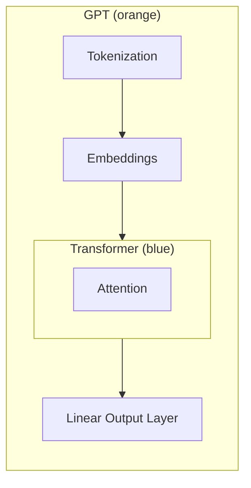

Everything studied so far — tokenization, token embeddings, positional encoding, and the final linear + softmax output layer — was preamble. The **Attention layer**, sitting inside the Transformer block, is the component that changed the entire landscape of AI. It is the beating heart of the LLM.

The paper that introduced this mechanism is *"Attention Is All You Need"* (Vaswani et al., Google, 2017). Despite its bold title, the paper received little notice at publication. Five years later, in November 2022, OpenAI shipped ChatGPT on top of those exact ideas (aided by orders-of-magnitude GPU improvements since 2017), and the AI conversation exploded. GPT is built purely on the **decoder** half of that paper's architecture.

---

### The Transformer Architecture: Encoder and Decoder

The 2017 paper presents Figure 1, which shows two stacked columns.

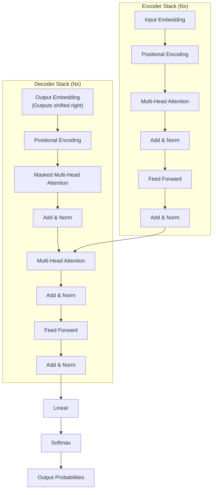

For purposes of this course, focus only on the **decoder** side — that is what GPT uses. The three concepts to take away from this diagram are the entire agenda for this session and the next:

1. **KQV** — Key, Query, Value projections (the core of the attention head)
2. **Causal Masking** — what the paper labels "Masked Multi-Head Attention"
3. **Residual / Skip Connections** — the shortcut paths visible in the diagram (`Add & Norm` blocks receive both the sub-layer output and the original input)

---

### Where Transformer Fits in the GPT Build

In the previous sessions the minimal GPT was: Tokenization → Embeddings → Linear Output Layer. Today's session inserts the Transformer block between the Embeddings and the output:

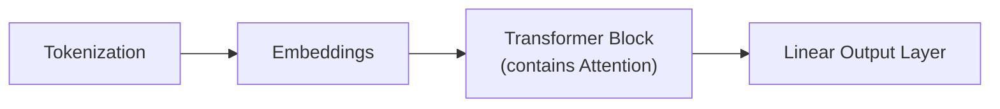

**Multi-head scaling rule.** A single Transformer block can contain multiple attention heads running in parallel. Transformer blocks can also be stacked. So if a model uses 8 stacked Transformer layers, each with 8 attention heads, the total number of attention layers is $8 \times 8 = 64$.

---

### Keys, Queries, and Values (KQV)

KQV is the central mechanism inside every attention head. The three terms are everywhere in the literature — KV cache, query-key dot product, value aggregation — and understanding them is essential for anyone who wants to optimize or tweak the attention layer.

Each of K, Q, and V is produced by applying a learned linear projection to the same input sequence $x$:

$$K = x W_K, \quad Q = x W_Q, \quad V = x W_V$$

where $W_K$, $W_Q$, $W_V$ are weight matrices of shape `[d_in, d_out]`, implemented as `nn.Linear(d_in, d_out, bias=False)`.

From `v1.ipynb`, `M4 Add: Transformer with Attention Layer`:

```python
class Attention(nn.Module):
    def __init__(self, d_in, d_out, context_length):
        super().__init__()
        self.d_out = d_out
        self.W_query = nn.Linear(d_in, d_out, bias=False)
        self.W_key   = nn.Linear(d_in, d_out, bias=False)
        self.W_value = nn.Linear(d_in, d_out, bias=False)
        self.register_buffer(
            "mask",
            torch.triu(torch.ones(context_length, context_length), diagonal=1)
        )

    def forward(self, x, return_weights=False):
        _, num_tokens, _ = x.shape
        keys    = self.W_key(x)      # shape: [batch, num_tokens, d_out]
        queries = self.W_query(x)    # shape: [batch, num_tokens, d_out]
        values  = self.W_value(x)    # shape: [batch, num_tokens, d_out]

        attn_scores = queries @ keys.transpose(1, 2)  # [batch, T, T]

        mask_bool   = self.mask[:num_tokens, :num_tokens].bool()
        attn_scores = attn_scores.masked_fill(mask_bool, -torch.inf)

        attn_weights = torch.softmax(attn_scores / (self.d_out ** 0.5), dim=-1)

        context_vec = attn_weights @ values   # [batch, T, d_out]

        if return_weights:
            return context_vec, attn_weights
        return context_vec
```

The three highlighted lines — `keys = self.W_key(x)`, `queries = self.W_query(x)`, `values = self.W_value(x)` — are the KQV projections. Everything else in the `forward` method uses them.

#### Why three separate projections?

The intuition: the **Query** represents "what this token is looking for", the **Key** represents "what each token offers", and the **Value** represents "what each token actually contributes if selected". Dot-producting Q with K gives a raw compatibility score between every pair of positions. Softmax normalizes those scores into weights, which are then used to take a weighted sum of V.

---

### Scaled Dot-Product Attention: Step by Step

The full attention computation starting from raw inputs:

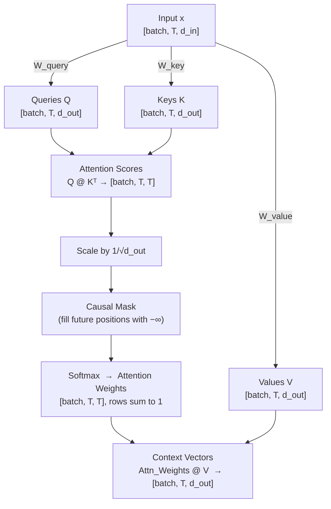

**Why scale by $1/\sqrt{d_{out}}$?** As the embedding dimension grows, the dot products grow in variance, pushing softmax into regions with vanishing gradients. Dividing by $\sqrt{d_{out}}$ keeps the magnitudes stable during training.

**Softmax** converts the row of (masked, scaled) scores into a probability distribution: every token's attention weight is non-negative and the row sums to 1. This gives a convex combination of the value vectors.

$$\text{Attention}(Q, K, V) = \text{softmax}\!\left(\frac{QK^\top}{\sqrt{d_k}}\right) V$$

---

### Causal Masking

**The problem without masking.** During training a GPT model sees the entire target sequence at once. Without a mask, the attention at position $t$ would be able to look at positions $t+1, t+2, \ldots$ — the future tokens it is supposed to predict. This would be data leakage.

**The fix.** An upper-triangular mask is applied to the raw attention scores *before* softmax. Every entry in the upper triangle (representing "attending to a future token") is replaced with $-\infty$. After softmax, $e^{-\infty} = 0$, so those positions receive zero weight.

```python
# Build the mask once in __init__:
self.register_buffer(
    "mask",
    torch.triu(torch.ones(context_length, context_length), diagonal=1)
)

# Apply in forward:
mask_bool   = self.mask[:num_tokens, :num_tokens].bool()
attn_scores = attn_scores.masked_fill(mask_bool, -torch.inf)
```

`torch.triu(..., diagonal=1)` produces a matrix that is `1` above the main diagonal and `0` on and below it. For a 4-token sequence the mask looks like:

$$M = \begin{pmatrix} 0 & 1 & 1 & 1 \\ 0 & 0 & 1 & 1 \\ 0 & 0 & 0 & 1 \\ 0 & 0 & 0 & 0 \end{pmatrix}$$

Token at position 0 can only attend to itself; token at position 3 can attend to all four positions. This is what the "Attention Is All You Need" paper calls **Masked Multi-Head Attention** in the decoder.

> [!info]+ Interview questions covered
> - What is causal masking in transformers?
> - Why do we fill attention scores with −∞ before softmax?
> - What does `torch.triu` do and why is it used in the attention mask?

---

### Residual (Skip) Connections

The Transformer diagram in the paper shows arrows that bypass each sub-layer, feeding the input directly to the `Add & Norm` block alongside the sub-layer output:

$$\text{output} = \text{LayerNorm}(x + \text{SubLayer}(x))$$

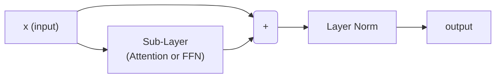

Without the skip connection, data flows only through the sub-layer. With it, the **original signal is preserved** alongside whatever the sub-layer learns. In very deep networks this shortcut path prevents vanishing gradients: gradients can flow directly back through the skip path without being attenuated by many layer operations. Residual connections are why deep networks (12, 24, or 96 layers) can be trained at all.

> [!info]+ Interview questions covered
> - What is a residual connection / skip connection?
> - Why are skip connections important in deep networks?
> - What is the Add & Norm block in the Transformer?

---

### Multi-Head Attention vs. Single-Head Attention

The code above implements a **single attention head**. "Multi-head" means running $h$ independent attention heads in parallel, each with its own $W_Q^{(i)}$, $W_K^{(i)}$, $W_V^{(i)}$ projections, then concatenating and projecting the $h$ outputs. Each head can learn to attend to different aspects of the context simultaneously.

**Stacking.** Multiple Transformer blocks are then stacked sequentially. If a model has 8 Transformer layers each with 8 heads:

$$\text{Total attention layers} = 8 \text{ layers} \times 8 \text{ heads} = 64 \text{ attention heads}$$

For this session, the focus is on understanding a single attention head deeply before adding multi-head complexity.

> [!info]+ Interview questions covered
> - What is the difference between single-head and multi-head attention?
> - How many attention layers does a model with 8 Transformer blocks × 8 heads have?

---

### Why the Transformer Replaced RNNs

Before the 2017 paper, **Recurrent Neural Networks (RNNs)** were the dominant language model architecture. RNNs process text one token at a time from left to right, passing a hidden state forward. This creates two fundamental problems:

| Issue | RNN | Transformer |
|---|---|---|
| **Memory of early tokens** | Hidden state is compressed and early context is gradually forgotten | Every token attends directly to every other token; no information bottleneck |
| **Parallelism** | Sequential — token $t+1$ cannot be processed until token $t$ is done | Fully parallel — all tokens computed simultaneously |

The Transformer's self-attention mechanism allows any token to directly attend to any other token in a single operation, regardless of distance. This eliminates both the forgetting problem and the sequential bottleneck that made RNNs slow to train on long sequences.

This is the core reason why, once GPU hardware caught up to the compute demands of attention (by 2022), RNNs became effectively obsolete for language tasks.

> [!info]+ Interview questions covered
> - Why did RNNs fail for long sequences?
> - What are the two main problems with RNNs that Transformers solve?
> - Why don't you need to learn RNNs if you already understand Transformers?

---

### Summary: Three Takeaways from This Session

| Concept | What it is | Where in code |
|---|---|---|
| **KQV projections** | Three learned linear maps applied to the same input; produce Keys, Queries, Values | `self.W_key`, `self.W_query`, `self.W_value` |
| **Causal masking** | Upper-triangular mask of −∞ applied before softmax; prevents attending to future tokens | `self.mask` + `masked_fill` |
| **Residual skip connection** | Input bypasses the sub-layer and is added back to its output before LayerNorm | `Add & Norm` blocks; covered in depth next session |


## RNN Sequential Processing, LSTMs, GRUs, Hidden State

> **Section timestamps:** 6:53 – 12:34

---

### Why RNNs? (The Historical Motivation)

Before the Transformer architecture arrived — crystallised in the 2017 paper *"Attention Is All You Need"* — **Recurrent Neural Networks (RNNs)** were the dominant approach to language modelling. They were used for next-word prediction, summarisation, and machine translation.

There is little practical reason to *implement* an RNN today because LLMs based on the Transformer can do everything an RNN can do, and do it better. However, understanding **what was wrong with RNNs conceptually** is exactly the motivation you need for the Transformer design — every architectural choice in the Transformer is a direct answer to one of the two RNN failure modes.

---

### How an RNN Works: Sequential Left-to-Right Reading

An RNN processes a sequence of tokens **one token at a time**, from left to right. At each step $t$, it receives:

1. The **current token embedding** $x_t$
2. The **hidden state** from the previous step $h_{t-1}$

It combines them to produce a new hidden state:

$$h_t = \tanh(W_h \, h_{t-1} + W_x \, x_t + b)$$

where $W_h$ and $W_x$ are learned weight matrices and $b$ is a bias vector.

The hidden state $h_t$ is a **fixed-size vector** that is meant to summarise everything the model has read up to position $t$. This is the RNN's only memory — there is no other channel through which earlier tokens can influence later predictions.

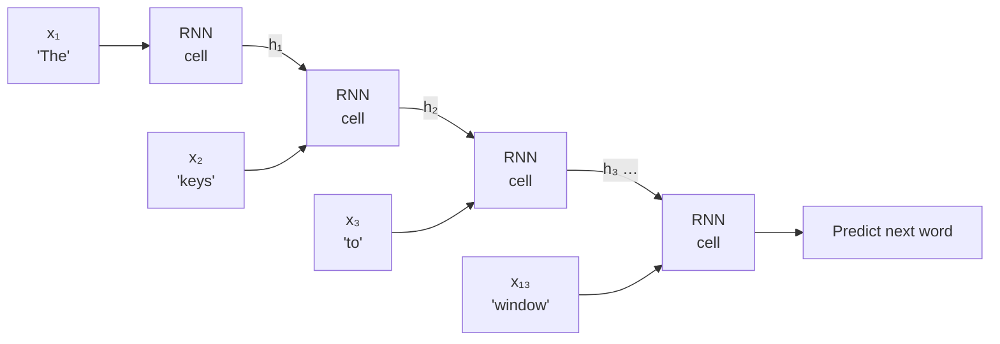

The critical constraint is that $h_t$ has **fixed size** regardless of how long the input sequence is. Every new word must fit its contribution into that same fixed vector, which means some old information must be overwritten.

---

### Problem 1: Forgetting

Because the hidden state is fixed-size and every new token partially overwrites it, **early tokens gradually get washed out** as the sequence grows longer.

#### The "keys…are" example

Consider the sentence:

> *The **keys** to the cabinet in the old wooden drawer near the **window** \_\_\_?*

The correct next word is **"are"** (because the plural subject "keys" appears at the start). But here is what happens inside the RNN:

| Timestep | Current word | Memory of "keys" in hidden state |
|----------|-------------|----------------------------------|
| t = 0    | The         | 100%                             |
| t = 10   | drawer      | 14%                              |
| t = 13   | window      | **7%**                           |

By t = 13, the RNN has retained only **7% of the signal** that "keys" was the subject. When it then tries to predict the verb, it guesses **"is"** (singular) instead of the correct **"are"** (plural). The plural subject has been washed out of the hidden state by all the intervening tokens.

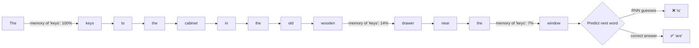

This is not a bug in a specific RNN — it is a structural consequence of the architecture. The fixed-size hidden state is a **lossy compression** of the entire context seen so far.

#### LSTMs and GRUs: Mitigations, Not Solutions

Two architectural improvements were designed to reduce forgetting:

**LSTM (Long Short-Term Memory)** adds a second memory channel — the **cell state** $C_t$ — alongside the hidden state, together with three gates:

| Gate          | What it controls                               |
|---------------|------------------------------------------------|
| **Forget gate** $f_t$ | What fraction of the old cell state to discard |
| **Input gate** $i_t$  | How much of the new input to write to the cell state |
| **Output gate** $o_t$ | How much of the cell state to expose as the hidden state |

The cell state flows forward with only element-wise operations (no matrix multiply), so gradients can propagate further back without vanishing as quickly.

**GRU (Gated Recurrent Unit)** is a simpler variant with only two gates:

| Gate             | What it controls                             |
|------------------|----------------------------------------------|
| **Reset gate** $r_t$   | How much of the past hidden state to forget  |
| **Update gate** $z_t$  | How much of the past hidden state to carry forward |

GRUs have fewer parameters than LSTMs but achieve similar performance on many tasks.

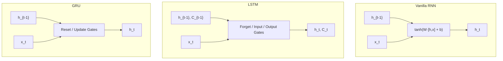

> **Key point:** LSTMs and GRUs significantly reduce forgetting for sequences of moderate length (roughly 40–50 tokens). RNNs were widely used for summarisation and language modelling within that range. But for **very long sequences**, important early information still fades — no gating scheme can escape the fundamental constraint of a fixed-size state.

> [!info]+ Interview questions covered
> - What is a Recurrent Neural Network (RNN)?
> - What is the hidden state in an RNN?
> - What is the vanishing memory / forgetting problem in RNNs?
> - What are LSTMs and how do they differ from vanilla RNNs?
> - What are GRUs and how do they compare to LSTMs?
> - Why can't LSTMs fully solve the long-range dependency problem?

---

### Problem 2: Slowness (Sequential Processing Cannot Be Parallelised)

The second fundamental problem with RNNs is **training speed**. Because the hidden state at step $t$ depends on the hidden state at step $t-1$, the RNN is **strictly sequential** — you cannot compute step 3 until you have finished step 2.

This means:
- Training and inference time scale **linearly** with sequence length.
- Modern GPU hardware, which excels at massive parallelism, is almost entirely wasted.
- Long documents are extremely slow to process.

#### The 6-token comparison

Consider the sentence: *"The cat sat on the mat"* (6 tokens).

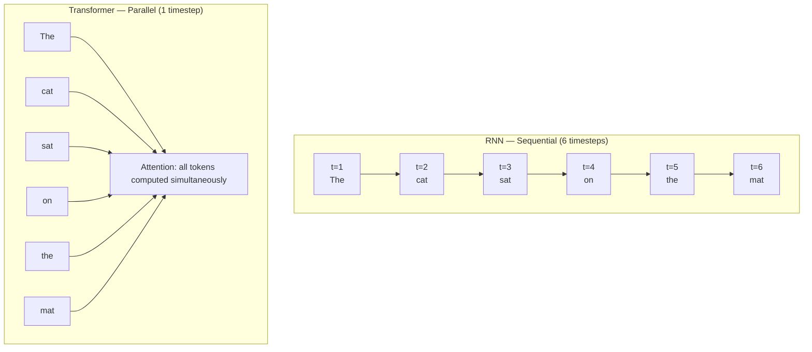

| Architecture   | Tokens | Timesteps required |
|----------------|--------|--------------------|
| RNN            | 6      | **6** (t=1 → t=6)  |
| Transformer    | 6      | **1** (all at once) |

This scales catastrophically for real workloads. For a 1,000-token document:
- RNN: 1,000 sequential steps
- Transformer: 1 step (all 1,000 positions in parallel)

#### Real-world training time impact

The tutor puts a concrete number on this: a Transformer-based language model that can be trained in **10 days** on modern hardware would take **1–2 years** to train as an RNN. That difference is not just convenience — it determines whether experiments are feasible at all. The ability to iterate quickly is what drove the explosive wave of LLM innovation after "Attention Is All You Need".

> [!info]+ Interview questions covered
> - Why are RNNs slow to train?
> - Why can't RNN training be parallelised?
> - How does the Transformer solve the slowness problem?
> - What is the time complexity of RNN training vs. Transformer training?
> - Why did Transformers replace RNNs for large-scale language modelling?

---

### The Two RNN Problems: A Summary

Both problems — forgetting and slowness — are rooted in the **same architectural commitment**: processing one token at a time and compressing all history into a single fixed-size vector.

| Problem    | Root cause                                | Consequence                                        | Partial mitigation         |
|------------|-------------------------------------------|----------------------------------------------------|----------------------------|
| **Forgetting** | Fixed-size hidden state overwrites early tokens | Long-range dependencies lost; wrong predictions | LSTMs, GRUs (gates)        |
| **Slowness**   | Step $t$ depends on step $t-1$            | No parallelism; training time $\propto$ sequence length | None within RNN paradigm |

The moment you understand these two problems, you understand *why* the Transformer was so revolutionary:

- **Attention eliminates forgetting**: every token can look *directly* at every other token in the sequence, with no information decay over distance.
- **Attention eliminates slowness**: all token-to-token interactions are computed in parallel in a single matrix operation.

As the LLM Concepts Visualizer banner puts it: *"Attention solves both problems at once."*

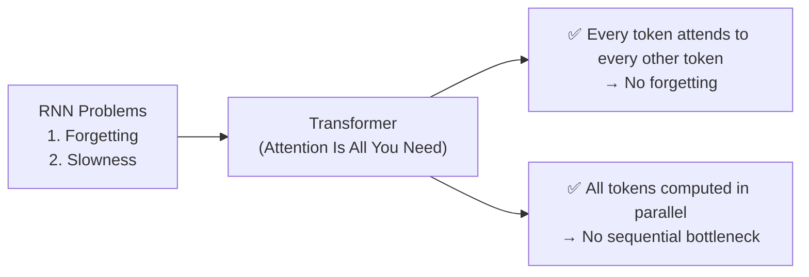

> [!info]+ Interview questions covered
> - What are the two main problems with RNNs?
> - Why did the "Attention Is All You Need" paper matter?
> - How does the attention mechanism solve the forgetting problem?
> - How does the Transformer solve the sequential processing bottleneck?

---

### Historical Trajectory: From RNNs to LLMs

RNNs (and their gated variants) were not useless — they powered:

- **Language modelling** (next-word prediction over short contexts)
- **Summarisation** (compressing short documents)
- **Machine translation** (sequence-to-sequence with encoder-decoder RNNs)

They worked well enough for sentences of 40–50 tokens. As tasks demanded longer contexts — full documents, multi-turn conversations, code — the forgetting problem became a hard wall. Simultaneously, the sequential compute requirement made scaling impossible even with advances in hardware.

The Transformer removed both walls in one move. That is why since 2017 the entire field has converged on LLMs, and RNNs are studied primarily as **historical context** — not as a practical tool.

---

### What Comes Next

After establishing why RNNs failed, the lecture proceeds to the **attention mechanism** — the core innovation that replaces the hidden-state bottleneck. The subsequent sections cover:

1. **Attention** — Q, K, V projections; how every token attends to every other token
2. **Skip connections (residual connections)** — preserving the original signal through deep networks
3. **Causal masking** — ensuring the model cannot "look ahead" during training


## Self-Attention Intuition, Attention Mechanism, and Contextual Word Meaning

> **Section timestamps:** 12:34 – 16:00 | Slides 28–40

---

### Why Attention? — Building the Intuition Before the Math

Before any equations, the purpose of the attention mechanism is best understood through a simple pronoun-resolution puzzle. Consider the following sentence:

> *"The animal didn't cross the street because it was too **tired**."*

If asked what the word **"it"** refers to, most people immediately answer: **the animal** — because the animal was too tired to cross. Notice that you answered this without thinking about formal grammar rules. Your brain automatically scanned the surrounding words and gave more weight to the word "tired," which semantically connects to "animal" (animals get tired, streets do not). That act of selectively weighting surrounding words to determine meaning is, at its core, exactly what the attention mechanism does.

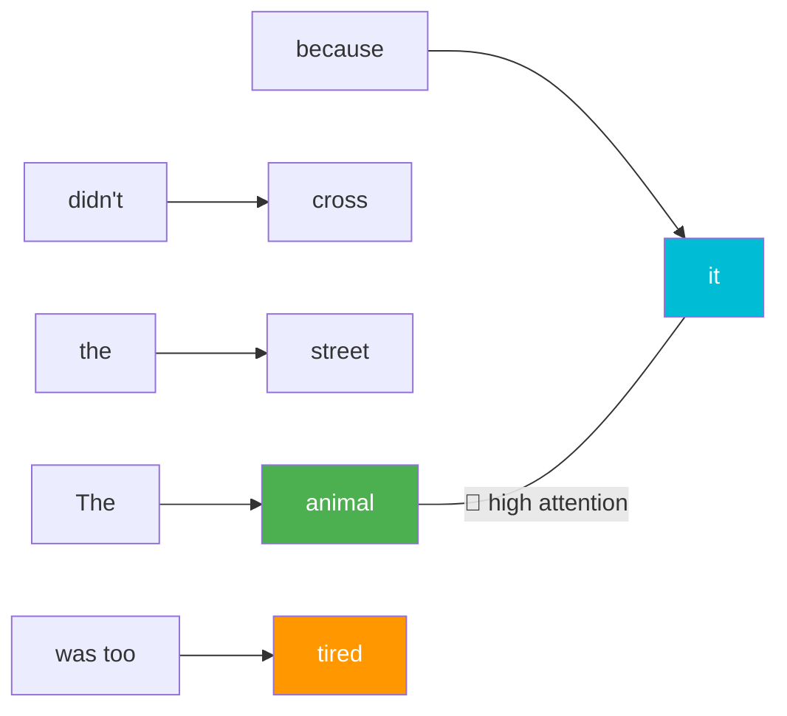

*The word "tired" pulls attention toward "animal," allowing the model to resolve "it" → "animal."*

---

### One Word Changes Everything — The Contrast Example

Now read this structurally identical sentence with just one word swapped:

> *"The animal didn't cross the street because it was too **wide**."*

The same structure. The same pronoun "it." But now "it" refers to **the street** — because the street was too wide to cross. Changing a single word ("tired" → "wide") caused the attention to shift completely from "animal" to "street."

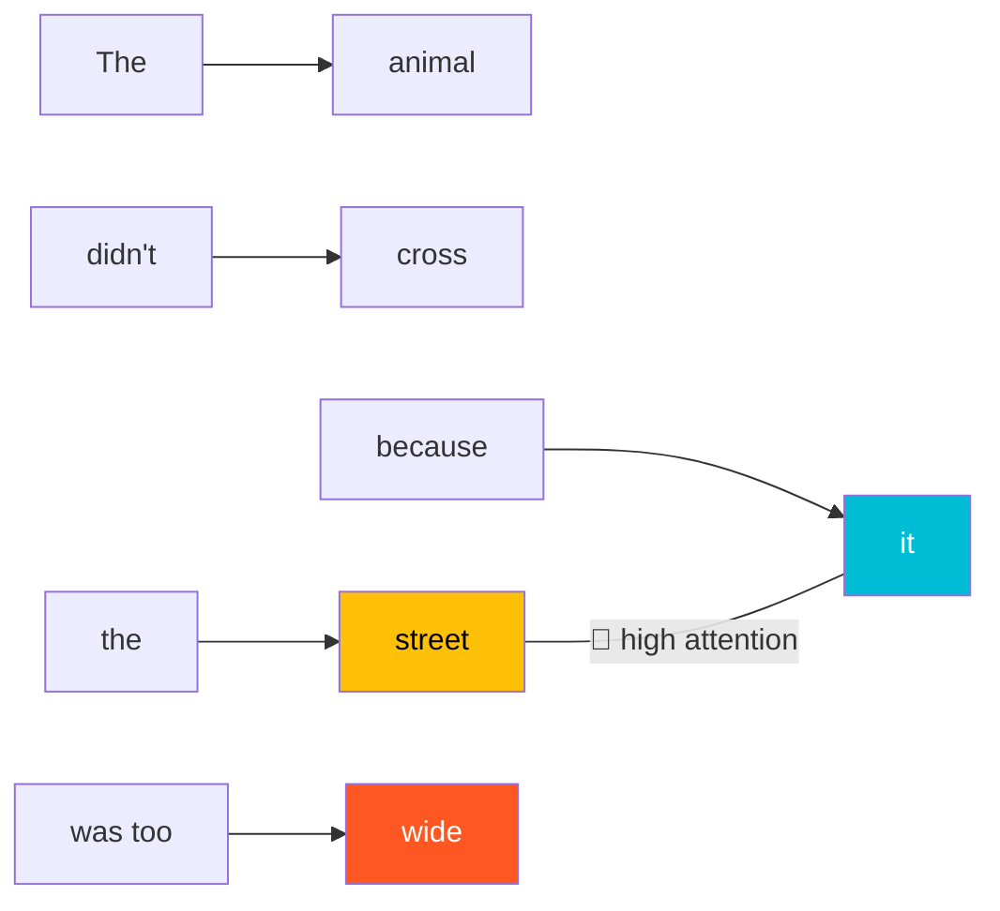

*The word "wide" pulls attention toward "street," resolving "it" → "street."*

The side-by-side contrast makes the mechanism concrete:

| Sentence | Key adjective | "it" refers to | Attention arc |
|---|---|---|---|
| "…it was too **tired**" | tired | animal | tired → animal |
| "…it was too **wide**" | wide | street | wide → street |

The meaning of "it" is not fixed — it is **contextual**. A single surrounding word completely determines the referent. This is the formal definition of **contextual word meaning**: a token's meaning cannot be determined from the token alone; it must be resolved by attending to its surrounding context.

> [!info]+ Interview questions covered
> - What is contextual word meaning in NLP/LLMs?
> - Why can't a word's meaning be determined from its embedding alone (without attention)?
> - What is coreference resolution, and why is it hard for rule-based systems?

---

### From Human Brain Logic to the LLM Attention Block

The human brain resolves ambiguous pronouns by automatically looking at surrounding words. The question the tutor poses is: *"How did your brain figure that out?"*

The answer is:
- **"tired"** pulled your attention toward **"the animal"** (animals can be tired).
- **"wide"** pulled your attention toward **"the street"** (streets can be wide).

The attention block inside a Transformer replicates exactly this brain logic. Formally:

> **Every word in the sequence looks at every other word in the sequence to understand its own meaning. The model gives more attention to words that matter and less attention to words that do not.**

This is not a metaphor — it is the literal computation performed in the self-attention layer: every token computes a weighted sum over all other tokens in the context window, where the weights (the **attention scores**) determine how much each neighbor contributes to the token's contextual representation.

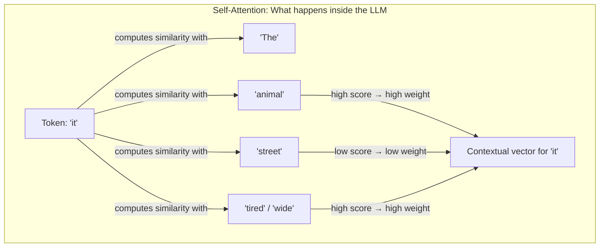

The attention scores are **learned during training** — the model discovers, from data, which word relationships matter for understanding meaning. The scores are not hand-coded rules.

> [!info]+ Interview questions covered
> - What is self-attention and why is it called "self"-attention?
> - What does the attention block in a Transformer compute?
> - How does the LLM determine which words are relevant to a given token?

---

### The Scaled Dot-Product Attention Formula

The intuition above is made concrete by the **scaled dot-product attention** formula, introduced in the landmark paper *"Attention Is All You Need"* (Vaswani, Shazeer, Parmar, Uszkoreit, Jones, Gomez, Kaiser, Polosukhin — Google Brain / Google Research, 2017):

$$
\text{Attention}(Q, K, V) = \text{softmax}\!\left(\frac{Q \cdot K^T}{\sqrt{d_k}}\right) \cdot V
$$

This formula must be memorized. Each symbol has a precise meaning:

| Symbol | Full name | What it represents |
|---|---|---|
| $Q$ | Query | What each word is **looking for** in its context |
| $K$ | Key | What each word **offers** / advertises to other words |
| $V$ | Value | The **actual content** a word contributes when selected |
| $d_k$ | Key dimension | The dimensionality of the key vectors (used for scaling) |

#### How Q, K, and V Are Created

Given an input sentence (e.g., "I love AI"), the words are first embedded into an input matrix $X$ of shape $(n_{\text{tokens}} \times d_{\text{model}})$. Three separate weight matrices $W_Q$, $W_K$, $W_V$ — each of shape $(d_{\text{model}} \times d_k)$ — are then applied:

$$
Q = X \cdot W_Q \qquad K = X \cdot W_K \qquad V = X \cdot W_V
$$

For the "I love AI" example shown in the visualizer, $X$ is a $3 \times 4$ matrix (3 tokens, 4-dimensional embeddings) and each weight matrix is $4 \times 3$, producing $Q$, $K$, $V$ matrices of shape $3 \times 3$.

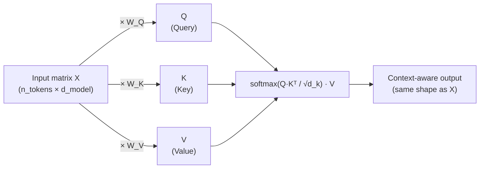

These weight matrices $W_Q$, $W_K$, $W_V$ are **learned parameters** — they are updated during training via backpropagation just like any other weight in the network.

#### Why Divide by $\sqrt{d_k}$?

The $\sqrt{d_k}$ in the denominator is a **scaling factor**. As the dimension $d_k$ grows, the dot products $Q \cdot K^T$ tend to grow in magnitude, pushing the softmax into regions where its gradients become very small (the vanishing gradient problem). Dividing by $\sqrt{d_k}$ keeps the dot products in a well-scaled range, stabilizing training. (A full derivation — using the variance argument — is beyond the scope of this session; the key point is that the scaling is necessary and principled.)

#### The Wedding Buffet Analogy (QKV Intuition)

The visualizer uses a memorable analogy to lock in the QKV roles:

- You walk into a wedding with 200 dishes. You have a **craving**: *"I want dessert."* → This craving is your **Query**.
- Each dish has a **label** (name tag) that describes what it is. → These labels are the **Keys**.
- The dish **itself** — what you actually put on your plate when you pick it — is the **Value**.
- You scan all labels (compute $Q \cdot K^T$), score each one by how well it matches your craving, apply softmax to get probabilities, and then take a weighted combination of the actual dishes. That weighted combination is your attention output.

This maps directly onto what happens in the Transformer: the Query of token $i$ "scans" the Keys of all tokens, produces a score for each, softmax normalizes those scores into weights, and then those weights blend the Values to produce a new contextual representation for token $i$.

> [!info]+ Interview questions covered
> - What is the scaled dot-product attention formula?
> - What are Query, Key, and Value in the attention mechanism?
> - Why is there a $\sqrt{d_k}$ scaling factor in the attention formula?
> - How are Q, K, V matrices created from the input?
> - What paper introduced the Transformer / self-attention? Who are the authors?
> - What does "Attention is All You Need" mean in the context of sequence modeling?

---

### The "Attention Is All You Need" Paper

The exact formula above comes directly from the 2017 paper **"Attention Is All You Need"** by Ashish Vaswani, Noam Shazeer, Niki Parmar, Jakob Uszkoreit, Llion Jones, Aidan N. Gomez, Łukasz Kaiser, and Illia Polosukhin (Google Brain / Google Research).

Key claims from the abstract:
- Prior dominant sequence models were based on **complex recurrent or convolutional neural networks**. The Transformer replaces both entirely.
- The new architecture is **based solely on attention mechanisms** — no recurrence, no convolutions.
- Achieved **28.4 BLEU** on WMT 2014 English-to-German translation, and **41.0 BLEU** on English-to-French — state of the art at the time — while training on only 8 GPUs for 3.5 days.

The transition from recurrence-based models (RNNs, LSTMs) to attention-only models is the architectural revolution that enabled modern LLMs. The key advantage: attention computes relationships between all pairs of tokens in a **single operation** ($O(n^2 \cdot d)$ but parallelizable), whereas RNNs are inherently sequential.

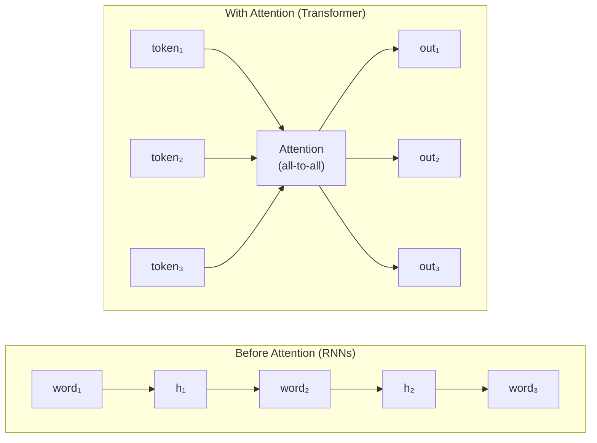

> [!info]+ Interview questions covered
> - What problem did the Transformer architecture solve over RNNs/LSTMs?
> - What is the key architectural innovation in "Attention Is All You Need"?
> - Why can Transformers be parallelized but RNNs cannot?
> - What were the BLEU scores achieved by the original Transformer paper?


## Softmax, Query-Key-Value Attention, Scaled Dot-Product Attention, Self-Attention Weights

> **Section timestamps:** 16:00 – 25:47

---

### The Formal Attention Formula

The original "Attention Is All You Need" paper (Vaswani et al., 2017) defines scaled dot-product attention as a single, elegant expression:

$$
\text{Attention}(Q, K, V) = \text{softmax}\!\left(\frac{Q K^T}{\sqrt{d_k}}\right) V
$$

where:
- $Q$ — the **Query** matrix (rows = one query vector per token)
- $K$ — the **Key** matrix (rows = one key vector per token)
- $V$ — the **Value** matrix (rows = one value vector per token)
- $d_k$ — the dimensionality of the key vectors

Every step in the formula has a precise role:

| Step | Operation | What it produces |
|------|-----------|-----------------|
| 1 | $Q K^T$ | Raw attention scores — how relevant each key is to each query |
| 2 | $\div \sqrt{d_k}$ | Scaled scores — prevents saturation of the softmax |
| 3 | $\text{softmax}(\cdot)$ | Attention weights — a valid probability distribution over keys |
| 4 | $\times V$ | Weighted sum of values — the final contextualised representation |

#### Why divide by $\sqrt{d_k}$?

This is a classic interview question. The honest answer is grounded in variance analysis. Each element of $Q$ and $K$ is drawn from a distribution with mean 0 and variance 1. The dot product $q \cdot k$ is the sum of $d_k$ such products, so its variance is $d_k$. As $d_k$ grows (e.g. 64, 128, 512), the dot products become large in magnitude.

When large values are fed into softmax, the function saturates: one score dominates with weight ≈ 1 and all others ≈ 0. In that "peaky" region, gradients become **extremely small** — the classic vanishing-gradient problem for the softmax. Dividing by $\sqrt{d_k}$ normalises the variance back to 1, keeping the softmax in a regime where gradients flow.

The $\sqrt{d_k}$ factor (rather than $d_k$, or some arbitrary constant like 2 or 5) is the natural choice because standard deviation scales as the square root of variance.

> [!info]+ Interview questions covered
> - What is the attention formula in the "Attention Is All You Need" paper?
> - Why is $\sqrt{d_k}$ used as the scaling factor in scaled dot-product attention?
> - What happens to the softmax if you don't scale by $\sqrt{d_k}$?
> - What is the difference between additive attention and dot-product attention?

---

### Intuition: Query, Key, Value

Before working through numbers, it helps to have two complementary mental models for what Q, K, V actually mean.

#### Mental model 1 — The database analogy

Imagine querying a SQL database:

```
SELECT TOP 10 * FROM table WHERE condition
```

- The **Query** is your `WHERE` condition — what you are looking for.
- The **Keys** are all the rows in the database — everything that exists.
- The **Values** are the rows you actually retrieve as a result.

Inside an attention layer, the same logic plays out: each token formulates a Query asking *"how much should I attend to every other token?"*, each token exposes a Key representing *what it offers*, and the Value is the actual content that gets aggregated.

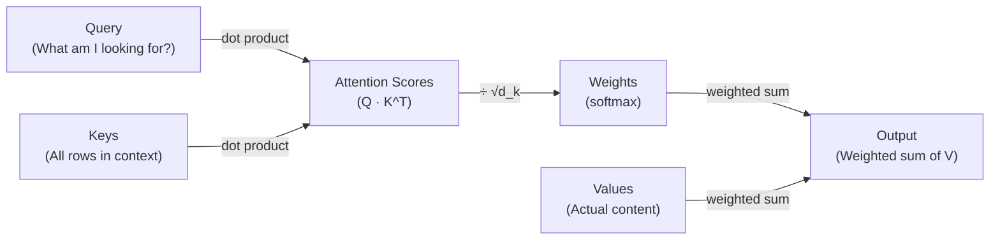

#### Mental model 2 — The wedding buffet analogy

Imagine arriving at a wedding with 200 dishes on the buffet counter and only one plate.

- You arrive with a **craving**: *"I want dessert"* → this craving is your **Query**.
- Every dish has a **label sticker** in front of it (Gulab Jamun, Rasmalai, Jalebi, Butter Chicken, Mutton Biryani, Plain Rice, Raita) → these labels are the **Keys**.
- The **actual food** inside each dish — the taste, texture, real substance — is the **Value**.

Your brain scans every label against your craving to produce a relevance score (this is $Q \times K^T$). Dessert items score high; savoury dishes score low.

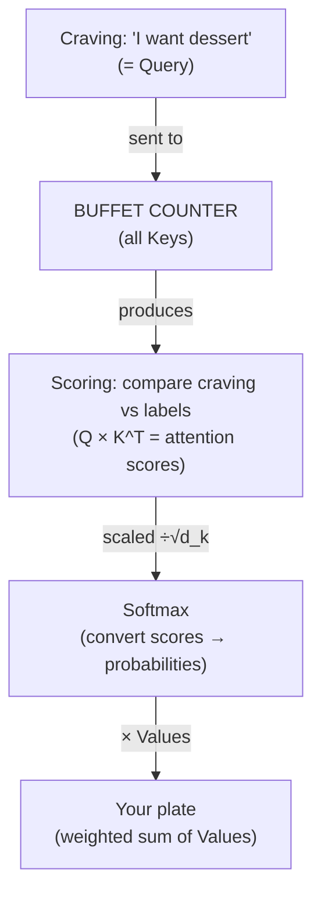

---

### Step-by-Step Walkthrough: From Craving to Plate

#### Step 1 — Compute raw attention scores ($Q \cdot K^T$)

Matching your query "I want dessert" against every dish label produces raw scores:

| Dish | Label (Key) | Raw score |
|------|-------------|-----------|
| Gulab Jamun | gulab jamun | 95 |
| Rasmalai | rasmalai | 98 |
| Jalebi | jalebi | 88 |
| Butter Chicken | butter chicken | 3 |
| Mutton Biryani | mutton biryani | 2 |
| Plain Rice | plain rice | 2 |
| Raita | raita | 2 |

These are **raw scores** — they do not yet sum to 100; softmax has not been applied. The desserts dominate because the query is dessert-centric.

#### Step 2 — Scale by $\frac{1}{\sqrt{d_k}}$

Divide every score by $\sqrt{d_k}$ to prevent saturation. This keeps the scores numerically stable before passing them into softmax.

#### Step 3 — Apply softmax to get attention weights

Softmax converts the scaled scores into a probability distribution that sums to 1:

$$
w_i = \frac{e^{s_i / \sqrt{d_k}}}{\sum_j e^{s_j / \sqrt{d_k}}}
$$

After softmax, dessert items collectively hold most of the weight. Non-desserts receive a very small but non-zero weight. **Why non-zero?** Because the model has been trained on the internet, where someone may have written *"I had butter chicken alongside my dessert."* The model cannot completely zero out any item — it is probabilistic, not deterministic.

#### Step 4 — Weighted sum of Values ($\cdot V$)

Multiply the softmax weights by the Value vectors. The result is your **plate** — a weighted combination of the actual food:

- Large portion of Gulab Jamun and Rasmalai (high weight)
- A little Jalebi
- A negligible smear of everything else

$$
\text{Output} = \sum_i w_i \cdot \mathbf{v}_i
$$

This weighted sum of values is the **output of the attention layer** — a rich, context-blended representation for each token.

> [!info]+ Interview questions covered
> - What does the Query vector represent in self-attention?
> - What does the Key vector represent in self-attention?
> - What does the Value vector represent in self-attention?
> - What is the difference between attention scores and attention weights?
> - Why do non-matching tokens still receive small non-zero attention weights?

---

### Self-Attention Weights: Context-Dependent Outputs

A critical property of attention is that **the same keys and values produce entirely different outputs for different queries**. This is the essence of self-attention being *context-dependent*.

The visualiser demonstrates this with three people at the same buffet counter (same dish labels, same food):

| Person | Query | High-attention dishes |
|--------|-------|-----------------------|
| You | "I want dessert" | Gulab Jamun 95%, Rasmalai 98%, Jalebi 88% |
| Uncle | "Something non-veg" | Butter Chicken 90%, Mutton Biryani 35% |
| Cousin | "Something light" | Raita 90%, Plain Rice 68% |

In a Transformer, the same principle holds: each token generates a unique Query vector. When "bank" appears in "river bank" vs "bank account", the token's Query attends differently to neighbouring tokens, yielding a contextualised embedding that captures the intended meaning.

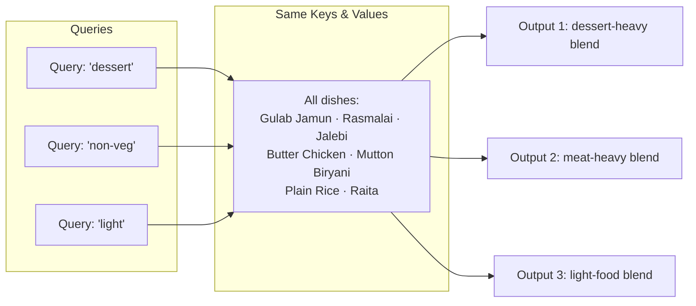

> [!info]+ Interview questions covered
> - What is self-attention and why is it "self"?
> - How does the attention mechanism produce context-dependent representations?
> - Why can two occurrences of the same word produce different output embeddings after attention?

---

### Quick Mapping: Analogy → Mechanism

| Wedding Buffet Analogy | Attention Mechanism |
|------------------------|---------------------|
| Your craving ("I want dessert") | Query vector $\mathbf{q}$ |
| Label on each dish | Key vector $\mathbf{k}_i$ |
| Actual food in the dish | Value vector $\mathbf{v}_i$ |
| Scanning labels and scoring relevance | $Q \cdot K^T$ = raw attention scores |
| Piling up sweets, skipping savoury | Softmax → attention weights |
| Your final loaded plate | Weighted sum of Values = attention output |

> *"Your craving is the Query. Labels are the Keys. Food is the Value. You always pile up what matches your craving and skip what doesn't."*

---

### Numeric Walkthrough: "I love AI" (Setup)

To make the formula concrete, the tutor works through attention step by step using the three-token sentence **"I love AI"** with embedding dimension $d_{\text{emb}} = 4$.

#### From Words to Vectors (Step 1)

Each word is first converted to a 4-dimensional embedding vector. For this example, simple integers are chosen so the arithmetic is easy to follow:

$$
X = \begin{bmatrix}
1 & 0 & 1 & 0 \\
0 & 1 & 0 & 1 \\
1 & 1 & 0 & 0
\end{bmatrix}
\quad
\begin{array}{l}
\leftarrow \text{"I"} \\
\leftarrow \text{"love"} \\
\leftarrow \text{"AI"}
\end{array}
$$

- Each **row** is one token's embedding vector.
- Each **column** is one dimension of the embedding space.
- The matrix $X$ has shape $(\text{seq\_len}, d_{\text{emb}}) = (3, 4)$.

This input matrix $X$ is the starting point. The next step (covered in Section 4) multiplies $X$ by three learned weight matrices — $W^Q$, $W^K$, $W^V$ — to produce the query, key, and value matrices $Q$, $K$, $V$.

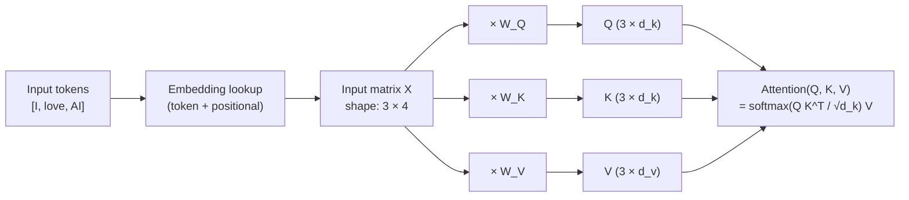

> [!info]+ Interview questions covered
> - What is the input matrix $X$ in the attention computation?
> - How are the Query, Key, and Value matrices derived from the input embeddings?
> - What are the weight matrices $W^Q$, $W^K$, $W^V$?
> - What shape is the output of the attention layer?

---

### Summary: The Attention Pipeline

Putting it all together, scaled dot-product attention is a four-step pipeline:

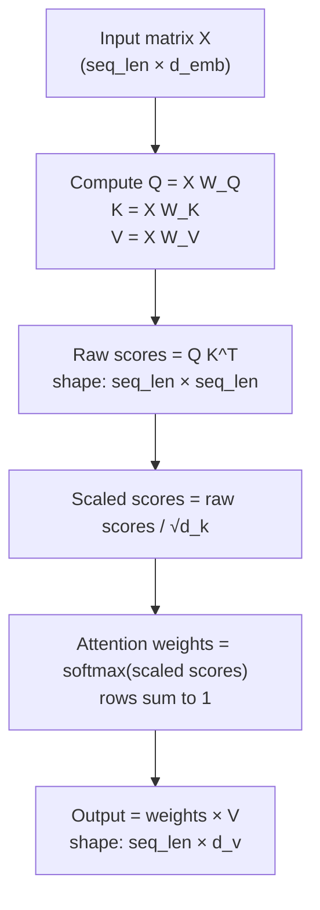

1. **Embed** each token → input matrix $X$.
2. **Project** $X$ into three spaces via learned matrices $W^Q$, $W^K$, $W^V$.
3. **Score** every query against every key: $QK^T$.
4. **Scale** by $1/\sqrt{d_k}$ to prevent saturation.
5. **Normalise** with softmax to get a probability distribution.
6. **Aggregate** values: multiply softmax weights by $V$.

The result is a new representation for each token that encodes **who attends to whom** — the richer, context-aware embedding that the rest of the Transformer layers build upon.

> [!info]+ Interview questions covered
> - What are the full steps of scaled dot-product attention?
> - What does the attention weight matrix look like? (seq_len × seq_len)
> - What is the shape of the attention output?
> - How does attention enable a model to capture long-range dependencies?


## Self-Attention: Query, Key, Value — Learned Parameters and Matrix Multiplication

*(Lecture timestamps 25:47 – 31:50)*

Self-attention is what gives a transformer the ability to look at every other token in a sequence and decide which ones are most relevant for understanding the current token. This section builds the full mathematical picture of how that happens: starting from token embeddings, projecting them into three separate spaces called **Query (Q)**, **Key (K)**, and **Value (V)**, and understanding why those projections require *learned* weight matrices.

---

### The Starting Point: Input Matrix X

After tokenisation and embedding, every token in the input sentence is represented as a dense vector. For the worked example used throughout — the sentence **"I love AI"** — each of the three tokens is converted into a 4-dimensional embedding vector ($ d_{\text{emb}} = 4 $). The numbers chosen are deliberately simple so the arithmetic can be followed by hand.

| Token  | d1   | d2   | d3   | d4   |
|--------|------|------|------|------|
| I      | 1.00 | 0.00 | 1.00 | 0.00 |
| love   | 0.00 | 1.00 | 0.00 | 1.00 |
| AI     | 1.00 | 1.00 | 0.00 | 0.00 |

Stacking these three row-vectors produces the **input matrix** $X$ with shape $(3 \times 4)$:

$$
X = \begin{bmatrix} 1 & 0 & 1 & 0 \\ 0 & 1 & 0 & 1 \\ 1 & 1 & 0 & 0 \end{bmatrix}
$$

Each row is one token; each column is one dimension of the embedding space. This matrix is the single input to the attention sub-layer. (The actual values in a trained model are the sum of token embedding and positional embedding, but those are assumed already combined into X here.)

---

### The Three Projections: Creating Q, K, and V

Raw embeddings carry the meaning of each token in one generic space. Self-attention needs *three distinct views* of that information:

- **Query (Q)** — what this token is *looking for*
- **Key (K)** — what this token *offers* to others
- **Value (V)** — the actual *content* to be aggregated if this token is deemed relevant

Each view is obtained by a separate linear projection of X through a learned weight matrix:

$$
Q = X \times W_Q \qquad K = X \times W_K \qquad V = X \times W_V
$$

The flow from raw input to the three matrices looks like:

```mermaid
flowchart TD
    X["Input matrix X\n(seq_len × d_emb)\n3 × 4"] --> WQ["× W_Q\n(4 × 3)"]
    X --> WK["× W_K\n(4 × 3)"]
    X --> WV["× W_V\n(4 × 3)"]
    WQ --> Q["Query matrix Q\n(3 × 3)"]
    WK --> K["Key matrix K\n(3 × 3)"]
    WV --> V["Value matrix V\n(3 × 3)"]
    Q --> ATT["Attention(Q, K, V)\n= softmax(Q·Kᵀ / √d_k) · V"]
    K --> ATT
    V --> ATT
```

Each weight matrix maps from the embedding dimension ($d_{\text{emb}} = 4$) to the key/query dimension ($d_k = 3$), so every weight matrix has shape $4 \times 3$. The resulting Q, K, and V matrices each have shape $(3 \times 3)$ — one 3-dimensional vector per token.

---

### The Learned Parameters: W_Q, W_K, and W_V

A critical distinction that trips up many learners:

> **Q, K, and V are *not* the learned parameters. The learned parameters are W_Q, W_K, and W_V.**

When the model trains, it updates $W_Q$, $W_K$, and $W_V$ via backpropagation. Q, K, and V are *computed on the fly* from whatever input X arrives at inference time — they change with every new sequence.

So the count of learnable parameter sets in attention is **three**, not six: $\{W_Q, W_K, W_V\}$.

For the worked example, the visualizer uses these simple initialised weight matrices:

$$
W_Q = \begin{bmatrix} 1 & 0 & 1 \\ 0 & 1 & 0 \\ 1 & 0 & 0 \\ 0 & 1 & 1 \end{bmatrix}
\quad
W_K = \begin{bmatrix} 0 & 1 & 0 \\ 1 & 0 & 1 \\ 0 & 0 & 1 \\ 1 & 1 & 0 \end{bmatrix}
\quad
W_V = \begin{bmatrix} 1 & 0 & 0 \\ 0 & 1 & 0 \\ 0 & 0 & 1 \\ 1 & 1 & 0 \end{bmatrix}
$$

These are toy values used purely so the arithmetic is traceable. In a real model, these entries are learned through training.

> [!info]+ Interview questions covered
> - What are the learned parameters in the self-attention mechanism?
> - Is the Query matrix Q a learned parameter? What about W_Q?
> - How many learnable weight matrices does a single self-attention head have?

---

### Training vs. Inference: What Changes and What Stays Fixed

| Phase         | W_Q, W_K, W_V            | Q, K, V                           | X (input)                        |
|---------------|--------------------------|-----------------------------------|----------------------------------|
| **Training**  | Updated by backpropagation | Computed and discarded each step  | Fixed for the current batch      |
| **Inference** | Frozen (model weights)   | Recomputed for every new prompt   | Changes with every user query    |

At inference time, the same frozen weights produce different Q, K, V matrices for every different input. Typing "I love AI" gives one X and therefore one Q; typing "he is a good" gives a different X and therefore a different Q — but both use the same $W_Q$.

```mermaid
flowchart LR
    subgraph Training
        direction TB
        X_train["X (batch)"] --> QKV_train["Compute Q, K, V"]
        QKV_train --> Loss
        Loss --> Backprop["Backprop → update W_Q, W_K, W_V"]
    end
    subgraph Inference
        direction TB
        X_infer["X (user query)"] --> QKV_infer["Compute Q, K, V\nusing frozen W_Q, W_K, W_V"]
        QKV_infer --> Output["Attention output"]
    end
```

> [!info]+ Interview questions covered
> - During inference, are the weight matrices W_Q, W_K, W_V fixed or changing?
> - What is the difference between the learned parameters and the computed Q, K, V matrices in self-attention?

---

### Step-by-Step: Computing Q = X × W_Q

Matrix multiplication $X \times W_Q$ where $X$ is $(3 \times 4)$ and $W_Q$ is $(4 \times 3)$ yields a $(3 \times 3)$ result — one 3-dimensional query vector per token.

$$
Q = X \times W_Q = \begin{bmatrix} 1 & 0 & 1 & 0 \\ 0 & 1 & 0 & 1 \\ 1 & 1 & 0 & 0 \end{bmatrix} \times \begin{bmatrix} 1 & 0 & 1 \\ 0 & 1 & 0 \\ 1 & 0 & 0 \\ 0 & 1 & 1 \end{bmatrix}
$$

**Row-by-row calculation:**

For **"I"** (row $[1, 0, 1, 0]$):

$$
q_{\text{I}} = [1{\cdot}1 + 0{\cdot}0 + 1{\cdot}1 + 0{\cdot}0,\; 1{\cdot}0 + 0{\cdot}1 + 1{\cdot}0 + 0{\cdot}1,\; 1{\cdot}1 + 0{\cdot}0 + 1{\cdot}0 + 0{\cdot}1] = [2, 0, 1]
$$

For **"love"** (row $[0, 1, 0, 1]$):

$$
q_{\text{love}} = [0 + 0 + 0 + 0,\; 0 + 1 + 0 + 1,\; 0 + 0 + 0 + 1] = [0, 2, 1]
$$

For **"AI"** (row $[1, 1, 0, 0]$):

$$
q_{\text{AI}} = [1 + 0 + 0 + 0,\; 0 + 1 + 0 + 0,\; 1 + 0 + 0 + 0] = [1, 1, 1]
$$

$$
Q = \begin{bmatrix} 2 & 0 & 1 \\ 0 & 2 & 1 \\ 1 & 1 & 1 \end{bmatrix}
$$

The same procedure produces K and V:

$$
K = X \times W_K = \begin{bmatrix} 0 & 1 & 1 \\ 2 & 1 & 1 \\ 1 & 1 & 1 \end{bmatrix}
\qquad
V = X \times W_V = \begin{bmatrix} 1 & 0 & 1 \\ 1 & 2 & 0 \\ 1 & 1 & 0 \end{bmatrix}
$$

All three matrices are now ready for the attention score computation. The dimension $d_k = 3$ (the number of columns in each projection matrix) is the value that appears under the square root in the scaling term of the attention formula.

> [!info]+ Interview questions covered
> - What are the dimensions of W_Q, W_K, and W_V in self-attention?
> - What shape does the Query matrix Q have relative to the input matrix X?
> - Why is d_k used as a scaling factor in the attention formula?

---

### KV Cache: Why It Matters and How Attention Creates the Need for It

Understanding Q, K, V as computed-from-X projections immediately explains one of the most-asked optimisation questions in LLM inference: **KV cache**.

#### Autoregressive Generation Creates Redundancy

Language models generate one token at a time. Starting from the prompt "I love", the model predicts "AI". It then feeds the full sequence "I love AI" back in, predicts the next token, and so on. Each forward pass re-receives all previous tokens as part of X.

```mermaid
sequenceDiagram
    participant User
    participant Model
    User->>Model: Input: "I love" → predict next
    Model-->>User: Output: "AI"
    User->>Model: Input: "I love AI" → predict next
    Note over Model: Re-computes K and V for "I" and "love" again!
    Model-->>User: Output: "teaching"
```

When the input grows from $["I", "love"]$ to $["I", "love", "AI"]$, the K and V rows corresponding to "I" and "love" are **recomputed from scratch**, even though those tokens have not changed. The rows of X for past tokens are identical; multiplying them again by the same frozen $W_K$ and $W_V$ will produce exactly the same K and V rows as before.

#### KV Cache Eliminates the Redundancy

The KV cache saves the key and value vectors computed for each past token. On the next generation step, only the new token's K and V need to be computed; the stored cache is reused for all prior tokens.

- **Without KV cache**: $O(n^2)$ compute for each new token (every step recomputes K and V for the full sequence).
- **With KV cache**: only the new token row is computed; previously cached K and V rows are concatenated.

Note that Q is *not* cached — the new token's query needs to attend to all keys, so only the fresh Q row is needed and it is produced, used, and discarded each step.

> [!info]+ Interview questions covered
> - What is KV cache and why is it needed in LLM inference?
> - Why is K and V cached but not Q during autoregressive generation?
> - What causes redundant recomputation of Key and Value matrices in a transformer decoder?

---

### The Full Attention Formula

Once Q, K, and V are computed, the attention output is:

$$
\text{Attention}(Q, K, V) = \text{softmax}\!\left(\frac{Q \times K^\top}{\sqrt{d_k}}\right) \times V
$$

Each component plays a specific role:

| Component | Shape | Role |
|-----------|-------|------|
| $Q \times K^\top$ | $(n \times n)$ | Dot-product similarity between every query and every key — the raw attention scores |
| $/ \sqrt{d_k}$ | scalar | Scaling to prevent vanishingly small softmax gradients when $d_k$ is large |
| $\text{softmax}(\cdot)$ | $(n \times n)$ | Converts raw scores to a probability distribution summing to 1 — the attention weights |
| $\times V$ | $(n \times d_k)$ | Weighted sum of value vectors — the attended output |

#### Intuition: The Wedding Buffet Analogy

Think of attending a wedding where you're craving something sweet. At the buffet table, each dish has a label. Your craving is the **Query**; the dish labels are the **Keys**. You mentally score each dish against your craving — this is $Q \times K^\top$, the dot-product producing attention scores. Sweet items like Gulab Jamun (95%) and Rasmalai (98%) score high; Butter Chicken (3%) and Plain Rice (2%) are nearly ignored. After softmax normalises these scores into weights, your plate gets filled proportionally — mostly sweets. This final plate is the **Value** aggregation: the weighted sum of what all dishes actually contain.

```mermaid
flowchart LR
    Q["Query\n(What I'm looking for)"] -->|dot product| Scores["Raw scores\nQ × Kᵀ"]
    K["Key\n(What each token offers)"] --> Scores
    Scores -->|÷ √d_k| Scaled["Scaled scores"]
    Scaled -->|softmax| Weights["Attention weights\n(sum to 1 per row)"]
    Weights -->|weighted sum| Out["Output\n= Attention(Q,K,V)"]
    V["Value\n(Actual content)"] --> Out
```

The scaling factor $\sqrt{d_k}$ is drawn directly from the original *"Attention Is All You Need"* paper. Without it, large values of $d_k$ cause the dot products to grow large in magnitude, pushing softmax into regions with near-zero gradients and slowing training.

> [!info]+ Interview questions covered
> - What is scaled dot-product attention?
> - Why do we divide by √d_k in the attention formula?
> - What is the role of softmax in the attention mechanism?
> - How does the Query-Key dot product relate to attention scores?

---

### Summary: The Complete QKV Data Flow

```mermaid
flowchart TD
    Tokens["Token sequence\n'I love AI'"] --> Embed["Token + Positional\nEmbedding"]
    Embed --> X["Input matrix X\n(3 × 4)"]
    X -->|"× W_Q (4×3)\nLearned"| Q["Q matrix\n(3 × 3)"]
    X -->|"× W_K (4×3)\nLearned"| K["K matrix\n(3 × 3)"]
    X -->|"× W_V (4×3)\nLearned"| V["V matrix\n(3 × 3)"]
    Q --> Score["Q × Kᵀ / √d_k\n(3 × 3)"]
    K --> Score
    Score --> SM["softmax\n(3 × 3 weights)"]
    SM --> Out["× V → Output\n(3 × 3)"]
    V --> Out
```

**Key takeaways from this section:**

1. The input to self-attention is the matrix $X$ of shape $(\text{seq\_len} \times d_{\text{emb}})$, with one embedding row per token.
2. Three separate linear projections produce Q, K, V — each through a distinct learned weight matrix.
3. The **learned parameters** are $W_Q$, $W_K$, $W_V$. Q, K, V are computed outputs, not weights.
4. At inference, weights are frozen; Q, K, V are recomputed for every new input.
5. The redundant recomputation of K and V for previously seen tokens during autoregressive generation is the exact motivation for the **KV cache** optimisation.
6. The full attention formula $\text{softmax}(QK^\top / \sqrt{d_k}) \cdot V$ scores every query against every key, normalises with softmax, and takes a weighted average of values.


## Softmax, Scaled Dot-Product Attention, Self-Attention, Self-Attention Weights, Attention Scores

*Section timestamp: 31:50 – 42:50*

Having established how the Query (Q), Key (K), and Value (V) matrices are computed from the input embeddings via the learned weight matrices $W_Q$, $W_K$, $W_V$, we now work through the full attention computation step by step, culminating in the canonical formula every LLM uses at its core.

---

### Step 3 — Computing Attention Scores ($Q \times K^T$)

The central question attention is trying to answer is: *how much should each word attend to every other word in the context?* The answer comes from measuring the compatibility between a word's query vector and every other word's key vector via the dot product.

To compute scores for all token pairs simultaneously, we multiply the entire Query matrix by the transpose of the Key matrix:

$$\text{Scores} = Q \times K^T$$

Transposing $K$ turns its rows (one key per token) into columns, so that each entry $(i, j)$ of the resulting matrix is the dot product of the $i$-th query row and the $j$-th key row.

For the worked example sentence **"I love AI"** with a 3-dimensional key/query space, the visualizer produces:

|        | **I** | **love** | **AI** |
|--------|-------|----------|--------|
| **I**    | 1.00  | 5.00     | 3.00   |
| **love** | 3.00  | 3.00     | 3.00   |
| **AI**   | 2.00  | 4.00     | 3.00   |

Interpretation:
- "I" gives the highest score of **5** to "love" → "I" finds "love" most relevant.
- "love" scores all tokens equally at **3** → "love" is query-neutral towards every token.
- "AI" scores "love" highest at **4** → "AI" finds "love" most relevant.

These raw scores are not probabilities yet — they are unbounded real numbers.

```mermaid
flowchart LR
    X["Input X\n(embeddings)"] --> WQ["× W_Q"] --> Q["Q"]
    X --> WK["× W_K"] --> K["K"]
    X --> WV["× W_V"] --> V["V"]
    Q --> dot["Q × K^T\n(Scores)"]
    K --> dot
```

---

### Step 4 — Scaling the Scores by $\sqrt{d_k}$

The raw dot-product scores can grow very large, especially when the key/query dimension $d_k$ is large (e.g. 512 or 1024 in real models). Large values cause the **softmax** function to saturate — pushing outputs close to 0 or 1 — which makes the gradients nearly zero and the model very hard to train (poor numerical stability).

The fix is to divide every score by $\sqrt{d_k}$, the square root of the key dimension:

$$\text{Scaled Scores} = \frac{Q \times K^T}{\sqrt{d_k}}$$

For our 3-dimensional example, $\sqrt{d_k} = \sqrt{3} \approx 1.732$:

|        | **I**  | **love** | **AI** |
|--------|--------|----------|--------|
| **I**    | 0.577  | 2.887    | 1.732  |
| **love** | 1.732  | 1.732    | 1.732  |
| **AI**   | 1.155  | 2.309    | 1.732  |

The relative order is preserved — "I" still attends to "love" the most — but all values are now in a smaller, more manageable range (0 to ~3 here; in real models they are kept in a reasonable range regardless of dimension). This is the "scaled" part of **Scaled Dot-Product Attention**.

> [!info]+ Interview questions covered
> - What is scaled dot-product attention and why do we scale by $\sqrt{d_k}$?
> - What problem does the scaling factor $\sqrt{d_k}$ solve?
> - What is numerical stability in the context of attention mechanisms?

---

### Step 5 — Applying Softmax to Get Attention Weights

Softmax converts each row of scaled scores into a probability distribution — numbers between 0 and 1 that sum to exactly 1 across each row. The formula applied element-wise per row is:

$$\text{softmax}(x_i) = \frac{e^{x_i}}{\sum_j e^{x_j}}$$

Applying softmax row-by-row to the scaled scores:

**"I" row** $[0.577,\ 2.887,\ 1.732]$:

| Exponentials | Calculation | Value |
|---|---|---|
| $e^{0.577}$ | | 1.781 |
| $e^{2.887}$ | | 17.940 |
| $e^{1.732}$ | | 5.651 |
| **Sum** | | **25.372** |

Probabilities: $1.781/25.372 = 7.0\%$, $17.940/25.372 = 70.7\%$, $5.651/25.372 = 22.3\%$

The complete attention weight matrix (softmax output) is:

|        | **I**   | **love** | **AI**  |
|--------|---------|----------|---------|
| **I**    | 7.0%    | 70.7%    | 22.3%   |
| **love** | 33.3%   | 33.3%    | 33.3%   |
| **AI**   | 16.8%   | 53.3%    | 29.9%   |

This matrix is the **self-attention weight matrix** (also called the **attention probability matrix**). Each entry $(i, j)$ tells you what fraction of token $i$'s contextual representation comes from token $j$.

Observations:
- **"I"** pays 70.7% of its attention to **"love"**, 22.3% to **"AI"**, and only 7.0% to itself.
- **"love"** distributes equally (33.3% each), because its query vector $Q_{\text{love}} = [0, 2, 1]$ happens to produce the same dot product (3) with all three key vectors — so every scaled score is identical and softmax gives equal weight.
- **"AI"** leans toward **"love"** at 53.3%.

> [!info]+ Interview questions covered
> - What is softmax and why is it used in attention?
> - What are self-attention weights?
> - What do the entries in the attention weight matrix represent?
> - Why does softmax produce a probability distribution?

---

### Why Do These Weights Look This Way? (Training Intuition)

The attention weights shown above arise from the particular toy weight matrices used for illustration. In a real trained model, the weights $W_Q$ and $W_K$ are updated via backpropagation so that the resulting attention patterns match what the training corpus demands.

Consider the sentence "I love AI". The training dataset contains many examples: "I love AI", "she loves AI", "he loves AI". The model sees, across millions of such examples, that the subject pronoun and the verb are closely linked. Over time, backpropagation adjusts $W_Q$, $W_K$, $W_V$ so that, when the query is a subject like "I", the key for "love" scores highest, producing an attention pattern like the one we computed.

When predicting **"boy"** in "he is a good boy", the model should learn to attend strongly to **"he"**, because "he → boy" is a consistent pattern in training data involving gender.

**The weight matrices are what the model trains. The attention pattern is their output.**

> [!info]+ Interview questions covered
> - What does a model learn during training in the context of attention?
> - Why does token "I" attend more to "love" than to itself?

---

### Step 6 — Final Output: Attention Weights × V

With the attention weight matrix in hand, the final step is to multiply it by the Value matrix $V$:

$$\text{Output} = \text{Attention Weights} \times V$$

This produces a **context-aware output representation** for each token. Each token's new vector is a weighted combination of all tokens' value vectors, where the weights come from the attention distribution.

For our "I love AI" example:

| Token  | Output Vector         | Dominant influence |
|--------|-----------------------|--------------------|
| **I**    | [1.000, 1.637, 0.070] | 70.7% from "love"  |
| **love** | [1.000, 1.000, 0.333] | equally distributed |
| **AI**   | [1.000, 1.365, 0.168] | 53.3% from "love"  |

The output for **"I"** is no longer just "I"'s static embedding — it now contains a 70.7%-weighted blend of "love"'s value vector. This is the core mechanism that gives transformers their context sensitivity: every token's representation is enriched by information from every other token it attends to.

```mermaid
flowchart LR
    AttnW["Attention Weights\n(softmax output)"] --> mul["× V"]
    V_mat["V matrix"] --> mul
    mul --> out["Context-Aware\nOutput"]
```

> [!info]+ Interview questions covered
> - What is the output of a self-attention layer?
> - What does it mean for a token's representation to be "context-aware"?
> - Why do we multiply attention weights by the Value matrix?

---

### Putting It All Together — The Full Self-Attention Pipeline

The six steps of self-attention collapse into one formula:

$$\text{Attention}(Q, K, V) = \text{softmax}\!\left(\frac{Q \times K^T}{\sqrt{d_k}}\right) \times V$$

The six steps in order:

1. **Start with input embeddings** $X$ — one row per token.
2. **Project to Q, K, V** — multiply $X$ by the learned weight matrices $W_Q$, $W_K$, $W_V$.
3. **Compute attention scores** — $Q \times K^T$ (raw dot-product compatibility).
4. **Scale** — divide by $\sqrt{d_k}$ for numerical stability.
5. **Softmax** — convert scores to per-row probability distributions (attention weights).
6. **Weighted sum** — multiply attention weights by $V$ to get context-aware output.

```mermaid
flowchart TD
    X["Input X"] --> Q["Q = X × W_Q"]
    X --> K["K = X × W_K"]
    X --> V_node["V = X × W_V"]
    Q --> scores["Scores = Q × K^T"]
    K --> scores
    scores --> scaled["Scaled = Scores / √d_k"]
    scaled --> attn_w["Attention Weights = softmax(Scaled)"]
    attn_w --> output["Output = Attention Weights × V"]
    V_node --> output
```

Every LLM uses this exact computation at its core. The toy example used $d_k = 3$; real models use $d_k \in \{64, 128, 256\}$ per head (with embedding dimensions of 512, 1024, 4096, or larger), but the formula is identical.

> [!info]+ Interview questions covered
> - Write the full self-attention formula.
> - What are the six steps of the self-attention mechanism?
> - What is the shape of the attention weight matrix for a sequence of length $n$?

---

### Architecture View — Visualizing the Full Data Flow

The architecture diagram for "I love AI" (3 tokens, embedding dimension 4, key/query dimension 3) shows the following shapes flowing through the network:

| Node | Shape | What it is |
|---|---|---|
| Input $X$ | $[3 \times 4]$ | Token embeddings (3 tokens, 4-dim embedding) |
| $W_Q$, $W_K$, $W_V$ | $[4 \times 3]$ | Learned projection matrices (yellow = trainable) |
| $Q$, $K$, $V$ | $[3 \times 3]$ | Projected query/key/value matrices |
| $Q \times K^T$ → Scores | $[3 \times 3]$ | Raw attention scores |
| Scaled → Softmax → Weights | $[3 \times 3]$ | Attention weight matrix |
| Output | $[3 \times 3]$ | Context-enriched representations |


#### Why are the weight matrices shaped $[d_{\text{emb}} \times d_k]$?

The input $X$ has shape $[n \times d_{\text{emb}}]$. To produce a query matrix of shape $[n \times d_k]$, we need $W_Q$ to be $[d_{\text{emb}} \times d_k]$. Matrix multiplication requires the inner dimensions to match: $[n \times d_{\text{emb}}] \times [d_{\text{emb}} \times d_k] = [n \times d_k]$. In the toy example: $[3 \times 4] \times [4 \times 3] = [3 \times 3]$.

#### Why are the $W_Q$, $W_K$, $W_V$ matrices necessary at all?

Without projection matrices, Q, K, and V would all be the same vector (the raw embedding), and the model would have no way to distinguish "what I'm looking for" (query role) from "what I offer" (key/value role). The separate learned matrices give the model dedicated degrees of freedom for each role. More parameters also mean the model can generalize better across diverse contexts — researchers therefore try to maximise useful learnable parameters throughout the architecture.

> [!info]+ Interview questions covered
> - Why do we need separate $W_Q$, $W_K$, $W_V$ matrices instead of using the embedding directly?
> - What is the shape of $W_Q$ given embedding dimension $d_{\text{emb}}$ and key dimension $d_k$?
> - Why do larger models have better generalization?

---

### Self-Attention: Why "Self"?

The mechanism is called **self-attention** because the queries, keys, and values all come from **the same sequence**. Every token attends to every other token *within its own context*. This is in contrast to **cross-attention** (used in encoder-decoder transformers), where the queries come from one sequence (the decoder's state) and the keys/values come from a different sequence (the encoder's output).

In self-attention:
- The same input $X$ produces $Q$, $K$, and $V$ (via different weight matrices).
- Each token can attend to all other tokens in the same sequence, including itself.
- The attention weight matrix is $n \times n$, where $n$ is the sequence (context window) length.

> [!info]+ Interview questions covered
> - What is self-attention? Why is it called "self-attention"?
> - What is the difference between self-attention and cross-attention?
> - What is the time complexity of self-attention with respect to sequence length?

---

### Summary — Key Facts to Remember

| Concept | Formula / Value |
|---|---|
| Raw attention scores | $\text{Scores} = Q \times K^T$ |
| Scaling factor | $\sqrt{d_k}$ (key dimension) |
| Softmax | $\text{softmax}(x_i) = e^{x_i} / \sum_j e^{x_j}$ |
| Attention output | $\text{Attention}(Q,K,V) = \text{softmax}(Q K^T / \sqrt{d_k}) \cdot V$ |
| Shape of attention weight matrix | $[n \times n]$ where $n$ = sequence length |
| What the model learns | $W_Q$, $W_K$, $W_V$ (not the attention weights themselves) |
| Why softmax | Converts scores to probabilities; each row sums to 1 |
| Why $\sqrt{d_k}$ scaling | Keeps dot products in a numerically stable range before softmax |


## Self-Attention, Token Embeddings, Context Window, Embedding Dimension, Vocabulary Size

> **Section timestamps:** 42:50 – 50:44

This section zooms out from the raw mechanics of self-attention to answer three interconnected questions: (1) how does self-attention fit into the overall LLM pipeline? (2) what are the key architectural dimensions — context window, embedding dimension, vocabulary size — and how do they constrain the shapes of every matrix in the model? (3) what does the actual PyTorch `Attention` class look like, line by line?

---

### The Complete V1 LLM Pipeline (with Self-Attention)

The tutor opens the LLM Visualizer to a 78-parameter toy model trained on two sentences:

```
He  likes playing  →  football
She likes reading  →  books
```

Vocabulary (7 tokens): `{He:0, She:1, books:2, football:3, likes:4, playing:5, reading:6}`

The full **9-step pipeline** is:

```mermaid
flowchart LR
    A["1. Input\n(raw text)"] --> B["2. Tokenize\n(word → ID)"]
    B --> C["3. Token Embedding\n(ID → vector)"]
    C --> D["4. Pos Embedding\n(position → vector)"]
    D --> E["5. Combined\n(tok + pos)"]
    E --> F["6. Self-Attention\nQ, K, V → context"]
    F --> G["7. Residual\n(context + combined)"]
    G --> H["8. Linear\n(logits)"]
    H --> I["9. Prediction\n(next word)"]
```

**Parameter breakdown for this 78-param model:**

| Component      | Shape          | Params |
|----------------|---------------|--------|
| Token Emb      | 7 × 3 = 21    | 21     |
| Pos Emb        | 3 × 3 = 9     | 9      |
| Attn W_Q       | 3 × 3 = 9     | 9      |
| Attn W_K       | 3 × 3 = 9     | 9      |
| Attn W_V       | 3 × 3 = 9     | 9      |
| Attn projection| 3 × 3 = 9     | 9      |
| Output (Linear)| 3 × 7 = 21    | 21     |
| **Total**      |               | **78** |

Notice that both the Token Embedding and the Output Linear layer have shape $\text{vocab\_size} \times \text{embedding\_dim}$. This is not a coincidence — they are symmetric operations: one converts token IDs into vectors, the other converts vectors back into a probability distribution over the vocabulary.


> [!info]+ Interview questions covered
> - What are the stages of the LLM forward pass from raw text to prediction?
> - What is the role of the residual (skip) connection in an LLM?

---

### Context Window: What It Is and Why It Costs GPU Memory

#### Defining the context window

Before training a model you fix a **context window** (also called *max sequence length* or *context length*): the maximum number of tokens the model can attend to at once. Every input sequence is capped at this length.

In the toy example, the longest training sentence has 3 tokens — so the context window is 3. In production:

| Model era     | Context window |
|---------------|---------------|
| Early GPT-3   | 4K tokens      |
| GPT-4 / Llama | 32K–128K       |
| Claude 3      | 1 million      |

#### Why context window directly inflates GPU memory

The core attention computation is $Q \times K^T$, where both $Q$ and $K$ have shape $[T, d_{out}]$ (T = context length). The resulting score matrix has shape $[T, T]$.

$$\text{Scores} = Q \cdot K^T \qquad \text{shape: } [T, T]$$

If $T = 1{,}000{,}000$, that's a **1 trillion element matrix**. Even at fp16 (2 bytes per element), it requires 2 TB of memory — far beyond any single GPU. This is why achieving million-token context is an engineering feat: it requires techniques like Flash Attention, chunked attention, or model-specific architectural changes to avoid materializing the full $[T, T]$ matrix.

The $W_Q$, $W_K$, $W_V$ weight matrices themselves do **not** grow with $T$ — they are $[d_{in}, d_{out}]$ regardless of how many tokens you feed. What grows is the **activation memory** needed to hold the intermediate $Q$, $K$, $V$, and Scores tensors during a forward pass.

```mermaid
flowchart LR
    X["Input X\n[T × d_in]"] --> WQ["W_query\n[d_in × d_out]"]
    X --> WK["W_key\n[d_in × d_out]"]
    X --> WV["W_value\n[d_in × d_out]"]
    WQ --> Q["Q\n[T × d_out]"]
    WK --> K["K\n[T × d_out]"]
    WV --> V["V\n[T × d_out]"]
    Q --> S["Q @ K^T\nScores [T × T]"]
    K --> S
    S --> A["Softmax → Attn Weights\n[T × T]"]
    A --> C["Context Vec\n[T × d_out]"]
    V --> C
```


> [!info]+ Interview questions covered
> - What is a context window in an LLM?
> - Why does a larger context window require more GPU memory?
> - How does context length affect the shape of the attention score matrix?

---

### Embedding Dimension and Vocabulary Size: What's Fixed vs. What Changes

A common point of confusion: when you change the input sentence (say from "I love AI" to "I love teaching AI"), do the model's weight matrices change size?

**No. All weight matrix shapes are frozen at model initialization.** Only the data flowing through them changes.

The key insight the tutor explains via the visualizer:

#### Token Embedding table as a lookup

The token embedding table has shape $[\text{vocab\_size},\ d_{model}]$. In the toy model:

$$\text{Token Emb} = [7,\ 3] \quad \Rightarrow \quad \text{7 words, each with a 3-dim vector}$$

When you feed input "He likes playing" (token IDs: 0, 4, 5), you don't resize the table — you simply **look up** rows 0, 4, and 5, producing a $[3, 3]$ activation matrix. If you instead fed "He likes playing football" (4 tokens), you'd look up rows 0, 4, 5, 3 and produce $[4, 3]$.

$$\text{lookup}(\text{token\_ids},\ \text{Token Emb table}) \rightarrow [T, d_{model}]$$

This is identical to `nn.Embedding` in PyTorch — an integer index selects a row. No matrix multiplication needed.

#### Fixed dimensions, variable rows selected

| Dimension         | Who controls it?            | Changes at inference? |
|-------------------|----------------------------|-----------------------|
| vocab\_size       | Tokenizer design           | Never                 |
| d\_model (d\_in)  | Architecture hyperparameter| Never                 |
| T (context length)| Input + context\_window cap| Per inference call    |
| d\_out            | Architecture hyperparameter| Never                 |

**Crucially**: the $W_Q$, $W_K$, $W_V$ projection matrices are $[d_{in},\ d_{out}]$. They do not change no matter how many tokens you feed. If your model was built with $d_{in} = 4$, those matrices are always $4 \times d_{out}$.

#### Production numbers

| Hyperparameter   | Toy model | Real LLM (GPT-class) |
|-----------------|-----------|----------------------|
| vocab\_size      | 7         | 50K – 100K           |
| d\_model         | 3         | 768 – 12,288         |
| context\_window  | 3         | 128K – 1M            |
| Params           | 78        | Billions             |

![Token Embedding [7,3] lookup table — inference view with 'He likes playing' → rows 0, 4, 5](frames_unique/slide_137.jpg)

> [!info]+ Interview questions covered
> - What is an embedding table (token embedding) and what are its dimensions?
> - What is the embedding dimension (`d_model`) in an LLM?
> - What is the vocabulary size and how does it affect the model's parameter count?
> - Does the weight matrix size change when the input sentence length changes?

---

### Tracing the Inference Pipeline End-to-End

The tutor walks through "He likes playing → ?" step by step in the Inference tab of the LLM Visualizer:

```mermaid
flowchart TD
    I["Input: 'He likes playing'"] --> T["Tokenize\n He→0, likes→4, playing→5"]
    T --> TE["Token Embedding lookup\nRows 0,4,5 from [7,3] table\n→ Token Emb [3,3]"]
    TE --> PE["+ Pos Embedding [3,3]"]
    PE --> C["Combined [3,3]\n(tok + pos)"]
    C --> ATT["Self-Attention\nQ=W_Q(x) K=W_K(x) V=W_V(x)\nScores=Q@K^T → softmax → ctx_vec [3,3]"]
    ATT --> R["Residual [3,3]\n(ctx_vec + Combined)"]
    R --> L["Linear: [3,3] × [3,7] = Logits [3,7]"]
    L --> P["Prediction: argmax(Logits[-1]) = token 3 = 'football'"]
```

Concretely for this model:

- Token IDs: `[0, 4, 5]`
- Token Emb output: `[3, 3]` (rows 0, 4, 5 of the `[7, 3]` table)
- Pos Emb output: `[3, 3]`
- Combined: `[3, 3]`
- Self-Attention output: `[3, 3]`
- Residual: `[3, 3]`
- Linear output (logits): `[3, 7]` — one 7-dimensional score vector per input token
- Prediction: take the last row's argmax → token 3 → "football" ✓

> [!info]+ Interview questions covered
> - Walk through the full inference pipeline of a decoder-only LLM.
> - What does argmax over logits mean in the context of next-token prediction?

---

### The Attention Class: Code Walkthrough

The tutor highlights the `Attention` class used throughout this lecture series. This is the canonical self-attention implementation the visualizer is built on.

From `Code Walkthrough` page — full Attention class reference:

```python
class Attention(nn.Module):
    def __init__(self, d_in, d_out, context_length):
        super().__init__()
        self.d_out = d_out
        self.W_query = nn.Linear(d_in, d_out, bias=False)
        self.W_key   = nn.Linear(d_in, d_out, bias=False)
        self.W_value = nn.Linear(d_in, d_out, bias=False)
        self.register_buffer(
            "mask",
            torch.triu(torch.ones(context_length, context_length), diagonal=1)
        )

    def forward(self, x):
        keys    = self.W_key(x)
        queries = self.W_query(x)
        values  = self.W_value(x)

        attn_scores = queries @ keys.transpose(1, 2)
        attn_scores = attn_scores.masked_fill(mask_bool, -torch.inf)
        attn_weights = torch.softmax(attn_scores / (self.d_out ** 0.5), dim=-1)
        context_vec = attn_weights @ values
        return context_vec
```

#### Line-by-line explanation

**Initialization (`__init__`):**

The three highlighted lines define the learnable parameters:

```python
self.W_query = nn.Linear(d_in, d_out, bias=False)
self.W_key   = nn.Linear(d_in, d_out, bias=False)
self.W_value = nn.Linear(d_in, d_out, bias=False)
```

Each is a weight matrix of shape $[d_{in}, d_{out}]$, implemented as a bias-free linear layer. These are the only learnable parameters in the attention block. The mask is a constant (non-learnable), stored as a buffer.

**Forward pass:**

| Step | Code | Shape | Explanation |
|------|------|-------|-------------|
| Q, K, V projections | `keys = W_key(x)` etc. | `[T, d_out]` each | Project input into query, key, value spaces |
| Raw scores | `queries @ keys.transpose(1, 2)` | `[T, T]` | Dot product of every query with every key |
| Causal mask | `masked_fill(mask_bool, -torch.inf)` | `[T, T]` | Set upper-triangle to $-\infty$ so future tokens get 0 attention after softmax |
| Scaling + softmax | `softmax(scores / √d_out)` | `[T, T]` | Normalize; divide by $\sqrt{d_{out}}$ to prevent softmax saturation |
| Context vector | `attn_weights @ values` | `[T, d_out]` | Weighted sum of value vectors |

The full scaled dot-product attention formula:

$$\text{Attention}(Q, K, V) = \text{softmax}\!\left(\frac{Q K^T}{\sqrt{d_{k}}}\right) V$$

where $d_k = d_{out}$ here.

#### Why `bias=False`?

By convention from the original "Attention Is All You Need" paper, the projection matrices have no bias term. The bias would add a constant offset that doesn't contribute meaningfully to the relative scoring between tokens.

#### The causal mask buffer

```python
self.register_buffer("mask",
    torch.triu(torch.ones(context_length, context_length), diagonal=1))
```

`torch.triu(..., diagonal=1)` creates an upper-triangular matrix of ones (excluding the diagonal). This is used to zero out "future" token positions: position $i$ can only attend to positions $0 \ldots i$, not $i+1 \ldots T-1$. Setting masked positions to $-\infty$ before softmax ensures those positions receive exactly 0 attention weight. This is essential for **autoregressive generation** (predicting left-to-right without peeking at future tokens).

```mermaid
graph LR
    subgraph "Causal Mask [3×3] — I love AI"
        direction TB
        M["0  -∞  -∞\n0   0  -∞\n0   0   0"]
    end
    M --> |"After softmax"| W["1.0  0.0  0.0\n0.5  0.5  0.0\n0.33 0.33 0.33"]
```

Row 0 ("I") only sees itself. Row 1 ("love") sees "I" and "love". Row 2 ("AI") sees all three tokens.

> [!info]+ Interview questions covered
> - What are the three learnable weight matrices in self-attention?
> - What is the formula for scaled dot-product attention?
> - What is causal masking and why is it needed in a decoder-only LLM?
> - Why do we scale attention scores by $\frac{1}{\sqrt{d_k}}$ before softmax?
> - What does the `context_vec` output of the attention layer represent?

---

### Putting It All Together: Dimensional Relationships

The following table summarizes how every tensor in the model relates to the three key hyperparameters: **vocabulary size** ($V$), **embedding dimension** ($d$), and **context window** ($T$):

| Tensor | Shape | Depends on |
|--------|-------|-----------|
| Token Embedding table | $[V, d]$ | vocab\_size × embedding\_dim |
| Token Embedding output (inference) | $[T, d]$ | context\_length × embedding\_dim |
| Pos Embedding | $[T, d]$ | context\_length × embedding\_dim |
| Combined | $[T, d]$ | — |
| $W_Q$, $W_K$, $W_V$ | $[d, d_{out}]$ | embedding\_dim × d\_out |
| $Q$, $K$, $V$ | $[T, d_{out}]$ | context\_length × d\_out |
| Attention Scores | $[T, T]$ | context\_length² |
| Context vector | $[T, d_{out}]$ | context\_length × d\_out |
| Residual | $[T, d]$ | context\_length × embedding\_dim |
| Output (Linear) | $[d, V]$ | embedding\_dim × vocab\_size |
| Logits | $[T, V]$ | context\_length × vocab\_size |

The expensive term is **Scores** $\in [T, T]$: it scales quadratically with context length, making 1M-token contexts very expensive.

> [!info]+ Interview questions covered
> - How does the shape of every matrix in an LLM relate to vocabulary size, embedding dimension, and context length?
> - Why does increasing the context window scale the compute quadratically?


## Causal Masking, Masked Self-Attention, Softmax, Autoregressive Training, Forward Pass

> **Section timestamp:** 50:44 – 1:02:03

This section answers one of the most-asked interview questions in LLM engineering: *how does a decoder-only transformer train efficiently on sequences without cheating?* The answer is causal masking — a simple but powerful technique that lets the model process every token in a sequence in one forward pass, while simultaneously preventing each token from peeking at any token that comes after it.

---

### The Two Ways to Train an Autoregressive Language Model

Assume the training sentence is **"I love teaching AI"** (four tokens). The model's job is next-token prediction: given a prefix, predict the next word. That gives three training targets:

| Input prefix         | Target token  |
|----------------------|---------------|
| I                    | love          |
| I love               | teaching      |
| I love teaching      | AI            |

#### Way 1 — One token at a time (3 separate forward passes)

The naive approach runs the model three times independently. Each run is one complete **forward pass**: input tokens travel through every layer of the architecture (embeddings → positional encoding → attention → output projection → softmax) and produce one prediction, which is compared to the target and used to compute a loss gradient.

```
Pass 1:  [I]              → model → predict "love"
Pass 2:  [I, love]        → model → predict "teaching"
Pass 3:  [I, love, teaching] → model → predict "AI"
```

This is correct but wasteful: for a sentence of length $n$ you need $n-1$ separate forward passes, and each pass is independent — you cannot exploit GPU parallelism across passes.

#### Way 2 — All at once (1 forward pass, teacher forcing)

Feed the entire sentence in a single forward pass and extract **all three training signals simultaneously**:

```
[I, love, teaching, AI]  → model (one pass) → three predictions at once
                                              I     → love
                                              love  → teaching
                                              AI    → …
```

This is the approach used in modern transformers. Feeding the ground-truth input tokens directly (rather than the model's own prior predictions) is called **teacher forcing**: the model is "forced" to see the correct prefix at every position, which stabilises training.

```mermaid
flowchart LR
    subgraph "Way 1 — Naive (3× slower)"
        A1["[I]"] --> M1["Model"] --> P1["love"]
        A2["[I, love]"] --> M2["Model"] --> P2["teaching"]
        A3["[I, love, teaching]"] --> M3["Model"] --> P3["AI"]
    end
    subgraph "Way 2 — Causal Masking (1× fast)"
        B["[I, love, teaching, AI]"] --> CM["Model + Mask"] --> Q1["love"] & Q2["teaching"] & Q3["AI"]
    end
```

> [!info]+ Interview questions covered
> - What is a forward pass in a neural network?
> - What is teacher forcing in language model training?
> - What are the two strategies for training an autoregressive language model?
> - Why is sequential (one-token-at-a-time) training inefficient on GPUs?

---

### The Problem: Why the Model Cannot See Future Tokens

When feeding the full sentence in a single pass, the attention mechanism computes pairwise relevance scores between *every* pair of tokens. Without any restriction, token "I" (position 1) can attend to "love", "teaching", and "AI" — tokens that appear *after* it in the sequence.

This creates a fundamental problem: when training position 1 to predict "love", the model would simply look at "love" directly (since it is already in the input) and memorise the answer instead of learning any meaningful pattern. The weight matrices $W_Q$, $W_K$, $W_V$ would never be updated toward genuine next-token prediction — they would just learn to copy what they can already see.

The rule of autoregressive language modelling is strict: **each token may only attend to itself and the tokens that precede it.** Causal masking enforces this rule mechanically inside the attention computation.

> [!info]+ Interview questions covered
> - Why can't we just feed the full sequence to a transformer without masking during training?
> - What is information leakage in the context of attention?
> - What is the causal language modelling assumption?

---

### Step-by-Step: How Causal Masking Works

The interactive visualiser the tutor uses walks through six steps. Each step is reproduced below.

#### Step 1 — Raw Attention Score Matrix (before masking)

Self-attention first computes the score matrix $S = QK^T / \sqrt{d_k}$, which contains a scalar score for every (query token, key token) pair. For the four-token sequence this is a $4 \times 4$ matrix:

$$
S = \begin{bmatrix}
s_{11} & \color{red}{s_{12}} & \color{red}{s_{13}} & \color{red}{s_{14}} \\
s_{21} & s_{22} & \color{red}{s_{23}} & \color{red}{s_{24}} \\
s_{31} & s_{32} & s_{33} & \color{red}{s_{34}} \\
s_{41} & s_{42} & s_{43} & s_{44}
\end{bmatrix}
$$

- **Diagonal and below** (lower triangle): valid — token attends to itself and earlier tokens.
- **Upper triangle** (red): illegal — these are future positions that must be zeroed out.


#### Step 2 — The Causal Mask Matrix

A separate **constant** (not learned) binary lower-triangular matrix $M$ is created:

$$
M = \begin{bmatrix}
1 & 0 & 0 & 0 \\
1 & 1 & 0 & 0 \\
1 & 1 & 1 & 0 \\
1 & 1 & 1 & 1
\end{bmatrix}
$$

Row-by-row semantics for "I love teaching AI":

| Token     | Can attend to                        |
|-----------|--------------------------------------|
| I         | I only                               |
| love      | I, love                              |
| teaching  | I, love, teaching                    |
| AI        | I, love, teaching, AI (all tokens)   |

The mask is **fixed** — it does not change during training and has no learnable parameters.

```mermaid
flowchart LR
    subgraph Mask["Causal Mask M (lower triangular)"]
        direction TB
        R1["I:       [1, 0, 0, 0]"]
        R2["love:    [1, 1, 0, 0]"]
        R3["teach.:  [1, 1, 1, 0]"]
        R4["AI:      [1, 1, 1, 1]"]
    end
```

#### Step 3 — Apply the Mask: Replace Blocked Positions with −∞

The mask is applied by **replacing** the score values in the upper triangle with $-\infty$ (negative infinity). This is done element-wise:

$$
S_{\text{masked}}[i, j] = \begin{cases} S[i, j] & \text{if } M[i, j] = 1 \\ -\infty & \text{if } M[i, j] = 0 \end{cases}
$$

**Why $-\infty$ and not $0$?** This is a critical design choice. Softmax converts scores to probabilities:

$$
\text{softmax}(x_i) = \frac{e^{x_i}}{\sum_j e^{x_j}}
$$

If the blocked positions were set to $0$, softmax would assign them a small but non-zero probability — the model would still *partially* attend to future tokens. But $e^{-\infty} = 0$, so any position set to $-\infty$ gets **exactly zero probability** after softmax, completely removing any attention to the future.

Before masking vs. after masking (raw scores):

```
Before (all finite):            After (upper triangle → -inf):
[ s11   s12   s13   s14 ]       [ s11   -inf  -inf  -inf ]
[ s21   s22   s23   s24 ]  →    [ s21   s22   -inf  -inf ]
[ s31   s32   s33   s34 ]       [ s31   s32   s33   -inf ]
[ s41   s42   s43   s44 ]       [ s41   s42   s43   s44  ]
```

#### Step 4 — Softmax Converts −∞ to Exactly 0.00

After applying softmax row-by-row to $S_{\text{masked}}$:

$$
A = \text{softmax}_{\text{row}}(S_{\text{masked}})
$$

| Position | Without masking (row sum = 1)           | With masking (row sum = 1)               |
|----------|-----------------------------------------|------------------------------------------|
| I        | distributes prob. over all 4 tokens     | 1.00 on itself, 0.00 elsewhere           |
| love     | distributes over all 4 tokens           | prob. split across I and love only       |
| teaching | distributes over all 4 tokens           | prob. split across I, love, teaching     |
| AI       | distributes over all 4 tokens           | prob. split across all 4 tokens          |

Both matrices are valid probability distributions (each row sums to 1), but the masked version explicitly prevents any token from attending to its future.


```mermaid
flowchart LR
    QKT["QKᵀ / √dk\n(raw scores)"] --> Mask["Apply causal mask\n(upper triangle → −inf)"] --> SM["Softmax row-by-row\n(−inf → 0.00)"] --> AW["Attention weights A\n(lower-triangular probability matrix)"] --> MV["A × V\n(context vectors)"]
```

> [!info]+ Interview questions covered
> - What is causal masking in transformers?
> - What is masked self-attention?
> - Why do we set future positions to −∞ instead of 0 before softmax?
> - What does softmax do to −∞?
> - What is the causal mask matrix, and is it a learned parameter?
> - How does the attention weight matrix look after causal masking?

---

### Autoregressive Training: Training Mimics Inference

The reason causal masking was invented is to **make training consistent with inference**. During inference the model generates tokens one at a time — when generating position $i$ it has never seen positions $i+1, i+2, \ldots$ At training time, if the model were allowed to see all positions, it would learn a very different (and useless) function.

By enforcing the causal constraint during training via the mask, the model is trained under exactly the same conditions as it will encounter at inference time. This property is what makes the single-pass "all tokens at once" approach correct:

- The full sentence is fed as input in one forward pass (teacher forcing).
- The causal mask ensures each position's prediction is based only on its past.
- All position-level losses are computed in parallel, enabling efficient GPU utilisation.

This training paradigm is called **autoregressive training** (or **causal language modelling**): the model is trained to predict the next token given all previous tokens, and the mask implements that constraint mathematically inside the attention block.

> [!info]+ Interview questions covered
> - What is autoregressive training?
> - What is the difference between autoregressive training and masked language modelling (BERT-style)?
> - How does causal masking align training with inference-time behavior?
> - What is teacher forcing?

---

### Where in the Architecture Does Masking Happen?

The mask is applied inside every **masked multi-head self-attention** block of the transformer decoder. The location in the forward pass is:

```mermaid
flowchart TD
    TOK["Token embeddings + positional encoding"] --> Q["Linear → Q"]
    TOK --> K["Linear → K"]
    TOK --> V["Linear → V"]
    Q & K --> SCORES["QKᵀ / √dk\n(score matrix)"]
    SCORES --> MASK["Apply causal mask\n(upper triangle → −∞)"]
    MASK --> SOFTMAX["Softmax (row-wise)\n→ attention weights A"]
    SOFTMAX & V --> CONTEXT["A × V → context vectors"]
    CONTEXT --> PROJ["Output projection"]
    PROJ --> NEXT["Next layer / logits"]
```

The mask is created once (a fixed lower-triangular matrix of the same size as the context window) and reused for every batch.

---

### Flash Attention: A Brief Note on GPU Efficiency

The causal-mask approach described above is algorithmically correct but can be slow on modern GPUs when sequences are long. The bottleneck is the $N \times N$ attention score matrix: for long sequences this matrix is too large to fit in GPU **SRAM** (the fast on-chip memory), so it must be repeatedly read from and written to the slower **HBM** (High Bandwidth Memory), wasting GPU time on data movement rather than computation.

**Flash Attention** addresses this with two ideas:

1. **Tiling** — split $Q$, $K$, $V$ into small blocks and process one pair of blocks at a time entirely within fast SRAM:

From the Flash Attention blog post shown in the lecture (`slide_177`):

```
Q split into blocks:    K split into blocks:    V split into blocks:
[Q1] [Q2] [Q3] ... [Qb]  [K1] [K2] [K3] ... [Kb]  [V1] [V2] [V3] ... [Vb]

For each Q block:
    For each K block:
        Load Q_block and K_block into SRAM
        Compute partial scores in SRAM
        Multiply with matching V_block
        Update the running output
```

2. **Online softmax** — compute softmax incrementally without ever materialising the full $N \times N$ matrix.

The net result: Flash Attention never stores the full score matrix in slow memory, reducing memory usage from $O(N^2)$ to $O(N)$ and significantly increasing throughput.

> [!info]+ Interview questions covered
> - What is Flash Attention, and why is it needed?
> - What is the memory bottleneck in standard self-attention?
> - What is the difference between HBM and SRAM in GPU memory?
> - What is tiling in the context of Flash Attention?
> - What is online softmax?

---

### Summary: The Complete Causal Masking Pipeline

```mermaid
flowchart TD
    A["Training sentence: 'I love teaching AI'"] --> B["Feed entire sequence in 1 forward pass\n(teacher forcing)"]
    B --> C["Compute QKᵀ score matrix\n(4×4 for this example)"]
    C --> D["Create causal mask M\n(lower-triangular binary, constant)"]
    D --> E["Replace upper triangle with −∞\nin score matrix"]
    E --> F["Apply softmax row-by-row\n(−∞ → 0.00, others → probabilities)"]
    F --> G["Attention weights A\n(lower-triangular probability matrix)"]
    G --> H["A × V → context vectors"]
    H --> I["Predict next token at each position\n(all 3 predictions in parallel)"]
    I --> J["Compute loss at each position\nBackpropagate in one shot"]
```

| Concept | Key point |
|---|---|
| **Forward pass** | One complete run of the entire model from inputs to predictions |
| **Teacher forcing** | Feed ground-truth tokens as input (not model's own previous outputs) |
| **Causal mask** | Fixed lower-triangular binary matrix; not a learned parameter |
| **−∞ trick** | Set future positions to −∞ before softmax so they map to exactly 0 |
| **Masked self-attention** | Self-attention with the causal mask applied |
| **Autoregressive training** | Train next-token prediction; mask enforces causal constraint |
| **Flash Attention** | Memory-efficient attention via tiling + online softmax; avoids O(N²) HBM traffic |


## Residual / Skip Connection — Preserving the Original Signal Through Self-Attention

**Timestamp:** 1:02:03 – 1:08:26

---

### The New Node in V1: "Residual"

By the time the LLM Visualizer reaches V1 (78 parameters, with attention), the full forward-pass pipeline looks like this:

```
Token Embedding + Positional Embedding
         ↓
      Combined  (tok + pos)
         ↓
   Self-Attention  (Q, K, V)
         ↓
      Residual  (ctx + combined)
         ↓
   Linear_Output  → logits over vocab (size 7)
```

Earlier versions had no Residual node — the self-attention output flowed directly into Linear_Output. The new **Residual** node, labeled `ctx + combined` in the visualizer, is the addition that this section explains.

> [!info]+ Interview questions covered
> - What is a residual connection / skip connection / shortcut path in a neural network?
> - Why do transformers use residual connections around the attention block?
> - What does "Add & Norm" mean in the original Transformer paper?
> - What problem does a residual connection solve (vanishing gradients / information loss)?

---

### Terminology: One Concept, Many Names

Different papers and implementations use different labels for the same idea:

| Term | Where you'll see it |
|---|---|
| **Residual connection** | Most academic papers, PyTorch docs |
| **Skip connection** | ResNet paper, general deep-learning literature |
| **Shortcut path / shortcut connection** | "Attention Is All You Need" paper |
| **Add & Norm** | Transformer architecture diagrams (the "+" circle) |

All four phrases refer to the same operation: **add the layer's input back to its output before passing to the next stage.**

---

### Motivation: Why Can't We Just Pass Through the Attention Layer?

Before defining the operation formally, it helps to understand what goes wrong without it.

#### The "Two Roads to Grandma's House" Analogy

Imagine Rahul is carrying a bag of fresh mangoes and needs to deliver them to his grandmother. He has two routes:

```mermaid
flowchart LR
    R([Rahul\n🥭 mango bag]) -->|Road 1: Highway\nshortcut| G([Grandma])
    R -->|Road 2: Via Uncle Bhatia's house| UB([Uncle Bhatia])
    UB --> G
    style R fill:#6B7EFF,color:#fff
    style G fill:#8B5E3C,color:#fff
    style UB fill:#E55,color:#fff
```

**Road 1 — The Highway (shortcut):**  
Straight, no stops. The mango bag arrives exactly as Rahul packed it — fresh and intact. Grandma gets the original mangoes.

**Road 2 — Through Uncle Bhatia's house:**  
The moment Rahul walks in, Uncle Bhatia forces chai, then lunch. The mango bag is left on the floor. Kids play with it. Someone moves it to the kitchen. By the time Rahul leaves he is exhausted from carrying all the extra food Uncle Bhatia packed, can barely hold the mango bag, half the mangoes are crushed, and the rest smell like Uncle Bhatia's pickle. Grandma gets crushed mango + pickle smell.

**The bottleneck problem:** If Rahul always goes only through Uncle Bhatia (i.e., forces all information through a transformation layer), the original signal is corrupted — information is lost.

**The other problem:** If Rahul always takes only the highway (pure skip, no transformation), Grandma gets fresh mangoes but nothing else. The model learns nothing from the attention layer.

---

### The Smart Move: Use Both Roads Simultaneously

The insight from the "Attention Is All You Need" paper is to **use both paths at once**:

1. Send the mango directly via the highway — the original embedding arrives unchanged at the Residual node.
2. Also visit Uncle Bhatia — but now Rahul is smart enough to pick up only the genuinely useful thing: the homemade pickle (the new contextual information learned by self-attention).
3. Grandma receives **fresh mango + homemade pickle** — original signal preserved and enriched with new information.

In ML terms:
- Earlier learning must not be crushed or lost.
- New learning (from attention) should be added on top.
- **Earlier learning + new learning = combined residual output.**

```mermaid
flowchart LR
    C([Combined\ntok + pos]) -->|shortcut path| R([Residual\nctx + combined])
    C -->|attention path| SA([Self-Attention\nQ, K, V])
    SA -->|context vector| R
    R --> LO([Linear_Output])
    style C fill:#FFD700,color:#000
    style SA fill:#4A90D9,color:#fff
    style R fill:#50C878,color:#000
    style LO fill:#9B59B6,color:#fff
```

---

### From the Original Paper: "Attention Is All You Need"

Opening Figure 1 of *Attention Is All You Need* (Vaswani et al., 2017) makes the skip connection explicit. Each encoder and decoder block contains **Add & Norm** layers, represented by "+" circles in the diagram:

```
Input Embedding + Positional Encoding
          ↓
  ┌─────────────────────────────┐
  │  Multi-Head Attention       │ ← transformation path
  │                             │
  │  Add & Norm  ← (input + attention_output)   │ ← skip connection
  │                             │
  │  Feed Forward               │ ← another transformation
  │                             │
  │  Add & Norm  ← (prev + ff_output)           │ ← another skip connection
  └─────────────────────────────┘  (repeated Nx)
```

The "Add" in "Add & Norm" is the **residual addition** — the shortcut path bypasses the sub-layer (attention or feed-forward) entirely and its output is added to that sub-layer's result. The "Norm" is layer normalization applied afterwards.

This is exactly what the Rahul analogy illustrated: the mango arrives via the highway AND the pickle arrives via Uncle Bhatia; Grandma receives both combined.

> [!info]+ Interview questions covered
> - What does the "Add" in "Add & Norm" refer to in the Transformer architecture?
> - Where are residual connections placed in an encoder block?
> - What is the formula for a residual connection?

---

### The Concrete Formula

For a sub-layer $F$ (e.g., self-attention) with input $x$:

$$\text{output} = x + F(x)$$

In the LLM Visualizer this appears as:

$$\text{residual} = \underbrace{\text{context}}_{\text{self-attention output}} + \underbrace{\text{combined}}_{\text{original tok + pos embedding}}$$

- `combined` is the shortcut — the original token + positional embedding that bypasses self-attention entirely.
- `context` is what self-attention learned about the token in relation to its neighbours.
- Adding them ensures the model never "forgets" what the token originally was while still gaining the benefit of contextual attention.

This is why the Residual node in the LLM Visualizer is labeled **`ctx + combined`** — it is literally computing `context + combined`.

---

### Why This Matters for Training (The Deep Network Problem)

In very deep networks, stacking many transformation layers without skip connections causes two well-known problems:

1. **Vanishing gradients:** Gradients shrink as they propagate backwards through many non-linear layers and effectively disappear before reaching early layers, making them unable to learn.
2. **Information degradation:** Each layer re-encodes its input from scratch. Important low-level features can be squeezed out by higher-level abstractions.

Residual connections address both:
- The shortcut provides a **direct gradient highway** back to earlier layers — gradients can flow unchanged along the shortcut path even if the sub-layer's own gradient is tiny.
- The original input is **always available** at every Add step, so no information is permanently lost.

This is the neural-network translation of Rahul's smart move: even when the transformation layer (Uncle Bhatia) does something complex or even harmful to the signal, the original signal still arrives safely via the shortcut.

---

### V1 Architecture Summary: 78 Parameters

The full V1 model with the residual connection has the following learned weight matrices:

| Component | Shape | Parameters |
|---|---|---|
| Token Embedding | [7 × 3] | 21 |
| Positional Embedding | [3 × 3] | 9 |
| Q Weights | [3 × 3] | 9 |
| K Weights | [3 × 3] | 9 |
| V Weights | [3 × 3] | 9 |
| Output Weights | [3 × 7] | 21 |
| **Total** | | **78** |

The residual connection itself adds **no new parameters** — it is a parameter-free addition operation. The only new structural change from adding it is the `ctx + combined` computation in the Residual node.

---

### Complete Data-Flow Diagram for V1

```mermaid
flowchart TD
    WI["Input token\n(e.g. 'He' → id 0)"] --> TE["Token Embedding\n[7×3]\n→ 3D vector"]
    POS["Position index\n(0, 1, 2, ...)"] --> PE["Pos Embedding\n[3×3]\n→ 3D adjustment"]
    TE --> COMB["Combined\n(tok + pos)"]
    PE --> COMB

    COMB -->|"shortcut path\n(skip connection)"| ADD["Residual\nctx + combined"]

    COMB --> Q["× W_Q\n[3×3]"]
    COMB --> K["× W_K\n[3×3]"]
    COMB --> V["× W_V\n[3×3]"]
    Q --> ATT["Scaled Dot-Product\nAttention\n(Q·Kᵀ / √d → softmax → × V)"]
    K --> ATT
    V --> ATT
    ATT -->|"context vector"| ADD

    ADD --> LO["Linear Output\n× W_out [3×7]\n→ logits [7]"]
    LO --> SOFT["Softmax → probabilities\nover vocab"]
```

> [!info]+ Interview questions covered
> - How many parameters does the V1 LLM with attention and a residual connection have?
> - Does a residual connection add trainable parameters?
> - Describe the full forward pass of V1 from token id to prediction.


## Skip Connection, Residual Skip Connection, Self-Attention, Transformer Blocks, Transformer Architecture

> [!info]+ Interview questions covered
> - What is a skip connection / residual connection in a neural network?
> - Why are residual connections used in transformers?
> - How does a residual connection prevent information loss in deep networks?
> - What does a `TransformerBlock`'s `forward` method look like?
> - What is the relationship between self-attention and the residual output?
> - How were residual connections discovered (historical context — "Attention is All You Need")?

---

### The Problem: Information Loss in Deep Layers

When you stack multiple transformer layers on top of each other, each layer transforms the input through learnable weights. The concern the original researchers encountered during the "Attention is All You Need" work was **information loss**: after passing through several transformation layers, the original signal from early tokens could become diluted or corrupted. The self-attention mechanism is expressive but is not guaranteed to preserve what was already learned in earlier layers.

The researchers discovered during their research phase that something needed to be done architecturally — not just hoped for via weight learning — to ensure the original representation was always available downstream. That architectural decision became the **residual skip connection**.

---

### The Highway Analogy

The lecture uses a concrete analogy to build intuition before introducing the formula.

Imagine Rahul needs to deliver mangoes to Grandma. He has two paths available:

1. **The highway (shortcut path)**: Rahul sends the mangoes directly along a fast, uninterrupted road. The mangoes arrive safe and untouched.
2. **The detour through Uncle Bhatia**: Rahul also visits Uncle Bhatia along the way. Uncle Bhatia has genuinely useful homemade pickle. Rahul picks it up.

The **smart move** is to do both in parallel:
- The mangoes travel the highway untouched (original signal preserved).
- Rahul visits Uncle Bhatia and picks up the pickle (new contextual knowledge from self-attention).
- At Grandma's house, both the original mangoes *and* the pickle are combined.

```mermaid
flowchart LR
    Rahul([Rahul\ninput x]) -->|Highway shortcut| Plus((+))
    Rahul -->|Detour| UB[Uncle Bhatia\nself-attention]
    UB -->|Pickle = new info| Plus
    Plus --> Grandma([Grandma\noutput])
```

The critical insight from the class discussion: **both paths run in parallel, not sequentially.** The original input $x$ is not first processed by attention and then sent along the highway — instead, a copy is saved before attention runs, and the attention output is added to that saved copy at the end.

---

### Formal Definition: Residual / Skip Connection

Given an input $x$ entering a transformer block:

$$\text{output} = \text{self\_attention}(x) + x$$

- $x$ is the **shortcut** (the highway — the original representation from the previous layer, unchanged).
- $\text{self\_attention}(x)$ is the **detour** output (new contextual information derived by attending over the sequence).
- Their element-wise sum is the **residual output** passed to the next layer.

The term **residual** comes from the idea that the attention layer only needs to learn the **residual** (difference / delta) on top of the identity, rather than learning the full output from scratch. If the attention learns nothing useful, the shortcut carries the original representation forward without harm.

---

### Code: `TransformerBlock.forward`

From the codebase shown in VS Code during the lecture:

```python
def forward(self, x):
    shortcut = x          # save original
    x = self.att(x)       # attention transform
    x = x + shortcut      # add shortcut back
    return x
```

Step-by-step walkthrough of the four lines:

| Step | Code | What happens |
|------|------|--------------|
| 1 | `shortcut = x` | Save a reference to the original input embeddings **before** the attention layer modifies them. |
| 2 | `x = self.att(x)` | Apply the full self-attention mechanism (Q, K, V computation) to produce context-enriched vectors. |
| 3 | `x = x + shortcut` | Element-wise add the original input back to the attention output. This is the residual addition. |
| 4 | `return x` | Return the combined representation to the next layer. |

The shape of `x` throughout is `(seq_len, d_model)` — e.g., `(3, 4)` for the three-token sequence "I love AI" with embedding dimension 4.

#### Input embedding example (from the visualizer)

The step-by-step visualizer at `/skip-connection` showed the following input matrix for "I love AI":

```
x  # input embeddings, shape (3, 4)
```

| token | d1   | d2   | d3   | d4   |
|-------|------|------|------|------|
| I     | 1.00 | 0.00 | 1.00 | 0.00 |
| love  | 0.00 | 1.00 | 0.00 | 1.00 |
| AI    | 1.00 | 1.00 | 0.00 | 0.00 |

After `shortcut = x`, this matrix is preserved. After `self.att(x)`, each row is enriched with contextual information from the other tokens. After `x = x + shortcut`, each row of the enriched matrix is summed element-wise with the original row — guaranteeing the original embedding's contribution is never lost.

---

### Architecture Flow Diagram

```mermaid
flowchart LR
    X([x\ninput\nembeddings]) --> SC[Save\nshortcut = x]
    SC --> ATT[self.att\nQ·K·V attention]
    X -.->|shortcut bypass| ADD((+))
    ATT --> ADD
    ADD --> OUT([output\nto next layer])
```

The dashed line is the skip path — `x` bypasses the attention block entirely and feeds directly into the addition node. The solid path goes through the full self-attention computation.

---

### Why This Is Architectural, Not Learned

A natural question is: couldn't the model simply learn to pass information through, without a hard-wired shortcut? The answer is that, in theory, yes — but in practice, deep networks reliably lose this ability during training (vanishing gradients, compounding transformation errors). The residual connection was introduced as an **architectural guarantee** discovered empirically during the "Attention is All You Need" research: when transformers were stacked deeply, researchers observed that information was being lost, and adding the shortcut structurally fixed the problem.

This means `shortcut = x` is **always present from initialization** — it is not a behavior that emerges during training. From the very first forward pass, the original embedding always arrives at the addition node.

---

### Token-Level Intuition

For the sequence "I love AI", the transformer block processes the entire sequence in one forward pass (due to self-attention's parallelism), but we can trace what happens per token:

- **"I"**: its embedding goes through self-attention (which attends to "love" and "AI"), producing a contextual vector. The shortcut adds back the original "I" embedding. The result combines raw word identity with cross-token context.
- **"love"**: similarly enriched by attending to "I" and "AI", with the original "love" embedding added back.
- **"AI"**: same pattern.

Every token's final representation after the block = (what self-attention learned for it) + (its original embedding entering the block).

---

### The LLM Visualizer Architecture View

The LLM Visualizer (V1 — WITH ATTENTION, 78 params) shows the following architecture flow for the mini vocabulary `{He, I, She, books, Football, Likes, playing, reading}`:

```mermaid
flowchart TD
    TOK[Token Embedding\n7×3 = 21 params] --> COMB[Combined\ntok + pos]
    POS[Positional Embedding\n3×3 = 9 params] --> COMB
    COMB --> SA[Self-Attention\nW_Q·W_K·W_V]
    SA --> RES[Residual\nctx + combined]
    RES --> OUT[Output Weights\n3×7 = 21 params\n→ prediction]
```

Weight matrix count for the full V1 model:

| Component | Shape | Params |
|-----------|-------|--------|
| Token Embedding | 7 × 3 | 21 |
| Positional Embedding | 3 × 3 | 9 |
| Q Weights | 3 × 3 | 9 |
| K Weights | 3 × 3 | 9 |
| V Weights | 3 × 3 | 9 |
| Output Weights | 3 × 7 | 21 |
| **Total** | | **78** |

The **Residual node** in the visualizer is exactly the `x = x + shortcut` operation: it combines the self-attention context vector (`ctx`) with the original combined embedding (`combined = tok + pos`).

---

### Summary: Skip Connection = Self-Attention Output + Original Input

$$\boxed{\text{TransformerBlock output} = \text{self\_attention}(x) + x}$$

| Component | Analogy | Code |
|-----------|---------|------|
| Original input $x$ | Mango on the highway | `shortcut = x` |
| Self-attention output | Pickle from Uncle Bhatia | `x = self.att(x)` |
| Residual addition | Both combined at Grandma's house | `x = x + shortcut` |

This simple three-line pattern — save shortcut, apply attention, add shortcut — is one of the most important architectural innovations in the Transformer and appears in every modern LLM.


## Transformer Architecture, Encoder, Masked Multi-Head Attention, Positional Embedding, Feed-Forward Network

This section steps back from the low-level mechanics of self-attention — weights, Q/K/V matrices, and residual connections — and places everything inside the full picture presented in the original "Attention Is All You Need" paper. The goal is to understand *where* each piece lives in the architecture and *why* the decoder-only variant (which is what GPT-style LLMs use) looks the way it does.

---

### The Full Transformer: Encoder and Decoder Stacks

The original transformer paper defines two distinct stacks: an **encoder** on the left and a **decoder** on the right. Both stacks consist of the same core sub-layers repeated $N_x$ times, but their attention configurations differ.


The diagram from the paper (page 3 of 11) makes the structure explicit:

```mermaid
flowchart TB
    subgraph ENC["Encoder Stack (Nx)"]
        direction TB
        E1["Input Embedding\n+ Positional Encoding"]
        E2["Multi-Head Attention"]
        E3["Add & Norm"]
        E4["Feed Forward"]
        E5["Add & Norm"]
        E1 --> E2 --> E3 --> E4 --> E5
    end

    subgraph DEC["Decoder Stack (Nx)"]
        direction TB
        D1["Output Embedding\n+ Positional Encoding"]
        D2["Masked Multi-Head Attention"]
        D3["Add & Norm"]
        D4["Multi-Head Attention\n(cross-attention)"]
        D5["Add & Norm"]
        D6["Feed Forward"]
        D7["Add & Norm"]
        D8["Linear → Softmax"]
        D9["Output Probabilities"]
        D1 --> D2 --> D3 --> D4 --> D5 --> D6 --> D7 --> D8 --> D9
    end

    ENC -->|"Encoder output (K, V)"| D4
```

| Component | Encoder | Decoder |
|---|---|---|
| Input | Source sequence tokens | Target sequence tokens (shifted right) |
| Attention type | Bidirectional Multi-Head Attention | Masked Multi-Head Attention + Cross-Attention |
| Can attend to future tokens? | Yes | No (masked) |
| Output | Contextualised representations | Next-token probabilities |

> [!info]+ Interview questions covered
> - What is the transformer architecture?
> - What is the difference between the encoder and decoder in a transformer?
> - Which models are encoder-only, decoder-only, or encoder-decoder?

---

### Decoder-Only Architecture (GPT-Style LLMs)

The current implementation throughout this lecture series is a **decoder-only** model — the same family as GPT. There is no encoder stack. The decoder's cross-attention layer (which normally receives encoder output) is simply removed, leaving only:

```
Input Embedding + Positional Encoding
        ↓
Masked Multi-Head Attention
        ↓
Add & Norm
        ↓
Feed Forward
        ↓
Add & Norm
        ↓  (repeated Nx times)
Linear → Softmax → Output Probabilities
```

```mermaid
flowchart TB
    A["Input tokens\n(tokenised + embedded)"]
    B["+ Positional Encoding"]
    C["Masked Multi-Head Attention\n(causal masking)"]
    D["Add & Norm\n(residual connection)"]
    E["Feed-Forward Network"]
    F["Add & Norm\n(residual connection)"]
    G["← Repeat Nx times →"]
    H["Linear Projection"]
    I["Softmax"]
    J["Output Probabilities\n(next token prediction)"]

    A --> B --> C --> D --> E --> F --> G
    G -.->|"loop back for each layer"| C
    F --> H --> I --> J
```

Encoder-decoder models (like the original translation transformer or T5) are used when the task requires understanding one sequence and generating another. For generative text prediction — where we simply want the next token — the decoder stack alone is sufficient.

> [!info]+ Interview questions covered
> - What is a decoder-only transformer? Give an example.
> - Why do GPT-style models not use an encoder?
> - What is the difference between BERT and GPT architecturally?

---

### The $N_x$ Notation — Stacking Transformer Layers

The bracket labelled **$N_x$** on both stacks in the paper means the entire block (attention + norm + FFN + norm) is repeated $N_x$ times. In the original paper $N_x = 6$.

Each repetition is a full **transformer layer** (also called a transformer block). Stacking them allows the model to build increasingly abstract representations of the input:

- Layer 1 might learn syntax (subject–verb agreement)
- Layer 3 might learn coreference (what "it" refers to)
- Layer 6 might learn higher-order semantics

In the toy implementation used in this course, $N_x = 1$ to keep things tractable. Production LLMs have far more layers:

| Model | Layers ($N_x$) | Attention Heads per Layer |
|---|---|---|
| GPT-2 (small) | 12 | 12 |
| GPT-3 (175B) | 96 | 96 |
| LLaMA-2 (7B) | 32 | 32 |
| Original Transformer (paper) | 6 | 8 |

> [!info]+ Interview questions covered
> - What does $N_x$ mean in the transformer architecture diagram?
> - How many transformer layers does GPT-3 have?

---

### Masked Multi-Head Attention — Causal Masking in the Architecture

The decoder's first attention sub-layer is labelled **Masked Multi-Head Attention** in the paper. "Masked" here refers to **causal masking** (also called autoregressive masking): when computing attention for position $i$, the model is not allowed to look at positions $j > i$ (future tokens).

This is implemented by setting future positions in the attention score matrix to $-\infty$ before the softmax, so they receive zero weight:

$$\text{Attention}(Q, K, V) = \text{softmax}\!\left(\frac{QK^T}{\sqrt{d_k}} + M\right)V$$

where $M$ is the causal mask:

$$M_{ij} = \begin{cases} 0 & \text{if } j \leq i \\ -\infty & \text{if } j > i \end{cases}$$

Without the mask, during training the model could simply copy the answer from future tokens — making the training loss trivially small but producing a model that cannot generate autoregressively at inference time (because future tokens do not yet exist).

```mermaid
flowchart LR
    subgraph "Attention Score Matrix (4×4 sequence)"
        S1["✓ ✗ ✗ ✗"]
        S2["✓ ✓ ✗ ✗"]
        S3["✓ ✓ ✓ ✗"]
        S4["✓ ✓ ✓ ✓"]
    end
```

Token at position 1 can only see position 1. Token at position 2 can see positions 1–2. ✗ entries are set to $-\infty$ and become 0 after softmax.

The course covered causal masking in detail in a previous section; the key point here is that it is **the architectural reason** the attention layer is called "masked" multi-head attention in the paper.

> [!info]+ Interview questions covered
> - What is masked multi-head attention?
> - Why is causal masking used in the decoder?
> - What happens to future positions in the attention matrix?

---

### Multi-Head Attention — Running Heads in Parallel

**Multi-head attention** means running several independent attention operations (called **heads**) on the same input in parallel, then concatenating and projecting their outputs.

```mermaid
flowchart TB
    X["Input (token embeddings)"]
    H1["Head 1\n(Q₁, K₁, V₁)"]
    H2["Head 2\n(Q₂, K₂, V₂)"]
    HN["Head h\n(Qₕ, Kₕ, Vₕ)"]
    C["Concat all head outputs"]
    O["Linear projection → Output"]

    X --> H1 & H2 & HN --> C --> O
```

Each head learns to attend to a **different type of relationship** between tokens. For example:
- Head 1 might focus on subject–verb agreement ("He likes")
- Head 2 might focus on noun–modifier relationships ("science fairs")
- Head 3 might capture long-range coreference

Because each head operates on a *split* of the embedding dimension, the total computation cost stays the same as a single full-dimension attention head. If $d_{\text{model}} = 512$ and $h = 8$ heads, each head works with $d_k = 64$.

$$d_k = \frac{d_{\text{model}}}{h}$$

In the paper: $N_x = 6$ transformer layers, each with $h = 8$ attention heads. The total number of attention operations is $6 \times 8 = 48$. In a toy setting with $N_x = 1$ and $h = 2$, that is 2 attention operations per forward pass.

> [!info]+ Interview questions covered
> - What is multi-head attention?
> - Why use multiple heads instead of one large attention operation?
> - How does $d_k$ relate to $d_{\text{model}}$ and the number of heads?

---

### Feed-Forward Network — Per-Token Refinement

After the attention sub-layer (with its residual connection and layer norm), each token's representation passes through a **position-wise feed-forward network** (FFN). "Position-wise" means every token is processed by the *same* two-layer MLP independently — there is no interaction between tokens at this stage.

$$\text{FFN}(x) = \max(0,\, xW_1 + b_1)W_2 + b_2$$

The inner dimension is typically $4 \times d_{\text{model}}$ (e.g., $512 \to 2048 \to 512$ in the original paper). This expansion-then-contraction gives the model capacity to learn complex per-token transformations that the attention mechanism alone cannot express.

Intuition: attention decides *which* tokens to draw information from; the FFN refines *what* to do with that aggregated information.

```mermaid
flowchart LR
    A["Token representation\n(from attention + norm)"]
    B["Linear (expand)\nW₁: d_model → 4·d_model"]
    C["ReLU / GELU\n(non-linearity)"]
    D["Linear (contract)\nW₂: 4·d_model → d_model"]
    E["Refined token\nrepresentation"]
    A --> B --> C --> D --> E
```

The blog post "Decoding Transformer Architecture" describes this step as: *the attention output passes through a feed-forward network to sharpen the signal and remove noise. Every word passes through the same network independently.*

> [!info]+ Interview questions covered
> - What does the feed-forward network do in a transformer?
> - Why is the FFN called "position-wise"?
> - What is the typical expansion ratio in a transformer FFN?

---

### Residual Connections and Layer Normalization

Every sub-layer in the transformer (both attention and FFN) is wrapped with two stabilising mechanisms:

#### Residual (Skip) Connection

$$\text{output} = \text{SubLayer}(x) + x$$

The original input $x$ is added back after the sub-layer output. This:
- Prevents vanishing gradients in deep stacks
- Lets the network learn *adjustments* to existing representations rather than completely replacing them
- Guarantees that even if a layer learns nothing, information still flows through

#### Layer Normalization

After the residual addition, the values are normalised across the feature dimension:

$$\text{LayerNorm}(x) = \frac{x - \mu}{\sigma + \epsilon} \cdot \gamma + \beta$$

This keeps activations in a stable range regardless of how many layers the signal has passed through, making training faster and more stable.

The combined pattern at each sub-layer is therefore:

$$y = \text{LayerNorm}(\text{SubLayer}(x) + x)$$

(Some modern implementations, including many GPT variants, apply layer norm *before* the sub-layer — "pre-norm" — rather than after. Both are valid.)

> [!info]+ Interview questions covered
> - What is a residual (skip) connection? Why is it important?
> - What does layer normalization do in a transformer?
> - What is the difference between pre-norm and post-norm transformers?

---

### The V1 Codebase — Architecture Mapped to Code

The `v1.ipynb` notebook implements the decoder-only transformer described above. The previously-covered steps (tokenisation, vocabulary, dataset, data loader) feed directly into the attention layer added in this session. The diagram on the LLM Visualizer summarises the architecture as:

```
Combined (token emb + pos emb) → Self-Attention → Residual → Linear Output
```

and lists 78 learned parameters for the toy vocabulary of 7 tokens and embedding dimension 3:

| Weight Matrix | Shape | Parameters |
|---|---|---|
| Token Embedding | 7 × 3 | 21 |
| Positional Embedding | 3 × 3 | 9 |
| Q Weights ($W_Q$) | 3 × 3 | 9 |
| K Weights ($W_K$) | 3 × 3 | 9 |
| V Weights ($W_V$) | 3 × 3 | 9 |
| Output Weights | 3 × 7 | 21 |
| **Total** | | **78** |

The full `v1.ipynb` for the larger dataset sets the following hyperparameters:

From `v1.ipynb` — hyperparameters and imports:

```python
VOCAB_SIZE = 70
CONTEXT_LEN = 6
EMB_DIM = 24
BATCH_SIZE = 4
EPOCHS = 100
```

```python
import re
import torch
import torch.nn as nn
from torch.utils.data import Dataset, DataLoader
from collections import defaultdict

_ = torch.manual_seed(123)
```

Vocabulary construction (70 unique tokens sorted alphabetically, yielding integer IDs):

```python
vocab.add(word)
vocab = sorted(vocab)
print(len(vocab))  # 70

# Display token:word mappings
for i, word in enumerate(vocab):
    print(f"{i}: {word}")
# 0: .   1: He   2: She   3: and   4: art   5: books ...
```

Tokenisation helpers — bidirectional conversion between text and token ID sequences:

```python
def text_to_token_ids(text, word_to_id):
    tokens = text.split()
    return [word_to_id[t] for t in tokens]

def token_ids_to_text(token_ids, id_to_word):
    words = [id_to_word[id] for id in token_ids]
    return ' '.join(words)
```

Example: `"She composes songs and participates everyday"` → `[2, 11, 55, 3, 46, 45, 14, 0]`. Slicing to `[:CONTEXT_LEN]` gives the input window; `[1:CONTEXT_LEN+1]` gives the targets (shifted right by one).

DataLoader construction — wraps `LLMDataset` into 4 batches of 4 sequences each:

```python
train_dataloader = DataLoader(
    train_dataset,
    batch_size=BATCH_SIZE,
    shuffle=False
)

example_input_output = next(iter(train_dataloader))
# Inputs:  tensor([[2, 11, 55,  3, 46, 45],
#                  [1, 49,  5,  3, 22, 60], ...])
# Targets: tensor([[11, 55,  3, 46, 45, 14],
#                  [49,  5,  3, 22, 60, 38], ...])
```

The target is the input shifted one position to the right — the standard language modelling objective for next-token prediction.

---

### Complete Data-Flow Summary

```mermaid
flowchart TB
    RAW["Raw text\n(training sentences)"]
    TOK["Tokenise\n(word → integer ID)"]
    EMB["Token Embedding\n(lookup table, learnable)"]
    POS["+ Positional Embedding\n(learnable, same shape)"]
    COMB["Combined representation\n(token + position)"]
    MMHA["Masked Multi-Head Attention\n(causal mask blocks future)"]
    RES1["Residual + Layer Norm"]
    FFN["Feed-Forward Network\n(per-token, expand → contract)"]
    RES2["Residual + Layer Norm"]
    REP["← Repeat Nx transformer layers →"]
    LIN["Linear projection\n(EMB_DIM → VOCAB_SIZE)"]
    SOFT["Softmax"]
    OUT["Next-token probability\ndistribution"]

    RAW --> TOK --> EMB --> POS --> COMB
    COMB --> MMHA --> RES1 --> FFN --> RES2 --> REP
    REP -.->|"each layer"| MMHA
    RES2 --> LIN --> SOFT --> OUT
```

> [!info]+ Interview questions covered
> - What is the end-to-end data flow through a decoder-only transformer?
> - How does the output of self-attention feed into the feed-forward network?
> - Why is the target sequence shifted right by one position in language modelling?
> - How many parameters does a toy LLM with vocabulary size 7 and embedding dimension 3 have?


## Transformer, Self-Attention, Causal Masking, Residual Skip Connection, Positional Embedding

> [!info]+ Interview questions covered
> - What is self-attention and how does it differ from a simple feed-forward layer?
> - What are the Query, Key, and Value weight matrices and what role does each play?
> - What is causal masking and why is it necessary in a decoder-style language model?
> - What is `register_buffer` in PyTorch and why use it for the attention mask?
> - What is scaled dot-product attention? Why do we divide by $\sqrt{d_k}$?
> - What is a residual (skip) connection and why does it help deep networks?
> - What is the difference between token embedding and positional embedding?
> - What is a Transformer Block and how does the attention + residual pattern fit together?
> - How are transformer blocks stacked inside GPT?
> - How does attention entropy change across layers of a stacked transformer?

---

### Overview of the Transformer Architecture

The original "Attention Is All You Need" paper describes a Transformer with two stacks — an **encoder** on the left and a **decoder** on the right (each repeated $N$ times). For a decoder-only language model (like GPT), only the decoder stack matters. Both stacks share the same repeating unit: a **Multi-Head Attention** sub-layer followed by a **Feed-Forward Network** sub-layer, with **Add & Norm** (residual + layer normalization) wrapping each.

```mermaid
flowchart LR
    subgraph Encoder["Encoder (×N)"]
        IE[Input Embedding + Positional Encoding] --> MHA[Multi-Head Attention]
        MHA --> AN1[Add & Norm]
        AN1 --> FFN[Feed-Forward Network]
        FFN --> AN2[Add & Norm]
    end

    subgraph Decoder["Decoder (×N)"]
        OE[Output Embedding + Positional Encoding] --> MMHA[Masked Multi-Head Attention]
        MMHA --> AN3[Add & Norm]
        AN3 --> CA[Cross-Attention]
        CA --> AN4[Add & Norm]
        AN4 --> FFN2[Feed-Forward Network]
        FFN2 --> AN5[Add & Norm]
        AN5 --> LIN[Linear]
        LIN --> SM[Softmax → Output Probabilities]
    end

    AN2 -.->|encoder output K,V| CA
```

The key distinction: the decoder uses **Masked** Multi-Head Attention — the masking prevents a token from attending to future tokens, enforcing the autoregressive property during training.

---

### Self-Attention: The Core Mechanism

Self-attention allows every token in a sequence to look at every other token and compute a weighted mixture of their value representations. Three learnable projection matrices are used:

| Matrix | Role | Shape (d_in → d_out) |
|--------|------|--------------------|
| $W_Q$ (`W_query`) | Projects each token into a **query** vector — "what am I looking for?" | `d_in × d_out` |
| $W_K$ (`W_key`) | Projects each token into a **key** vector — "what do I contain?" | `d_in × d_out` |
| $W_V$ (`W_value`) | Projects each token into a **value** vector — "what do I contribute?" | `d_in × d_out` |

The **scaled dot-product attention** formula:

$$\text{Attention}(Q, K, V) = \text{softmax}\!\left(\frac{QK^T}{\sqrt{d_k}}\right) V$$

The division by $\sqrt{d_k}$ (where $d_k = $ `d_out`) prevents the dot products from growing so large that the softmax saturates into a near-one-hot distribution, which would kill gradients.

#### Why scale by $\sqrt{d_k}$?

When $d_k$ is large, the dot products $q \cdot k$ naturally grow in magnitude. If the scores are too large before softmax, the gradient of softmax becomes nearly zero everywhere except the maximum entry. Dividing by $\sqrt{d_k}$ keeps the variance of dot products approximately 1, stabilising training.

---

### The `Attention` Class (v1 — Causal Self-Attention)

From `v1.ipynb` in VS Code — the complete causal self-attention implementation:

```python
class Attention(nn.Module):
    def __init__(self, d_in, d_out, context_length):
        super().__init__()
        self.d_out = d_out
        self.W_query = nn.Linear(d_in, d_out, bias=False)
        self.W_key   = nn.Linear(d_in, d_out, bias=False)
        self.W_value = nn.Linear(d_in, d_out, bias=False)
        # Upper-triangular mask (above diagonal = 1 → future positions)
        self.register_buffer(
            'mask',
            torch.triu(torch.ones(context_length, context_length), diagonal=1)
        )

    def forward(self, x, return_weights=False):
        _, num_tokens, _ = x.shape               # (batch, T, d_in)
        keys    = self.W_key(x)                  # (batch, T, d_out)
        queries = self.W_query(x)
        values  = self.W_value(x)

        # Raw attention scores via batched matrix multiply
        attn_scores = queries @ keys.transpose(1, 2)   # (batch, T, T)

        # Causal mask: fill future positions with -inf before softmax
        mask_bool   = self.mask[:num_tokens, :num_tokens].bool()
        attn_scores = attn_scores.masked_fill(mask_bool, -torch.inf)

        # Scale then softmax → attention weights
        attn_weights = torch.softmax(attn_scores / (self.d_out ** 0.5), dim=-1)

        # Weighted sum of value vectors
        context_vec = attn_weights @ values            # (batch, T, d_out)

        if return_weights:
            return context_vec, attn_weights
        return context_vec
```

#### Key implementation details

**`register_buffer` vs ordinary attribute**

`self.register_buffer('mask', ...)` stores the mask as a buffer — it becomes part of the module's state, moves to the correct device with `.to(device)`, and is included in `state_dict()`, but it is **not** treated as a learnable parameter (`requires_grad=False`). Using a plain Python attribute instead would leave the mask on CPU even when the model is moved to GPU.

**`torch.triu(..., diagonal=1)`**

`torch.triu` returns the upper triangular part of a matrix. With `diagonal=1`, the main diagonal is zero (token $i$ is allowed to attend to itself) and everything strictly above (the future) is 1. After converting to boolean with `.bool()`, those positions are filled with `-inf`, which softmax maps to 0.

For a context length of 4 the mask looks like:

$$\begin{pmatrix}0 & 1 & 1 & 1 \\ 0 & 0 & 1 & 1 \\ 0 & 0 & 0 & 1 \\ 0 & 0 & 0 & 0\end{pmatrix}$$

Positions holding 1 (future tokens) are masked to $-\infty$, so after softmax their weight is 0.

**Data flow inside `forward`**

```mermaid
flowchart TD
    X["Input x\n(batch, T, d_in)"] --> Q["queries = W_Q(x)\n(batch, T, d_out)"]
    X --> K["keys    = W_K(x)\n(batch, T, d_out)"]
    X --> V["values  = W_V(x)\n(batch, T, d_out)"]
    Q & K --> AS["attn_scores = Q @ K^T\n(batch, T, T)"]
    AS --> MF["masked_fill future = -inf"]
    MF --> SW["softmax( · / √d_out )\nattn_weights (batch, T, T)"]
    SW & V --> CV["context_vec = attn_weights @ V\n(batch, T, d_out)"]
```

> [!info]+ Interview questions covered
> - What is `register_buffer` in PyTorch and why use it for the attention mask?
> - What is scaled dot-product attention? Why do we divide by $\sqrt{d_k}$?
> - What is causal masking and why is it necessary in a decoder-style language model?

---

### Causal Masking in Depth

A decoder-only language model must predict the next token given only the **past and present** tokens. During training, all sequence positions are processed in parallel (that is the power of the Transformer over RNNs), but each position's attention must not look at future positions — otherwise the model would trivially "cheat" by copying the answer from the future.

The causal mask enforces this: for position $i$, only positions $0, 1, \ldots, i$ are visible. After `masked_fill`, future positions get $-\infty$, and softmax maps $e^{-\infty} = 0$, so they contribute nothing to the context vector.

**Why `masked_fill` before softmax, not after?**

Zeroing after softmax would change the distribution — the remaining weights wouldn't sum to 1. Filling with $-\infty$ before softmax guarantees that the valid weights still sum to 1 after the `exp` / normalise operation.

---

### Residual (Skip) Connection

After the attention sub-layer output is computed, the **residual skip connection** adds the original input back:

```
shortcut = x
x = self.att(x)       # pass through attention
x = x + shortcut      # add original input back
```

This is the "Add" in "Add & Norm" from the paper. Two reasons this is critical:

1. **Vanishing gradient mitigation**: In a deep stack the gradient of the loss flows back through every layer. Without a skip path the gradient is multiplied by each layer's Jacobian, often shrinking to near zero. The additive shortcut provides a "highway" with gradient = 1 regardless of depth.
2. **Identity initialisation**: At initialisation, if each layer's weights are small, `x + f(x) ≈ x` — the model starts close to an identity function and learns incrementally, which is much more stable than starting from an arbitrary deep mapping.

```mermaid
flowchart LR
    X_in["x (input)"] --> ATT["Self-Attention\nf(x)"]
    X_in --> ADD["+"]
    ATT --> ADD
    ADD --> X_out["x + f(x) (output)"]
```

---

### The `TransformerBlock` Class

A single transformer block wraps one attention layer with its residual connection:

```python
class TransformerBlock(nn.Module):
    def __init__(self):
        super().__init__()
        self.att = Attention(d_in=EMB_DIM, d_out=EMB_DIM, context_length=CONTEXT_LEN)

    def forward(self, x):
        shortcut = x
        x = self.att(x)
        x = x + shortcut   # residual skip connection
        return x
```

In the simplified v1 notebook each block contains a single-head attention. In production GPT the block would contain **multi-head attention** (multiple independent Q/K/V heads run in parallel, their outputs concatenated), followed by layer normalisation and a feed-forward sub-layer — each with its own residual connection. The same structural pattern — attention + residual — is the invariant across all variants.

> [!info]+ Interview questions covered
> - What is a residual (skip) connection and why does it help deep networks?
> - What is a Transformer Block and how does the attention + residual pattern fit together?

---

### Positional Embedding

Self-attention is **permutation-equivariant**: if you shuffle the input tokens, the output is shuffled the same way. There is no notion of "first token" vs "second token" baked into the attention formula. To inject position information, a positional embedding is added to the token embedding before the first transformer block.

In this implementation learned positional embeddings are used (as in GPT-2):

```python
self.pos_emb = nn.Embedding(CONTEXT_LEN, EMB_DIM)
# ...
pos_embeds = self.pos_emb(torch.arange(seq_len))  # shape (seq_len, EMB_DIM)
x = tok_embeds + pos_embeds                        # element-wise addition
```

`torch.arange(seq_len)` generates indices `[0, 1, 2, ..., seq_len-1]`. The embedding table maps each position index to a learned vector of size `EMB_DIM`. Adding this to the token embedding tells the model not just *what* token is at each position, but *where* it is in the sequence.

**Token vs Positional embedding comparison**

| Property | Token Embedding | Positional Embedding |
|----------|----------------|----------------------|
| Input | Token ID (vocabulary index) | Position index (0, 1, …, ctx-1) |
| Shape | `(VOCAB_SIZE, EMB_DIM)` | `(CONTEXT_LEN, EMB_DIM)` |
| Purpose | Encodes token identity | Encodes sequence order |
| Learnable | Yes | Yes (in this implementation) |

For our toy model: `VOCAB_SIZE = 70`, `EMB_DIM = 24`, `CONTEXT_LEN = 6`, so:
- Token embedding: $70 \times 24 = 1{,}680$ parameters
- Positional embedding: $6 \times 24 = 144$ parameters

> [!info]+ Interview questions covered
> - What is the difference between token embedding and positional embedding?

---

### Putting It Together: The `GPTModel` Class

The full model stacks all pieces in sequence:

```python
class GPTModel(nn.Module):
    def __init__(self):
        super().__init__()
        self.tok_emb      = nn.Embedding(VOCAB_SIZE, EMB_DIM)
        self.pos_emb      = nn.Embedding(CONTEXT_LEN, EMB_DIM)
        self.trf_block1   = TransformerBlock()
        self.trf_block2   = TransformerBlock()
        self.trf_block3   = TransformerBlock()
        self.trf_block4   = TransformerBlock()
        self.trf_block5   = TransformerBlock()
        self.trf_block6   = TransformerBlock()
        self.output_layer = nn.Linear(EMB_DIM, VOCAB_SIZE, bias=False)

    def forward(self, in_idx):
        _, seq_len    = in_idx.shape
        tok_embeds    = self.tok_emb(in_idx)                     # (batch, T, EMB_DIM)
        pos_embeds    = self.pos_emb(torch.arange(seq_len))      # (T, EMB_DIM)
        x = tok_embeds + pos_embeds                              # (batch, T, EMB_DIM)
        x = self.trf_block1(x)
        x = self.trf_block2(x)
        x = self.trf_block3(x)
        x = self.trf_block4(x)
        x = self.trf_block5(x)
        x = self.trf_block6(x)
        logits = self.output_layer(x)                            # (batch, T, VOCAB_SIZE)
        return logits
```

**High-level architecture diagram:**

```mermaid
flowchart TD
    TOKENS["Input Token IDs\n(batch, T)"]
    TOKENS --> TOK_EMB["Token Embedding\n(VOCAB_SIZE × EMB_DIM)"]
    TOKENS --> POS_IDX["torch.arange(T)\n[0,1,...,T-1]"]
    POS_IDX --> POS_EMB["Positional Embedding\n(CONTEXT_LEN × EMB_DIM)"]
    TOK_EMB & POS_EMB --> SUM["Element-wise Addition\n(batch, T, EMB_DIM)"]
    SUM --> B1["TransformerBlock 1\n(Attention + Residual)"]
    B1 --> B2["TransformerBlock 2"]
    B2 --> B3["TransformerBlock 3"]
    B3 --> B4["TransformerBlock 4"]
    B4 --> B5["TransformerBlock 5"]
    B5 --> B6["TransformerBlock 6"]
    B6 --> OUT["Linear Output Layer\n(EMB_DIM → VOCAB_SIZE)"]
    OUT --> LOGITS["Logits\n(batch, T, VOCAB_SIZE)"]
```

In GPT-2 and GPT-3 the pattern is identical but with many more layers (12, 24, 96 for the various GPT-2/3 variants), wider embedding dimensions (768, 1024, 12288), and multi-head attention.

> [!info]+ Interview questions covered
> - How are transformer blocks stacked inside GPT?

---

### Parameter Count Breakdown

For the toy model with `VOCAB_SIZE = 70`, `EMB_DIM = 24`, `CONTEXT_LEN = 6`:

```console
Total trainable parameters: 13,872
Total parameters:           13,872
```

Per-module breakdown:

| Module | Parameters | Calculation |
|--------|-----------|-------------|
| `tok_emb` | 1,680 | 70 × 24 |
| `pos_emb` | 144 | 6 × 24 |
| `trf_block1` | 1,728 | 3 × (24 × 24) = 3 × 576 |
| `trf_block2` | 1,728 | same |
| `trf_block3` | 1,728 | same |
| `trf_block4` | 1,728 | same |
| `trf_block5` | 1,728 | same |
| `trf_block6` | 1,728 | same |
| `output_layer` | 1,680 | 24 × 70 |
| **Total** | **13,872** | |

Each transformer block's 1,728 parameters are entirely within the Attention sub-module: $W_Q$, $W_K$, $W_V$ are each $24 \times 24 = 576$, so $3 \times 576 = 1{,}728$.

The LLM Visualizer confirms this breakdown in a heatmap view:
- **Token Embedding** `[70, 24]` = 1,680 params
- **Positional Embedding** `[6, 24]` = 144 params
- **Q Weights** `[24, 24]` = 576 × 6 blocks = 3,456 params
- **K Weights** `[24, 24]` = 3,456 params
- **V Weights** `[24, 24]` = 3,456 params
- **Output Weights** `[24, 70]` = 1,680 params

---

### Training and Generation Results

The model is trained with AdamW (`lr=0.0003`, `weight_decay=0.1`) and cross-entropy loss. By epoch 4 the loss drops significantly (batch 3 loss ~0.62, batch 4 loss ~0.48), indicating the model is learning the training data well.

After training, `model.eval()` is called and text generation is run:

```console
generate('He reads')   → 'He reads books and explores the'
generate('She composes') → 'She composes songs and practices piano'
```

In the previous version (without the attention layer) the model predicted "He practices piano" even though that pairing did not exist in the training data — it lacked the contextual range to associate subjects with their correct activities. With attention enabled, the model correctly links each subject to its training-time context across all 6 tokens of the sequence.

---

### Visualising Attention Weights Across Layers

The notebook includes a `visualize_attention_for_sentence` function that extracts the raw attention weight matrix from each of the 6 transformer blocks and renders them as heatmaps via `seaborn`.

```python
# Simplified extraction for all 6 blocks
with torch.no_grad():
    emb = model.tok_emb(x)
    _, attn_1 = model.trf_block1.att(emb, return_weights=True)
    ...
    _, attn_6 = model.trf_block6.att(emb, return_weights=True)
```

The six blocks are labelled by their emergent semantic role:

| Block | Semantic role |
|-------|--------------|
| 1 | Local patterns |
| 2 | Phrase-level aggregation |
| 3 | Sentence semantics |
| 4 | Broader context |
| 5 | Global semantics |
| 6 | High-level meaning |

**Heatmap for "He reads books and explores the":**


In Block 1 the diagonal is bright yellow (near 1.0) — each token attends almost exclusively to itself. By Block 6 the values are more diffuse, spread across many token pairs, indicating broader contextual integration.

---

### Attention Entropy: Quantifying Focus vs Breadth

Entropy measures the uncertainty of a probability distribution. For an attention weight vector $\mathbf{a}$ over $T$ key tokens:

$$H(\mathbf{a}) = -\sum_{j=1}^{T} a_j \log a_j$$

- **Low entropy** → peaked distribution → the token attends sharply to a few others → local, focused patterns.
- **High entropy** → flat distribution → the token spreads attention broadly → global, diffuse context.

```python
def attention_entropy(attn_matrix):
    eps = 1e-9  # numerical stability
    p = attn_matrix + eps
    return -torch.sum(p * torch.log(p), dim=-1)  # shape (T,)
```

Measured on "He reads books and explores the":

| Block | Per-token entropy (He → reads → books → and → explores → the) | Avg entropy |
|-------|---------------------------------------------------------------|-------------|
| Block 1 (local patterns) | 0.000 → 0.205 → 0.884 → 0.735 → 1.538 → 1.692 | **0.088** |
| Block 6 (high-level meaning) | 0.000 → 0.599 → 1.085 → 1.302 → 1.470 → 1.725 | **1.030** |

Block 1 average entropy is just 0.088 — extremely focused, certain about what to attend to. Block 6 average entropy is 1.030 — more than 10× higher, indicating broad, global context integration at the final layer.

The causal constraint (`He → 0.000` in both blocks) means the first token "He" can only attend to itself regardless of depth, so its entropy is always 0. Tokens later in the sequence accumulate more context across layers.

> [!info]+ Interview questions covered
> - How does attention entropy change across layers of a stacked transformer?
> - What is self-attention and how does it differ from a simple feed-forward layer?

---

### What Was Added in v1 vs the Previous Version

The progression from the previous class to this one is explicit. Three components were added:

1. **`class Attention`** — the causal self-attention module with $W_Q$, $W_K$, $W_V$ projections, causal masking via `register_buffer` + `masked_fill`, and scaled dot-product attention.
2. **`class TransformerBlock`** — wraps the Attention layer with a residual skip connection.
3. **Updated `GPTModel`** — now includes positional embedding and 6 stacked `TransformerBlock` instances before the linear output layer.

Everything else (tokeniser, embeddings, training loop, generation logic) is unchanged from the previous session. This is a clean, additive upgrade demonstrating the modular nature of the Transformer architecture.

```mermaid
flowchart LR
    subgraph Prev["Previous version (V0)"]
        T_EMB["Token Embedding"] --> LIN_OUT_OLD["Linear Output"]
    end

    subgraph V1["This session (V1)"]
        T_EMB2["Token Embedding"] --> COMBINE["+ Pos Embedding"]
        COMBINE --> TB1["TransformerBlock × 6\n(Attention + Residual)"]
        TB1 --> LIN_OUT_NEW["Linear Output"]
    end
```

> [!info]+ Interview questions covered
> - What is a Transformer Block and how does the attention + residual pattern fit together?
> - What is the difference between token embedding and positional embedding?
> - How are transformer blocks stacked inside GPT?


## Masked Multi-Head Attention, Pre-Layer Normalization, Self-Attention, GPT Model, Transformer

> **Section timestamp:** 1:25:16 – 1:44:01

This is the culminating section of the lecture: every building block studied across three sessions — attention, residual connections, embeddings, masking — is now assembled into the actual GPT model code. The tutor walks through `model.py`, which mirrors the code OpenAI wrote for their first GPT model, and uses an interactive LLM Visualizer to make parameter counts and weight matrices concrete.

---

### Attention Entropy — How Transformer Blocks Specialize

Before diving into the full model code, the tutor uses a diagnostic tool — **attention entropy** — to visualize what different transformer blocks have learned.

#### The `attention_entropy` Function

Shannon entropy measures how "spread out" a probability distribution is. When applied to each row of an attention weight matrix, it reveals whether a token is attending to one specific token (low entropy, focused) or distributing its attention broadly (high entropy, distributed).

From `v1.ipynb` — the entropy helper:

```python
def attention_entropy(attn_matrix):
    """
    attn_matrix: Tensor of shape (T, T)
    Returns: Tensor of shape (T,) - entropy per query token
    """
    eps = 1e-9  # numerical stability
    p = attn_matrix + eps
    entropy = -torch.sum(p * torch.log(p), dim=-1)
    return entropy
```

The `print_attention_entropy_for_sentence` function extracts attention weights from the **first** and **sixth** transformer blocks and computes per-token entropy for each:

```python
_, attn_1 = model.trf_block1.att(emb, return_weights=True)
_, attn_6 = model.trf_block6.att(emb, return_weights=True)
attn_blocks = {
    "Block 1 (local patterns)": attn_1[0],
    "Block 6 (high-level meaning)": attn_6[0],
}
print(f"\nSentence: \"{sentence}\"\n")
for name, attn in attn_blocks.items():
    entropy = attention_entropy(attn)
    print(f"{name} entropy:")
    for tok, ent in zip(tokens, entropy):
        print(f"  {tok:10s} -> {ent:.3f}")
    print(f"  Avg entropy -> {entropy.mean():.3f}\n")
```

#### Block-by-Block Specialization

Running this on the sentence **"He reads books and explores the"** reveals:

| Token | Block 1 entropy | Block 6 entropy |
|-------|----------------|----------------|
| He | 0.000 | 0.000 |
| reads | 0.205 | 0.599 |
| books | 0.884 | 1.085 |
| and | 0.735 | 1.302 |
| explores | 1.538 | 1.470 |
| the | 1.692 | 1.725 |
| **Avg** | **0.842** | **1.030** |

**Block 1 avg entropy (0.842) < Block 6 avg entropy (1.030).**

The six heatmaps generated (one per transformer block) confirm this visually:


Block 1 shows bright spots concentrated along the diagonal — it is largely attending to the immediately adjacent token. Block 6's heatmap is more diffuse in color, meaning it distributes attention across more tokens.

#### The Core Insight

```
Block 1 avg entropy < Block 6 avg entropy
  early blocks → focused / local
  later blocks  → distributed / semantic
```

- Early blocks learn **local syntactic patterns**: "reads" attends strongly to "he" because they are subject–verb neighbors.
- Later blocks learn **higher-level semantic meaning**: "books" is also related to "he" in a semantic sense — the same person does the reading and possesses the books. The model figures this out only after accumulating context through multiple transformer layers.

This specialization is **emergent** — it was never hard-coded. The layers figured out this division of labor on their own during training.

> [!info]+ Interview questions covered
> - What does attention entropy measure in a transformer?
> - Why do early transformer blocks show lower attention entropy than later blocks?
> - What is emergent behavior in the context of transformer attention?

---

### Walking Through `model.py` — The Full GPT Code

The tutor now shows the actual `model.py` file, which is the same code OpenAI used for their first GPT model. Everything built during the previous sessions maps directly to classes in this file.

#### GPT Model Configuration

From `model.py` — hyperparameter block:

```python
import os
import torch
import torch.nn as nn
import torch.nn.functional as F
import tiktoken

from helper import debug_parameters, get_settings_and_params, load_weights_into_gpt

# MODEL_NAME = "124M"
MODEL_NAME = "355M"
MODEL_DIR = os.path.join(os.path.join("models", MODEL_NAME))

# BATCH_SIZE = 4
# EPOCHS = 100

if MODEL_NAME == "124M":
    VOCAB_SIZE = 50257
    CONTEXT_LEN = 1024
    NUM_HEAD = 12
    NUM_LAYER = 12
    EMB_DIM = 768
    DROP_RATE = 0.1
    QKV_BIAS = True

elif MODEL_NAME == "355M":
    VOCAB_SIZE = 50257
    CONTEXT_LEN = 1024
    NUM_HEAD = 16
    NUM_LAYER = 24
    EMB_DIM = 1024
    DROP_RATE = 0.1
    QKV_BIAS = True
```

Both GPT-2 variants share the same tokenizer and context length:

| Config | 124M | 355M |
|--------|------|------|
| `VOCAB_SIZE` | 50,257 | 50,257 |
| `CONTEXT_LEN` | 1,024 | 1,024 |
| `NUM_HEAD` | 12 | 16 |
| `NUM_LAYER` | 12 | 24 |
| `EMB_DIM` | 768 | 1,024 |

> [!info]+ Interview questions covered
> - What is the vocabulary size of GPT-2?
> - What is the context length of GPT-2?
> - How many attention heads and transformer layers does GPT-2 124M have?
> - What is the difference between GPT-2 124M and 355M architecturally?

---

### `MultiHeadAttention` Class

This is the implementation of the **causal, scaled dot-product, multi-head self-attention** mechanism. Every concept from previous sessions — Q/K/V projections, the upper-triangular mask, head splitting, scaled softmax — appears here verbatim.

#### `__init__` — Projection Layers and Causal Mask

```python
class MultiHeadAttention(nn.Module):
    def __init__(self, d_in, d_out,
                 CONTEXT_LEN, dropout, num_heads, qkv_bias=False):
        super().__init__()
        self.d_out = d_out
        self.num_heads = num_heads
        self.head_dim = d_out // num_heads
        self.W_query = nn.Linear(d_in, d_out, bias=qkv_bias)
        self.W_key   = nn.Linear(d_in, d_out, bias=qkv_bias)
        self.W_value = nn.Linear(d_in, d_out, bias=qkv_bias)
        self.out_proj = nn.Linear(d_out, d_out)
        self.dropout = nn.Dropout(dropout)
        self.register_buffer(
            "mask",
            torch.triu(torch.ones(CONTEXT_LEN, CONTEXT_LEN), diagonal=1)
        )

    def forward(self, x):
        b, num_tokens, _ = x.shape
        keys = self.W_key(x)
        queries = self.W_query(x)
        values = self.W_value(x)
```

Key design decisions:
- `head_dim = d_out // num_heads` — the output dimension is split evenly across all heads.
- Three separate `nn.Linear` layers for Q, K, V (each mapping `d_in → d_out`).
- An additional `out_proj` linear layer recombines the multi-head output.
- The causal mask is registered as a **buffer** (not a parameter) via `register_buffer` — it moves with the model between devices but is not updated by gradient descent.
- `torch.triu(..., diagonal=1)` creates an upper-triangular matrix of ones, blocking all future positions.

#### `forward` — Reshaping, Masking, Attention Computation

```python
keys = keys.view(b, num_tokens, self.num_heads, self.head_dim)
values = values.view(b, num_tokens, self.num_heads, self.head_dim)
queries = queries.view(b, num_tokens, self.num_heads, self.head_dim)

keys = keys.transpose(1, 2)
queries = queries.transpose(1, 2)
values = values.transpose(1, 2)

attn_scores = queries @ keys.transpose(2, 3)
mask_bool = self.mask.bool()[:num_tokens, :num_tokens]

attn_scores.masked_fill_(mask_bool, -torch.inf)

attn_weights = torch.softmax(attn_scores / keys.shape[-1]**0.5, dim=-1)
attn_weights = self.dropout(attn_weights)

context_vec = (attn_weights @ values).transpose(1, 2)
context_vec = context_vec.contiguous().view(b, num_tokens, self.d_out)
context_vec = self.out_proj(context_vec)
return context_vec
```

Step-by-step breakdown:

1. **Reshape**: `.view(b, num_tokens, num_heads, head_dim)` splits the projected output into heads.
2. **Transpose**: `.transpose(1, 2)` makes shape `(b, num_heads, num_tokens, head_dim)` — batch matrix multiply expects heads as the second dimension.
3. **Attention scores**: `queries @ keys.transpose(2, 3)` → shape `(b, num_heads, num_tokens, num_tokens)`.
4. **Causal masking**: Slice the precomputed upper-triangular mask to the current sequence length, then `masked_fill_` replaces masked positions with $-\infty$ so softmax drives those weights to zero.
5. **Scaled softmax**: Divide by $\sqrt{d_k}$ (`keys.shape[-1]**0.5`) to prevent dot products from growing too large in high dimensions.
6. **Dropout on weights**: Applied before multiplying with values.
7. **Context vector**: `attn_weights @ values` then transpose back and `.contiguous().view(...)` merges heads into a single `d_out`-dimensional vector per token.
8. **Output projection**: A final linear layer recombines the information across heads.

```mermaid
flowchart TD
    X["Input x\n(b, T, d_in)"] --> Q["W_query → queries\n(b, T, d_out)"]
    X --> K["W_key → keys\n(b, T, d_out)"]
    X --> V["W_value → values\n(b, T, d_out)"]
    Q --> RQ["Reshape + Transpose\n(b, H, T, head_dim)"]
    K --> RK["Reshape + Transpose\n(b, H, T, head_dim)"]
    V --> RV["Reshape + Transpose\n(b, H, T, head_dim)"]
    RQ --> AS["attn_scores = Q @ K^T\n(b, H, T, T)"]
    RK --> AS
    AS --> MASK["masked_fill_ with -inf\n(future positions blocked)"]
    MASK --> SF["Softmax / sqrt(head_dim)\nattn_weights"]
    SF --> DO["Dropout"]
    DO --> CV["context_vec = weights @ V\n(b, H, T, head_dim)"]
    RV --> CV
    CV --> TR["Transpose + View\n(b, T, d_out)"]
    TR --> OP["out_proj\n(b, T, d_out)"]
```

> [!info]+ Interview questions covered
> - What is masked multi-head attention and why is masking necessary?
> - Why do we divide attention scores by the square root of the head dimension?
> - What does `register_buffer` do and why use it for the causal mask?
> - How does `masked_fill_` implement causal masking in practice?
> - Why is there an output projection (`out_proj`) after multi-head attention?

---

### `LayerNorm` Class

Layer normalization stabilizes training by normalizing activations across the **embedding dimension** (not the batch dimension like BatchNorm). GPT uses **learnable** scale and shift parameters so the model can undo the normalization if needed.

```python
class LayerNorm(nn.Module):
    def __init__(self, emb_dim):
        super().__init__()
        self.eps = 1e-5
        self.scale = nn.Parameter(torch.ones(emb_dim))
        self.shift = nn.Parameter(torch.zeros(emb_dim))

    def forward(self, x):
        mean = x.mean(dim=-1, keepdim=True)
        var = x.var(dim=-1, keepdim=True, unbiased=False)
        norm_x = (x - mean) / torch.sqrt(var + self.eps)
        return self.scale * norm_x + self.shift
```

The normalization formula per token vector $\mathbf{x}$:

$$\hat{x}_i = \frac{x_i - \mu}{\sqrt{\sigma^2 + \varepsilon}} \cdot \gamma_i + \beta_i$$

Where:
- $\mu = \text{mean}(\mathbf{x})$ computed across the embedding dimension
- $\sigma^2 = \text{var}(\mathbf{x})$ using population variance (`unbiased=False`)
- $\varepsilon = 10^{-5}$ for numerical stability
- $\gamma$ (`scale`) and $\beta$ (`shift`) are **learned parameters** initialized to 1 and 0 respectively (`nn.Parameter`)

Using `nn.Parameter` is the key difference from a plain `torch.tensor`: it registers the tensor as a trainable parameter so the optimizer updates it during backpropagation.

> [!info]+ Interview questions covered
> - What does Layer Normalization do and how does it differ from Batch Normalization?
> - Why are `scale` and `shift` declared as `nn.Parameter` in LayerNorm?
> - What is `unbiased=False` and why is it used here?

---

### `GELU` Activation

GPT uses the Gaussian Error Linear Unit (GELU) activation instead of ReLU. GELU is smooth and differentiable everywhere, which aids gradient flow during training.

```python
class GELU(nn.Module):
    def __init__(self):
        super().__init__()

    def forward(self, x):
        return 0.5 * x * (1 + torch.tanh(
            torch.sqrt(torch.tensor(2.0 / torch.pi)) *
            (x + 0.044715 * torch.pow(x, 3))
        ))
```

The formula approximates the true GELU function:

$$\text{GELU}(x) \approx 0.5 \cdot x \cdot \left(1 + \tanh\!\left(\sqrt{\frac{2}{\pi}}\,(x + 0.044715\,x^3)\right)\right)$$

Unlike ReLU (which hard-gates at zero), GELU smoothly scales inputs, allowing small negative values to pass through with a suppressed weight. This produces better gradient flow and more expressive representations.

---

### `FeedForward` Class

Each transformer block contains a two-layer feed-forward network that:
1. **Expands** the embedding dimension by a factor of 4 (`EMB_DIM → 4 * EMB_DIM`)
2. Applies GELU non-linearity
3. **Compresses** back down (`4 * EMB_DIM → EMB_DIM`)

```python
class FeedForward(nn.Module):
    def __init__(self):
        super().__init__()
        self.layers = nn.Sequential(
            nn.Linear(EMB_DIM, 4 * EMB_DIM),
            GELU(),
            nn.Linear(4 * EMB_DIM, EMB_DIM),
        )

    def forward(self, x):
        return self.layers(x)
```

This expand-then-compress pattern gives the model a large "working space" to perform non-linear computations. For GPT-2 124M with `EMB_DIM=768`, the intermediate dimension is 3,072. The feed-forward network is thought to store factual knowledge learned during pre-training.

```mermaid
flowchart LR
    X["x\n(T, 768)"] --> L1["Linear\n768 → 3072"]
    L1 --> G["GELU"]
    G --> L2["Linear\n3072 → 768"]
    L2 --> Y["output\n(T, 768)"]
```

---

### `TransformerBlock` with Pre-Layer Normalization

The `TransformerBlock` composes attention and feed-forward into one repeated unit. A critical design choice here is **pre-layer normalization** (Pre-LN): LayerNorm is applied **before** each sub-layer, not after (which would be Post-LN as in the original 2017 Transformer paper).

```python
class TransformerBlock(nn.Module):
    def __init__(self):
        super().__init__()
        self.att = MultiHeadAttention(
            d_in=EMB_DIM,
            d_out=EMB_DIM,
            CONTEXT_LEN=CONTEXT_LEN,
            num_heads=NUM_HEAD,
            dropout=DROP_RATE,
            qkv_bias=QKV_BIAS)
        self.ff = FeedForward()
        self.norm1 = LayerNorm(EMB_DIM)
        self.norm2 = LayerNorm(EMB_DIM)
        self.drop_shortcut = nn.Dropout(DROP_RATE)

    def forward(self, x):
        shortcut = x
        x = self.norm1(x)        # Pre-LN: normalize BEFORE attention
        x = self.att(x)
        x = self.drop_shortcut(x)
        x = x + shortcut          # Residual/skip connection

        shortcut = x
        x = self.norm2(x)        # Pre-LN: normalize BEFORE feed-forward
        x = self.ff(x)
        x = self.drop_shortcut(x)
        x = x + shortcut          # Residual/skip connection
        return x
```

#### Pre-LN vs Post-LN

| | Pre-LN (GPT-2 style) | Post-LN (original Transformer) |
|--|--|--|
| Norm position | Before sub-layer | After sub-layer + residual |
| Training stability | More stable, no warm-up needed | Can diverge without careful LR scheduling |
| Gradient flow | Better — residual path is unnormalized | Can have vanishing gradients at depth |
| Used in | GPT-2, GPT-3, LLaMA | BERT (early), original Transformer |

#### Residual Connection Flow

Each sub-layer follows the **shortcut/residual** pattern:

$$\text{output} = x + \text{SubLayer}(\text{LayerNorm}(x))$$

```mermaid
flowchart TD
    X["x (input)"] --> S1["shortcut = x"]
    X --> N1["norm1(x)"]
    N1 --> ATT["MultiHeadAttention"]
    ATT --> DR1["Dropout"]
    DR1 --> ADD1["x = x + shortcut\n(residual 1)"]
    S1 --> ADD1
    ADD1 --> S2["shortcut = x"]
    ADD1 --> N2["norm2(x)"]
    N2 --> FF["FeedForward"]
    FF --> DR2["Dropout"]
    DR2 --> ADD2["x = x + shortcut\n(residual 2)"]
    S2 --> ADD2
    ADD2 --> OUT["return x"]
```

> [!info]+ Interview questions covered
> - What is pre-layer normalization and how does it differ from post-layer normalization?
> - Why are residual (shortcut) connections important in deep transformer networks?
> - Why are there two LayerNorm instances per TransformerBlock?

---

### `GPTModel` Class — Putting It All Together

The `GPTModel` class stacks all components into the complete GPT architecture: input embeddings, a tower of transformer blocks, a final normalization, and a linear output head.

```python
class GPTModel(nn.Module):
    def __init__(self):
        super().__init__()
        self.tok_emb = nn.Embedding(VOCAB_SIZE, EMB_DIM)
        self.pos_emb = nn.Embedding(CONTEXT_LEN, EMB_DIM)
        self.drop_emb = nn.Dropout(DROP_RATE)
        self.trf_blocks = nn.Sequential(
            *[TransformerBlock() for _ in range(NUM_LAYER)])

        self.final_norm = LayerNorm(EMB_DIM)
        self.out_head = nn.Linear(EMB_DIM, VOCAB_SIZE, bias=False)

        self.out_head.weight = self.tok_emb.weight

    def forward(self, in_idx):
        _, seq_len = in_idx.shape
        tok_embeds = self.tok_emb(in_idx)
        pos_embeds = self.pos_emb(torch.arange(seq_len, device=in_idx.device))
        x = tok_embeds + pos_embeds
```

The forward pass then flows through blocks and the final layers:

```python
x = self.drop_emb(x)
x = self.trf_blocks(x)    # nn.Sequential applies all NUM_LAYER blocks
x = self.final_norm(x)
logits = self.out_head(x)
return logits
```

#### Key Implementation Details

**1. Stacking transformer blocks with a list comprehension:**
```python
self.trf_blocks = nn.Sequential(*[TransformerBlock() for _ in range(NUM_LAYER)])
```
This is identical to using a for loop 12 (or 24) times to instantiate separate blocks. `nn.Sequential` passes the output of each block as input to the next, and all block parameters are automatically registered with the model.

**2. Weight tying:**
```python
self.out_head.weight = self.tok_emb.weight
```
The output linear layer and the token embedding matrix share the same underlying weight tensor. This is called **weight tying** (or tied weights). Rationale:
- The embedding matrix maps token IDs → vectors; the output head maps vectors → token scores. They are inverses of each other conceptually.
- Reduces parameter count significantly: for GPT-2 124M, the embedding matrix is `50257 × 768 ≈ 38.6M` parameters. Without tying, you would need two copies.
- Empirically shown to improve language model perplexity.

**3. Positional embeddings are dynamic:**
```python
pos_embeds = self.pos_emb(torch.arange(seq_len, device=in_idx.device))
```
Positions `0, 1, ..., seq_len-1` are generated at runtime using `torch.arange`. This ensures that during generation, when the sequence length changes token-by-token, the correct position embeddings are used.

**4. Final LayerNorm before output:**
A `final_norm` is applied after all transformer blocks but before the output linear head. This is another Pre-LN design choice — normalizing the final representation before projecting to vocabulary logits.

```mermaid
flowchart TD
    IN["Token IDs\n(batch, seq_len)"] --> TOK["tok_emb\nEmbedding(50257, 768)"]
    IN --> POS["pos_emb\nEmbedding(1024, 768)"]
    TOK --> ADD["tok_embeds + pos_embeds"]
    POS --> ADD
    ADD --> DROP["Dropout"]
    DROP --> TRF["trf_blocks\n12× TransformerBlock"]
    TRF --> FN["final_norm\nLayerNorm"]
    FN --> HEAD["out_head\nLinear(768, 50257, bias=False)"]
    HEAD --> LOGITS["Logits\n(batch, seq_len, 50257)"]
```

> [!info]+ Interview questions covered
> - What is weight tying in GPT and why is it beneficial?
> - How does `nn.Sequential` simplify stacking transformer blocks?
> - Why is the final LayerNorm placed after all transformer blocks but before the output head?
> - How are positional embeddings computed dynamically during inference?

---

### Self-Attention vs Multi-Head Attention — Naming Clarification

The tutor addresses a common point of confusion about naming:

- The `Attention` class built earlier in the course (a single set of Q/K/V matrices) is technically **one attention head**.
- `MultiHeadAttention` runs `num_heads` such heads in parallel (implemented efficiently by reshaping tensors rather than a Python for loop).
- In LLMs, **self-attention** means the Q, K, and V all come from the same input sequence (the model attends to itself). This is what the GPT implementation does.
- **Cross-attention** is used in encoder-decoder models (e.g., the original Transformer for translation) where the Queries come from the decoder and Keys/Values come from the encoder. GPT is decoder-only and uses only self-attention.

For GPT-2 124M: `NUM_HEAD = 12` heads × `NUM_LAYER = 12` layers = **144 total transformer block invocations** per forward pass.

> [!info]+ Interview questions covered
> - What is the difference between self-attention and cross-attention?
> - How does a single attention head differ from multi-head attention?
> - In a GPT-2 model with 12 heads and 12 layers, how many attention computations happen per forward pass?

---

### The Linear Output Layer and Next-Token Prediction

After the full transformer stack and final LayerNorm, the model maps its internal representation to a **vocabulary-sized score vector** using the linear output head.

From the visualizer walkthrough with the small training model (vocabulary of 7 tokens, embedding dim 3):

- The weight matrix `W` has shape `[EMB_DIM, VOCAB_SIZE]` (or equivalently, transposed: `[VOCAB_SIZE, EMB_DIM]`).
- The forward computation is $\text{logits} = x W^T$ with `bias=False`.
- The logit vector has one score per vocabulary token.
- During greedy inference, `argmax(logits)` selects the next token.

```python
# From the v1.ipynb iterative model:
x = tok_embeds + pos_embeds

x = self.trf_block1(x)
x = self.trf_block2(x)
x = self.trf_block3(x)
x = self.trf_block4(x)
x = self.trf_block5(x)
x = self.trf_block6(x)

logits = self.output_layer(x)
return logits
```

The production `model.py` uses `nn.Sequential` instead of named block attributes and appends a final norm:

```python
x = self.drop_emb(x)
x = self.trf_blocks(x)
x = self.final_norm(x)
logits = self.out_head(x)
return logits
```

#### Parameter Count Breakdown (Small 7-word vocabulary model)

The LLM Visualizer illustrates all 78 learned weights in the smallest model:

| Component | Shape | Params |
|-----------|-------|--------|
| Token embedding | 7 × 3 | 21 |
| Position embedding | 3 × 3 | 9 |
| W_Q | 3 × 3 | 9 |
| W_K | 3 × 3 | 9 |
| W_V | 3 × 3 | 9 |
| Output linear | 3 × 7 | 21 |
| **Total** | | **78** |

The tokenizer itself has **no learned weights** — it is a hard-coded byte-pair encoding table.

#### Inference Flow

```mermaid
flowchart LR
    TEXT["Input text:\n'He likes playing'"] --> TOK["BPE Tokenizer\n(no learned weights)"]
    TOK --> EMB["Token + Position\nEmbeddings"]
    EMB --> ATT["Self-Attention\n(causal masked)"]
    ATT --> RES["Residual\n(skip connection)"]
    RES --> LIN["Linear Output\nW: [EMB_DIM × VOCAB_SIZE]"]
    LIN --> LOG["Logits\n[1 × VOCAB_SIZE]"]
    LOG --> ARG["argmax → 'football'\n(greedy) or\nsampling (top-k, top-p)"]
```

> [!info]+ Interview questions covered
> - What does the linear output head in GPT produce, and how is the next token chosen?
> - Why does the output linear layer use `bias=False`?
> - Which components of GPT have learned weights and which do not?
> - How is the output projection related to weight tying?

---

### The Complete `model.py` File — Structural Map

The full GPT codebase is a single `model.py` file. Here is the end-to-end structure and the utility functions at the bottom:

**Helper encoding/decoding functions:**
```python
def text_to_token_ids(text, tokenizer):
    encoded = tokenizer.encode(text, allowed_special={'<|endoftext|>'})
    encoded_tensor = torch.tensor(encoded).unsqueeze(0)
    return encoded_tensor

def token_ids_to_text(token_ids, tokenizer):
    flat = token_ids.squeeze(0)
    return tokenizer.decode(flat.tolist())
```

**`generate` function (excerpt — EOS handling and main loop):**
```python
if idx_next == eos_id:
    break
idx = torch.cat((idx, idx_next), dim=1)
return idx
```

**Entry point:**
```python
if __name__ == '__main__':
    tokenizer = tiktoken.get_encoding('gpt2')
    settings, params = get_settings_and_params(MODEL_DIR)
    model = GPTModel()
    debug_parameters(model)
```

**Example inference call:**
```python
token_ids = generate(
    model=model,
    idx=text_to_token_ids("The future of AI", tokenizer),
    max_new_tokens=25,
    context_size=CONTEXT_LEN,
    top_k=50,
    temperature=1.5
)
print("Output text:\n", token_ids_to_text(token_ids, tokenizer))
```

---

### Concepts Roadmap — What Has Been Covered vs What's Next

By the end of this section, the following components from the LLM Concepts Visualizer are fully understood:

| Concept | Status |
|---------|--------|
| Self-Attention | ✅ Covered |
| Causal Masking | ✅ Covered |
| Residual (Skip) Connection | ✅ Covered |
| Multi-Head Attention | ✅ Covered |
| GPT Model Architecture | ✅ Covered |
| Dropout | Covered in upcoming fine-tuning sessions |
| Layer Normalization (Pre-LN vs Post-LN deep dive) | Covered in upcoming sessions |
| Feed-Forward Network (detailed) | Covered in upcoming sessions |
| Sampling: Temperature, Top-k, Top-p | Covered in upcoming sessions |
| GELU Activation (detailed) | Covered in upcoming sessions |
| LoRA (Low-Rank Adaptation) | Advanced — upcoming sessions |
| Quantization | Advanced — upcoming sessions |

The next major phase of the course is **fine-tuning**: taking this pre-trained GPT model and adapting it for specific downstream tasks like text classification or instruction following, while keeping the bulk of the pre-trained weights frozen.

> [!info]+ Interview questions covered
> - What is the overall architecture of a GPT model from input to output?
> - How are token embeddings and positional embeddings combined in GPT?
> - What is the difference between pre-training and fine-tuning?
> - Name all the learned parameter groups in a GPT-2 model.


## Transformer Layers, Entropy as Stopping Criterion, AI Agentic Layer, Memory in AI Agents, Fine-Tuning

*Section 13 · timestamps 1:44:01 – 1:56:49*

---

### How Many Transformer Layers Do We Need?

At this point in the lecture the visualizer is showing the full trained pipeline side by side with its learned weight parameter counts:

| Matrix | Shape | Parameters |
|---|---|---|
| Token Embedding | [7 × 3] | 21 |
| Positional Embedding | [3 × 3] | 9 |
| Q Weights | [3 × 3] | 9 |
| K Weights | [3 × 3] | 9 |
| V Weights | [3 × 3] | 9 |
| Output Weights | [3 × 7] | 21 |

The pipeline flow visible on slide 326 is:

```mermaid
flowchart LR
    A[Combined<br/>(ctx + token)] --> B[Self-Attention<br/>Q · K · V]
    B --> C[Residual<br/>ctx + combined]
    C --> D[Linear Output<br/>3 × 7]
    D --> E[Softmax → Predict]
```

The natural question is: **when should we stop stacking more transformer blocks?** Each additional block adds another full set of Q/K/V and output weight matrices. More layers give the model more capacity, but there is a point of diminishing returns.

### Entropy as a Layer-Depth Stopping Criterion

The answer lives in a metric you already know: **entropy**.

After each transformer block, compute the entropy of the output distribution over the vocabulary. Track how this entropy evolves as you go deeper:

- **Entropy increasing layer by layer** → the representations are still changing; subsequent layers are still learning distinct features and the model benefits from more depth.
- **Entropy plateaus** → the layer is producing the same distribution as the previous one: same entropy, same attention weights, same weight values. The network has saturated — adding another layer gives no new information.

Formally, if $H_\ell$ denotes the entropy after layer $\ell$:

$$H_\ell = -\sum_v p_v \log p_v$$

You add layers while $H_{\ell+1} > H_\ell$ (the distribution is still becoming more refined). You stop when $H_{\ell+1} \approx H_\ell$.

**Why this works intuitively.** Each transformer block re-contextualises every token relative to all others. If block $\ell+1$ produces the same attention pattern and the same entropy as block $\ell$, it has learned nothing new — both blocks are collapsing to the same representation. At that point you have wasted parameters and compute.

> [!info]+ Interview questions covered
> - How do you decide how many transformer layers a model needs?
> - What is entropy and how is it used as a stopping criterion for transformer depth?
> - Why does entropy eventually plateau when stacking more transformer layers?

---

### The Fundamental LLM Limitation: Frozen Weights vs. New Data

Once a large language model is trained at scale, **retraining it from scratch costs on the order of $100 million** in compute. This immediately creates a practical constraint: you cannot retrain every time your organisation acquires new data, changes its internal terminology, or updates its codebase.

Yet a frozen, pretrained LLM knows nothing about:

- Your company's internal project codenames and proprietary jargon.
- Your codebase's conventions (tab width, naming style, module structure).
- Confidential documents, internal wikis, or unreleased product information.

This gap motivates the **agentic layer** — a software system built *on top of* the frozen model that augments its capabilities without touching its weights.

---

### The AI Agentic Layer

The agentic layer is the orchestration machinery that wraps an LLM. Its job is to decide: *what context should go into the model's input right now, and what tools can the model call?*

```mermaid
flowchart TB
    U[User Query] --> AL[Agentic Layer]
    AL -->|retrieves| EXT[(External Memory<br/>RAG / Vector DB)]
    AL -->|reads| CTX[Context Window<br/>Short-term Memory]
    AL -->|calls| TOOLS[Tools: APIs,<br/>Code Runners, Search]
    AL --> LLM[Frozen LLM]
    LLM --> AL
    AL --> R[Final Response]
```

The three core strategies the agentic layer can employ are: **in-context injection**, **RAG**, and **fine-tuning**. They differ in where the new information lives.

---

### Memory in AI Agents

Memory in an AI agent maps onto three distinct storage tiers, each with different costs and lifetimes:

| Memory type | Where it lives | Modifiable at inference? | Cost |
|---|---|---|---|
| **In-context (short-term)** | Context window tokens | Yes — just include in prompt | Cheap (tokens) |
| **External / RAG** | Vector database or file store | Yes — retrieve and inject dynamically | Medium (retrieval + embedding) |
| **Parametric (long-term)** | Model weights (via fine-tuning) | No — requires a training run | High (GPU compute) |

#### In-context memory: the context window as working memory

Everything currently inside the context window is the model's *active* memory. This is why conversational LLMs can maintain context across a multi-turn dialogue — the full conversation history (or a compressed summary of it) is prepended to every request.

**Concrete example.** If you open a chat session and say "I am a software engineer preparing for an interview at Company X for a backend role", then later ask "What is architecture?", the model understands you mean *software* architecture relevant to that role. It knows this not because it was specially trained on your case, but because your earlier message is still in the context window and the attention mechanism attends to it.

As context windows grow (4K → 128K → 1M tokens) more information can be loaded at once. However, a practical limitation remains: tokens at the very beginning of an extremely long context window receive lower effective attention weights compared to more recent tokens, so the model may under-utilise early content.

#### External memory: RAG

When company-specific data is too large or too confidential to bake into model weights, the agentic layer retrieves it on demand:

1. Index your documents (code, wikis, policy files) as embeddings in a vector store.
2. At query time, embed the user's question and retrieve the most semantically similar chunks.
3. Inject those chunks into the context window alongside the user's query.
4. The frozen LLM reads them as ordinary input tokens — it never updates its weights.

**Why this matters for private data.** A general-purpose LLM trained on public GitHub code has no knowledge of your internal project's codename `ProjectFalcon` or your custom utility library. RAG lets you inject a summary of `ProjectFalcon`'s documentation into the prompt at query time, making the model appear to "know" about it without any retraining.

#### Parametric memory: fine-tuning

Fine-tuning updates the model's weights on a new, smaller dataset. Crucially, it is **not** a full retraining:

- You start from the pretrained checkpoint (the expensive prior training is preserved).
- You run additional gradient descent steps on your domain-specific data.
- Only a portion of the parameters need to change — the model already understands language; it just needs to learn your domain's patterns.

This is orders of magnitude cheaper than training from scratch, but still significant compared to RAG.

**When to fine-tune vs. RAG:**

| Scenario | Preferred approach |
|---|---|
| Data fits in context window | RAG / in-context injection |
| Highly dynamic data (changes daily) | RAG |
| Static domain knowledge (coding style, domain vocab) | Fine-tuning |
| Behaviour/tone change (be concise, always use tabs) | Fine-tuning |
| Private data that cannot leave your servers | Fine-tuning on local model |

**Real-world example: coding assistants.** A product like Claude Code (Claude fine-tuned for software engineering) was trained on the vast public corpus of open-source code. It therefore understands standard coding patterns, common libraries, and general idioms. It was *fine-tuned* specifically on high-quality code examples so that it aligns with coding best practices such as consistent function naming, appropriate error handling, and reuse of existing utilities. What it does *not* know is your organisation's private codebase, your internal naming conventions, or your company-specific project vocabulary — those require RAG or a further fine-tune on your proprietary data.

---

### The Agentic Layer in Practice: AI Coding Assistants

Consider how an AI coding agent handles the request "Write an email validation function":

```mermaid
sequenceDiagram
    participant Dev as Developer
    participant Agent as Agentic Layer
    participant VDB as Vector Store (codebase)
    participant LLM as Frozen LLM

    Dev->>Agent: "Write email validation"
    Agent->>VDB: Retrieve existing utility code
    VDB-->>Agent: Related helpers (string utils, regex patterns)
    Agent->>LLM: Prompt = [coding style rules] + [existing helpers] + "Write email validation"
    LLM-->>Agent: Generated code (follows company style)
    Agent->>Dev: Code suggestion
```

The agentic layer:
1. **Scans the codebase** and compresses it into a structured summary (what modules exist, what functions already cover which functionality).
2. **Loads the summary into the context window** alongside the user's instruction.
3. **Provides style context** (e.g., "this codebase uses 4-space indentation, snake_case function names, and never mutates input arguments").
4. The LLM sees all of this as ordinary input text and generates code that respects it.

This is why AI coding tools like Cursor load multiple files worth of context rather than just the single open file — they are filling the context window with as much relevant information as the window will hold so the model behaves as if it "knows" your project.

**Context window as a bottleneck.** If your codebase is larger than the context window, the agentic layer must choose *which* parts of the code to include. This is a retrieval problem, and the quality of the agent depends heavily on how intelligently it selects and summarises context.

> [!info]+ Interview questions covered
> - What is the AI agentic layer and why does it exist?
> - What are the three types of memory in an AI agent system?
> - What is RAG (Retrieval Augmented Generation) and when should you use it over fine-tuning?
> - Why can't you just retrain an LLM every time your company data changes?
> - How does the context window act as short-term memory for an LLM?
> - What is fine-tuning and how does it differ from training a model from scratch?
> - What are the limitations of the context window as a memory mechanism?

---

### Why LLM Internals Knowledge Unlocks Better Agents

The recurring message in this section is that building a truly effective custom AI agent requires understanding the mechanics behind the LLM itself:

- Knowing why the **context window is bounded** (attention is $O(n^2)$ in sequence length) explains why you cannot simply dump your entire database into the prompt.
- Understanding **attention scoring** (older tokens get relatively lower weight in long contexts) explains why agents split state across multiple memory files and summarise rather than verbatim-copy.
- Knowing that **model weights are frozen post-training** explains why RAG and fine-tuning exist as separate strategies, and when each is appropriate.
- Understanding **entropy as a training signal** (and as a stopping criterion for depth) gives you the vocabulary to reason about *why* GPT-4 has 96 layers but a smaller model has 12 — and whether adding more would help.

Without this foundation, building a custom agent becomes a cargo-cult exercise of stitching together APIs. With it, every design decision — context budget allocation, fine-tune vs. RAG trade-off, number of retrieval chunks — becomes principled.

> [!info]+ Interview questions covered
> - Why does understanding LLM internals matter for building custom AI agents?
> - How does attention complexity ($O(n^2)$) constrain context window size?
> - When would a company choose fine-tuning over RAG for integrating proprietary data?
> - What is the relationship between the context window and the KV cache?


## Causal Masking, Self-Attention, KV Cache, Matrix Multiplication, Softmax

> **Section timestamp:** 1:56:49 – 2:00:54

This section consolidates the full self-attention computation pipeline, with a focus on two common points of confusion: (1) the matrix-dimension arithmetic for Q, K, V, and (2) the relationship between causal masking and the KV cache. The interactive visualizer at `localhost:8002` is used throughout, alongside the "I love AI" worked example and the original *Attention Is All You Need* architecture diagram.

---

### The Self-Attention Architecture at a Glance

The complete attention computation can be summarised as a left-to-right data flow through a series of matrix operations:

```mermaid
flowchart LR
    X["Input X\n(tokens × d_emb)"]
    WQ["W_query\n(d_emb × d_head)"]
    WK["W_key\n(d_emb × d_head)"]
    WV["W_value\n(d_emb × d_head)"]
    Q["Q\n(tokens × d_head)"]
    K["K\n(tokens × d_head)"]
    V["V\n(tokens × d_head)"]
    scores["Q @ K^T\n(tokens × tokens)"]
    mask["Causal Mask\n(upper-tri → −∞)"]
    weights["Softmax / √d_head\n(attention weights)"]
    ctx["Context Vector\n(tokens × d_head)"]

    X --> WQ --> Q
    X --> WK --> K
    X --> WV --> V
    Q & K --> scores --> mask --> weights
    weights & V --> ctx
```

Every node in this graph holds a concrete numeric matrix — the visualizer shows live values for the sentence "I love AI".

---

### Matrix Dimension Arithmetic — "I love AI"

#### The running example

The sentence **"I love AI"** has three tokens. Each token is looked up in the embedding table and represented as a vector of length 4 (the embedding dimension $d_\text{emb} = 4$). So the input matrix is:

$$
X \in \mathbb{R}^{3 \times 4}
\quad \text{(3 tokens, each a 4-d vector)}
$$

#### Weight matrices

Three learned weight matrices project the input into query, key, and value spaces. The head dimension is chosen to be $d_\text{head} = 3$:

$$
W_Q,\; W_K,\; W_V \;\in\; \mathbb{R}^{4 \times 3}
\quad \text{(d\_emb × d\_head)}
$$

#### Computing Q, K, V

$$
Q = X \cdot W_Q = (3 \times 4) \cdot (4 \times 3) = 3 \times 3
$$

The inner dimensions (4 and 4) cancel in the matrix product, leaving a $3 \times 3$ matrix. The same arithmetic applies to K and V:

$$
K = X \cdot W_K \;\in\; \mathbb{R}^{3 \times 3}, \qquad V = X \cdot W_V \;\in\; \mathbb{R}^{3 \times 3}
$$

#### Computing raw attention scores

The raw (un-normalised) scores measure how much each query attends to each key:

$$
\text{Scores} = Q \cdot K^\top = (3 \times 3) \cdot (3 \times 3)^\top = 3 \times 3
$$

The output is a square $(\text{tokens} \times \text{tokens})$ matrix — each cell $(i, j)$ is the dot product between the query for token $i$ and the key for token $j$.

> [!info]+ Interview questions covered
> - What are the shapes of the Q, K, V matrices in self-attention?
> - Why do you multiply the input embedding matrix by a weight matrix to get Q, K, V?
> - What does the Q @ K^T matrix represent?

---

### Causal Masking

#### Why masking is necessary

A language model is trained to predict the *next* token. During training, the entire sequence is fed in at once (for efficiency), but each position must only be allowed to look at tokens that came before it — not at future tokens it is supposed to predict. Without masking, position $i$ could peek at position $i+1$ and trivially copy it, learning nothing.

#### Where in the pipeline the mask is applied

Masking happens **after** computing the raw scores $Q \cdot K^\top$ and **before** the softmax:

```mermaid
flowchart LR
    scores["Raw scores\nQ @ K^T"]
    mask["Apply upper-triangular mask\nfuture positions → −∞"]
    softmax["Softmax / √d_head\n(rows sum to 1)"]
    v["× V → context vector"]

    scores --> mask --> softmax --> v
```

Setting future positions to $-\infty$ before the softmax is the key trick: $e^{-\infty} = 0$, so those positions receive exactly zero attention weight after normalisation.

#### The upper-triangular mask

For a sequence of $T$ tokens, the mask matrix $M \in \{0, 1\}^{T \times T}$ has ones in all positions **above** the main diagonal (i.e., future positions) and zeros on and below it:

$$
M = \begin{pmatrix}
0 & 1 & 1 \\
0 & 0 & 1 \\
0 & 0 & 0
\end{pmatrix}
\quad \text{(example for } T = 3\text{)}
$$

Where $M_{ij} = 1$, the corresponding score is replaced by $-\infty$. After softmax this entire column becomes $0$ in the attention-weight matrix, so the token at position $i$ cannot receive any information from positions $j > i$.

In PyTorch, `torch.triu(..., diagonal=1)` produces this upper-triangular matrix with the main diagonal kept as zero (tokens always attend to themselves).

#### Causal masking in the "Attention Is All You Need" paper

The original Transformer paper (Vaswani et al., 2017) calls this component **Masked Multi-Head Attention** and places it as the first sub-layer of the Decoder stack. The Encoder stack does *not* use causal masking because BERT-style models can look bidirectionally — they see the whole sequence at once. GPT-style decoder-only models apply the mask in every attention layer.

```mermaid
flowchart TB
    subgraph Encoder
        direction TB
        E1[Multi-Head Attention\n&#40;bidirectional, no mask&#41;]
        E2[Add & Norm]
        E3[Feed Forward]
        E4[Add & Norm]
        E1 --> E2 --> E3 --> E4
    end
    subgraph Decoder
        direction TB
        D1[Masked Multi-Head Attention\n&#40;causal mask applied&#41;]
        D2[Add & Norm]
        D3[Cross-Attention]
        D4[Add & Norm]
        D5[Feed Forward]
        D6[Add & Norm]
        D1 --> D2 --> D3 --> D4 --> D5 --> D6
    end
```

> [!info]+ Interview questions covered
> - What is causal masking in self-attention?
> - Why do we set future attention scores to −∞ before softmax?
> - How does causal masking differ between encoder and decoder?
> - In which Transformer block does Masked Multi-Head Attention appear?

---

### KV Cache — What It Is and How It Differs

A common point of confusion: **KV cache and causal masking are not the same thing**. They operate at different stages and serve different purposes. They are used *in conjunction*, not interchangeably.

| | Causal Masking | KV Cache |
|---|---|---|
| **When** | During every forward pass (training and inference) | Inference only |
| **What it does** | Prevents a token from attending to future positions | Stores previously-computed K and V matrices so they are not recomputed for each new token |
| **Where in the pipeline** | Applied to the raw attention scores before softmax | Outside the attention score computation — at the level of the model's inference loop |
| **Purpose** | Enforce the causal (autoregressive) constraint | Speed up inference by avoiding redundant computation |

#### Intuition for KV cache

When a model generates the next token, it already has K and V matrices for all tokens generated so far. Without a KV cache, the model would recompute K and V for every prior token on every decoding step — $O(T^2)$ work. The KV cache stores those matrices and appends only the new token's K and V, reducing each step to $O(T)$ new computation.

Causal masking ensures the *correctness* of what the model learns; KV cache improves *efficiency* during generation.

> [!info]+ Interview questions covered
> - What is the KV cache and why is it used?
> - What is the difference between causal masking and the KV cache?
> - Are KV cache and causal masking used together or are they the same?
> - In which scenario would you use KV cache?

---

### Code Implementation — `class Attention` in `v1.ipynb`

The implementation in cell `[62]` of `v1.ipynb` shows the full picture. The mask is registered as a non-trainable buffer in `__init__` and applied in `forward` just before the softmax.

From `v1.ipynb`, the `Attention` class `__init__` and `forward`:

```python
class Attention(nn.Module):
    def __init__(self, d_in, d_out, context_length):
        super().__init__()
        self.d_out = d_out
        self.W_query = nn.Linear(d_in, d_out, bias=False)
        self.W_key   = nn.Linear(d_in, d_out, bias=False)
        self.W_value = nn.Linear(d_in, d_out, bias=False)
        # upper-triangular mask: 1s above the main diagonal = future positions
        self.register_buffer(
            "mask",
            torch.triu(torch.ones(context_length, context_length), diagonal=1)
        )

    def forward(self, x, return_weights=False):
        _, num_tokens, _ = x.shape

        keys    = self.W_key(x)      # (batch, tokens, d_out)
        queries = self.W_query(x)    # (batch, tokens, d_out)
        values  = self.W_value(x)    # (batch, tokens, d_out)

        # Raw attention scores: (batch, tokens, tokens)
        attn_scores = queries @ keys.transpose(1, 2)

        # Slice mask to current sequence length, then apply it
        mask_bool   = self.mask[:num_tokens, :num_tokens].bool()
        attn_scores = attn_scores.masked_fill(mask_bool, -torch.inf)

        # Normalise: scale by √d_head, then softmax row-wise
        attn_weights = torch.softmax(attn_scores / (self.d_out ** 0.5), dim=-1)

        # Weighted sum of value vectors
        context_vec = attn_weights @ values

        if return_weights:
            return context_vec, attn_weights
        return context_vec
```

#### Line-by-line walkthrough

| Line | Shape | Explanation |
|---|---|---|
| `queries @ keys.transpose(1, 2)` | `(B, T, T)` | Each token's query dot-producted with every key — the raw score matrix |
| `mask[:num_tokens, :num_tokens].bool()` | `(T, T)` | Upper-triangular boolean mask (True = future, block it) |
| `masked_fill(mask_bool, -torch.inf)` | `(B, T, T)` | Replace future positions with −∞ |
| `softmax(... / √d_out, dim=-1)` | `(B, T, T)` | Normalise: −∞ → 0, rows sum to 1, scaled to avoid saturation |
| `attn_weights @ values` | `(B, T, d_out)` | Weighted sum of value vectors = context vector for each token |

The `register_buffer` call ensures the mask is moved to GPU alongside the model parameters but is not included in `model.parameters()` — it is not learned.

The `/ (self.d_out ** 0.5)` scaling (dividing by $\sqrt{d_k}$) prevents the dot products from growing so large that the softmax gradient vanishes. This is the "scaled" in *Scaled Dot-Product Attention*.

#### The full scaled dot-product attention formula

$$
\text{Attention}(Q, K, V) = \text{softmax}\!\left(\frac{Q K^\top + M}{\sqrt{d_k}}\right) V
$$

where $M_{ij} = -\infty$ for $j > i$ (future positions) and $0$ otherwise.

> [!info]+ Interview questions covered
> - How is causal masking implemented in PyTorch?
> - What does `masked_fill` do and why do we pass `−torch.inf`?
> - Why do we divide attention scores by √d_k before softmax?
> - What is `register_buffer` and why is it used for the attention mask?
> - Where exactly in the forward pass is the causal mask applied?

---

### Putting It All Together

The complete self-attention pipeline for the "I love AI" example ($T = 3$, $d_\text{emb} = 4$, $d_\text{head} = 3$):

1. **Input** — $X \in \mathbb{R}^{3 \times 4}$ (three 4-d token embeddings).
2. **Linear projections** — multiply $X$ by $W_Q$, $W_K$, $W_V$ (each $4 \times 3$) to get $Q, K, V \in \mathbb{R}^{3 \times 3}$.
3. **Raw scores** — $Q K^\top \in \mathbb{R}^{3 \times 3}$.
4. **Causal mask** — upper triangle set to $-\infty$ so tokens cannot look ahead.
5. **Scaled softmax** — divide by $\sqrt{3}$, then softmax row-wise → attention weights $\in [0, 1]^{3 \times 3}$ with each row summing to 1.
6. **Context vector** — $\text{Attention\_weights} \times V \in \mathbb{R}^{3 \times 3}$, a contextualised representation for each token.

The KV cache (used at inference time) stores the $K$ and $V$ matrices computed at step (2) for all tokens seen so far, so that generating the next token only requires computing $Q$ for the new token and looking up cached $K, V$.


## Training Data Quality, Synthetic Data Generation, Fine-Tuning, Transformer Scaling, Data Compression

This closing section of Part 3 (2:00:54 – 2:04:50) steps back from the implementation to address a student question: *how exactly do newer LLMs keep getting better?* The answer reveals two orthogonal scaling axes and a pair of data-engineering techniques that have quietly become standard practice: LLM-assisted corpus compression and fully synthetic dataset generation for fine-tuning. The backdrop throughout is the completed `Attention.forward` in `v1.ipynb`, which represents the end of the architectural build-up in this series; the upcoming sessions (`v4`) will focus on fine-tuning and quantization.

---

### The two axes of transformer scaling

When a new model generation is released, two things typically happen in parallel:

1. **More data** — the raw volume of text the model is trained on increases.
2. **More transformer layers** — the number of stacked attention + FFN blocks grows.

These are independent knobs. A model can improve substantially by pulling on either one without touching the other, but frontier models push both simultaneously. The `v1.ipynb` notebook in this series has a single transformer block; real GPT-class models stack tens or hundreds of identical blocks, with each layer refining the contextual representations produced by the layer beneath it.

```mermaid
flowchart LR
    subgraph Scaling["Two Axes of Transformer Scaling"]
        D["More Data\n(volume + quality)"]
        L["More Layers\n(depth of transformer stack)"]
    end
    D --> Better["Better Model"]
    L --> Better
```

> [!info]+ Interview questions covered
> - What are the two primary ways to scale a transformer-based LLM?
> - Why does increasing the number of transformer layers improve a model's capability?

---

### Training data quality: why volume alone is not enough

A student question surfaces an important nuance: *more data is good, but is all data equally good?*

The answer is no — **quality matters as much as quantity**. The internet is not a neutral, balanced corpus. Any data collected from the web carries the biases, narratives, and errors that human authors embedded in it. Because an LLM learns to model the statistical distribution of its training corpus, it will faithfully reproduce whatever skews that corpus contains. If the data over-represents a particular point of view on any topic, the model's outputs will reflect that tilt.

This is not a hypothetical concern. It creates a practical engineering challenge: you cannot simply dump a raw web crawl into training and expect a balanced, accurate model. The composition and curation of the pre-training corpus is itself a critical design decision — one that large labs treat as a competitive differentiable.

```mermaid
flowchart TD
    Internet["Raw Internet Corpus\n(high volume, noisy, biased)"]
    Internet -->|naive approach| Biased["Model learns biases\nand narrative artifacts"]
    Internet -->|curated approach| Filter["Quality filtering +\ncuration pipeline"]
    Filter --> Good["High-quality, diverse\ntraining corpus"]
    Good --> Better["Model with better\ngeneralization + alignment"]
```

> [!info]+ Interview questions covered
> - Why does training data quality matter as much as quantity for LLMs?
> - How does biased internet data affect the behavior of a pre-trained LLM?
> - What is training data curation, and why do frontier labs treat it as a competitive differentiator?

---

### Data compression: using the model to clean its own corpus

One elegant solution to the quality problem is **LLM-assisted corpus compression**. The idea is:

1. You have a raw corpus of, say, 1 million sentences crawled from the internet.
2. Many of those sentences are redundant, low-quality, or noisy.
3. You use an existing LLM to *summarize and deduplicate* the corpus — collapsing 1 million sentences into ~500 K higher-density, higher-quality sentences.
4. That compressed corpus becomes the training data for the next model.

The net effect is that you train on *less* data that carries *more* signal. This is similar to the intuition behind knowledge distillation, but applied at the corpus level rather than the model level.

```mermaid
flowchart LR
    Raw["Raw corpus\n1M sentences\n(noisy, redundant)"]
    LLM["Existing LLM\n(summarizer / deduplicator)"]
    Compressed["Compressed corpus\n~500K sentences\n(high quality)"]
    NextModel["Next-generation model\n(trained on compressed corpus)"]

    Raw --> LLM
    LLM --> Compressed
    Compressed --> NextModel
```

This approach is self-reinforcing: each generation of model can produce better-quality training data for the next generation.

> [!info]+ Interview questions covered
> - What is LLM-assisted corpus compression, and why is it used?
> - How can you improve model quality without simply adding more raw training data?

---

### Synthetic data generation for fine-tuning

Beyond compressing existing data, models can be used to *create* entirely new labeled datasets. This is **synthetic data generation**, and it has become mainstream for fine-tuning.

The workflow is straightforward:

1. You have a specific capability you want the fine-tuned model to learn — for example, tool calling (structured JSON output that invokes an external function given a user query).
2. You prompt an existing capable LLM (e.g., GPT-4, Claude) to generate hundreds or thousands of training examples in the exact format your fine-tuning pipeline expects.
3. You collect those model-generated `(system_prompt, user_query, expected_tool_call)` tuples and use them as your labeled dataset.
4. You fine-tune the smaller, task-specific model on this synthetic dataset.

The tutor demonstrates this directly: for the next class (`v4.ipynb` — fine-tuning), he generated a tool-calling dataset by prompting the model to produce examples with the schema:

```
[system prompt with available tools] + [user query] → [model outputs tool call JSON]
```

The full process looks like this:

```mermaid
sequenceDiagram
    participant Dev as Developer
    participant CapLLM as Capable LLM<br/>(e.g. GPT-4)
    participant Dataset as Labeled Dataset
    participant SmallModel as Fine-Tuned Model

    Dev->>CapLLM: "Generate 1000 (query, tool_call) examples"
    CapLLM-->>Dataset: Structured labeled examples
    Dev->>SmallModel: Fine-tune on Dataset
    SmallModel-->>Dev: Specialized model (tool calling)
```

The key insight is that **the model generates the teacher signal for its own student**. You do not need expensive human annotation for every task — you need one good prompt to a capable model, and you can produce a domain-specific dataset at scale.

> [!info]+ Interview questions covered
> - What is synthetic data generation for LLM fine-tuning, and how does it work?
> - How do you create a labeled dataset for fine-tuning without human annotators?
> - What is the difference between pre-training data and fine-tuning data in terms of volume and quality requirements?
> - Why is fine-tuning data typically much smaller but higher-quality than pre-training data?

---

### Code context: Attention.forward as built in v1.ipynb

The slide visible throughout this discussion shows the completed `Attention.forward` method — the implementation milestone this lecture has been building toward. This is the architecture context from which the discussion of scaling and data launches:

From `v1.ipynb` — `class Attention(nn.Module)`:

```python
def forward(self, x, return_weights=False):
    _, num_tokens, _ = x.shape
    keys = self.W_key(x)
    queries = self.W_query(x)
    values = self.W_value(x)

    attn_scores = queries @ keys.transpose(1, 2)
    mask_bool = self.mask[:num_tokens, :num_tokens].bool()

    attn_scores = attn_scores.masked_fill(mask_bool, -torch.inf)

    attn_weights = torch.softmax(attn_scores / (self.d_out ** 0.5), dim=-1)

    context_vec = attn_weights @ values

    if return_weights:
        return context_vec, attn_weights

    return context_vec
```

This single transformer block (`v1`) is exactly what gets stacked dozens or hundreds of times in a real frontier model. The `transformer scaling` discussion above connects directly: adding more transformer blocks means stacking more instances of this `forward` function in sequence, with each layer's output feeding as input to the next.

The `return_weights` flag is a useful debugging and visualization hook — it exposes the attention weight matrix so you can inspect which tokens attend to which, a technique used heavily in interpretability research.

---

### What comes next: fine-tuning and quantization

This section closes the architecture-construction phase of the series. The roadmap for the remaining sessions:

| Session | Topic |
|---|---|
| `v4.ipynb` (next) | **Fine-tuning** — adapting the pre-trained model to a specific task using the synthetically generated tool-calling dataset |
| After fine-tuning | **Quantization** — compressing model weights from float32 / float16 to int8 / int4, trading a small accuracy loss for dramatic inference speedups and memory reduction |

Quantization is the primary technique for deploying LLMs on resource-constrained hardware. Where data compression reduces training cost, quantization reduces inference cost — together they define the two ends of the efficiency pipeline.

```mermaid
flowchart LR
    Pretraining["Pre-training\n(large corpus, many layers)"]
    Finetune["Fine-tuning\n(small synthetic dataset,\nspecific task)"]
    Quantize["Quantization\n(float32 → int8/int4,\nsmaller footprint)"]
    Deploy["Deployment\n(fast, memory-efficient inference)"]

    Pretraining --> Finetune --> Quantize --> Deploy
```

> [!info]+ Interview questions covered
> - What is quantization in the context of LLMs, and why is it done?
> - What is the difference between fine-tuning and pre-training in terms of data requirements and compute cost?
> - How does fine-tuning differ from training a model from scratch?


## Self-Attention, Causal Masking, the `Attention` Class, and Transformer Blocks

*Lecture timestamp: 2:04:50 – 2:08:04 · Notebook: `v1.ipynb` · Cell [62] — "Add: Transformer with Attention Layer"*

---

### Where We Are in the Build

By this point in the lecture the Transformer has been assembled layer-by-layer from scratch:
tokens → embeddings → positional encodings → self-attention → context vectors.
This final section crystallises the self-attention mechanism into a single reusable PyTorch `nn.Module` called `Attention`, then previews the next brick in the wall — `TransformerBlock` — which stacks the attention layer with feed-forward sub-layers to form a complete Transformer block.

```mermaid
flowchart LR
    A[Token IDs] --> B[Embedding Layer]
    B --> C[+ Positional Encoding]
    C --> D[Attention\nnn.Module]
    D --> E[Context Vectors]
    E --> F[TransformerBlock\n⟨next class⟩]
    F --> G[Linear Head → logits]
```

---

### Self-Attention: Conceptual Recap

Self-attention answers the question: *for each token in the sequence, how much should every other token influence its representation?*

Three learned linear projections transform each token embedding into three role-specific vectors:

| Vector | Role | Intuition |
|--------|------|-----------|
| **Query** ($Q$) | "What am I looking for?" | The current token's search intent |
| **Key** ($K$) | "What do I offer?" | Each token advertising its content |
| **Value** ($V$) | "What do I carry?" | The actual payload to pass forward |

The raw compatibility score between token $i$ (query) and token $j$ (key) is the dot product:

$$\text{score}_{ij} = q_i \cdot k_j$$

All scores are collected into a matrix $S = QK^T$, scaled by $\frac{1}{\sqrt{d_k}}$ to prevent gradient saturation, then converted to probabilities via softmax:

$$\text{Attention}(Q, K, V) = \text{softmax}\!\left(\frac{QK^T}{\sqrt{d_k}}\right) V$$

Each output row is a weighted sum of all value vectors — that weighted sum is the **context vector** for that position.

> [!info]+ Interview questions covered
> - What is self-attention? How does it differ from regular attention?
> - What are queries, keys, and values in a Transformer?
> - Why do we scale attention scores by $\sqrt{d_k}$?

---

### Causal Masking: Why Autoregressive Models Need It

A language model generates text left-to-right. During **training**, the full sequence is fed in parallel for efficiency, but the loss must be computed as if the model had never seen future tokens. Without masking, token 3 could attend to token 7, effectively leaking the answer.

The fix is a **causal mask** (also called an autoregressive or look-ahead mask): the upper-triangular entries of the attention score matrix are replaced with $-\infty$ *before* softmax. After softmax, $e^{-\infty} = 0$, so those positions contribute nothing to the weighted sum.

#### Constructing the Mask

The mask is a Boolean upper-triangular matrix of shape `(context_length, context_length)`:

```python
# Upper-triangular mask: diagonal=1 means the diagonal itself is masked
# (token i should NOT attend to itself in the future — only past tokens)
torch.triu(torch.ones(context_length, context_length), diagonal=1)
```

A `1` (True) marks positions that must be **blocked**. At inference time, when the sequence is shorter than `context_length`, only the top-left `(num_tokens × num_tokens)` sub-matrix is sliced out.

#### Visualising the Mask for a 4-Token Sequence

```
Token →  0  1  2  3
     0 [ 0  1  1  1 ]   token 0 attends only to itself
     1 [ 0  0  1  1 ]   token 1 attends to 0 and itself
     2 [ 0  0  0  1 ]   token 2 attends to 0, 1, and itself
     3 [ 0  0  0  0 ]   token 3 attends to all previous tokens
```

`1` → replace with $-\infty$; `0` → keep the real score.

```mermaid
graph TD
    subgraph "Attention Score Matrix (4×4)"
        S00["score(0,0) ✓"] --- S01["score(0,1) −∞"]
        S01 --- S02["score(0,2) −∞"]
        S10["score(1,0) ✓"] --- S11["score(1,1) ✓"]
        S11 --- S12["score(1,2) −∞"]
        S20["score(2,0) ✓"] --- S21["score(2,1) ✓"]
        S21 --- S22["score(2,2) ✓"]
    end
```

> [!info]+ Interview questions covered
> - What is causal masking (look-ahead masking) and why is it needed in a language model?
> - How does `torch.triu` generate the causal mask?
> - What does `masked_fill(-torch.inf)` achieve before softmax?

---

### The Complete `Attention` Class

From `v1.ipynb`, Cell [62] — the canonical implementation the lecture builds toward:

```python
class Attention(nn.Module):
    def __init__(self, d_in, d_out, context_length):
        super().__init__()
        self.d_out = d_out
        self.W_query = nn.Linear(d_in, d_out, bias=False)
        self.W_key   = nn.Linear(d_in, d_out, bias=False)
        self.W_value = nn.Linear(d_in, d_out, bias=False)
        self.register_buffer(
            "mask",
            torch.triu(torch.ones(context_length, context_length), diagonal=1)
        )

    def forward(self, x, return_weights=False):
        _, num_tokens, _ = x.shape                          # (batch, seq, d_in)
        keys    = self.W_key(x)                             # (batch, seq, d_out)
        queries = self.W_query(x)                           # (batch, seq, d_out)
        values  = self.W_value(x)                           # (batch, seq, d_out)

        attn_scores = queries @ keys.transpose(1, 2)        # (batch, seq, seq)

        mask_bool = self.mask[:num_tokens, :num_tokens].bool()
        attn_scores = attn_scores.masked_fill(mask_bool, -torch.inf)

        attn_weights = torch.softmax(
            attn_scores / (self.d_out ** 0.5), dim=-1
        )                                                   # (batch, seq, seq)

        context_vec = attn_weights @ values                 # (batch, seq, d_out)

        if return_weights:
            return context_vec, attn_weights
        return context_vec
```

#### Line-by-Line Walkthrough

**`__init__` — learnable parameters and fixed buffers**

| Code | What it does |
|------|-------------|
| `nn.Linear(d_in, d_out, bias=False)` | Weight matrix $W_Q$, $W_K$, or $W_V$ — no bias because the bias adds no expressive power in the attention dot-product. |
| `register_buffer("mask", ...)` | Registers the mask as a **non-parameter buffer**: it travels with the model to the correct device (`.to("cuda")`) and is saved/loaded with `state_dict()`, but is never updated by the optimiser. |
| `torch.triu(..., diagonal=1)` | Creates the upper-triangular matrix with the main diagonal *excluded* from masking, so each token can attend to its own position. |

**`forward` — the data path**

1. **Project to Q, K, V.** Each of the three `nn.Linear` layers applies a learned weight matrix to the input `x`. Since `bias=False`, this is a pure matrix multiplication: $K = x W_K^T$.

2. **Compute raw attention scores.** `queries @ keys.transpose(1, 2)` computes $QK^T$. The transpose swaps the last two dimensions so shapes `(B, T, d)` and `(B, d, T)` align to give `(B, T, T)`.

3. **Slice and apply the mask.** `self.mask[:num_tokens, :num_tokens]` dynamically trims the pre-built mask to the actual sequence length (important when batch sequences are shorter than `context_length`). `.bool()` ensures it is a Boolean tensor for `masked_fill`.

4. **`masked_fill(mask_bool, -torch.inf)`.** Any position where the mask is `True` (i.e. a future token) gets its score set to $-\infty$. After softmax these become exactly zero — those future tokens have zero weight.

5. **Scale and softmax.** Dividing by $\sqrt{d_\text{out}}$ prevents scores from growing large in high-dimensional spaces, which would push softmax into saturation and kill gradients. `dim=-1` applies softmax across the key dimension for each query.

6. **Weighted sum of values.** `attn_weights @ values` mixes the value vectors according to the (now causal) attention distribution, producing one context vector per token.

7. **Optional weight return.** The `return_weights` flag is useful for visualising what the model attends to — important for interpretability.

```mermaid
flowchart LR
    X["x\n(B, T, d_in)"]
    Q["queries\n(B, T, d_out)"] 
    K["keys\n(B, T, d_out)"]
    V["values\n(B, T, d_out)"]
    S["attn_scores\n(B, T, T)\n= Q @ Kᵀ"]
    M["masked_fill\n(-∞ for future)"]
    SW["attn_weights\n= softmax(S / √d)"]
    CV["context_vec\n= weights @ V\n(B, T, d_out)"]

    X --> Q & K & V
    Q --> S
    K --> S
    S --> M --> SW
    SW --> CV
    V --> CV
```

> [!info]+ Interview questions covered
> - Write the PyTorch `Attention` class from scratch.
> - Why does `register_buffer` rather than a plain attribute hold the mask?
> - Why is `bias=False` used in the Q/K/V projections?
> - What shape is the attention score matrix and why does it need a transpose?
> - How does `masked_fill` implement causal attention in practice?

---

### `TransformerBlock` — The Next Building Block

At the bottom of slide 338, the notebook introduces the start of `class TransformerBlock(nn.Module):`. This class is not fully shown in this section but its appearance signals the next architectural step.

A Transformer block wraps self-attention inside a larger sub-module that also includes:

- **Layer normalisation** (applied before or after attention — Pre-LN is standard in modern GPT variants)
- **Feed-forward network (FFN)** — two linear layers with a non-linearity (GELU in GPT-2)
- **Residual connections** (skip connections from the input, added back after each sub-layer)

```mermaid
flowchart TD
    IN["Input x"] --> LN1["LayerNorm"]
    LN1 --> ATT["Attention\n(causal, self)"]
    ATT --> ADD1("+")
    IN --> ADD1
    ADD1 --> LN2["LayerNorm"]
    LN2 --> FFN["Feed-Forward\nLinear → GELU → Linear"]
    FFN --> ADD2("+")
    ADD1 --> ADD2
    ADD2 --> OUT["Output x′"]
```

The `Attention` class implemented in this section slots directly into the `TransformerBlock.forward()` call. Understanding every line of `Attention` is therefore a prerequisite for understanding the full block.

> [!info]+ Interview questions covered
> - What are the components of a Transformer block?
> - What is the purpose of residual connections in a Transformer?
> - How does layer normalisation differ from batch normalisation in the context of LLMs?

---

### Low Entropy as a Model Quality Signal

During the wrap-up, a student asks about *low entropy* in the context of LLM outputs. The key insight:

**Entropy** in information theory measures uncertainty. For a probability distribution over vocabulary tokens:

$$H = -\sum_{i} p_i \log p_i$$

- **High entropy**: the model spreads probability mass broadly — it is unsure what comes next. This happens early in training or when the context is genuinely ambiguous.
- **Low entropy**: the model concentrates probability mass on a few tokens — it is confident. A well-trained model on an unambiguous prefix (e.g., "The capital of France is ___") will assign nearly all probability to "Paris", yielding near-zero entropy.

Low entropy in the softmax output is therefore a signal of a confident, well-trained model for that particular context — *not* a pathology. High entropy is expected for genuinely uncertain predictions (e.g., open-ended creative text).

> [!info]+ Interview questions covered
> - What does low entropy mean in the output distribution of an LLM?
> - How does temperature sampling affect output entropy?

---

### Complete Data Flow: From Input to Context Vectors

```mermaid
sequenceDiagram
    participant X as Input x (B,T,d_in)
    participant W as W_Q / W_K / W_V (nn.Linear)
    participant QKV as Q, K, V (B,T,d_out)
    participant S as Scores QKᵀ (B,T,T)
    participant M as Causal Mask
    participant SM as Softmax / Scale
    participant C as Context Vectors (B,T,d_out)

    X->>W: Project
    W->>QKV: Q = xWᵀ_Q etc.
    QKV->>S: S = Q @ Kᵀ
    M->>S: masked_fill(−∞ for future)
    S->>SM: softmax(S / √d_out)
    SM->>C: C = weights @ V
```

---

### Summary

| Component | Implementation | Key Detail |
|-----------|---------------|------------|
| Query / Key / Value projections | `nn.Linear(d_in, d_out, bias=False)` | Learned; no bias; same input, different roles |
| Causal mask | `torch.triu(ones, diagonal=1)` stored via `register_buffer` | Upper-triangular; stored as model buffer (not parameter) |
| Score masking | `.masked_fill(mask_bool, -torch.inf)` | Makes future positions contribute 0 after softmax |
| Scaling | `/ (self.d_out ** 0.5)` | Prevents softmax saturation in high-d spaces |
| Context vector | `attn_weights @ values` | Weighted mixture of value vectors |
| `TransformerBlock` | Wraps `Attention` + FFN + LayerNorm + residuals | Introduced here, detailed in next class |

This `Attention` class is the heart of the GPT-style decoder. Every component — Q/K/V projections, causal masking via `masked_fill`, scaled softmax, and the context vector — maps directly to the mathematical definition of scaled dot-product attention. Once this class is understood line-by-line, the full Transformer architecture becomes a matter of stacking `TransformerBlock` instances, each of which composes exactly this mechanism with a feed-forward network and normalisation layers.


---

## Timeline

| Time | Section |
| ---- | ------- |
| `0:03` – `6:53` | [Self-Attention, Softmax, Attention Mechanism, Causal Masking, Transformer](#self-attention-softmax-attention-mechanism-causal-masking-transformer) |
| `6:53` – `12:34` | [Rnn Sequential Processing, Lstms, Grus, Hidden State, Rnn](#rnn-sequential-processing-lstms-grus-hidden-state-rnn) |
| `12:34` – `16:00` | [Self-Attention Intuition, Attention Mechanism, Contextual Word Meaning, Self-Attention, Self-Attention Weights](#self-attention-intuition-attention-mechanism-contextual-word-meaning-self-attention-self-attention-weights) |
| `16:00` – `25:47` | [Softmax, Query Key Value Attention, Scaled Dot-Product Attention, Self-Attention Weights, Query Key Value](#softmax-query-key-value-attention-scaled-dot-product-attention-self-attention-weights-query-key-value) |
| `25:47` – `31:50` | [Self-Attention, Query Key Value, Learned Parameters, Matrix Multiplication, Query Matrix](#self-attention-query-key-value-learned-parameters-matrix-multiplication-query-matrix) |
| `31:50` – `42:50` | [Softmax, Scaled Dot-Product Attention, Self-Attention, Self-Attention Weights, Attention Scores](#softmax-scaled-dot-product-attention-self-attention-self-attention-weights-attention-scores) |
| `42:50` – `50:44` | [Self-Attention, Token Embeddings, Context Window, Embedding Dimension, Vocabulary Size](#self-attention-token-embeddings-context-window-embedding-dimension-vocabulary-size) |
| `50:44` – `1:02:03` | [Causal Masking, Masked Self-Attention, Softmax, Autoregressive Training, Forward Pass](#causal-masking-masked-self-attention-softmax-autoregressive-training-forward-pass) |
| `1:02:03` – `1:08:26` | [Residual Skip Connection, Skip Connection, Self-Attention, Transformer Architecture, Shortcut Path](#residual-skip-connection-skip-connection-self-attention-transformer-architecture-shortcut-path) |
| `1:08:26` – `1:11:30` | [Skip Connection, Residual Skip Connection, Self-Attention, Transformer Blocks, Transformer Architecture](#skip-connection-residual-skip-connection-self-attention-transformer-blocks-transformer-architecture) |
| `1:11:30` – `1:16:16` | [Transformer Architecture, Encoder, Masked Multi-Head Attention, Positional Embedding, Feed-Forward Network](#transformer-architecture-encoder-masked-multi-head-attention-positional-embedding-feed-forward-network) |
| `1:16:16` – `1:25:16` | [Transformer, Self-Attention, Causal Masking, Residual Skip Connection, Positional Embedding](#transformer-self-attention-causal-masking-residual-skip-connection-positional-embedding) |
| `1:25:16` – `1:44:01` | [Masked Multi-Head Attention, Pre-Layer Normalization, Self-Attention, Gpt Model, Transformer](#masked-multi-head-attention-pre-layer-normalization-self-attention-gpt-model-transformer) |
| `1:44:01` – `1:56:49` | [Transformer Layers, Entropy As Stopping Criterion, Ai Agentic Layer, Memory In Ai Agents, Fine-Tuning](#transformer-layers-entropy-as-stopping-criterion-ai-agentic-layer-memory-in-ai-agents-fine-tuning) |
| `1:56:49` – `2:00:54` | [Causal Masking, Self-Attention, Kv Cache, Matrix Multiplication, Softmax](#causal-masking-self-attention-kv-cache-matrix-multiplication-softmax) |
| `2:00:54` – `2:04:50` | [Training Data Quality, Synthetic Data Generation, Fine-Tuning, Transformer Scaling, Data Compression](#training-data-quality-synthetic-data-generation-fine-tuning-transformer-scaling-data-compression) |
| `2:04:50` – `2:08:04` | [Self-Attention, Causal Masking, Attention Class, Transformer Blocks, Masked_Fill](#self-attention-causal-masking-attention-class-transformer-blocks-maskedfill) |

## Interview Questions Covered

Total: 300 questions across 17 sections.

### Self-Attention, Softmax, Attention Mechanism, Causal Masking, Transformer

- What is the attention mechanism in an LLM?
- What are Keys, Queries, and Values (KQV) in self-attention?
- What is causal masking and why is it needed in a decoder?
- What is a residual (skip) connection and why does the Transformer use it?
- What is the difference between the encoder and decoder in a Transformer?
- Why did the Transformer replace RNNs?
- What paper introduced the Transformer architecture?
- What is causal masking in transformers?
- Why do we fill attention scores with −∞ before softmax?
- What does `torch.triu` do and why is it used in the attention mask?
- What is a residual connection / skip connection?
- Why are skip connections important in deep networks?
- What is the Add & Norm block in the Transformer?
- What is the difference between single-head and multi-head attention?
- How many attention layers does a model with 8 Transformer blocks × 8 heads have?
- Why did RNNs fail for long sequences?
- What are the two main problems with RNNs that Transformers solve?
- Why don't you need to learn RNNs if you already understand Transformers?

### Rnn Sequential Processing, Lstms, Grus, Hidden State, Rnn

- What is a Recurrent Neural Network (RNN)?
- What is the hidden state in an RNN?
- What is the vanishing memory / forgetting problem in RNNs?
- What are LSTMs and how do they differ from vanilla RNNs?
- What are GRUs and how do they compare to LSTMs?
- Why can't LSTMs fully solve the long-range dependency problem?
- Why are RNNs slow to train?
- Why can't RNN training be parallelised?
- How does the Transformer solve the slowness problem?
- What is the time complexity of RNN training vs. Transformer training?
- Why did Transformers replace RNNs for large-scale language modelling?
- What are the two main problems with RNNs?
- Why did the "Attention Is All You Need" paper matter?
- How does the attention mechanism solve the forgetting problem?
- How does the Transformer solve the sequential processing bottleneck?

### Self-Attention Intuition, Attention Mechanism, Contextual Word Meaning, Self-Attention, Self-Attention Weights

- What is contextual word meaning in NLP/LLMs?
- Why can't a word's meaning be determined from its embedding alone (without attention)?
- What is coreference resolution, and why is it hard for rule-based systems?
- What is self-attention and why is it called "self"-attention?
- What does the attention block in a Transformer compute?
- How does the LLM determine which words are relevant to a given token?
- What is the scaled dot-product attention formula?
- What are Query, Key, and Value in the attention mechanism?
- Why is there a $\sqrt{d_k}$ scaling factor in the attention formula?
- How are Q, K, V matrices created from the input?
- What paper introduced the Transformer / self-attention? Who are the authors?
- What does "Attention is All You Need" mean in the context of sequence modeling?
- What problem did the Transformer architecture solve over RNNs/LSTMs?
- What is the key architectural innovation in "Attention Is All You Need"?
- Why can Transformers be parallelized but RNNs cannot?
- What were the BLEU scores achieved by the original Transformer paper?

### Softmax, Query Key Value Attention, Scaled Dot-Product Attention, Self-Attention Weights, Query Key Value

- What is the attention formula in the "Attention Is All You Need" paper?
- Why is $\sqrt{d_k}$ used as the scaling factor in scaled dot-product attention?
- What happens to the softmax if you don't scale by $\sqrt{d_k}$?
- What is the difference between additive attention and dot-product attention?
- What does the Query vector represent in self-attention?
- What does the Key vector represent in self-attention?
- What does the Value vector represent in self-attention?
- What is the difference between attention scores and attention weights?
- Why do non-matching tokens still receive small non-zero attention weights?
- What is self-attention and why is it "self"?
- How does the attention mechanism produce context-dependent representations?
- Why can two occurrences of the same word produce different output embeddings after attention?
- What is the input matrix $X$ in the attention computation?
- How are the Query, Key, and Value matrices derived from the input embeddings?
- What are the weight matrices $W^Q$, $W^K$, $W^V$?
- What shape is the output of the attention layer?
- What are the full steps of scaled dot-product attention?
- What does the attention weight matrix look like? (seq_len × seq_len)
- What is the shape of the attention output?
- How does attention enable a model to capture long-range dependencies?

### Self-Attention, Query Key Value, Learned Parameters, Matrix Multiplication, Query Matrix

- What are the learned parameters in the self-attention mechanism?
- Is the Query matrix Q a learned parameter? What about W_Q?
- How many learnable weight matrices does a single self-attention head have?
- During inference, are the weight matrices W_Q, W_K, W_V fixed or changing?
- What is the difference between the learned parameters and the computed Q, K, V matrices in self-attention?
- What are the dimensions of W_Q, W_K, and W_V in self-attention?
- What shape does the Query matrix Q have relative to the input matrix X?
- Why is d_k used as a scaling factor in the attention formula?
- What is KV cache and why is it needed in LLM inference?
- Why is K and V cached but not Q during autoregressive generation?
- What causes redundant recomputation of Key and Value matrices in a transformer decoder?
- What is scaled dot-product attention?
- Why do we divide by √d_k in the attention formula?
- What is the role of softmax in the attention mechanism?
- How does the Query-Key dot product relate to attention scores?

### Softmax, Scaled Dot-Product Attention, Self-Attention, Self-Attention Weights, Attention Scores

- What is scaled dot-product attention and why do we scale by $\sqrt{d_k}$?
- What problem does the scaling factor $\sqrt{d_k}$ solve?
- What is numerical stability in the context of attention mechanisms?
- What is softmax and why is it used in attention?
- What are self-attention weights?
- What do the entries in the attention weight matrix represent?
- Why does softmax produce a probability distribution?
- What does a model learn during training in the context of attention?
- Why does token "I" attend more to "love" than to itself?
- What is the output of a self-attention layer?
- What does it mean for a token's representation to be "context-aware"?
- Why do we multiply attention weights by the Value matrix?
- Write the full self-attention formula.
- What are the six steps of the self-attention mechanism?
- What is the shape of the attention weight matrix for a sequence of length $n$?
- Why do we need separate $W_Q$, $W_K$, $W_V$ matrices instead of using the embedding directly?
- What is the shape of $W_Q$ given embedding dimension $d_{\text{emb}}$ and key dimension $d_k$?
- Why do larger models have better generalization?
- What is self-attention? Why is it called "self-attention"?
- What is the difference between self-attention and cross-attention?
- What is the time complexity of self-attention with respect to sequence length?

### Self-Attention, Token Embeddings, Context Window, Embedding Dimension, Vocabulary Size

- What are the stages of the LLM forward pass from raw text to prediction?
- What is the role of the residual (skip) connection in an LLM?
- What is a context window in an LLM?
- Why does a larger context window require more GPU memory?
- How does context length affect the shape of the attention score matrix?
- What is an embedding table (token embedding) and what are its dimensions?
- What is the embedding dimension (`d_model`) in an LLM?
- What is the vocabulary size and how does it affect the model's parameter count?
- Does the weight matrix size change when the input sentence length changes?
- Walk through the full inference pipeline of a decoder-only LLM.
- What does argmax over logits mean in the context of next-token prediction?
- What are the three learnable weight matrices in self-attention?
- What is the formula for scaled dot-product attention?
- What is causal masking and why is it needed in a decoder-only LLM?
- Why do we scale attention scores by $\frac{1}{\sqrt{d_k}}$ before softmax?
- What does the `context_vec` output of the attention layer represent?
- How does the shape of every matrix in an LLM relate to vocabulary size, embedding dimension, and context length?
- Why does increasing the context window scale the compute quadratically?

### Causal Masking, Masked Self-Attention, Softmax, Autoregressive Training, Forward Pass

- What is a forward pass in a neural network?
- What is teacher forcing in language model training?
- What are the two strategies for training an autoregressive language model?
- Why is sequential (one-token-at-a-time) training inefficient on GPUs?
- Why can't we just feed the full sequence to a transformer without masking during training?
- What is information leakage in the context of attention?
- What is the causal language modelling assumption?
- What is causal masking in transformers?
- What is masked self-attention?
- Why do we set future positions to −∞ instead of 0 before softmax?
- What does softmax do to −∞?
- What is the causal mask matrix, and is it a learned parameter?
- How does the attention weight matrix look after causal masking?
- What is autoregressive training?
- What is the difference between autoregressive training and masked language modelling (BERT-style)?
- How does causal masking align training with inference-time behavior?
- What is teacher forcing?
- What is Flash Attention, and why is it needed?
- What is the memory bottleneck in standard self-attention?
- What is the difference between HBM and SRAM in GPU memory?
- What is tiling in the context of Flash Attention?
- What is online softmax?

### Residual Skip Connection, Skip Connection, Self-Attention, Transformer Architecture, Shortcut Path

- What is a residual connection / skip connection / shortcut path in a neural network?
- Why do transformers use residual connections around the attention block?
- What does "Add & Norm" mean in the original Transformer paper?
- What problem does a residual connection solve (vanishing gradients / information loss)?
- What does the "Add" in "Add & Norm" refer to in the Transformer architecture?
- Where are residual connections placed in an encoder block?
- What is the formula for a residual connection?
- How many parameters does the V1 LLM with attention and a residual connection have?
- Does a residual connection add trainable parameters?
- Describe the full forward pass of V1 from token id to prediction.

### Skip Connection, Residual Skip Connection, Self-Attention, Transformer Blocks, Transformer Architecture

- What is a skip connection / residual connection in a neural network?
- Why are residual connections used in transformers?
- How does a residual connection prevent information loss in deep networks?
- What does a `TransformerBlock`'s `forward` method look like?
- What is the relationship between self-attention and the residual output?
- How were residual connections discovered (historical context — "Attention is All You Need")?

### Transformer Architecture, Encoder, Masked Multi-Head Attention, Positional Embedding, Feed-Forward Network

- What is the transformer architecture?
- What is the difference between the encoder and decoder in a transformer?
- Which models are encoder-only, decoder-only, or encoder-decoder?
- What is a decoder-only transformer? Give an example.
- Why do GPT-style models not use an encoder?
- What is the difference between BERT and GPT architecturally?
- What does $N_x$ mean in the transformer architecture diagram?
- How many transformer layers does GPT-3 have?
- What is masked multi-head attention?
- Why is causal masking used in the decoder?
- What happens to future positions in the attention matrix?
- What is multi-head attention?
- Why use multiple heads instead of one large attention operation?
- How does $d_k$ relate to $d_{\text{model}}$ and the number of heads?
- What does the feed-forward network do in a transformer?
- Why is the FFN called "position-wise"?
- What is the typical expansion ratio in a transformer FFN?
- What is a residual (skip) connection? Why is it important?
- What does layer normalization do in a transformer?
- What is the difference between pre-norm and post-norm transformers?
- What is the end-to-end data flow through a decoder-only transformer?
- How does the output of self-attention feed into the feed-forward network?
- Why is the target sequence shifted right by one position in language modelling?
- How many parameters does a toy LLM with vocabulary size 7 and embedding dimension 3 have?

### Transformer, Self-Attention, Causal Masking, Residual Skip Connection, Positional Embedding

- What is self-attention and how does it differ from a simple feed-forward layer?
- What are the Query, Key, and Value weight matrices and what role does each play?
- What is causal masking and why is it necessary in a decoder-style language model?
- What is `register_buffer` in PyTorch and why use it for the attention mask?
- What is scaled dot-product attention? Why do we divide by $\sqrt{d_k}$?
- What is a residual (skip) connection and why does it help deep networks?
- What is the difference between token embedding and positional embedding?
- What is a Transformer Block and how does the attention + residual pattern fit together?
- How are transformer blocks stacked inside GPT?
- How does attention entropy change across layers of a stacked transformer?
- What is `register_buffer` in PyTorch and why use it for the attention mask?
- What is scaled dot-product attention? Why do we divide by $\sqrt{d_k}$?
- What is causal masking and why is it necessary in a decoder-style language model?
- What is a residual (skip) connection and why does it help deep networks?
- What is a Transformer Block and how does the attention + residual pattern fit together?
- What is the difference between token embedding and positional embedding?
- How are transformer blocks stacked inside GPT?
- How does attention entropy change across layers of a stacked transformer?
- What is self-attention and how does it differ from a simple feed-forward layer?
- What is a Transformer Block and how does the attention + residual pattern fit together?
- What is the difference between token embedding and positional embedding?
- How are transformer blocks stacked inside GPT?

### Masked Multi-Head Attention, Pre-Layer Normalization, Self-Attention, Gpt Model, Transformer

- What does attention entropy measure in a transformer?
- Why do early transformer blocks show lower attention entropy than later blocks?
- What is emergent behavior in the context of transformer attention?
- What is the vocabulary size of GPT-2?
- What is the context length of GPT-2?
- How many attention heads and transformer layers does GPT-2 124M have?
- What is the difference between GPT-2 124M and 355M architecturally?
- What is masked multi-head attention and why is masking necessary?
- Why do we divide attention scores by the square root of the head dimension?
- What does `register_buffer` do and why use it for the causal mask?
- How does `masked_fill_` implement causal masking in practice?
- Why is there an output projection (`out_proj`) after multi-head attention?
- What does Layer Normalization do and how does it differ from Batch Normalization?
- Why are `scale` and `shift` declared as `nn.Parameter` in LayerNorm?
- What is `unbiased=False` and why is it used here?
- What is pre-layer normalization and how does it differ from post-layer normalization?
- Why are residual (shortcut) connections important in deep transformer networks?
- Why are there two LayerNorm instances per TransformerBlock?
- What is weight tying in GPT and why is it beneficial?
- How does `nn.Sequential` simplify stacking transformer blocks?
- Why is the final LayerNorm placed after all transformer blocks but before the output head?
- How are positional embeddings computed dynamically during inference?
- What is the difference between self-attention and cross-attention?
- How does a single attention head differ from multi-head attention?
- In a GPT-2 model with 12 heads and 12 layers, how many attention computations happen per forward pass?
- What does the linear output head in GPT produce, and how is the next token chosen?
- Why does the output linear layer use `bias=False`?
- Which components of GPT have learned weights and which do not?
- How is the output projection related to weight tying?
- What is the overall architecture of a GPT model from input to output?
- How are token embeddings and positional embeddings combined in GPT?
- What is the difference between pre-training and fine-tuning?
- Name all the learned parameter groups in a GPT-2 model.

### Transformer Layers, Entropy As Stopping Criterion, Ai Agentic Layer, Memory In Ai Agents, Fine-Tuning

- How do you decide how many transformer layers a model needs?
- What is entropy and how is it used as a stopping criterion for transformer depth?
- Why does entropy eventually plateau when stacking more transformer layers?
- What is the AI agentic layer and why does it exist?
- What are the three types of memory in an AI agent system?
- What is RAG (Retrieval Augmented Generation) and when should you use it over fine-tuning?
- Why can't you just retrain an LLM every time your company data changes?
- How does the context window act as short-term memory for an LLM?
- What is fine-tuning and how does it differ from training a model from scratch?
- What are the limitations of the context window as a memory mechanism?
- Why does understanding LLM internals matter for building custom AI agents?
- How does attention complexity ($O(n^2)$) constrain context window size?
- When would a company choose fine-tuning over RAG for integrating proprietary data?
- What is the relationship between the context window and the KV cache?

### Causal Masking, Self-Attention, Kv Cache, Matrix Multiplication, Softmax

- What are the shapes of the Q, K, V matrices in self-attention?
- Why do you multiply the input embedding matrix by a weight matrix to get Q, K, V?
- What does the Q @ K^T matrix represent?
- What is causal masking in self-attention?
- Why do we set future attention scores to −∞ before softmax?
- How does causal masking differ between encoder and decoder?
- In which Transformer block does Masked Multi-Head Attention appear?
- What is the KV cache and why is it used?
- What is the difference between causal masking and the KV cache?
- Are KV cache and causal masking used together or are they the same?
- In which scenario would you use KV cache?
- How is causal masking implemented in PyTorch?
- What does `masked_fill` do and why do we pass `−torch.inf`?
- Why do we divide attention scores by √d_k before softmax?
- What is `register_buffer` and why is it used for the attention mask?
- Where exactly in the forward pass is the causal mask applied?

### Training Data Quality, Synthetic Data Generation, Fine-Tuning, Transformer Scaling, Data Compression

- What are the two primary ways to scale a transformer-based LLM?
- Why does increasing the number of transformer layers improve a model's capability?
- Why does training data quality matter as much as quantity for LLMs?
- How does biased internet data affect the behavior of a pre-trained LLM?
- What is training data curation, and why do frontier labs treat it as a competitive differentiator?
- What is LLM-assisted corpus compression, and why is it used?
- How can you improve model quality without simply adding more raw training data?
- What is synthetic data generation for LLM fine-tuning, and how does it work?
- How do you create a labeled dataset for fine-tuning without human annotators?
- What is the difference between pre-training data and fine-tuning data in terms of volume and quality requirements?
- Why is fine-tuning data typically much smaller but higher-quality than pre-training data?
- What is quantization in the context of LLMs, and why is it done?
- What is the difference between fine-tuning and pre-training in terms of data requirements and compute cost?
- How does fine-tuning differ from training a model from scratch?

### Self-Attention, Causal Masking, Attention Class, Transformer Blocks, Masked_Fill

- What is self-attention? How does it differ from regular attention?
- What are queries, keys, and values in a Transformer?
- Why do we scale attention scores by $\sqrt{d_k}$?
- What is causal masking (look-ahead masking) and why is it needed in a language model?
- How does `torch.triu` generate the causal mask?
- What does `masked_fill(-torch.inf)` achieve before softmax?
- Write the PyTorch `Attention` class from scratch.
- Why does `register_buffer` rather than a plain attribute hold the mask?
- Why is `bias=False` used in the Q/K/V projections?
- What shape is the attention score matrix and why does it need a transpose?
- How does `masked_fill` implement causal attention in practice?
- What are the components of a Transformer block?
- What is the purpose of residual connections in a Transformer?
- How does layer normalisation differ from batch normalisation in the context of LLMs?
- What does low entropy mean in the output distribution of an LLM?
- How does temperature sampling affect output entropy?

## Code Blocks Index

Unique code/console/mermaid blocks: 133 (deduplicated by content).

| Section | Block count |
| ------- | ----------- |
| `00_self_attention_softmax_attention_mechanism_causal_masking_tr` | 7 |
| `01_rnn_sequential_processing_lstms_grus_hidden_state_rnn` | 5 |
| `02_self_attention_intuition_attention_mechanism_contextual_word` | 5 |
| `03_softmax_query_key_value_attention_scaled_dot_product_attenti` | 6 |
| `04_self_attention_query_key_value_learned_parameters_matrix_mul` | 5 |
| `05_softmax_scaled_dot_product_attention_self_attention_self_att` | 3 |
| `06_self_attention_token_embeddings_context_window_embedding_dim` | 8 |
| `07_causal_masking_masked_self_attention_softmax_autoregressive_` | 9 |
| `08_residual_skip_connection_skip_connection_self_attention_tran` | 5 |
| `09_skip_connection_residual_skip_connection_self_attention_tran` | 5 |
| `10_transformer_architecture_encoder_masked_multi_head_attention` | 13 |
| `11_transformer_self_attention_causal_masking_residual_skip_conn` | 14 |
| `12_masked_multi_head_attention_pre_layer_normalization_self_att` | 26 |
| `13_transformer_layers_entropy_as_stopping_criterion_ai_agentic_` | 3 |
| `14_causal_masking_self_attention_kv_cache_matrix_multiplication` | 4 |
| `15_training_data_quality_synthetic_data_generation_fine_tuning_` | 7 |
| `16_self_attention_causal_masking_attention_class_transformer_bl` | 8 |

## Glossary

Auto-generated from canonical concepts seen across the lecture. Definitions are extracted from the first paragraph in which each concept appears.

- **self-attention**: Self-Attention, Softmax, Attention Mechanism, Causal Masking, Transformer _(occurrences: 105)_
- **causal masking**: Self-Attention, Softmax, Attention Mechanism, Causal Masking, Transformer _(occurrences: 77)_
- **softmax**: Self-Attention, Softmax, Attention Mechanism, Causal Masking, Transformer _(occurrences: 63)_
- **residual skip connection**: | Concept | What it is | Where in code | |---|---|---| | **KQV projections** | Three learned linear maps applied to the same input; produce Keys, Queries, Values | `self.W_key`, `self.W_query`, `self.W_value` | | **Causal masking** | Upper-triangular mask of −∞ applied before softmax; prevents attending to future tokens | `self.mask` + `masked_f... _(occurrences: 53)_
- **self-attention weights**: Softmax, Query-Key-Value Attention, Scaled Dot-Product Attention, Self-Attention Weights _(occurrences: 50)_
- **transformer**: Self-Attention, Softmax, Attention Mechanism, Causal Masking, Transformer _(occurrences: 49)_
- **scaled dot-product attention**: Scaled Dot-Product Attention: Step by Step _(occurrences: 42)_
- **positional embedding**: Each row is one token; each column is one dimension of the embedding space. This matrix is the single input to the attention sub-layer. _(occurrences: 35)_
- **skip connection**: Without the skip connection, data flows only through the sub-layer. With it, the **original signal is preserved** alongside whatever the sub-layer learns. _(occurrences: 34)_
- **token embeddings**: Everything studied so far — tokenization, token embeddings, positional encoding, and the final linear + softmax output layer — was preamble. The **Attention layer**, sitting inside the Transformer block, is the component that changed the entire landscape of AI. _(occurrences: 34)_
- **attention scores**: ```mermaid flowchart TD X["Input x\n[batch, T, d_in]"] X -->|"W_query"| Q["Queries Q\n[batch, T, d_out]"] X -->|"W_key"| K["Keys K\n[batch, T, d_out]"] X -->|"W_value"| V["Values V\n[batch, T, d_out]"] Q --> Dot["Attention Scores\nQ @ Kᵀ → [batch, T, T]"] K --> Dot Dot --> Scale["Scale by 1/√d_out"] Scale --> Mask["Causal Mask\n(fill future posi... _(occurrences: 32)_
- **masked multi-head attention**: subgraph Decoder ["Decoder Stack (Nx)"] direction TB OE["Output Embedding\n(Outputs shifted right)"] PE2["Positional Encoding"] MMHA["Masked Multi-Head Attention"] AN3["Add & Norm"] MHA2["Multi-Head Attention"] AN4["Add & Norm"] FF2["Feed Forward"] AN5["Add & Norm"] OE --> PE2 --> MMHA --> AN3 --> MHA2 --> AN4 --> FF2 --> AN5 end _(occurrences: 30)_
- **attention mechanism**: Self-Attention, Softmax, Attention Mechanism, Causal Masking, Transformer _(occurrences: 29)_
- **query key value**: (referenced in lecture; no definition extracted)
- **transformer architecture**: [!info]+ Interview questions covered > - What is the attention mechanism in an LLM? > - What are Keys, Queries, and Values (KQV) in self-attention? _(occurrences: 26)_
- **transformer blocks**: Multi-head scaling rule.** A single Transformer block can contain multiple attention heads running in parallel. Transformer blocks can also be stacked. _(occurrences: 21)_
- **embedding dimension**: Why scale by $1/\sqrt{d_{out}}$?** As the embedding dimension grows, the dot products grow in variance, pushing softmax into regions with vanishing gradients. Dividing by $\sqrt{d_{out}}$ keeps the magnitudes stable during training. _(occurrences: 20)_
- **gpt model**: The problem without masking.** During training a GPT model sees the entire target sequence at once. Without a mask, the attention at position $t$ would be able to look at positions $t+1, t+2, \ldots$ — the future tokens it is supposed to predict. _(occurrences: 19)_
- **feed-forward network**: Transformer Architecture, Encoder, Masked Multi-Head Attention, Positional Embedding, Feed-Forward Network _(occurrences: 17)_
- **forward pass**: Language models generate one token at a time. Starting from the prompt "I love", the model predicts "AI". _(occurrences: 17)_
- **pre-layer normalization**: Masked Multi-Head Attention, Pre-Layer Normalization, Self-Attention, GPT Model, Transformer _(occurrences: 15)_
- **linear output layer**: ```mermaid flowchart LR subgraph GPT ["GPT (orange)"] Tok["Tokenization"] Emb["Embeddings"] subgraph Trans ["Transformer (blue)"] Att["Attention"] end Lin["Linear Output Layer"] Tok --> Emb --> Trans --> Lin end ``` _(occurrences: 14)_
- **rnn sequential processing**: RNN Sequential Processing, LSTMs, GRUs, Hidden State _(occurrences: 13)_
- **matrix multiplication**: Self-Attention: Query, Key, Value — Learned Parameters and Matrix Multiplication _(occurrences: 13)_
- **query key value attention**: (referenced in lecture; no definition extracted)
- **learned weights**: The LLM Visualizer illustrates all 78 learned weights in the smallest model: _(occurrences: 13)_
- **fine-tuning**: | Concept | Status | |---------|--------| | Self-Attention | ✅ Covered | | Causal Masking | ✅ Covered | | Residual (Skip) Connection | ✅ Covered | | Multi-Head Attention | ✅ Covered | | GPT Model Architecture | ✅ Covered | | Dropout | Covered in upcoming fine-tuning sessions | | Layer Normalization (Pre-LN vs Post-LN deep dive) | Covered in upco... _(occurrences: 13)_
- **masked self-attention**: Causal Masking, Masked Self-Attention, Softmax, Autoregressive Training, Forward Pass _(occurrences: 12)_
- **attention entropy**: [!info]+ Interview questions covered > - What is self-attention and how does it differ from a simple feed-forward layer? > - What are the Query, Key, and Value weight matrices and what role does each play? _(occurrences: 12)_
- **attention is all you need**: The paper that introduced this mechanism is *"Attention Is All You Need"* (Vaswani et al., Google, 2017). Despite its bold title, the paper received little notice at publication. _(occurrences: 11)_
