# LLM From Scratch — Part 4

Detailed notes synthesized from a 2:29:01 recorded lecture across 16 sections, 469 unique on-screen frames, and 30 canonical concepts.

## Table of Contents

1. [Fine-Tuning, Vocabjson, Parametersbin, Llm Tokenization, Model Loading](#fine-tuning-vocabjson-parametersbin-llm-tokenization-model-loading) _(13.5 min, 0:03–13:35)_
2. [Fine-Tuning, Weight Updates, Updated-Parametersbin, Transfer Learning, No Training Loop](#fine-tuning-weight-updates-updated-parametersbin-transfer-learning-no-training-loop) _(3.0 min, 13:35–16:37)_
3. [Fine-Tuning, Weight Updates, Weight Replacement, Parameter Counting, Model Size](#fine-tuning-weight-updates-weight-replacement-parameter-counting-model-size) _(3.6 min, 16:37–20:15)_
4. [Gpt-2, Multi-Head Attention, Nndropout, Layer Normalization, Transformer](#gpt-2-multi-head-attention-nndropout-layer-normalization-transformer) _(13.9 min, 20:15–34:07)_
5. [Softmax, Temperature=15, Token Probability Distribution, Output Logits, Top-K Sampling K=2](#softmax-temperature15-token-probability-distribution-output-logits-top-k-sampling-k2) _(3.0 min, 34:07–37:08)_
6. [Softmax, Temperature=15, Token Probability Distribution, Logits Scaling, Token Sampling](#softmax-temperature15-token-probability-distribution-logits-scaling-token-sampling) _(4.5 min, 37:08–41:35)_
7. [Top-K Sampling K=2, Renormalization, Top-K Filtering, Nucleus Sampling, Top-P Sampling](#top-k-sampling-k2-renormalization-top-k-filtering-nucleus-sampling-top-p-sampling) _(6.6 min, 41:35–48:09)_
8. [Byte Pair Encoding Bpe, Vocabulary Size Growth, Token Compression, Bpe Tokenizer, Compression Ratio](#byte-pair-encoding-bpe-vocabulary-size-growth-token-compression-bpe-tokenizer-compression-ratio) _(5.4 min, 48:09–53:32)_
9. [Byte Pair Encoding Bpe, Bpe Subword Tokenization, Llm Tokenization, Vocabulary, Word-Level Tokenization](#byte-pair-encoding-bpe-bpe-subword-tokenization-llm-tokenization-vocabulary-word-level-tokenization) _(5.3 min, 53:32–58:50)_
10. [Nndropout, Overfitting, Regularization, Neural Network Weights, Hidden Layer](#nndropout-overfitting-regularization-neural-network-weights-hidden-layer) _(7.0 min, 58:50–1:05:50)_
11. [Layer Normalization, Feature Scaling, Renormalization, Learnable Parameters, Gamma](#layer-normalization-feature-scaling-renormalization-learnable-parameters-gamma) _(8.1 min, 1:05:50–1:13:53)_
12. [Non-Linearity, Gelu Activation Function, Relu, Neural Network, Max0 X](#non-linearity-gelu-activation-function-relu-neural-network-max0-x) _(9.2 min, 1:13:53–1:23:07)_
13. [Output_Layer, Parameter Counting, Tok_Emb, Pos_Emb, Trf_Block](#outputlayer-parameter-counting-tokemb-posemb-trfblock) _(9.0 min, 1:23:07–1:32:07)_
14. [Gpt-2 Architecture Flow, Nndropout, Layer Normalization, Overfitting Prevention, Multi-Head Attention](#gpt-2-architecture-flow-nndropout-layer-normalization-overfitting-prevention-multi-head-attention) _(4.9 min, 1:32:07–1:36:59)_
15. [Vocab Size, Multiheadattention Class, Gelu Activation, Transformerblock, Nnsequential](#vocab-size-multiheadattention-class-gelu-activation-transformerblock-nnsequential) _(37.4 min, 1:36:59–2:14:24)_
16. [Mixture Of Experts Blog, Token Embeddings, Positional Embeddings, Bpe Tokenizer, Byte Pair Encoding Bpe](#mixture-of-experts-blog-token-embeddings-positional-embeddings-bpe-tokenizer-byte-pair-encoding-bpe) _(14.6 min, 2:14:24–2:29:01)_

---

## Fine-Tuning, vocab.json, parameters.bin, LLM Tokenization, and Model Loading

**Section timestamp:** 0:03 – 13:35

This opening section of Part 4 orients you within the progressive build of an LLM from scratch, recaps what versions dummy through v1 achieved, and then walks through three new notebooks — **v2 (Save Model)**, **v3 (Load Model)**, and the beginning of **v4 (Fine-Tuning)**. The central theme is that a trained model must be persisted to disk in a form that can be re-loaded without access to the original training data — and that exactly two files are required to do so.

---

### The Progressive Build: dummy → v0 → v1 → v2 → v3 → v4

The project `README.md` is the canonical roadmap. Each version adds one capability on top of the previous:

| Version | What was added |
|---------|----------------|
| `dummy` | Tokenization + basic linear model |
| `v0` | Embeddings (`nn.Embedding`) + linear output layer |
| `v1` | Transformer blocks with self-attention (causal masking, residual/skip connections) |
| `v2` | **Save model** — persist weights and vocabulary to disk |
| `v3` | **Load model** — restore from disk and run inference without re-training |
| `v4` | **Fine-tuning** — load a pre-trained checkpoint and continue training on new data |
| `model.py` | Final LLM — the full GPT-2 scale implementation (355M parameters) |

The `models/` folder in the project already contains downloaded GPT-2 checkpoints at `124M` and `355M` sizes. These are `.gitignore`d because binary weight files are too large for Git. The same discipline applies to any model you train locally.

> [!info]+ Interview questions covered
> - What is the standard project structure for saving and loading a PyTorch LLM?
> - Why are model weight files excluded from version control?

---

### The Problem: Training Is Ephemeral

After v1 you could generate text correctly — for example, given the prompt `"He reads"` the model produced `"He reads books and explores the"`. But closing the notebook meant losing all learned weights. The next session would require running all training epochs from scratch before inference was possible again.

This motivates two things:
1. **Saving** the model to disk after training (v2).
2. **Loading** it back for inference or further training without repeating the training loop (v3 / v4).

---

### v2: Saving the Model — Two Files, Two Purposes

The only change between `v1.ipynb` and `v2.ipynb` is a handful of extra lines that save exactly two artifacts.

```python
save_dir = "models"
```

From `v2.ipynb` shown in VS Code:

**Saving the vocabulary (`vocab.json`):**

```python
file_name = "vocab.json"
os.makedirs(save_dir, exist_ok=True)
with open(os.path.join(save_dir, file_name), "w") as f:
    json.dump(vocab, f)
```

The `vocab` list holds every unique word extracted from the training corpus, in sorted order. When saved, the list index becomes the token ID. For example:

```console
0: .
1: He
2: She
3: and
4: art
5: books
...
69: writes
```

So `vocab.json` encodes the **word-to-index mapping** — the tokenization look-up table that the model was trained with. You cannot load a model and run inference without this file, because you need to convert raw text into token IDs before feeding it into the model, and you need to convert predicted token IDs back into words to read the output.

**Saving the weights (`parameters.bin`):**

```python
file_name = "parameters.bin"
os.makedirs(save_dir, exist_ok=True)
torch.save(model.state_dict(), os.path.join(save_dir, file_name))
```

`model.state_dict()` is a Python dictionary mapping parameter names (e.g., `tok_emb.weight`, `trf_block1.att.W_query.weight`) to their current tensor values. `torch.save` serializes this dictionary to a binary file. All six transformer blocks, the token embedding, the positional embedding, and the output linear layer are captured.

After running these two cells, the `models/` directory contains:

```
models/
  parameters.bin
  vocab.json
  124M/   ← downloaded GPT-2 checkpoint (gitignored)
  355M/   ← downloaded GPT-2 checkpoint (gitignored)
```

#### Why two separate files?

The vocabulary and the weights serve different roles:

- **`parameters.bin`** holds the *numeric* learned state — floating-point tensors for every weight matrix in the network. These are what gradient descent updated during training. They encode what the model *knows* about language patterns.
- **`vocab.json`** holds the *symbolic* mapping — which string corresponds to which integer. This is technically separate from the weights (the embedding table for token ID 1 stores a 24-dimensional float vector, but `vocab.json` tells you that token ID 1 is the word `"He"`).

In real-world models (including the downloaded GPT-2 checkpoints in `models/355M/`), the vocabulary file may be named differently and use a more sophisticated tokenization scheme. The `355M` folder contains:

```
encoder.json     ← token-to-id mapping (analogous to vocab.json)
vocab.bpe        ← Byte Pair Encoding merge rules
hparams.json     ← hyperparameter configuration
model.ckpt.*     ← TensorFlow checkpoint files (the weights)
checkpoint       ← checkpoint pointer file
```

Checkpoints (multiple files rather than one `.bin`) also enable **pause-and-resume training**: if a multi-day training run crashes on day 20, you can load the last checkpoint and continue from there rather than starting over.

> [!info]+ Interview questions covered
> - What does `model.state_dict()` return?
> - What two files are typically needed to distribute or reload a custom LLM?
> - What is the purpose of `vocab.json` in an LLM deployment?
> - Why do real-world LLM downloads (e.g., GPT-2) contain multiple checkpoint files?

---

### LLM Tokenization: The Word-to-Index Pipeline

Tokenization is the step that converts raw text into the integer token IDs the model operates on. The model cannot work with words — it needs numbers, because gradient descent requires calculus, and calculus requires numbers.

The simple word-level tokenizer used in this project:

```python
# Build vocabulary from training corpus
vocab = sorted(set(word for sentence in text_data for word in sentence.split()))

# word → index
word_to_id = {word: idx for idx, word in enumerate(vocab)}

# index → word
id_to_word = {idx: word for idx, word in enumerate(vocab)}
```

Helper functions:

```python
def text_to_token_ids(text, word_to_id):
    tokens = text.split()
    return [word_to_id[t] for t in tokens]

def token_ids_to_text(token_ids, id_to_word):
    words = [id_to_word[id] for id in token_ids]
    return " ".join(words)
```

Example: the sentence `"He reads books and explores the"` tokenizes to `[1, 49, 5, 3, 22, 60]` (exact indices depend on the sorted vocabulary).

The model's training loop operates entirely in integer space. Input batches are tensors of shape `[batch_size, context_length]` filled with token IDs. The output (logits) is of shape `[batch_size, context_length, vocab_size]` — one score per vocabulary word at each position.

#### Input-output shift for next-token prediction

Training the model to predict the *next* token means the input and target are the same sequence shifted by one position:

```console
Input:  tensor([ 2, 11, 55,  3, 46, 45])   # "She composes songs and practices piano"
Target: tensor([11, 55,  3, 46, 45, 14])   # "composes songs and practices piano daily"
```

This is the **autoregressive** objective: given all tokens up to position $t$, predict the token at position $t+1$.

#### Real LLM tokenization: Byte Pair Encoding (BPE)

The word-level scheme used in this project works only because the vocabulary is fixed and small (70 words). Real models use **Byte Pair Encoding (BPE)**, which operates at the sub-word level. The `encoder.json` and `vocab.bpe` files in the GPT-2 download encode BPE. BPE allows:
- A vocabulary of ~50,000 tokens to cover essentially all English text.
- Graceful handling of out-of-vocabulary words by splitting them into known sub-word units.
- More efficient encoding of common words (single token) versus rare words (multiple tokens).

> [!info]+ Interview questions covered
> - What is tokenization in LLMs?
> - Why do LLMs operate on token IDs rather than raw text?
> - What is Byte Pair Encoding (BPE) and why is it preferred over word-level tokenization?
> - What is a context window in an LLM?

---

### The GPT Model Architecture (v1 / v2 recap)

The model built in v1 and persisted in v2 is a miniature GPT with the following structure:

From `v2.ipynb` (identical to `v1.ipynb`):

```python
class GPTModel(nn.Module):
    def __init__(self):
        super().__init__()
        self.tok_emb = nn.Embedding(VOCAB_SIZE, EMB_DIM)
        self.pos_emb = nn.Embedding(CONTEXT_LEN, EMB_DIM)
        self.trf_block1 = TransformerBlock()
        self.trf_block2 = TransformerBlock()
        self.trf_block3 = TransformerBlock()
        self.trf_block4 = TransformerBlock()
        self.trf_block5 = TransformerBlock()
        self.trf_block6 = TransformerBlock()
        self.output_layer = nn.Linear(EMB_DIM, VOCAB_SIZE, bias=False)

    def forward(self, in_idx):
        _, seq_len = in_idx.shape
        tok_embeds = self.tok_emb(in_idx)
        pos_embeds = self.pos_emb(torch.arange(seq_len))
        x = tok_embeds + pos_embeds
        x = self.trf_block1(x)
        x = self.trf_block2(x)
        x = self.trf_block3(x)
        x = self.trf_block4(x)
        x = self.trf_block5(x)
        x = self.trf_block6(x)
        logits = self.output_layer(x)
        return logits
```

Each `TransformerBlock` contains a single self-attention head with a residual (skip) connection:

```python
class TransformerBlock(nn.Module):
    def __init__(self):
        super().__init__()
        self.att = Attention(
            d_in=EMB_DIM,
            d_out=EMB_DIM,
            context_length=CONTEXT_LEN)

    def forward(self, x):
        shortcut = x
        x = self.att(x)
        x = x + shortcut   # residual connection
        return x
```

The data flow through the model for each input token sequence:

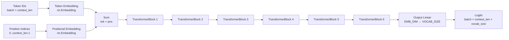

**Hyperparameters used throughout:**

| Hyperparameter | Value |
|----------------|-------|
| `VOCAB_SIZE` | 70 |
| `CONTEXT_LEN` | 6 |
| `EMB_DIM` | 24 |
| `BATCH_SIZE` | 4 |
| `EPOCHS` | 100 |

The training loop (standard cross-entropy loss with AdamW optimizer) ran until loss approached ~0.48. After training, inference with `generate("He reads")` produced `"He reads books and explores the"` and `generate("She composes")` produced `"She composes songs and practices piano"`.

---

### v3: Loading the Model — Inference Without Training Data

`v3.ipynb` demonstrates that once `vocab.json` and `parameters.bin` exist, you do not need the original training dataset at all. The notebook contains no `data` array.

**Step 1 — Reconstruct the architecture in Python (must match saved architecture exactly):**

```python
VOCAB_SIZE = 70
CONTEXT_LEN = 6
EMB_DIM = 24
model = GPTModel()
```

The architecture definition (`GPTModel`, `TransformerBlock`, `Attention`) must be present in the loading environment. The weights cannot be loaded into a different architecture.

**Step 2 — Load vocabulary:**

```python
save_dir = "models"
file_name = "vocab.json"
with open(os.path.join(save_dir, file_name)) as f:
    vocab = json.load(f)

id_to_word = {idx: word for idx, word in enumerate(vocab)}
word_to_id = {word: idx for idx, word in enumerate(vocab)}
```

**Step 3 — Load weights:**

```python
file_name = "parameters.bin"
model.load_state_dict(torch.load(os.path.join(save_dir, file_name)))
```

```console
<All keys matched successfully>
```

The `"All keys matched successfully"` message confirms that every parameter name in `parameters.bin` corresponds to a parameter in the current model definition, and vice versa. A mismatch (e.g., because the architecture was changed) would raise an error here.

**Step 4 — Switch to evaluation mode and generate:**

```python
_ = model.eval()

text = generate("He reads")
print("Generated text:", text)
# Generated text: He reads books and explores the

text = generate("She composes")
print("Generated text:", text)
# Generated text: She composes songs and practices piano
```

The output is identical to what v2 produced immediately after training — proof that all learned weights were correctly saved and restored.

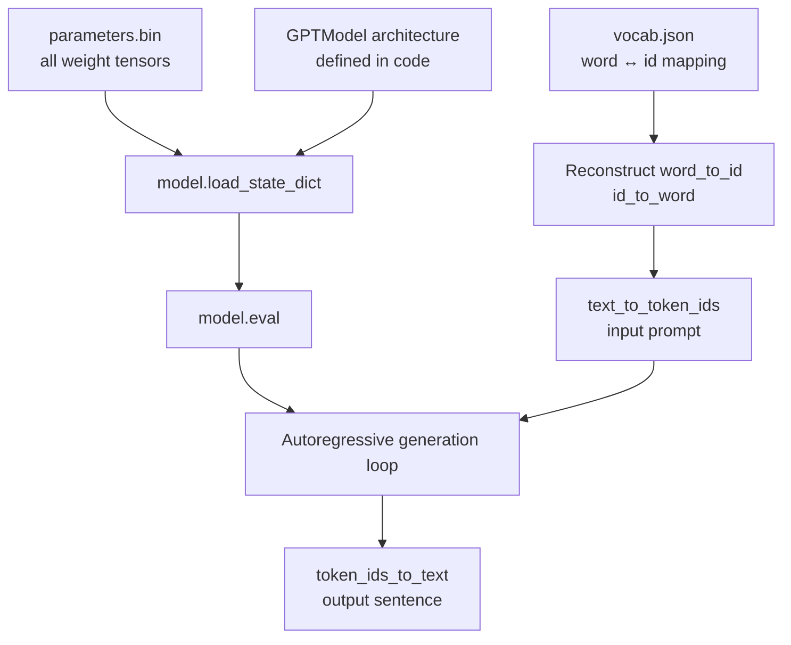

> [!info]+ Interview questions covered
> - How do you load a saved PyTorch model for inference?
> - What does `model.load_state_dict` do?
> - What does `model.eval()` do and why is it required before inference?
> - What three things does `model.py` (the production inference script) need at minimum?

---

### v4: Fine-Tuning — Adapting a Trained Model to New Data

Fine-tuning means taking an already-trained model (one that has learned general language patterns) and continuing to train it on a smaller, domain-specific dataset to shift its behavior.

**The intuition with a concrete example:**

The v1/v2 model was trained on 16 sentences where **"He reads"** and **"She composes"**. It learned this pattern strongly. In v4 the training set is inverted — only two sentences with **"He composes"** and **"She reads"**:

From `v4.ipynb`:

```python
data = [
    "He composes songs and practices piano daily.",
    "She reads books and explores the nearby caves."
]
```

After fine-tuning on this tiny reversed dataset (starting from the pre-trained weights), the model should update its behavior: prompting with `"He"` should now lead to a completion about *composing*, not *reading*. This demonstrates the core idea of fine-tuning: the pre-trained weights encode general knowledge; the fine-tuning data steers the model toward a specific behavior.

**The fine-tuning loading sequence in v4:**

```python
# 1. Load vocabulary from previously saved file (same vocab — no retraining from scratch)
file_name = "vocab.json"
with open(os.path.join(save_dir, file_name)) as f:
    vocab = json.load(f)

# 2. Instantiate the model and set up optimizer + loss
model = GPTModel()
optimizer = torch.optim.AdamW(model.parameters(), lr=0.0003, weight_decay=...)
loss_fn = nn.CrossEntropyLoss()

# 3. Load pre-trained weights
file_name = "parameters.bin"
model.load_state_dict(torch.load(os.path.join(save_dir, file_name)))

# 4. Continue training on new data
# (same train() loop as before, but on the new fine-tuning dataset)
```

```console
<All keys matched successfully>
```

The key observation: the `vocab.json` is **reused as-is** from the pre-training phase. The vocabulary does not change during fine-tuning. Only the weights shift. This is why the vocabulary must be saved separately from the weights.

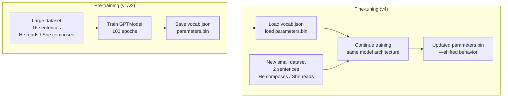

**Why fine-tuning rather than training from scratch?**

Training a large LLM from scratch requires enormous compute (think hundreds of GPUs, weeks of time). Companies like OpenAI train a base model once on the whole internet. Developers then fine-tune that base model on domain-specific data — for example, customer support conversations, medical records, or coding instructions — at a fraction of the cost. The base model already knows grammar, common sense, and general knowledge; fine-tuning only teaches it a new *style* or *domain*.

> [!info]+ Interview questions covered
> - What is fine-tuning in the context of LLMs?
> - How does fine-tuning differ from training from scratch?
> - What files do you need to fine-tune a model and why?
> - Can you fine-tune a model without the original training dataset?

---

### The GPT-2 Checkpoint Structure (Real-World Reference)

When you download the actual GPT-2 355M model (via `download.py` in this project), the `models/355M/` folder contains:

```
models/355M/
    checkpoint              ← points to the latest checkpoint
    encoder.json            ← BPE token-to-id mapping (≈50,000 tokens)
    hparams.json            ← architecture hyperparameters (n_layers, n_heads, etc.)
    model.ckpt.data-00000-of-00001   ← weight tensors (TensorFlow format)
    model.ckpt.index        ← index into the data file
    model.ckpt.meta         ← graph and variable metadata
    vocab.bpe               ← BPE merge rules
```

The correspondence to our custom model is:

| Our model | GPT-2 355M |
|-----------|-----------|
| `vocab.json` | `encoder.json` + `vocab.bpe` |
| `parameters.bin` | `model.ckpt.*` files |
| Architecture in `GPTModel` class | Architecture in `model.py` (355M param version) |

The checkpoint files (`model.ckpt.*`) are TensorFlow's format for splitting and indexing large weight tensors. Converting them to PyTorch format is done by `helper.py` / `download.py` in this project.

> [!info]+ Interview questions covered
> - What files does a GPT-2 model download consist of?
> - What is the purpose of `hparams.json` in a model distribution?
> - What is `encoder.json` in the GPT-2 release?

---

### Attention Weights and What Each Transformer Block Learns

From the v1 visualization (slide 006 — attention weight heatmaps across six transformer blocks):

The heatmaps used the sentence `"He reads books and explores the"` as input and showed attention patterns per block:

- **Blocks 1–3:** Syntactic patterns — adjacent word relationships, grammatical structure.
- **Block 4:** Broader context — longer-range dependencies across the sentence.
- **Block 5:** Global semantics — overall meaning of the sentence.
- **Block 6:** High-level meaning — the most abstract representation, used directly by the output layer to predict the next token.

This progressive abstraction is why stacking transformer blocks works: each block refines the representation passed by the previous one, and the output layer reads the final refined representation to produce logits over the vocabulary.

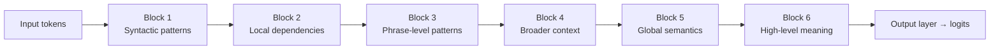

> [!info]+ Interview questions covered
> - What does each transformer block learn?
> - Why do LLMs stack multiple transformer layers?
> - What is causal (masked) self-attention?
> - What is a residual/skip connection and why is it used?

---

### Summary: The Three Key Artifacts

Every locally trained (or downloaded) LLM deployment requires exactly three things:

1. **The model architecture** — defined in Python code. `model.py` in this project is the production version. Without the architecture code, you cannot instantiate the `nn.Module` that will receive the weights.

2. **`vocab.json` (or equivalent)** — the word/token-to-integer mapping. Required to convert input text into token IDs before inference, and to convert output token IDs back to text.

3. **`parameters.bin` (or equivalent checkpoint)** — the learned weights. These are what make the model *this specific model* rather than a randomly initialized one.

The training dataset is **not** required at inference time. After training completes and the two files are saved, you can delete the dataset from memory and the model remains fully functional.

This three-part structure directly mirrors production LLM deployments: a serving system loads a model definition, loads vocabulary artifacts, and loads checkpoint weights — then serves inference requests without ever needing the training corpus again.


## Fine-Tuning, Weight Updates, `updated-parameters.bin`, and Transfer Learning

**Lecture timestamp:** 13:35 – 16:37

This section picks up immediately after the base model (`parameters.bin`) has been saved. The model is now loaded back from disk, but this time the goal is not fresh training — it is *fine-tuning*: adapting an already-trained model to a new, narrower task without starting from scratch.

---

### Why Fine-Tune Instead of Re-Train?

Before looking at the code, consider the practical motivation.

Suppose you have a general-purpose language model that understands English grammar, sentence structure, and vocabulary perfectly well — but when you ask it to write Python code, it produces garbage. The model *understands* your request (it knows English), but it cannot generate the right output format (code).

The expensive alternative is to retrain the entire model from zero on a new, code-heavy dataset. Retraining large models from scratch can cost hundreds of millions of dollars in compute. That option is simply not available to most teams.

Fine-tuning offers a cheaper, faster path: take the pre-trained weights — which already encode language understanding — and continue training for a small number of additional steps on a small, domain-specific dataset. The model's existing knowledge serves as the starting point; only the parameters that need to shift for the new task are updated through the normal backpropagation cycle.

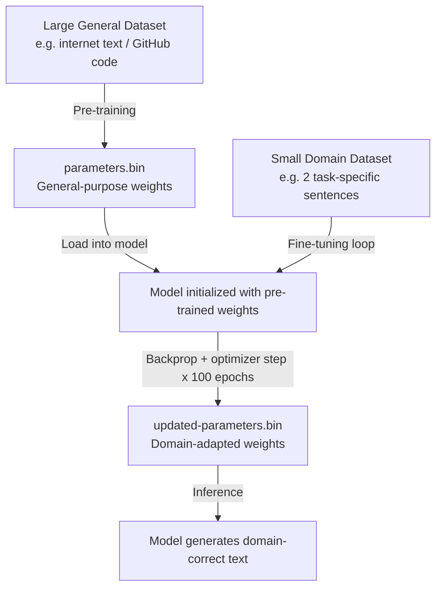

> [!info]+ Interview questions covered
> - What is fine-tuning in the context of LLMs?
> - Why do we fine-tune instead of training from scratch?
> - What changes in a model during fine-tuning?

---

### The Training Loop Is the Same

A common misconception is that fine-tuning requires a different kind of training loop. It does not. The exact same `train()` function used in pre-training is reused:

From `v4.ipynb` shown in VS Code (slide 64):

```python
def train(dataloader, model, loss_fn, optimizer):
    size = len(dataloader.dataset)
    model.train()
    for batch, (X, y) in enumerate(dataloader):

        logits = model(X)
        loss = loss_fn(logits.flatten(0, 1), y.flatten())

        loss.backward()
        optimizer.step()
        optimizer.zero_grad()

        print(f"batch: {batch + 1} loss: {loss:>7f}")
```

What changes between pre-training and fine-tuning is **not the code** — it is:

1. **The model's starting weights** — loaded from `parameters.bin` instead of being randomly initialized to zeros.
2. **The dataset** — a small, task-specific set instead of the broad original corpus.

Everything else — forward pass, loss computation (`loss_fn`), backward pass (`loss.backward()`), optimizer step (`optimizer.step()`), and gradient zeroing (`optimizer.zero_grad()`) — is identical.

---

### What the Fine-Tuning Dataset Looks Like

The original pre-training corpus (`v1.ipynb`) had 16 sentences, teaching the model patterns like "She composes..." and "He reads...":

From `v1.ipynb` (slides 69, 71, 72):

```python
data = [
  "She composes songs and practices piano daily.",
  "He reads books and explores the nearby caves.",
  "He reads novel and climbs mountains every weekend.",
  "She composes songs and writes novels.",
  "He reads newspaper and solves complex puzzles.",
  "She composes music and organizes exhibitions regularly.",
  "He reads books and builds small wooden models.",
  "He reads books and participates in local science fairs.",
  "She composes songs and curates art projects.",
  "She composes tunes and designs jewelry for her friends.",
  "He reads everyday and documents wildlife photography trips.",
  "She composes harmonies and experiments with digital music.",
  "He reads novel and trains for local marathons.",
  "She composes soundtracks and collaborates with creative filmmakers.",
  "He reads newspaper and studies navigation using maps and stars.",
  "She composes rhythms and teaches music."
]
```

The fine-tuning dataset in `v4.ipynb` contains just **2 sentences**, with the subject-verb assignments swapped:

From `v4.ipynb` Fine-Tuning section (slides 67, 68):

```python
data = [
  "He composes songs and practices piano daily.",
  "She reads books and explores the nearby caves."
]

VOCAB_SIZE = 70
CONTEXT_LEN = 6
EMB_DIM = 24
BATCH_SIZE = 4
EPOCHS = 100
```

The model trained on the large corpus had learned "She composes" and "He reads" as dominant patterns. Fine-tuning on two reversed sentences teaches it the new task-specific pattern.

This deliberate contrast makes a key point about transfer learning: the model does not need to relearn English, grammar, or sentence structure from the new data. It already has that from pre-training. The fine-tuning data only needs to teach it the *task-specific mapping*.

> [!info]+ Interview questions covered
> - What is transfer learning in LLMs?
> - How much data do you need for fine-tuning?
> - What is domain adaptation?

---

### Running the Fine-Tuning Loop

The epoch loop is unchanged:

From `v4.ipynb` (slide 65):

```python
for epoch in range(EPOCHS):
    print("------------------------------")
    print(f"Epoch: {epoch+1}")
    train(train_dataloader, model, loss_fn, optimizer)
    print("------------------------------")
print("Done!")
```

The model does **not** start from zero. It starts from the weights loaded from `parameters.bin`. Because those weights already encode meaningful language representations, the loss starts relatively high but converges much faster than it would from random initialization.

Observed training output (from slide 65):

```console
Epoch: 1
batch: 1 loss: 3.807468
...
Epoch: 100
batch: 1 loss: 0.030035
Done!
```

The loss drops from ~3.8 to ~0.03 across 100 epochs. Starting from pre-trained weights means the optimizer is already operating in a useful region of parameter space — it does not have to first learn what a sentence is before learning what the task requires.

---

### What "Weight Updates" Means Concretely

After fine-tuning, the model's internal weights are different from what they were after pre-training. Every parameter tensor in the model — embedding weights, attention matrices, linear layer weights, biases — has been slightly (or significantly) shifted by the 100 epochs of gradient descent on the new data.

To use a concrete example: a weight value that was `2.03` in `parameters.bin` might become `3.42` in the fine-tuned model. The number changed because the gradient flowing back from the new loss signal pushed it in a new direction. Across millions of such parameters, these shifts collectively encode the new task.

The weights that were most responsible for predicting "She composes" following "He" (a pattern learned during pre-training) are now adjusted to instead predict "He composes". This happens without re-learning token embeddings, positional encodings, or language structure from scratch.

> [!info]+ Interview questions covered
> - What happens to model weights during fine-tuning?
> - How does fine-tuning differ from pre-training in terms of parameter updates?

---

### Saving the Fine-Tuned Weights: `updated-parameters.bin`

After fine-tuning is complete, the model's new weights are saved to a separate file so they are not confused with the original pre-trained weights:

From `v4.ipynb` generation and save section (slides 66, 70):

```python
text = generate("He composes")
print("Generated text:", text)
```

Output:
```console
Generated text: He composes songs and practices piano
```

```python
text = generate("She reads")
print("Generated text:", text)
```

Output:
```console
Generated text: She reads books and explores the
```

The model now correctly predicts the fine-tuned patterns. The weights are then persisted:

```python
file_name = "updated-parameters.bin"
os.makedirs(save_dir, exist_ok=True)
torch.save(model.state_dict(), os.path.join(save_dir, file_name))
```

`model.state_dict()` returns a Python dictionary mapping each named parameter (e.g., `"embedding.weight"`, `"linear.weight"`) to its current tensor value. `torch.save()` serializes this dictionary to disk as a binary `.bin` file.

The naming convention makes the lifecycle explicit:

| File | Contents | Origin |
|---|---|---|
| `parameters.bin` | Original pre-trained weights | Saved after training on the 16-sentence corpus |
| `updated-parameters.bin` | Fine-tuned weights | Saved after fine-tuning on the 2-sentence corpus |

The two files have the exact same structure (same keys in `state_dict`), but different numerical values at every parameter position.

> [!info]+ Interview questions covered
> - What is `model.state_dict()` and what does it contain?
> - How do you save and load a fine-tuned model in PyTorch?
> - What is the difference between `parameters.bin` and `updated-parameters.bin`?

---

### Transfer Learning: Why Fine-Tuning Works

The reason fine-tuning on just 2 sentences is effective is the same reason a person who already speaks English can read a technical chemistry textbook with much less effort than someone learning English at the same time.

The pre-training phase taught the model:
- **Token-level patterns** — which tokens tend to follow which.
- **Syntactic structure** — subject-verb-object relationships, noun phrases, etc.
- **Semantic associations** — what words tend to co-occur across contexts.

All of this knowledge is encoded in the weights saved in `parameters.bin`. When fine-tuning begins, this knowledge is immediately available. The fine-tuning data only needs to redirect task-specific behavior — the subject-verb reversals in this toy example, or coding syntax patterns in a real-world scenario.

This principle is called **transfer learning**: knowledge acquired during one training task is transferred and applied to a different but related task, dramatically reducing the data and compute required for the second task.

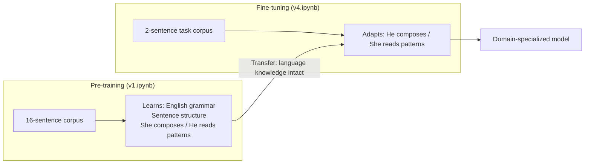

The original dataset contained many rich sentences — "climbs mountains every weekend", "documents wildlife photography trips", "collaborates with creative filmmakers" — all of which built up the model's general language understanding. Fine-tuning does not erase this; it builds on it.

> [!info]+ Interview questions covered
> - What is transfer learning?
> - Why does fine-tuning work with very little data?
> - What knowledge is preserved during fine-tuning and what changes?

---

### Full Flow Summary

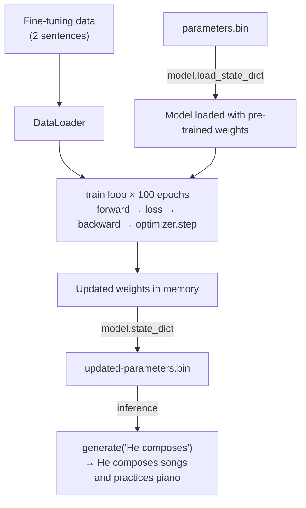

The key insight of this section: **fine-tuning is not a different algorithm** — it is the same training loop applied to a pre-loaded model on a smaller dataset. What makes it powerful is that the starting weights are already meaningful, so each gradient step moves the model toward the new task rather than spending most of its budget learning the basics of language.


## Fine-Tuning, Weight Updates, Weight Replacement, Parameter Counting, Model Size

**Lecture timestamp:** 16:37 – 20:15

---

### What Is Fine-Tuning and Why Do We Need It?

At this stage in the project, the model has been trained on a general corpus, saved to disk (v2), and reloaded (v3). The question becomes: what do you do when a general-purpose LLM is not specialized enough for your specific use case?

The answer is fine-tuning. Think of it this way: if you already know English well, you can pick up a chemistry textbook and read it, even if you have never studied chemistry before. Your prior knowledge of the language — grammar, sentence structure, vocabulary relationships — allows you to absorb the new domain. But if you tried to read that chemistry book without knowing English at all, you would not get far.

The same principle applies to LLMs. A model pre-trained on large general text has already absorbed the structure of English: how sentences are constructed, how subjects and objects relate, how words follow one another. Fine-tuning leverages that acquired knowledge and then trains the model further on a small, domain-specific dataset to specialize it for a particular task.

Fine-tuning is not starting over. It is additional training on new data, starting from the weights the model already has.

> [!info]+ Interview questions covered
> - What is fine-tuning in the context of LLMs?
> - Why is fine-tuning preferred over training from scratch for a new domain?
> - What is the difference between pre-training and fine-tuning?

---

### The Project Roadmap: Where v4 Fits

The `llm-from-scratch` project progresses through the following versions:

```
# llm-from-scratch

LLM from Scratch

- dummy: Dummy Model: Tokenization + Basic Linear Model
- v0: Add: Embeddings, and Linear Output Layer
- v1: Add: Transformer with Attention Layer
- v2: Save Model
- v3: Load Model
- v4: Fine-Tuning

Final LLM

- model.py
```

The full workflow is therefore:
1. Train the model (dummy → v0 → v1)
2. Save the model (v2)
3. Load the model (v3)
4. Fine-tune the model on a new, targeted dataset (v4)

Fine-tuning is always the last step, performed on top of a saved, pre-trained model.

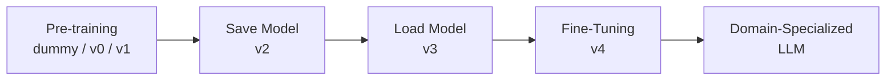

---

### The Fine-Tuning Notebook: v4.ipynb

From `v4.ipynb` shown in VS Code:

```python
data = [
  "He composes songs and practices piano daily.",
  "She reads books and explores the nearby caves."
]

VOCAB_SIZE = 70
CONTEXT_LEN = 6
EMB_DIM = 24
BATCH_SIZE = 4
EPOCHS = 100
```

The fine-tuning dataset here is intentionally tiny — just two sentences. This is the point: fine-tuning does not require a massive dataset. It requires a targeted one. The hyperparameters (`VOCAB_SIZE`, `CONTEXT_LEN`, `EMB_DIM`, `BATCH_SIZE`, `EPOCHS`) are structurally identical to those used during pre-training, and that is not a coincidence.

---

### Weight Replacement vs. Weight Addition

A natural question at this stage is: when fine-tuning updates the model, are the old weights being replaced, or are new weights being added on top?

The answer is **replacement**. Fine-tuning runs the same gradient descent loop on the new data and updates the values of the existing weight tensors in place. No new weight slots are created. The model's architecture — the shape of every matrix — stays exactly the same.

This is the critical insight: the **parameter count does not change during fine-tuning**.

Why? Because:
- The model architecture (number of layers, attention heads, embedding dimension) is fixed.
- Fine-tuning does not add parameters; it updates the values of the parameters that already exist.
- No quantization is applied during this process.

The weight *values* shift to encode the new domain knowledge; the weight *structure* does not change at all.

| Property | Before Fine-Tuning | After Fine-Tuning |
|---|---|---|
| Number of parameters | N | N (unchanged) |
| Weight values | Pre-trained on general data | Updated toward new domain |
| Model architecture | Fixed | Fixed (identical) |
| Model file size | S bytes | S bytes (same magnitude) |

> [!info]+ Interview questions covered
> - Does fine-tuning change the number of parameters in an LLM?
> - What happens to the model's weights during fine-tuning — are they replaced or added to?
> - Does fine-tuning change model size?
> - What is weight replacement in the context of fine-tuning?

---

### Domain-Specific Fine-Tuning: The Legal Document Example

Consider a concrete real-world scenario. A legal services company wants to build a chatbot that can accurately answer questions about their proprietary legal documents — contracts, GST filings, regulatory guidelines.

A general-purpose LLM trained on public internet text has learned:
- English grammar and sentence structure
- Common factual knowledge
- How to follow conversational patterns

But it has **not** learned:
- The company's internal document structure
- Domain-specific legal terminologies
- The specific facts inside those private documents (which were never publicly available)

The LLM cannot answer legal questions about private documents because it has never seen them. The answers are simply not encoded in its weights.

The solution is to fine-tune the pre-trained model on the company's proprietary legal dataset. The model already knows English, so fine-tuning teaches it legal terminologies and document patterns on top of that foundation. The result is a specialized model that retains general language competence but gains deep knowledge of the specific domain.

This is also why you could **not** successfully fine-tune a model that knows nothing of English at all — just as you cannot read a chemistry textbook if you have not learned the language it is written in.

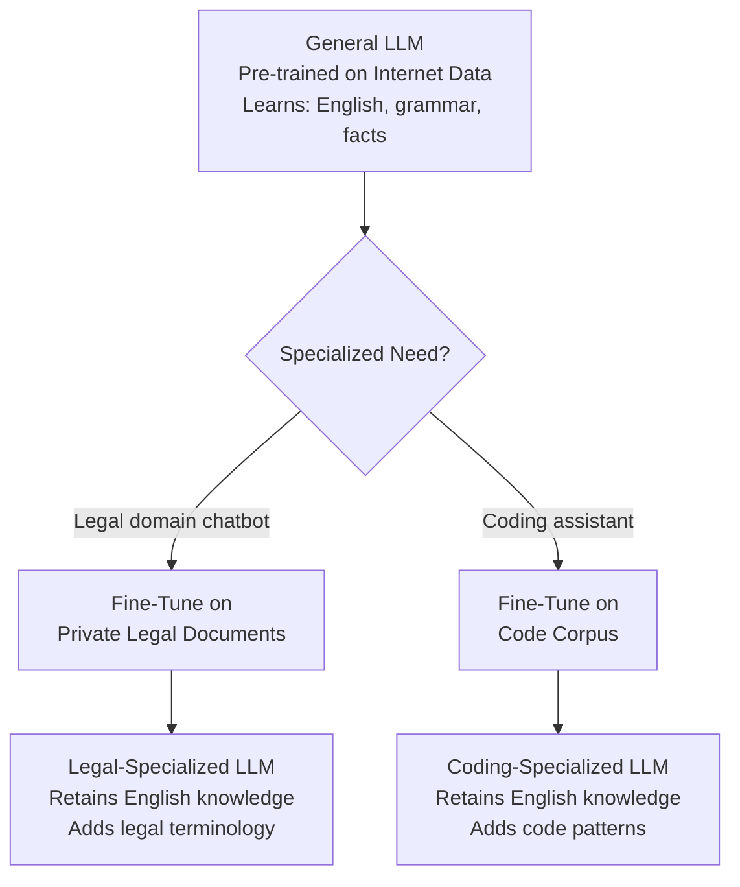

> [!info]+ Interview questions covered
> - What is domain-specific fine-tuning?
> - Why can't a general LLM answer questions about a company's private documents?
> - How does fine-tuning on proprietary data work?
> - Can fine-tuning add knowledge that was not in the pre-training data?

---

### What Gets Updated During Fine-Tuning?

The original pre-training data for this lecture's model (in `v1.ipynb`) consists of 16 sentences following alternating "She composes" and "He reads" patterns:

```python
data = [
  "She composes songs and practices piano daily.",
  "He reads books and explores the nearby caves.",
  "He reads novel and climbs mountains every weekend.",
  "She composes songs and writes novels.",
  "He reads newspaper and solves complex puzzles.",
  "She composes music and organizes exhibitions regularly.",
  "He reads books and builds small wooden models.",
  "He reads books and participates in local science fairs.",
  "She composes songs and curates art projects.",
  "She composes tunes and designs jewelry for her friends.",
  "He reads everyday and documents wildlife photography trips.",
  "She composes harmonies and experiments with digital music.",
  "He reads novel and trains for local marathons.",
  "She composes soundtracks and collaborates with creative filmmakers.",
  "He reads newspaper and studies navigation using maps and stars.",
  "She composes rhythms and teaches music."
]
```

When fine-tuning runs on just the two new sentences in `v4.ipynb`, the gradient descent updates only those weights that are relevant to the new patterns being learned. It does not blindly update every single weight. The weights that encode the existing "She composes / He reads" patterns already stored from v1 training will shift slightly toward accommodating the new data.

The key point that a student surfaced in class is worth stating explicitly: fine-tuning on two sentences does not mean only two weights change, nor does it mean the entire model is retrained from scratch. It means gradient descent runs on the new data, computes loss, and nudges the relevant weights in the direction that reduces that loss. The parameter count remains the same throughout.

Fine-tuning on a small dataset is sufficient to shift the model's behavior for the patterns it covers. Even two sentences can be enough to meaningfully update the model's predictions for those specific patterns — because the model already has the underlying English scaffold in place.

> [!info]+ Interview questions covered
> - During fine-tuning, does gradient descent update all weights or only some?
> - How many training examples does fine-tuning require?
> - What is the relationship between fine-tuning dataset size and the resulting weight updates?
> - Does fine-tuning on new sentences overwrite knowledge from the original training data?

---

### Parameter Counting and Model Size: Key Invariants

Summarizing the critical invariants to remember:

- **Parameter count** = total number of learnable scalar values across all weight matrices and bias vectors. This is determined entirely by the model architecture (embedding dimension, number of layers, vocabulary size, attention heads, etc.).

- **Fine-tuning does not change the architecture.** Therefore, parameter count stays constant. A "7B" model is still a 7B-parameter model after fine-tuning.

- **Model file size** is approximately proportional to `num_parameters × bytes_per_parameter`. Since fine-tuning neither adds nor removes parameters and does not change the data type (no quantization in standard fine-tuning), the file size stays in the same range.

- **Weight values** change. That is exactly the point of fine-tuning. But the positions and count of those weights do not.

This is a common source of confusion: people hear that a model was "fine-tuned on medical data" and wonder if it became larger. It did not. The numerical values inside the existing weight tensors were updated, and the resulting model file is essentially the same size as the original.

| Term | Meaning |
|---|---|
| Pre-training | Initial training on large general corpus from random initialization |
| Fine-tuning | Additional training on smaller domain-specific corpus starting from pre-trained weights |
| Weight update | Changing the numerical value of an existing parameter via gradient descent |
| Weight replacement | Fine-tuning replaces old weight values with new ones; no new parameters are created |
| Parameter count | Fixed by architecture; invariant across pre-training and fine-tuning |
| Model size | Approximately fixed; fine-tuning does not meaningfully change it |

> [!info]+ Interview questions covered
> - What determines the parameter count of an LLM?
> - Does fine-tuning increase the size of a model?
> - What is the difference between pre-training weights and fine-tuned weights?
> - If a model has 7 billion parameters before fine-tuning, how many does it have after?


## GPT-2, Multi-Head Attention, Dropout, Layer Normalization, Transformer

**Section timestamps:** 20:15 – 34:07
**Key concepts:** GPT-2 model architecture, `MultiHeadAttention`, `LayerNorm`, `nn.Dropout`, `FeedForward`, `TransformerBlock`, `GPTModel`, fine-tuning vs. RAG, text generation

---

### Fine-Tuning vs. RAG — When to Choose Which

The section opens with a discussion triggered by the training dataset seen in `v1.ipynb`. The dataset is a list of sentences centered on "he" and "she" activities — a deliberately tiny corpus used to expose the fundamental choice between fine-tuning and RAG (Retrieval-Augmented Generation).

The key decision criterion is whether the knowledge the model needs changes frequently:

- **Use RAG** when documents arrive dynamically at runtime (e.g., a user uploading a new PDF each session). Fine-tuning each time would be prohibitively expensive — both in compute time and cost (fine-tuning can cost roughly $0.5M on top of the base training cost when scaled to real models). RAG retrieves relevant content at inference and injects it as context.
- **Use fine-tuning** when the knowledge domain is stable and the user will not interact with the raw documents directly. For example, adapting a general model to answer questions about a fixed legal corpus. Open-source pre-trained models are available (e.g., on Hugging Face), so there is no need to train from scratch — fine-tuning those weights is sufficient.

The transition point: once the base model has learned the general structure of a language (in this case, English), adding domain-specific behavior through fine-tuning over that foundation is a far more efficient path than retraining everything.

> [!info]+ Interview questions covered
> - When should you use RAG vs. fine-tuning?
> - What are the cost trade-offs of fine-tuning vs. RAG?
> - Do you need to retrain a model from scratch to adapt it to a new domain?

---

### GPT-2: Model Variants and Configuration

From `v1.ipynb`, the session now pivots to `model.py`, which implements the actual GPT-2 architecture. GPT-2 was released by OpenAI in multiple sizes. The codebase supports two:

| Variant | Parameters | Heads (`NUM_HEAD`) | Layers (`NUM_LAYER`) | Embedding Dim (`EMB_DIM`) |
|---|---|---|---|---|
| 124M (Small) | ~124 million | 12 | 12 | 768 |
| 355M (Medium) | ~355 million | 16 | 24 | 1024 |

Both variants share:
- `VOCAB_SIZE = 50257`
- `CONTEXT_LEN = 1024`
- `DROP_RATE = 0.1`
- `QKV_BIAS = True`

From `model.py` shown in VS Code (slide 82):

```python
import os
import torch
import torch.nn as nn
import torch.nn.functional as F
import tiktoken

from helper import debug_parameters, get_settings_and_params, load_weights_in...

# MODEL_NAME = "124M"
MODEL_NAME = "355M"
MODEL_DIR = os.path.join(os.path.join("models", MODEL_NAME))

if MODEL_NAME == "124M":
    VOCAB_SIZE = 50257
    CONTEXT_LEN = 1024
    NUM_HEAD = 12
    NUM_LAYER = 12
    EMB_DIM = 768
    DROP_RATE = 0.1
    QKV_BIAS = True
```

Key clarification: the number 1024 appears in two places and refers to two different things:
- `CONTEXT_LEN = 1024` — the maximum number of tokens the model can consume at once (the "window" size).
- `EMB_DIM = 1024` — the vector dimension of each token's embedding in the 355M model.

The `tiktoken` library is what GPT-2 uses internally as its tokenizer, implementing Byte Pair Encoding (BPE). The tokenizer files (`vocab.bpe`, `encoder.json`) are distributed alongside the model checkpoint files.

> [!info]+ Interview questions covered
> - What are the GPT-2 model sizes and their configurations?
> - What is the context length (context window) in GPT-2?
> - What tokenizer does GPT-2 use?

---

### Multi-Head Attention — Class Structure and `__init__`

The `MultiHeadAttention` class is the core of each transformer layer. Understanding it requires seeing two parts: how the weight matrices are initialised and how they are applied in the forward pass.

From `model.py` (slides 83–84):

```python
class MultiHeadAttention(nn.Module):
    def __init__(self, d_in, d_out,
                 CONTEXT_LEN, dropout, num_heads, qkv_bias=False):
        super().__init__()

        self.d_out = d_out
        self.num_heads = num_heads
        self.head_dim = d_out // num_heads
        self.W_query = nn.Linear(d_in, d_out, bias=qkv_bias)
        self.W_key   = nn.Linear(d_in, d_out, bias=qkv_bias)
        self.W_value = nn.Linear(d_in, d_out, bias=qkv_bias)
        self.out_proj = nn.Linear(d_out, d_out)
        self.dropout = nn.Dropout(dropout)
        self.register_buffer(
            "mask",
            torch.triu(torch.ones(CONTEXT_LEN, CONTEXT_LEN), diagonal=1)
        )
```

**Design decisions explained:**

- **Three separate linear projections** (`W_query`, `W_key`, `W_value`): Each input token vector $x$ is projected into three different spaces — query, key, and value — each of dimension `d_out`. The projections are learnable weight matrices.
- **`head_dim = d_out // num_heads`**: The full embedding dimension is carved up equally across heads. For the 355M model: $1024 \div 16 = 64$ dimensions per head.
- **`qkv_bias`**: GPT-2 uses `QKV_BIAS = True`. Earlier experiments (including the lecture's own V1 codebase) omitted bias, but GPT-2 includes it. Modern models have established empirically that bias in the Q/K/V projections is not strictly necessary, but GPT-2 was designed with it.
- **`out_proj`**: After the 16 heads each produce a partial context vector, they are concatenated and then passed through this final linear layer to project back to `d_out` dimension.
- **`register_buffer("mask", ...)`**: The causal mask is not a trainable parameter — it is a fixed upper-triangular matrix of ones. `register_buffer` stores it alongside the module so it moves to the right device automatically and is included in state_dict but not updated by the optimizer. The mask enforces that position $i$ can only attend to positions $\leq i$ (no future token leakage).

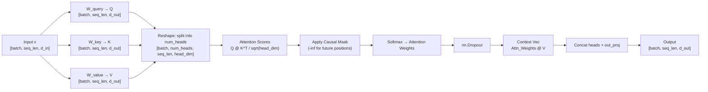

> [!info]+ Interview questions covered
> - What are Query, Key, and Value in attention?
> - What is the causal mask and why is it needed in a decoder-only model?
> - Why is `register_buffer` used for the attention mask instead of `nn.Parameter`?
> - What is `head_dim` and how is it computed from `d_out` and `num_heads`?

---

### Multi-Head Attention — Forward Pass

The forward method carries out the full attention computation (slide 85):

```python
    def forward(self, x):
        b, num_tokens, _ = x.shape
        keys    = self.W_key(x)
        queries = self.W_query(x)
        values  = self.W_value(x)

        keys    = keys.view(b, num_tokens, self.num_heads, self.head_dim)
        values  = values.view(b, num_tokens, self.num_heads, self.head_dim)
        queries = queries.view(b, num_tokens, self.num_heads, self.head_dim)

        keys    = keys.transpose(1, 2)
        queries = queries.transpose(1, 2)
        values  = values.transpose(1, 2)

        attn_scores = queries @ keys.transpose(2, 3)
        mask_bool = self.mask.bool()[:num_tokens, :num_tokens]

        attn_scores.masked_fill_(mask_bool, -torch.inf)

        attn_weights = torch.softmax(attn_scores / keys.shape[-1]**0.5, dim=-1)
        attn_weights = self.dropout(attn_weights)

        context_vec = (attn_weights @ values).transpose(1, 2)
        context_vec = context_vec.contiguous().view(b, num_tokens, self.d_out)
        context_vec = self.out_proj(context_vec)
        return context_vec
```

**Step-by-step walkthrough:**

1. **Project**: Each token in the sequence gets projected to Q, K, V via the three linear layers (shape: `[batch, seq_len, d_out]`).
2. **Reshape for multi-head**: `.view(b, num_tokens, num_heads, head_dim)` splits the `d_out` dimension into `num_heads` slices of `head_dim` each.
3. **Transpose**: After `.transpose(1, 2)` the shape becomes `[batch, num_heads, seq_len, head_dim]`. This rearrangement allows the batch matrix multiplication in step 4 to compute all heads in parallel.
4. **Attention scores**: `queries @ keys.transpose(2, 3)` yields `[batch, num_heads, seq_len, seq_len]` — each row is a token's similarity to every other token, per head.
5. **Causal masking**: The upper-triangular mask is applied with `masked_fill_`, replacing future-position scores with $-\infty$ so that softmax produces zero weight for those positions.
6. **Scaled softmax**: Divide by $\sqrt{\text{head\_dim}}$ before softmax to keep the dot products from growing too large and pushing softmax into saturation. This is the standard scaled dot-product attention:
$$\text{Attention}(Q,K,V) = \text{softmax}\!\left(\frac{QK^T}{\sqrt{d_k}}\right)V$$
7. **Dropout on attention weights**: Applied during training only (turned off at inference via `model.eval()`). This randomly zeroes some attention weight entries, preventing the model from over-relying on any single attention path.
8. **Weighted sum of values**: `attn_weights @ values` produces the context vector — a learned blend of all value vectors, weighted by relevance.
9. **Reshape and project**: Transpose back, call `.contiguous()` to ensure memory layout is correct before `.view()`, then pass through `out_proj` to mix information across heads.

> [!info]+ Interview questions covered
> - What is scaled dot-product attention?
> - Why do we divide by the square root of the head dimension?
> - How does dropout regularize attention?
> - How is multi-head attention implemented without separate Q/K/V loops per head?

---

### Layer Normalization

Immediately after `MultiHeadAttention` in `model.py` comes `LayerNorm` (slides 86–87):

```python
class LayerNorm(nn.Module):
    def __init__(self, emb_dim):
        super().__init__()
        self.eps = 1e-5
        self.scale = nn.Parameter(torch.ones(emb_dim))
        self.shift = nn.Parameter(torch.zeros(emb_dim))

    def forward(self, x):
        mean = x.mean(dim=-1, keepdim=True)
        var  = x.var(dim=-1, keepdim=True, unbiased=False)
        norm_x = (x - mean) / torch.sqrt(var + self.eps)
        return self.scale * norm_x + self.shift
```

**Why normalization is needed**: Activations flowing through deep networks can grow or shrink dramatically. Unbounded activations make gradient descent unstable — the gradients themselves become very large or very small. Normalization keeps activations in a stable range at each layer, enabling reliable training.

**Layer norm vs. batch norm**: Batch normalization normalizes across the batch dimension; layer normalization normalizes across the feature dimension (here, `emb_dim`) for each token independently. For sequential/language models, layer norm is preferred because the statistics at each position are computed from that position's own vector — there is no dependence on batch size, which would be problematic for autoregressive generation (batch size is 1 at inference).

**The formula**:
$$\hat{x}_i = \frac{x_i - \mu}{\sqrt{\sigma^2 + \epsilon}}$$
$$y_i = \gamma \hat{x}_i + \beta$$

- $\mu$ and $\sigma^2$ are computed per token across the embedding dimension.
- $\epsilon = 10^{-5}$ prevents division by zero.
- $\gamma$ (`scale`) and $\beta$ (`shift`) are learnable parameters initialized to ones and zeros respectively. They allow the model to "undo" normalization if that helps — effectively learning the best scale and offset for each dimension.

In the GPT-2 weight breakdown (from the LLM visualizer slide):
```
LayerNorm 1: scale[1024] + shift[1024] = 2,048 parameters
LayerNorm 2: scale[1024] + shift[1024] = 2,048 parameters
```
There are two layer norm instances per transformer block (one before attention, one before the feed-forward sub-layer). This is the "pre-norm" design used by GPT-2.

> [!info]+ Interview questions covered
> - What is layer normalization and why is it used in transformers?
> - How does layer normalization differ from batch normalization?
> - What are the learnable parameters in LayerNorm?
> - Why is `eps` added inside the square root in layer norm?

---

### GELU Activation Function

The `FeedForward` sub-module uses a `GELU` activation (slide 87):

```python
class GELU(nn.Module):
    def forward(self, x):
        return 0.5 * x * (1 + torch.tanh(
            torch.sqrt(torch.tensor(2.0 / torch.pi)) *
            (x + 0.044715 * torch.pow(x, 3))
        ))
```

GELU (Gaussian Error Linear Unit) is an advanced activation function — an improvement over the classic ReLU. Where ReLU hard-clips all negative values to zero, GELU applies a smooth, probabilistic gate: it allows small negative values through proportional to how likely the value is to be positive under a Gaussian distribution. This smoothness makes gradients more stable and often leads to better training performance in transformer models.

> [!info]+ Interview questions covered
> - What is GELU and how does it differ from ReLU?
> - Why do transformers use GELU instead of ReLU?

---

### FeedForward Sub-Module

The feed-forward network (FFN) is applied position-wise after the attention sub-layer (slide 88):

```python
class FeedForward(nn.Module):
    def __init__(self):
        super().__init__()
        self.layers = nn.Sequential(
            nn.Linear(EMB_DIM, 4 * EMB_DIM),
            GELU(),
            nn.Linear(4 * EMB_DIM, EMB_DIM),
        )

    def forward(self, x):
        return self.layers(x)
```

The FFN first projects to a 4x larger hidden dimension (`4 * EMB_DIM = 4096` for the 355M model), applies GELU, then projects back down. This expansion-then-contraction pattern is standard in transformers: the wider intermediate layer gives the network capacity to perform complex per-token transformations. From the LLM visualizer:
- FF Linear 1: `[1024 × 4096]` = 4,198,400 parameters
- FF Linear 2: `[4096 × 1024]` = 4,198,400 parameters (plus biases)

---

### TransformerBlock — Residual Connections and Pre-Norm Design

The `TransformerBlock` class assembles all the pieces (slides 89–90):

```python
class TransformerBlock(nn.Module):
    def __init__(self):
        super().__init__()
        self.att = MultiHeadAttention(
            d_in=EMB_DIM,
            d_out=EMB_DIM,
            CONTEXT_LEN=CONTEXT_LEN,
            num_heads=NUM_HEAD,
            dropout=DROP_RATE,
            qkv_bias=QKV_BIAS)
        self.ff = FeedForward()
        self.norm1 = LayerNorm(EMB_DIM)
        self.norm2 = LayerNorm(EMB_DIM)
        self.drop_shortcut = nn.Dropout(DROP_RATE)

    def forward(self, x):
        # Attention sub-block with residual connection
        shortcut = x
        x = self.norm1(x)
        x = self.att(x)
        x = self.drop_shortcut(x)
        x = x + shortcut

        # Feed-forward sub-block with residual connection
        shortcut = x
        x = self.norm2(x)
        x = self.ff(x)
        x = self.drop_shortcut(x)
        x = x + shortcut
        return x
```

**Pre-norm design**: The layer norm (`norm1`, `norm2`) is applied _before_ the attention and feed-forward operations, not after. This is called "pre-norm" and is what GPT-2 uses. The original "Attention Is All You Need" paper used post-norm. Pre-norm tends to be more stable in training for very deep networks.

**Residual (shortcut) connections**: `x = x + shortcut` adds the sub-block's input back to its output. This serves two critical purposes:
1. **Gradient flow**: Gradients can bypass sub-layers and flow directly back through the addition operation — this prevents vanishing gradients in deep networks (GPT-2 355M has 24 transformer blocks stacked).
2. **Information preservation**: Even if an attention or feed-forward sub-layer produces a poor transformation early in training, the residual path preserves the original signal.

**Dropout placement**: `drop_shortcut` applies dropout after the sub-layer's transformation and _before_ the residual addition. This regularizes the contribution of each sub-block during training.

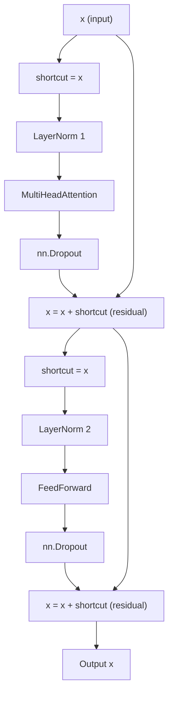

> [!info]+ Interview questions covered
> - What is a residual (skip) connection and why is it important?
> - What is the pre-norm vs. post-norm design in transformers?
> - Where is dropout applied in a transformer block?
> - How does GPT-2's transformer block structure compare to the original "Attention Is All You Need" paper?

---

### GPTModel — Putting It All Together

The `GPTModel` class is the full decoder-only transformer (slides 91–92):

```python
class GPTModel(nn.Module):
    def __init__(self):
        super().__init__()
        self.tok_emb  = nn.Embedding(VOCAB_SIZE, EMB_DIM)
        self.pos_emb  = nn.Embedding(CONTEXT_LEN, EMB_DIM)
        self.drop_emb = nn.Dropout(DROP_RATE)

        self.trf_blocks = nn.Sequential(
            *[TransformerBlock() for _ in range(NUM_LAYER)])

        self.final_norm = LayerNorm(EMB_DIM)
        self.out_head   = nn.Linear(EMB_DIM, VOCAB_SIZE, bias=False)

        self.out_head.weight = self.tok_emb.weight  # weight tying

    def forward(self, in_idx):
        _, seq_len = in_idx.shape
        tok_embeds = self.tok_emb(in_idx)
        pos_embeds = self.pos_emb(torch.arange(seq_len, device=in_idx.device))
        x = tok_embeds + pos_embeds
        x = self.drop_emb(x)
        x = self.trf_blocks(x)
        x = self.final_norm(x)
        logits = self.out_head(x)
        return logits
```

**Forward pass flow:**

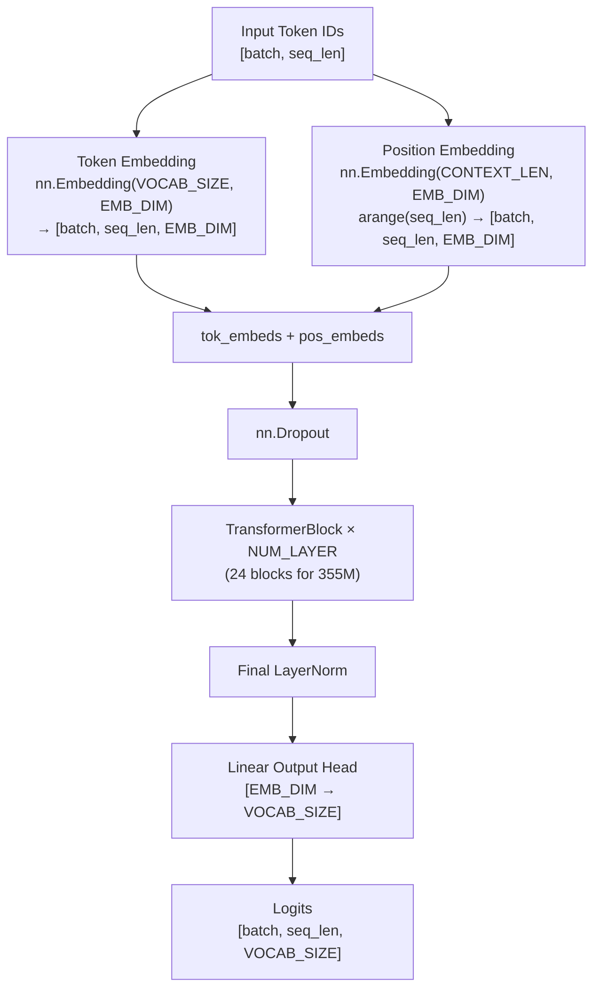

**Weight tying**: `self.out_head.weight = self.tok_emb.weight` — the output projection matrix is shared with the input token embedding matrix. This is a well-known parameter efficiency technique: the same matrix that maps token IDs to vectors (during embedding lookup) is used in transpose to map from embedding space back to vocabulary logits. This halves the parameter count for this large matrix (`VOCAB_SIZE × EMB_DIM` = 51.5M parameters in the 355M model) and has been shown empirically to improve performance.

**GPT-2 355M full parameter breakdown** (from the LLM visualizer):

| Component | Parameters |
|---|---|
| Token Embedding `[50,257 × 1024]` | 51,463,168 |
| Position Embedding `[1024 × 1024]` | 1,048,576 |
| 24 × TransformerBlock (12,596,224 each) | 302,309,376 |
| **Total** | **354,823,168** |

Each transformer block of the 355M model contains:
- LayerNorm 1: 2,048 params
- MultiHeadAttention: W_Q `[1024×1024]+b`, W_K, W_V, Out Proj — each 1,049,600 → ~4.2M
- LayerNorm 2: 2,048 params
- FeedForward Linear 1 `[1024×4096]` + Linear 2 `[4096×1024]` → ~8.4M

> [!info]+ Interview questions covered
> - What is weight tying in language models?
> - How does the GPT-2 forward pass work end-to-end?
> - What is the role of positional embeddings, and how are they combined with token embeddings?
> - How many parameters does GPT-2 355M have and where do they come from?

---

### Text Generation: Temperature, Top-K, and Greedy Decoding

The `generate` function implements autoregressive text generation (slides 93, 95, 117):

```python
def generate(model, idx, max_new_tokens, context_size,
             temperature=0.0, top_k=None, eos_id=None):
    for _ in range(max_new_tokens):
        idx_cond = idx[:, -context_size:]
        with torch.no_grad():
            logits = model(idx_cond)
        logits = logits[:, -1, :]   # only last token's prediction

        if top_k is not None:
            top_logits, _ = torch.topk(logits, top_k)
            min_val = top_logits[:, -1]
            logits = torch.where(
                logits < min_val,
                torch.tensor(float('-inf')).to(logits.device),
                logits
            )
        if temperature > 0.0:
            logits = logits / temperature
            probs = torch.softmax(logits, dim=-1)
            idx_next = torch.multinomial(probs, num_samples=1)
        else:
            idx_next = torch.argmax(logits, dim=-1, keepdim=True)

        if idx_next == eos_id:
            break
        idx = torch.cat((idx, idx_next), dim=1)
    return idx
```

The three decoding strategies to understand:

- **Greedy decoding** (`temperature=0.0`): Always pick the token with the highest logit via `argmax`. Deterministic but can produce repetitive or degenerate text.
- **Temperature sampling** (`temperature > 0.0`): Divide logits by temperature before softmax. A temperature $< 1$ makes the distribution sharper (model becomes more confident — less creative). A temperature $> 1$ flattens the distribution (more randomness). The inference call in `model.py` uses `temperature=1.5`.
- **Top-K filtering** (`top_k=50`): Before sampling, keep only the `top_k` highest-probability tokens and set all others to $-\infty$. This prevents sampling from the long tail of low-probability tokens.

**Autoregressive generation flow**: The model takes the current sequence `idx_cond` (up to `context_size` tokens), produces logits for all positions, then takes only the last position's logits to predict the next token. The newly sampled token is appended to `idx` and the loop continues, generating one token at a time.

The `model.eval()` call before generation puts the model in evaluation mode, which disables dropout (all neurons are active). This is important: during training, dropout introduces stochasticity that helps regularization, but at inference you want deterministic, full-strength predictions.

The inference call in the codebase:
```python
token_ids = generate(
    model=model,
    idx=text_to_token_ids("The future of AI", tokenizer),
    max_new_tokens=25,
    context_size=CONTEXT_LEN,
    top_k=50,
    temperature=1.5,
)
```

> [!info]+ Interview questions covered
> - What is autoregressive text generation?
> - What is temperature in text generation and how does it affect output?
> - What is Top-K sampling?
> - Why is `model.eval()` called before inference?
> - What is the difference between greedy decoding and sampling-based decoding?

---

### Downloading and Loading Pre-Trained GPT-2 Weights

The project includes a `download.py` script that fetches the GPT-2 355M checkpoint files from OpenAI's public storage:

```python
MODEL_NAME = "355M"
BASE_URL = "https://openaipublic.blob.core.windows.net/gpt-2/models"

FILES = [
    "checkpoint",
    "encoder.json",
    "hparams.json",
    "model.ckpt.data-00000-of-00001",
    "model.ckpt.index",
    "model.ckpt.meta",
    "vocab.bpe"
]
```

The key insight here is that for inference with a pre-trained GPT-2 model, **no training dataset is needed**. OpenAI has already trained the model on internet-scale data and published the weights. The workflow is simply:

1. Download checkpoint files into `models/355M/`.
2. `helper.py` loads and converts those TensorFlow checkpoint weights into PyTorch tensors (`load_weights_into_gpt`).
3. `model.eval()` switches off training-mode dropout.
4. Call `generate()`.

For fine-tuning over a domain-specific dataset, the same pre-trained weights are the starting point — not random initialization.

> [!info]+ Interview questions covered
> - How do you load pre-trained GPT-2 weights into a custom PyTorch model?
> - What files make up a GPT-2 model checkpoint?
> - Do you need a training dataset to run inference on a pre-trained model?

---

### GPT-2 Architecture Map: The Full Picture

The Excalidraw diagram (`gpt-2-architecture.excalidraw`) shown at the end of the section (slides 123–126) consolidates everything:

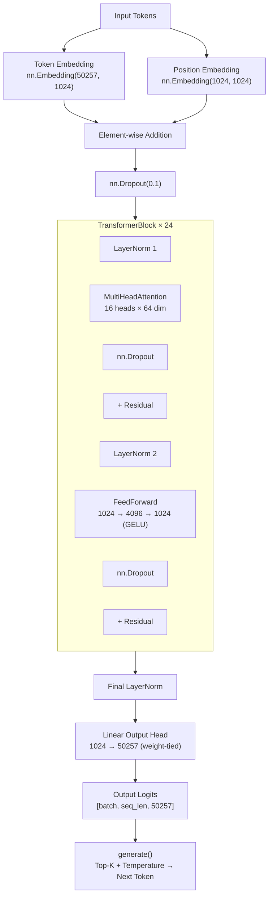

The original "Attention Is All You Need" paper (shown in slide 125) includes both an encoder and decoder stack. GPT-2 uses only the decoder portion — the decoder-only design without cross-attention is sufficient for causal language modeling (predicting the next token).

> [!info]+ Interview questions covered
> - What is a decoder-only transformer?
> - How does GPT-2's architecture relate to the original "Attention Is All You Need" paper?
> - What is the end-to-end data flow in GPT-2 from input token IDs to output logits?


## Softmax, Temperature, Token Probability Distribution, Output Logits, Top-K Sampling

**Lecture timestamp: 34:07 – 37:08**

This section explains what happens *after* the GPT-2 model produces its output — how raw logit scores are converted into a probability distribution, and how that distribution is shaped by temperature, top-k, and top-p before a token is finally sampled. The key insight the tutor builds toward: without these controls, a language model is fully deterministic and will always repeat the same token. Temperature and sampling are what make generation feel alive.

---

### The Generation Pipeline at a Glance

The GPT-2 forward pass (visualised in the LLM Visualizer at `localhost:8000/gpt2-355m`) flows like this:

```mermaid
flowchart LR
    A["Input tokens\n(e.g. 'The future of AI')"] --> B[Token Embedding]
    B --> C[Position Embedding]
    C --> D[Combined Embedding]
    D --> E["Transformer Block × N\n(Attention + FFN)"]
    E --> F[Final Layer Norm]
    F --> G["Linear Output Head\n(GPTModel)"]
    G --> H["Output Logits\n(vocab_size scores)"]
    H --> I[Temperature Scaling]
    I --> J[Softmax → Probabilities]
    J --> K[Top-K / Top-P Filter]
    K --> L["Multinomial Sample\n→ next token"]
```

Everything from the token embedding through the transformer stack is the *model's job* — the weights determine the scores. Steps I through L are *inference-time controls* that shape how a token is chosen from those scores.

---

### Step 1 – Output Logits: What the Model Actually Returns

When you query the model, it does not return a word. It returns a **logit** — a raw floating-point score — for *every token in its vocabulary*. The vocabulary size determines how many scores come out (50,257 for GPT-2).

The architecture view in VS Code (Excalidraw diagram, slide 133) makes the source of logits explicit:

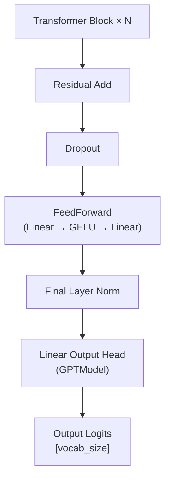

The **Linear Output Head** projects the final hidden state (shape `[batch, seq_len, d_model]`) to `[batch, seq_len, vocab_size]`. Each of the `vocab_size` values is an unnormalised score (a logit) expressing how strongly the model "votes" for that token as the next one.

A critical point: these logit scores are determined entirely by the trained weights. You cannot change them at inference time without retraining. The only way to change *which token gets picked* without retraining is through the post-processing steps (temperature, top-k, top-p).

> [!info]+ Interview questions covered
> - What does a language model output? (Logits — one raw score per vocabulary token)
> - Where do output logits come from in GPT-2? (From the linear output head applied to the final layer-norm'd hidden states)

---

### Step 2 – Softmax: Converting Logits to a Probability Distribution

Raw logits are unbounded real numbers — they can be positive or negative. To sample from them, they need to become a proper probability distribution (values between 0 and 1, summing to 1). That is what **softmax** does.

From the LLM Concepts Visualizer (`localhost:8002/sampling`), the "Raw Logits → Probabilities" section shows a worked example for the prompt **"The cat sat on the [?]"**:

| Token   | Raw Logit | After Softmax (temp = 1.0) |
|---------|-----------|---------------------------|
| mat     | 4.2       | **50.0%**                 |
| floor   | 3.5       | 24.8%                     |
| roof    | 2.8       | 12.3%                     |
| chair   | 2.1       | 6.1%                      |
| table   | 1.5       | 3.4%                      |
| bed     | 0.9       | 1.8%                      |
| moon    | 0.2       | 0.9%                      |
| pizza   | -0.5      | 0.5%                      |
| quantum | -1.8      | 0.1%                      |
| banana  | -2.5      | 0.1%                      |

The default formula (temperature = 1.0):

```python
probs = softmax(logits)  # temperature = 1.0 (default)
```

Key properties of softmax:
- Higher logit always means higher probability.
- All probabilities sum to exactly 1.
- Negative logits still get a non-zero probability (they are not excluded, just small).

**The problem with bare softmax at temperature = 1.0**: "mat" receives 50% probability. Without any further intervention, the model picks "mat" with overwhelming consistency — or deterministically if using greedy decoding (always pick the argmax). The same weights, the same input, the same output. Every. Single. Time. This is not how humans speak or write.

> [!info]+ Interview questions covered
> - What is softmax and why is it applied to logits?
> - What is greedy decoding and what is its limitation?
> - Why does a language model without sampling controls always produce the same output for the same input?

---

### The 5-Step Token Sampling Pipeline

From the LLM Concepts Visualizer, the generation code that lives in the model's generation loop looks like this:

From `localhost:8002/sampling` — the complete sampling algorithm:

```python
# 1. Scale logits by temperature
logits = logits / temperature

# 2. Convert to probabilities
probs = softmax(logits)

# 3. Filter by top-k (keep only k most likely)
# 4. Filter by top-p (keep smallest set summing to >= p)

# 5. Sample from filtered distribution
next_token = torch.multinomial(probs, num_samples=1)
```

This code is appended to the generation part of the LLM — wherever you see the model doing a forward pass to produce the next token, this pipeline follows immediately after.

The five steps are sequential: temperature scaling modifies the logits before softmax converts them; top-k and top-p then trim the probability distribution; and finally multinomial sampling draws one token from whatever remains.

---

### Step 3 – Temperature: Reshaping the Distribution

Temperature is the first and most fundamental control. The formula changes from:

$$\text{probs} = \text{softmax}(\text{logits})$$

to:

$$\text{probs} = \text{softmax}\!\left(\frac{\text{logits}}{T}\right)$$

where $T$ is the temperature parameter.

#### Why dividing by temperature works

Dividing the logits by a number *before* softmax rescales all the raw scores. Softmax is an exponential function, so the effect of this rescaling is non-linear and powerful:

- **$T < 1$ (e.g. 0.2 — "focused")**: Dividing by a small number *amplifies* the differences between logits. The highest-scoring token's lead grows larger in relative terms. After softmax, the top token dominates even more than it would at $T=1$. The distribution becomes **sharper** — you get focused, predictable output. Useful for factual question-answering where you want the most likely correct answer.

- **$T = 1.0$ (default)**: Dividing by 1.0 changes nothing. The distribution is exactly what the trained weights produce. "mat" stays at 50%.

- **$T > 1$ (e.g. 2.0 — "random")**: Dividing by a large number *compresses* the differences between logits. Before softmax, the gap between "mat" (4.2) and "banana" (-2.5) shrinks. After softmax, rare tokens get a meaningfully larger slice of probability mass. The distribution **flattens** — you get more creative, varied, and sometimes incoherent output.

The visualiser labels these presets:

| Temperature | Label     | Behaviour |
|-------------|-----------|-----------|
| 0.2         | Focused   | Sharp distribution, top token dominates |
| 0.7         | Balanced  | Moderate spread |
| 1.0         | Default   | Unchanged from trained distribution |
| 1.5         | Creative  | Flatter, more variety |
| 2.0         | Random    | Very flat, high chance of unusual tokens |

At $T = 1.0$ with the example above:

```python
logits / 1.0 = [4.20, 3.50, 2.80, 2.10, ...]
softmax -> [50.0%, 24.8%, 12.3%, 6.1%, ...]
```

The formula shown in the visualiser:

```python
probs = softmax(logits / temperature)
```

**What temperature does NOT do**: it does not retrain the model. It does not change what the model *knows*. The logit scores — which reflect everything the model learned about the statistical structure of language — remain fixed. Temperature only changes how sharply or broadly those scores translate into a sampling distribution.

> [!info]+ Interview questions covered
> - What is temperature in the context of LLM generation?
> - What happens when you set temperature to a very low value like 0.1?
> - What happens when you set temperature to a very high value like 2.0?
> - Does changing temperature change the model's weights or retrain the model?
> - How does temperature = 1.0 differ from temperature = 0?

---

### Step 4 – Top-K Sampling (K=2)

Even after applying temperature, the full distribution still includes all vocabulary tokens — including nonsensical ones with tiny probabilities. Top-K sampling introduces a hard cutoff: **keep only the K tokens with the highest probability, then renormalise**.

With K=2 applied to the example:
- Keep: `mat` (50.0%), `floor` (24.8%)
- Discard: all others
- Renormalise: `mat` ≈ 66.8%, `floor` ≈ 33.2%
- Sample from this trimmed distribution

The model now never produces "quantum" or "banana" as next tokens — they are excluded entirely before sampling.

**Why not just always pick the top token (K=1)?** That is greedy decoding — it produces repetitive, stilted text. Using K=2 or K=40 (a common value) introduces controlled randomness: the model can pick either of the most plausible completions with probability proportional to their scores.

The code step:

```python
# 3. Filter by top-k (keep only k most likely)
```

> [!info]+ Interview questions covered
> - What is top-K sampling?
> - What is the difference between greedy decoding and top-K sampling?
> - What does K=1 sampling do?

---

### Step 5 – Top-P (Nucleus) Sampling

Top-P sampling (also called **nucleus sampling**) is a dynamic alternative to top-K. Instead of a fixed count of tokens, you keep the **smallest set of tokens whose cumulative probability is at least P**.

For example with P=0.75 on the example distribution at temperature=1.0:
- `mat` 50.0% → running total 50.0% (include)
- `floor` 24.8% → running total 74.8% (include)
- `roof` 12.3% → running total 87.1% — but we already exceeded 75%, so stop here or include depending on implementation

The nucleus adapts to the shape of the distribution: when the model is very confident (one token dominates), the nucleus is small. When the model is uncertain (many roughly equal tokens), the nucleus grows. This adapts better than top-K across different contexts.

The code step:

```python
# 4. Filter by top-p (keep smallest set summing to >= p)
```

> [!info]+ Interview questions covered
> - What is top-P or nucleus sampling?
> - How is top-P different from top-K?
> - When would you prefer top-P over top-K?

---

### Step 6 – Multinomial Sampling: Drawing the Final Token

After temperature scaling, softmax, and top-K/top-P filtering, the final step is to draw one token from the filtered, renormalised distribution:

```python
next_token = torch.multinomial(probs, num_samples=1)
```

`torch.multinomial` samples from a discrete distribution in proportion to the given weights. If `mat` has 66.8% and `floor` has 33.2% (after top-2 filtering), then across many calls you would expect "mat" to be chosen roughly twice as often as "floor" — but not always. This is what makes LLM output feel non-robotic.

---

### Putting It All Together: Why LLMs "Feel Real"

Without temperature, top-K, and top-P, an LLM given the same prompt would produce the exact same output every time. The weights are fixed after training, so the logits are fixed, so the softmax probabilities are fixed, so the argmax is fixed. You would get a deterministic machine that never varies.

These three controls are the mechanism by which LLMs produce varied, natural-sounding text on repeated queries. They are not a workaround — they are a deliberate design choice that reflects how language actually works: many completions are plausible, and good generation should explore that space proportionally to the model's confidence.

The combined pipeline flow:

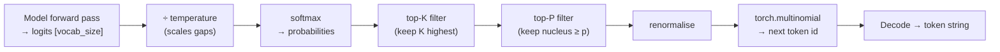

> [!info]+ Interview questions covered
> - What is multinomial sampling in the context of LLM generation?
> - Why do LLMs produce different outputs for the same prompt on different calls?
> - What is the relationship between temperature, top-K, top-P, and output diversity?
> - If temperature=1, top-K=1, top-P=1.0, what does the model do?

---

### Key Formulas Reference

| Operation | Formula |
|-----------|---------|
| Softmax (baseline) | $\text{probs}_i = \dfrac{e^{z_i}}{\sum_j e^{z_j}}$ |
| Temperature scaling | $\text{probs}_i = \dfrac{e^{z_i / T}}{\sum_j e^{z_j / T}}$ |
| Top-K | Keep top-K tokens by probability, zero out the rest, renormalise |
| Top-P | Keep tokens until cumulative probability ≥ P, renormalise |
| Sampling | `next_token = torch.multinomial(probs, num_samples=1)` |

The logit scores $z_i$ are determined entirely by the model's trained weights. Temperature $T$, K, and P are inference-time hyperparameters — they are not learned and do not affect the model's internal state.


## Softmax, Temperature, Token Probability Distribution, Logits Scaling, Token Sampling

**Section timestamp:** 37:08 – 41:35

---

### The Pipeline So Far: From Logits to a Token

Before diving into temperature, it helps to recall where we are in the GPT-2 generation pipeline. The model takes an input sequence of tokens, passes it through N Transformer blocks, runs it through a Final Layer Norm, and then produces a vector of **raw scores** via the Linear Output Head. These raw scores are called **logits** — one number per token in the vocabulary.

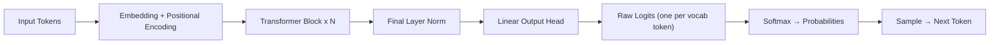

The weights inside all these layers were learned during training. By the time inference is done, those weights are fixed. What the model outputs — the logits — encodes the model's learned belief about which token should come next.

---

### Step 1: Converting Logits to Probabilities with Softmax

Logits are raw unnormalized scores. They can be positive or negative, and they don't sum to anything meaningful on their own. The job of **softmax** is to convert them into a valid probability distribution — all values between 0 and 1, summing to exactly 1.

The default formula (no temperature) is simply:

$$\text{probs} = \text{softmax}(\text{logits})$$

which is equivalent to:

$$\text{probs} = \text{softmax}\left(\frac{\text{logits}}{1.0}\right)$$

#### Worked example — predicting the word after "the cat sat on the"

Suppose the model gives the following raw logits for a small next-word vocabulary:

| Token    | Raw Logit |
|----------|-----------|
| mat      | 4.2       |
| floor    | 3.5       |
| roof     | 2.8       |
| chair    | 2.1       |
| table    | 1.5       |
| bed      | 0.9       |
| moon     | 0.2       |
| pizza    | -0.5      |
| quantum  | -1.8      |
| banana   | -2.5      |

After applying softmax, the probabilities are:

| Token    | Probability |
|----------|-------------|
| mat      | **50.0%**   |
| floor    | 24.8%       |
| roof     | 12.3%       |
| chair    | 6.1%        |
| table    | 3.4%        |
| bed      | 1.8%        |
| moon     | 0.9%        |
| pizza    | 0.5%        |
| quantum  | 0.1%        |
| banana   | 0.1%        |

"mat" dominates at 50%. That is exactly what the training process produced — the model's weights encode the fact that "mat" is the most contextually appropriate continuation. The probabilities always sum to 1.

From the visualizer (slide 145):

```python
probs = softmax(logits)  # temperature = 1.0 (default)
```

Higher logit always means higher probability, but softmax is non-linear: the difference between 4.2 and 3.5 translates to a much larger gap in probability than the same numerical difference in a lower range.

---

### Step 2: Why Just Picking the Top Token is Not Enough — Introducing Temperature

If the model always picks the token with the highest probability (this is called **greedy decoding**), the output is completely deterministic. Ask the same question twice and you get the exact same answer. That is fine for factual questions, but it breaks creative generation — you'd get the same poem every time you regenerate.

The solution is to **sample from the probability distribution** rather than always picking the argmax. But there's a problem: with the default distribution, even sampling produces very biased outputs — "mat" gets picked half the time, and "banana" almost never. What if we want the model to be more adventurous or, conversely, more precise?

That is the role of **temperature**.

---

### The Temperature Formula

Instead of applying softmax to the raw logits, we first **divide the logits by a temperature value** $T$, and then apply softmax:

$$\text{probs} = \text{softmax}\left(\frac{\text{logits}}{T}\right)$$

From the visualizer (slide 144):

```python
probs = softmax(logits / temperature)
```

The temperature $T$ is a positive scalar. Dividing the logits by $T$ before softmax changes the **sharpness** of the resulting distribution without changing the ordering of tokens.

#### Why does dividing change the distribution?

Softmax is exponential. When logits are large (divided by a small $T$), the exponentials spread far apart, so the top token dominates. When logits are compressed (divided by a large $T$), the exponentials are closer together, so probabilities are more equal. The mathematical effect is:

- **$T < 1$**: logits are *amplified* (divided by a fraction makes them larger). The distribution becomes **sharper** — the gap between the top token and others widens.
- **$T = 1$**: logits are unchanged. This is the **default** distribution from training.
- **$T > 1$**: logits are *compressed* (divided by a number > 1 makes them smaller). The distribution becomes **flatter** — tokens that were rarely chosen now get meaningfully higher probability.

---

### The Three Regimes, With Numbers

#### T = 1.0 (default — unchanged distribution)

Dividing by 1 changes nothing:

```python
logits / 1.0 = [4.20, 3.50, 2.80, 2.10, ...]
softmax -> [50.0%, 24.8%, 12.3%, 6.1%, ...]
```

The distribution is exactly what the training process produced. This is the baseline.

#### T = 0.1 (very low — near-deterministic, focused)

Dividing by 0.1 multiplies the logits by 10:

```python
logits / 0.1 = [42.00, 35.00, 28.00, 21.00, ...]
softmax -> [99.9%, 0.1%, 0.0%, 0.0%, ...]
```

Result: mat at 99.9%, every other token is effectively zero. The model will almost always pick "mat". This is **greedy decoding** behavior, achieved through temperature rather than forcing argmax.


**Use case:** Factual, deterministic tasks. "What is the capital of India?" has one correct answer. Temperature near zero ensures the model doesn't hallucinate alternatives.

#### T = 1.8 (moderate elevation — more spread)

```python
logits / 1.8 = [2.33, 1.94, 1.56, 1.17, ...]
softmax -> [32.5%, 22.1%, 14.9%, 10.1%, ...]
mat 32.5%, floor 22.1%, roof 14.9%, chair 10.1%, table 7.3%, bed 5.2%, moon 3.5%, pizza 2.4%, quantum 1.2%, banana 0.8%
```

The distribution is flatter. "mat" is still most likely, but "floor", "roof", and "chair" all have real chances. The model is no longer sure about a single token.

#### T = 3.0 (high — near-uniform, creative)

```python
logits / 3.0 = [1.40, 1.17, 0.93, 0.70, ...]
softmax -> [22.9%, 18.1%, 14.4%, 11.4%, ...]
mat 22.9%, floor 18.1%, roof 14.4%, chair 11.4%, table 9.3%, bed 7.6%, moon 6.0%, pizza 4.8%, quantum 3.1%, banana 2.5%
```

Now even "banana" has a 2.5% chance. The distribution is approaching uniform. At this temperature, regenerating the same prompt will give very different outputs each time.


---

### The Three-Way Comparison at a Glance

The visualizer shows a canonical comparison panel (slide 152):

| Temperature | Setting | mat | floor | roof | chair | Behavior |
|-------------|---------|-----|-------|------|-------|----------|
| T = 0.2 | Focused | 97.0% | 2.9% | 0.1% | 0.0% | Almost always picks "mat". Good for factual tasks. |
| T = 1.0 | Default | 50.0% | 24.8% | 12.3% | 6.1% | Original distribution. Balanced between quality and variety. |
| T = 2.0 | Creative | 30.1% | 21.2% | 15.0% | 10.5% | Rare tokens get a real chance. More surprising, but riskier. |

The key takeaway: dividing by temperature is a one-line change to the softmax call, but it fundamentally shifts the model's personality from confident-and-repetitive to exploratory-and-varied.

---

### Practical Guidance: When to Use Which Temperature

The temperature is set at inference time — it is not a trained weight. It can be changed dynamically, query by query, without retraining the model.

Real-world LLMs like ChatGPT infer the type of question and adapt temperature accordingly:

- **Factual lookup** (capital of India, math calculation): use **low temperature** (0.1–0.3). There is one right answer, and you want the model to commit to it.
- **Code generation**: use **low-to-moderate temperature** (0.2–0.5). Code has correctness constraints; creativity risks introducing bugs.
- **Balanced conversation**: use **T = 1.0** as a sensible default.
- **Creative writing, poetry, brainstorming**: use **high temperature** (1.5–2.0+). Each regeneration should produce a different poem or story.

The `temperature` parameter you see in API calls to GPT-4, Claude, or any open-source model is exactly this scalar — it plugs directly into the `softmax(logits / temperature)` formula.

---

### Token Sampling: Why the Model Does Not Always Pick the Top Token

Even after softmax gives us a probability distribution, we have a choice about how to select the next token. The two extremes are:

- **Argmax / greedy decoding**: always pick the token with the highest probability. Fast, deterministic, no randomness.
- **Full distribution sampling**: draw randomly from the entire probability distribution according to the probabilities.

The standard approach in autoregressive generation is to **sample** from the distribution — this is the "Sample Next Token" button in the visualizer. The model does not always pick "mat" just because mat has 50% probability; there is a 50% chance it picks mat, 24.8% chance it picks floor, and so on.

This is why the same prompt can produce different outputs across different API calls: the randomness lives inside the sampling step.

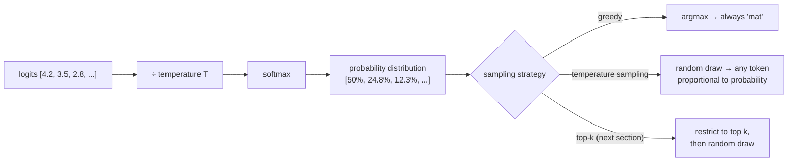

---

### The Limitation Temperature Cannot Solve on Its Own

Even at T = 3.0, "banana" has a 2.5% probability. That means that if you generate a million tokens, "banana" will appear in contexts where it makes no sense — roughly 25,000 times. Temperature flattens the distribution but does not prevent any token from being sampled.

This observation motivates the next concept covered in the following section: **Top-k Sampling**. The idea is to take the top $k$ most probable tokens after temperature scaling, zero out the probabilities of all others, renormalize, and sample only from those $k$ candidates. This gives creative variety (from temperature) while preventing truly absurd tokens (from the top-k cutoff).

> [!info]+ Interview questions covered
> - What is temperature in an LLM, and how does it work mathematically?
> - What does `probs = softmax(logits / temperature)` mean? What changes when you increase or decrease temperature?
> - What is the difference between greedy decoding and temperature sampling?
> - How does temperature affect the output distribution — what happens at T approaching 0 vs T approaching infinity?
> - When would you use a low temperature vs a high temperature in a production LLM?
> - Why does dividing logits by a large number make the softmax output flatter?
> - What is the role of softmax in converting logits to probabilities?

---

### Summary of Key Formulas

| Concept | Formula |
|---------|---------|
| Default softmax | $\text{probs} = \text{softmax}(\text{logits})$ |
| Temperature-scaled softmax | $\text{probs} = \text{softmax}\!\left(\dfrac{\text{logits}}{T}\right)$ |
| Effect of T < 1 | Amplifies differences → sharper distribution → more deterministic |
| Effect of T = 1 | Identity — distribution unchanged from training |
| Effect of T > 1 | Compresses differences → flatter distribution → more creative |

The temperature parameter is an **inference-time hyperparameter** — it is set after training is complete and can be changed on a per-request basis.


## Top-K Sampling, Renormalization, Top-K Filtering, Nucleus Sampling, and Top-P Sampling

**Lecture timestamp:** 41:35 – 48:09

This section builds directly on temperature sampling. Temperature controls how flat or peaked the probability distribution is, but by itself it does not prevent the model from occasionally picking extremely unlikely tokens. Top-K and Top-P are two complementary techniques that solve that problem by restricting the candidate set before a token is sampled.

---

### The Sampling Pipeline at a Glance

Before diving into each technique, it helps to see how all three controls fit together in sequence:

```mermaid
flowchart LR
    A[Raw logits] -->|divide by temperature T| B[Scaled logits]
    B -->|softmax| C[Full probability distribution]
    C -->|Top-K filter: keep only top-k tokens| D[Filtered distribution]
    D -->|Top-P filter: keep smallest set with cumulative prob >= p| E[Nucleus]
    E -->|renormalize to sum = 1| F[Final distribution]
    F -->|sample| G[Next token]
```

Temperature is applied first (at the logit level). Top-K filtering follows on the resulting probability distribution. Top-P optionally refines further. Finally, the surviving probabilities are renormalized to sum to 1 before the model samples one token.

---

### Top-K Sampling

#### What it is and why it exists

After softmax, the model has assigned some probability to every token in the vocabulary. Even with low temperature (very peaked distribution), the long tail of the distribution can still assign a tiny but non-zero probability to nonsensical tokens. Top-K provides a hard ceiling: only the $k$ tokens with the highest probability are eligible candidates. All others are zeroed out.

**The core idea:** sort the vocabulary by probability, keep the top $k$, zero everything else, then renormalize. No matter how high the temperature is or how much the distribution is spread out, the model can never pick a token ranked below position $k$.

#### The code

From the LLM Concepts Visualizer (shown in VS Code during the lecture):

```python
# Keep only the top k tokens, zero out the rest
top_k_values, top_k_idx = torch.topk(probs, k=5)
probs_filtered = torch.zeros_like(probs).scatter(0, top_k_idx, top_k_values)
```

**Line-by-line:**
- `torch.topk(probs, k=5)` — returns the top-5 probability values and their vocabulary indices.
- `torch.zeros_like(probs)` — creates a zero tensor the same shape as the full vocabulary distribution.
- `.scatter(0, top_k_idx, top_k_values)` — places the top-5 values back into the zero tensor at their original positions. Everything else stays zero.
- After this step, the probabilities no longer sum to 1 (they sum to whatever the top-k probability mass was), so renormalization is needed before sampling.

#### Step-by-step worked example with two temperature scenarios

The visualizer demonstrated two scenarios side-by-side using a 10-token vocabulary: `mat, floor, roof, chair, table, bed, moon, pizza, quantum, banana`.

**Scenario A — Flat distribution (temperature = 3.0, creative mode)**

| Token | Before top-k=5 | After top-k=5 (renormalized) |
|-------|----------------|-------------------------------|
| mat | 22.9% | 30.1% |
| floor | 18.1% | 23.8% |
| roof | 14.4% | 18.9% |
| chair | 11.4% | 14.9% |
| table | 9.3% | 12.2% |
| bed | 7.6% | — (zeroed) |
| moon | 6.0% | — (zeroed) |
| pizza | 4.8% | — (zeroed) |
| quantum | 3.1% | — (zeroed) |
| banana | 2.5% | — (zeroed) |

At high temperature the probability mass is spread across all 10 tokens. Top-k=5 eliminates the bottom 5 and renormalizes the remaining mass. The model can still be creative (multiple tokens have meaningful probabilities), but nonsensical tokens like `banana` and `quantum` are permanently excluded.

**Scenario B — Peaked distribution (temperature = 0.1, focused mode)**

| Token | Before top-k=5 | After top-k=5 (renormalized) |
|-------|----------------|-------------------------------|
| mat | 99.9% | 99.9% |
| floor | 0.1% | 0.1% |
| roof | 0.0% | 0.0% |
| chair | 0.0% | 0.0% |
| table | 0.0% | 0.0% |
| ... (remaining 5) | ≈0.0% | — (zeroed) |

At low temperature, the distribution is already extremely peaked. Top-k=5 makes almost no practical difference here — the top 5 already hold essentially all the probability mass.

#### Renormalization explained

After zeroing out the bottom tokens, the remaining probabilities no longer sum to 1. Renormalization rescales each surviving probability so the new sum equals exactly 1:

$$p'_i = \frac{p_i}{\sum_{j \in \text{top-k}} p_j}$$

In Scenario A: the top-5 probabilities before renormalization sum to $22.9 + 18.1 + 14.4 + 11.4 + 9.3 = 76.1\%$. After renormalization, each value is divided by 0.761, so mat goes from 22.9% to 30.1%, etc.

#### Choosing k in practice

| k value | Behaviour | Best for |
|---------|-----------|----------|
| 1 | Always picks the single most probable token — fully deterministic (greedy decoding) | Code generation, factual Q&A |
| 2–5 | Small candidate set, still fairly deterministic | Structured tasks with some variation |
| 10–50 | Larger candidate set, more creative | Creative writing, dialogue |
| vocab size | No filtering at all — same as pure temperature sampling | Maximum diversity |

The key insight confirmed during the lecture: **low temperature + k=1 is the combination for coding tasks**, because correctness and reproducibility are paramount. **High temperature + large k is the combination for poem writing or other creative generation**, where surprise and variety are desirable.

> [!info]+ Interview questions covered
> - What is top-K sampling in LLMs?
> - What does renormalization mean after top-K filtering?
> - When would you use top-K = 1?
> - What is the difference between greedy decoding and top-K sampling with K=1?
> - How do temperature and top-K interact?

---

### The Problem with Top-K

Top-K has a fundamental weakness: **k is a fixed number that does not adapt to the shape of the distribution.**

Consider a distribution where the model is very confident:

| Token | Probability | Cumulative |
|-------|------------|------------|
| mat | 75.3% | 75% |
| floor | 18.6% | 94% |
| roof | 4.6% | 98% |
| chair | 1.1% | 100% |
| table | 0.3% | 100% |

With k=5, `table` (only 0.3%) is still included as a candidate. A student correctly points out: *table has very low probability, so do we actually want to allow it as a possible output?* The answer is no — when the model is already 94% confident in just two tokens (`mat` and `floor`), including three more very unlikely candidates adds noise without value.

The inverse problem also exists: when many tokens have similar probabilities (flat distribution), k=5 might cut off perfectly reasonable candidates ranked 6th through 10th.

The visualizer labels this explicitly:
> **The problem with top-k:** A fixed k doesn't adapt to the shape of the distribution. If the model is very confident (one token at 95%), k=5 still includes 4 unlikely tokens. If the model is uncertain (many tokens around 10%), k=5 might cut off reasonable options.

This limitation motivates Top-P sampling.

> [!info]+ Interview questions covered
> - What is the limitation of top-K sampling?
> - Why does a fixed K not work well for all probability distributions?

---

### Top-P Sampling (Nucleus Sampling)

#### The solution to the fixed-K problem

Top-P (also called **nucleus sampling**) replaces the fixed count $k$ with a fixed cumulative probability threshold $p$. Instead of always keeping exactly $k$ tokens, it keeps the **smallest set of tokens whose cumulative probability reaches at least $p$**.

The number of tokens kept automatically adjusts:
- When the model is **confident** (distribution is peaked), cumulative probability reaches $p$ after just 1 or 2 tokens → fewer tokens kept.
- When the model is **uncertain** (flat distribution), more tokens are needed before cumulative probability reaches $p$ → more tokens pass through.

This is the adaptive property top-k lacks.

#### The code

```python
# Sort by probability, keep the smallest set whose sum >= p
sorted_probs, sorted_idx = torch.sort(probs, descending=True)
cumulative = torch.cumsum(sorted_probs, dim=0)
# Remove tokens with cumulative probability above threshold p
```

**Line-by-line:**
- `torch.sort(probs, descending=True)` — sort all tokens from most probable to least probable.
- `torch.cumsum(sorted_probs, dim=0)` — compute a running cumulative sum: position 0 holds $p_1$, position 1 holds $p_1 + p_2$, etc.
- Tokens where the cumulative sum has already exceeded $p$ before their inclusion are removed.

#### Step-by-step worked example (p = 0.90)

Using the confident distribution from above with $p = 0.90$:

| Token | Individual prob | Cumulative | Included? |
|-------|----------------|------------|-----------|
| mat | 75.3% | 75% | Yes (75% < 90%) |
| floor | 18.6% | 94% | Yes (adding floor crosses 90%) |
| roof | 4.6% | 98% | No (already past threshold) |
| chair | 1.1% | 100% | No |
| table | 0.3% | 100% | No |

Only `mat` and `floor` pass the threshold. After renormalization:

| Token | After top-p=0.90 (renormalized) |
|-------|----------------------------------|
| mat | 80.2% |
| floor | 19.8% |

The renormalization formula is the same as for top-k: divide each surviving probability by the total surviving mass ($75.3 + 18.6 = 93.9\%$):

$$p'_{\text{mat}} = \frac{75.3}{93.9} \approx 80.2\%, \quad p'_{\text{floor}} = \frac{18.6}{93.9} \approx 19.8\%$$

`table` (0.3%) is automatically excluded — exactly what was desired.

#### Visualizing the flow

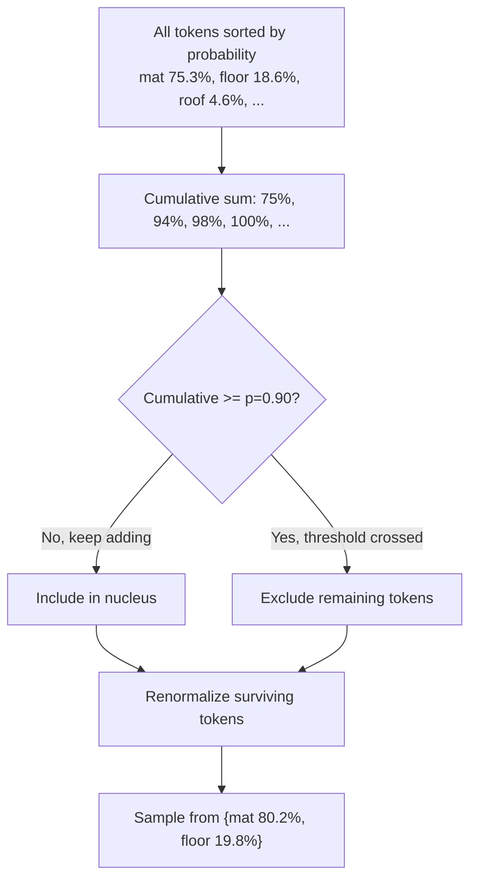

#### How p adapts to distribution shape

| Distribution shape | Temperature | Tokens passing p=0.90 |
|-------------------|-------------|----------------------|
| Very confident (one token near 95%) | Low | 1 token |
| Moderately confident | Medium | 2–3 tokens |
| Flat (many tokens near 10%) | High | Many tokens |

This adaptive behaviour is the defining advantage of top-p over top-k.

> [!info]+ Interview questions covered
> - What is nucleus sampling / top-P sampling?
> - How does top-P sampling differ from top-K sampling?
> - What does "cumulative probability threshold" mean in top-P?
> - Why is top-P called "nucleus" sampling?
> - When does top-P keep fewer tokens vs more tokens?

---

### Combining Temperature, Top-K, and Top-P

In production LLM inference (and in every major API including OpenAI, Anthropic, and HuggingFace), all three parameters are applied together in sequence. As an AI engineer you need to understand what each knob does so you can tune them for your specific use case:

| Parameter | What it controls | Direction for more creativity | Direction for more focus |
|-----------|-----------------|-------------------------------|--------------------------|
| Temperature (T) | Steepness of the distribution | Increase (e.g. 2.0) | Decrease (e.g. 0.2) |
| Top-K (k) | Hard count ceiling on candidates | Increase (or set to vocab size) | Decrease (k=1 = greedy) |
| Top-P (p) | Cumulative probability threshold | Increase (e.g. 0.99) | Decrease (e.g. 0.50) |

**Practical presets:**

- **Code generation:** T=0.2 or lower, k=1, p=0.9 — near-deterministic, always picks the most likely correct token.
- **Factual Q&A:** T=0.5, k=10, p=0.9 — moderate focus with some redundancy filtering.
- **Creative writing:** T=1.5, k=50, p=0.95 — wide candidate set, unexpected choices welcome.
- **Poem / poetry:** T=2.0, k=vocab size, p=0.99 — maximum diversity, embrace the unusual.

The point the lecture makes directly: *"Whatever product you build, you need to tune these things, and for tuning you must understand the concepts."*

> [!info]+ Interview questions covered
> - How do temperature, top-K, and top-P work together in LLM inference?
> - What settings would you use for a code-generation task vs a creative writing task?
> - When would you set top-K = 1?

---

### Clarification: Top-K Operates After Softmax, Not Before

A common point of confusion (raised directly during the lecture): top-k filtering is applied **after** softmax has been computed on the temperature-scaled logits. It is not applied to raw logits.

The full pipeline in order:

```mermaid
flowchart LR
    A[Raw logits] --> B["Scale: logits / T"]
    B --> C[Softmax → probabilities]
    C --> D["Top-K filter (on probabilities)"]
    D --> E["Top-P filter (on filtered probs)"]
    E --> F[Renormalize]
    F --> G[Sample one token]
```

If k=5 is applied to a 10-token vocab after softmax, only the 5 tokens with the highest probability values enter the renormalized pool. The remaining 5 are permanently zeroed and never sampled.

---

### Relationship Between Top-K = vocab_size and Temperature Sampling

One additional conceptual point clarified during the Q&A: if you set $k = \text{vocab size}$ (i.e. no filtering), top-k has no effect and sampling behaves exactly as pure temperature sampling. Similarly, setting $p = 1.0$ in top-p means all tokens pass the cumulative threshold, so top-p also has no effect.

This means temperature, top-k, and top-p each independently controls a different dimension of the sampling behaviour, and they can be selectively engaged or disabled by setting them to their "no-op" values.


## Byte Pair Encoding (BPE), Vocabulary Size Growth, Token Compression, and Compression Ratio

**Lecture timestamp:** 48:09 – 53:32

---

### Why BPE Exists — Motivation Before Definition

Before understanding the BPE algorithm itself, it is essential to understand what problem it solves.

A naive approach to tokenization is character-level splitting: every individual character becomes one token. For the string `AAABDAAABAC` this gives eleven tokens — one per character. Each token gets one unique ID. The vocabulary is small (only 4 unique symbols: A, B, C, D), but the sequence the model must process is long. A longer sequence means more positions in the context window are consumed, and each forward pass through the model scales in cost with sequence length.

The opposite naive approach — whole-word tokenization — keeps sequences short, but produces a huge vocabulary. Any unseen word or compound form breaks the tokenizer.

BPE is the algorithm that occupies the middle ground. It starts at the character level and iteratively merges the most frequent adjacent pair of tokens into a single new token, progressively building a richer vocabulary while simultaneously compressing the token sequence. The result is:

> As vocabulary size grows, the number of tokens (sequence length) shrinks.

This is the core trade-off BPE manages, and it is exactly the trade-off every production tokenizer — including GPT's tiktoken — is built on.

---

### The BPE Algorithm — Step by Step

The interactive demo the tutor walks through uses the input string:

```
AAABDAAABAC
```

#### Step 1 — Character split (initialisation)

Split the input into individual characters. Each character is one token.

```
[A] [A] [A] [B] [D] [A] [A] [A] [B] [A] [C]
```

- **Token count:** 11
- **Vocabulary (size 4):** A, B, C, D

At this point the vocabulary is just the set of unique characters that appear in the corpus. This is the baseline vocabulary BPE starts from.

#### Step 2 — Find the most frequent adjacent pair and merge

Count every adjacent pair that appears in the current token sequence:

| Pair  | Frequency |
|-------|-----------|
| A + A | 4         |
| A + B | 2         |
| B + D | 1         |
| D + A | 1         |
| B + A | 1         |
| A + C | 1         |

The most frequent pair is **A + A** (appears 4 times). Merge every occurrence of A + A into the new token **AA**:

```
BEFORE (11 tokens): [A][A][A][B][D][A][A][A][B][A][C]
AFTER   (9 tokens): [AA][A][B][D][AA][A][B][A][C]
```

- **Vocabulary (size 5):** A, AA, B, C, D

Observe the dual effect: the vocabulary grew by 1 (added AA), and the token sequence shrank by 2 (from 11 to 9).

#### Step 3 — Repeat: find and merge the next most frequent pair

Recount adjacent pairs in the updated sequence:

| Pair   | Frequency |
|--------|-----------|
| AA + A | 2         |
| A + B  | 2         |
| B + D  | 1         |
| D + AA | 1         |
| B + A  | 1         |
| A + C  | 1         |

Two pairs are tied at frequency 2. The algorithm picks one (the choice is implementation-dependent, but the result is equivalent). Merge **AA + A** → **AAA**:

```
BEFORE (9 tokens): [AA][A][B][D][AA][A][B][A][C]
AFTER  (7 tokens): [AAA][B][D][AAA][B][A][C]
```

- **Vocabulary (size 6):** A, AA, AAA, B, C, D

#### Step 4 — Continue iterating

Recount pairs in the updated sequence:

| Pair    | Frequency |
|---------|-----------|
| AAA + B | 2         |
| B + D   | 1         |
| D + AAA | 1         |
| B + A   | 1         |
| A + C   | 1         |

Merge **AAA + B** → **AAAB**:

```
BEFORE (7 tokens): [AAA][B][D][AAA][B][A][C]
AFTER  (5 tokens): [AAAB][D][AAAB][A][C]
```

- **Vocabulary (size 7):** A, AA, AAA, AAAB, B, C, D

#### Step 5 — Result

After just 3 merge iterations:

| Metric              | Before BPE | After BPE |
|---------------------|------------|-----------|
| Token count         | 11         | 5         |
| Vocabulary size     | 4          | 7         |

**The string went from 11 tokens down to 5 tokens. The vocabulary grew from 4 to 7.** Common repeating patterns like AA, AAA, and AAAB were absorbed as single vocabulary entries, each receiving one unique ID.

The final tokenized sequence the model receives is:

```
[AAAB] [D] [AAAB] [A] [C]
```

```mermaid
flowchart TD
    A["Input: AAABDAAABAC\n11 characters → 11 tokens\nVocab size: 4 (A B C D)"]
    B["Merge 1: A+A → AA (freq 4)\n9 tokens | Vocab size: 5"]
    C["Merge 2: AA+A → AAA (freq 2)\n7 tokens | Vocab size: 6"]
    D["Merge 3: AAA+B → AAAB (freq 2)\n5 tokens | Vocab size: 7"]
    E["Final: AAAB D AAAB A C\n5 tokens | Vocab size: 7"]

    A --> B --> C --> D --> E
```

---

### The Inverse Relationship — A Key Insight

The most important conceptual point is the inverse relationship between vocabulary size and token count:

$$\text{More merges} \Rightarrow \text{Larger vocabulary} + \text{Fewer tokens per sequence}$$

This is not a coincidence. Every merge operation:
1. Adds one new entry to the vocabulary (vocabulary grows by 1 per merge).
2. Replaces multiple occurrences of a pair with a single token (sequence length shrinks).

The algorithm terminates when you reach a target vocabulary size (a hyperparameter you set in advance). For GPT-2, that target was approximately 50,000. For GPT-4's tokenizer (cl100k_base), it is approximately 100,000 vocabulary entries produced by roughly 100,000 merge operations applied to billions of characters.

---

### The Inverse Relationship Illustrated Numerically

| State     | Vocab size | Token count |
|-----------|------------|-------------|
| Initial   | 4          | 11          |
| Merge 1   | 5          | 9           |
| Merge 2   | 6          | 7           |
| Merge 3   | 7          | 5           |

For any fixed corpus, as you perform more merges:
- Vocabulary size increases by exactly 1 per merge.
- Token count decreases (by a variable amount depending on pair frequency).

The compression ratio for a given text is:

$$\text{compression ratio} = \frac{\text{characters}}{\text{tokens}}$$

A compression ratio of 4.75 means that, on average, each token in the output represents 4.75 characters of the original input.

---

### The BPE Tokenizer in Practice — Visual Demo

The lecture's interactive tool at `localhost:8002/bpe/tokenize` applies the same algorithm with the GPT vocabulary (approximately 100k entries from 100k merge steps) to arbitrary input text. For the example sentence:

> "Tokenization tokenizes tokens differently based on the token frequency. The tokens are not cheap. Thea sdfbdToken."

The result is:

```
CHARACTERS:        114
TOKENS:            24
COMPRESSION RATIO: 4.75

Tokens: Token, ization, -token, izes, -tokens, -differently, -based,
        -on, -the, -token, -frequency, ., -The, -tokens, -are, -not,
        -cheap, ., -The, a, -sdf, bd, Token, .

Token IDs: 4421, 2860, 6602, 6370, 20290, 36490, 4122, 402, 290, 6602,
           19813, 13, 623, 20290, 553, 625, 12424, 13, 623, 64, 85916,
           10733, 4421, 13
```

Several things to notice in this output:

- **Subword tokenization at work:** The word "Tokenization" is split into `Token` + `ization`. The word "tokenizes" is split into `-token` + `izes`. This is BPE behaving exactly as designed — common sub-strings (like `token`) become single vocabulary entries, while rare combinations are left as smaller pieces.
- **Known vs. unknown patterns:** Common words like `-the`, `-on`, `-based` are each a single token. The made-up string `sdfbd` is split further because no high-frequency merges were learned for it during training.
- **Token reuse:** The token `-token` appears at multiple positions with the same ID (6602). The vocabulary is a shared dictionary — a single lookup table.
- **Compression ratio:** 114 characters / 24 tokens ≈ 4.75. This is a healthy compression ratio for English text.

---

### Reversibility — Decoding Works in Reverse

The vocabulary that is built during BPE training is also used in reverse during decoding. When the model outputs a sequence of token IDs, the tokenizer maps each ID back to its string fragment and concatenates them. This is why it is essential that the vocabulary retains every individual character — including the original A, B, C, D in the toy example — so that any string can be reconstructed exactly. The algorithm ensures this because it always starts from the full character-level split and only adds new merged entries; it never removes the base characters.

---

### Merge Order Is a Design Choice

A practical note: when two or more pairs have the same frequency, the order in which they are merged is determined by the implementation. The standard approach processes pairs in a consistent, deterministic order (e.g., left to right, or alphabetically among ties). You can write your own BPE implementation with a different tie-breaking rule and it will produce a different but equally valid vocabulary. The choice of which pair to merge first when frequencies are tied is a hyperparameter of the training procedure, not a mathematical constraint.

---

### Scaling Up: From Toy Example to GPT

The same algorithm that turned `AAABDAAABAC` into 5 tokens applies at GPT scale:

| Parameter           | Toy example | GPT-2 (tiktoken) |
|---------------------|-------------|------------------|
| Input corpus        | 11 chars    | Billions of chars |
| Initial vocab       | 4 chars     | 256 bytes (UTF-8) |
| Merge iterations    | 3           | ~50,000           |
| Final vocab size    | 7           | ~50,257           |
| Sequence compression| 11→5 tokens | ~4x compression   |

GPT-4's tokenizer (cl100k_base) performs approximately 100,000 merges, yielding a vocabulary of about 100,277 tokens and an average compression ratio of approximately 4 characters per token for English text.

The BPE tokenizer is learned from the training corpus — it is not hand-designed. The frequency counts are computed from the actual data, so the merged tokens reflect the statistical structure of the language (or code, or domain) the model will operate on.

---

### Summary of Key Concepts

| Concept | Definition |
|---------|------------|
| BPE (Byte Pair Encoding) | An iterative algorithm that merges the most frequent adjacent token pair into a new single token, repeating until a target vocabulary size is reached |
| Vocabulary size growth | Each BPE merge adds exactly one entry to the vocabulary |
| Token compression | Each BPE merge reduces the sequence length by replacing repeated pairs with a single token |
| Compression ratio | Characters / tokens; a higher ratio means more efficient representation |
| tiktoken | OpenAI's BPE-based tokenizer library, used by GPT-2 through GPT-4 |
| Subword tokenization | The result of BPE: tokens that are neither whole words nor individual characters, but statistically frequent sub-strings |

> [!info]+ Interview questions covered
> - What is Byte Pair Encoding (BPE)?
> - How does BPE build a vocabulary?
> - What is the relationship between vocabulary size and token sequence length in BPE?
> - What is a compression ratio in the context of tokenization?
> - Why do LLMs like GPT use subword tokenization instead of word-level or character-level tokenization?
> - What happens to the token count as BPE performs more merges?
> - How does tiktoken relate to BPE?


## Byte Pair Encoding (BPE), Subword Tokenization, and LLM Vocabulary

**Lecture timestamps:** 53:32 – 58:50

---

### Why This Section Matters

Before an LLM can run gradient descent on text, it needs numbers — not words. The chain of reasoning is:

1. Gradient descent requires calculus.
2. Calculus requires numeric inputs.
3. Therefore, text must be converted to numbers.
4. The mechanism that performs that conversion is the **tokenizer**.

The question then becomes: *how* should you convert text to numbers? The answer is not obvious, and the history of NLP has tried multiple approaches. This section compares three of them and explains why BPE is the standard used by every major LLM today.

---

### The Running Example

The Visual Tokenizer tool (running at `localhost:8002/bpe/tokenize`) is used throughout, tokenizing the following sentence with GPT's BPE vocabulary:

```
Tokenization tokenizes tokens differently based on the token frequency.
The tokens are not cheap. Thea sdfbdToken.
```

The deliberately crafted example repeats the word "token" many times and includes two unusual strings (`Thea`, `sdfbdToken`) to expose the weaknesses of simpler approaches.

**BPE result:**

| Metric | Value |
|---|---|
| Characters | 114 |
| Tokens | 24 |
| Compression ratio | 4.75 |

The tokenizer splits the input into 24 color-coded subword chips. Hovering over `•the` reveals token ID 290 with 3 characters; `•token` maps to ID 6602, and it appears multiple times in the output — the same ID every time, showing that BPE encodes a frequent subword once and reuses it.

```
TOKENS:  Token  ization  •token  izes  •tokens  •differently  •based  •on
         •the   •token   •frequency  .  •The  •tokens  •are  •not  •cheap  .
         •The   a  •sdf  bd  Token  .

TOKEN IDS:  4421, 2860, 6602, 6370, 20290, 36490, 4122, 402, 290, 6602,
            19813, 13, 623, 20290, 553, 625, 12424, 13, 623, 64, 85916,
            10733, 4421, 13
```

Notice that `Token` (capital T) and `token` (lower case) are *different* tokens with different IDs. BPE is case-sensitive and frequency-aware. Also notice `Tokenization` is split into `Token` + `ization` — two subwords — because `Tokenization` is rare enough that it was not merged into a single unit during vocabulary construction, but both constituent pieces were.

---

### Three Tokenization Strategies Compared

The Visual Tokenizer's "Why BPE?" section shows the same 114-character sentence processed three ways:

```mermaid
flowchart LR
    A["Input text\n114 characters"] --> B["Word-level\n16 tokens\n2 unknown"]
    A --> C["Character-level\n114 tokens\n0 unknown"]
    A --> D["BPE Subword\n24 tokens\n0 unknown"]

    B --> E["❌ Can't handle\nunknown words"]
    C --> F["❌ Sequences too long,\nmodel too slow"]
    D --> G["✅ Best of both worlds"]
```

#### Word-Level Tokenization

**How it works:** split on whitespace; each word is one token.

**Result on the example:** 16 tokens, but 2 words become `[UNK]`.

**The vocabulary problem.** Suppose you use the English dictionary as your vocabulary. You would assign each known word a number (1 to *N*). Words not in the dictionary get assigned a special `[UNK]` token (say, token ID 20).

At inference time, when the user types a rare or made-up word (`sdfbdToken`, a name like `Thea` that didn't appear in training data, or a domain-specific term), the tokenizer maps it to ID 20. During decoding, token 20 maps back to `[UNK]`. The model has **lost all information** about the actual string — multiple different rare words collapse to the same ID. This is not a theoretical concern; early NLP models regularly returned `[UNK]` for out-of-vocabulary inputs.

**The fixed vocabulary can never cover all words.** Language grows constantly: new product names, slang, technical jargon, typos. A static dictionary-based vocabulary is fundamentally closed.

> [!info]+ Interview questions covered
> - What is word-level tokenization and what is its main limitation?
> - What is the `[UNK]` token and why does it cause information loss?
> - Why can't a fixed vocabulary based on a dictionary be used for a general-purpose LLM?

#### Character-Level Tokenization

**How it works:** every individual character is one token.

**Result on the example:** 114 tokens — exactly one per character, zero unknown words.

**The sequence length problem.** Character-level tokenization never produces `[UNK]` because every possible character is in the vocabulary by definition (even random strings like `sdfbd` are just sequences of known characters `s`, `d`, `f`, `b`, `d`). This is its one advantage.

The cost is enormous: sequence length explodes. The same 114 characters that BPE handles in 24 tokens require 114 tokens at the character level — a 4.75x expansion. Since the attention mechanism in a Transformer scales quadratically with sequence length ($O(n^2)$), a longer sequence means:

- More GPU memory
- Slower training and inference
- The model must now learn to associate meaning across many more tokens (the word "the" is three separate tokens `t`, `h`, `e`), which is much harder than treating it as a single unit

Character-level is essentially the worst of both worlds: you pay the full sequence-length cost without gaining any semantic clustering.

> [!info]+ Interview questions covered
> - What is character-level tokenization?
> - Why does character-level tokenization produce poor LLM performance despite having no unknown words?
> - How does tokenization granularity affect GPU memory and training cost?

---

### Byte Pair Encoding (BPE): The Best of Both Worlds

#### Core Idea

BPE is a **subword tokenization** algorithm. Its key insight:

- **Frequent words remain whole tokens.** High-frequency words like `the`, `tokens`, `are`, `not` are each assigned a single token ID. They are never split.
- **Rare or unknown words are split into known subwords.** A made-up string like `sdfbdToken` cannot be in any pre-built vocabulary, but BPE can still encode it as `•sdf` + `bd` + `Token` — three subword pieces that were frequent enough in training data to earn a slot in the vocabulary.
- **Zero unknown words, ever.** At worst, any sequence can fall back to individual bytes (the "byte" in "byte pair encoding"), so nothing can be out-of-vocabulary.

The algorithm builds its vocabulary by repeatedly merging the most frequent adjacent pair of symbols in a training corpus — starting from individual characters, merging pairs until the desired vocabulary size is reached. This is why the algorithm is called *byte pair encoding*.

#### BPE in Action: The Example Revisited

The example sentence produces:

| Approach | Tokens | Unknown words | Notes |
|---|---|---|---|
| Word-level | 16 | 2 (`Thea`, `sdfbdToken`) | Fixed vocab; rare words become `[UNK]` |
| Character-level | 114 | 0 | One token per character; very long sequences |
| BPE (Subword) | 24 | 0 | 4.75x compression; rare words split into subwords |

The BPE ratio of 24 vs 114 is a **4.75x compression**. For a model with a context window of, say, 4096 tokens, BPE can fit approximately 4.75 times more text than character-level tokenization within the same window. This directly translates to the model understanding longer documents and conversations.

```mermaid
flowchart LR
    A["'sdfbdToken'"] -->|Word-level| B["[UNK] (ID 20)\nInformation LOST"]
    A -->|Character-level| C["s · d · f · b · d · T · o · k · e · n\n10 tokens"]
    A -->|BPE| D["•sdf · bd · Token\n3 tokens\nMeaning PRESERVED"]
```

#### The UNK Token Mechanics (Word-Level Deep Dive)

Consider a word-level vocabulary of 14 words. Word 1 gets ID 1, word 2 gets ID 2, … word 14 gets ID 14. Unknown words get ID 20 (`[UNK]`).

When you feed the model the token sequence `1, 2, 3, ..., 14, 20, 20`, the two `[UNK]` tokens carry no information. When the model outputs `20` during generation, the detokenizer converts it back to the string `[UNK]` — which is meaningless to the user. The model has literally no way to distinguish between different unknown inputs; they all look identical.

BPE eliminates this problem entirely. Even a completely nonsensical string like `sdfbdToken` is tokenized into recognizable subword pieces that the model can process, even if it cannot perfectly reconstruct the semantics.

#### Why Every LLM Uses BPE

All major production LLMs (GPT, LLaMA, Mistral, Gemma, Claude, etc.) use BPE or a close variant as their tokenizer. Some models, especially code-focused models (like CodeLlama or DeepSeek-Coder), apply modifications to the BPE vocabulary to better handle programming language syntax — for instance, treating common code tokens (`def`, `import`, `{`, `}`) as single units. But these are optimizations on top of BPE, not replacements for it.

The hierarchy is:

```mermaid
flowchart TD
    A["BPE Algorithm\n(Base for all LLMs)"]
    A --> B["Standard BPE\nGPT-2, GPT-3, GPT-4\nvocab ~50,257"]
    A --> C["BPE + Code Optimization\nCodeLlama, DeepSeek-Coder\nvocab ~32,000–100,000"]
    A --> D["BPE + Byte Fallback\nLLaMA, Mistral\nvocab ~32,000"]
```

#### Tokenization is Independent of Embeddings

An important clarification: tokenization and embeddings are **separate stages**. Tokenization converts text to integer IDs. The embedding layer then maps each ID to a floating-point vector. Changing tokenization granularity (e.g., more tokens for the same text) does not change the embedding values — it only changes how many embedding lookups are performed. More tokens = more GPU computation; the embedding table itself is unaffected by the token count.

```mermaid
flowchart LR
    T["Text input"] --> TOK["Tokenizer\ntext → token IDs"]
    TOK --> EMB["Embedding layer\ntoken ID → float vector"]
    EMB --> TF["Transformer blocks"]
    TF --> OUT["Output logits → text"]
```

> [!info]+ Interview questions covered
> - What is Byte Pair Encoding (BPE)?
> - Why is BPE the standard tokenization algorithm for LLMs?
> - How does BPE handle unknown or rare words compared to word-level tokenization?
> - What is the compression ratio in BPE tokenization and why does it matter?
> - What is the relationship between tokenization and the embedding layer?
> - How do code-focused LLMs adapt BPE for their use case?

---

### Key Takeaways

- **Tokenization converts text to integer IDs** so that the model can work with numbers, which gradient descent requires.
- **Word-level tokenization** creates a fixed vocabulary; any word not in that vocabulary becomes `[UNK]`, permanently destroying information about the input.
- **Character-level tokenization** eliminates unknown words but explodes sequence length, making attention computation far more expensive.
- **BPE (Byte Pair Encoding)** is a subword algorithm that achieves both goals: zero unknown words and a manageable sequence length through compression (typically 4–5x shorter than character-level).
- **BPE is the universal standard**: every major LLM on the market uses BPE or a BPE variant as its tokenizer.
- The **compression ratio** (characters / tokens) directly controls how much text fits in the model's context window. A ratio of 4.75 means BPE can pack ~5x more information into the same fixed-length context window compared to character-level tokenization.
- Tokenization is **independent of embeddings**: the embedding layer converts token IDs to vectors; adding more tokens only increases GPU computation, not the embedding values themselves.


## Dropout, Overfitting, Regularization, and Neural Network Weights

**Lecture timestamp:** 58:50 – 1:05:50

---

### Why Dropout Exists: The Overfitting Problem

Before understanding dropout, you need to understand the problem it solves: **overfitting**.

A neural network learns by adjusting its weights. When a model trains on a dataset, it can develop a bad habit: instead of learning general patterns, it memorizes the training data. It performs excellently on data it has already seen but fails on new, unseen inputs. This failure to generalize is called **overfitting**.

One root cause of overfitting in deep networks is **co-adaptation** — weights that become mutually dependent on each other. Rather than each weight independently capturing some signal in the data, a small set of weights does all the work while the rest free-ride. The model becomes fragile because it leans too heavily on those specific weights.

**Regularization** is the umbrella term for techniques that combat this co-adaptation. Dropout is one of the most powerful and widely-used regularization strategies.

---

### The Classroom Analogy

The tutor introduces dropout through a concrete classroom story, which maps directly onto what happens inside a neural network.

**The setup:** There are four students in a class — Ravi, Priya, Karan, and Neha. An exam is coming. Only Ravi actually studies. The other three — Priya, Karan, and Neha — simply copy from Ravi during group assignments. They never bother to learn anything themselves.

**The problem:** When the actual exam arrives and copying is prohibited, only Ravi can attempt to answer. Priya, Karan, and Neha fail completely because they have no independent knowledge. The group's exam result is entirely determined by Ravi alone. The group is **over-dependent on one source** — it has no redundancy, no independent knowledge.

**The mapping to neural networks:**

| Classroom analogy | Neural network reality |
|---|---|
| Student (Ravi, Priya, Karan, Neha) | Weight (W1, W2, W3, W4) |
| Ravi studying while others copy | One weight dominating; others idle |
| Group assignments (training phase) | Forward pass during training |
| Actual exam (unseen data) | Inference on new inputs |
| All students can independently answer | All weights have learned useful features |

When only W1 (Ravi) is useful, the model is essentially a single-weight model dressed up as a multi-weight one. If that one weight happens to have absorbed a bias from the training data, the whole model is biased. This is the co-adaptation that dropout breaks.

```mermaid
flowchart LR
    A[Training Data] --> B[Model Forward Pass]
    B --> C{Who learns?}
    C --> D[W1 / Ravi\nlearns everything]
    C --> E[W2 / Priya\ncopies W1]
    C --> F[W3 / Karan\ncopies W1]
    C --> G[W4 / Neha\ncopies W1]
    D --> H[Inference on new data]
    H --> I[W1 fails on unknown pattern\nOther weights: useless]
    I --> J[Overfitting]
```

---

### The Dropout Fix: Randomly Silence Neurons

The teacher (dropout mechanism) introduces a new rule: **every day, two students are randomly sent out of the classroom** before the assignment begins. No one knows in advance who will be asked to leave. Because the absence is random, no student can rely on any other.

Step through the analogy day by day:

- **Monday:** Ravi and Priya are sent out. Karan and Neha must study on their own. They cannot copy from Ravi because Ravi is absent.
- **Wednesday:** Karan and Neha leave. Ravi and Priya must work independently.
- **Next day:** A different random pair is removed.

Over many rounds, **every student is forced to independently learn something**. They each develop their own opinion — their own representation of the data. When the actual exam finally arrives:

- Ravi identifies a dog because "the eyes and legs look like a dog" → 90% confident.
- Priya identifies a dog because "of the hair" → votes dog.
- Karan thinks it might be a cat → votes differently.
- Neha leans toward dog based on size.

The final model aggregates all four independent opinions. Because no single student dominates, the result is far more robust and **generalized**. The model no longer collapses to one weight's bias.

This is exactly what `nn.Dropout` does at training time: on each forward pass, a random fraction of neurons is **zeroed out** (silenced), forcing the remaining neurons to each carry meaningful signal.

---

### Why More Weights Enable More Generalization

The tutor makes an important point about the relationship between the number of weights and generalization: **more weights allow the model to learn in a higher-dimensional space (a hyperplane rather than a single line)**, which gives the model the capacity to represent more complex patterns. However, simply adding more weights without dropout often worsens overfitting, because co-adaptation scales with network size. Dropout ensures that all those extra weights are genuinely used.

The weights start at zero (or random small values) and update during training. Without dropout, gradient updates tend to cluster around the weights already doing useful work, leaving others stagnant. With dropout, every weight receives meaningful gradient signals across training — because at any given pass, some dominant weights are silenced and the model must route information through the remaining ones.

---

### `nn.Dropout` in PyTorch: Training vs Inference

From the slide shown in the Dropout visualizer (slide 219):

```python
# Training: randomly zero out neurons, scale the rest
dropout = nn.Dropout(p=0.5)
output = dropout(x)          # mask & scale

# Inference: dropout is disabled, all neurons active
model.eval()
output = dropout(x)          # passes through unchanged
```

**Key points about this code:**

- `p=0.5` means each neuron is dropped (zeroed) independently with probability 50% on each forward pass during training.
- The remaining active neurons are **scaled up** by $\frac{1}{1-p}$ to keep the expected output magnitude the same. This is handled automatically by PyTorch's implementation.
- During inference (`model.eval()`), `nn.Dropout` is automatically disabled — all neurons are active and no scaling occurs. The full learned weights contribute to the prediction.

This train/eval behavioral difference is why you must always call `model.eval()` before running inference and `model.train()` before resuming training.

#### The Dropout Mask

When `p=0.5` is applied to a hidden layer with 4 neurons, a binary mask is sampled at random each forward pass. Neurons corresponding to a `0` in the mask are zeroed; those corresponding to a `1` remain. The visualizer demonstrated this concretely: with the dropout rate at 0.5 applied to the hidden layer (4 nodes), 2 of the hidden neurons were dropped in one particular mask re-roll.

```mermaid
flowchart LR
    X["Input x\n(x1, x2, x3, x4)"] --> H["Hidden Layer\n(4 nodes)"]
    H --> M["Dropout Mask\np=0.5\nRandom 2 of 4 zeroed"]
    M --> H2["Active Neurons\n(scaled up)"]
    H2 --> O["Output Layer\n(3 nodes)"]
```

---

### Network View: All Active vs Dropout Applied

The network shown in the Dropout visualizer has the following topology:

```mermaid
graph LR
    subgraph Input
        I1((x1))
        I2((x2))
        I3((x3))
        I4((x4))
    end
    subgraph Hidden
        H1((W1))
        H2((W2))
        H3((W3 ❌))
        H4((W4 ❌))
    end
    subgraph Output
        O1((y1))
        O2((y2))
        O3((y3))
    end
    I1 & I2 & I3 & I4 --> H1 & H2 & H3 & H4
    H1 & H2 --> O1 & O2 & O3
```

With `p=0.5`, neurons W3 and W4 (marked ❌) are zeroed for this particular training step. On the next batch, a different random subset will be dropped. Over many epochs, every neuron is forced to learn independently.

---

### Dropout During Training vs Inference: Summary Table

| Phase | Dropout behavior | Effect |
|---|---|---|
| Training (`model.train()`) | Neurons randomly zeroed with probability `p` | Forces independent learning; prevents co-adaptation |
| Inference (`model.eval()`) | All neurons active; no zeroing | Full ensemble of learned weights used for prediction |
| Why no dropout at inference | Need deterministic, full-strength predictions | Dropping neurons at test time would reduce accuracy |

---

### The Weight Independence Principle

The core insight of dropout is this: **every weight in the model should be able to contribute meaningfully on its own**. It should not need any other specific weight to be present to do its job.

Before dropout: W1 does all the work; W2–W4 are parasitic.

After dropout training: Each of W1, W2, W3, W4 has learned an independent, useful representation. W1 might be specialized for one set of features (e.g., eye shape in a dog classifier), W2 for another (coat texture), W3 for another (leg proportions), W4 for another (overall size). When all four are combined at inference time, the prediction is a robust ensemble of all four learned views.

> [!info]+ Interview questions covered
> - What is dropout in neural networks?
> - Why is dropout used during training but disabled during inference?
> - What is overfitting and how does dropout address it?
> - What does the `p` parameter in `nn.Dropout` represent?
> - What is regularization in the context of deep learning?
> - What is co-adaptation of neural network weights, and why is it a problem?
> - What must you call before running model inference in PyTorch, and why?

---

### Key Takeaways

1. **Overfitting** = the model memorizes training data rather than learning general patterns. Weights become co-adapted: some do all the work, others become useless.

2. **Dropout** = a regularization technique that randomly silences a fraction of neurons (zeroes their output) on each training forward pass. PyTorch exposes this as `nn.Dropout(p=...)`.

3. **Dropout probability `p`** = fraction of neurons dropped per forward pass. A value of `p=0.5` means each neuron has a 50% chance of being zeroed independently on each pass.

4. **Training vs inference:** Dropout is active only during training. During inference (`model.eval()`), all neurons are active. PyTorch handles this mode-switching automatically when you call `model.eval()` or `model.train()`.

5. **More weights + dropout = better generalization:** More weights give the model capacity to learn in a higher-dimensional space. Dropout ensures that extra capacity is genuinely used rather than becoming idle freeloaders.

6. **The hidden layer** is the primary target of dropout in feedforward networks — it is where co-adaptation typically occurs between intermediate representations.


## Layer Normalization, Feature Scaling, Renormalization, Learnable Parameters, Gamma

**Section timestamp:** 1:05:50 – 1:13:53

---

### Why Layer Normalization Exists — The Core Problem

Before defining what layer normalization is, it helps to understand why it is needed at all.

Inside a transformer, every token is represented as a high-dimensional vector of activations — real numbers that flow from one sub-layer to the next. These numbers can grow or shrink unpredictably as they pass through linear projections and non-linear activations. When some of those numbers become large and others stay small, two problems emerge simultaneously:

1. **Scale bias.** The model begins implicitly weighting large-magnitude features more heavily than small-magnitude ones — not because those features are more informative, but simply because their numbers are bigger.
2. **Numerical instability.** Large activations cause exploding gradients during backpropagation, making training slow, noisy, or divergent.

Layer normalization solves both problems by forcing all feature values for a given token into a stable, comparable range before they are processed further.

---

### The Cricket Team Analogy — Motivating Feature Scaling

The tutor introduces feature scaling through a concrete, non-ML example: picking the best all-rounder from a cricket squad.

You are a coach with four players, each described by three statistics:

| Player | Batting Avg | Bowling Avg | Catches |
|--------|-------------|-------------|---------|
| Rohit  | 45          | 38          | 15      |
| Virat  | 53          | 60          | 8       |
| Hardik | 28          | 24          | 25      |
| Jadeja | 32          | 20          | 32      |

The raw ranges are:
- Batting Avg: 28 – 53
- Bowling Avg: 20 – 60
- Catches: 8 – 32

**The problem:** If you feed these raw numbers into a ranking system, batting and bowling averages dominate automatically — not because they matter more, but because they are numerically larger. A player with 32 catches (excellent fielder) gets the same raw score as a player with a bowling average of 32 (average bowler), which is misleading. The big numbers bully the small ones. This is exactly what happens inside a neural network when activations of different magnitudes coexist without normalization.

> [!info]+ Interview questions covered
> - What is feature scaling and why is it needed in machine learning models?
> - Why do large activation values harm neural network training?

---

### Step-by-Step: How Normalization Works

#### Step 1 — Compute the Mean and Standard Deviation per Token

For each data point (each player, or in the LLM case each token), you compute the mean and standard deviation **across all features** for that individual row.

For Rohit: $[45, 38, 15]$

$$\mu_{Rohit} = \frac{45 + 38 + 15}{3} = 32.67, \quad \sigma_{Rohit} = 12.81$$

For Virat: $[53, 60, 8]$

$$\mu_{Virat} = \frac{53 + 60 + 8}{3} = 40.33, \quad \sigma_{Virat} = 23.04$$

This is **z-score normalization** applied per row (per token), not per column (not per feature globally).

#### Step 2 — Normalize Each Feature

Each raw value is replaced by its standardized score:

$$\hat{x}_i = \frac{x_i - \mu}{\sigma}$$

After normalization the four players look like this:

| Player | Batting Avg (norm) | Bowling Avg (norm) | Catches (norm) |
|--------|-------------------:|-------------------:|---------------:|
| Rohit  |  0.96              |  0.42              | -1.38          |
| Virat  |  0.55              |  0.85              | -1.40          |
| Hardik |  1.37              | -0.98              | -0.39          |
| Jadeja |  0.71              | -1.41              |  0.71          |

Every stat now lives in roughly the range $[-2, +2]$. No single feature dominates. The tutor explicitly points out the two benefits this gives us in deep learning:

- **No scale bias.** Every feature contributes fairly to subsequent computations.
- **Numerical stability.** Smaller magnitude numbers require less GPU computation and produce more stable gradients.

> [!info]+ Interview questions covered
> - What is z-score normalization? How is it applied in Layer Normalization?
> - How does normalization improve numerical stability in deep learning?

---

### The Problem Normalization Alone Creates — And Why Learnable Parameters Are Needed

Normalization is not free of side effects. By forcing every feature into a zero-mean, unit-variance distribution, you also destroy any **intentional scale differences** that might actually be meaningful.

In the cricket analogy: maybe, for picking an all-rounder, bowling skill genuinely deserves 1.5× the importance of batting skill, and catching skill deserves 1.2×. Pure normalization would erase that domain knowledge and treat all three stats identically.

The same issue appears in an LLM. After normalizing, the model loses any learned sense of "this dimension of the embedding should have more influence than that one." To recover that flexibility, Layer Normalization introduces two **learnable parameters per feature dimension**:

- **Scale (gamma, $\gamma$):** Multiplied by the normalized value. Initialized to 1.
- **Shift (beta, $\beta$):** Added after scaling. Initialized to 0.

The final output per feature is:

$$y_i = \gamma_i \cdot \hat{x}_i + \beta_i$$

These parameters are initialized so that LayerNorm starts as an identity transformation (output equals input), and then the model gradually adjusts $\gamma$ and $\beta$ through backpropagation to recover whatever scale and offset is actually useful.

---

### The Gamma/Beta Example — "Enter Gamma and Beta" (Analogy Step 5/7)

After training, suppose the cricket ranking system has learned:

| Feature     | Gamma ($\gamma$) | Beta ($\beta$) |
|-------------|:----------------:|:--------------:|
| Batting Avg | 1.0              | 0.0            |
| Bowling Avg | 1.5              | 0.5            |
| Catches     | 1.2              | 0.3            |

The formula applied per feature: $\text{Final} = \gamma \times \hat{x} + \beta$

For Rohit:
- Batting Avg: $1.0 \times 0.96 + 0.0 = 0.96$
- Bowling Avg: $1.5 \times 0.42 + 0.5 = 1.13$
- Catches:     $1.2 \times (-1.38) + 0.3 = -1.36$

For Virat:
- Batting Avg: $1.0 \times 0.55 + 0.0 = 0.55$
- Bowling Avg: $1.5 \times 0.85 + 0.5 = 1.77$
- Catches:     $1.2 \times (-1.40) + 0.3 = -1.38$

**The result after scale and shift (Analogy Step 6/7):**

| Player | Batting Avg | Bowling Avg | Catches |
|--------|------------:|------------:|--------:|
| Rohit  |  0.96       |  1.13       | -1.36   |
| Virat  |  0.55       |  1.77       | -1.38   |
| Hardik |  1.37       | -0.97       | -0.17   |
| Jadeja |  0.71       | -1.61       |  1.15   |

The decision is now both fair (normalization removed scale bias) and informative (gamma/beta restored domain-meaningful importance weights). The model learned that bowling matters 1.5× and catching matters 1.2× — not from hard-coded rules, but from data.

> [!info]+ Interview questions covered
> - What are the learnable parameters in Layer Normalization?
> - What are gamma and beta in LayerNorm? Why are they initialized to 1 and 0 respectively?
> - How does LayerNorm restore expressive power after normalization?

---

### The PyTorch Implementation

From the LLM Concepts Visualizer, the canonical LayerNorm code is:

From `LayerNorm` shown in the LLM Concepts Visualizer (localhost:8002/layer-norm):

```python
class LayerNorm(nn.Module):
    def __init__(self, emb_dim):
        super().__init__()
        self.eps = 1e-5
        self.scale = nn.Parameter(torch.ones(emb_dim))
        self.shift = nn.Parameter(torch.zeros(emb_dim))

    def forward(self, x):
        mean = x.mean(dim=-1, keepdim=True)
        var = x.var(dim=-1, keepdim=True, unbiased=False)
        norm_x = (x - mean) / torch.sqrt(var + self.eps)
        return self.scale * norm_x + self.shift
```

**Annotated walkthrough:**

- `emb_dim` — the embedding dimension (e.g., 1024 in GPT-2-355M). This defines how many scale and shift values exist.
- `self.scale = nn.Parameter(torch.ones(emb_dim))` — gamma, initialized to all-ones. `nn.Parameter` means this tensor is registered as a trainable weight of the model.
- `self.shift = nn.Parameter(torch.zeros(emb_dim))` — beta, initialized to all-zeros.
- `dim=-1` — normalization is computed **across the last dimension** (the feature/embedding dimension), which means it normalizes across all dimensions of a single token. This is exactly the "per-row" behavior demonstrated in the cricket analogy.
- `keepdim=True` — preserves the tensor shape for broadcasting during the subtraction.
- `unbiased=False` — uses the biased variance estimator (divides by $n$ not $n-1$), which is standard for LayerNorm.
- `self.eps = 1e-5` — small constant added to the variance before taking the square root. This prevents division by zero when variance is extremely small.

The complete normalization formula implemented is:

$$y = \gamma \cdot \frac{x - \mu}{\sqrt{\sigma^2 + \varepsilon}} + \beta$$

where $\mu$ and $\sigma^2$ are computed independently for each token across its embedding dimensions.

> [!info]+ Interview questions covered
> - Write the LayerNorm forward pass in PyTorch.
> - What does `dim=-1` mean in LayerNorm and why is it correct?
> - Why is epsilon (`eps = 1e-5`) added to the variance in LayerNorm?
> - What is the difference between biased and unbiased variance, and which does LayerNorm use?

---

### Layer Norm vs Batch Norm

A critical distinction that frequently appears in interviews:

| Aspect | Layer Normalization | Batch Normalization |
|--------|--------------------|--------------------|
| Normalizes across | Features of a **single token** (last dim) | All samples for a **single feature** (batch dim) |
| Depends on batch size | No — one token is self-contained | Yes — statistics computed over the batch |
| Sequence-length sensitivity | Independent per token | Not designed for variable-length sequences |
| Used in | Transformers, LLMs | CNNs, feedforward nets |
| Suitable for NLP | Yes | No (batch size varies; sequences vary in length) |

In a transformer, batch normalization would require knowing the statistics of all sequences in the batch simultaneously, which is impractical for autoregressive generation where you process one token at a time. LayerNorm operates on a single token's embedding vector, making it sequence-length and batch-size agnostic.

> [!info]+ Interview questions covered
> - What is the difference between Layer Normalization and Batch Normalization?
> - Why is Batch Normalization not used in Transformers?
> - Why is Layer Normalization the preferred normalization in LLMs?

---

### Where LayerNorm Appears in GPT-2 — The Actual Weights

The tutor demonstrates LayerNorm's place in the real GPT-2-355M model using the LLM Weights Visualizer (localhost:8000/gpt2-355m, "Learned Weights" tab). The weight breakdown for the full model's 354,823,168 parameters is:

| Component | Parameter count |
|-----------|---------------:|
| Token Embedding [50,257 × 1024] | 51,463,168 |
| Position Embedding [1,024 × 1024] | 1,048,576 |
| Transformer Blocks (24 blocks × 12,596,224) | 302,309,376 |
| **LayerNorm** (scale [1024] + shift [1024]) | **2,048** |

For GPT-2 with embedding dimension 1024, each LayerNorm layer contributes exactly 2,048 learnable parameters — 1,024 scale values and 1,024 shift values, one per embedding dimension. These values are real-valued floats that are updated during training just like any other weight.

The visualizer displays the actual learned scale and shift vectors as rows of numbers such as:

- scale: `0.11, 0.31, -0.44, ..., 0.38, 0.70, -0.43`
- shift: `0.28, -0.25, -0.53, ..., -0.88, 0.98, -0.90`

These are not hand-crafted — they were learned entirely from training data via backpropagation.

> [!info]+ Interview questions covered
> - How many parameters does a single LayerNorm layer contribute in GPT-2?
> - Where is LayerNorm positioned in a transformer block?
> - Are the gamma and beta parameters in LayerNorm learned or fixed?

---

### The Full LayerNorm Data Flow

```mermaid
flowchart LR
    A["Token activation vector\n[emb_dim]"] --> B["Compute mean μ\nacross emb_dim"]
    A --> C["Compute variance σ²\nacross emb_dim"]
    B --> D["Subtract μ from x"]
    C --> E["Divide by √(σ²+ε)"]
    D --> E
    E --> F["Normalized vector x̂\n[emb_dim]"]
    F --> G["Multiply by scale γ\n(learnable, init=1)"]
    G --> H["Add shift β\n(learnable, init=0)"]
    H --> I["Output y\n[emb_dim]\n— stable, zero-mean, unit-var,\n  then rescaled by model"]
```

---

### Key Takeaways

- **Normalization removes scale bias** so no feature bullies others. The key operation is z-score normalization applied per token across all embedding dimensions.
- **Normalization alone is too restrictive.** It collapses all features to the same scale, potentially destroying meaningful representation differences the model needs.
- **Gamma and beta restore expressiveness.** They are learnable parameters initialized to the identity (scale=1, shift=0), letting the model recover whatever scale/offset is actually useful via gradient descent.
- **LayerNorm is a fundamentally different operation from BatchNorm.** It works per token, not per batch, making it ideal for variable-length sequences and autoregressive decoding.
- **In GPT-2-355M,** each LayerNorm layer holds 2,048 parameters (1,024 scale + 1,024 shift, one per embedding dimension). These are ordinary model weights updated through backpropagation.
- **The primary benefit is training stability.** Keeping activations in a bounded range prevents exploding or vanishing gradients and reduces wasted GPU cycles on unnecessarily large arithmetic.


## Non-Linearity, GELU Activation Function, ReLU, Neural Network, max(0, x)

**Section timestamps:** 1:13:53 – 1:23:07

This section builds the intuition for why activation functions exist in neural networks and why GPT-2's `FeedForward` block uses GELU rather than a simple linear layer. The teaching arc is: simplest neuron → why linearity is insufficient → ReLU as non-linearity → neuron with activation → multi-feature neurons → the expand-activate-compress pattern.

---

### The FeedForward Block in GPT-2

The tutor opens by showing the exact `FeedForward` class from GPT-2, presented as three sequential operations.

From `FeedForward` shown in the visualizer at `localhost:8002/feed-forward`:

```python
class FeedForward(nn.Module):
    def __init__(self):
        super().__init__()
        self.layers = nn.Sequential(
            nn.Linear(EMB_DIM, 4 * EMB_DIM),
            GELU(),
            nn.Linear(4 * EMB_DIM, EMB_DIM),
        )

    def forward(self, x):
        return self.layers(x)
```

The subtitle on the page says it all: *"The expand-activate-compress block that processes each token independently after attention."*

The three-step pattern:

| Step | Operation | Dimension change |
|------|-----------|-----------------|
| Expand | `nn.Linear(EMB_DIM, 4 * EMB_DIM)` | $d_{model} \to 4 d_{model}$ |
| Activate | `GELU()` | $4 d_{model} \to 4 d_{model}$ (non-linearity injected) |
| Compress | `nn.Linear(4 * EMB_DIM, EMB_DIM)` | $4 d_{model} \to d_{model}$ |

The tutor explains: this is the exact code from GPT-2, and the goal now is to derive it from first principles — starting from the single-neuron building block.

> [!info]+ Interview questions covered
> - What is the feed-forward network in a Transformer?
> - What does "expand-activate-compress" mean in the context of GPT-2's FFN?
> - Why does the feed-forward layer expand to $4 \times \text{EMB\_DIM}$?

---

### The Building Block: A Single Neuron — $y = wx + b$

Before any activation function, the most fundamental model is a single linear neuron:

$$y = w \cdot x + b$$

- $x$ is the input
- $w$ (weight) and $b$ (bias) are learned by the model during training
- $y$ is the predicted output

```mermaid
flowchart LR
    x([x\nInput]) -->|w| S([wx + b])
    b([b\nBias]) -.-> S
    S --> y([y\nOutput])
```

One input, one weight, one bias. Multiply the input by the weight, add the bias, get the output. This is the building block of every neural network.

The key question the tutor poses: **Is this a straight line or a curved line?**

Answer: a **straight line** (or hyperplane in higher dimensions). And that is precisely the problem.

---

### Linear vs. Non-Linear: Why a Straight Line Is Not Enough

Consider a scatter plot of data points that do not follow a straight line. If the model is restricted to $y = wx + b$, it can only fit a straight line through the data — no matter how many gradient descent steps you take, the best it can do is find the optimal straight line. Complex, curved data will never be well-represented.

```mermaid
flowchart LR
    A["Linear model\ny = wx + b\nCan only draw straight lines\nFails on complex data"]
    B["Non-linear model\ny = activation(wx + b)\nCan bend and curve\nFits complex patterns"]
    A -->|Add activation function| B
```

| Model type | Decision boundary | Can fit complex data? |
|-----------|------------------|-----------------------|
| Linear ($y = wx + b$) | Straight line / linear hyperplane | No |
| Non-linear ($y = \text{activation}(wx + b)$) | Curved / non-linear hyperplane | Yes |

The visual on the lecture page shows two scatter plots side by side: the left with a straight diagonal line that misses most of the data structure; the right with a curved boundary that follows the data's true shape.

> **Insight from the lecture:** A purely linear model is equivalent to a calculator — fine for computing area or house price from a fixed linear formula. But for language modeling, image recognition, or any task with complex patterns, you need a curve, not a straight line.

> [!info]+ Interview questions covered
> - Why can't we stack multiple linear layers to get non-linearity?
> - What is the limitation of a purely linear model?
> - What is a hyperplane and how does it relate to a linear model?

---

### ReLU: The Simplest Activation Function

The solution to the linearity problem is an **activation function** — a simple non-linear transformation applied after the linear computation.

The most common activation function is **ReLU (Rectified Linear Unit)**:

$$\text{ReLU}(x) = \max(0, x)$$

```
ReLU(x) = max(0, x)
```

Behavior:
- If the input $x < 0$: output is $0$
- If the input $x \geq 0$: output is $x$ unchanged

Interactive examples worked through in the lecture:

| Input $x$ | $\max(0, x)$ | Output |
|-----------|-------------|--------|
| $-1$ | $\max(0, -1)$ | $0$ |
| $-5$ | $\max(0, -5)$ | $0$ |
| $5$ | $\max(0, 5)$ | $5$ |
| $3$ | $\max(0, 3)$ | $3$ |

```mermaid
flowchart LR
    neg["x < 0\ne.g. x = -1"] --> zero["Output = 0"]
    pos["x > 0\ne.g. x = 5"] --> pass["Output = x = 5"]
```

The graph of ReLU is the characteristic "hockey stick": flat at zero for all negative inputs, then a rising diagonal for positive inputs. The graph shows both the ReLU curve (solid) and its derivative $f'(x)$ (dashed) — the derivative is $0$ for $x < 0$ and $1$ for $x > 0$.

#### Why is ReLU "non-linear" if it looks piecewise linear?

The tutor addresses this directly: in each piece, ReLU is linear. But the function **as a whole** is non-linear because of the **kink at $x = 0$** — the two linear segments join at a non-differentiable point. This bend is sufficient to make the model capable of learning non-linear patterns when applied across many neurons and layers.

A student in the class puts it memorably: *"It's eliminating really terrible answers."* The tutor enthusiastically confirms — ReLU zeroes out confidently wrong negative predictions, preventing the model from outputting garbage.

> [!info]+ Interview questions covered
> - What is ReLU and how does it work?
> - What is the formula for ReLU?
> - Why is ReLU called a non-linear function if it is piecewise linear?
> - What does an activation function do in a neural network?

---

### Adding Activation to a Single Neuron

Once we understand the purpose of an activation function, we can upgrade the single-neuron formula:

**Without activation (linear):**
$$y = w \cdot x + b$$

**With activation (non-linear):**
$$y = \text{ReLU}(w \cdot x + b)$$

```mermaid
flowchart LR
    x([x\nInput]) -->|w| S(["Σ\nwx + b"])
    b([b\nBias]) -.-> S
    S --> R([ReLU])
    R --> y([y\nOutput])
```

The diagram on the lecture slide: Input $x$ → multiply by weight $w$ → sum node $\Sigma$ → ReLU node → Output $y$, with bias $b$ coming in at the sum node via a dotted line.

**What changes mechanically:** If the linear computation $wx + b$ produces $-2$, the old model would output $-2$. After adding ReLU, that same computation still produces $-2$ internally, but ReLU clamps it to $0$. The effect on the decision boundary is that the model's effective "line" can now bend at the point where the linear output crosses zero — creating a piecewise non-linear shape.

> **Key principle:** Activation functions introduce non-linearity into the model. Any activation function achieves this. Without one, no matter how many layers you stack, the composition of linear functions is still linear — you can never escape the straight line.

> [!info]+ Interview questions covered
> - What is an activation function and why is it used?
> - What happens to a neural network if you remove all activation functions?
> - What is the difference between $y = wx + b$ and $y = \text{ReLU}(wx + b)$?

---

### Why Activation Matters: Stacking Layers Without Activation Is Still Linear

This is a critical insight the lecture makes explicit via the "Why Activation Matters" comparison on slide 283:

> *"Without an activation function, no matter how many layers you stack, the output is always a straight line. Activation functions let the network learn curves and complex decision boundaries."*

Two stacked linear layers:

$$y = W_2 (W_1 x + b_1) + b_2 = (W_2 W_1) x + (W_2 b_1 + b_2)$$

This is still just $y = W'x + b'$ — a single linear transformation. Stacking more layers does nothing without non-linearity between them.

---

### From One Feature to Multiple Features

The single-neuron insight generalizes directly when the neuron takes multiple input features.

#### Linear multi-feature neuron (no activation)

With 3 input features $x_1, x_2, x_3$:

$$y = w_1 \cdot x_1 + w_2 \cdot x_2 + w_3 \cdot x_3 + b$$

```mermaid
flowchart LR
    x1([x1]) -->|w1| S(["Σ"])
    x2([x2]) -->|w2| S
    x3([x3]) -->|w3| S
    b([b]) -.-> S
    S --> y([y])
```

With one feature, this draws a **line**. With two or more features, it draws a **hyperplane** — the higher-dimensional generalization of a straight line. It is still a **linear hyperplane** because there is no activation function.

The bias term $b$ is important here: without it, the hyperplane is forced to pass through the origin. The bias lets the hyperplane shift freely.

#### Non-linear multi-feature neuron (with ReLU)

Adding ReLU after the weighted sum:

$$y = \text{ReLU}(w_1 \cdot x_1 + w_2 \cdot x_2 + w_3 \cdot x_3 + b)$$

```mermaid
flowchart LR
    x1([x1]) -->|w1| S(["Σ"])
    x2([x2]) -->|w2| S
    x3([x3]) -->|w3| S
    b([b]) -.-> S
    S --> R([ReLU])
    R --> y([y])
```

Now the model produces a **non-linear hyperplane**. The same intuition from 1D applies: just as ReLU bends a line at $x = 0$, in higher dimensions it bends the hyperplane, giving the model the expressiveness to fit complex, curved patterns.

> The tutor's teaching advice: real-world models have billions of parameters and the hyperplanes cannot be visualized directly. Use the 1D analogy — bending a line with ReLU — as a mental model for what ReLU does in any number of dimensions.

Each neuron multiplies inputs by its learned weights, adds its bias, and then applies an activation function. The **feed-forward network is many of these neurons connected together**.

> [!info]+ Interview questions covered
> - What is a hyperplane in the context of a neural network?
> - What is the difference between a linear hyperplane and a non-linear hyperplane?
> - How does the number of input features change the model from a line to a hyperplane?
> - What is the role of the bias term $b$ in a neuron?

---

### Scaling Up: Multiple Neurons, Weight Matrices

Toward the end of the section, the slide introduces two hidden neurons $H_1$ and $H_2$ with weight matrices:
- $W_1$: shape $(3 \times 2)$ — maps 3 inputs to 2 hidden neurons
- $W_2$: shape $(2 \times 1)$ — maps 2 hidden neurons to 1 output

This is the embryo of the full neural network. More neurons means more weights, more capacity, and a richer ability to fit complex patterns. This directly connects back to the `FeedForward` class at the start: the two `nn.Linear` layers are exactly $W_1$ (expand) and $W_2$ (compress), with `GELU()` as the activation in between.

```mermaid
flowchart LR
    I["Inputs x\n(EMB_DIM)"] --> L1["nn.Linear\nEMB_DIM → 4·EMB_DIM"]
    L1 --> G["GELU()"]
    G --> L2["nn.Linear\n4·EMB_DIM → EMB_DIM"]
    L2 --> O["Output\n(EMB_DIM)"]
```

> [!info]+ Interview questions covered
> - What is the expand-activate-compress pattern in a feed-forward network?
> - Why does GPT-2 use GELU instead of ReLU?
> - How does the feed-forward network in a Transformer relate to a basic multi-layer neural network?

---

### GELU vs. ReLU: The Activation Choice in GPT-2

The section introduces the concept of non-linearity and ReLU as the pedagogical vehicle, but the actual GPT-2 code uses **GELU** (Gaussian Error Linear Unit). The why is left for a deeper discussion, but the conceptual role is identical: GELU is also an activation function that introduces non-linearity. GELU has a smoother curve than ReLU — instead of a hard kink at zero, it transitions gradually. This smoothness improves gradient flow during training, which matters at the scale of large language models.

| Property | ReLU | GELU |
|----------|------|------|
| Formula | $\max(0, x)$ | $x \cdot \Phi(x)$ (approx. $0.5x(1 + \tanh[\ldots])$) |
| Shape | Hard kink at 0 | Smooth curve near 0 |
| Negative inputs | Hard zero | Small negative values preserved |
| Used in | Early deep learning | GPT-2, BERT, most modern LLMs |
| Differentiable at 0 | No | Yes |

Both achieve the same architectural goal: inject non-linearity between linear layers so the model can learn complex patterns.

> [!info]+ Interview questions covered
> - What is GELU and how does it differ from ReLU?
> - Why do modern LLMs like GPT-2 prefer GELU over ReLU?
> - What is the purpose of an activation function in a Transformer's feed-forward block?

---

### Summary: The Conceptual Arc of This Section

```mermaid
flowchart TD
    A["y = wx + b\n(single linear neuron)"]
    B["Can only draw straight lines\n— fails on complex data"]
    C["Add activation function: ReLU(x) = max(0, x)\nor GELU(x)"]
    D["y = ReLU(wx + b)\n— non-linear neuron"]
    E["Generalize to multiple features\ny = ReLU(w1·x1 + w2·x2 + ... + b)\n— non-linear hyperplane"]
    F["Stack many such neurons\n— Feed-Forward Network"]
    G["GPT-2 FeedForward:\nLinear(expand) → GELU → Linear(compress)"]

    A --> B --> C --> D --> E --> F --> G
```

The core insight: **activation functions are the only reason neural networks can learn anything more than a linear mapping.** Without them, depth is useless. With them, depth compounds — each layer can learn increasingly abstract non-linear representations.


## Output Layer, Parameter Counting, Tok_Emb, Pos_Emb, Trf_Block

**Section timestamp:** 1:23:07 – 1:32:07

This section ties together the entire GPT model architecture by examining the output layer, the complete GPTModel class assembly, and a thorough parameter counting exercise. Along the way, the transformer's feed-forward network is treated in depth — from the two-neuron toy example, through the 12-neuron expansion-contraction diagram, to the actual `FeedForward` Python class — and the GELU activation function is compared side-by-side with ReLU.

---

### The Multi-Neuron Network and the Output Layer

#### From Two Hidden Neurons to Twelve

The previous section introduced a single hidden neuron. Here the network is extended to two hidden neurons $h_1$ and $h_2$, each computing its own weighted sum of the three inputs before passing through ReLU:

$$h_1 = \text{ReLU}(w_{1,1} \cdot x_1 + w_{1,2} \cdot x_2 + w_{1,3} \cdot x_3 + b_1)$$
$$h_2 = \text{ReLU}(w_{2,1} \cdot x_1 + w_{2,2} \cdot x_2 + w_{2,3} \cdot x_3 + b_2)$$
$$Y = w_{2,1} \cdot h_1 + w_{2,2} \cdot h_2 + b_3$$

Weight matrix $W_1$ is shape $3 \times 2$ (3 inputs, 2 hidden neurons). Weight matrix $W_2$ is shape $2 \times 1$ (2 hidden, 1 output). The two hidden outputs are combined into a single output $Y$ via $W_2$. This is the canonical two-layer network: an **input layer**, a **hidden layer**, and an **output layer**.

```mermaid
flowchart LR
    x1 & x2 & x3 --> W1["W1 (3×2)"]
    W1 --> h1["ReLU h1"]
    W1 --> h2["ReLU h2"]
    h1 & h2 --> W2["W2 (2×1)"]
    W2 --> Y
```

More neurons means more weights, which means more generalization and more capacity to learn. Scaling this pattern is the entire idea behind neural network depth and width.

#### The 12-Neuron Expansion: The LLM's Feed-Forward Layer

Scaling up from 2 to 12 hidden neurons gives the exact structure used in the transformer's feed-forward layer:

- **Input dimension:** 3 ($x_1, x_2, x_3$)
- **Hidden dimension:** 12 ($h_1 \ldots h_{12}$, each with ReLU)
- **Output dimension:** 3 ($y_1, y_2, y_3$)
- $W_1$ is $3 \times 12$, $W_2$ is $12 \times 3$

The hidden dimension (12) is **4× the input dimension** (3). This is the **4x expansion factor** used in every real transformer architecture. The pattern is:

$$\text{input} \xrightarrow{\times 4} \text{hidden} \xrightarrow{\div 4} \text{output}$$

The output dimension equals the input dimension. The feed-forward layer is dimension-preserving end-to-end. In between, the model has far more parameters to work with, which is why this is called the **expand-activate-compress** pattern.

```mermaid
flowchart LR
    subgraph Input["Input (dim 3)"]
        x1 & x2 & x3
    end
    subgraph Hidden["Hidden (dim 12)"]
        h1 & h2 & h3 & h4 & h5 & h6 & h7 & h8 & h9 & h10 & h11 & h12
    end
    subgraph Output["Output (dim 3)"]
        y1 & y2 & y3
    end
    Input -->|W1 3×12| Hidden
    Hidden -->|W2 12×3| Output
```

**The big-book analogy:** The network is handed a very big book (the expanded high-dimensional representation). It reads the book and then produces compact notes (the contracted output). This is what the feed-forward layer does: it expands the representation so the model can learn richer patterns internally, then compresses everything back to the original shape so the downstream layers receive the expected dimensions.

> [!info]+ Interview questions covered
> - What does the feed-forward layer in a transformer do?
> - Why does the transformer's feed-forward layer expand the dimension by 4x before contracting back?
> - What is the expansion-contraction pattern in transformer feed-forward networks?
> - What is the difference between the hidden layer and the output layer in a neural network?

---

### The FeedForward Python Class

The 12-neuron diagram maps exactly to the following code:

From `model.py` / `FeedForward` class as shown in the LLM Concepts Visualizer:

```python
class FeedForward(nn.Module):
    def __init__(self):
        super().__init__()
        self.layers = nn.Sequential(
            nn.Linear(EMB_DIM, 4 * EMB_DIM),
            GELU(),
            nn.Linear(4 * EMB_DIM, EMB_DIM),
        )

    def forward(self, x):
        return self.layers(x)
```

Walking through the code step by step:

1. **`nn.Linear(EMB_DIM, 4 * EMB_DIM)`** — The first linear layer. This is the expansion step. Input shape is `[batch, seq_len, EMB_DIM]`; output shape is `[batch, seq_len, 4*EMB_DIM]`. Internally this performs $\mathbf{h} = \mathbf{x} W_1 + \mathbf{b}_1$ for each token independently.

2. **`GELU()`** — The activation function. Applied element-wise after expansion. Introduces the non-linearity that allows the layer to learn arbitrary functions rather than just linear transformations. GELU (Gaussian Error Linear Unit) is used instead of ReLU.

3. **`nn.Linear(4 * EMB_DIM, EMB_DIM)`** — The second linear layer. This is the compression step. The $4 \times \text{EMB\_DIM}$ representation is projected back down to `EMB_DIM`, restoring the original shape.

4. **`return self.layers(x)`** — `nn.Sequential` chains these three operations in order. Data flows: expand → activate → compress.

The name "feed-forward" comes from the fact that data is pushed through the network in one direction — input to output — with no cycles. Every pass through the network is a forward pass; backward passes happen during training only.

```mermaid
flowchart LR
    x["Input token embeddings\n[batch, seq, EMB_DIM]"]
    --> L1["nn.Linear\nEMB_DIM → 4·EMB_DIM"]
    --> GELU["GELU()"]
    --> L2["nn.Linear\n4·EMB_DIM → EMB_DIM"]
    --> y["Output\n[batch, seq, EMB_DIM]"]
```

> [!info]+ Interview questions covered
> - How is the transformer's feed-forward layer implemented in PyTorch?
> - Why does the input and output dimension of the feed-forward layer remain the same?
> - What does `nn.Sequential` do in the FeedForward class?

---

### GELU vs ReLU

#### Why GELU Instead of ReLU?

Early neural networks and many older architectures used ReLU:

$$\text{ReLU}(x) = \max(0, x)$$

Transformers use GELU (Gaussian Error Linear Unit):

$$\text{GELU}(x) = x \cdot \Phi(x)$$

where $\Phi(x)$ is the cumulative distribution function of the standard normal distribution (sometimes approximated as a sigmoid gate).

The key behavioural difference is visible on a plot of both functions:

| Property | ReLU | GELU |
|---|---|---|
| For $x > 0$ | Output equals $x$ | Approximately equals $x$ |
| For $x < 0$ | Hard zero | Smooth near-zero, non-zero for small negatives |
| Gradient at $x = 0$ | Discontinuous (left = 0, right = 1) | Smooth and continuous |
| Dead neuron risk | Yes — neurons stuck at zero never recover | No — gradient never exactly zero |
| Computation | Very fast | Slightly more compute |
| Used in | Older CNNs, shallow networks | GPT, BERT, modern transformers |

**The dead neuron problem with ReLU:** If a neuron's pre-activation is negative, ReLU outputs zero and its gradient is also zero. During backpropagation, a zero gradient means that neuron's weights are never updated — it becomes permanently inactive. GELU avoids this by allowing small negative values to pass through with a reduced (but non-zero) output, keeping gradients alive.

For example, for input $x = -0.2$:
- $\text{ReLU}(-0.2) = 0$ (hard cutoff, zero gradient)
- $\text{GELU}(-0.2) \approx -0.054$ (small negative, non-zero gradient)

The smoothness of GELU is an empirically validated improvement: experiments have shown that GELU-equipped models converge better and achieve lower loss. This is why GPT-2, BERT, and subsequent large models moved from ReLU to GELU.


> [!info]+ Interview questions covered
> - What is GELU and how does it differ from ReLU?
> - What is the dead neuron problem and how does GELU address it?
> - Why do modern LLMs like GPT use GELU instead of ReLU?

---

### Parameter Counting: FeedForward vs Attention

#### The GPT2-355M Weight Breakdown

A critical but under-appreciated fact: **feed-forward layers hold roughly twice as many parameters as attention layers** in a transformer block.

From the LLM Visualizer (GPT2-355M, `EMB_DIM = 1024`, 24 transformer blocks):

| Component | Per-Block Params | Total (×24 blocks) |
|---|---|---|
| FF Linear 1: $[1024 \times 4096] + b$ | 4,198,400 | — |
| FF Linear 2: $[4096 \times 1024] + b$ | 4,195,328 | — |
| **FF subtotal** | **8,393,728** | **201,449,472** |
| Attention subtotal | 4,198,400 | 100,761,600 |
| LayerNorm subtotal | 4,096 | 98,304 |
| **Per-block total** | **12,596,224** | **302,309,376** |

Outer model components (not inside transformer blocks):

| Component | Params |
|---|---|
| Token Embedding | 51,463,168 |
| Position Embedding | 1,048,576 |
| Final LayerNorm | 2,048 |
| Output Head | tied with Token Embedding (0 extra) |

Attention gets all the conceptual credit in the literature, but it is the feed-forward layers that carry approximately **66% of all parameters** within the transformer blocks. Attention holds about 33%. The 4x expansion is the geometric reason: two linear layers of sizes $[D \times 4D]$ and $[4D \times D]$ contain roughly $8D^2$ parameters each block, compared to $4D^2$ for the four attention projection matrices.

---

### The GPTModel Class: Full Assembly

With the feed-forward layer understood, the full `GPTModel` class in `v2.ipynb` is:

From `v2.ipynb`:

```python
class GPTModel(nn.Module):
    def __init__(self):
        super().__init__()
        self.tok_emb = nn.Embedding(VOCAB_SIZE, EMB_DIM)
        self.pos_emb = nn.Embedding(CONTEXT_LEN, EMB_DIM)
        self.trf_block1 = TransformerBlock()
        self.trf_block2 = TransformerBlock()
        self.trf_block3 = TransformerBlock()
        self.trf_block4 = TransformerBlock()
        self.trf_block5 = TransformerBlock()
        self.trf_block6 = TransformerBlock()
        self.output_layer = nn.Linear(EMB_DIM, VOCAB_SIZE, bias=False)

    def forward(self, in_idx):
        _, seq_len = in_idx.shape
```

Each component serves a specific role:

- **`tok_emb`** (`nn.Embedding(VOCAB_SIZE, EMB_DIM)`) — Token embedding table. Maps each integer token ID to a learned dense vector of dimension `EMB_DIM`. Shape: `[VOCAB_SIZE, EMB_DIM]`.

- **`pos_emb`** (`nn.Embedding(CONTEXT_LEN, EMB_DIM)`) — Positional embedding table. Maps each position index (0 to CONTEXT_LEN-1) to a learned vector encoding its position in the sequence. Shape: `[CONTEXT_LEN, EMB_DIM]`.

- **`trf_block1` … `trf_block6`** — Six instances of `TransformerBlock`. Each block contains multi-head attention, feed-forward, layer norms, and dropout. All six blocks share the same architecture but maintain their own independent weights.

- **`output_layer`** (`nn.Linear(EMB_DIM, VOCAB_SIZE, bias=False)`) — The output head. Maps from the final embedding dimension back to vocabulary size, producing one logit per vocabulary token for each position. In GPT-2 this weight matrix is **tied** to `tok_emb` (they share the same values), so it contributes no extra parameters.

```mermaid
flowchart TD
    INPUT["Input token IDs\n[batch, seq_len]"]
    TOK["tok_emb\nnn.Embedding(VOCAB_SIZE, EMB_DIM)\n→ [batch, seq_len, EMB_DIM]"]
    POS["pos_emb\nnn.Embedding(CONTEXT_LEN, EMB_DIM)\n→ [batch, seq_len, EMB_DIM]"]
    ADD["Element-wise add\ntoken + positional embeddings"]
    T1["TransformerBlock 1"]
    T2["TransformerBlock 2"]
    T3["... TransformerBlock 6"]
    OUT["output_layer\nnn.Linear(EMB_DIM, VOCAB_SIZE, bias=False)\n→ [batch, seq_len, VOCAB_SIZE]"]
    LOGITS["Output Logits"]

    INPUT --> TOK
    INPUT --> POS
    TOK --> ADD
    POS --> ADD
    ADD --> T1 --> T2 --> T3 --> OUT --> LOGITS
```

---

### The TransformerBlock Class

From `model.py`:

```python
class TransformerBlock(nn.Module):
    def __init__(self):
        super().__init__()
        self.att = MultiHeadAttention(
            d_in=EMB_DIM,
            d_out=EMB_DIM,
            CONTEXT_LEN=CONTEXT_LEN,
            num_heads=NUM_HEAD,
            dropout=DROP_RATE,
            qkv_bias=QKV_BIAS)
        self.ff = FeedForward()
        self.norm1 = LayerNorm(EMB_DIM)
        self.norm2 = LayerNorm(EMB_DIM)
        self.drop_shortcut = nn.Dropout(DROP_RATE)

    def forward(self, x):
        shortcut = x
        x = self.norm1(x)
        x = self.att(x)
        x = self.drop_shortcut(x)
        x = x + shortcut        # residual / skip connection

        shortcut = x
        x = self.norm2(x)
        x = self.ff(x)
        x = self.drop_shortcut(x)
        # x = x + shortcut (continues below, output of block)
```

The forward pass has two sub-paths, each using Pre-Norm (LayerNorm before the sublayer) and a residual/skip connection:

1. **Attention sub-path:** Normalize → Multi-Head Attention → Dropout → Add residual
2. **Feed-forward sub-path:** Normalize → FeedForward → Dropout → Add residual

This pattern ensures that gradients flow cleanly through very deep networks (because the residual path provides a direct gradient highway back to earlier layers).

---

### Parameter Counting in Code

#### Programmatic Verification (v2.ipynb)

To count all trainable parameters:

```python
trainable_params = sum(p.numel() for p in model.parameters() if p.requires_grad)
print(f"Total trainable parameters: {trainable_params:,}")
```
```
Total trainable parameters: 13,872
```

To count all parameters (including frozen):

```python
total_params = sum(p.numel() for p in model.parameters())
print(f"Total parameters: {total_params:,}")
```
```
Total parameters: 13,872
```

To break down by top-level module (the most useful diagnostic tool):

```python
param_count = defaultdict(int)
for name, param in model.named_parameters():
    top_level = name.split('.')[0]
    param_count[top_level] += param.numel()

for k, v in param_count.items():
    print(f"{k:20s}: {v:,}")
```

Output for the toy model (`VOCAB_SIZE=70, CONTEXT_LEN=6, EMB_DIM=24`):

```
tok_emb              : 1,680
pos_emb              :   144
trf_block1           : 1,728
trf_block2           : 1,728
trf_block3           : 1,728
trf_block4           : 1,728
trf_block5           : 1,728
trf_block6           : 1,728
output_layer         : 1,680
```

Verifying the numbers manually:

- **`tok_emb`:** $70 \times 24 = 1{,}680$ ✓
- **`pos_emb`:** $6 \times 24 = 144$ ✓
- **Each `trf_block`:** $1{,}728$ (sum of attention, feed-forward, and layer norm weights at `EMB_DIM=24`)
- **`output_layer`:** $24 \times 70 = 1{,}680$ (no bias) ✓
- **Total:** $1680 + 144 + (6 \times 1728) + 1680 = 13{,}872$ ✓

This code is a standard utility pattern. It can be added to any `model.py` to verify that the parameter counts match your manual calculations. For GPT2-355M the transformer blocks alone account for 302 million of the 355 million parameters.

> [!info]+ Interview questions covered
> - How do you count trainable parameters in a PyTorch model?
> - How do you break down parameters by layer or module?
> - What is the purpose of `model.named_parameters()` vs `model.parameters()`?
> - How many parameters does GPT-2 (355M) have in total, and how are they distributed?
> - What are the components of the GPTModel class (tok_emb, pos_emb, trf_block, output_layer)?
> - What does the output layer (`nn.Linear(EMB_DIM, VOCAB_SIZE)`) do in GPT?

---

### Summary: The Complete Data Flow

The section closes by anchoring the whole section-12 arc in one mental model:

```mermaid
flowchart LR
    A["Token IDs"] --> B["tok_emb\n+ pos_emb"]
    B --> C["TransformerBlock ×N\n(Attention + FeedForward)"]
    C --> D["output_layer\nLinear(EMB_DIM, VOCAB_SIZE)"]
    D --> E["Logits → next token"]
```

Every component has a parameter budget:

- **tok_emb** and **output_layer** hold vocabulary-sized matrices (and are tied in GPT-2).
- **pos_emb** holds a positional lookup table — the smallest component.
- **Each transformer block** contains attention weights (~33% of block params) and feed-forward weights (~66% of block params).

The feed-forward layer is the unsung workhorse: it processes every token independently after attention has gathered context, and its expand-activate-compress structure is where the model stores the majority of its learned knowledge about language.


## GPT-2 Architecture Flow, Dropout, Layer Normalization, Overfitting Prevention, Multi-Head Attention

**Lecture timestamp:** 1:32:07 – 1:36:59

This section is a conceptual walkthrough of the full GPT-2 forward-pass architecture. The tutor uses an Excalidraw diagram alongside the actual `model.py` source code to trace exactly what happens to a batch of tokens from input to logits — and, crucially, *what gets learned* at each stage and *why* dropout is applied immediately after.

---

### The Guiding Question: "Where Do We Learn Weights?"

Before walking the architecture, the key pedagogical question is established: **at which steps does the model actually learn (update) weights?** Understanding this tells you exactly *why* dropout appears where it does — dropout is applied whenever a sub-module has just produced learnable weights, to prevent those weights from overfitting.

The answer, traced through the diagram:

| Component | Learns Weights? | Dropout Applied After? |
|---|---|---|
| Token Embedding | Yes (embedding table) | Yes |
| Positional Embedding | Yes (position table) | Yes (combined Add) |
| Layer Norm | Minimal (scale $\gamma$, shift $\beta$) | No |
| Multi-Head Attention ($W_Q$, $W_K$, $W_V$) | Yes | Yes |
| FeedForward (Linear layers) | Yes | Yes |
| Residual Add | No | No |

The principle is simple: **learn weights → apply dropout to prevent overfitting on those weights → preserve what you learned via a residual skip connection**.

---

### The Full Forward-Pass Flow (Bottom to Top)

```mermaid
flowchart TD
    A[Input Tokens\nBPE Tokenization] --> B[Token Embedding]
    A --> C[Positional Embedding]
    B --> D[Add]
    C --> D
    D --> E[Dropout\nDROP_RATE = 0.1]
    E --> F[Layer Norm]
    F --> G[Multi-Head Attention\nlearns W_Q, W_K, W_V]
    G --> H[Dropout]
    H --> I[Residual Add\nskip connection]
    I --> J[Layer Norm]
    J --> K[FeedForward\nLinear → GELU → Linear]
    K --> L[Dropout]
    L --> M[Residual Add\nskip connection]
    M -->|Repeat N times\n124M: N=12, 355M: N=24| F
    M --> N[Final Layer Norm]
    N --> O[Linear Output Head]
    O --> P[Logits over vocab\nsize = 50257]
```

#### Step 1 — Tokenization (BPE)

GPT-2 uses **Byte-Pair Encoding (BPE)** to split text into subword tokens. Each token maps to an integer ID in a vocabulary of size 50,257. This is purely a lookup — no weights are learned here; the learning happens in the embedding step that follows.

#### Step 2 — Token + Positional Embeddings

Two separate embedding tables are looked up:

- **Token Embedding**: maps each token ID to a dense vector of dimension `EMB_DIM`. These vectors are learned and capture semantic relationships between tokens.
- **Positional Embedding**: maps each sequence position (0, 1, 2, …, 1023) to a vector of the same `EMB_DIM`. These are also learned (not fixed sinusoids as in the original Transformer paper).

The two embeddings are **added element-wise** to produce a single representation that encodes both identity and position.

**Why add rather than concatenate?** Adding keeps the dimension fixed and allows each component of the embedding vector to jointly encode both types of information. The model learns to use the combined signal during training.

#### Step 3 — Dropout (after embeddings)

Because both embedding tables contain learned weights, dropout is applied immediately after their sum. Dropout randomly zeros out a fraction `p` of the activations during training, preventing the model from over-relying on any single embedding dimension.

> [!info]+ Interview questions covered
> - What is the role of token embeddings in a transformer model?
> - Why are positional embeddings needed, and how are they different in GPT-2 vs. the original Transformer?
> - Why is dropout applied after the embedding layer?

---

### Dropout — What It Actually Does

The tutor uses the **LLM Concepts Visualizer** (running locally at `localhost:8002/dropout`) to demonstrate the mechanics concretely.

#### Step 3a — Generate the Mask

From `slide_322.jpg` (LLM Concepts Visualizer, step 3):

```python
mask = (torch.rand_like(x) > p).float()  # p = 0.5
```

A random binary mask is generated. Each value has a 50% chance of being 0 (dropped) or 1 (kept). A new mask is generated on **every forward pass** during training — so the model cannot memorize which neurons are always active.

Example mask for a 3-token sequence with 4 embedding dimensions:

```
mask (6 of 12 dropped)
      d1  d2  d3  d4
The    0   1   1   0
cat    0   0   1   1
sat    1   0   0   1
```

#### Step 3b — Apply Mask and Scale

From `slide_323.jpg` (LLM Concepts Visualizer, step 4):

```python
output = x * mask / (1 - p)  # scale by 1/0.5 = 2.00x
```

The output formula does two things:
1. **Element-wise multiply** by the mask, zeroing the dropped neurons.
2. **Scale up** the surviving values by $\frac{1}{1-p}$ to keep the expected sum of activations the same as without dropout.

Concrete worked example:

```
x (embeddings)          mask            output (after × 2.00)
      d1    d2    d3    d4    d1  d2  d3  d4    d1    d2    d3    d4
The  0.52  0.81  0.35  0.91   0   1   1   0   0.00  1.62  0.70  0.00
cat  0.23  0.64  0.72  0.14   0   0   1   1   0.00  0.00  1.44  0.28
sat  0.45  0.53  0.87  0.62   1   0   0   1   0.90  0.00  0.00  1.24
```

**At inference time, dropout is turned off entirely.** All neurons fire and no scaling is needed, because the scaling was baked in during training to keep expected values consistent.

#### Why Does Dropout Prevent Overfitting?

Neurons cannot **co-adapt** — they cannot learn to always fire together to memorize a training example, because each training step silences a random subset. The model is forced to learn redundant, independent representations. This is mathematically equivalent to training an ensemble of $2^n$ different sub-networks (where $n$ is the number of units), and averaging their predictions at inference.

> [!info]+ Interview questions covered
> - What is dropout and why is it used in neural networks?
> - What is the dropout mask formula and what does the scaling factor $\frac{1}{1-p}$ do?
> - Why is dropout disabled during inference?
> - How does dropout prevent neuron co-adaptation and overfitting?

---

### Layer Normalization

Layer normalization appears **before** the attention and feed-forward sub-layers in GPT-2 (this is the "Pre-LN" or "Pre-Norm" variant, distinct from the original Transformer which normalizes after). Its job is to **stabilize the magnitude of activations** so the next sub-layer receives inputs in a consistent numerical range.

The formula normalizes across the feature (embedding) dimension for each token independently:

$$\hat{x} = \frac{x - \mu}{\sqrt{\sigma^2 + \epsilon}} \cdot \gamma + \beta$$

where $\mu$ and $\sigma^2$ are the mean and variance across the embedding dimensions for a single token, and $\gamma$ (scale) and $\beta$ (shift) are **learned parameters**.

**Key distinction the tutor makes:** Layer norm does have $\gamma$ and $\beta$ parameters, but they are normalization rescaling parameters — they do not learn task-level features the way embedding weights or attention weights do. Their impact on the total parameter count is minimal. This is why dropout is NOT applied directly after layer norm — there is no heavy learned weight matrix to regularize.

> [!info]+ Interview questions covered
> - What is layer normalization and how does it differ from batch normalization?
> - Where is layer normalization placed in GPT-2 (Pre-LN vs. Post-LN)?
> - Does layer normalization have learnable parameters?

---

### The Transformer Block — Internal Structure

The heart of GPT-2 is a **Transformer Block** that is repeated $N$ times. The block contains two sub-layers, each following the same pattern: **Norm → Process → Dropout → Residual Add**.

```mermaid
flowchart TD
    subgraph TransformerBlock["Transformer Block (repeated N times)"]
        LN1[Layer Norm] --> MHA[Multi-Head Attention\nlearns W_Q, W_K, W_V]
        MHA --> D1[Dropout]
        D1 --> RA1[Residual Add\nx = x + dropout_output]
        RA1 --> LN2[Layer Norm]
        LN2 --> FF[FeedForward\nLinear → GELU → Linear\nExpand then Contract]
        FF --> D2[Dropout]
        D2 --> RA2[Residual Add\nx = x + dropout_output]
    end
```

#### Multi-Head Attention Sub-Layer

Multi-head attention learns three weight matrices per head: $W_Q$ (Query), $W_K$ (Key), $W_V$ (Value). Because these are full linear projection matrices, they accumulate substantial learning — and so dropout is applied after attention output to regularize those learned weights.

The residual (skip) connection then adds the **original input** to the attention output:

$$x \leftarrow x + \text{Dropout}(\text{Attention}(\text{LayerNorm}(x)))$$

This skip connection ensures that information from earlier layers is never entirely lost. Even if the attention sub-layer produces a poor representation for some input, the residual path provides a "highway" for the original signal to bypass the sub-layer.

#### FeedForward Sub-Layer

The feed-forward sub-layer applies two linear projections with a GELU activation in between:

$$\text{FFN}(x) = \text{Linear}_2(\text{GELU}(\text{Linear}_1(x)))$$

The first linear layer **expands** the dimension (typically by 4×), the GELU introduces non-linearity, and the second linear layer **contracts** back to `EMB_DIM`. Because `Linear_1` and `Linear_2` are full weight matrices, dropout is again applied after this sub-layer, followed by a second residual add.

---

### GPT-2 Model Hyperparameters: 124M vs 355M

From `model.py` shown in slides 325 and 327:

```python
if MODEL_NAME == "124M":
    VOCAB_SIZE = 50257
    CONTEXT_LEN = 1024
    NUM_HEAD = 12
    NUM_LAYER = 12
    EMB_DIM = 768
    DROP_RATE = 0.1
    QKV_BIAS = True
elif MODEL_NAME == "355M":
    VOCAB_SIZE = 50257
    CONTEXT_LEN = 1024
    NUM_HEAD = 16
    NUM_LAYER = 24
    EMB_DIM = 1024
    DROP_RATE = 0.1
    QKV_BIAS = True
```

| Hyperparameter | 124M | 355M |
|---|---|---|
| `VOCAB_SIZE` | 50,257 | 50,257 |
| `CONTEXT_LEN` | 1,024 | 1,024 |
| `NUM_HEAD` | 12 | 16 |
| `NUM_LAYER` | 12 | 24 |
| `EMB_DIM` | 768 | 1,024 |
| `DROP_RATE` | 0.1 | 0.1 |

For the 355M model:
- The transformer block repeats **24 times** (`NUM_LAYER = 24`).
- Each transformer block contains **16 attention heads** (`NUM_HEAD = 16`).
- **Total attention head computations**: $16 \times 24 = 384$ individual attention heads across the entire model.

> [!info]+ Interview questions covered
> - How many transformer layers does GPT-2 (124M) have vs. GPT-2 (355M)?
> - How many total attention heads are there in GPT-2 355M?
> - What is the context length of GPT-2?
> - What is the vocabulary size of GPT-2?

---

### Residual (Skip) Connections — Why They Are Critical

The residual add operation deserves special attention because it appears **twice** inside every transformer block. Its purpose is information preservation: by adding the input directly to the sub-layer output, the model guarantees that even if a sub-layer learns a near-zero transformation, the signal is not degraded.

Mathematically:

$$\text{output} = x + \text{SubLayer}(x)$$

This is often called a "highway" — a direct path for gradients and activations to flow through the network without modification. In a 24-layer model, without residual connections the gradient would vanish long before reaching the early layers during backpropagation.

The pattern of alternating dropout and residual connections also has a practical consequence: dropout zeros out some of the sub-layer's contribution, but the residual path ensures the original information is still present in the sum.

---

### Complete GPT-2 Architecture Summary


The full model, from bottom to top:

1. **Input Tokens** — raw integer IDs from BPE tokenization
2. **Token Embedding** + **Positional Embedding** → **Add** → **Dropout**
3. **[Transformer Block] × N** (N = 12 for 124M, 24 for 355M), each containing:
   - Layer Norm → Multi-Head Attention (Q, K, V weights) → Dropout → Residual Add
   - Layer Norm → FeedForward (Linear → GELU → Linear) → Dropout → Residual Add
4. **Final Layer Norm**
5. **Linear Output Head** — projects `EMB_DIM` back to `VOCAB_SIZE` (50,257) to produce **logits**

The logits are then passed through softmax to obtain next-token probabilities during generation, or directly to cross-entropy loss during training.

> [!info]+ Interview questions covered
> - Describe the full forward pass of GPT-2 from input tokens to output logits.
> - What is a residual connection and why is it important in deep networks?
> - What does the linear output head do in GPT-2?
> - How many transformer blocks are in GPT-2 and what does each block contain?
> - What is the role of the FeedForward sub-layer in a transformer block?


## Vocab Size, MultiHeadAttention Class, GELU Activation, TransformerBlock, nn.Sequential

_Section 14 | 1:36:59 – 2:14:24_

---

### GPT-2 Architecture — Full Walkthrough

The section opens by reviewing the full GPT-2 architecture diagram, shown in the Excalidraw file `gpt-2-architecture.excalidraw`. Every building block covered in earlier sections is visible here as a stack that data flows through from bottom to top:

```
Output Logits
GPTModel
  Linear Output Head
  Final Layer Norm
  [Transformer Block x N]
    Residual Add
    Dropout
    FeedForward (Linear -> GELU -> Linear)
    Layer Norm
    Residual Add
    Dropout
    Multi-Head Attention
    Layer Norm
  Dropout
  Add
  Token Embedding  Positional Embedding
```

Reading bottom-to-top, here is the role of every component:

| Component | Purpose |
|---|---|
| BPE Tokenizer | Converts raw text to integer token IDs |
| Token Embedding | Maps each token ID to a learned vector |
| Positional Embedding | Adds position-awareness to each token vector |
| Dropout (after embedding) | Regularisation — prevents overfitting |
| Layer Norm (pre-attention) | Stabilises activations before attention |
| Multi-Head Attention | Learns which words attend to which words (K/Q/V weights) |
| Dropout (after attention) | Regularisation again |
| Residual Add | Retains the original signal; prevents information loss |
| Layer Norm (pre-FFN) | Stabilises before feed-forward |
| FeedForward (Linear → GELU → Linear) | Stores factual knowledge; expands then contracts |
| Dropout (after FFN) | Regularisation |
| Residual Add | Retains the signal again |
| Final Layer Norm | One last normalisation |
| Linear Output Head | Projects from EMB_DIM to VOCAB_SIZE → raw logits |

**The concrete example:** Given input `"He is a good"` and the task of predicting the next word `"boy"`, each component plays its part as described above. The output logits are a vector of length VOCAB_SIZE (50 257 for GPT-2); the index with the highest score is decoded to the predicted token.

```mermaid
flowchart TD
    A[Raw Text] --> B[BPE Tokenizer]
    B --> C[Token IDs]
    C --> D[Token Embedding]
    D --> E[+ Positional Embedding]
    E --> F[Dropout]
    F --> G{Transformer Block × N}
    G --> G1[Layer Norm]
    G1 --> G2[Multi-Head Attention]
    G2 --> G3[Dropout]
    G3 --> G4[Residual Add]
    G4 --> G5[Layer Norm]
    G5 --> G6[FeedForward: Linear → GELU → Linear]
    G6 --> G7[Dropout]
    G7 --> G8[Residual Add]
    G8 --> H[Final Layer Norm]
    H --> I[Linear Output Head]
    I --> J[Output Logits — shape VOCAB_SIZE]
    J --> K[argmax / sampling → Next Token]
```

> [!info]+ Interview questions covered
> - What does each component in a GPT transformer block do?
> - Why is dropout applied multiple times throughout the architecture?
> - What is the purpose of residual (skip) connections?
> - Why does the output head have shape EMB_DIM → VOCAB_SIZE?

---

### Vocab Size and BPE Tokenisation

#### Why GPT-2 Has 50 257 Tokens

The vocabulary size is set to **50 257** for both the 124M and 355M GPT-2 variants. This is determined by running the BPE (Byte Pair Encoding) algorithm on the training corpus until the vocabulary reaches the target size.

GPT-2 uses a **BPE tokenizer** (accessible via `tiktoken` in Python). The tokenizer's vocabulary covers words, subwords, spaces, and punctuation as explicit entries. BPE encodes spaces as a dot-prefix on tokens, so the word `" Cat"` (with a leading space) is a different token from `"Cat"`.

#### Why BPE, Not Word-Level or Character-Level?

| Approach | Vocab Size | Problem |
|---|---|---|
| Word-level | ~17 tokens for a sentence | Unknown words (OOV) at inference |
| Character-level | ~115 tokens per sentence | Very long sequences; inefficient |
| BPE / Subword | ~24–25 tokens | Balanced; handles unknowns via subwords |

The BPE algorithm works iteratively:

1. Split the corpus into individual characters. Initial vocabulary = character set.
2. Count all adjacent pairs; merge the most frequent pair into a new symbol.
3. Repeat until the vocabulary reaches the target size (30K, 50K, 100K …).

**Worked example on `"AAABDAAABAC"`:**

- Step 1: Split → `[A, A, A, B, D, A, A, A, B, A, C]`, vocab `{A,B,C,D}`, 11 tokens.
- Step 2: Most frequent pair = A+A (freq 4) → merge to `AA`. Now 9 tokens, vocab size 5.
- Step 3: Next pair = AA+A (freq 2) → merge to `AAA`. Now 7 tokens, vocab size 6.
- Step 4: Next pair = AAA+B (freq 2) → merge to `AAAB`. Now 5 tokens, vocab size 7.
- Result: 3 merges reduced 11 tokens to 5, grew vocab from 4 to 7.

GPT-2 applies this same algorithm to billions of characters, stopping at a vocabulary of 50 257.

**Vocabulary size tradeoffs:**

- Smaller vocabulary (~30K) → more unknown tokens, worse multilingual coverage.
- Larger vocabulary (~100K) → fewer unknowns, better multilingual support, but higher GPU memory usage for the embedding table.
- Modern multilingual models (e.g., LLaMA 3) use 100K+ to accommodate different scripts.

**The embedding table dimension:** With `VOCAB_SIZE = 50257` and `EMB_DIM = 1024` (for the 355M model), the token embedding matrix alone has $50257 \times 1024 \approx 51.5M$ parameters.

> [!info]+ Interview questions covered
> - What is BPE tokenisation and why is it used over word-level or character-level?
> - How is vocabulary size determined in BPE?
> - Why does GPT-2 have exactly 50 257 tokens?
> - What is the trade-off between small and large vocabulary sizes?

---

### GPT-2 Model Configuration — The Hyperparameters

From `model.py` shown in VS Code:

```python
if MODEL_NAME == "124M":
    VOCAB_SIZE = 50257
    CONTEXT_LEN = 1024
    NUM_HEAD = 12
    NUM_LAYER = 12
    EMB_DIM = 768
    DROP_RATE = 0.1
    QKV_BIAS = True
elif MODEL_NAME == "355M":
    VOCAB_SIZE = 50257
    CONTEXT_LEN = 1024
    NUM_HEAD = 16
    NUM_LAYER = 24
    EMB_DIM = 1024
    DROP_RATE = 0.1
    QKV_BIAS = True
```

**Comparing the two GPT-2 variants:**

| Hyperparameter | GPT-2 124M | GPT-2 355M |
|---|---|---|
| `VOCAB_SIZE` | 50 257 | 50 257 |
| `CONTEXT_LEN` | 1 024 | 1 024 |
| `NUM_HEAD` | 12 | 16 |
| `NUM_LAYER` | 12 | 24 |
| `EMB_DIM` | 768 | 1 024 |
| `DROP_RATE` | 0.1 | 0.1 |
| `QKV_BIAS` | True | True |

**What each hyperparameter controls:**

- **`VOCAB_SIZE`** — number of unique tokens in the BPE vocabulary; determines the size of the embedding table and the output projection matrix.
- **`CONTEXT_LEN`** — maximum sequence length (number of tokens the model can see at once, i.e., the context window). Also determines the size of the causal mask.
- **`NUM_HEAD`** — number of attention heads. The embedding dimension is split across heads: `head_dim = EMB_DIM // NUM_HEAD`.
- **`NUM_LAYER`** — number of stacked TransformerBlocks. More layers = more capacity.
- **`EMB_DIM`** — dimensionality of every token's representation. Every intermediate tensor has this dimension.
- **`DROP_RATE`** — dropout probability applied in multiple places for regularisation.
- **`QKV_BIAS`** — whether bias terms are added to the Q, K, V linear projections.

> [!info]+ Interview questions covered
> - What are the key hyperparameters of a GPT-2 model and what does each control?
> - What is the difference between GPT-2 124M and 355M?
> - How is `head_dim` computed from `EMB_DIM` and `NUM_HEAD`?

---

### MultiHeadAttention Class

#### From v2.ipynb: Single-Head Attention (the Building Block)

The simpler `v2.ipynb` notebook implements single-head causal self-attention. Understanding this first makes the full `MultiHeadAttention` class in `model.py` straightforward.

From `v2.ipynb` — the single-head `Attention` class:

```python
class Attention(nn.Module):
    def __init__(self, d_in, d_out, context_length):
        super().__init__()
        self.d_out = d_out
        self.W_query = nn.Linear(d_in, d_out, bias=False)
        self.W_key = nn.Linear(d_in, d_out, bias=False)
        self.W_value = nn.Linear(d_in, d_out, bias=False)
        self.register_buffer("mask",
            torch.triu(torch.ones(context_length, context_length), diagonal=1))

    def forward(self, x, return_weights=False):
        _, num_tokens, _ = x.shape
        keys = self.W_key(x)
        queries = self.W_query(x)
        values = self.W_value(x)
        attn_scores = queries @ keys.transpose(1, 2)
        mask_bool = self.mask[:num_tokens, :num_tokens].bool()
        attn_scores = attn_scores.masked_fill(mask_bool, -torch.inf)
        attn_weights = torch.softmax(attn_scores / (self.d_out ** 0.5), dim=-1)
        context_vec = attn_weights @ values
        if return_weights:
            return context_vec, attn_weights
        return context_vec
```

The key steps in `forward`:

1. Compute Q, K, V via linear projections.
2. Compute raw attention scores: $\text{scores} = Q K^T$.
3. Apply causal mask: fill upper-triangle positions with $-\infty$ so future tokens cannot be attended to.
4. Scale and normalise: $\text{weights} = \text{softmax}(\text{scores} / \sqrt{d_k})$.
5. Compute context vectors: $\text{context} = \text{weights} \cdot V$.

#### From model.py: Full MultiHeadAttention

The production version in `model.py` extends the above with multi-head support and an output projection.

From `model.py` — `MultiHeadAttention.__init__`:

```python
class MultiHeadAttention(nn.Module):
    def __init__(self, d_in, d_out,
            CONTEXT_LEN, dropout, num_heads, qkv_bias=False):
        super().__init__()
        self.d_out = d_out
        self.num_heads = num_heads
        self.head_dim = d_out // num_heads
        self.W_query = nn.Linear(d_in, d_out, bias=qkv_bias)
        self.W_key = nn.Linear(d_in, d_out, bias=qkv_bias)
        self.W_value = nn.Linear(d_in, d_out, bias=qkv_bias)
        self.out_proj = nn.Linear(d_out, d_out)
        self.dropout = nn.Dropout(dropout)
        self.register_buffer(
            "mask",
            torch.triu(torch.ones(CONTEXT_LEN, CONTEXT_LEN), diagonal=1)
        )
```

From `model.py` — `MultiHeadAttention.forward`:

```python
def forward(self, x):
    b, num_tokens, _ = x.shape
    keys = self.W_key(x)
    queries = self.W_query(x)
    values = self.W_value(x)

    keys = keys.view(b, num_tokens, self.num_heads, self.head_dim)
    values = values.view(b, num_tokens, self.num_heads, self.head_dim)
    queries = queries.view(b, num_tokens, self.num_heads, self.head_dim)

    keys = keys.transpose(1, 2)
    queries = queries.transpose(1, 2)
    values = values.transpose(1, 2)

    attn_scores = queries @ keys.transpose(2, 3)
    mask_bool = self.mask.bool()[:num_tokens, :num_tokens]

    attn_scores.masked_fill_(mask_bool, -torch.inf)

    attn_weights = torch.softmax(attn_scores / keys.shape[-1]**0.5, dim=-1)
    attn_weights = self.dropout(attn_weights)

    context_vec = (attn_weights @ values).transpose(1, 2)
    context_vec = context_vec.contiguous().view(b, num_tokens, self.d_out)
    context_vec = self.out_proj(context_vec)
    return context_vec
```

**The multi-head mechanics — step by step:**

1. Project input $x$ through $W_Q$, $W_K$, $W_V$ → shape `(batch, num_tokens, d_out)`.
2. **Reshape** each projection: `.view(b, num_tokens, num_heads, head_dim)`.
3. **Transpose** to bring the head dimension to dim 1: shape becomes `(batch, num_heads, num_tokens, head_dim)`.
4. Compute attention scores per head: $Q K^T$ → shape `(batch, num_heads, num_tokens, num_tokens)`.
5. Apply causal mask; apply softmax scaled by $\sqrt{head\_dim}$.
6. Apply dropout to attention weights.
7. Multiply by $V$, transpose back, `.contiguous().view(b, num_tokens, d_out)` to merge heads.
8. Pass through `out_proj` (the final linear layer that mixes head outputs).

**Key difference from single-head:** The `view` + `transpose` operations parallelise multiple independent attention computations (heads) inside a single matrix operation, then the `out_proj` merges the multi-head output back.

**Where the weights live (for weight counting):** Each `MultiHeadAttention` instance holds four weight matrices — `W_query`, `W_key`, `W_value` (each of shape `d_in × d_out`), and `out_proj` (shape `d_out × d_out`). For the 355M model: `d_out = 1024`, so each matrix has $1024 \times 1024 = 1{,}048{,}576$ parameters.

> [!info]+ Interview questions covered
> - How does multi-head attention differ from single-head attention?
> - What is `head_dim` and how is it computed?
> - Why is there an `out_proj` layer after multi-head attention?
> - Why is the causal mask registered as a buffer rather than a parameter?
> - How does `masked_fill` with $-\infty$ enforce causality?

---

### LayerNorm Class

From `model.py` — `LayerNorm`:

```python
class LayerNorm(nn.Module):
    def __init__(self, emb_dim):
        super().__init__()
        self.eps = 1e-5
        self.scale = nn.Parameter(torch.ones(emb_dim))
        self.shift = nn.Parameter(torch.zeros(emb_dim))

    def forward(self, x):
        mean = x.mean(dim=-1, keepdim=True)
        var = x.var(dim=-1, keepdim=True, unbiased=False)
        norm_x = (x - mean) / torch.sqrt(var + self.eps)
        return self.scale * norm_x + self.shift
```

The formula applied per token vector is:

$$\hat{x} = \frac{x - \mu}{\sqrt{\sigma^2 + \epsilon}} \cdot \gamma + \beta$$

where $\gamma$ (`scale`) and $\beta$ (`shift`) are **learnable** parameters. The `eps = 1e-5` prevents division by zero. Normalisation is applied across the `emb_dim` axis (the last dimension) per token, not across the batch.

> [!info]+ Interview questions covered
> - What does layer normalisation do and why is it needed?
> - What are the learnable parameters in `LayerNorm`?
> - How does LayerNorm differ from BatchNorm?

---

### GELU Activation Function

#### Why Not ReLU?

Standard ReLU zeroes out negative inputs completely, which can kill gradients for those neurons permanently ("dying ReLU" problem). GPT-2 uses **GELU** (Gaussian Error Linear Unit), which is a smooth, probabilistic gate that allows small negative values to pass through with a scaled magnitude.

From `model.py` — `GELU`:

```python
class GELU(nn.Module):
    def __init__(self):
        super().__init__()

    def forward(self, x):
        return 0.5 * x * (1 + torch.tanh(
            torch.sqrt(torch.tensor(2.0 / torch.pi)) *
            (x + 0.044715 * torch.pow(x, 3))
        ))
```

The mathematical definition (tanh approximation):

$$\text{GELU}(x) = 0.5 \cdot x \cdot \left(1 + \tanh\!\left(\sqrt{\frac{2}{\pi}} \cdot \left(x + 0.044715 \cdot x^3\right)\right)\right)$$

- For large positive $x$: GELU $\approx x$ (like a linear pass-through).
- For large negative $x$: GELU $\approx 0$ (gates out the signal).
- For values near zero: smooth, differentiable transition.

This smooth gating behaviour gives GELU better gradient flow than ReLU, which is why it became the default activation in transformer-based language models.

> [!info]+ Interview questions covered
> - What is GELU activation and why is it used instead of ReLU in GPT?
> - What is the mathematical formula for GELU?
> - What is the "dying ReLU" problem that GELU addresses?

---

### FeedForward Network

From `model.py` — `FeedForward`:

```python
class FeedForward(nn.Module):
    def __init__(self):
        super().__init__()
        self.layers = nn.Sequential(
            nn.Linear(EMB_DIM, 4 * EMB_DIM),
            GELU(),
            nn.Linear(4 * EMB_DIM, EMB_DIM),
        )

    def forward(self, x):
        return self.layers(x)
```

The feed-forward network is a simple two-layer MLP with a **4× expansion factor**:

$$x \xrightarrow{\text{Linear}} \mathbb{R}^{4 \cdot d_{emb}} \xrightarrow{\text{GELU}} \mathbb{R}^{4 \cdot d_{emb}} \xrightarrow{\text{Linear}} \mathbb{R}^{d_{emb}}$$

For the 355M model with `EMB_DIM = 1024`: the hidden dimension inside the FFN is $4096$. The two linear layers have $1024 \times 4096 + 4096 \times 1024 = 8{,}388{,}608$ parameters each.

The FFN is believed to act as a **key-value memory** — the first linear layer identifies which "facts" are relevant, GELU gates the result, and the second linear layer reads the corresponding "value" from learned weights. This is where world knowledge (e.g., "Paris is the capital of France") is stored.

`nn.Sequential` chains these three operations, calling them in order on each `forward` pass.

> [!info]+ Interview questions covered
> - What is the role of the FeedForward network in a transformer block?
> - Why is the hidden dimension expanded to 4×EMB_DIM?
> - What does `nn.Sequential` do in PyTorch?
> - Where is factual knowledge stored in an LLM?

---

### TransformerBlock

The `TransformerBlock` is the core repeatable unit. One block contains one multi-head attention sub-layer and one feed-forward sub-layer, each surrounded by layer normalisation and residual connections.

From `model.py` — `TransformerBlock`:

```python
class TransformerBlock(nn.Module):
    def __init__(self):
        super().__init__()
        self.att = MultiHeadAttention(
            d_in=EMB_DIM,
            d_out=EMB_DIM,
            CONTEXT_LEN=CONTEXT_LEN,
            num_heads=NUM_HEAD,
            dropout=DROP_RATE,
            qkv_bias=QKV_BIAS)
        self.ff = FeedForward()
        self.norm1 = LayerNorm(EMB_DIM)
        self.norm2 = LayerNorm(EMB_DIM)
        self.drop_shortcut = nn.Dropout(DROP_RATE)

    def forward(self, x):
        shortcut = x
        x = self.norm1(x)
        x = self.att(x)
        x = self.drop_shortcut(x)
        x = x + shortcut          # residual add after attention

        shortcut = x
        x = self.norm2(x)
        x = self.ff(x)
        x = self.drop_shortcut(x)
        x = x + shortcut          # residual add after FFN
        return x
```

The pattern used here is **pre-norm** (normalise before the sub-layer, not after). The data flow within one block:

```mermaid
flowchart LR
    X[x in] --> S1[save shortcut]
    S1 --> N1[LayerNorm 1]
    N1 --> A[MultiHeadAttention]
    A --> D1[Dropout]
    D1 --> R1[+ shortcut]
    R1 --> S2[save shortcut]
    S2 --> N2[LayerNorm 2]
    N2 --> FF[FeedForward]
    FF --> D2[Dropout]
    D2 --> R2[+ shortcut]
    R2 --> Y[x out]
```

`NUM_LAYER` (12 or 24) of these blocks are stacked using `nn.Sequential`.

The simplified `v2.ipynb` version demonstrates the same residual concept more plainly:

```python
class TransformerBlock(nn.Module):
    def __init__(self):
        super().__init__()
        self.att = Attention(d_in=EMB_DIM, d_out=EMB_DIM, context_length=CONTEXT_LEN)

    def forward(self, x):
        shortcut = x
        x = self.att(x)
        x = x + shortcut
        return x
```

> [!info]+ Interview questions covered
> - What components make up one TransformerBlock?
> - What is a residual / skip connection and why is it needed?
> - What is pre-norm architecture vs post-norm?
> - How are multiple transformer blocks stacked in GPT?

---

### GPTModel — Assembling Everything

From `model.py` — `GPTModel`:

```python
class GPTModel(nn.Module):
    def __init__(self):
        super().__init__()
        self.tok_emb = nn.Embedding(VOCAB_SIZE, EMB_DIM)
        self.pos_emb = nn.Embedding(CONTEXT_LEN, EMB_DIM)
        self.drop_emb = nn.Dropout(DROP_RATE)

        self.trf_blocks = nn.Sequential(
            *[TransformerBlock() for _ in range(NUM_LAYER)])

        self.final_norm = LayerNorm(EMB_DIM)
        self.out_head = nn.Linear(EMB_DIM, VOCAB_SIZE, bias=False)

        self.out_head.weight = self.tok_emb.weight  # weight tying

    def forward(self, in_idx):
        _, seq_len = in_idx.shape
        tok_embeds = self.tok_emb(in_idx)
        pos_embeds = self.pos_emb(torch.arange(seq_len, device=in_idx.device))
        x = tok_embeds + pos_embeds
        x = self.drop_emb(x)
        x = self.trf_blocks(x)
        x = self.final_norm(x)
        logits = self.out_head(x)
        return logits
```

**Key observations:**

- `nn.Embedding(VOCAB_SIZE, EMB_DIM)` — the token embedding table; a lookup of shape `(50257, 1024)`.
- `nn.Embedding(CONTEXT_LEN, EMB_DIM)` — the positional embedding table; a lookup of shape `(1024, 1024)`.
- The embeddings are **added** elementwise, not concatenated.
- `nn.Sequential(*[TransformerBlock() for _ in range(NUM_LAYER)])` — creates and chains `NUM_LAYER` identical (but independently initialised) transformer blocks.
- **Weight tying:** `self.out_head.weight = self.tok_emb.weight` — the output linear layer's weight matrix is shared with the input token embedding. This reduces the total parameter count by ~51M and has been empirically shown to improve performance.
- The forward pass returns raw logits of shape `(batch, seq_len, VOCAB_SIZE)`.

> [!info]+ Interview questions covered
> - What is weight tying in a language model and why is it used?
> - How are token embeddings and positional embeddings combined?
> - What does `nn.Sequential` do when used with a list of transformer blocks?
> - What is the shape of the output logits from GPTModel?

---

### Token Generation — the `generate` Function

`model.py` contains inference logic only. There is no training loop in this file. The `generate` function implements **autoregressive token generation**:

From `model.py` — `generate`:

```python
def generate(model, idx, max_new_tokens, context_size,
            temperature=0.0, top_k=None, eos_id=None):
    for _ in range(max_new_tokens):
        idx_cond = idx[:, -context_size:]
        with torch.no_grad():
            logits = model(idx_cond)
        logits = logits[:, -1, :]
        if top_k is not None:
            top_logits, _ = torch.topk(logits, top_k)
            min_val = top_logits[:, -1]
            logits = torch.where(
                logits < min_val,
                torch.tensor(float('-inf')).to(logits.device),
                logits
            )
        if temperature > 0.0:
            logits = logits / temperature
            probs = torch.softmax(logits, dim=-1)
            idx_next = torch.multinomial(probs, num_samples=1)
        else:
            idx_next = torch.argmax(logits, dim=-1, keepdim=True)
        if idx_next == eos_id:
            break
        idx = torch.cat((idx, idx_next), dim=1)
    return idx
```

**Decoding strategies:**

| Strategy | How it works | Effect |
|---|---|---|
| Greedy (`temperature=0.0`) | `argmax` — always picks the highest-probability token | Deterministic, often repetitive |
| Temperature sampling (`temperature > 0.0`) | Divide logits by temperature, softmax, then sample with `torch.multinomial` | Stochastic; higher temperature = more random |
| Top-k filtering | Zero out all tokens except the top-k before sampling | Limits randomness to plausible tokens |

- `temperature > 1.0` → flatter distribution → more diverse output.
- `temperature < 1.0` → sharper distribution → more focused output.
- `temperature = 0.0` → pure greedy.

The main block shows a typical inference call:

```python
if __name__ == '__main__':
    tokenizer = tiktoken.get_encoding('gpt2')
    settings, params = get_settings_and_params(MODEL_DIR)
    model = GPTModel()
    debug_parameters(model)
    load_weights_into_gpt(model, params)
    model.eval()
    token_ids = generate(
        model=model,
        idx=text_to_token_ids('The future of AI', tokenizer),
        max_new_tokens=25,
        context_size=CONTEXT_LEN,
        top_k=50,
        temperature=1.5
    )
    print('Output text:\n', token_ids_to_text(token_ids, tokenizer))
```

**model.py is inference-only.** To fine-tune the model, training code must be written separately (as in `v2.ipynb`).

> [!info]+ Interview questions covered
> - What is greedy decoding vs temperature sampling?
> - What does top-k sampling do and why is it useful?
> - What does `torch.multinomial` do?
> - What is autoregressive generation?

---

### Training Code — from v2.ipynb

Since `model.py` has no training loop, fine-tuning the model requires writing training code. The `v2.ipynb` notebook contains the reference implementation.

#### Dataset Preparation — LLMDataset

The language model dataset uses the **next-token prediction** pattern: input is `tokens[:-1]`, target is `tokens[1:]`.

```python
class LLMDataset(Dataset):
    def __init__(self, texts, word_to_id, max_len):
        self.texts = texts
        self.word_to_id = word_to_id
        self.max_len = max_len

    def __len__(self):
        return len(self.texts)

    def __getitem__(self, idx):
        tokens = torch.tensor(
            text_to_token_ids(self.texts[idx], self.word_to_id)[:self.max_len + 1])
        x = tokens[:-1]
        y = tokens[1:]
        return x, y
```

For the sentence `"She composes songs and practices piano daily ."` the token IDs might be `[2, 11, 55, 3, 46, 45, 14, 0]`. Then:
- `x = [2, 11, 55, 3, 46, 45, 14]` (all but last)
- `y = [11, 55, 3, 46, 45, 14, 0]` (all but first)

The model learns to predict each `y[i]` given context up to `x[i]`.

#### Training Loop

```python
def train(dataloader, model, loss_fn, optimizer):
    model.train()
    for batch, (X, y) in enumerate(dataloader):
        logits = model(X)
        loss = loss_fn(logits.flatten(0, 1), y.flatten())

        loss.backward()
        optimizer.step()
        optimizer.zero_grad()

        print(f'batch: {batch + 1} loss: {loss:>7f}')

for epoch in range(EPOCHS):
    print('------------------------------------------')
    print(f'Epoch: {epoch+1}')
    train(train_dataloader, model, loss_fn, optimizer)
    print('------------------------------------------')
print('Done!')
```

The training configuration for the v2 learning exercise uses small values deliberately:

```python
CONTEXT_LEN = 6
EMB_DIM = 24
BATCH_SIZE = 4
EPOCHS = 100
```

This makes it possible to trace tensor shapes and run experiments quickly on CPU.

> [!info]+ Interview questions covered
> - How is the dataset prepared for language model training (next-token prediction)?
> - What is the difference between fine-tuning and inference?
> - What does `logits.flatten(0, 1)` achieve in the loss computation?
> - Why is `optimizer.zero_grad()` called after each batch?

---

### Summary — Architecture to Code Mapping

The architecture diagram maps directly to the classes in `model.py`:

```mermaid
flowchart LR
    A[Token IDs] --> B["nn.Embedding → tok_emb"]
    C[Positions] --> D["nn.Embedding → pos_emb"]
    B --> E["+ (add)"]
    D --> E
    E --> F["nn.Dropout → drop_emb"]
    F --> G["nn.Sequential of TransformerBlock × NUM_LAYER"]
    G --> H["LayerNorm → final_norm"]
    H --> I["nn.Linear → out_head (VOCAB_SIZE)"]
    I --> J["Output Logits"]
```

**Each TransformerBlock contains:**

```mermaid
flowchart LR
    X[x] --> LN1[LayerNorm norm1]
    LN1 --> MHA[MultiHeadAttention att]
    MHA --> DR1[Dropout drop_shortcut]
    DR1 --> ADD1["+ residual"]
    ADD1 --> LN2[LayerNorm norm2]
    LN2 --> FF[FeedForward ff]
    FF --> DR2[Dropout drop_shortcut]
    DR2 --> ADD2["+ residual"]
    ADD2 --> Y[x out]
```

Understanding where every weight lives in this hierarchy enables you to:
- Count the total parameter count by hand.
- Know which parameters to freeze or unfreeze for fine-tuning.
- Identify where to intervene for architecture experiments.


## Mixture of Experts Blog, Token Embeddings, Positional Embeddings, BPE Tokenizer, Byte Pair Encoding (BPE)

*Section 15 — timestamp 2:14:24 → 2:29:01*

---

### Emergent Behavior and Why LLMs Surprise Their Creators

When researchers first built LLMs, many capabilities were not explicitly designed — they emerged on their own. The model was trained to do one thing: predict the next token. Yet after training on enough data, it could do summarization, translation, and question answering without being explicitly told to.

How does summarization emerge from next-token prediction? Consider how blog posts are structured on the internet: the body of the post at the top, and a conclusion at the bottom. The model, trained on billions of such documents, learned that the conclusion is the continuation of the blog. So given a long blog, it predicts the "next" tokens, which happen to form a summary. This is an emergent capability — researchers did not build a summarization module. They only trained next-token prediction, and summarization fell out of it.

The broader lesson: many capabilities in large neural networks arise not from direct engineering, but from scale and the structure of training data.

> [!info]+ Interview questions covered
> - What is emergent behavior in LLMs?
> - How does LLM summarization work if the model was only trained on next-token prediction?

---

### Mixture of Experts (MoE): Architecture and the Router

#### The Core Idea

The standard Transformer uses a single dense feed-forward network (FFN) inside each transformer block. Mixture of Experts replaces that single FFN with many parallel FFNs called **experts**, but for any given token, only a small subset of experts are activated. This is **sparse conditional computation** — the total number of parameters is large, but the compute per token is a fraction of a dense model.

#### The Router

The router is what selects which experts process each token. It is a small linear layer followed by a softmax:

$$\text{Router}(x) = \text{Softmax}(x \cdot W_{\text{router}})$$

Where $x$ is the input token embedding and $W_{\text{router}}$ is the router's learned weight matrix. The softmax turns raw scores into probabilities that sum to 1.

The router works in three steps:
1. **Score**: Produce a score for every expert. If there are 8 experts, the router produces 8 scores.
2. **Select top-k**: Pick the top-k highest-scoring experts. Most MoE models use $k = 2$. Some models such as Switch Transformer use $k = 1$.
3. **Route**: Send the token only to the selected experts. All other experts are completely skipped for that token.

```mermaid
flowchart TD
    Token --> Router
    Router --> E1
    Router --> E2
    Router --> E3["[E3] selected"]
    Router --> E4
    Router --> E5["[E5] selected"]
    Router --> E6
    Router --> E7
    Router --> E8
    E3 --> Out3["Out_3"]
    E5 --> Out5["Out_5"]
    Out3 --> WSum["Weighted Sum\n(Combined)"]
    Out5 --> WSum
    WSum --> Output
```

*Visual from the "Mixture of Experts Explained" blog post at outcomeschool.com/blog/mixture-of-experts*


#### Gating as an Experimental Pattern

Adding gates in feed-forward layers is a recurring pattern in LLM research. The fundamental experimental approach is:

- **Hypothesis**: Replace one dense FFN with multiple specialized "expert" networks plus a gate that skips irrelevant ones for a given input.
- **Variant**: Adding gates at every layer, or only at some layers.
- **Observation**: Monitor training loss and stability.

If loss is erratic — decreasing, then increasing, then jumping randomly — that points to a **numerical stability problem**. Activations coming out of a layer can have values in a range like 1 to 1,000. An outlier (one data point with a value orders of magnitude larger than the rest) will destabilize the gradients. The fix is to place **layer normalization** before or after the problematic layer to rescale activations to a stable range.

This diagnostic loop — add a module, observe loss behavior, trace instability to specific layers, apply normalization — is how LLM research actually works in practice.

> [!info]+ Interview questions covered
> - What is Mixture of Experts in the context of LLMs?
> - What does the router in MoE do?
> - What is top-k expert selection?
> - What is sparse gating?
> - How does Mixture of Experts reduce compute compared to a dense model?

---

### GPT-2 Flow: Token Embeddings and Positional Embeddings

The LLM Visualizer (localhost:8000/gpt2-355m) illustrates the forward pass of the GPT-2 355M model. At the very first step, two parallel embedding lookups happen:

```mermaid
flowchart LR
    Input["Input tokens\n(token IDs)"] --> TE["Token Embedding\nnn.Embedding(50257, EMB_DIM)"]
    Input --> PE["Positional Embedding\nnn.Embedding(1024, EMB_DIM)"]
    TE --> Add["Add (element-wise)"]
    PE --> Add
    Add --> Drop["Dropout"]
    Drop --> Block["Transformer Block × N"]
    Block --> FinalNorm["Final LayerNorm"]
    FinalNorm --> Head["Linear Output Head\nnn.Linear(EMB_DIM, VOCAB_SIZE)"]
    Head --> Pred["Predicted token"]
```


#### The Two Embedding Tables

| Embedding | PyTorch | Shape (GPT-2 355M) | What it encodes |
|---|---|---|---|
| Token Embedding | `nn.Embedding(50257, EMB_DIM)` | 50257 × 1024 | Semantic identity of each token |
| Positional Embedding | `nn.Embedding(1024, EMB_DIM)` | 1024 × 1024 | Position index of each token in the sequence |

The two tables are looked up independently and then added element-wise to produce the combined representation that flows into the transformer blocks.

> [!info]+ Interview questions covered
> - What are token embeddings in an LLM?
> - What are positional embeddings and why are they needed?
> - How are token embeddings and positional embeddings combined?

---

### Token Embeddings: Why One Dimension Is Not Enough

#### The Problem with Scalar Token IDs

After tokenization, each token gets an integer ID — for example, `he → 0`, `she → 1`, `boy → 2`, `girl → 3` (in a small vocabulary). These integers live in **one dimension**. In one dimension you cannot separate semantic properties:

- `he` and `she` are both pronouns → similar on a "pronoun" axis
- `he` and `boy` are both male → similar on a "gender" axis
- `he` and `she` are different gender → different on the "gender" axis

A single number cannot express all these relationships simultaneously. Increasing the scalar from 0 to 1 to 2 imposes an arbitrary ordering that carries no meaning.

#### Embeddings: Moving into N-Dimensional Space

An **embedding** lifts each token from a 1D integer into an $n$-dimensional vector. In GPT-2 355M, $n = 1024$ (the `EMB_DIM`). This means each token becomes a vector with 1024 components.

$$\text{token\_id} \xrightarrow{\text{nn.Embedding}} \mathbf{v} \in \mathbb{R}^{1024}$$

Each dimension can learn to encode a different semantic property. After training on enough data, nearby tokens on the "gender" axis are expected to be `he`/`boy` and `she`/`girl`, while on the "pronoun" axis `he` and `she` cluster together. We do not pre-define these axes — the model discovers them through gradient descent.

#### These Weights Are Learned, Not Fixed

The tokenizer maps words to integer IDs — that mapping is fixed (no gradient, no learning). The embedding table $W_e$ (`nn.Embedding`) contains learnable weights. Every time the model sees token 0 (`he`) in a forward pass, it looks up row 0 of $W_e$ and gets a 1024-dimensional vector. Backpropagation updates that row so that the vector better captures what `he` means given its contexts.

After enough training iterations, the weights in the embedding table encode rich semantic structure automatically.

```mermaid
flowchart LR
    subgraph Tokenizer["Tokenizer (fixed, no learning)"]
        Text["he"] --> ID["token_id = 0"]
    end
    subgraph Embedding["Token Embedding Table (learned)"]
        ID --> Row["Row 0 of W_e\n[v₁, v₂, ..., v₁₀₂₄]"]
    end
    Row --> TransBlock["Transformer blocks\nRefine meaning via context"]
```

> [!info]+ Interview questions covered
> - What is a token embedding?
> - Why do we need high-dimensional embeddings instead of just using token IDs?
> - What is the difference between tokenization and embedding?
> - Are token embedding weights learned or fixed?

---

### Positional Embeddings: Adding Position Information

The transformer's self-attention mechanism is inherently **position-agnostic** — it treats its inputs as a set, not a sequence. Saying "the future of AI" is no different to attention than "AI future the of" unless we explicitly inject position information.

Positional embeddings solve this. Each position index (0, 1, 2, …, 1023) is also looked up in a separate embedding table (`nn.Embedding(1024, EMB_DIM)`), producing a 1024-dimensional vector. This position vector is then added to the token embedding:

$$\mathbf{h}_t = \mathbf{e}_{w_t} + \mathbf{p}_t$$

Where $\mathbf{e}_{w_t}$ is the token embedding for the word at position $t$, and $\mathbf{p}_t$ is the positional embedding for position $t$.

In GPT-2, these positional weights are also **learned** (not hand-crafted sinusoidal functions). The model figures out how to encode position by observing that the same word in different positions leads to different optimal next-token predictions.

> [!info]+ Interview questions covered
> - What are positional embeddings and why does a Transformer need them?
> - What is the difference between learned positional embeddings and sinusoidal positional encodings?
> - Where in the GPT-2 architecture do token and positional embeddings get combined?

---

### BPE Tokenizer: Byte Pair Encoding

#### Why We Need a Smarter Tokenizer

Before feeding text to the model, we convert words to integer IDs. The naive approaches have serious problems:

| Approach | Token count (sample) | Unknowns | Problem |
|---|---|---|---|
| Word-level | 16 tokens | 2 unknowns | New or rare words become `[UNK]`; fixed vocabulary cannot cover everything |
| Character-level | 114 tokens | 0 unknowns | Sequences become extremely long; individual characters carry little meaning |
| BPE (Subword) | 24 tokens | 0 unknowns | Best of both worlds |

The Visual Tokenizer (localhost:8002/bpe) demonstrates BPE using GPT's actual vocabulary:

```
Input text: "Tokenization tokenizes tokens differently based on the token frequency.
             The tokens are not cheap. Thea sdfbdToken."

CHARACTERS: 114   TOKENS: 24   COMPRESSION RATIO: 4.75

TOKEN IDs: 4421, 2860, 6602, 6370, 20290, 36490, 4122, 402, 290, 6602, 19813,
           13, 623, 20290, 553, 625, 12424, 13, 623, 64, 85916, 10733, 4421, 13
```

Even `sdfbdToken` — a completely made-up string — gets tokenized without an `[UNK]` because BPE falls back to known subword pieces.

#### How BPE Works

BPE builds a vocabulary by repeatedly merging the most frequently co-occurring pair of symbols in the training corpus:

1. Start: each character is its own token.
2. Count all adjacent pairs.
3. Merge the most frequent pair into a new symbol.
4. Repeat until the desired vocabulary size is reached.

The result: common words like `the`, `tokens`, `of` are single tokens. Rare or unseen words like `sdfbdtoken` are broken into known subword pieces, ensuring zero unknowns.

GPT-2 uses a vocabulary of **50,257 tokens** — enough to cover the vast majority of English text and then some, including most specialized domain terms (medicine, law, code).

```mermaid
flowchart TD
    Corpus["Training Corpus\n(raw text)"] --> Chars["Start: individual characters"]
    Chars --> FreqCount["Count pair frequencies"]
    FreqCount --> Merge["Merge most frequent pair"]
    Merge --> FreqCount
    Merge -->|"Vocab size reached"| Vocab["Final Vocabulary\n(50,257 tokens for GPT-2)"]
```

#### BPE and Domain-Specific Vocabularies

A common question: do you need to retrain the BPE tokenizer for a specialized domain (medicine, law)? Generally, no. GPT's 50k token vocabulary was built from internet text that naturally includes medical, legal, and technical terminology. The BPE algorithm ensures any unseen string degrades gracefully to subword units. If you are fine-tuning GPT for a domain application, you normally reuse the original tokenizer without retraining it.

> [!info]+ Interview questions covered
> - What is BPE (Byte Pair Encoding)?
> - How does BPE tokenization differ from word-level and character-level tokenization?
> - Why does BPE never produce unknown tokens?
> - What is the compression ratio in BPE?
> - How large is GPT-2's vocabulary?
> - Do you need to retrain the BPE tokenizer when fine-tuning an LLM on a specialized domain?

---

### Dataset Preparation: From Text to Training Pairs

The v2 notebook shows the full preprocessing pipeline before the data reaches the model:

From `v2.ipynb` shown in VS Code:

```python
def separate_dots(s):
    s = re.sub(r"\.", " . ", s)
    return s.strip()

text_data = [separate_dots(x) for x in data]

# Build vocabulary
vocab = set()
for text in text_data:
    for word in text.split():
        vocab.add(word)
vocab = sorted(vocab)
```

Each sentence becomes a sequence of token indices. The dataset produces input-output pairs where the output is simply the input shifted one position to the right:

```python
# Example Input
tensor([ 2, 11, 55,  3, 46, 45])

# Example Output (shifted by one token — next-token prediction target)
tensor([11, 55,  3, 46, 45, 14])
```

This is the core self-supervised training signal: the model predicts token at position $t+1$ given all tokens up to position $t$.

---

### GPT-2 Model Configuration: Hyperparameters in Code

From `model.py` shown in VS Code:

```python
# GPT-2 124M
VOCAB_SIZE = 50257
CONTEXT_LEN = 1024
NUM_HEAD = 12
NUM_LAYER = 12
EMB_DIM = 768
DROP_RATE = 0.1
QKV_BIAS = True

# GPT-2 355M
elif MODEL_NAME == "355M":
    VOCAB_SIZE = 50257
    CONTEXT_LEN = 1024
    NUM_HEAD = 16
    NUM_LAYER = 24
    EMB_DIM = 1024
    DROP_RATE = 0.1
    QKV_BIAS = True
```

| Hyperparameter | 124M | 355M | What it controls |
|---|---|---|---|
| `VOCAB_SIZE` | 50,257 | 50,257 | Token embedding table rows |
| `CONTEXT_LEN` | 1,024 | 1,024 | Maximum sequence length; positional embedding rows |
| `NUM_HEAD` | 12 | 16 | Parallel attention heads |
| `NUM_LAYER` | 12 | 24 | Number of transformer blocks |
| `EMB_DIM` | 768 | 1,024 | Embedding dimension (hidden size) |

Both models share the same vocabulary size and context length. The 355M model is deeper (more layers) and wider (larger embedding dimension), resulting in roughly 3x the parameter count.

---

### Full GPT-2 Architecture Flow

The Excalidraw architecture diagram shows the complete layer-by-layer flow:


```mermaid
flowchart TD
    TokEmb["Token Embedding\nnn.Embedding(50257, EMB_DIM)"]
    PosEmb["Positional Embedding\nnn.Embedding(1024, EMB_DIM)"]
    TokEmb --> Add["Add (element-wise)"]
    PosEmb --> Add
    Add --> Drop1["Dropout (0.1)"]
    Drop1 --> LN1["LayerNorm 1\n(learnable scale + shift)"]
    LN1 --> MHA["Multi-Head Attention\nQ, K, V projections + causal mask\n+ output projection"]
    MHA --> Drop2["Dropout"]
    Drop2 --> ResAdd1["Residual Add\n(skip connection 1)"]
    ResAdd1 --> LN2["LayerNorm 2"]
    LN2 --> FF["FeedForward\nLinear(EMB_DIM → 4×EMB_DIM)\nGELU\nLinear(4×EMB_DIM → EMB_DIM)"]
    FF --> Drop3["Dropout"]
    Drop3 --> ResAdd2["Residual Add\n(skip connection 2)"]
    ResAdd2 -->|"× N blocks"| LN1
    ResAdd2 --> FinalNorm["Final LayerNorm"]
    FinalNorm --> OutHead["Linear Output Head\nnn.Linear(EMB_DIM, VOCAB_SIZE)\n(weight-tied to Token Embedding)"]
    OutHead --> Logits["Output Logits\n(4, 50257)"]
    Logits --> Pred["Predicted token"]
```

Key facts from the GPT-2 355M parameter count:
- **Multi-Head Attention** per block: $4 \times (1024 \times 1024 + 1024) = 4{,}198{,}400$ params
- **FeedForward** per block: $(1024 \times 4096 + 4096) + (4096 \times 1024 + 1024) = 8{,}393{,}728$ params
- **24 transformer blocks**: $302{,}389{,}376$ params
- **Token Embedding**: $51{,}463{,}168$ params
- **Position Embedding**: $1{,}048{,}576$ params
- **Output Head**: tied to Token Embedding (no extra params)

The output head is weight-tied with the token embedding table. This is a design choice that saves $\sim 50M$ parameters and improves training stability.

> [!info]+ Interview questions covered
> - What is the GPT-2 architecture?
> - What are residual connections and why are they important?
> - What does the output head of GPT-2 do?
> - Why is the output head weight-tied to the token embedding?
> - How many parameters does GPT-2 355M have, and where do they come from?

---

### Inference Batching as an Experimentation Pattern

A practical experiment: instead of running one question through the model at a time (which costs one full forward pass per question), batch multiple questions together in a single forward pass.

For example, pack five user questions into one prompt with markers like `Question 1: ... Question 2: ...` and instruct the model to answer each in its own section. Because the transformer processes all tokens in parallel, five questions in one pass costs roughly the same compute as one question in one pass — instead of five sequential passes.

The same "batching" pattern that backend engineers apply to API calls is directly applicable to LLM inference. This kind of cross-domain pattern transfer is how novel architectural ideas originate in research.

The practical caveat: mixing questions only works well when each question fits comfortably within the context window. With a very long prompt or if the model's effective context is saturated, answer quality degrades. But for short factual questions, prompt batching is a straightforward efficiency gain.

---

### Summary: How This Section Fits Together

This final section of the lecture connects the highest-level LLM research trends back to the concrete implementation:

1. **LLM research is experimentation**: Capabilities emerge; researchers discover them by adding/removing layers, gates, and normalization and watching the loss curve.
2. **MoE is one such experiment**: Replace dense FFNs with sparse gated experts; the router (a linear+softmax) selects top-k experts per token.
3. **The embedding pipeline**: Tokenization (BPE, no learning) → token IDs → token embedding lookup (learned) + positional embedding lookup (learned) → combined representation → transformer blocks.
4. **BPE** handles vocabulary coverage gracefully: 50,257 tokens, zero unknowns even for unseen strings, via subword fallback.
5. **Token embeddings** elevate 1D scalar IDs into high-dimensional semantic space where relationships like gender, part of speech, and syntactic role emerge along learned axes.


---

## Timeline

| Time | Section |
| ---- | ------- |
| `0:03` – `13:35` | [Fine-Tuning, Vocabjson, Parametersbin, Llm Tokenization, Model Loading](#fine-tuning-vocabjson-parametersbin-llm-tokenization-model-loading) |
| `13:35` – `16:37` | [Fine-Tuning, Weight Updates, Updated-Parametersbin, Transfer Learning, No Training Loop](#fine-tuning-weight-updates-updated-parametersbin-transfer-learning-no-training-loop) |
| `16:37` – `20:15` | [Fine-Tuning, Weight Updates, Weight Replacement, Parameter Counting, Model Size](#fine-tuning-weight-updates-weight-replacement-parameter-counting-model-size) |
| `20:15` – `34:07` | [Gpt-2, Multi-Head Attention, Nndropout, Layer Normalization, Transformer](#gpt-2-multi-head-attention-nndropout-layer-normalization-transformer) |
| `34:07` – `37:08` | [Softmax, Temperature=15, Token Probability Distribution, Output Logits, Top-K Sampling K=2](#softmax-temperature15-token-probability-distribution-output-logits-top-k-sampling-k2) |
| `37:08` – `41:35` | [Softmax, Temperature=15, Token Probability Distribution, Logits Scaling, Token Sampling](#softmax-temperature15-token-probability-distribution-logits-scaling-token-sampling) |
| `41:35` – `48:09` | [Top-K Sampling K=2, Renormalization, Top-K Filtering, Nucleus Sampling, Top-P Sampling](#top-k-sampling-k2-renormalization-top-k-filtering-nucleus-sampling-top-p-sampling) |
| `48:09` – `53:32` | [Byte Pair Encoding Bpe, Vocabulary Size Growth, Token Compression, Bpe Tokenizer, Compression Ratio](#byte-pair-encoding-bpe-vocabulary-size-growth-token-compression-bpe-tokenizer-compression-ratio) |
| `53:32` – `58:50` | [Byte Pair Encoding Bpe, Bpe Subword Tokenization, Llm Tokenization, Vocabulary, Word-Level Tokenization](#byte-pair-encoding-bpe-bpe-subword-tokenization-llm-tokenization-vocabulary-word-level-tokenization) |
| `58:50` – `1:05:50` | [Nndropout, Overfitting, Regularization, Neural Network Weights, Hidden Layer](#nndropout-overfitting-regularization-neural-network-weights-hidden-layer) |
| `1:05:50` – `1:13:53` | [Layer Normalization, Feature Scaling, Renormalization, Learnable Parameters, Gamma](#layer-normalization-feature-scaling-renormalization-learnable-parameters-gamma) |
| `1:13:53` – `1:23:07` | [Non-Linearity, Gelu Activation Function, Relu, Neural Network, Max0 X](#non-linearity-gelu-activation-function-relu-neural-network-max0-x) |
| `1:23:07` – `1:32:07` | [Output_Layer, Parameter Counting, Tok_Emb, Pos_Emb, Trf_Block](#outputlayer-parameter-counting-tokemb-posemb-trfblock) |
| `1:32:07` – `1:36:59` | [Gpt-2 Architecture Flow, Nndropout, Layer Normalization, Overfitting Prevention, Multi-Head Attention](#gpt-2-architecture-flow-nndropout-layer-normalization-overfitting-prevention-multi-head-attention) |
| `1:36:59` – `2:14:24` | [Vocab Size, Multiheadattention Class, Gelu Activation, Transformerblock, Nnsequential](#vocab-size-multiheadattention-class-gelu-activation-transformerblock-nnsequential) |
| `2:14:24` – `2:29:01` | [Mixture Of Experts Blog, Token Embeddings, Positional Embeddings, Bpe Tokenizer, Byte Pair Encoding Bpe](#mixture-of-experts-blog-token-embeddings-positional-embeddings-bpe-tokenizer-byte-pair-encoding-bpe) |

## Interview Questions Covered

Total: 310 questions across 16 sections.

### Fine-Tuning, Vocabjson, Parametersbin, Llm Tokenization, Model Loading

- What is the standard project structure for saving and loading a PyTorch LLM?
- Why are model weight files excluded from version control?
- What does `model.state_dict()` return?
- What two files are typically needed to distribute or reload a custom LLM?
- What is the purpose of `vocab.json` in an LLM deployment?
- Why do real-world LLM downloads (e.g., GPT-2) contain multiple checkpoint files?
- What is tokenization in LLMs?
- Why do LLMs operate on token IDs rather than raw text?
- What is Byte Pair Encoding (BPE) and why is it preferred over word-level tokenization?
- What is a context window in an LLM?
- How do you load a saved PyTorch model for inference?
- What does `model.load_state_dict` do?
- What does `model.eval()` do and why is it required before inference?
- What three things does `model.py` (the production inference script) need at minimum?
- What is fine-tuning in the context of LLMs?
- How does fine-tuning differ from training from scratch?
- What files do you need to fine-tune a model and why?
- Can you fine-tune a model without the original training dataset?
- What files does a GPT-2 model download consist of?
- What is the purpose of `hparams.json` in a model distribution?
- What is `encoder.json` in the GPT-2 release?
- What does each transformer block learn?
- Why do LLMs stack multiple transformer layers?
- What is causal (masked) self-attention?
- What is a residual/skip connection and why is it used?

### Fine-Tuning, Weight Updates, Updated-Parametersbin, Transfer Learning, No Training Loop

- What is fine-tuning in the context of LLMs?
- Why do we fine-tune instead of training from scratch?
- What changes in a model during fine-tuning?
- What is transfer learning in LLMs?
- How much data do you need for fine-tuning?
- What is domain adaptation?
- What happens to model weights during fine-tuning?
- How does fine-tuning differ from pre-training in terms of parameter updates?
- What is `model.state_dict()` and what does it contain?
- How do you save and load a fine-tuned model in PyTorch?
- What is the difference between `parameters.bin` and `updated-parameters.bin`?
- What is transfer learning?
- Why does fine-tuning work with very little data?
- What knowledge is preserved during fine-tuning and what changes?

### Fine-Tuning, Weight Updates, Weight Replacement, Parameter Counting, Model Size

- What is fine-tuning in the context of LLMs?
- Why is fine-tuning preferred over training from scratch for a new domain?
- What is the difference between pre-training and fine-tuning?
- Does fine-tuning change the number of parameters in an LLM?
- What happens to the model's weights during fine-tuning — are they replaced or added to?
- Does fine-tuning change model size?
- What is weight replacement in the context of fine-tuning?
- What is domain-specific fine-tuning?
- Why can't a general LLM answer questions about a company's private documents?
- How does fine-tuning on proprietary data work?
- Can fine-tuning add knowledge that was not in the pre-training data?
- During fine-tuning, does gradient descent update all weights or only some?
- How many training examples does fine-tuning require?
- What is the relationship between fine-tuning dataset size and the resulting weight updates?
- Does fine-tuning on new sentences overwrite knowledge from the original training data?
- What determines the parameter count of an LLM?
- Does fine-tuning increase the size of a model?
- What is the difference between pre-training weights and fine-tuned weights?
- If a model has 7 billion parameters before fine-tuning, how many does it have after?

### Gpt-2, Multi-Head Attention, Nndropout, Layer Normalization, Transformer

- When should you use RAG vs. fine-tuning?
- What are the cost trade-offs of fine-tuning vs. RAG?
- Do you need to retrain a model from scratch to adapt it to a new domain?
- What are the GPT-2 model sizes and their configurations?
- What is the context length (context window) in GPT-2?
- What tokenizer does GPT-2 use?
- What are Query, Key, and Value in attention?
- What is the causal mask and why is it needed in a decoder-only model?
- Why is `register_buffer` used for the attention mask instead of `nn.Parameter`?
- What is `head_dim` and how is it computed from `d_out` and `num_heads`?
- What is scaled dot-product attention?
- Why do we divide by the square root of the head dimension?
- How does dropout regularize attention?
- How is multi-head attention implemented without separate Q/K/V loops per head?
- What is layer normalization and why is it used in transformers?
- How does layer normalization differ from batch normalization?
- What are the learnable parameters in LayerNorm?
- Why is `eps` added inside the square root in layer norm?
- What is GELU and how does it differ from ReLU?
- Why do transformers use GELU instead of ReLU?
- What is a residual (skip) connection and why is it important?
- What is the pre-norm vs. post-norm design in transformers?
- Where is dropout applied in a transformer block?
- How does GPT-2's transformer block structure compare to the original "Attention Is All You Need" paper?
- What is weight tying in language models?
- How does the GPT-2 forward pass work end-to-end?
- What is the role of positional embeddings, and how are they combined with token embeddings?
- How many parameters does GPT-2 355M have and where do they come from?
- What is autoregressive text generation?
- What is temperature in text generation and how does it affect output?
- What is Top-K sampling?
- Why is `model.eval()` called before inference?
- What is the difference between greedy decoding and sampling-based decoding?
- How do you load pre-trained GPT-2 weights into a custom PyTorch model?
- What files make up a GPT-2 model checkpoint?
- Do you need a training dataset to run inference on a pre-trained model?
- What is a decoder-only transformer?
- How does GPT-2's architecture relate to the original "Attention Is All You Need" paper?
- What is the end-to-end data flow in GPT-2 from input token IDs to output logits?

### Softmax, Temperature=15, Token Probability Distribution, Output Logits, Top-K Sampling K=2

- What does a language model output? (Logits — one raw score per vocabulary token)
- Where do output logits come from in GPT-2? (From the linear output head applied to the final layer-norm'd hidden states)
- What is softmax and why is it applied to logits?
- What is greedy decoding and what is its limitation?
- Why does a language model without sampling controls always produce the same output for the same input?
- What is temperature in the context of LLM generation?
- What happens when you set temperature to a very low value like 0.1?
- What happens when you set temperature to a very high value like 2.0?
- Does changing temperature change the model's weights or retrain the model?
- How does temperature = 1.0 differ from temperature = 0?
- What is top-K sampling?
- What is the difference between greedy decoding and top-K sampling?
- What does K=1 sampling do?
- What is top-P or nucleus sampling?
- How is top-P different from top-K?
- When would you prefer top-P over top-K?
- What is multinomial sampling in the context of LLM generation?
- Why do LLMs produce different outputs for the same prompt on different calls?
- What is the relationship between temperature, top-K, top-P, and output diversity?
- If temperature=1, top-K=1, top-P=1.0, what does the model do?

### Softmax, Temperature=15, Token Probability Distribution, Logits Scaling, Token Sampling

- What is temperature in an LLM, and how does it work mathematically?
- What does `probs = softmax(logits / temperature)` mean? What changes when you increase or decrease temperature?
- What is the difference between greedy decoding and temperature sampling?
- How does temperature affect the output distribution — what happens at T approaching 0 vs T approaching infinity?
- When would you use a low temperature vs a high temperature in a production LLM?
- Why does dividing logits by a large number make the softmax output flatter?
- What is the role of softmax in converting logits to probabilities?

### Top-K Sampling K=2, Renormalization, Top-K Filtering, Nucleus Sampling, Top-P Sampling

- What is top-K sampling in LLMs?
- What does renormalization mean after top-K filtering?
- When would you use top-K = 1?
- What is the difference between greedy decoding and top-K sampling with K=1?
- How do temperature and top-K interact?
- What is the limitation of top-K sampling?
- Why does a fixed K not work well for all probability distributions?
- What is nucleus sampling / top-P sampling?
- How does top-P sampling differ from top-K sampling?
- What does "cumulative probability threshold" mean in top-P?
- Why is top-P called "nucleus" sampling?
- When does top-P keep fewer tokens vs more tokens?
- How do temperature, top-K, and top-P work together in LLM inference?
- What settings would you use for a code-generation task vs a creative writing task?
- When would you set top-K = 1?

### Byte Pair Encoding Bpe, Vocabulary Size Growth, Token Compression, Bpe Tokenizer, Compression Ratio

- What is Byte Pair Encoding (BPE)?
- How does BPE build a vocabulary?
- What is the relationship between vocabulary size and token sequence length in BPE?
- What is a compression ratio in the context of tokenization?
- Why do LLMs like GPT use subword tokenization instead of word-level or character-level tokenization?
- What happens to the token count as BPE performs more merges?
- How does tiktoken relate to BPE?

### Byte Pair Encoding Bpe, Bpe Subword Tokenization, Llm Tokenization, Vocabulary, Word-Level Tokenization

- What is word-level tokenization and what is its main limitation?
- What is the `[UNK]` token and why does it cause information loss?
- Why can't a fixed vocabulary based on a dictionary be used for a general-purpose LLM?
- What is character-level tokenization?
- Why does character-level tokenization produce poor LLM performance despite having no unknown words?
- How does tokenization granularity affect GPU memory and training cost?
- What is Byte Pair Encoding (BPE)?
- Why is BPE the standard tokenization algorithm for LLMs?
- How does BPE handle unknown or rare words compared to word-level tokenization?
- What is the compression ratio in BPE tokenization and why does it matter?
- What is the relationship between tokenization and the embedding layer?
- How do code-focused LLMs adapt BPE for their use case?

### Nndropout, Overfitting, Regularization, Neural Network Weights, Hidden Layer

- What is dropout in neural networks?
- Why is dropout used during training but disabled during inference?
- What is overfitting and how does dropout address it?
- What does the `p` parameter in `nn.Dropout` represent?
- What is regularization in the context of deep learning?
- What is co-adaptation of neural network weights, and why is it a problem?
- What must you call before running model inference in PyTorch, and why?

### Layer Normalization, Feature Scaling, Renormalization, Learnable Parameters, Gamma

- What is feature scaling and why is it needed in machine learning models?
- Why do large activation values harm neural network training?
- What is z-score normalization? How is it applied in Layer Normalization?
- How does normalization improve numerical stability in deep learning?
- What are the learnable parameters in Layer Normalization?
- What are gamma and beta in LayerNorm? Why are they initialized to 1 and 0 respectively?
- How does LayerNorm restore expressive power after normalization?
- Write the LayerNorm forward pass in PyTorch.
- What does `dim=-1` mean in LayerNorm and why is it correct?
- Why is epsilon (`eps = 1e-5`) added to the variance in LayerNorm?
- What is the difference between biased and unbiased variance, and which does LayerNorm use?
- What is the difference between Layer Normalization and Batch Normalization?
- Why is Batch Normalization not used in Transformers?
- Why is Layer Normalization the preferred normalization in LLMs?
- How many parameters does a single LayerNorm layer contribute in GPT-2?
- Where is LayerNorm positioned in a transformer block?
- Are the gamma and beta parameters in LayerNorm learned or fixed?

### Non-Linearity, Gelu Activation Function, Relu, Neural Network, Max0 X

- What is the feed-forward network in a Transformer?
- What does "expand-activate-compress" mean in the context of GPT-2's FFN?
- Why does the feed-forward layer expand to $4 \times \text{EMB\_DIM}$?
- Why can't we stack multiple linear layers to get non-linearity?
- What is the limitation of a purely linear model?
- What is a hyperplane and how does it relate to a linear model?
- What is ReLU and how does it work?
- What is the formula for ReLU?
- Why is ReLU called a non-linear function if it is piecewise linear?
- What does an activation function do in a neural network?
- What is an activation function and why is it used?
- What happens to a neural network if you remove all activation functions?
- What is the difference between $y = wx + b$ and $y = \text{ReLU}(wx + b)$?
- What is a hyperplane in the context of a neural network?
- What is the difference between a linear hyperplane and a non-linear hyperplane?
- How does the number of input features change the model from a line to a hyperplane?
- What is the role of the bias term $b$ in a neuron?
- What is the expand-activate-compress pattern in a feed-forward network?
- Why does GPT-2 use GELU instead of ReLU?
- How does the feed-forward network in a Transformer relate to a basic multi-layer neural network?
- What is GELU and how does it differ from ReLU?
- Why do modern LLMs like GPT-2 prefer GELU over ReLU?
- What is the purpose of an activation function in a Transformer's feed-forward block?

### Output_Layer, Parameter Counting, Tok_Emb, Pos_Emb, Trf_Block

- What does the feed-forward layer in a transformer do?
- Why does the transformer's feed-forward layer expand the dimension by 4x before contracting back?
- What is the expansion-contraction pattern in transformer feed-forward networks?
- What is the difference between the hidden layer and the output layer in a neural network?
- How is the transformer's feed-forward layer implemented in PyTorch?
- Why does the input and output dimension of the feed-forward layer remain the same?
- What does `nn.Sequential` do in the FeedForward class?
- What is GELU and how does it differ from ReLU?
- What is the dead neuron problem and how does GELU address it?
- Why do modern LLMs like GPT use GELU instead of ReLU?
- How do you count trainable parameters in a PyTorch model?
- How do you break down parameters by layer or module?
- What is the purpose of `model.named_parameters()` vs `model.parameters()`?
- How many parameters does GPT-2 (355M) have in total, and how are they distributed?
- What are the components of the GPTModel class (tok_emb, pos_emb, trf_block, output_layer)?
- What does the output layer (`nn.Linear(EMB_DIM, VOCAB_SIZE)`) do in GPT?

### Gpt-2 Architecture Flow, Nndropout, Layer Normalization, Overfitting Prevention, Multi-Head Attention

- What is the role of token embeddings in a transformer model?
- Why are positional embeddings needed, and how are they different in GPT-2 vs. the original Transformer?
- Why is dropout applied after the embedding layer?
- What is dropout and why is it used in neural networks?
- What is the dropout mask formula and what does the scaling factor $\frac{1}{1-p}$ do?
- Why is dropout disabled during inference?
- How does dropout prevent neuron co-adaptation and overfitting?
- What is layer normalization and how does it differ from batch normalization?
- Where is layer normalization placed in GPT-2 (Pre-LN vs. Post-LN)?
- Does layer normalization have learnable parameters?
- How many transformer layers does GPT-2 (124M) have vs. GPT-2 (355M)?
- How many total attention heads are there in GPT-2 355M?
- What is the context length of GPT-2?
- What is the vocabulary size of GPT-2?
- Describe the full forward pass of GPT-2 from input tokens to output logits.
- What is a residual connection and why is it important in deep networks?
- What does the linear output head do in GPT-2?
- How many transformer blocks are in GPT-2 and what does each block contain?
- What is the role of the FeedForward sub-layer in a transformer block?

### Vocab Size, Multiheadattention Class, Gelu Activation, Transformerblock, Nnsequential

- What does each component in a GPT transformer block do?
- Why is dropout applied multiple times throughout the architecture?
- What is the purpose of residual (skip) connections?
- Why does the output head have shape EMB_DIM → VOCAB_SIZE?
- What is BPE tokenisation and why is it used over word-level or character-level?
- How is vocabulary size determined in BPE?
- Why does GPT-2 have exactly 50 257 tokens?
- What is the trade-off between small and large vocabulary sizes?
- What are the key hyperparameters of a GPT-2 model and what does each control?
- What is the difference between GPT-2 124M and 355M?
- How is `head_dim` computed from `EMB_DIM` and `NUM_HEAD`?
- How does multi-head attention differ from single-head attention?
- What is `head_dim` and how is it computed?
- Why is there an `out_proj` layer after multi-head attention?
- Why is the causal mask registered as a buffer rather than a parameter?
- How does `masked_fill` with $-\infty$ enforce causality?
- What does layer normalisation do and why is it needed?
- What are the learnable parameters in `LayerNorm`?
- How does LayerNorm differ from BatchNorm?
- What is GELU activation and why is it used instead of ReLU in GPT?
- What is the mathematical formula for GELU?
- What is the "dying ReLU" problem that GELU addresses?
- What is the role of the FeedForward network in a transformer block?
- Why is the hidden dimension expanded to 4×EMB_DIM?
- What does `nn.Sequential` do in PyTorch?
- Where is factual knowledge stored in an LLM?
- What components make up one TransformerBlock?
- What is a residual / skip connection and why is it needed?
- What is pre-norm architecture vs post-norm?
- How are multiple transformer blocks stacked in GPT?
- What is weight tying in a language model and why is it used?
- How are token embeddings and positional embeddings combined?
- What does `nn.Sequential` do when used with a list of transformer blocks?
- What is the shape of the output logits from GPTModel?
- What is greedy decoding vs temperature sampling?
- What does top-k sampling do and why is it useful?
- What does `torch.multinomial` do?
- What is autoregressive generation?
- How is the dataset prepared for language model training (next-token prediction)?
- What is the difference between fine-tuning and inference?
- What does `logits.flatten(0, 1)` achieve in the loss computation?
- Why is `optimizer.zero_grad()` called after each batch?

### Mixture Of Experts Blog, Token Embeddings, Positional Embeddings, Bpe Tokenizer, Byte Pair Encoding Bpe

- What is emergent behavior in LLMs?
- How does LLM summarization work if the model was only trained on next-token prediction?
- What is Mixture of Experts in the context of LLMs?
- What does the router in MoE do?
- What is top-k expert selection?
- What is sparse gating?
- How does Mixture of Experts reduce compute compared to a dense model?
- What are token embeddings in an LLM?
- What are positional embeddings and why are they needed?
- How are token embeddings and positional embeddings combined?
- What is a token embedding?
- Why do we need high-dimensional embeddings instead of just using token IDs?
- What is the difference between tokenization and embedding?
- Are token embedding weights learned or fixed?
- What are positional embeddings and why does a Transformer need them?
- What is the difference between learned positional embeddings and sinusoidal positional encodings?
- Where in the GPT-2 architecture do token and positional embeddings get combined?
- What is BPE (Byte Pair Encoding)?
- How does BPE tokenization differ from word-level and character-level tokenization?
- Why does BPE never produce unknown tokens?
- What is the compression ratio in BPE?
- How large is GPT-2's vocabulary?
- Do you need to retrain the BPE tokenizer when fine-tuning an LLM on a specialized domain?
- What is the GPT-2 architecture?
- What are residual connections and why are they important?
- What does the output head of GPT-2 do?
- Why is the output head weight-tied to the token embedding?
- How many parameters does GPT-2 355M have, and where do they come from?

## Code Blocks Index

Unique code/console/mermaid blocks: 150 (deduplicated by content).

| Section | Block count |
| ------- | ----------- |
| `00_fine_tuning_vocabjson_parametersbin_llm_tokenization_model_l` | 23 |
| `01_fine_tuning_weight_updates_updated_parametersbin_transfer_le` | 13 |
| `02_fine_tuning_weight_updates_weight_replacement_parameter_coun` | 3 |
| `03_gpt_2_multi_head_attention_nndropout_layer_normalization_tra` | 16 |
| `04_softmax_temperature_15_token_probability_distribution_output` | 10 |
| `05_softmax_temperature_15_token_probability_distribution_logits` | 5 |
| `06_top_k_sampling_k_2_renormalization_top_k_filtering_nucleus_s` | 5 |
| `07_byte_pair_encoding_bpe_vocabulary_size_growth_token_compress` | 8 |
| `08_byte_pair_encoding_bpe_bpe_subword_tokenization_llm_tokeniza` | 6 |
| `09_nndropout_overfitting_regularization_neural_network_weights_` | 4 |
| `10_layer_normalization_feature_scaling_renormalization_learnabl` | 2 |
| `11_non_linearity_gelu_activation_function_relu_neural_network_m` | 9 |
| `12_output_layer_parameter_counting_tok_emb_pos_emb_trf_block` | 13 |
| `13_gpt_2_architecture_flow_nndropout_layer_normalization_overfi` | 7 |
| `14_vocab_size_multiheadattention_class_gelu_activation_transfor` | 17 |
| `15_mixture_of_experts_blog_token_embeddings_positional_embeddin` | 9 |

## Glossary

Auto-generated from canonical concepts seen across the lecture. Definitions are extracted from the first paragraph in which each concept appears.

- **softmax**: ```mermaid flowchart LR X["Input x\n[batch, seq_len, d_in]"] Q["W_query → Q\n[batch, seq_len, d_out]"] K["W_key → K\n[batch, seq_len, d_out]"] V["W_value → V\n[batch, seq_len, d_out]"] Split["Reshape: split into num_heads\n[batch, num_heads, seq_len, head_dim]"] Score["Attention Scores\nQ @ K^T / sqrt(head_dim)"] Mask["Apply Causal Mask\n(-inf f... _(occurrences: 42)_
- **layer normalization**: GPT-2, Multi-Head Attention, Dropout, Layer Normalization, Transformer _(occurrences: 42)_
- **byte pair encoding bpe**: (referenced in lecture; no definition extracted)
- **fine-tuning**: Fine-Tuning, vocab.json, parameters.bin, LLM Tokenization, and Model Loading _(occurrences: 38)_
- **top-k sampling k=2**: (referenced in lecture; no definition extracted)
- **non-linearity**: Non-Linearity, GELU Activation Function, ReLU, Neural Network, max(0, x) _(occurrences: 35)_
- **nndropout**: (referenced in lecture; no definition extracted)
- **gelu activation function**: GELU Activation Function _(occurrences: 33)_
- **temperature=15**: (referenced in lecture; no definition extracted)
- **gpt-2**: | Version | What was added | |---------|----------------| | `dummy` | Tokenization + basic linear model | | `v0` | Embeddings (`nn.Embedding`) + linear output layer | | `v1` | Transformer blocks with self-attention (causal masking, residual/skip connections) | | `v2` | **Save model** — persist weights and vocabulary to disk | | `v3` | **Load mod... _(occurrences: 30)_
- **llm tokenization**: Fine-Tuning, vocab.json, parameters.bin, LLM Tokenization, and Model Loading _(occurrences: 29)_
- **token probability distribution**: Softmax, Temperature, Token Probability Distribution, Output Logits, Top-K Sampling _(occurrences: 29)_
- **transformer**: | Version | What was added | |---------|----------------| | `dummy` | Tokenization + basic linear model | | `v0` | Embeddings (`nn.Embedding`) + linear output layer | | `v1` | Transformer blocks with self-attention (causal masking, residual/skip connections) | | `v2` | **Save model** — persist weights and vocabulary to disk | | `v3` | **Load mod... _(occurrences: 28)_
- **relu**: GELU (Gaussian Error Linear Unit) is an advanced activation function — an improvement over the classic ReLU. Where ReLU hard-clips all negative values to zero, GELU applies a smooth, probabilistic gate: it allows small negative values through proportional to how likely the value is to be positive under a Gaussian distribution. _(occurrences: 27)_
- **multi-head attention**: GPT-2, Multi-Head Attention, Dropout, Layer Normalization, Transformer _(occurrences: 26)_
- **renormalization**: Top-K Sampling, Renormalization, Top-K Filtering, Nucleus Sampling, and Top-P Sampling _(occurrences: 24)_
- **top-p sampling**: Top-P sampling (also called **nucleus sampling**) is a dynamic alternative to top-K. Instead of a fixed count of tokens, you keep the **smallest set of tokens whose cumulative probability is at least P**. _(occurrences: 23)_
- **token embeddings**: The weights that were most responsible for predicting "She composes" following "He" (a pattern learned during pre-training) are now adjusted to instead predict "He composes". This happens without re-learning token embeddings, positional encodings, or language structure from scratch. _(occurrences: 22)_
- **positional embeddings**: [!info]+ Interview questions covered > - What is weight tying in language models? > - How does the GPT-2 forward pass work end-to-end? _(occurrences: 21)_
- **temperature sampling**: Greedy decoding** (`temperature=0.0`): Always pick the token with the highest logit via `argmax`. Deterministic but can produce repetitive or degenerate text. _(occurrences: 20)_
- **bpe subword tokenization**: (referenced in lecture; no definition extracted)
- **gpt-2 architecture flow**: GPT-2 Architecture Flow, Dropout, Layer Normalization, Overfitting Prevention, Multi-Head Attention _(occurrences: 18)_
- **feed-forward**: In the GPT-2 weight breakdown (from the LLM visualizer slide): ``` LayerNorm 1: scale[1024] + shift[1024] = 2,048 parameters LayerNorm 2: scale[1024] + shift[1024] = 2,048 parameters ``` There are two layer norm instances per transformer block (one before attention, one before the feed-forward sub-layer). This is the "pre-norm" design used by GP... _(occurrences: 18)_
- **parametersbin**: (referenced in lecture; no definition extracted)
- **causal masking**: | Version | What was added | |---------|----------------| | `dummy` | Tokenization + basic linear model | | `v0` | Embeddings (`nn.Embedding`) + linear output layer | | `v1` | Transformer blocks with self-attention (causal masking, residual/skip connections) | | `v2` | **Save model** — persist weights and vocabulary to disk | | `v3` | **Load mod... _(occurrences: 16)_
- **nucleus sampling**: Top-P sampling (also called **nucleus sampling**) is a dynamic alternative to top-K. Instead of a fixed count of tokens, you keep the **smallest set of tokens whose cumulative probability is at least P**. _(occurrences: 16)_
- **token ids**: So `vocab.json` encodes the **word-to-index mapping** — the tokenization look-up table that the model was trained with. You cannot load a model and run inference without this file, because you need to convert raw text into token IDs before feeding it into the model, and you need to convert predicted token IDs back into words to read the output. _(occurrences: 15)_
- **residualskip connections**: (referenced in lecture; no definition extracted)
- **feed-forward network module**: (referenced in lecture; no definition extracted)
- **vocabulary**: | Version | What was added | |---------|----------------| | `dummy` | Tokenization + basic linear model | | `v0` | Embeddings (`nn.Embedding`) + linear output layer | | `v1` | Transformer blocks with self-attention (causal masking, residual/skip connections) | | `v2` | **Save model** — persist weights and vocabulary to disk | | `v3` | **Load mod... _(occurrences: 14)_
