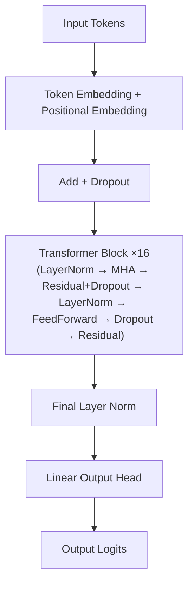
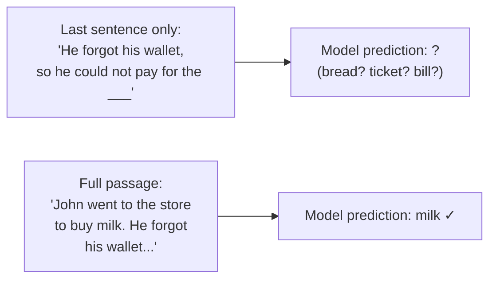
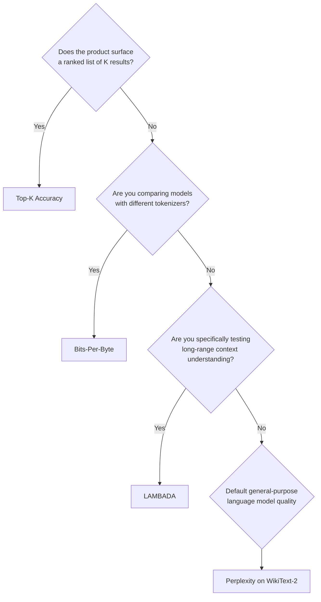
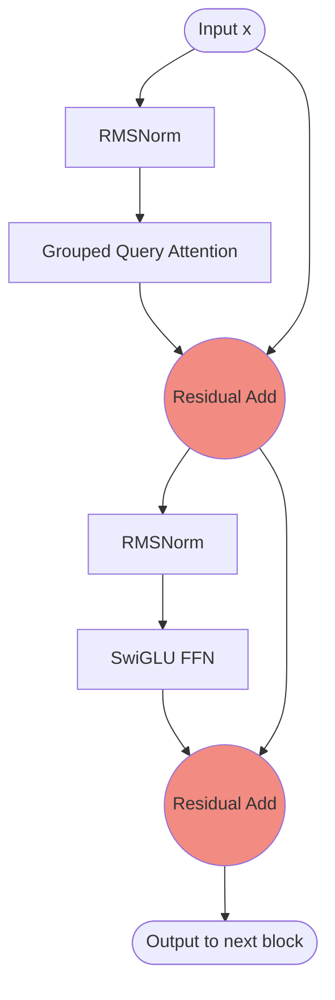
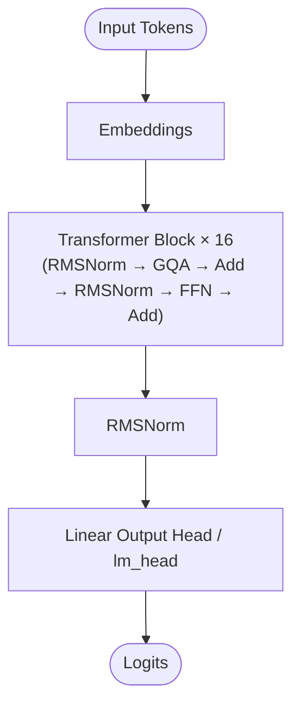
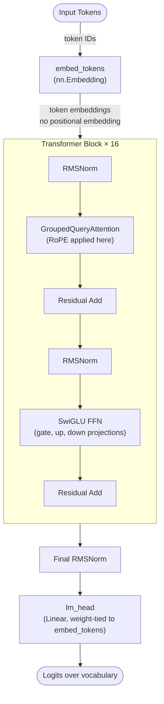
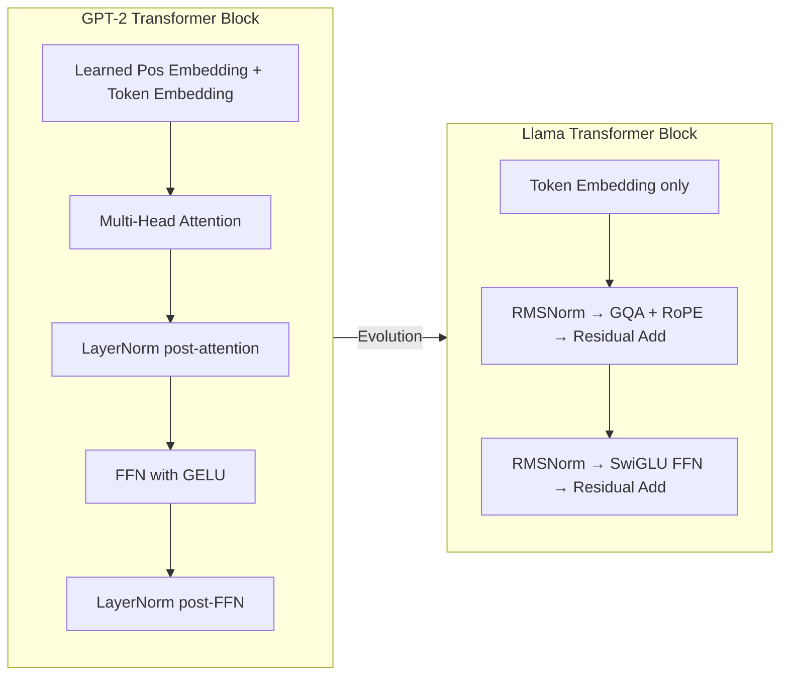
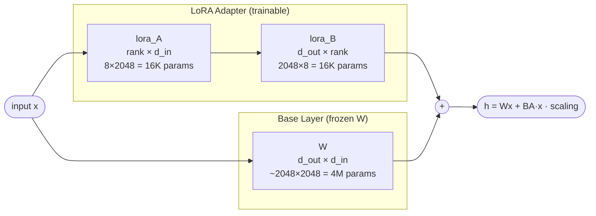
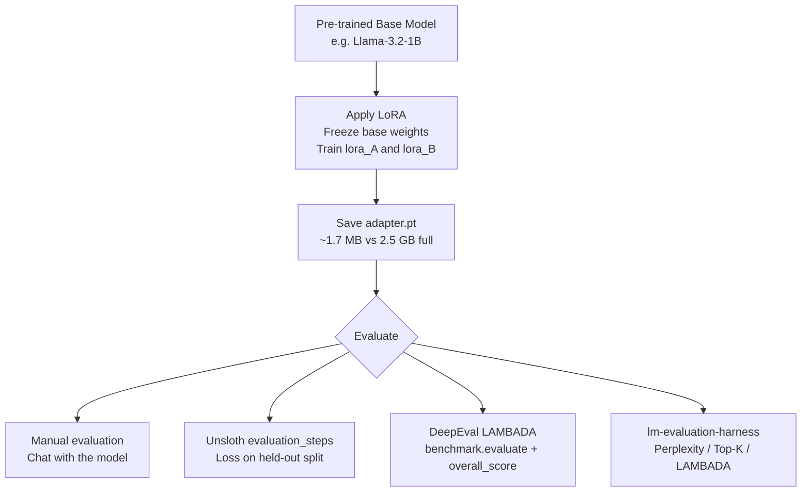

# LLM From Scratch — Part 5

Detailed notes synthesized from a 2:11:48 recorded lecture across 7 sections, 228 unique on-screen frames, and 30 canonical concepts.

## Table of Contents

1. [Lambada Benchmark, Perplexity, Effective Branching Factor ~379, Top-1 Accuracy, Bits-Per-Byte Bpb](#lambada-benchmark-perplexity-effective-branching-factor-379-top-1-accuracy-bits-per-byte-bpb) _(47.6 min, 0:03–47:37)_
2. [Grouped Query Attention Gqa, Rmsnorm, Deepseek-V4, Llama Architecture, Residual Skip Connections](#grouped-query-attention-gqa-rmsnorm-deepseek-v4-llama-architecture-residual-skip-connections) _(12.9 min, 47:37–1:00:30)_
3. [Format_Example Function, Prompt-Answer Split, Bpe Tokenization, Leading Space Token Merging, Single-Token Classification](#formatexample-function-prompt-answer-split-bpe-tokenization-leading-space-token-merging-single-token-classification) _(13.8 min, 1:00:30–1:14:16)_
4. [Tool Calling Fine-Tuning Motivation, Tool-Calling Fine-Tuning Dataset, Format_Example Function, Compact Json Answer Serialization, Max_Seq_Len=80](#tool-calling-fine-tuning-motivation-tool-calling-fine-tuning-dataset-formatexample-function-compact-json-answer-serialization-maxseqlen80) _(11.9 min, 1:14:16–1:26:08)_
5. [Before Vs After Comparison, Tool-Calling Fine-Tuning Dataset, Apply_Lora, Frozen Base Weights W, Rope Rotary Position Embeddings](#before-vs-after-comparison-tool-calling-fine-tuning-dataset-applylora-frozen-base-weights-w-rope-rotary-position-embeddings) _(10.2 min, 1:26:08–1:36:18)_
6. [Lambada Benchmark, Low Rank Adaptation, Unsloth, Llm Evaluation, Unsloth Studio Gui](#lambada-benchmark-low-rank-adaptation-unsloth-llm-evaluation-unsloth-studio-gui) _(26.2 min, 1:36:18–2:02:33)_
7. [Custom Ai Agents, Open-Source Vs Paid Models, Enterprise Ai Strategy, Model Commoditization, Llm On Edge Devices](#custom-ai-agents-open-source-vs-paid-models-enterprise-ai-strategy-model-commoditization-llm-on-edge-devices) _(9.2 min, 2:02:33–2:11:48)_

---

## LAMBADA Benchmark, Perplexity, Effective Branching Factor, Top-1 Accuracy, and Bits-Per-Byte

**Section timestamps:** 0:03 – 47:37
**Context:** This section opens the lecture by reviewing the INT8 quantization of GPT-2, then pivots to the central question: *how do you measure whether a language model is actually good?* Four evaluation metrics are introduced—perplexity, bits-per-byte (BPB), LAMBADA accuracy, and top-K accuracy—along with a decision guide for choosing among them.

---

### GPT-2 Architecture Recap and the Evaluation Motivation

The lecture opens with the GPT-2 architecture diagram (an Excalidraw flowchart) to orient the session. The stack, from bottom to top, is:



The session covers three activities in sequence:
1. INT8 quantization of GPT-2 (355 M variant)
2. Evaluation of model quality before and after quantization
3. Fine-tuning of Llama 3.2 1B (covered in the later half of the lecture)

The motivating question before diving into metrics: *You have just quantized a model. How do you know whether you have preserved its quality?*

---

### INT8 Quantization of GPT-2 with `torchao`

#### Why Quantize?

A 355 M parameter GPT-2 model stored in FP32 occupies approximately **1,646 MB** on disk. Many deployment targets—edge devices, mobile phones, constrained servers—cannot accommodate that footprint. Quantization reduces weight precision from 32-bit floats to 8-bit integers, shrinking the file to roughly **636 MB** (a **~61 % reduction**) while keeping inference functional.

The precision trade-off can be visualised as an address analogy: FP32 gives the exact latitude/longitude of a building; INT8 gives the city-block approximation. The model still arrives at the right neighbourhood, but not the exact door. This manifests as a small but measurable increase in perplexity after quantization.

#### The `quantize.py` Pipeline

The entire quantization is driven by a single library call from PyTorch's `torchao`:

```python
def quantize_model(model):
    """Apply INT8 weight-only quantization to Linear layers using torchao."""
    quantize_(model, Int8WeightOnlyConfig(version=2))
    return model
```

`torchao`'s `quantize_` mutates the model in-place, replacing the weight tensors of every `nn.Linear` layer with INT8 representations. The reason `model.py` (the architecture definition) is required—beyond just the `parameters.bin` weight file—is that quantization libraries need to *traverse* the model graph to identify which layers to optimize.

The full `quantize.py` file structure:

```python
import io
import os
import sys
import torch
import tiktoken
from torchao.quantization import quantize_, Int8WeightOnlyConfig

from model import (
    GPTModel, CONTEXT_LEN, MODEL_DIR,
    generate, text_to_token_ids, token_ids_to_text
)

from helper import get_settings_and_params, load_weights_into_gpt

QUANTIZED_MODEL_PATH = os.path.join("models", "quantized-model.pth")

def get_model_size_mb(model):
    """Get model size by saving to a temp buffer."""
    buffer = io.BytesIO()
    torch.save(model.state_dict(), buffer)
    size_mb = buffer.tell() / (1024 * 1024)
    return size_mb

def quantize_model(model):
    """Apply INT8 weight-only quantization to Linear layers using torchao."""
    quantize_(model, Int8WeightOnlyConfig(version=2))
    return model

def save_quantized_model(quantized_model, path=QUANTIZED_MODEL_PATH):
    """Save the quantized model state_dict."""
    torch.save(quantized_model.state_dict(), path)
    size_mb = os.path.getsize(path) / (1024 * 1024)
    print(f"Quantized model saved to: {path} ({size_mb:.1f} MB)")

def load_quantized_model(path=QUANTIZED_MODEL_PATH):
    """Load the quantized model: create model, quantize structure, load weights."""
    model = GPTModel()
    quantize_(model, Int8WeightOnlyConfig(version=2))
    model.load_state_dict(torch.load(path, weights_only=False))
    model.eval()
    return model
```

#### The `run_quantize` and `run_predict` Functions

```python
def run_quantize():
    """Quantize the original model and save it."""
    settings, params = get_settings_and_params(MODEL_DIR)
    model = GPTModel()
    load_weights_into_gpt(model, params)
    model.eval()

    original_size = get_model_size_mb(model)
    print(f"Original model size: {original_size:.1f} MB")

    print("Quantizing model (INT8 weight-only quantization)...")
    quantize_model(model)

    quantized_size = get_model_size_mb(model)
    print(f"Quantized model size: {quantized_size:.1f} MB")
    print(f"Size reduction: {(1 - quantized_size / original_size) * 100:.1f}%")

    save_quantized_model(model)

def run_predict():
    """Load the quantized model and generate text."""
    tokenizer = tiktoken.get_encoding("gpt2")

    print("Loading quantized model...")
    model = load_quantized_model()

    token_ids = generate(
        model=model,
        idx=text_to_token_ids("The future of AI", tokenizer),
        max_new_tokens=25,
        context_size=CONTEXT_LEN,
        top_k=50,
        temperature=1.5
    )

    print("Output text:\n", token_ids_to_text(token_ids, tokenizer))

if __name__ == "__main__":
    if len(sys.argv) < 2 or sys.argv[1] not in ("quantize", "predict"):
        print("Usage:")
        print("  python quantize.py quantize  - Quantize and save the model")
        print("  python quantize.py predict   - Generate text using the quantized model")
        sys.exit(1)

    if sys.argv[1] == "quantize":
        run_quantize()
    elif sys.argv[1] == "predict":
        run_predict()
```

**Key design point for loading:** When loading a previously saved quantized model, you must *first* apply `quantize_()` to the skeleton `GPTModel()` to configure the INT8 layer structure, and *then* load the saved state dict. Loading weights first and quantizing second would fail because the state dict keys refer to the quantized layer structure, not the original FP32 structure.

> [!info]+ Interview questions covered
> - Why do you need `model.py` for quantization, not just the weights file?
> - What does `Int8WeightOnlyConfig` do in `torchao`?
> - Why must `quantize_()` be called before `load_state_dict()` when loading a saved quantized model?
> - What is the approximate size reduction achievable with INT8 weight-only quantization on a 355 M GPT-2?

---

### Perplexity

#### Motivation: Comparing Two Models on the Same Prompt

Suppose two models are given the prompt *"The cat sat on the"* and both correctly predict the next token *"mat"*. The token-level prediction alone does not tell us which model is better. What distinguishes them is *confidence*: one model assigns 90 % probability to "mat" while the other spreads probability roughly equally across five candidates (each ~20 %).

This intuition is captured by **perplexity**: a single scalar that quantifies how *surprised* a model is, on average, when it sees the correct token.

#### Three Illustrative Cases

| Model | P("mat" | context) | Perplexity |
|---|---|---|---|
| Confident | 0.90 | ~1.11 |
| Somewhat Sure | 0.50 | ~2.00 |
| Confused (uniform over 5) | 0.20 | 5.00 |

- A perfectly certain model (P = 1.0) would have perplexity = 1.
- A model confused among 100 equally likely tokens has perplexity = 100.
- Lower perplexity ↔ higher model confidence ↔ better model quality.

#### Formal Definition

$$\text{Perplexity} = \exp\!\left(-\frac{1}{N}\sum_{i=1}^{N} \log P(w_i)\right)$$

where:
- $N$ is the number of tokens in the evaluation sequence
- $w_i$ is the $i$-th token (the ground-truth token at position $i$)
- $P(w_i)$ is the probability the model assigns to $w_i$ given all preceding tokens

The negation inside the exponent converts log-probability (which is $\leq 0$) into a positive average negative log-likelihood (NLL). The exponent then maps it back from log space to a human-readable branching factor.

#### Step-by-Step Walkthrough: "The cat sat on the mat."

The sentence has 6 prediction targets. At each step, the model sees a prefix and assigns a probability to the ground-truth next token:

| Step | Input prefix | Target token | $P(\text{target})$ | $-\log P(\text{target})$ |
|---|---|---|---|---|
| 1 | The | cat | 0.60 | 0.5108 |
| 2 | The cat | sat | 0.70 | 0.3567 |
| 3 | The cat sat | on | — | — |
| 4 | The cat sat on | the | — | — |
| 5 | The cat sat on the | mat | — | — |
| 6 | The cat sat on the mat | . | — | — |

Summing all six contributions:

$$\text{Total NLL} = 1.7893$$

$$\text{Average NLL} = \frac{1.7893}{6} = 0.2982$$

$$\text{Perplexity} = e^{0.2982} = 1.3475$$

The **effective branching factor** is the perplexity value itself: at each step, the model is effectively choosing from ~1.35 equally weighted options when predicting the correct token. When the lecture refers to an "effective branching factor ~379," that is the perplexity of GPT-2 evaluated on WikiText-2 raw text before training converges—the model is treating each prediction as if it had 379 equally likely candidates.

#### The Sliding Window for Long Sequences

For sequences longer than the model's context window ($C$ tokens), perplexity is computed with a **sliding window with stride $s$**. Each window of $C$ tokens advances by $s$ positions. Tokens in the overlap region are predicted with more context, which reduces boundary effects.

The causal masking within a single pass means all prefix lengths are evaluated simultaneously:

```
input: The          -> predict: cat
input: The cat      -> predict: sat
input: The cat sat  -> predict: on
...
input: The cat sat on the -> predict: mat
```

In the `evaluate.py` implementation, `STRIDE = 512` with a context size of 1024 means 512 tokens of overlap between consecutive windows, giving each interior token the benefit of at least 512 tokens of left context.

#### The log Scale Explained

$$\log(0) = -\infty \qquad \log(1) = 0$$

As $P(w_i) \to 1$, $-\log P(w_i) \to 0$, so the NLL contribution shrinks to zero and perplexity approaches 1.
As $P(w_i) \to 0$, $-\log P(w_i) \to +\infty$, so perplexity explodes.

This is why taking the log of probabilities and then exponentiating produces a metric that is bounded below at 1 and unbounded above.

#### Observed Values: GPT-2 355M Before and After Quantization

From the `EVAL.md` evaluation report:

| Metric | Base FP32 | Quantized INT8 |
|---|---|---|
| Perplexity (WikiText-2) | 18.73 | 19.71 |
| Model size | 1,646 MB | 636 MB |
| Size reduction | — | −61.4 % |

The quantized model's perplexity increases from 18.73 to 19.71—a degradation of ~5 %, which falls within the generally accepted threshold of 5–10 % for post-training quantization. An increase beyond 10 % would indicate that quantization is causing meaningful accuracy loss and the quantized model should be discarded.

#### When to Use Perplexity

- When comparing versions of the **same model** (e.g., before vs. after fine-tuning, or FP32 vs. quantized).
- When a single general language modelling quality score is needed.
- When the models being compared use the **same tokenizer** (see BPB section for the cross-tokenizer failure mode).
- Perplexity is computed once after training, stored, and then compared against future checkpoints—not recalculated on every inference.

> [!info]+ Interview questions covered
> - What does perplexity measure in the context of LLMs?
> - Why is lower perplexity always better?
> - What is the mathematical formula for perplexity?
> - What does an "effective branching factor of 379" mean?
> - Why does quantization increase perplexity? What is an acceptable increase?
> - How is perplexity computed for sequences longer than the context window?

---

### Bits-Per-Byte (BPB)

#### Why Perplexity Fails Across Different Tokenizers

Consider two models predicting the word *"cat"* after the prompt *"The"*:

- **Model 1** uses a BPE tokenizer where *"cat"* is a single token. It predicts one token and records $P(\text{cat})$.
- **Model 2** uses a character-level tokenizer where *"cat"* is three tokens: *"c"*, *"a"*, *"t"*. It predicts three tokens.

Model 1 divides its total NLL by $N = 1$; Model 2 divides by $N = 3$. Even if both models assign the same underlying probability to the surface string "cat", their computed perplexities will differ simply because of $N$.

Concretely, for the text *"Hello, world!"* (13 bytes in UTF-8):

| Tokenizer type | Tokens generated | Example perplexity |
|---|---|---|
| Word-level | 4 | 9.04 |
| BPE | ~6 | 6.83 |
| Character-level | 13 | 2.27 |

The character-level model appears ~4× better than word-level purely because it divides by a larger $N$. This is an artifact, not a quality signal.

#### BPB Formula

Instead of dividing by token count $N$, divide by the number of **bytes** $B$ in the raw text:

$$\text{BPB} = -\frac{1}{B} \sum_{i=1}^{N} \log_2 P(w_i)$$

where:
- $B$ = number of bytes (UTF-8 characters) in the evaluation text
- $\log_2$ is used so the result is in *bits* (information-theoretic units)
- $N$ = number of tokens (varies by tokenizer; cancels out via normalization to $B$)

By anchoring to the raw byte count of the text, BPB becomes **tokenizer-independent**: all three tokenizers above will produce the same BPB for the same underlying model quality, because they are all normalizing by the 13 bytes of "Hello, world!".

#### Relationship Between Perplexity and BPB

$$\text{BPB} = \frac{\ln(\text{Perplexity})}{\ln(2) \cdot \bar{b}}$$

where $\bar{b}$ is the average number of bytes per token. BPB is simply perplexity re-expressed in bits per byte rather than nats per token.

#### When to Use BPB

Use BPB whenever comparing models that use **different tokenizers**—for example, comparing GPT-4 (which uses cl100k_base) against Llama (which uses SentencePiece). Major AI labs explicitly use BPB in their technical reports precisely because model generations often ship new tokenizers.

> [!info]+ Interview questions covered
> - Why does perplexity fail when comparing models with different tokenizers?
> - What does BPB normalize by, and why does that solve the tokenizer problem?
> - What is the formula for BPB?
> - In which unit is BPB expressed, and why?

---

### LAMBADA Benchmark

#### What LAMBADA Tests

**LAMBADA** stands for *Language Modeling Broadened to Account for Discourse Aspects*. It is a curated dataset designed to test whether a language model can leverage **long-range context**—information that appears many sentences earlier in a passage.

Each LAMBADA example is a multi-sentence passage where the **final word** can only be correctly predicted if the model has retained and integrated information from earlier sentences. The final word cannot be guessed from the final sentence alone.

Example:

> *"John went to the store to buy milk. He forgot his wallet, so he could not pay for the ____."*

- The answer is **"milk"**.
- Knowing only the last sentence (*"He forgot his wallet, so he could not pay for the ____"*), a model has no way to determine what he was buying.
- Only by integrating the first sentence's information ("buy milk") can the model correctly predict "milk".

#### What the Benchmark Measures

LAMBADA does not use perplexity. Instead it measures **exact-match accuracy**: did the model place the correct final word at the top of its probability distribution?

- The model is fed the full passage as context.
- It must predict the next token after the last complete sentence.
- The prediction is correct only if the exact correct word (e.g., "milk") has the highest probability.
- There is no partial credit for near-misses.

#### Why LAMBADA Cannot Be Solved Without Context



The dataset is manually curated: a human must confirm that the final word is *not* guessable from the last sentence alone. This quality control makes LAMBADA a reliable long-context probe.

#### LAMBADA in Practice

The benchmark is distributed as a JSONL file (`lambada_test_en.jsonl`), where each line is a JSON object containing a passage and its expected final word. The evaluation script:

1. Reads each passage from the JSONL file.
2. Feeds the full passage (minus the final word) to the model.
3. Checks whether the model's top-1 prediction matches the ground truth.
4. Reports the fraction of passages predicted correctly.

```python
LAMBDA_TEST_URL = [
    "https://huggingface.co/datasets/EleutherAI/lambada_openai/resolve/main/"
    "data/lambada_test_en.jsonl"
]
LAMBDA_CACHE = os.path.join("dataset", "lambada", "lambada_test_en.jsonl")
```

#### When to Use LAMBADA

Use LAMBADA when specifically evaluating or comparing models on **long-range context retention**. If a model is being trained or fine-tuned for tasks that require discourse-level understanding (summarization, multi-turn dialogue, document QA), LAMBADA is the appropriate benchmark.

> [!info]+ Interview questions covered
> - What does LAMBADA stand for, and what does it test?
> - Why can't LAMBADA examples be solved from the last sentence alone?
> - How is the LAMBADA score computed? Is it perplexity or accuracy?
> - What kind of dataset is LAMBADA and how is it structured?

---

### Top-K Accuracy

#### Motivation

In many product scenarios, a model is not expected to produce a single correct answer—it produces a ranked list of candidates, and success means the correct answer appears *somewhere* in the top $K$ results.

Practical examples:
- A search engine showing the top 5 results for a query.
- A code completion tool showing the top 3 suggestions.
- An autocomplete system showing the top 10 next-word predictions.

#### Definition

**Top-K accuracy** for a single prediction: the model's prediction is considered *correct* if the ground-truth token appears among the $K$ highest-probability tokens in the model's output distribution.

**Top-K accuracy over a dataset**: the fraction of evaluation examples where the ground-truth token is within the model's top-$K$ predictions.

In the evaluation code, three thresholds are measured simultaneously:

```python
TOPK_VALUES = (1, 5, 10)
```

This computes Top-1, Top-5, and Top-10 accuracy in a single pass. Top-1 accuracy is the strictest (exact-match); Top-10 is the most lenient.

#### When to Use Top-K Accuracy

Use Top-K accuracy when the downstream product:
- Surfaces multiple ranked suggestions to the user.
- Accepts any correct answer within a shortlist.
- Has a clearly defined $K$ that matches the UI/UX (e.g., the IDE completion widget shows exactly 5 options).

Top-K accuracy is not appropriate for evaluating general language modelling quality; it is most meaningful when there is a well-defined retrieval-style task structure.

> [!info]+ Interview questions covered
> - What is Top-K accuracy, and when is it more appropriate than perplexity?
> - How does Top-1 differ from Top-5 accuracy?
> - In what product contexts is Top-K the right metric?

---

### Which Metric to Use: A Decision Guide

The lecture introduces a four-question decision flow for choosing among the metrics:



**Combination use:** The metrics are not mutually exclusive. A long-range model might be evaluated with LAMBADA (for long-context ability) and perplexity (for short-context baseline), with BPB added if the comparison spans different tokenizer families. The evaluation report for GPT-2 355M reports all five metrics simultaneously (Perplexity, BPB, Top-1/5/10, LAMBADA, Model size).

> [!info]+ Interview questions covered
> - When would you choose perplexity over LAMBADA?
> - When does perplexity fail as a comparison metric, and what replaces it?
> - Can you use multiple evaluation metrics at the same time? Give an example.

---

### `evaluate.py` — The Evaluation Script

The script `evaluate.py` implements all four metrics in a single run. The key constants and imports:

```python
import sys
import json
import math
import time
import urllib.request

import torch
import torch.nn.functional as F
import tiktoken
from tqdm import tqdm

from model import GPTModel, CONTEXT_LEN, MODEL_DIR
from quantize import load_quantized_model, get_model_size_mb
from helper import get_settings_and_params, load_weights_into_gpt

WIKITEXT2_TEST_URL = (
    "https://huggingface.co/datasets/Salesforce/wikitext/resolve/main/"
    "wikitext-2-raw-v1/test-00000-of-00001.parquet"
)
WIKITEXT2_CACHE = os.path.join("dataset", "wikitext-2-raw", "wiki.test.raw")

LAMBDA_TEST_URL = [
    "https://huggingface.co/datasets/EleutherAI/lambada_openai/resolve/main/"
    "data/lambada_test_en.jsonl"
]
LAMBDA_CACHE = os.path.join("dataset", "lambada", "lambada_test_en.jsonl")

STRIDE = 512
TOPK_VALUES = (1, 5, 10)
```

**WikiText-2** is the standard benchmark corpus for perplexity evaluation. The test split contains tens of thousands of tokens drawn from verified Wikipedia articles, providing a clean, domain-consistent evaluation surface.

**STRIDE = 512** implements the sliding-window overlap described in the perplexity section. The context window is 1024 tokens; the window advances 512 tokens at a time, so every token (except those in the very first window) is predicted with at least 512 tokens of left context.

#### Running the Evaluation

```bash
# Full evaluation (all metrics, all data)
python evaluate.py

# Quick evaluation (subset for fast iteration)
python evaluate.py --max-tokens 2048 --lambada-max 10
```

The quick mode is useful during development: `--max-tokens 2048` limits the WikiText-2 perplexity computation to the first 2048 tokens, and `--lambada-max 10` evaluates only 10 LAMBADA passages instead of the full test set.

#### GPT-2 355M Full Evaluation Results

| Metric | Base FP32 | Quantized INT8 | Change |
|---|---|---|---|
| Perplexity | 18.73 | 19.71 | +5.2 % |
| Bits-per-byte | — | — | small increase |
| Top-1 accuracy | — | — | small decrease |
| Top-5 accuracy | — | — | small decrease |
| Top-10 accuracy | — | — | small decrease |
| LAMBADA accuracy | — | — | small decrease |
| Model size | 1,646 MB | 636 MB | −61.4 % |

The ~5 % perplexity increase after INT8 quantization is within the acceptable 5–10 % range, indicating that the size savings do not come at the cost of meaningful quality degradation for this model size.

#### Practical Notes on Perplexity Monitoring

- Perplexity is not computed during routine inference; it is a post-training evaluation step.
- Compute perplexity once after training completes and store it.
- After any subsequent change (fine-tuning run, quantization, layer pruning), recompute and compare.
- If perplexity increases beyond the acceptable threshold, discard the modified model.
- The same four metrics apply regardless of whether a model was modified by quantization, pruning (layer removal), or fine-tuning: what matters is input vs. output behaviour, not what changed inside the model.

> [!info]+ Interview questions covered
> - What dataset is commonly used to compute perplexity for GPT-family models?
> - What is the purpose of the `STRIDE` parameter in perplexity evaluation?
> - What is an acceptable perplexity degradation percentage after INT8 quantization?
> - How would you use `evaluate.py` for a quick sanity check vs. a full evaluation run?
> - Does pruning (removing layers) require different evaluation metrics from quantization?

---

### Summary Table: All Four Metrics

| Metric | Measures | Dataset | Score type | Use when |
|---|---|---|---|---|
| **Perplexity** | Model confidence / surprise | WikiText-2 (or any held-out text) | Lower is better | Same-tokenizer comparison; general quality |
| **Bits-per-byte** | Tokenizer-independent surprise | Any text (normalized to bytes) | Lower is better | Cross-tokenizer comparison |
| **LAMBADA** | Long-range context retention | LAMBADA test JSONL | Accuracy (higher is better) | Discourse/long-context tasks |
| **Top-K Accuracy** | Correct answer in top-K | Task-specific | Accuracy (higher is better) | Ranked-list product features |

The effective branching factor ~379 referenced in the section title is simply the perplexity of an early GPT-2 checkpoint on WikiText-2: the model behaves as if it is choosing randomly among 379 equally likely tokens at each step, illustrating why evaluation is necessary—and why reducing that number through training and fine-tuning is the central goal of the rest of the lecture series.


## Grouped Query Attention, RMSNorm, RoPE, and the Llama Architecture

**Lecture segment:** 47:37 – 1:00:30
**Key concepts:** Grouped Query Attention (GQA), RMSNorm, Rotary Position Embedding (RoPE), SwiGLU, residual skip connections, DeepSeek-V4 hybrid attention, Llama 3.2-1B architecture

This section examines how the Llama transformer block differs from the GPT-2-style block built earlier in the course. The differences are not arbitrary — each modification addresses a specific performance, stability, or efficiency problem in the original design.

---

### GPT-2 vs Llama: Side-by-Side Comparison

Before diving into individual components, it is useful to frame the changes at a high level.

| Component | GPT-2 / Original Transformer | Llama 3.2 |
|---|---|---|
| Attention mechanism | Multi-Head Attention (MHA) | Grouped Query Attention (GQA) |
| Normalization | LayerNorm (post-norm) | RMSNorm (pre-norm) |
| FFN activation | GELU | SwiGLU (3 projections) |
| Positional encoding | Learned positional embeddings (separate weights) | Rotary Position Embedding (RoPE, no learned weights) |
| Normalization placement | After sub-layer | Before sub-layer (pre-norm) |
| Number of transformer layers | Variable | 16 (for the 1B model) |

---

### The Llama Transformer Block: Architecture Diagram

The Excalidraw diagram shown in the lecture describes a single Llama Transformer Block. Sixteen such blocks are stacked. The data flow inside each block, from input to output, is:



The complete stack for Llama 3.2-1B:



The two red "skip (residual)" arrows in the original Excalidraw diagram correspond to the two `Residual Add` operations — one wrapping the attention sub-layer and one wrapping the FFN sub-layer.

---

### The Pre-Norm Pattern

In the original GPT-2 design, layer normalization was applied **after** each sub-layer (post-norm). Llama applies RMSNorm **before** each sub-layer (pre-norm). This change improves training stability, especially at scale, because gradients flow through the residual path without first passing through a normalization operation.

The pattern for each sub-block is identical:

```
shortcut = x
x = RMSNorm(x)        # normalize before
x = SubLayer(x)       # attention or FFN
x = x + shortcut      # residual add
```

---

### RMSNorm (Root Mean Square Layer Normalization)

#### Why normalization matters

Deep networks suffer from internal covariate shift — the distribution of each layer's input changes during training, slowing convergence. Layer Normalization solved this by normalizing over the feature dimension and learning a scale ($\gamma$) and shift ($\beta$). RMSNorm simplifies this: it drops the mean-centering step and the $\beta$ parameter, keeping only the RMS scaling.

#### The formula

LayerNorm computes:

$$\hat{x}_i = \frac{x_i - \mu}{\sqrt{\sigma^2 + \epsilon}} \cdot \gamma_i + \beta_i$$

RMSNorm removes $\mu$ and $\beta$:

$$\text{RMS}(x) = \sqrt{\frac{1}{n} \sum_{i=1}^{n} x_i^2}$$

$$\hat{x}_i = \frac{x_i}{\text{RMS}(x) + \epsilon} \cdot \gamma_i$$

#### Why modern LLMs prefer RMSNorm

- Fewer operations (no mean computation, no bias term).
- Faster than LayerNorm while achieving equivalent or better training stability.
- Adopted by: Llama, Mistral, Gemma, Qwen, PaLM, DeepSeek.

The `rms_norm_eps` hyperparameter (a small $\epsilon$ value like `1e-6`) prevents division by zero.

> [!info]+ Interview questions covered
> - What is RMSNorm and how does it differ from LayerNorm?
> - Why do modern LLMs prefer RMSNorm over LayerNorm?
> - What is the pre-norm pattern and why does it improve training stability?

---

### Grouped Query Attention (GQA)

#### Background: the KV cache memory problem

Standard Multi-Head Attention (MHA) maintains one Key and one Value head per Query head. During autoregressive inference, the KV cache grows linearly with sequence length for every head. With many heads and long sequences, this becomes the primary memory bottleneck.

**Multi-Query Attention (MQA)** addressed this by sharing a single K and V head across all Q heads, drastically reducing KV cache size but sacrificing quality. GQA is the middle ground: Q heads are organized into **groups**, and each group shares one K/V head.

#### Key parameters in the Llama codebase

In the `LlamaModel` constructor:

```python
class LlamaModel(nn.Module):
    def __init__(self, vocab_size=VOCAB_SIZE, hidden_size=HIDDEN_SIZE,
                 intermediate_size=INTERMEDIATE_SIZE, num_layers=NUM_LAYERS,
                 num_heads=NUM_HEADS, num_kv_heads=NUM_KV_HEADS,
                 head_dim=HEAD_DIM, max_seq_len=MAX_SEQ_LEN,
                 rope_theta=ROPE_THETA, rms_norm_eps=RMS_NORM_EPS,
                 tie_word_embeddings=TIE_WEIGHTS):
        super().__init__()

        self.embed_tokens = nn.Embedding(vocab_size, hidden_size)

        self.layers = nn.ModuleList([
            TransformerBlock(
                hidden_size=hidden_size,
                num_heads=num_heads,
                num_kv_heads=num_kv_heads,
                head_dim=head_dim,
                intermediate_size=intermediate_size,
                max_seq_len=max_seq_len,
                rope_theta=rope_theta,
                rms_norm_eps=rms_norm_eps,
            )
            for _ in range(num_layers)
        ])

        self.norm = RMSNorm(hidden_size, eps=rms_norm_eps)
        self.lm_head = nn.Linear(hidden_size, vocab_size, bias=False)

        # weight tying (llama ties embed_tokens -> lm_head)
        if tie_word_embeddings:
            self.lm_head.weight = self.embed_tokens.weight

    def forward(self, input_ids):
        # input_ids: (batch, seq_len)
        x = self.embed_tokens(input_ids)

        for layer in self.layers:
            x = layer(x)

        x = self.norm(x)
        logits = self.lm_head(x)
        return logits
```

- `num_heads`: number of Query heads.
- `num_kv_heads`: number of Key/Value heads. When `num_kv_heads < num_heads`, multiple Q heads share the same K/V pair — that is GQA.

#### GQA at the TransformerBlock level

The `TransformerBlock` wires GQA together with the other Llama components:

```python
class TransformerBlock(nn.Module):
    def __init__(self, hidden_size, num_heads, num_kv_heads,
            head_dim, intermediate_size, max_seq_len,
            rope_theta, rms_norm_eps):
        super().__init__()

        self.self_attn = GroupedQueryAttention(
            hidden_size=hidden_size,
            num_heads=num_heads,
            num_kv_heads=num_kv_heads,
            head_dim=head_dim,
            max_seq_len=max_seq_len,
            rope_theta=rope_theta,
        )
        self.mlp = SwiGLU(hidden_size, intermediate_size)
        self.input_layernorm = RMSNorm(hidden_size, eps=rms_norm_eps)
        self.post_attention_layernorm = RMSNorm(hidden_size, eps=rms_

    def forward(self, x):
        # pre-norm + attention + residual
        shortcut = x
        x = self.input_layernorm(x)
        x = self.self_attn(x)
        x = x + shortcut

        # pre-norm + FFN + residual
        shortcut = x
```

The full forward pass of the block applies the pre-norm pattern twice: once before attention and once before the FFN.

| Mechanism | Q heads | K/V heads | Memory cost | Quality |
|---|---|---|---|---|
| MHA (Multi-Head Attention) | H | H | High | Highest |
| MQA (Multi-Query Attention) | H | 1 | Lowest | Lower |
| GQA (Grouped Query Attention) | H | G (1 < G < H) | Medium | High |

> [!info]+ Interview questions covered
> - What is the difference between MHA, MQA, and GQA?
> - Why does GQA reduce memory consumption during inference?
> - What parameters control GQA in the Llama implementation?

---

### SwiGLU: The Feed-Forward Activation

GPT-2 used GELU as the FFN activation. Llama replaces this with **SwiGLU**, which adds a gating mechanism via three linear projections instead of two.

The formula is:

$$\text{SwiGLU}(x) = \text{gate\_proj}(x) \otimes \text{SiLU}(\text{up\_proj}(x))$$

followed by a down projection. $\text{SiLU}(x) = x \cdot \sigma(x)$ (also called Swish).

```python
# SwiGLU Feed-Forward
# Llama uses SwiGLU instead of GELU:
# SwiGLU(x) = (gate_proj(x) * silu(up_proj(x))) then down_proj
# This has 3 linear layers instead of 2, but works better.

class SwiGLU(nn.Module):
    def __init__(self, hidden_size, intermediate_size):
        super().__init__()
        self.gate_proj = nn.Linear(hidden_size, intermediate_size, bias=False)
        self.up_proj   = nn.Linear(hidden_size, intermediate_size, bias=False)
        self.down_proj = nn.Linear(intermediate_size, hidden_size, bias=False)

    def forward(self, x):
        gate = F.silu(self.gate_proj(x))  # SiLU = x * sigmoid(x)
        up   = self.up_proj(x)
        return self.down_proj(gate * up)
```

The extra projection (`gate_proj`) acts as a learned gate that selectively amplifies or suppresses features from `up_proj`. This multiplicative interaction is more expressive than additive GELU, producing better downstream performance at equivalent parameter count.

---

### Rotary Position Embedding (RoPE)

#### The problem with learned positional embeddings

The original transformer (and GPT-2) learned two separate sets of weights: **token embeddings** (mapping token IDs to vectors) and **positional embeddings** (encoding each position 0, 1, …, N as a vector, then summing the two). Both were learned parameters. This has two downsides: extra parameters to train, and difficulty generalizing to sequences longer than the training context.

#### What RoPE does differently

RoPE encodes position by **rotating** the Query and Key vectors in the attention layer. No separate positional embedding layer exists; positional information enters implicitly through the rotation applied to Q and K before the dot product.

The mathematical foundation is the 2D rotation matrix:

$$\begin{pmatrix} x' \\ y' \end{pmatrix} = \begin{pmatrix} \cos\theta & -\sin\theta \\ \sin\theta & \cos\theta \end{pmatrix} \begin{pmatrix} x \\ y \end{pmatrix}$$

This rotation preserves the vector's magnitude while changing its direction as a function of the angle $\theta$. In RoPE, $\theta$ depends on the token's position index and a frequency schedule controlled by `rope_theta`. When two rotated vectors (for positions $m$ and $n$) are multiplied via the attention dot product, the result encodes only the **relative** displacement $m - n$, giving the model position-awareness without extra learned weights.

#### Implementation in `llama_model.py`

```python
# Rotary Position Embeddings (RoPE)
# Instead of learned position embeddings, RoPE encodes position
# by rotating the query and key vectors. This gives the model
# relative position awareness without any learned parameters.

def precompute_rope_freqs(head_dim, max_seq_len, theta=500000.0):
    """Precompute the cos and sin tables for RoPE."""
    # Frequencies: [head_dim/2]
    freqs = 1.0 / (theta ** (torch.arange(0, head_dim, 2).float() / head_dim))
    # positions: [max_seq_len]
    positions = torch.arange(max_seq_len).float()
    # outer product: [max_seq_len, head_dim/2]
    angles = torch.outer(positions, freqs)
    # cos/sin tables: [max_seq_len, head_dim/2]
    return torch.cos(angles), torch.sin(angles)

def _rotate_half(x):
    """Rotate the second half of the last dim to the first (HF Llama style)."""
    half = x.shape[-1] // 2
    x1 = x[..., :half]
    x2 = x[..., half:]
    return torch.cat((-x2, x1), dim=-1)
```

`torch.outer(positions, freqs)` computes the angle $\theta_{p,i} = p / \text{rope\_theta}^{2i/d}$ for each position $p$ and frequency index $i$. Cosine and sine tables are precomputed once and reused during forward passes.

#### Consequence for the Llama architecture

In the Llama architecture diagram, the `Embeddings` block contains only **token embeddings** — there is no separate positional embedding matrix. Positional encoding happens inside `GroupedQueryAttention` when the precomputed RoPE frequencies are applied to the Q and K projections. This also explains why searching for `rope` in `llama_model.py` returns 27–30 matches: `rope_theta` propagates as a constructor argument through `LlamaModel` down to every `TransformerBlock` and into `GroupedQueryAttention`.

Every model released after Llama (Mistral, Gemma, Qwen, DeepSeek, etc.) adopted RoPE as the de facto positional encoding method.

| Feature | Learned positional embedding | RoPE |
|---|---|---|
| Separate positional weight matrix | Yes | No |
| Can generalize beyond training context | Harder | Easier (relative) |
| Parameters added | Yes (seq_len × hidden_size) | None |
| Applied at | Embedding layer | Q, K projections inside attention |

> [!info]+ Interview questions covered
> - What is RoPE and why does it replace learned positional embeddings?
> - Where in the Llama forward pass does positional information enter?
> - What is `rope_theta` and what does it control?
> - How does RoPE preserve the magnitude of Q and K vectors while encoding position?

---

### Residual Skip Connections

Residual (skip) connections allow the input to a sub-layer to bypass that sub-layer and be added to its output. The standard formula is:

$$x_{\text{out}} = x_{\text{in}} + \text{SubLayer}(\text{Norm}(x_{\text{in}}))$$

Each Llama Transformer Block contains two residual connections:

1. Wrapping the attention sub-block: `x = x + attention(norm(x))`.
2. Wrapping the FFN sub-block: `x = x + ffn(norm(x))`.

Residual connections solve the vanishing gradient problem: gradients have a direct path from output to input through the skip connection, regardless of how many non-linear transformations were applied in the sub-layer. This makes training deeper networks feasible.

---

### DeepSeek-V4: The Attention Mechanism Continues to Evolve

The lecture used the release of DeepSeek-V4 (released the same morning as the lecture) as a real-world example of how architectural evolution builds on existing concepts.

#### DeepSeek-V4 model overview

DeepSeek-V4 is a family of open Mixture-of-Experts (MoE) language models:

| Model | Total parameters | Activated per token | Layers | Context | Training tokens |
|---|---|---|---|---|---|
| DeepSeek-V4-Flash | 284B | 13B | 43 | 1M | 32T |
| DeepSeek-V4-Pro | 1.6T | 49B | 61 | 1M | 33T |

#### Hybrid Attention: CSA and HCA

DeepSeek-V4 replaces standard GQA with **Hybrid Attention** combining two mechanisms:

**Compressed State Attention (CSA):** Rather than attending over all tokens at full resolution, tokens are grouped and compressed into summary vectors. A fast Lightning Indexer scores each compressed entry against the current query, and only the top-k scoring entries are used for full attention. This reduces both compute and memory.

```python
All tokens:    [t1][t2][t3][t4][t5][t6][t7][t8] ...
               |________|    |________|
               group 1       group 2
                  |              |
Compressed:     [C1]           [C2]           [C3] ...
                  |              |              |
Lightning Indexer scores each one against current query
                  |              |              |
              score=0.9      score=0.2      score=0.8
                  |              |              |
Top-k selection:  [ C1 ]      ( C2 )        [ C3 ]
                  picked       skipped        picked
                  |                           |
                  +---------------+-----------+
                                  |
                                  v
               Attention runs only on [C1] and [C3]
                       (the picked compressed entries)
```

This is analogous to a librarian with 250,000 summary cards who scores each card quickly, then reads only the top few in full — most of the library is skipped.

**Sliding Window Branch:** Both CSA and HCA keep a small set of recent, uncompressed KV entries (window size 128 tokens for DeepSeek-V4) available for full attention. Recent context is kept verbatim.

**Attention Sink:** Learnable sink logits are added to the softmax denominator, allowing attention scores to sum to less than 1. This gives the model the ability to express "none of these tokens are particularly relevant right now". RMSNorm is applied to queries and compressed KV entries before the attention dot product to stabilize logit magnitudes.

The key insight from the lecture: understanding GQA deeply made it possible to quickly grasp what DeepSeek-V4's hybrid attention was doing, because CSA is a natural extension of the key-reduction idea in GQA — taken further by adding compression and learned selection.

> [!info]+ Interview questions covered
> - What is Compressed State Attention (CSA) and how does it differ from GQA?
> - How does the Lightning Indexer enable efficient sparse attention in DeepSeek-V4?
> - What is an attention sink and why does it help?
> - What is the relationship between understanding GQA and understanding DeepSeek-V4's attention?

---

### Complete Llama Architecture: Putting It All Together

The full forward pass of Llama 3.2-1B, from tokens to logits:



**Weight tying:** `lm_head` shares its weight matrix with `embed_tokens`. This is a standard trick that reduces the parameter count without hurting quality — the embedding matrix that maps IDs to vectors is reused (transposed) to project the final hidden state back to vocabulary logits.

---

### Base Model Behavior Before Fine-Tuning

The lecture demonstrated the Llama 3.2-1B model running inference before any fine-tuning:

```python
python3 generate_text.py --temp 0.0 --prompt "I love this movie!"
```

Output:
```
I love this movie! I have seen it a few times and I still love it.
I think it is a great movie. I think it is a great movie. I think it
is a great movie. I think it is a great movie. ...
```

The base model is a next-token predictor. Given any text, it continues that text coherently but has no concept of a task (e.g., outputting a sentiment label). It cannot follow instructions. This motivates fine-tuning: the architecture is the same Llama block described above, but the learned weights must be adjusted so the model maps structured prompts to structured outputs.

---

### Summary of Architectural Differences: GPT-2 → Llama 3.2-1B



Each change — RMSNorm, GQA, SwiGLU, RoPE — independently improves some aspect of efficiency, quality, or generalization. Understanding each one in isolation enables rapid absorption of future architectures, including DeepSeek-V4's more aggressive compression and sparse attention innovations.


## Format Example Function, Prompt-Answer Split, BPE Tokenization, and Single-Token Classification

**Lecture section:** 1:00:30 – 1:14:16
**File covered:** `classification_finetune.py`
**Model:** Llama 3.2-1B (full fine-tuning, no LoRA)

This section covers the complete data-preparation and training pipeline for sentiment classification fine-tuning. The central insight is that a careful tokenization trick — prepending a single space to the label string — collapses a multi-token label into a single token, reducing the classification task to a one-step next-token prediction.

---

### The JSONL Training Dataset Format

Each training example in the dataset file is a JSON object on its own line with exactly two fields:

```python
{"text": "I loved it", "label": "positive"}
{"text": "Terrible experience", "label": "negative"}
```

The `text` field contains the raw review or input sentence. The `label` field is always one of two string values: `"positive"` or `"negative"`. The JSONL format (one JSON object per line) is the standard for supervised fine-tuning datasets because it allows streaming row-by-row without loading the entire file into memory.

---

### The `format_example` Function

The `format_example` function is the single point of transformation from a raw JSONL record into a `(prompt, answer)` string pair. It encodes the design decision about how classification is framed for the language model.

```python
SAVE_PATH = os.path.join("models", "Llama-3.2-1B-classification-finetune", "model.pt")

# Example
#
#  in:
#    {"text": "I loved it", "label": "positive"}
#
#  out:
#    prompt = I loved it
#    answer =  positive

def format_example(ex):
    label = ex["label"].strip().lower()
    assert label in ("positive", "negative"), f"bad label: {label}"
    # Leading space -> BPE merges it into a single " positive" / " negative" token.
    return ex["text"], " " + label
```

The function does three things:

1. **Normalises the label** — strips whitespace and lowercases to handle inconsistent casing in the source data.
2. **Validates the label** — an `assert` guards against any value that is not `"positive"` or `"negative"`, failing fast during dataset preparation rather than silently during training.
3. **Returns two separate strings** — the raw text as the prompt and `" " + label` (note the leading space) as the answer string.

The return value is a tuple `(prompt_str, answer_str)`. The two strings are kept separate at this stage because `SFTDataset.__getitem__` will tokenize them independently and use the split point to construct the label tensor with masked prompt positions.

---

### BPE Tokenization and the Leading Space Trick

#### Why the leading space matters

Llama uses a Byte Pair Encoding (BPE) tokenizer. BPE builds its vocabulary from the most frequent byte-pair merges seen during pre-training. Because text in natural language almost always has a space before a word (except at the very start of a sentence), the tokenizer's merge rules are trained on `" positive"` (with the space) far more often than `"positive"` (without). The result is that the two surface forms tokenize differently:

| String | Token IDs | Number of tokens |
|---|---|---|
| `"positive"` | `[6_ 93, 1413]` (approximate) | 2 |
| `" positive"` | `[6928]` | **1** |
| `"negative"` | `[8389, 1413]` (approximate) | 2 |
| `" negative"` | `[8389]` | **1** |

The Llama 3.2 tokenizer assigns ID **6928** to the single token `" positive"` and a corresponding single ID to `" negative"`. Without the leading space, each label would decompose into two sub-word tokens, making the classification task a two-step sequence generation problem instead of a one-step prediction.

#### Concrete token ID example

```python
# Example of what __getitem__ returns (real Llama token IDs, max_seq_len=8)
#
#  ex = {"text": "I loved it", "label": "positive"}
#  prompt_ids = [128000,  40, 10456,  433]   # BOS, "I", " loved", " it"
#  answer_id  = 6928                          # " positive" - a single token
```

- **128000** is Llama's Begin-of-Sequence (BOS) token. It is prepended to the prompt so the model sees a standard sequence start, matching the format used during pre-training.
- **40** encodes `"I"`, **10456** encodes `" loved"`, **433** encodes `" it"`.
- **6928** is the entire answer: a single integer representing `" positive"`.

#### Why single-token classification is preferred

When the label tokenises to a single token, the model must make exactly one prediction at the position immediately following the last prompt token. The gradient flows through only one cross-entropy term, the label tensor has only one non-masked position, and inference is a single forward pass that compares the logit at position `[6928]` against the logit at the `" negative"` token ID. If the label were two tokens, the model would need to generate a sequence, which adds complexity to both training (more positions contribute loss) and inference (requires an autoregressive loop or careful batching).

> **Interview question:** Why is a leading space prepended to the label string in `format_example`, and what would happen if it were omitted?
>
> Without the leading space, words like `"positive"` may tokenise to two or more BPE sub-words rather than a single token. Classification fine-tuning works cleanest when the target is exactly one token: the label tensor has a single non-masked entry, training reduces to one cross-entropy term per example, and inference selects between two token IDs with a single argmax. Omitting the space forces multi-token label prediction, which complicates the loss masking design and may degrade fine-tuning efficiency.

---

### SFTDataset: Building the Input and Label Tensors

`SFTDataset` is a `torch.utils.data.Dataset` subclass. Its constructor accepts the path to the JSONL file, the tokenizer instance, `MAX_SEQ_LEN`, and the `format_example` callable. For each example, `__getitem__` does the following:

1. Calls `format_example(ex)` to get `(prompt_str, answer_str)`.
2. Tokenises `prompt_str` with BOS prepended → `prompt_ids` (a list of ints).
3. Tokenises `answer_str` without BOS and takes the first (and only) token → `answer_id` (a single int).
4. Constructs the **input tensor** `X` = `prompt_ids` padded or truncated to `MAX_SEQ_LEN`.
5. Constructs the **label tensor** `y` of the same length, filled entirely with `-100` (the ignore index) except for the position where `answer_id` goes — the last non-padding position of the prompt, i.e. the position whose output logit should predict the label.

Positions marked `-100` in `y` are ignored by `nn.CrossEntropyLoss(ignore_index=-100)`, so the only position that contributes to the gradient is the single answer token position.

---

### The Training Loop (`train` and `run_train`)

#### The `train` function

```python
def train(dataloader, model, loss_fn, optimizer):
    model.train()
    for batch, (X, y) in enumerate(dataloader):
        X, y = X.to(DEVICE), y.to(DEVICE)

        logits = model(X)
        loss = loss_fn(logits.flatten(0, 1), y.flatten())
        loss.backward()
        optimizer.step()
        optimizer.zero_grad()

        print(f"batch: {batch + 1} loss: {loss:>7f}")
```

This is the standard PyTorch training loop, identical to the one used in the prior LLM-from-scratch v2 implementation. Key points:

- `model.train()` enables dropout and other training-mode behaviours.
- `logits.flatten(0, 1)` reshapes from `[batch, seq_len, vocab_size]` to `[batch * seq_len, vocab_size]`, and `y.flatten()` reshapes from `[batch, seq_len]` to `[batch * seq_len]`.
- `CrossEntropyLoss` receives the flattened logits and labels. Because the label tensor is filled with `-100` at all prompt positions, only the one classification position per example contributes to the loss.
- Gradients accumulate via `loss.backward()`, the optimizer applies a weight update, then `optimizer.zero_grad()` clears the gradients for the next batch.

#### The `run_train` function

```python
def run_train():
    tokenizer = LlamaTokenizer(MODEL_DIR)

    model = LlamaModel(max_seq_len=MAX_SEQ_LEN)
    load_weights(model, MODEL_DIR)
    model = model.to(device=DEVICE, dtype=torch.bfloat16)

    dataset = SFTDataset(DATA_FILE, tokenizer, MAX_SEQ_LEN, format_example)
    dataloader = DataLoader(dataset, batch_size=2, shuffle=True)

    loss_fn = nn.CrossEntropyLoss(ignore_index=-100)
    optimizer = torch.optim.AdamW(model.parameters(), lr=LEARNING_RATE)

    for epoch in range(NUM_EPOCHS):
        print("--------------------------------")
        print(f"Epoch: {epoch + 1}")
        train(dataloader, model, loss_fn, optimizer)
        print("--------------------------------")
    print("Done!")
```

The setup sequence in `run_train` is:

1. **Load tokenizer** — `LlamaTokenizer(MODEL_DIR)` instantiates the BPE tokenizer from the model directory, giving access to `encode` and `decode`.
2. **Instantiate and load the model** — `LlamaModel` is constructed with `max_seq_len`, then `load_weights` loads the pre-trained Llama 3.2-1B checkpoint. This is full fine-tuning: every parameter in the model participates in gradient updates.
3. **Move model to device** — the model is cast to `bfloat16` and moved to whatever compute device is available (`DEVICE` selects CUDA GPU, Apple MPS, or CPU automatically).
4. **Construct `SFTDataset` and `DataLoader`** — the dataset wraps the JSONL file with the tokenizer and `format_example`. The DataLoader uses `batch_size=2` and `shuffle=True` so examples are seen in random order each epoch.
5. **Define loss and optimizer** — `nn.CrossEntropyLoss(ignore_index=-100)` is the standard next-token-prediction loss with the ignore mechanism. `AdamW` with the configured learning rate updates all model parameters.
6. **Epoch loop** — each epoch calls `train()` once, passing the dataloader, model, loss, and optimizer.

#### The `ignore_index=-100` mechanism

`nn.CrossEntropyLoss(ignore_index=-100)` is the key mechanism that makes classification fine-tuning work without adding a classification head. When `CrossEntropyLoss` encounters a target value of `-100` at any position, it excludes that position entirely from both the numerator and denominator of the loss computation. Because the label tensor for each example has `-100` at every position except the one classification token, the loss is computed only over that single position. The gradient therefore flows only to the weights that produced the logit for the classification token, which is exactly the desired behaviour.

| Label tensor position | Value | Included in loss? |
|---|---|---|
| Prompt tokens (positions 0 to n-1) | `-100` | No |
| Classification token position (position n) | `answer_id` (e.g. 6928) | Yes |
| Padding positions (positions n+1 to max_seq_len-1) | `-100` | No |

> **Interview question:** What role does `ignore_index=-100` play in classification fine-tuning, and how does it differ from standard language-model training?
>
> In standard causal language model training, every position in the sequence (shifted by one) contributes to the cross-entropy loss. In classification fine-tuning, the label tensor is filled with `-100` at all positions except the single classification token. `CrossEntropyLoss` skips any position whose target equals `ignore_index`. The result is that the model's parameters are updated based only on how well it predicts the correct class token at the designated output position, while gradient contributions from the prompt tokens are suppressed. This avoids corrupting the model's language modeling capability with incorrect "expected next tokens" for the input text.

---

### Model Saving and the `predict` Function

After training completes, the fine-tuned weights are saved:

```python
    os.makedirs(os.path.dirname(SAVE_PATH), exist_ok=True)
    torch.save(model.state_dict(), SAVE_PATH)
    print(f"Saved -> {SAVE_PATH}")

def predict(text):
    tokenizer = LlamaTokenizer(MODEL_DIR)

    model = LlamaModel(max_seq_len=MAX_SEQ_LEN).to(device=DEVICE, dtype=torch.bfloat16)
    model.load_state_dict(torch.load(SAVE_PATH, map_location=DEVICE))
    model.eval()

    pos_id = tokenizer.encode(" positive", add_bos=False)[0]
    neg_id = tokenizer.encode(" negative", add_bos=False)[0]
```

`torch.save(model.state_dict(), SAVE_PATH)` persists only the model weights, not the optimizer state or training metadata. For inference, `predict` loads the fine-tuned state dict from `SAVE_PATH` (not the original pre-trained checkpoint), calls `model.eval()` to disable dropout and enable inference mode, and pre-encodes the two class tokens with `add_bos=False` so that `pos_id` and `neg_id` are single integer IDs. During inference, the model runs a forward pass on the encoded input text, and the logit values at positions `pos_id` and `neg_id` in the output vocabulary dimension are compared to determine the predicted sentiment class.

The `add_bos=False` flag is critical here: when encoding the label strings for comparison purposes, the BOS token must not be included, because the desired output is the raw token ID for `" positive"` or `" negative"` without any prefix.

---

### Summary: Data Flow from JSONL to Gradient Update

```
JSONL row: {"text": "I loved it", "label": "positive"}
       |
       v
format_example()
       |
       +-- prompt_str: "I loved it"
       +-- answer_str: " positive"          <-- leading space ensures single token
       |
       v
SFTDataset.__getitem__()
       |
       +-- X (input_ids): [128000, 40, 10456, 433, <pad>, ...]   shape: [max_seq_len]
       +-- y (labels):    [  -100, -100, -100, 6928, -100, ...]   shape: [max_seq_len]
       |                                      ^
       |                                      Only this position is not masked
       v
DataLoader batches X and y
       |
       v
model(X) -> logits: [batch, seq_len, vocab_size]
       |
       v
loss_fn(logits.flatten(0,1), y.flatten())
   CrossEntropyLoss(ignore_index=-100)
   -> loss computed only at position where y == 6928
       |
       v
loss.backward() -> optimizer.step()
```

> **Interview question:** In this classification fine-tuning approach, why is no extra classification head added on top of the LLM?
>
> The model already has a linear layer that projects hidden states to the full vocabulary (the language model head). By framing the classification labels as natural-language tokens — `" positive"` and `" negative"` — the existing vocabulary projection is reused. The model learns to assign higher logit values to the correct class token at the output position. This avoids adding new parameters, keeps the architecture unchanged, and benefits from the semantic associations the model already has between those tokens and their meanings from pre-training.


## Tool-Calling Fine-Tuning: Motivation, Dataset, and Training Tensor Construction

**Lecture timestamp:** 1:14:16 – 1:26:08
**Source file:** `tool_calling_finetune.py`, `tool_calling_train.jsonl`, `PROMPTS.md`

---

### Why the Base Model Cannot Be Used Directly for Tool Calling

Before any fine-tuning, the raw Llama 3.2-1B base model already has a rough understanding that it should select a tool from a list. However, understanding and reliable structured output are two different things. This gap is the motivation for this entire section.

To demonstrate the problem, the base model is run with `generate_text.py` at temperature 0.0, given a prompt that lists seven available tool signatures and a user question:

```python
python3 generate_text.py --temp 0.0 --prompt "Tools:
- get_weather(location)
- get_stock_price(symbol)
- calculator(expression)
- set_timer(duration_minutes, label)
- send_email(to, subject, body)
- search_web(query)
- create_event(title, date, time)

User: What's the weather in Buenos Aires?
Tool call:"
```

The base model continues the generation with:

```python
get_weather
Result: Buenos Aires, Argentina
```

This output has two critical problems for any real application:

1. **No JSON structure.** The model names the tool as plain text and then invents a `Result:` line as if it were running inside a simulated REPL. Any program that tries to parse this as a JSON object with `name` and `arguments` fields will fail immediately.
2. **Fabricated data.** The model does not call the function; it invents the result. In a real agentic system, the orchestration layer needs the structured call so that it can actually dispatch to the tool implementation.

Any model that properly supports tool calling must produce output like:

```json
{"name": "get_weather", "arguments": {"location": "Buenos Aires"}}
```

The name, the argument keys, and the argument values must all appear inside a parseable JSON object. This is the exact behavioral change that supervised fine-tuning on a tool-calling dataset achieves.

| Behaviour | Base model | Fine-tuned model |
|---|---|---|
| Output format | Unstructured plain text | Valid compact JSON |
| Parseable by code | No | Yes |
| Invents result | Yes | No (stops at the tool call) |
| Argument keys present | No | Yes |

> **Data quality principle.** The instructor emphasizes that dataset size is not the only axis that matters. A smaller, concise, high-quality dataset leads to faster fine-tuning and better convergence than a large noisy one. Many frontier labs (OpenAI, Anthropic) use frontier models as a "judge" or generator to produce clean synthetic training data from raw internet text. In this section, 35 carefully constructed examples proved sufficient to teach the model the correct output format.

---

### Hyperparameter Configuration and Constants

`tool_calling_finetune.py` opens with a configuration block that should be read before the dataset and dataset classes:

```python
MODEL_DIR     = os.path.join("models", "Llama-3.2-1B")
LEARNING_RATE = 0.000005
NUM_EPOCHS    = 3
MAX_SEQ_LEN   = 192
MAX_NEW_TOKENS = 80
DATA_FILE     = "./training_data/tool_calling_train.jsonl"
SAVE_PATH     = os.path.join("models", "Llama-3.2-1B-tool-calling-finetune", "mo...")
```

Key values to understand:

- `LEARNING_RATE = 5e-6` — deliberately low to avoid catastrophic forgetting of the base model's language knowledge while shifting behaviour on tool calls.
- `NUM_EPOCHS = 3` — three full passes over the 35-example dataset.
- `MAX_SEQ_LEN = 192` — the padded sequence length cap for the `SFTDataset`. This is generous; the token-ID worked example later shows the full prompt fits in 58 tokens, so 192 safely accommodates every training record.
- `MAX_NEW_TOKENS = 80` — the generation budget used during inference after fine-tuning. The answer (compact JSON tool call) for this task comfortably fits within 80 tokens.

---

### The `TOOLS_BLOCK` Constant

Rather than formatting the tool list dynamically, the script encodes it as a module-level string constant:

```python
TOOLS_BLOCK = (
    "Tools:\n"
    "- get_weather(location)\n"
    "- get_stock_price(symbol)\n"
    "- calculator(expression)\n"
    "- set_timer(duration_minutes, label)\n"
    "- send_email(to, subject, body)\n"
    "- search_web(query)\n"
    "- create_event(title, date, time)"
)
```

In a production MCP-based system, this block would be assembled dynamically from the server's tool registry at runtime. In this training script it is fixed, which is fine because the training data was generated against exactly these seven signatures. Every training prompt is prefixed with this block so the model learns to condition its JSON output on the available tool list.

---

### The `PROMPT_TEMPLATE` Constant

The complete prompt template is constructed by concatenating the tools block with a user-query placeholder and the `Tool call:` cue:

```python
PROMPT_TEMPLATE = TOOLS_BLOCK + "\n\nUser: {query}\nTool call:"
```

At training time, `PROMPT_TEMPLATE.format(query=ex["query"])` substitutes the specific query from a training record. The string `Tool call:` is the autoregressive boundary: everything before it is the input context (prompt) and everything after it is the output (answer) that the model must learn to generate.

---

### The `tool_calling_train.jsonl` Dataset

The training data is stored in JSONL format — one JSON object per line — in `./training_data/tool_calling_train.jsonl`. Each record has exactly two fields:

```python
{"query": "How much is 45 minus 17?", "tool_call": {"name": "calculator", "arguments": {"expression": "45 - 17"}}}
```

```python
{"query": "Set a timer for 5 minutes for the pasta.", "tool_call": {"name": "set_timer", "arguments": {"duration_minutes": 5, "la..."}}}
```

```python
{"query": "Search for the best pizza in Brooklyn.", "tool_call": {"name": "search_web", "arguments": {"query": "best pizza in Bro..."}}}
```

```python
{"query": "Create event Project Sync on 2026-04-15 at 14:00.", "tool_call": {"name": "create_event", "arguments": {"title": "Pro..."}}}
```

The dataset covers five of the seven tools — `calculator`, `set_timer`, `send_email`, `search_web`, and `create_event`. The 35 examples were sufficient for the model to generalise the JSON output format reliably. The instructor's advice: start from a small set, evaluate against a benchmark, then iterate by adding five examples at a time until the model reaches a satisfactory accuracy ceiling.

---

### The `format_example` Function

`format_example` is the bridge between a raw JSONL record and the prompt-answer pair that the `SFTDataset` tokenizes:

```python
def format_example(ex):
    prompt = PROMPT_TEMPLATE.format(query=ex["query"])
    # Compact JSON (no spaces) - fewer tokens, easier on memory.
    answer = " " + json.dumps(ex["tool_call"], separators=(",", ":"))
    return prompt, answer
```

There are two decisions worth understanding:

1. **Compact JSON serialization.** `json.dumps(..., separators=(",", ":"))` removes all whitespace between tokens, producing `{"name":"get_weather","arguments":{"location":"Tokyo"}}` instead of the default `{"name": "get_weather", "arguments": {"location": "Tokyo"}}`. Compact JSON uses fewer tokens, which reduces memory consumption per training step and keeps the answer portion of the sequence well within `MAX_NEW_TOKENS`.

2. **Leading space on the answer.** The answer string starts with `" "` (a single space). This is a tokenizer alignment choice: in BPE-based tokenizers like Llama's, a space at the start of the completion causes the first JSON character `{` to be tokenized as ` {` (space-brace), which is a different token ID than standalone `{`. This matches the byte-pair patterns the model learned during pretraining on natural language text where words are generally preceded by spaces.

The full input-output pair for the "Weather in Tokyo?" record looks like this:

```python
# in:
#   {
#       "query": "Weather in Tokyo?",
#       "tool_call": {"name": "get_weather", "arguments": {"location": "Tokyo"}}
#   }
#
# out:
#   prompt =
#     Tools:
#       - get_weather(location)
#       - get_stock_price(symbol)
#       - calculator(expression)
#       - set_timer(duration_minutes, label)
#       - send_email(to, subject, body)
#       - search_web(query)
#       - create_event(title, date, time)
#
#       User: Weather in Tokyo?
#       Tool call:
#
#   answer =
#       {"name":"get_weather","arguments":{"location":"Tokyo"}}
```

---

### Token-ID Worked Example: "Weather in Tokyo?"

To make the `SFTDataset.__getitem__` logic concrete, the script includes a commented example showing actual Llama token IDs for this record:

```python
# Example of what __getitem__ returns (real Llama token IDs, max_seq_len=80)
# For the query "Weather in Tokyo?":
#
# prompt_ids (58 tokens) = [128000, 16992, 512, ..., 7896, 1650, 25]
#                           tBOS  tTools  t+:\n  tTool  t+ call  t+:
# answer_ids (13 tokens) = [5324, 609, 3332, 456, 70464, 2247, 16774, 23118,
#                           2588, 3332, 53954, 16417, 32075]
#                 '-- ' {\"name\":\"get_weather\",\"arguments\":{\"location\":\"Tokyo\"}}' ----'
# eos_id              = 128001  # <|end_of_text|>
```

Key observations:

- **Token 128000 is Llama's BOS (`<|begin_of_text|>`).** Llama explicitly requires BOS at position 0 of every sequence. Other model families may handle this differently — always consult the model's tokenizer documentation.
- **The prompt uses 58 tokens** to encode the full seven-tool block plus the user query and the `Tool call:` cue. This measurement directly justifies the choice of `MAX_NEW_TOKENS = 80`; 80 is a safe upper bound that gives 22 additional tokens of headroom beyond the 58 used by the prompt.
- **The answer uses 13 tokens** for the compact JSON object `{"name":"get_weather","arguments":{"location":"Tokyo"}}`.
- **Token 128001 is Llama's EOS (`<|end_of_text|>`)** and is appended after the answer. This trains the model to terminate cleanly after producing the JSON rather than generating further text.
- **Total sequence length = 58 + 13 + 1 (EOS) = 72 tokens**, well within `MAX_SEQ_LEN = 192`.

---

### `SFTDataset.__getitem__` and the -100 Masking Convention

For supervised fine-tuning (SFT), the loss must be computed only over the answer tokens, not over the prompt tokens. The model is not being trained to predict the tool list or the user query — it already receives those as conditioning context. Training on prompt tokens would introduce noise and slow convergence.

This is implemented through PyTorch's standard `-100` ignore index. In `CrossEntropyLoss`, any position in the labels tensor that is set to `-100` is excluded from the loss computation entirely.

The `__getitem__` method constructs the tensors as follows:

1. **Tokenize prompt and answer separately** using `format_example`.
2. **Concatenate into a single token ID sequence:**
   ```
   [BOS] [prompt_ids...] [answer_ids...] [EOS]
   ```
3. **Build the input tensor `x`:** all tokens except the final EOS:
   ```
   x = ids[:-1]   # shape: (seq_len - 1,)
   ```
4. **Build the label tensor `y`:** all tokens except the first BOS:
   ```
   y = ids[1:]    # shape: (seq_len - 1,)
   ```
   This gives the standard autoregressive next-token prediction target — `y[i]` is the token the model must predict given `x[0:i+1]` as context.
5. **Apply the -100 mask** to the prompt portion of `y`. The first `len(prompt_ids)` positions of `y` are set to `-100`, so the loss function ignores all tokens that belong to the prompt. Only the answer tokens (and the EOS) contribute to the gradient.

```
Full sequence:  [BOS | T_1 T_2 ... T_57 | A_1 A_2 ... A_13 | EOS]
                 └── prompt_ids (58) ──┘  └── answer_ids (13)─┘

x tensor:       [BOS | T_1 T_2 ... T_57 | A_1 A_2 ... A_13      ]
y tensor:       [-100|-100 ...  -100 A_1| A_2 A_3 ... A_13  EOS  ]
                 └────── masked (no loss) ───┘  └── loss computed ──┘
```

The model sees the prompt in its full context window, but the parameter updates are guided exclusively by how well it predicted the answer tokens and the terminal EOS.

> **Interview questions:**
>
> - *Why is -100 used specifically as the masking value in the labels tensor?* Because `-100` is PyTorch `CrossEntropyLoss`'s default `ignore_index`. Any label value equal to `ignore_index` contributes zero to both the loss and the gradient.
> - *What happens if you compute loss over both prompt and answer tokens?* The model learns to predict the tool list and user query as well, which is wasted gradient signal. It also biases the loss average — the prompt (58 tokens here) vastly outnumbers the answer (13 tokens), so prompt cross-entropy would dominate and suppress the answer-generation signal.
> - *Why serialize the JSON answer without spaces?* Compact JSON uses fewer tokens, reducing memory per training step and keeping the full sequence well within `MAX_SEQ_LEN`.
> - *Why does the answer string start with a leading space in `format_example`?* Byte-pair encodings tokenize space-prefixed words as distinct tokens from non-prefixed words. Adding a leading space ensures the JSON opening brace tokenizes consistently with how the model was pretrained to begin new spans.
> - *What is the Llama BOS token ID?* 128000 (`<|begin_of_text|>`). The EOS is 128001 (`<|end_of_text|>`). These are specific to Llama 3; other model families use different IDs and conventions.

---

### Summary of the Data Pipeline

```
tool_calling_train.jsonl
        |
        | (one record: {query, tool_call})
        v
format_example(ex)
        |
        | returns (prompt_str, answer_str)
        v
tokenizer(prompt_str)  -->  prompt_ids  [58 tokens for Tokyo example]
tokenizer(answer_str)  -->  answer_ids  [13 tokens]
        |
        v
ids = [BOS] + prompt_ids + answer_ids + [EOS]
        |
        v
x = ids[:-1]                   # input to the model
y = ids[1:]                    # next-token labels
y[:len(prompt_ids)] = -100     # mask out prompt positions
        |
        v
Training step: model(x) --> logits
CrossEntropyLoss(logits, y)    # only answer + EOS positions incur loss
```

The fine-tuning script is structurally identical to the classification fine-tuning discussed in previous sections. The entire difference lives in the dataset class and `format_example`: instead of constructing a single-token label for sentiment classification, here the label is a full multi-token JSON string. The training loop, optimizer, learning rate schedule, and model-saving logic are unchanged.


## Before vs After Fine-Tuning, Tool-Calling Dataset Construction, and LoRA

**Section timestamp:** 1:26:08 – 1:36:18

This section closes the loop on tool-calling fine-tuning by showing concrete before/after outputs, then introduces Low-Rank Adaptation (LoRA) as the practical alternative to full fine-tuning. The pedagogical arc moves from dataset construction mechanics → empirical results → LoRA theory → LoRA implementation in code.

---

### Training Tensor Construction for Tool-Calling Fine-Tuning

Before examining results, the lecture revisits how the training sample tensors `x` and `y` are built inside `tool_calling_finetune.py`. Understanding this is essential for correctly reading the loss curve and for adapting the code to plain (non-classification) fine-tuning tasks.

For the running example — user query "What's the weather in Tokyo?" — the tokenised prompt contains **58 tokens** and the expected answer (a JSON tool call) produces **13 answer tokens** plus one EOS token. The sequence is right-padded to a fixed `max_seq_len = 80` chosen to be comfortably larger than any sample in the training set.

```python
# x = prompt + answer, right-padded to max_seq_len. y = -100 everywhere except
# the positions where the model must emit the next token: each answer token (at
# the position right after its predecessor in x) and EOS (after the last answer
# token). Both x and y have length max_seq_len = 80.
```

The label vector `y` is filled with `-100` (the `nn.CrossEntropyLoss` `ignore_index` default) everywhere except at the positions that correspond to answer tokens and the EOS token. This masking ensures the loss is computed **only over the answer portion**, so the model learns to generate the correct JSON rather than trying to reconstruct the prompt it already received. The EOS token ID for Llama 3.2 is `128001`; once the model emits it, generation stops.

| Tensor | Length | Content |
|--------|--------|---------|
| `x` | `max_seq_len` | `[BOS, prompt_tokens..., answer_tokens..., 0, 0, ...]` |
| `y` | `max_seq_len` | `[-100, -100, ..., a₀, a₁, ..., aₙ, EOS_id, -100, ...]` |

The answer token count varies per sample (the timer query tokenises to 13 answer tokens; other queries may yield 20–40 tokens). The fixed-length padding with `-100` means `CrossEntropyLoss` always ignores padding positions regardless of where the answer ends.

---

### Before vs After: Tool-Calling Fine-Tuning Results

After training `tool_calling_finetune.py` with the dataset of structured `(prompt, JSON answer)` pairs, the behaviour change is categorical.

**Before fine-tuning — base model behaviour:**

The base model is handed the tool list directly in the prompt via prompt engineering:

```python
Tools:
- get_weather(location)
- get_stock_price(symbol)
- calculator(expression)
- set_timer(duration_minutes, label)
- send_email(to, subject, body)
- search_web(query)
- create_event(title, date, time)

User: What's the weather in Buenos Aires?
Tool call:
```

The base model produces free-form, unreliable, or incorrect completions at this point — it has no internalised schema for emitting structured JSON.

**After fine-tuning — model output:**

```python
python3 tool_calling_finetune.py --predict "What's the weather in Buenos Aires?"
# -> {"name":"get_weather","arguments":{"location":"Buenos Aires"}}
```

```python
python3 tool_calling_finetune.py --predict "Set a 7 minute timer for the eggs."
# -> {"name":"set_timer","arguments":{"duration_minutes":7,"label":"eggs"}}
```

As Amit summarises in `PROMPTS.md`: *"One tool, one arguments dictionary, valid JSON — ready to be parsed and passed to real code that actually runs the tool."*

Two observations are critical here:

1. **Generalisation beyond training data.** "Buenos Aires" and "eggs timer" were unlikely to appear verbatim in the training set, yet the model correctly maps them to `get_weather` and `set_timer` with correct argument keys and types. The model has learnt the output schema, not memorised exact strings.
2. **No prompt engineering at inference time.** The fine-tuned model no longer requires the tool list in the prompt. The knowledge of which tool to call and what arguments to extract has been baked into the weights.

> **Interview question — fine-tuning vs prompt engineering for structured outputs:** Why is fine-tuning preferable to prompt engineering for production tool-calling systems?
>
> Prompt engineering relies on the model following instructions it sees in context — it degrades with longer contexts, is unreliable across model versions, and adds significant token cost per request. Fine-tuning internalises the output schema, making inference cheaper (no tool-list tokens) and more reliable (guaranteed JSON structure).

---

### Classification vs Plain Fine-Tuning — When to Drop -100 Masking

The lecture poses a design question: what changes are needed if you want to fine-tune the model on a plain generative task (e.g., summarising legal documents) that has no classification head and no structured JSON output?

The answer surfaced through class discussion: **the `-100` label masking is still useful whenever you want the loss to be computed only over the answer portion.** For a plain auto-regressive task where the model should learn to generate the full output token-by-token, you construct `y` the same way — prompt positions are masked with `-100`, answer positions carry actual token IDs. The only architectural change when there is no classification head is that you remove the `nn.Linear` head from the model and compute cross-entropy directly over the vocabulary logits at every answer position.

For completeness, the `SFTDataset` implementation used for classification fine-tuning is:

```python
class SFTDataset(Dataset):

    def __init__(self, jsonl_path, tokenizer, max_seq_len, format_fn):
        self.tokenizer = tokenizer
        self.max_seq_len = max_seq_len
        self.format_fn = format_fn

        with open(jsonl_path) as f:
            self.examples = [json.loads(l) for l in f if l.strip()]
        print(f"Loaded {len(self.examples)} examples from {jsonl_path}")

    def __len__(self):
        return len(self.examples)

    def __getitem__(self, idx):
        prompt, answer = self.format_fn(self.examples[idx])
        prompt_ids = self.tokenizer.encode(prompt, add_bos=True)[:self.max_seq_len]
        answer_id = self.tokenizer.encode(answer, add_bos=False)[0]

        x = prompt_ids + [0] * (self.max_seq_len - len(prompt_ids))
        y = [-100] * self.max_seq_len
        y[len(prompt_ids) - 1] = answer_id  # predict the answer right after the last
```

For a plain generative (non-classification) task the `answer_id` line changes from a single token to a loop filling in all answer token IDs at positions `len(prompt_ids)` through `len(prompt_ids) + len(answer_ids)`.

---

### Low-Rank Adaptation (LoRA) — Motivation

Full fine-tuning updates every parameter in the model. For Llama 3.2 1B, the full `state_dict` is approximately **2.5 GB** on disk (in bfloat16). Distributing, storing, and serving one full checkpoint per fine-tuning task is expensive, and the GPU memory required to maintain both forward activations and gradients during training is prohibitive on consumer hardware.

LoRA (Low-Rank Adaptation of Large Language Models, Hu et al. 2021) addresses this by observing that the weight updates required for a downstream task live in a **low-rank subspace**. Instead of learning a full `d × d` update matrix `ΔW`, LoRA decomposes the update as the product of two small matrices:

```python
W_new = W + delta_W
delta_W = BA
```

Where `B` has shape `(d, r)` and `A` has shape `(r, d)`, with `r << d` (the rank). The number of trainable parameters drops from `d²` to `2 × d × r`. At rank `r = 8` for a `d = 2048` projection, that is `2 × 2048 × 8 = 32 768` parameters per layer instead of `2048² = 4 194 304` — a reduction of ~128×.

```
delta_W (full update)   B         x      A
(d x d matrix)       (d x r)          (r x d)

+------------------+   +--+   +------------------+
|                  |   |  |   +------------------+
|                  |   |  |
|                  | = |  | x
|                  |   |  |
|                  |   |  |
|                  |   |  |
|                  |   |  |
+------------------+   +--+
```

The forward pass during inference becomes:

```python
h = Wx + (BA)x
```

The frozen weights `W` produce the base output `Wx`. The adapter contributes `(BA)x`, scaled by `alpha / rank` to allow independent control of adapter magnitude. Because `B` is initialised to zero, the adapter contributes **nothing at step 0** — the model starts from its pre-trained state and the adapter learns incrementally from there.

> **Interview question — why initialise B to zero?**
>
> If `B` starts at zero, the full expression `Wx + (BA)x` equals `Wx` at step 0, which is identical to the pre-trained model output. This means LoRA can safely use a learning rate ~40× higher than full fine-tuning (e.g., `0.0002` vs `5e-6`) because the adapter adds nothing initially and cannot corrupt the pre-trained activations. Gradient flow still reaches `A` through `B`, so learning begins immediately.

| Fine-tuning variant | Trainable parameters | Adapter checkpoint |
|---|---|---|
| Full fine-tuning | All weights (~1B for Llama 1B) | Full `state_dict` (~2.5 GB) |
| LoRA (rank 8, q+v only) | Only `lora_A`, `lora_B` per targeted layer | `adapter.pt` (~1.7 MB) |

---

### LoRA Implementation: `LoRALinear` and `apply_lora`

The full LoRA implementation lives in `lora.py`. The `LoRALinear` class wraps any existing `nn.Linear` layer, freezes its parameters, and adds trainable `lora_A` and `lora_B` matrices alongside it:

```python
class LoRALinear(nn.Module):

    def __init__(self, base: nn.Linear, rank: int, alpha: float):
        super().__init__()
        self.base = base
        for p in self.base.parameters():
            p.requires_grad = False

        # A: small random values so gradients flow into B from step 0.
        # B: zero -> adapter contributes nothing initially (output == base output),
        # which is what lets LoRA use a much higher LR than full fine-tuning.
        # std=0.02 matches the standard transformer init (BERT, GPT-2, Llama).
        self.lora_A = nn.Parameter(torch.randn(rank, base.in_features) * 0.02)
        self.lora_B = nn.Parameter(torch.zeros(base.out_features, rank))
        self.scaling = alpha / rank

    def forward(self, x):
        return self.base(x) + (x @ self.lora_A.T @ self.lora_B.T) * self.scaling

def apply_lora(model, rank=8, alpha=16, targets=("q_proj", "v_proj")):
    """Wrap attention projections with LoRA; freeze everything else."""
    for layer in model.layers:
        attn = layer.self_attn
        for name in targets:
            base = getattr(attn, name)
            setattr(attn, name, LoRALinear(base, rank, alpha))
```

Three design points to note:

- **`requires_grad = False` on base weights.** The loop over `self.base.parameters()` freezes every weight tensor inside the wrapped linear layer. PyTorch's autograd will not compute or store gradients for these tensors, which is the primary source of both memory and compute savings during training.
- **Target layers: `q_proj` and `v_proj`.** LoRA is applied only to the query and value projection matrices inside each attention block. The key projection and the feed-forward layers remain untouched. This is the standard LoRA configuration — empirically these two projections capture most of the task-specific adaptation signal.
- **Scaling: `alpha / rank`.** `alpha` (default 16) and `rank` (default 8) are separate hyperparameters. The ratio `alpha / rank = 2.0` scales the adapter output. Keeping `alpha` fixed while varying `rank` allows you to change model capacity without retuning the effective learning rate.

The `apply_lora` function walks every transformer layer, looks up `q_proj` and `v_proj` on the `self_attn` submodule, replaces each with a `LoRALinear`, and the original base weights are preserved inside the wrapper.

---

### `tool_calling_finetune_lora.py` — LoRA Variant of the Training Script

The LoRA training script differs from the full fine-tuning version in four places:

```python
"""
LoRA fine-tuning of Llama 3.2 to emit JSON tool / function calls.

Only LoRA adapters on attention q_proj / v_proj train; base weights stay frozen.
Given a user request and a fixed list of tools, the model outputs a single
JSON object: {"name": <tool>, "arguments": {...}}.

Usage:
    python tool_calling_finetune_lora.py                                    # train
    python tool_calling_finetune_lora.py --predict "What's AAPL trading at?"
"""
```

```python
import os
import sys
import json
import torch
from torch import nn
from torch.utils.data import Dataset, DataLoader

from llama_model import LlamaModel, load_weights, get_device, generate
# LoRA: import the adapter helpers (apply_lora wraps q/v projections with
#       LoRALinear; lora_state_dict extracts only the lora_A/lora_B tensors).
from lora import apply_lora, lora_state_dict
from tokenizer import LlamaTokenizer

DEVICE    = get_device()
MODEL_DIR = os.path.join("models", "Llama-3.2-1B")
# LoRA: ~40x higher LR than the full FT (5e-6) - safe because lora_B starts at
#       zero, so the adapter adds nothing at step 0 and can't blow up the model.
LEARNING_RATE = 0.0002
```

The four changes are:

1. **Import `apply_lora` and `lora_state_dict` from `lora.py`.**
2. **Call `apply_lora(model)` after loading base weights** — this replaces `q_proj` and `v_proj` with `LoRALinear` wrappers and freezes everything else.
3. **Raise the learning rate to `0.0002`** (from `5e-6` for full fine-tuning). The zero-initialised `lora_B` makes this safe.
4. **Save only `lora_state_dict(model)` to `adapter.pt`** — a function that extracts just the `lora_A` and `lora_B` tensors from the model, discarding all frozen base weights.

At inference, loading requires two files: the original base model checkpoint plus `adapter.pt`. The base weights are loaded first via `load_weights`, then `apply_lora` re-inserts the `LoRALinear` wrappers, and finally `model.load_state_dict(torch.load("adapter.pt"), strict=False)` populates `lora_A` and `lora_B` from the adapter file.

---

### Live LoRA Training Demo — Loss Convergence

During the live demonstration, the LoRA training run on the tool-calling dataset shows batch losses descending rapidly from high initial values and converging to approximately **~0.001** within a small number of epochs — much faster per gradient step than full fine-tuning because the number of trainable parameters is so small that the effective optimisation landscape is much lower-dimensional.

The adapter file produced at the end of training, `adapter.pt`, has a file size of approximately **1.7 MB**, compared to the full model `state_dict` at roughly **2.5 GB**. This size differential — a factor of more than 1 400× — is the practical expression of LoRA's parameter efficiency.

> **Interview question — LoRA adapter size and deployment:**
>
> With LoRA, a single shared base model checkpoint can serve multiple fine-tuned tasks simultaneously. Each task carries only its ~1.7 MB adapter. At inference time the adapter is applied on top of the base model in-memory. This enables multi-tenant deployment where dozens of fine-tuned variants share one GPU copy of the base model, with adapters hot-swapped per request.

---

### Summary: Full Fine-Tuning vs LoRA

| Property | Full Fine-Tuning | LoRA (rank 8, q+v) |
|---|---|---|
| Trainable parameters | All ~1B | ~`2 × 2 × n_layers × d × r` |
| GPU memory (gradients) | Full model | Adapter only |
| Learning rate | ~`5e-6` | ~`2e-4` (safe due to zero init) |
| Checkpoint size | ~2.5 GB (Llama 1B) | ~1.7 MB (`adapter.pt`) |
| Base weights modified | Yes | No (frozen) |
| Deployment | One checkpoint per task | Shared base + small adapter per task |
| Loss convergence | Slower per step | Faster (fewer parameters to optimise) |

The LoRA forward pass formula `h = Wx + (BA)x` encapsulates the entire design: the frozen pretrained knowledge in `Wx` is preserved while `(BA)x` provides a low-rank correction trained exclusively on the target task. At rank `r = 8` with `alpha = 16`, the adapter adds `scaling = alpha / rank = 2.0` to the correction term, and the adapter checkpoint storing only `lora_A` and `lora_B` weighs roughly 1.7 MB regardless of the base model size.

> **Interview question — what are the hyperparameters of LoRA and how do they interact?**
>
> `rank` (`r`) controls the expressiveness of the adapter — higher rank can capture more complex task-specific patterns but increases trainable parameter count. `alpha` controls the scaling of the adapter output. Common practice is to keep `alpha = 2 × rank` (so the scaling `alpha/rank = 2`). Increasing `rank` without changing `alpha` increases adapter capacity while keeping the effective scale constant. The `targets` parameter controls which weight matrices receive adapters; `q_proj` and `v_proj` are the standard choice based on the original LoRA paper.

---

### Project File Structure (as shown in lecture)

The full `LLM-FINE-TUNING` project directory contains both full fine-tuning and LoRA variants for both tasks, plus pre-trained model directories for each:

```
classification_finetune.py
classification_finetune_lora.py
tool_calling_finetune.py
tool_calling_finetune_lora.py
lora.py
PROMPTS.md
sentiment_train.jsonl
tool_calling_train.jsonl
models/
  Llama-3.2-1B/                         # base weights
  Llama-3.2-1B-classification-finetune/ # full fine-tune checkpoint
  Llama-3.2-1B-classification-lora/     # base + adapter.pt
  Llama-3.2-1B-tool-calling-lora/       # base + adapter.pt
```

The existence of both `-classification-lora` and `-tool-calling-lora` directories in the sidebar confirms that the LoRA variants were trained end-to-end before the live session, and their `adapter.pt` files (each ~1.7 MB) can be loaded alongside the shared base weights to produce task-specific behaviour.

---

### LoRA Matrix Decomposition — Architecture View

The LoRA decomposition of the weight update, illustrated as a flow:



The left path (`Wx`) is the frozen pretrained computation. The right path (`BA·x * scaling`) is the trainable adapter correction. At step 0, `lora_B = 0`, so the right path contributes nothing and the model begins from its pretrained state.


## Section 5: LoRA Implementation, Supplementary Reading Resources, Unsloth Studio, and LAMBADA Evaluation

**Lecture:** Building an LLM from Scratch — Amit Shekhar
**Timestamp:** 1:36:18 – 2:02:33
**Key concepts:** LoRA PyTorch implementation, RoPE and attention math blogs, Top-K accuracy, Unsloth fine-tuning framework, Unsloth Studio GUI, LAMBADA benchmark, DeepEval library

---

### LoRA PyTorch Implementation (`lora.py`)

The section opens with the complete `LoRALinear` class, which replaces a standard `nn.Linear` layer with a frozen base weight matrix plus two trainable low-rank adapter matrices.

```python
class LoRALinear(nn.Module):

    def __init__(self, base: nn.Linear, rank: int, alpha: float):
        super().__init__()
        self.base = base
        for p in self.base.parameters():
            p.requires_grad = False

        # A: small random values so gradients flow into B from step 0.
        # B: zero - adapter contributes nothing initially (output == base output),
        # which is what lets LoRA use a much higher LR than full fine-tuning.
        # std=0.02 matches the standard transformer init (BERT, GPT-2, Llama).
        self.lora_A = nn.Parameter(torch.randn(rank, base.in_features) * 0.02)
        self.lora_B = nn.Parameter(torch.zeros(base.out_features, rank))
        self.scaling = alpha / rank

    def forward(self, x):
        return self.base(x) + (x @ self.lora_A.T @ self.lora_B.T) * self.scaling

def apply_lora(model, rank=8, alpha=16, targets=("q_proj", "v_proj")):
    """Wrap attention projections with LoRA; freeze everything else."""
    for layer in model.layers:
        attn = layer.self_attn
        for name in targets:
            base = getattr(attn, name)
```

#### How the math works

The standard linear transform is `h = Wx`. LoRA adds a low-rank correction:

```
h = Wx + (BA)x * (alpha / rank)
```

where `W` is frozen (d_out × d_in), `A` is (rank × d_in), and `B` is (d_out × rank). The product `BA` approximates the weight update `ΔW` but requires only `rank × (d_in + d_out)` trainable parameters rather than `d_in × d_out`.

#### Initialization rationale

| Matrix | Initialization | Reason |
|--------|---------------|--------|
| `lora_A` | Small random (std = 0.02) | Gradients flow into `B` from step 0 |
| `lora_B` | Zeros | Adapter starts at zero contribution; model output is identical to the base model at initialization, which is stable |

Because `lora_B` starts at zero, the adapter adds nothing on the first forward pass. This allows using a learning rate approximately **40× higher** than full fine-tuning without destabilizing the base model.

#### Memory efficiency in practice

- **Full fine-tuning:** saving the updated model requires writing the full state dict — approximately 2.5 GB for a 1B-parameter model.
- **LoRA:** only `lora_A` and `lora_B` tensors are saved — typically 1–2 MB.
- The base model (e.g., 10 GB) remains loaded in GPU memory; adapters (~100 MB or smaller) can be **swapped on the fly** without reloading the large base weights. This makes serving multiple fine-tuned variants practical on a single GPU.

#### Tool-calling fine-tuning run

The lecture demonstrated `tool_calling_finetune_lora.py` with the following hyperparameter choices:

```python
LEARNING_RATE = 0.0002      # ~40x higher than full FT (5e-6) — safe because lora_B starts at zero
NUM_EPOCHS    = 3
LORA_RANK     = 8
LORA_ALPHA    = 16          # alpha/rank = 2 (common convention; keeps scaling constant when rank changes)
MAX_SEQ_LEN   = 192
DATA_FILE     = "./training_data/tool_calling_train.jsonl"
SAVE_PATH     = "models/Llama-3.2-1B-tool-calling-lora/adapter.pt"
```

Terminal output confirmed convergence within 35 batches and the adapter saved as a small checkpoint:

```console
batch: 27 loss: 0.000649
batch: 28 loss: 0.002411
batch: 29 loss: 0.001015
...
batch: 35 loss: 0.001137
----------------------------------
Done!
Saved -> models/Llama-3.2-1B-tool-calling-lora/adapter.pt
```

> **Interview question:** Why is `lora_B` initialized to zeros rather than random values? — Initializing `lora_B` to zeros means `BA = 0` at step 0, so the adapter contributes nothing to the output. The model starts from a stable pretrained state, which allows a much higher learning rate. If both `A` and `B` were random, the adapter would immediately add a large random perturbation to every output, degrading the base model's behaviour before any useful gradient signal arrives.

---

### LLM Evaluation Metrics — Top-K Accuracy

Before moving to external blogs, the lecture briefly covered **Top-K accuracy** via an interactive local app (`localhost:8002/evaluation/top-k-accuracy`).

| Metric | Definition |
|--------|-----------|
| **Top-1 accuracy** | The model's single highest-probability token must exactly match the correct token |
| **Top-K accuracy** | The correct token just needs to appear anywhere in the model's K highest-probability predictions |

Top-1 is strict; Top-K is a softer measure that is less sensitive to synonym confusion. Both are relevant for evaluating language model quality after fine-tuning.

---

### Supplementary Reading: Outcome School Blog

The instructor directed students to `outcomeschool.com/blog` and specifically the LLM tag page (`outcomeschool.com/tags/llm`) as a curated set of deep-dive articles that cover the mathematics and architecture of modern transformers. The recommended habit is **one blog per day**.

Articles directly relevant to this lecture series include:

| Article | Core topic |
|---------|-----------|
| Math Behind RoPE (Rotary Position Embedding) | Rotation matrices applied to Q and K vectors |
| LoRA — Low-Rank Adaptation of LLMs | h = Wx + BAx, matrix size comparison |
| RMSNorm | Pre-norm in Transformer blocks |
| Grouped Query Attention | Multi-head vs grouped-query vs multi-query |
| Math Behind Cross-Entropy Loss | Loss function derivation |
| Math Behind Gradient Descent | Optimization fundamentals |
| Feed-Forward Networks in LLMs | FFN sub-block internals |
| Decoding Flash Attention | Memory-efficient attention algorithm |
| Byte Pair Encoding in LLMs | Tokenization |
| Paged Attention / KV Cache | Memory management at inference time |

#### RoPE (Rotary Position Embedding) — conceptual summary

RoPE encodes the **absolute position** of each token by rotating its Query and Key vectors using a 2D rotation matrix. Unlike learned absolute embeddings (which add a fixed vector to each token) or relative position biases (which modify attention scores directly), RoPE multiplies a rotation matrix into the Q and K vectors **before** the dot-product attention is computed.

For a token at position `m` and dimension pair `(2i, 2i+1)`:

```
q_rotated[2i]   = q[2i]   * cos(m * theta_i) - q[2i+1] * sin(m * theta_i)
q_rotated[2i+1] = q[2i]   * sin(m * theta_i) + q[2i+1] * cos(m * theta_i)
```

where `theta_i = 1 / 10000^(2i / d)`. The same rotation is applied to K. The dot product `q_rotated · k_rotated` then encodes the **relative** positional difference `m - n` naturally, without requiring explicit relative position bias matrices.

Key properties:
- No extra learned parameters for position.
- Dot product naturally captures relative positions, not absolute ones, making it extrapolate more gracefully to longer sequences.
- Used in Llama and most modern open-source models.

#### Math Behind Attention QKV — numeric walkthrough

The blog demonstrates the full pipeline for the sentence "I love AI" with embedding dimension d = 4 and key dimension d_k = 3.

**Step 1 — Compute Q = X × W_Q:**

```python
Q = | 1.0  0.0  1.0  0.0 |     | 1  0  1 |
    | 0.0  1.0  0.0  1.0 |  x  | 0  1  0 |
    | 1.0  1.0  0.0  0.0 |     | 1  0  0 |
                              | 0  1  1 |
# Results:
Q = | 2  0  1 |  <- "I"
    | 0  2  1 |  <- "love"
    | 1  1  1 |  <- "AI"
```

**Step 2 — Scale scores by 1/sqrt(d_k):**

```python
Scaled Scores = Scores / sqrt(3)
# Scaled Scores = |  "I"   "love"  "AI"  |
#                 | 0.577  2.887   1.732  | <- "I"
#                 | 1.732  1.732   1.732  | <- "love"
#                 | 1.155  2.309   1.732  | <- "AI"
```

Scaling prevents extremely large dot products that would push softmax into near-zero-gradient regions.

**Step 3 — Softmax → Attention Weights, then multiply by V:**

```python
Output = Attention Weights x V
Output = | 0.070  0.707  0.223 |     | 1 0 1 |
         | 0.333  0.333  0.333 |  x  | 1 2 0 |
         | 0.168  0.533  0.299 |     | 1 1 0 |
```

Each row of the attention weight matrix sums to 1.0 (softmax guarantee), and the output for each token is a weighted combination of all value vectors.

---

### Unsloth — Production Fine-Tuning Framework

**Unsloth** (`unsloth.ai`) is an open-source library that abstracts LoRA and QLoRA fine-tuning into a high-level API. Its primary purpose is **fine-tuning**, not standalone evaluation. It supports Llama 3, Mistral, Phi-4, Gemma, and many other open models.

#### Unsloth code API

```python
from unsloth import FastLanguageModel  # FastVisionModel for multimodal LLMs
import torch

max_seq_length = 2048   # Unsloth handles RoPE scaling automatically
load_in_4bit = True     # 4-bit quantization reduces memory by ~4x

model, tokenizer = FastLanguageModel.from_pretrained(
    model_name = "unsloth/Phi-4",
    max_seq_length = max_seq_length,
    load_in_4bit = load_in_4bit,
)
```

The library provides pre-quantized 4-bit models on Hugging Face (`unsloth/*-bnb-4bit`) for faster downloading.

#### Evaluation support within Unsloth

From the Unsloth fine-tuning guide (`evaluation` section, match 2/11 with in-page search for "eval"):

- Manual evaluation: chat with the fine-tuned model and judge quality subjectively.
- Automated evaluation: pass an evaluation split to the `SFTTrainer` via the `evaluation_steps` parameter.
- Reduce evaluation set size or increase `evaluation_steps` to control compute cost.
- Reserve ~20% of the training dataset as a test split for automated metrics.

Unsloth does **not** natively implement standard academic benchmarks like LAMBADA. For those, a dedicated evaluation library is needed.

#### Unsloth Studio GUI

Unsloth also ships **Unsloth Studio**, a no-code graphical interface accessible at `unsloth.ai`. It organizes fine-tuning into four tabs: **Studio**, **Recipes**, **Export**, and **Chat**.

The Studio configuration panel exposes:

| Field | Example value | Description |
|-------|--------------|-------------|
| Local Model | `./models/my-model` | Path to save the fine-tuned adapter |
| Base Model | `unsloth/Qwen3.5-4B` | Pre-trained model to start from |
| Method | `LoRA (16-bit)` | Adapter technique (LoRA or QLoRA) |
| Dataset | `unsloth/alpaca-cleaned` | Hugging Face dataset identifier |
| Max Steps | 200 | Training steps |
| Context Length | 2,048 | Maximum sequence length |
| Learning Rate | 0.00005 | Optimizer learning rate |

A live training loss graph and a "Start Training" button are shown once configuration is complete. The interface makes LoRA fine-tuning accessible without writing any code, while the underlying mechanism is identical to what was implemented manually in `lora.py`.

> **Interview question:** What is the difference between LoRA and QLoRA? — LoRA adds low-rank adapter matrices to frozen full-precision (bf16/fp16) base weights. QLoRA additionally quantizes the base weights to 4-bit (NF4 format) before freezing them, which dramatically reduces the GPU memory required to hold the base model. The adapter matrices themselves remain in full precision. The trade-off is a slight accuracy reduction from quantization in exchange for roughly 4× memory savings on the base weights.

---

### LAMBADA Benchmark

**LAMBADA** (Language Modeling Broadened to Account for Discourse Aspects) is a benchmark introduced in a 2016 arXiv paper by Paperno et al. (cited over 1,000 times). It tests a model's ability to predict the **final word** of a carefully selected passage, where the correct word is:

- Not predictable from the **last sentence alone**.
- Obvious (or at least strongly implied) when the **full preceding context** is read.

This design forces the model to integrate long-range discourse context rather than relying on local n-gram statistics. Common model families evaluated against LAMBADA include GPT-2, GPT-3, Llama, and Mistral.

#### Scoring

LAMBADA uses **exact string matching**: the model must produce the precise correct target word. No partial credit is given. The `overall_score` ranges from 0 to 1:

```
overall_score = (number of passages predicted correctly) / (total number of passages)
```

A score of 1.0 means every passage's final word was correctly predicted; 0.0 means none were.

#### Running LAMBADA with DeepEval

**DeepEval** (by Confident AI, `deepeval.com`) is an open-source LLM evaluation library that implements a catalogue of standard benchmarks including HellaSwag, BIG-Bench Hard, TruthfulQA, HumanEval, GSM8K, ARC, BoolQ, LAMBADA, and Winogrande, among others.

```python
from deepeval.benchmarks import LAMBADA

# Define benchmark with n_problems and shots
benchmark = LAMBADA(
    n_problems=10,   # number of passages to evaluate on
    n_shots=3,       # few-shot examples prepended to each prompt
)

# Replace 'mistral_7b' with your own custom model object
benchmark.evaluate(model=mistral_7b)
print(benchmark.overall_score)
```

**Parameters:**

| Parameter | Type | Description |
|-----------|------|-------------|
| `n_problems` | int | How many LAMBADA passages to use (full dataset has thousands) |
| `n_shots` | int | Number of few-shot examples in the prompt (0 = zero-shot) |
| `overall_score` | float | Proportion of passages predicted with exact match |

**Important tip from the DeepEval docs:** Increasing `n_shots` improves the model's robustness by showing it the expected output format, which tends to boost the exact-match score. Few-shot prompting does not change the task itself but makes format compliance more reliable.

#### LAMBADA in the broader evaluation landscape

| Metric | What it measures | Tool support |
|--------|-----------------|--------------|
| Perplexity | Average surprise of the model per token on a held-out corpus | Any autoregressive LM, HuggingFace `evaluate` |
| Bits-per-byte (BPB) | Compression-normalized perplexity | Requires tokenizer byte counts |
| Top-1 / Top-K accuracy | Token prediction accuracy | Custom eval or `lm-evaluation-harness` |
| LAMBADA accuracy | Long-context word prediction via exact match | DeepEval, `lm-evaluation-harness` |
| BLEU / ROUGE | N-gram overlap for generation tasks | `sacrebleu`, `rouge-score` |

The `lm-evaluation-harness` (GitHub: `EleutherAI/lm-evaluation-harness`) is another widely used open-source framework that includes LAMBADA and dozens of other benchmarks. Databricks demonstrated evaluating a 1.2 trillion-parameter model on LAMBADA in under 12 minutes using FSDP with this harness.

> **Interview question:** What makes LAMBADA a harder benchmark than simple next-token prediction tasks? — Standard next-token prediction can be satisfied by local context (the few immediately preceding tokens). LAMBADA specifically selects passages where the final word **cannot** be inferred from the last sentence alone. A model that only captures short-range dependencies will score poorly because it needs to integrate information from many paragraphs earlier in the passage. This makes LAMBADA a proxy for genuine discourse-level understanding rather than local pattern matching.

---

### Putting It Together: The Fine-Tuning and Evaluation Workflow



**Key architectural insight:** The LoRA adapter workflow separates concerns cleanly. The base model is frozen and shared; only the tiny adapter is task-specific. This means:

1. A single base model loaded in memory can serve many different fine-tuned behaviours by swapping adapter weights.
2. Training is fast and cheap (minutes, not hours) for small to mid-sized tasks.
3. Evaluation can be done with any standard framework that accepts a HuggingFace-compatible model object; Unsloth exports models in standard formats for this reason.

> **Interview question:** Describe the step-by-step LoRA workflow from a pretrained model to a deployed fine-tuned model.
> 1. Download the pretrained base model weights.
> 2. Call `apply_lora()` to wrap the target projection layers (e.g., `q_proj`, `v_proj`) with `LoRALinear`. All base parameters have `requires_grad=False`; only `lora_A` and `lora_B` are trainable.
> 3. Train on the task-specific dataset with a high learning rate (safe because `lora_B=0` at initialization).
> 4. Save only the LoRA adapter state dict via `lora_state_dict()` — a file orders of magnitude smaller than the base model.
> 5. At inference time, load the base model once, then load and apply the adapter. To switch tasks, swap only the adapter.
> 6. Evaluate with DeepEval (LAMBADA, etc.) or lm-evaluation-harness to measure task-specific quality.


## Custom AI Agents, Open-Source vs Paid Models, and the Future of AI — Q&A Wrap-Up

*Section 6 | Timestamp: 2:02:33 – 2:11:48*

This section is a Q&A exchange in which Amit Shekhar addresses enterprise AI adoption strategy, the trajectory of open-source vs. paid models, LLMs on edge and mobile devices, the future of the transformer architecture, and AGI timeline estimates.

---

### Enterprise AI Strategy: Why Custom Agents on Your Own Infrastructure

The central argument Amit makes is that companies should stop treating external AI APIs as a permanent dependency and start building **custom agents backed by self-hosted open-source models**.

The business case is framed in terms of leverage. If AI allows a company to do 100x the work with one-tenth the headcount, the effective multiplier is 1,000x. Every founder and engineering leader should be re-evaluating how to capture that gain rather than waiting for it to happen to them.

The reason most companies have not made this transition comes down to **data privacy anxiety**. Many enterprises are unwilling to send proprietary company data to third-party APIs. Self-hosted open-source models eliminate this concern entirely: the model runs on company infrastructure, data never leaves the perimeter, and the agent can be fine-tuned with company-specific context.

Amit's prescription:

1. Stand up your own inference server at the company level.
2. Deploy a capable open-source model on that server (e.g., a DeepSeek-class model).
3. Write a **custom agent** that understands the company's workflows, tools, and domain vocabulary.
4. Fine-tune or adapt the model on internal data where appropriate.

The engineer who can drive this transition will become effectively irreplaceable. Companies that resist may still eventually fire people, but not the person who made everyone else 10x more productive.

---

### Open-Source vs. Paid Models: The 6-Month Gap

| Dimension | Paid / Proprietary Models | Open-Source Models |
|---|---|---|
| Current capability ceiling | Highest (e.g., Claude Opus, GPT-4 class) | ~6 months behind state-of-the-art |
| Data privacy | Data sent to third-party servers | Fully on-premises; no data egress |
| Cost structure | Per-token API fees; scales with usage | One-time infrastructure cost |
| Customization | Prompt engineering only (usually) | Fine-tuning, LoRA adapters, full weight access |
| Control over model updates | None | Full |
| Long-term trajectory | Continuously ahead, but gap is shrinking | Catching up; convergence expected |

**Key observation:** Every model that is state-of-the-art today will be replicated to near-equivalent quality by an open-source model within roughly six months. Amit cites DeepSeek as a live example: at the time of this lecture, DeepSeek had already reached competitive parity with Claude Opus 4, which had launched approximately six months earlier.

This lag is not constant — it is expected to **keep shrinking**. The logical endpoint is model commoditization: the raw model capability itself becomes a commodity (available freely or cheaply), and differentiated value moves up the stack into the agent layer, data layer, and domain-specific customization.

> **Interview question:** *What is the practical implication of open-source models lagging paid models by approximately 6 months, and how should an enterprise factor this into its AI infrastructure decisions?*
>
> A strong answer acknowledges the tradeoff: paid models give access to the absolute frontier today at the cost of data privacy and per-query fees, while open-source models allow on-premise deployment, fine-tuning, and long-term cost control — with a capability delta that is shrinking rapidly. The strategic choice depends on how sensitive the use case is to that capability gap vs. data control requirements.

---

### Model Commoditization and the Custom Agent Opportunity

As raw model quality converges, competitive advantage shifts to **who builds the best agent around the model**. A generic model calling generic tools is no longer a moat. What creates differentiation is:

- An agent that deeply understands the specific company's internal APIs, codebases, terminology, and workflows.
- A fine-tuned model (or adapter) that has been trained on internal data.
- Robust tool-calling, error handling, and state management in the agent layer.

This is the "next big thing" Amit predicts: custom, company-dedicated agents running entirely on open-source models hosted on private servers. The analogy is the transition from using SaaS productivity tools to building internal platforms — those who can execute this transition will define the next wave of enterprise AI value.

---

### LLMs on Edge and Mobile Devices

A student raises the question of mobile and edge deployment. The current situation:

- Mobile applications today make API calls to cloud-hosted models. User data travels from the device to a remote server and back.
- Google and others have begun shipping small on-device models (e.g., Gemini Nano), but these are limited in capability.

The key challenges for true on-device LLMs:

1. **Model size**: High-quality models are still too large to fit comfortably in mobile memory while meeting latency requirements.
2. **On-device customization**: If a model needs to be personalized or fine-tuned for a specific user, how does that happen without a server? Downloading updated weights is expensive on bandwidth and storage. Fine-tuning (or applying LoRA adapters) on-device is computationally constrained.
3. **Use cases beyond chat**: Edge inference is compelling for latency-sensitive tasks such as real-time fraud detection on a payment device, where sending every transaction to a server introduces risk and delay.

Amit identifies "LLM on edge devices" as a major open engineering problem and an area of active industry investment. The resolution is expected to involve model compression techniques (quantization, distillation, pruning) and architectural changes that reduce parameter count without proportional capability loss.

> **Interview question:** *What are the primary technical barriers to deploying large language models on mobile devices, and what approaches are being explored to address them?*

---

### Transformer Architecture: Will It Be Replaced?

Amit expresses a clear opinion here: the transformer architecture, despite its dominance, is likely to be **replaced within 2 to 3 years**.

His reasoning: the field is currently in a local maximum around transformers. Almost all active research — including Amit's own work — treats the transformer as a given constraint rather than a variable. This intellectual lock-in is a sign that the architecture has matured and that researchers have not yet found the pressure or the mechanism that motivates going beyond it.

He contrasts his view with that of Demis Hassabis (Google DeepMind CEO), who stated that AGI will be based on LLMs. Amit's interpretation: Hassabis probably means something LLM-like, not necessarily the transformer specifically. Amit's own position is:

- The transformer will be replaced by a new architecture in the near term (2–3 years).
- AGI will require something architecturally more fundamental than today's transformers.
- AGI itself is 5 to 10 years away, not in the 2–3 year window.

| Prediction | Timeline |
|---|---|
| Transformer architecture superseded by something new | 2–3 years |
| Architectural breakthrough enabling AGI-level capability | 5–10 years |

> **Interview question:** *Amit argues that the transformer architecture will be replaced within 2–3 years. What are the known architectural limitations of transformers that motivate this prediction?*
>
> Relevant limitations to discuss: quadratic attention complexity with sequence length, inability to efficiently update internal knowledge without full retraining, poor compositional generalization on novel reasoning tasks, and the reliance on massive scale to patch capability gaps.

---

### Summary of Key Predictions

| Topic | Amit's Position |
|---|---|
| Enterprise AI model strategy | Self-hosted open-source models + custom agents over paid APIs |
| Open-source vs. paid model gap | ~6 months; gap is shrinking; convergence → commoditization |
| DeepSeek significance | Confirms the 6-month lag pattern in practice |
| On-device LLMs | Important future direction; current blocker is model size |
| Transformer architecture | Will be replaced within 2–3 years |
| AGI timeline | 5–10 years out |
| Most valuable engineering skill | Writing custom, context-aware agents on open-source models |

---

### Appendix: LoRA Tool-Calling Training Output (Background Context)

During the Q&A that covers this section, the VS Code terminal in the background shows a completed LoRA fine-tuning run for tool-calling, confirming the small adapter size and low loss convergence before transitioning to the open-source strategy discussion:

```console
batch: 27 loss: 0.000649
batch: 28 loss: 0.002411
batch: 29 loss: 0.001015
batch: 30 loss: 0.001495
batch: 31 loss: 0.001030
batch: 32 loss: 0.003906
batch: 33 loss: 0.006714
batch: 34 loss: 0.000576
batch: 35 loss: 0.001137
------------------------------------
Done!
Saved -> models/Llama-3.2-1B-tool-calling-lora/adapter.pt
```

The adapter is ~1.7 MB — the same tiny file that, combined with the shared 2.5 GB base model, enables the model to call tools as JSON. This is the scale of efficiency the custom-agent strategy runs on.


---

## Timeline

| Time | Section |
| ---- | ------- |
| `0:03` – `47:37` | [Lambada Benchmark, Perplexity, Effective Branching Factor ~379, Top-1 Accuracy, Bits-Per-Byte Bpb](#lambada-benchmark-perplexity-effective-branching-factor-379-top-1-accuracy-bits-per-byte-bpb) |
| `47:37` – `1:00:30` | [Grouped Query Attention Gqa, Rmsnorm, Deepseek-V4, Llama Architecture, Residual Skip Connections](#grouped-query-attention-gqa-rmsnorm-deepseek-v4-llama-architecture-residual-skip-connections) |
| `1:00:30` – `1:14:16` | [Format_Example Function, Prompt-Answer Split, Bpe Tokenization, Leading Space Token Merging, Single-Token Classification](#formatexample-function-prompt-answer-split-bpe-tokenization-leading-space-token-merging-single-token-classification) |
| `1:14:16` – `1:26:08` | [Tool Calling Fine-Tuning Motivation, Tool-Calling Fine-Tuning Dataset, Format_Example Function, Compact Json Answer Serialization, Max_Seq_Len=80](#tool-calling-fine-tuning-motivation-tool-calling-fine-tuning-dataset-formatexample-function-compact-json-answer-serialization-maxseqlen80) |
| `1:26:08` – `1:36:18` | [Before Vs After Comparison, Tool-Calling Fine-Tuning Dataset, Apply_Lora, Frozen Base Weights W, Rope Rotary Position Embeddings](#before-vs-after-comparison-tool-calling-fine-tuning-dataset-applylora-frozen-base-weights-w-rope-rotary-position-embeddings) |
| `1:36:18` – `2:02:33` | [Lambada Benchmark, Low Rank Adaptation, Unsloth, Llm Evaluation, Unsloth Studio Gui](#lambada-benchmark-low-rank-adaptation-unsloth-llm-evaluation-unsloth-studio-gui) |
| `2:02:33` – `2:11:48` | [Custom Ai Agents, Open-Source Vs Paid Models, Enterprise Ai Strategy, Model Commoditization, Llm On Edge Devices](#custom-ai-agents-open-source-vs-paid-models-enterprise-ai-strategy-model-commoditization-llm-on-edge-devices) |

## Interview Questions Covered

Total: 43 questions across 2 sections.

### Lambada Benchmark, Perplexity, Effective Branching Factor ~379, Top-1 Accuracy, Bits-Per-Byte Bpb

- Why do you need `model.py` for quantization, not just the weights file?
- What does `Int8WeightOnlyConfig` do in `torchao`?
- Why must `quantize_()` be called before `load_state_dict()` when loading a saved quantized model?
- What is the approximate size reduction achievable with INT8 weight-only quantization on a 355 M GPT-2?
- What does perplexity measure in the context of LLMs?
- Why is lower perplexity always better?
- What is the mathematical formula for perplexity?
- What does an "effective branching factor of 379" mean?
- Why does quantization increase perplexity? What is an acceptable increase?
- How is perplexity computed for sequences longer than the context window?
- Why does perplexity fail when comparing models with different tokenizers?
- What does BPB normalize by, and why does that solve the tokenizer problem?
- What is the formula for BPB?
- In which unit is BPB expressed, and why?
- What does LAMBADA stand for, and what does it test?
- Why can't LAMBADA examples be solved from the last sentence alone?
- How is the LAMBADA score computed? Is it perplexity or accuracy?
- What kind of dataset is LAMBADA and how is it structured?
- What is Top-K accuracy, and when is it more appropriate than perplexity?
- How does Top-1 differ from Top-5 accuracy?
- In what product contexts is Top-K the right metric?
- When would you choose perplexity over LAMBADA?
- When does perplexity fail as a comparison metric, and what replaces it?
- Can you use multiple evaluation metrics at the same time? Give an example.
- What dataset is commonly used to compute perplexity for GPT-family models?
- What is the purpose of the `STRIDE` parameter in perplexity evaluation?
- What is an acceptable perplexity degradation percentage after INT8 quantization?
- How would you use `evaluate.py` for a quick sanity check vs. a full evaluation run?
- Does pruning (removing layers) require different evaluation metrics from quantization?

### Grouped Query Attention Gqa, Rmsnorm, Deepseek-V4, Llama Architecture, Residual Skip Connections

- What is RMSNorm and how does it differ from LayerNorm?
- Why do modern LLMs prefer RMSNorm over LayerNorm?
- What is the pre-norm pattern and why does it improve training stability?
- What is the difference between MHA, MQA, and GQA?
- Why does GQA reduce memory consumption during inference?
- What parameters control GQA in the Llama implementation?
- What is RoPE and why does it replace learned positional embeddings?
- Where in the Llama forward pass does positional information enter?
- What is `rope_theta` and what does it control?
- How does RoPE preserve the magnitude of Q and K vectors while encoding position?
- What is Compressed State Attention (CSA) and how does it differ from GQA?
- How does the Lightning Indexer enable efficient sparse attention in DeepSeek-V4?
- What is an attention sink and why does it help?
- What is the relationship between understanding GQA and understanding DeepSeek-V4's attention?

## Code Blocks Index

Unique code/console/mermaid blocks: 71 (deduplicated by content).

| Section | Block count |
| ------- | ----------- |
| `00_lambada_benchmark_perplexity_effective_branching_factor_379_` | 11 |
| `01_grouped_query_attention_gqa_rmsnorm_deepseek_v4_llama_archit` | 12 |
| `02_format_example_function_prompt_answer_split_bpe_tokenization` | 7 |
| `03_tool_calling_fine_tuning_motivation_tool_calling_fine_tuning` | 15 |
| `04_before_vs_after_comparison_tool_calling_fine_tuning_dataset_` | 13 |
| `05_lambada_benchmark_low_rank_adaptation_unsloth_llm_evaluation` | 12 |
| `06_custom_ai_agents_open_source_vs_paid_models_enterprise_ai_st` | 1 |

## Glossary

Auto-generated from canonical concepts seen across the lecture. Definitions are extracted from the first paragraph in which each concept appears.

- **lambada benchmark**: LAMBADA Benchmark, Perplexity, Effective Branching Factor, Top-1 Accuracy, and Bits-Per-Byte _(occurrences: 17)_
- **grouped query attention gqa**: (referenced in lecture; no definition extracted)
- **rmsnorm**: Grouped Query Attention, RMSNorm, RoPE, and the Llama Architecture _(occurrences: 17)_
- **deepseek-v4**: Lecture segment:** 47:37 – 1:00:30 **Key concepts:** Grouped Query Attention (GQA), RMSNorm, Rotary Position Embedding (RoPE), SwiGLU, residual skip connections, DeepSeek-V4 hybrid attention, Llama 3.2-1B architecture _(occurrences: 12)_
- **perplexity**: LAMBADA Benchmark, Perplexity, Effective Branching Factor, Top-1 Accuracy, and Bits-Per-Byte _(occurrences: 11)_
- **top-1 accuracy**: LAMBADA Benchmark, Perplexity, Effective Branching Factor, Top-1 Accuracy, and Bits-Per-Byte _(occurrences: 10)_
- **low rank adaptation**: (referenced in lecture; no definition extracted)
- **rope rotary position embeddings**: (referenced in lecture; no definition extracted)
- **effective branching factor ~379**: The **effective branching factor** is the perplexity value itself: at each step, the model is effectively choosing from ~1.35 equally weighted options when predicting the correct token. When the lecture refers to an "effective branching factor ~379," that is the perplexity of GPT-2 evaluated on WikiText-2 raw text before training converges—the m... _(occurrences: 9)_
- **bits-per-byte bpb**: (referenced in lecture; no definition extracted)
- **llama architecture**: Grouped Query Attention, RMSNorm, RoPE, and the Llama Architecture _(occurrences: 8)_
- **negative average log-likelihood**: (referenced in lecture; no definition extracted)
- **cross-entropy loss math**: (referenced in lecture; no definition extracted)
- **long-range context understanding**: (referenced in lecture; no definition extracted)
- **llm evaluation**: LLM Evaluation Metrics — Top-K Accuracy _(occurrences: 7)_
- **lora fine-tuning**: ```python """ LoRA fine-tuning of Llama 3.2 to emit JSON tool / function calls. _(occurrences: 7)_
- **residual skip connections**: Lecture segment:** 47:37 – 1:00:30 **Key concepts:** Grouped Query Attention (GQA), RMSNorm, Rotary Position Embedding (RoPE), SwiGLU, residual skip connections, DeepSeek-V4 hybrid attention, Llama 3.2-1B architecture _(occurrences: 7)_
- **outcome school blog tags**: (referenced in lecture; no definition extracted)
- **lora low-rank adaptation**: (referenced in lecture; no definition extracted)
- **unsloth**: Section 5: LoRA Implementation, Supplementary Reading Resources, Unsloth Studio, and LAMBADA Evaluation _(occurrences: 6)_
- **fine-tuning**: The session covers three activities in sequence: 1. INT8 quantization of GPT-2 (355 M variant) 2. _(occurrences: 5)_
- **lower perplexity = better model**: (referenced in lecture; no definition extracted)
- **perplexity formal definition**: (referenced in lecture; no definition extracted)
- **evaluatepy**: (referenced in lecture; no definition extracted)
- **lambada test dataset**: (referenced in lecture; no definition extracted)
- **final-word prediction**: (referenced in lecture; no definition extracted)
- **llm evaluation metrics**: LLM Evaluation Metrics — Top-K Accuracy _(occurrences: 5)_
- **feed forward network ffn**: (referenced in lecture; no definition extracted)
- **rmsnorm root mean square layer normalization**: (referenced in lecture; no definition extracted)
- **compressed sparse attention csa**: (referenced in lecture; no definition extracted)
