# LLM From Scratch — Part 1

Detailed notes synthesized from a 2:10:33 recorded lecture across 10 sections, 59 unique on-screen frames, and 30 canonical concepts.

## Table of Contents

1. [Large Language Model, Machine Learning, Deep Learning, Generative Ai, Artificial Intelligence](#large-language-model-machine-learning-deep-learning-generative-ai-artificial-intelligence) _(8.3 min, 0:03–8:21)_
2. [Clustering, Self-Supervised Learning, Unsupervised Learning, Reinforcement Learning, Regression](#clustering-self-supervised-learning-unsupervised-learning-reinforcement-learning-regression) _(21.2 min, 8:21–29:33)_
3. [Training Loop, Weight Initialization, Loss Minimization, Gradient Descent, Pseudo-Code](#training-loop-weight-initialization-loss-minimization-gradient-descent-pseudo-code) _(4.6 min, 29:33–34:10)_
4. [Linear Algebra, Calculus, Probability, Statistics, Optimization](#linear-algebra-calculus-probability-statistics-optimization) _(8.2 min, 34:10–42:22)_
5. [Pytorch, Tensorflow, Numpy, Pandas, Matplotlib](#pytorch-tensorflow-numpy-pandas-matplotlib) _(15.9 min, 42:22–58:17)_
6. [Device Management, Cuda, Mps, Apple Silicon](#device-management-cuda-mps-apple-silicon) _(11.9 min, 58:17–1:10:09)_
7. [Feature Engineering, System Design, Ml Lifecycle, Model Deployment, Next-Word Prediction](#feature-engineering-system-design-ml-lifecycle-model-deployment-next-word-prediction) _(16.3 min, 1:10:09–1:26:29)_
8. [Model Compression, Quantization, Knowledge Distillation](#model-compression-quantization-knowledge-distillation) _(13.6 min, 1:26:29–1:40:06)_
9. [Clustering, Regression, Labels, Continuous Value, Classification](#clustering-regression-labels-continuous-value-classification) _(22.6 min, 1:40:06–2:02:45)_
10. [Curriculum, Math For Ml, Llm Development, Ai Resources, Y Combinator](#curriculum-math-for-ml-llm-development-ai-resources-y-combinator) _(7.8 min, 2:02:45–2:10:33)_

---

## Large Language Model, Machine Learning, Deep Learning, Generative Ai, Artificial Intelligence

The journey to building a Large Language Model (LLM) from scratch begins not with code, but with a clear conceptual map of the landscape. In this introductory section, we establish the foundational hierarchy of technologies that have led to the current era of generative AI. This overview serves as the essential "Step 0," providing the high-level context needed before we dive into the mathematical equations and architectural internals in subsequent lessons.

### The AI Umbrella: A Nested Hierarchy

Artificial Intelligence (AI) is a term frequently used in popular media, often without a precise definition. To a technical practitioner, AI is best understood as a broad umbrella—a field of study dedicated to making machines act intelligently. However, "intelligence" is a broad spectrum. To navigate this field, we use a nested hierarchy where each layer represents a more specialized and powerful subset of the one above it.

#### 1. Artificial Intelligence (AI): The Broadest Goal
At the highest level, AI encompasses any technique that enables computers to mimic human behavior or intelligence. This is the "What" of the field: the goal of creating machines that can reason, perceive, and act.

**Why do we start here?**
Historically, AI was synonymous with "Expert Systems" or rule-based logic. If you can define a task through a series of logical steps, you can create an AI to perform it.

*   **Rule-Based AI (The "If-Else" Era)**:
    Consider a basic security system. If a user attempts to log in five times with an incorrect password, the system automatically locks the account and sends a notification. This is an "intelligent" action because it mimics the decision a human security guard might make. However, it is entirely hard-coded.
    *   **Pros**: Highly predictable, easy to debug, requires no data to start.
    *   **Cons**: Extremely brittle. It cannot handle any scenario that hasn't been explicitly programmed. It lacks the ability to adapt to new patterns or "learn" from its mistakes.

#### 2. Machine Learning (ML): Learning from Experience
Machine Learning is the first major subset of AI. It represents a fundamental shift in philosophy: instead of telling the machine exactly what to do (rules), we give it data and ask it to find the patterns itself.

**The "Why" Before the "What": The Failure of Rules**
Imagine trying to write a rule-based system to predict the price of a house. You might start with:
`If area > 2000 sq ft AND rooms == 3, then price = $500,000.`
But what if the house is near a park? What if the market crashes? What if the house is 50 years old? To capture the complexity of the real world, you would need millions of rules, and even then, your system would be outdated the moment the market shifted.

**The ML Solution: Learning from Data**
In Machine Learning, we provide the system with a dataset of previous house sales (the "experience"). The model analyzes the relationship between the **features** (area, location, age) and the **label** (the final sale price).
- **Features ($x$)**: The input variables (e.g., 2500 sq. ft., 3 bedrooms, Zip Code 90210).
- **Label ($y$)**: The target output we want to predict (e.g., $1.2 Million).

Through a process called "training," the machine develops a mathematical function that can take new features and produce a highly accurate prediction. This ability to generalize from past data to new, unseen situations is the core power of ML.

#### 3. Deep Learning (DL): Handling High-Dimensional Complexity
Deep Learning is a specialized subset of Machine Learning that uses **Artificial Neural Networks**—algorithms inspired by the structure and function of the human brain.

**Why do we need "Deep" Learning?**
While traditional ML is excellent for structured data (like spreadsheets of house prices), it struggles with unstructured data like images, audio, and natural language. These data types are "high-dimensional." An image isn't just a few numbers; it is a grid of millions of pixels, each with its own color value.

**The Complexity of Perception**
Consider the task of **Image Recognition**. If you want a computer to identify a person drinking a cup of coffee in a photo:
- A traditional ML model would struggle to define what "coffee" or a "person" looks like in terms of raw pixel values.
- A Deep Learning model uses multiple **hidden layers** to process the image. The first layers might detect simple edges, the middle layers detect shapes (like the curve of a cup), and the deeper layers recognize complex objects (the person and the coffee).

This "depth"—the use of many layers of neurons—allows the model to learn incredibly complex patterns that are far beyond the reach of simple mathematical equations.

#### 4. Generative AI (GenAI): From Analysis to Creation
For decades, AI was primarily **Discriminative**. Its job was to categorize or predict: "Is this a cat or a dog?" "Will this stock go up or down?"

Generative AI represents a paradigm shift. Instead of just analyzing existing data, it uses what it has learned to create **novel content**. It doesn't just recognize a cat; it can generate a high-resolution image of a cat that has never existed.

**The Generative Capability**
Generative AI models are trained on vast amounts of data to understand the underlying "distribution" of that data. Once they understand the patterns of how pixels form an image or how notes form a melody, they can sample from that understanding to produce new, original outputs:
- **Visuals**: Generating artwork, realistic photos, or architectural designs.
- **Audio**: Synthesizing human speech or composing music.
- **Video**: Creating realistic motion from static descriptions.

#### 5. Large Language Models (LLMs): The Language Specialists
Large Language Models are the most prominent and widely used branch of Generative AI today. They are specifically optimized for **Natural Language Processing (NLP)**.

**Why "Large"?**
The "Large" in LLM refers to two things:
1.  **Scale of Data**: They are trained on nearly the entire public internet—books, articles, code, and conversations.
2.  **Scale of Parameters**: They have billions (or even trillions) of learnable "weights" or parameters. These parameters are the internal "knobs" that the model tunes during training to understand the relationship between words.

**The Core Task: Next-Token Prediction**
At its simplest level, an LLM is a master of probability. When you ask it a question, it isn't "thinking" in the human sense. Instead, it is calculating the most likely next word (or "token") based on the massive amount of text it has seen before. Because it has seen so much data, its "predictions" appear as coherent, intelligent, and highly creative human-like text.

---

### Visualizing the AI Hierarchy

To summarize, these technologies are not competing; they are nested. Understanding this hierarchy is crucial for any AI engineer, as it dictates which tool is right for a given problem.

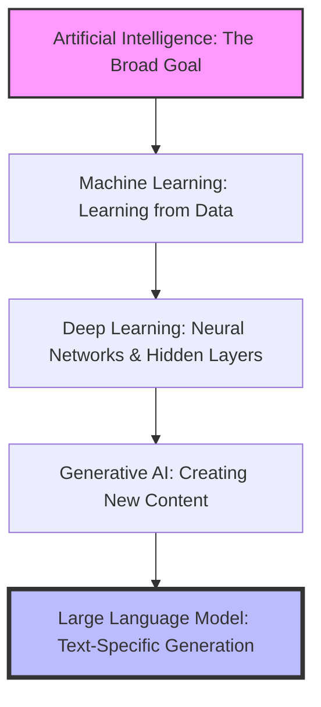

### Comparative Summary of AI Technologies

| Category | Primary Objective | Key Mechanism | Typical Use Case |
| :--- | :--- | :--- | :--- |
| **Artificial Intelligence** | Mimic human intelligence | Rules, Logic, or Learning | Automated customer support routing |
| **Machine Learning** | Predict outcomes from data | Statistical algorithms (Linear Regression, etc.) | Predicting credit scores or house prices |
| **Deep Learning** | Process complex, unstructured data | Multi-layered Neural Networks | Facial recognition, autonomous driving |
| **Generative AI** | Create original content | Generative Adversarial Networks (GANs), Transformers | Generating realistic deepfake videos or art |
| **Large Language Model** | Generate human-like text | Transformer architecture at massive scale | Writing code, summarizing text, Chatbots |

---

### Looking Ahead: The Path to Building an LLM
In this section, we have established the "What"—the high-level definitions of the field. However, to build these models, we must move from concepts to mechanics. In the next section, we will begin our deep dive into the **Mathematics of Machine Learning**. We will move past the "if-else" logic and start looking at the linear algebra, calculus, and probability that allow a machine to actually "learn" from a set of numbers.

---

> [!info]+ Interview questions covered
> - **Explain the relationship between AI, ML, and DL.** (Answer: They are nested subsets; AI is the broad goal, ML is learning from data, and DL is using neural networks for complex data).
> - **How does Generative AI differ from traditional Discriminative AI?** (Answer: Discriminative AI categorizes or predicts existing data, while Generative AI creates entirely new content).
> - **What makes a Language Model "Large"?** (Answer: The massive scale of the training data and the number of internal parameters/weights).
> - **Why is a rule-based system considered AI but not Machine Learning?** (Answer: It mimics intelligent behavior but does not improve its performance by analyzing data; the rules are static).
> - **In what scenarios would you choose Deep Learning over traditional Machine Learning?** (Answer: When dealing with high-dimensional, unstructured data like images, video, or natural language where simple features are hard to define).


## Clustering, Self-Supervised Learning, Unsupervised Learning, Reinforcement Learning, Regression

Machine Learning algorithms can be broadly categorized based on how they learn from data and the nature of the tasks they perform. Understanding these categories is fundamental to choosing the right approach for a given problem, whether it is predicting house prices or training a Large Language Model (LLM).

### The Three Main Categories of Machine Learning

At a high level, Machine Learning is divided into three primary paradigms: Supervised Learning, Unsupervised Learning, and Reinforcement Learning.

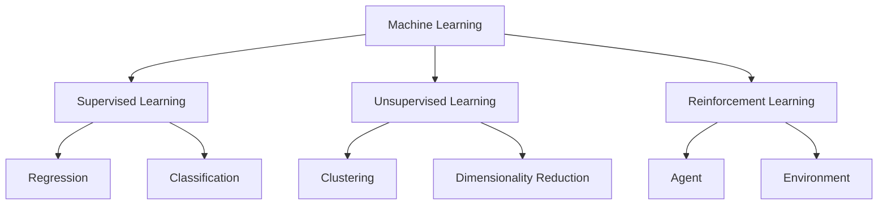

---

### 1. Supervised Learning: Learning with a Teacher

Supervised learning is the most common paradigm. It is called "supervised" because the training process is guided by a "teacher" in the form of labeled data. We provide the model with both the input features and the correct output labels.

#### Why Supervised?
The term "supervised" comes from our ability to compare the model's prediction with the actual ground truth during training. If the model predicts a house price of $500k but the actual price was $450k, we can "supervise" the model by calculating the error and adjusting its internal weights ($W_1, W_2, W_3, \dots$) to move in the right direction.

#### Sub-categories of Supervised Learning:

| Category | Goal | Example |
| :--- | :--- | :--- |
| **Regression** | Predict a continuous numerical value. | House price prediction, Bitcoin price prediction. |
| **Classification** | Predict a discrete category or "bucket". | Email spam detection (Spam vs. Not Spam), Image recognition (Cat vs. Dog). |

**Regression Example:**
In house price prediction, the input might be the number of rooms, balconies, and washrooms. The output is a continuous number (e.g., $100k, $1.2M). Since the output can be any value on a continuous scale, it is a regression task.

**Classification Example:**
In fraud detection, we want to know if a credit card transaction is "Fraud" or "Legitimate". We have a fixed set of categories (buckets). Even if we have 100 categories (like in complex image classification), it remains a classification task because the output is a discrete label, not a continuous number.

> [!info]+ Interview questions covered
> - What is the difference between supervised and unsupervised learning?
> - Explain the difference between regression and classification with examples.

---

### 2. Unsupervised Learning: Finding Hidden Patterns

In unsupervised learning, we are given data without any explicit output labels. We don't know the "correct" answer; instead, we want the model to find interesting structures or insights within the data.

#### Why Unsupervised?
We use unsupervised learning when we have data but no "experience" or labels to compare against. We cannot "supervise" the model because there is no ground truth to calculate an error.

#### Key Applications:

*   **Clustering (Segmentation):** Grouping similar data points together.
    *   *Example:* Customer segmentation. A company might cluster users into "High Paying" vs. "Low Paying" based on their behavior, without having a pre-defined label for each user.
    *   *Example:* Recommendation systems. If users who watch football also tend to watch cricket, the model clusters these interests. When a new football fan joins, the model recommends cricket based on that cluster.
*   **Dimensionality Reduction (DR):** Reducing the number of input variables to simplify data.
    *   *Visualization:* Humans can only visualize 2D or 3D spaces. If data has 100 dimensions, DR techniques (like PCA) help project it into 2D/3D without losing significant information.
    *   *Noise Reduction:* Removing "blur" or irrelevant information from data (e.g., cleaning a low-quality image).

---

### 3. Reinforcement Learning: Learning through Action

Reinforcement Learning (RL) follows a completely different approach based on an agent interacting with an environment.

#### The Five Core Terms of RL:
1.  **Agent:** The entity making decisions (e.g., a self-driving car).
2.  **Environment:** The arena where the agent operates (e.g., the road).
3.  **State:** The current situation the agent is in (e.g., the front view of the road with obstacles).
4.  **Action:** What the agent does (e.g., accelerate, brake, turn left).
5.  **Reward:** Feedback on the action (e.g., +10 for reaching the destination safely, -100 for a collision).

#### The Feedback Loop:
The agent observes the **State**, takes an **Action**, and receives a **Reward**. Based on this reward, the agent learns to reinforce "good" behaviors and avoid "bad" ones in future states. This is how AI learns to play games like Chess or drive cars autonomously.

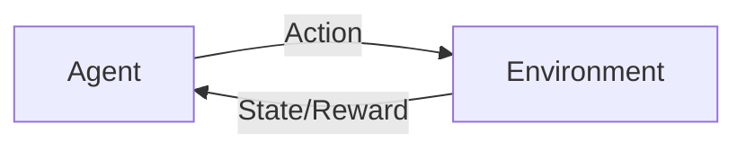

> [!info]+ Interview questions covered
> - What are the key components of a Reinforcement Learning system?
> - Give a real-world example of Reinforcement Learning.

---

### 4. Self-Supervised Learning: The Secret Behind LLMs

A common interview debate is whether Large Language Models (LLMs) like ChatGPT fall under supervised or unsupervised learning.

#### The Problem with Scale
LLMs are trained on almost the entire internet—blogs, PDFs, books, news. Manually labeling trillions of words as "input" and "output" is impossible for humans.

#### The Solution: Self-Supervision
LLMs use **Self-Supervised Learning**, where the data provides its own labels. We write a simple piece of code that takes a raw sentence and automatically generates input-output pairs for training.

**Example: Next-Word Prediction**
Consider the sentence: *"He is a good boy"*

The code automatically splits this into training pairs:
*   **Input:** "He" $\rightarrow$ **Output:** "is"
*   **Input:** "He is" $\rightarrow$ **Output:** "a"
*   **Input:** "He is a" $\rightarrow$ **Output:** "good"
*   **Input:** "He is a good" $\rightarrow$ **Output:** "boy"

#### Is it Supervised or Unsupervised?
*   **The Unsupervised View:** From a human perspective, the data was unlabeled. We just fed raw text into the system.
*   **The Supervised View:** Technically, the model *is* being supervised. It makes a prediction (the next word) and compares it against the actual next word in the sentence.

**Conclusion:** Self-supervised learning is technically a **form of supervised learning** where the labels are generated automatically from the data itself. This allows models to learn the structure of language step-by-step.

#### Comparison: Learning vs. Clustering

| Feature | Self-Supervised (LLM) | Pure Unsupervised (Clustering) |
| :--- | :--- | :--- |
| **Method** | Predicts the next word/token. | Groups similar items in space. |
| **Goal** | Learn to generate sequences. | Find segments or insights. |
| **Logic** | Step-by-step prediction. | High-dimensional proximity. |

In a clustering approach, the model might learn that "He" is close to "Boy" and "She" is close to "Girl" in a coordinate space, but it wouldn't necessarily learn to construct a full sentence. Self-supervision forces the model to learn the sequential logic of language.

> [!info]+ Interview questions covered
> - Is LLM training supervised or unsupervised?
> - What is self-supervised learning in the context of LLMs?
> - How does next-word prediction work as a training objective?


## Training Loop, Weight Initialization, Loss Minimization, Gradient Descent, Pseudo-Code

In this section, we transition from the high-level categories of machine learning to the actual "engine room" where learning happens. We break down the fundamental mechanics of how a model evolves from a collection of random numbers into an intelligent system capable of prediction. This process is governed by a universal sequence: the training loop.

### The High-Level ML Training Workflow

Before a single line of code is executed, a machine learning practitioner must navigate a specific pedagogical arc. The tutor emphasizes that training is not a one-step magic trick but a disciplined sequence of preparation and iteration.

#### 1. Data Readiness: The First Hurdle
The most challenging and time-consuming part of any machine learning project is not the algorithm itself, but getting the data ready. 
- **The Challenge**: Real-world data is messy, incomplete, and often in the wrong format. 
- **The Tutor's Rule**: Your first task is always to ensure your data is "ready." Without a solid foundation of data, you cannot define your model architecture, let alone begin the training process.
- **Why it matters**: In the context of LLMs or house price predictors, "data ready" means having pairs of inputs (e.g., house features) and actual outputs (e.g., historical prices) that the model can learn from.

#### 2. Weight Initialization: Starting from Scratch
Once the data is prepared, we must initialize the model's parameters, known as **weights** ($W$). 
- **The Concept of "Opinions"**: Think of weights as the model's "opinions" or "beliefs" about how the input relates to the output. At the start, the model has no knowledge.
- **Standard Practice**: We generally initialize weights with $0.0$ or values very close to zero (e.g., $0.01$).
- **The Logic**: By starting near zero, we ensure the model doesn't start with extreme, incorrect biases. We want the data to "nudge" the model toward the truth, rather than having the model fight against a strong initial (and likely wrong) belief. As the tutor notes, we will dive deeper into the mathematics of why "close to zero" is often better than "exactly zero" in future sessions.

#### 3. The Training Loop (The Engine of Learning)
The core of machine learning is an iterative process—a `while` loop or `for` loop—that continues until the model's error (its "loss") is minimized.

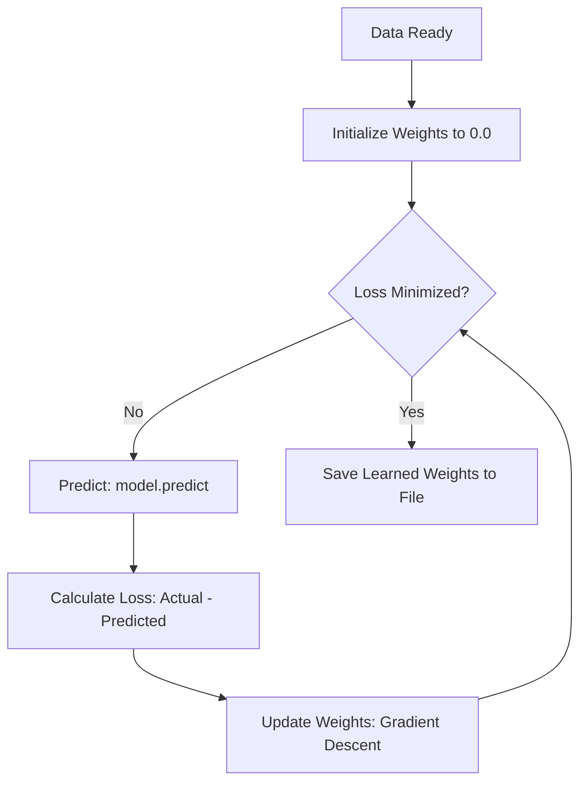

---

### Deep Dive: The Iterative Loop in Action

To understand the training loop's rhythm, let's use the tutor's concrete example of **House Price Prediction**. This example illustrates the "Why before What" of the mathematical steps.

#### The Scenario
We have a house, and we want to predict its price. Our data tells us the **Actual Price is 7 rupees**.

1. **Step 1: Predict**
   The model uses its current weights (initially $0.0$) to make a guess.
   - *Model's Guess*: **5 rupees**.

2. **Step 2: Calculate Loss (The "Reality Check")**
   We need a way to quantify how "wrong" the model is. This is the **Loss Function**.
   - *Calculation*: $\text{Loss} = \text{Actual} - \text{Predicted} = 7 - 5 = 2 \text{ rupees}$.
   - *Pedagogy*: The loss of 2 rupees is the signal that tells the model it needs to change.

3. **Step 3: Update Weights (The "Correction")**
   We don't just change the weights randomly. we use an algorithm called **Gradient Descent**. 
   - *The Goal*: Gradient Descent calculates the direction and magnitude by which we should change the weights to make the loss smaller in the next round.
   - *The Action*: It nudges the weights so that the next prediction might be $5.5$ or $6.0$ instead of $5.0$.

4. **Step 4: Repeat**
   The loop starts again. The model predicts again with the new weights. If the new prediction is $6.5$, the loss is now only $0.5$. We keep looping until the loss is zero or so small that it doesn't matter anymore.

> [!info]+ Interview questions covered
> - What are the foundational steps in any machine learning training pipeline?
> - Why is weight initialization a critical step, and what are the common strategies for it?
> - Describe the "Predict-Compare-Update" cycle in the context of a training loop.
> - What is the role of a loss function in the learning process?

---

### From Concept to Pseudo-Code

When we move from the whiteboard to the editor, the code follows a predictable structure. The tutor provides a "pseudo-code" template that applies whether you are building a simple linear regressor or a complex neural network.

#### The Training Script Skeleton
From the lecture's pseudo-code slides (`slide_014.jpg` to `slide_016.jpg`):

```python
# 1. Preparation
load_data() 

# 2. Setup
# We load the model in 'training' mode to enable weight updates
load_model(mode='training')

# Define the architecture based on the task type:
# - Supervised: Learning from labeled pairs
# - Unsupervised: Finding clusters/patterns
# - RL: Learning from rewards/penalties
model_architecture()

# 3. The Core Training Loop
while loss > threshold:
    # Forward Pass: Make a prediction
    predictions = model.predict()
    
    # Evaluation: How far are we from the truth?
    current_loss = calculate_loss(actual, predictions)
    
    # Backward Pass: Update the 'knowledge' (weights)
    # This is where Gradient Descent math is applied
    update_weights(current_loss) 

# 4. Finalization
# Save the learned weights (W1, W2, W3...) so they aren't lost
save_weights_to_file("model_v1.weights")
```

#### Weight Persistence: Why We Save
The tutor emphasizes that the weights ($W_1, W_2, W_3, \dots$) are the most valuable output of the training process. They are the "learned intelligence."
- **The Risk**: If you train a model for 10 hours and then close your terminal without saving, you have lost 10 hours of work.
- **The Solution**: We save the weights to a persistent file (like a `.bin` or `.pth` file). This allows us to "pause" and "resume" training, or move the model to a different computer for use.

---

### The Prediction Phase (Inference)

Once training is complete and we have our saved weights, we enter the **Prediction Phase** (also known as **Inference**). This is the "production" side of machine learning, where the model actually does its job for a user.

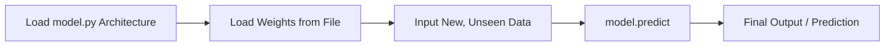

**Key Differences in the Prediction Phase:**
- **No Learning**: We are no longer updating weights. The weights are fixed.
- **No Loss Calculation**: We don't need to compare against "actual" data because, in the real world, we often don't know the actual answer yet (that's why we're using the model!).
- **Efficiency**: Because there is no loop and no weight updates, the prediction phase is much faster and requires less computational power than the training phase.

> [!info]+ Interview questions covered
> - Explain the difference between training and inference in terms of weight updates and computational cost.
> - Why do we separate the model architecture (code) from the weights (data file)?
> - What does it mean for a model to be in "prediction mode"?

---

### Summary Comparison: Training vs. Prediction

| Feature | Training Phase | Prediction (Inference) Phase |
| :--- | :--- | :--- |
| **Primary Goal** | Minimize Loss / Discover Optimal Weights | Generate Accurate Predictions for Users |
| **Weights ($W$)** | Dynamic (Updated every iteration) | Static (Loaded from a saved file) |
| **Data Used** | Labeled Training Data (Inputs + Answers) | New, Unseen Input Data |
| **Control Flow** | Iterative Loop (`while` / `for`) | Single Pass (Linear execution) |
| **Core Algorithm** | Gradient Descent + Backpropagation | `model.predict()` |
| **Output** | A file containing learned weights | A specific prediction or classification |

This fundamental loop—**Predict → Compare → Update**—is the heartbeat of all modern AI. Whether it is a model predicting a house price or a Large Language Model (LLM) predicting the next word in a sentence, the underlying mechanics of the training loop remain the same.


## Linear Algebra, Calculus, Probability, Statistics, Optimization

Machine learning is often perceived as a "black box" where data goes in and predictions come out. However, to build, debug, and optimize these systems—especially when building an LLM from scratch—we must understand the mathematical engine driving them. The tutor identifies three primary mathematical pillars: **Linear Algebra**, **Calculus**, and **Probability & Statistics**. These are not just academic subjects; they are the functional components that allow a model to represent the world, learn from its mistakes, and handle the inherent uncertainty of real-world data.

### The Three Pillars of Machine Learning Math

Before diving into code, it is essential to have a mental map of how mathematics integrates into the machine learning workflow. We don't just "use math"; we use specific branches of mathematics at specific stages of the pipeline. The tutor emphasizes a "Why before what" approach: we need numbers because gradient descent requires calculus, and calculus requires continuous numeric values, which leads us to the necessity of tokenization and vectorization.

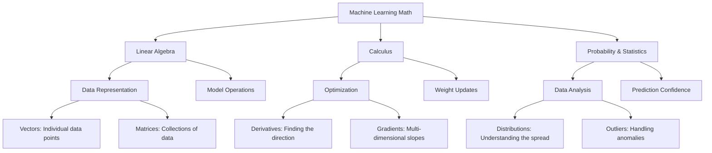

---

### Linear Algebra: The Language of Data Representation

In machine learning, data is rarely processed as individual numbers. Instead, it is organized into structures like **vectors** and **matrices**. Linear Algebra provides the tools to manipulate these structures efficiently, allowing us to perform thousands of calculations simultaneously.

#### 1. Vectors: The Basic Unit of Features
When we load data into a model, we represent individual data points as vectors. A vector is simply an ordered list of numbers. The tutor uses the concrete example of a house price prediction model. To represent a single house, we don't just use one number; we use a "feature vector" that captures multiple dimensions of that house:

$$
\vec{x} = \begin{bmatrix} \text{Number of Rooms} \\ \text{Square Footage} \\ \text{Number of Balconies} \\ \text{Age of House} \end{bmatrix}
$$

By converting these physical attributes into a vector, we've moved from the world of "words and concepts" into the world of "geometry and math," where a model can operate.

#### 2. Matrices: Handling the Entire Dataset
When we have multiple data points (e.g., a dataset of 1,000 houses), we stack these feature vectors to create a **Matrix**. Each row in the matrix represents a different house, and each column represents a specific feature. This matrix representation is what allows modern hardware (like GPUs) to process data in parallel.

#### 3. Model Operations and Matrix Multiplication
The core of any machine learning model is a mathematical function. Even a simple linear equation like $y = mx + c$ is transformed into a matrix operation in ML. In a neural network, the "weights" ($W$) are stored in a matrix, and the "biases" ($B$) are stored in a vector.

The fundamental operation of a model layer is the **dot product** or **matrix multiplication**:

$$
\hat{y} = X \cdot W + B
$$

Where:
- $X$ is your input matrix (the data).
- $W$ is the weight matrix (what the model learns).
- $B$ is the bias vector (the offset).
- $\hat{y}$ is the prediction.

As the tutor explains, when you call `model.predict()`, you are essentially triggering a series of high-speed matrix multiplications. Understanding this allows you to see that "learning" is simply the process of finding the right numbers to put into the $W$ matrix.

> [!info]+ Interview questions covered
> - How is data represented in a machine learning model?
> - What is the difference between a vector and a matrix in the context of features?
> - Why is matrix multiplication preferred over looping through data points in ML?
> - What does the equation $\hat{y} = XW + B$ represent in a neural network?

---

### Calculus: The Engine of Learning and Optimization

If Linear Algebra is how we *represent* data, Calculus is how the model *learns* from it. The tutor highlights that the "learning" in machine learning is actually an optimization problem solved through calculus.

#### The "Why" of Calculus
Why do we need calculus? Because we need to minimize the **Loss Function**. The loss function tells us how "wrong" the model is. To make the model "less wrong," we need to change the weights ($W$). But in which direction? Should we increase $W$ or decrease it? And by how much? Calculus provides the answer through the **derivative**.

#### 1. The Intuition of the Derivative
The **first derivative** ($f'(x)$ or $dy/dx$) measures the rate of change. In ML, it tells us the slope of the loss function at a specific point:
- **Positive Slope ($dy/dx > 0$):** Moving to the right (increasing $W$) increases the loss. Therefore, we should move to the left (decrease $W$).
- **Negative Slope ($dy/dx < 0$):** Moving to the right (increasing $W$) decreases the loss. Therefore, we should move to the right (increase $W$).

#### 2. Gradient Descent and Weight Updates
In a model with millions of parameters, we don't just have one derivative; we have a vector of partial derivatives called the **Gradient** ($\nabla$). The process of "learning" is called **Gradient Descent**—literally walking down the slope of the loss function to find the lowest point (the minimum error).

The update rule, which we will implement in code, looks like this:

$$
W_{\text{new}} = W_{\text{old}} - \eta \cdot \frac{\partial \text{Loss}}{\partial W}
$$

Here, $\eta$ (Eta) is the **Learning Rate**. If the derivative is large, it means we are on a steep slope and need to make a significant change. If it's small, we are near the bottom and should make tiny adjustments.

#### 3. The Chain Rule: Learning in Deep Networks
In deep LLMs, the input goes through many layers. To update the weights in the *first* layer based on an error in the *final* output, we use the **Chain Rule**. This allows the error to "backpropagate" through the network, layer by layer, ensuring every weight in the system is adjusted to contribute to a better prediction.

> [!info]+ Interview questions covered
> - What is the role of derivatives in Gradient Descent?
> - How does the sign of the derivative determine the direction of the weight update?
> - What is the "Learning Rate," and how does it interact with the gradient?
> - Explain the concept of Backpropagation and its reliance on the Chain Rule.

---

### Probability and Statistics: Navigating Uncertainty and Data

Machine learning is rarely about 100% certainty. It is about finding patterns in noisy data and making the most likely prediction. The tutor breaks this down into two phases: understanding the data you have (Statistics) and predicting the data you don't (Probability).

#### 1. Statistics: Understanding the "Shape" of Data
Before training, we must perform Exploratory Data Analysis (EDA). This involves calculating the **Mean** (average), **Median** (middle value), and **Standard Deviation** (how spread out the data is).

**The Salary Outlier Example:**
The tutor provides a classic pedagogical example to illustrate why we need to look beyond simple averages. Imagine a room with 101 people:
- 100 people earn \$10,000 per year.
- 1 person (perhaps a tech billionaire) earns \$100,000,000 per year.

If you calculate the **Mean**, the "average" salary in the room appears to be nearly \$1 million. This is mathematically correct but practically useless for describing the group.
- **The Outlier:** The \$100M salary is an outlier.
- **The Statistical Fix:** By looking at the **Distribution** and the **Median**, we realize that the typical salary is \$10,000. 

In ML, failing to identify outliers like this can cause your model to "overfit" to anomalies, leading to poor performance on normal data.

#### 2. Probability: The Language of Model Predictions
When an LLM predicts the next word, it doesn't just "know" the answer. It calculates the **Probability** of every possible word in its vocabulary.

**Concrete Example of Token Prediction:**
Input: "He is a good..."
The model calculates probabilities for the next token:
- `boy`: $P = 0.50$
- `person`: $P = 0.40$
- `student`: $P = 0.09$
- `girl`: $P = 0.01$

The model selects "boy" because it has the highest probability, but it acknowledges that "person" was also a very likely candidate. This probabilistic approach is why models can be "creative" or "hallucinate"—they are essentially rolling dice based on these learned probabilities.

#### 3. Bayes' Theorem and Distributions
The tutor also mentions **Bayes' Theorem**, which is the mathematical foundation for updating our beliefs (probabilities) as we see new evidence. In LLMs, this is conceptually linked to how the model updates its "understanding" of a sentence as it reads more tokens.

> [!info]+ Interview questions covered
> - Why do machine learning models output probabilities instead of hard classifications?
> - How do you identify and handle outliers in a dataset?
> - What is the difference between Mean and Median, and when should you use each?
> - How does a probability distribution help a model handle uncertainty?

---

### Optimization: Putting It All Together

Optimization is the bridge where all these mathematical concepts meet. We use **Linear Algebra** to structure the weights, **Statistics** to normalize the inputs, **Calculus** to find the direction of improvement, and **Probability** to evaluate the final result.

The tutor notes that while we often use high-level libraries like PyTorch or TensorFlow, we will be writing these optimization steps from scratch in this course. This "no-library" approach ensures that you aren't just a "library user" but a "model builder" who understands exactly how $dy/dx$ turns into a smarter model.

#### The Tutor's Pedagogical Arc: From Dummy to V1
As we progress, we will follow a specific build-up:
1.  **Dummy Model:** Random weights, no math.
2.  **V0 Model:** Linear Algebra for predictions, but no learning.
3.  **V1 Model:** Adding Calculus (Gradient Descent) so the model can learn from data.

**Key Takeaway for the Section:**
Mathematics is not a hurdle to overcome; it is the set of tools that makes machine learning possible.
- **Linear Algebra** = The Structure (How we hold data).
- **Calculus** = The Learning (How we improve).
- **Probability & Statistics** = The Context (How we handle noise and uncertainty).


## Pytorch, Tensorflow, Numpy, Pandas, Matplotlib

In building machine learning systems, we rarely write every mathematical operation from scratch. While understanding the foundations—the calculus, the linear algebra, and the logic—is essential, productivity in the real world requires using specialized libraries. These libraries allow us to build complex systems quickly and efficiently.

### The Motivation for ML Libraries: "Why Before What"

Before diving into specific tools, we must ask: **Why do we need these libraries?**

1.  **Productivity**: Writing a neural network in pure Python would take hundreds of lines of code. Libraries like PyTorch or Keras reduce this to a fraction of that, allowing us to focus on architecture rather than implementation details.
2.  **Speed and Efficiency**: Python is a high-level, community-oriented language, but it isn't the fastest for raw numerical computation. Under the hood, libraries like NumPy and PyTorch are written in **C++**, which is one of the fastest languages ever created. They use optimized architectures to handle massive datasets that would crash a standard browser or a simple Python script.
3.  **Abstraction**: These libraries handle the "heavy lifting" of mathematics (like calculating derivatives for gradient descent) and hardware management (like moving data to a GPU).

> [!info]+ Interview questions covered
> - Why are libraries like NumPy and PyTorch faster than standard Python?
> - What is the role of C++ in the Python ML ecosystem?

---

### NumPy: The Numerical Foundation

NumPy is the bedrock of the Python ML ecosystem. It is used for **fast numerical computation** using arrays and matrices.

#### Why NumPy?
While Python has built-in arrays, NumPy arrays are significantly faster because:
*   **C++ Backend**: The core operations are executed in compiled C++ code.
*   **Contiguous Memory**: NumPy stores data in contiguous blocks of memory, making access and manipulation much faster than standard Python lists.
*   **Vectorization**: It allows us to perform mathematical operations on entire arrays at once without writing explicit `for` loops.

In machine learning, everything is a number. Whether it's an image, a piece of text, or a sound wave, it eventually becomes a NumPy array (or a Tensor) before entering the model.

---

### Pandas: Data Manipulation and Tables

If NumPy handles the numbers, **Pandas** handles the data structures. It is primarily used for data manipulation, cleaning, and analysis using **DataFrames** (tables).

#### Key Capabilities:
*   **Loading Data**: Pandas can load data from almost any format—CSV, Excel, SQL databases, or even PDFs.
*   **Data Cleaning**: It provides simple commands to handle missing data. For example, if a row is missing a value, you can write logic to **interpolate** (estimate) the value or simply drop the row or column.
*   **Exploratory Data Analysis (EDA)**: Since you cannot load millions of rows into a browser at once, Pandas allows you to inspect the data using functions like:
    *   `head(5)`: Show the top 5 rows.
    *   `tail(5)`: Show the bottom 5 rows.
    *   `max()` / `min()`: Find the range of values in a specific feature.

> [!info]+ Interview questions covered
> - How do you handle missing data in a dataset using Pandas?
> - What is the difference between NumPy and Pandas?

---

### Matplotlib and Seaborn: Data Visualization

Visualization is how we understand the patterns in our data. We use **Matplotlib** and **Seaborn** to render graphs and charts.

*   **Matplotlib**: The foundational library for creating static, interactive, and animated visualizations in Python. You can plot x-axis vs. y-axis to see if your data follows a **linear** pattern, a **parabola**, or a complex **polynomial** function.
*   **Seaborn**: A higher-level abstraction built on top of Matplotlib. If Matplotlib requires 10 lines of code to create a complex graph, Seaborn can often do it in 3 or 4. It reduces boilerplate code and provides more aesthetically pleasing defaults.

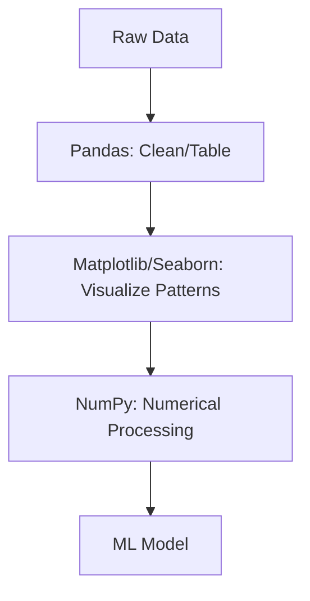

---

### Deep Learning Frameworks: PyTorch vs. TensorFlow

When we move from simple models (like basic regression) to deep learning (neural networks), we use specialized frameworks.

#### 1. PyTorch (Facebook/Meta)
PyTorch was developed by Facebook's AI Research lab. It is currently the **research standard**.
*   **Why PyTorch?** It is extremely flexible and "Pythonic." Most modern research papers are published with PyTorch code. It has a dynamic computation graph, making it easier to debug.
*   **Tutor's Advice**: "If you asked me in 2019, I might have said TensorFlow. But today, I encourage everyone to become good at PyTorch. Most production applications and research companion resources are written in it."

#### 2. TensorFlow (Google)
TensorFlow is Google's ecosystem for machine learning.
*   **Ecosystem**: It has a massive ecosystem (TensorFlow Serving, TensorFlow Lite) optimized for deploying models to mobile devices and large-scale production environments.
*   **History**: It was the first major library to gain widespread adoption, largely due to the Google brand.

#### 3. Keras
Keras is a high-level API that sits on top of TensorFlow (and can now be configured to use PyTorch as a backend).
*   **Simplicity**: It abstracts away the complexity of TensorFlow, allowing you to build models with very few lines of code.
*   **Flexibility**: You can configure the backend:
    ```python
    # Conceptual configuration
    keras.backend = 'pytorch' # or 'tensorflow'
    ```

> [!info]+ Interview questions covered
> - Compare PyTorch and TensorFlow. Which one is better for research?
> - What is Keras, and how does it relate to TensorFlow?

---

### Core Benefits: What the Libraries Do Internally

When you use these libraries, you are benefiting from three major internal implementations:

1.  **Built-in Algorithms**: You don't have to write the code for Linear Regression or a Convolutional Neural Network from scratch. You simply call the function.
2.  **Automated Mathematics (Auto-Grad)**: In the training process, we need to calculate derivatives ($\frac{dy}{dx}$) to update weights via gradient descent. These libraries perform **automated differentiation**, so you don't have to write the calculus equations yourself.
3.  **Native GPU Usage**: Deep learning requires massive parallel calculations. These libraries are built to communicate directly with GPU hardware.

---

### Hardware: CPU vs. GPU

The reason deep learning has exploded in the last decade is the shift from CPU to GPU processing.

| Feature | CPU (Central Processing Unit) | GPU (Graphics Processing Unit) |
| :--- | :--- | :--- |
| **Optimization** | Optimized for complex **logic** | Optimized for **parallel calculations** |
| **Task Type** | if-else statements, flowcharts | Matrix multiplication, additions |
| **Core Count** | Few, powerful cores (8-16) | Thousands of small, efficient cores |

#### CUDA (NVIDIA)
To talk to a GPU, we use a framework called **CUDA**, developed by NVIDIA. PyTorch and TensorFlow interact with CUDA internally, allowing your Python code to run calculations on the GPU hardware without you writing a single line of CUDA C++.

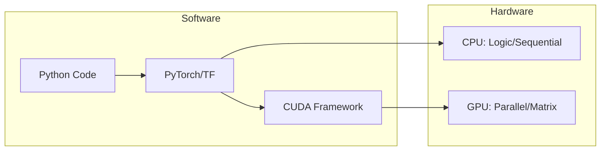

In summary, the progression of a modern ML project looks like this:
1.  Use **Pandas** to load and clean the table.
2.  Use **Matplotlib** to see the data patterns.
3.  Use **NumPy** to format the data for the model.
4.  Use **PyTorch** to build the model, leveraging **CUDA** to run it on a **GPU** for maximum speed.

> [!info]+ Interview questions covered
> - What is the architectural difference between a CPU and a GPU?
> - What is CUDA, and why is it important for Deep Learning?
> - What is automated differentiation in the context of ML libraries?


## Device Management: CUDA, MPS, and Apple Silicon

In machine learning, especially when building Large Language Models (LLMs), where we perform billions of mathematical operations, the choice of hardware is critical. We move from the general-purpose CPU to specialized hardware like GPUs to handle the sheer volume of computation.

### Why We Need GPUs for Machine Learning

To understand why we use GPUs, we must look at the fundamental difference in how CPUs and GPUs are designed.

#### CPU vs. GPU Architecture: Logic vs. Calculation

Think of the silicon used to build processors. Silicon is expensive, so engineers must decide how to optimize its usage.

*   **CPU (Central Processing Unit):** Optimized for **logic**. Most of its transistors are dedicated to handling complex flow control (if-else statements, branching, function calls). It acts like a flowchart manager.
*   **GPU (Graphics Processing Unit):** Optimized for **mathematical operations**. Most of its transistors are dedicated to simple arithmetic—addition, subtraction, and especially matrix multiplications—performed in parallel.

| Feature | CPU | GPU |
| :--- | :--- | :--- |
| **Optimization** | Complex Logic (If/Else) | Parallel Mathematical Operations |
| **Transistor Usage** | High logic overhead, low parallel math | Low logic overhead, massive parallel math |
| **Ideal Task** | Reading files, system management | Matrix multiplication, pixel processing |

> [!info]+ Interview questions covered
> - What is the fundamental difference between a CPU and a GPU in the context of ML?
> - Why is a GPU better for training neural networks?

#### The Transistor Analogy
Imagine you have 100 transistors to build a processor:
*   In a **CPU**, 80 of those transistors might be used for logic and only 20 for math. It can handle complex "if-else" checks very efficiently but struggles with massive parallel additions.
*   In a **GPU**, 80 transistors are used for math and only 20 for logic. It might fail at complex branching, but it can perform 1 + 1 across thousands of data points simultaneously.

### Low-Level Device Interaction (The "Hard Way")

Before modern libraries like PyTorch, developers had to interact with GPUs using low-level frameworks like **CUDA** (Compute Unified Device Architecture), created by NVIDIA.

#### The CUDA Framework
CUDA allows direct interaction with NVIDIA GPUs. In a low-level implementation, you have to explicitly manage memory movement between the **Host** (CPU) and the **Device** (GPU).

From the tutor's pseudo-code example:

```python
import cuda
from cuda import jit

@cuda.jit
def add_arrays(a, b, c):
    # This function runs on the GPU
    # It uses a specific number of threads
    i = cuda.grid(1)
    if i < c.size:
        c[i] = a[i] + b[i]

# 1. Initialize data on the CPU (Host)
a = np.array([1, 2, 3])
b = np.array([4, 5, 6])
c = np.zeros(3)

# 2. Manually move data to the GPU (Device)
da = cuda.to_device(a)
db = cuda.to_device(b)
dc = cuda.to_device(c)

# 3. Execute the function on the GPU
add_arrays[1, 3](da, db, dc)

# 4. Move the result back to the CPU to print it
result = dc.copy_to_host()
print(result)
```

#### The Host vs. Device Workflow
1.  **Load Data:** Read files or initialize arrays on the CPU (**Host**).
2.  **Transfer:** Move tensors from CPU memory to GPU memory (**Device**).
3.  **Compute:** Perform the math on the GPU.
4.  **Retrieve:** Move the results back to the CPU (**Host**) for logging or saving.

#### Precision and Speed Trade-offs
The tutor notes that when running code on a GPU, you might sometimes see slightly "unpredictable" or non-deterministic numbers compared to a CPU.

*   **Why?** To achieve massive speedups, GPUs often make architectural assumptions or use different floating-point precision (e.g., FP16 instead of FP32).
*   **Parallelism:** Because operations are happening in parallel, the order in which numbers are added can vary slightly between runs, leading to tiny differences in the final result due to rounding.

### Modern Device Management in PyTorch

Writing low-level CUDA code for every operation is tedious. Modern libraries like PyTorch provide a wrapper that handles this memory management automatically.

#### Device-Agnostic Code
In a production environment, your code should run whether you have an NVIDIA GPU, an Apple Silicon chip, or just a CPU. We achieve this by defining a `device` variable at the start of our script.

From the lecture slide:
```python
# Device-agnostic setup
device = torch.device('cuda' if torch.cuda.is_available() else 'mps' if torch.backends.mps.is_available() else 'cpu')
```

#### Moving Tensors and Models
Once the device is defined, you can move any tensor or model to that device using the `.to()` method.

| Device Name | Hardware | Library/Backend |
| :--- | :--- | :--- |
| `cuda` | NVIDIA GPU | CUDA |
| `mps` | Apple Silicon (M1/M2/M3) | Metal Performance Shaders |
| `cpu` | Standard Processor | Default |

```python
# Create a tensor and move it to the best available device
x = torch.tensor([1, 2, 3]).to(device)

# PyTorch handles the 'copy to host' logic automatically when you print or convert to numpy
print(x) 
```

### Apple Silicon and MPS

If you are using a modern MacBook (M1, M2, M3, etc.), you don't have an NVIDIA GPU, but you do have an integrated **Neural Engine** and GPU optimized via **MPS (Metal Performance Shaders)**.

*   **MPS:** Apple's framework for high-performance, low-level graphics and computation.
*   **Support:** PyTorch now supports MPS, allowing Mac users to train models locally with significant speedups over the CPU.

> [!info]+ Interview questions covered
> - How do you write device-agnostic code in PyTorch?
> - What is MPS in the context of Apple Silicon and Machine Learning?
> - What does `.to(device)` do in PyTorch?

### Summary of the Workflow

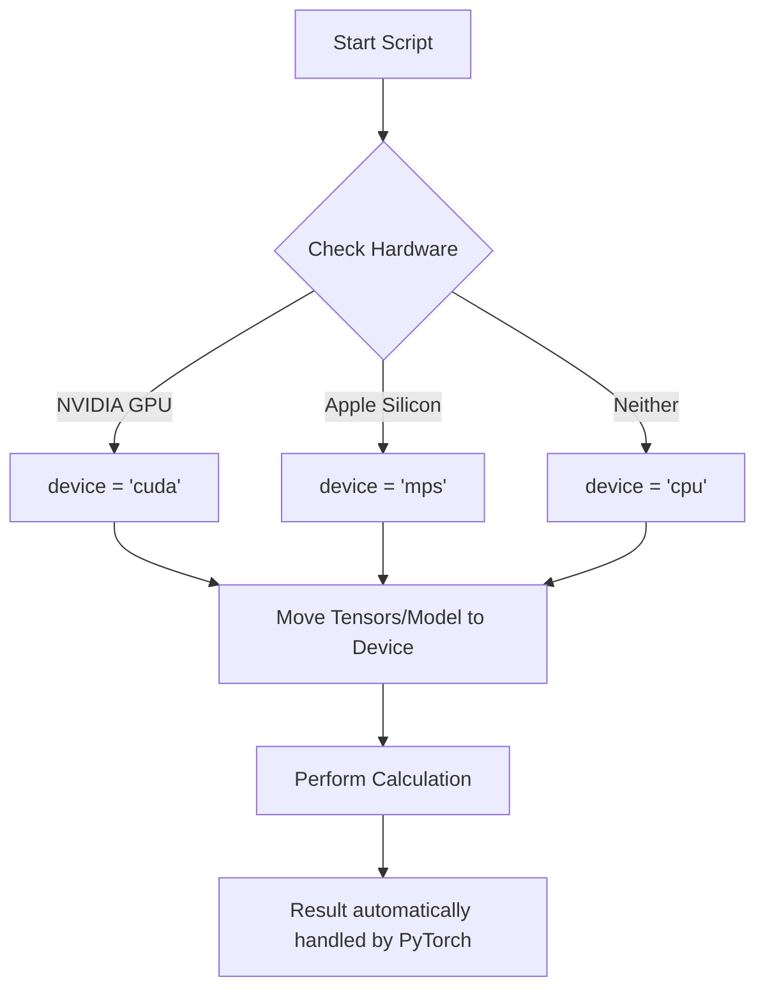

By following this "Why before What" approach, we see that GPUs aren't just "faster CPUs"—they are fundamentally different architectures designed to do one thing (math) extremely well in parallel, which is exactly what neural networks require.


## Feature Engineering, System Design, ML Lifecycle, Model Deployment, Next-Word Prediction

Building a machine learning system is not just about writing code; it is about understanding the end-to-end process that transforms a business requirement into a functional, deployed model. While libraries handle the heavy lifting of mathematics and GPU optimization, a developer must understand the internal mechanics to make informed design choices.

### The Machine Learning System Design Lifecycle

A machine learning project follows a structured lifecycle, moving from high-level requirements to production monitoring.

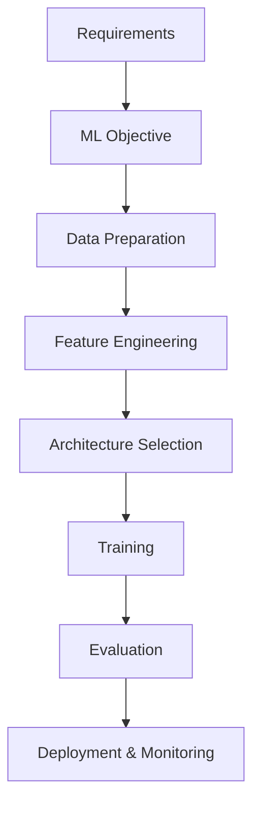

1. **Requirements**: Defining what we want to achieve (e.g., "I want to predict the next word in a sentence").
2. **ML Objective**: Converting the requirement into a concrete machine learning task (e.g., "Given a sequence of words, predict the probability distribution of the next word").
3. **Data Preparation**: Gathering and cleaning the raw data.
4. **Feature Engineering**: Transforming data into a format the model can ingest (scaling, encoding).
5. **Architecture Selection**: Choosing the right model (Linear Regression, Transformer, etc.).
6. **Training**: Using an optimizer to update weights and minimize loss.
7. **Evaluation**: Testing the model on unseen data (Offline) and monitoring it in production (Online).
8. **Deployment & Monitoring**: Serving the model to users via the cloud or on-device.

---

### Concrete Example: Next-Word Prediction

To understand this lifecycle, consider the task of **Next-Word Prediction**.

#### The Requirement
A user wants a system where, if they type "He is a good", the system suggests "boy".

#### The ML Objective: Probabilistic Output
In reality, the model does not just "know" the word is "boy". It looks at its entire **vocabulary** (the set of all words it knows) and assigns a probability to each word.

| Word | Probability |
| :--- | :--- |
| boy | 0.85 |
| girl | 0.10 |
| student | 0.04 |
| ... | ... |

The model predicts that "boy" is the most likely next word.

#### Creativity and Randomization
If a model always picked the word with the highest probability, it would be deterministic and repetitive. To make LLMs "creative," we introduce **randomization** (e.g., Top-k sampling). Instead of always picking the #1 choice, the model might pick from the top 3 or 5 most likely words, allowing for varied and novel responses.

> [!info]+ Interview questions covered
> - What is the high-level lifecycle of an ML project?
> - How does an LLM decide which word to generate next?
> - Why do we use randomization in LLM outputs?

---

### Feature Engineering: Preparing Data for the Model

Models cannot "read" text or understand raw categories; they only understand numbers. Feature engineering is the process of getting data into a **proper format** and ensuring **model stability**.

#### Why Feature Engineering?
* **Formatting**: Converting strings or categories into numerical vectors.
* **Handling Missing Data**: Deleting rows with missing values or performing **imputation** (filling in gaps with averages or predicted values).
* **Stability**: If one feature ranges from 0 to 1 and another from 0 to 1,000,000, the model becomes unstable during training.

#### Common Techniques
1. **Feature Scaling (Normalization)**: Compressing values into a standard range, typically $[0, 1]$.
   $$x_{scaled} = \frac{x - x_{min}}{x_{max} - x_{min}}$$
2. **Bucketing**: Converting continuous data into categories (e.g., Age 0-18 $\rightarrow$ "Child", 19-60 $\rightarrow$ "Adult").
3. **Encoding**:
   * **One-Hot Encoding**: Representing categories as binary vectors (e.g., `{Red: [1,0,0], Green: [0,1,0], Blue: [0,0,1]}`).
   * **Embeddings**: Representing words or categories as dense, multi-dimensional vectors that capture semantic meaning.

> [!info]+ Interview questions covered
> - What is feature engineering and why is it necessary?
> - What is the difference between normalization and imputation?
> - How do you handle categorical data in a machine learning model?

---

### Model Architecture and Components

Once the data is ready, we select the architecture and define the internal components that drive learning.

#### Architecture Selection
The choice depends on the problem:
* **Linear Regression**: For simple continuous predictions.
* **Clustering**: For unsupervised grouping of data.
* **Transformers**: The standard architecture for Large Language Models (LLMs).

#### Internal Components
Every model relies on three core mathematical pillars:

1. **Activation Functions**: These shape the output of a neuron.
   * **Softmax**: Converts raw scores into probabilities that sum to 1 (used in the final layer of classifiers).
   * **ReLU (Rectified Linear Unit)**: Outputs the input if positive, otherwise zero; helps the model learn non-linear patterns.
   * **Sigmoid**: Squashes values into the range $(0, 1)$.

2. **Loss Function**: Measures the "error" or distance between the model's prediction ($y_{pred}$) and the actual target ($y_{true}$).
   * The choice of function (linear, absolute, or polynomial) determines how the model perceives its mistakes.

3. **Optimizer (Gradient Descent)**: The engine that updates the model's weights to minimize the loss.
   * **Aggressive Updates**: Changing weights by large increments can reach the goal faster but risks overshooting.
   * **Balanced Updates**: Finding the right "learning rate" to ensure the model converges steadily to the minimum error.

> [!info]+ Interview questions covered
> - What is the role of an activation function?
> - How does an optimizer like Gradient Descent work?
> - What is the purpose of a loss function in training?

---

### Evaluation: Ensuring Generalization

A model that performs perfectly on its training data but fails on new data is useless. This is why we split our data.

#### Offline Evaluation (Pre-deployment)
We typically use a **90/10 split**:
* **90% Training Data**: Used by the model to learn weights.
* **10% Testing Data**: "Unseen" data used to evaluate how well the model **generalizes**.

If the model performs well on the 10% unseen data, we have confidence that it has learned the underlying patterns rather than just memorizing the training set.

#### Online Evaluation (Post-deployment)
Once the model is in production, we monitor its performance in real-time. This includes tracking metrics like latency, accuracy on live user data, and "drift" (when the real-world data starts changing compared to the training data).

---

### Deployment and Serving

The final step is making the model accessible. There are two primary ways to serve a model:

| Feature | Cloud Deployment (Server-side) | On-Device Serving (Client-side) |
| :--- | :--- | :--- |
| **Example** | GPT-4 API | Mobile Audio-to-Text |
| **Performance** | High (uses powerful GPUs) | Limited by device hardware |
| **Latency** | Higher (network roundtrip) | Low (processed locally) |
| **Privacy** | Data sent to server | Data stays on device |
| **Cost** | High server/compute costs | Low (uses user's hardware) |

Choosing between these depends on the specific use case—for example, a privacy-focused feature like a keyboard's "next-word suggestion" is often better suited for on-device serving.

> [!info]+ Interview questions covered
> - Why do we split data into training and testing sets?
> - What is the difference between offline and online evaluation?
> - What are the trade-offs between cloud and on-device model deployment?


## Model Compression, Quantization, Knowledge Distillation

Once a model is trained, the focus shifts from accuracy to deployment efficiency. In a production environment, especially when dealing with AI engineering system design, we must evaluate how the model performs both before and after it reaches the user.

### Model Evaluation: Offline vs. Online

Evaluation is categorized into two phases based on when it occurs in the lifecycle:

| Feature | Offline Evaluation | Online Evaluation |
| :--- | :--- | :--- |
| **Timing** | Before deployment (at our end). | After deployment (in production). |
| **Data** | Uses a held-out test set (e.g., 10% of 1M records). | Uses real-world user data and live traffic. |
| **Purpose** | To ensure the model is not biased and generalizes to unseen data. | To see how the model performs for actual users. |
| **Feedback** | Internal metrics (Accuracy, F1-score, etc.). | User feedback, A/B testing results, and business metrics. |

#### A/B Testing
A/B testing is a common technique used during online evaluation. We deploy two versions of the model in parallel:
- **Version 0 (Control)**: The existing production model.
- **Version 1 (Treatment)**: The new, updated model.

By comparing the performance of both models on live data, we can statistically determine if the new version is better before fully replacing the old one.

> [!info]+ Interview questions covered
> - What is the difference between offline and online model evaluation?
> - How do you perform A/B testing for machine learning models?

---

### Deployment Strategy: Cloud vs. On-Device

A critical decision in AI system design is where to host the model. This choice depends on use cases, capabilities, and constraints like latency and privacy.

- **Cloud Deployment**: The model resides on a server. The client sends data to the server, and the server returns the prediction. This allows for large, powerful models but requires a stable internet connection and introduces network latency.
- **On-Device (Edge) Deployment**: The model resides directly on the user's device (Android, iOS, IoT). This enables offline functionality and reduces latency but is limited by the device's battery, memory, and processing power.

#### The "Okay Google" Example (Concrete-first)
Consider a device like Google Home. It is always listening for the wake word "Okay Google."
- **Problem**: Sending every second of audio to the cloud would drain the battery and consume massive bandwidth.
- **Solution**: The device uses a **teeny-tiny model** (often running on a specialized Digital Signal Processor or DSP) that only looks for the specific pattern of the wake word.
- **Flow**:
  1. Tiny on-device model detects "Okay Google."
  2. Only then is the larger, more complex model on the server activated to process the actual query.

---

### Model Compression Techniques

To make models efficient enough for on-device deployment or to reduce costs in the cloud, we use **Model Compression**.

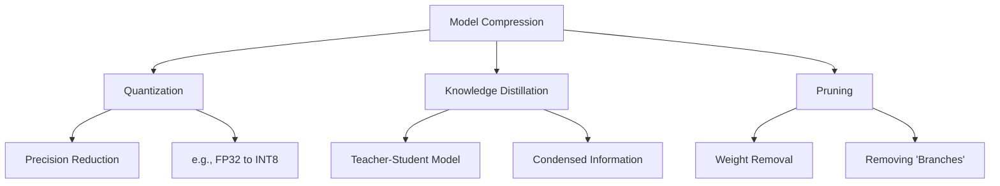

#### 1. Quantization (Precision Reduction)
Quantization involves reducing the precision of the model's weights. Instead of using high-precision numbers (like 32-bit floating point, `FP32`), we convert them to lower precision (like 8-bit integers, `INT8`).
- **Why**: It significantly reduces the model size and speeds up inference, as integer math is faster and less power-hungry than floating-point math.

#### 2. Knowledge Distillation (Teacher-Student)
Knowledge distillation uses a large, pre-trained model (the **Teacher**) to train a much smaller model (the **Student**).
- **The Process**: The Teacher model (which might be 100 GB and trained on the entire internet) has condensed, high-quality information. The Student model (maybe only 1 GB) learns to mimic the Teacher's output.
- **Result**: The Student model becomes much more efficient while retaining a significant portion of the Teacher's intelligence.

#### 3. Pruning
Pruning involves "throwing away" unnecessary weights or branches in the neural network. If certain connections don't contribute much to the final prediction, they are removed, making the model leaner.

> [!info]+ Interview questions covered
> - What is model quantization and why is it used?
> - Explain the concept of Knowledge Distillation.
> - How do you optimize a model for on-device deployment?

---

### Inference Latency and Model Routing

**Inference** is the process of the model making a prediction. **Inference Latency** is the time it takes for the model to respond.

To improve latency and reduce costs, companies like OpenAI (Chat GPT) don't always use their largest model for every query. Instead, they use **Model Routing**:

1. **Intent Detection**: A very small, fast model identifies the user's intent (e.g., Is this a math question, a physics question, or a simple greeting?).
2. **Routing**:
   - If it's a simple greeting, route to a tiny, cheap model.
   - If it's a complex math problem, route to a specialized, larger model.
3. **Verification**: Sometimes, multiple small models run in parallel, and one larger model verifies the output to ensure accuracy.

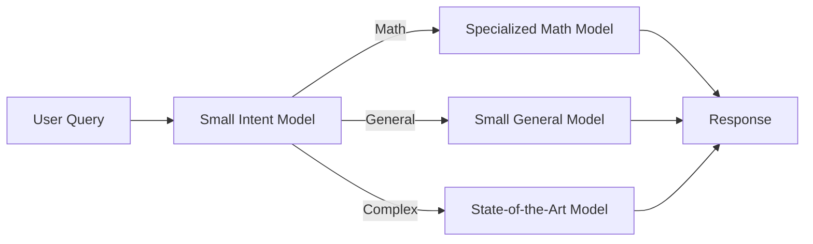

---

### Model Monitoring: Data Drift and Concept Drift

Once a model is in production, its performance can degrade over time due to changes in the real world. We monitor this using two key concepts:

#### 1. Data Drift
Data drift occurs when the **input data** changes from what the model saw during training.
- **Example**: A model was trained on English text, but users start asking questions in Hindi. The distribution of the input features has shifted.

#### 2. Concept Drift
Concept drift occurs when the **relationship between input and output** changes. The facts the model learned are no longer true.
- **Example**: A model learned that the capital of Country X is City A. If the government moves the capital to City B, the model's "concept" of the capital is now wrong, even though the input (the question) is the same.

#### Feedback Loops
To combat drift, we use **User Feedback**. When you give a "thumbs up" or "thumbs down" on a response in Chat GPT, you are providing data that helps the company understand:
- How to improve prompts.
- When to retrain the model.
- How to adapt to new user behaviors.

> [!info]+ Interview questions covered
> - What is inference latency and how can it be optimized?
> - Define Data Drift and Concept Drift with examples.
> - Why is user feedback important in the ML lifecycle?


## Clustering, Regression, Labels, Continuous Value, Classification

### Monitoring and Model Maintenance: Data vs. Concept Drift

Before diving into the core types of machine learning tasks, it is crucial to understand how models behave after deployment. A model is not a static entity; its performance can degrade over time due to changes in the environment it operates in. This degradation is often categorized into two types of "drift." Monitoring these drifts is a critical part of the MLOps lifecycle, ensuring that the model remains accurate and reliable as the world around it changes.

#### Data Drift (Feature Drift)
Data drift occurs when the distribution of the input data changes. The model is still trying to solve the same problem, but the "language" or "format" of the data it receives is different from what it was trained on. This is essentially a change in the $P(X)$, the probability distribution of the input features.

*   **Example**: Imagine a model trained exclusively on English text for sentiment analysis. If users suddenly start providing inputs in Hindi, the model will fail to understand the input. The underlying task (sentiment analysis) hasn't changed, but the input data has "drifted" away from the training distribution.
*   **Agent Communication**: In modern AI systems, "agent-to-agent" communication often involves models making API calls to each other. If one agent's output format changes (e.g., it starts outputting Hindi instead of English), the receiving agent will experience data drift and its performance will plummet.

#### Concept Drift
Concept drift occurs when the relationship between the input and the output changes. In this case, the input data might look the same, but the "truth" or the "fact" it represents has evolved. This is a change in $P(Y|X)$, the conditional probability of the output given the input.

*   **Example**: Consider a model that predicts the President of the United States. If the model was trained in 2012, it would correctly identify Barack Obama as the president. However, as time passes and new elections occur, the "concept" of who the current president is changes. The input question remains the same, but the correct output is different.
*   **Fact Evolution**: This is common in fields like finance or news where "facts" are time-bound. A model trained on 2020 stock market data might not understand the "concept" of market behavior in a high-inflation 2026 environment.

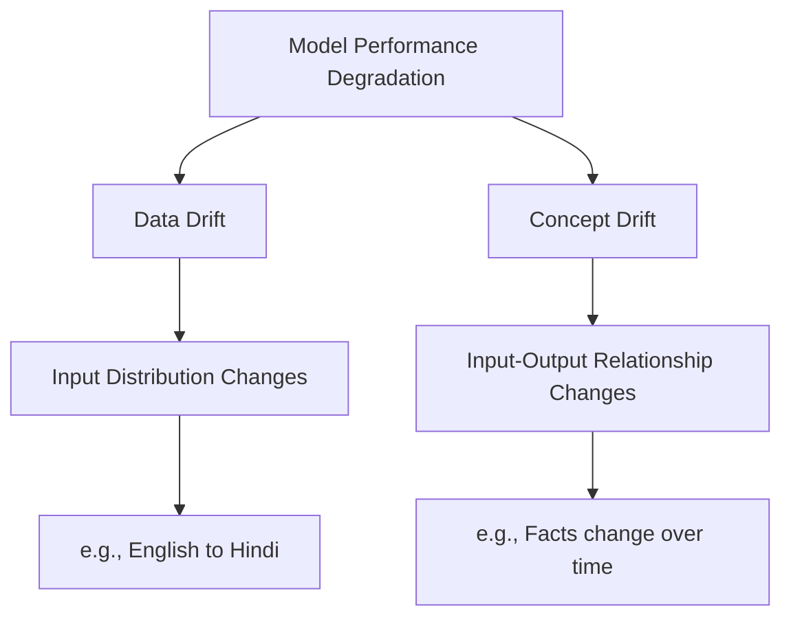

> [!info]+ Interview questions covered
> - What is the difference between data drift and concept drift?
> - How do you monitor a machine learning model in production?
> - Give a real-world example of feature drift.

---

### Foundational Concepts: The Building Blocks of ML

A solid understanding of machine learning requires clarity on several foundational terms often tested in technical interviews. During the lecture's quiz review, several key distinctions were clarified to ensure students have a rigorous mental framework.

#### Labeling and Supervised Learning
In the context of machine learning, **Labeling** is synonymous with **Output**. When we talk about "labeled data," we mean a dataset where each input example is paired with the correct answer (the label).

*   **Supervised Learning**: A task where the model learns from labeled data. It is "supervised" because the labels act as a teacher, telling the model what the correct output should be for a given input. The model's job is to learn the mapping function $Y = f(X)$.
*   **Unsupervised Learning**: A task where the model works with unlabeled data. The goal is not to predict a specific answer but to find hidden patterns or structures within the data.
*   **Self-Supervised Learning**: A subset of unsupervised learning where the data itself provides the supervision (e.g., hiding a word in a sentence and asking the model to predict it).

#### Optimization and Calculus: "Why Before What"
The goal of training a machine learning model is to make its predictions as accurate as possible. This is achieved through **Optimization**.

*   **Objective**: To minimize the **Loss Function** (the measure of error between predicted and actual values).
*   **Why Calculus?**: We need a way to know how to change the model's weights to make the error smaller. Calculus provides the "gradient"—a mathematical pointer that tells us the direction of the steepest increase. By moving in the opposite direction (Gradient Descent), we can systematically find the minimum error.
*   **Optimization Goal**: $\min_{\theta} \text{Loss}(\theta)$, where $\theta$ represents the model parameters.

#### Probability and Uncertainty
Machine learning models rarely provide a 100% certain answer. Instead, they operate in the realm of **Probability**.
*   **Uncertainty**: Probability allows us to quantify the **Uncertainty** of a model's prediction. For example, a model might say there is an 85% probability that an image contains a cat. This is vital for safety-critical applications like autonomous driving or medical diagnosis.

#### Reinforcement Learning: Rewards and Penalties
Unlike supervised learning (where you have a teacher) or unsupervised learning (where you explore), Reinforcement Learning (RL) is about learning from interaction.
*   **Mechanism**: An agent takes actions in an environment and receives **Rewards** for good actions and **Penalties** for bad ones. The goal is to maximize the cumulative reward over time.

> [!info]+ Interview questions covered
> - What does "labeling" mean in machine learning?
> - Why is calculus important for machine learning?
> - How does unsupervised learning differ from supervised learning?
> - What is the role of probability in model inference?

---

### Regression: Predicting Continuous Values

Regression is a fundamental supervised learning task focused on predicting a **continuous numerical value**. When you hear "regression," your mind should immediately associate it with a range of possible numbers rather than discrete categories.

*   **Definition**: Predicting a value that can take any position on a mathematical scale (e.g., 1.5, 100.75, 50000).
*   **Key Examples**:
    *   **Bitcoin Pricing**: Predicting the future price of Bitcoin. Since the price can be any number (e.g., $60,000.50), this is a regression task.
    *   **House Pricing**: Predicting the market value of a house based on features like square footage and location.

---

### Classification vs. Regression: Discrete vs. Continuous

The primary distinction between these two supervised learning tasks lies in the nature of the output.

| Feature | Regression | Classification |
| :--- | :--- | :--- |
| **Output Type** | Continuous Value | Discrete Value (Buckets) |
| **Goal** | Predict a specific number | Assign to a category |
| **Examples** | Stock price, Temperature, Age | Cat vs. Dog, Spam vs. Not Spam |

*   **Classification** involves "buckets." You are placing an input into one of several pre-defined categories.
*   **Regression** involves a "scale." You are predicting a specific point on a continuous line.

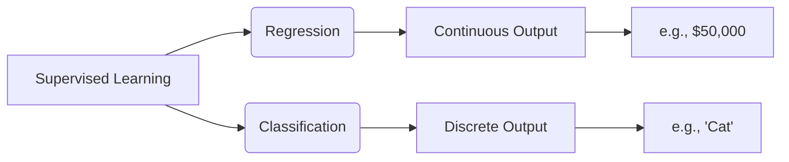

---

### Classification vs. Clustering: Supervised vs. Unsupervised

While both tasks involve grouping data, they differ fundamentally in whether they use pre-defined labels.

#### Classification (Supervised)
In classification, you have a set of known categories (labels) and you train the model to recognize them.
*   **Process**: Input $\rightarrow$ Model $\rightarrow$ Predicted Label (e.g., "This is a cat").

#### Clustering (Unsupervised)
In clustering, you have no pre-defined labels. You give the model a pile of data and ask it to find groups that look similar to each other.
*   **Process**: Input $\rightarrow$ Model $\rightarrow$ Discovered Groups (Insights).
*   **Goal**: To gather insights and find patterns you didn't know existed.

#### The "Roaming New York" Analogy
To understand the difference, imagine two scenarios:
1.  **Supervised (Classification)**: You are given a map of New York with all the "Sports Car Showrooms" already marked. Your job is to go to those specific locations. You have a clear label/goal.
2.  **Unsupervised (Clustering)**: You are told to simply roam the streets of New York and observe. After walking for hours, you notice a pattern: "Hey, I see a lot of expensive sports cars in this specific neighborhood (e.g., Upper East Side), but mostly yellow taxis in this other area." You have gathered an **insight** without being told what to look for beforehand.

> [!info]+ Interview questions covered
> - What is the difference between classification and clustering?
> - Give an example of a continuous vs. a discrete prediction task.
> - When would you use clustering instead of classification?


## Curriculum, Math For ML, LLM Development, AI Resources, Y Combinator

### The Path to Building LLMs: A Progressive Curriculum

Building a Large Language Model (LLM) is not a single-step process but a journey that requires a solid foundation in both theory and practice. The upcoming curriculum is designed to take you from the basic mathematical principles to a fully functional model coded from scratch.

#### 1. Mathematics for Machine Learning: The "Why" Before the "What"
The next two classes are dedicated to the mathematical foundations of Machine Learning. While it might be tempting to skip straight to the code, understanding the math is essential for debugging and optimizing models.

**The Pedagogical Arc: Why Math?**
- **The Goal:** We want to train a model to predict the next word in a sequence.
- **The Mechanism:** This training is done via **Gradient Descent**, an optimization algorithm that minimizes the error (loss) of the model.
- **The Requirement:** Gradient Descent is fundamentally an application of **Calculus** (specifically partial derivatives).
- **The Bridge:** Calculus operates on **numbers**, not words.
- **The Conclusion:** Therefore, we must convert words into numbers through processes like **tokenization** and **embedding**. Without this mathematical bridge, the calculus of optimization cannot happen.

#### 2. Coding Models from Scratch: Understanding the "How"
The curriculum follows a progressive build-up strategy:
- **Phase 1: Pure Python (The "Hard Way"):** We will implement a neural network using only basic Python and NumPy. This removes the "magic" of modern libraries and forces you to understand every matrix multiplication and weight update.
- **Phase 2: Framework Implementation (The "Industry Way"):** Once the core logic is mastered, we will reimplement the model using **PyTorch** or **TensorFlow**. This teaches you how to leverage professional tools while still knowing what's happening "under the hood."
- **Phase 3: Building the LLM:** Finally, we will apply these skills to build an actual LLM, focusing on the specific architectures (like Transformers) that make modern AI possible.

#### 3. Vocabulary and Mapping: The Model's Dictionary
A critical part of building an LLM is managing the **vocabulary**. This is the mapping file that tells the model which number corresponds to which word.
- **Verification:** During our coding sessions, we will write specific scripts to print and verify the vocabulary.
- **Debugging:** We will check whether the mapping is correct and how the model handles words it hasn't seen before (Out-of-Vocabulary or OOV tokens).

> [!info]+ Interview questions covered
> - Why is calculus considered the "engine" of machine learning optimization?
> - What are the advantages of learning to code a model from scratch before using a framework like PyTorch?
> - Explain the role of a vocabulary mapping file in the architecture of an LLM.
> - How does the requirement for numerical inputs in calculus lead to the necessity of tokenization?

---

### Unsupervised Learning: Insights Without Labels

The tutor uses a concrete, real-world analogy to explain the difference between learning with and without labels.

**The New York Street Analogy (Concrete-First):**
Imagine you are a tourist in New York City. You decide to spend your afternoon "roaming"—walking through streets without a map, a guide, or a specific destination.
1. **The Observation:** You walk through Streets 1 to 10 and notice the sidewalks are quiet and there are very few cars.
2. **The Contrast:** Later, you find yourself in Streets 45 to 50. Here, the traffic is dense, the noise is loud, and you notice a high concentration of expensive sports cars.
3. **The Synthesis:** When you return to your hotel, you haven't been "taught" anything by a teacher, and you didn't have a "labeled" map telling you which streets were busy. However, you have gained **insights**. You now know that the 40s-50s are high-traffic, luxury areas compared to the lower streets.

**Defining Unsupervised Learning:**
This is exactly how Unsupervised Learning works. The model is given data (the "streets") without any labels (the "map"). By "roaming" through the data, the model identifies patterns, clusters, and anomalies on its own.

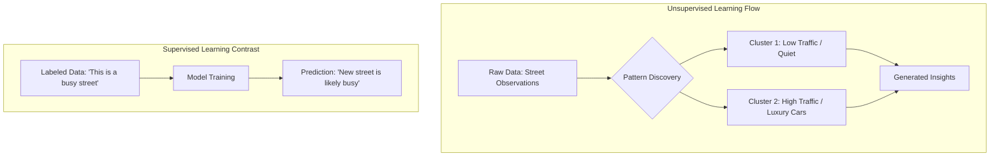

> [!info]+ Interview questions covered
> - Using the "New York Street" analogy, explain the concept of unsupervised learning.
> - How does unsupervised learning differ from supervised learning in terms of the input data provided?
> - In what scenarios would you choose clustering (unsupervised) over classification (supervised)?

---

### Recommended Resources for AI Mastery

The field of AI moves so fast that traditional textbooks are often outdated by the time they are published. To stay at the cutting edge, the tutor recommends following industry leaders and high-quality long-form content.

#### 1. Y Combinator AI Podcast
Y Combinator (YC) is the world's most successful startup accelerator. Their AI-focused podcast on YouTube is essential for:
- Understanding the **business and startup landscape** of AI.
- Hearing directly from founders who are building the next generation of AI tools.
- Identifying which AI problems are actually worth solving.

#### 2. OpenAI Podcast
As the creators of ChatGPT and GPT-4, OpenAI's internal discussions and podcasts provide:
- Insights into the **future of LLM development**.
- Technical perspectives from the engineers who are scaling these models to trillions of parameters.

#### 3. Andrej Karpathy (YouTube)
Andrej Karpathy, a founding member of OpenAI and former Director of AI at Tesla, is widely considered one of the best AI educators in the world.
- **Key Resource:** His "Zero to Hero" series, specifically the video on **building GPT from scratch**.
- **Teaching Style:** He follows a similar philosophy to this course—building everything from the ground up to ensure true mastery.

| Resource | Primary Focus | Best For |
| :--- | :--- | :--- |
| **YC AI Podcast** | Startups & Trends | Understanding the AI market and product-market fit. |
| **OpenAI Podcast** | Cutting-edge Research | Staying updated on the latest GPT-level breakthroughs. |
| **Andrej Karpathy** | Technical Implementation | Deep technical mastery of neural network architecture. |

---

### The Philosophy of Learning: The Power of Long-form Content

A recurring theme in this lecture is the rejection of "shortcut" learning. The tutor emphasizes that technical mastery requires time and focus.

**The 30-Second Trap:**
In the age of social media, many people try to learn AI through 30-second clips or "top 10" lists. While these are fine for general motivation, they are useless for engineering. You cannot teach the nuances of backpropagation or transformer attention in a minute.

**The 2-3 Hour Standard:**
True understanding comes from long-form content. This is why the tutor's sessions (and those of Karpathy) are often 2 to 3 hours long. 
- **Deep Work:** It takes time for the brain to enter a state of "deep work" where complex mathematical and coding concepts can be synthesized.
- **Context:** Long-form content allows for the "Why before What" approach, providing the necessary context that short clips omit.
- **Retention:** By following a 3-hour build-up from math to code, the concepts are "locked in" through logical progression rather than rote memorization.

> [!info]+ Interview questions covered
> - Why is long-form content essential for mastering deep learning and LLM development?
> - How does the "Why before What" pedagogical approach improve long-term retention of technical concepts?
> - What are the risks of relying on superficial, short-form content for technical career growth?

---

### Conclusion: Commitment to the Outcome

The introductory phase of this course is coming to an end. The next steps will be more challenging, requiring a commitment to the mathematical and technical deep dives ahead.

**The 10-Year Perspective:**
The tutor encourages students to view this learning not as a quick fix for a job, but as a foundational skill that will serve them for the next decade. As AI continues to reshape the world, those who understand the "how" and "why" behind the models will be the ones leading the change.

**Final Checklist Before Next Class:**
- [ ] Review basic calculus concepts (derivatives).
- [ ] Ensure your Python environment is ready for NumPy-based coding.
- [ ] Set aside 3-hour blocks for the upcoming deep-dive sessions.
- [ ] Subscribe to the recommended YouTube channels (YC, Karpathy) to immerse yourself in the AI ecosystem.

> [!info]+ Interview questions covered
> - What mindset is required to successfully transition from a high-level AI user to a low-level AI developer?
> - How can a developer stay relevant in the AI field over a 10-year horizon?


---

## Timeline

| Time | Section |
| ---- | ------- |
| `0:03` – `8:21` | [Large Language Model, Machine Learning, Deep Learning, Generative Ai, Artificial Intelligence](#large-language-model-machine-learning-deep-learning-generative-ai-artificial-intelligence) |
| `8:21` – `29:33` | [Clustering, Self-Supervised Learning, Unsupervised Learning, Reinforcement Learning, Regression](#clustering-self-supervised-learning-unsupervised-learning-reinforcement-learning-regression) |
| `29:33` – `34:10` | [Training Loop, Weight Initialization, Loss Minimization, Gradient Descent, Pseudo-Code](#training-loop-weight-initialization-loss-minimization-gradient-descent-pseudo-code) |
| `34:10` – `42:22` | [Linear Algebra, Calculus, Probability, Statistics, Optimization](#linear-algebra-calculus-probability-statistics-optimization) |
| `42:22` – `58:17` | [Pytorch, Tensorflow, Numpy, Pandas, Matplotlib](#pytorch-tensorflow-numpy-pandas-matplotlib) |
| `58:17` – `1:10:09` | [Device Management, Cuda, Mps, Apple Silicon](#device-management-cuda-mps-apple-silicon) |
| `1:10:09` – `1:26:29` | [Feature Engineering, System Design, Ml Lifecycle, Model Deployment, Next-Word Prediction](#feature-engineering-system-design-ml-lifecycle-model-deployment-next-word-prediction) |
| `1:26:29` – `1:40:06` | [Model Compression, Quantization, Knowledge Distillation](#model-compression-quantization-knowledge-distillation) |
| `1:40:06` – `2:02:45` | [Clustering, Regression, Labels, Continuous Value, Classification](#clustering-regression-labels-continuous-value-classification) |
| `2:02:45` – `2:10:33` | [Curriculum, Math For Ml, Llm Development, Ai Resources, Y Combinator](#curriculum-math-for-ml-llm-development-ai-resources-y-combinator) |

## Interview Questions Covered

Total: 87 questions across 10 sections.

### Large Language Model, Machine Learning, Deep Learning, Generative Ai, Artificial Intelligence

- **Explain the relationship between AI, ML, and DL.** (Answer: They are nested subsets; AI is the broad goal, ML is learning from data, and DL is using neural networks for complex data).
- **How does Generative AI differ from traditional Discriminative AI?** (Answer: Discriminative AI categorizes or predicts existing data, while Generative AI creates entirely new content).
- **What makes a Language Model "Large"?** (Answer: The massive scale of the training data and the number of internal parameters/weights).
- **Why is a rule-based system considered AI but not Machine Learning?** (Answer: It mimics intelligent behavior but does not improve its performance by analyzing data; the rules are static).
- **In what scenarios would you choose Deep Learning over traditional Machine Learning?** (Answer: When dealing with high-dimensional, unstructured data like images, video, or natural language where simple features are hard to define).

### Clustering, Self-Supervised Learning, Unsupervised Learning, Reinforcement Learning, Regression

- What is the difference between supervised and unsupervised learning?
- Explain the difference between regression and classification with examples.
- What are the key components of a Reinforcement Learning system?
- Give a real-world example of Reinforcement Learning.
- Is LLM training supervised or unsupervised?
- What is self-supervised learning in the context of LLMs?
- How does next-word prediction work as a training objective?

### Training Loop, Weight Initialization, Loss Minimization, Gradient Descent, Pseudo-Code

- What are the foundational steps in any machine learning training pipeline?
- Why is weight initialization a critical step, and what are the common strategies for it?
- Describe the "Predict-Compare-Update" cycle in the context of a training loop.
- What is the role of a loss function in the learning process?
- Explain the difference between training and inference in terms of weight updates and computational cost.
- Why do we separate the model architecture (code) from the weights (data file)?
- What does it mean for a model to be in "prediction mode"?

### Linear Algebra, Calculus, Probability, Statistics, Optimization

- How is data represented in a machine learning model?
- What is the difference between a vector and a matrix in the context of features?
- Why is matrix multiplication preferred over looping through data points in ML?
- What does the equation $\hat{y} = XW + B$ represent in a neural network?
- What is the role of derivatives in Gradient Descent?
- How does the sign of the derivative determine the direction of the weight update?
- What is the "Learning Rate," and how does it interact with the gradient?
- Explain the concept of Backpropagation and its reliance on the Chain Rule.
- Why do machine learning models output probabilities instead of hard classifications?
- How do you identify and handle outliers in a dataset?
- What is the difference between Mean and Median, and when should you use each?
- How does a probability distribution help a model handle uncertainty?

### Pytorch, Tensorflow, Numpy, Pandas, Matplotlib

- Why are libraries like NumPy and PyTorch faster than standard Python?
- What is the role of C++ in the Python ML ecosystem?
- How do you handle missing data in a dataset using Pandas?
- What is the difference between NumPy and Pandas?
- Compare PyTorch and TensorFlow. Which one is better for research?
- What is Keras, and how does it relate to TensorFlow?
- What is the architectural difference between a CPU and a GPU?
- What is CUDA, and why is it important for Deep Learning?
- What is automated differentiation in the context of ML libraries?

### Device Management, Cuda, Mps, Apple Silicon

- What is the fundamental difference between a CPU and a GPU in the context of ML?
- Why is a GPU better for training neural networks?
- How do you write device-agnostic code in PyTorch?
- What is MPS in the context of Apple Silicon and Machine Learning?
- What does `.to(device)` do in PyTorch?

### Feature Engineering, System Design, Ml Lifecycle, Model Deployment, Next-Word Prediction

- What is the high-level lifecycle of an ML project?
- How does an LLM decide which word to generate next?
- Why do we use randomization in LLM outputs?
- What is feature engineering and why is it necessary?
- What is the difference between normalization and imputation?
- How do you handle categorical data in a machine learning model?
- What is the role of an activation function?
- How does an optimizer like Gradient Descent work?
- What is the purpose of a loss function in training?
- Why do we split data into training and testing sets?
- What is the difference between offline and online evaluation?
- What are the trade-offs between cloud and on-device model deployment?

### Model Compression, Quantization, Knowledge Distillation

- What is the difference between offline and online model evaluation?
- How do you perform A/B testing for machine learning models?
- What is model quantization and why is it used?
- Explain the concept of Knowledge Distillation.
- How do you optimize a model for on-device deployment?
- What is inference latency and how can it be optimized?
- Define Data Drift and Concept Drift with examples.
- Why is user feedback important in the ML lifecycle?

### Clustering, Regression, Labels, Continuous Value, Classification

- What is the difference between data drift and concept drift?
- How do you monitor a machine learning model in production?
- Give a real-world example of feature drift.
- What does "labeling" mean in machine learning?
- Why is calculus important for machine learning?
- How does unsupervised learning differ from supervised learning?
- What is the role of probability in model inference?
- What is the difference between classification and clustering?
- Give an example of a continuous vs. a discrete prediction task.
- When would you use clustering instead of classification?

### Curriculum, Math For Ml, Llm Development, Ai Resources, Y Combinator

- Why is calculus considered the "engine" of machine learning optimization?
- What are the advantages of learning to code a model from scratch before using a framework like PyTorch?
- Explain the role of a vocabulary mapping file in the architecture of an LLM.
- How does the requirement for numerical inputs in calculus lead to the necessity of tokenization?
- Using the "New York Street" analogy, explain the concept of unsupervised learning.
- How does unsupervised learning differ from supervised learning in terms of the input data provided?
- In what scenarios would you choose clustering (unsupervised) over classification (supervised)?
- Why is long-form content essential for mastering deep learning and LLM development?
- How does the "Why before What" pedagogical approach improve long-term retention of technical concepts?
- What are the risks of relying on superficial, short-form content for technical career growth?
- What mindset is required to successfully transition from a high-level AI user to a low-level AI developer?
- How can a developer stay relevant in the AI field over a 10-year horizon?

## Code Blocks Index

Unique code/console/mermaid blocks: 19 (deduplicated by content).

| Section | Block count |
| ------- | ----------- |
| `00_large_language_model_machine_learning_deep_learning_generati` | 1 |
| `01_clustering_self_supervised_learning_unsupervised_learning_re` | 2 |
| `02_training_loop_weight_initialization_loss_minimization_gradie` | 3 |
| `03_linear_algebra_calculus_probability_statistics_optimization` | 1 |
| `04_pytorch_tensorflow_numpy_pandas_matplotlib` | 2 |
| `05_device_management_cuda_mps_apple_silicon` | 4 |
| `06_feature_engineering_system_design_ml_lifecycle_model_deploym` | 1 |
| `07_model_compression_quantization_knowledge_distillation` | 2 |
| `08_clustering_regression_labels_continuous_value_classification` | 2 |
| `09_curriculum_math_for_ml_llm_development_ai_resources_y_combin` | 1 |

## Glossary

Auto-generated from canonical concepts seen across the lecture. Definitions are extracted from the first paragraph in which each concept appears.

- **deep learning**: Large Language Model, Machine Learning, Deep Learning, Generative Ai, Artificial Intelligence _(occurrences: 6)_
- **clustering**: Clustering, Self-Supervised Learning, Unsupervised Learning, Reinforcement Learning, Regression _(occurrences: 6)_
- **large language model**: Large Language Model, Machine Learning, Deep Learning, Generative Ai, Artificial Intelligence _(occurrences: 5)_
- **machine learning**: Large Language Model, Machine Learning, Deep Learning, Generative Ai, Artificial Intelligence _(occurrences: 4)_
- **generative ai**: Large Language Model, Machine Learning, Deep Learning, Generative Ai, Artificial Intelligence _(occurrences: 4)_
- **unsupervised learning**: Clustering, Self-Supervised Learning, Unsupervised Learning, Reinforcement Learning, Regression _(occurrences: 4)_
- **regression**: | Category | Primary Objective | Key Mechanism | Typical Use Case | | :--- | :--- | :--- | :--- | | **Artificial Intelligence** | Mimic human intelligence | Rules, Logic, or Learning | Automated customer support routing | | **Machine Learning** | Predict outcomes from data | Statistical algorithms (Linear Regression, etc.) | Predicting credit sc... _(occurrences: 4)_
- **self-supervised learning**: Clustering, Self-Supervised Learning, Unsupervised Learning, Reinforcement Learning, Regression _(occurrences: 3)_
- **classification**: ```mermaid graph TD ML[Machine Learning] --> Supervised[Supervised Learning] ML --> Unsupervised[Unsupervised Learning] ML --> RL[Reinforcement Learning] Supervised --> Regression[Regression] Supervised --> Classification[Classification] Unsupervised --> Clustering[Clustering] Unsupervised --> DR[Dimensionality Reduction] RL --> Agent[Agent] RL ... _(occurrences: 3)_
- **reinforcement learning**: Clustering, Self-Supervised Learning, Unsupervised Learning, Reinforcement Learning, Regression _(occurrences: 2)_
- **next-word prediction**: Example: Next-Word Prediction** Consider the sentence: *"He is a good boy"* _(occurrences: 2)_
- **supervised vs unsupervised**: (referenced in lecture; no definition extracted)
- **gradient descent**: Training Loop, Weight Initialization, Loss Minimization, Gradient Descent, Pseudo-Code _(occurrences: 2)_
- **prediction**: Through a process called "training," the machine develops a mathematical function that can take new features and produce a highly accurate prediction. This ability to generalize from past data to new, unseen situations is the core power of ML. _(occurrences: 2)_
- **calculus**: Looking Ahead: The Path to Building an LLM In this section, we have established the "What"—the high-level definitions of the field. However, to build these models, we must move from concepts to mechanics. _(occurrences: 2)_
- **probability**: The Core Task: Next-Token Prediction** At its simplest level, an LLM is a master of probability. When you ask it a question, it isn't "thinking" in the human sense. _(occurrences: 2)_
- **optimization**: Linear Algebra, Calculus, Probability, Statistics, Optimization _(occurrences: 2)_
- **pytorch**: The tutor notes that while we often use high-level libraries like PyTorch or TensorFlow, we will be writing these optimization steps from scratch in this course. This "no-library" approach ensures that you aren't just a "library user" but a "model builder" who understands exactly how $dy/dx$ turns into a smarter model. _(occurrences: 2)_
- **tensorflow**: The tutor notes that while we often use high-level libraries like PyTorch or TensorFlow, we will be writing these optimization steps from scratch in this course. This "no-library" approach ensures that you aren't just a "library user" but a "model builder" who understands exactly how $dy/dx$ turns into a smarter model. _(occurrences: 2)_
- **cuda**: CUDA (NVIDIA) To talk to a GPU, we use a framework called **CUDA**, developed by NVIDIA. PyTorch and TensorFlow interact with CUDA internally, allowing your Python code to run calculations on the GPU hardware without you writing a single line of CUDA C++. _(occurrences: 2)_
- **feature engineering**: Feature Engineering, System Design, ML Lifecycle, Model Deployment, Next-Word Prediction _(occurrences: 2)_
- **labels**: Supervised learning is the most common paradigm. It is called "supervised" because the training process is guided by a "teacher" in the form of labeled data. _(occurrences: 2)_
- **continuous value**: Clustering, Regression, Labels, Continuous Value, Classification _(occurrences: 2)_
- **artificial intelligence**: Large Language Model, Machine Learning, Deep Learning, Generative Ai, Artificial Intelligence _(occurrences: 1)_
- **rule-based system**: The "Why" Before the "What": The Failure of Rules** Imagine trying to write a rule-based system to predict the price of a house. You might start with: `If area > 2000 sq ft AND rooms == 3, then price = $500,000.` But what if the house is near a park? _(occurrences: 1)_
- **image recognition**: The Complexity of Perception** Consider the task of **Image Recognition**. If you want a computer to identify a person drinking a cup of coffee in a photo: - A traditional ML model would struggle to define what "coffee" or a "person" looks like in terms of raw pixel values. _(occurrences: 1)_
- **content generation**: (referenced in lecture; no definition extracted)
- **text generation**: (referenced in lecture; no definition extracted)
- **ai hierarchy**: Visualizing the AI Hierarchy _(occurrences: 1)_
- **ai**: Large Language Model, Machine Learning, Deep Learning, Generative Ai, Artificial Intelligence _(occurrences: 1)_
