# LLM From Scratch — Part 1

Detailed notes synthesized from a 1:55:32 recorded lecture across 17 sections, 303 unique on-screen frames, and 30 canonical concepts.

## Table of Contents

1. [Gradient Descent, Y_Prediction, Weights, Bias, Supervised Learning](#gradient-descent-yprediction-weights-bias-supervised-learning) _(9.7 min, 0:03–9:47)_
2. [Linear Regression, Linear Pattern, Data Visualization, Scatter Plot, Bias](#linear-regression-linear-pattern-data-visualization-scatter-plot-bias) _(9.2 min, 9:47–18:59)_
3. [Linear Regression, Bias, Gradient Descent, Weights, Nnparameter](#linear-regression-bias-gradient-descent-weights-nnparameter) _(6.1 min, 18:59–25:05)_
4. [Bias, Linear Regression, Model Training, Y_Prediction, Weight Initialization](#bias-linear-regression-model-training-yprediction-weight-initialization) _(4.6 min, 25:05–29:42)_
5. [Bias, Linear Regression, Weights, Y_Prediction, Nnparameter](#bias-linear-regression-weights-yprediction-nnparameter) _(8.8 min, 29:42–38:31)_
6. [Cost Function, Average Error, Mean Raw Error, Error, Batch Processing](#cost-function-average-error-mean-raw-error-error-batch-processing) _(3.3 min, 38:31–41:47)_
7. [Mean Absolute Error, Loss Functions, Mae, Root Mean Squared Error, Nullification](#mean-absolute-error-loss-functions-mae-root-mean-squared-error-nullification) _(9.7 min, 41:47–51:26)_
8. [Calculus, Tangent Line, First Derivative, Slope, Derivatives](#calculus-tangent-line-first-derivative-slope-derivatives) _(4.8 min, 51:26–56:17)_
9. [First Derivative, Gradient Descent, Cost Function, Minimization, Increasing And Decreasing Functions](#first-derivative-gradient-descent-cost-function-minimization-increasing-and-decreasing-functions) _(3.4 min, 56:17–59:41)_
10. [Gradient Descent, Optimization, Derivatives, Slope, Iterations](#gradient-descent-optimization-derivatives-slope-iterations) _(8.5 min, 59:41–1:08:12)_
11. [Gradient Descent, First Derivative, Cost Function, Minimum, Optimization](#gradient-descent-first-derivative-cost-function-minimum-optimization) _(6.1 min, 1:08:12–1:14:20)_
12. [Gradient Descent, Optimization, Derivatives, First Derivative, Minimization](#gradient-descent-optimization-derivatives-first-derivative-minimization) _(5.0 min, 1:14:20–1:19:19)_
13. [Derivatives, Gradient Descent, Cost Function, Optimization, Minimization](#derivatives-gradient-descent-cost-function-optimization-minimization) _(3.6 min, 1:19:19–1:22:53)_
14. [Gradient Descent, Learning Rate, Derivatives, Optimization, Alpha](#gradient-descent-learning-rate-derivatives-optimization-alpha) _(8.7 min, 1:22:53–1:31:33)_
15. [Gradient Descent, Backpropagation, Weights, Bias, Learning Rate](#gradient-descent-backpropagation-weights-bias-learning-rate) _(7.2 min, 1:31:33–1:38:45)_
16. [Gradient Descent, Convergence, Learning Rate, Plateau, Underfitting](#gradient-descent-convergence-learning-rate-plateau-underfitting) _(9.3 min, 1:38:45–1:48:04)_
17. [Cost Function, Gradient Descent, Linear Models, Root Mean Squared Error, Optimization](#cost-function-gradient-descent-linear-models-root-mean-squared-error-optimization) _(7.5 min, 1:48:04–1:55:32)_

---

## Gradient Descent, Y_Prediction, Weights, Bias, Supervised Learning

This section introduces the foundational mechanics of how machine learning models learn from data. We explore the iterative training process, the role of parameters like weights and bias, and the critical importance of gradient descent in minimizing error to reach a state where a model can make accurate predictions.

### The Machine Learning Training Process

The journey from raw data to a functional model follows a structured, iterative cycle. This process is designed to refine the model's internal parameters until its predictions align closely with reality.

#### The Five Core Steps of Training

1.  **Initialize Weights**: Assign initial values to the model's parameters (weights and bias). Often, these are initialized to zero or small random numbers.
2.  **Forward Pass (Predict)**: Feed input data into the model to generate a prediction ($y_{pred}$).
3.  **Compute Loss (Error)**: Compare the model's prediction with the actual target value ($y_{actual}$) to determine the error.
4.  **Backward Pass (Compute Gradients)**: Calculate how much each parameter contributed to the error.
5.  **Update Weights (Gradient Descent)**: Adjust the weights and bias in the direction that reduces the loss.

This cycle (steps 2 through 5) repeats until the loss is minimized and the model converges.

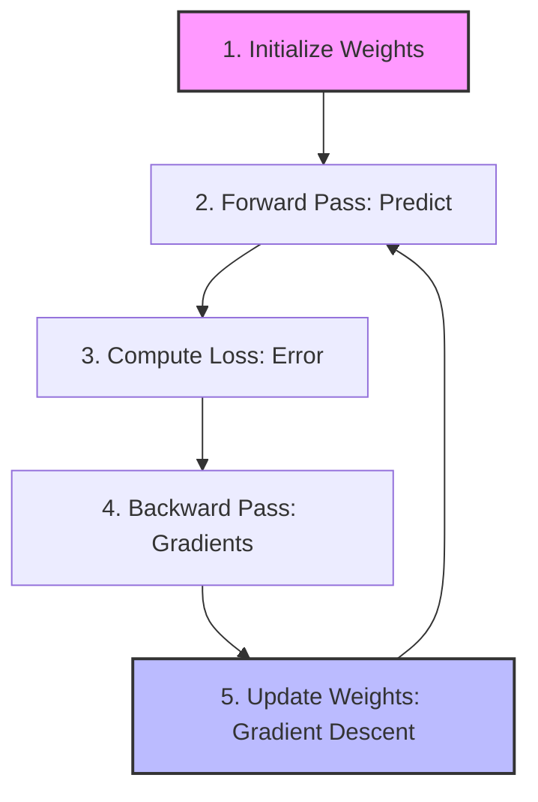

> [!info]+ Interview questions covered
> - What are the main steps in the machine learning training process?
> - Why is the training process described as iterative?

### Building a Linear Model: $y = wx + b$

To understand these steps concretely, we use a simple linear model. In this scenario, we assume the relationship between our input ($x$) and output ($y$) can be represented by a straight line.

#### Parameters: Weights and Bias

*   **Weight ($w$)**: The slope of the line, determining the strength of the relationship between $x$ and $y$.
*   **Bias ($b$)**: The y-intercept, allowing the model to shift the prediction up or down independently of the input.

#### Worked Example: Step-by-Step Training

Consider a dataset where we want the model to learn the relationship $y = 2x + 1$.

| Input ($x$) | Actual Output ($y$) |
| :--- | :--- |
| 1 | 2 |
| 2 | 4 |
| 3 | 6 |

**1. Initialization**
We start with no prior knowledge, so we initialize our parameters to zero:
*   $w = 0$
*   $b = 0$
*   Model: $y = 0x + 0$

**2. Forward Pass & Prediction**
When we feed the input $x=1$ into our initial model:
*   $y_{pred} = 0(1) + 0 = 0$
*   Actual $y = 2$.

**3. Loss Calculation**
The error is the difference between what we wanted and what we got:
*   $Error = y_{actual} - y_{pred} = 2 - 0 = 2$

**4. The Iterative Loop**
Initially, the model predicts 0 for every input. Through thousands of iterations (e.g., "Step 1K"), the model uses gradient descent to adjust $w$ and $b$.

| Step | Prediction ($y_{pred}$) | Error ($y_{actual} - y_{pred}$) |
| :--- | :--- | :--- |
| 1 | 0.5 | 1.5 |
| 2 | 1.2 | 0.8 |
| ... | ... | ... |
| 1000 | 2.0 | 0.0 |

Eventually, the model converges to the optimal weights: $w=2, b=1$.

> [!info]+ Interview questions covered
> - What is the role of weights and bias in a linear regression model?
> - How does weight initialization affect the starting state of a model?

### Transitioning to Inference

Once the training process is complete and the weights are optimized, the model enters the **Inference Phase**.

#### Training vs. Inference

*   **Training**: The process of learning the best weights ($w, b$) by iteratively minimizing loss using a known dataset.
*   **Inference (Prediction)**: Using the finalized weights to predict outputs for new, unseen data. At this stage, the original training dataset is no longer needed.

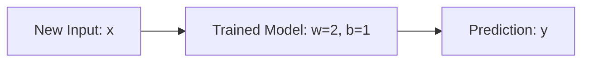

For example, if we provide a new input $x = 100$ to our trained model:
$$y = 2(100) + 1 = 201$$

> [!info]+ Interview questions covered
> - What is the difference between the training phase and the inference phase?
> - When can you stop the training process?

### Implementation: Generating Synthetic Data

To practice these concepts, we can generate synthetic data that follows a linear pattern. This allows us to know the "ground truth" and verify if our model learns correctly.

#### Using NumPy for Linear Data
This script generates data following the pattern $y = 4 + 3x + \text{noise}$.

From `slide_015.jpg` shown in VS Code:
```python
import numpy as np
import matplotlib.pyplot as plt

# Generate synthetic linear data
np.random.seed(42)
X = 2 * np.random.rand(100, 1)
y = 4 + 3 * X + np.random.randn(100, 1)

# Plot the data
plt.scatter(X, y)
plt.xlabel("X")
plt.ylabel("y")
plt.title("Synthetic Linear Data")
plt.show()
```

#### Using PyTorch for Model Data
In a deep learning context, we often use PyTorch to handle data tensors and splits.

From `slide_016.jpg` shown in VS Code:
```python
import torch
from torch import nn 
import matplotlib.pyplot as plt

# Create *known* parameters
weight = 0.7
bias = 0.3

# Create data
start = 0
end = 1
step = 0.02
X = torch.arange(start, end, step).unsqueeze(dim=1)
y = weight * X + bias

# Create train/test split (80% train, 20% test)
train_split = int(0.8 * len(X)) 
X_train, y_train = X[:train_split], y[:train_split]
X_test, y_test = X[train_split:], y[train_split:]
```

> [!info]+ Interview questions covered
> - Why is it useful to use synthetic data when building a model from scratch?
> - What is a typical train-test split ratio, and why is it used?

### Glossary

| Term | Definition |
| :--- | :--- |
| **Supervised Learning** | A type of machine learning where the model is trained on labeled data (inputs paired with correct outputs). |
| **Gradient Descent** | An optimization algorithm used to minimize the loss function by iteratively adjusting model parameters. |
| **Convergence** | The state where the model's loss has stabilized and further training does not significantly improve performance. |
| **Forward Pass** | The process of passing input data through the model to get a prediction. |
| **Loss Function** | A mathematical formula that quantifies the difference between predicted and actual values. |

### Recap
*   Machine learning training is an **iterative cycle** of prediction, error calculation, and parameter adjustment.
*   **Weights and bias** are the "knobs" the model turns to fit the data.
*   **Gradient descent** is the engine that decides how to turn those knobs to reduce error.
*   A **trained model** is simply a set of optimized weights that can be used for inference on new data.


## Linear Regression, Linear Pattern, Data Visualization, Scatter Plot, Bias

In this section, we explore the foundational steps of building a machine learning model: generating synthetic data, visualizing it to identify patterns, and understanding the mathematical structure of a linear model.

### Generating Synthetic Linear Data

To understand how a model learns, we start by generating a synthetic dataset where we already know the underlying relationship. This allows us to verify if our model can correctly "rediscover" the parameters we used to create the data.

**Why use synthetic data?**
Before working with complex real-world datasets, synthetic data provides a controlled environment to test the mechanics of weight updates and optimization. By defining a known linear pattern with added noise, we can observe how close our model's predictions come to the ground truth.

From `synthetic_data.py` shown in the lecture:

```python
import numpy as np
import matplotlib.pyplot as plt

# Generate some linear-like data
np.random.seed(42)
X = 2 * np.random.rand(100, 1)
y = 4 + 3 * X + np.random.randn(100, 1)

# Plot the data
plt.scatter(X, y)
plt.xlabel("Input (X)")
plt.ylabel("Output (y)")
plt.title("Linear-like Data")
plt.show()
```

In this example:
- **$X$**: Random input values between 0 and 2.
- **$y = 4 + 3X + \text{noise}$**: The target variable follows a linear relationship where the weight ($w$) is 3 and the bias ($b$) is 4.
- **Noise**: Added using `np.random.randn` to simulate real-world data variance.

> [!info]+ Interview questions covered
> - How do you generate synthetic data for linear regression in Python?
> - Why is adding noise important when generating synthetic datasets for machine learning?

### Visualizing Patterns with Scatter Plots

Data visualization is a critical first step in the machine learning workflow. By plotting the data on a scatter plot, we can visually inspect the relationship between the input ($X$) and output ($y$).

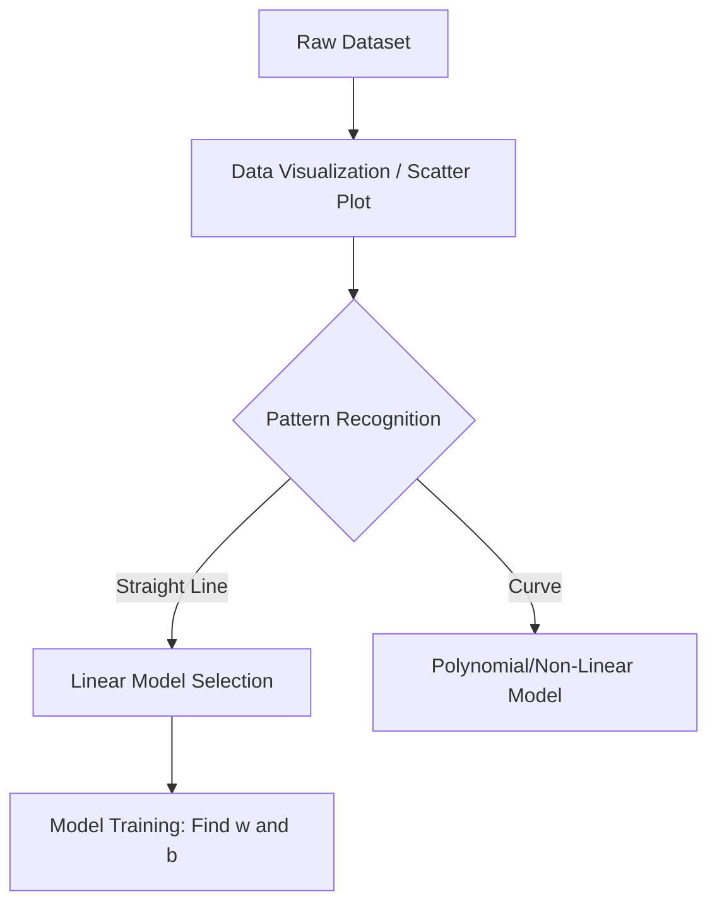

The tutor emphasizes that seeing the data points distributed along a positive slope confirms that a **linear model** is appropriate. If the points formed a U-shape, we might instead choose a parabolic (polynomial) model.

> [!info]+ Interview questions covered
> - Why is data visualization important before selecting a machine learning model?
> - What does a scatter plot tell you about the relationship between variables?

### Data Management with Pandas

Once data is generated or loaded, we use the **Pandas** library to manage it in a tabular format called a **DataFrame**. This is the standard format consumed by most machine learning libraries.

From the Jupyter Notebook demonstration:

```python
import pandas as pd

# Create a DataFrame from the generated data
df = pd.DataFrame(np.hstack([X, y]), columns=['x', 'y'])

# Inspect the first five rows
df.head()
```

The `df.head()` method is essential for a quick sanity check. It allows us to verify the data structure without printing thousands of rows.

> [!info]+ Interview questions covered
> - What is a Pandas DataFrame, and why is it used in ML pipelines?
> - What is the purpose of the `df.head()` function?

### The Linear Model: $y = wx + b$

The goal of linear regression is to find the "best-fit" line that represents the data. This line is defined by the linear equation:

$$y = wx + b$$

Where:
- **$y$**: The predicted output (target).
- **$x$**: The input feature.
- **$w$ (Weight)**: The slope of the line, determining how much $y$ changes for a unit change in $x$.
- **$b$ (Bias/Intercept)**: The value of $y$ when $x=0$.

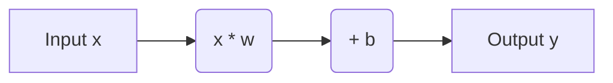

### The Importance of Bias ($b$)

A common question is whether we can simplify the model to $y = wx$ (removing the bias). The tutor demonstrates that removing $b$ forces the regression line to pass through the **origin (0,0)**.

**Why we need Bias:**
- **Flexibility**: Most real-world data does not pass through the origin. For example, a house with 0 square feet might still have a base land value (the intercept).
- **Model Fit**: Forcing the line through (0,0) when the data doesn't support it leads to a poor fit (underfitting), as the model is too constrained to follow the actual trend of the data.

> [!info]+ Interview questions covered
> - What is the role of the bias term ($b$) in a linear regression model?
> - What happens to a linear model if you set the bias to zero?

### Supervised Learning and Real-World Context

The tutor frames this exercise within the broader context of **Supervised Learning**. In this paradigm, we use "labeled data"—historical records where both the input ($X$) and the correct output ($y$) are known.

**Example: House Price Prediction**
- **Input ($X$)**: Square footage of the house.
- **Output ($y$)**: The price at which it was sold.
- **Training**: The model looks at past deals (coordinate pairs on the scatter plot) to learn the relationship ($w$ and $b$). Once trained, it can predict the price ($y$) for a new house with a given square footage ($X$).

> [!info]+ Interview questions covered
> - Define supervised learning in the context of linear regression.
> - What is meant by "labeled data" in machine learning?

---

### Recap & Glossary

**Recap:**
- **Synthetic Data**: Created using `numpy` to test model mechanics.
- **Scatter Plot**: Used to visually identify linear trends.
- **Pandas DataFrame**: The standard tabular structure for ML data.
- **Linear Equation**: $y = wx + b$ is the foundation of linear regression.
- **Bias**: Provides the flexibility to fit data that doesn't pass through the origin.

**Glossary:**
- **Weight ($w$)**: The parameter that scales the input; represents the slope.
- **Bias ($b$)**: The intercept term that shifts the line up or down.
- **Scatter Plot**: A 2D graph showing individual data points.
- **Supervised Learning**: Learning from a dataset containing both inputs and desired outputs.
- **DataFrame**: A 2D labeled data structure in Pandas.


## Linear Regression, Bias, Gradient Descent, Weights, Nnparameter

The core of building a model is defining the relationship between inputs and outputs. In this section, we transition from simple scatter plots to the formal mathematical structure of a linear model, exploring the essential roles of weights and bias, and how we automate the search for these parameters using code.

### The Linear Equation: $y = Wx + b$

At the heart of most neural network layers is a simple linear transformation. While different textbooks might use varied notations (like $W_1, W_2$ or $\theta_0, \theta_1$), the fundamental equation remains:

$$y = Wx + b$$

Where:
- **$x$**: The input feature.
- **$W$ (Weight)**: Scales the input, determining the slope of the line.
- **$b$ (Bias)**: An offset added to the weighted input.
- **$y$**: The predicted output.

In the context of a single neuron, this can be visualized as multiple inputs being weighted and summed before adding a bias term.

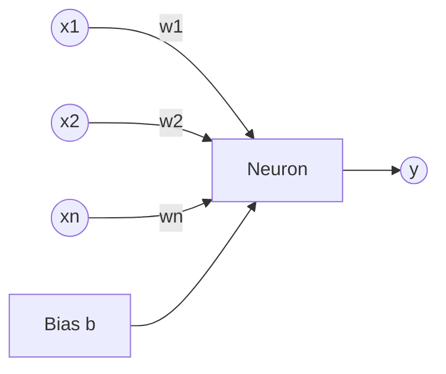

> [!info]+ Interview questions covered
> - What is the standard linear equation used in a single neuron?
> - What do the terms 'weight' and 'bias' represent in a linear model?

### Why Do We Need Bias ($b$)?

A common question is why we can't just use $y = Wx$. The reason lies in **model flexibility**.

If we only use weights ($y = Wx$), our model is mathematically restricted to lines that pass through the **origin** $(0,0)$. However, real-world data rarely follows such a strict constraint. 

| Model Type | Equation | Constraint | Flexibility |
| :--- | :--- | :--- | :--- |
| **Weight Only** | $y = Wx$ | Must pass through $(0,0)$ | Low; often misses data points entirely. |
| **Weight + Bias** | $y = Wx + b$ | Can shift vertically | High; can fit data points anywhere in the coordinate system. |

#### Visualizing the Shift
Adding the bias term $b$ allows the model to "shift" the regression line up or down. This shift enables the model to find a line of best fit that passes closer to the majority of data points, even if they are far from the origin.


> [!info]+ Interview questions covered
> - Why is a bias term necessary in linear regression?
> - What happens to a linear model if the bias term is set to zero?

### Automating the Search: Iterative Optimization

Finding the perfect $W$ and $b$ manually by drawing lines is impossible for large datasets. Instead, we use an automated, iterative process called **Gradient Descent**.

#### The Training Loop
The model follows a repetitive cycle to improve its parameters:

1.  **Initialization**: Start with random or zero values for $W$ and $b$.
2.  **Forward Pass**: Feed the input data $X$ into the model to get a prediction $y_{pred}$.
3.  **Loss Calculation**: Compare $y_{pred}$ with the actual target $y_{true}$ to calculate the error (Loss).
4.  **Backward Pass (Calculus)**: Calculate the **gradients** ($dW$ and $db$). This is the "calculus work" that tells us the direction and magnitude of the error.
5.  **Weight Update**: Adjust $W$ and $b$ in the direction that reduces the loss.

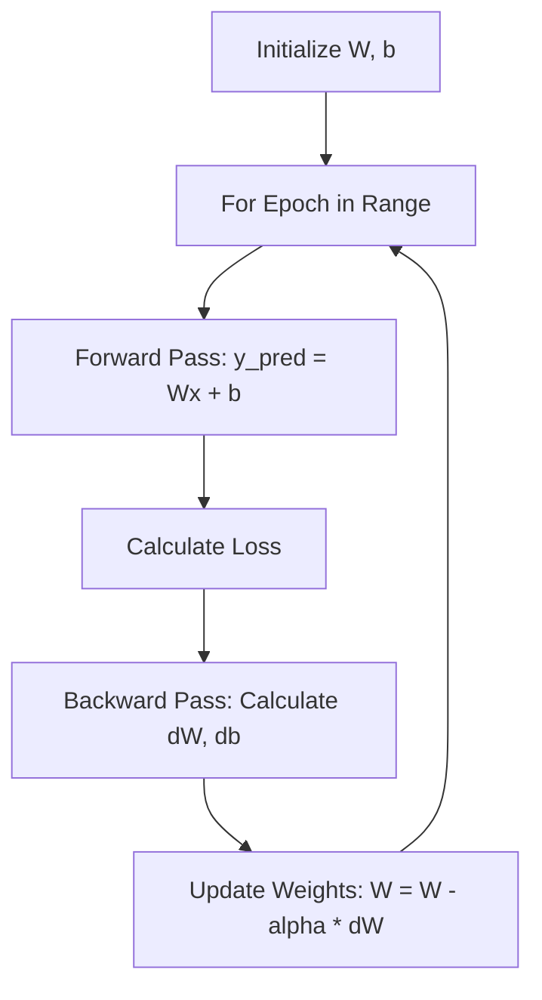

### Implementing Linear Regression in Code

We can implement this logic using libraries like NumPy for manual calculation or PyTorch for automated gradient tracking.

#### Manual Implementation (NumPy)
From `update_weights` shown in VS Code:
```python
def update_weights(m, b, X, Y, learning_rate):
    m_deriv = 0
    b_deriv = 0
    N = len(X)
    for i in range(N):
        # Calculate partial derivatives
        # -2x(y - (mx + b))
        m_deriv += -2*X[i] * (Y[i] - (m*X[i] + b))

        # -2(y - (mx + b))
        b_deriv += -2*(Y[i] - (m*X[i] + b))

    # Update parameters using learning rate
    m -= (m_deriv / float(N)) * learning_rate
    b -= (b_deriv / float(N)) * learning_rate

    return m, b
```

#### PyTorch Implementation
PyTorch simplifies this by tracking gradients automatically using `requires_grad=True`.

From `main.py` shown in VS Code:
```python
import torch

# Initialize parameters with random values
W = torch.randn(1, requires_grad=True)
b = torch.randn(1, requires_grad=True)

learning_rate = 0.01

for epoch in range(100):
    # Forward pass
    y_pred = W * x + b
    
    # Loss (Mean Squared Error)
    loss = torch.mean((y_pred - y_true)**2)
    
    # Backward pass (Calculates gradients automatically)
    loss.backward()
    
    # Update weights
    with torch.no_grad():
        W -= learning_rate * W.grad
        b -= learning_rate * b.grad
        
    # Zero gradients for the next iteration
    W.grad.zero_()
    b.grad.zero_()
```

> [!info]+ Interview questions covered
> - What is the role of `requires_grad=True` in PyTorch?
> - Walk through the steps of a standard training loop in PyTorch.
> - Why do we need to zero the gradients in each iteration?

---

### Recap
- **Linear Model**: Defined by the equation $y = Wx + b$.
- **Weights ($W$)**: Control the slope and scaling of the input signal.
- **Bias ($b$)**: Provides the vertical shift (y-intercept) needed to fit data that doesn't pass through the origin.
- **Gradient Descent**: The iterative process of calculating gradients through calculus and updating parameters to minimize the model's error.
- **Training Loop**: A standard cycle consisting of a Forward Pass, Loss Calculation, Backward Pass, and Parameter Update.

### Glossary
- **Weight ($W$)**: A learnable parameter that scales the input signal.
- **Bias ($b$)**: A learnable parameter that allows the linear transformation to be shifted away from the origin.
- **Gradient**: The partial derivative of the loss function with respect to a parameter, indicating the direction of steepest increase.
- **Learning Rate ($\alpha$)**: A hyperparameter that determines the size of the steps taken during gradient descent to update weights.
- **Epoch**: One complete pass through the entire training dataset during the training process.
- **Forward Pass**: The process of calculating the output of a model from the input data.
- **Backward Pass (Backpropagation)**: The process of calculating gradients of the loss function with respect to the model's parameters using the chain rule.
- **nn.Parameter**: A PyTorch class used to wrap tensors that should be considered model parameters (automatically added to `model.parameters()`).


## Bias, Linear Regression, Model Training, Y_Prediction, Weight Initialization

The tutor introduces the fundamental mechanics of machine learning by walking through the smallest possible model: **Linear Regression**. This section covers how a model moves from an initial state of "knowing nothing" (zero initialization) to learning the underlying patterns in data through an iterative training process.

### The Minimal Machine Learning Model
To understand how complex LLMs work, we start with a simple linear equation. The goal of Linear Regression is to find a relationship between an input $X$ and an output $Y$.

- **The Equation**: $y = wx + b$
- **Parameters**: 
    - $w$ (**Weight**): Controls the slope or the strength of the relationship.
    - $b$ (**Bias**): Controls the y-intercept, allowing the model to represent offsets from the origin.

### Model Training and the `fit` Method
The process of "learning" in machine learning happens within the `fit` method. Instead of a developer manually writing the logic to calculate $Y$, the model is given data and must "figure out" the optimal values for $w$ and $b$.

#### The Training Workflow
1.  **Initialization**: Start with initial values for parameters (e.g., $w=0, b=0$).
2.  **Forward Pass**: Calculate the current prediction ($\hat{y}$) using the current parameters.
3.  **Loss Calculation**: Measure the error (how far $\hat{y}$ is from the actual $y$).
4.  **Optimization (Gradient Descent)**: Adjust $w$ and $b$ slightly to reduce the error.
5.  **Iteration**: Repeat this process for many steps (epochs) until the parameters converge.

From a minimal Linear Regression implementation shown in VS Code:
```python
X = np.array([1, 2, 3, 4])
Y = np.array([2, 4, 6, 8])

model = LinearRegression()
model.fit(X, Y) # This triggers the iterative learning process

X_new = np.array([5, 10, 15, 20])
predictions = model.predict(X_new)
print(f"Predictions: {predictions}")
```

### Batch Processing and Inference
In practice, models do not process data one point at a time. They work on **batches** to leverage computational efficiency.

- **Batch**: A collection of multiple input data points processed simultaneously.
- **Inference**: The stage where a trained model makes predictions on new, unseen data points (like $X = [5, 10, 15, 20]$).

Model prediction using a batch of input values in VS Code:
```python
X_new = np.array([[5], [10], [15], [20]])
y_pred = model.predict(X_new)
print(f"Predictions: {y_pred}")
print(f"Learned weight: {model.linear.weight.item()}")
print(f"Learned bias: {model.linear.bias.item()}")
```

> [!info]+ Interview questions covered
> - What is the difference between model training and inference?
> - Why is batch processing preferred over processing single data points?

### Inspecting Learned Parameters
A key part of understanding model training is inspecting what the model has actually learned. In the lecture example, the model was trained to find a relationship that resulted in a weight of approximately $3.14$ and a bias of $4.04$.

Inspecting learned weight and bias parameters in a Jupyter Notebook:
```python
prediction = model(X_test)
print(f"prediction: {prediction}")
print(f"Weight: {model.weight}")
print(f"Bias: {model.bias}")
```

Execution output in the integrated terminal showing learned parameters:
```console
Prediction before training: 0.0000
Prediction after training: 35.4575
W: 3.1415927410125732
b: 4.041592597961426
```

### PyTorch Implementation
Using PyTorch, we define our model by inheriting from `nn.Module`. Learnable parameters are defined using `nn.Parameter`.

Defining a Linear Regression model using PyTorch's `nn.Module`:
```python
class LinearRegressionModel(nn.Module):
    def __init__(self):
        super().__init__()
        # Initialize weights and bias with random values
        self.weights = nn.Parameter(torch.randn(1,
                                                requires_grad=True,
                                                dtype=torch.float))
        self.bias = nn.Parameter(torch.randn(1,
                                              requires_grad=True,
                                              dtype=torch.float))

    # Forward method defines the computation: y = wx + b
    def forward(self, x: torch.Tensor) -> torch.Tensor:
        return self.weights * x + self.bias
```

### Manual Gradient Descent Loop
To demystify the `fit` method, the tutor demonstrates a manual training loop. This loop explicitly shows the calculation of the prediction, the squared error loss, and the parameter updates using a **learning rate**.

Manual gradient descent loop implementation in Python:
```python
for epoch in range(100):
    # 1. Prediction (Forward Pass)
    y_pred = w * x + b
    
    # 2. Loss Calculation (Squared Error)
    loss = (y_pred - y)**2
    
    # 3. Gradient Calculation (Derivatives)
    grad_w = 2 * (y_pred - y) * x
    grad_b = 2 * (y_pred - y)
    
    # 4. Parameter Update (Gradient Descent)
    w = w - learning_rate * grad_w
    b = b - learning_rate * grad_b
    
    print(f"Epoch {epoch}: w={w}, b={b}, loss={loss}")
```

> [!info]+ Interview questions covered
> - Explain the role of gradients in updating model weights.
> - What happens if the learning rate is too high or too low?

### The Role of Bias ($b$)
A common point of confusion is why we need the bias term $b$ if we already have a weight $w$.

- **Without Bias ($y = wx$)**: The line is forced to pass through the origin $(0,0)$. This is too restrictive and cannot fit data that is shifted.
- **With Bias ($y = wx + b$)**: The line can shift up or down on the y-axis. The bias represents the **y-intercept**, allowing the model to fit data that has an offset.

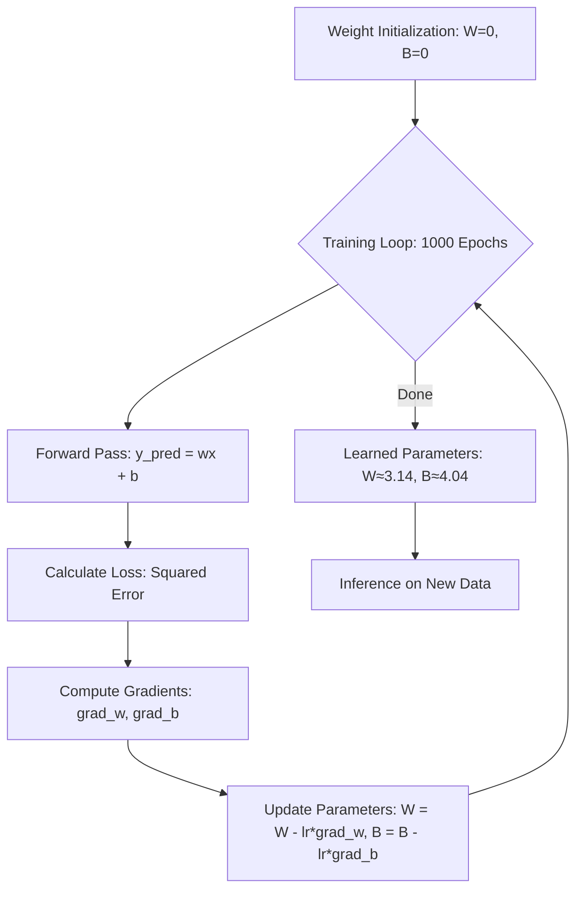

### Why Let the Model Decide?
While a developer might guess $b=4$ for a simple dataset, real-world data is far too complex for manual parameter selection. We use mathematics and coding to let the model figure out the optimal values automatically. This "automated parameter selection" is the core of machine learning.

---

### Recap
- **Linear Regression** ($y = wx + b$) is the foundational building block of machine learning.
- **Model Training** is an iterative process of updating parameters ($w, b$) to minimize error.
- **Weights** control the slope, while **Bias** provides the vertical offset (y-intercept).
- **Gradient Descent** is the engine that drives parameter updates based on calculated errors.
- **Batch processing** allows models to handle multiple inputs efficiently during both training and inference.

### Glossary
- **Weight ($w$)**: A learnable parameter that determines the slope of the linear relationship.
- **Bias ($b$)**: A learnable parameter that allows the model to shift the prediction up or down (y-intercept).
- **Epoch**: One complete pass through the training dataset.
- **Gradient Descent**: An optimization algorithm used to minimize the loss by iteratively updating parameters.
- **Inference**: The stage where a trained model is used to predict outputs for new data.
- **Learning Rate**: A hyperparameter that controls the size of the steps taken during gradient descent.

### Interview Q&A
**Q: What is the purpose of the bias term in a linear model?**
**A**: The bias term allows the model to represent relationships that do not pass through the origin. It provides an offset, allowing the linear function to shift vertically on a graph, which is essential for fitting data that doesn't start at $(0,0)$.

**Q: How does weight initialization affect model training?**
**A**: While the lecture showed starting from zero, weights are often initialized randomly. Proper initialization helps the model converge faster and avoids issues like vanishing or exploding gradients.

**Q: Why do we use batches instead of training on one data point at a time?**
**A**: Batching improves computational efficiency by leveraging parallel processing (especially on GPUs) and provides a more stable estimate of the gradient, leading to smoother convergence during training.


## Bias, Linear Regression, Weights, Y_Prediction, Nnparameter

In this section, we dive into the fundamental components of a linear model, exploring how weights and biases interact to make predictions and how we iteratively refine these parameters to minimize error.

### The Linear Model: $y = wx + b$

The core of our predictive model is a simple linear equation. When we provide an input $x$, the model performs a mathematical calculation to produce a prediction, which we call $y_{pred}$.

$$y_{pred} = wx + b$$

Where:
- **$x$**: The input feature.
- **$w$ (Weight)**: A parameter that determines the strength of the relationship between the input and the output.
- **$b$ (Bias)**: An additional parameter that allows the model to fit data that does not pass through the origin.

Excalidraw whiteboard showing the model flow:

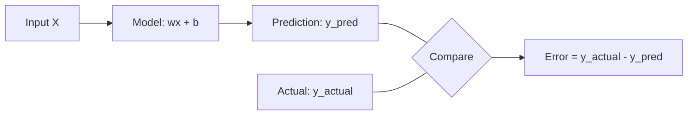

> [!info]+ Interview questions covered
> - What is the difference between $y_{actual}$ and $y_{pred}$?
> - Define the basic linear regression equation used in machine learning.

### Defining Error and the Iterative Training Process

The goal of training is to make $y_{pred}$ as close to $y_{actual}$ as possible. The difference between these two values is the **Error**.

$$\text{Error} = y_{actual} - y_{pred}$$

#### Manual Trace of Model Training
To understand how a model learns, we can trace the process across multiple steps. We typically start by initializing our parameters to zero.

| Step | $w$ | $b$ | $y_{pred}$ | Error ($y_{actual} - y_{pred}$) |
| :--- | :--- | :--- | :--- | :--- |
| **Step 1** | 0 | 0 | 0 | $y_{actual}$ |
| **Step 2** | 0.5 | 0.5 | $0.5x + 0.5$ | Reduced Error |
| **Step 3** | 0.8 | 0.6 | $0.8x + 0.6$ | Further Reduced Error |
| **Step 4** | ... | ... | ... | Minimized Error |

As we progress through these steps, we manually (or eventually, automatically) update $w$ and $b$ to reduce the error for every data point in our set.

From the manual calculation shown in the lecture (Step 2):


### The Role of Bias: Why $b$ is Essential

A common question in technical interviews is: **"What is bias, and why do we need it?"**

Bias is an extra parameter added to the linear equation to give the model more "freedom" to fit the dataset. Without a bias term ($y = wx$), the model is forced to pass through the origin $(0,0)$. If your data doesn't naturally intersect at zero (e.g., a house with 0 square feet still has a base cost, or a person with 0 years of experience still has a base salary), a model without bias will never fit correctly.

| Model Type | Equation | Visual Characteristic |
| :--- | :--- | :--- |
| **Without Bias** | $y = wx$ | Forced to pass through the origin $(0,0)$. |
| **With Bias** | $y = wx + b$ | Can shift up or down to better fit the data distribution. |


> [!info]+ Interview questions covered
> - What is bias in a linear model?
> - Why can't we just use $y = wx$ for all linear regression tasks?
> - How does bias provide "freedom" to a model?

### Implementation in PyTorch: `nn.Parameter`

In PyTorch, we define these weights and biases as `nn.Parameter`. This tells PyTorch that these are tensors that should be considered part of the model's parameters and updated during training.

From `SimpleModel` definition shown in VS Code:

```python
import torch
import torch.nn as nn

class SimpleModel(nn.Module):
    def __init__(self):
        super().__init__()
        # Initializing w and b with random values
        self.w = nn.Parameter(torch.randn(1, requires_grad=True))
        self.b = nn.Parameter(torch.randn(1, requires_grad=True))

    def forward(self, x):
        # Implementing the linear equation
        return self.w * x + self.b
```

Alternatively, we can use the built-in `nn.Linear` layer, which handles both $w$ and $b$ internally:

From `SimpleModel` using `nn.Linear` shown in VS Code:

```python
class SimpleModel(nn.Module):
    def __init__(self):
        super(SimpleModel, self).__init__()
        # A linear layer with 1 input and 1 output
        self.linear = nn.Linear(1, 1)
        # Manually filling with 0.5 for demonstration
        self.linear.weight.data.fill_(0.5)
        self.linear.bias.data.fill_(0.5)

    def forward(self, x):
        return self.linear(x)
```

### Optimization: Finding the Best $w$ and $b$

While we can manually experiment with values, real-world models use **Optimization** algorithms to find the best parameters. The most common method is **Gradient Descent**.

The goal is to minimize the **Loss** (a function of the error). We calculate the gradient (the direction of steepest increase) and move in the opposite direction to find the "valley" or the minimum point of the loss curve.

#### Gradient Descent Update Formulas:
We update our parameters iteratively using a **Learning Rate** ($\alpha$):

$$w = w - \alpha \cdot \frac{\partial L}{\partial w}$$
$$b = b - \alpha \cdot \frac{\partial L}{\partial b}$$

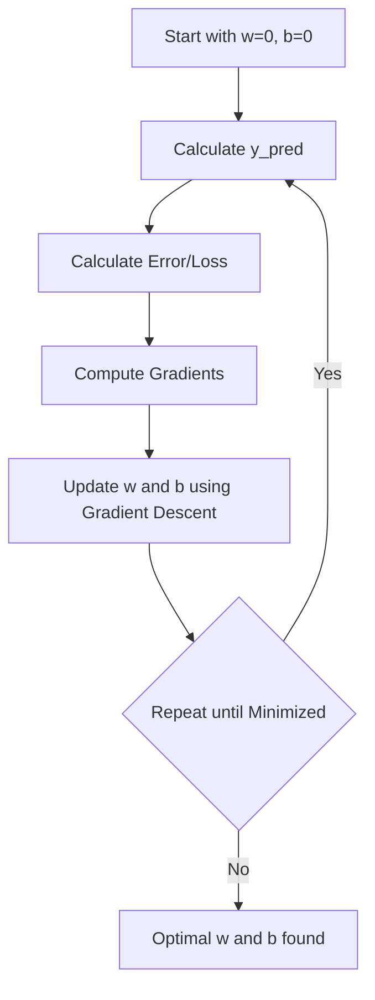

> [!info]+ Interview questions covered
> - How do you find the optimal values for $w$ and $b$?
> - What is the role of the learning rate ($\alpha$) in gradient descent?
> - What are the update rules for weights and biases in optimization?

### Recap: Experience vs. Salary Example

To ground these concepts, consider a dataset mapping Experience (Years) to Salary (in 1000s):

| Experience ($x$) | Salary ($y_{actual}$) |
| :--- | :--- |
| 1 | 30 |
| 2 | 50 |
| 3 | 70 |
| 4 | 90 |
| 5 | 110 |

By plotting this, we see a clear linear relationship. Our model $y = wx + b$ will attempt to find the line of best fit. In this case, $w=20$ and $b=10$ would fit the data perfectly ($20(1) + 10 = 30$, $20(2) + 10 = 50$, etc.).

### Glossary

- **$y_{pred}$**: The output value calculated by the model.
- **$y_{actual}$**: The true target value from the dataset.
- **Weight ($w$)**: The coefficient of the input $x$, representing the slope of the line.
- **Bias ($b$)**: The constant added to the equation, representing the y-intercept.
- **Error**: The difference between the actual and predicted values.
- **`nn.Parameter`**: A PyTorch class used to define learnable parameters.
- **Gradient Descent**: An optimization algorithm used to minimize the loss by iteratively updating parameters.

### Interview Q&A

**Q: Why do we initialize weights and biases to zero or random values?**
**A:** We need a starting point for the optimization process. Initializing to zero is common for biases, but weights are often initialized randomly to "break symmetry," ensuring that different neurons in a network can learn different features.

**Q: What happens if the learning rate ($\alpha$) is too high?**
**A:** If $\alpha$ is too high, the updates might overstep the minimum, causing the loss to oscillate or even diverge instead of converging.

**Q: What happens if the learning rate ($\alpha$) is too low?**
**A:** The model will take a very long time to converge, as the updates to $w$ and $b$ will be extremely small.


## Cost Function, Average Error, Mean Raw Error, Error, Batch Processing

To train a model effectively, we must understand how to move in the "correct direction." This means determining whether to increase or decrease weights ($W$) and biases ($B$). To make these decisions, we need a mathematical way to measure how well the model is performing across our data.

### Cost Function vs. Error

A fundamental distinction in machine learning, and a common interview topic, is the difference between an individual "error" and a "cost function."

*   **Error**: This is calculated for a single data point. You take one input, make a prediction, and compare it with the actual target value.
    $$\text{Error} = y_{\text{pred}} - y_{\text{actual}}$$
*   **Cost Function**: This is an aggregate measure. Instead of looking at one point, you feed all the data (either in batches or the full dataset) into the model and calculate the average error across all those points.

> [!info]+ Interview questions covered
> - What is the difference between an error and a cost function?
> - How do you calculate the cost function for a batch of data?

### Mean Raw Error (MRE)

The first and most intuitive way to define a cost function is the **Mean Raw Error (MRE)**. We generally denote the cost function with the symbol $J$. 

If we have $m$ data points, the Mean Raw Error is the sum of all individual errors divided by the number of items:

$$J(\theta) = \frac{1}{m} \sum_{i=1}^{m} (h_{\theta}(x^{(i)}) - y^{(i)})$$

Where:
*   $h_{\theta}(x^{(i)})$ is the prediction for the $i$-th input.
*   $y^{(i)}$ is the actual value for the $i$-th input.
*   $m$ is the total number of data points (or batch size).

#### Visualizing Errors in Linear Regression
In a linear regression model, the error (or residual) for each point is the vertical distance between the actual data point and the regression line.

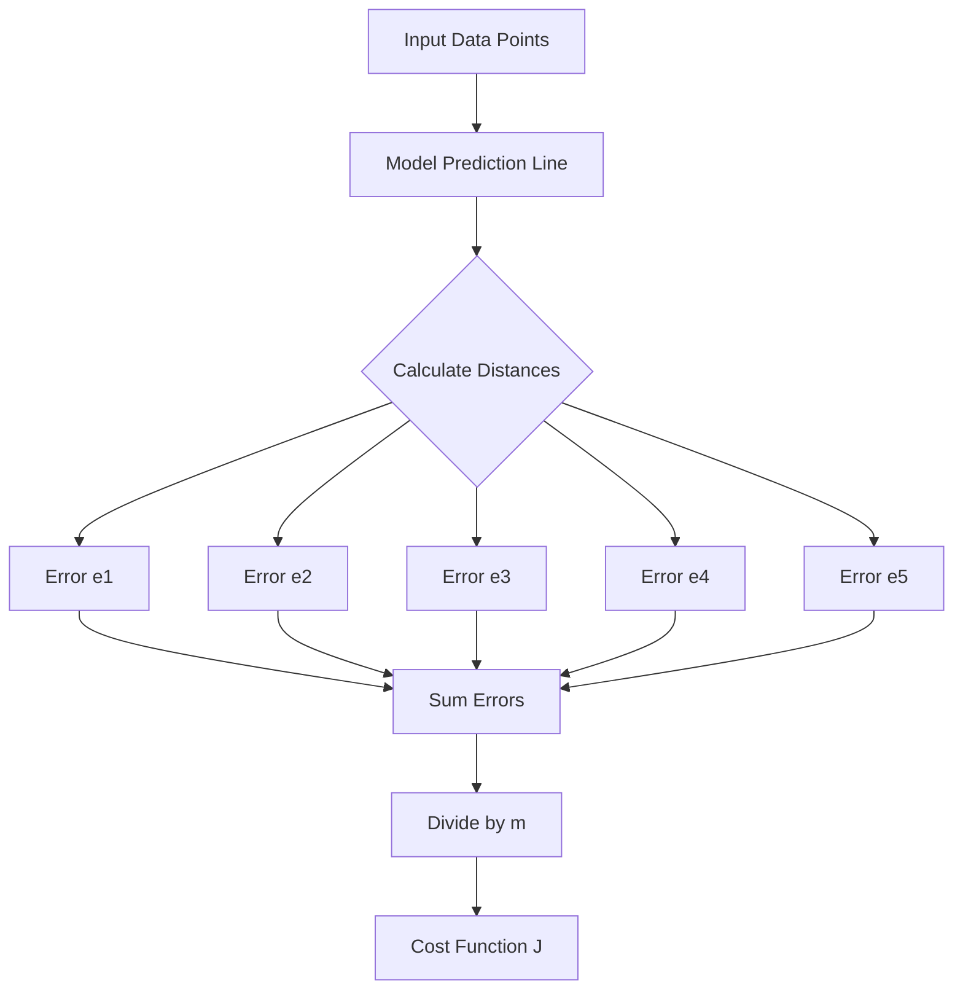


### The Problem of Error Cancellation

While Mean Raw Error is simple to understand, it has a significant flaw in practice: **error cancellation**. 

Consider a numerical example where we have 5 data points ($n=5$) with the following individual errors ($y_{\text{pred}} - y_{\text{actual}}$):
*   Point 1: $-0.1$
*   Point 2: $-0.1$
*   Point 3: $+0.1$
*   Point 4: $-0.1$
*   Point 5: $+0.1$

If we calculate the Mean Raw Error:
$$J = \frac{1}{5} [(-0.1) + (-0.1) + (0.1) + (-0.1) + (0.1)] = \frac{1}{5} [-0.1] = -0.02$$

Even though every single prediction was off by $0.1$, the total cost $J$ appears very small because the positive and negative errors canceled each other out. This gives a misleading impression that the model is performing better than it actually is.

> [!info]+ Interview questions covered
> - Why is Mean Raw Error (MRE) rarely used as a cost function in practice?
> - What is the problem of error cancellation in cost functions?

***

### Recap & Glossary

*   **Error**: The difference between a single prediction and the actual value.
*   **Cost Function ($J$)**: The average error over a set of data points.
*   **Mean Raw Error (MRE)**: A cost function calculated by averaging the simple differences between predictions and actuals.
*   **Error Cancellation**: The phenomenon where positive and negative errors sum to a value near zero, masking the true magnitude of the model's inaccuracy.

### Interview Q&A

**Q: If my model has a Mean Raw Error of zero, does it mean the model is perfect?**
**A:** Not necessarily. A Mean Raw Error of zero could mean the model is perfect, but it could also mean that the positive errors and negative errors perfectly canceled each other out (e.g., one prediction was $+10$ off and another was $-10$ off). This is why we typically use Mean Squared Error (MSE) or Mean Absolute Error (MAE) instead.

**Q: What is the difference between Batch Processing and calculating the cost on the full dataset?**
**A:** In Batch Processing, you calculate the cost function $J$ over a small subset (a batch) of the data at a time. This is computationally more efficient and allows for faster updates during training compared to waiting to process the entire dataset.


## Mean Absolute Error, Loss Functions, Mae, Root Mean Squared Error, Nullification

In this section, we explore how to quantify the "cost" or "error" of our model's predictions. We move from a naive approach that fails due to mathematical cancellation to robust metrics like Mean Absolute Error (MAE) and Mean Squared Error (MSE), which form the foundation of model optimization.

### The Problem with Mean Raw Error: Nullification

To evaluate a model, we need a single number that represents how far off our predictions are from the actual values. A first instinct might be to simply average the differences between the predicted values ($\hat{y}$) and the actual values ($y$). This is called **Mean Raw Error**.

#### Why Mean Raw Error Fails
The tutor demonstrates that Mean Raw Error is misleading because of **error nullification**. If one prediction is too high (+1) and another is too low (-1), they cancel each other out when summed.

As shown on the whiteboard:
- **Error 1**: $+1.34$
- **Error 2**: $-0.67$
- **Error 3**: $-0.15$
- **Error 4**: $-0.37$
- **Error 5**: $0.00$

Summing these yields a total error of only $0.15$. Dividing by 5 gives a Mean Raw Error of $0.03$. This suggests the model is nearly perfect (close to zero error), even though individual predictions were off by significant amounts.

> [!IMPORTANT]
> **Nullification** occurs when positive and negative errors cancel each other out, giving a false sense of model accuracy. Ideally, we want to measure the **magnitude** of the error, regardless of its direction.

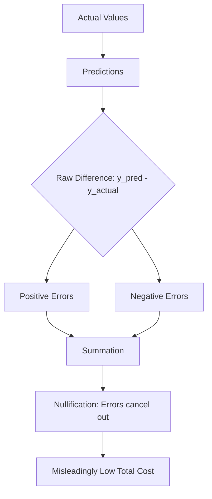

> [!info]+ Interview questions covered
> - What is error nullification in the context of loss functions?
> - Why is Mean Raw Error not a suitable metric for training machine learning models?

---

### Mean Absolute Error (MAE)

To solve the nullification problem, we must ensure that every error contributes positively to the total cost. The simplest way to do this is by taking the **absolute value** of each error before averaging them. This metric is known as **Mean Absolute Error (MAE)**.

#### Mathematical Formula
The formula for MAE is:
$$MAE = \frac{1}{n} \sum_{i=1}^{n} |y_i - \hat{y}_i|$$

Where:
- $n$ is the number of observations.
- $y_i$ is the actual value.
- $\hat{y}_i$ is the predicted value.
- $|y_i - \hat{y}_i|$ is the absolute difference (magnitude of error).

#### Worked Example: MAE Calculation
The tutor provides a numerical example to show how absolute values prevent cancellation:

| Actual Value ($y$) | Predicted Value ($\hat{y}$) | Error ($y - \hat{y}$) | Absolute Error ($|y - \hat{y}|$) |
| :--- | :--- | :--- | :--- |
| 10 | 9.5 | -0.5 | 0.5 |
| 10 | 10.2 | 0.2 | 0.2 |
| 10 | 9.7 | -0.3 | 0.3 |
| 10 | 10.5 | 0.5 | 0.5 |
| 10 | 10.8 | 0.8 | 0.8 |
| **Total** | | **0.7** (Misleading) | **2.3** (Actual Magnitude) |

**MAE Calculation**: $2.3 / 5 = 0.46$

In this case, the MAE correctly reflects that the average prediction is off by $0.46$ units, whereas the raw average ($0.14$) would have understated the error.

#### Implementation in PyTorch
From the Jupyter Notebook shown in the lecture:
```python
# Calculating MAE using PyTorch
abs_mean_error = torch.mean(torch.abs(y - y_pred))
print(abs_mean_error)
```
The output `tensor(1.0606)` indicates that the model still has significant error and needs further iteration.

> [!info]+ Interview questions covered
> - Define Mean Absolute Error (MAE) and provide its formula.
> - What are the advantages of MAE over Mean Raw Error?

---

### Mean Squared Error (MSE)

Another way to eliminate the sign of the error and prevent nullification is to **square** the differences. This leads to the **Mean Squared Error (MSE)**.

#### Mathematical Formula
The formula for MSE is:
$$MSE = \frac{1}{n} \sum_{i=1}^{n} (y_i - \hat{y}_i)^2$$

#### Why Use Squaring?
The tutor highlights several reasons why squaring is preferred over absolute values in many scenarios:
1.  **Solves Nullification**: Like absolute values, squares are always non-negative.
2.  **Mathematical Convenience**: Squared functions are smooth and **differentiable** everywhere (including at zero). This makes them much easier to use with **Calculus** and **Gradient Descent**.
3.  **Sensitivity to Outliers**: Squaring "punishes" larger errors more severely than smaller ones. (e.g., an error of 10 becomes 100, while an error of 1 remains 1).

#### Root Mean Squared Error (RMSE)
Because MSE involves squaring the units (e.g., if $y$ is in dollars, MSE is in dollars squared), we often take the square root of the result to bring the error back to the original scale. This is called **Root Mean Squared Error (RMSE)**.
$$RMSE = \sqrt{MSE}$$

#### Worked Example: MSE Calculation
On the Excalidraw whiteboard, the tutor calculates MSE for a small set:
- Errors: $-0.1, 0.2, -0.2, 0.1$
- Squared Errors: $0.01, 0.04, 0.04, 0.01$
- Sum of Squares: $0.10$
- Mean Squared Error: $0.10 / 4 = 0.025$
- RMSE: $\sqrt{0.025} \approx 0.158$

> [!info]+ Interview questions covered
> - Compare MAE and MSE. When would you prefer one over the other?
> - Why is MSE more suitable for Gradient Descent than MAE?

---

### The Cost Function and Optimization

The MSE is often referred to as the **Cost Function** or **Loss Function**, denoted as $J(w, b)$. In linear regression, our goal is to find the parameters (weight $w$ and bias $b$) that minimize this cost.

#### The Optimization Goal
We know our inputs ($X$) and our actual targets ($Y$). The only things we can change are $w$ and $b$. We want to "play around" with these values until the cost function $J(w, b)$ reaches its minimum possible value—ideally zero.

$$J(w, b) = \frac{1}{2m} \sum_{i=1}^{m} (f_{w,b}(x^{(i)}) - y^{(i)})^2$$

*(Note: The $1/2m$ instead of $1/n$ is a common convention in machine learning to simplify the derivative calculation later.)*

#### The Path to Gradient Descent
To find the minimum of this function efficiently, we cannot just guess values. We need to understand the **slope** of the function at any given point to know which direction to move $w$ and $b$. This is where **Calculus** and **Derivatives** come into play, which will be the focus of the next section.

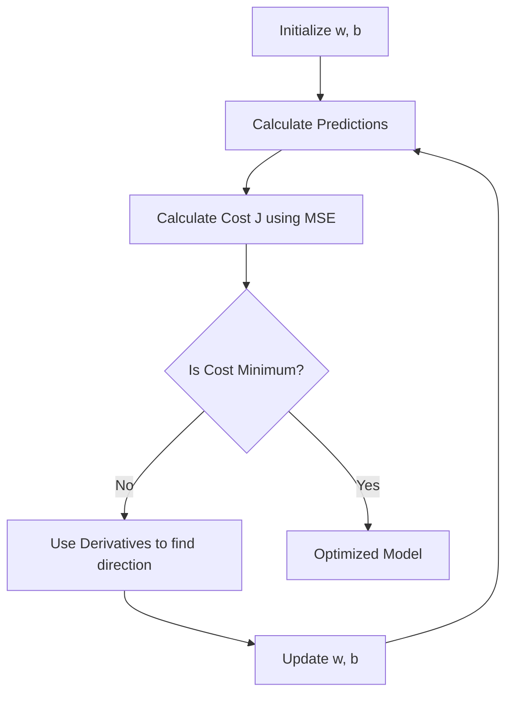

> [!info]+ Interview questions covered
> - What is a cost function in machine learning?
> - How do weight (w) and bias (b) affect the cost function?

---

### Recap
- **Mean Raw Error** is flawed because positive and negative errors cancel out (**nullification**).
- **MAE** solves this using absolute values but is not easily differentiable at zero.
- **MSE** solves this by squaring errors, creating a smooth function ideal for optimization via **Gradient Descent**.
- **RMSE** provides the error in the same units as the target variable.
- The **Cost Function** $J(w, b)$ is the mathematical representation of the model's total error, which we aim to minimize by adjusting $w$ and $b$ using calculus.

### Glossary
- **Nullification**: The mathematical cancellation of positive and negative values when summed.
- **MAE (Mean Absolute Error)**: The average of the absolute differences between actual and predicted values.
- **MSE (Mean Squared Error)**: The average of the squared differences between actual and predicted values.
- **Cost Function**: A function that measures the performance of a Machine Learning model for given data.
- **Differentiability**: A property of a function that allows its derivative (slope) to be calculated at any point.

### Interview Q&A
**Q: Why do we use Mean Squared Error (MSE) instead of Mean Absolute Error (MAE) as a loss function for most regression problems?**
**A:** While both solve the problem of error nullification, MSE is preferred because it is a smooth, continuous function that is differentiable everywhere. This differentiability is crucial for optimization algorithms like Gradient Descent, which rely on derivatives to find the direction of steepest descent. Additionally, MSE penalizes larger errors more heavily, which is often desirable in model training.

**Q: What is the significance of the 'magnitude' of error versus the 'direction' of error?**
**A:** In model evaluation, the direction (whether the prediction is too high or too low) is less important than the total magnitude (how far off the prediction is). If we only look at direction, errors can cancel out, leading to a misleadingly low total cost. Metrics like MAE and MSE focus on capturing the magnitude to provide an honest assessment of model performance.

**Q: How does the bias (b) influence the error in a linear model?**
**A:** The bias acts as an offset. If the model's predictions are consistently higher or lower than the actual values (a parallel shift), adjusting the bias can move the entire prediction line closer to the data points, thereby reducing the total error.

## Calculus, Tangent Line, First Derivative, Slope, Derivatives

In this section, we transition from the high-level concept of model training to the underlying mathematics that makes it possible: **Calculus**. Specifically, we focus on the **derivative**, which is the engine behind how a model "learns" by adjusting its parameters to minimize error.

### The Concept of a Derivative

A derivative is fundamentally a measure of the **rate of change**. It tells us how a small change in the input of a function affects its output.

#### Why Derivatives Matter in Machine Learning
In the context of training an LLM or any neural network, we want to minimize a **cost function** (the error). To do this, we need to know:
1. **Direction**: Should we increase or decrease a weight ($W$) or bias ($B$)?
2. **Magnitude**: How much should we change it?

The derivative provides this information by showing how the cost function responds to tiny adjustments in weights.

> [!info]+ Interview questions covered
> - What is the role of derivatives in machine learning?
> - How do derivatives help in cost function minimization?

### The Mathematical Definition

The formal definition of a derivative is based on the concept of a **limit**. If we have a function $f(x)$, its derivative $f'(x)$ (also written as $\frac{dy}{dx}$) is defined as:

$$\frac{dy}{dx} = \lim_{h \to 0} \frac{f(x+h) - f(x)}{h}$$

#### Worked Example: $f(x) = x^2$
Let's derive the derivative for a simple power function, $f(x) = x^2$, which is a common shape for cost functions (like Mean Squared Error).

1. **Substitute into the formula**:
   $$f'(x) = \lim_{h \to 0} \frac{(x+h)^2 - x^2}{h}$$
2. **Expand the square**:
   $$f'(x) = \lim_{h \to 0} \frac{x^2 + 2xh + h^2 - x^2}{h}$$
3. **Simplify**:
   $$f'(x) = \lim_{h \to 0} \frac{2xh + h^2}{h}$$
4. **Divide by $h$**:
   $$f'(x) = \lim_{h \to 0} (2x + h)$$
5. **Apply the limit ($h \to 0$)**:
   $$f'(x) = 2x$$

Thus, for $f(x) = x^2$, the rate of change at any point $x$ is simply $2x$.

### Significance of the First Derivative

The first derivative provides two critical pieces of information for optimization:

1. **Function Direction**: It tells us whether the function is increasing or decreasing at a given point.
2. **Slope of the Tangent**: Geometrically, the derivative at a point is the **slope of the tangent line** drawn to the graph at that point.

#### The Direction Rule
When moving from **left to right** along the x-axis:
- If $f'(x) > 0$ (Positive): The function is **increasing**.
- If $f'(x) < 0$ (Negative): The function is **decreasing**.

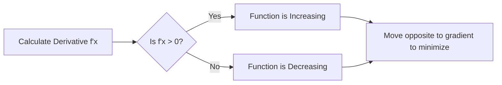

> [!info]+ Interview questions covered
> - What does the sign of the first derivative indicate about a function?
> - What is the geometric interpretation of a derivative?

### Geometric Interpretation: The Parabola Example

Using the parabola $f(x) = x^2$, we can visualize how the derivative guides us.

#### Case 1: Positive Slope ($x = 2$)
- **Point**: $x = 2$
- **Derivative**: $f'(2) = 2(2) = 4$
- **Interpretation**: The slope is $+4$. Since it is positive, the function is increasing. If this were a cost function, we would know that increasing $x$ further would increase the error.

#### Case 2: Negative Slope ($x = -2$)
- **Point**: $x = -2$
- **Derivative**: $f'(-2) = 2(-2) = -4$
- **Interpretation**: The slope is $-4$. Since it is negative, the function is decreasing. Moving from left to right, the "valley" is ahead of us.

#### Visualizing the Tangent
Imagine drawing a straight line that just touches the curve at $x=2$. That line's steepness is exactly $4$. At $x=-2$, the line tilts the other way with a steepness of $-4$.

### Recap
- **Derivative**: The rate of change of a function; $\frac{dy}{dx}$.
- **Optimization**: We use derivatives to decide how to update weights to reach the minimum of the cost function.
- **Slope**: The derivative at a specific point equals the slope of the tangent line at that point.
- **Direction**: Positive derivative means the function is going up; negative means it is going down (as we move left to right).

### Glossary
- **Calculus**: The mathematical study of continuous change.
- **Tangent Line**: A straight line that touches a curve at a single point, representing the slope at that point.
- **First Derivative**: The primary derivative of a function, representing its instantaneous rate of change.
- **Slope**: A number that describes both the direction and the steepness of a line.

### Interview Q&A
**Q: Why do we use the first derivative in Gradient Descent?**
**A:** The first derivative tells us the slope of the cost function at our current set of weights. By knowing the slope, we know which direction "downhill" is. We then update our weights in the opposite direction of the slope to minimize the error.

**Q: What happens to the derivative at the minimum point of a cost function?**
**A:** At the minimum (or maximum) point, the tangent line is horizontal, meaning the slope (and thus the derivative) is zero. This is the goal of optimization: to find the point where the derivative is zero.

**Q: If $f(x) = x^2$ and our current weight is $x=5$, should we increase or decrease $x$ to minimize the function?**
**A:** At $x=5$, $f'(5) = 2(5) = 10$. Since the derivative is positive, the function is increasing. To minimize it, we must move in the opposite direction, so we should **decrease** $x$.


## First Derivative, Gradient Descent, Cost Function, Minimization, Increasing And Decreasing Functions

To understand how models learn, we must understand how to minimize the "error" or "cost." The tutor uses the simplest possible example—a parabola—to illustrate the fundamental calculus behind optimization.

### The Mathematical Foundation: $f(x) = x^2$

We start with a basic parabola as our **cost function**:
$$f(x) = x^2$$

To find the minimum of this function, we need to understand its behavior at any given point. This is where the **first derivative** comes in:
$$f'(x) = 2x$$

The first derivative tells us the slope of the tangent line at any point $x$, which indicates whether the function is increasing or decreasing at that specific location.

### Increasing vs. Decreasing Functions

The sign of the first derivative determines our direction of movement:

1.  **Positive Derivative ($f'(x) > 0$):**
    -   As we move from left to right, the function value **increases**.
    -   Example: At $x = 3$, $f'(3) = 6$. Moving further right (to $x=4$) increases the cost ($3^2=9 \to 4^2=16$).
    -   **Action**: To minimize the cost, we must move to the **left**.

2.  **Negative Derivative ($f'(x) < 0$):**
    -   As we move from left to right, the function value **decreases**.
    -   Example: At $x = -3$, $f'(-3) = -6$. Moving right (towards $x=0$) decreases the cost ($(-3)^2=9 \to 0^2=0$).
    -   **Action**: To minimize the cost, we must move to the **right**.

### The Significance for Gradient Descent

The first derivative is the "compass" for Gradient Descent. It doesn't just tell us the slope; it tells us the **direction** we need to move to reach the minimum.

-   **Goal**: Reach the minimum value (where $f(x) = 0$ in this case).
-   **Logic**: If the derivative is positive, go left. If the derivative is negative, go right.

#### Visualization of the Minimization Process

The following diagram illustrates how the sign of the derivative dictates the direction of movement toward the minimum:

```mermaid
graph LR
    subgraph "Left Side (x < 0)"
    A[f'(x) is Negative] --> B[Move Right]
    end
    subgraph "Right Side (x > 0)"
    C[f'(x) is Positive] --> D[Move Left]
    end
    B --> E((Minimum: x=0))
    D --> E
```


> [!info]+ Interview questions covered
> - How does the first derivative help in the optimization of a cost function?
> - What does a positive vs. negative first derivative indicate about a function's behavior?
> - In the context of Gradient Descent, how do we determine the direction of movement?

### Recap
-   The **cost function** (e.g., $f(x) = x^2$) represents the error we want to minimize.
-   The **first derivative** provides the slope, indicating if the function is increasing or decreasing.
-   **Minimization** is achieved by moving in the opposite direction of the gradient (if the slope is positive, move left; if negative, move right).

### Glossary
-   **Cost Function**: A mathematical function that measures the performance of a model by calculating the error between predicted and actual values.
-   **First Derivative**: The rate at which a function changes at a specific point; mathematically represented as the slope of the tangent line.
-   **Minimization**: The process of finding the input values that result in the lowest possible output of a function.
-   **Gradient Descent**: An iterative optimization algorithm used to find the minimum of a function by taking steps proportional to the negative of the gradient.


## Gradient Descent, Optimization, Derivatives, Slope, Iterations

In this section, we transition from the basic concept of derivatives to their practical application in optimization, specifically focusing on how they guide the direction of movement in Gradient Descent.

### Optimization with $f(x) = -x^2$

To understand how derivatives dictate direction, let's consider the function $f(x) = -x^2$, which is a downward-opening parabola.

**From Jupyter notebook shown in VS Code:**
```python
def f(x):
    return -x**2
```

The derivative of this function is:
$$f'(x) = -2x$$

The tutor uses this example to build intuition about how the sign of the derivative (the slope) informs our next step in an optimization process.

#### Worked Example: Calculating Slope at $x = -2$
If we are at the point where $x = -2$:
1.  **Calculate the derivative value**: $f'(-2) = -2 \times (-2) = 4$.
2.  **Analyze the result**: The slope is **positive** ($+4$).
3.  **Determine function behavior**: A positive slope indicates that the function is **increasing** as we move from left to right.
4.  **Decide direction**: If our goal is to **decrease** the function value (as we do with cost functions), we must move to the **left** on the x-axis.

> [!info]+ Interview questions covered
> - How does the sign of the derivative determine the direction of movement in optimization?
> - What does a positive slope indicate about a function's behavior at a specific point?

### Minimizing the Cost Function

While we can use derivatives to find a maximum, machine learning almost exclusively focuses on **minimizing** a cost (or loss) function. The standard example is the upward-opening parabola $f(x) = x^2$.

#### The Gradient Descent Rule
The first derivative $f'(x)$ provides all the information needed to reach the minimum value (where the cost is zero).

| Condition | Slope ($f'(x)$) | Action | Result |
| :--- | :--- | :--- | :--- |
| $f'(x) > 0$ | Positive | Move **Left** | Decreases $x$ to reach minimum |
| $f'(x) < 0$ | Negative | Move **Right** | Increases $x$ to reach minimum |

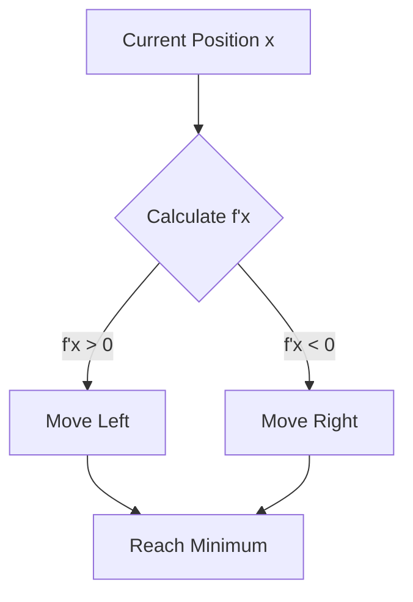

This logic holds regardless of the starting point. Whether we start at $x = 2$ or $x = -2$ on the $f(x) = x^2$ curve, the derivative will correctly guide us toward $x = 0$.

### Maximum vs. Minimum: Ascent vs. Descent

The tutor contrasts finding the maximum of a concave-down function with finding the minimum of a concave-up function.

*   **Minimization (Gradient Descent)**: Used for loss functions. We move in the direction opposite to the gradient.
*   **Maximization (Gradient Ascent)**: Used when we want to find the peak of a function. We move in the same direction as the gradient.

In both cases, the initial value and the slope of the tangent line at that point are the deciding factors for the first step. However, a single point might not always be enough to decide the full path in complex, non-convex functions where local minima exist.

> [!info]+ Interview questions covered
> - What is the difference between Gradient Descent and Gradient Ascent?
> - Why do we focus on minimization in machine learning?

### The Iterative Nature of Training

Optimization in machine learning is not a one-step calculation but an **iterative process**. The derivative is calculated at **every single iteration**.

#### What Happens in One Iteration?
The tutor describes a scenario with a batch of 100 data points:
1.  **Forward Pass**: Feed 100 data points into the model to get 100 outputs.
2.  **Error Calculation**: Compare the outputs with actual targets and "club" (aggregate) the errors to find the collective loss.
3.  **Derivative Calculation**: Find the derivative of the cost function with respect to the weights at the current state.
4.  **Weight Update**: Update the weights based on the gradient to move toward the minimum.
    $$w = w - \alpha \times \frac{dJ}{dw}$$
    *(Where $\alpha$ is the learning rate and $\frac{dJ}{dw}$ is the derivative of the cost function $J$ with respect to weight $w$)*.

This cycle repeats, with each iteration representing a new point on the cost curve, gradually descending toward the global minimum.

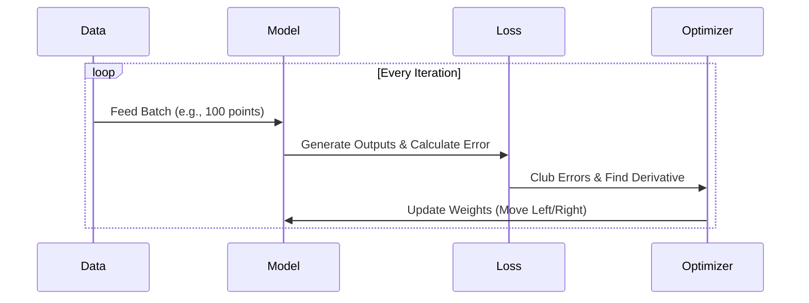

> [!info]+ Interview questions covered
> - Describe the steps involved in a single iteration of Gradient Descent.
> - What does "clubbing the error" mean in the context of batch processing?
> - Why is the derivative recalculated in every iteration?

### Section Recap
*   **Derivatives as Direction**: The sign of the derivative tells us whether to increase or decrease our parameters to reach an extremum.
*   **Minimization Goal**: In ML, we use Gradient Descent to minimize the loss function.
*   **Iterative Process**: Training involves repeated cycles of error calculation, gradient finding, and weight updates.
*   **Batch Processing**: Errors from multiple data points are aggregated in each iteration to inform the gradient.

### Glossary
*   **Gradient Descent**: An iterative optimization algorithm used to find the minimum of a function.
*   **Slope/Derivative**: The rate of change of a function; visually represented as the tangent line at a point.
*   **Iteration**: One complete pass of a data batch through the model, including error calculation and weight update.
*   **Optimization**: The process of adjusting model parameters to minimize or maximize a target function.
*   **Non-convex Function**: A function with multiple local minima/maxima, making global optimization challenging.

### Interview Q&A
**Q: If the derivative of your loss function is negative at the current weight, which direction should you move the weight to minimize loss?**
**A:** You should move the weight to the **right** (increase the weight). A negative derivative means the function is decreasing as $x$ increases, so moving right will continue to lower the function value toward the minimum.

**Q: Why do we calculate the derivative in every iteration instead of just once?**
**A:** As weights are updated, the model's position on the cost function curve changes. The slope at the new position will be different, requiring a new derivative calculation to determine the correct direction and magnitude for the next step.

**Q: What is the role of the learning rate ($\alpha$) in the weight update rule?**
**A:** The learning rate determines the size of the step we take in the direction indicated by the derivative. If it's too large, we might overshoot the minimum; if too small, the convergence will be very slow. *(Note: Detailed discussion of learning rate often follows in subsequent sections).*

## Gradient Descent, First Derivative, Cost Function, Minimum, Optimization

In machine learning, the ultimate goal is to minimize the error of our model. To achieve this, we use an optimization algorithm called **Gradient Descent**. This section explores the intuition behind gradient descent, the role of the first derivative, and how we navigate a cost function to find its minimum.

### The Intuition: Navigating a Valley with Closed Eyes

The tutor introduces gradient descent using a simple analogy. Imagine you are standing in a hilly area or a valley, and someone has closed your eyes. Your goal is to reach the lowest point (the minimum) of the valley.

Since you cannot see, you must use your feet to feel the slope of the ground. 
- If you feel the ground sloping downwards to your right, you move right.
- If you feel it sloping downwards to your left, you move left.
- You take small steps ("jumps") and keep re-evaluating the slope until you reach the bottom.

In this analogy:
- **The Valley** represents the **Cost Function** (or Error Function).
- **The Lowest Point** is the **Minimum** (where error is lowest).
- **Feeling the Slope** is calculating the **First Derivative** (the Gradient).
- **Moving** represents updating the model's parameters (weights).

### The Role of the First Derivative

The first derivative of a function at a specific point tells us the slope of the tangent line at that point. In gradient descent, this value is critical because it tells us the **direction** in which we need to move to decrease the function's value.

#### Understanding the Direction
Using the function $f(x) = x^2$ as an example:
- **Positive Gradient**: If the derivative is positive (e.g., $3.976$), it means the function is increasing. To reach the minimum, we must move in the opposite direction (move left/decrease $x$).
- **Negative Gradient**: If the derivative is negative, the function is decreasing. We move in the direction of the descent (move right/increase $x$).

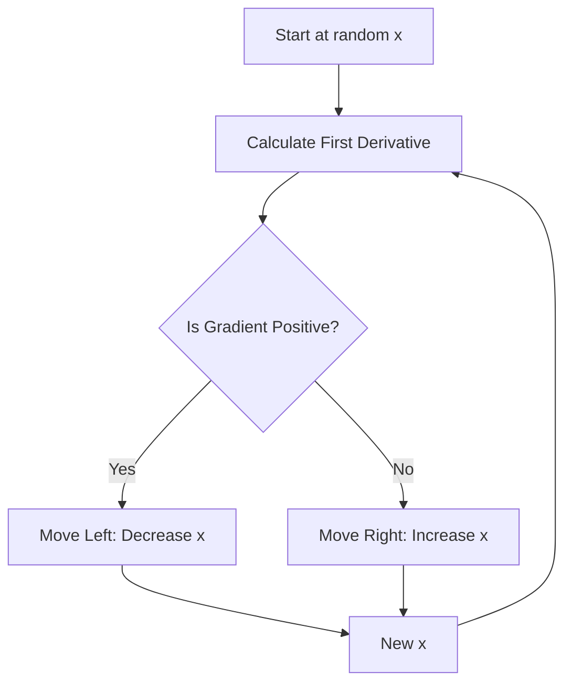

> [!info]+ Interview questions covered
> - What is the intuition behind Gradient Descent?
> - How does the first derivative help in optimization?
> - Why do we move in the opposite direction of the gradient?

### Minimization vs. Maximization

The tutor emphasizes that in machine learning, we are almost always interested in **minimization**. We want to find the minimum of the error function. 

He provides a counter-example using the function $f(x) = -x^2$. In this case, the point at $x=0$ is a **maximum**, and the minimum is at $-\infty$. Gradient descent is specifically designed to "descend" to the lowest possible value, which is why we focus on convex-like cost functions where a clear minimum exists.

| Concept | Description | Goal in ML |
| :--- | :--- | :--- |
| **Minimum** | The lowest point in a function. | Target (Zero Error) |
| **Maximum** | The highest point in a function. | Avoided (Max Error) |
| **Optimization** | The process of finding the best parameters. | Minimizing Cost |

### The Mechanics of Optimization: A Worked Example

To understand the math, we simplify the problem by focusing on a single variable $x$, ignoring weights and biases for a moment.

**Step 1: Define the Cost Function**
We use $f(x) = x^2$. Our goal is to find the value of $x$ that results in the minimum value of $f(x)$, which we know is $0$.

**Step 2: Random Initialization**
We start at an arbitrary point, for example, $x = 3$. At this point, $f(3) = 9$.

**Step 3: Determine the Direction**
We need to update $x$ to move towards the minimum. The update rule is conceptually:
$$x_{new} = x_{old} \pm \text{something}$$

The "something" consists of the gradient and a step size (learning rate). However, the tutor stresses that the **direction** is more important than the exact value of the step in the initial stages. By calculating the derivative at $x=3$, we find it is positive, telling us we must **decrease** $x$ to move towards $0$.

> [!info]+ Interview questions covered
> - What is a cost function?
> - Why is the direction of the update more important than the magnitude initially?
> - What happens if we start with a random initialization in Gradient Descent?

***

### Recap
- **Gradient Descent** is an iterative optimization algorithm used to find the minimum of a cost function.
- The **First Derivative** (gradient) provides the slope, which indicates the direction of the steepest ascent.
- We move in the **opposite direction** of the gradient to perform descent.
- The process involves: **Initialization → Gradient Calculation → Parameter Update → Iteration**.

### Glossary
- **Cost Function**: A mathematical formula that measures the "error" or "cost" of a model's predictions compared to actual targets.
- **First Derivative**: The rate of change of a function; visually, the slope of the curve at a point.
- **Minimum**: The point where the function reaches its lowest value.
- **Optimization**: The act of making a system or design as effective or functional as possible.

### Interview Q&A
**Q: Can Gradient Descent be used for maximization?**
**A:** Yes, it would be called "Gradient Ascent." However, in machine learning, we typically define an error or loss function that we want to minimize, so Gradient Descent is the standard.

**Q: What is the significance of the "valley" analogy?**
**A:** It helps visualize the cost function surface. The goal is to find the global minimum (the bottom of the valley) by following the local slope (the gradient) at each step.

**Q: Why do we use $f(x) = x^2$ as a starting example?**
**A:** It is a simple, convex function with a clear global minimum at $x=0$, making it ideal for demonstrating how gradients point towards the minimum from either side.


## Gradient Descent, Optimization, Derivatives, First Derivative, Minimization

In the process of training a machine learning model, the ultimate goal is to find the parameters that minimize the loss function. This process is known as **optimization**. While we know we need to update our parameters (like $x = x \pm \text{something}$), the most critical first step is determining the correct **direction** of that update.

### The Problem of Direction: Plus or Minus?

When we have a parameter $x$ and we want to reach the minimum of a curve (the cost function), we need to decide whether to increase or decrease $x$.

$$x = x \pm \text{something}$$

The "something" represents the magnitude of the step, but before we worry about how far to move, we must know which way to go. If we are on the right side of the minimum, we need to move left (decrease $x$). If we are on the left side, we need to move right (increase $x$).

### The Solution: The First Derivative

The **first derivative** of a function at a given point tells us the slope of the tangent at that point. This slope is the key to determining the direction of descent.

*   **Positive Slope ($f'(x) > 0$):** The function is increasing as $x$ increases. To decrease the function value, we must move in the opposite direction—to the left (decrease $x$).
*   **Negative Slope ($f'(x) < 0$):** The function is decreasing as $x$ increases. To continue decreasing the function value, we must move in the same direction—to the right (increase $x$).

> [!info]+ Interview questions covered
> - How do derivatives help in the optimization of machine learning models?
> - In gradient descent, how do you determine whether to add or subtract from a parameter?

### Worked Example: Minimizing $f(x) = x^2$

Let's look at a concrete example using the function $f(x) = x^2$. We know the minimum of this function is at $x = 0$, where $f(0) = 0$.

#### Scenario 1: Starting from the Right ($x = 3$)
1.  **Current State**: $x = 3, f(3) = 9$.
2.  **Calculate Derivative**: $f'(x) = 2x$. At $x = 3$, $f'(3) = 6$.
3.  **Determine Direction**: Since the derivative (6) is positive, the function is increasing to the right. To minimize, we must move **left** (decrease $x$).
4.  **Update**: $x = 3 - 1 = 2$ (assuming a step size of 1).

#### Scenario 2: Starting from the Left ($x = -1$)
1.  **Current State**: $x = -1, f(-1) = 1$.
2.  **Calculate Derivative**: $f'(x) = 2x$. At $x = -1$, $f'(-1) = -2$.
3.  **Determine Direction**: Since the derivative (-2) is negative, the function is decreasing to the right. To minimize, we must move **right** (increase $x$).
4.  **Update**: $x = -1 + 1 = 0$.

#### Iterative Optimization Table
The following table illustrates the steps taken to reach the minimum:

| Step | $x$ | $f(x)$ | $f'(x)$ (Slope) | Direction to Move |
| :--- | :--- | :--- | :--- | :--- |
| 1 | 3 | 9 | 6 | Left (Negative) |
| 2 | 2 | 4 | 4 | Left (Negative) |
| 3 | -1 | 1 | -2 | Right (Positive) |
| 4 | 0 | 0 | 0 | **Reached Minimum** |

### The General Rule of Gradient Descent

The fundamental rule that drives machine learning optimization is that we always move in the **opposite direction of the derivative**.

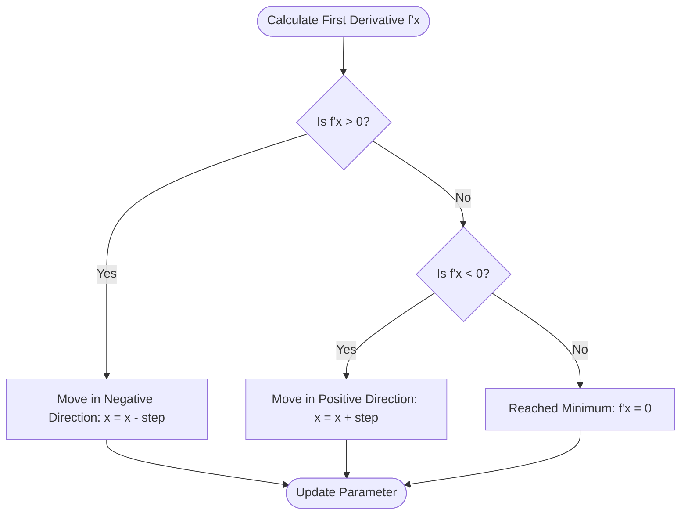

#### Summary of Directions
| Derivative Sign | Function Trend | Required Move | Update Logic |
| :--- | :--- | :--- | :--- |
| Positive ($+$) | Increasing | Left | $x = x - \text{step}$ |
| Negative ($-$) | Decreasing | Right | $x = x + \text{step}$ |

This simple logic—using the first derivative to guide the direction—is what allows us to "train" models by iteratively adjusting weights and biases until the error (loss) is as small as possible. Note that while the derivative tells us the **direction**, the "extent" or magnitude of the move (often called the **learning rate**) is a separate parameter that we will discuss in later sections.

> [!info]+ Interview questions covered
> - What is the significance of a zero derivative in optimization?
> - Why do we move in the opposite direction of the gradient?

### Glossary

*   **Optimization**: The process of adjusting model parameters to minimize (or maximize) a specific function.
*   **Gradient Descent**: An iterative optimization algorithm used to find the minimum of a function by moving in the direction of steepest descent.
*   **First Derivative**: The rate of change of a function; geometrically, the slope of the tangent line.
*   **Minimization**: The goal of finding the input values that result in the smallest possible output of a function (usually the loss function in ML).
*   **Slope**: Another term for the derivative at a point, indicating the steepness and direction of the curve.


## Derivatives, Gradient Descent, Cost Function, Optimization, Minimization

To build an LLM, we need to optimize its parameters to minimize error. This process is driven by **Gradient Descent**, which uses derivatives to determine the direction and magnitude of updates required to reach the minimum of a cost function.

### The Goal: Minimizing the Cost Function

The "Cost Function" (or Loss Function) represents the error of our model. Our objective in training is **minimization**: finding the values of our parameters (like weights and biases) that result in the lowest possible cost.

The tutor uses a simple parabolic function to illustrate this:
$$f(x) = x^2$$

In this example, $x$ represents a parameter we want to optimize, and $f(x)$ is the cost. The minimum of this function is at $x = 0$. If we start at a random point, say $x = 3$, we need a systematic way to "descend" toward zero.

### Using Derivatives for Direction

A derivative tells us the slope of the function at any given point. For $f(x) = x^2$, the derivative is:
$$f'(x) = 2x$$

By calculating the derivative at our current position, we can determine which way to move:

1. **Calculate the slope**: At $x = 3$, the derivative $f'(3) = 2(3) = 6$.
2. **Determine direction**: Since the derivative (6) is positive, the function is increasing as $x$ increases. To minimize the function, we must move in the **opposite direction**.

#### The "Opposite Direction" Rule
*   If the derivative is **positive** (+ve), move in the **negative** (-ve) direction.
*   If the derivative is **negative** (-ve), move in the **positive** (+ve) direction.

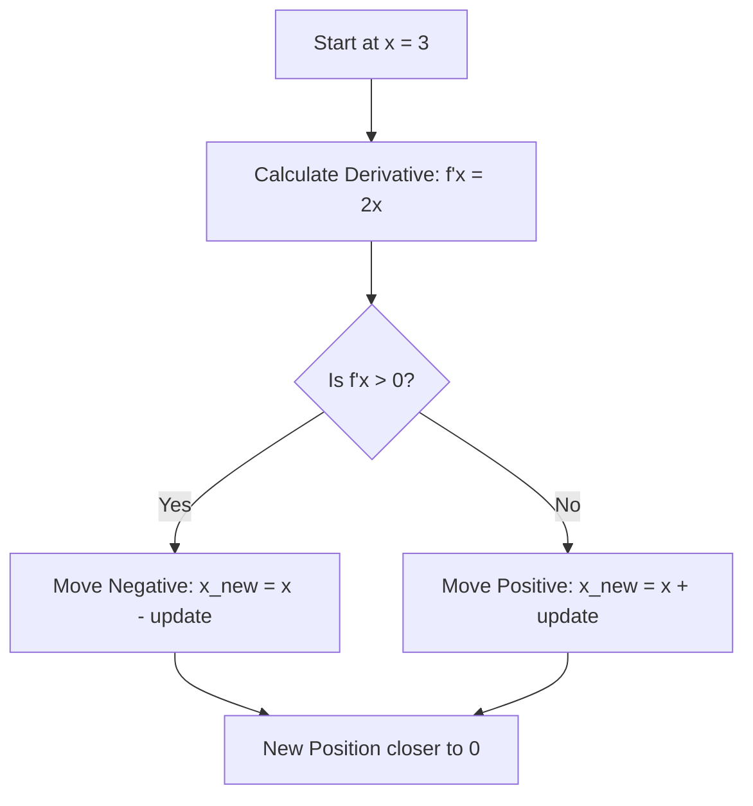

> [!info]+ Interview questions covered
> - How do derivatives help in the optimization of a neural network?
> - Why do we move in the opposite direction of the gradient in gradient descent?

### The Gradient Descent Update Rule

To automate this movement, we use the gradient descent update formula. This formula combines the direction (from the derivative) and the step size (from the learning rate).

#### The Learning Rate ($\alpha$)
The **Learning Rate** (denoted as $\alpha$) is a hyperparameter that defines the **magnitude** of our step. It determines how fast or slow we move toward the minimum.

#### The Update Equation
The standard update rule is:
$$x = x - \alpha \cdot f'(x)$$

Why is it always "minus"?
*   If $f'(x)$ is positive, $x - (\text{positive value})$ decreases $x$ (moving left).
*   If $f'(x)$ is negative, $x - (\text{negative value})$ increases $x$ (moving right).

The sign of the derivative automatically handles the direction, provided that **$\alpha$ is always positive**. If $\alpha$ were negative, it would flip the direction and cause the model to move away from the minimum.

#### Implementation Example
From the Python implementation shown in the lecture:

```python
x = 3
alpha = 0.1

# Step 1: Apply the update rule
# x = x - alpha * derivative
x = x - alpha * 6
print(x) # Output: 2.4
```

In this step, $x$ moves from 3 to 2.4, bringing it closer to the minimum at 0.

> [!info]+ Interview questions covered
> - What is the role of the learning rate in gradient descent?
> - What happens if the learning rate is negative?
> - Write the update rule for a single parameter in gradient descent.

***

### Recap
*   **Optimization** is the process of minimizing the cost function.
*   **Derivatives** provide the slope, which tells us the direction of the steepest ascent.
*   **Gradient Descent** moves in the opposite direction of the derivative to find the minimum.
*   The **Update Rule** ($x = x - \alpha \cdot \text{derivative}$) uses the learning rate to control the step size.

### Glossary
*   **Cost Function**: A mathematical formula that measures the error of the model.
*   **Derivative**: The rate of change of a function; used here to find the slope.
*   **Gradient Descent**: An iterative optimization algorithm for finding the local minimum of a function.
*   **Learning Rate ($\alpha$)**: A scalar that determines the size of the steps taken toward the minimum.

### Interview Q&A
**Q: Why is the derivative essential for training neural networks?**
A: The derivative tells us how the cost function changes with respect to each parameter. Without it, we wouldn't know whether to increase or decrease a weight to reduce the error.

**Q: In the update rule $w = w - \alpha \cdot \frac{\partial L}{\partial w}$, what does the term $\alpha$ represent?**
A: $\alpha$ is the learning rate. It scales the gradient to control how much we update the weight in each iteration. Choosing the right $\alpha$ is crucial: too small and training is slow; too large and the model might overshoot the minimum.


## Gradient Descent, Learning Rate, Derivatives, Optimization, Alpha

In this section, we bridge the gap between the mathematical theory of gradient descent and its practical implementation in code. We explore how the update rule works, the critical role of the learning rate ($\alpha$), and why dynamic optimization is necessary for training modern models like LLMs.

### The Gradient Descent Update Rule in Code

The mathematical formula for updating a parameter (like weight $w$ or bias $b$) is translated directly into code. The core idea is to move the parameter in the opposite direction of the gradient to reach the minimum of the loss function.

From VS Code editor showing the Python implementation:
```python
# Update the weight
self.w = self.w - self.alpha * self.dw

# Update the bias
self.b = self.b - self.alpha * self.db
```

In this implementation:
*   `self.w` and `self.b` are the current parameters.
*   `self.alpha` ($\alpha$) is the **learning rate**.
*   `self.dw` and `self.db` are the **derivatives** (gradients) of the loss with respect to the parameters.

The subtraction sign (`-`) is crucial: it ensures that if the derivative is positive (slope is upward), we decrease the parameter, and if the derivative is negative (slope is downward), we increase it.

> [!info]+ Interview questions covered
> - How do you implement the weight update rule in gradient descent?
> - Why do we subtract the gradient from the weight instead of adding it?

### Understanding the Role of Alpha ($\alpha$)

The learning rate, denoted by the Greek letter alpha ($\alpha$), is a hyperparameter that controls the **magnitude** of the update. While the derivative ($\frac{dy}{dx}$) provides the **direction**, $\alpha$ determines how large a step we take in that direction.

#### Why is $\alpha$ necessary?
In machine learning, the magnitudes of gradients can often be extremely small (e.g., $0.00000000001$). If we only used the derivative to update weights, the steps would be so tiny that the model might take "100 years" to reach the minimum. Alpha scales these small values to a range that allows for practical convergence.

| Component | Role |
| :--- | :--- |
| **Derivative** ($\frac{dy}{dx}$) | Determines the **direction** (positive or negative). |
| **Alpha** ($\alpha$) | Determines the **magnitude** (step size). |

### Worked Example: $f(x) = x^2$

To visualize the update, consider the function $f(x) = x^2$. Its derivative is $f'(x) = 2x$.

1.  **Starting Point**: Let $x = 3$.
2.  **Calculate Derivative**: $f'(3) = 2(3) = 6$.
3.  **Update Rule**: $x_{new} = x_{old} - \alpha \cdot f'(x_{old})$.
4.  **Calculation**: If we set $\alpha = 0.1$, then $x_{new} = 3 - (0.1 \cdot 6) = 2.4$.

As we can see, $x$ has moved from 3 toward the minimum at $x=0$.

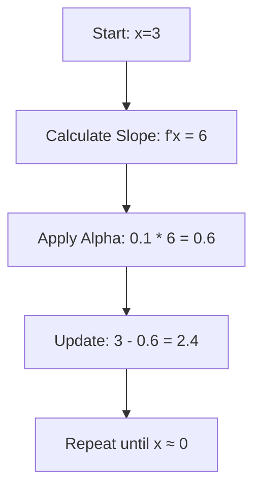

### Convergence and the "Vanishing" Problem

If the derivative becomes vanishingly small, the update step becomes negligible. This is a common challenge in deep learning. Without a properly tuned $\alpha$, the model may stop learning altogether because the weights are no longer changing significantly.

Conversely, if $\alpha$ is too large, the model might "jump" over the minimum and fail to converge, oscillating back and forth across the valley of the cost function.

### Dynamic Alpha and Hyperparameter Tuning

In modern optimization, we often use a **Dynamic Alpha** rather than a fixed one. 

*   **Early Training**: We want to move **fast** when we are far from the minimum, so we use a larger $\alpha$ (e.g., $\alpha = 5$ in a toy example).
*   **Near Convergence**: As we approach the minimum, we want to move **slowly** to avoid overshooting, so we decrease $\alpha$ (e.g., $\alpha = 0.001$).

```mermaid
flowchart LR
    Start[Far from Minimum] --> Fast[Large Alpha / Fast Steps]
    Fast --> Near[Near Minimum]
    Near --> Slow[Small Alpha / Precise Steps]
    Slow --> Goal[Global Minimum]
```

The optimal value for $\alpha$ is typically found through experimentation. Different models require different starting points:
*   **Image Models**: May use specific $\alpha$ schedules.
*   **LLMs / Linear Regression**: Often start with values like $0.001$ or $0.005$.

> [!info]+ Interview questions covered
> - What is the learning rate ($\alpha$) and why is it important?
> - What happens if the learning rate is too high or too low?
> - What is a dynamic learning rate?

### Recap
*   The update rule is $w = w - \alpha \cdot \frac{dL}{dw}$.
*   The derivative provides the direction; alpha provides the magnitude.
*   Alpha must always be positive.
*   Dynamic learning rates help models converge faster and more accurately.

### Glossary
*   **Gradient Descent**: An optimization algorithm that follows the negative of the gradient to find the minimum of a function.
*   **Learning Rate ($\alpha$)**: A hyperparameter that scales the gradient during weight updates.
*   **Derivative**: The rate of change of a function, used here to find the slope of the loss curve.
*   **Convergence**: The state where the model's parameters have stabilized and the loss is at its minimum.
*   **Hyperparameter**: A parameter set before the training process begins (like $\alpha$), as opposed to learned weights.

### Interview Q&A
**Q: Why is the learning rate called a hyperparameter?**
**A:** Unlike weights and biases, which are "learned" by the model during training, the learning rate is set by the engineer *before* training starts. It controls the learning process itself.

**Q: Can $\alpha$ be negative?**
**A:** No. Alpha should always be positive. The negative sign in the update formula ($w - \alpha \cdot grad$) already handles moving in the opposite direction of the gradient. A negative alpha would cause the model to move *away* from the minimum.

**Q: How do you choose the best alpha?**
**A:** It is largely a matter of experimentation. Engineers typically try a range of values (e.g., $0.1, 0.01, 0.001$) and use techniques like learning rate scheduling or dynamic adjustment to find the most efficient path to convergence.

## Gradient Descent, Backpropagation, Weights, Bias, Learning Rate

In this concluding section of the lecture, we transition from the theoretical foundations of calculus and derivatives to the practical application of these concepts in training machine learning models. We explore the universal training loop, the role of optimizers, and the mathematical distinction between updating weights and biases.

### The Gradient Descent Update Rule

The fundamental rule for updating any parameter in a model using gradient descent is:

$$x_{new} = x_{old} - \alpha \cdot f'(x_{old})$$

Or more generally:
$$x_{new} = x_{old} - \alpha \cdot \nabla f(x_{old})$$

This update rule consists of two critical components that dictate how we navigate the loss landscape:

1.  **Direction**: Provided by the **first derivative** ($f'(x)$). It tells us whether to increase or decrease the parameter value to move toward the minimum.
2.  **Magnitude (Step Size)**: Controlled by the **learning rate** ($\alpha$). It determines how large a step we take in the calculated direction.

| Component | Mathematical Term | Role in Optimization |
| :--- | :--- | :--- |
| **Direction** | $f'(x)$ (Derivative) | Tells us *where* to move. |
| **Magnitude** | $\alpha$ (Learning Rate) | Tells us *how much* to move. |

> [!info]+ Interview questions covered
> - What are the two main components of the gradient descent update rule?
> - How does the learning rate affect model convergence?

---

### The Universal Machine Learning Training Loop

Every machine learning model, regardless of complexity, follows a consistent iterative process to minimize loss. This is often referred to as the "Training Loop."

#### Conceptual Steps
1.  **Initialize the weights**: Start with random or zero values for parameters ($W$ and $b$).
2.  **Repeat until loss is minimized**:
    *   **Forward Pass**: Make a prediction and calculate the loss.
    *   **Backward Pass**: Calculate the gradients (derivatives of the loss with respect to parameters).
    *   **Update Weights**: Use an optimizer to adjust the weights using the gradients and learning rate.

#### Visualizing the Training Flow

```mermaid
graph TD
    A[Initialize Weights] --> B[Calculate Loss]
    B --> C[Calculate Gradients - Backward Pass]
    C --> D[Update Weights - Optimizer]
    D --> E{Loss Minimized?}
    E -- No --> B
    E -- Yes --> F[Final Model]
```

#### Framework Implementation (PyTorch Style)
Modern libraries like PyTorch and TensorFlow encapsulate these steps into high-level methods, making implementation straightforward:

```python
for epoch in range(epochs):
    # 1. Forward pass: Make prediction and calculate loss
    y_pred = model(x_train)
    loss = loss_fn(y_pred, y_train)

    # 2. Backward pass: Compute gradients
    optimizer.zero_grad() # Reset gradients from previous step
    loss.backward()       # Calculate new gradients

    # 3. Update weights: Step in the direction of the gradient
    optimizer.step()
```

> [!info]+ Interview questions covered
> - Describe the standard training loop in a deep learning framework.
> - What is the purpose of the 'backward' pass in neural network training?

---

### The Role of the Optimizer

While we can manually implement the update rule ($W = W - \alpha \cdot dW$), we typically use an **Optimizer** (e.g., Adam, SGD) to handle this process efficiently.

Optimizers are designed to reach the minimum as quickly as possible. They often include advanced features like:
*   **Dynamic Learning Rate**: Adjusting $\alpha$ automatically during training.
*   **Learning Rate Decay**: Gradually decreasing $\alpha$ as the model approaches the minimum to prevent overshooting.
*   **Momentum**: Helping the model navigate through "noisy" gradients.

> [!info]+ Interview questions covered
> - Why do we use optimizers instead of simple gradient descent?
> - What is learning rate decay and why is it useful?

---

### Transitioning to Real Models: $J(W, b)$

Up to this point, we have used the simple example of $f(x) = x^2$. In actual machine learning, our cost function $J$ is a function of multiple parameters—specifically **Weights ($W$)** and **Biases ($b$)**.

$$J = f(W, b)$$

The update rules for these parameters are:
$$W = W - \alpha \cdot \frac{\partial J}{\partial W}$$
$$b = b - \alpha \cdot \frac{\partial J}{\partial b}$$

#### Why $dW$ and $db$ are Calculated Differently
In the implementation of these gradients, you will notice a distinct difference in the operations used for weights versus biases.

*   **Weights ($W$)**: Since weights are multiplied by the input features ($X$) in the forward pass ($W \cdot X + b$), their gradient involves a multiplication with $X$. In vectorized code, this is implemented as a **dot product**.
*   **Bias ($b$)**: Since the bias is an independent additive term, its gradient does not depend on $X$. It is calculated by **summing** the errors across the entire dataset.

**From `compute_gradient` implementation:**
```python
def compute_gradient(x, y, w, b):
    m = x.shape[0]
    dj_dw = 0
    dj_db = 0
    
    for i in range(m):
        f_wb = w * x[i] + b
        # Gradient for weight involves the input x[i]
        dj_dw_i = (f_wb - y[i]) * x[i]
        # Gradient for bias is independent of x[i]
        dj_db_i = f_wb - y[i]
        
        dj_db += dj_db_i
        dj_dw += dj_dw_i
        
    return dj_dw / m, dj_db / m
```

**Vectorized Version (NumPy):**
```python
# Weight gradient uses dot product with input X
dW = (1 / m) * np.dot(X, (A - Y).T)

# Bias gradient uses simple summation of errors
db = (1 / m) * np.sum(A - Y)
```

> [!info]+ Interview questions covered
> - Why does the weight gradient calculation involve the input features while the bias gradient does not?
> - How do you implement gradient calculation for linear regression in a vectorized way?

---

### Recap and Looking Ahead

In this section, we unified the concepts of derivatives, learning rates, and the training loop. We saw how high-level frameworks like PyTorch automate the "backward" pass and "optimization" steps, while understanding the underlying math of how $W$ and $b$ are updated.

**Key Takeaways:**
*   The **Training Loop** is an iterative cycle of initialization, loss calculation, gradient computation, and parameter updates.
*   **Optimizers** like Adam manage the learning rate dynamically to speed up convergence.
*   **Weights** are tied to input features, requiring dot products for gradient calculation, while **Biases** are independent scalars.

In the next session, we will dive deep into the **Chain Rule** to formally derive these gradient formulas for complex neural networks.

---

### Glossary

*   **Learning Rate ($\alpha$)**: A hyperparameter that controls how much to change the model in response to the estimated error each time the model weights are updated.
*   **Backward Pass (Backpropagation)**: The process of calculating the gradient of the loss function with respect to the weights of the network.
*   **Optimizer**: An algorithm or method used to change the attributes of the neural network such as weights and learning rate to reduce the losses.
*   **Vectorization**: The process of performing mathematical operations on entire arrays (matrices) at once rather than looping through individual elements.

---

### Interview Q&A

**Q: What happens if the learning rate is too high?**
**A:** If the learning rate is too high, the model may overshoot the minimum, causing the loss to oscillate or even diverge (increase) rather than converge.

**Q: Why do we need to call `optimizer.zero_grad()` in PyTorch?**
**A:** By default, PyTorch accumulates gradients on subsequent backward passes. We call `zero_grad()` to reset the gradients to zero before starting a new backward pass for the current iteration.

**Q: What is the difference between a parameter and a hyperparameter?**
**A:** Parameters (like weights $W$ and bias $b$) are learned by the model from the data during training. Hyperparameters (like learning rate $\alpha$ or the number of epochs) are set by the developer before training begins.

## Gradient Descent, Convergence, Learning Rate, Plateau, Underfitting

To optimize a model, we must understand the mechanics of how it learns from data. This involves defining the properties of the cost function, implementing the update rule correctly, and recognizing the limits of training through concepts like convergence, plateaus, and the trade-off between overfitting and underfitting.

### Cost Function Properties

For a cost function to be useful in gradient descent, it must satisfy two primary mathematical properties: it must be **continuous** and **differentiable**.

*   **Continuous**: There should be no breaks or jumps in the function.
*   **Differentiable**: We must be able to calculate the derivative (slope) at any point on the curve.

The derivative is what tells us the direction and steepness of the function. If the function is not differentiable, we cannot calculate the gradient, and the model cannot "know" which way to move the weights to reduce the error.

From Excalidraw whiteboard:
```python
dw = 1/m (A - Y) . X^T
db = 1/m np.sum(A - Y)
```

> [!info]+ Interview questions covered
> - What are the necessary properties of a cost function for gradient descent?
> - Why do we square the error in cost functions like MSE? (Answer: To ensure the function is continuous and differentiable, making it easier to calculate gradients).

### The Gradient Descent Update Rule

The core of the optimization process is the update rule, which adjusts the weights ($w$) and biases ($b$) iteratively.

#### The Role of the Learning Rate ($\alpha$)
The update rule is defined as:
$$w = w - \alpha \cdot dw$$
$$b = b - \alpha \cdot db$$

Where:
*   **$dw$ (Derivative)**: Provides the **direction** of the update. A positive gradient means the function is increasing, so we move in the opposite direction (subtracting) to decrease the cost.
*   **$\alpha$ (Learning Rate)**: Controls the **magnitude** or "step size" of the update.

The tutor emphasizes that the learning rate is crucial for stability. Without $\alpha$, the raw derivative values ($dw$) might be too large, causing the weights to jump erratically (what the tutor calls "randomness") and potentially overshoot the minimum. By scaling the derivative with a small $\alpha$ (e.g., 0.01 or 0.1), we ensure the updates stay within a "safer range" for smooth convergence.

```mermaid
graph LR
    A[Current Weight w] --> B[Calculate Gradient dw]
    B --> C[Scale by Alpha: alpha * dw]
    C --> D[Subtract from w: w - alpha*dw]
    D --> E[Updated Weight w]
    E --> A
```

> [!info]+ Interview questions covered
> - What is the role of the learning rate in gradient descent?
> - How does the derivative determine the direction of weight updates?

### Monitoring Training and Convergence

Training a model is an iterative process. We monitor the **loss** over time to see if the model is converging towards a minimum.

#### The Training Loop
In a typical implementation, we perform a forward pass to calculate predictions and loss, followed by a backward pass (backpropagation) to calculate gradients, and finally update the parameters.

From a Jupyter notebook implementation:
```python
for i in range(10000):
    # forward pass
    z1 = np.dot(X, W1) + b1
    a1 = np.tanh(z1)
    z2 = np.dot(a1, W2) + b2
    exp_scores = np.exp(z2)
    probs = exp_scores / np.sum(exp_scores, axis=1, keepdims=True)
    
    # loss
    correct_logprobs = -np.log(probs[range(num_examples), y])
    data_loss = np.sum(correct_logprobs)
    loss = data_loss / num_examples
    
    # backprop
    dscores = probs
    dscores[range(num_examples), y] -= 1
    dscores /= num_examples
    
    dW2 = np.dot(a1.T, dscores)
    db2 = np.sum(dscores, axis=0, keepdims=True)
    
    da1 = np.dot(dscores, W2.T)
    dz1 = da1 * (1 - np.power(a1, 2))
    
    dW1 = np.dot(X.T, dz1)
    db1 = np.sum(dz1, axis=0, keepdims=True)
    
    # update
    W1 = W1 - 0.01 * dW1
    b1 = b1 - 0.01 * db1
    W2 = W2 - 0.01 * dW2
    b2 = b2 - 0.01 * db2
    
    if i % 1000 == 0:
        print(i, loss)
```

#### Hitting a Plateau
A **plateau** occurs when the gradient becomes zero or very close to it. At this point, the update ($w = w - \alpha \cdot 0$) results in no change to the weights. This is the goal of optimization: reaching the minimum of the cost function where the slope is flat.

> [!info]+ Interview questions covered
> - What does it mean when a model hits a plateau during training?
> - How do you know when a gradient descent algorithm has converged?

### Overfitting vs. Underfitting

Understanding how well a model generalizes to new data is critical. The tutor uses the analogy of a student preparing for an exam.

#### Overfitting: "Remembering the Syllabus"
Overfitting happens when a model fits the training data **too perfectly**. It captures the noise and specific details of the training set rather than the underlying pattern.
*   **Analogy**: A student who memorizes every question and answer in the textbook (the syllabus) but fails when asked a slightly different question in the exam.
*   **Visual**: A complex, wiggly line that passes through every single data point.
*   **Result**: Zero or near-zero training error, but very high error on new (test) data.

#### Underfitting: "Too Simple to Learn"
Underfitting occurs when the model is **too simple** to capture the pattern in the data.
*   **Example**: Trying to fit a straight line (linear model) to data that follows a curve (parabolic distribution).
*   **Visual**: A straight line that misses most of the data points because it cannot bend to follow the curve.
*   **Result**: High error on both training and test data.

| Concept | Model Complexity | Training Error | Generalization |
| :--- | :--- | :--- | :--- |
| **Underfitting** | Too Low | High | Poor |
| **Optimal Fit** | Just Right | Low | Good |
| **Overfitting** | Too High | Near Zero | Poor |

```mermaid
graph TD
    A[Data Pattern] --> B{Model Complexity}
    B -- Too Simple --> C[Underfitting: High Bias]
    B -- Just Right --> D[Optimal Generalization]
    B -- Too Complex --> E[Overfitting: High Variance]
```

> [!info]+ Interview questions covered
> - Explain the difference between overfitting and underfitting.
> - What is the "memorization" problem in machine learning?

### Practical Convergence and Minimum Error

In real-world scenarios, the training error may **never reach zero**. This is often due to the distribution of the data itself.

*   **Non-Uniform Data**: If data points are scattered and do not lie perfectly on a single line or curve, there will always be some residual error (residuals).
*   **Convergence Threshold**: Instead of waiting for zero error, we often set a threshold (e.g., `if error < 0.001: break`) or a fixed number of iterations.
*   **The Plateau**: As shown in the "Loss vs Iteration" plots, the error often drops quickly at first and then flattens out (plateaus) at a value like 0.15 or 0.2. This is the **optimum value** for that specific model and dataset.

```python
# Convergence check example
for i in range(1000):
    # ... training logic ...
    if error < 0.001:
        print(f'Converged at iteration {i}')
        break
```

The decision of how many iterations to run (e.g., 1000 vs 2000) is a **hyperparameter** decided by the developer based on observing the loss curve.

> [!info]+ Interview questions covered
> - Why might the loss function never reach zero in practice?
> - What are hyperparameters, and give an example related to training loops.

### Recap
*   **Cost Function**: Must be continuous and differentiable to allow for gradient calculation.
*   **Update Rule**: $w = w - \alpha \cdot dw$. The derivative ($dw$) provides direction, while the learning rate ($\alpha$) scales the magnitude for stability.
*   **Convergence**: Reaching a plateau where the gradient is zero, indicating the model has found a minimum.
*   **Overfitting**: The model memorizes training data ("remembering the syllabus") but fails to generalize to new data.
*   **Underfitting**: The model is too simple to capture the underlying data pattern (e.g., a straight line for a curve).

### Glossary
*   **Gradient Descent**: An optimization algorithm used to minimize a cost function by iteratively moving in the direction of the steepest descent.
*   **Learning Rate ($\alpha$)**: A hyperparameter that determines the step size at each iteration while moving toward a minimum of a loss function.
*   **Plateau**: A region where the gradient of the cost function is zero or near-zero, causing weight updates to stall.
*   **Hyperparameter**: A configuration variable that is external to the model and whose value cannot be estimated from data (e.g., learning rate, number of iterations).
*   **Residuals**: The difference between the observed value and the predicted value in a model.


## Cost Function, Gradient Descent, Linear Models, Root Mean Squared Error, Optimization

This section concludes the foundational discussion on optimization, focusing on the practical mechanics of gradient descent, the mathematical necessity of the chain rule, and the critical distinction between a model's functional form and its cost function.

### The Goal of Optimization: Finding the Optimum

In practice, a loss function does not always reach zero. The "optimum" value is the lowest possible loss achievable given the specific data and model architecture.

- **Reaching the Plateau**: During training, the model might reach a point where the loss value (e.g., 0.15) cannot be reduced further. This indicates that the model has reached the optimum for the current dataset.
- **Stopping Criteria**: Once the loss stabilizes at this minimum value, the optimization process stops.

### The Mechanics of Gradient Descent: Direction and Magnitude

Gradient descent relies on two primary components to update model parameters: the **first derivative** and the **learning rate ($\alpha$)**.

#### 1. Direction (The First Derivative)
The first derivative of the cost function determines the **direction** in which the parameters should move to minimize the loss. It tells the model whether to increase or decrease the weights ($w$) and bias ($b$).

#### 2. Magnitude (The Learning Rate)
The learning rate, denoted as $\alpha$ (alpha), determines the **magnitude** or size of the step taken in that direction. 
- If $\alpha$ is too large, the model might overshoot the minimum.
- If $\alpha$ is too small, the model will take too long to converge.

#### The Role of the Chain Rule
To calculate the gradients for parameters like $w$ and $b$ in a linear model ($y = wx + b$), we must use the **Chain Rule**. This mathematical tool allows us to propagate the error from the output back through the model to determine how much each individual parameter contributed to the total loss.

```mermaid
graph TD
    A[Input x] --> B[Linear Model: y = wx + b]
    B --> C[Prediction y_pred]
    C --> D[Cost Function: MSE]
    D --> E[Calculate Gradients via Chain Rule]
    E --> F[Update w and b]
    F --> G[New Prediction]
    G --> B
```

> [!info]+ Interview questions covered
> - What is the difference between the direction and magnitude in gradient descent?
> - Why is the chain rule necessary for training neural networks?
> - What happens if the learning rate ($\alpha$) is set too high or too low?

### Model Function vs. Cost Function

A common point of confusion is the relationship between the model's functional form and the cost function used to optimize it. These two components are **independent**.

#### The Linear Model
The model defines the relationship between input and output. For a simple linear regression, the model is:
$$y = wx + b$$
This defines a straight line in a coordinate system.

#### The Cost Function (MSE)
The cost function measures the error between the prediction and the actual target. For most regression tasks, we use **Mean Squared Error (MSE)** or **Root Mean Squared Error (RMSE)**. 
Even if the model is linear, the cost function is typically quadratic:
$$f(x) = x^2$$

#### Why Use a Quadratic Cost Function?
The parabolic (U-shaped) nature of the $x^2$ function is ideal for optimization because:
1. **Convexity**: It has a single global minimum, ensuring that gradient descent will always find the bottom if the learning rate is appropriate.
2. **Reliable Gradients**: The derivative of a parabola provides a clear, continuous direction toward the minimum.

| Feature | Model Function (e.g., Linear) | Cost Function (e.g., MSE) |
| :--- | :--- | :--- |
| **Purpose** | Defines the input-output relationship. | Measures the error/loss. |
| **Form** | Can be linear ($wx + b$), polynomial, etc. | Typically quadratic ($x^2$). |
| **Role in Training** | Used to generate predictions. | Used to calculate gradients for updates. |

> [!info]+ Interview questions covered
> - Is the cost function dependent on the functional form of the model?
> - Why is Mean Squared Error (MSE) represented as a quadratic function?
> - What is a convex function, and why is it important for optimization?

### Conclusion and Next Steps

The mathematical foundations covered so far—derivatives, gradient descent, and the chain rule—form the "math that works behind the scenes." Understanding these concepts is essential before moving into the implementation phase. In the next session, the focus will shift from these theoretical foundations to building and training neural networks and Large Language Models (LLMs) from scratch.

***

### Recap
- **Optimum vs. Zero**: Loss doesn't always hit zero; the goal is the lowest possible value (optimum).
- **Update Rule**: $w = w - \alpha \cdot \text{gradient}$. The gradient (derivative) provides the direction; $\alpha$ provides the step size.
- **Chain Rule**: Essential for calculating how much each weight ($w$) and bias ($b$) needs to change.
- **Independence**: The model ($y = wx + b$) and the cost function ($f(x) = x^2$) are distinct components.

### Glossary
- **Alpha ($\alpha$)**: The learning rate; a hyperparameter that controls the step size in gradient descent.
- **Chain Rule**: A formula from calculus used to find the derivative of a composite function.
- **Convex Function**: A function where any line segment between two points on the graph lies above or on the graph (e.g., a U-shape).
- **Optimum**: The best possible value (minimum loss) the model can achieve.

### Interview Q&A

**Q: Why do we say the first derivative only gives the direction and not the magnitude?**
**A:** The derivative tells us the slope of the function at a specific point. While the magnitude of the slope changes, in the context of the gradient descent update rule, the actual "step size" taken in the parameter space is the product of the derivative and the learning rate ($\alpha$). Therefore, $\alpha$ is the primary controller of the step magnitude.

**Q: Can we use a linear cost function for a linear model?**
**A:** While theoretically possible, linear cost functions (like raw error) are problematic because they don't provide a clear "bottom" or minimum that gradient descent can easily find. Quadratic functions like MSE create a convex surface with a clear minimum, making optimization much more stable.

**Q: What is the role of the Chain Rule in backpropagation?**
**A:** Backpropagation is essentially an application of the Chain Rule. It allows us to calculate the gradient of the loss function with respect to every weight in the network by breaking down the complex, nested functions of the model into individual derivatives that can be multiplied together.


---

## Timeline

| Time | Section |
| ---- | ------- |
| `0:03` – `9:47` | [Gradient Descent, Y_Prediction, Weights, Bias, Supervised Learning](#gradient-descent-yprediction-weights-bias-supervised-learning) |
| `9:47` – `18:59` | [Linear Regression, Linear Pattern, Data Visualization, Scatter Plot, Bias](#linear-regression-linear-pattern-data-visualization-scatter-plot-bias) |
| `18:59` – `25:05` | [Linear Regression, Bias, Gradient Descent, Weights, Nnparameter](#linear-regression-bias-gradient-descent-weights-nnparameter) |
| `25:05` – `29:42` | [Bias, Linear Regression, Model Training, Y_Prediction, Weight Initialization](#bias-linear-regression-model-training-yprediction-weight-initialization) |
| `29:42` – `38:31` | [Bias, Linear Regression, Weights, Y_Prediction, Nnparameter](#bias-linear-regression-weights-yprediction-nnparameter) |
| `38:31` – `41:47` | [Cost Function, Average Error, Mean Raw Error, Error, Batch Processing](#cost-function-average-error-mean-raw-error-error-batch-processing) |
| `41:47` – `51:26` | [Mean Absolute Error, Loss Functions, Mae, Root Mean Squared Error, Nullification](#mean-absolute-error-loss-functions-mae-root-mean-squared-error-nullification) |
| `51:26` – `56:17` | [Calculus, Tangent Line, First Derivative, Slope, Derivatives](#calculus-tangent-line-first-derivative-slope-derivatives) |
| `56:17` – `59:41` | [First Derivative, Gradient Descent, Cost Function, Minimization, Increasing And Decreasing Functions](#first-derivative-gradient-descent-cost-function-minimization-increasing-and-decreasing-functions) |
| `59:41` – `1:08:12` | [Gradient Descent, Optimization, Derivatives, Slope, Iterations](#gradient-descent-optimization-derivatives-slope-iterations) |
| `1:08:12` – `1:14:20` | [Gradient Descent, First Derivative, Cost Function, Minimum, Optimization](#gradient-descent-first-derivative-cost-function-minimum-optimization) |
| `1:14:20` – `1:19:19` | [Gradient Descent, Optimization, Derivatives, First Derivative, Minimization](#gradient-descent-optimization-derivatives-first-derivative-minimization) |
| `1:19:19` – `1:22:53` | [Derivatives, Gradient Descent, Cost Function, Optimization, Minimization](#derivatives-gradient-descent-cost-function-optimization-minimization) |
| `1:22:53` – `1:31:33` | [Gradient Descent, Learning Rate, Derivatives, Optimization, Alpha](#gradient-descent-learning-rate-derivatives-optimization-alpha) |
| `1:31:33` – `1:38:45` | [Gradient Descent, Backpropagation, Weights, Bias, Learning Rate](#gradient-descent-backpropagation-weights-bias-learning-rate) |
| `1:38:45` – `1:48:04` | [Gradient Descent, Convergence, Learning Rate, Plateau, Underfitting](#gradient-descent-convergence-learning-rate-plateau-underfitting) |
| `1:48:04` – `1:55:32` | [Cost Function, Gradient Descent, Linear Models, Root Mean Squared Error, Optimization](#cost-function-gradient-descent-linear-models-root-mean-squared-error-optimization) |

## Interview Questions Covered

Total: 107 questions across 17 sections.

### Gradient Descent, Y_Prediction, Weights, Bias, Supervised Learning

- What are the main steps in the machine learning training process?
- Why is the training process described as iterative?
- What is the role of weights and bias in a linear regression model?
- How does weight initialization affect the starting state of a model?
- What is the difference between the training phase and the inference phase?
- When can you stop the training process?
- Why is it useful to use synthetic data when building a model from scratch?
- What is a typical train-test split ratio, and why is it used?

### Linear Regression, Linear Pattern, Data Visualization, Scatter Plot, Bias

- How do you generate synthetic data for linear regression in Python?
- Why is adding noise important when generating synthetic datasets for machine learning?
- Why is data visualization important before selecting a machine learning model?
- What does a scatter plot tell you about the relationship between variables?
- What is a Pandas DataFrame, and why is it used in ML pipelines?
- What is the purpose of the `df.head()` function?
- What is the role of the bias term ($b$) in a linear regression model?
- What happens to a linear model if you set the bias to zero?
- Define supervised learning in the context of linear regression.
- What is meant by "labeled data" in machine learning?

### Linear Regression, Bias, Gradient Descent, Weights, Nnparameter

- What is the standard linear equation used in a single neuron?
- What do the terms 'weight' and 'bias' represent in a linear model?
- Why is a bias term necessary in linear regression?
- What happens to a linear model if the bias term is set to zero?
- What is the role of `requires_grad=True` in PyTorch?
- Walk through the steps of a standard training loop in PyTorch.
- Why do we need to zero the gradients in each iteration?

### Bias, Linear Regression, Model Training, Y_Prediction, Weight Initialization

- What is the difference between model training and inference?
- Why is batch processing preferred over processing single data points?
- Explain the role of gradients in updating model weights.
- What happens if the learning rate is too high or too low?

### Bias, Linear Regression, Weights, Y_Prediction, Nnparameter

- What is the difference between $y_{actual}$ and $y_{pred}$?
- Define the basic linear regression equation used in machine learning.
- What is bias in a linear model?
- Why can't we just use $y = wx$ for all linear regression tasks?
- How does bias provide "freedom" to a model?
- How do you find the optimal values for $w$ and $b$?
- What is the role of the learning rate ($\alpha$) in gradient descent?
- What are the update rules for weights and biases in optimization?

### Cost Function, Average Error, Mean Raw Error, Error, Batch Processing

- What is the difference between an error and a cost function?
- How do you calculate the cost function for a batch of data?
- Why is Mean Raw Error (MRE) rarely used as a cost function in practice?
- What is the problem of error cancellation in cost functions?

### Mean Absolute Error, Loss Functions, Mae, Root Mean Squared Error, Nullification

- What is error nullification in the context of loss functions?
- Why is Mean Raw Error not a suitable metric for training machine learning models?
- Define Mean Absolute Error (MAE) and provide its formula.
- What are the advantages of MAE over Mean Raw Error?
- Compare MAE and MSE. When would you prefer one over the other?
- Why is MSE more suitable for Gradient Descent than MAE?
- What is a cost function in machine learning?
- How do weight (w) and bias (b) affect the cost function?

### Calculus, Tangent Line, First Derivative, Slope, Derivatives

- What is the role of derivatives in machine learning?
- How do derivatives help in cost function minimization?
- What does the sign of the first derivative indicate about a function?
- What is the geometric interpretation of a derivative?

### First Derivative, Gradient Descent, Cost Function, Minimization, Increasing And Decreasing Functions

- How does the first derivative help in the optimization of a cost function?
- What does a positive vs. negative first derivative indicate about a function's behavior?
- In the context of Gradient Descent, how do we determine the direction of movement?

### Gradient Descent, Optimization, Derivatives, Slope, Iterations

- How does the sign of the derivative determine the direction of movement in optimization?
- What does a positive slope indicate about a function's behavior at a specific point?
- What is the difference between Gradient Descent and Gradient Ascent?
- Why do we focus on minimization in machine learning?
- Describe the steps involved in a single iteration of Gradient Descent.
- What does "clubbing the error" mean in the context of batch processing?
- Why is the derivative recalculated in every iteration?

### Gradient Descent, First Derivative, Cost Function, Minimum, Optimization

- What is the intuition behind Gradient Descent?
- How does the first derivative help in optimization?
- Why do we move in the opposite direction of the gradient?
- What is a cost function?
- Why is the direction of the update more important than the magnitude initially?
- What happens if we start with a random initialization in Gradient Descent?

### Gradient Descent, Optimization, Derivatives, First Derivative, Minimization

- How do derivatives help in the optimization of machine learning models?
- In gradient descent, how do you determine whether to add or subtract from a parameter?
- What is the significance of a zero derivative in optimization?
- Why do we move in the opposite direction of the gradient?

### Derivatives, Gradient Descent, Cost Function, Optimization, Minimization

- How do derivatives help in the optimization of a neural network?
- Why do we move in the opposite direction of the gradient in gradient descent?
- What is the role of the learning rate in gradient descent?
- What happens if the learning rate is negative?
- Write the update rule for a single parameter in gradient descent.

### Gradient Descent, Learning Rate, Derivatives, Optimization, Alpha

- How do you implement the weight update rule in gradient descent?
- Why do we subtract the gradient from the weight instead of adding it?
- What is the learning rate ($\alpha$) and why is it important?
- What happens if the learning rate is too high or too low?
- What is a dynamic learning rate?

### Gradient Descent, Backpropagation, Weights, Bias, Learning Rate

- What are the two main components of the gradient descent update rule?
- How does the learning rate affect model convergence?
- Describe the standard training loop in a deep learning framework.
- What is the purpose of the 'backward' pass in neural network training?
- Why do we use optimizers instead of simple gradient descent?
- What is learning rate decay and why is it useful?
- Why does the weight gradient calculation involve the input features while the bias gradient does not?
- How do you implement gradient calculation for linear regression in a vectorized way?

### Gradient Descent, Convergence, Learning Rate, Plateau, Underfitting

- What are the necessary properties of a cost function for gradient descent?
- Why do we square the error in cost functions like MSE? (Answer: To ensure the function is continuous and differentiable, making it easier to calculate gradients).
- What is the role of the learning rate in gradient descent?
- How does the derivative determine the direction of weight updates?
- What does it mean when a model hits a plateau during training?
- How do you know when a gradient descent algorithm has converged?
- Explain the difference between overfitting and underfitting.
- What is the "memorization" problem in machine learning?
- Why might the loss function never reach zero in practice?
- What are hyperparameters, and give an example related to training loops.

### Cost Function, Gradient Descent, Linear Models, Root Mean Squared Error, Optimization

- What is the difference between the direction and magnitude in gradient descent?
- Why is the chain rule necessary for training neural networks?
- What happens if the learning rate ($\alpha$) is set too high or too low?
- Is the cost function dependent on the functional form of the model?
- Why is Mean Squared Error (MSE) represented as a quadratic function?
- What is a convex function, and why is it important for optimization?

## Code Blocks Index

Unique code/console/mermaid blocks: 49 (deduplicated by content).

| Section | Block count |
| ------- | ----------- |
| `00_gradient_descent_y_prediction_weights_bias_supervised_learni` | 4 |
| `01_linear_regression_linear_pattern_data_visualization_scatter_` | 4 |
| `02_linear_regression_bias_gradient_descent_weights_nnparameter` | 4 |
| `03_bias_linear_regression_model_training_y_prediction_weight_in` | 7 |
| `04_bias_linear_regression_weights_y_prediction_nnparameter` | 4 |
| `05_cost_function_average_error_mean_raw_error_error_batch_proce` | 1 |
| `06_mean_absolute_error_loss_functions_mae_root_mean_squared_err` | 3 |
| `07_calculus_tangent_line_first_derivative_slope_derivatives` | 1 |
| `08_first_derivative_gradient_descent_cost_function_minimization` | 1 |
| `09_gradient_descent_optimization_derivatives_slope_iterations` | 3 |
| `10_gradient_descent_first_derivative_cost_function_minimum_opti` | 1 |
| `11_gradient_descent_optimization_derivatives_first_derivative_m` | 1 |
| `12_derivatives_gradient_descent_cost_function_optimization_mini` | 2 |
| `13_gradient_descent_learning_rate_derivatives_optimization_alph` | 3 |
| `14_gradient_descent_backpropagation_weights_bias_learning_rate` | 4 |
| `15_gradient_descent_convergence_learning_rate_plateau_underfitt` | 5 |
| `16_cost_function_gradient_descent_linear_models_root_mean_squar` | 1 |

## Glossary

Auto-generated from canonical concepts seen across the lecture. Definitions are extracted from the first paragraph in which each concept appears.

- **gradient descent**: Gradient Descent, Y_Prediction, Weights, Bias, Supervised Learning _(occurrences: 140)_
- **optimization**: | Term | Definition | | :--- | :--- | | **Supervised Learning** | A type of machine learning where the model is trained on labeled data (inputs paired with correct outputs). | | **Gradient Descent** | An optimization algorithm used to minimize the loss function by iteratively adjusting model parameters. _(occurrences: 65)_
- **bias**: Gradient Descent, Y_Prediction, Weights, Bias, Supervised Learning _(occurrences: 61)_
- **linear regression**: [!info]+ Interview questions covered > - What is the role of weights and bias in a linear regression model? > - How does weight initialization affect the starting state of a model? _(occurrences: 61)_
- **derivatives**: Manual Implementation (NumPy) From `update_weights` shown in VS Code: ```python def update_weights(m, b, X, Y, learning_rate): m_deriv = 0 b_deriv = 0 N = len(X) for i in range(N): # Calculate partial derivatives # -2x(y - (mx + b)) m_deriv += -2*X[i] * (Y[i] - (m*X[i] + b)) _(occurrences: 59)_
- **cost function**: Cost Function, Average Error, Mean Raw Error, Error, Batch Processing _(occurrences: 47)_
- **learning rate**: Update parameters using learning rate m -= (m_deriv / float(N)) * learning_rate b -= (b_deriv / float(N)) * learning_rate _(occurrences: 45)_
- **weights**: Gradient Descent, Y_Prediction, Weights, Bias, Supervised Learning _(occurrences: 41)_
- **loss functions**: Mean Absolute Error, Loss Functions, Mae, Root Mean Squared Error, Nullification _(occurrences: 37)_
- **first derivative**: Calculus, Tangent Line, First Derivative, Slope, Derivatives _(occurrences: 35)_
- **weight updates**: Why use synthetic data?** Before working with complex real-world datasets, synthetic data provides a controlled environment to test the mechanics of weight updates and optimization. By defining a known linear pattern with added noise, we can observe how close our model's predictions come to the ground truth. _(occurrences: 27)_
- **slope**: Weight ($w$)**: The slope of the line, determining the strength of the relationship between $x$ and $y$. * **Bias ($b$)**: The y-intercept, allowing the model to shift the prediction up or down independently of the input. _(occurrences: 27)_
- **y_prediction**: Gradient Descent, Y_Prediction, Weights, Bias, Supervised Learning _(occurrences: 21)_
- **iterations**: 4. The Iterative Loop** Initially, the model predicts 0 for every input. _(occurrences: 21)_
- **linear models**: Cost Function, Gradient Descent, Linear Models, Root Mean Squared Error, Optimization _(occurrences: 20)_
- **backpropagation**: Glossary - **Weight ($W$)**: A learnable parameter that scales the input signal. - **Bias ($b$)**: A learnable parameter that allows the linear transformation to be shifted away from the origin. _(occurrences: 19)_
- **weight initialization**: [!info]+ Interview questions covered > - What is the role of weights and bias in a linear regression model? > - How does weight initialization affect the starting state of a model? _(occurrences: 18)_
- **root mean squared error**: Mean Absolute Error, Loss Functions, Mae, Root Mean Squared Error, Nullification _(occurrences: 18)_
- **nnparameter**: Linear Regression, Bias, Gradient Descent, Weights, Nnparameter _(occurrences: 17)_
- **calculus**: 1. **Initialization**: Start with random or zero values for $W$ and $b$. _(occurrences: 17)_
- **mean absolute error**: Q: If my model has a Mean Raw Error of zero, does it mean the model is perfect?** **A:** Not necessarily. A Mean Raw Error of zero could mean the model is perfect, but it could also mean that the positive errors and negative errors perfectly canceled each other out (e.g., one prediction was $+10$ off and another was $-10$ off). _(occurrences: 17)_
- **minimization**: [!info]+ Interview questions covered > - What is the role of derivatives in machine learning? > - How do derivatives help in cost function minimization? _(occurrences: 16)_
- **error minimization**: (referenced in lecture; no definition extracted)
- **convergence**: | Term | Definition | | :--- | :--- | | **Supervised Learning** | A type of machine learning where the model is trained on labeled data (inputs paired with correct outputs). | | **Gradient Descent** | An optimization algorithm used to minimize the loss function by iteratively adjusting model parameters. _(occurrences: 13)_
- **data visualization**: Linear Regression, Linear Pattern, Data Visualization, Scatter Plot, Bias _(occurrences: 13)_
- **mae**: Q: If my model has a Mean Raw Error of zero, does it mean the model is perfect?** **A:** Not necessarily. A Mean Raw Error of zero could mean the model is perfect, but it could also mean that the positive errors and negative errors perfectly canceled each other out (e.g., one prediction was $+10$ off and another was $-10$ off). _(occurrences: 13)_
- **error cancellation**: The Problem of Error Cancellation _(occurrences: 12)_
- **linear pattern**: To practice these concepts, we can generate synthetic data that follows a linear pattern. This allows us to know the "ground truth" and verify if our model learns correctly. _(occurrences: 12)_
- **gradients**: 1. **Initialize Weights**: Assign initial values to the model's parameters (weights and bias). _(occurrences: 12)_
- **parameter updates**: Manual Gradient Descent Loop To demystify the `fit` method, the tutor demonstrates a manual training loop. This loop explicitly shows the calculation of the prediction, the squared error loss, and the parameter updates using a **learning rate**. _(occurrences: 12)_
