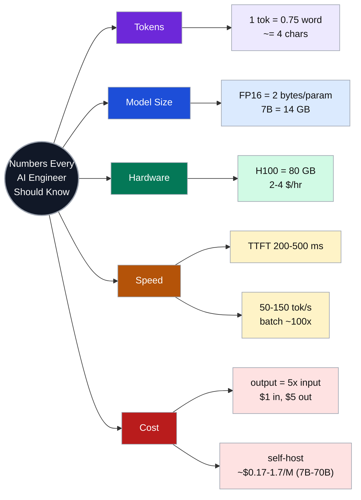
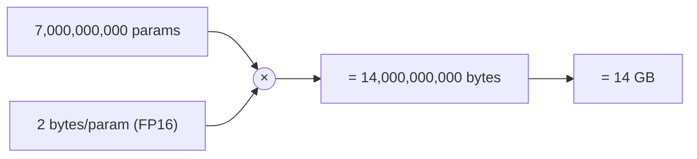
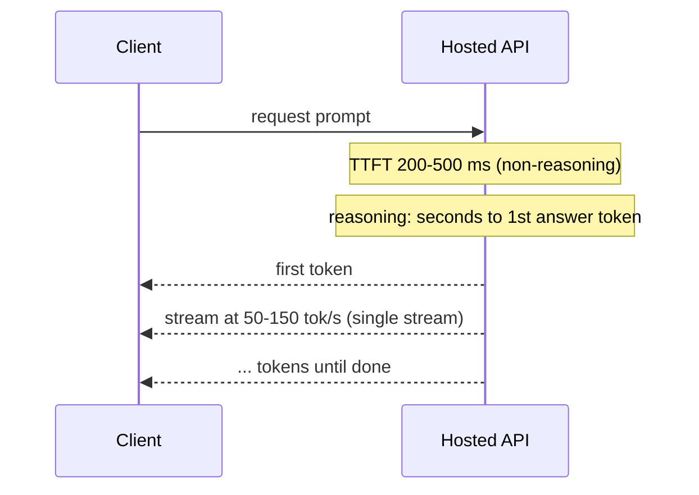
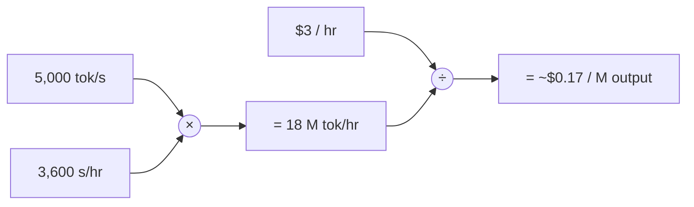
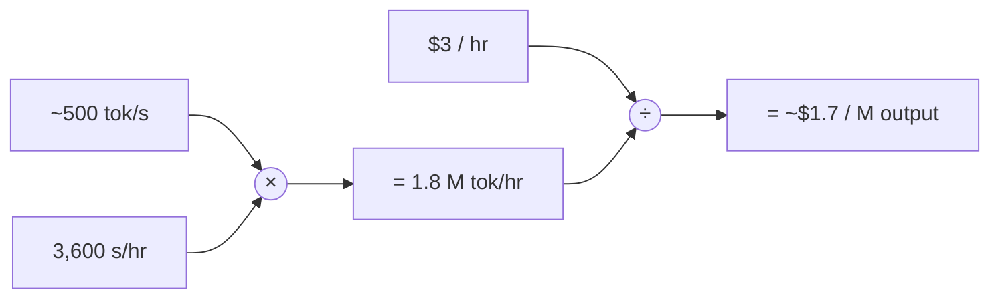

# Numbers Every AI Engineer Should Know

Back-of-envelope baseline numbers for AI system-design estimation.
Rounded on purpose (estimation first, precision later).



## Contents

1. [Tokens and Text](#tokens-and-text)
2. [Bytes per Parameter](#bytes-per-parameter)
3. [GPU Memory and Hourly Cost](#gpu-memory-and-hourly-cost)
4. [Throughput and Latency Anchors](#throughput-and-latency-anchors)
5. [Cost per Million Tokens](#cost-per-million-tokens)

---

## Tokens and Text

```text
THE TOKEN RULER   ( 1 token ~= 4 chars ~= 0.75 words )

"The quick brown fox jumps over the lazy dog"

split into ~4-char chunks (each chunk ~= 1 token):
[The ][quic][k br][own ][fox ][jump][s ov][er t][he l][azy ][dog]

1 token  ===  ~4 characters  ===  ~0.75 word
```

```text
1 word              #  ~1.3 tok
1 page (500 words)  #######################  ~700 tok
book (150k words)   ##########################################  ~200,000 tok
```

---

## Bytes per Parameter

```text
8 bits = 1 byte
FP32  32 bits  / 8  =  4 bytes
FP16  16 bits  / 8  =  2 bytes
INT8   8 bits  / 8  =  1 byte
INT4   4 bits  / 8  =  0.5 bytes
```

```text
STORE 0.3927 AT EACH PRECISION

FP32  0.3925790   4 bytes
FP16  0.39258     2 bytes
INT8  0.393       1 byte
INT4  0.40        0.5 byte
```

```text
7B WEIGHTS (GB)
FP32 4 bytes/param  ####################################  28 GB
FP16 2 bytes/param  ##################  14 GB
INT8 1 byte/param   #########  7 GB
INT4 .5 bytes/param ####  3.5 GB

70B WEIGHTS (GB)
FP32 4 bytes/param  ####################################  280 GB
FP16 2 bytes/param  ##################  140 GB
INT8 1 byte/param   #########  70 GB
INT4 .5 bytes/param ####  35 GB
```

- 70B = 10x the 7B at every precision.



```text
WHAT FITS WHERE  (weights only)

3.5 GB  INT4 7B   ->  fits   8 GB consumer GPU
 14 GB  FP16 7B   ->  fits   24 GB card (e.g. 4090)
 35 GB  INT4 70B  ->  fits   40 GB A100
 70 GB  INT8 70B  ->  fits   80 GB H100
140 GB  FP16 70B  ->  needs  2x 80 GB GPUs
```

---

## GPU Memory and Hourly Cost

```text
GPU MEMORY (GB) + ON-DEMAND $/hr
Apple M      16 GB laptop    #####  16 GB
RTX 4090     24 GB consumer  ########  24 GB   $/hr 0.30-0.70
RTX 5090     32 GB consumer  ##########  32 GB   $/hr 0.60-1.00
A100         40 GB cloud     ############  40 GB   $/hr 1.00-3.00
A100         80 GB cloud     #########################  80 GB   $/hr 1.00-3.00
H100         80 GB cloud     #########################  80 GB   $/hr 2.00-4.00
Apple M5Max 128 GB laptop    ########################################  128 GB
```

---

## Throughput and Latency Anchors

```text
NETWORK ROUND-TRIP (RTT)
same region     1-5 ms     both ends in the same datacenter region
transatlantic   ~80 ms     US <-> Europe (NY-London round-trip ~70-80 ms)
US-Australia    200+ ms    roughly halfway around the globe
```

```text
SERVING
TTFT hosted API              200-500 ms
reasoning model, 1st token   ~1 s
```

```text
TOKENS / SEC
human reading         #  4-6 tok/s         (200-300 words/min)
single-stream 7B      ###########  50-150 tok/s      (good GPU)
batched H100 2023-24  ####################  1,000-3,000 tok/s
batched H100 2026     #########################  5,000-15,000 tok/s  (vLLM / SGLang / FP8)
```

- Batching is the multiplier: ~100x single stream.



- Perceived speed = TTFT + (tokens / decode rate).

---

## Cost per Million Tokens

```text
CLAUDE LINEUP — $/MILLION TOKENS (June 2026)

Haiku 4.5 (small)
  in   $1   ░
  out  $5   █████

Sonnet 4.6 (mid)
  in   $3   ░░░
  out  $15  ███████████████

Opus 4.8 (large)
  in   $5   ░░░░░
  out  $25  █████████████████████████

Fable 5 (frontier)
  in   $10  ░░░░░░░░░░
  out  $50  ██████████████████████████████████████████████████
```

- Output ≈ 5x input at every tier.

### Self-hosted worked example: one H100



- 5,000 tok/s is realistic for a batched 7B on an H100 in 2026.
- Self-host output (~$0.17 / M) undercuts hosted output ($5 - 50 / M) by ~30-300x - but that's a 7B, not a frontier model; the real trade is model quality, plus ops effort and idle-GPU risk.

### A 70B model: the self-host sweet spot



- 70B (INT8) fits one 80 GB H100; ~10x the 7B's weights means ~10x slower decode, so ~10x the cost/token.
- ~$1.7 / M still beats hosted ($5 - 50 / M) with far stronger quality than a 7B - the practical self-host sweet spot.
